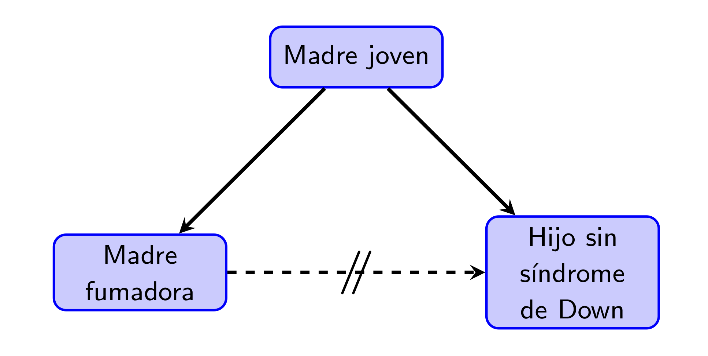
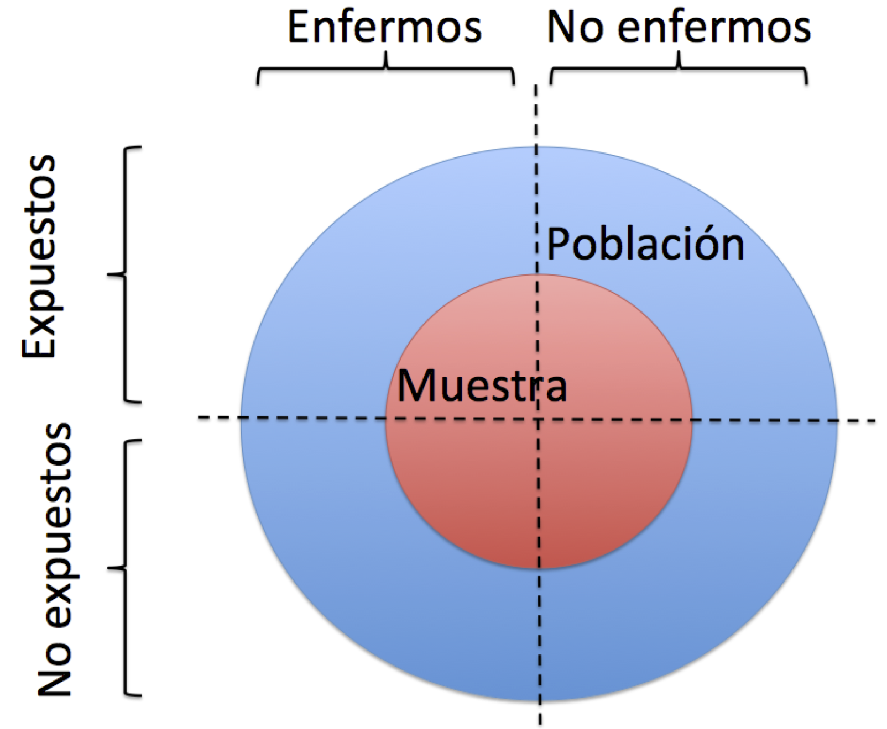

# (PART\*) Tema I: Introducción a los estudios médicos  {-}

# Estudios médicos


Un **estudio** es un proceso cuyo objetivo es obtener evidencia empírica sobre alguna cuestión. En el caso de los estudios **médicos** que nos ocupan en este curso, esta cuestión puede tratar sobre la efectividad de un tratamiento de una determinada enfermedad, la precisión de un test diagnóstico, las causas de una enfermedad, alguna cuestión de salud pública... 

## Pasos de un estudio médico

Para ir calentando motores, vamos a describir brevemente la estructura habitual de un estudio médico, y lo ilustraremos con el artículo "Marcha nórdica para prevención cardiovascular en pacientes con cardiopatía isquémica crónica o síndrome metabólico" de C. Vehí y colaboradores (*Medicina Clínica* 147 (2016), pp. 537-539) que tendríais que ir consultando en paralelo con esta sección: lo encontraréis [aquí](https://www.sciencedirect.com/science/article/pii/S0025775316305024) o [aquí](https://walkim.es/wp-content/uploads/2018/03/MN-EN-PREVENCIO_.MED_.CLIN_.2016.pdf)).


1. Definir los **objetivos** de la investigación. En este primer paso,

    * Se define la hipótesis general que se quiere investigar
    * Se concretan los objetivos específicos dentro de este marco general
    
    En el artículo que estamos siguiendo a modo de ejemplo, la hipótesis general es que el ejercicio físico es efectivo en la prevención de riesgos cardiovasculares, y el objetivo específico es estudiar si la marcha nórdica reduce los factores de riesgo cardio-vascular (FRCV) en el área sanitaria mediterránea.

1. Investigar **antecedentes** sobre los objetivos específicos: ¿Qué se sabe sobre el tema hasta ahora?

    En nuestro ejemplo, los autores recogen algunos efectos generales de la matcha nórdica y luego afirman que "no hay datos de esta modalidad de ejercicio en el ámbito médico la población mediterránea". 

1. **Planificar** cómo se van a recoger los datos

    Encontraréis el detalle de este punto en el apartado **Material y métodos** del artículo: tipo de estudio, criterios de inclusión de los participantes, actividad que tenían que realizar los participantes, cómo se recogieron los datos, cómo se analizaron los datos.

1. Llevar a cabo dicho plan: **recoger** los datos

    Se lleva a cabo el estudio según el plan trazado

1. **Analizar** los datos.

    Los resultados de este análisis se recogen básicamente en la Tabla 2 del artículo

1. Extraer **conclusiones**

    Las encontraréis en el apartado de **Discusión y conclusiones** del artículo

1. **Publicar** los resultados

    Se publican los resultados del estudio en el artículo que estamos siguiendo.
    
Es un buen momento para volváis al artículo y observéis su estructura, típica de los artículos en ciencias experimentales. Se trata de la estructura **IMRaD**, acrónimo de:

* **Introducción**, donde se recogen los pasos 1 y 2 del proceso anterior

* **Metodología** ("Material y métodos", en este artículo concreto), donde se detallan los pasos 3 y 4

* **Resultados**, donde se explica el análisis de los datos y los resultados "numéricos" del mismo, sin extraer conclusiones aún (obtuvimos esto, esto, esto y esto)

* **Discusión** ("Discusión y conclusiones", en este artículo concreto),  donde se lleva a cabo el paso 5 del proceso de investigación

```{block2,type="rmdromans"}
¿Y la "a" en "IMRaD"? De *and*, naturalmente.
```

El artículo científico además tiene otras dos partes muy importantes:

* El **Resumen** (*Abstract*) al principio, que podríamos decir que lleva a cabo el último paso del proceso de investigación, la publicación de resultados, ya que es lo único que se lee en la mayoría de los casos, entrando solo en el detalle cuando nos interesa de verdad

* La **Bibliografía** al final, relacionada en parte con el paso 2 (los antecedentes).


## Tipos de estudios médicos


Podemos clasificar los estudios de diferentes maneras:

* Según el alcance que persiguen:

    * **Descriptivos**: Solo describen las características de un grupo de individuos

    * **Analíticos**: Intentan inferir asociaciones para el total de la población(entre causa/efecto, antecedente/resultado...)
    
    Por ejemplo:
    
    * "A una serie de pacientes con la enfermedad X les hemos administrado el tratamiento A y se han curado": *Descriptivo*
    * "Hemos dividido al azar un grupo de pacientes con la enfermedad  X en dos grupos; a unos les hemos administrado el tratamiento A y a los otros el tratamiento B; los tratados con A han tenido una tasa de curación en 8 días más alta que los tratados con B; inferimos que el tratamiento A es más efectivo que el B": *Analítico*
    

* Según el papel jugado por el investigador:

    * **Observacionales**: El investigador recoge información, sin ninguna influencia planificada sobre los acontecimientos

    * **Intervencionista**: El investigador influye en  los acontecimientos de manera planificada y observa el efecto de su influencia. A su vez, estos estudios los dividiremos en **expermientales** y **casi-experimentales**, pero ya daremos el detalle de este refinamiento más adelante.
    
    Por ejemplo:
    
    * "Hemos recogido datos de todos los pacientes con la enfermedad  X en nuestro hospital durante un año y anotado qué tratamiento se les administró; los tratados con A han tenido una tasa de curación en 8 días más alta que los tratados con B; inferimos que el tratamiento A es más efectivo que el B": *Observacional*
    * "Hemos dividido al azar un grupo de pacientes con la enfermedad  X en dos grupos; a unos les hemos administrado el tratamiento A y a los otros el tratamiento B; los tratados con A han tenido una tasa de curación en 8 días más alta que los tratados con B; inferimos que el tratamiento A es más efectivo que el B": *Intervencionista
    *
    
* Según el lapso de tiempo en el que se recoge la información:

    * **Transversales**: Se recoge información sobre un solo momento 

    * **Longitudinales**: Se recoge información sobre varios momentos de tiempo y se estudian los cambios producidos entre los mismos
    
    A su vez, estos últimos suelen dividirse en

        * **Prospectivos**: Se recoge información en momentos posteriores al inicio del estudio 

        * **Retrospectivos**: Se recoge información sobre momentos anteriores al inicio del estudio
        
```{example}
El estudio sobre la marcha nórdica de la sección anterior es:
  
* Analítico, puesto que su objetivo es inferir los efectos de la marcha nórdica en los factores de riesgo cardio-vascular (FRCV) para la población del área sanitaria mediterránea, no solo para los 23 participantes en el estudio
 
* Longitudinal propspectivo, puesto que se analizó información en el momento de iniciar el estudio y al cabo de un año

* Intervencionista, puesto que los investigadores influyeron en el comportamiento de los participantes al hacerles realizar unas sesiones de ejercicio

```
       
A continuación discutimos con más detalle algunos tipos básicos de estudios médicos.

## Estudios descriptivos

Los tres tipos principales de estudios descriptivos son

* **Informe de caso**: La descripción detallada de un paciente

* **Serie de casos**: Descripción detallada de un conjunto pequeño de pacientes con alguna característica en común que hace que tenga sendido el agruparlos

* **Encuesta** (*survey*): Descripción de un conjunto grande de individuos con alguna característica en común


Los estudios descriptivos sirven básicamente para identificar observaciones interesantes que merezcan ser investigadas.


```{example}
El artículo "Diabetes tipo 2 en niños. Serie de casos" de H. Manrique-Hurtado, P. Aro-Guardia y M. Pinto-Valdivia (*Revista Médica Herediana* 26 (2015), pp. 5-9), que podéis consultar [aquí](http://www.scielo.org.pe/pdf/rmh/v26n1/a02v26n1.pdf) es, como indica su título, un ejemplo típico de serie de casos. Se trata de una descripción detallada de las características de un grupo de 32 niños y adolescentes entre 8 y 19 años recién diagnosticados de diabetes tipo 2 (DM2) en dos hospitales de Lima (Perú) entre 2008 y 2013. Entre otras características, observaron que 85% de ellos (27) presentaban acantosis pigmentaria (un transtorno de la piel) y que un 17% (5 muchachos) tenían  cetoacidosis diabética (CAD) en el momento del diagnóstico, que suele ir asociada a diabetes de tipo 1 y no 2, y que los 5 tenían una serie de características comunes, por ejemplo todos tenían acantosis pigmentaria. 

Todas estas observaciones sirven para confirmar, o contradecir, observaciones realizadas en otros momentos u otros países sobre pacientes de DM2 en esta franja de edad, y además pueden plantear cuestiones sobre la DM2 en niños y adolescentes  que puedan ser susceptibles de responderse mediante estudios analíticos. ¿Es la acantosis pigmentaria un síntoma frecuente de DM2 entre niños y adolescentes? ¿Presentar CAD y acantosis pigmentaria es un síntoma de DM2 en vez de DM1?
```

## Estudios de casos y controles

En un estudio de casos y controles, se toma un grupo de individuos con una enfermedad  (los **casos**) y un grupo de individuos sin esta enfermedad (los **controles**), y se comparan retrospectivamente para encontrar diferencias en  la exposición a factores de riesgo en el pasado. El objetivo es determinar qué factores de riesgo fueron más frecuentes entre los casos que entre los controles, para inferir que, en la población general, la exposición a dichos factores está asociada a una mayor probabilidad de sufrir la enfermedad. 


````{example}
En un estudio de los primeros estudios de casos y controles [Norman Gregg](https://es.wikipedia.org/wiki/Norman_Gregg) comparó en 1941 78 **casos** de recién nacidos con cataratas congénitas de toda Australia con 100 **controles**, neonatos sin cataratas de su consulta médica. Observó que la proporción de casos en los que la madre había tenido la rubeola durante la primera parte del embarazo fue muy superior a la de los controles. 
```


```{r cataratas,echo=FALSE, out.width="75%"}
knitr::include_graphics("INREMDN_files/figure-html/cataratas.png")
```

Los estudios de casos y controles son:

**Observacionales**, porque se recogen datos y se analizan sin influir en las características que se han medido

**Analíticos**, puesto que el objetivo es deducir la asociación entre los factores de riesgo y la enfermedad a nivel poblacional

* **Longitudinales**, puesto que se analiza información a lo largo de un período de tiempo: desde el momento en que los sujetos son declarados casos o controles hacia el pasado, por lo que son **retrospectivos**. 

Veamos un estudio de casos y controles más reciente.

```{example}
En el estudio "Tabaquismo y fracaso del tratamiento de la tuberculosis pulmonar. Un estudio de casos y controles" (*Jornal Brasileiro de Pneumologia* 45.2 (2019), e20180359; se puede consultar [aquí](https://www.scielo.br/scielo.php?pid=S1806-37132019000200205&script=sci_arttext&tlng=es)), Juan Pablo Aguilar y colaboradores tomaron todos los pacientes que recibieron tratamiento contra la tuberculosis en un cierto instituto brasileño entre 2007 y 2015 y que además satisfacían algunas restricciones extra (mayores de 15 años, sin diabetes ni SIDA...). Definieron como **casos** aquellos pacientes en los que el tratamiento fracasó (según los criterios establecidos por la Directiva Nacional Brasileña para el Control de la Tuberculosis) y como **controles** aquellos pacientes en los que tuvo éxito. En total fueron 50 casos y 234 controles.

Se analizaron un buen número de antecedentes que pudieran tener influencia en el desarrollo del tratamiento de la tuberculosis: sexo, edad, historial  de fumador, historial de consumo de alcohol, salario etc. La única diferencia **significativa** (un término con un significado muy concreto, sobre el que volveremos más adelante en el curso, por ahora lo tomaremos con su sentido intuitivo) que encontraron fue en el fumar: un 52% de los casos eran fumadores en el momento del diagnóstico de la tuberculosis o lo habían sido antes, contra solo un 30% de los controles. En cambio, por ejemplo, eran consumidores frecuentes de alcohol en el momento del diagnóstico de la tuberculosis o lo habían sido antes un 59% de los casos y un 52% de los controles.

```

En este estudio, los números de casos y controles no se prefijaron en su diseño, sino que se tomaron "los que encontraron" en un grupo de individuos. Esto no siempre es así, y habrá que tenerlo en cuenta a la hora de realizar el análisis estadístico de los datos y presentar las conclusiones.

```{example}
Veamos el estudio "Efecto del alcohol y sus metabolitos en el cáncer de pulmón: estudio CAPUA" (*Medicina Clínica* 148 (2017), pp. 531-538) de Sara M.  Álvarez-Avellón y colaboradores. En él se incluyeron 876 **casos**, enfermos de cáncer de pulmón ingresados en una serie de hospitales asturianos entre 2000 y 2010, y 840 **controles**, pacientes que ingresaron en los mismos hospitales de los casos para cirugía, con enfermedades no relacionadas con ningún factor de riesgo conocido de cáncer de pulmón. Se les entrevistó para conocer sus hábitos alimentarios y de consumo de alcohol y tabaco y se les realizó un estudio genético de los polimorfismos de determinados genes que codifican enzimas participantes en el metabolismo del alcohol y el folato (un tipo de vitamina B). Copiamos algunas conclusiones:
  
```

> Un consumo de alcohol de 0.1-9.9 g/día disminuye el riesgo de cáncer de pulmón, aunque no se alcanza la significación estadística. 
> Un consumo de alcohol $\geq 30$ g/día y de tabaco $\geq 36$ paquetes/año aumenta significativamente el riesgo de cáncer de pulmón. 
> Un consumo elevado de verduras ($\geq 116.65$ g/día) disminuye el riesgo de cáncer de pulmón con un consumo de alcohol de 0.1-9.9 g/día. 
> Un consumo de alcohol de 10-29.9 g/día en individuos portadores del alelo *ADH1B 48His* aumenta el riesgo de cáncer de pulmón. 
> Etc.


```{block2,type="rmdcaution"}
Hemos dicho que la diferencia entre casos y controles es la presencia o no de una "enfermedad" y que se analiza su exposición previa a "factores de riesgo". Aquí tanto "enfermedad" como "factores de riesgo" se han de tomar en un sentido  metafórico. Los casos son individuos a los que les pasa "algo", que puede ser una enfermedad pero también puede ser un embarazo o suspender una asignatura, y se estudia "qué han hecho antes" para intentar adivinar una posible relación de causa-efecto.

Por ejemplo:

* Podemos querer estudiar si el fracaso escolar aumenta la probabilidad de ser fumador: tomamos como casos un grupo de fumadores y como controles un grupo de no fumadores, y consultamos su historial académico.

* Podemos querer estudiar si ser fumador aumenta la probabilidad de fracaso escolar: tomamos como casos un grupo de estudiantes que no hayan terminado la ESO y como controles un grupo que sí la hayan terminado, y les pedimos si fumaban, a qué edad empezaron, cuánto fumaban diariamente etc. 

```


Algunas **ventajas** de los estudios de casos y controles:

* Suelen ser fáciles de llevar a cabo, rápidos y baratos
* Son adecuados para estudiar enfermedades raras, poco frecuentes, ya que podemos partir de un grupo de enfermos y un grupo de sanos sin tener que esperar a encontrar los enfermos en una muestra de individuos.
* Podemos estudiar de golpe la asociación entre la exposición a muchos factores de riesgo y la enfermedad que nos ocupa.

Y ahora algunos inconvenientes:

* En primer lugar, no pueden "demostrar" que la exposición a un riesgo "cause" una enfermedad. Ni los estudios de casos y controles, ni ningún otro estudio observacional (ni, en realidad, en este mundo imperfecto en que vivimos, ningún estudio expeimental). Por ejemplo, en el estudio de casos y controles sobre consumo de alcohol y cáncer de pulmón observaron que entre los enfermos de cáncer de pulmón había una mayor frecuencia de sujetos que consumían más de 30 gramos diarios de alcohol más de  36 paquetes de tabaco anuales, y de aquí concluyen que


> Un consumo de alcohol $\geq 30$ g/día y de tabaco $\geq 36$ paquetes/año aumenta significativamente el riesgo de cáncer de pulmón.

Pero esta afirmación hay que entenderla. De ninguna manera están afirmando que un consumo de alcohol $\geq 30$ g/día y de tabaco $\geq 36$ paquetes/año "cause un aumento" del riesgo de cáncer de pulmón, sino simplemente que entre los individuos con estos malos hábitos hay una mayor frecuencia de cáncer de pulmón que en el resto de la población.

* Son muy susceptibles a **sesgos** (estudiaremos el tema de los sesgos en general con más detalle en la Lección \@ref(sec:sesgos)) en la recogida de datos:

    * Si los datos sobre exposición a riesgos se recogen mediante entrevistas o cuestionarios, los sujetos pueden mentir (recordad la máxima "Todo el mundo miente" del Dr. G. House), consciente (para ocultar comportamientos que consideren reprobables, para mirar de agradar al entrevistador,...) o inconscientemente (haber olvidado detalles relevantes)

   * En particular, se puede dar un **sesgo de memoria**, ya que casos y controles pueden recordar datos relevantes de manera diferente. Si uno tiene un percance, puede que recuerde más los detalles previos al mismo para buscar "qué hizo mal" que uno que no lo tenga.

   * También se puede dar un **sesgo de supervivencia**, si solo se estudian individuos "vivos". Por ejemplo, si queremos llevar a cabo un estudio d ecasos y controles para una enfermedad con una tasa de mortalidad al mes del diagnóstico muy alta y solo entrevistamos enfermos diagnosticados que estén vivos, puede que bastantes de ellos hayan sobrevivido mucho tiempo a la enfermedad y por lo tanto no sean "típicos".
   
* Hay que tener mucho cuidado en la selección de controles, intentando que se parezcan el máximo posible a los casos en características para las que no queramos estudiar la asociación con nuestra enfermedad. 

    Así, en el ejemplo sobre el fracaso del tratamiento de la tuberculosis, hubiera sido un error tomar como controles pacientes exitosos de otras clínicas, que pudieran seguir protocolos de tratamiento diferentes con tasas de éxito diferentes. O en el ejemplo de la asociación entre el consumo de alcohol y el cáncer de pulmón, fue preferible tomar como controles un grupo de enfermos de otras enfermedades en vez de un grupo de personas completamente sanas.
    
* En particular, los estudios de casos y controles son muy susceptibles al efecto de **confundidores**: Características asociadas con la exposición que pueden causar la enfermedad. Por ejemplo, en el caso de la asociación entre cataratas congénitas y rubeola materna, podría ser que la causa de las cataratas en los neonatos fuera el tratamiento de la rubeola, no la enfermedad. O por ejemplo, podríamos encontrar una asociación entre tomar café y tener cáncer de pulmón que fuera debida a que los consumidores de café tienden a ser fumadores y el fumar aumenta la probabilidad de cáncer de pulmón.


```{r benigni,echo=FALSE, out.width="75%", fig.cap="\"-Do you smoke? -Only when I drink [pausa] coffee.\" Roberto Benigni en  *Strange to meet you* de Jim Jarmusch; https://www.youtube.com/watch?v=pBa-2nXCc7g "}

```

````{example}
En el estudio de casos y controles "Congenital malformations and maternal smoking during pregnancy" (P. Shiono *et al*, *Teratology* 34 (1986), pp. 65-71) se observó que las madres fumadoras  tenían una frecuencia menor de hijos con síndrome de Down.  

```

```{r down1,echo=FALSE, out.width="75%"}
knitr::include_graphics("INREMDN_files/figure-html/Down1.png")
```

Más adelante (C. L Chen, T. Gilbert, R. Daling, "Maternal smoking and Down syndrome: the confounding effect of maternal age" *American Journal of Epidemiology* 149 (1999), pp. 442-446) se observó que no se había tenido en cuenta la edad de las madres: las madres jóvenes suelen ser fumadoras con mayor frecuencia que las no tan jóvenes, y las madres de más de 40 años tienen una mayor frecuencia de hijos con síndrome de Down.


```{r down2,echo=FALSE, out.width="75%"}

```


Hay un inconveniente en el que igual ya habéis caído y que hemos dejado para el final. El objetivo de un estudio de casos y controles, el objetivo es determinar si la exposición a un factor de riesgo aumenta la probabilidad de padecer una enfermedad y en cuánto la aumenta. Por tanto, lo que se quiere es comparar las proporciones de enfermos entre los expuestos y entre los no expuestos. Pero las proporciones que se observan son las de expuestos entre enfermos y no enfermos. 


* En el estudio de la rubeola y las cataratas congénitas, se observó que las madres de hijos con cataratas congénitas habían sufrido con mayor frecuencia rubeola durante el embarazo, pero lo que interesa es saber si las madres que tienen la rubeola durante el embarazo tienen con mayor frecuencia hijos con cataratas congénitas.

* En el estudio sobre consumo de alcohol y cáncer de pulmón, se observó que entre los enfermos de cáncer de pulmón hay una mayor frecuencia de consumo de alcohol $\geq 30$ g/día y de tabaco $\geq 36$ paquetes/año, pero lo que interesa es saber si entre los consumidores de más de 30 gramos diarios de alcohol más de  36 paquetes de tabaco anuales hay una mayor presencia de pulmón.

La conclusión global es correcta: si la proporción de expuestos entre los enfermos es mayor que entre los sanos, la proporción de enfermos entre los expuestos es mayor que entre los no expuestos. Pero el "cuánto mayor" ya no se puede determinar si tomamos unas números prefijados de casos y de controles que no representen las proprociones de casos y de controles en la población.

Como veremos, este inconveniente tendrá solución estadística.


## Estudios de cohorte(s)


En un **estudio de cohorte** (o **de cohortes**), se toma un grupo de individuos expuesto a un factor de riesgo y un grupo de individuos no expuestos a dicho factor de riesgo, o más en general, diversos grupos de individuos expuestos a diferentes factores de riesgo, y se les realiza un seguimiento durante un período de tiempo para estudiar la aparición de una enfermedad. El objetivo es determinar bajo qué factores de riesgo fue más frecuente la aparición de la enfermedad, para inferir que, en la población general, la exposición a dichos factores está asociada a una mayor probabilidad de sufrir la enfermedad. Como el objetivo es estudiar la aparición de la enfermedad tras la exposición, los sujetos de los diferentes grupos han de estar **sanos** (es decir, sin la enfermedad de interés) en el momento de iniciar su seguimiento. 

```{block2,type="rmdcaution"}
De nuevo, los términos "factores de riesgo" y "enfermedad" se han de tomar en un sentido metafórico. Por ejemplo, podríamos comparar grupos de pacientes con una cierta enfermedad bajo diferentes tratamientos para comparar las tasas de curación. En este caso, los "factores de riesgo" son los tratamientos, y la "enfermedad" la curación.
```

```{example}
Se han llevado a cabo muchos estudios de cohortes para analizar la asociación entre el hábito de fumar y el desarrollo de enfermedades pulmonares como la EPOC (Enfermedad pulmonar obstructiva crónica). Por ejemplo, el realizado en el marco  del *estudio de Rotterdam* ("Prevalence and incidence of COPD in smokers and non-smokers: the Rotterdam Study", de N. Terzikhan y colaboradores,  *European Journal of Epidemiology* 31 (2016), pp. 785–792; lo podéis consultar [aquí](https://link.springer.com/article/10.1007/s10654-016-0132-z)). Se realizó un seguimiento entre 1989 y 2009 a un grupo (variable, puesto que en algunos momentos se amplió la cohorte, pero vamos a expicar solo la idea general) de unos 14,000 sujetos, de los cuales en el momento de incorporarse al estudio un 21.7% eran fumadores, 43% habían sido fumadores  pero ya no, y un 35.3% nunca habían fumado. En el primer grupo, un 26% desarrolló EPOC durante el seguimiento; entre el segundo grupo,  un 13.6%, y en el tercero, un 6.4%.
```


```{r epoc,echo=FALSE, out.width="75%"}
knitr::include_graphics("INREMDN_files/figure-html/epoc.png")
```

Los estudios de cohortes son también **observacionales**, **analíticos** y **longitudinales**, por exactamente los mismos motivos que los de casos y controles. Aunque la información que se analiza se toma desde el momento en que los sujetos son clasificados según su exposición a factores de riesgo, y por tanto siempre es prospectiva, se suele distinguir entre estudios de cohortes **prospectivos** y **retrospectivos** según el momento (presente o pasado) en que se realiza dicha clasificación:


* **Prospectivo**: se toman los expuestos y no expuestos a día de hoy, y se estudia su evolución futura

* **Retrospectivo** o **Histórico**: se toman los expuestos y no expuestos en un cierto momento del pasado, y se estudia su evolución hasta hoy

El estudio de Rotterdam fue prospectivo. Veamos otro ejemplo de estudio de cohortes prospectivo.

```{example}
En el estudio publicado en "Increased risk of irritable bowel syndrome after bacterial gastroenteritis: cohort study" (L. A. García Rodríguez y A Ruigómez, *British Medical Journal* 318 (1999), 565-566; lo podéis consultar [aquí](https://www.ncbi.nlm.nih.gov/pmc/articles/PMC27756/)) los autores siguieron un grupo de 318 que sufrieron un episodio de gastroenteritis bacteriana y lo compararon con una cohorte de más de 584000 individuos sin gastroenteritis bacteriana; de los dos grupos se excluyeron los pacientes que tenían un historial de síndrome de colon irritable (SCI) o algún factor de riesgo conocido (cáncer de colon, alcoholismo...). Se realizó un seguimiento a ambos grupos durante un año. Al cabo del año, 2027 (0.3%) sujetos de la cohorte sana y 14 (4.4%) de la cohorte con gastroenteritis habían sido diagnosticados de SCI. 
```


Veamos ahora un ejemplo de estudio de cohortes retrospectivo.

```{example}
En el estudio "Mortalidad en pacientes con psoriasis. Análisis de una cohorte retrospectiva" de W. Masson y colaboradores (*Medicina Clínica* 148 (2017), pp. 483-488; podéis consultarlo [aquí](https://www.sciencedirect.com/science/article/pii/S0025775316306832)), se tomó una cohorte formada, por un lado, por todos los pacientes del sistema de Salud de Buenos Aires que, según su historia clínica electrónica, a día 1/1/2010 tenían diagnostico activo de psoriasis (en total 1500, aunque al final solo se analizaron 1481  ya que se excluyeron los que tenían antecedentes cardiovasculares) y  por otro, por un grupo *de control* formado por el mismo número, 1500, de pacientes elgidos al azar entre el resto de sujetos del mismo sistema de salud. Se anotaron lus sujetos de la cohorte que fallecieron antes del s 30/6/2015. La tasa de mosrtalidad en el grupo de enfermos de psoriasis fue significativamente más alta que en el grupo de control.
```


```{block2,type="rmdimportant"}
Observad las diferencia entre un estudio de casos y controles y un estudio de cohortes. Aunque ambos sean observacionales, analíticos y longitudinales:
  
* En un estudio de casos y controles, se clasifica el grupo de sujetos en sanos y enfermos y se estudia su exposición **anterior a esta clasificación** a los factores de riesgo objeto de estudio

* En un estudio de cohortes, se clasifica el grupo de sujetos **sanos** en expuestos y no expuestos y se estudia el desarrollo **posterior a esta clasificación** de la enfermedad objeto de estudio

```

```{block2, type="rmdexercici"}
En una [nota de prensa de la Universidad de Michigan](http://ns.umich.edu/new/releases/5882) podemos leer:

> El peso al nacer tiene efectos importantes y duraderos, según revela un estudio difundido por la Universidad de Michigan. Pesar menos de 2.5 kg aumenta en un tercio las posibilidades de abandonar la escuela secundaria, reduce las ganancias anuales en alrededor de un 15% [...]

Considerad la pregunta de investigación siguiente: El peso al nacer, ¿influye en el éxito académico?

* Diseñad un estudio de casos y controles cuyo objetivo sea responder a esta pregunta 

* Diseñad un estudio de cohortes prospectivo cuyo objetivo sea responder a esta pregunta

* Diseñad un estudio de cohortes retrospectivo cuyo objetivo sea responder a esta pregunta

* ¿Cuál de los tres escogeríais llevar a cabo? ¿Por qué?

* Leed el resumen de prensa y decidid qué calificativo describe mejor el estudio realizado por los científicos de la Universidad de Michigan:  casos y controles, cohortes prospectivo o  cohortes retrospectivo

```

Algunas **ventajas** de los estudios de cohortes:

* Los estudios de cohortes retrospectivos suelen ser, como los de casos y controles, fáciles de llevar a cabo, rápidos y baratos

* Por el mismo motivo que los estudios de casos y controles son adecuados para estudiar estudiar enfermedades raras, los de cohortes lo son para estudiar factores de riesgo raros 

* Permiten estimar las proporciones en el sentido correcto: siempre tiene sentido calcular las proporciones de expuestos y no expuestos que desarrollan una enfermedad, mientras que en un estudio de casos y controles en general solo tiene sentido calcular las proporciones de expuestos al factor de riesgo entre enfermos y sanos.

* Al hacer un seguimiento desde el momento de la exposición en adelante, són útiles no solo para estimar la proporción de expuestos y no expuestos que desarrollan la enfermedad, sino también la **incidencia** de la enfermedad en ambos grupos.

La **incidencia** de una enfermedad en una población es, básicamente, el número de casos *nuevos* de dicha enfermedad en un periodo de tiempo. **Nuevos** quiere decir que no se cuentan en la incidencia los sujetos que ya estaban enfermos en el momento de inciar el periodo de tiempo, pero que las recaídas sí que cuentan como casos nuevos de la enfermedad.

Hay un poco de jaleo con la terminología precisa relacionada con la incidencia, de manera que si consultáis fuentes diferentes encontraréis definiciones ligeramente diferentes. Para fijar el lenguaje, en este curso vamos a distinguir entre:
  
* **Incidencia acumulada**, o simplemente **incidencia**, a secas: el número, o la proporción, de casos nuevos de la enfermedad durante un periodo de tiempo concreto. Por ejemplo:

    * "En los últimos siete días las Illes Balears han contabilizado 1970 contagios [de COVID-19]"

    * "La incidencia acumulada de casos detectados en los últimos 14 días [en las Illes Balears] ha sido de 249 casos por cada cien mil habitantes"

    Para ser exactos, al calcular la incidencia acumulada como proporción, el denominador no ha de ser el total de la población, sino el número de individuos sanos en la población al principio del periodo de tiempo considerado. Naturalmente, si el número de enfermos en la población es pequeño, solo conocemos una aproximación del número de habitantes en ese momento, y además vamos a dar el resultado redondeado a números enteros de casos por cada cien mil o cada millón, no hay mucha diferencia entre dar el número de casos por habitante y darlo por habitante sano.

* **Densidad de incidencia**: el número medio de casos nuevos de la enfermedad por unidad de tiempo. 

    * "La tasa de incidencia de la COVID-19 en las Balears durante la última semana ha sido de 461 contagios diarios"


Volviendo a los estudios de cohorte, algunos de sus **inconvenientes** son:

* Se puede dar el mismo problema con los **confundidores** que en los estudios de casos y controles

* Son poco adecuados para estudiar enfermedades raras o de desarrollo lento, ya que en estos casos habrá que tomar una cohorte muy grande o realizar el seguimiento durante un periodo muy largo de tiempo para poder observar una cantidad significativa de enfermos

Además, los estudios de cohorte prospectivos tienen los siguientes inconvenientes específicos:

* Puede ser difícil, o al menos costoso, realizar el seguimiento durante un perido largo de tiempo de un grupo grande de sujetos

* Hay que usar técnicas estadísticas adecuadas para tratar los **abandonos**: sujetos de la cohorte inicial a los que se les pierde la pista

* Se puede dar entre los sujetos seguidos un **sesgo de conocimiento**, que sucede cuando los individuos modifican su comportamiento habitual al saber que son observados (si los sujetos se saben observados)

Los estudios de cohorte retrospectivos resuelven estos inconvenientes, pero presentan uno de propio:

* Al tener que usar datos históricos sobre la exposición, que casi siempre fueron anotados por personas diferentes a las que realizan el estudio y con otros fines (historiales clínicos, otros estudios), puede no dichos datos no sean fiables o adecuados 


## Estudios Transversales

En un **estudio transversal** se toma un grupo de individuos y se observan simultáneamente (o  en un corto espacio de tiempo) la enfermedad y los factores de riesgo que puedan influir en la misma, u otras características.


```{r transversal,echo=FALSE, out.width="75%"}

```

Una de las utilidades de los estudios transversales es poder estimar la **prevalencia** de una enfermedad (o otra condición): la proporción de individuos con la enfermedad en una población en un momento determinado.

```{block2,type="rmdicaution"}
No confundáis la  prevalencia  con la incidencia:

* La **prevalencia** nos da el número total de enfermos en una población en un momento determinado
* La **incidencia** nos da el número de enfermos nuevos en una población en un periodo de tiempo determinado

Por ejemplo, en ["Estimates of global, regional, and national incidence, prevalence, and mortality of HIV, 1980-2015: the Global Burden of Disease Study 2015"](https://www.sciencedirect.com/science/article/pii/S235230181630087X) (*The Lancet. HIV* 3 (2016), e361-87), H. Wang y colaboradores afirman que 

> Desde 2005, la incidencia global del VIH se ha mantenido relativamente constante alrededor de 2.6 millones por año. La prevalencia global del VIH en 2015 era de 38.8 millones.

Estos 2.6 millones son los casos anuales nuevos, mientras que 38.8 millones son el total de casos en 2015.

```

```{example}
En el estudio ["Prevalencia de factores de riesgo cardiovascular en las Islas Baleares (estudio CORSAIB)"](https://www.revespcardiol.org/es-prevalencia-factores-riesgo-cardiovascular-islas-articulo-13082539) (*Revista Española de Cardiología* 58 (2005), pp. 1411-1419) se tomó una muestra aleatoria de habitantes de las Illes Balears de la manera siguiente: "Se dividió la comunidad en 14 sectores y participaron 3 o 4 médicos de familia por sector (50 en total). Se seleccionó aleatoriamente a 40 personas entre las adscritas a cada médico, que se captaron en la consulta, por carta y por teléfono." A partir de las frecuencias de diversos factores de riesgo cardiovascular, se estimó su prevalencia en el total de nuestra comunidad:
  
```

> "Las prevalencias estimadas fueron: tabaquismo del 27% (el 36.9% en varones y el 18.7% en mujeres); hipertensión del 47.8% (el 52.3% en varones y el 43.4% en mujeres); hipercolesterolemia del 24.2% (el 24.4% en varones y el 24.1% en mujeres); diabetes del 11.7% (el 15.3% en varones y el 8.4% en mujeres); obesidad del 27% (el 24.8% en varones y el 29% en mujeres), sobrepeso del 40.1% (el 48.3 en varones y el 33.4% en mujeres) [...]"

En el ejemplo anterior solo se trataba de estimar prevalencias de factores de riesgo. En otros estudios transversales se estima la asociación entre factores de riesgo y enfermedades.

```{example}
En el estudio ["Relación entre el mes de nacimiento y la prevalencia de enfermedades crónicas"](https://www.sciencedirect.com/science/article/pii/S0025775316305693) (*Medicina Clínica* 148 (2017), pp. 489-494), se escogió al azar una muestra de 29478 españoles y se anotó de cada uno de ellos su sexo y mes de nacimiento y si a 1 de enero de 2017 sufrían, o habían sufrido, alguna enfermedad crónica de una lista de 27. Para ambos sexos se encontraron  asociaciones significativas entre el mes de nacimiento y algunas enfermedades crónicas. Por ejemplo, los hombres nacidos en noviembre parecen tener un mayor riesgo de sufrir cataratas.

```

```{block2,type="rmdcaution"}
Veamos, en el estudio anterior se tomó una muestra de sujetos y se anotó, por un lado, si tenían o no una serie de enfermedades en un momento determinado y por otro su "exposición previa a un factor de riesgo" (su mes de nacimiento). ¿No sería un estudio de casos y controles? Pues sí, perfectamente podríamos considerarlo como de casos y controles. ¿Y de cohortes retrospectivo? Porque se tomó una muestra de sujetos, se clasificaron según su exposición previa a un factor de riesgo y se anotó si desarrollaron posteriormente alguna enfermedad de una lista de 27, ¿no? Pues sí, también podríamos considerarlo un estudio de cohortes retrospectivo.

De hecho, los autores dicen que es un "Estudio descriptivo transversal", pero el análisis estadístico que realizan es el típico de un estudio de casos y controles (ya trataremos esta cuestión en otra lección bastante más adelante). 

¿Cuál es entonces la respuesta correcta? La verdad es que las tres. Lo importante no es tanto poner una etiqueta a un estudio, como identificar qué tipo de estudio es para poder llevar a cabo el análisis estadístico correcto.

```

<!--
```{example}
En el estudio ["Influencia del uso de inhaladores sobre la caries dental en pacientes pediátricos asmáticos: Estudio de casos y controles"](https://www.sap.org.ar/uploads/archivos/general/files_ao_chumpitazcerrate_20pdf_1576100743.pdf) (*Archivo Argentino de Pediatría* 118  (2020), pp. 38-43) leemos:

```

--> 

```{example}
Tomemos el estudio ["Prevalencia de hipertensión arterial y otros factores de riesgo cardiovascular en la población con hipotiroidismo subclínico"](https://www.sciencedirect.com/science/article/pii/S0025775316305759) (*Medicina Clínica* 148 (2017), pp. 351-353). En él, se tomó un grupo de  240 pacientes con hipotiroidismo subclínico (HS) visitados en un CAP de Terrassa, y un grupo de 480 pacientes del mismo CAP sin HS. Se evaluó en todos estos sujetos la presencia de hipertensión arterial, diabetes etc. El objetivo era comparar la prevalencia de estas condiciones entre los pacientes con y sin HS.

```

Aunque toda la información se recogió simultáneamente y refiere al mismo momento en el tiempo, y el objetivoes estudiar prevalencias, desde el punto de vista del diseño no se trata de un estudio transversal, porque no se tomó una muestra de sujetos al azar, se analizó si tenían HS o no y se evaluó la presencia de las diferentes condiciones de interés, sino que la muestra tenía una composición concreta, dos sujetos sanos por cada enfermo, que no corresponde a la composición de la población (no es cierto que un tercio de la población tenga HS: está entre el 4% y el 8%, pudiendo llegar al 16% entre la población mayor de 60 años). El estudio ha de considerarse de casos (enfermos de HS) y controles (pacientes sin HS); en este caso los autores del estudio lo clasifican como tal.

¿Cómo hubiera sido un estudio transversal? Pues si los investigadores hubieran tomado una muestra al azar de 720 pacientes del CAP y por pura casualidad hubieran salido 240 pacientes con HS y 480 sin HS, lo que permitiría estimar que un tercio de la población de Terrassa asignada a ese CAP sufre de HS y tocaría investigar las causas de esta anomalía. 

```{block2,type="rmdcaution"}
Es importante observar la diferencia entre un estudio transversal y un estudio descriptivo de tipo encuesta o *survey*. En ambos casos se toma un grupo de sujetos y se miden una serie de características de los mismos en un momento concreto. Pero:

* **Los estudios transversales son analíticos**: El objetivo de la descripción de los individuos de la muestra es estimar asociaciones sobre características en el total de la población de la que se ha obtenido la muestra

* **Los** *surveys* **son descriptivos**: El objetivo de la descripción de los individuos es exactamente ese, describir las características de este grupo de individuos, sin pretender generalizar las observaciones a una población mayor

```

```{example, HSsurvey}
En el estudio ["Hipotiroidismo subclínico en la consulta de atención primaria"](https://www.sciencedirect.com/science/article/pii/S0212656706703237) se tomaron todos los pacientes de 11 consultas de un CAP de un pueblo de Barcelona a los que se realizaron analísis de sangre relacionados con la función tiroidea (determinación de tirotropina y tiroxina libre) en algún momento de 2001  y se describieron diversas características de los mismos, con especial atención a cuántos fueron diagnosticados de hipotiroidismo subclínico  y sus características. Los autores explican que no se pueden extrapolar los resultados a la población general. Se trata de un *survey*, no un estudio transversal. Para curarse en salud, los autores dicen que es un "estudio transversal descriptivo."

```


La ventaja principal de los estudios transversales es que, como los de casos y controles y los de cohortes retrospectivos, son relativamente fáciles de llevar a cabo. Además, son el tipo de estudio adecuado para estudiar la prevalencia de una enfermedad o la satisfacción simultánea de diferentes condiciones. Los inconvenientes que comparten con los otros estudios observacionales son que puede haber confundidores y que se pueden dar diferentes sesgos en la recogida de datos. Además, al basarse en una muestra "transversal" tomada en un momento concreto, no son útiles para estudiar ni enfermedades que sean raras o duren poco ni exposiciones a riesgos poco frecuentes.  Pero el inconveniente principal es que, al referir la información a un momento concreto, es imposible obtener a partir de un estudio transversal ninguna información sobre relaciones temporales tipo antecedente/resultado. Si en una muestra de individuos anotamos, por ejemplo, si en ese momento tienen caries o no y si usan inhaladores para el asma, no podemos deducir ninguna información sobre si alguna de esas dos condiciones es anterior a la otra y por lo tanto podría "causarla".

En resumen:

* **Estudios de casos y controles:**


```{r ,echo=FALSE, out.width="75%"}
knitr::include_graphics("INREMDN_files/figure-html/CyC.png")
```

* **Estudios de cohorte:**


```{r ,echo=FALSE, out.width="75%"}
knitr::include_graphics("INREMDN_files/figure-html/Coh.png")
```

* **Estudios transversales:**


```{r ,echo=FALSE, out.width="50%"}

```


## Estudios ecológicos

En un **estudio ecológico** las variables de interés se miden a nivel de comunidades,  no en individuos concretos. Por ejemplo, se compara la ocurrencia de una enfermedad entre comunidades (países, ciudades, barrios...) con diferentes niveles de exposición a un factor de riesgo.

```{example,radon}
En el estudio ["Radón residencial y cáncer de pulmón. Un estudio ecológico en Galicia"](https://www.sciencedirect.com/science/article/pii/S0025775313009202) (*Medicina Clínica* 144 (2015), pp. 304-348) se consideraron 192 municipios de Galicia en los que se habían tomado 3 o más mediciones de radón en domicilios entre 1993 y 2011, y se obtuvieron los números de muertes por cáncer de pulmón durante el periodo 1980-2009 del Registro de Mortalidad de Galicia. Se observó una asocación positiva  entre la mortalidad por cáncer de pulmón y la concentración de radón, que fue estadísticamente significativa para los varones pero no para las mujeres. Se concluyó que "Estos datos evidencian que el radón residencial puede aumentar el riesgo de cáncer de pulmón en varones, aunque en las mujeres no se puede establecer ninguna conclusión".

```

¿Es correcta la conclusión? El hecho que se observe una tendencia a que la tasa de mortalidad por cáncer de pulmón entre los varones sea mayor en los municipios con mayor media en las mediciones de concentración de radón en domicilios, ¿aporta evidencia que el radón residencial aumenta el riesgo de cáncer de pulmón en hombres? (Fijaos en que los autores usan el verbo "puede aumentar", no "aumenta.) En principio, no. Este tipo de conclusión es lo que se conoce como **falacia ecológica**: una asociación positiva entre dos características a nivel de comunidades no tiene por qué corresponder a una asociación positiva a nivel de individuos.

Así, este estudio ecológico no aporta ninguna evidencia directa de que el hecho que **un hombre** esté  expuesto a una concentración alta de radón aumente su probabilidad de cáncer de pulmón; a lo mejor ningún hombre con cáncer de pulmón estuvo expuesto al radón.

Veamos otro ejemplo

```{example,colombiaBC}
En el estudio ["Dietary patterns and breast cancer in Colombia: an ecological study"](https://academic.oup.com/inthealth/article/12/4/317/5613740) (*International Health* 12 (2020), pp. 317–324) se recopilaron los siguientes datos sobre 24 unidades geodemográficas de Colombia: su incidencia de cáncer de mama (BCI) y los resultados de una *Encuesta Nacional de la Situación Nutricional * llevada a cabo en 2010 sobre consumo de diferentes alimentos. Se observó, por ejemplo, que en aquellas regiones en los que el porcentaje de la población sigue una dieta "tradicional" rica en almidón la BCI es menor. ¿Se puede concluir que consumir más almidón ayuda a prevenir  el cáncer de mama? No, la tendencia observada es a nivel de población, no a nivel individual.
```


¿Para qué sirve entonces un estudio ecológico? Los estudios ecológicos son muy fáciles de llevar a cabo, ya que en general los datos en los que se basan son públicos en bases de datos al alcance de todos, y sirven entonces para generar hipótesis que luego se pueden estudiar más a fondo con otros estudios.


\frametitle{Ensayos}\vspace*{-2ex}

\red{Ensayo}: Estudio médico experimental con humanos

\red{Ensayos  aleatorizados controlados:}
Los individuos se distribuyen \red{al azar} en grupos que son sometidos a tratamientos diferentes (al menos: grupo tratado y grupo de \red{control}), el investigador \blue{controla} todos los aspectos relevantes del experimento, y posteriormente se comparan los resultados


\textit{En teoría}, permiten establecer asociación causal entre las variables, porque el investigador controla la intervención

Solo en teoría, porque es imposible controlarlo todo

\red{\bf Cuidado:} \red{Controlado} significa que hay {grupo de control} y \red{experimental} que el investigador controla la intervención


\frametitle{Ensayos}


Tipos según \red{enmascaramiento}:
\begin{itemize}
* \red{Abierto}: Sujetos y clínicos conocen los tratamientos

* \red{Simple Ciego}: Los sujetos o el clínico que los valora no conocen el tratamiento que recibe cada sujeto

\item\red{\bf Doble ciego}: Ni los sujetos ni el clínico  conocen el tratamiento que recibe cada  sujeto


\item\red{Triple ciego}: Ni los sujetos ni el clínico ni el que realiza el análisis de los datos   conocen los tratamientos de los diferentes grupos

\end{itemize}


\frametitle{Ensayos}

Tipos según \red{formación de grupos}:
\begin{itemize}
*  \red{Ensayo con grupos paralelos}: Diferentes grupos de
sujetos son asignados a recibir los diferentes tratamientos

*  \red{Ensayo con grupos cruzados}: Los diferentes tratamientos  son administrados a cada sujeto en momentos diferentes en orden determinado aleatoriamente: cada sujeto es su propio
control

*  \red{Ensayo (no aleatorizado) con control externo}: Se compara un único grupo de sujetos tratados con un grupo de control que no forma parte del estudio (por ejemplo, un \red{control histórico}: un grupo analizado en un estudio previo)

\end{itemize}


%
%
%
%\frametitle{Ensayos con grupos paralelos}
%\vspace*{-3ex}
%
%\begin{center}
%\includegraphics[width=0.9\linewidth]{esquemaEA}
%\end{center}
%
%
%
%
%
%


%\subsection{Ensayos paralelos}


\frametitle{Ensayos  paralelos}
\vspace*{-2ex}\small

\begin{center}
\includegraphics[width=0.8\linewidth]{baile1}\\
\scriptsize\ \hspace*{\fill} \textit{Medicina Clínica} 147 (2016), 334--339
\end{center}

Se asignó al azar, a un total de 67 mujeres de mediana edad prehipertensas e hipertensas, a un grupo de intervención (donde siguieron un programa de terapia de baile, además de su medicación), o a un grupo control (donde  continuaron con sus actividades y medicación habitual). 

La intervención consistió en un programa de baile específico y progresivo durante 8 semanas, a razón de 3 sesiones semanales.  Las medidas de resultado fueron la presión arterial, la calidad del sueño y la calidad de vida.

El grupo de intervención informó de mejoras significativas en los valores de la presión arterial, la calidad del sueño y la calidad de vida en comparación con el grupo control.


\frametitle{Ensayos  cruzados}
\vspace*{-3ex}\small

\begin{center}
\includegraphics[width=0.9\linewidth]{esquemaGC}\\
\end{center}


\frametitle{Ensayos  cruzados}
\vspace*{-3ex}\footnotesize

\begin{center}
\includegraphics[width=0.7\linewidth]{creuat2cec}\\
\scriptsize\ \hspace*{\fill} \textit{Revista de Gastroenterología de México} 77 (2012), 26--30 
\end{center}

<<Se incluyeron 39 enfermos
con diagnóstico confirmado de CUCI. Se diseñó un estudio prospectivo,
controlado, cruzado y doble ciego.[\ldots] Con el fin de ``cegar'' el ensayo, los
enfermos recibieron, de forma aleatoria 12.5 g lactosa
o maltosa en 250 mL de agua, después de un
ayuno de 12 horas. La maltosa en agua, tiene
un aspecto y sabor similar al de la lactosa. Ningún
participante conocía el orden asignado, ni el
producto consumido. Para disminuir el efecto
residual del azúcar consumido en la primera prueba,
los análisis se programaron con una diferencia
de 72 horas, en las cuales el sujeto consumió una
dieta habitual.>>


\frametitle{Placebo}

\red{\bf Placebo}: sustancia similar en todo al tratamiento
activo excepto que es farmacológicamente inactiva

Puede usarse para enmascarar el ensayo: el grupo de control recibe algo que no sirve para nada, en vez de no recibir nada

También permite tener en cuenta el \red{\bf efecto placebo}: Alteración en la respuesta del paciente por el simple hecho de recibir tratamiento


\frametitle{Placebo}
\vspace*{-3ex}\footnotesize

\begin{center}
\includegraphics[width=0.7\linewidth]{acupuntura}\\
\scriptsize\ \hspace*{\fill} \textit{Chinese Journal of Integrative Medicine} 21 (2015), 307--311
\end{center}

\blue{\bf Objetivo:}
Examinar el efecto de la acupuntura en el punto Zhubin (KI9) para reducir el ansia de ingesta de alcohol en  alcohólicos


\blue{\bf Metodología:}
Se repartieron de manera aleatoria (usando un programa de generación de números aleatorios) en dos grupos a 20 pacientes adictos al alcohol, 10 a un grupo de tratamiento y 10 a un grupo de placebo. El grupo de tratamiento recibió acupuntura con agujas reales en el punto Zhubin dos veces por semana durante 4 semanas, y el grupo de control recibió acupuntura con agujas de placebo (de punta roma, no perforan la piel). Ambos grupos recibieron acupuntura con un dispositivo simulado de Park. 

El doctor oriental que practicó la acupuntura conocía el tratamiento, el resto de miembros del equipo y los pacientes, no 


\frametitle{Placebo}
\vspace*{-3ex}\footnotesize

\begin{center}
\includegraphics[width=0.7\linewidth]{acupuntura}\\
\scriptsize\ \hspace*{\fill} \textit{Chinese Journal of Integrative Medicine} 21 (2015), 307--311
\end{center}

\begin{center}
\includegraphics[width=0.7\linewidth]{acupuntura2}\\
\end{center}


\frametitle{Ensayos farmacológicos}\vspace*{-2ex}
\small

Ensayos clínicos en el desarrollo de un nuevo fármaco:
\begin{itemize}
* \blue{\bf Fase I:} Grupos pequeños de voluntarios (puede que sanos), no controlados, aporta datos preliminares sobre efectividad, dosificación y efectos adversos

* \blue{\bf Fase II:} Ensayo (no nec. controlado aleatorizado) sobre muestra mediana ($\sim$ 100) de enfermos, se estudia la eficacia del medicamento (relación dosis/respuesta, dosis óptima, margen de seguridad) y  efectos secundarios a corto plazo
\end{itemize}
\begin{center}
\includegraphics[width=0.65\linewidth]{eecc}\\
\end{center}


\frametitle{Ensayos farmacológicos}\vspace*{-2ex}
\small


\begin{itemize}

* \blue{\bf Fase III:} Ensayo controlado aleatorizado sobre  muestra mucho más grande ($\sim$ 1000) de enfermos, se evalua la eficacia del medicamento y su seguridad en condiciones de uso habituales y a más largo plazo y comparando con las alternativas terapéuticas disponibles 

* \blue{\bf Fase IV:} Tras la comercialización, se evalúa efectividad y seguridad a largo plazo
\end{itemize}
\begin{center}
\includegraphics[width=0.7\linewidth]{eecc}\\
\end{center}


\frametitle{Y aún hay más \ldots}

\begin{itemize}
* Estudios híbridos (casos-cohortes, casos y controles anidados en una cohorte, \ldots) 

* Ensayos no controlados

* Estudios secuenciales 

* \ldots

\end{itemize}

<<No entran>>


\frametitle{Ensayos no controlados}
\vspace*{-2ex}

\begin{center}
\includegraphics[width=0.8\linewidth]{NW1}

\hspace*{-0.5cm}\includegraphics[width=1.1\linewidth]{NW2}
\end{center}

{\tiny \textsl{Medicina Clínica} 147 (2016), 537--539}


\subsection{Metaanálisis}


\frametitle{Revisiones sistemáticas y metaanálisis}

\blue{\bf Revisión sistemática}: Resumen de todo lo publicado sobre una pregunta específica. No se estudian pacientes sino  estudios clínicos previos disponibles

 \blue{\bf Metaanálisis}: Revisión sistemática que usa técnicas estadísticas para analizar conjuntamente los resultados publicados

\begin{center}
\includegraphics[width=0.6\linewidth]{metanal1}
\end{center}


\frametitle{Metaanálisis}
\vspace*{-2ex}\small

\begin{center}
\includegraphics[width=0.8\linewidth]{acne1}\\
\scriptsize\ \hspace*{\fill} \textit{Cirugía y Cirujanos} 84 (2016), 190--195
\end{center}

\blue{\bf Antecedentes}:
El acné es una de las afecciones dermatológicas con mayor incidencia a nivel mundial. \textsl{Propionibacterium acnes} tiene un papel primordial en la inflamación de esta dermatosis y para su tratamiento se usan antibióticos tópicos, entre los que se encuentran eritromicina y clindamicina, en los que se ha documentado una amplia resistencia bacteriana, lo que genera controversia respecto a su uso. Se presenta un metaanálisis de las publicaciones de los últimos 10 años para confirmar esta hipótesis.


\frametitle{Metaanálisis}
\vspace*{-2ex}

\begin{center}
\includegraphics[width=0.7\linewidth]{acne2}
\end{center}


\frametitle{Metaanálisis}
\vspace*{-3ex}\small

\begin{center}
\includegraphics[width=0.9\linewidth]{acne3}\smallskip

\scriptsize\ \hspace*{\fill} \red{\textit{Forest plot} o \textit{Blobbogram}}\hspace*{3ex}
\end{center}


\blue{\bf Conclusiones}:
Se confirma el aumento en la resistencia bacteriana de \textsl{P. acnes} a eritromicina y clindamicina tópica, por lo que recomendamos el uso de estos antibióticos combinados en casos selectos por periodos cortos [\ldots].


\frametitle{Metaanálisis: Problemas}

\begin{itemize}
* \red{Sesgo de publicación}: Se tiende a publicar, y por tanto a incluir en los metaanálisis, resultados positivos

* Si los estudios analizados son defectuosos, el metaanálisis no los salva
\end{itemize}


%
%\frametitle{Metaanálisis}
%
%Cochrane: \blue{\url{http://www.cochrane.org}}
%
%\begin{center}
%\includegraphics[width=0.9\linewidth]{cochrane1}\pause
%
%
%\includegraphics[width=0.9\linewidth]{cochrane0}\smallskip
%
%\includegraphics[width=0.9\linewidth]{cochrane2}
%\end{center}
%
%
%
%
%\frametitle{Metaanálisis}
%{\small
%
%
%\blue{\bf Resultados principales}:\begin{itemize}
%
%* Esta actualización incluye 30 estudios (7774 mujeres, 8158 hijos)
%
%* El tratamiento con A.C. (comparado con placebo o ningún tratamiento) se asocia a una reducción de los resultados más graves relacionados con prematurez: muerte peri y neonatal, RDS (Síndrome de dificultad respiratoria), \ldots
%
%* No se encontraron beneficios en: enfermedad pulomonar crónica, muerte en la infancia, \ldots
%
%* No aumenta el riesgo de: endometritis, muerte materna, \ldots
%
%* No hay evidencia de efecto diferente según: número de fetos, historial de hipertensión, \ldots
%\end{itemize}
%
%}
%
%


\subsection{Recapitulación}


\frametitle{Recapitulación}\vspace*{-2ex}

\begin{center}
\hspace*{-0.5cm}\includegraphics[width=0.9\linewidth]{Piramide2}
\end{center}


## Ejercicios

### Test {-}


\frametitle{Ejercicios}

Un estudio publicado describe varias características de los pacientes ingresados con neumonía en un hospital durante un año, incluidos el sexo, la edad, el historial de tabaquismo y el historial de ingreso previo por neumonía. ¿De qué tipo de estudio se trata?

\begin{enumerate}
* Una serie de casos \only<2>{{\Large\red \checkmark}}
  
* Transversal

* De cohorte
  
* De casos y controles 
\end{enumerate}


\frametitle{Ejercicios}\vspace*{-2ex}

Un artículo publicado considera a los pacientes atendidos en una clínica por apendicitis aguda tratada con apendicectomía laparoscópica. Los agrupa según presentaran o no infección de la herida una semana después del alta. El estudio compara entre ambos grupos los factores que se anotaron en el ingreso, como la edad, el sexo, la presencia de dolor en el cuadrante inferior derecho, la temperatura, entre otros. ¿De qué tipo de estudio se trata?

\begin{enumerate}
* Una serie de casos 

* Transversal

* De cohorte

* De casos y controles \only<2>{{\Large\red \checkmark}}
\end{enumerate}


Si identificamos pacientes con bronquitis crónica obstructiva en el año 2010 tratados y no tratados con corticoides por vía inhalatoria, y evaluamos su función respiratoria a día de hoy, se trata de un estudio:


*  De cohortes prospectivo
*  De cohortes retrospectivo \only<2>{{\Large\red \checkmark}}
* De casos y controles
* De ninguno de los tipos anteriores
\end{enumerate}


\frametitle{Ejercicios}
\vspace*{-2ex}\footnotesize

{\red{MIR 2015, Pregunta 183:} 
Se ha llevado a cabo un estudio con el fin de determinar el riesgo de hemorragia digestiva alta (HDA) asociado con el uso de diferentes anti-inflamatorios no esteroideos (AINE). Para ello se incluyeron 2777 pacientes con HDA y 5532 pacientes emparejados con los anteriores por edad y mes de ingreso o consulta, en los mismos hospitales, pero por otras razones que no tuvieran que ver con el uso de AINE. Se comparó  la exposición previa a diferentes AINE en ambos grupos. ¿De qué tipo de estudio se trata?}

\begin{enumerate}
* Estudio de cohortes

* Estudio de casos y controles \only<2>{{\Large\red \checkmark}}

* Estudio transversal

* Estudio experimental

* Estudio ecológico
\end{enumerate}


\frametitle{Ejercicios}
\vspace*{-2ex}\small

\red{MIR 2012, Pregunta 188:} Que un ensayo clínico sea ``abierto'' significa que:
\begin{enumerate} 
* No requiere ingreso. 
* Pueden incluírse sujetos en el ensayo una vez iniciado. 
* No existe grupo control.
* No es enmascarado. \only<2>{{\Large\red \checkmark}}
* Sus resultados son extrapolables a la población general.
\end{enumerate} 


\frametitle{Ejercicios}
\vspace*{-2ex}\footnotesize

{\red{MIR 2015, Pregunta 182:} En un centro de salud se está realizando un estudio para determinar el efecto de la exposición al humo del tabaco en hijos de padres fumadores. Para ello, se selecciona a un grupo de niños sanos entre 3 y 7 años cuyos padres son fumadores y al mismo tiempo se selecciona en el mismo centro un igual número de niños cuyos padres no son fumadores. Un año después se investigará en ambos grupos la aparición de enfermedades respiratorias durante ese año. Indique la respuesta correcta:}

\begin{enumerate} 
* El diseño del estudio es de cohorte prospectiva \only<2>{{\Large\red \checkmark}}

* El diseño del estudio es de casos y controles

* El diseño del estudio es de cohorte retrospectiva

* El estudio es experimental

* El tipo de diseño utilizado es eficiente para estudiar enfermedades raras
\end{enumerate}


%Respuesta correcta: 1
%
%
%Comentario:
%Pregunta muy fácil, de las que caen en el MIR todos los años. Define un estudio de cohortes. Más exactamente un estudio de “doble cohorte” (cohorte de expuestos y de no expuestos). Tenemos a un grupo de expuestos al humo del tabaco sin enfermedad, y a un grupo de no expuestos al humo del tabaco sin enfermedad. Se les sigue durante un año, y se comprueba la incidencia de enfermedades respiratorias.
%
%Descartando el resto, no es un estudio de casos y controles (se divide a los sujetos en expuestos/no expuestos, y se les sigue en el tiempo, respuesta 2 falsa); el estudio de enfermedades raras es más apropiado en estudios casos y control (respuesta 5 falsa), el estudio es observacional (respuesta 4 falsa), y es un estudio cuantitativo (respuesta 3 falsa, aunque nos parece interesante que introduzcan al menos la metodología cualitativa, que no variables cualitativas, de alguna manera en el MIR).


\frametitle{Ejercicios}
\vspace*{-2ex}\footnotesize

{\red{MIR 2017, Pregunta 117:} 
En un estudio de fase III destinado a confirmar la eficacia bacteriológica de un nuevo antibiótico para el tratamiento de pacientes con pielonefritis aguda${}^*$ grave, ¿Cuál de los siguientes diseños de ensayo clínico le parece más apropiado?}

\begin{enumerate}
* Paralelo, abierto, controlado con placebo

* Paralelo, aleatorizado, doble ciego,  controlado con otro antibiótico \only<2>{{\Large\red \checkmark}}

* Cruzado, abierto, controlado con otro antibiótico

* Cruzado, aleatorizado, doble ciego,  controlado con placebo
\end{enumerate}
\vspace*{1cm}

{\scriptsize ${}^*$ Una infección bacteriana de las vías urinarias, puede desembocar en insuficiencia renal, sepsis, \ldots

}


\frametitle{Ejercicios}
\vspace*{-2ex}\footnotesize

{\red{MIR 2017, Pregunta 234:} 
La medicina basada en la evidencia propone integrar las mejores evidencias con la experiencia clínica y las circunstancias de los pacientes en la toma de las decisiones clínicas. En relación a la calidad de la evidencia, ¿qué tipo de estudio nos proporciona evidencias de mayor calidad?: }

\begin{enumerate}
* Revisiones sistemáticas \only<2>{{\Large\red \checkmark}}

* Estudio de cohortes

* Ensayos clínicos aleatorizados

* Serie de casos
\end{enumerate}


\frametitle{Ejercicios}
\vspace*{-2ex}\small

{\red{MIR 2016, Pregunta 193:} 
Seleccionamos una muestra aleatoria entre los pacientes que acuden a vacunarse de la gripe durante la campaña anual en un centro de salud. Se registra en los pacientes seleccionados si están utilizando fármacos hipolipemiantes y si están diagnosticados de diabetes mellitus, entre otros datos. Se obtiene que la diabetes mellitus es más frecuente entre los pacientes que toman hipolipemiantes que entre los que no los toman. ¿A cuál de los siguientes corresponde el diseño de este estudio?}
\begin{enumerate} 
* Un estudio transversal \only<2>{{\Large\red \checkmark}}
* Un estudio de casos y controles 
* Un estudio de cohortes prospectivo 
* Un ensayo clínico aleatorizado
\end{enumerate}


\frametitle{Ejercicios}

¿Qué tipos de estudios permiten estimar la incidencia de una enfermedad? Marcad todas las respuestas correctas:
\begin{enumerate} 
*  Serie de casos
* Casos y controles
*  Cohortes \only<2>{{\Large\red \checkmark}}
* Transversal
\end{enumerate}


\frametitle{Ejercicios}
\vspace*{-2ex}\small

{\red{MIR 2018, Pregunta 213:} 
El servicio de dermatología de un hospital ha registrado durante los últimos 20 años todos los casos diagnosticados de necrolisis epidérmica tóxica en el centro. Se encuentra que un 20\% de estos pacientes habían estado expuestos a carbamazepina en las 6 semanas previas al diagnóstico, mientras que un 10\% habían estado expuestos a fenitoína. ¿A cuál de los siguientes corresponde el diseño de este estudio?}
\begin{enumerate} 
* Un estudio ecológico
* Un estudio de casos y controles
* Un estudio transversal de prevalencia
* Un estudio descriptivo \only<2>{{\Large\red \checkmark}}
\end{enumerate}


\end{document}


Informamos a la gerencia de nuestro hospital de que la densidad de incidencia de infección en la Unidad de Cuidados Intensivos (UCI) es de 15 por mil y nos preguntan qué significa esa cifra. Nuestra contestación debería ser:

1.	Si hubiera 1.000 pacientes ingresados en la UCI, cada día habría 15 infecciones nuevas.
2.	De cada 1.000 ingresos en el hospital, 15 se infectan en la UCI.
3.	El riesgo diario de ingresar en la UCI es de 15 cada 1.000 habitantes en la población de
1.	referencia.
4.	Se infectan 15 pacientes de cada 1.000 que ingresan en la UCI.

Respuesta correcta: 1


Comentario: La densidad de incidencia es el cociente entre número de casos nuevos y la suma de las duraciones de los períodos de riesgo. Es decir, una densidad de incidencia de 15 por mil significa que por cada 1000 días de enfermo en UCI, hay 15 infecciones. 

2 sería la tasa de infecciones en la UCI respecto del total de ingresos en el hospital, el 3 la tasa de ingresos en la UCI respecto del total de la población y el 4 la tasa de infección por ingreso en la UCI.


