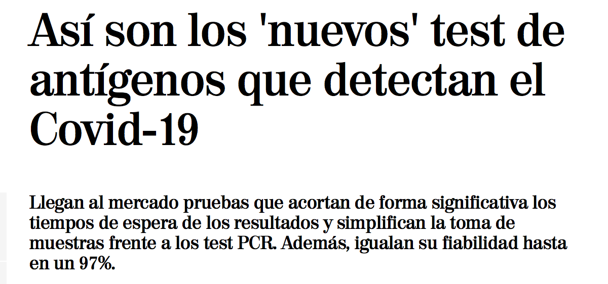

# (PART\*) Tema I: Introducción a los estudios médicos y la estadística  {-}


# Introducción

Incluso aunque seáis recién llegados al grado de Medicina, con la que nos ha caído encima este 2020 seguro que el tipo de situación siguiente os va a ser familiar. Suponed que se ha realizado un estudio clínico sobre una muestra de individuos para determinar:

* si una nueva vacuna es efectiva para prevenir una cierta enfermedad;


```{r echo=FALSE,out.width="60%"}
knitr::include_graphics("INREMDN_files/figure-html/covidintro1.png")
```

* o si un  grupo de riesgo concreto tiene una mayor probabilidad de complicaciones en la evolución de una enfermedad;


```{r echo=FALSE,out.width="60%"}
knitr::include_graphics("INREMDN_files/figure-html/covidintro2.png")
```

* o si un determinado comportamiento es efectivo en la prevención de una enfermedad;


```{r echo=FALSE,out.width="60%"}

```

* o si una nueva terapia es más efectiva, o tiene menos efectos secundarios adversos, que las terapias anteriores;


```{r echo=FALSE,out.width="60%"}
knitr::include_graphics("INREMDN_files/figure-html/covidintro3.png")
```


* o si una nueva técnica diagnóstica para una determinada enfermedad es más precisa que las anteriores, o igual de precisa pero más barata, o más rápida, o menos intrusiva...


```{r echo=FALSE,out.width="60%"}

```

La información obtenida en este estudio se habrá recogido sobre un conjunto más o menos pequeño de individuos, y queremos saber hasta dónde se puede generalizar al total de la población mundial, o al menos a la población de nuestro entorno. La estadística es la que nos permite esta generalización.

Se ha definido estadística de muchas maneras. La que más nos gusta, y que entronca con la situación que acabamos de explicar, es que 

> La **estadística** es la ciencia que permite adquirir conocimiento generalizable a partir de datos. 


Una definición en la que apenas sobran palabras:

* En estadística, siempre se empieza obteniendo unos **datos** sobre un grupo (relativamente pequeño) de individuos de una población. Bueno, en realidad, no se empieza obteniendo los datos, sino planificando cuidadosamente cómo se van a obtener, pero todo forma parte de la "obtención" de los datos.
* Usando estos datos, se **generaliza** el **conocimiento** que se ha obtenido sobre los individuos del grupo elegido al total de la población.
* Y no se trata de trucos de magia adivinatoria, sino de una **ciencia** cuya metodología ha sido validada por medio de demostraciones matemáticas o, en el peor de los casos, mediante simulaciones numéricas (el equivalente en matemáticas de los experimentos en las otras ciencias). 


```{r gaturro,echo=FALSE,out.width="80%",fig.cap="Gaturro ((c) Nick) y la estadística." }

```


Como decíamos, la situación de partida a la hora de aplicar técnicas estadísticas es que disponemos de un conjunto de datos que describen algunas características de un grupo de individuos elegidos de una población. El análisis estadístico de estos datos puede ser entonces de dos tipos básicos:

*  **Análisis descriptivo**, cuando nuestro objetivo sea simplemente resumir, representar y explicar los datos concretos de los que disponemos. La **estadística descriptiva**  es el conjunto de técnicas que se usan con este fin. 

* **Análisis inferencial**, si nuestro objetivo es deducir  (**inferir**),  a partir de estos datos, información significativa sobre el total de la población de interés.  Las técnicas que se usan en este caso forman la **estadística inferencial**.


```{r estinf,echo=FALSE,out.width="80%",fig.cap="Estadística inferencial." }
knitr::include_graphics("INREMDN_files/figure-html/EstInf.png")
```

Ambos tipos de análisis están relacionados. Por un lado, porque es conveniente (obligatorio, en nuestra opinión) empezar cualquier análisis inferencial dando un vistazo a los datos que se usarán. Por otro, porque muchas técnicas descriptivas permiten estimar propiedades de la población de la que se ha extraído la muestra. Por citar un ejemplo, la media aritmética de las alturas de una muestra de individuos nos da un valor  más o menos representativo de esta muestra, pero también se puede usar para *estimar*  la altura media de los individuos de la población total.

La estadística inferencial entra en juego cuando se quiere obtener información sobre una población y no se tiene acceso a todos los individuos de la misma. Si por ejemplo quiero conocer la altura media  de los estudiantes matriculados en esta asignatura de la UIB en este curso, en principio no necesito para nada la estadística inferencial. Son pocos, los mido a todos y calculo la media. En todo caso, usaría técnicas de estadística descriptiva para describir estas alturas de manera adecuada.

Si en cambio quisiera conocer la altura media de los residentes en Mallorca de 18 años, sería muy complicado medirlos a todos. Entonces, lo que haría sería tomar una muestra de esta población, medirlos y a partir de estas medidas estimar el valor que me interesa. Naturalmente, no puedo esperar obtener de esta manera el valor exacto de la altura media de los residentes en Mallorca de 18 años, me tendría que conformar con obtener una aproximación dentro de un cierto margen de error y calculando la probabilidad de acertar en mi estimación con este margen de error. La estadística inferencial es la que me permite acotar el error que puedo haber cometido y de calcular la probabilidad de cometerlo, incluyendo la metodología que tendría que haber usado para tomar la muestra en primer lugar.


```{r cyanide,echo=FALSE,out.width="80%",fig.cap="Cyanide and Happinness ((c) Explosm.net) y la estadística." }
knitr::include_graphics("INREMDN_files/figure-html/cyanide.png")
```


Hace más de 80 años, la prestigiosa revista médica *The Lancet* ya avisaba en [un editorial titulado "Matemáticas y medicina"](https://www.sciencedirect.com/science/article/abs/pii/S0140673600865708) que muchos de los problemas en medicina son de estadística. Nos encanta la frase (a partir de la segunda línea del fragmento mostrado  en la Figura \@ref(fig:lancet2)): "Los métodos estadísticos sencillos son mucho más de nuestra incumbencia que muchas de las cosas que nos obligan  a estudiar en los seis largos años del currículo de Medicina". 


```{r lancet2,echo=FALSE,out.width="50%",fig.cap="Fragmento del editorial \"Matemáticas y medicina\" de *The Lancet* (2 de enero de 1937)." }
knitr::include_graphics("INREMDN_files/figure-html/lancet2.png")
```


En los últimos años, la necesidad de su conocimiento se ha reforzado con el auge de la  **Medicina Basada en la Evidencia**. No vamos ahora a entrar en detalle sobre este enfoque de la medicina, porque seguro que va a aparecer en muchas otras asignaturas y mucho mejor explicado de lo que lo haríamos aquí. Pero al menos hay que tener presente que su objetivo es **tomar decisiones médicas en base a la mejor evidencia científica disponible**. La evaluación de la evidencia disponible  se tiene que basar en dos Es: en la **E**xperiencia del médico y en la **E**stadística. La segunda **E** se debe a que la mayoría de estudios médicos fundamentan sus conclusiones por medio de la estadística. Ya sabéis,  usan la estadística para generalizar lo observado sobre los sujetos de una muestra a toda una población. Por tanto, para evaluar la fuerza de la evidencia obtenida  en los estudios que consultéis a la hora de tomar una decisión, os serán  necesarios unos mínimos conocimientos de estadística. Necesitaréis  ser capaces, por ejemplo, de determinar si el estudio se ha llevado a cabo correctamente, si el análisis de los datos se ha realizado de manera correcta, si las conclusiones a las que se llega están bien fundamentadas y hasta qué punto son válidas en el caso clínico concreto que os ocupa. 

Pues eso, el objetivo de esta asignatura es que adquiráis algunos de estos mínimos conocimientos de estadística.


