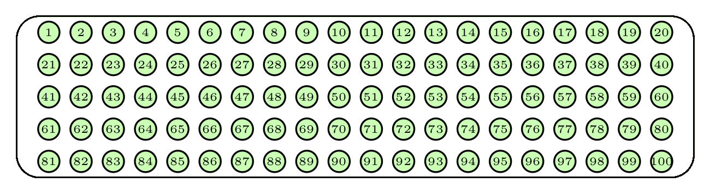
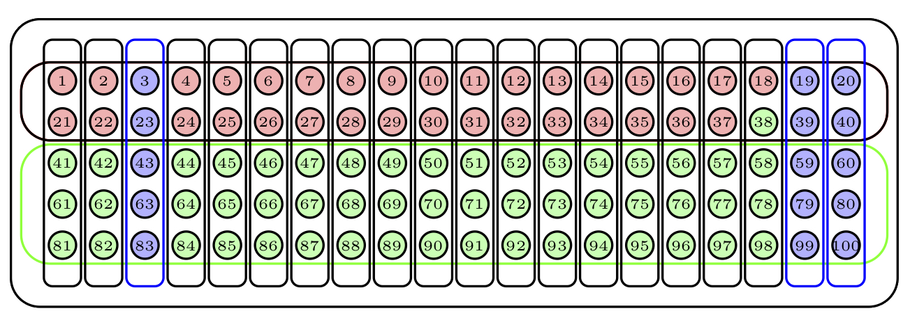

# Algunos conceptos básicos más

## Unidad de observación

En un estudio estadístico, la **unidad de observación** es, para entendernos, el tipo de qué o de quiénes que son objeto de medición durante la investigación. En los estudios médicos normalmente serán personas, pero no siempre. Por ejemplo, pueden ser sucesos que les pasen a personas, de manera que una misma persona pueda ser observada varias veces:  embarazos,  operaciones quirúrgicas... O recordad los estudios ecológicos (Sección \@ref(sec:ecol)), en los que la unidad de observación son las comunidades de las que se mide algún dato global. Por ejemplo, podemos medir en diferentes centros de educación primaria de una ciudad el gasto medio diario en sus máquinas expendedoras de alimentos procesados y la proporción de miopes entre sus alumnos, para estimar si hay alguna relación entre el consumo de alimentos procesados y la miopía. Aquí, la unidad de observación son los centros de educación primaria, no los alumnos.


## Población y muestra

En un estudio inferencial queremos deducir (**inferir**) información sobre una **población** a partir de una **muestra**. 


```{r samplingcast, echo=FALSE,out.width="60%",fig.cap="Población *versus* muestra"}
knitr::include_graphics("INREMDN_files/figure-html/samplingcast.png")
```


```{example, caldo}
Si queremos saber si un guiso nos ha quedado soso, no nos lo comemos todo, porque entonces nos quedaríamos sin guiso y ya no valdría la pena saber si está soso o no. Lo que hacemos es probar solo una cucharada. El guiso es la población, la cucharada la muestra. A partir del sabor de la cucharada, "inferimos" cómo nos ha quedado el guiso. 


```


En general, una **población** es simplemente un conjunto de individuos u objetos (genéricamente, de **sujetos**) sobre los que queremos conocer alguna información. Esta población puede estar perfectamente definida en un lugar y tiempo: por ejemplo, los empadronados en Mallorca a día de hoy. Pero normalmente su definición será difusa. Si, por ejemplo, queremos estimar algo sobre "los españoles diabéticos mayores de 65 años", ¿de quiénes estamos hablando exactamente? ¿De los que están vivos justo ahora? ¿De todos los que ha  habido en España desde su fundación? ¿Incluimos los que aún no han nacido? ¿Qué hacemos con los que son diabéticos pero no han sido diagnosticados, ni lo serán nunca?

Tranquilos, no nos vamos a romper mucho la cabeza con esto. Pero al menos tenéis que ser conscientes de que una población puede contener sujetos que en realidad no existen ni hayan existido ni vayan a existir, sino simplemente que "podrían existir". Y en medicina especialmente, cuando queremos estimar si un tratamiento será efectivo para tratar una cierta enfermedad... incluyendo los casos que aún no han contraído la enfermedad. Hablaremos entonces de una población **virtual** (en otros lugares la califican de población **metafórica**).

Por ejemplo, cuando decimos que 

> "La probabilidad de que salga Cara al lanzar una moneda equilibrada es 1/2", 

lo que significa es que 

> "Si tomamos la población formada por todos los posibles lanzamientos de todas las posibles monedas equilibradas, en la mitad de estos lanzamientos el resultado es Cara."

Los sujetos de esta población son todos los "posibles" lanzamientos de monedas equilibradas, los que se han realizado a lo largo de la historia, los que se realizarán en el futuro, y los que se podrían haber realizado o se podrían realizar en el futuro pero en realidad no han tenido lugar ni se efectuarán.


Otro ejemplo. Imaginad que comparamos las notas que (vosotros, estudiantes de primer curso del grado de Medicina de la UIB de este año académico) sacáis en dos cuestionarios diferentes sobre un mismo tema, uno sobre conceptos y el otro de cálculos, y que en el primero obtenéis una nota media mucho mayor que en el segundo. Usamos este dato para inferir que los estudiantes de primer curso de Medicina sacan de media mejor nota en tests de conceptos que en tests calculísticos. ¿Quiénes son estos "estudiantes de primer curso de Medicina"?  ¿Sobre qué población "inferimos" información a partir de este resultado? 

No sobre solo vosotros para estos dos tests concretos, ya que entonces no estaríamos infiriendo nada, simplemente calificaríamos, constataríamos que una nota media ha sido más alta que la otra, y pararíamos aquí. 


La población a la que podríamos querer generalizar los resultados podríais ser vosotros, pero para "siempre que hicierais" tests calculísticos y de conceptos. O podrían ser las personas matriculadas en alguna asignatura de primer curso del grado de Medicina de España en este curso académico, que es una población bien definida. O podría ser la población virtual de "estudiantes de primer curso de Medicina", pasados, presentes y futuros y con una noción imprecisa de lo que entendemos por "estudiante de primer curso".

Hasta ahora hemos hablado de la población, a menudo virtual, sobre la que queremos obtener información. Está será nuestra **población objetivo**, que hay que distinguir de la **muestra**:

* **Población objetivo**: un conjunto de sujetos con una o varias características sobre las que deseamos obtener información.

* **Muestra**:  el grupo de unidades de observación en las que medimos las características de interés.

Normalmente, la muestra es un subconjunto de la población objetivo, pero ya hemos visto en la sección anterior que esto no siempre es así: pensad en los estudios ecológicos.


```{example}
Una serie de 10 lanzamientos de una moneda equilibrada concreta es una muestra de la población de "los posibles lanzamientos de monedas equilibradas".


```


```{example}
¿Y vosotros qué sois: una población o una muestra? Pues depende:

* Sois una población cuando lo que nos interesa es saber algo sobre **vosotros** y solo sobre vosotros. 

* Sois una muestra si a partir de información sobre vosotros miramos de inferir información sobre **un grupo más grande de sujetos**:
  
    * Sobre los estudiantes de primer curso de Medicina en España
    * Sobre los estudiantes de la UIB de este curso
    * Sobre los jóvenes europeos
    * Sobre los mamíferos bípedos
    * Sobre ...


```


```{block2,type="rmdrecordau"}
Procurad tener siempre presente que, por mucho cuidado que pongamos en obtener una muestra de una población, nunca será nada más que una aproximación imperfecta de esta.
```


Si podemos medir todos los individuos de la población objetivo, no nos hace falta usar estadística inferencial para intentar adivinar lo que queremos saber sobre la población: lo medimos sobre todo el mundo y ya está. Pero lo más normal es que no podamos medir todos los individuos de la población.

* La población puede ser demasiado grande. Por ejemplo, si queremos calcular la altura media de los europeos que hoy tienen 18 años, es prácticamente imposible medirlos todos.

* Como ya hemos comentado, la población puede ser **virtual** en el sentido de que puede contener miembros que en este momento ni existan, o que no podamos saber si pertenecen o no a dicha población.

* Puede ser que para obtener la información de un sujeto lo tengamos que sacrificar (por ejemplo, si la información solo se puede recoger con una autopsia). En este caso, para medir toda la población la tendríamos que exterminar.

* Puede ser simplemente que sea difícil acceder a toda la población: por ejemplo, los estudiantes de la UIB son relativamente pocos, unos 12000, pero sería complicado conseguir mediros a todos.


A la hora de determinar la validez de un estudio, es muy importante comparar la población objetivo con la:

* **Población muestreada**: el conjunto de sujetos (**unidades de observación**) del que se extrae la muestra. 


```{r muestra, echo=FALSE, out.width="80%", fig.cap="Población objetivo, población muestrada y muestra."}
knitr::include_graphics("INREMDN_files/figure-html/muestra.png")
```

En la mayoría de las ocasiones, la población muestreada será un subconjunto de la población objetivo definido por una serie de restricciones, pero puede no serlo: pensad, por ejemplo, en los estudios ecológicos, donde la población objetivo son individuos y la población muestreada son grupos de individuos.

```{example,tuberculosisrusia}
Dad un vistazo al artículo ["Risk factors for pulmonary tuberculosis in Russia: case-control study"](https://www.bmj.com/content/332/7533/85.short)
(R. Coker *et al*, *British Medical Journal*  332 (2006), pp. 85-87). Su objetivo es "Determinar los factores de riesgo para la tuberculosis pulmonar en Rusia". Por lo tanto:

```

* La **población objetivo** es "toda la población de Rusia", sea lo que sea lo que signifique esto.

Ahora bien, la muestra se tomó solo entre los adultos de la ciudad de [Samara](https://es.wikipedia.org/wiki/Samara) y durante 2003. Por lo tanto:

* La **población muestreada** fueron los adultos que vivían en Samara en 2003.

Finalmente, leemos que los casos fueron todos los adultos de esta ciudad diagnosticados de tuberculosis pulmonar a los que se administró un  DOTS (Tratamiento Acortado Directamente Observado), en total 334. Como controles se tomó al azar el mismo número de personas entre la población adulta  de la ciudad sin historial de tuberculosis.

* La **muestra** fueron estas 668 personas.


```{example, Hola}
Para conocer la opinión de sus lectores sobre la familia real española, una conocida revista del corazón propuso una encuesta en línea en su web y analizó las respuestas. En este **estudio transversal**:

```

* La **población objetivo** es la formada por "los lectores de esta revista".
* La **población muestreada** es la formada por los lectores  de esta revista con acceso a Internet el año en que se realizó la encuesta. 
* La **muestra** es el grupo de personas concretas que voluntariamente respondieron la encuesta.

En el Ejemplo \@ref(exm:tuberculosisrusia), puede que la población muestreada no fuera representativa de **toda** Rusia. Los habitantes de Samara, una de las ciudades más pobladas de Rusia, a unos 1500 km al sudeste de Moscú, ¿son representativos de los habitantes de una aldea perdida en mitad de la nada siberiana? Pues no lo sabemos, pero creemos que no. Además, la muestra de casos tampoco representa el colectivo de tuberculosos de Samara, puesto que solo se reclutaron los que reunían las condiciones para un tratamiento concreto (los tuberculosos con frotis bucal negativo a veces no se incluyen en un programa DOTS).

En el Ejemplo \@ref(exm:Hola) está más claro que la población muestreada no es representativa de la población objetivo: seguramente excluye, por ejemplo, los lectores ancianos o los de zonas rurales con acceso difícil a Internet. Además, la muestra es aún más restrictiva, ya que los participantes fueron voluntarios, y sus características pueden ser diferentes de las de los lectores que prefirieron no opinar sobre este tema (nunca se sabe si el CNI vigila...)  o de las de los lectores que nunca responden encuestas.


Si la población muestreada no es representativa de la población objetivo, los resultados del estudio no tienen por qué poderse generalizar a esta última: diremos entonces  que se ha dado un **sesgo de falta de  representatividad**. Hablaremos sobre sesgos en la Sección \@ref(sec:sesgos).

```{example}
Al escogeros a vosotros como una muestra de la población de estudiantes de primer curso de Medicina, podríamos entender como población muestreada, por ejemplo, la de  "los estudiantes que  este año académico  cursan alguna asignatura de primer curso de Medicina en una universidad española". Pero seguramente  esta población difiera en algunos aspectos de los estudiantes de primer curso de Medicina de hace unos años, antes de la pandemia.

```

Un estudio médico toma información sobre una muestra de individuos y la generaliza a una población objetivo. Si nos ha interesado leerlo, seguramente será porque su población objetivo contiene, o al menos está relacionada con, la población que nos interesa a nosotros. Pero la muestra habrá sido tomada de una población muestreada que no tiene por qué coincidir con nuestra población de interés.  Es muy importante poder decidir entonces si las conclusiones a las que se llega en el estudio se pueden aplicar o no a nuestra población. No es el objetivo de este curso el que podáis tomar esta decisión, ya que la respuesta no va de estadística sino de la experiencia médica que aún os falta. Pero sí que al menos seáis conscientes de que un resultado  estimado para una población puede no ser extrapolable a otra población.


```{example}
En el estudio ["D-dimer as a biomarker for disease severity and mortality in COVID-19 patients: a case control study"](https://link.springer.com/article/10.1186/s40560-020-00466-z)(Y. Yao *et al*, *Journal of Intensive Care*  8:49 (2020)) se compararon diversas características clínicas, analíticas y radiológicas entre los pacientes que fallecieron (17 en total) y los que no fallecieron (231) en un grupo de enfermos de COVID-19 tratados en el hospital Renmin de la Universidad de Wuhan. Su objetivo era determinar qué características aumentaban el riesgo de defunción entre los enfermos de COVID-19. 

Se encontró una asociación estadísticamente significativa entre  tener un nivel de dímero D en sangre muy alto, superior a 2 mg/l, y un aumento en la letalidad de la COVID-19. Querríamos decidir si esta asociación también es válida para nuestros pacientes.


```

¿Cuál es el problema? Pues que la población objetivo  del estudio es la de todos los enfermos de COVID-19, pero según el artículo la población muestreada fue la de "pacientes con al menos dos síntomas de COVID-19 y PCR positiva tratados en ese hospital concreto de Wuhan". Así que de entrada, los infectados con un solo síntoma quedan excluidos, por muy grave que sea ese síntoma. Además, habría que valorar si la población asignada a ese hospital se parece o no a la balear. Por ejemplo, la tasa de letalidad de la COVID-19 entre el grupo de pacientes examinados fue del 6.85%, mientras que en las Baleares en esa misma época era de alrededor del 2.4%, aunque este  dato refiere al total de infectados, incluyendo los asintomáticos. También habría que tener en cuenta las posibles diferencias en los niveles "normales" de dímero D en sangre entre las personas de origen asiático y las de origen mediterráneo. Y habría que valorar si la asociación observada se debe a algún confundidor. Por ejemplo, la edad media de los sujetos de la muestra con niveles elevados de dímero D era  más alta que la de los que tenían un nivel normal, y la COVID-19 es más letal entre los ancianos. ¿Será la edad un factor de confusión en este estudio?   

```{block2,type="rmdexercici"}
En el artículo ["Tuberculosis treatment survival of HIV positive TB patients on directly observed treatment short-course in Southern Ethiopia: A retrospective cohort study"](https://bmcresnotes.biomedcentral.com/articles/10.1186/1756-0500-5-682) (D. Shaweno, *BMC Research Notes* 5:682 (2012)) se quiso estudiar si  la infección por VIH afecta la supervivencia a corto plazo de pacientes con tuberculosis (TB). Para ello, se consideraron todos los pacientes que habían participado en un estudio previo: se trataba de pacientes diagnosticados de TB durante el periodo 2006-2010 a los que se prescribió un tratamiento concreto de quimioterapia de 8 meses de duración y que además pasaron un test de VIH en el momento del diagnóstico positivo de TB. De este grupo de pacientes,  se escogieron al azar un subgrupo de 370 VIH-positivos y otro de 370 VIH-negativos, y se anotó el número de pacientes de cada subgrupo que fallecieron  antes de finalizar  el tratamiento de 8 meses. La conclusión fue que la tasa de mortalidad entre los paciente de TB VIH-positivos es mayor que entre los que son VIH-negativos.


*(a)* ¿De qué tipo de estudio se trata?
 
*(b)* ¿Cuáles son la población objetivo, la población muestreada y la muestra? 
 
*(c)* ¿Creéis que la población muestreada es representativa de la población objetivo?

```


## Tipos básicos de muestreo {#sec:muestreo}

En un estudio estadístico inferencial, se toma una **muestra** de individuos de una **población** y se estiman algunas características de la población a partir de las de la muestra. Para que esto tenga sentido, es necesario que la muestra sea razonablemente **representativa** de la población. Pero, claro, sin conocer las características de la población, no podemos saber si una muestra es representativa o no. 

Para salir de este *impasse*, la solución comúnmente aceptada es tomar una muestra **aleatoria**, es decir, escogiendo sus sujetos de alguna manera al azar. Al hacerlo así:

* Se evitan preferencias en la elección, por lo que es más probable que la muestra sea representativa de la población. Naturalmente, esto no está garantizado: por pura mala suerte nos puede salir una muestra súper rara, es lo que tiene el azar.
Pero al menos hemos hecho "lo que todo el mundo considera que es lo que hay que hacer" para intentar que sea representativa.


```{r, echo=FALSE, out.width="80%",fig.cap="¿Estás seguro de que la muestra es aleatoria? (http://dilbert.com/strip/2001-10-25)"}
knitr::include_graphics("INREMDN_files/figure-html/randomgen.png")
```

* Se pueden usar técnicas estadísticas que  permiten acotar errores en la estimación y su probabilidad; por ejemplo, que permite calcular la probabilidad de que nuestra muestra sea súper rara en algún sentido concreto.

```{example}
Para probar el guiso, antes de tomar una cucharada lo removemos bien. De este modo esperamos que las moléculas del caldo se organicen de manera aleatoria dentro de la olla y que la cucharada que tomemos sea representativa del guiso.


```

Existen muchos métodos de **muestreo**. A continuación describimos algunos  de forma breve.

### Muestreo aleatorio con y sin reposición {#sec:mas}

El **muestreo aleatorio** consiste en seleccionar una muestra de la población de manera que todas las muestras del mismo tamaño sean **equiprobables**; es decir, que si fijamos el número de individuos de la muestra, cualquier conjunto de ese número de individuos tenga la misma probabilidad de ser seleccionado.  

Hay que distinguir entre dos tipos   de muestreo aleatorio: **con** y **sin reposición**, según permitamos o no que se repitan sujetos en la muestra.   Para ilustrarlos, supongamos que disponemos de una urna con 100 bolas numeradas del 1 al 100, de la que queremos extraer una muestra de 15 bolas. La Figura \@ref(fig:base) representa dicha urna.

```{r, echo=FALSE, out.width="80%", label=base,fig.cap="Una urna de 100 bolas."}

```

Una manera de hacerlo sería repetir 15 veces el proceso de sacar una bola de la urna, anotar su número y devolverla a la urna. El tipo de muestra obtenida de esta manera recibe el nombre de **muestra aleatoria con reposición**, o **muestra aleatoria simple**. Observad que con este procedimiento una misma bola puede aparecer varias veces en una muestra, y que todos los subconjuntos de 15 bolas "con posibles repeticiones"  tienen la misma probabilidad de obtenerse. Un posible resultado serían las bolas azules de la Figura \@ref(fig:simple); la bola azul más oscuro ha sido escogida dos veces en la muestra.


```{r, echo=FALSE, label=simple,fig.cap="Una muestra aleatoria simple.", out.width="80%"}
knitr::include_graphics("INREMDN_files/figure-html/simplev.png")
```

Otra manera de extraer la muestra sería repetir 15 veces el proceso de sacar una bola de la urna  pero ahora sin devolverla. Esto es equivalente a extraer de golpe 15 bolas de la urna. Estas muestras no tienen bolas repetidas, y cualquier selección de 15 bolas diferentes tiene la misma probabilidad de ser la obtenida.  En este caso se habla de una **muestra aleatoria sin reposición**. Un posible resultado serían las bolas azules de la Figura \@ref(fig:sinrep).

```{r, echo=FALSE, label=sinrep,fig.cap="Una muestra aleatoria sin reposición.", out.width="80%"}
knitr::include_graphics("INREMDN_files/figure-html/sinrepv.png")
```


Cuando **el tamaño de la población es muy grande en relación al de la muestra**, como suele suceder en medicina, la probabilidad de que haya repeticiones en una muestra aleatoria simple es muy pequeña. Por ejemplo:

* Si escogemos 100 individuos de las Baleares (que tiene alrededor de 1,150,000 habitantes) al azar permitiendo repeticiones, la probabilidad de que se escoja más de una vez algún individuo es de `r round(pbirthday(100,1150000),3)`: de media, solo en 1 de cada 250 muestras de 100 individuos de las Baleares elegidos al azar permitiendo repeticiones nos saldría alguien repetido.

* Si escogemos 100 estudiantes de la UIB (que tiene alrededor de 12000 estudiantes) al azar permitiendo repeticiones, la probabilidad de que se escoja más de una vez algún individuo es de `r round(pbirthday(100,12000),3)`: de media, en  algo más de 1 de cada 3 muestras de 100 estudiantes de la UIB elegidos al azar permitiendo repeticiones habría alguien repetido. 

     En cambio, si escogemos **10** estudiantes de la UIB al azar permitiendo repeticiones, la probabilidad de que se escoja más de una vez algún individuo ya es de `r round(pbirthday(10,12000),3)`.

```{block2,type="rmdnote"}
Ya daremos el detalle de cómo se calculan todas estas probabilidades en el tema siguiente.
```


Esto nos permite considerar que, cuando la población es mucho más grande que la muestra,  los muestreos aleatorios con y sin reposición son **equivalentes** en el sentido siguiente: puesto que si la población es muy, muy grande, una muestra aleatoria con reposición tendría casi seguro  todos los elementos diferentes, podemos tomar directamente la muestra sin reposición y aceptar que permitíamos repeticiones, pero que no se han dado y que por tanto la muestra es simple. 

* Una muestra aleatoria de 100 individuos diferentes de las Baleares, o de 10 estudiantes diferentes de la UIB, puede pasar perfectamente por una muestra simple, porque aunque  permitiéramos repeticiones, sería muy raro que las hubiera.

* Pero en cambio ya es difícil de creer que una muestra aleatoria de 100 estudiantes diferentes de la UIB haya sido tomada permitiendo repeticiones, porque de media en una de cada tres muestras tomadas permitiendo repeticiones nos saldría alguna repetición.

El muestreo aleatorio simple es el *estándard de excelencia* entre los métodos de muestreo, y la mayoría de los resultados que explicaremos en este curso presuponen que la muestra ha sido tomada aleatoria con reposición. Pero casi nunca es factible hacerlo. El motivo es que para poder tomar una muestra aleatoria de una población en el sentido de este apartado, con o sin reposición,  es necesario disponer de una lista completa de todos sus individuos  para poder sortear a quién vamos a seleccionar. Esto no siempre es posible. ¿Alguien tiene la  lista completa de, pongamos, todos los diabéticos de España? ¿Que incluya los que no saben que lo son? Por lo tanto, en la vida real no siempre podemos tomar muestras aleatorias en este sentido.

##### Muestras aleatorias con R {-}

Cualquier paquete estadístico que se precie permite obtener muestras aleatorias de conjuntos. Con R, la función básica es 

```{r,eval=FALSE}
sample(x, n, replace=...)
```

donde:

* `x` es un vector que contiene toda la población o un número natural $x$; en este último caso, R entiende que representa el vector 1,2,...,$x$;

* `n` es el tamaño de la muestra que deseamos extraer; 

* el parámetro `replace` puede igualarse a `TRUE`, y será una muestra aleatoria con reposición, es decir, simple, o a `FALSE`, y será una muestra aleatoria sin reposición. Si no se especifica este parámetro, R entiende que ha de tomar la muestra sin reposición.

Así, por ejemplo, para obtener una muestra aleatoria simple de 15 números elegidos entre 1 y 100, podemos entrar:

```{r} 
sample(100,15,replace=TRUE)
```

Naturalmente, cada ejecución de `sample` con los mismos parámetros puede dar (y seguramente dé) lugar a muestras diferentes, y todas ellas tienen la misma probabilidad de aparecer:

```{r} 
sample(100,15,replace=TRUE)
sample(100,15,replace=TRUE)
sample(100,15,replace=TRUE)
```


```{example}
En el marco de un estudio experimental, tenemos que asignar al azar 60 pacientes a dos tratamientos, de manera que cada paciente tenga un 50% de probabilidades de caer en uno u otro grupo de tratamiento tratamiento. Si indicamos los dos tratamientos por 1 y 2 (por ejemplo, que 1 sea el tratamiento control y 2 el tratamiento nuevo), podemos numerar los sujetos de 1 a 60 y a continuación tomar una muestra aleatoria simple  de tamaño 60 de valores 1 o 2  y a cada sujeto asignarle el tratamiento que le corresponda en esta muestra. Para ello,  ejecutamos
```

```{r}
sample(2,60,replace=TRUE)
```

De esta manera se asignarían 31 pacientes al tratamiento 1 y 29 al tratamiento 2: los tres primeros al tratamiento 1, el cuarto al tratamiento 2, el quinto al tratamiento 1 etc.


Si hubiéramos querido forzar que cada grupo de tratamiento tuviera 30 pacientes, hubiéramos podido tomar una muestra aleatoria sin reposición de tamaño 30 de los 60 pacientes,  asignar a sus miembros uno de los tratamientos y al resto el otro tratamiento. Así, podríamos asignar el tratamiento 1 a los pacientes 

```{r}
sort(sample(60,30,replace=FALSE))
```

(La función `sort`, como su nombre en inglés indica, sirve para ordenar vectores.)

### Muestreo sistemático {#sec:sist}

Una manera muy sencilla de obtener una muestra de una población cuando disponemos de una lista ordenada de sus individuos y nos da pereza efectuar un sorteo es tomarlos a intervalos constantes: uno de cada cinco individuos, uno de cada diez... Podemos añadir un componente aleatorio escogiendo al azar el primer individuo que elegimos, y a partir del cual empezamos a contar. A esta técnica se la llama **muestreo sistemático**   o **a intervalos**, añadiendo el adjetivo **aleatorio** si además el primer sujeto se escoge de manera aleatoria. 

Así, por ejemplo, si de una clase de 100 estudiantes quisiéramos escoger una muestra de 10, podríamos elegir un estudiante al azar, y a partir de él, por orden alfabético, elegir el décimo estudiante, el vigésimo, el trigésimo, etc.; si al llegar al final de la lista de clase no hubiéramos completado la muestra, volveríamos al principio de la misma. 

La Figura \@ref(fig:sist) describe una muestra aleatoria sistemática de 15 bolas de nuestra urna de 100 bolas: hemos empezado a escoger por la bola roja oscura, que ha sido elegida al azar, y a partir de ella hemos tomado las bolas a intervalos de 7, volviendo al principio cuando hemos llegado al final de la lista numerada.


```{r, echo=FALSE, label=sist, out.width="80%",fig.cap="Una muestra aleatoria sistemática."}
knitr::include_graphics("INREMDN_files/figure-html/sistv.png")
```


Cuando no disponemos de una lista de toda la población pero sí que tenemos una manera de acceder de manera ordenada a sujetos de la misma (por ejemplo, enfermos que acuden a un hospital), podemos realizar un muestreo sistemático tomando los sujetos a intervalos constantes a medida que los encontramos y hasta completar el tamaño deseado de la muestra. Por ejemplo, para escoger una muestra de 10 pacientes que hayan acudido a Urgencias por traumatismos en la cabeza, podríamos escoger pacientes a intervalos regulares de entre los que acudieran a Urgencias por este motivo  hasta llegar a los 10.

```{block2,type="rmdnote"}
Si la lista de la población está ordenada al azar, o si los sujetos que vamos tomando a intervalos regulares nos aparecen al azar, el resultado del muestreo sistemático es equivalente a una muestra aleatoria sin reposición.
```

   
### Muestreo aleatorio estratificado {#sec:estr}

Este método de muestreo se utiliza cuando la población está clasificada en  **estratos** que son de interés para la característica que se estudia. Estos estratos serán grupos de individuos definidos por un atributo concreto, de manera que individuos del mismo estrato tengan ese atributo igual (los estratos sean **homogéneos** internamente) y individuos de estratos diferentes tengan ese atributo diferente. Por ejemplo, la clasificación en estratos puede venir dada por los sexos, franjas de edad, provincias, casos y controles... En este caso, se toma una muestra  de un tamaño prefijado de cada estrato  y se unen en una muestra global. Este proceso es llamado **muestreo estratificado**, **aleatorio** si la muestra de cada estrato es aleatoria  (en el sentido de la Sección \@ref(sec:mas)).  

Por lo que refiere a los tamaños de las muestras de cada estrato, se suele optar por una de las estrategias siguientes: 

* Imponer que la composición por estratos de la muestra global mantenga las proporciones de la población original, de manera que el tamaño de la muestra de cada estrato represente el mismo porcentaje del total de la muestra que el estrato correspondiente en la población completa. 

* Tomar las muestras de los diferentes estratos del mismo tamaño.

* Tomar los tamaños de manera que los estratos que representen una fracción muy pequeña de la población (tan pequeña que no esperaríamos que tuvieran representación en una muestra aleatoria  **transversal** de la población, es decir, tomada del total de la población sin tener en cuenta su composición en estratos) tengan una representación en la muestra mucho mayor que la que les tocaría. 


```{r, echo=FALSE,fig.cap="Muestra transversal *versus* estratificada", out.width="60%"}
knitr::include_graphics("INREMDN_files/figure-html/estratvstrans.png")
```

Por ejemplo, los estratos podrían ser grupos de edad y podríamos tomar la muestra de cada grupo de edad de tamaño proporcional a la fracción que representa dicho grupo de edad en la población total. O podrían ser los sexos y procuraríamos que nuestra muestra estuviera formada por un 50% de hombres y un 50% de mujeres. O, en las Islas Baleares, los estratos podrían ser las islas, y entonces podríamos  imponer que el número de representantes de cada isla en la muestra fuera proporcional a su población relativa dentro del conjunto total de la Comunidad Autónoma, o podríamos tomar la misma cantidad de individuos de cada isla, independientemente de su población.


```{block2,type="rmdnote"}
Cuando en un estudio de casos y controles escogemos un grupo de casos y uno de controles de tamaños prefijados, o  cuando en un estudio de cohorte escogemos un grupo de expuestos y uno de no expuestos de tamaños prefijados, se trata de una muestra estratificada, aunque no siempre será aleatoria.
```

Para continuar con nuestra urna de 100 bolas, supongamos que contiene 40 bolas de un color y 60 de otro color según muestra la Figura \@ref(fig:estratprevi).


```{r, echo=FALSE, label=estratprevi,fig.cap="Nuestra urna ahora tiene dos  estratos.", out.width="80%"}
knitr::include_graphics("INREMDN_files/figure-html/estratprevi.png")
```
 
 
Para tomar una muestra aleatoria estratificada de 15 bolas, considerando como estratos los dos colores e imponiendo que la muestra refleje la composición de la urna, tomaríamos una muestra aleatoria de 6 bolas del primer color y una muestra aleatoria de 9 bolas del segundo color. De esta manera, los porcentajes de colores en la muestra serían los mismos que en la urna. La Figura \@ref(fig:estrat) describe una muestra obtenida de esta manera.


```{r, echo=FALSE, label=estrat, out.width="80%",fig.cap="Una muestra aleatoria estratificada."}
knitr::include_graphics("INREMDN_files/figure-html/estrat.png")
```
 
Para tomar una muestra aleatoria estratificada de 10 bolas, de nuevo considerando como estratos los dos colores pero ahora imponiendo que cada color aporte la misma cantidad de bolas a la muestra, tomaríamos una muestra aleatoria de 5 bolas del primer color y una muestra aleatoria de 5 bolas del segundo color. La Figura \@ref(fig:estrathom) describe una muestra obtenida de esta manera.


```{r, echo=FALSE, label=estrathom, out.width="80%",fig.cap="Otra muestra aleatoria estratificada."}
knitr::include_graphics("INREMDN_files/figure-html/estrathom.png")
```
 
 
La ventaja del muestreo aleatorio estratificado respecto del transversal es que, como el investigador escoge una muestra de cada estrato de la población del tamaño que  considera adecuado:

* Permite estimar la información de interés para cada estrato por separado, como si se tratara de  estudios independientes. 

* Permite estimar la información sobre subpoblaciones minoritarias que en una muestra aleatoria transversal aparecerían  subrepresentadas.

En todo caso, el muestreo por estratos solo es necesario si esperamos que las características que queremos estudiar varíen según el estrato. Por ejemplo, si queremos tomar una muestra para estimar la altura media de los españoles adultos y no creemos que la altura de un español adulto dependa de su provincia de origen, no hay ninguna necesidad de esforzarse en tomar una muestra de cada provincia de manera que todas estén representadas adecuadamente en la muestra.

Observad que el muestreo aleatorio por estratos tiene el mismo inconveniente que el muestreo aleatorio de la Sección  \@ref(sec:mas): es necesario disponer de una lista completa de  los individuos de cada estrato para poder sortearlos.


```{block2,type="rmdexercici"}
Tenemos una población clasificada en dos estratos, A y B. La subpoblación A representa un 20% de la población y la B el 80% restante. Hemos tomado una muestra aleatoria estratificada formada por 100 sujetos de cada subpoblación. Hemos medido una cierta característica  X de estos sujetos. La media de los valores de X de los sujetos A ha dado 5 y la media de los valores de X de los sujetos B ha dado 10.

*(a)* ¿Qué vale la media de los valores de X de toda la muestra de 200 sujetos?

*(b)* A partir de estos datos, ¿qué estimáis que vale la media de X en el total de la población?
    
```


### Muestreo por conglomerados {#sec:mcluster}

El proceso de obtener una muestra aleatoria en el sentido de las secciones anteriores puede ser caro o difícil en algunos casos, incluso aunque dispongamos de la lista completa de la población. Imaginad que quisiéramos estudiar la prevalencia y gravedad de la miopía entre los estudiantes de Primaria de las Baleares.  Para ello  tendríamos que seleccionar una muestra representativa de esta población de escolares. Seguramente, con algo de esfuerzo, podríamos disponer de su lista completa para este curso y por lo tanto podríamos tomar una muestra aleatoria, pero entonces acceder a las niñas y niños que la formasen seguramente significaría  visitar muchos centros de primaria para entrevistar unos pocos alumnos de cada uno. Esto volvería el proceso lento y costoso. Y eso si consiguiéramos la lista global de alumnos.

Una alternativa posible sería, en vez de elegir una muestra aleatoria de todos los estudiantes de Primaria, escoger primero al azar unas pocas aulas de primaria de colegios de las Baleares, a las que llamamos en este contexto **conglomerados** o **clústers**, y formar entonces nuestra muestra con todos los alumnos de estas aulas. Estaréis de acuerdo en que es mucho más fácil disponer de la lista completa de estudiantes de unas pocas aulas que conseguir la lista completa de todos los estudiantes de la Comunidad, y mucho más cómodo ir a unos pocos colegios a entrevistar grupos enteros que ir a muchos colegios a entrevistar a unos pocos estudiantes de cada uno. 

En un **muestreo aleatorio por conglomerados** o **clústers**, tenemos la población repartida en pequeños grupos, los clústers, y lo que hacemos es elegir al azar una muestra  de  clústers y tomar todos los individuos de los  clústers elegidos.


Volviendo de nuevo a nuestra urna, supongamos que sus 100 bolas se agrupan en 20 conglomerados de 5 bolas cada uno según las franjas verticales de la Figura \@ref(fig:clustprevi) (donde mantenemos la clasificación en dos colores para poder comparar el resultado del muestreo por conglomerados con el estratificado).


```{r, echo=FALSE, label=clustprevi,fig.cap="Nuestra urna ahora tiene 2 estratos y 20 clústers.", out.width="80%"}
knitr::include_graphics("INREMDN_files/figure-html/clusterprevi.png")
```

Para obtener una muestra aleatoria por conglomerados de tamaño 15, escogeríamos al azar 3 conglomerados y la muestra estaría formada por todas sus bolas.  La Figura \@ref(fig:clust) describe una muestra obtenida de esta manera: los conglomerados escogidos están marcados en azul.


```{r, echo=FALSE, label=clust, out.width="80%",fig.cap="Una muestra aleatoria por conglomerados."}

```


A menudo una vez elegidos los clústers no se toman todos los sujetos de los mismos, sino una muestra aleatoria de cada uno. Esto ya sería un ejemplo de muestreo **polietápico** (Sección \@ref(sec:poli)).

El muestreo por conglomerados se suele elegir por ser rápido de realizar, pero puede tener un inconveniente: puede que los sujetos de cada clúster  tiendan a parecerse los unos a los otros,  lo que puede sesgar la muestra. Cuando este método de muestreo es más efectivo es cuando se espera que los clústers sean heterogéneos en este sentido. En nuestro ejemplo de los niños de primaria de las Baleares, es más creíble que las clases sean heterogéneas por lo que refiere a la miopía que en lo referente a comportamientos en los que influya la pertenencia a un grupo, por ejemplo la series de TV preferidas.


```{block2,type="rmdimportant"}
Revisemos la diferencia entre el muestreo estratificado y el muestreo por conglomerados:

* **Muestreo estratificado**:
    * Los estratos forman una clasificación de los sujetos de la población en grupos grandes definidos por una propiedad que consideramos relevante en el estudio estadístico. Por ejemplo, el sexo o la franja de edad.

    * Se escoge una muestra de cada estrato.

* **Muestreo por conglomerados**:

    * Los conglomerados forman una clasificación de los sujetos de la población en grupos pequeños definidos por una propiedad que en principio es irrelevante en el estudio estadístico. Por ejemplo, la manzana donde viven o el médico de familia al que están asignados.

    * Se escogen algunos conglomerados y se forma la muestra con todos sus miembros.

```

### Muestreos no aleatorios   {#sec:oport}

Cuando la selección de la muestra no es aleatoria, se habla de  **muestreo no aleatorio**. En realidad es el tipo más frecuente de muestreo porque casi siempre nos tenemos que conformar con los sujetos disponibles.  Por ejemplo, en la UIB, para estimar la opinión que de un profesor tienen los alumnos de una clase, solo se tiene en cuenta las respuestas de los estudiantes que voluntariamente  rellenan la encuesta de opinión,  que de ninguna manera forman una  muestra aleatoria: el perfil del estudiante que responde voluntariamente una encuesta de este tipo es muy específico y no viene determinado por el azar. En este caso se trataría de una **muestra auto-seleccionada**. 

Otro tipo de muestras no aleatorias son las **oportunistas**. Este es el caso, por ejemplo, si para estimar la opinión que de un profesor tienen los alumnos de una asignatura se visita un día la clase y se pasa la encuesta a los estudiantes presentes ese día. De nuevo, puede que esos alumnos  no sean representativos del alumnado de la asignatura (pueden ser los más aplicados, o los menos enfermizos, o los no repetidores). 

La Figura \@ref(fig:oport) describe una muestra oportunista de nuestra urna: sus 15 primeras bolas. 

```{r, echo=FALSE, label=oport,fig.cap="Una muestra oportunista.", out.width="80%"}
knitr::include_graphics("INREMDN_files/figure-html/oport.png")
```


**Las técnicas de estadística inferencial no se pueden aplicar a muestras no aleatorias**. Pero normalmente solo podemos conseguir muestras no aleatorias. En este caso, lo mejor es describir en detalle las características de la muestra para justificar que, pese a no ser aleatoria,  podría pasar por  aleatoria y es razonablemente representativa de la población. Por ejemplo, la muestra oportunista anterior de nuestra urna no es de ninguna manera representativa de su contenido por lo que refiere al color de las bolas.


```{block2,type="rmdexercici"}
Para conocer la opinión de los estudiantes de Medicina españoles sobre un tema concreto, os la pido a vosotros. ¿Qué tipo de muestreo he realizado de los explicados hasta ahora?
```

### Muestreo polietápico {#sec:poli}

En el ejemplo de los estudiantes de Primaria, la muestra final de estudiantes estaba formada por todos los de las aulas elegidas. Otra opción podría haber sido, tras seleccionar la muestra aleatoria de aulas, entrevistar solo una muestra aleatoria de estudiantes de cada una (si por ejemplo nuestro presupuesto no da para procesar las entrevistas a todos los estudiantes de las aulas elegidas). Otro ejemplo: algunos estudios poblacionales a nivel estatal se realizan solamente en algunas provincias escogidas aleatoriamente, en las que luego se encuesta una muestra aleatoria de habitantes. Los dos son ejemplos de **muestreos polietápicos**, en los que la muestra no se obtiene en un solo paso, sino mediante diversas elecciones sucesivas. 

La Figura \@ref(fig:poli) muestra un ejemplo sencillo de muestreo polietápico de nuestra urna: hemos elegido al azar 5 conglomerados (marcados en azul) y de cada uno de ellos hemos elegido 3 bolas al azar sin reposición.


```{r, echo=FALSE, label=poli,fig.cap="Una muestra polietápica.", out.width="80%"}
knitr::include_graphics("INREMDN_files/figure-html/poli.png")
```

Veamos algunos ejemplos más. Recordad el estudio CORSAIB del Ejemplo \@ref(exm:corsaib). Vamos a detallar algo más  el proceso mediante el cual se eligieron los participantes:

1. Se dividieron las Baleares en 14 sectores geográficos. Se ofreció la participación a los médicos de familia para conseguir que colaborasen 3-4 médicos por sector, hasta llegar a los 50 médicos.

2. De la población adscrita a cada médico participante se obtuvo una muestra aleatoria  de 40 individuos.

Como veis, el muestreo tuvo dos etapas. En la primera se seleccionaron clústers mediante un muestreo no aleatorio estratificado: los estratos fueron los 14 sectores geográficos, los clústers elegidos estaban formados por los grupos de pacientes adscritos a los médicos de familia que voluntariamente participaron en el estudio. La segunda etapa fue un muestreo aleatorio sin reposición dentro de cada clúster.


Veamos otro ejemplo  más complicado. En el estudio ["Factors associated with risk of low folate intake among adolescents"](https://www.scielo.br/pdf/jped/v82n2/en_v82n2a08.pdf) (M. Vitolo *et al*, *Jornal de Pediatria* 82 (2006), pp. 121–126) 
los investigadores tenían que tomar una muestra de adolescentes de San Leopoldo (Brasil). Para ello:

1. En primer lugar, escogieron mediante un muestreo aleatorio sistemático varias secciones censales de las 40 que tiene la ciudad.
1. A continuación, escogieron al azar varias manzanas de cada una de estas secciones censales y una esquina de cada manzana.
1. Luego,  eligieron direcciones de cada manzana de manera sistemática: una de cada tres en sentido horario a partir de la esquina seleccionada.
1. Finalmente, se invitó a participar en el estudio a todos los habitantes de 10 a 19 años en las casas o fincas seleccionadas. El total eligible de adolescentes fueron 810, de los que aceptaron participar  722.

En este proceso, se realizaron: un muestreo aleatorio sistemático (las secciones censales), dos muestreos aleatorios sin reposición (las manzanas y las esquinas), otro muestreo sistemático (las direcciones) y un muestreo no aleatorio (los voluntarios). 

Un último ejemplo. Recordad el estudio sobre enfermedades y mes de nacimiento del Ejemplo \@ref(exm:quesada), donde "se escogió al azar una muestra de 29,478 españoles". En  realidad, **no** se tomó una lista de toda la población española a 1 de enero de 2017 y se escogió al azar de manera equiprobable una conjunto de  29,478 personas, sino que se usó la muestra de la *Encuesta Nacional de Salud* de ese año, que se elige de la manera polietápica siguiente (podéis consultar [aquí](https://www.ine.es/metodologia/t15/t153041917.pdf) la metodología en detalle):

1. Se clasifican los municipios españoles en 7 tipos según su población.

2. En cada comunidad autónoma y para cada tipo de municipios, se toma una muestra aleatoria de un número de secciones censales del global de esos municipios proporcional a su población.

3. De cada sección censal elegida, se escogen un número fijo de  primeras residencias (en 2017 fueron 15) por muestreo aleatorio sistemático (y previa una ordenación específica de las viviendas según su tamaño).

4. En cada vivienda se escoge equiprobablemente un individuo adulto.

Fijaos que, en (2), se toma una muestra aleatoria estratificada de secciones censales: los estratos son las combinaciones de comunidad autónoma y tipo de municipio.

Existen otros tipos de muestreo, solo hemos explicado los más comunes. En cualquier caso, lo importante es recordar que el estudio estadístico que se realice  tiene que adaptarse al tipo de muestreo usado. Por ejemplo, no se pueden usar las mismas técnicas para analizar una muestra aleatoria simple que una muestra estratificada o una muestra por conglomerados.  En este curso nos ocuparemos casi exclusivamente del  **muestreo aleatorio simple**, es decir, al azar y con reposición, o al azar sin reposición si la población es muy grande comparada con la muestra.


```{block2,type="rmdexercici"}
Deseamos llevar a cabo un estudio para determinar si un diabético tipo 2  en las Baleares tiene una mayor probabilidad de infectarse de COVID-19 que una persona sin esa patología. Además, queremos poder comparar las probabilidades entre los diabéticos de Mallorca, de  Menorca y de Ibiza. Hemos calculado que para que las conclusiones sean fiables, necesitamos analizar 50 diabéticos tipo 2 de cada isla.

Explicad en detalle cómo obtendríais la muestra de diabéticos; el procedimiento ha de ser fácil de llevar a cabo y ha de dar muestras razonablemente representativas de las poblaciones de diabéticos.

```


## Sesgos {#sec:sesgos}

Un **sesgo** es cualquier tipo de error sistemático en el diseño o la ejecución de un estudio que afecte a los datos recogidos y perjudique la corrección de las conclusiones obtenidas. 

```{example}
Si en un estudio transversal sobre hipertensión usamos un esfigmomanómetro que sistemáticamente mide una presión arterial más alta que la real, se produce un sesgo que hará que se detecte una prevalencia mayor de hipertensos que la real.
```

Los errores que pueden dar lugar a sesgos no se han de confundir con el error aleatorio inherente a las mediciones. Por ejemplo, no son sesgos los errores de medición debidos a la imprecisión del esfigmomanómetro, que mide la tensión redondeando a mm Hg, o a la variación natural de la presión arterial en un individuo a lo largo del día. La estadística nos proporciona herramientas para tratar el error aleatorio, pero las fuentes de sesgo se han de eliminar al diseñar el estudio o   detectarlas al leer un estudio para valorar la validez de sus conclusiones.

Muchos autores han producido [listas larguísimas de tipos de sesgos](https://catalogofbias.org/biases/) que muestran la creatividad de los humanos a la hora de fastidiarla y de poner  nombres a las diferentes maneras de fastidiarla.  Aquí solo vamos a introducir algunos de los más comunes. [En este *url*](https://www.scientific-european-federation-osteopaths.org/los-sesgos/) encontraréis una lista algo más larga, aunque tampoco es exhaustiva.

1. **Sesgo de selección**: Se produce cuando la muestra seleccionada no es representativa de la población objetivo. Por poner un ejemplo exagerado, sería el caso si quisiéramos saber la incidencia del cáncer de ovario en una comunidad y para ello tomáramos una muestra de solo hombres. 

    Hay varios subtipos que vale la pena distinguir:
    
     a. **Sesgo de falta de representatividad**: Cuando la muestra no es representativa debido a un defecto en su obtención.
     
         Por ejemplo, una muestra de hombres para estimar la incidencia del cáncer de ovario; o  una muestra de voluntarios que se ofrezcan para que les hagan unas pruebas dolorosas a cambio de una compensación económica.
         
         Un ejemplo frecuente en medicina y con nombre propio (**sesgo de Berkson**) se produce cuando para estudiar la influencia de algunos factores de riesgo en una enfermedad, se toman tanto los casos como los controles entre pacientes hospitalizados.  Los pacientes hospitalizados tendrán unas patologías más severas que la población en general, y puede que ello se deba a que su exposición a factores de riesgo sea mayor que la de la población en general.

     b. **Sesgo de selección diferencial**: Cuando el sesgo de selección se da en unos grupos sí y en otros no, o cuando se da de manera diferente en los diferentes grupos. 
     
           Siguiendo con el ejemplo de la influencia de algunos factores de riesgo en una enfermedad que en principio no conlleve hospitalización, se daría si tomáramos los casos entre enfermos hospitalizados (que no tienen por qué ser representativos del global de enfermos) y los controles entre individuos no hospitalizados. 


     c. **Sesgo de supervivencia**: Cuando se toma una muestra de pacientes vivos de una enfermedad con una alta tasa de mortalidad. En este caso, es muy probable que la muestra incluya una proporción muy elevada de enfermos que hayan sobrevivido más de lo normal, y estos no tienen por qué ser representativos del colectivo de enfermos de esta enfermedad.
     
     
         A veces se usa el término **sesgo de supervivencia** para describir casos como el de la Fig. \@ref(fig:sesgosup): cuando solo se consideran los sujetos que han tenido éxito en algún proceso con una tasa muy baja de éxitos (es el "a mí me ha funcionado" de los anuncios de remedios milagrosos e increíbles).

```{r sesgosup, echo=FALSE,fig.cap="\"Sesgo de supervivencia\" (https://xkcd.com/1827/ (CC-BI-NC 2.5))",out.width="50%"}
library(linguisticsdown)
include_graphics2("http://es.xkcd.com/site_media/strips/survivorship_bias.png")
```


2. **Sesgo de medida**: Se produce cuando el método de medición  es defectuoso en algún sentido. Incluye, por ejemplo:

     a. **Sesgo de recuerdo**: En estudios en los que recojamos la información sobre exposición por medio de entrevistas o encuestas, existe la posibilidad de que algunos encuestados hayan olvidado información, o simplemente de que mientan en temas delicados. 

     a. **Sesgo de recuerdo diferencial**: Es un caso particular del anterior. En estudios de casos y controles en los que recojamos la información sobre exposición por medio de entrevistas o encuestas, los casos tienen mayor tendencia a recordar su exposición a circunstancias que ellos asocien a la enfermedad que los controles. 


     c. **Sesgo de procedimiento**: Cuando el clínico analiza de manera diferente un grupo que otro. Se daría, por ejemplo, en un ensayo clínico si se llevara a cabo un seguimiento  más frecuente a los que toman un nuevo tratamiento que a los controles, por si presentan efectos secundarios inesperados.

     d. **Sesgo de detección**: Cuando se usan varios métodos con diferente sensibilidad para detectar una enfermedad o una exposición. Este sesgo también puede ser **diferencial** si los diferentes métodos se usan sobre grupos diferentes.
     
         A modo de ejemplo, se daría un sesgo de detección si para saber si los sujetos de una muestra han tomado un medicamento, a algunos se les pasa una encuesta y a otros se les consulta el historial clínico. Sería diferencial si, además, por ejemplo, los primeros fueran los participantes sanos y los segundos los enfermos.

     d. **Sesgo de atención**: Cuando los participantes en un estudio alteran su comportamiento porque saben que participan en un estudio (a veces se lo denomina [**efecto Hawthorne**](https://es.wikipedia.org/wiki/Efecto_Hawthorne)). 
     
          Se podría dar, por ejemplo, en un estudio sobre el efecto del ejercicio físico en la salud si los sujetos del grupo de intervención (a los que se ha asignado el hacer ejercicio físico) deciden tomar otros nuevos hábitos saludables porque saben que se les ha asignado al grupo "saludable".  El "efecto Hawthorne" refiere al nombre de una fábrica en el que se realizó un estudio sobre qué condiciones aumentaban la productividad, y todos los grupos aumentaron su productividad durante el seguimiento. Este aumento se debió al efecto "motivador" de ser observados, porque cuando terminó el estudio volvieron todos a su productividad normal. 
          

    e. **Sesgo de error instrumental**: Cuando los instrumentos usados para medir alguna característica son defectuosos.  Sería el caso, por ejemplo, del esfigmomanómetro del primer párrafo de esta sección.

3. **Confusión**. Se da cuando el efecto de la exposición a un riesgo A  se confunde con el de la exposición a otro factor B (el **confundidor**) que está asociado a la exposición a A y que es el verdadero causante del desenlace  X que estamos estudiando.

    Hemos explicado varios ejemplos de confundidores al hablar de los problemas de los estudios de casos y controles (Sección \@ref(sec:cyc)). Por ejemplo, la asociación entre que la madre sea fumadora y una disminución del riesgo de que el hijo tenga síndrome de Down, debida en realidad al factor de confusión dado por la edad de las madres (Ejemplo \@ref(exm:fumarDownCC)). Por poner otro ejemplo, si en un estudio se observa una asociación entre una patología durante el embarazo y un defecto en los recién nacidos, podría ser que la causa del desenlace no fuera la enfermedad de las madres sino el tratamiento que se les hubiera admninistrado relacionado con la misma.
    
    Hemos incluido la confusión en la lista de sesgos, pero su naturaleza es diferente de los anteriores. Un sesgo es un error sistemático en la recolección de datos, mientras que no tener en cuenta los posibles confundidores es un error que tanto se puede cometer al diseñar el estudio como al interpretar los resultados. 

Hay muchos otros tipos de sesgos. No es importante en este curso saber sus nombres, de hecho ni tan siquiera de los que hemos dado aquí. Lo importante es aplicar el sentido común al leer la Metodología de un estudio para entender qué procesos podrían haber desviado los datos recogidos y cómo estos sesgos afectan las conclusiones del estudio.

```{example,Hola2}
Volvamos al Ejemplo \@ref(exm:Hola), en el que explicábamos el caso de una revista del corazón que, para conocer la opinión de sus lectores sobre la familia real española,  propuso una encuesta en línea en su web. ¿Qué sesgos se pudieron dar?
  
  
```

**(1.a)** ¿Sesgo de falta de representatividad? Sí, claro. Los voluntarios que rellenan encuestas en Internet no tienen por qué ser representativos del total de lectores de la revista.

**(1.b)** ¿Sesgo de selección diferencial? No, porque no se eligieron dos grupos.
 
**(1.c)** ¿Sesgo de supervivencia? No, se supone que les interesaba conocer la opinión de sus lectores vivos en ese momento, ¿verdad? 

**(2.a)** ¿Sesgo de recuerdo? Sí, claro, tenemos que tenerlo en cuenta siempre que se recoja información por medio de cuestionarios o entrevistas. Los participantes podrían  haber querido dar una mejor opinión de la familia real española que la que realmente tienen para quedar bien o hacer quedar bien a la revista.

**(2.b)** ¿Sesgo de recuerdo diferencial? De nuevo, no, porque no se eligieron dos grupos.

**(2.c,d)** ¿Sesgo de procedimiento o de detección? No, por el mismo motivo
     
**(2.e)**  ¿Sesgo de atención? No, porque no se hizo un seguimiento a los participantes, por lo que si cambiaron su comportamiento, no afectó al resultado de la encuesta. 

**(2.f)** ¿Sesgo de error instrumental? Podría ser, si el cuestionario estuviera amañado en algún sentido. A lo mejor recordáis el famoso caso de la encuesta de satisfacción de Ryanair en 2017 en la que en la pregunta sobre el grado de satisfacción con su experiencia de vuelo con ellos, las únicas respuestas que se ofrecían eran "Excelente", "Muy buena", "Buena", "Aceptable" y "OK".

```{block2,type="rmdromans"}
No hace falta ser tan burdo a la hora de amañar un cuestionario. En una encuesta en el Reino Unido en el 2015, a la pregunta "¿Está usted de acuerdo en permitir a los jóvenes de 16 y 17 años votar en el referéndum del Bréxit?", un 52% respondió que sí y un 41% que no. Hasta ahí bien. Pero en la misma encuesta, bastantes preguntas después, se les pedía "¿Está usted de acuerdo en reducir la edad de voto de los 18 años a los 16 en el referéndum del Bréxit?", y a esa pregunta respondieron que sí el 37% y que no el 56%.
```


```{r, echo=FALSE, out.width="80%", label=felipe6,fig.cap="¿El País marcándose un Ryanair con Felipe VI? Gráfico publicado por El País  el 30/08/2020; referencia: https://elpais.com/espana/2020-08-29/los-espanoles-rechazan-la-marcha-de-juan-carlos-i-a-emiratos-arabes.html"}
knitr::include_graphics("INREMDN_files/figure-html/felipe6.png")
```


**(3)** ¿Confusión? Dado que, por así decirlo, se trataba de un estudio transversal de prevalencia, sin intentar estimar relaciones de causa-efecto, no tiene sentido preguntarse por la existencia de confundidores. Otra cosa sería si se hubiera pretendido estudiar qué características hacen que se opine mejor o peor sobre la familia real española. Entonces sí que podrían entrar en juego confundidores. Para no meternos en berenjenales, no vamos a describirlos.


```{block2,type="rmdexercici"}
En un famoso [estudio publicado en 1981](https://www.nejm.org/doi/full/10.1056/NEJM198103123041102) sobre la asociación entre consumo de café y cáncer de páncreas, se tomó un grupo formado por todos los pacientes diagnosticados de cáncer de páncreas entre 1974 y 1979 en once hospitales. Luego, para cada uno de estos casos, se pidió al médico que lo había diagnosticado que eligiera de entre sus pacientes hospitalizados más o menos al mismo tiempo uno o dos controles de características similares pero sin cáncer de páncreas. En total participaron  369 casos y 644 controles. A todos los participantes se les pidió información sobre su consumo de tabaco, alcohol, te y café. Por lo que refiere al café, se observó que los sujetos sin cáncer de páncreas de la muestra consumían menos café que los sujetos con cáncer, como podéis ver en la Figura \@ref(fig:macmahon).

¿Creéis que el consumo de café entre los controles es representativo de la población sin cáncer de páncreas? (Va, una pista: La mayoría de los casos de cáncer de páncreas son diagnosticados por digestólogos.) 
```


```{r macmahon,echo=FALSE,fig.cap="Proporciones de sujetos que tomaban diferentes números de tazas diarias de café en la muestra analizada por B. MacMahon *et al*, \"Coffee and cancer of the pancreas\"." }
TT=as.table(rbind((c(9,94,53,60)+c(11,59,53,25))/(216+151),(c(32,119,74,82)+c(56,152,80,48))/(307+336)))
barplot(TT,names=c("0","1-2","3-4","5+"),legend.text=TRUE,beside=TRUE,args.legend=list(x="topleft",cex=0.75,legend=c("Cáncer","No cáncer")))
```

```{block2,type="rmdexercici"}
En un [estudio llevado a cabo en Sidney en su verano de 1989-90](https://ajph.aphapublications.org/doi/abs/10.2105/AJPH.83.12.1701) (*American Journal of Public Health* 83 (1993), pp. 1701-1706)  se quiso  determinar la asociación entre nadar en playas contaminadas y sufrir enfermedades infecciosas agudas. Para ello se visitaron durante varios días de verano doce playas de los alrededores de Sidney y se invitó a participar en el estudio a varios individuos en cada ocasión. Se excluyeron individuos que hubieran nadado o que hubieran sufrido alguna enfermedad infecciosa en algún momento durante los 7 días anteriores. A los que aceptaron participar en el estudio, se los llamó por teléfono al día siguiente para pedirles si habían nadado o no el día anterior y se los volvió a llamar al cabo de una semana para pedirles si habían sufrido alguna enfermedad infecciosa desde el día de playa. Si no contestaron a la primera llamada ya no se realizó la segunda llamada. En total se reclutaron 3989 sujetos, pero solo atendieron las dos llamadas 2968. Por otro lado, se midió el nivel de contaminación del agua de las playas visitadas los días en que se reclutaron bañistas en el estudio. El resultado fue que la proporción de sujetos que sufrieron alguna enfermedad  infecciosa 
entre los que nadaron en aguas contaminadas fue un 33% mayor que entre los que nadaron en aguas no contaminadas, y  un 116% mayor que entre los que no nadaron.

*(a)* ¿De qué tipo de estudio creéis que se trata?  Justificad vuestra respuesta.

*(b)* ¿Qué sesgos se pudieron dar? ¿Cómo se podrían  evitar?

```


## Test 

**(1)** En una población se quiere determinar la prevalencia de pediculosis en niños menores de 12 años. Para ello se divide la población en barrios y en cada uno de ellos se toma una muestra aleatoria de tamaño previamente determinado. ¿De qué tipo de muestreo se trata?	

1. Muestreo aleatorio simple.
1. Muestreo aleatorio estratificado.
1. Muestreo aleatorio por conglomerados.
1. Muestreo aleatorio sistemático.
1. Muestreo aleatorio polietápico.


**(2)** Disponemos de las listas de todos los pacientes tratados por hipertensión en todos los centros de salud de una ciudad. Cada lista está ordenada por fecha de nacimiento. Para tomar una muestra de hipertensos, escogemos dos centros de salud al azar, y de cada uno de ellos reclutamos cada décimo paciente en su lista de hipertensos. ¿Qué tipo de muestreo hemos usado?

1. Sistemático.
1. Aleatorio simple.
1. Estratificado.
1. Por conglomerados.
1. Polietápico.


**(3)** Las mujeres que usan anticonceptivos orales acuden a revisiones ginecológicas más a menudo que las que no. Si en un estudio de cohorte retrospectivo se encontrara una asociación entre el uso de anticonceptivos orales y alguna enfermedad ginecológica, ¿a qué tipo de sesgo se podría deber?

1. Sesgo de falta de representatividad.
1. Sesgo de recuerdo.
1. Sesgo de procedimiento.
1. Sesgo de detección.
1. Sesgo de atención.
1. Ninguno de los anteriores.

**(4)** En un estudio de casos y controles para estudiar la asociación entre la radioterapia y el cáncer de tiroides, se estudiaron 50 casos ingresados por cáncer de tiroides y 100 controles ingresados durante el mismo período para el tratamiento de hernias. Se entrevistó a los casos, y de estas entrevistas y sus historiales médicos se obtuvo que 20 de ellos habían sido tratados con radioterapia previamente al desarrollo del cáncer de tiroides. Los controles no fueron entrevistados, pero una revisión de sus historiales médicos reveló que solo 2 de ellos habían estado expuestos a radioterapia en el pasado.

¿Qué tipo de sesgo es imposible que se dé en este estudio?

1. Sesgo de recuerdo.
1. Sesgo de falta de representatividad, debido a que los controles no son representativos de la población sin cáncer de tiroides
1. Sesgo de detección, debido al uso de diferentes métodos de determinación de la exposición en los casos y controles
1. Sesgo de procedimiento porque el grupo de cáncer de tiroides recibirá un seguimiento más exhaustivo por parte de los médicos que el grupo de herniados.
1. Algún confundidor no controlado que causara en los casos la enfermedad por la que recibieron radioterapia y posteriormente el cáncer de tiroides.

