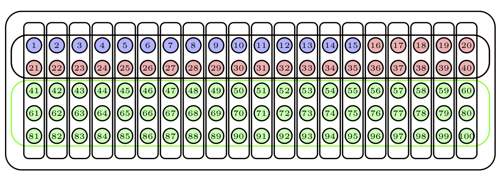

## Tipos básicos de muestreo {#sec:muestreo}

En un estudio estadístico inferencial, se toma una **muestra** de individuos de una **población** y se estiman algunas características de la población a partir de las de la muestra. Para que esto tenga sentido, es necesario que la muestra sea razonablemente **representativa** de la población. Pero, claro, sin conocer las características de la población, no podemos saber si una muestra es representativa o no. 

Para salir de este *impasse*, la solución comúnmente aceptada es tomar una muestra **aleatoria**, es decir, escogiendo sus sujetos de alguna manera al azar. Al hacerlo así:

* Se evitan preferencias en la elección, por lo que es más probable que la muestra sea representativa de la población (pero, naturalmente, no está garantizado: por pura mala suerte nos puede salir una muestra super rara, es lo que tiene el azar).

* Se pueden usar técnicas estadísticas que  permitirán acotar errores en la estimación y su probabilidad; por ejemplo, la probabilidad de que nuestra muestra sea super rara en algún sentido concreto.

Existen muchos métodos de **muestreo** de una población. A continuación describimos de forma breve algunas de estas técnicas.

### Muestreo aleatorio con y sin reposición {#sec:mas}

El **muestreo aleatorio** consiste en seleccionar una muestra de la población de manera que todas las muestras del mismo tamaño sean **equiprobables**; es decir, que si fijamos el número de individuos de la muestra, cualquier conjunto de ese número de individuos tenga la misma probabilidad de ser seleccionado.  

Hay dos tipos  básicos de muestreo aleatorio que vale la pena distinguir: **con** y **sin reposición**.   Para ilustrarlos, supongamos que disponemos de una urna con 100 bolas numeradas del 1 al 100, de la que queremos extraer una muestra de 15 bolas. La Figura \@ref(fig:base) representa dicha urna.

```{r, echo=FALSE, out.width="80%", label=base,fig.cap="Una urna de 100 bolas."}
knitr::include_graphics("INREMDN_files/figure-html/basev.png")
```

Una manera de hacerlo sería repetir 15 veces el proceso de sacar una bola de la urna, anotar su número y devolverla a la urna. El tipo de muestra obtenida de esta manera recibe el nombre de **muestra aleatoria con reposición**, o **muestra aleatoria simple**. Observad que con este procedimiento una misma bola puede aparecer varias veces en una muestra, y que todos los subconjuntos de 15 bolas "con posibles repeticiones"  tienen la misma probabilidad de obtenerse. Un posible resultado serían las bolas azules de la Figura \@ref(fig:simple); la bola azul más oscuro ha sido escogida dos veces en la muestra.


```{r, echo=FALSE, label=simple,fig.cap="Una muestra aleatoria simple.", out.width="80%"}
knitr::include_graphics("INREMDN_files/figure-html/simplev.png")
```

Otra manera de extraer nuestra muestra sería repetir 15 veces el proceso de sacar una bola de la urna  pero ahora sin devolverla. Esto es equivalente a extraer de golpe 15 bolas de la urna. Estas muestras no tienen bolas repetidas, y cualquier selección de 15 bolas diferentes tiene la misma probabilidad de ser la obtenida.  En este caso se habla de una **muestra aleatoria sin reposición**. Un posible resultado serían las bolas azules de la Figura \@ref(fig:sinrep).

```{r, echo=FALSE, label=sinrep,fig.cap="Una muestra aleatoria sin reposición.", out.width="80%"}
knitr::include_graphics("INREMDN_files/figure-html/sinrepv.png")
```


Cuando **el tamaño de la población es muy grande en relación al de la muestra**, como suele suceder en medicina, la probabilidad de que haya repeticiones en una muestra aleatoria simple es muy pequeña. Por ejemplo:

* Si escogemos 100 individuos de las Baleares al azar permitiendo repeticiones, la probabilidad de que se escoja más de una vez algún individuo es de `r round(pbirthday(100,1200000),3)`: solo en 1 de cada 250 muestras de 100 individuos de las Baleares elegidos al azar permitiendo repeticiones habría alguna repetición.

* Si escogemos 100 estudiantes de la UIB (que tiene alrededor de 12000 estudiantes) al azar permitiendo repeticiones, la probabilidad de que se escoja más de una vez algún individuo es de `r round(pbirthday(100,12000),3)`: en  algo más de 1 de cada 3 muestras de 100 estudiantes de la UIB elegidos al azar permitiendo repeticiones habría alguna repetición. 

     En cambio, si escogemos **10** estudiantes de la UIB al azar permitiendo repeticiones, la probabilidad de que se escoja más de una vez algún individuo ya es de `r round(pbirthday(10,12000),3)`.


Esto nos permite entender que, cuando la población es mucho más grande que la muestra,  los muestreos aleatorios con y sin reposición son equivalentes en el sentido siguiente: puesto que si la población es muy, muy grande, un muestreo con reposición daría casi seguro una muestra con todos sus elementos diferentes, podemos tomar directamente la muestra sin reposición y aceptar que permitíamos repeticiones, pero que no se han dado, y que por tanto la muestra es simple. 

* Una muestra aleatoria de 100 individuos de las Baleares diferentes, o de 10 estudiantes diferentes de la UIB, puede pasar perfectamente por una muestra tomada permitiendo repeticiones, porque aunque las permitiéramos, solo obtendríamos alguna repetición en una de cada 250 ocasiones: podemos estar casi seguros de que la nuestra es una de las 249 restantes.

* Pero en cambio ya es difícil de creer que una muestra aleatoria de 100 estudiantes diferentes de la UIB haya sido tomada permitiendo repeticiones, porque en una de cada tres muestras tomadas permitiendo repeticiones nos saldría alguna repetición: hay que ser muy optimistas para estar "casi seguros" de que la nuestra es una de las otras 2.

El muestreo aleatorio simple es el *estándard de excelencia* entre los métodos de muestreo, y la mayoría de los resultados que explicaremos en este curso presuponen que la muestra ha sido tomada aleatoria con reposición. Pero casi nunca es factible tomarla así.

Para poder tomar una muestra aleatoria de una población en el sentido de este apartado, con o sin reposición,  es necesario disponer de una lista completa de todos sus individuos  para poder sortear a quién vamos a seleccionar. Esto no siempre es posible. ¿Alguien tiene la  lista completa de, pongamos, todos los diabéticos de España? ¿Que incluya los que no saben que lo son? Por lo tanto, en la vida real no siempre podemos tomar muestras aleatorias en este sentido.

### Muestreo sistemático  (o a intervalos) {#sec:sist}

Una manera muy sencilla de obtener una muestra de una población cuando disponemos de una lista ordenada de sus individuos y nos da pereza efectuar un sorteo es tomarlos a intervalos constantes: uno de cada cinco individuos, uno de cada diez... Podemos añadir un componente aleatorio escogiendo al azar el primer individuo que elegimos, y a partir del cual empezamos a contar. A esta técnica se la llama **muestreo sistemático**, **aleatorio** si además el primer sujeto se escoge de manera aleatoria. 

Así, por ejemplo, si de una clase de 100 estudiantes quisiéramos escoger una muestra de 10, podríamos elegir un estudiante al azar, y a partir de él, por orden alfabético, elegir el décimo estudiante, el vigésimo, el trigésimo, etc.; si al llegar al final de la lista de clase no hubiéramos completado la muestra, volveríamos al principio de la misma. 

La Figura \@ref(fig:sist) describe una muestra aleatoria sistemática de 15 bolas de nuestra urna de 100 bolas: hemos empezado a escoger por la bola roja oscura, que ha sido elegida al azar, y a partir de ella hemos tomado las bolas a intervalos de 7, volviendo al principio cuando hemos llegado al final de la lista numerada.


```{r, echo=FALSE, label=sist, out.width="80%",fig.cap="Una muestra aleatoria sistemática."}
knitr::include_graphics("INREMDN_files/figure-html/sistv.png")
```


Cuando no disponemos de una lista de toda la población pero sí que tenemos una manera de acceder de manera ordenada a sujetos de la misma (por ejemplo, enfermos que acuden a un hospital), podemos realizar un muestreo sistemático tomando los sujetos a intervalos constantes a medida que los encontramos y hasta completar el tamaño deseado de la muestra. Por ejemplo, para escoger una muestra de 10 pacientes que hayan acudido a Urgencias por traumatismos en la cabeza, podríamos escoger pacientes a intervalos regulares de entre los que acudieran a Urgencias por este motivo  hasta llegar a los 10.
En situaciones en las que la lista de individuos de la población se va generando de forma "ordenada", por ejemplo por grupos (en días laborables, a Urgencias por las mañanas van predominantemente adultos y por las tardes niños), recorrer la lista a intervalos regulares garantiza  la representatividad de cada grupo.

   
### Muestreo aleatorio estratificado {#sec:estr}

Este método de muestreo se utiliza cuando la población está clasificada en  **estratos** que son de interés para la propiedad estudiada. Estos estratos serán grupos de individuos definidos por una característica concreta, de manera que individuos del mismo estrato tengan esa característica en común (los estratos sean **homogéneos** internamente) y individuos de estratos diferentes tengan esa característica diferente (los estratos sean **heterogéneos** externamente). Por ejemplo: sexos, franjas de edad, provincias, casos y controles...

En este caso, se toma una muestra aleatoria de un tamaño prefijado de cada estrato (en el sentido de la Sección \@ref(sec:mas))  y se unen en una muestra global. A este proceso se le llama **muestreo aleatorio estratificado**.  

Por lo que refiere a los tamaños de las muestras de cada estrato, se suele optar por una de las dos estrategias siguientes: 

* Imponer que la composición por estratos de la muestra global mantenga las proporciones de la población original, de manera que el tamaño de la muestra de cada estrato represente el mismo porcentaje del total de la muestra que el estrato correspondiente en la población completa. 

* Tomar los tamaños de manera que los estratos que representen una fracción muy pequeña de la población (tan pequeña que no esperaríamos que tuvieran representación en una muestra aleatoria  **transversal** de la población, es decir, tomada del total de la población sin tener en cuenta su composición en estratos) tengan una representación en la muestra mucho mayor que la que les tocaría. 

Por ejemplo, los estratos podrían ser grupos de edad y podríamos tomar la muestra de cada grupo de edad de tamaño proporcional a la fracción que representa dicho grupo de edad en la población total. O podrían ser los sexos y procuraríamos que nuestra muestra estuviera formada por un 50% de hombres y un 50% de mujeres. O, en las Islas Baleares, los estratos podrían ser las islas, y entonces podríamos  imponer que el número de representantes de cada isla en la muestra fuera proporcional a su población relativa dentro del conjunto total de la comunidad autónoma, o podríamos escoger la misma cantidad de individuos de cada isla, independientemente de su población.

```{block2,type="rmdnote"}
Cuando en un estudio de casos y controles escogemos un grupo de casos y uno de controles de tamaños prefijados, o  cuando en un estudio de cohorte escogemos un grupo de expuestos y uno de no expuestos de tamaños prefijados, se trata de un muestreo estratificado, aunque no siempre será aleatorio.
```

Por continuar con nuestra urna de 100 bolas, supongamos que contiene 40 bolas de un color y 60 de otro color según muestra la Figura \@ref(fig:estratprevi).


```{r, echo=FALSE, label=estratprevi,fig.cap="Nuestra urna ahora tiene dos  estratos.", out.width="80%"}

```
 
Para tomar una muestra aleatoria estratificada de 15 bolas, considerando como estratos los dos colores e imponiendo que la muestra refleje la composición de la urna, tomaríamos una muestra aleatoria de 6 bolas del primer color y una muestra aleatoria de 9 bolas del segundo color. De esta manera, los porcentajes de colores en la muestra serían los mismos que en la urna. La Figura \@ref(fig:estrat) describe una muestra obtenida de esta manera.


```{r, echo=FALSE, label=estrat, out.width="80%",fig.cap="Una muestra aleatoria estratificada."}
knitr::include_graphics("INREMDN_files/figure-html/estrat.png")
```
 
La ventaja del muestreo aleatorio estratificado respecto del transversal es que, como el investigador obtiene una muestra de cada estrato de la población del tamaño que  desee:

* Permite estimar la información de interés para cada estrato por separado, como si se tratara de  estudios independientes. 

* Permite estimar la información sobre subpoblaciones minoritarias que en una muestra aleatoria transversal aparecerían  subrepresentadas.

En todo caso, el muestreo por estratos solo es necesario si esperamos que las características que queremos estudiar varíen según el estrato. Por ejemplo, si queremos tomar una muestra para estimar la altura media de los españoles adultos y no creemos que la altura de un español adulto dependa de su provincia de origen, no hay ninguna necesidad de esforzarse en tomar una muestra de cada provincia de manera que todas las provincias estén representadas adecuadamente en la muestra.

Observad que el muestreo aleatorio por estratos tiene el mismo inconveniente que el muestreo aleatorio de la Sección  \@ref(sec:mas): es necesario disponer de una lista completa de  los individuos de cada estrato para poder sortearlos.


```{block2,type="rmdexercici"}
Tenemos una población clasificada en dos estratos, A y B. La subpoblación A representa un 20% de la población y la B el 80% restante. Hemos tomado una muestra aleatoria estratificada formada por 100 sujetos de cada subpoblación. Hemos medido una cierta característica  X de estos sujetos. La media de los valores de X de los sujetos A ha dado 5 y la media de los valores de X de los sujetos B ha dado 10.

*(a)* ¿Qué vale la media de los valores de X de toda la muestra de 200 sujetos?

*(b)* A partir de estos datos, ¿qué estimáis que vale la media de X en el total de la población?
    
```


### Muestreo por conglomerados {#sec:mcluster}

El proceso de obtener y estudiar una muestra aleatoria en algunos casos es caro o difícil, incluso aunque dispongamos de la lista completa de la población. Imaginad que quisiéramos estudiar la prevalencia y gravedad de la miopía entre los estudiantes de Primaria de las Baleares.  Para ello  tendríamos que seleccionar una muestra representativa de esta población de escolares. Seguramente, con algo de esfuerzo, podríamos disponer de su lista completa para este curso y por lo tanto podríamos tomar una muestra aleatoria, pero entonces acceder a las niñas y niños que la formasen seguramente significaría  contactar con unos pocos alumnos de muchos centros de primaria, lo que volvería el proceso lento y costoso. Y eso si la *Conselleria d'Educació* nos facilitase la lista completa de alumnos.

Una alternativa posible sería, en vez de elegir una muestra aleatoria de todos los estudiantes de Primaria, escoger primero al azar unas pocas aulas de primaria de colegios de las Baleares, a las que llamamos en este contexto **conglomerados** o **clústers**, y formar entonces nuestra muestra con todos los alumnos de estas aulas. Estaréis de acuerdo en que es mucho más sencillo disponer de la lista completa de estudiantes de unas pocas aulas que conseguir la lista completa de todos los estudiantes de todos los colegios, y mucho más barato ir a unos pocos colegios concretos que ir a todos los colegios de las Islas a entrevistar a unos pocos estudiantes en cada centro. 

En un **muestreo aleatorio por conglomerados**, tenemos la población repartida en pequeños grupos, los clústers, y lo que hacemos es elegir al azar una muestra  de  clústers y tomar todos los individuos de los  clústers elegidos.


Volviendo de nuevo a nuestra urna, supongamos que sus 100 bolas se agrupan en 20 conglomerados de 5 bolas cada uno según las franjas verticales de la Figura \@ref(fig:clustprevi) (donde mantenemos la clasificación en dos colores para poder comparar el resultado del muestreo por conglomerados con el estratificado).


```{r, echo=FALSE, label=clustprevi,fig.cap="Nuestra urna ahora tiene 2 estratos y 20 clústers.", out.width="80%"}
knitr::include_graphics("INREMDN_files/figure-html/clusterprevi.png")
```

Para obtener una muestra aleatoria por conglomerados de tamaño 15, escogeríamos al azar 3 conglomerados y la muestra estaría formada por sus bolas.  La Figura \@ref(fig:clust) describe una muestra obtenida de esta manera: los conglomerados escogidos están marcados en azul.


```{r, echo=FALSE, label=clust, out.width="80%",fig.cap="Una muestra aleatoria por conglomerados."}
knitr::include_graphics("INREMDN_files/figure-html/cluster.png")
```


Observad la diferencia entre el muestreo estratificado y el muestreo por conglomerados:

* **Muestreo estratificado**:
    * Los estratos forman una clasificación de los sujetos de la población en grupos grandes definidos por una característica que consideramos relevante en el estudio estadístico. Por ejemplo, el sexo o la franja de edad.

    * Se escoge una muestra aleatoria de cada estrato.

* **Muestreo por conglomerados**:

    * Los clústers forman una clasificación de los sujetos de la población en grupos pequeños de individuos definidos por una característica que en principio es irrelevante en el estudio estadístico. Por ejemplo, la manzana donde viven o el pediatra al que están asignados.

    * Se escogen algunos clústers al azar y se incluyen en la muestra todos sus miembros.

A menudo una vez elegidos los clústers no se toman todos los sujetos de los mismos, sino una muestra aleatoria de cada uno. Esto ya sería un ejemplo de muestreo **polietápico** (Sección \@ref(sec:poli)).

El muestreo por conglomerados se suele elegir por ser rápido de realizar, pero puede tener un inconveniente: puede que los sujetos de cada clúster  tiendan a parecerse los unos a los otros,  lo que puede sesgar la muestra. Cuando este método de muestreo es más efectivo es cuando se espera que los clústers sean heterogéneos en este sentido. En nuestro ejemplo de los niños de primaria de las Baleares, es más creíble que las clases sean heterogéneas por lo que refiere a la miopía que en lo referente a comportamientos en los que influya la pertenencia a un grupo, por ejemplo la series de TV preferidas.


### Muestreos no aleatorios   {#sec:oport}

Cuando la selección de la muestra no es aleatoria, se habla de  **muestreo no aleatorio**. En realidad es el tipo más frecuente de muestreo porque casi siempre nos tenemos que conformar con los sujetos disponibles.  Por ejemplo, en la UIB, para estimar la opinión que de un profesor tienen los alumnos de una clase, solo se tiene en cuenta las respuestas de los estudiantes que voluntariamente  rellenan la encuesta de opinión,  que de ninguna manera forman una  muestra aleatoria: el perfil del estudiante que contesta voluntariamente una encuesta de este tipo es muy específico y no viene determinado por el azar. En este caso se trataría de una **muestra auto-seleccionada**. 

Otro tipo de muestras no aleatorias son las **oportunistas**. Este es el caso, por ejemplo, si para estimar la opinión que de un profesor tienen los alumnos de una asignatura se visita un día la clase y se pasa la encuesta a los estudiantes que ese día asistieron a clase. De nuevo, puede que los alumnos presentes no sean representativos del alumnado de la asignatura (pueden ser los más aplicados, o los que no tienen la gripe, o a los que la asignatura no les coincide con otra). 

La Figura \@ref(fig:oport) describe una muestra oportunista de nuestra urna: sus 15 primeras bolas. 

```{r, echo=FALSE, label=oport,fig.cap="Una muestra oportunista.", out.width="80%"}

```


**Las técnicas de estadística inferencial no se pueden aplicar a muestras no aleatorias**. Pero normalmente solo podemos conseguir muestras no aleatorias. En este caso, lo que se suele hacer es describir en detalle las características de la muestra para justificar que, pese a no ser aleatoria, es razonablemente representativa de la población y podría pasar por  aleatoria. Por ejemplo, la muestra oportunista anterior de nuestra urna no es de ninguna manera representativa de su contenido por lo que refiere al color de las bolas.


```{block2,type="rmdexercici"}
Para conocer la opinión de los estudiantes de Medicina españoles sobre un tema concreto, os la pido a vosotros. ¿Qué tipo de muestreo he realizado de los explicados hasta ahora?
```

### Muestreo polietápico {#sec:poli}

En el ejemplo de los estudiantes de Primaria, la muestra final de estudiantes estaba formada por todos los individuos de las aulas elegidas. Otra opción podría haber sido, tras seleccionar la muestra aleatoria de clústers, tomar de alguna manera una muestra aleatoria de cada uno de ellos. Por ejemplo, algunos estudios poblacionales a nivel estatal se realizan solamente en algunas provincias escogidas aleatoriamente, en las que luego se encuesta una muestra aleatoria de habitantes. Este sería un ejemplo de **muestreo polietápico**, en el que la muestra no se obtiene en un solo paso, sino mediante diversas elecciones sucesivas. La Figura \@ref(fig:poli) muestra un ejemplo sencillo de muestreo polietápico de nuestra urna: hemos elegido al azar 5 conglomerados (marcados en azul) y de cada uno de ellos hemos elegido 3 bolas al azar sin reposición.


```{r, echo=FALSE, label=poli,fig.cap="Una muestra polietápica.", out.width="80%"}
knitr::include_graphics("INREMDN_files/figure-html/poli.png")
```

Veamos algunos ejemplos más. Recordad el estudio CORSAIB del Ejemplo \@ref(exm:corsaib). Vamos a detallar algo más  el proceso mediante el cual se eligieron los participantes:

1. Se dividieron las Baleares en 14 sectores geográficos. Se ofreció la participación a los médicos de familia para conseguir que colaborasen 3-4 médicos por sector, hasta llegar a los 50 médicos.

2. De la población adscrita a cada médico participante se obtuvo una muestra aleatoria  de 40 individuos.

Como veis, el muestreo tuvo dos etapas. En la primera se seleccionaron clústers mediante un muestreo no aleatorio estratificado: los estratos fueron los 14 sectores geográficos, los clústers elegidos estaban formados por los grupos de pacientes adscritos a los médicos de familia que voluntariamente participaron en el estudio. La segunda fue un muestreo aleatorio dentro de cada clúster.


Veamos otro ejemplo  más complicado. En el estudio ["Factors associated with risk of low folate intake among adolescents"](https://www.scielo.br/pdf/jped/v82n2/en_v82n2a08.pdf) (M. Vitolo *et al*, *Jornal de Pediatria* 82 (2006), pp. 121–126) 
los investigadores tenían que tomar una muestra de adolescentes de San Leopoldo (Brasil). Para ello:

1. En primer lugar, escogieron mediante un muestreo aleatorio sistemático varias secciones censales de las 40 que tiene la ciudad.
1. A continuación, escogieron al azar varias manzanas de cada una de estas secciones censales y una esquina de cada manzana.
1. Finalmente, se eligieron direcciones de cada manzana de nuevo de manera sistemática: una de cada tres en sentido horario a partir de la esquina seleccionada.
1. Se invitó entonces a participar en el estudio a todos los habitantes de 10 a 19 años en las casas o fincas seleccionadas. El total eligible de adolescentes fueron 810, de los que consintieron a participar en el estudio  722.

En este proceso, se realizaron: un muestreo sistemático (las secciones censales), dos muestreos aleatorios sin reposición (las manzanas y las esquinas), otro muestreo sistemático (las direcciones) y un muestreo no aleatorio (los voluntarios). 

Un último ejemplo. Recordad el estudio sobre enfermedades y mes de nacimiento del Ejemplo \@ref(exm:quesada), donde "se escogió al azar una muestra de 29,478 españoles". En  realidad, **no** se tomó una lista de toda la población española a 1 de enero de 2017 y se escogió al azar de manera equiprobable una conjunto de  29,478 personas, sino que se usó la muestra de la *Encuesta Nacional de Salud* de ese año, que se escoge de la manera polietápica siguiente (podéis consultar [aquí](https://www.ine.es/metodologia/t15/t153041917.pdf) la metodología en detalle):

1. Se clasifican los municipios españoles en 7 tipos según su población.

2. En cada comunidad autónoma y para cada tipo de municipios, se toma una muestra aleatoria de un número de secciones censales proporcional a su población.

3. De cada sección censal elegida, se escogen un número fijo de  primeras residencias (en 2017 fueron 15) por muestreo aleatorio sistemático (y previa una ordenación específica de las viviendas según su tamaño).

4. En cada vivienda se escoge equiprobablemente un individuo adulto.

Fijaos que, en (2), se toma una muestra aleatoria estratificada de secciones censales: los estratos son las combinaciones de comunidad autónoma y tipo de municipio.

Existen otros tipos de muestreo, solo hemos explicado los más comunes. En cualquier caso, lo importante es recordar que el estudio estadístico que se realice  dependerá del tipo de muestreo usado. Por ejemplo, no se pueden usar las mismas técnicas para analizar una muestra aleatoria simple que una muestra estratificada o una muestra por conglomerados.  En este curso estudiaremos las propiedades de las diferentes técnicas de estimación casi exclusivamente para el caso de  **muestreo aleatorio simple**, es decir, al azar y con reposición, o al azar sin reposición si la población es muy   grande comparada con la muestra.


```{block2,type="rmdexercici"}
Deseamos llevar a cabo un estudio para determinar si un diabético tipo 2  en las Baleares tiene una mayor probabilidad de infectarse de COVID-19 que una persona sin esa patología. Además, queremos poder comparar las probabilidades entre los diabéticos de Mallorca, de  Menorca y de Ibiza. Como parte del estudio, tendremos que tomar una muestra de diabéticos tipo 2 y realizarles un análisis de anticuerpos. Hemos calculado que para que las conclusiones sean fiables, necesitamos analizar 50 diabéticos de cada isla.

Explicad en detalle cómo obtendríais esta muestra de diabéticos; el procedimiento ha de ser fácil de llevar a cabo y ha de dar muestras razonablemente representativas de las poblaciones de diabéticos.

```