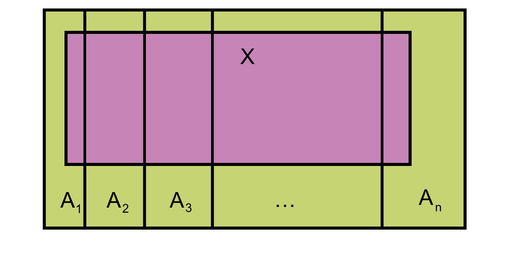

# (PART\*) Tema II: Probabilidades  {-}

# Probabilidades elementales "en abstracto"

La probabilidad de un suceso es un número entre 0 y 1 (un porcentaje entre 0% y 100%) que mide la expectativa de que se dé este suceso. En este curso, vamos a interpretar intuitivamente la **probabilidad de un suceso** como la **proporción** (la **fracción**, el **porcentaje**) de sujetos de una población (o a veces de una muestra, dependerá del contexto) en los que se da el suceso. 

```{example}
La probabilidad de que al lanzar una moneda al aire salga cara es la proporción de la población (virtual) de lanzamientos de esta moneda en los que sale cara.
```

En casos MUY sencillos, esta proporción coincide con la fracción de veces en que se da este suceso en el conjunto de  resultados posibles, es decir, con el cociente **(casos favorables)/(casos posibles)**. Esto solo es cierto cuando todos los resultados posibles tienen la misma probabilidad (y aquí entramos en un bucle: para poder aplicar esta fórmula hay que saber la probabilidad de cada uno de los resultados posibles, para garantizar que son iguales, pero no podemos calcularlas con esta fórmula sin saber que todas son iguales, pero para saberlo necesitamos calcularlas...)


Por ejemplo:

* La probabilidad de que salga cara al lanzar una moneda equilibrada al aire es 1/2

* La probabilidad de escoger un estudiante varón en una clase de 50 mujeres y 10 hombres (y si todos los estudiantes tienen la misma probabilidad de ser elegidos) es 10/60=1/6

* Pero la probabilidad de que un joven de 18 años sea miope no es 1/2, aunque solo haya dos resultados posibles: ser miope y no serlo. la probabilidad de que un joven de 18 años sea miope es la proporción de miopes en la población formada por todas las personas que hoy tienen 18 años.  

* La probabilidad de que un hijo sea varón no es 1/2, aunque solo haya dos sexos anatómicos. Es la proporción de hijos varones en el total de todos los hijos, que se estima en alrededor del 51.22%


```{block2,type="rmdromans"}
Si lanzamos al aire dos veces seguidas una moneda equilibrada, ¿cuál es la probabilidad de que salga alguna cara?
  
Según [J. d'Alembert](https://es.wikipedia.org/wiki/Jean_le_Rond_d%27Alembert) es 2/3. Si en el primer lanzamiento sale cara, ya tenemos una cara, y si sale cruz, volvemos a lanzar otra vez y miramos si sale cara o cruz. Por lo tanto, hay solo 3 resultados posibles, de los cuales en 2 sale alguna cara: casos favorables partido por casos posibles, 2/3.

¿Qué falla en este argumento?
```


La teoría matemática de las probabilidades es la que nos permite estudiar lo exacta que es una estimación de un valor para una población a partir de una muestra. Por ejemplo, supongamos que elegimos al azar un grupo de 50 estudiantes de la UIB y observamos que 11 sufren de miopía. A partir de este dato, estimamos que un 22% de los estudiantes de la UIB son miopes. La técnicas de teoría de las probabilidades nos permitirán calcular la probabilidad de acertar con esta estimación con un margen de error fijado.

En medicina, las probabilidades (recordad, las proporciones de sujetos de una población con una determinada característica) aparecen bajo diferentes términos. Por ejemplo

* **Riesgo** de algo: La probabilidad de que ese algo (usualmente negativo) pase

* **Prevalencia** de algo: La probabilidad de que un individuo de una población tenga ese algo en un momento determinado.

* **Tasa** de algo: Es equivalente a la "proporción" o la "fracción" de ese algo en algún total. 

     Por ejemplo, la **tasa de mortalidad** de una enfermedad es la proporción de individuos de una población que mueren por esa enfermedad en un período determinado, y por tanto la probabilidad de que un individuo de esa población muera por esa enfermedad en ese período determinado de tiempo. 
    
    O por ejemplo, al hablar de incidencia, a veces se usa el término **tasa de incidencia** de una enfermedad para significar la proporción de casos nuevos de esa enfermedad en una población (sana) en un cierto periodo de tiempo, y por lo tanto es la probabilidad de que un individuo (sano) escogido al azar de una población coja esa enfermedad durante un cierto periodo de tiempo.


```{example}
En el artículo ["Incidencia, prevalencia y mortalidad del cáncer renal en España: estimaciones y proyecciones para el período 1998-2022"](https://www.sciencedirect.com/science/article/pii/S0210480611003767) (*Actas Urológicas Españolas* 36 (2012), pp. 521-526) se puede leer:

```


> En hombres se espera un aumento de la tasa de incidencia [del cáncer de riñón] de 11.92 casos por 100000 habitantes/año a 15.7. La prevalencia aumentaría de 72.842  a 94.47 y la mortalidad de 5.77 a 7.29. 


En todos los casos se trata de estimaciones de  probabilidades. Se estima que:

* La probabilidad de que un hombre sano cogiera cáncer de riñón en 1998 fue de 
11.92/10^5^ y se estima que será de 15.7/10^5^ en 2022.

* La probabilidad de que un hombre tuviera cáncer de riñón en 1998 fue de  72.842/10^5^ y se estima que será de 94.47/10^5^ en 2022.

* La probabilidad de que un hombre muriera de cáncer de riñón en 1998 fue de  5.77/10^5^ y se estima que será de 7.29/10^5^ en 2022.

## Álgebra de conjuntos

Vamos a repasar muy rápidamente las notaciones y las propiedades de las operaciones de conjuntos. Las tres operaciones básicas entre conjuntos son la unión, la intersección y el complementario.

Sean $A$ y $B$ subconjuntos (en el contexto de la teoría de probabilidades, se los llama **sucesos**) de un conjunto $\Omega$ (nuestra **población** o, en el lenguage de la teoría de probabilidades, el **espacio muestral**).

* $A\cup B$ es la **unión** de $A$ y $B$:  el conjunto formado por los elementos que pertenecen a $A$ o a $B$ o a los dos.

     Corresponde a la **disjunción**  del lenguage natural.
     
* $A \cap B$ es la **intersección**  de $A$ y $B$:  el conjunto formado por los elementos que pertenecen simultáneamente a $A$ y a $B$.

     Corresponde a la **conjunción**  del lenguage natural.


* $A^c$es el **complementario** de $A$:  el conjunto formado por los elementos de $\Omega$ que no pertenecen a $A$.

     Corresponde a la **negación**  del lenguage natural.

* $A-B=A \cap B^c$:  La **diferencia** "$A$ menos $B$: es el conjunto formado por los elementos que pertenecen a $A$ pero no pertenecen a $B$.

Diremos que $A$ y $B$ son **disjuntos**, o **incompatibles**, cuando $A\cap B=\emptyset$, donde $\emptyset$ denota el **conjunto vacío**, el conjunto que no tiene elementos.

Diremos que $A$ está **contenido**, o **incluido**, en $B$, y lo denotaremos por $A\subseteq B$, cuando todo elemento de $A$ pertenece a $B$.

```{example}
Consideremos la población $\Omega$ formada por los estudiantes de esta clase, y sean $A$ el subconjunto formado por la mujeres de esta clase y $B$ el subconjunto formado por los estudiantes de esta clase que llevan gafas.

````

Entonces:


* $A\cup B$ indica el conjunto de los estudiantes de esta clase que son mujeres **o** llevan gafas.

* $A \cap B$ indica  el conjunto de los estudiantes de esta clase que son mujeres **y** llevan gafas, es decir, las mujeres de esta clase que llevan gafas.

* $B^c$  indica  el conjunto de los estudiantes de esta clase que  **no** son mujeres, es decir el conjunto de los hombres  de esta clase.

* $B^c$  indica  el conjunto de los estudiantes de esta clase que  **no** llevan gafas.

* $A-B$  indica  el conjunto de las mujeres de esta clase que **no** llevan gafas.

* $B-A$  indica  el conjunto de las hombres de esta clase que **sí** llevan gafas

* $A$ y $B$ serán incompatibles si no hay ninguna mujer en esta clase que lleve gafas.

* $A\subseteq B$ si todas las mujeres de esta clase llevan gafas. 

* $B\subseteq A$  si todos los estudiantes  de esta clase que llevan gafas son mujeres. 

Las propiedades de estas operaciones son las siguientes, y se corresponden a las
 propiedades (correctas) de las conjunciones, disjunciones y negaciones en el lenguaje natural.

a. La unión y la intersección son **conmutativas**: $A\cup B=B\cup A$ y $A\cap B=B\cap A$

a. La unión y la intersección son **asociativas**: $A\cup(B\cup C)=(A\cup B)\cup C$ y $A\cap(B\cap C)=(A\cap B) \cap C$

a. La unión y la intersección son **distributivas**: $A\cap(B\cup C)=(A\cap B)\cup (A\cap C)$ y $A\cup(B\cap C)=(A\cup B)\cap (A\cup C)$


```{r, echo=FALSE, out.width="80%", fig.cap="Propiedad distributiva de la unión respecto de la intersección."}
knitr::include_graphics("INREMDN_files/figure-html/distr1BD.png")
```

```{r, echo=FALSE, out.width="80%", fig.cap="Propiedad distributiva de la intersección respecto de la unión."}
knitr::include_graphics("INREMDN_files/figure-html/distr2BD.png")
```

a. Propiedad del **doble complementario**: $(A^c)^c=A$. 

    Corresponde al hecho de que, en el lenguaje natural, "No es verdad que no lleve gafas" significa lo mismo que "Lleva gafas".

```{r, echo=FALSE, out.width="80%", fig.cap="Propiedad del doble complementario."}
knitr::include_graphics("INREMDN_files/figure-html/dcBD.png")
```

a. **Leyes de De Morgan**: $(A\cup B)^c=A^c \cap B^c$  y $(A\cap B)^c=A^c\cup B^c$. 

    La primera corresponde al hecho de que, en el lenguaje natural, lo contrario de "Ser mujer o llevar gafas" es "No ser mujer  y no llevar gafas". La segunda corresponde al hecho de que, en el lenguaje natural, lo contrario de "Ser mujer y llevar gafas" es "No ser mujer  o no llevar gafas".

```{r, echo=FALSE, out.width="80%", fig.cap="Primera ley de de Morgan."}
knitr::include_graphics("INREMDN_files/figure-html/dM1BD.png")
```

```{r, echo=FALSE, out.width="80%", fig.cap="Segunda ley de de Morgan."}
knitr::include_graphics("INREMDN_files/figure-html/dM2BD.png")
```


## Propiedades de las probabilidades

Hemos definido la probabilidad $P(A)$ de un subconjunto (o suceso) $A$ de una población (o espacio muestral) $\Omega$ como la fracción de los sujetos de $\Omega$ que pertenecen a $A$. 

A partir de esta definición se deducen de manera más o menos intuitiva las propiedades siguientes:

1.  $0\leq P(A)\leq 1$, para todo suceso $A$ (un subconjunto $A$ de $\Omega$ no puede representar ni una fracción negativa ni una fracción mayor que 1 de los sujetos de $\Omega$).

2. $P(\EM)=1$ y $P(\emptyset)=0$.

3. Si $A$ y $B$ son dos sucesos disjuntos, entonces $P(A\cup B)=P(A)+P(B)$ (si no hay ningún sujetos que pertenezca simultáneamente a $A$ y a $B$, entonces la fracción de los sujetos que pertenecen a $A$ o a $B$ se obtiene sumando las fracciones de los que pertenecen a $A$ y de los que pertenecen a $B$).

4. Más en general, si $A_1,A_2,\ldots,A_n$ son sucesos disjuntos dos a dos, entonces
$$
P(A_1\cup A_2\cup \cdots \cup A_n)=P(A_1)+P(A_2)+\cdots +P(A_n)
$$

5. $P(A-B)=P(A)-P(A\cap B)$. 

    En efecto, como $A-B$ y $A\cap B$ son disjuntos (ningún elemento de $A-B$ pertenece a $B$ y todos los elementos de $A\cap B$ pertenecen a $B$) tenemos que $P((A-B)\cup (A\cap B))=P(A-B)+P(A\cap B)$; y por otro lado $(A-B)\cup (A\cap B)=A$, porque $A$ es la unión del conjunto de sus elementos que no pertenecen a $B$ y del conjunto de sus elementos que sí pertenecen a $B$, como podéis ver en la Figura \@ref(fig:AmenysB).


```{r AmenysB, echo=FALSE, out.width="50%", fig.cap="Descomposición de la unión en tres conjuntos disjuntos."}
knitr::include_graphics("INREMDN_files/figure-html/A-B.png")
```

6. $P(A^c)=1-P(A)$ (la fracción de los sujetos que no pertenecen a $A$ es 1 menos la fracción de los que sí pertenecen a $A$).

7. Si $A\subseteq B$, entonces $P(A)\leq P(B)$ (si $A$ está contenido en $B$, la la fracción de los sujetos que  pertenecen a $A$ es más pequeña que la  de los que  pertenecen a $B$).


8. $P(A\cup B)=P(A)+P(B)-P(A \cap B)$, porque $A\cup B=(A-B)\cup (B-A)\cup (A\cap B)$,  como podéis ver en la Figura \@ref(fig:AmenysB), y estos tres conjuntos son disjuntos, por lo que podéis aplicar la propiedad 4.

9. Si $A=\{a_1,a_2,\ldots,a_k\}$, entonces
$$
P(A)=P(a_1)+P(a_2)+\cdots+P(a_k)
$$
(de ahora en adelante, para simplificar, si $a\in \Omega$, escribiremos $P(a)$ en vez de $P(\{a\})$). Esta propiedad también se deduce directamente de la propiedad 4

10. Fijaos que de esta propiedad se deduce la **Fórmula de Laplace** que hemos mencionado al principio de esta lección: Si $\Omega$ es finito y todos sus elementos  tienen la misma probabilidad, entonces 
$$
P(A)=\frac{|A|}{|\Omega|}=\Big(\frac{\text{casos favorables}}{\text{casos posibles}}\Big)
$$
(donde $|A|$ denota el **cardinal** de $A$, es decir, su número de elementos).

```{block2,type="rmdcorbes"}
Suponed que $\Omega$ tiene $n$ elementos, $Omega=\{x_1,\ldots,x_n\}$, y que $P(x_1)=\cdots=P(x_n)$. Sea $p$ esta probabilidad común a todos los elementos de $\Omega$. Entonces, por las propiedades 2 y 9,
$$
1=P(\Omega)=P(x_1)+\cdots+P(x_n)=n\cdot p
$$
  de donde deducimos que $p=1/n$: cada elemento de $\Omega$ tiene  probabilidad $1/n$.

Si ahora $A$ tiene $k$ elementos, digamos $A=\{x_{i_1},\ldots,x_{i_k}\}$, entonces
$$
  P(A)=P(x_{i_1})+\cdots+P(x_{i_k})=\overbrace{\frac{1}{n}+\cdots+\frac{1}{n}}^k==\frac{k}{n}=\frac{|A|}{|\Omega|}
$$
```

```{block2,type="rmdcaution"}
En general, es falso que $P(A\cap B)=P(A)\cdot P(B)$. Más adelante veremos cuándo esta igualdad se cumple.
```


```{example,VIHherpes1}
Supongamos el 0.1% de todos los donantes de sangre da positivo en el test de VIH, y el 1% da positivo en el test de herpes simple (VHS). El 0.05% da positivo en los dos tests. 

*(a)* ¿Cuál es la probabilidad de que un donante escogido al azar dé positivo en algún test?

*(b)* ¿Cuál es la probabilidad de que un donante escogido al azar dé positivo en VHS pero no en VIH?
  
```

Vamos a poner nombres a los sucesos involucrados en estas preguntas:

* $A$: Dar positivo en VIH. Sabemos que $P(A)=0.001$.


* $B$: Dar positivo en VHS Sabemos que $P(B)=0.01$.


* $A\cap B$: Dar positivo en los dos. Sabemos que $P(A\cap B)=0.0005$.


* $A\cup B$: Dar positivo en algún test. Es lo que queremos calcular en (a).

    Por la propiedad (8):
$$
P(A \cup B) =P(A)+P(B)-P(A\cap B)=0.001+0.01-0.0005=0.0105
$$

* $B-A$: Dar positivo en VHS pero no en VIH. Es lo que queremos calcular en (b).

    Por la propiedad (5),
$$
P(B-A)=P(B)-P(A\cap B)=0.01-0.0005=0.0095
$$

Otra manera de calcular estas probabilidades sin necesidad de recordar fórmulas sería:

* Tomar como referencia una población de un tamaño fijado y bastante grande; 
* Calcular en esta población cuántos individuos pertenecen a $A\cap B$ (dan positivo en ambos tests), cuántos a $A-B$ (positivos en VIH pero no en VHS), cuántos a $B-A$ (positivos en VHS pero no en VIH) y cuántos a $A^c\cap B^c$ (negativo en ambos tests) y a partir de aquí calcular todo lo que queramos.

A este método se le suele llamar **método de frecuencias naturales**. Pongámoslo en práctica en nuestro caso:

1. Vamos a tomar una población de referencia de 10,000 donantes ¿Por qué este número? Veamos, fijaos en que la proporción de sujetos en $A\cap B$ es del 0.05%, es decir, 0.0005, y para facilitar los cálculos me gustaría que el número de sujetos en mi población fuera entero, para no liarme con decimales. Como 0.0005·10000=5, me vale.

1. Los sujetos de $A$ son el 0.1% de la población: 10
1. Los sujetos de $B$ son el 1% de la población: 100
1. Los sujetos de $A\cap B$ son el 0.05% de la población: 5
1. Entonces, los sujetos de $A-B$ serán los de $A$ menos los de $A\cap B$: 5
1. Y los sujetos de $B-A$ serán los de $B$ menos los de $A\cap B$: 95
1. Por ahora ya tenemos 5 sujetos positivos en VIH y en VHS, 5 positivos en VIH y negativos en VHS, y 95 positivos en VHS y negativos en VIH, en total 105. El resto serán negativos tanto en VIH como en VHS.
1. Por lo tanto, los sujetos de $A^c\cap B^c$ serán 10000-105=9895.

Obtenemos la tabla de frecuencias siguiente:
$$
\begin{array}{r|c|c|c}
& A\ (\text{VIH}+) & A^c \ (\text{VIH}-)  & \text{Total} \\ \hline
B\ (\text{VHS}+) &  5  &  95  &   100 \\ \hline
B^c\ (\text{VHS}-) &  5  &   9895  &   9900 \\ \hline 
\text{Total} & 10& 9990 & 10000  \\ 
\end{array}
$$

Y ahora, cambiando "probabilidad" por "proporción", ya podemos calcular lo que queramos.

*(a)*  ¿Cuál es la proporción de sujetos que dan positivo en algún test?

Hay 105 sujetos en la tabla que dan positivo en algún test, por lo que la proporción es 105/10000=0.0105


*(b)* ¿Cuál es la proporción de sujetos que dan positivo en VHS pero no en VIH?

Hay 95 sujetos en la tabla que dan positivo en VHS y negativo en VIH, por lo que la proporción es 95/10000=0.0095


```{block2,type="rmdexercici"}
Seguimos en la situación anterior: el 0.1% de todos los donantes de sangre da positivo en el test de VIH, el 1% da positivo en el test de herpes, y el 0.05% da positivo en los dos tests.

*(a)* ¿Cuál es la probabilidad de que un donante escogido al azar no dé positivo en ninguno de los dos tests?
  
*(b)* ¿Cuál es la probabilidad de que un donante escogido al azar dé positivo en un solo test?
  
```


```{block2,type="rmdexercici"}
Supongamos ahora que 0.1% de todos los donantes de sangre da positivo en el test de VIH, el 1% da positivo en el test de herpes y el *1.06%* da positivo en alguno de los dos tests. 

¿Cuál es la probabilidad de que un donante escogido al azar dé positivo en ambos?

```


## Odds

En algunos contextos, las probabilidades se presentan en forma de **odds**  (la traducción más común en castellano es **momios**, pero se usan otras: posibilidades, oportunidades...). Las **odds** de un suceso $A$ son
$$
\text{Odds}(A)=\frac{P(A)}{P(A^c)}=\frac{P(A)}{1-P(A)}.
$$

Indican cuántas veces es más probable $A$ que "no $A$".


```{r catmummies, echo=FALSE, out.width="50%", fig.cap="Momios de gatitos en el British Museum (fotografía de M. Sánchez)."}
knitr::include_graphics("INREMDN_files/figure-html/catmummies.png")
```


Si $\text{Odds}(A)=q$, significa que **por cada vez que ocurre "no $A$", ocurre  $q$ veces $A$**. Por ejemplo, si las *odds* de suspender una asignatura son 2/3, significa que:

* Por cada estudiante que aprueba, hay 2/3 de estudiante que suspenden.
* Por cada 3 estudiantes que aprueban, hay 2 que suspenden.
* De cada 5 estudiantes, 3 aprueban y 2  suspenden.

```{example}
* Si $P(A)=0.2$, $\text{Odds}(A)=0.2/0.8=0.25$.
* Si $P(A)=0$, $\text{Odds}(A)=0$.
* Si $P(A)=0.5$, $\text{Odds}(A)=1$.
* Si $P(A)=1$, $\text{Odds}(A)=\infty$.
```


```{block2,type="rmdexercici"}
Si lanzamos un dado equilibrado, de 6 caras, al aire:}

1. ¿Qué valen  las *odds* de sacar un 3? 

1. ¿Qué valen  las *odds* de sacar un múltiplo de 3?
```

Si sabemos las *odds* de $A$, podemos calcular la probabilidad $P(A)$. Por ejemplo, si $\text{Odds}(A)=2/3$ 
$$
\begin{array}{l}
\dfrac{2}{3}=\dfrac{P(A)}{1-P(A)}\Rightarrow 2-2P(A)=3P(A)\\
\qquad \Rightarrow 2=5P(A)\Rightarrow P(A)=\dfrac{2}{5}=0.4
\end{array}
$$

En general
$$
P(A)=\dfrac{\text{Odds}(A)}{1+\text{Odds}(A)}
$$

La función
$$
y=\frac{x}{1+x}
$$
es creciente en $x$:
```{r,echo=FALSE,fig.cap="Gráfica de la curva y=x/(1+x)."}
plot(function(x){x/(1+x)},xlim=c(0,10),lwd=1.5,ylab="y")
```

Por lo tanto 
$$
\begin{array}{c}
\text{Odds}(A)<\text{Odds}(B)\Longleftrightarrow P(A)<P(B)\\ 
\text{Odds}(A)>\text{Odds}(B)\Longleftrightarrow P(A)>P(B)\\ 
\text{Odds}(A)=\text{Odds}(B)\Longleftrightarrow P(A)=P(B)
\end{array}
$$

En estudios de casos y controles, la manera correcta de presentar cuánto más probable es un desenlace si se ha estado expuesto a un factor de riesgo que si no se ha estado es por medio de una *odds ratio*. La  **odds ratio** (**razón de momios**, de oportunidades...) de dos sucesos $A$ y $B$ es el cociente de sus *odds*:
$$
\text{OR}(A,B)=\frac{\text{Odds}(A)}{\text{Odds}(B)}
$$
Es difícil de interpretar excepto su relación con 1:

*  $\text{OR}(A,B)=1\Longleftrightarrow \text{Odds}(A)=\text{Odds}(B) \Longleftrightarrow P(A)=P(B)$

* $\text{OR}(A,B)>1\Longleftrightarrow \text{Odds}(A)>\text{Odds}(B) \Longleftrightarrow P(A)>P(B)$

* $\text{OR}(A,B)<1\Longleftrightarrow \text{Odds}(A)<\text{Odds}(B) \Longleftrightarrow P(A)<P(B)$


Pero, por ejemplo
$$
\text{OR}(A,B)=2 \Longleftrightarrow \text{Odds}(A)= 2\cdot \text{Odds}(B) \hspace{1.2ex}
\not\hspace{-1.2ex}\Longleftrightarrow P(A)=
2\cdot P(B)
$$

```{block2,type="rmdcorbes"}
Si $\text{OR}(A,B)=2$, significa que
$$
\begin{array}{l}
P(A)=\dfrac{\text{Odds}(A)}{1+\text{Odds}(A)}=\dfrac{2\cdot\text{Odds}(B)}{1+2\cdot\text{Odds}(B)}\\
\qquad =\dfrac{\frac{P(B)}{1-P(B)}}{1+2\frac{P(B)}{1-P(B)}}=\dfrac{P(B)}{1-P(B)+2P(B)}=\dfrac{P(B)}{1+P(B)}
\end{array}
$$
````

```{example}
En un [estudio de casos y controles reciente](https://www.gastrojournal.org/article/S0016-5085(20)30490-X/fulltext)
 (Y. Nobel *et al*, *Gastroenterology* 159 (2020), pp. 373-375) se afirma que

```

> "la presencia de síntomas gastrointestinales se asoció a un incremento del 70% en el riesgo de dar positivo [en el test de COVID-19]:  odds ratio, 1.7."

¿Qué significa esto? Que la *odds ratio* valga 1.7 significa que las *odds* de dar positivo en COVID-19 si se tienen síntomas gastrointestinales son 1.7 veces las de dar positivo si no se tienen síntomas gastrointestinales, es decir un 70% mayores. Pero las *odds*, no el **riesgo** entendido en sentido de **probabilidad**: no tiene por qué ser cierto que la proporción de sujetos con síntomas gastrointestinales  que dan positivo en COVID-19 sea un 70% mayor que la proporción de sujetos con síntomas gastrointestinales  que dan positivo en COVID-19.

En este estudio concreto, se obtuvo la tabla de frecuencias siguiente (SG significa "síntomas gastrointestinales")
$$
\begin{array}{r|c|c|c}
& \text{COVID-19 } + & \text{COVID-19 } + & \text{Total}\\ \hline
\text{SG Sí} & 97&	63 & 160\\\hline
\text{SG No}  & 181 &	175 & 356\hline
\text{Total} & 278 & 238 &  316
\end{array}
$$
por lo que la proporción de COVID-19 positivos entre los que tuvieron síntomas gastrointestinales fue 97/160=0.6 y   la proporción de COVID-19 positivos entre los que no tuvieron síntomas gastrointestinales fue 181/356=0.5: la primera es un 20% mayor que la segunda, no un 70% mayor.


```{block2,type="rmdexercici"}
1. ¿Qué valen las *odds* de sacar 3 caras en 3 lanzamientos de una moneda equilibrada?

1. Si un suceso pasa 2 veces de cada 10 veces que puede pasar, ¿qué valen las *odds* que pase?

1. Si las *odds* de $A$ son 1/2, ¿qué vale $P(A)$?

1.  Si $\text{OR}(A,B)=0.5$ y $P(A)=1/2$, ¿qué vale $P(B)$?

1. Sí $\text{OR}(A,B)=0.5$ y $P(A)=3/4$, ¿qué vale $P(B)$?
```


## Probabilidad condicionada

Dados dos sucesos $A$ y $B$, con $P(A)>0$, la **probabilidad $P(B|A)$ de $B$ condicionada a $A$** es 
$$
P(B|A)=\frac{P(A\cap B)}{P(A)}
$$

Este valor representa la probabilidad de que si pasa $A$, entonces pase $B$; es decir, la proporción, entre los sujetos que satisfacen $A$, de los que también satisfacen  $B$.

```{block2,type="rmdimportant"}
No confundáis:

* $P(B)$: La probabilidad de que un individuo de la población global $\Omega$ satisfaga $B$.

    Probabilidad de que una persona escogida al azar lleve gafas

* $P(B|A)$: Probabilidad de que un individuo de la subpoblación definida por los que satisfacen $A$, satisfaga $B$ 

      Probabilidad de que una **mujer**  escogida al azar lleve gafas

    * $P(B\cap A)$: Probabilidad de que un individuo de la población global satisfaga simultáneamente $A$ y $B$
      
    Probabilidad de que una persona   escogida al azar sea mujer y lleve gafas
```


```{example}
Supongamos que en una clase de 20 hombres y 30 mujeres, 15 hombres y 18 mujeres llevan gafas. La tabla de frecuencias correspondiente es


```


$$
\begin{array}{r|c|c|c}
& \text{Gafas} & \text{No gafas} & \text{Total}\\ \hline
\text{Mujeres} & 18 &12  & 30\\ \hline
\text{Hombres} & 15 & 5 & 20 \\ \hline
\text{Total} & 33 & 17 &  50 \\ 
\end{array}
$$

1. ¿Cuál es la probabilidad de que un estudiante sea mujer?

    Como hay 30 mujeres de un total de 50 estudiantes, esta probabilidad es  30/50=0.6

1. ¿Cuál es la probabilidad de que un estudiante sea mujer y lleve gafas? 

    Como hay 18 mujeres que lleven gafas de un total de 50 estudiantes, esta probabilidad es  18/50=0.36


1. ¿Cuál es la probabilidad de  que una mujer lleve gafas?

     Como hay 18 mujeres que lleven gafas de un total de 30 mujeres, esta probabilidad es  18/30=0.6. Fijaos que este valor es igual a
$$
\frac{P(\text{mujer y gafas})}{P(\text{mujer})}=\frac{18/50}{30/50}=\frac{18}{30}
$$

1. Escogemos un estudiante al azar. ¿Cuál es la probabilidad de que si es mujer, entonces lleve gafas?

      Es la misma pregunta que la última, por lo que la respuesta es la misma: 18/30=0.6.


1. ¿Cuál es la probabilidad de que un estudiante que lleve gafas sea mujer?}

    Como hay 18 mujeres que lleven gafas de un total de 33 estudiantes que lleven gafas, esta probabilidad es  18/33=0.545. Fijaos, de nuevo, que este valor es igual a
$$
\frac{P(\text{mujer y gafas})}{P(\text{gafas})}=\frac{18/50}{33/50}=\frac{18}{33}
$$
1. Escogemos un estudiante al azar. ¿Cuál es la probabilidad de si lleva gafas, entonces sea mujer?}


     Es la misma pregunta que la última, por lo que la respuesta es la misma: 18/33.

```{block2,type="rmdexercici"}
En una universidad, los alumnos se distribuyen de la manera siguiente por tipos de estudios y sexos:
$$
\begin{array}{r|c|c|c|c|c|c|c}
\text{Estudio} & \text{Ciencias} & \text{Derecho} & \text{Economía} & \text{Educación} & \text{Ingeniería} & \text{Letras} &  \text{Total}\\ \hline
\text{Hombres} & 1200 & 1300 & 1000 & 300 & 600 & 400 & 4800\\ \hline
\text{Mujeres} & 1400 & 600 & 800 & 1600 & 100 & 700 & 5200\\ \hline
\text{Total} & 2600  &1900 &1800 &1900 &  700 & 1100 & 10000\\  
\end{array}
$$

Si escojo un estudiante al azar, ¿cuál es la probabilidad de que:

a. Sea hombre o mujer?
a. Sea mujer?
a. Esté matriculado en Ciencias?
a. No esté matriculado en Ciencias?
a. Sea mujer o esté matriculado en Derecho?
a. Sea mujer y esté matriculada en Derecho?
a. Sea mujer pero no esté matriculada en Derecho?
a. Si está matriculado en Educación, sea mujer?
a. Si es mujer, esté matriculada en Educación?
a. Si es mujer, no esté matriculada en Educación?
a. Si es hombre, esté matriculado en Educación?

```


La probabilidad condicionada a $A$, $P(-|A)$, es una probabilidad "de verdad", simplemente hemos cambiado la población de $\Omega$ a $A$: en vez de trabajar con proporciones de la población total $\Omega$, trabajamos con proporciones de de la subpoblación definida por los sujetos que satisfacen $A$. Por lo tanto, $P(-|A)$ satisface todas las proiedades de las probabilidades.


Por ejemplo, se cumple que:

* $P(B^c|A)=1-P(B|A)$
* $P(B_1\cup B_2|A)=P(B_1|A)+P(B_2|A)-P(B_1\cap B_2|A)$

```{block2,type="rmdcaution"}
Pero si en $P(B|A)$ fijamos la $B$ y permitimos que $A$ varíe (es decir, si fijamos el suceso que nos interesa y variamos la población en la que calcularemos su proporción), ya no se cumplen las propiedades de las probabilidades. Por ejemplo, en general:

* $P(B|A^c)\neq 1-P(B|A)$
* $P(B|A_1\cup A_2)\neq P(B|A_1)+P(B|A_2)-P(B|A_1\cap A_2)$
```

```{example}
Supongamos que un 15% de los adultos son hipertensos, un 25% de los adultos creen que son hipertensos, y un 9% de los adultos son hipertensos y creen que lo son.

*(a)* Si un adulto cree que es hipertenso, ¿cuál es la probabilidad de que lo sea?

*(b)* Si un adulto es hipertenso, ¿cuál es la probabilidad de que crea que lo es?
```

Pongamos nombres a los sucesos involucrados en estas preguntas:

* $A$: Ser hipertenso; $P(A)=0.15$ 

* $B$: Creer ser hipertenso; $P(B)=0.25$

* $A\cap B$: Ser hipertenso y creerlo; $P(A \cap B)=0.09$

En (a) nos piden la probabilidad de que, si se cree ser hipertenso, se sea hipertenso, es decir, la probabilidad de $A$ condicionada a $B$:
$$
P(A|B)=\frac{P(A\cap B)}{P(B)}=\dfrac{0.09}{0.25}=0.36
$$
En (b) nos piden la probabilidad de que, si se es hipertenso, se crea ser hipertenso, es decir, la probabilidad de $B$ condicionada a $A$:
$$
P(B|A) =\frac{P(A\cap B)}{P(A)}=\frac{0.09}{0.15}=0.6
$$
```{example}
Un test para el VIH da positivo en un 99% de los casos en los que el virus está presente. En una población con el 0.5% de infectados por VIH:
  
*(a)* ¿Cuál es la probabilidad de que si hacemos el test a un infectado, dé positivo?  
  
*(b)* ¿Cuál es la probabilidad de que hagamos el test a un infectado y dé positivo?
  
```

La respuesta a (a) nos la dan en el enunciado: "el test da positivo en un 99% de los casos en los que el virus está presente", por lo que "la probabilidad de que si hacemos el test a un infectado, dé positivo" es 0.99.

Pero (b) no se pide lo mismo que en (a), sino la probabilidad de que pasen dos cosas: que hagamos el test a un infectado **y** que dé positivo. Es la probabilidad de una intersección.

Pongamos nombres:


* $A$: Estar infectado; $P(A)=0.005$

* $B$: Dar positivo. De este suceso, sabemos solo la probabilidad condicionada  $P(B|A)=0.99$


* $A\cap B$:  Estar infectado y dar positivo. Es el suceso del que nos piden la probabilidad. 
$$
P(A|B)=\frac{P(A \cap B)}{P(B)}\Longrightarrow  P(A \cap B)=P(A|B)\cdot P(B)=0.005\cdot 0.99=0.00495
$$


```{example}
Un 50% de los enfermos que acuden al cardiólogo por supuestos problemas de corazón sufren de hecho estrés, y un 65% depresión. Sólo un 15% de estos enfermos no sufren ninguna de estas dos condiciones. 

*(a)* ¿Cuál es la probabilidad de que un enfermo de estos sufra estrés si sufre depresión?
  
*(b)* ¿Cuál es la probabilidad de que un enfermo de estos no sufra estrés si no sufre depresión?

```

Esta vez vamos a usar primero el método de las frecuencias naturales. Vamos a suponer que tenemos una población der 100 enfermos que acuden al cardiólogo.

* De ellos, 50 sufren estrés y los otros 50 no.
* 65 sufren depresión y 35 no.
* Hay 15 que no sufren ninguna de las dos condiciones. Por lo tanto:
    * De los 50 que no sufren estrés, 15 tampoco sufren depresión y los otros 35 sí.
    * De los 35 que no sufren depresión, 15 tampoco sufren estrés y los otros 20 sí.
* Ya tenemos 15 pacientes sin estrés ni depresión,  35 con depresión pero sin estrés y 20 con estrés pero sin depresión, en total 70 pacientes. Los otros 30, hasta llegar a 100, tendrán ambas enfermedades.

Obtenemos la tabla de frecuencias siguiente:
$$
\begin{array}{r|c|c|c}
& \text{Depresión} & \text{No depresión} & \text{Total}\\ \hline
\text{Estrés} & 30 & 20 & 50 \\ \hline
\text{No estrés} & 35 & 15 & 50 \\ \hline
\text{Total} &  65 & 35 & 100\\ 
\end{array}
$$
Y ahora:

* Como hay 65 pacientes con depresión, de los cuales 30 tienen también  estrés, la proporción de pacientes con depresión que sufren estrés  es 30/65. 

* Como hay 35 pacientes sin depresión, de los cuales 15 no tienen estrés, la proporción de pacientes sin depresión que tampoco sufren estrés  es 15/35. 

¿Cómo lo hubiéramos resuelto con propiedades de probabilidades? Pongamos nombres:


* $E$: Tener estrés; $P(E)=0.5$

* $D$: Tener depresión; $P(D)=0.65$

* $E^c \cap D^c$: No tener ni estrés ni depresión; $P(E^c\cap D^c)=0.15$

En (a) nos piden
$$
P(E|D)=\dfrac{P(E\cap D)}{P(D)}
$$
Para calcularla, necesitamos saber $P(E\cap D)$. Para calcularla, usamos:

1. $P((E\cup D)^c)=P(E^c\cap D^c)=0.15$, por lo tanto $P(E\cup D)=1-P((E\cup D)^c)=0.85$

2. $P(E\cup D)=P(E)+P(D)-P(E\cap D)$, por lo tanto $P(E\cap D)=P(E)+P(D)-P(E\cup D)=0.5+0.65-0.85=0.3$

3. Y finalmente $P(E|D)=P(E\cap D)/P(D)=0.3/0.65$

En (b) nos piden
$$
P(E^c|D^c)=\dfrac{P(E^c\cap D^c)}{P(D^c)}
$$
y esta la podemos calcular directamente, porque sabemos que $P(E^c\cap D^c)=0.15$ y $P(D^c)=1-P(D)=1-0.65=0.35$, por lo que $P(E^c|D^c)=P(E^c\cap D^c)/P(D^c)=0.15/0.35$.

¿Qué método preferís?

## Sucesos independientes

Dos sucesos $A$ y $B$ (ambos de probabilidad no 0) son  **independientes** cuando $P(B|A)=P(B)$: es decir: 

* Cuando el pertenecer a $A$ no modifica la probabilidad de pertenecer a $B$
* Cuando la proporción de sujetos de $B$ dentro de $A$ es la misma que dentro del total de la población.
* El pertenecer a $A$ no modifica la probabilidad de pertenecer a $B$

En esta definición los papeles de $A$ y $B$ son intercambiables, como muestra el resultado siguiente que, además, da una caracterización alternativa muy importante.

```{proposition,indep}
Dados dos sucesos $A,B$, ambos de probabilidad no 0, las tres condiciones siguientes son equivalentes:
  
a. $P(A \cap B)=P(A)\cdot P(B)$
b. $P(B|A)=P(B)$
c. $P(A|B)=P(A)$
d. $P(B|A)=P(B|A^c)$
d. $P(A|B)=P(A|B^c)$
```

```{block2,type="rmdcorbes"}
En efecto, fijaos en que, por la definición de probabilidad condicionada,
$$
\begin{array}{rl}
\mathbf{P(B|A)=P(B)} &\Longleftrightarrow \dfrac{P(A\cap B)}{P(A)}=P(B)\\ & \Longleftrightarrow
\mathbf{P(A\cap B)=P(A)\cdot P(B)}
\\ & \Longleftrightarrow \dfrac{P(A\cap B)}{P(B)}=P(A)\\ & \Longleftrightarrow
\mathbf{P(A|B)=P(A)}
\end{array}
$$
Esto demuestra (a) $\Leftrightarrow$ (b) $\Leftrightarrow$ (c). 
Por otro lado
$$
\begin{array}{rl}
\mathbf{P(B|A)=P(B|A^c)}&\Longleftrightarrow \dfrac{P(A\cap B)}{P(A)}=\dfrac{P(A^c\cap B)}{P(A^c)}\\ & \Longleftrightarrow
P(A\cap B)P(A^c)=P(A^c\cap B)P(A)=P(B-A)P(A)\\ & \Longleftrightarrow
P(A\cap B)(1-P(A))=(P(B)-P(A\cap B))P(A)\\ & \Longleftrightarrow
P(A\cap B)-P(A\cap B)P(A)=P(B)P(A)-P(A\cap B)P(A)\\ & \Longleftrightarrow
\mathbf{P(A\cap B)=P(B)P(A)}
\end{array}
$$
lo que demuestra (a) $\Leftrightarrow$ (d). La  equivalencia (a) $\Leftrightarrow$ (e) se demuestra intercambiando los papeles de $A$ y $B$ en esta última demostración.
```

Es decir,  las  afirmaciones siguientes son equivalentes:

* La proporción de sujetos de $B$ dentro de $A$ es la misma que dentro del total de la población.

* La proporción de sujetos de $B$ dentro de $A$ es la misma que dentro del complementario de $A$

* La proporción de sujetos de $A$ dentro de $B$ es la misma que dentro del total de la población.

* La proporción de sujetos de $A$ dentro de $B$ es la misma que dentro del complementario de $B$.

A partir del resultado anterior, se deduce fácilmente que las condiciones siguientes son equivalentes:

1. $A$ y $B$ son independientes.
2. $A^c$ y $B$ son independientes.
3. $A$ y $B^c$ son independientes.
4. $A^c$ y $B^c$ son independientes.

Más en general, dada una familia de sucesos $A_1,\ldots,A_n$, diremos que son **independientes** cuando, para todo subconjunto de índices $\{i_1,\ldots,i_k\}\subseteq \{1,2,\ldots,n\}$ se tiene que
$$
P(A_{i_1}\cap\cdots \cap A_{i_k})=P(A_{i_1})\cdots P(A_{i_k})
$$

```{block2,type="rmdimportant"}
La fórmula $P(A\cap B)=P(A)P(B)$ que tanto os gusta solo es válida cuanda $A$ y $B$ son independientes. 
```


```{example}
En los EEUU, un 33% de la población es hipertensa. Supongamos que escogemos al azar un estadounidense y le hacemos lanzar una moneda equilibrada al aire. 

¿Cuál es la probabilidad de que sea hipertenso y saque cara?
  
```

Sean:
* $A$: Que sea hipertenso; $P(A)=0.33$

* $B$: Sacar cara; $P(B)=0.5$

* $P(A\cap B)$: Probabilidad de que el sujeto sea hipertenso y saque cara. Es la probabilidad que queremos calcular.

    Naturalmente, son independientes. La probabilidad de que salga cara no tiene nada que ver con que el que la lance sea hipertenso. Por lo tanto
$$
P(A\cap B)=P(A)\cdot P(B)=0.33\cdot 0.5=0.165
$$


```{example}
En los EEUU, el 36.5% de la población adulta es obesa, el 33% es hipertensa, y el 49.5% es obesa o hipertensa (datos del Centro de Control de Enfermedades, CDC, 2014). 

¿Son la obesidad y la hipertensión sucesos independientes?
  
```

Sean:
* $A$: Ser obeso; $P(A)=0.365$

* $B$: Ser hipertenso; $P(B)=0.33$

* Queremos saber si $P(A\cap B)=P(A)P(B)$. Para ello tenemos que calcular $P(A\cap B)$ a partir de los datos que tenemos:
$$
P(A \cap B)  =P(A)+P(B)-P(A\cup B)=0.365+0.33-0.495=0.2
$$

    Por otro lado, $P(A)\cdot P(B)= 0.365\cdot 0.33=0.12$
    
Por lo tanto, son sucesos dependientes. De hecho, $P(B|A)=0.2/0.365=0.55\neq 0.33=P(B)$: la probabilidad de ser hipertenso entre los obesos es mayor que en global de  la población.

```{example}
Un cierto test da positivo en un 10% de los individuos que no tienen una determinada enfermedad. Si a un individuo sano se le realizan dos tests independientes:

*(a)* ¿Cuál es la probabilidad de que los dos den positivo?
  
*(b)* ¿Cuál es la probabilidad de que **alguno** dé positivo?
  
```

Llamemos 

* $A_1$: El primer test da positivo sobre un individuo sano
* $A_2$: El segundo test da positivo sobre un individuo sano

Sabemos que $P(A_1)=P(A_2)=0.1$ y que, como las dos repeticiones del test son independientes, los sucesos $A_1$ y $A_2$ son idependientes.

*(a)* La probabilidad que los dos den positivo es
$$
P(A_1\cap A_2) =P(A_1)\cdot P(A_2)  =0.1\cdot 0.1=0.01
$$

*(a)* La probabilidad que alguno dé positivo es
$$
\begin{array}{rl}
P(A_1\cup A_2) & =1-P((A_1\cup A_2)^c)= 1-P(A_1^c\cap A_2^c)\\
& = 1-P(A_1^c)\cdot P(A_2^c) \text{ (porque $A_1^c$ y $A_2^c$ también son independientes)}\\
& = 1-0.9\cdot 0.9= 1-0.81=0.19
\end{array}
$$

```{block2,type="rmdexercici"}
Tenemos dos tests, A y B, para una determinada enfermedad. Sobre los individuos que tienen dicha enfermedad, el test A da positivo en un 95% de las ocasiones y el test B da positivo en un 90% de las ocasiones. 

Si a un individuo con la enfermedad se le realizan los dos tests de manera  independiente, ¿cuál es la probabilidad de que alguno la detecte?
```


## Probabilidad total

Volvamos a un ejercicio de la Lección \@ref(chap:conceptos), aunque ligeramente modificado.

```{example,TPT1}
Tenemos una población clasificada en dos subpoblaciones, A y B. La subpoblación A representa un 20% de la población y la B el 80% restante. Un 50% de la subpoblación A y un 5% de la subpoblación B presentan una cierta característica X.

¿Qué proporción de la población presenta dicha característica X?
```


```{r , echo=FALSE, out.width="80%"}
knitr::include_graphics("INREMDN_files/figure-html/TPT.png")
```

Esta pregunta la podemos resolver fácilmente mediante el método de las frecuencias naturales. Supongamos que nuestra población es de 1000 individuos. Entonces:

* 200 serán de la subpoblación A, de los cuales la mitad, 100 tendrán la característica X y los otros 100 no.

* 800 serán de la subpoblación B, de los cuales el 5%, 40 tendrán la característica X y los otros 760 no. 

Obtenemos la tabla de frecuencias siguiente:
$$
\begin{array}{r|c|c|c}
& A & B & \text{Total}\\\hline
X &100 & 40 &140\\ \hline
\text{No }X &100 & 760 &860\\\hline
\text{Total} &200 & 800 & 1000
\end{array}
$$
Entonces la fracción de los sujetos del total de la población con la característica X es 140/1000, un 14%.

¿Cómo podríamos poder usado las propiedades de las probabilidades para calcular este valor? Pues simplemente teniendo en cuenta que, como los sucesos $A$ y $B$, definidos por las correspondientes subpoblaciones, son disjuntos y recubren toda la población, tenemos que
$$
X=(X\cap A)\cup (X\cap B),\quad (X\cap A)\cap (X\cap B)=\emptyset
$$
y por lo tanto
$$
P(X)=P(X\cap A)+P(X\cap B)=P(X|A)P(A)+P(X|B)P(B).
$$

Como $P(A)=0.2$, $P(B)=0.8$, $P(X|A)=0.5$ y $P(X|B)=0.05$, tenemos operando
$$
P(X)=0.5\cdot 0.2+0.05\cdot 0.8=0.14.
$$

El ejemplo anterior es una aplicación del **Teorema de la probabilidad total** siguiente:

```{theorem} 
Si $A$ y $X$ son dos sucesos,
$$
P(X)= P(X\cap A) +P(X\cap A^c)=P(A)\cdot P(X|A)+ P(A^c)\cdot P(X|A^c)
$$
```

Algunos de vosotros habréis usado un árbol como el siguiente para representar este teorema:


```{r arbreTPT, echo=FALSE, out.width="80%",fig.cap="Teorema de la probabilidad total."}
knitr::include_graphics("INREMDN_files/figure-html/arbreTPT.png")
```

Luego se calcula la probabilidad de cada "hoja" del árbol como el producto de las probabilidades del camino que llega a ella y se calcula como $P(X)$ la suma de las probabilidades de las hojas cuyo suceso contiene $\cap X$.

En el ejemplo anterior, este diagrama es 

```{r arbreTPTex, echo=FALSE, out.width="80%"}
knitr::include_graphics("INREMDN_files/figure-html/arbreTPTex.png")
```

Más en general, llamaremos una **partición** (o **estratificación**, **clasificación**) de una población $\Omega$ a una familia de sucesos $A_1,\ldots,A_m$ tales que

1. Recubren todo $\Omega$: $\Omega=A_1\cup\cdots\cup A_m$.
2. Cada par de ellos son disjuntos: Para cada $i,j\in\{1,\ldots,m\}$ se tiene que $A_i\cap A_j=\emptyset$.


```{r partición, echo=FALSE, out.width="80%",fig.cap="Partición."}

```


Por ejemplo, los sucesos $A$ y $B$ del Ejemplo \@ref(exm:TPT1) forman una partición de la población considerada.

```{theorem} 
Si $A_1,\ldots,A_n$ forma una partición de la población y $X$ es un suceso,
$$
P(X)= P(X\cap A_1) +\cdots+P(X\cap A_n)=P(A_1)\cdot P(X|A_1)+\cdots+ P(A_n)\cdot P(X|A_n)
$$
```

```{example}
Un test para el VIH da positivo un 99% de los casos en los que el virus está presente y en un 5% de los casos en los que el virus no está presente. En una población con el 0.5% de infectados por VIH, ¿cuál es la probabilidad de que un individuo escogido al azar dé positivo?
```

En primer lugar vamos a usar el teorema de la probabilidad total. Sean los sucesos:

* $A$: Individuo infectado; $P(A)=0.005$


* $X$: Test dé positivo; $P(X|A)=0.99$, $P(X|A^c)= 0.05$

Entonces
$$
P(X)  =P(A)\cdot P(X|A)+P(A^c)\cdot P(X|A^c) 
=0.005\cdot 0.99+0.995\cdot 0.05=0.0547
$$

Usemos la técnica de las frecuencias naturales. Tomemos una población de referencia de 100,000 individuos. 

* Un 0.05% están infectados: 500 infectados y 99500 no infectados.

* En un 99% de los infectados el test da positivo, son 495. En los 5 restantes da negativo.

* En un 5% de los no infectados da positivo, son 4975. En los 94525 restantes da negativo.

La tabla de frecuencias resultante es

$$
\begin{array}{l|c|c|c}
& \text{Test }+ & \text{Test }- & \text{Total}\\
\hline
\text{VIH }+ & 495 & 5 & 500\\ \hline
\text{VIH }- & 4975& 94525 & 99500\\\hline
\text{Total} &5470 & 94530&  100000
\end{array}
$$

La proporción de personas en las que el test da positivo es 5470/100000=0.0547.

Una aplicación del teorema de la probabilidad total es el cálculo de **tasas ajustadas**:

* Se divide una población en estratos  (sexo, grupos étnicos,  franjas de edad...)
* Se calcula la proporción de algo en cada estrato
* Se calcula la proporción de ese algo en una población que tuviera una composición estándar de esos estratos.

Por ejemplo:

1. Se calcula la tasa de mortalidad por franjas de edad en España, u otro país de la Unión Europea.
1. Se toma como composición estándar en franjas de edad la media de la Unión Europea.

1. Se calcula la tasa de mortalidad en una población cuya composición en franjas de edad fuera esa estándard, usando las tasas nacionales de mortalidad en cada franja calculadas en (1). 

De esta manera se pueden comparar las tasas de mortalidad entre países de la UE sin tener en cuenta el factor de confusión que podría representar la edad.

```{example}
Una cierta enfermedad tiene en China una tasa de mortalidad del 0.1% entre los menores de 15 años, del 0.3% entre las personas entre 15 y 64  años  y de un 0.7% entre los mayores de 65 años.

En la Unión Europea, un 15.5% de la población es menor de 25 años, un 65.4% tiene entre 25 y 64 años, y un 19.1% tiene 65 años o más.  En China, estas proporciones son del 17.6%, 	71.2% y	11.2%, respectivamente

*(a)* ¿Cuál es la tasa de mortalidad de esta enfermedad en China?

*(b)* ¿Cuál sería la tasa de mortalidad de esta enfermedad ajustada a la distribución de edades de la Unión Europea?
```

Pongamos nombres a los sucesos de interés: 

* $MC$: Morir de la enfermedad en China

* $C_1$: Tener menos de 15 años en China; $P(C_1)=0.176$

* $C_2$: Tener entre 15 y 64 años en China; $P(C_2)=0.712$

* $C_3$: Tener 65 años o más en China; $P(C_3)=0.112$

* $ME$: Morir de la enfermedad en Europa

* $E_1$: Tener menos de 15 años en Europa; $P(E_1)=0.115$

* $E_2$: Tener entre 15 y 65 años en Europa; $P(E_2)=0.654$

* $E_3$: Tener 65 años o más en Europa; $P(E_3)=0.191$

Tenemos que $P(MC|C_1)=0.001$, $P(MC|C_2)=0.003$ y $P(MC|C_3)=0.007$.

Por el teorema de la probabilidad total, la tasa de mortalida en China es
$$
\begin{array}{rl}
P(MC)&=P(MC|C_1)\cdot P(C_1)+P(MC|C_2)\cdot P(C_2)+P(MC|C_3)\cdot P(C_3)\\
& =0.001\cdot 0.176+0.003\cdot 0.712+0.007\cdot 0.112=`r round(0.001* 0.176+0.003* 0.712+0.007* 0.112,4)`\sim `r 100*round(0.001* 0.176+0.003* 0.712+0.007* 0.112,4)`%
\end{array}
$$
La tasa de mortalidad de esta enfermedad ajustada a la distribución de edades de la Unión Europea se obtiene tomando $P(ME|E_1)=0.001$, $P(ME|E_2)=0.003$ y $P(ME|E_3)=0.007$:
$$
\begin{array}{rl}
P(MC)&=P(ME|E_1)\cdot P(E_1)+P(ME|E_2)\cdot P(E_2)+P(ME|E_3)\cdot P(E_3)\\
& =0.001\cdot 0.115+0.003\cdot 0.654+0.007\cdot 0.191=`r round(0.001* 0.115+0.003* 0.654+0.007* 0.191,4)`\sim `r 100*round(0.001* 0.115+0.003* 0.654+0.007*0.191,4)`%
\end{array}
$$

```{block2,type="rmdexercici"}
En los Emiratos Árabes, donde hay 256 hombres por cada 100 mujeres ([CIA Woldfact](https://www.cia.gov/library/publications/the-world-factbook/geos/print_ae.html)), un 1% de los hombres y un 2% de las mujeres sufren de una determinada enfermedad.

*(b)* ¿Cuál es la prevalencia de esta enfermedad en esta población?}

*(c)* ¿Cuál es la prevalencia  de esta enfermedad ajustada a una población con 50% de cada sexo?
```


```{block2,type="rmdcaution"}
Fijaos que la CIA da la composición por sexos de la población mediante *odds* (hombres por mujer) no mediante proporciones (hombres por habitante).
```

## Fórmula de Bayes


A menudo nos encontramos con que conocemos las probabilidades condicionadas en una dirección y nos interesa justamente saber sus valores en la dirección contraria. Por ejemplo

* En un estudio de casos y controles hemos estimado las probabilidades de que individuos sanos y expuestos hayan estado expuestos al factor de resgo, pero lo que queremos es estimar las probabilidades de que individuos expuestos y no expuestos enfermen.

* Podemos conocer las proporciones de individuos sanos y enfermos que dan positivo en un test diagnóstico, pero lo interesante es la probabilidad de estar enfermo si das positivo en el test (o de estar sano si das negativo).


```{example, cancerpitpres}
Una mujer de 45 años da positivo en una  mamografía anual de cribado. Si una mujer tiene cáncer de mama, la probabilidad de dar positivo en dicha prueba es del 99%, y si no lo tiene, esta probabilidad es aún del 9%. Os pide cuáles son sus probabilidades de tener cáncer de mama. ¿Qué contestaríais?
  
a. Del orden de un 90%

a.  Del orden de un 10%

a.  Del orden de un 1%

a.  Del orden de un 0.1%

a. ¡Señora, yo estudié medicina, no matemáticas!

```

Este tipo de problemas no puede resolverse sin alguna información extra. Por ejemplo, la probabilidad global de haber estado expuestos al riesgo o la prevalencia de la enfermedad en el ejemplo de los estudios de casos y controles, o la prevalencia de la enfermedad en el ejemplo del test diagnóstico. 

```{example, cancerpitpres2}
Volved a la pregunta del Ejemplo \@ref(exm:cancerpitpres). Y si os digo que la prevalencia anual entre las mujeres españolas del cáncer de mama es de alrededor del 0.5%? (En 2018, hubo una prevalencia de 130,000 casos de cáncer de mama entre los cerca de 24,000,000 de mujeres españolas.)
```

Este tipo de problemas se resuelve fácilmente por el método de frecuencias naturales.

```{example, cancerpitpres3}
Volvamos a la pregunta de los dos ejemplos anteriores, pero para no hacer *spoilers*, vamos a resolverlos con otro datos. Va, vamos a suponer que la probabilidad de dar positivo en la mamografía si se tiene cáncer es del 90%  y si no se tiene, del 10%, y que prevalencia del cáncer de mama es del 1%.

```

Tomamos una población de referencia de 100,000 mujeres y calculamos la tabla de frecuencias en esta población correspondiente a la situación planteada. 

* Un 1% de la población tiene cáncer de mama: 1,000 mujeres. Las 99,000 restantes, no.

* De las 1,000 mujeres con cáncer de mama, un 90% dan positivo en la mamografía: 900. Las 100 restantes, dan negativo

* De las 99,000 mujeres sin cáncer de mama, un 10% dan positivo en la mamografía: 9,900. Las  89,100 restantes dan negativo.

La tabla de frecuencias resultante (donde "Test" indica la mamografía) es

$$
\begin{array}{l|c|c|c}
& \text{Test }+ & \text{Test }- & \text{Total}\\
\hline
\text{Cáncer Sí} & 900 & 100 & 1000\\ \hline
\text{Cáncer No} & 9900& 89100 & 99000\\\hline
\text{Total} &10800 & 89200&  100000
\end{array}
$$

Entonces, la proporción de mujeres con cáncer de mama entre las que dan positivo en la mamografía és de 900/10800= 0.0833: un 8.33%.


La **fórmula de Bayes** siguiente permite resolver este tipo de problemas.

```{theorem}
Sean $A$ y $B$ dos sucesos. Si $P(B)>0$, entonces
$$
P(A|B) =\dfrac{P(A)\cdot P(B|A)}{P(A)\cdot P(B|A)+P(A^c)\cdot P(B|A^c)}
$$
```

Esta fórmula se obtiene de
$$
P(A|B) =\dfrac{P(A \cap B)}{P(B)}
$$
donde
$$
P(A \cap B)=P(A)\cdot P(B|A)
$$
y, por el teorema de la probabiolidad total,
$$
P(B)=P(A)\cdot P(B|A)+P(A^c)\cdot P(B|A^c).
$$

```{example, cancerpitpres4}
Con los número del Ejemplo \@ref(exm:cancerpitpres4), si llamamos $C$ al suceso "Tener cáncer de mama" y $M$ al suceso "Dar positivo en la mamografía", tenemos que $P(C)=0.01$, $P(M|C)=0.9$ y $P(M|C^c)=0.1$, y por lo tanto
$$
\begin{array}{rl}
P(C|M) & =\dfrac{P(C)\cdot P(M|C)}{P(C)\cdot P(M|C)+P(C^c)\cdot P(M|C^c)}\\
& =\dfrac{0.01\cdot 0.9}{0.01\cdot 0.9+0.99\cdot 0.1}=0.0833
\end{array}
$$
```

Más en general, si  $A_1,A_2,\ldots,A_n$ es una partición de $\EM$ y $X$ un suceso tal que $P(B)>0$,
$$
P(A_i|B) =\dfrac{P(A_i)\cdot P(B|A_i)}{P(A_1)\cdot P(B|A_1)+\cdots+P(A_n)\cdot P(B|A_n)}
$$
```{example}
Un test para el VIH da positivo un 99% de los casos donde el virus está presente y en un 5% de los casos donde el virus no está presente. En una población con el 0.5% de infectados por VIH:
  
*(a)* ¿Cuál es la probabilidad de que un individuo que haya dado positivo en el test esté infectado?
  
*(b)* ¿Cuál es la probabilidad de que un individuo que haya dado negativo en el test no esté infectado?
  
```

Si llamamos $A$ al suceso "Estar infectado por VIH"  y $B$ al suceso "Dar positivo en el test",
$$
\begin{array}{rl}
P(A|B) & =\dfrac{P(B|A)\cdot P(A)}{P(B|A)\cdot P(A)+P(B|A^c)\cdot P(A^c)}\\
&=\dfrac{0.99\cdot 0.005}{0.005\cdot 0.99+0.995\cdot 0.05}=0.09
\end{array}
$$
Un individuo que dé positivo en el test tiene una probabilidad del 9% de estar infectado.

$$
\begin{array}{rl} 
P(A^c|B^c)& =\dfrac{P(B^c|A^c)\cdot P(A^c)}{P(B^c|A)\cdot P(A)+P(B^c|A^c)\cdot P(A^c)}\\
& =\dfrac{0.95\cdot 0.995}{0.01\cdot 0.005+0.95\cdot 0.995}=0.99995
\end{array}
$$
Un individuo que dé negativo en el test tiene una probabilidad del 99.995% de no estar infectado.


```{block2,type="rmdexercici"}
Un test de detección precoz de una enfermedad da positivo el 97.5% de las veces en que existe la enfermedad, y un 12% de las veces en que no existe la enfermedad. La probabilidad de que un individuo escogido al azar tenga esta enfermedad es de un 2%.

1. ¿Cuál es la probabilidad de que un individuo escogido al azar dé positivo en el test?
1.¿Cuál es la probabilidad de que un individuo escogido al azar no tenga la enfermedad pero dé positivo en el test?
1. ¿Cuál es la probabilidad de que un individuo que dé positivo en el test, tenga esta enfermedad?
1. El dar positivo en el test y el tener la enfermedad, ¿son sucesos independientes?


```

Terminemos con un ejemplo donde aplicar la fórmula de Bayes no es la mejor opción.

```{example}
Un test diseñado para diagnosticar una determinada enfermedad da positivo el 94% de las veces en que existe la enfermedad, y un 4% de las veces en que no existe la enfermedad. En un estudio masivo se observa que un 15% de la población da positivo en el test. ¿Cuál es la prevalencia de la enfermedad? ¿Cuál es la probabilidad de tener la enfermedad si se da positivo en el test?
  
```

Vamos a usar la técnica de las frecuencias naturales. Tomamos una población de referencia de 100,000 individuos. De ellos, un 15%, 15,000, dan positivo en el test, y los 85,000 restantes negativo.

Llamemos $x$ al número de enfermos, de manera que $100000-x$ es el número de sanos. Sabemos que un 94% de  los enfermos y un 4% de los sanos dan positivo. Por lo tanto, el número de positivos será igual al 94% de $x$ más el 4% de  $100000-x$:
$$
15000=0.94x+0.04(100000-x)=0.9x+4000\Longrightarrow x=\frac{11000}{0.9}=12222.22
$$
Por lo tanto, la prevalencia de la enfermedad es 12222.22/100000=0.1222.

Y ahora, si llamamos $T$ a "Dar positivo en el test" y $E$ a "Tener la enfermedad"
$$
P(E|T)=\frac{P(E\cap T)}{P(T)}=\frac{P(T|E)\cdot P(E)}{P(T)}=\frac{0.94\cdot 0.1222}{0.15}=0.7658
$$


