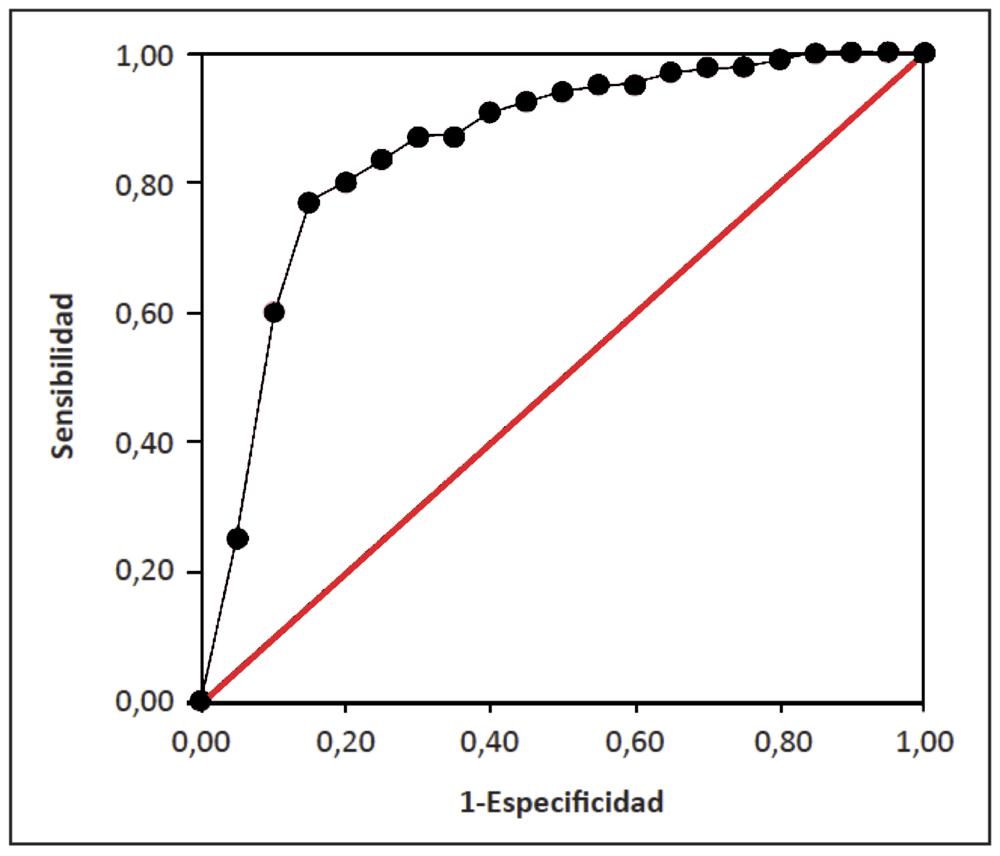

#  Probabilidades elementales: Aplicaciones en medicina

En medicina, las probabilidades (recordad, las proporciones de sujetos de una población con una determinada característica) aparecen bajo diferentes términos. Por ejemplo:

* **Riesgo** de algo: La probabilidad de que pase ese algo (seguramente negativo, por la connotación de la palabra "riesgo").

* **Prevalencia** de algo: La probabilidad de que un individuo de una población tenga ese algo en un momento determinado.

* **Tasa** de algo: Sinónimo de la "proporción" o la "fracción" de ese algo en algún "total" (por ejemplo, en una población durante un período de tiempo). Así:

    
    * Al hablar de incidencia, a veces se usa el término **tasa de incidencia** de una enfermedad para indicar la proporción de casos nuevos de esa enfermedad en una población (sana) en un cierto periodo de tiempo, y por lo tanto es la probabilidad de que un individuo sano  coja esa enfermedad durante ese período.

    * La **tasa de mortalidad** de una enfermedad es la proporción de individuos de una población que mueren a causa de esa enfermedad en un período determinado de tiempo, y por tanto la probabilidad de que un individuo de esa población muera por esa enfermedad en ese período.
    
    * La **tasa de letalidad** de una enfermedad es la proporción de enfermos (de esa enfermedad, se entiende) en una población que mueren a causa de esa enfermedad en un período determinado de tiempo, y por tanto la probabilidad de que un enfermo muera por esa enfermedad en ese período. 
    
```{block2,type="rmdnote"}
La tasa de letalidad es la tasa de mortalidad **condicionada** a tener la enfermedad.
```
    

```{example}
En el artículo ["Incidencia, prevalencia y mortalidad del cáncer renal en España: estimaciones y proyecciones para el período 1998-2022"](https://www.sciencedirect.com/science/article/pii/S0210480611003767) (*Actas Urológicas Españolas* 36 (2012), pp. 521-526) se puede leer:

```


> En hombres se espera un aumento de la tasa de incidencia [del cáncer de riñón] de 11.92 casos por 100,000 habitantes/año a 15.7. La prevalencia aumentaría de 72.842  a 94.47 y la mortalidad de 5.77 a 7.29. 


En todos los casos se trata de estimaciones de  probabilidades. Se estima que:

* La probabilidad de que un hombre sano enfermara de cáncer de riñón en 1998 fue de 11.92/100000=0.0001192 y en 2022 será de 0.000157.

* La probabilidad de que un hombre tuviera cáncer de riñón en 1998 fue de  0.00072842  y  en 2022 será  de 0.0009447.

* La probabilidad de que un hombre muriera de cáncer de riñón en 1998 fue de  0.0000577  y  en 2022 será  de 0.0000729.
    
```{block2,type="rmdexercici"}
Leído en el [MallorcaDiario.com](https://www.mallorcadiario.com/mortalidad-coronavirus-baleares-tasa): "La tasa de mortalidad a causa del COVID-19 en Baleares fue del 1.06 por ciento frente al 2.17 por ciento a nivel nacional [...]. En el caso de personas mayores de 74, la tasa de mortalidad de Baleares (12.74 por ciento) está casi diez puntos porcentuales por debajo que la media nacional de personas de a misma edad, que llegó hasta el 22.34 por ciento."

¿De qué están hablando realmente, de la tasa de mortalidad de la COVID-19 o de su tasa de letalidad?
```


## Pruebas diagnósticas


Una **prueba diagnóstica** es cualquier tecnología que pueda servir para detectar un signo que se relacione con la patología de interés. Por ejemplo, un test de embarazo, una determinación del nivel de un marcador tumoral, una prueba para detectar la presencia de un virus o una bacteria en el organismo, etc.

En la práctica, se suelen distinguir dos tipos de pruebas diagnósticas, de las que se esperan capacidades diagnósticas diferentes:

* **Test de cribado**: se realiza sobre individuos asintomáticos, con el objetivo principal de descartar que tengan la enfermedad.

* **Test diagnóstico**: se realiza en individuos que muestran síntomas o que han dado positivo en un test de cribado, con el objetivo principal de detectar la presencia de la enfermedad.

Por ejemplo, distinguiríamos entre las *mamografías de cribado*  que se realizan periódicamente a las mujeres a partir de una cierta edad, y las *mamografías diagnósticas* que se realizan a las mujeres a las que se ha detectado un bulto en un seno.  
 
Tanto en un caso como el otro, el objetivo de una prueba diagnóstica es diagnosticar una enfermedad. Por ahora vamos a considerar que nuestra prueba es **binaria**, en el sentido de que da solo dos resultados posibles: positivo o negativo, sin valores intermedios ni matices. Lo deseable sería entonces que:

* El resultado de la prueba sea positivo exactamente cuando el paciente tiene la enfermedad.

* El resultado de la prueba sea negativo exactamente cuando el paciente no tiene la enfermedad.

Por desgracia, casi nunca se tiene una prueba diagnóstica cien por cien segura en este sentido. Ni tan solo para detectar si un individuo está muerto o no, por lo que parece (cf. Fig. \@ref(fig:elcomercio)). Por lo tanto, habrá que evaluar y describir la probabilidad que tiene una prueba de acertar.


```{r elcomercio, echo=FALSE, out.width="60%", fig.cap="Noticia aparecida en  El Comercio el 8/01/2018: https://www.elcomercio.es/asturias/preso-dado-muerto-20180108012648-ntvo.html."}

```

### Sensibilidad, especificidad, valores predictivos etc.


Vamos a poner algunos nombres a sucesos. En una prueba diagnóstica, tenemos dos tipos de sucesos:

* El **resultado de la prueba**: $+$, positivo, o $-$, negativo. Como suponemos que la prueba es binaria,  $-$ es el complementario de $+$.

* El  **estado del sujeto**:  $S$, sano, o  $E$, enfermo. $S$ es el complementario de $E$, no hay términos medios.

```{block2,type="rmdnote"}
Es importante tener en cuenta que la clasificación de un sujeto en Enfermo o Sano usualmente se lleva a cabo mediante una prueba de referencia (*gold standard*), que no siempre existe y que cuando existe, puede dar diagnósticos erróneos. Nosotros vamos a suponer que siempre existe y siempre acierta y que por lo tanto podemos clasificar una persona como "sana" o "enferma". En todo caso, esta clasificación es la que comparamos con el resultado de la prueba diagnóstica que estudiamos.
```


Entonces, podemos clasificar los sujetos de la población según estos dos pares de sucesos complementarios:

* **Verdaderos positivos**: Sujetos enfermos sobre los que la prueba da positivo.

* **Falsos positivos**: Sujetos sanos sobre los que la prueba da positivo.

* **Verdaderos negativos**: Sujetos sanos sobre los que la prueba da negativo.

* **Falsos negativos**: Sujetos enfermos sobre los que la prueba da negativo.

$$
\begin{array}{l}
\hphantom{TestTestTest}\textbf{Enfermedad} \\
\begin{array}{c|c|c}
\textbf{Test}  & E & S \\ \hline
+ & \text{Verdaderos} & \text{Falsos} \\[-0.5ex]  	
 & \text{positivos} & \text{positivos} \\ \hline
- & \text{Falsos} & \text{Verdaderos} \\[-0.5ex]   	
 & \text{negativos} & \text{negativos}
\end{array}
\end{array}
$$
Por ejemplo, el pobre preso dado por muerto sería un falso positivo en una prueba diagnóstica de muerte (positivo si estás muerto) y un falso negativo en una prueba diagnóstica de vida  (positivo si estás vivo).

Entonces, para una prueba diagnóstica:

* Su **sensibilidad** es la probabilidad de que dé positivo sobre un individuo enfermo. Es decir, $P(+|E)$.

* Su **tasa de falsos negativos** es la probabilidad de que dé negativo sobre un individuo enfermo. Es decir, $P(-|E)$.

* Su **especificidad** es la probabilidad de que dé negativo sobre un individuo sano. Es decir, $P(-|S)$.

* Su **tasa de falsos positivos** es la probabilidad de que dé positivo sobre un individuo sano. Es decir, $P(+|S)$.

Observad que, como $+$ y $-$ son sucesos complementarios,

*  La Tasa de falsos negativos es  1 menos la Sensibilidad: $P(-|E)=1-P(+|E)$.

*  La Tasa de falsos positivos es  1 menos la Especificidad: $P(+|S)=1-P(-|S)$.


```{block2,type="rmdimportant"}
Pero, aunque $E$ y $S$ sean sucesos complementarios, $P(+|E)\neq 1-P(+|S)$ y 
$P(-|E)\neq 1-P(-|S)$.
```

```{block2,type="rmdnote"}
Igual os es útil la regla mnemotécnica siguiente, para recordar qué es la sensibilidad y qué la especificidad:

* La Se**N**sibilidad es  1 menos la Tasa de falsos **N**egativos.

* La Es**P**ecificidad es  1 menos la Tasa de falsos **P**ositivos

```


```{example}
Recordad el Ejemplo \@ref(exm:VIH995), en el que teníamos un test para el VIH que daba positivo en  un 99% de los infectados y en un 5% de las personas libres del virus.

* La **sensibilidad** de este test es la proporción de enfermos en los que da positivo: 99%.

* La **especificidad**  de este test es la proporción de sanos en los que da negativo: 95%.

* Y entonces, ¿qué es el 5%? Su **tasa de falsos positivos**: la proporción de sanos en los que da positivo.


```
 

Algunas definiciones más. Para una prueba diagnóstica:

* Su **valor predictivo positivo** (**VPP**)  es la probabilidad de que, si da positivo, el individuo esté enfermo. Es decir, $P(E|+)$.

* Su **valor predictivo negativo** (**VPN**)  es la probabilidad de que, si da negativo, el individuo esté sano. Es decir, $P(S|-)$.

```{block2,type="rmdexercici"}
Un examen es una prueba diagnóstica, para determinar si un estudiante sabe ($E$) o no sabe ($S$) la materia. Si aprueba da positivo, si suspende negativo. Traducid al contexto de un examen todos los conceptos introducidos hasta ahora para pruebas diagnósticas.
```


Normalmente conocemos estimaciones de la sensibilidad y la especificidad de una prueba, obtenidas tomando una muestra de sanos y una de enfermos y haciéndoles la prueba para ver cuántos dan positivo y cuántos negativo (**Ejercicio**: ¿De qué tipo de estudio se trata?). Entonces, como hemos visto en la sección sobre la fórmula de Bayes de la lección anterior, conociendo una estimación de la prevalencia $P(E)$ de la enfermedad, podemos estimar los valores predictivos a partir de la especificidad y sensibilidad. 

Por ejemplo, recordad el enunciado (ahora completo) del Ejemplo \@ref(exm:VIH995):

> Un test para el VIH da positivo en un 99% de las personas en las que el virus está presente y en un 5% de las personas en las que el virus no está presente. En una población con el 0.5% de infectados por VIH, ¿cuál es la probabilidad de que un individuo que haya dado positivo en el test esté infectado? ¿Y cuál es la probabilidad de que un individuo que haya dado negativo en el test no esté infectado?

Su traducción en la terminología introducida en esta sección es:

> Un test para el VIH tiene una sensibilidad del 99% y una tasa de falsos positivos del 5%. En una población con una prevalencia del VIH del 0.5%, ¿cuáles son los VPP y VPN del test?

Este tipo de cuestiones se pueden resolver usando el método de  frecuencias naturales o, si os gusta recordar fórmulas, mediante la fórmula de Bayes:
$$
\begin{array}{l}
\text{VPP} = P(E|+) =\dfrac{P(+|E)\cdot P(E)}{P(+|E)\cdot P(E)+P(+|S)\cdot P(S)}\\
\qquad =\dfrac{\text{sensibilidad}\cdot \text{prevalencia}}{\text{sensibilidad}\cdot \text{prevalencia}+(1-\text{especificidad})(1-\text{prevalencia})}\\[2ex]
\text{VPN} = P(S|-)=\dfrac{P(-|S)\cdot P(S)}{P(-|S)\cdot P(S)+P(-|E)\cdot P(E)}\\
\qquad =\dfrac{\text{especificidad}\cdot (1-\text{prevalencia})}{\text{especificidad}\cdot (1-\text{prevalencia})+(1-\text{sensibilidad})\cdot\text{prevalencia}}
\end{array}
$$

```{example, antiendomisio}
En el artículo ["Sensibilidad y especificidad de los exámenes de anticuerpos antigliadina y antiendomisio"](http://www.scielo.edu.uy/scielo.php?pid=S1688-12492002000200003&script=sci_arttext&tlng=en) (W. Lozano *et al*, *Archivos de Pediatría del Uruguay* 73 (2002), pp. 69-73) se estimaron la sensibilidad y la especificidad de las dos técnicas analíticas mencionadas en su título para  diagnosticar la enfermedad celíaca en niños.  Para ello se tomaron un grupo de 50 niños celíacos y un grupo de control de 15 niños no celíacos y se les aplicaron dichas pruebas diagnósticas. En el artículo se incluye la tabla que copiamos en la Figura \@ref(fig:espe2), donde los niños se clasificaron en celíacos y no celíacos mediante el diagnóstico de referencia, una biopsia de intestino delgado.

*(a)* ¿Qué estimamos que valen la especificidad y la sensibilidad de cada una de las dos pruebas de anticuerpos estudiadas?
  
*(b)* ¿Se pueden estimar los VPP y VPN de estas dos pruebas usando solo los datos de esta tabla? 

*(c)* Se estima que en el Uruguay (el país donde se realizó este estudio), de media, 1 de cada 64 niños  es celíaco. ¿Qué estimamos que valen el VPP y el VPN de cada una de las dos pruebas de anticuerpos estudiadas para los niños uruguayos?

*(d)* Se estima que en España, de media,  1 de cada 71 niños es celíaco. ¿Qué estimamos que valen el VPP y VPN  de cada una de las dos pruebas de anticuerpos estudiadas para los niños españoles?


```


```{r espe2,echo=FALSE, out.width="90%",fig.cap="Tabla 1 en el artículo \"Sensibilidad y especificidad de los exámenes de anticuerpos antigliadina y antiendomisio\"." }
knitr::include_graphics("INREMDN_files/figure-html/espe2.png")
```


Vamos a responder las preguntas para la prueba de anticuerpos antiendomisio (AAE), os dejamos la otra como **ejercicio**.

Para la  prueba AAE, tenemos la tabla de frecuencias siguiente, que es básicamente la de la derecha de la figura anterior:
$$
\begin{array}{r|cc|c}
& \text{Celíacos}\ (E) & \text{No celíacos}\ (S) & \text{Total} \\ \hline
+ & 47 & 1 & 48  \\  
- & 3 & 14 & 17 \\ \hline
\text{Total} & 50  & 15 & 65  
\end{array}
$$

*(a)* Estimamos que:

* Su **sensibilidad** es $P(+|E)=47/50=0.94$

* Su **especificidad** es $P(-|S)= 14/15=0.9333$

Es decir, 

* El test AAE da positivo en un 94% de los niños celíacos.
* El test AAE  da negativo en un 93.33% de los niños no celíacos.

*(b)* No se pueden estimar los VPP y VPN de estas dos pruebas usando solo los datos de esta tabla. Los números de niños celíacos y no celíacos en esta muestra son artificiales, tomados *ad hoc* por conveniencia del estudio, y  no representan las proporciones de niños celíacos y no celíacos en ninguna población. Entonces, las proporciones de celíacos entre los positivos y los negativos también son, en principio, artificiales y no representativas de nada.

*(c)* En primer lugar vamos a calcular los valores predictivos usando la fórmula de Bayes. Como $P(+|E)=0.94$, $P(-|S)=14/15$ y en Uruguay $P(E)=1/64$, por lo que $P(S)=63/64$:

$$
\begin{array}{rl}
\text{VPP}\!\!\!\! & =P(E|+)=\dfrac{P(+|E)\cdot P(E)}{P(+|E)\cdot P(E)+P(+|S)\cdot P(S)}\\
&= \dfrac{0.94\cdot \frac{1}{64}}{0.94\cdot \frac{1}{64}+\frac{1}{15}\cdot \frac{63}{64}}=0.1829\\[1ex]
\text{VPN} \!\!\!\!& =P(S|-)=\dfrac{P(-|S)\cdot P(S)}{P(-|S)\cdot P(S)+P(-|E)\cdot P(E)}\\
&= \dfrac{\frac{14}{15}\cdot \frac{63}{64}}{\frac{14}{15}\cdot \frac{63}{64}+0.06\cdot \frac{1}{64}}=0.999
\end{array}
$$

Es decir, 

* Estimamos que un 18.29% de los niños uruguayos que dan positivo en el test AAE son celíacos.
* Estimamos que un 99.9% de los niños uruguayos que dan negativo en el test AAE no son celíacos.

Vamos a repetir el cálculo usando frecuencias naturales. Para que nos salgan números redondos, vamos a partir de una población de referencia de 640,000 niños uruguayos.

* Un 1/64 son celíacos, 10,000. Los 630,000 restantes no lo son.
* De los 10,000 celíacos, un 94% dan positivo. Por lo tanto, 9,400 dan positivo y 600 negativo.
* De los 630,000 no celíacos, 14 de cada 15 dan negativo Por lo tanto, 588,000 dan negativo y 42,000 positivo.

En resumen:
$$
\begin{array}{r|c|c|c}
& \text{Celíacos} & \text{No celíacos}  & \text{Total} \\ \hline
+ & 9400  &  42000 &  51400 \\ \hline
- & 600  & 588000 &  588600  \\ \hline
\text{Total} &  10000 & 630000 & 640000 
\end{array}
$$
Y por lo tanto, estimamos que:

* $\text{VPP}= 9400/51400=0.1829$

* $\text{VPN}= 588000/588600=0.999$


*(d)* ¿Y en España? Usando la fórmula de Bayes ahora con $P(E)=1/71$, obtenemos
$$
\begin{array}{rl}
\text{VPP}\!\!\!\! & =P(E|+)=\dfrac{P(+|E)\cdot P(E)}{P(+|E)\cdot P(E)+P(+|S)\cdot P(S)}\\
&= \dfrac{0.94\cdot \frac{1}{71}}{0.94\cdot \frac{1}{71}+\frac{1}{15}\cdot \frac{70}{71}}=0.1677\\[1ex]
\text{VPN} \!\!\!\!& =P(S|-)=\dfrac{P(-|S)\cdot P(S)}{P(-|S)\cdot P(S)+P(-|E)\cdot P(E)}\\
&= \dfrac{\frac{14}{15}\cdot \frac{70}{71}}{\frac{14}{15}\cdot \frac{70}{71}+0.06\cdot \frac{1}{71}}=0.9991
\end{array}
$$

* Estimamos que un 16.77% de los niños españoles que dan positivo en el test AAE son celíacos.
* Estimamos que un 99.91% de los niños españoles que dan negativo en el test AAE no son celíacos.


Con el método de  frecuencias naturales a partir de una población de referencia de 710,000 niños españoles, y razonando como antes, obtenemos: 

$$
\begin{array}{r|c|c|c}
& \text{Celíacos} & \text{No celíacos}  & \text{Total} \\ \hline
\text{Positivos} & 9400  &  46666.67 &  56066.67  \\ \hline
\text{Negativos} & 600  & 653333.33 &  653933.33  \\ \hline
\text{Total} &  10000 & 700000 & 710000
\end{array}
$$

Y por lo tanto, estimamos que:

* $\text{VPP}= 9400/56066.67=0.1677$

* $\text{VPN}= 653333.33/653933.33=0.9991$

En resumen:

* Sensibilidad $P(+|E)=0.94$, Especificidad $P(-|S)=14/15$

* Si la prevalencia es $P(E)=1/64$,
$$
VPP=P(E|+)=0.1829,\quad
VPN=P(S|-)=0.9990
$$

* Si la prevalencia es $P(E)=1/71$,
$$
VPP=P(E|+)=0.1677,\quad
VPN=P(S|-)=0.9991
$$

La prevalencia de la enfermedad celíaca es menor en España que en Uruguay, y observaréis que, en España, el VPP de la prueba de anticuerpos antiendomisio es menor y su VPN mayor que en Uruguay. No es casualidad:

```{block2,type="rmdimportant"}
A mayor prevalencia, el VPP es mayor y el VPN es menor.
```

El motivo intuitivo es que si la prevalencia crece:

* Hay más enfermos, por lo que aumenta la probabilidad de encontrar enfermos y por lo tanto el VPP es mayor.
* Hay menos sanos, por lo que disminuye la probabilidad de encontrar sanos y por lo tanto  el VPN es menor.

```{block2,type="rmdcorbes"}
El motivo matemático es el siguiente. Llamemos $x\in [0,1]$ a la prevalencia y fijemos los valores de $P(+|E)$, $P(+|S)$, $P(-|E)$ y $P(-|S)$. De esta manera, entendemos el VPP y el VPN como funciones solo en $x$:
$$
\begin{array}{l}        
\text{VPP}(x)  =\dfrac{P(+|E)\cdot x}{P(+|E)\cdot x+P(+|S)\cdot (1-x)}\\
\text{VPN}(x) =\dfrac{P(-|S)\cdot (1-x)}{P(-|S)\cdot (1-x)+P(-|E)\cdot x}
\end{array}
$$
Derivando, podréis comprobar que:
        
* La derivada de $\text{VPP}(x)$ sobre el intervalo [0,1]  es positiva, y por tanto  $\text{VPP}(x)$ es creciente en $x$.
        
* La derivada de $\text{VPN}(x)$ sobre el intervalo [0,1]  es negativa, y por tanto  $\text{VPP}(x)$ es decreciente en $x$.

```

En cambio, la  prevalencia no influye para nada  en la sensibilidad y la especificidad de la prueba:

* La **sensibilidad** es el porcentaje de enfermos en los que la prueba da positivo, y esto es independiente de cuántos enfermos hay en la población.

* La **especificidad** es el porcentaje de sanos en los que  la prueba da negativo, y esto también es independiente de cuántos individuos sanos hay en la población.

```{block2,type="rmdnote"}
La sensibilidad y la especificidad no dependen de la prevalencia, pero sí que pueden depender de otras características de una población.  Por ejemplo, en ["Findings From 752 081 Clinical Breast Examinations Reported to a National Screening Program From 1995 Through 1998"](https://academic.oup.com/jnci/article/92/12/971/2905789) (J. Bobo *et al*, *Journal of the National Cancer Institute* 92  (2000), pp. 971-976), se estimaron la especificidad y la sensibilidad del examen físico clínico del pecho como prueba diagnóstica del cáncer de mama en diversos grupos de mujeres. En la tabla siguiente recogemos algunos de los datos obtenidos en ese estudio:
        

```

$$
\begin{array}{l|ccc}
\text{Grupo} & \text{Sensibilidad} & \text{Especificidad} & \text{VPP}  \\ \hline
<40\text{ años} & 0.885 & 0.860 & 0.014  \\
40-49\text{ años} & 0.714 & 0.916 & 0.036 \\
50-59\text{ años} & 0.513 & 0.951 & 0.061 \\
60-69\text{ años} & 0.572 & 0.960 & 0.074 \\
\geqslant 70\text{ años} & 0.380 & 0.968 & 0.070  \\  \hline
\text{Global} & 0.588 & 0.934 & 0.043  
\end{array}
$$
Las diferencias en la sensibilidad y especificidad entre las diferentes franjas de edad se deben a las diferentes características físicas de los senos a diferentes edades, que facilitan o dificultan la detección de los  tumores, no a la prevalencia del cáncer.


```{block2,type="rmdexercici"}
Una nueva prueba de diagnóstico rápido de una enfermedad rara, de una prevalencia estimada del 0.1%, ha mostrado tener una sensibilidad del 80% y una especificidad del 60%.

*(a)* ¿Cuál es la probabilidad de que un individuo enfermo dé positivo en la prueba?

*(b)* ¿Cuál es la probabilidad  de que si escogemos un individuo al azar, esté enfermo y al realizarle la prueba dé positivo?

*(c)* ¿Qué valen los valores predictivos de esta prueba? ¿Qué significan, en lenguaje llano, los valores obtenidos?

*(d)* Si la enfermedad no fuera tan rara, digamos que su prevalencia fuera del 10%, y sin realizar ningún cálculo extra, ¿qué les pasaría a los  valores predictivos de la prueba respecto de los calculados  en el apartado anterior (aumentarían, disminuirían, se mantendrían igual, no se puede saber)? Justificad brevemente vuestra respuesta.

```


Vamos a añadir algunos términos más sobre probabilidades relacionados con una prueba diagnóstica:

* Su **exactitud** (**global**) es la probabilidad de acertar el diagnóstico, es decir, la proporción de sujetos de la población total en los que el diagnóstico acierta: $P(E\cap +)+P(S\cap -)$.

    Fijaos en que esta exactitud es igual a $P(+|E)\cdot P(E)+P(-|S)\cdot P(S)$ y por lo tanto depende de la prevalencia de la enfermedad.  
    
```{block2,type="rmdcaution"}
La exactitud **no es** $P(+|E)+P(-|S)$ ni $P(E|+)+P(S|-)$. Estas sumas no son la proporción de nada.
```

* Su **cociente de verosimilitud** (*likelihood ratio*, en inglés) **positivo**, $\text{LR}(+)$, es cuántas veces es más probable  un diagnóstico positivo sobre  un enfermo  que sobre un sano. Es decir
$$
\text{LR}(+)=\dfrac{P(+|E)}{P(+|S)}=\dfrac{\text{sensibilidad}}{1-\text{especificidad}}
$$
     Un valor de $\text{LR}(+)$ por encima de 10 se toma como indicador de buen potencial diagnóstico para detectar la enfermedad. Por el contrario, un valor de $\text{LR}(+)$ cercano a 1 indica una prueba inútil: si dar positivo sobre un enfermo tiene aproximadamente la misma probabilidad que sobre un sano, los sucesos $+$ y $E$ son aproximadamente independientes.
     
```{block2,type="rmdcaution"}
No confundáis el cociente de verosimilitud positivo $\text{LR}(+)$ con las *odds* de dar positivo entre los enfermos
$$
\text{Odd}(+|E)= \dfrac{P(+|E)}{P(-|E)}
$$

* $\text{LR}(+)$ nos dice cuántas veces es más probable obtener un positivo en un enfermo que en un sano.

* $\text{Odds}(+|E)$ nos dice cuántas veces es más probable obtener un positivo que un negativo en un enfermo.

```
     

* Su **cociente de verosimilitud negativo**, $\text{LR}(-)$, es cuántas veces es más probable  un diagnóstico negativo sobre un enfermo  que sobre un sano. Es decir
$$
\text{LR}(-)=\dfrac{P(-|E)}{P(-|S)}=\dfrac{1-\text{sensibilidad}}{\text{especificidad}}
$$
    Un valor de $\text{LR}(-)$ por debajo de 0.1 se toma como indicador de buen potencial diagnóstico para descartar la enfermedad, y un valor de $\text{LR}(-)$ cercano a 1 indica de nuevo una prueba inútil en este sentido.
    


```{example}
Volviendo al Ejemplo \@ref(exm:antiendomisio), habíamos obtenido que:

```

* La **sensibilidad** del test AAE es $P(+|E)=47/50=0.94$. Por lo tanto, su **tasa de falsos negativos** es $P(-|E)=0.06$.

* La **especificidad** del test AAE es $P(-|S)= 14/15$. Por lo tanto, su **tasa de falsos positivos** es $P(+|S)=1/15$. 

* En Uruguay teníamos que $P(E)=1/64$, por lo que $P(S)=63/64$.

Entonces:

* Su **exactitud** en Uruguay es  
$$
\begin{array}{rl}
P(E\cap +)+P(S\cap -)\!\!\!\!\! & =P(+|E)\cdot P(E)+P(-|S)\cdot P(S)\\
& =0.94\cdot \dfrac{1}{64}+\dfrac{14}{15}\cdot \dfrac{63}{64}=0.9334.
\end{array}
$$
    La  prueba de anticuerpos antiendomisio acierta en un 93.34% de los niños uruguayos.

* Su **cociente de verosimilitud positivo** es
$$
\text{LR}(+)=\dfrac{P(+|E)}{P(+|S)}=\frac{0.94}{1/15}=14.1
$$
    y su **cociente de verosimilitud negativo** es
$$
\text{LR}(-)=\dfrac{P(-|E)}{P(-|S)}=\frac{0.06}{14/15}=0.064
$$
    Por lo tanto, la  prueba de anticuerpos antiendomisio es valiosa tanto para detectar como para descartar la enfermedad celíaca en niños. 


Los cocientes de verosimilitud se utilizan para transformar las *odds* de tener la enfermedad *a priori* (antes de realizar la prueba diagnóstica) en sus *odds* *a posteriori* (tras realizar la prueba diagnóstica). En concreto, sean:

* $\text{Odds}(E)$: las *odds* de un individuo de tener la enfermedad, antes de realizar la prueba diagnóstica.

* $\text{Odds}(E|+)$: las *odds* de un individuo de tener la enfermedad si en la prueba  da positivo.

* $\text{Odds}(E|-)$: las *odds* de un individuo de tener la enfermedad si en la prueba  da negativo.

Entonces
$$
\begin{array}{l}
\text{Odds}(E|+)=\text{LR}(+)\cdot \text{Odds}(E)\\
\text{Odds}(E|-)=\text{LR}(-)\cdot  \text{Odds}(E)
\end{array}
$$

```{block2,type="rmdcorbes"}
En efecto
$$
\begin{array}{rl}
\text{Odds}(E|+)\!\!\!\!\! & =\dfrac{P(E|+)}{P(S|+)}=\dfrac{P(E|+)P(+)}{P(S|+)P(+)} =\dfrac{P(E\cap +)}{P(S\cap +)}\\
& =\dfrac{P(+|E)P(E)}{P(+|S)P(S)}=\text{LR}(+)\text{Odds}(E)
\end{array}
$$
Para $\text{Odds}(E|-)$ el cálculo es similar.
```


```{example}
Se sabe que una mujer con un hermano hemofílico tiene un 50% de probabilidades de ser portadora de una copia defectuosa del gen del factor VIII. Una prueba genética para detectar dicho gen defectuoso tiene una sensibilidad del 90% y una especificidad del 80%. Si una mujer con un hermano hemofílico se hace la prueba y da negativo, ¿cómo modifica este resultado sus *odds* de ser portadora?


```

Llamemos $E$ al suceso "Ser portadora de una copia defectuosa del gen del factor VIII". Si la mujer *a priori* tiene un 50% de probabilidades de serlo, sus *odds* de serlo valen 1. Ahora sabemos que, para el test genético, $P(-|E)=0.1$ y $P(-|S)=0.8$, por lo que $\text{LR}(-)=P(-|E)/P(-|S)=\dfrac{1}{8}$.

Entonces, $\text{Odds}(E|-)=\text{Odds}(E)\cdot \text{LR}(-) =\dfrac{1}{8}$. Pasan de ser 1:1 a 1:8. Es decir, su "nueva probabilidad" de ser portadora es 1/9. 


```{block2,type="rmdexercici"}
G. Stine, en el libro "AIDS Update 1999" (Prentice Hall, 1999), explica que en 1987 se notificó a 22 donantes de sangre de Florida que habían dado positivo en un test ELISA+Western Blot de VIH, que tenía sensibilidad y  especificidad ambas del 99.99%. De ellos, 7 se suicidaron. 

La prevalencia de VIH en su sector de población (heterosexuales de bajo riesgo) se estimaba en 1 por cada 10000. ¿Cuál  era su probabilidad real de infección por VIH, sabiendo que habían dado positivo?
```


```{block2,type="rmdexercici"}
Sospechamos que un paciente tiene tuberculosis, y decidimos hacerle  un test PCR. El test concreto que vamos a usar se analizó en el estudio ["Comparative Study of a Real-Time PCR Assay Targeting senX3-regX3 versus Other Molecular Strategies Commonly Used in the Diagnosis of Tuberculosis"](https://journals.plos.org/plosone/article?id=10.1371/journal.pone.0143025), donde en un grupo de 76 pacientes con tuberculosis confirmada y 69 sujetos de control hubo 58 verdaderos positivos y 9 falsos positivos. 

*(a)* Estimad la sensibilidad, especificidad y cocientes de verosimilitud de esta prueba, y a partir de estos últimos valorad su capacidad diagnóstica.

*(b)* Por la sintomatología que presenta y la prevalencia local de la tuberculosis, asignáis *a priori* a vuestro paciente una probabilidad del 40% de tener tuberculosis. Para esta probabilidad de tener la enfermedad, calculad el VPP y el VPN de esta prueba.

*(c)* ¿Cuáles eran las *odds* de tener tuberculosis que le asignabais a este enfermo antes de realizar la prueba? Si da positivo en el test PCR, ¿cuáles son las *odds* de tener tuberculosis que le asignáis tras dicho positivo? Traducidlas a una probabilidad.

```


```{block2,type="rmdromans"}
¿Nueve palabras para describir aspectos de una prueba diagnóstica? Pues preparaos, que vienen curvas. Literalmente. Lo sentimos, una parte importante de esta asignatura es aprender el vocabulario que se usa al aplicar estadística en medicina. Ya lo dice el autor de Reglas Médicas, la medicina es un idioma. 
```


```{r idioma,echo=FALSE,fig.cap="Los aspirantes a médicos no os podéis perder la magnífica *Reglas médicas* en [Twitter](https://twitter.com/ReglasM) o [Facebook](https://www.facebook.com/reglasmedicas).",out.width="50%"}
knitr::include_graphics("INREMDN_files/figure-html/idioma.png")
```


### Curvas ROC

En la  sección anterior hemos considerado solamente pruebas binarias, que dan positivo o negativo sin ninguna gradación intermedia. Pero muchas veces una prueba diagnóstica puede dar valores en un intervalo de números reales: por ejemplo, la concentración de algún metabolito o el nivel de algún  antígeno. En este caso, lo habitual es tomar un **valor de corte** y definir como **positivo** todo valor por encima de ese valor de corte (o por debajo, eso va a depender de la prueba concreta) y como **negativo** lo contrario. Por ejemplo, en el diagnóstico de la diabetes por medio del nivel de glucosa en sangre en ayunas, se toma como positivo un valor por encima de un cierto umbral. En cambio, en el diagnóstico de la anemia por medio del hematocrito, se toma como positivo un valor por debajo de un cierto umbral. 

De esta manera pasamos de una prueba diagnóstica que puede tomar todo un continuo de valores a una prueba binaria como las de la sección anterior, con su sensibilidad y su especificidad. Pero ¿cómo se ha llegado a definir el valor de corte que se usa para distinguir positivo de negativo? ¿Y cómo hemos de tener en cuenta que la prueba  pueda tomar muchos resultados?


Para simplificar el lenguaje y fijar ideas, vamos a suponer que los enfermos obtienen un valor anormalmente alto en la prueba diagnóstica, y que por lo tanto queremos definir como **positivo** cualquier valor por encima de un umbral. La prueba puede dar muchos valores, y para cada valor el test binario asociado tendrá una especificidad y una sensibilidad.

La eficacia diagnóstica global de esta prueba diagnóstica se representa gráficamente por medio de una **curva ROC** (de *Receiver Operating Characteristic*). Esta curva se obtiene de la manera siguiente:

* Tomamos varios valores de corte $v$.

* Para cada uno de estos valores de corte $v$, consideramos el test binario que define. Hemos quedado en que, para fijar ideas, este test da positivo para los valores por encima de $v$ y negativo para los valores por debajo de $v$. Para cada uno de ellos,  sean:

    * $+_{v}$: el suceso "Dar positivo en este test" (dar en la prueba un valor $\geqslant v$).
    * $-_{v}$: el suceso "Dar negativo en este test" (dar en la prueba un valor $< v$).
    * Especificidad${}_{v} = P(-_{v}|S)$: la especificidad de este test, es decir, la probabilidad de que un individuo sano dé un valor $< v$.
    * Sensibilidad${}_{v} = P(+_{v}|E)$: la sensibilidad de este test, es decir, la probabilidad de que un individuo enfermo dé un valor $\geqslant  v$.

* Para cada test asociado a un valor de corte $v$, definimos el punto del plano real de abscisa su tasa de falsos positivos y ordenada su sensibilidad:
$$
\big(P(+_v|S),P(+_v|E)\big)=(1-\text{especificidad}_v,\text{sensibilidad}_v)
$$

* Dibujamos estos puntos y los unimos por una recta poligonal (que parecerá una curva si tomamos muchos valores de corte $v$).

El resultado es un gráfico como el siguiente:

```{r roc1,echo=FALSE,fig.cap="Una curva ROC.",out.width="50%"}

```

```{theorem}
Una curva ROC siempre es creciente.

```


Veámoslo en la situación que estábamos considerando en la que definimos positivo cuando el valor obtenido es **mayor** que un umbral. En este caso, si $a<b$ entonces el test con umbral $b$ da menos positivos que el test con umbral $a$. En efecto, si $a<b$, todos los que dan positivo con valor de corte $b$ también dan positivo con valor de corte $a$, pero un individuo puede dar un resultado entre $a$ e $b$, que será positivo con valor de corte $a$ y negativo con valor de corte $b$.
Por lo tanto, si $a<b$, se tiene que como sucesos,
$$
+_b\subseteq +_a
$$
(de hecho, en general, $+_b\subsetneq +_a$) y por consiguiente
$$
P(+_b|S)\leqslant P(+_a|S),\quad P(+_b|E)\leqslant P(+_a|E)
$$
Esto nos dice que el punto de la curva ROC correspondiente al valor de corte  $b$, que es $\big(P(+_b|S),P(+_b|E)\big)$, estará a la izquierda y por debajo del punto correspondiente al valor de corte  $a$, $\big(P(+_a|S),P(+_a|E)\big)$. 

Esto implica que, en este caso la curva ROC es creciente. En efecto, si tenemos dos puntos, correspondientes a valores de corte $s$ y $t$ y $P(+_s|S)< P(+_t|S)$ (la abscisa del primero es más pequeña que la del segundo), entonces, por lo que acabamos de ver, $t<s$ y por lo tanto $P(+_s|E)\leqslant P(+_t|E)$: la ordenada del primero es menor o igual que la del segundo.


Si hubiéramos definido positivo cuando el valor obtenido es **menor** que un umbral, entonces, cuando $a<b$, el test con umbral $b$ daría **más** positivos que el test con umbral $a$ y por lo tanto el punto $\big(P(+_b|S),P(+_b|E)\big)$ estaría a la derecha y por encima del punto $\big(P(+_a|S),P(+_a|E)\big)$. Por el mismo argumento que antes, en este caso también tenemos que la curva ROC es creciente.


```{example}
Vamos a dibujar una curva ROC. El artículo ["Age-specific reference ranges for serum prostate-specific antigen in black men"](https://www.nejm.org/doi/full/10.1056/NEJM199608013350502) (T. Morgan *et al*, *New England Journal of Medicine* 335 (1996), pp. 304-310) contiene la tabla que hemos copiado en la Figura \@ref(fig:tablapsaglobal). Esta tabla da la especificidad y la sensibilidad del diagnóstico del cáncer de próstata por medio del [nivel de PSA](https://medlineplus.gov/spanish/pruebas-de-laboratorio/prueba-de-psa-antigeno-prostatico-especifico/) (abreviatura de *antígeno prostático específico*) en diferentes poblaciones de hombres estadounidenses, definidas por razas y franjas de edad. A los hombres con cáncer de próstata más pronto o más tarde se les dispara el nivel de PSA. Por lo tanto, dado un nivel de corte de PSA, se considera como "positivo" un nivel por encima de él. En particular, en cada fila de esta tabla, se define como "positivo" el tener un nivel de PSA mayor o igual que el valor de su primera columna.

```


```{r tablapsaglobal,echo=FALSE,out.width="80%",fig.cap="Tabla 2 en el artículo \"Age-specific reference ranges for serum prostate-specific antigen in black men\"." }
knitr::include_graphics("INREMDN_files/figure-html/tablapsaglobal.png")
```

La curva ROC se obtiene uniendo puntos de la forma (1-especificidad,sensibilidad). Vamos a calcular estos puntos para la subpoblación de hombres blancos entre 50 y 59 años, que es la que más nos preocupa. Vamos a añadir el nivel PSA 0: como todo el mundo va a dar positivo, tendrá sensibilidad 1 y especificidad 0.

$$
\begin{array}{c|ccc}
\text{PSA} & \text{Especificidad}& 1-\text{Especificidad}& \text{Sensibilidad}\\ \hline
0 & 0 & 1 & 1 \\
1 & 0.528 & 0.472 & 0.997 \\
2 &  0.834 & 0.166 &0.994\\
3 & 0.932 & 0.068 &0.978\\
4 & 0.974 & 0.026 &0.748\\
5 & 0.987 & 0.013 &0.466\\
6 & 0.991 & 0.009 &0.261\\
7 & 1.000 & 0.000 &0.118\\
8 & 1.000  &0.000 &0.093\\
9 & 1.000  &0.000 &0.078\\
10 & 1.000 & 0.000 &0.075\\
11 & 1.000 & 0.000 &0.053\\
12 & 1.000 & 0.000 & 0.043\\
13 & 1.000 & 0.000 &0.040\\
14 & 1.000  &0.000 & 0.031\\
15 & 1.000  &0.000 & 0.025\\
\end{array}
$$

La Figura \@ref(fig:ROCama1) muestra la curva ROC que corresponde a estos valores. En ella los puntos aparecen de izquierda a derecha en orden ascendente en la tabla, es decir en orden descendente del umbral de PSA. Para ayudar a comprender mejor el gráfico, al lado de cada punto hemos anotado el valor de PSA al que corresponde y hemos estirado verticalmente el gráfico para que se puedan leer los valores de corte altos en la esquina inferior izquierda de la curva.

```{r ROCama1,echo=FALSE,out.width="75%",fig.cap="Curva ROC de los niveles de PSA entre 0 y 15 como diagnóstico del cáncer de próstata en hombres blancos de 50 a 59 años.",fig.asp=1.5}
X=matrix(c(1,1,
           0.472 , 0.997 ,
 0.166 ,0.994,
0.068 ,0.978,
0.026 ,0.748,
0.013 ,0.466,
0.009 ,0.261,
0.000 ,0.118,
0.000 ,0.093,
0.000 ,0.078,
0.000 ,0.075,
0.000 ,0.053,
0.000 , 0.043,
0.000 ,0.040,
0.000 , 0.031,
0.000 , 0.025),nrow=16,byrow=T)

plot(X,type="o",pch=20,xlab="1-especificidad",ylab="sensibilidad",
     xaxp=c(0,1,20),yaxp=c(0,1,20))
text(X[,1]+0.02,X[,2],col="red",cex=0.5,labels=0:15)
```


```{block2,type="rmdimportant"}
La curva ROC representa la sensibilidad de la prueba en función de su tasa de falsos positivos. Es decir, si asumimos  una cierta tasa de falsos positivos $x$, el punto de la curva ROC en la vertical de $x$ nos da la sensibilidad que obtendremos. La curva ROC no representa la sensibilidad en función del valor de corte.
```


Una de las aplicaciones de la curva ROC es ayudar a decidir qué valor de corte tomar para definir el test diagnóstico binario que se va a usar en la práctica.  Una estrategia muy común es tomar el **valor de corte óptimo**: el valor $v_o$ en el que la suma
$$
P(+_{v_o}|E)+P(-_{v_o}|S)=\text{sensibilidad}_{v_o}+\text{especificidad}_{v_o}
$$
sea máxima (esta suma menos 1 tiene nombre: es el **índice de Youden** del test definido por el valor de corte $v_0$). Recordemos que, para cada punto de la curva ROC,

* Su distancia al eje vertical izquierdo $x=0$ es 1 menos la especificidad.

* Como su ordenada es la sensibilidad, su distancia a la recta horizontal $y=1$ es 1 menos la sensibilidad.

Por lo tanto, el punto que corresponda a la suma máxima de especificidad y sensibilidad  será el punto que dé la suma mínima de sus distancias a las rectas $x=0$ e $y=1$. Se trata del punto de la curva más cercano al rincón superior izquierdo $(0,1)$ del cuadrado unidad. Por ejemplo, para la curva ROC de la Figura \@ref(fig:roc1), es el indicado con una flecha en el gráfico siguiente:

```{r roc2,echo=FALSE,fig.cap="Una curva ROC y su umbral óptimo.",out.width="50%"}
knitr::include_graphics("INREMDN_files/figure-html/roc2.png")
```

En el ejemplo del PSA para hombres blancos entre 50 y 59 años, tendríamos la tabla siguiente (la columna "Youden" es la suma de las dos anteriores menos 1):

$$
\begin{array}{c|ccc}
\text{PSA} & \text{Especificidad}& \text{Sensibilidad} & \text{Youden}\\ \hline
1 & 0.528& 0.997& 0.525 \\
2 &  0.834  &0.994& 0.828\\
\mathbf{3} & \mathbf{0.932}  &\mathbf{0.978}& \mathbf{0.910} \\
4 & 0.974  &0.748& 0.722\\
5 & 0.987  &0.466&0.453 \\
6 & 0.991  &0.261&0.252 \\
7 & 1.000  &0.118&0.118 \\
8 & 1.000 &0.093& 0.093\\
9 & 1.000  &0.078& 0.078\\
10 & 1.000  &0.075& 0.075\\
11 & 1.000  &0.053& 0.053\\
12 & 1.000  & 0.043& 0.043 \\
13 & 1.000  &0.040& 0.040\\
14 & 1.000  & 0.031& 0.031\\
15 & 1.000  & 0.025& 0.025
\end{array}
$$

El valor de corte óptimo sería entonces tomar un valor de PSA igual a 3.  También podéis observarlo en la Figura \@ref(fig:ROCama1): el punto correspondiente al PSA 3 es el más cercano a la esquina superior izquierda.


En  la práctica, se toma como nivel de PSA a partir del cual uno se ha de preocupar en esa franja de edad el 4. ¿Por qué? Es un compromiso: en las pruebas de cribado se prima la especificidad, ya que se trata de descartar sanos,  y la especificidad mejora del PSA 3 al PSA 4 manteniendo aún una sensibilidad aceptable del 75%, es decir, detectando un 75% de los enfermos. 

```{block2,type="rmdexercici"}
La suma de la especificidad y la sensibilidad de una prueba diagnóstica, ¿coincide con su exactitud global  que hemos definido en la sección anterior?
```

La curva ROC también se usa para evaluar la **capacidad discriminatoria global de la prueba**, es decir, su habilidad en general para distinguir sanos de enfermos para el conjunto de posibles umbrales. 

Para empezar, para que la prueba diagnóstica sirva para detectar enfermos, ha de dar positivo con más frecuencia en enfermos que en sanos, ¿cierto?
Por lo tanto, requerimos que, para cada umbral la sensibilidad sea mayor que la tasa de falsos positivos. Esto significa que la curva ROC ha de estar por encima de la diagonal principal $y=x$. Los puntos de esta diagonal corresponden a la situación $P(+|E)=P(+|S)$. Es decir, a que el test dé positivo con la misma frecuencia en sanos que en enfermos y por lo tanto a que "estar enfermo" y "dar positivo" sean sucesos independientes. En este caso el test no sirve para nada. En el contexto de las curvas ROC, a la diagonal principal del cuadrado unidad se la llama  la **línea de no discriminación** por este motivo.

```{example}
Imaginaos que queremos diagnosticar una enfermedad mediante el lanzamiento de dados. Lanzas 5 dados, anotas el resultado y si supera un cierto umbral, da positivo. El estar enfermo o sano no influye para nada en el resultado del lanzamiento, por lo que para todo umbral $x$ que consideremos, la probabilidad de superar ese umbral si se está sano y si se está enfermo es la misma: $P(+_x|E)=P(+_x|S)$. La curva ROC de esta prueba diagnóstica sería la diagonal principal del cuadrado unidad,   la línea de no discriminación.


```


Como hemos comentado, un valor de la prueba es mejor cuanto más se acerca su punto de la curva ROC al extremo superior izquierdo del cuadrado unidad. Por lo tanto, cuanto más se se separe una curva ROC de la línea de no discriminación por encima de la misma y más se aproxime al ángulo que forman las rectas $x=0$ e $y=1$, mejor es la prueba globalmente. Por ejemplo, en la Figura \@ref(fig:roc3), la curva ROC con puntos rellenos corresponde a una prueba diagnóstica con mayor capacidad discriminatoria global que la de los puntos vacíos.


```{r roc3,echo=FALSE,fig.cap="Dos curvas ROC.",out.width="50%"}
knitr::include_graphics("INREMDN_files/figure-html/roc3.png")
```


La **capacidad discriminatoria global** de una prueba diagnóstica se mide con su **Área Bajo la Curva ROC** (abreviada **AUC**, de *area under the curve*,  en inglés). Este valor es, como su nombre indica, el área comprendida entre la curva ROC y el eje de abscisas $y=0$ entre $x=0$ y $x=1$. Representa el **valor promedio de la sensibilidad** para todos los valores de corte de la prueba 

```{block2,type="rmdcorbes"}
Los que visteis integrales en Matemáticas II del Bachillerato tendríais que recordar que esta área se obtiene integrando entre 0 y 1 la función que define la curva, y que la integral dividida por la longitud de la base, que en este caso es 1, es el valor promedio de la función sobre el intervalo. Por lo tanto, para ser precisos, el AUC es el **valor promedio de la sensibilidad como función de la tasa de falsos positivos**, pero tampoco importa hilar tan fino.
```

Así:

* AUC=0.5 es la de la línea de no discriminación. Si una  curva ROC tiene AUC=0.5, consideramos que la prueba diagnóstica es inútil.

* AUC=1 solo es posible si la curva ROC es la recta $y=1$, es decir, si todos los valores de corte tienen sensibilidad 1, lo que solo puede pasar si la prueba siempre da positivo sobre un enfermo, independientemente del valor de corte. 

```{block2,type="rmdromans"}
¿Cómo podría ser una prueba con esta curva ROC? Pues por ejemplo, imaginad que usamos la temperatura corporal para decidir si una persona está viva o muerta: para una temperatura de corte dada $t_0$, diremos que la persona está viva si su temperatura es superior a $t_0$ y muerta en caso contrario. Y como somos algo raros, vamos a considerar solo temperaturas entre  20 y 25 grados. Entonces, para cualquier valor de corte dentro de este rango, este test dará positivo sobre una persona viva. El motivo es que cuando la temperatura corporal es inferior a los 27 grados, se considera que la persona está clínicamente muerta. Por lo tanto, "por definición", toda persona viva tiene una temperatura corporal superior a 27 grados.
```   
  

```{example}
En el estudio ["Proteína C reactiva y lactato deshidrogenasa en el diagnóstico de la obstrucción intestinal en un servicio de urgencias"](http://scielo.isciii.es/pdf/asisna/v39n1/13_original_breve4.pdf)
(R. Rodríguez *et al*, *Anales del Sistema Sanitario de Navarra* 39 (2016), pp. 115-122) se compararon dos técnicas analíticas de diagnóstico de la obstrucción intestinal: los niveles de la proteína C reactiva (PCR) y del enzima lactato deshidrogenasa (LDH) en plasma.

```

La Figura \@ref(fig:rocnavarra) muestra las curvas ROC de ambos tests, con sus valores de AUC y los valores de corte óptimos marcados. La AUC para la prueba de la PCR es 0.8 y la de la prueba del LDH es 0.86. Por lo tanto, la segunda prueba tiene globalmente una mayor capacidad discriminatoria que la primera. Además, tomando como positivo a partir de los valores de corte óptimos en cada test, el nivel de LDH tiene especificidad y sensibilidad mayores: el punto óptimo de su curva ROC está más arriba y más a la izquierda que el otro.


```{r rocnavarra,echo=FALSE,fig.cap="Curvas ROC en la Figura 1 del artículo \"Proteína C reactiva y lactato deshidrogenasa en el diagnóstico de la obstrucción intestinal en un servicio de urgencias\".",out.width="90%"}
knitr::include_graphics("INREMDN_files/figure-html/rocnavarra.png")
```


```{block2,type="rmdexercici"}
Hablando de vocabulario, en el MIR 2017 pidieron lo siguiente. Un signo **patognomónico** supone:	

1. Una sensibilidad del 100%.
1. Un área bajo la curva (AUC) de 1.
1. Un valor predictivo positivo del 100%. 
1. Un elevado número de falsos positivos.

¡Lo que hay que saber para ser médico! (**Pista**: Viene de *pathos*, enfermedad, como en "patología", y *gnomonicos*, "que permite decidir, discerner").

```


## Riesgos {#sec:probaplic2}

Como ya hemos comentado, en estudios médicos las probabilidades también aparecen como "riesgos" de que pase algo. Recordemos que, si simplificamos mucho, podemos entender que en los estudios analíticos cruzamos información sobre dos sucesos que les pueden pasar a las personas:

* El **desenlace**, que para simplificar identificaremos con **enfermedad**: $E$ será el suceso "estar enfermo" y $S$ "estar sano", de manera que $S=E^c$.

* Su **exposición** a un factor de **R**iesgo: $R$ será el suceso "estar (o haber estado) expuesto al factor de riesgo" y $R^c$ su complementario.

Podemos clasificar los sujetos de la población según estos dos pares de sucesos complementarios: 

$$
\begin{array}{l}
\hphantom{ExposiciónExposiciónT}\textbf{Desenlace} \\
\begin{array}{c|c|c}
\textbf{Exposición}  & E & S \\ \hline
R & \text{Expuestos} & \text{Expuestos} \\[-0.5ex]  	
 & \text{enfermos} & \text{sanos} \\ \hline
R^c & \text{No expuestos} & \text{No expuestos} \\[-0.5ex]   	
 & \text{enfermos} & \text{sanos}
\end{array}
\end{array}
$$

```{block2,type="rmdnote"}
Fijaos en que incluso las pruebas diagnósticas se podrían interpretar en términos de exposición y desenlace: el factor de riesgo sería estar enfermo, el desenlace dar positivo en el test. Pero el lenguaje sobre riesgos va a ser muy diferente del de las pruebas diagnósticas, y además es muy lioso que la enfermedad sea la exposición. Así que preferimos no mezclar y vamos a considerar las pruebas diagnósticas y los estudios de asociación entre una exposición y un desenlace como temas completamente diferentes.
```

Vamos a llamar:

*  **Tasa de riesgo de la enfermedad en expuestos** a la probabilidad de enfermar si se ha estado expuesto, es decir, a $P(E|R)$. 

*  **Tasa de riesgo  de la enfermedad en no expuestos** a la probabilidad de enfermar si **no** se ha estado expuesto, es decir, a $P(E|R^c)$.

Algunas consideraciones, que ya hemos hecho pero volvemos a repetir, sobre cuándo podemos estimar estas tasas de riesgo y cuándo no a partir de los datos de un estudio:

* En un estudio de **cohorte**, partimos de un grupo de expuestos al factor de riesgo y un grupo de no expuestos, y estudiamos la aparición posterior de la enfermedad en ambos grupos. En un estudio **intervencionista**, la situación es similar: sabemos quién está expuesto al factor de riesgo  y quién no, porque nosotros hemos decidido a quién exponemos y a quién no, y estudiamos la aparición posterior de la enfermedad.  
    
    Por lo tanto, en ambos tipos de estudios,  **tiene sentido usar las proporciones que observemos de expuestos y no expuestos que enferman para estimar las tasas de riesgo de la enfermedad en expuestos y no expuestos**, $P(E|R)$ y $P(E|R^c)$. 

* Pero en un estudio de **casos y controles**, partimos de un grupo de enfermos y un grupo de sanos, y estudiamos su exposición previa al factor de riesgo. Si tomamos un grupo de casos y un grupo de controles de tamaños fijados *a priori* y que no representen la composición en enfermos y sanos de la población, **NO tiene sentido usar las proporciones que observemos de expuestos y no expuestos que han enfermado para estimar las tasas de riesgo de la enfermedad en expuestos y no expuestos**, porque los números de enfermos y sanos serán "artificiales". En este tipo de estudios,  **solo tiene sentido estudiar las probabilidades de $R$ (y $R^c$) condicionadas a $E$ y $E^c$**, es decir, $P(R|E)$ y $P(R|E^c)$ y sus complementarios. 

    Si, en cambio, en un estudio de casos y controles **la muestra es transversal** y las proporciones de enfermos y sanos en la muestra son representativos de la población, entonces, **pero solo entonces**, sí que tendrá sentido usar las proporciones que observemos de expuestos y no expuestos que han enfermado  para estimar los valores de $P(E|R)$ y $P(E|R^c)$.

* En un estudio **transversal** la situación es la misma que en un estudio de cohorte, o en un estudio de casos y controles con una muestra transversal. Por lo tanto, **tiene sentido estimar las probabilidades $P(E|R)$ y $P(E|R^c)$**, aunque con una matiz que puede ser importante. Si medimos la exposición y la enfermedad simultáneamente,  las probabilidades $P(E|R)$ y $P(E|R^c)$ que estimemos serán "la probabilidad de que una persona que **ahora** esté expuesta (o no esté expuesta) al factor de riesgo, **ahora** esté enferma". Este no siempre es el significado que nos interesa.


### Riesgos relativos y absolutos {#sec:riesgosRR}

Vamos a suponer en esta sección que queremos estudiar la asociación entre la exposición a un factor de riesgo y la aparición de una enfermedad, y que con el estudio que hemos llevado a cabo tiene sentido estimar las tasas de riesgo de la enfermedad: la probabilidad $P(E|R)$ de que un expuesto enferme y la probabilidad $P(E|R^c)$ de que un no expuesto enferme. El objetivo del estudio es comparar estas dos probabilidades, para ver si el riesgo de enfermar entre los expuestos es significativamente mayor que entre los no expuestos.

¿Cómo se comparan dos números? Los podemos restar o los podemos dividir. Más  vocabulario:

* **Riesgo absoluto**, **RA**: Es la diferencia entre la tasa de riesgo de la enfermedad en expuestos y en no expuestos.  
$$
RA=P(E|R)-P(E|R^c).
$$
    Mide el incremento absoluto en la probabilidad de enfermar debido a la exposición.

*  **Riesgo relativo**, **RR**: Es el cociente entre la tasa de riesgo de la enfermedad en expuestos y en no expuestos. 
$$
RR=\dfrac{P(E|R)}{P(E|R^c)}.
$$
    Mide cuántas veces es más probable enfermar entre los expuestos que entre los no expuestos.

* **Número necesario para dañar**, **NND**: Es el número de personas que tendríamos que exponer al factor de riesgo para que, de media, una persona **adicional** enfermara. Aquí **adicional** significa que si no hubiera estado expuesta, no habría enfermado.

Veamos un ejemplo concreto de RA, RR y, sobre todo, NND, para entender mejor de qué se trata.

```{example,IBScohorte2}
Recordad el estudio de Rotterdam del Ejemplo \@ref(exm:EPCOCoh), en el que se observó que  desarrollaron EPOC un 17.8% de los que eran fumadores al inicio del estudio o lo habían sido pero lo habían dejado, frente al 6.4% de los que nunca habían fumado. Para simplificar, a los primeros los llamaremos **fumadores** y a los segundos **no fumadores**. Estos datos nos permiten estimar que si no se es fumador (es decir, si no se fuma ni nunca se ha fumado), se tiene una probabilidad del 6.4% de contraer EPOC, mientras que si se es fumador (ahora o en el pasado), esta probabilidad es del 17.8%. 

```

En este caso, si $R$ es el suceso "ser fumador" y $E$ es el suceso "tener EPOC", entonces estimamos que
$$
P(E|R)=0.178,\quad P(E|R^c)=0.064
$$

Entonces:

* RA=0.178-0.064=0.114: el ser fumador aumenta la probabilidad de contraer EPOC en 0.114.

* RR=0.178/0.064=2.78: el ser fumador multiplica por 2.78 la probabilidad de contraer EPOC, es decir la incrementa un 178%.

* El NND en este contexto sería el número de no fumadores que tendrían que empezar a fumar para añadir 1 caso de EPOC al número esperado de casos.
¿Cómo podemos calcularlo? 

     Veamos, estimamos que, de media, de cada 1000 personas no fumadoras, 64 contraen EPOC, y de cada 1000 personas fumadoras, 178 contraen EPOC. Por lo tanto, si tomáramos 1000 personas no fumadoras y las hiciéramos fumar, el número esperado de casos de EPOC subiría de 64 a 178. Es decir, el número de casos **adicionales** de EPOC sería de 114. Fijaos en que estos casos de EPOC son los aportados por el fumar, ya que de las 178 personas fumadoras  que tendrían EPOC entre estas 1000, 64 habrían tenido EPOC aunque no fumaran.

    Tenemos por tanto que si 1000 no fumadores empiezan a fumar, esperamos 114 casos adicionales de EPOC. ¿Cuántos no fumadores tendrían que empezar a fumar para que esperáramos tener 1 caso adicional de EPOC? Haced la proporción. Si 1000  no fumadores que empiezan a fumar dan 114 casos adicionales de EPOC, el número NND de no fumadores que han de empezar a fumar para obtener 1 caso extra de EPOC es
$$
\left.\begin{array}{ccc}
1000 & \longleftrightarrow & 114\\ \mathit{NND} & \longleftrightarrow & 1
\end{array}\right\}
\Longrightarrow
\mathit{NND}=\frac{1000}{114}=8.8
$$
De media, por cada 8.8 personas no fumadoras que empiezan a fumar, hay un caso extra de EPOC.


```{block2,type="rmdcaution"}
Recordad que cuando estimamos estos riesgos en un estudio observacional, solo se trata de asociaciones, de ninguna manera podemos inferir que la exposición **cause** tal o cual incremento en la probabilidad de enfermar. Aunque a veces lo digamos para simplificar el lenguaje. 
```


```{example,sepsis1}
En el estudio ["Exposición prolongada a antibióticos y riesgo de sepsis tardía (ST) en neonatos de 1000 a <1500 g: estudio de cohorte"](https://www.medigraphic.com/pdfs/gaceta/gm-2015/gm153d.pdf) (E. Briones *et al*, *Gaceta Médica de México* 151 (2015), pp. 306-12) se  tomó una cohorte de **expuestos** formada 49 recién nacidos de bajo peso y con infección perinatal que fueron tratados con antibióticos desde  su primer día y durante más de 5 días. Como cohorte **no expuesta** se tomó un grupo de 49 niños en la misma situación, pero con una duración del tratamiento de antibióticos de ≤ 5 días. Tanto unos como otros no tenían síntomas de sepsis al iniciar el tratamiento. Se les realizó un seguimiento para detectar la aparición de sepsis a partir del quinto día de vida (será lo que llamaremos sepsis tardía, ST, para abreviar).


```

Nuestra población de interés son recién nacidos de bajo peso con infección perinatal. Denotemos por $R$ el suceso "estar expuesto", es decir, recibir el tratamiento de antibióticos durante 5 o más días, y por $E$ el suceso "enfermar", es decir, desarrollar ST. En este estudio se obtuvo la tabla de frecuencias siguiente:
$$
\begin{array}{c|cc|c}
 & E & E^c & \text{Total}\\ \hline
R & 32 & 17 & 49   \\ 
R^c & 4 & 45 & 49\\ \hline
\text{Total} & 36 & 62 & 98
\end{array}
$$
 
Vamos a estimar el RA, el RR y el NND de ST para la exposición a un tratamiento de más de 5  días de antibióticos.

En primer lugar, estimamos los riesgos:
$$
P(E|R)=\frac{32}{49}=0.653,\quad
P(E|R^c)=\frac{4}{49}=0.082
$$
Entonces:

* $RR= \dfrac{32/49}{4/49}=8$.
    
    Entre los neonatos de bajo peso, el tratamiento con antibióticos durante más de 5 días  **multiplica por 8** el riesgo de ST, es decir, lo aumenta en un 700%.

* $RA=\dfrac{32}{49}-\dfrac{4}{49}=\dfrac{28}{49}=0.571$.

    El tratamiento con antibióticos durante más de 5 días aumenta en un 57.1%  el riesgo de ST.
    
```{block2,type="rmderror"}    
¿Cómo puede un riesgo ser,  al mismo tiempo, un 700% mayor y un 57.1% mayor que el otro?
  
Lo de que "aumente un 57.1%" es incorrecto. Si el RA es 0.571, el riesgo de ST entre los expuestos  **no es un 57.1% mayor que entre los no expuestos**.
```
    


```{block2,type="rmdimportant"}
¡Cuidado con cómo os expresáis! El riesgo de ST entre los no expuestos es del 8.2% y entre los expuestos es del 65.3%. Por lo tanto, el riesgo entre los expuestos es **57.1 puntos porcentuales mayor** que entre los no expuestos. No un 57.1% mayor.

Que fuera un 57.1% mayor significaría que
$$
P(E|R)=P(E|R^c)+0.571\cdot P(E|R^c)
$$
pero en nuestro caso lo que tenemos es
$$
P(E|R)=P(E|R^c)+0.571.
$$
No es lo mismo.
```

* Falta el NND. De media, de cada 100 neonatos de bajo peso tratados con antibióticos ≤ 5 días, 8.2 sufren ST, y de cada 100 neonatos de bajo peso tratados con antibióticos > 5 días, 65.3 sufren ST. Por lo tanto, si tomamos 100 neonatos de bajo peso y en vez de tratarlos ≤ 5 días con antibiótico los tratamos > 5 días, el número esperado de casos de ST sube de 8.2 a 65.3. Es decir, si "exponemos" 100 niños, esperamos 57.1 casos de ST adicionales. 

    Por lo tanto, para esperar 1 caso de ST adicional hay que "exponer" 100/57.1=1.75 recién nacidos. Este es el NND requerido: el número de neonatos de bajo peso que tendríamos que pasar de tratar  5 días o menos con antibióticos a tratarlos más de 5 días para tener un caso de ST adicional, en el sentido de que no se daría si no se los cambiara de tratamiento.

```{block2,type="rmdimportant"}
Por si no habéis caído en la cuenta:

* En el ejemplo del estudio de Rotterdam, el NND ha sido 1000/114=1/0.114=1/RA
* En el ejemplo de la sepsis tardía, el NND ha sido 100/57.1=1/0.571=1/RA. 

¿Casualidad? No.

```

```{theorem}
$NND=1/RA$.


```

```{block2,type="rmdcorbes"}
La justificación de esta igualdad es simplemente repetir el argumento que hemos usado para calcular los NND, pero con valores genéricos para $P(E|R)$ y $P(E|R^c)$. Supongamos que $P(E|R)=x$ y $P(E|R^c)=y$, de manera que $RA=y-x$. Esto significa que:

* Por cada 100 sujetos no expuestos, de media $100x$ enferman.

* Por cada 100 sujetos expuestos, de media $100y$ enferman.

* Por cada 100 sujetos que pasemos de no expuestos a expuestos, de media $100(y-x)$  adicionales enfermarán.

* Por lo tanto, el número de sujetos que hemos de exponer de media al factor de riesgo para tener 1 enfermo adicional es 
$$
\frac{100}{100(y-x)}=\frac{1}{y-x}=\frac{1}{RA}.
$$

```  
  

Por lo tanto, la información que aportan el RA y el NND son la misma, solo que presentada de otra manera.

```{block2,type="rmdromans"}
Como podéis ver en la Figura \@ref(fig:tabla2ST), los autores estimaron un RR de ST de 21.1. A nosotros nos ha salido un RR de 8. ¿Cómo les puede haber salido ese RR=21.1? Continuará.
```


```{r tabla2ST,echo=FALSE,fig.cap="Tabla 2 en el artículo \"Exposición prolongada a antibióticos y riesgo de sepsis tardía (ST) en neonatos de 1000 a <1500 g: estudio de cohorte\".",out.width="80%"}
knitr::include_graphics("INREMDN_files/figure-html/sepsis.png")
```


Muchas veces nos dan los valores del RA o el RR de una exposición, pero no nos dan la tasa de riesgo en los no expuestos. Entonces, solo sabemos cuánto aumenta el riesgo pero no sabemos de qué valor parte, y esto nos impide entender completamente la situación. 

```{block2,type="rmdnote"}
Aunque, si os dan el RA **y** el RR, podéis obtener las tasas de riesgo resolviendo un sencillo sistema lineal de ecuaciones
$$
\left\{\begin{array}{l}
P(E|R)-P(E|R^c)=RA\\
P(E|R)=RR\cdot P(E|R^c)
\end{array}\right.
$$
```

```{example}
La página ["Terapia hormonal en la menopausia y el riesgo de padecer cáncer"](https://www.cancer.org/es/cancer/causas-del-cancer/tratamientos-medicos/terapia-de-restitucion-de-hormonas-en-la-menopausia-y-el-riesgo-de-cancer.html)  de la *American Cancer Society* recoge, entre muchos otros, los datos siguientes:
  

```

* Las mujeres sometidas a terapia de reemplazo hormonal reducen su riesgo de cáncer colorectal a 10 años vista en un 50%. 

* Las mujeres sometidas a terapia de reemplazo hormonal aumentan su riesgo de cáncer de mama en los próximos 10 años en 0.8 puntos porcentuales (8 de cada 1000).

Parece que, en el cómputo global, la terapia de reemplazo hormonal previene los casos de cáncer, ¿verdad? Baja el riesgo de uno en un 50% y sube el riesgo de otro 0.8 puntos porcentuales. Pero no. 

Según los [*Cancer Stat Facts*](https://seer.cancer.gov/statfacts/) del Instituto Nacional del Cáncer (de los EEUU), la incidencia del cáncer colorectal en mujeres es de 4 por cada 10,000 anuales. Por lo tanto, de 4 casos por cada 1000 mujeres cada 10 años. La reducción en un 50% significa que baja a 2 por cada 1000. En resumen, por cada 1000 mujeres y 10 años,  la terapia de reemplazo hormonal reduce en 2 el número estimado de casos de cáncer colorectal y aumenta en 8 el número  estimado de casos de cáncer de mama. Por tanto,  por cada 1000 mujeres y 10 años, aumenta en 6 el número  esperado de casos de cáncer.

```{block2,type="rmdexercici"}
Los 50% y 0.8% que aparecen en el ejemplo anterior, ¿qué son: riesgos absolutos o riesgos relativos? ¿Cuántas mujeres hemos de empezar a tratar  con terapia de reemplazo hormonal para tener 1 caso adicional de cáncer en 10 años?
```        


Insistimos.

```{example}
Según la *National Cancer Institute's Breast Cancer tool* de 1998, 

* "Las mujeres que toman tamoxiflen tienen un 49% menos de diagnósticos de cáncer invasivo de mama"

*  "La tasa anual de cáncer uterino entre las mujeres que toman tamoxiflen es de 30 por cada 10,000, comparado con los 8 a 10 por cada 10,000 anuales en la población femenina general"

```

Pero la incidencia anual del cáncer invasivo de mama era de 18 por cada 10,000 mujeres, por lo tanto

* El tamoxiflen reduce del 0.18% a 0.09% el  riesgo de cáncer invasivo de mama
* Y aumenta el riesgo  de cáncer uterino de 0.08% a 0.3%.
* Por lo tanto, en términos absolutos, aumenta del 0.26% al 0.39% el riesgo de alguno de los dos cánceres: en algo más de 1 por cada 1000 mujeres


Un último ejemplo.


```{example,pindolatr}
En octubre de 1995, se publicó en la prensa británica y en circulares a médicos que los anticonceptivos de 3^a^ generación multiplicaban por 2 el riesgo de trombosis venosa (TV). Esta afirmación se basaba en varios estudios publicados o anunciados ese año, como por ejemplo el del grupo *World Health Organization Collaborative Study of Cardiovascular Disease and Steroid Hormone Contraception*: ["Venous thromboembolic disease and combined oral contraceptives: results of international multicentre case-control study"](https://resourcelibrary.stfm.org/HigherLogic/System/DownloadDocumentFile.ashx?DocumentFileKey=01b7b448-119e-c8ac-d90a-800aaf096608&forceDialog=0) (*The Lancet* 346 (1996), pp. 1575-1582).

El resultado del "susto de la píldora del 95" fue una reducción en el consumo de la píldora anticonceptiva en el Reino Unido, como muestra la tabla de la Figura \@ref(fig:tableIV), y como consecuencia que en 1996 hubiera unos 13,600 abortos  más y unos 12,400 nacimientos más que en 1995.    Encontraréis más detalles de esta historia y su coste social y sanitario en ["Social consequences. The public health implications of the 1995 `pill scare'"](https://academic.oup.com/humupd/article/5/6/621/745751) (A. Furedi, *Human Reproduction Update*, 5 (1999), pp. 621-626).


```


```{r tableIV,echo=FALSE,fig.cap="Tabla IV en el artículo \"Social consequences. The public health implications of the 1995 pill scare\".",out.width="80%"}
knitr::include_graphics("INREMDN_files/figure-html/tableIV.png")
```

Vamos a analizar la afirmación de que "los anticonceptivos de 3^a^ generación multiplican por 2 el riesgo de TV" en términos de riesgos. Según [MedSafe](https://www.medsafe.govt.nz/consumers/leaflets/oralcontraceptives.asp), entre las mujeres de entre 15 y 44 años:

* Entre 5/100,000 y 10/100,000 mujeres anuales padecen una TV: tomaremos la media, 7.5/100,000.

* Tomar anticonceptivos de 2^a^ generación multiplica por 3.5 este riesgo (es decir, su RR es 3.5): 26.25/100,000 mujeres anuales 

* Tomar anticonceptivos de 3^a^ generación multiplica por 2 este último riesgo: 52.5/100,000 mujeres anuales 

Por tanto, si bien el RR de los anticonceptivos de 3^a^ generación respecto de los de 2^a^ generación es 2, en términos absolutos solo representa un aumento esperado de 26 casos de TV por cada 100,000 mujeres que pasen de anticonceptivos de 2^a^ a 3^a^ generación.

Pongamos estos números en perspectiva:

* El riesgo de TV durante o inmediatamente después del embarazo se estima en Europa de 71/100,000 (según el [*UpToDate* "Deep vein thrombosis in pregnancy: Epidemiology, pathogenesis, and diagnosis"](\url{http://www.uptodate.com/contents/deep-vein-thrombosis-in-pregnancy-epidemiology-pathogenesis-and-diagnosis)). Es decir, el riesgo de sufrir TV asociado a un embarazo es un 35% mayor que el de tenerla ese mismo año tomando los anticonceptivos de 3^a^ generación.   

* El riesgo de TV durante los 42 días posteriores a un aborto inducido es de 30/100,000 abortos. Si hacéis la proporción, veréis que  el riesgo de sufrir una TV una mujer que tome anticonceptivos de 3^a^ generación durante un periodo de 42 días es de 6/100,000.

Por lo tanto, el aumento de embarazos y abortos por miedo al riesgo de TV si se tomaba un anticonceptivo de 3^a^ generación de hecho aumentó  el riesgo de TV en la población femenina. 


### *Odds ratios*  {#sec:riesgosCyC}

En los estudios de cohorte, en los que tomamos un grupo de expuestos y uno de no expuestos y observamos en ellos la aparición de la enfermedad, siempre tiene sentido calcular los riesgos en el sentido que nos interesa:  $P(E|R)$ y $P(E|R^c)$. Pero en un estudio de casos y controles en los que se tomen  números "artificiales" de casos y controles, no tiene ningún sentido estimar los riesgos $P(E|R)$ y $P(E|R^c)$, y solo tiene sentido estimar las probabilidades $P(R|E)$ y $P(R|E^c)$, y sus complementarias $P(R^c|E)$ y $P(R^c|E^c)$. Si además tenemos una estimación de $P(E)$, podemos girar las probabilidades condicionadas usando la fórmula de Bayes y estimar $P(E|R)$ y $P(E|R^c)$. Pero, ¿y si no? ¿Qué podemos hacer entonces?


```{r keepcalmOR,echo=FALSE, out.width="30%"}

```


En este caso, se calcula **la *odds ratio* de la exposición respecto de la enfermedad**: el cociente de las *odds* de haber estado expuestos entre los enfermos y las *odds* de haber estado expuestos entre los sanos.
$$
OR(R|E)=\frac{\mathrm{Odds}(R|E)}{\mathrm{Odds}(R|E^c)}=\dfrac{P(R|E)/P(R^c|E)}{P(R|E^c)/P(R^c|E^c)}
$$
Este valor tiene sentido estimarlo con los datos obtenidos en un estudio de casos y controles, porque usa las probabilidades que se pueden estimar en estos estudios. ¿Pero qué conseguimos calculándolo?

En primer lugar, por el Teorema \@ref(thm:ORrelativa):

```{block2,type="rmdimportant"}
La *odds ratio* $OR(R|E)$ de la exposición respecto de la enfermedad coincide con la *odds ratio* de la enfermedad respecto de la exposición $OR(E|R)$: el cociente de las *odds* de enfermar entre los expuestos y las *odds* de enfermar entre los no expuestos.
$$
OR(E|R)=\frac{\mathrm{Odds}(E|R)}{\mathrm{Odds}(E|R^c)}=\frac{P(E|R)/P(E^c|R)}{P(E|R^c)/P(E^c|R^c)}
$$

```

Por lo tanto, la estimación de la *odds ratio* de la exposición respecto de la enfermedad también estima la *odds ratio* de la enfermedad respecto de la exposición. Así pues, en un estudio de casos y controles, calculando la $OR(R|E)$ **podemos estimar cuántas veces mayores son las *odds* de contraer la enfermedad si se está expuesto que si no se está expuesto**. 

```{block2,type="rmdnote"}
Como $OR(E|R)=OR(R|E)$, a partir de ahora la denotaremos simplemente por $OR$.
```

A nosotros nos gustaría tener esta información en términos de riesgos relativos: cuántas veces mayor es la probabilidad de contraer la enfermedad si se está expuesto que si no se está expuesto. Bueno, la vida es dura, en un estudio de casos y controles este cociente no siempre se puede estimar, pero en cambio sí que siempre se puede estimar el "incremento de riesgo" en términos de "incremento de *odds*", mediante la *odds ratio*.

En segundo lugar:

```{block2,type="rmdimportant"}
Si la enfermedad es **rara** en el sentido de muy poco prevalente, es decir, si $P(E)$ es muy pequeña, entonces la OR es aproximadamente igual al RR.
```

```{block2,type="rmdcorbes"}
En efecto, si $P(E)$ es tan pequeña que $P(E\cap R)$ es mucho más pequeña que $P(E^c\cap R)$ y $P(E\cap R^c)$ es mucho más pequeña que $P(E^c\cap R^c)$, entonces
$$
\begin{array}{rl}
RR\!\!\!\! & =\dfrac{P(E|R)}{P(E|R^c)}
=\dfrac{P(E\cap R)/P(R)}{P(E\cap R^c)/P(R^c)}\\
& =\dfrac{{P(E\cap R)}/({P(E\cap R)+P(E^c\cap R)})}{{P(E\cap R^c)}/({P(E\cap R^c)+P(E^c\cap R^c)})}\\
& \approx \dfrac{{P(E\cap R)}/{P(E^c\cap R)}}{{P(E\cap R^c)}/{P(E^c\cap R^c)}}=\dfrac{P(E\cap R)P(E^c\cap R^c)}{P(E^c\cap R) P(E\cap R^c)}\\
& = \dfrac{P(E|R)P(R)P(E^c|R^c)P(R^c)}{P(E^c|R)P(R) P(E|R^c)P(R^c)}\\
& = \dfrac{P(E|R)P(E^c|R^c)}{P(E^c|R) P(E|R^c)}=OR
\end{array}
$$
```
  
En resumen, en un estudio de casos y controles en el que los números de casos y controles no son representativos de las proporciones de enfermos y sanos en la población:

* No podemos estimar $RR=P(E|R)/P(E|R^c)$

* Sí que podemos estimar $OR=\text{Odds}(R|E)/\text{Odds}(R|E^c)$

* Resulta que $OR$ es igual a la *odds ratio* $OR(E|R)$ de enfermar relativa a estar expuesto: el cociente entre las *odds* de enfermar entre los expuestos y las *odds* de enfermar entre los no expuestos. Algo es algo.

* Si $P(E)$ es muy pequeña, se tiene que $OR\approx RR$. 
  
En todo caso, recordad    que si la muestra de sujetos usados en un estudio de casos y controles es representativa de la población, por ejemplo porque hemos tomado una muestra transversal y considerado como casos los enfermos que hemos encontrado y como cohortes los sanos, entonces no hace falta que nos compliquemos tanto la vida.  Podemos estimar con nuestra muestra $P(E)$, $P(R|E)$ y $P(R|E^c)$ y usando la fórmula de Bayes podemos obtener $P(E|R)$ y $P(E|R^c)$ y con ellos los riesgos absoluto y  relativo. 

Dado que siempre es más sencillo entender un riesgo relativo que una *odds ratio*, **lo adecuado es calcular el RR siempre que se pueda, y solo calcular la OR cuando no haya más remedio.** Pero en los artículos científicos podéis encontrar de todo.

Antes de pasar a algunos ejemplos, veamos una fórmula sencilla para calcular la $OR$ dada una tabla de frecuencias.

```{block2,type="rmdimportant"}
Dada la tabla de frecuencias
$$
\begin{array}{c|cc}
        & E & E^c \\ \hline
R & a & b   \\ 
R^c & c & d\\ \hline
\text{Total} & a+c & b+d
 \end{array}
$$
se tiene que $OR=\dfrac{a\cdot d}{b\cdot c}$.

```
  
En efecto, 
$$
\begin{array}{l}
P(R|E)=\dfrac{a}{a+c},\ P(R|E^c)=\dfrac{b}{b+d}\\
P(R^c|E)=\dfrac{c}{a+c},\ P(R^c|E^c)=\dfrac{d}{b+d}
\end{array}
$$
y por lo tanto
$$
OR=\frac{\dfrac{a}{a+c}\Big/\dfrac{c}{a+c}}{\dfrac{b}{b+d}\Big/\dfrac{d}{b+d}}=\frac{a/c}{b/d}=\frac{a\cdot d}{b\cdot c}
$$

```{example}
En el estudio de casos y controles ["Factores de riesgo para bacteriemia por *Pseudomonas aeruginosa* resistente a carbapenémicos adquirida en un hospital colombiano"](https://www.redalyc.org/pdf/843/84346573010.pdf) (S. Valderrama *et al*,  *Biomédica* 36 (2016), pp. 69-77) se tomó como casos un grupo de pacientes con bacteriemia por *P. aeruginosa* resistente a carbapenémicos (un determinado tipo de antibióticos) y como controles un grupo de pacientes con bacteriemia por *P. aeruginosa* sensible a estos antibióticos. Se midieron varias características sobre ellos, como por ejemplo si se les había administrado previamente  meropenem (un carbapenémico) o nutrición parenteral.


```

Los resultados sobre estos dos riesgos se recogen en la tabla siguiente:
$$ 
\begin{array}{r|cc}
&\text{Casos} &\text{Controles} \\[-0.5ex]
\textbf{Riesgo} & (n=42) & (n=126) \\ \hline
 \text{Nutrición parenteral} & 13\ (31\%) & 9\ (7.2\%) \\ \hline
 \text{Uso de meropenem} & 16\ (38.1\%) & 14\ (11.1\%)
 \end{array}
$$

El grupo de casos y controles se tomó con una composición específica, tres controles por caso, por lo que no podemos estimar riesgos de la enfermedad (resistencia de la  *P. aeruginosa*) en función de la exposición. No hay más remedio que calcular *odds ratios*. Para ello tenemos que extraer una tabla de frecuencias de expuestos y no expuestos entre sanos y controles. Lo haremos para la nutrición parenteral, dejamos como **ejercicio** calcularla para  haber tomado meropenem.


La tabla de frecuencias para la nutrición parenteral es
$$ 
\begin{array}{r|cc}
&E &E^c \\ \hline
R & 13  & 9  \\ 
R^c & 29 & 117\\ \hline
\text{Total} & 42 & 126
 \end{array}
$$
La *odds ratio* es
$$
OR=\frac{13\cdot 117}{29\cdot 9}=5.83
$$
Estimamos que las *odds* de tener una bacteriemia por *P. aeruginosa* resistente entre los pacientes con bacteriemia por *P. aeruginosa* a los que se ha administrado nutrición parenteral son 5.8 veces mayores que las de  los pacientes con bacteriemia por *P. aeruginosa* a los que no se ha administrado nutrición parenteral.


```{example,sepsis3}
Volvamos al estudio de cohorte sobre la aparición de sepsis tardía en neonatos asociada a tratamientos de más de 5 días con antibióticos del Ejemplo \@ref(exm:sepsis1). Os recordamos la tabla de frecuencias que se obtuvo:


```

$$
\begin{array}{c|cc|c}
 & E & E^c & \text{Total}\\ \hline
R & 32 & 17 & 49   \\ 
R^c & 4 & 45 & 49\\ \hline
\text{Total} & 36 & 62 & 98
\end{array}
$$

Estimábamos el RR:
$$
RR=\frac{P(E|R)}{P(E|R^c)}=\frac{32/49}{4/49}=8
$$
y decíamos que en el artículo los autores estimaban que RR=21.1. ¿De dónde sale este valor? Es la *odds ratio* mal redondeada:
$$
OR= \dfrac{32\cdot 45}{17\cdot 4}=21.176
$$
 
Por lo tanto, estimamos que, entre los neonatos de bajo peso tratados con antibióticos, las *odds* de tener sepsis tardía entre los que han tomado antibióticos más de 5 días son 21.2 veces  las de los que han recibido antibióticos 5 días o menos 

De esta manera vemos que los autores del artículo han cometido varios errores que vosotros tenéis que evitar:

1. Los autores calculan la OR y dicen que se trata del RR
2. La sepsis tardía entre neonatos a los que se administran antibióticos no es rara, por lo que es incorrecto aproximar el RR por medio de la OR
3. Con los datos que tenían, podían estimar perfectamente el RR, si era lo que querían.


## Tratamientos

Los estudios de cohorte e intervencionistas sobre la efectividad de un tratamiento pueden analizarse como los de la sección anterior, solo que cambia ligeramente el lenguaje, por lo que hemos optado por tratarlos en una sección diferente. 

En el contexto de los estudios de tratamientos, tenemos dos sucesos básicos:

*  El **desenlace en el sujeto**. Denotaremos por $E$ el desenlace  negativo (no se cura, se muere, recae...)  y su complementario será $E^c$: se cura, no se muere, no recae... 

*  El **tratamiento** que recibe el sujeto (que corresponde a la exposición al factor de riesgo en la sección anterior). $T$ indicará que es tratado con el tratamiento objeto de estudio, y $T^c$ que pertenece al grupo de control: no se le da nada, recibe placebo o el tratamiento de referencia... 

Podemos  clasificar los sujetos de la población según estos dos pares de sucesos complementarios: 

$$
\begin{array}{l}
\hphantom{TratamientTratamientooo} \textbf{Desenlace}\\
\begin{array}{r|c|c}
\textbf{Tratamiento} & E & E^c \\ \hline
 & \text{Tratados} & \text{Tratados} \\[-1ex]  	
T & \text{con desenlace} & \text{con desenlace} \\[-1ex] 
 & \text{negativo} & \text{positivo} \\ 
 \hline
& \text{No tratados} & \text{No tratados} \\[-1ex]  	
T^c & \text{con desenlace} & \text{con desenlace} \\[-1ex]  
 & \text{negativo} & \text{positivo} 
\end{array}
\end{array}
$$

 
Tenemos entonces las mismas tasas de riesgo que la sección anterior:

*  **Tasa de riesgo de desenlace negativo en tratados**, $P(E|T)$: La probabilidad de desenlace negativo entre las personas tratadas.

*  **Tasa de riesgo de desenlace negativo en no tratados**, $P(E|T^c)$: La probabilidad de desenlace negativo entre las personas no tratadas. 

*  **Tasa de curación** (**o  de desenlace positivo**) **en tratados**, $P(E^c|T)$: La probabilidad de desenlace positivo entre las personas tratadas.

*  **Tasa de curación** (**o  de desenlace positivo**) **en no tratados**, $P(E^c|T^c)$: La probabilidad de desenlace positivo entre las personas no tratadas. 

Para compararlas, podemos dividirlas o restarlas. 

*  **Riesgo relativo**, **RR**:  El cociente entre las probabilidades de desenlace negativo entre los tratados y entre los no tratados 
$$
RR=\dfrac{P(E|T)}{P(E|T^c)}.
$$

*  **Reducción absoluta del riesgo**, **RAR**: La diferencia entre las probabilidades de desenlace positivo entre los tratados y entre los no tratados, que coincide con la diferencia entre las probabilidades de desenlace negativo entre los no tratados y entre los tratados:  
$$
\begin{array}{rl}
RAR\!\!\!\! & =P(E^c|T)-P(E^c|T^c)\\
& =(1-P(E|T))-(1-P(E|T^c))\\
& =P(E|T^c)-P(E|T)
\end{array}
$$
    Fijaos en el cambio de nombre respecto a la sección anterior: en el contexto de exposición y enfermedad, a esta resta la hemos llamado "riesgo absoluto", RA, y aquí "reducción absoluta del riesgo", RAR.

En el contexto de los tratamientos a veces se usa el cociente siguiente como alternativa al RR:

*  **Reducción relativa del riesgo, RRR**: La fracción de la probabilidad de desenlace negativo entre los no tratados que representa la reducción absoluta del riesgo 
$$
RRR=\dfrac{P(E|T^c)-P(E|T)}{P(E|T^c)}=1-RR.
$$

Además en el contexto de los tratamientos se usa, en vez del NND, el número siguiente:

* **Número necesario para tratar** (**NNT**): número de pacientes que deberían empezar a recibir el tratamiento $T$ (en lugar del control $T^c$) para que, de media, un paciente **adicional** recibiera el beneficio (pasara de $E$ a $E^c$).

Veamos un ejemplo concreto de NNT, para ayudar a entenderlo.

```{example}
Imaginad la situación en la que con el tratamiento se cura el 30% de los enfermos y sin el tratamiento solo se cura el 10%. Es decir, $P(E|T)=0.7$ y $P(E|T^c)=0.9$. ¿A cuántos pacientes tendríamos que empezar a tratar, de media, para que se curara 1 paciente adicional (que no se curaría sin el tratamiento)?
     
De media, por cada 100 pacientes, si los dejamos sin tratar se curan 10 y si los tratamos se curan 30. Por lo tanto, por cada 100 pacientes que pasamos de no tratados a tratados, se añaden de media 20 pacientes al conjunto de los curados. Es decir, cada 100 pacientes que tratamos significan,  de media, 20 curados adicionales (que se suman a los que se curarían sin necesidad de tratamiento). ¿Cuántos hemos de tratar para que tengamos 1 curado adicional?   Si 100 pacientes tratados dan 20 curados adicionales, el número NNT de pacientes tratados para obtener 1 curado extra es
$$
NNT=\frac{100}{20}=5
$$
  
```
  
El mismo argumento que para el NND y que el dado en el ejemplo anterior, prueba la siguiente igualdad:
```{theorem}  
$NNT=1/RAR$.


```
     

Por lo tanto, en el caso de tratamientos, el RAR y el NNT tienen la misma información.

De nuevo, hay que tener cuidado al interpretar los RR, RAR y  NNT, ya que solo dan valores "relativos" y por tanto sin saber el riesgo de desenlace negativo en los no tratados, no podemos saber realmente lo beneficioso que es el tratamiento. 


```{block2,type="rmdexercici"}
En el artículo ["Helsinki heart study: primary prevention trial with gemfibrozil in middle-aged men with dyslipidemia"](https://www.nejm.org/doi/full/10.1056/NEJM198711123172001)
(M. Frick *et al*, *The New England Journal of Medicine*  317 (1987), pp. 1237-1245) se describe un ensayo clínico en el que se tomó un grupo de pacientes de mediana edad con niveles altos de colesterol no HDL y se dividió al azar en dos grupos. Los de un grupo  tomaron gemfibrozil durante 5 años y los del otro grupo  tomaron placebo durante el mismo período de tiempo. Se les hizo un seguimiento para determinar si desarrollaban alguna enfermedad coronaria (EC) durante el período de 5 años. Se obtuvo la tabla de frecuencias siguiente
$$
\begin{array}{l}
\hphantom{ECGemfibro} \textbf{Tratamiento}\\
\begin{array}{r|cc|c}
\textbf{EC?} & \text{Gemfibrozil} & \text{Placebo}& \text{Total} \\ \hline
\text{Sí} & 56 & 84 & 140\\
\text{No} & 1995 & 1946 & 3941 \\ \hline
\text{Total} & 2051 & 2030 & 4081
\end{array}
\end{array}
$$
Calculad los RR, RAR, RRR y NNT y explicad su significado.


```


**Spoiler**: Si llamamos $E$ a desarrollar alguna enfermedad coronaria y $T$ a tomar gemfibrozil durante 5 años,

* $P(E|T)=0.027$ y $P(E|T^c)=0.041$
* RR=0.66. La administración de gemfibrozil reduce en un 34% el riesgo de enfermedad cardíaca.
* RAR=0.014. La administración de gemfibrozil reduce en 1.4 puntos porcentuales el riesgo de enfermedad cardíaca.
* RRR=0.34. La administración de gemfibrozil reduce en un 34% el riesgo  de enfermedad cardíaca.
* NNT=71. De media, por cada 71 pacientes que tratamos con gemfibrozil evitamos 1 enfermedad cardíaca.

```{example}
En el estudio ["Completeness of reporting trial results: effect on physicians' willingness to prescribe."](https://www.sciencedirect.com/science/article/pii/S0140673694924074)(M.  Bobbio *et al*,  *The Lancet* 343 (1994), pp. 1209-1211) se explicó a 148 médicos los resultados que se habían obtenido en unos ensayos clínicos similares (controlados con placebo) sobre 4 tratamientos  para que decidieran para cada uno de ellos si lo recetarían para reducir el colesterol. Se les dijo que:

```

*  Con el tratamiento A se obtuvo una reducción relativa del 34% en el riesgo de enfermedades coronarias

*  Con el tratamiento B, la reducción absoluta del riesgo de enfermedades coronarias fue de 1.4 puntos porcentuales.

*  Con el tratamiento C, la tasa de pacientes sin enfermedades coronarias subió del 95.9% al 97.3%.

*  Con el tratamiento D, se necesita tratar de media 71 pacientes para evitar una enfermedad coronaria.

¿Habéis reconocido los datos? Los 4 describen los resultados del estudio cardíaco de Helsinki del ejercicio anterior, es decir, el mismo tratamiento: gemfibrozil. Pues bien:

* Un 77% de los médicos encuestados dijeron que recetarían el tratamiento A.

* Un 24% de los médicos encuestados dijeron que recetarían el tratamiento B.

* Un 37% de los médicos encuestados dijeron que recetarían el tratamiento C.

* Un 33% de los médicos encuestados dijeron que recetarían el tratamiento D.

* Ningún médico respondió lo mismo a los cuatro tratamientos.

Como podéis ver, la manera como se presentan los resultados de un estudio sobre un tratamiento influye en nuestra percepción de la bondad del tratamiento.

Este tipo de estudio se ha ido repitiendo a lo largo del tiempo, para ver si los nuevos facultativos entrenados en  medicina basada en la evidencia eran tan fáciles de engañar como los de 1994. Algo ha mejorado, pero no completamente. Por ejemplo, en ["Effects of presenting risk information in different formats to cardiologists. A Latin American survey"](http://www.archivoscardiologia.com/previos/(2015)%20ACM%20Vol%2085.%201%20ENERO-MARZO/ACMX_2015_85_1_003-008.pdf)
(R. Borracci *et al*, *Archivos de Cardiología de México* 85 (2015), pp. 3-8) se pasó un cuestionario que contenía resultados de ensayos clínicos expresados en términos de RR, RAR o NNT a 406 cardiólogos. Cuando la misma información se presentaba en términos de RR, los cardiólogos eran más fáciles de convencer de la bondad del tratamiento que si se presentaba como NNT o RAR. En cambio, no hubo diferencias significativas entre estos dos últimos (que, recordemos, son equivalentes). 


## Test


**(1)** Una prueba diagnóstica muy específica nos asegura:

1. Pocos errores en general.
1. Pocos falsos positivos.
1. Pocos falsos negativos.
1. Pocos diagnósticos positivos.
1. Pocos diagnósticos negativos.

**(2)** Estáis  comparando el diagnóstico clínico de úlcera gastroduodenal y su hallazgo en la autopsia en una serie de 10,000 pacientes. Al comenzar a analizar los datos se construye la siguiente tabla:
$$
\begin{array}{l}
\ \,  \textbf{Diagnóstico}\hphantom{clínico }\textbf{Autopsia}\\[-1ex]
\begin{array}{l|cc}
\textbf{clínico}\hphantom{clínico} & \text{Úlcera} & \text{No úlcera}\\ \hline
\text{Úlcera} & 130 & 20 \\  
\text{No úlcera} & 170 &  9680
\end{array}
\end{array}
$$

De las siguientes cifras, ¿cuál es la más cercana a la
sensibilidad estimada del diagnóstico clínico de la úlcera?:

1. 3%
1. 43%
1. 87%
1. 98%
1. 100%


**(3)** Estás evaluando una prueba diagnóstica y
finalmente llegas a la siguiente tabla:
$$
\begin{array}{l}
\hphantom{Diagnósticooi}\textbf{Enfermedad}\\
\begin{array}{l|cc}
\textbf{Prueba} & \quad\text{Sí}\quad & \quad\text{No}\quad\\ \hline
\text{Positiva} & 80 & 100 \\  
\text{Negativa} & 20 &  800 
\end{array}
\end{array}
$$

A partir de ella y redondeando porcentajes, señala
cuál de las siguientes afirmaciones es verdadera:

1. El VPP es del 56% y el VPN del 13%.
1. El VPP es del 44% y el VPN del 98%. 
1. El VPP es del 80% y el VPN del 89%.
1. El VPP es del 80% y el VPN del 11%. 
1. Ninguna de las anteriores.


**(4)** En el diagnóstico de cardiopatía isquémica, la
prueba de esfuerzo tiene mayor valor predictivo positivo
cuando (marca una sola respuesta correcta; **Pista**:  es una pregunta de esta asignatura):

1. La probabilidad previa de enfermedad coronaria es baja en el paciente estudiado.
1. La probabilidad previa de enfermedad coronaria es alta en el paciente estudiado. 
1. Existe lesión de un solo vaso coronario.
1. Se realiza con tratamiento con nitratos.
1. Se realiza con tratamiento con betabloqueantes.

**(5)** El resultado de un electrocardiograma de esfuerzo,
para la predicción de una enfermedad
coronaria, cambia si se varían los milímetros
de depresión del segmento ST que definen el
resultado anormal. Si se considera como resultado
anormal a partir de los 2 mm de depresión
del segmento ST en lugar de a partir de
0.5 mm (marca la respuesta correcta):

1. La sensibilidad aumenta. 
1. Es necesario representar los falsos negativos frente a los verdaderos negativos en una curva ROC.
1. La especificidad aumenta.  
1. Los falsos positivos aumentan.
1. Es necesario representar los falsos negativos
frente a los falsos positivos en una curva ROC.
 


**(6)** ¿Cuál o cuáles de la siguientes afirmaciones son VERDADERAS en relación
con la evaluación de pruebas diagnósticas?:

1. No es deseable usar una prueba poco específica en diagnósticos que originen un trauma emocional al sujeto. 
1. Una prueba muy sensible es sobre todo útil cuando su resultado es positivo.
1. Cuando una prueba presenta una sensibilidad muy alta un resultado positivo hace realmente posible el diagnóstico.
1. Una prueba muy específica es sobre todo útil cuando su resultado es positivo.   
1. La sensibilidad de una prueba aumenta en poblaciones donde la enfermedad es poco prevalente  
1. La sensibilidad de una prueba aumenta en poblaciones donde la enfermedad es muy prevalente  


**(7)** En un estudio sobre la efectividad de una vacuna contra la tosferina, se recolectaron los siguientes datos (tantos por ciento del total):
$$
\begin{array}{r|cc}
 & \text{Vacunado} & \text{No vacunado}\\ \hline
\text{Tosferina} & 1\% & 2\% \\  
\text{No tosferina} & 66\% &  31\%\\ 
\end{array}
$$

¿Cuál fue, aproximadamente, el riesgo relativo de contraer tosferina en un niño NO vacunado comparado con los niños vacunados?

1. 0.25 
1. 0.5 
1. 1.0 
1.  2.0 
1. 4.0 


**(8)** Hemos realizado usted un estudio en el que hemos seguido
a 4000 pacientes con artrosis durante
3 años. De ellos 3000 consumían de manera
habitual antiinflamatorios no esteroideos y
durante el seguimiento 600 presentaron problemas
gastrointestinales graves. De los 1000
que no consumían antiinflamatorios no esteroideos,
20 desarrollaron problemas gastrointestinales
graves. ¿Cuál de las
siguientes cifras corresponde a la odds ratio
del desarrollo de problemas
gastrointestinales graves relativa al consumo de AINEs?:

1. 12.25 
1. 10  
1.  0.1  
1.  8.5  
1.  0.12 
1. No se puede estimar con los datos de este estudio.


**(9)** ¿En qué circunstancias la odds ratio (OR) se aproxima al valor de
riesgo relativo (RR)? (marca todas las respuestas correctas):

1.  Cuando la exposición al factor de riesgo es poco frecuente.
1.  Cuando la exposición al factor de riesgo es muy frecuente.
1.  Cuando se trata de una enfermedad poco frecuente
1. Cuando se trata de una enfermedad crónica.
1.  Cuando el diseño del estudio es de cohorte.
1.  Cuando el diseño del estudio es de casos y controles.
1. Nunca.

**(10)** De 143 pacientes que murieron  por endocarditis bacteriana, un 2% tenían menos de 10 años de edad. Los autores del estudio concluyen que la endocarditis bacteriana es rara en la infancia. Esta conclusión es falsa o equivocada debido a (marca todas las respuestas correctas):

1. Falta de un grupo de control  
1.  Falta de seguimiento apropiado
1.  Falta de denominadores   
1.  Han invertido la probabilidad condicional  
1.  En realidad, la conclusión es correcta


**(11)**  En un ensayo clínico aleatorizado, doble ciego
y controlado con placebo, se evaluó el efecto
sobre la mortalidad de un nuevo fármaco en
pacientes con hiperlipidemia y sin antecedentes
de cardiopatía isquémica. Después de un seguimiento
medio de cinco años se encontró una
mortalidad del 10% en el grupo placebo y del
5% en el grupo de tratamiento. ¿Qué vale el
NNT, es decir, el número de pacientes
que tenemos que tratar con el nuevo fármaco
durante 5 años para evitar, de media, una muerte?

1. 5 
1. 20 
1.  0.5 
1.  50 
1.  1


