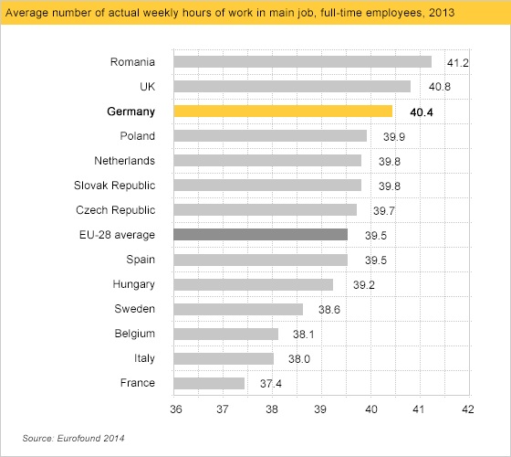

# Descripción de datos cualitativos 

Los **datos cualitativos** corresponden a observaciones sobre cualidades de un objeto o individuo, tales como su  especie o su sexo, que pueden ser iguales o diferentes y no admiten ningún otro tipo de comparación significativa: por ejemplo, datos para los que no tenga ningún sentido preguntarse si uno es más grande que otro, ni efectuar operaciones aritméticas con ellos, aunque estén representados por números. Llamaremos  **niveles** a los diferentes valores que puede tomar una variable cualitativa; por ejemplo, los dos niveles de una variable "Sexo"  serían "Macho" y "Hembra", o sinónimos.


## Frecuencias {#sec:frecs}

Lo único que podemos hacer con un conjunto de datos cualitativos es contar cuántas veces aparece cada nivel y presentar estos conteos por medio de una tabla o un gráfico:

* **Frecuencia absoluta** de un nivel: el número de veces que aparece en la muestra

* **Frecuencia relativa** de un nivel: la fracción del total de la muestra que representa este nivel

Además, llamaremos la **moda** al nivel (o a los niveles, en caso de empate) más frecuente. A veces usaremos adjetivos como **unimodal**, **bimodal**, **multimodal** etc. para referirnos, respectivamente, a una variable con una sola moda, con dos modas, con "varias" modas, etc. 


```{example, sexoger1}
Hemos recogido información sobre 20 residentes en geriátricos que en el período marzo-mayo de 2020 tuvieron COVID-19. Uno de los datos que hemos recogido sobre estas personas ha sido su sexo. El resultado ha sido una variable cualitativa, que llamaremos "Sexo", formada por las 20 observaciones siguientes:
  

```
 
<p style="text-align:center">Mujer,  Mujer,  Hombre,  Mujer,  Mujer,  Mujer,  Mujer,  Mujer,  Hombre, Mujer
Hombre,  Hombre,  Mujer,  Mujer,  Hombre,  Mujer,  Mujer,  Mujer,  Mujer,  Hombre.</p>

 

Sus dos niveles son *Hombre* y *Mujer*. En esta variable hay 14 mujeres y 6 hombres. Por lo tanto, éstas son las frecuencias absolutas de estos niveles. Puesto que en total hay 20 individuos, sus frecuencias relativas son:

* *Hombre*: 6/20=0.3

* *Mujer*: 14/20=0.7

Resumimos estos valores en la **tabla de frecuencias** siguiente:

```{r,echo=FALSE,label=tabla2}
DF=data.frame(FrecAbs=c(6,14,20),
              FrecRel=c(0.3,0.7,1),
              Perc=c("30%","70%","100%"))
rownames(DF)=c("Hombre","Mujer","Total")
kable(DF,
              caption='Tabla de frecuencias',
             row.names=TRUE,
             col.names=c("Frecuencia absoluta","Frecuencia relativa","Porcentaje"))
```


```{block2,type="rmdnote"}
El término **moda** y los adjetivos **unimodal**, **bimodal** también se usan en variables poblacionales: dada una variable poblacional cualitativa, su **moda** es el nivel  más frecuente en el total de la población, cuando existe, y decimos que es **unimodal** cuando hay un nivel que es *mucho más frecuente* que el resto. 

Pero en este caso poblacional, **bimodal** no significa que la mayor frecuencia de un nivel en la población se dé en dos niveles que empaten exactamente, sino que hay dos niveles con frecuencias parecidas y mucho mayores que el resto. Por ejemplo, supongamos que tenemos una variable poblacional que puede tomar 4 valores excluyentes: A, B, C, D.

* Si en el total de la población los niveles A y B se dan, cada uno, en un 25.5% de los individuos, y los niveles C y D cada uno en un 24.5% de los individuos, no diremos que la variable sea bimodal.

* Si en el total de la población el nivel A se da en un 42% de los individuos, el nivel B en un 40% de los individuos, el nivel C en un 10% y el nivel D en un 8%, sí que diremos que es bimodal, aunque A sea más frecuente que el resto.


```

## Gráficos

Podemos representar una tabla como la anterior mediante un **diagrama de barras**, en el que para  cada nivel dibujaremos una barra cuya altura represente su frecuencia (absoluta o relativa):

```{r,echo=FALSE,label=barplot1abs,fig.cap="Diagrama de barras de las frecuencias absolutas de la variable \"Sexo\""}
Sexo_Ger=c("Mujer","Mujer","Hombre","Mujer","Mujer","Mujer","Mujer","Mujer","Hombre","Mujer","Hombre","Hombre","Mujer","Mujer","Hombre","Mujer","Mujer","Mujer","Mujer","Hombre")
barplot(table(Sexo_Ger),col=c("light blue","pink"))
```

```{r,echo=FALSE,label=barplot1rel,fig.cap="Diagrama de barras de las frecuencias relativas de la variable  \"Sexo\""}
barplot(prop.table(table(Sexo_Ger)),col=c("light blue","pink"))
```


Un tipo muy popular de representación gráfica de variables cualitativas son los **diagramas circulares** (o **diagramas de quesitos**), donde se representan los niveles de una variable cualitativa como sectores circulares de un círculo, de manera que el ángulo (o equivalentemente, el área) de cada sector sea proporcional a la frecuencia  del nivel al que corresponde. El diagrama circular de la variable dicotómica "Sexo" sería el siguiente:

```{r,echo=FALSE,fig.cap="Diagrama circular de la variable  \"Sexo\""}
pie(table(Sexo_Ger),col=c("light blue","pink"))
```


Pese a su popularidad, es poco recomendable usar diagramas circulares cuando manejamos más de dos niveles, porque a veces es difícil, a simple vista, comprender las relaciones entre las frecuencias que representan.  Para convencerse, basta comparar los diagramas de barras y los diagramas circulares de la Figura \@ref(fig:wiki) (extraída de la [entrada sobre diagramas circulares de la *Wikipedia*](http://en.wikipedia.org/wiki/Pie_chart)).


```{r,echo=FALSE, wiki, echo=FALSE, fig.cap="Diagramas de barras *versus* diagramas circulares", out.width="75%"}
knitr::include_graphics("INREMDN_files/figure-html/wikipc.png")
```

Algunos programas ofrecen la posibilidad de dibujar diagramas circulares tridimensionales como el siguiente:


```{r echo=FALSE}
knitr::include_graphics("INREMDN_files/figure-html/3dpiechart.png")
```

Estos diagramas quedan muy bonitos, pero son aún peores que los diagramas circulares planos, puesto que la perspectiva deforma las áreas. A simple vista, en el diagrama anterior, ¿qué frecuencia es mayor: la del nivel representado por el color azul oscuro, o la del correspondiente al verde claro?


```{block2,type="rmdimportant"}
Y por este motivo, por favor, **nunca** uséis diagramas circulares para más de dos niveles.
```

Un gráfico ha de servir más que mil palabras, y tiene que explicar de un vistazo las características más relevantes de los datos que representa. Luego ya se pueden añadir detalles que complementen esta primera comprensión básica. En el caso de un diagrama de barras, su objetivo ha de ser poder comprender la relación entre las magnitudes de las frecuencias que representa; si nos interesan sus valores concretos, es mejor dar la tabla. Por ejemplo, en los diagramas de barras de la variable "Sexo" dados más arriba se ve a simple vista que hay aproximadamente el doble de mujeres que de hombres. 

Por ese motivo es un pecado estadístico modificar un gráfico para que el primer vistazo sea engañoso. En un diagrama de barras, la adulteración más usual, y ante la que hay que estar atentos, es **truncarlo** de manera que el eje de ordenadas no arranque en el 0. Mirad, por  ejemplo, el diagrama de barras siguiente:

```{r,echo=FALSE,label=barplot1trunc,fig.cap="Diagrama de barras truncado de las frecuencias relativas de la variable  \"Sexo\""}
Sexo_Trunc=rep(c("Mujer","Hombre"),c(10,2))
barplot(prop.table(table(Sexo_Trunc)),col=c("light blue","pink"),yaxt="n")
axis(2,at=0.1666*(0:5),labels=0.2+0.1*(0:5))
```

Sigue indicando que en la muestra hay un 30% de hombres y un 70% de mujeres, pero si le dáis un vistazo superficial, sin mirar las marcas del eje de ordenadas, parece que la proporción de mujeres es cinco veces la de los hombres y no un poco más del doble.

Es muy frecuente encontrar diagramas de barras (u otros tipos de gráficos) truncados en medios de comunicación. Por ejemplo mirad el gráfico siguiente, que representa las medias estatales de horas de trabajo de los empleados a tiempo completo en los países de la Unión Europea en 2013 según *Eurostat* y publicado por una empresa que fomenta la inversión en empresas alemanas (extraído en su momento del sitio web de  [German Trade & Invest](https://www.gtai.de/GTAI/Navigation/EN/invest,t=motivated-and-dependable-employees,did=214428.html); cada año lo ponen al día):


```{r,echo=FALSE, out.width="75%"}

```

A simple vista, sin mirar los números, parece que en Alemania (barra amarilla) se trabajan de media bastante más horas semanales que la media europea (barra gris oscura), justamente el mensaje que quiere hacernos llegar una organización cuyo objetivo es el fomento de la inversión en Alemania. Pero si luego miráis los números, la diferencia es de 40.4 horas en Alemania contra 39.5 de media europea, menos de 1 hora sobre unas 40. El diagrama de barras sin truncar sería el siguiente:


```{r,echo=FALSE, out.width="75%"}
knitr::include_graphics("INREMDN_files/figure-html/german2.png")
```

Per claro, este ya no incita tanto a la inversión en la trabajadora Alemania. 

```{block2,type="rmdromans"}
No podemos dejar este asunto sin la siguiente obra maestra de los diagramas de barra truncados:
```


```{r echo=FALSE, out.width="75%"}
knitr::include_graphics("INREMDN_files/figure-html/vene1.png")
```


## Tablas de frecuencias multidimensionales

Cuando medimos más de una variable cualitativa sobre un mismo grupo de  individuos, representamos sus frecuencias absolutas o relativas mediante **tablas de contingencia**.

```{example, sexoger2}
Continuemos con nuestra muestra de 20 pacientes en residencias geriátricas.
Además de su sexo, hemos anotado otras dos características: una variable "Demencia senil" que recoge si en el momento del ingreso en la residencia habían sido diagnosticados con algún tipo de demencia senil, con niveles "No", "Alzheimer" y "Otros" (para indicar otros diagnósticos de demencia no-Alzheimer), y una variable "Cáncer de mama" que indica si en algún momento han sufrido o no cáncer de mama.

```

La tabla de datos es la siguiente:
```{r,echo=FALSE, tablager2,echo=FALSE}
Sexo_Ger=c("Mujer","Mujer","Hombre","Mujer","Mujer","Mujer","Mujer","Mujer","Hombre","Mujer","Hombre","Hombre","Mujer","Mujer","Hombre","Mujer","Mujer","Mujer","Mujer","Hombre")
Demencia=c("No","Alzheimer","Alzheimer","Otros", "Alzheimer","Otros","No","Alzheimer","Otros","Otros","Alzheimer","Alzheimer","No","No","Alzheimer","No","No","No","Alzheimer","No")
Cancer=c("No","Sí","No","No","No","Sí","No","No","No","Sí","No","No","No","No","No","Sí","No","No","No","No")
Demencia=factor(Demencia,levels=c("Alzheimer","Otros","No"))
DFGer=data.frame(Sexo_Ger,Demencia,Cancer)
names(DFGer)=c("Sexo","Demencia Senil","Cáncer de mama")
kable(DFGer,
              caption='Muestra de una residencia geriátrica',
             row.names=TRUE)%>%
  kable_styling(bootstrap_options=c("condensed"), full_width = F, fixed_thead = T)
```

La tabla bidimensional de frecuencias absolutas de las variables "Sexo" y "Demencia senil", que nos da la frecuencia absoluta de cada combinación de sexo y tipo de demencia senil, es:

```{r,echo=FALSE}
kable(table(DFGer[,1:2])) %>%
  kable_styling(bootstrap_options = "striped", full_width = F)
```


y la tabla tridimensional de frecuencias absolutas de las tres variables, que nos da la frecuencia absoluta de cada combinación de sexo, tipo de demencia senil y si se ha sufrido o no cáncer de mama, es:

```{r,echo=FALSE}
pander(ftable(DFGer))
```

```{block2,type="rmdnote"}
A la hora de decidir qué variable asignamos a las filas y cuál a las columnas en una tabla de contingencia bidimensional, es conveniente recordar que, en los paises occidentales, solemos leer las tablas por filas y  de izquierda a derecha. Por ello, si tenemos interés en la distribución de los niveles de una variable dentro de los niveles de una segunda variable, puede facilitar la lectura de la tabla  que esta segunda variable defina las filas. 
```
  

A menudo es conveniente añadir a una tabla de contingencia multidimensional, filas y columnas **marginales** (en los márgenes) con las frecuencias totales de cada nivel dentro de cada variable. De esta manera, también tenemos las tablas de frecuencias de cada una de las variables.  Por ejemplo, si añadimos la fila y la columna marginales a la tabla bidimensional anterior obtenemos:

```{r,echo=FALSE}
tabla=addmargins(table(DFGer[,1:2]))
dimnames(tabla)[[1]][3]="Total"
dimnames(tabla)[[2]][4]="Total"
pander(tabla)
```

Las tablas multidimensionales de frecuencias relativas son algo más complicadas porque dichas frecuencias relativas se pueden calcular en el total de la muestra (las llamamos frecuencias relativas **globales**) o dentro de los niveles de una de las variables (por filas o por columnas, en el caso bidimensional), en función de lo que nos interese medir. Por ejemplo:

* Si nos interesa la fracción de residentes de cada combinación de sexo y tipo de demencia senil en el total de la muestra, usaremos la tabla de frecuencias relativas globales de las variables "Sexo" y "Demencia senil":
```{r,echo=FALSE}
kable(prop.table(table(DFGer[,1:2])))
```

* Si nos interesa la fracción de residentes con cada tipo de demencia senil dentro de cada sexo, usaremos la tabla de frecuencias relativas de la variable "Demencia senil"  dentro de la  variable "Sexo":

```{r,echo=FALSE}
kable(prop.table(table(DFGer[,1:2]),margin=1))
```


* Si nos interesa la fracción de residentes de cada sexo dentro del grupo de pacientes con cada  tipo de demencia senil, usaremos la tabla de frecuencias relativas de la variable "Sexo"  dentro de la  variable "Demencia senil":

```{r,echo=FALSE}
kable(prop.table(table(DFGer[,1:2]),margin=2))
```

De esta manera, por ejemplo:

* La entrada superior izquierda de la primera tabla nos dice que los hombres con Alzheimer representan el 20% del total de la muestra
* La entrada superior izquierda de la segunda tabla nos dice que los hombres con Alzheimer representan el 66.67% de los hombres de la muestra
* La entrada superior izquierda de la tercera tabla nos dice que los hombres con Alzheimer representan el 50% de los enfermos de Alzheimer de la muestra.

En una tabla de contingencia de frecuencias relativas globales, tiene sentido añadir filas y columnas marginales, que nos darán las frecuencias relativas de los niveles de cada variable.


```{r,echo=FALSE}
tabla=addmargins(prop.table(table(DFGer[,1:2])))
dimnames(tabla)[[1]][3]="Total"
dimnames(tabla)[[2]][4]="Total"
pander(tabla)
```

Pero en una tabla de contingencia de frecuencias relativas de una variable respecto de otra no tiene mucho interés. Por ejemplo, añadamos las marginales a la tabla de frecuencias relativas de la variable "Demencia senil"  dentro de la  variable "Sexo":

```{r,echo=FALSE}
tabla=addmargins(prop.table(table(DFGer[,1:2]),margin=1))
dimnames(tabla)[[1]][3]="Total"
dimnames(tabla)[[2]][4]="Total"
pander(tabla)
```

Como hemos calculado las frecuencias relativas dentro de cada fila, la suma de las frecuencias relativas de cada fila ha de ser 1. Ahoar fijaos en la fila de marginales. Nos dice por ejemplo que la suma de la proporción de hombres que tienen Alzheimer, 0.6667, y de la proporción de mujeres que tienen Alzheimer, 0.2857, es 0.9523. ¿Qué significado tiene este número? Ninguno, y en todo caso **de ninguna manera significa** que la proporción de individuos con Alzheimer en la muestra sea 0.9523, ya que esta proporción es del 40%.


## Diagramas de barras bidimensionales

Una tabla de frecuencias bidimensional se suele representar mediante un diagrama de barras bidimensional, que puede ser: 

* **De barras apiladas**: Se escoge una variable (la llamaremos **principal**), se dibuja una barra para cada uno de sus niveles de altura la frecuencia de dicho nivel, y cada una de estas barras se divide verticalmente en sectores que representan las frecuencias de los niveles de la otra variable dentro de ese nivel. 


* **De barras yuxtapuestas**. Se escoge una variable **principal** y para cada uno de sus niveles se dibuja un diagrama de barras de las frecuencias de los niveles de la otra variable.

Por ejemplo: 

* El diagrama de barras apiladas de frecuencias absolutas de las variables "Sexo" y "Demencia senil" de la Tabla \@ref(tab:tablager2), tomando la variable "Sexo" como principal:

```{r,echo=FALSE}
barplot(table(DFGer[,2:1]),col=c("red","orange","yellow"),legend.text=TRUE,args.legend=list(x="topleft",cex=0.75))
```

* El diagrama de barras apiladas de frecuencias absolutas de las variables "Sexo" y "Demencia senil" de la Tabla \@ref(tab:tablager2), tomando la variable "Demencia senil" como principal:

```{r,echo=FALSE}
barplot(table(DFGer[,1:2]),col=c("light blue","pink"),legend.text=TRUE,args.legend=list(x="top",cex=0.75))
```

* El diagrama de barras yuxtapuestas de frecuencias absolutas de las variables "Sexo" y "Demencia senil" de la Tabla \@ref(tab:tablager2), tomando la variable "Sexo" como principal:

```{r,echo=FALSE}
barplot(table(DFGer[,2:1]),col=c("red","orange","yellow"),legend.text=TRUE,args.legend=list(x="topleft",cex=0.75),beside=TRUE)
```

* El diagrama de barras yuxtapuestas de frecuencias absolutas de las variables "Sexo" y "Demencia senil" de la Tabla \@ref(tab:tablager2), tomando la variable "Demencia senil" como principal:

```{r,echo=FALSE}
barplot(table(DFGer[,1:2]),col=c("light blue","pink"),legend.text=TRUE,args.legend=list(x="topleft",cex=0.75),beside=TRUE)
```


Los diagramas de barras tienen que mostrar la información de la manera más adecuada. Por ejemplo, si lo que nos interesa es la distribución de los tipos de demencia por sexo,  la variable principal ha de ser el "Sexo". Si nos interesan las frecuencias relativas globales, seguramente sea más conveniente dar un diagrama de barras tomando como niveles las combinaciones de niveles de ambas variables.

```{r,echo=FALSE,fig.cap="Diagrama de barras de frecuencias relativas globales de las variables \"Sexo\" y \"Demencia senil\"",fig.width=10,out.width="80%"}
barplot(c(4,1,1,4,3,7),names=c("Hombre-Alzheimer","Hombre-Otros","Hombre-No","Mujer-Alzheimer","Mujer-Otros","Mujer-No"))
```


El usar barras apiladas o yuxtapuestas en un diagrama de barras bidimensional ya va más a gusto de cada uno: en los diagramas de barras apiladas es más fácil comparar las frecuencias de los niveles de la variable principal,en los diagramas de barras yuxtapuestas es más fácil comparar la distribución de los niveles de la variable secundaria dentro de cada nivel de la variable principal. 


## Diagramas de mosaico


Una tabla tridimensional se suele representar mediante un **diagrama de mosaico**. Estos gráficos se obtienen sustituyendo cada entrada de la tabla de frecuencias por una región rectangular de área proporcional a su valor.  Por ejemplo, el diagrama de mosaico de la Tabla  \@ref(tab:tablager2) es


```{r,echo=FALSE}
mosaicplot(table(DFGer),col=c("pink","lightblue"),main="")
```


## Ejercicios

### Problemas {-}

**(1)** En un estudio transversal sobre 145 sujetos, 75 hombres y  70 mujeres, 
40 hombres y 20 mujeres presentaron una determinada enfermedad. Representad estos datos en un diagrama de barras bidimensional de frecuencias relativas que muestre las proporciones de enfermos y sanos en cada sexo.

**(2)** Considerad la tabla siguiente de frecuencias absolutas:

$$
\begin{array}{lc}
&\hphantom{YY}\textbf{Propiedad X} \\
\begin{array}{l}
\textbf{Propiedad Y}
\end{array}
&\!\!\!\!\!
\begin{array}{r |c|c|}
 &\text{Sí} & \text{No}  \\ \hline
  \text{Sí} & 56 & 35\\
  \text{No} & 28 & 90\\ 
\end{array}
\end{array}
$$

¿Cuál es la frecuencia relativa de los individuos con Propiedad X entre los que NO  tienen la propiedad Y?

### Test {-}

**(1)** Para comparar el alcance del alcoholismo en Barcelona y en Palma, ¿qué es más adecuado usar?

1. Las frecuencias absolutas de alcohólicos en Palma y en Barcelona
1. Las frecuencias relativas de alcohólicos en Palma y en Barcelona 
1. Las frecuencias relativas de palmesanos y de barceloneses entre los alcohólicos españoles
1. Las frecuencias relativas de palmesanos alcohólicos y de barceloneses alcohólicos en el total de los españoles

**(2)** ¿De qué tipo es la siguiente tabla de contingencia?
$$
\begin{array}{lc}
&\hphantom{YY}\textbf{Propiedad X} \\
\begin{array}{l}
\textbf{Propiedad Y}
\end{array}
&\!\!\!\!\!
\begin{array}{r |c|c|}
 &\text{Sí} & \text{No}  \\ \hline
  \text{Sí} & 0.23 & 0.36\\
  \text{No} & 0.17 & 0.24\\ 
\end{array}
\end{array}
$$

1. De frecuencias absolutas.
1.  De frecuencias relativas marginales por columnas.  
1. De frecuencias relativas marginales por filas.
1. De frecuencias relativas globales.
1. No podemos saberlo sin conocer la fila y la columna marginales.


