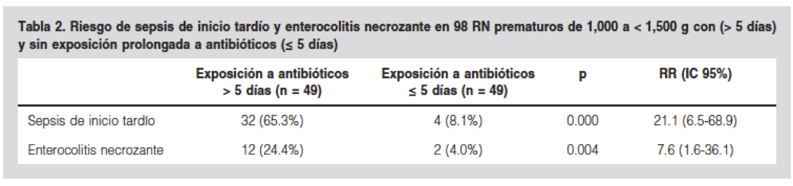
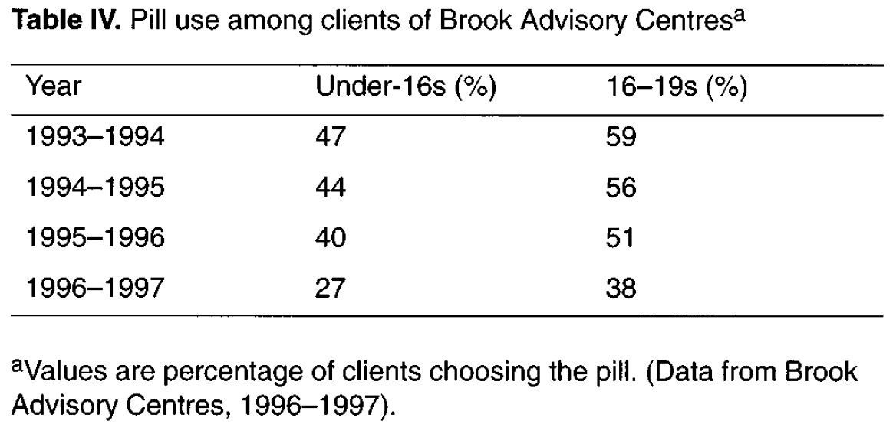

## Riesgos {#sec:probaplic2}

Como ya hemos comentado, en estudios médicos las probabilidades también aparecen como "riesgos" de que pase algo. Recordemos que, si simplificamos mucho, en la mayoría de estudios cruzamos información sobre dos sucesos que les pueden pasar a las personas:

* El **desenlace**, que para simplificar identificaremos con **enfermedad**: $E$ será el suceso "estar enfermo" y $S$ "estar sano", de manera que $S=E^c$.

* Su **exposición** a un factor de **R**iesgo: $R$ será el suceso "estar (o haber estado) expuesto" y $R^c$ su complementario.

Podemos clasificar los sujetos de la población según estos dos pares de sucesos complementarios: 

$$
\begin{array}{l}
\hphantom{ExposiciónExposiciónT}\textbf{Desenlace} \\
\begin{array}{c|c|c}
\textbf{Exposición}  & E & S \\ \hline
R & \text{Expuestos} & \text{Expuestos} \\[-0.5ex]  	
 & \text{enfermos} & \text{sanos} \\ \hline
R^c & \text{No expuestos} & \text{No expuestos} \\[-0.5ex]   	
 & \text{enfermos} & \text{sanos}
\end{array}
\end{array}
$$

```{block2,type="rmdnote"}
Fijaos en que incluso las pruebas diagnósticas se podrían interpretar en términos de exposición y desenlace: el factor de riesgo sería estar enfermo, el desenlace dar positivo en el test. Pero el lenguaje sobre riesgos va a ser muy diferente del de las pruebas diagnósticas, y además es muy lioso que la enfermedad sea la exposición. Así que preferimos no mezclar y vamos as considerar las pruebas diagnósticas y los estudios de asociación entre una exposición y un desenlace como temas completamente diferentes.
```

Vamos a llamar:

*  **Tasa de riesgo de la enfermedad en expuestos** a la probabilidad de enfermar si se ha estado expuesto, es decir, a $P(E|R)$. 

*  **Tasa de riesgo  de la enfermedad en no expuestos** a la probabilidad de enfermar si **no** se ha estado expuesto, es decir, a $P(E|R^c)$.

Algunas consideraciones, que ya hemos hecho pero volvemos a repetir, sobre cuándo podemos estimar estas tasas de riesgo y cuándo no a partir de los datos de un estudio:

* En un estudio de **cohorte**, partimos de un grupo de expuestos al factor de riesgo y un grupo de no expuestos, y estudiamos la aparición posterior de la enfermedad en ambos grupos. En un estudio **intervencionista**, la situación es exactamente la misma: sabemos quién está expuesto al factor de riesgo  y quién no, porque nosotros hemos decidido a quién exponemos y a quién no, y estudiamos la aparición posterior de la enfermedad.  
    
    Por lo tanto, en ambos tipos de estudios,  **tiene sentido usar las proporciones que observemos de expuestos y no expuestos que enferman para estimar las tasas de riesgo de la enfermedad en expuestos y no expuestos**, $P(E|R)$ y $P(E|R^c)$. 

* Pero en un estudio de **casos y controles**, partimos de un grupo de enfermos y un grupo de sanos, y estudiamos su exposición previa al factor de riesgo. Si tomamos un grupo de casos y un grupo de controles de tamaños fijados *a priori* y que no representen la composición en enfermos y sanos de la población, **NO tiene sentido usar las proporciones que observemos de expuestos y no expuestos que han enfermado para estimar las tasas de riesgo de la enfermedad en expuestos y no expuestos**, porque los números de enfermos y sanos serán "artificiales". En este tipo de estudios,  **solo tiene sentido estudiar las probabilidades de $E$ (y $E^c$) condicionadas a $R$ y $R^c$**, es decir, $P(E|R)$ y $P(E|R^c)$ y sus complementarios. 

    Si, en cambio, en un estudio de casos y controles **la muestra es transversal**, representativa de la población, entonces las proporciones de expuestos o no y de enfermos o no en la muestra serán representativos de la población, y entonces, **pero solo entonces**, sí que tendrá sentido usar las proporciones que observemos de expuestos y no expuestos que han enfermado  para estimar los valores de $P(E|R)$ y $P(E|R^c)$.

* En un estudio **transversal** la situación es la misma que en un estudio de cohorte, o en un estudio de casos y controles con una muestra transversal. Por lo tabnto, **tiene sentido estimar las probabilidades $P(E|R)$ y $P(E|R^c)$**, aunque con una matiz que puede ser importante. Si medimos la exposición y la enfermedad simultáneamente,  las probabilidades $P(E|R)$ y $P(E|R^c)$ que estimemos significarán "la probabilidad de que una persona que **ahora** esté expuesta (o no esté expuesta) al factor de riesgo, **ahora** esté enferma". Este no es exactamente el significado que nos interesa.


### Riesgos relativos y absolutos

Vamos a suponer en esta sección que queremos estudiar la asociación entre la exposición a un factor de riesgo y la aparición de una enfermedad, y que con el estudio que hemos llevado a cabo tiene sentido estimar las tasas de riesgo de la enfermedad: la probabilidad $P(E|R)$ de que un expuesto enferme y la probabilidad $P(E|R^c)$ de que un no expuesto enferme.

Introducimos un poco más de vocabulario:

* **Riesgo absoluto atribuible a la exposición**, **RA**: Es la diferencia entre la tasa de riesgo de la enfermedad en expuestos y en no expuestos.  
$$
RA=P(E|R)-P(E|R^c).
$$
    Mide el incremento absoluto en la probabilidad de enfermar debido a la exposición.

*  **Riesgo relativo**, **RR**: Es el cociente entre la tasa de riesgo de la enfermedad en expuestos y en no expuestos. 
$$
RR=\dfrac{P(E|R)}{P(E|R^c)}.
$$
    Mide cuántas veces es más probable enfermar entre los expuestos que entre los no expuestos.

* **Número necesario para dañar**, **NND**: Es el número de personas que tendríamos que exponer al factor de riesgo para que, de media, una persona **adicional** enfermara. Aquí **adicional** significa que si no hubiera estado expuesta, no habría enfermado.

Veamos un ejemplo concreto de RA, RR y, sobre todo, NND, para entender mejor de qué se trata.

```{example,IBScohorte2}
Recordad el estudio de Rotterdam del Ejemplo \@ref(exm:EPCOCoh), en el que se observó que  desarrollaron EPOC un 17.8% de los que eran fumadores al inicio del estudio o lo habían sido pero lo habían dejado, frente al 6.4% de los que nunca habían fumado. Para simplificar, a los primeros los llamaremos **fumadores** y a los segundos **no fumadores**. Estos datos nos permiten estimar que si no se es fumador (es decir, si no se fuma ni nunca se ha fumado), se tiene una probabilidad del 6.4% de contraer EPOC, mientras que si se es fumador (ahora o en el pasado), esta probabilidad es del 17.8%. 

```

En este caso, si $R$ es el suceso "ser fumador" y $E$ es el suceso "tener EPOC", entonces estimamos que
$$
P(E|R)=0.178,\quad P(E|R^c)=0.064
$$

Entonces:

* RA=0.178-0.064=0.114: el ser fumador aumenta la probabilidad de contraer EPOC en 0.114.

* RR=0.178/0.064=2.78: el ser fumador multiplica por 2.78 la probabilidad de contraer EPOC.

* El NND en este contexto sería el número de no fumadores que tendrían que empezar a fumar para añadir 1 caso de EPOC al número esperado de casos.
¿Cómo podemos calcularlo? 

     Estimamos que, de media, de cada 1000 personas no fumadoras, 64 contraen EPOC, y de cada 1000 personas fumadoras, 178 contraen EPOC. Por lo tanto, si tomáramos 1000 personas no fumadoras y las hiciéramos fumar, el número esperado de casos de EPOC subiría de 64 a 178. Es decir, el número de casos **adicionales** de EPOC sería de 114. Fijaos en que estos casos de EPOC son los aportados por el fumar, ya que de las 178 personas fumadoras  que tendrían EPOC entre estas 1000, 64 habrían tenido EPOC aunque no fumaran.

    Tenemos por tanto que si 1000 no fumadores empiezan a fumar, esperamos 114 casos adicionales de EPOC. ¿Cuántos no fumadores tendrían que empezar a fumar para que esperáramos tener 1 caso adicional de EPOC? Haced la proporción. Si 1000  no fumadores que empiezan a fumar dan 114 casos adicionales de EPOC, el número NND de no fumadores que han de empezar a fumar para obtener 1 caso extra de EPOC es
$$
NND=\frac{1000}{114}=8.8
$$
De media, por cada 8.8 personas no fumadoras que se pasan a fumadoras, hay un caso extra de EPOC.


```{block2,type="rmdcaution"}
Recordad que cuando estimamos estos riesgos en un estudio observacional, solo se trata de asociaciones, de ninguna manera podemos inferir que la exposición **cause** tal o cual incremento en la probabilidad de enfermar. 
```


```{example,sepsis1}
En el estudio ["Exposición prolongada a antibióticos y riesgo de sepsis tardía (ST) en neonatos de 1000 a <1500 g: estudio de cohorte"](https://www.medigraphic.com/pdfs/gaceta/gm-2015/gm153d.pdf) (E. Briones *et al*, *Gaceta Médica de México* 151 (2015), pp. 306-12) se  tomó una cohorte de **expuestos** formada 49 recién nacidos de bajo peso y con infección perinatal que fueron tratados con antibióticos desde  su primer día y durante más de 5 días. Como cohorte **no expuesta** se tomó un grupo de 49 niños idénticos, pero con una duración del tratamiento de antibióticos de ≤ 5 días. Tanto unos como otros no tenían síntomas de sepsis al iniciar el tratamiento. Se les realizó un seguimiento para detectar la aparición de sepsis a partir del 5^o^ día de vida (será lo que llamaremos sepsis tardía, ST, para abreviar).


```

Nuestra población de interés son recién nacidos de bajo peso tratados con antibióticos. Denotemos por $R$ el suceso "estar expuesto", es decir, recibir el tratamiento de antibióticos durante 5 o más días, y por $E$ el suceso "enfermar", es decir, desarrollar ST. En este estudio se obtuvo la tabla de frecuencias siguiente:
$$
\begin{array}{c|cc|c}
 & E & E^c & \text{Total}\\ \hline
R & 32 & 17 & 49   \\ 
R^c & 4 & 45 & 49\\ \hline
\text{Total} & 36 & 62 & 98
\end{array}
$$
 
Vamos a estimar el RA, el RR y el NND de ST para la exposición a un tratamiento de más de 5  días de antibióticos.

En primer lugar, estimamos los riesgos:
$$
P(E|R)=\frac{32}{49}=0.653,\quad
P(E|R^c)=\frac{4}{49}=0.082
$$
Entonces:

* $RR= \dfrac{32/49}{4/49}=8$.
    
    Entre los neonatos de bajo peso, el tratamiento con antibióticos durante más de 5 días  **multiplica por 8** (**aumenta en un 700%**) el riesgo de ST.

* $RA=\dfrac{32}{49}-\dfrac{4}{49}=\dfrac{28}{49}=0.571$.

    El tratamiento con antibióticos durante más de 5 días **aumenta en 57.1 puntos porcentuales**  el riesgo de ST. 

```{block2,type="rmdimportant"}
¡Cuidado con cómo os expresáis! El riesgo de ST entre los no expuestos es del 8.2% y entre los expuestos es del 65.3%. Por lo tanto, el riesgo entre los expuestos es **57.1 puntos porcentuales mayor** que entre los no expuestos. No un 57.1% mayor. ¡No puede ser un 700% mayor y un 57.1% mayor al mismo tiempo!

Que fuera un 57.1% mayor significaría que
$$
P(E|R)=P(E|R^c)+0.571\cdot P(E|R^c)
$$
pero en nuestro caso lo que tenemos es
$$
P(E|R)=P(E|R^c)+0.571.
$$
No es lo mismo.
```

* Falta el NND. Veamos, de cada 100 neonatos de bajo peso tratados con antibióticos ≤ 5 días, 8.2 sufren ST, y de cada 100 neonatos de bajo peso tratados con antibióticos > 5 días, 65.3 sufren ST. Por lo tanto, si tomamos 100 neonatos de bajo peso y en vez de tratarlos ≤ 5 días con antibiótico los tratamos > 5 días, el número esperado de casos de ST sube de 8.2 a 65.3. Es decir, si "exponemos" 100 individuos, esperamos 57.1 casos de ST adicionales. 

    Por lo tanto, para esperar 1 caso de ST adicional hay que "exponer" 100/57.1=1.75 neonatos. Este es el NND requerido: el número de neonatos de bajos peso que tenemos que pasar de tratar  5 días o menos con antibióticos a tratarlos más de > 5 días para tener un caso adicional de ST, que no se daría si no se los cambiara de tratamiento.

```{block2,type="rmdimportant"}
Por si no habéis caído en la cuenta:

* En el ejemplo del estudio de Rotterdam, el NND nos ha dado 1000/114=1/0.114=1/RA
* En el ejemplo de la sepsis tardía, el NND nos ha dado 100/57.1=1/0.571=1/RA. 

¿Casualidad? No.

```

```{theorem}
Se tiene siempre que NND=1/RA.


```

```{block2,type="rmdcorbes"}
La justificación de esta igualdad es simplemente repetir el argumento que hemos usado para calcular los NND, pero con valores genéricos para $P(E|R)$ y $P(E|R^c)$. Supongamos que $P(E|R)=x$ y $P(E|R^c)=y$, de manera que $RA=y-x$. Esto significa que:

* Por cada 100 sujetos no expuestos, de media $100x$ enferman.

* Por cada 100 sujetos expuestos, de media $100y$ enferman.

* Por cada 100 sujetos que pasemos de no expuestos a expuestos, de media $100(y-x)$  adicionales enfermarán.

* Por lo tanto, el número de sujetos que hemos de exponer de media al factor de riesgo para tener 1 enfermo adicional es 
$$
\frac{100}{100(y-x)}=\frac{1}{y-x}=\frac{1}{RA}.
$$

```  
  

Por lo tanto, la información que aportan el RA y el NND son la misma, solo que presentada de otra manera.

```{block2,type="rmdromans"}
Como podéis ver en la Figura \@ref(fig:tabla2ST), los autores estimaron un RR de ST de 21.1. A nosotros nos ha salido un RR de 8. ¿Cómo les puede haber salido ese RR=21.1? Continuará.
```


```{r tabla2ST,echo=FALSE,fig.cap="Tabla 2 en el artículo \"Exposición prolongada a antibióticos y riesgo de sepsis tardía (ST) en neonatos de 1000 a <1500 g: estudio de cohorte\".",out.width="80%"}

```


Muchas veces nos dan los valores del RA o el RR de una exposición, pero no no nos dan la tasa de riesgo en los no expuestos. Entonces, solo sabemos cuánto aumenta el riesgo pero no sabemos de qué valor parte, y esto nos impide entender completamente la situación. 


```{example}
La página ["Terapia hormonal en la menopausia y el riesgo de padecer cáncer"](https://www.cancer.org/es/cancer/causas-del-cancer/tratamientos-medicos/terapia-de-restitucion-de-hormonas-en-la-menopausia-y-el-riesgo-de-cancer.html)  de la *American Cancer Society* recoge, entre muchos otros, los datos siguientes:
        
```

> Las mujeres sometidas a terapia de reemplazo hormonal reducen su riesgo de cáncer colorectal a 10 años vista en un 50%. 

> Las mujeres sometidas a terapia de reemplazo hormonal aumentan su riesgo de cáncer de mama en los próximos 10 años en 0.8 puntos porcentuales (8 de cada 1000).

Parece que, en el cómputo global, la terapia de reemplazo hormonal previene los casos de cáncer: baja el riesgo de uno en un 50% y sube el riesgo de otro 0.8 puntos porcentuales. Pero no. 

Según los [*Cancer Stat Facts*](https://seer.cancer.gov/statfacts/) del Instituto Nacional del Cáncer (de los EEUU), la incidencia del cáncer colorectal en mujeres es de 4 por cada 10,000 anuales. Por lo tanto, de 4 por cada 1000 mujeres cada 10 años. La reducción en un 50% significa que baja a 2 por cada 1000. En resumen, por cada 1000 mujeres y 10 años,  la terapia de reemplazo hormonal reduce en 2 el número estimado de casos de cáncer colorectal y aumenta en 8 el número  estimado de casos de cáncer de mama. Por tanto,  por cada 1000 mujeres y 10 años, aumenta en 6 el número  esperado de casos de cáncer.

```{block2,type="rmdexercici"}
Los 50% y 0.8% que aparecen en el ejemplo anterior, ¿qué son: riesgos absolutos o riesgos relativos? ¿Cuántas mujeres hemos de empezar a tratar  con terapia de reemplazo hormonal para tener 1 caso adicional de cáncer?
```        


Insistimos.

```{example}
Según la *National Cancer Institute's Breast Cancer tool* de 1998, 

* "Las mujeres que toman tamoxiflen tienen un 49% menos de diagnósticos de cáncer invasivo de mama"

*  "La tasa anual de cáncer uterino entre las mujeres que toman tamoxiflen es de 30 por cada 10,000, comparado con los 8 a 10 por cada 10,000 anuales en la población femenina general"

```

Pero la incidencia anual del cáncer invasivo de mama era de 18 por cada 10,000 mujeres, por lo tanto

* El tamoxiflen reduce del 0.18% a 0.09% el  riesgo de cáncer invasivo de mama
* Y aumenta el riesgo  de cáncer uterino de 0.09% a 0.3%.
* Por lo tanto, en términos absolutos, aumenta del 0.27% al 0.39% el riesgo de alguno de los dos cánceres: en algo más de 1 por cada 1000 mujeres


Un último ejemplo.


```{example,pindolatr}
En octubre de 1995, se publicó en la prensa británica y en circulares a médicos que los anticonceptivos de 3a generación multiplicaban por 2 el riesgo de trombosis venosa (TV). Esta afirmación se basaba en estudios publicados o a punto de ser publicados ese año, como por ejemplo el del *World Health Organization Collaborative Study of Cardiovascular Disease and Steroid Hormone Contraception*: ["Venous thromboembolic disease and combined oral contraceptives: results of international multicentre case-control study"](https://resourcelibrary.stfm.org/HigherLogic/System/DownloadDocumentFile.ashx?DocumentFileKey=01b7b448-119e-c8ac-d90a-800aaf096608&forceDialog=0) (*The Lancet* 346 (1996), pp. 1575-1582).

El resultado del "susto de la píldora del 95" fue una reducción en el consumo de la píldora en el Reino Unido, como muestra la tabla de la Figura \@ref(fig:tableIV), y como consecuencia que en 1996 hubiera unos 13,600 abortos  más y unos 12,400 nacimientos más que en 1995.    Encontraréis más detalles de esta historia y su coste social y sanitario en ["Social consequences. The public health implications of the 1995 `pill scare'"](https://academic.oup.com/humupd/article/5/6/621/745751) (A. Furedi, *Human Reproduction Update*, 5 (1999), pp. 621-626).


```


```{r tableIV,echo=FALSE,fig.cap="Tabla IV en el artículo \"Social consequences. The public health implications of the 1995 pill scare\".",out.width="60%"}

```

Vamos a analizar la afirmación de que "los anticonceptivos de 3a generación multiplicaban por 2 el riesgo de trombosis" en términos de riesgos. Según [MedSafe](https://www.medsafe.govt.nz/consumers/leaflets/oralcontraceptives.asp), entre las mujeres de entre 15 y 44 años:

* Entre 5/100,000 y 10/100,000 mujeres anuales padecen una TV: tomaremos la media, 7.5/100,000.

* Tomar anticonceptivos de 2a generación multiplica por 3.5 este riesgo (es decir, su RR es 3.5): 26.25/100,000 mujeres anuales 

* Tomar anticonceptivos de 3a generación multiplica por 2 este último riesgo: 52.5/100,000 mujeres anuales 

Por tanto, si bien el RR de los anticonceptivos de 3a generación respecto de los de 2a generación es 2, en términos absolutos solo representa un aumento esperado de 26 casos de TV por cada 100,000 mujeres que pasen de anticonceptivos de 2a a 3a generación.

Para poner estos números en perspectiva:

* El riesgo de TV durante o inmediatamente después del embarazo se estima en Europa de 71/100,000 (según el [*UpToDate* "Deep vein thrombosis in pregnancy: Epidemiology, pathogenesis, and diagnosis"](\url{http://www.uptodate.com/contents/deep-vein-thrombosis-in-pregnancy-epidemiology-pathogenesis-and-diagnosis)). Es decir, el riesgo de sufrir TV asociado a un embarazo es un 35% mayor que el de tenerla ese mismo año tomando los anticonceptivos de 3a generación.   

* El riesgo de TV durante los 42 días posteriores a un aborto inducido es de 30/100,000 abortos. Si hacéis la proporción, veréis que  el riesgo de sufrir una TV una mujer que tome anticonceptivos de 3a generación durante un periodo de 42 días es de 6/100,000.

Por lo tanto, el aumento de embarazos y abortos por miedo al riesgo de TV si se tomaba un anticonceptivo de 3a generación de hecho aumentó  el riesgo de TV en la población femenina. 


### Riesgos en estudios sobre tratamientos

Los estudios de cohorte o intervencionistas sobre la efectividad de un tratamiento pueden analizarse como los de la sección anterior, solo que cambia ligeramente el lenguaje. Tenemos dos sucesos:

*  El **desenlace en el sujeto**. Denotaremos por $E$ el desenlace  negativo (no se cura, se muere, recae...)  y su complementario será $E^c$: se cura, no se muere, no recae... 

*  Su tipo de **tratamiento** (que corresponde a la exposición al factor de riesgo en la sección anterior). $T$ indicará que es tratado con el tratamiento objeto de estudio, y $T^c$ que pertenece al grupo de control: no es tratado, lo tratamos con placebo, con el tratamiento de referencia... 

Podemos  clasificar los sujetos de la población según estos dos pares de sucesos complementarios: 

$$
\begin{array}{l}
\hphantom{TratamientTratamientoo} \textbf{Desenlace}\\
\begin{array}{r|c|c}
\textbf{Tratamiento} & E & E^c \\ \hline
T & \text{Tratados} & \text{Tratados} \\[-1ex]  	
 & \text{no curados} & \text{curados} \\ \hline
T^c & \text{No tratados} & \text{No tratados} \\[-1ex]  	
 & \text{no curados} & \text{curados} \\ 
\end{array}
\end{array}
$$

 
Tenemos entonces los mismos riesgos que la sección anterior:

*  **Tasa de riesgo de desenlace negativo en tratados**, $P(E|T)$: La probabilidad de desenlace negativo entre las personas tratadas.

*  **Tasa de riesgo de desenlace negativo en no tratados**, $P(E|T^c)$: La probabilidad de desenlace negativo entre las personas no tratadas. 

Para compararlas, podemos dividirlos o restarlos. 

*  **Riesgo relativo**:  El cociente entre la probabilidad de desenlace negativo entre los tratados y entre los no tratados 
$$
RR=\dfrac{P(E|T)}{P(E|T^c)}.
$$

*  **Reducción absoluta del riesgo**: La diferencia absoluta entre la probabilidad de desenlace negativo entre los no tratados y entre los  tratados (para que salga positiva):  
$$
RAR=P(E|T^c)-P(E|T).
$$
    Fijaos en el cambio de nombre respecto a la sección anterior: en el contexto de exposición y enfermedad, a esta resta la hemos llamado **riesgo absoluto**, **RA**.


*  **Reducción relativa del riesgo**: La fracción de la probabilidad de desenlace negativo entre los no tratados que representa la reducción absoluta del riesgo 
$$
RRR=\dfrac{P(E|T^c)-P(E|T)}{P(E|T^c)}=1-RR.
$$

Además en el contexto de los tratamientos se usa, en vez del NND, el valor siguiente:

* **Número necesario para tratar** (**NNT**): número de pacientes que deberían recibir el tratamiento $T$ (en lugar del control $T^c$) para que, de media, un paciente **adicional** recibiera el beneficio (pasara de $E$ a $E^c$).

    Veamos un ejemplo concreto de NNT, para ayudar a entenderlo.

```{example}
Imaginad la situación en la que con el tratamiento se cura el 30% de los enfermos y sin el tratamiento solo se cura el 10%. Es decir, $P(E|T)=0.7$ y $P(E|T^c)=0.9$. ¿A cuántos pacientes tendríamos que tratar, de media, para que se curara 1 paciente adicional (que no se curaría sin el tratamiento)?
     
De media, por cada 100 pacientes, si los dejamos sin tratar se curan 10 y si los tratamos se curan 30. Por lo tanto, por cada 100 pacientes que pasamos de no tratados a tratados, se añaden de media 20 pacientes al conjunto de los curados. Es decir, cada 100 pacientes que tratamos significan,  de media, 20 curados adicionales (que se suman a los que se curarían sin necesidad de tratamiento). ¿Cuántos hemos de tratar para que tengamos 1 curado adicional?   Si 100 pacientes tratados dan 20 curados adicionales, el número NNT de pacientes tratados para obtener 1 curado extra es
$$
NNT=\frac{100}{20}=5
$$
  
```
  
El mismo argumento que para el NND y que el dado en el ejemplo anterior, prueba la siguiente igualdad:
```{theorem}  
Se tiene siempre que NNT=1/RAR.


```
     

Por lo tanto, en el caso de tratamientos, el RAR y el NNT tienen la misma información.

De nuevo, hay que tener cuidado al interpretar los RR, RAR y  NNT, ya que solo dan valores "relativos" y por tanto sin saber el riesgo de desenlace negativo en los no tratados, no podemos saber realmente lo beneficioso que es el tratamiento. 


```{block2,type="rmdexercici"}
En el artículo ["Helsinki heart study: primary prevention trial with gemfibrozil in middle-aged men with dyslipidemia"](https://www.nejm.org/doi/full/10.1056/NEJM198711123172001)
(M. Frick *et al*, *The New England Journal of Medicine*  317 (1987), pp. 1237-1245) se describe un ensayo clínico en el que se tomó un grupo de pacientes de mediana edad con niveles altos de colesterol no HDL, se dividió al azar en dos grupos. Los de un grupo, 2051 sujetos, tomaron gemfibrozil durante 5 años, y los del otro grupo, 2030 sujetos, tomaron placebo durante el mismo período de tiempo. Se les hizo un seguimiento para determinar si desarrollaban alguna enfermedad coronaria (EC) durante el período de 5 años. Se obtuvo la tabla de frecuencias siguiente
$$
\begin{array}{l}
\hphantom{ECGemfi} \textbf{Tratamiento}\\
\begin{array}{r|cc|c}
\textbf{EC?} & \text{Gemfibrozil} & \text{Placebo}& \text{Total} \\ \hline
\text{Sí} & 56 & 84 & 140\\
\text{No} & 1995 & 1946 & 3941 \\ \hline
\text{Total} & 2051 & 2030 & 4081
\end{array}
\end{array}
$$
Calculad los RR, RAR, RRR y NNT y explicad su significado.


```


**Spoiler**:

* $P(E|T)=0.027$ y $P(E|T^c)=0.041$
* RR=0.66. La administración de gemfibrozil reduce en un 34% el riesgo de desarrollo de enfermedad cardíaca.
* RAR=0.014. La administración de gemfibrozil reduce en 1.4 puntos porcentuales el riesgo de desarrollo de enfermedad cardíaca.
* RRR=0.34. La administración de gemfibrozil reduce en un 34% el riesgo de desarrollo de enfermedad cardíaca.
* NNT=71. Por cada 71 pacientes que tratemos con gemfibrozil, esperamos evitar 1 enfermedad cardíaca.

```{example}
En el estudio ["Completeness of reporting trial results: effect on physicians' willingness to prescribe."](https://www.sciencedirect.com/science/article/pii/S0140673694924074)(M.  Bobbio *et al*,  *The Lancet* 343 (1994), pp. 1209-1211) se explicó a 148 médicos (de edad media 47 años) los resultados que se habían obtenido en ensayos clínicos similares (controlados con placebo) sobre 4 tratamientos  para que decidieran para cada uno de ellos si lo recetarían para reducir el colesterol. Se les dijo que:

```

*  Con el tratamiento A se obtuvo una reducción relativa del 34% en el riesgo de enfermedades coronarias

*  Con el tratamiento B, la reducción absoluta del riesgo de enfermedades coronarias fue  1.4%.

*  Con el tratamiento C, la tasa de pacientes sin enfermedades coronarias subió del 95.9% al 97.3%.

*  Con el tratamiento D, se necesita tratar 71 pacientes para evitar una enfermedad coronaria.

¿Habéis reconocido los datos? Los 4 describen los resultados del estudio cardíaco de Helsinki del ejercicio anterior, es decir, el mismo tratamiento: gemfibrozil. Pues bien:

* Un 77% de los médicos encuestados dijeron que recetarían el tratamiento A.

* Un 24% de los médicos encuestados dijeron que recetarían el tratamiento B.

* Un 37% de los médicos encuestados dijeron que recetarían el tratamiento C.

* Un 33% de los médicos encuestados dijeron que recetarían el tratamiento D.

* Ningún médico respondió lo mismo a los cuatro tratamientos.

Como podéis ver, la manera como se presentan los resultados de un estudio sobre un tratamiento influye en nuestra percepción de la bondad del tratamiento.

Este tipo de estudio se ha ido repitiendo a lo largo del tiempo, para ver si los nuevos facultativos entrenados en  medicina basada en la evidencia eran tan fáciles de engañar como los de 1994. Algo ha mejorado, pero no completamente. Por ejemplo, en ["Effects of presenting risk information in different formats to cardiologists. A Latin American survey"](http://www.archivoscardiologia.com/previos/(2015)%20ACM%20Vol%2085.%201%20ENERO-MARZO/ACMX_2015_85_1_003-008.pdf)
(R. Borracci *et al*, *Archivos de Cardiología de Mexico+ 85 (2015), pp. 3-8) se pasó un cuestionario que contenía resultados de ensayos clínicos expresados en términos de RR, RRA o NNT a 406 cardiólogos. Cuando la misma información se presentaba en términos de RR, los cardiólogos eran más fáciles de convencer de la bondad del tratamiento que si se presentaban como NNT o RAR. En cambio, no hubo diferencias significativas entre estos dos últimos (que, recordemos, son equivalentes). 


### Cómo estimar riesgos en estudios de casos y controles

En los estudios de cohorte, en los que tomamos un grupo de expuestos y uno de no expuestos y observamos en ellos la aparición de la enfermedad, siempre tiene sentido calcular los riesgos en el sentido que nos interesa:  $P(E|R)$ y $P(E|R^c)$. Pero en un estudio de casos y controles en los que se tome una muestra estratificada de casos y controles, con números prefijados de cada tipo de sujetos, no tiene ningún sentido estimar los riesgos $P(E|R)$ y $P(E|R^c)$, y solo tiene sentido estimar las probabilidades $P(R|E)$ y $P(R|E^c)$, y sus complementarias $P(R^c|E)$ y $P(R^c|E^c)$. ¿Qué podemos hacer entonces?

En este caso, se calcula **la *odds ratio* de la exposición respecto de la enfermedad**: el cociente de las *odds* de haber estado expuestos entre los enfermos y las *odds* de haber estado expuestos entre los sanos.
$$
OR(R|E)=\dfrac{P(R|E)/P(R^c|E)}{P(R|E^c)/P(R^c|E^c)}
$$
Este valor tiene sentido calcularlo con los datos obtenidos en un estudio de casos y controles. ¿Pero qué conseguimos calculándolo?

Para empezar, a nivel poblacional, la *odds ratio* de la exposición respecto de la enfermedad coincide con **la *odds ratio* de la enfermedad respecto de la exposición**: el cociente de las *odds* de enfermar entre los expuestos y las *odds* de enfermar entre los no expuestos.
$$
OR(E|R)=\frac{P(E|R)/P(E^c|R)}{P(E|R^c)/P(E^c|R^c)}
$$

```{block2,type="rmdcorbes"}
En efecto
$$
\begin{array}{l}
&\dfrac{P(E|R)/P(E^c|R)}{P(E|R^c)/P(E^c|R^c)}=\dfrac{P(E|R)\cdot P(E^c|R^c)}{P(E^c|R)\cdot P(E|R^c)}\\
&\qquad =\dfrac{P(E|R)\cdot P(E^c|R^c)\cdot P(R)\cdot P(R^c)}{P(E^c|R)\cdot P(E|R^c)\cdot P(R)\cdot P(R^c)}\\
&\qquad =\dfrac{P(E\cap R)\cdot P(E^c\cap R^c)}{P(E^c\cap R)\cdot P(E\cap R^c)}\\
&\qquad =\dfrac{P(R|E)\cdot P(R^c|E^c)\cdot P(E)\cdot P(E^c)}{P(R|E^c)\cdot P(R^c|E)\cdot P(E)\cdot P(E^c)}\\
&\qquad =\dfrac{P(R|E)\cdot P(R^c|E)}{P(R|E^c)\cdot P(R^c|E)}=\dfrac{P(R|E)/P(R^c|E)}{P(R|E^c)/P(R^c|E^c)}
\end{array}
$$
```

Por lo tanto, la estimación de la *odds ratio* de la exposición respecto de la enfermedad también estima la *odds ratio* de la enfermedad respecto de la exposición. Por lo tanto, **en un estudio de casos y controles podemos estimar cuántas veces mayores son las *odds* de contraer la enfermedad si se está expuesto que si no se está expuesto**. 

```{block2,type="rmdnote"}
Como $OR(E|R)=OR(R|E)$, a partir de ahora la denotaremos simplemente por $OR$.
```

A nosotros nos gustaría tener esta información en términos de riesgos relativos: cuántas veces mayor es la probabilidad de contraer la enfermedad si se está expuesto que si no se está expuesto. Bueno, la vida es dura, en un estudio de casos y controles este cociente no siempre se puede estimar, pero en cambio sí que siempre se puede estimar el "incremento de probabilidades" en términos de "incremento de *odds*", mediante la *odds ratio*.

Otro punto importante es que **si la enfermedad es muy poco prevalente en la población**, es decir, si $P(E)$ es muy pequeña, **entonces la OR es aproximadamente igual al RR**. 

```{block2,type="rmdcorbes"}
En efecto, si $P(E)$ es muy pequeña, entonces $P(E\cap R)$ ha de ser mucho más pequeña que $P(E^c\cap R)$ y $P(E\cap R^c)$ ha de ser mucho más pequeña que $P(E^c\cap R^c)$. Entonces
$$
\begin{array}{rl}
RR\!\!\!\! & =\dfrac{P(E|R)}{P(E|R^c)}
=\dfrac{P(E\cap R)/P(R)}{P(E\cap R^c)/P(R^c)}\\
& =\dfrac{\frac{P(E\cap R)}{P(E\cap R)+P(E^c\cap R)}}{\frac{P(E\cap R^c)}{P(E\cap R^c)+P(E^c\cap R^c)}}\\
& \approx \dfrac{\frac{P(E\cap R)}{P(E^c\cap R)}}{\frac{P(E\cap R^c)}{P(E^c\cap R^c)}}=\dfrac{P(E\cap R)P(E^c\cap R^c)}{P(E^c\cap R) P(E\cap R^c)}\\
& = \dfrac{P(E|R)P(R)P(E^c|R^c)P(R^c)}{P(E^c|R)P(R) P(E|R^c)P(R^c)}\\
& = \dfrac{P(E|R)P(E^c|R^c)}{P(E^c|R) P(E|R^c)}=OR
\end{array}
$$
```
  
En resumen, en un estudio de casos y controles en el que los números de casos y controles no son representativos de las proporciones de enfermos y sanos en la sociedad:

* No podemos estimar $RR=P(E|R)/P(E|R^c)$

* Sí que podemos estimar $OR=\textit{Odds}(R|E)/\textit{Odds}(R|E^c)$

* Resulta que $OR$ es igual a la *odds ratio* de enfermar condicionado a estar expuesto: el cociente entre las *odds* de $E$ entre los expuestos y las *odds* de $E$ entre los no expuestos. Algo es algo.

* Si $P(E)$ es muy pequeño (despreciable por comparación con $P(E^c)$), se tiene que $OR\approx RR$. 
  
En todo caso, recordad    que si la muestra de sujetos usados en un estudio de casos y controles es representativa de la población, por ejemplo porque hemos tomado una muestra transversal y considerado como casos los enfermos que hemos encontrado y como cohortes los sanos, entonces podemos estimar con nuestra muestra $P(E)$, $P(R|E)$ y $P(R|E^c)$ y usando la fórmula de Bayes podemos obtener $P(E|R)$ y $P(E|R^c)$ y con ellos los riesgos absoluto y  relativo. 

Dado que siempre es más sencillo entender un riesgo relativo que una *odds ratio*, **lo correcto** (honrado, diríamos) **es calcular el RR siempre que se pueda, y solo calcular la OR cuando no haya más remedio.** Pero en los artículos científicos podéis encontrar de todo.

Dada una tabla de frecuencias
$$
\begin{array}{c|cc}
        & E & E^c \\ \hline
R & a & b   \\ 
R^c & c & d
 \end{array}
$$
tenemos que
$$
\begin{array}{l}
P(R|E)=\dfrac{a}{a+c},P(R|E^c)=\dfrac{b}{b+d}\\
P(R^c|E)=\dfrac{c}{a+c},P(R^c|E^c)=\dfrac{d}{b+d}
\end{array}
$$
y por lo tanto
$$
OR=\frac{\dfrac{a}{a+c}\Big/\dfrac{c}{a+c}}{\dfrac{b}{b+d}\Big/\dfrac{d}{b+d}}=\frac{a/c}{b/d}=\frac{a\cdot d}{b\cdot c}
$$

```{example}
En el estudio de casos y controles ["Factores de riesgo para bacteriemia por \textsl{Pseudomonas aeruginosa} resistente a carbapenémicos adquirida en un hospital colombiano"](https://www.redalyc.org/pdf/843/84346573010.pdf) (S. Valderrama *et al*,  *Biomédica* 36 (2016), pp. 69-77) se tomó como casos un grupo de pacientes con bacteriemia por *P. aeruginosa* resistente a un determinado antibiótico y como controles un grupo de pacientes con bacteriemia por *P. aeruginosa* sensible a este antibiótico. Se midieron varias características sobre ellos, como por ejemplo el haberles administrado meropenem o haberles administrado nutrición parenteral.


```

Los resultados sobre estos dos riesgos se recogen en la tabla siguiente:
$$ 
\begin{array}{r|cc}
&\text{Casos} &\text{Controles} \\[-0.5ex]
\textbf{Riesgo} & (n=42) & (n=126) \\ \hline
 \text{Nutrición parenteral} & 13\ (31\%) & 9\ (7.2\%) \\ \hline
 \text{Uso de meropenem} & 16\ (38.1\%) & 14\ (11.1\%)
 \end{array}
$$

El grupo de casos y controles se tomó con una composición específica, tres controles por caso, por lo que no podemos estimar riesgos de la enfermedad (infección de  *P. aeruginosa* resistente) en función de la exposición. No hay más remedio que calcular *odds ratios*. Para ello tenemos que extraer una tabla de frecuencias de expuestos y no expuestos entre sanos y controles. Lo haremos para la nutrición parenteral, dejamos como **ejercicio** el haber tomado meropenem.


La tabla de frecuencias para la nutrición parenteral es
$$ 
\begin{array}{r|cc}
&E &E^c \\ \hline
R & 13  & 9  \\ 
R^c & 29 & 117
 \end{array}
$$
La *odd ratio*
$$
OR=\frac{13\cdot 117}{29\cdot 9}=5.83
$$
Estimamos que las *odds* de tener una bacteriemia por *P. aeruginosa* resistente entre los pacientes con bacteriemia por *P. aeruginosa* a los que se ha administrado nutrición parenteral son 5.8 veces mayores que las de  los pacientes con bacteriemia por *P. aeruginosa* a los que no se ha administrado nutrición parenteral.


```{example,sepsis3}
Volvamos al estudio de cohorte sobre la aparición de sepsis tardía en neonatos asociada a tratamientos de más de 5 días con antibióticos del Ejemplo \@ref(exm:sepsis1). Os recordamos la tabla de frecuencias que se obtuvo:


```

$$
\begin{array}{c|cc|c}
 & E & E^c & \text{Total}\\ \hline
R & 32 & 17 & 49   \\ 
R^c & 4 & 45 & 49\\ \hline
\text{Total} & 36 & 62 & 98
\end{array}
$$

Estimábamos el RR:
$$
RR=\frac{P(E|R)}{P(E|R^c)}=\frac{32/49}{4/49}=8
$$
y decíamos que en el artículo los autores estimaban que RR=21.1. ¿De dónde sale este valor? Es la *odds ratio* mal redondeada:
$$
OR= \dfrac{32\cdot 45}{17\cdot 4}=21.176
$$
 
Por lo tanto, estimamos que, entre los neonatos de bajo peso tratados con antibióticos, las *odds* de tener sepsis tardía entre los que han tomado antibióticos más de 5 días son 21.2 veces  las de los que no. 

De esta manera vemos que los autores del artículo han cometido varios errores que vosotros tenéis que evitar:

1. Los autores calculan la OR y dicen que se trata del RR
2. La sepsis tardía entre neonatos a los que se administran antibióticos no es rara, por lo que es incorrecto aproximar el RR por medio de la OR
3. Con los datos que tenían, podían estimar perfectamente el RR, si era lo que querían.

## Test


**(1)** Una prueba diagnóstica muy específica nos asegura:

1. Pocos errores en general.
1. Pocos falsos positivos.
1. Pocos falsos negativos.
1. Pocos diagnósticos positivos.
1. Pocos diagnósticos negativos.

**(2)** Estáis  comparando el diagnóstico clínico de úlcera gastroduodenal y su hallazgo en la autopsia en una serie de 10,000 pacientes. Al comenzar a analizar los datos se construye la siguiente tabla:
$$
\begin{array}{l}
\hphantom{Diagnóstico clínico clínico clí}\textbf{Autopsia}\\
\begin{array}{l|cc}
\textbf{Diagnóstico clínico} & \text{Úlcera} & \text{No úlcera}\\ \hline
\text{Úlcera} & 130 & 20 \\  
\text{No úlcera} & 170 &  9680
\end{array}
\end{array}
$$

De las siguientes cifras, ¿cuál es la más cercana a la
sensibilidad estimada del diagnóstico clínico de la úlcera?:

1. 3%
1. 43%
1. 87%
1. 98%
1. 100%


**(3)** Estáis evaluando una prueba diagnóstica y
finalmente llegáis a la siguiente tabla:
$$
\begin{array}{l}
\hphantom{Diagnósticooi}\textbf{Enfermedad}\\
\begin{array}{l|cc}
\textbf{Prueba} & \quad\text{Sí}\quad & \quad\text{No}\quad\\ \hline
\text{Positiva} & 80 & 100 \\  
\text{Negativa} & 20 &  800 
\end{array}
\end{array}
$$

A partir de ella y redondeando porcentajes, señalad
cuál de las siguientes afirmaciones es verdadera:

1. El VPP es del 56% y el VPN del 13%.
1. El VPP es del 44% y el VPN del 98%. 
1. El VPP es del 80% y el VPN del 89%.
1. El VPP es del 80% y el VPN del 11%. 
1. Ninguna de las anteriores.


**(4)** En el diagnóstico de cardiopatía isquémica, la
prueba de esfuerzo tiene mayor valor predictivo positivo
cuando (marcad una sola respuesta correcta; **Pista**:  es una pregunta de esta asignatura):

1. La probabilidad previa de enfermedad coronaria es baja en el paciente estudiado.
1. La probabilidad previa de enfermedad coronaria es alta en el paciente estudiado. 
1. Existe lesión de un solo vaso coronario.
1. Se realiza con tratamiento con nitratos.
1. Se realiza con tratamiento con betabloqueantes.

**(5)** El resultado de un electrocardiograma de esfuerzo,
para la predicción de una enfermedad
coronaria, cambia si se varían los milímetros
de depresión del segmento ST que definen el
resultado anormal. Si se considera como resultado
anormal a partir de los 2 mm de depresión
del segmento ST en lugar de a partir de
0.5 mm (señalad la respuesta correcta):

1. La sensibilidad aumenta. 
1. Es necesario representar los falsos negativos frente a los verdaderos negativos en una curva ROC.
1. La especificidad aumenta.  
1. Los falsos positivos aumentan.
1. Es necesario representar los falsos negativos
frente a los falsos positivos en una curva ROC.
 


**(6)** ¿Cuáles de la siguientes afirmaciones son VERDADERAS en relación
con la evaluación de pruebas diagnósticas?:

1. No es deseable usar una prueba poco específica en diagnósticos que originen un trauma emocional al sujeto de estudio. 
1. Una prueba muy sensible es sobre todo útil cuando su resultado es positivo.  
1. Cuando una prueba presenta una sensibilidad muy alta un resultado positivo hace realmente posible el diagnóstico.
1. Una prueba muy específica es sobre todo útil cuando su resultado es positivo.   
1. La sensibilidad de una prueba aumenta en poblaciones donde la enfermedad es poco prevalente  
1. La sensibilidad de una prueba aumenta en poblaciones donde la enfermedad es muy prevalente  


**(7)** En un estudio sobre la efectividad de una vacuna contra la tosferina, se recolectaron los siguientes datos (tantos por ciento del total):
$$
\begin{array}{r|cc}
 & \text{Vacunado} & \text{No vacunado}\\ \hline
\text{Tosferina} & 1\% & 2\% \\  
\text{No tosferina} & 66\% &  31\%\\ 
\end{array}
$$

¿Cuál fue, aproximadamente, el riesgo relativo de contraer tosferina en un niño NO vacunado comparado con los niños vacunados?

1. 0.25 
1. 0.5 
1. 1.0 
1.  2.0 
1. 4.0 


**(8)** Hemos realizado usted un estudio en el que hemos seguido
a 4.000 pacientes con artrosis durante
3 años. De ellos 3.000 consumían de manera
habitual antiinflamatorios no esteroideos y
durante el seguimiento 600 presentaron problemas
gastrointestinales graves. De los 1.000
que no consumían antiinflamatorios no esteroideos,
20 desarrollaron problemas gastrointestinales
graves. ¿Cuál de las
siguientes cifras corresponde a la odds ratio
del consumo de AINEs en el desarrollo de problemas
gastrointestinales graves?:

1. 12.25 
1. 10  
1.  0.1  
1.  8.5  
1.  0.12 

**(9)** ¿En qué circunstancias la odds ratio (OR) se aproxima al valor de
riesgo relativo (RR)?:

1.  Cuando la prevalencia de uso del factor de estudio es elevada.
1.  Cuando se trata de una enfermedad poco frecuente
1. Cuando se trata de una enfermedad crónica.
1.  Cuando el diseño del estudio es experimental.
1.  Cuando se trata de una enfermedad aguda.

**(10)** De 143 pacientes que murieron  por endocarditis bacteriana, un 2% tenían menos de 10 años de edad. Los autores del estudio concluyen que la endocarditis bacteriana es rara en la infancia. Esta conclusión es falsa o equivocada debido a (marque todas las respuestas correctas):

1. Falta de un grupo de control  
1.  Falta de seguimiento apropiado
1. Falta información sobre la composición por sexos de la muestra de pacientes
1.  Falta de denominadores   
1.  Han invertido la probabilidad condicional  
1.  En realidad, la conclusión es correcta


**(11)**  En un ensayo clínico aleatorizado, doble ciego
y controlado con placebo, se evaluó el efecto
sobre la mortalidad de un nuevo fármaco en
pacientes con hiperlipidemia y sin antecedente
de cardiopatía isquémica. Después de un seguimiento
medio de cinco años se encontró una
mortalidad del 10% en el grupo placebo y del
5% en el grupo de tratamiento. ¿Qué vale el
NNT, es decir, el número de pacientes
que tenemos que tratar con el nuevo fármaco
durante 5 años para evitar una muerte?

1. 5 
1. 20 
1.  0.5 
1.  50 
1.  1


