# Descripción de datos cuantitativos 


Los **datos cuantitativos**  son los que expresan cantidades que se representan mediante números, tales como los resultados de contar objetos o individuos o de medir pesos, distancias, tiempos o concentraciones. 


## Frecuencias

Como los números reales están ordenados de manera natural, para estudiar un vector de datos cuantitativos (una **variable cuantitativa**) podemos usar las frecuencias y las frecuencias acumuladas de sus diferentes valores,  como en las variables ordinales. Esto realmente solo es útil cuando en la muestra tenemos pocos valores diferentes. 

```{example,sexoger4}
Vamos a ampliar la tabla de datos del Ejemplo \@ref(exm:sexoger3) con los números de hijos vivos en el momento del ingreso de los pacientes en sus residencias. 
```


```{r,echo=FALSE, tablager4,echo=FALSE}
Sexo_Ger=c("Mujer","Mujer","Hombre","Mujer","Mujer","Mujer","Mujer","Mujer","Hombre","Mujer","Hombre","Hombre","Mujer","Mujer","Hombre","Mujer","Mujer","Mujer","Mujer","Hombre")
Demencia=c("No","Alzheimer","Alzheimer","Otros", "Alzheimer","Otros","No","Alzheimer","Otros","Otros","Alzheimer","Alzheimer","No","No","Alzheimer","No","No","No","Alzheimer","No")
Cancer=c("No","Sí","No","No","No","Sí","No","No","No","Sí","No","No","No","No","No","Sí","No","No","No","No")
Demencia=factor(Demencia,levels=c("Alzheimer","Otros","No"))
Covid=c("Leve","Leve","UCI","Asintomática","Leve","Hospitalización","UCI","Leve","Leve","Leve","Leve","Hospitalización","Leve","Asintomática","Leve","Asintomática","Leve","Hospitalización","Hospitalización","Leve")
Covid=ordered(Covid,levels=c("Asintomática", "Leve", "Hospitalización","UCI"))
Hijos=c(4, 1, 8,0,3, 4, 2, 1, 1,2, 6, 0,0, 1, 4, 2, 2, 3,6, 3)
DFGer=data.frame(Sexo_Ger,Demencia,Cancer,Covid,Hijos)
names(DFGer)=c("Sexo","Demencia Senil","Cáncer de mama","COVID-19","Número de hijos")
kableExtra::kable(DFGer,
              cap='Muestra de enfermos de COVID-19 una residencia geriátrica',
             row.names=TRUE,booktabs=TRUE)
```

La tabla siguiente agrupa las diferentes tablas de frecuencias (absolutas y relativas, acumuladas o no) de los números de hijos de estos residentes:

```{r,echo=FALSE}
tabla_df=data.frame(Resultado=sort(unique(Hijos)), 
  Frec_Abs=as.vector(table(Hijos)), 
  Frec_Rel=as.vector(round(prop.table(table(Hijos)), 2)), 
  Frec_Abs_Acum=as.vector(cumsum(table(Hijos))), 
  Frec_Rel_Acum=as.vector(round(cumsum(prop.table(table(Hijos))), 2)))
names(tabla_df)=c("Número de hijos","Frec. absoluta","Frec. relativa", "Frec. abs. acumulada","Frec.rel. acumulada")
kable(tabla_df)
```

Y a modo de ejemplo, los diagramas de barras de frecuencias relativas y frecuencias relativas acumuladas de estos números de hijos son:

```{r,echo=FALSE,fig.cap="Frecuencias relativas de los números de hijos en la muestra de pacientes de Covid-19 de una residencia geriátrica"}
barplot(prop.table(table(Hijos)))
```

```{r,echo=FALSE,fig.cap="Frecuencias relativas acumuladas de los números de hijos en la muestra de pacientes de Covid-19 de una residencia geriátrica"}
barplot(cumsum(prop.table(table(Hijos))))
```

```{block2,type="rmdnote"}
La única diferencia entre estas tablas y diagramas de barras y los de las lecciones anteriores es que, en el caso de datos cuantitativos, se omiten los niveles con frecuencia 0, excepto aquellos que puedan ser relevantes para la comprensión de la muestra. 
```

## Medidas de tendencia central

Como los datos cuantitativos son números reales y tienen el significado de números reales, podemos operar con ellos. Esto nos aporta una multitud de **estadísticos**, expresiones matemáticas que, aplicadas a un vector de datos cuantitativos, producen un valor que expresa alguna característica del mismo.

Suposngamos de ahora en adelante que tenemos una muestra formada por $n$ números, que denotaremos $x_1,\ldots,x_n$.

En primer lugar tenemos los **estadísticos de tendencia central**, que dan un valor representativo del conjunto de datos de la variable; los más importantes son:


* La **moda**, que es el valor, o los valores, de máxima frecuencia (absoluta o relativa, tanto da). Normalmente, solo se usa para variables discretas.

* La **media aritmética**, o **valor medio**: 
$$
 \overline{x}=\frac{x_1+\cdots+x_n}{n}
$$

* La **mediana** $Q_{0.5}$, que representa el valor central en la lista ordenada de observaciones y se define formalmente de la manera siguiente. Si denotamos por
$$
x_{(1)}\leq x_{(2)}\leq \cdots \leq x_{(n)}
$$
los datos de la variable cuantitativa ordenados de menor a mayor:

    * Si $n$ es par, su mediana es la media de los dos datos centrales:
$$
\frac{x_{(n/2)}+x_{(n/2+1)}}{2}.
$$
    *  Si $n$ es impar, su mediana es el dato central: $x_{(n+1)/2}$.

En este curso, cuando hablemos de la *media*  de unos datos nos referiremos siempre a su media aritmética. Hay otros tipos de media, como por ejemplo la media geométrica o la armónica, que no estudiaremos.

```{example,sexoger5}
Tomemos la variable "Hijos" de la Tabla \@ref(tab:tablager5), formada por los números

```

<p style="text-align:center">4, 1, 8, 0, 3, 4, 2, 1, 1, 2, 6, 0, 0, 1, 4, 2, 2, 3, 6, 3</p>

* En su tabla de frecuencias vemos que la *moda* son los valores 1 y 2, que empatan en la frecuencia máxima.

* Su *media* es
$$
\frac{4+1+8+0+3+4+2+1+1+2+6+0+0+1+4+2+2+3+6+3}{20}=2.65
$$

* Para calcular su *mediana*, lo primero que hacemos es ordenar de menor a mayor las observaciones, y marcamos su posición dentro del conjunto ordenado:

```{r,echo=FALSE}
Posición=1:20
Valor=sort(Hijos)
M=rbind(Posición,Valor)
kable(M)
```

Como tenemos 20 datos, la mediana será la media aritmética de sus dos valores centrales, los de las posiciones 10 y 11: $Q_{0.5}=(2+2)/2=2$.

```{example,sexoger6}
¿Qué les pasa a estos estadísticos si eliminamos el paciente con 8 hijos de la muestra? Los datos son ahora

```

<p style="text-align:center">4, 1, 0, 3, 4, 2, 1, 1, 2, 6, 0, 0, 1, 4, 2, 2, 3, 6, 3</p>

* La *moda* siguen siendo los valores 1 y 2, ya que no hemos modificado sus frecuencias y hemos eliminado observaciones

* Su *media* ahora es
$$
\frac{4+1+0+3+4+2+1+1+2+6+0+0+1+4+2+2+3+6+3}{19}=2.37
$$

* Como ahora tenemos 19 observaciones, su mediana será la observación central, es decir, la décima tras ordenarlas de menor a mayor:

```{r,echo=FALSE}
Posición=1:19
Valor=sort(c(4, 1, 0, 3, 4, 2, 1, 1, 2, 6, 0, 0, 1, 4, 2, 2, 3, 6, 3))
M=rbind(Posición,Valor)
kable(M)
```

Por lo tanto, $Q_{0.5}=2$.

```{example,sexoger7}
¿Y qué les pasaría a estos estadísticos si, en la muestra original, hubiéramos cometido un error y al último paciente le hubiéramos anotado 300 hijos en lugar de 3? Los datos así serían:

```

<p style="text-align:center">4, 1, 8, 0, 3, 4, 2, 1, 1, 2, 6, 0, 0, 1, 4, 2, 2, 3, 6, 300</p>

* La *moda* no cambia

* La *media* ahora sería
$$
\frac{4+1+8+0+3+4+2+1+1+2+6+0+0+1+4+2+2+3+6+300}{20}=17.5
$$

* Como volvemos a tener 20 números, la *mediana* sería otra vez la media de las observaciones décima y undécima  tras ordenarlas de menor a mayor:
```{r,echo=FALSE}
Posición=1:20
Valor=sort(c(4, 1, 0, 3, 4, 2, 1, 1, 2, 6, 0, 0, 1, 4, 2, 2, 3, 6, 30,8))
M=rbind(Posición,Valor)
kable(M)
```
De nuevo, $Q_{0.5}=(2+2)/2=2$.


```{r median,echo=FALSE, out.width="75%"}
knitr::include_graphics("INREMDN_files/figure-html/median.png")
```

```{block2,type="rmdimportant"}
Es importante observar que, como ilustran los ejemplos y el chiste anterior,

* La moda es el valor más repetido, pero puede ser poco representativa 

* La media es poco robusta, en el sentido de que los valores extremos pueden afectarla mucho, pero matemáticamente es más tratable

* La mediana es muy robusta, en el sentido de que los valores extremos la afectan poco, pero  es difícil de manejar matemáticamente

```


```{block2,type="rmdexercici"}
Revisad los cálculos de la moda, la media y la mediana efectuados por los agentes comerciales del chiste. Algo falla.
```

Por este motivo, por ejemplo, a la hora de resumir los salarios españoles, se publican los tres valores:


```{r salaris,echo=FALSE, out.width="75%",fig.cap="Gráfico publicado por INE  (https://www.ine.es/prensa/eces_2018_a.pdf)"}
knitr::include_graphics("INREMDN_files/figure-html/salaris.png")
```

Es interesante copiar un trozo de la nota de prensa de la que hemos extraído este gráfico:

> "El salario bruto medio anual en España fue de 24.009,12 euros por trabajador en el año en el año 2018, un 1,5% mayor al año anterior. La diferencia entre este salario medio y el salario más frecuente o modal (de 18.468,93 euros) fue de más de 5.500 euros. Esto significa que había pocos trabajadores con salarios muy altos pero que influyeron notablemente en el salario medio.

> "Por otra parte, el salario mediano (que divide al número de trabajadores en dos partes iguales, los que tienen un salario superior y los que tienen un salario inferior) presentó un valor de 20.078,44 euros en 2018."


## Medidas de posición

Las **medidas de posición** dividen la variable en unas determinadas proporciones; estos valores reciben el nombre de **cuantiles**. En este sentido, la mediana es también una medida de posición, puesto que divide la variable en dos mitades.


Dada una proporción $0<p<1$, el **cuantil de orden $p$** de una variable cuantitativa, que denotaremos por $Q_p$, es  el valor más pequeño tal que su frecuencia relativa acumulada es mayor o igual que $p$. En otras palabras, si tenemos un conjunto de números $x_1, \ldots, x_n$ y los ordenamos de menor a mayor,
$$
x_{(1)}\leq x_{(2)}\leq \cdots \leq x_{(n)},
$$
entonces $Q_p$ es el primer valor $x_{(i)}$ de esta lista ordenada que deja a su izquierda (incluyéndolo a él) como mínimo la fracción $p$ de los datos, es decir,  $p\cdot n$ datos.

```{block2,type="rmdimportant"}
La excepción a esta regla es el cuantil  $Q_{0.5}$, que es la mediana y se calcula como hemos explicado antes.
```

```{example}
Volvamos a la variable "Hijos" de la Tabla \@ref(tab:tablager5). Sus 20 valores, ordenados de menor a mayor son:
  
```

```{r,echo=FALSE}
Posición=1:20
Valor=sort(Hijos)
M=rbind(Posición,Valor)
kable(M)
```

Entonces:

* El cuantil de orden 0.2, $Q_{0.2}$, es el primer elemento en esta lista ordenada que es mayor o igual que, como mínimo, el 20% de los datos. Como el 20% de 20 es 4, $Q_{0.2}$ es el cuarto elemento de la lista ordenada: `r Valor[4]`

* El cuantil de orden 0.75, $Q_{0.75}$, es el primer elemento en esta lista ordenada que es  mayor o igual que, como mínimo, el 75% de los datos. Como el 75% de 20 es 15, $Q_{0.75}$ es el décimoquinto elemento de la lista ordenada: `r Valor[15]`

* El cuantil de orden 1/3, $Q_{1/3}$, es el primer elemento en esta lista ordenada que es  mayor o igual que, como mínimo, un tercio de los datos. Como un tercio de 20 es 6.66 y pico, $Q_{1/3}$ es el séptimo elemento de la lista ordenada: `r Valor[7]`

```{block2,type="rmdnote"}
De hecho, la definición que hemos dado  de cuantil es "orientativa": no hay una regla única para calcular cuantiles de una muestra (*salvo la mediana*), de manera que se han propuesto varios métodos que pueden dar  resultados diferentes; podéis consultar nueve de estos métodos en la  [entrada sobre cuantiles de la  Wikipedia en inglés](https://en.wikipedia.org/wiki/Quantile#Estimating_quantiles_from_a_sample). La razón de esta diversidad es que el objetivo final del cálculo de cuantiles puede no ser solo encontrar el primer valor cuya frecuencia relativa acumulada en la variable sea mayor o igual que $p$, sino también estimar qué vale este valor para el total de la población.

¿Qué haremos nosotros?

* Si calculamos cuantiles a mano,  usaremos la definición que hemos dado
* Si los calculamos con algún paquete estadístico, usaremos su método por defecto (que seguramente no sea el que hemos explicado)

```


Algunos cuantiles con nombre propio:

* La **mediana** es el cuantil $Q_{0.5}$.

* Los **cuartiles** son los cuantiles $Q_{0.25}$, $Q_{0.5}$ y $Q_{0.75}$, y reciben, respectivamente, los nombres de **primer cuartil**, **segundo cuartil** (o mediana) y **tercer cuartil**. $Q_{0.25}$ será, pues, el menor valor que es mayor o igual que  una cuarta parte de los datos, y $Q_{0.75}$, el menor valor que es mayor o igual que   tres cuartas partes de los datos.

* Los **deciles** son los cuantiles $Q_{p}$ con $p$ un múltiplo entero de 0.1: el **primer decil** es $Q_{0.1}$, el  **segundo decil** es $Q_{0.2}$, y así sucesivamente.

* Los **percentiles** son los cuantiles $Q_{p}$ con $p$ un múltiplo entero de 0.01: $Q_{0.01}$ es el  **primer percentil**, $Q_{0.02}$ es el  **segundo percentil**, etc.

Se llama **intervalo intercuartílico**, $\mathit{IQI}$, al intervalo cerrado $[Q_{0.25},Q_{0.75}]$. Fijaos que como un 75% de los datos de la muestra es menor o igual que $Q_{0.75}$ y, de estos, un 25%  es menor o igual que $Q_{0.25}$, dentro del $\mathit{IQI}$ caerán el 50% de los datos de la muestra (aproximadamente, porque puede haber repeticiones de los extremos).


```{example}
Seguimos con la variable "Hijos" de la Tabla \@ref(tab:tablager5). Su primer cuartil será su quinto dato tras ordenarlos de menor a mayor; como hay 3 ceros y 4 unos, será 1. Su tercer cuartil ya lo hemos calculado antes, es 4. Por lo tanto su intervalo intercuartílico es [1,4].  Este intervalo contiene 14 elementos de la muestra, bastante más de la mitad, porque la muestra contiene muchas repeticiones del 1 y el 4.
```


```{block2,type="rmdexercici"}
Aquí tenéis una muestra de 14 niveles de glucosa medidos en niños en ayunas:
  
<p style="text-align:center">56, 60, 62, 63, 63, 65, 65, 66, 66, 66, 66, 68, 70, 72</p>
  
Calculad su:

* Moda: 
* Media: 
* Mediana:
* Primer y tercer cuartiles: 
  
```

## Medidas de dispersión

Las **medidas de dispersión** evalúan lo desperdigados que están los datos. Las más importantes son (seguimos suponiendo que nuestra muestra está formada por los números $x_1,\ldots,x_n$):

* El  **recorrido**, o **rango** (del inglés *range*): la diferencia entre el máximo y el mínimo de las observaciones.

* El **recorrido**, o **rango**, **intercuartílico**: la diferencia $\mathit{IQR}=Q_{0.75}-Q_{0.25}$. Id con cuidado, porque también se llama a veces rango intercuartílico a lo que nosotros llamamos **intervalo intercuartílico**, $[Q_{0.25},Q_{0.75}]$.

* La **varianza**: la media aritmética de las diferencias al cuadrado entre los datos $x_i$ y su media $\overline{x}$:
$$
s_x^2=\frac{\sum_{i=1}^n (x_i-\overline{x})^2}{n}
$$

* La **desviación típica** (o **estándard**): la raíz cuadrada positiva de la varianza: $s_x=+\sqrt{s_x^2}$.

* La **varianza muestral**: se define como la varianza, pero usando $n-1$ en lugar de $n$ en el denominador:
$$
\tilde{s}_x^2 =\frac{\sum_{i=1}^n (x_i-\overline{x})^2}{n-1}
$$
    Por lo tanto,
$$
\tilde{s}_x^2=\frac{n}{n-1} \cdot s_x^2
$$

* La  **desviación típica muestral**: la raíz cuadrada positiva  de la varianza muestral: $\tilde{s}_x=+\sqrt{\tilde{s}_x^2}$.

```{block2,type="rmdimportant"}
Cuando queramos recalcar que estamos hablando de las versiones no muestrales de la varianza y la desviación típica,  les añadiremos el adjetivo **verdaderas**.
```

* El **coeficiente de variación**: la proporción de la media que representa la desviación típica (se usa solo para conjuntos de datos positivos): $CV_x=s_x/\overline{x}$

* La **desviación media respecto de la mediana**: la media aritmética de los valores absolutos de las diferencias entre los datos $x_i$ y su mediana $Q_{0.5}$:
$$
MDM(x)}=\dfrac{\sum_{i=1}^n \big|x_i-Q_{0.5}\big|}{n}
$$


```{example}
Calculemos todos estos valores para nuestra variable "Hijos"

```

<p style="text-align:center">4, 1, 8, 0, 3, 4, 2, 1, 1, 2, 6, 0, 0, 1, 4, 2, 2, 3, 6, 3</p>


* Su máximo es 8 y su mínimo 0, por lo tanto su **recorrido** es 8
* Ya hemos calculado en la sección anterior su intervalo intercuartílico, que es [1,4], por lo que su **rango intercuartílico** es 3.
* Como su media es 2.65, su **varianza verdadera** es
$$
s^2_x=\frac{(4-2.65)^2+(1-2.65)^2+(8-2.65)^2+\cdots+(3-2.65)^2}{20}=4.5275
$$
*  Su **desviación típica verdadera** es
$$
s_x=\sqrt{4.5275}=2.128
$$

* Su **varianza muestral** es
$$
\widetilde{s}^2_x=\frac{(4-2.65)^2+(1-2.65)^2+(8-2.65)^2+\cdots+(3-2.65)^2}{19}=4.766
$$

*  Su **desviación típica muestral** es
$$
\widetilde{s}_x=\sqrt{4.766}=2.183
$$

* Su **coeficiente de variación** es
$$
CV_x=\frac{2.128}{2.65}=0.803
$$

* Como su mediana es 2, su **desviación media respecto de la mediana** es
$$
MDM_x=\frac{|4-2|+|1-2|+|8-2|+\cdots+|3-2|}{20}=1.65
$$


```{block2,type="rmdromans"}
¿Por qué definimos la varianza verdadera y la varianza muestral? ¿No bastaría con una? El motivo es su posible aplicación en la estimación de la varianza de la variable poblacional:
  
* Por un lado, es natural medir la variabilidad de un conjunto de datos cuantitativos mediante su varianza *verdadera*, definida como la media de las distancias (al cuadrado) de los datos a su valor promedio. 

    Por lo tanto, si nuestro objetivo final es puramente la descripción de nuestro conjunto de datos, usar la varianza verdadera es lo correcto.
    
* Pero, por otro lado, nuestro conjunto de datos será, normalmente,  una muestra de una población, y lo más seguro es que, en realidad, la varianza de nuestra muestra nos interese sobre todo como  estimación de la varianza  de toda la población, es decir, de la varianza de la *variable poblacional*.

    Pues bien, como veremos más adelante, resulta que la varianza verdadera de una muestra tiende a dar valores más pequeños que la varianza real de la población, mientras que  la varianza muestral  tiende a dar valores alrededor de la varianza real  de la población. Por lo tanto, si nuestro objetivo es estimar la varianza de la variable poblacional, lo correcto es  usar la varianza muestral.


Para muestras grandes, la diferencia no es importante: si $n$ es grande, dividir por $n$ o por $n-1$ no significa una gran diferencia, y  sobre todo si tenemos en cuenta que se trata de estimar la varianza de la población, no de calcularla exactamente.
```

```{block2,type="rmdromans"}
 ¿Por qué definimos la varianza y desviación típica, si ambas medidas dan una información equivalente, siendo la segunda la raíz cuadrada de la primera? El motivo es que si los elementos de una variable cuantitativa tienen unidades (metros, años, individuos por metro cuadrado...),  su varianza (sea "verdadera" o muestral) tiene estas unidades al cuadrado; por ejemplo, si los $x_i$ son años, los valores de  $s_x^2$ y $\tilde{s}_x^2$ representan años al cuadrado. En cambio, las desviaciones típicas tienen las mismas unidades que los datos, por lo que se pueden comparar con ellos, y de ahí su utilidad. 
```

```{block2,type="rmdnote"}
Si queremos comparar la dispersión de dos variables con datos de la misma naturaleza, por ejemplo alturas, pero medidos en unidades diferentes, por ejemplo en metros y en centímetros, no es correcto usar medidas como la varianza o la desviación típica que dependan de las unidades. En este caso es más recomendable usar el coeficiente de variación $CV_x$.
```

```{example}
Considerad las alturas de los niños recogidos en la Tabla \@ref(tab:tabla1), que, medidas en cm, eran

```

<p style="text-align:center">135, 132, 138, 141, 134, 136</p>

Su media es
$$
\overline{x}=\frac{135+ 132+138+141+134+136}{6}=136\ \text{cm}
$$
y  desviación típica es
$$
s_x=\sqrt{\frac{(135-136)^2+(132-136)^2+(138-136)^2+(141-136)^2+(134-136)^2}{6}}=2.887\ \text{cm}
$$

Si en cambio tuviéramos estas alturas medidas en metros, 

<p style="text-align:center">1.35, 1.32, 1.38, 1.41, 1.34, 1.36</p>

su media sería
$$
\overline{x}=\frac{1.35+ 1.32+1.38+1.41+1.34+1.36}{6}=1.36\ \text{m}
$$
y  desviación típica sería
$$
s_x=\sqrt{\frac{(1.35-1.36)^2+(1.32-1.36)^2+(1.38-1.36)^2+(1.41-1.36)^2+(1.34-1.36)^2}{6}}=0.02887\ \text{m}
$$

La desviación típica de las alturas en centímetros es 100 veces mayor que la de las alturas en metros, pero sería incorrecto decir que las primeras son más dispersas que las segundas, ya que en realidad se trata de los mismos datos. La diferencia se debe simplemente a las unidades en que las hemos medido.

En ambos casos, el coeficiente de variación sería el mismo:
$$
\frac{2.887}{136}=\frac{0.02887\times 100}{1.36\times 100}=\frac{0.02887}{1.36}=0.0212
$$


La varianza tiene las propiedades matemáticas siguientes:

* $s_x^2\geq 0$, porque es una suma de cuadrados de numeros reales.

* Si $s_x^2=0$, todos los sumandos $(x_i-\overline{x})^2$ son 0 y, por lo tanto, todos los datos son iguales  a su media. En particular, $s_x^2=0$ significa que todos los datos son iguales.


* A partir de la fórmula dada para $s_x^2$ y operando astutamente se obtiene la fórmula siguiente, que puede ser útil:
$$
s_x^2= \frac{\sum_{i=1}^n x_i^2}{n}-\overline{x}^2,
$$
Es decir, *la varianza es la media de los cuadrados de los datos, menos el cuadrado de la media de los datos.* 


```{block2,type="rmdcaution"}
Hay que ir con cuidado con  la desviación típica y la desviación típica muestral. En los trabajos científicos es frecuente que se utilice una u otra sin especificar cuál es, y se la llame "desviación típica" (*standard deviation*) y se la denote por $s$ independientemente de cuál sea en realidad. Asimismo, la mayoría de paquetes estadísticos llevan funciones para calcular la varianza y la desviación típica (sin más aclaraciones) que, en realidad,  calculan  sus versiones muestrales. El motivo es que, como ya hemos comentado, suele interesar más su aspecto inferencial que el descriptivo.
```

```{block2,type="rmdexercici"}
Seguimos con nuestra muestra de 14 niveles de glucosa medidos en niños en ayunas:
  
<p style="text-align:center">56, 60, 62, 63, 63, 65, 65, 66, 66, 66, 66, 68, 70, 72</p>
  
Calculad su:

* Recorrido:
* IQR:
* Varianza:
* Desviación típica:
* Varianza muestral:
* Desviación típica muestral:
* Coeficiente de variación:

¿Qué varianza y desviación típica calcula vuestra calculadora?

```

## Diagramas de puntos  y de caja 

En un **diagrama de puntos** (*stripchart*) dibujamos todos los valores de una muestra en una columna. Si hay valores repetidos, los separamos horizontalmente, para poder ver su frecuencia. 

```{example,glucosasch}
Consideremos los 14 niveles de glucosa usados en ejercicios anteriores:
 
```  
 
<p style="text-align:center">56, 60, 62, 63, 63, 65, 65, 66, 66, 66, 66, 68, 70, 72</p>

Su diagrama de puntos es 
```{r,echo=FALSE}
x=c(56, 60, 62, 63, 63, 65, 65, 66, 66, 66, 66, 68, 70, 72)
stripchart(x,vertical=TRUE,method="stack",pch=19,offset=0.75)
```

Los diagramas de puntos solo son útiles cuando tenemos pocos valores en la muestra, de manera que valga la pena verlos todos. Cuando la muestra es grande, pongamos de 20 o más numeros, es más conveniente usar un  un gráfico que resume algunos  estadísticos de la muestra llamado  un **diagrama de caja** (*boxplot*). La estructura básica de un diagrama de caja es la siguiente:


```{r bosplotgen,echo=FALSE, fig.cap="Un diagrama de caja genérico"}
knitr::include_graphics("INREMDN_files/figure-html/boxplotgen.png")
```

En este gráfico:

* La línea gruesa que divide la caja marca la mediana

* Los lados inferior y superior de la caja representan los cuartiles $Q_{0.25}$ y $Q_{0.75}. Por lo tanto:

    * la altura de la caja es igual al rango intercuartílico $\mathit{IQR}$
    * la caja contiene alrededor del 50% de los valores de la muestra

* Los valores $b_{inf}, b_{sup}$ son los  **bigotes**  (*whiskers*) del gráfico y se calculan de la manera siguiente:

    * El bigote inferior $b_{inf}$ es el menor valor de la muestra que es mayor o igual que $Q_{0.25}- 1.5\cdot \mathit{IQR}$
    
    * El bigote superior $b_{sup}$ es el mayor valor de la muestra que es menor o igual que $  Q_{0.75}+1.5\cdot\mathit{IQR}$
    
    Los bigotes marcan el intervalo donde "deberían caer" todos los valores de la muestra. 

* Si hay datos más allá de los bigotes, se llaman **valores atípicos**, o *outliers*, y se marcan como puntos aislados. 


```{example,glucosabp}
Vamos a dibujar el diagrama de caja de los 14 niveles de glucosa usados en ejercicios anteriores:
 
<p style="text-align:center">56, 60, 62, 63, 63, 65, 65, 66, 66, 66, 66, 68, 70, 72</p>
 
```  

* Tenemos que $Q_{0.25}=63$, $Q_{0.5}=65.5$ y $Q_{0.75}=66$. Esto nos define la caja central

* $b_{inf}$ será el menor valor de la muestra que es mayor o igual que $63- 1.5\cdot 3=58.5$. Es el 60.

* $b_{sup}$ será el mayor valor de la muestra que es menor o igual que $66+ 1.5\cdot 3=70.5$. Es el 70.

* Hay dos valores atípicos: el 56, que es menor que $b_{inf}$, y el  72, que es mayor que $b_{sup}$.

El resultado es (hemos superpuesto el diagrama de puntos para comprender mejor cómo hemos obtenido el diagrama)
```{r,echo=FALSE}
x=c(56, 60, 62, 63, 63, 65, 65, 66, 66, 66, 66, 68, 70, 72)
boxplot(x,yaxp=c(56,72,16))
points(rep(1,9),c(56, 60, 62, 63,65,  66, 68, 70, 72),col="red",pch=20)
points(rep(1.02,3),c(63,65,66),col="red",pch=20)
points(c(1.04,1.06),c(66,66),col="red",pch=20)
```

```{block2,type="rmdexercici"}
Dibujad el diagrama de puntos de la variable "Hijos" y superponedle su diagrama de caja. El resultado debería ser:
```

```{r,echo=FALSE}
boxplot(Hijos,yaxp=c(56,72,16))
points(rep(1,7),c(0,1,2,3,4,6,8),col="red",pch=20)
points(rep(1.02,6),c(0,1,2,3,4,6),col="red",pch=20)
points(rep(1.04,5),c(0,1,2,3,4),col="red",pch=20)
points(rep(1.06,2),c(1,2),col="red",pch=20)
```

## Histogramas

Un **histograma** es una representación gráfica de un conjunto de datos cuantitativos continuos, consistente en dividir el intervalo de valores entre el mínimo y el máximo en intervalos contiguos y disjuntos, llamado **clases**, y dibujar entonces una especie de diagrama de barras de estas clases con las dos características siguientes:

* Las barras se dibujan sin espacios entre ellas (para representar la continuidad de los datos)

* Si se trata de un **histograma de frecuencias absolutas** (en el que las barras representan las frecuencias absolutas de las clases) y todas las clases tienen la misma amplitud, las alturas de las barras son las frecuencias de las clases

* En cualquier otro caso (es decir, si se trata de un **histograma de frecuencias relativas** o si es un histograma de frecuencias absolutas pero las clases tienen amplitudes diferentes), **las alturas de las barras han de ser tales que las áreas de las barras sean iguales a las frecuencias de las clases**

```{block2,type="rmdromans"}
En realidad, en un histograma de frecuencias absolutas lo que representa la frecuencia de la clase es simepre el **área** de su barra. Pero si todas las clases tienen la misma amplitud, las áreas de las barras serán sus alturas por la amplitud común de las bases, y por lo tanto proporcionales a las alturas. En este caso, y **y solo en este caso**, podemos interpretar que las alturas representan las frecuencias.
```

```{example}
Consideremos la siguiente muestra de 30 alturas de estudiantes:
  
```

<p style="text-align:center">1.71,1.62,1.72,1.76,1.78,1.73,1.67,1.64,1.63,1.68,1.68,1.70,1.67,  1.56,1.66,1.57,1.69,1.68,1.67,1.75,1.61,1.60,1.74,1.70,1.65,1.55,1.82,1.70,1.69,1.81</p>

El gráfico siguiente muestra el diagrama de barras de sus frecuencias, tomando como posibles niveles todas las alturas entre su mínimo y su máximo, redondeadas a cm.  Todas la barras tienen alturas entre 0 y 3, y salvo una mayor presencia de los valores centrales (entre 1.67 y 1.70), no hay mucho más que salte a la vista en este gráfico.

```{r, echo=FALSE,fig.width=6,out.width="60%"}
alturas=c(1.71,1.62,1.72,1.76,1.78,1.73,1.67,1.64,1.63,1.68,1.68,1.70,1.67,
  1.56,1.66,1.57,1.69,1.68,1.67,1.75,1.61,1.60,1.74,1.70,1.65,1.55,1.82,1.70,1.69,1.81)
alturas1=factor(alturas,levels=1.55+0.01*(0:17))
barplot(table(alturas1))
```

Ahora vamos a agrupar estas alturas en intervalos de 5cm. Como el valor mínimo de la muestra es 1.55 y el máximo es 1.82, vamos a tomar las clases 1.55-1.59, 1.60-1.64, 1.65-1.69,1.70-1.74,1.75-1.79, 1.80-1.84. Dibujemos el diagrama de barras de las frecuencias absolutas de estas clases sin dejar espacios entre las barras, obtenemos el **histograma** siguiente:


```{r echo=FALSE,fig.width=6,out.width="60%"}
hist(alturas,breaks=1.55+0.05*(0:6),right=FALSE)
```


La distribución de estas alturas es mucho más fácil de entender mediante este gráfico que con el primero.

Hemos dicho que si las clases tienen la misma amplitud, las alturas de las barras han de ser las frecuencias de las clases. Pero si las clases tienen diferente amplitud, las alturas de las barras han de ser tales que **las áreas de las barras** sean iguales a las frecuencias de las clases. Veamos un ejemplo

```{example,histnotas}
El gráfico siguiente es un histograma de un conjunto de 188 notas finales de una asignatura:
  
```


```{r histnotas1,echo=FALSE, fig.cap="Histograma de 188 notas"}
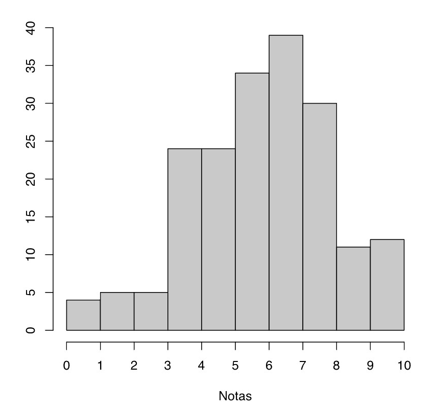
```

En este histograma, hemos tomado las clases [0,1), [1,2),...,[9,10]. Si en cambio hubiéramos tomado las clases [0,5) (suspenso), [5,7) (aprobado), [7,9) (notable) y [9,10] (sobresaliente), el histograma tendría que ser como el siguiente, donde ya no marcamos las alturas en el eje de ordenadas para no  crear confusiones:

```{r histnotas2,echo=FALSE, fig.cap="Histograma de las mismas 188 notas"}
knitr::include_graphics("INREMDN_files/figure-html/histnotas2.png")
```


Suponemos que estaréis de acuerdo en que es más fácil entender la distribución de las notas con el primer histograma que con el segundo. Como el objetivo de un gráfico ha de ser ayudar a comprender un conjunto de datos, casi siempre es más conveniente usar clases de la misma amplitud a la hora de dibujar histogramas.

Ahora bien, el número de clases ya depende de los intereses del investigador; números de clases diferentes muestran efectos diferentes. Una posible regla general que normalmente funciona: tomad alrededor de $\sqrt{n}$ clases (donde $n$ indica el tamaño de la muestra) pero no menos de 5 clases ni más de 15.


```{example tensioagrup}
Tenemos una muestra de tensiones arteriales medias de 120 adultos.

```

Si tomamos 5 clases, con las frecuencias
```{r,echo=FALSE}
Clase=c("[80,100)","[100,120)","[120,140)","[140,160)","[160,180)")
Frecuencia=c(6,49,45,18,2)
DF=data.frame(Clase,Frecuencia)
kable(DF)%>%
  kable_styling(full_width = F)
```
obtenemos el histograma

```{r histtensio2,echo=FALSE, fig.cap="Histograma de 120 tensiones usando 5 clases"}
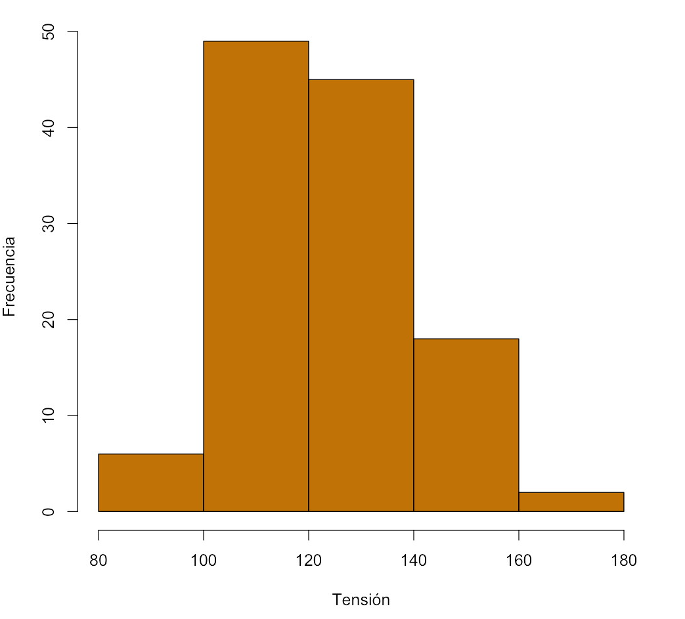
```

Si tomamos 9 clases, con las frecuencias
```{r,echo=FALSE}
Clase=c("[80,90)","[90,100)","[100,110)","[110,120)","[120,130)","[130,140)","[140,150)","[150,160)","[160,170)")
Frecuencia=c(3,3,16,33,23,22,13,5,2)
DF=data.frame(Clase,Frecuencia)
kable(DF)%>%
  kable_styling(full_width = F)
```
obtenemos el histograma

```{r histtensio3,echo=FALSE, fig.cap="Histograma de 120 tensiones usando 9 clases"}
knitr::include_graphics("INREMDN_files/figure-html/tensio3.png")
```

Y si tomamos 15 clases, con las frecuencias
```{r,echo=FALSE}
Clase=c("[80,85)","[85,90)","[90,95)","[95,100)","[100,105)","[105,110)","[110,115)","[115,120)","[120,125)","[125,130)","[130,135)","[135,140)","[140,145)","[145,150)","[150,155)","[155,160)","[160,165)")
Frecuencia=c(1,2,1,2,6,10,13,20,9,14,13,9,9,4,3,2,2)
DF=data.frame(Clase,Frecuencia)
kable(DF)%>%
  kable_styling(full_width = F)
```
obtenemos el histograma

```{r histtensio4,echo=FALSE, fig.cap="Histograma de 120 tensiones usando 15 clases"}
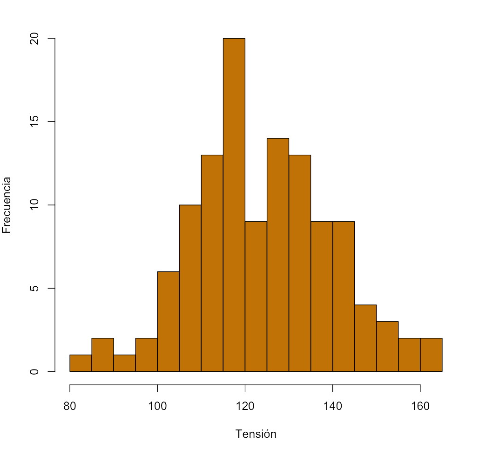
```


Los histogramas también pueden ser de frecuencias relativas: en este caso, tanto si todas las clases tienen la misma amplitud o no **las alturas de las cajas han de ser los valores tales que el área de la barra sea la frecuencia relativa de la clase**. A estas alturas se les llama las **densidades** de las clases. Es decir, la frecuencia relativa de cada clase es la amplitud de la clase por su densidad.
De esta manera, la suma de las áreas de las barras será 1.

```{block2,type="rmdromans"}
Veremos la justificación de esta convención en la lección de Variables Aleatorias.
```

Así, en el ejemplo anterior para 9 clases, las frecuencias relativas y las densidades serían
```{r,echo=FALSE}
Clase=c("[80,90)","[90,100)","[100,110)","[110,120)","[120,130)","[130,140)","[140,150)","[150,160)","[160,170)")
Frecuencia=c(3,3,16,33,23,22,13,5,2)
Frecrel=round(Frecuencia/120,3)
Densidad=round(Frecrel/10,4)
DF=data.frame(Clase,Frecuencia,Frecrel,Densidad)
kable(DF,names=c("Clase","Frec. absoluta","Frec. relativa","Densidad"))%>%
  kable_styling(full_width = F)
```
y el histograma de frecuencias relativas a que dan lugar es

```{r histtensio5,echo=FALSE, fig.cap="Histograma de frecuencias relativas de 120 tensiones usando 9 clases"}
knitr::include_graphics("INREMDN_files/figure-html/tensio5.png")
```


Recordad  que, en un histograma correcto, si las clases tienen amplitud diferente, las alturas de las barras han de ser las que den como áreas de las barras las frecuencias (absolutas o relativas) de las clases.

```{example}
El gráfico siguiente (extraído de M. Vanderpump et al, "Iodine status of UK schoolgirls: a cross-sectional survey." *Lancet* 377 (2011), pp. 2007–2012) representa las proporciones de colegialas británicas en una muestra que tuvieron diferentes concentraciones de yodo en la orina. Es un diagrama de barras, no un histograma.

```

```{r urine3,echo=FALSE}
knitr::include_graphics("INREMDN_files/figure-html/urine3.png")
```

A primera vista, parecería que la distribución de estas concentraciones de yodo es bastante simétrica. Pero observad que las clases no tienen la misma amplitud. El histograma de frecuencias relativas correcto con estas clases es el siguiente:

```{r urine4,echo=FALSE}
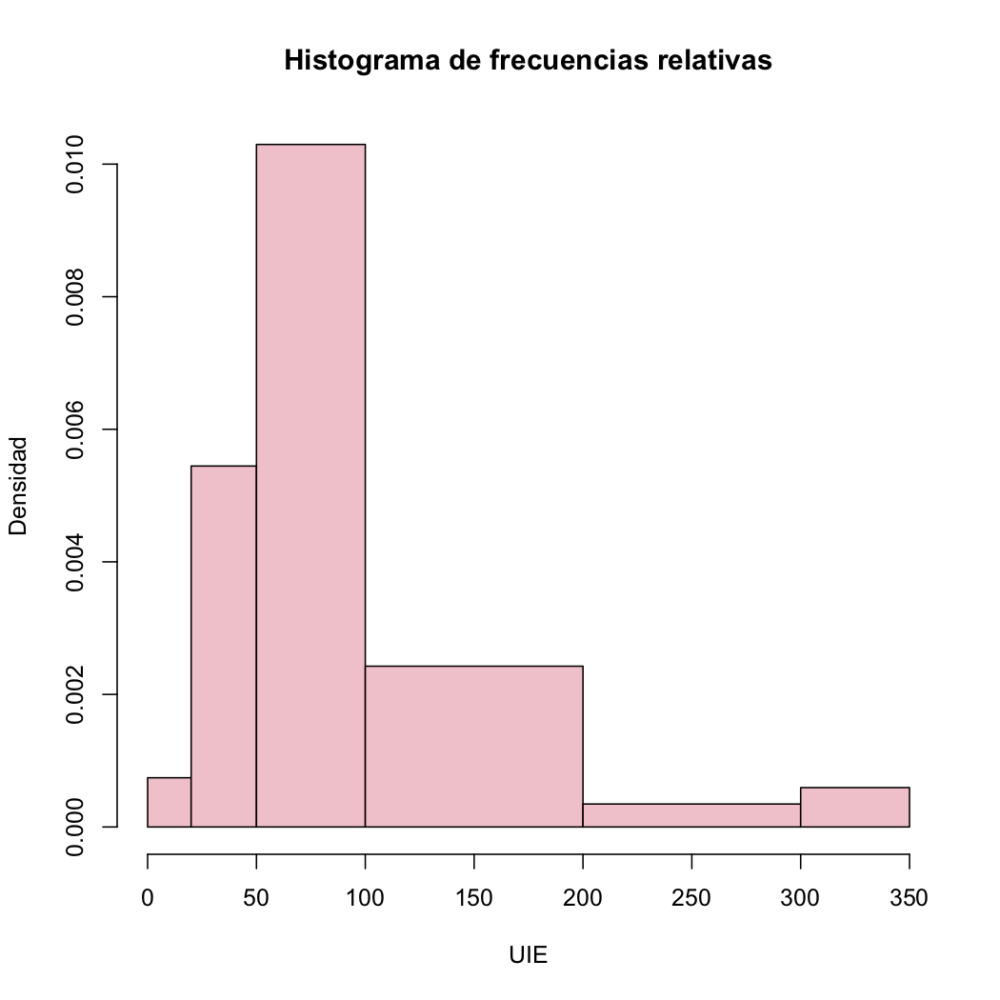
```

Pero el histograma sería más fácil de interpretar si las clases tuvieran todas la misma amplitud:

```{r urine5,echo=FALSE}
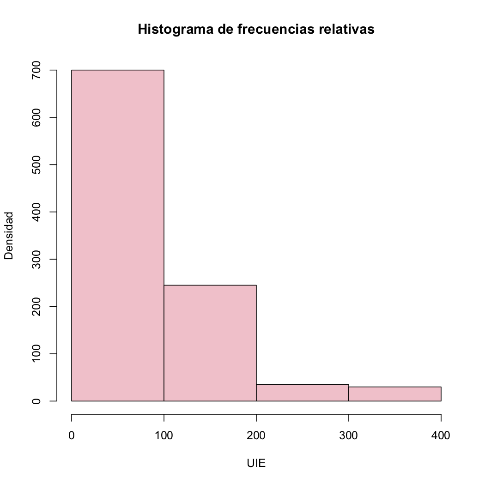
```

En este último histograma vemos claramente que el conjunto de datos no es de ninguna manera simétrico, sino que tiene lo que llamaremos una **cola a la derecha**.

## Diagramas poligonales

A menudo se substituye un histograma con clases de la misma amplitud por un **polígono de frecuencias**, en el que

* Para cada clase, marcamos los puntos de abscisa el punto medio de la clase y ordenada la altura de su barra

* Unimos puntos consecutivos mediante segmentos

A modo de ejemplo, recordemos el histograma de un conjunto de notas del Ejemplo \@ref(exm:histnotas). A su lado damos el polígono de frecuencias correspondiente:

```{r polfrecnotas,echo=FALSE,fig.width=10,out.width="90%",fig.asp=0.5}
par(mfrow=c(1,2))
knitr::include_graphics("INREMDN_files/figure-html/histnotas11.png")
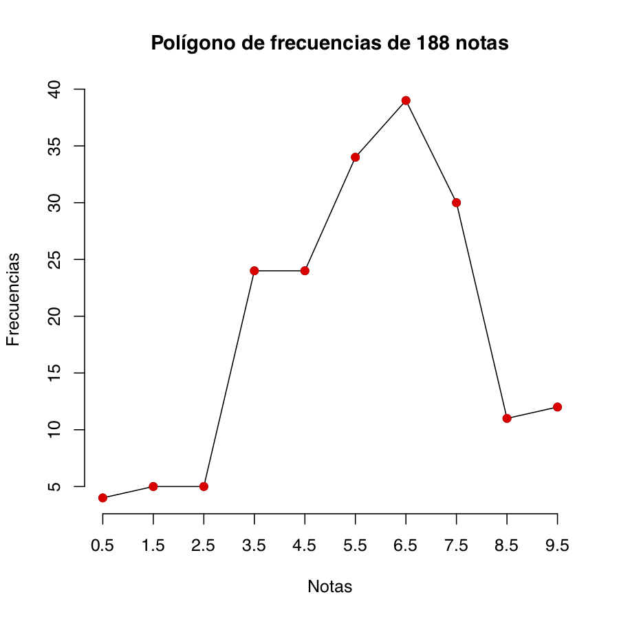
par(mfrow=c(1,1))
```

Los diagramas poligonales son útiles para representar simultáneamente varios histogramas:

```{r polfrecnotas2,echo=FALSE}
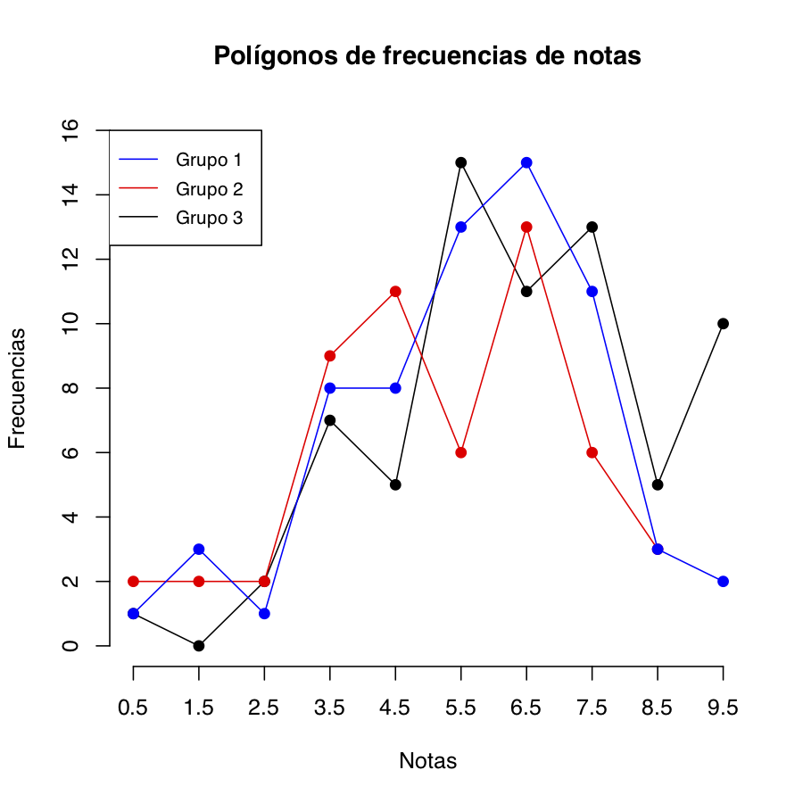
```

```{block2,type="rmdexercici"}
Aquí tenéis los tiempos (en horas) de los ganadores de la maratón de Nueva York (categorías masculina y femenina) de 1970 a 2015:
  
<p style="text-align:center">2.08, 2.12, 2.13, 2.13, 2.13, 2.13, 2.13, 2.13, 2.13, 2.13, 2.13, 2.13, 2.15, 2.15, 2.15, 2.15, 2.15, 2.15, 2.15, 2.15, 2.15, 2.15, 2.15, 2.17, 2.17, 2.17, 2.17, 2.17, 2.17, 2.18, 2.18, 2.18, 2.18, 2.18, 2.18, 2.18, 2.20, 2.20, 2.23, 2.32, 2.35, 2.37, 2.37, 2.38, 2.38, 2.38, 2.38, 2.40, 2.40, 2.40, 2.40, 2.42, 2.42, 2.42, 2.42, 2.42, 2.42, 2.42, 2.42, 2.42,  2.42, 2.43, 2.43, 2.45, 2.45, 2.45, 2.45, 2.45, 2.45, 2.47, 2.47, 2.47, 2.47, 2.47, 2.47, 2.47, 2.47, 2.48, 2.50, 2.50, 2.52, 2.53, 2.65, 2.72, 2.77, 2.92, 2.95, 3.12, 3.13</p>

Dibujad su histograma (usando 6 clases de amplitud 0.2, empezando en 2 horas) y su diagrama de caja. ¿Qué observáis en cada uno de ellos que no podéis observar en el otro?
  
```


## Asimetría y  curtosis

Terminamos la descripción de variables cuantitativas con otros dos estadísticos que a veces se usan en la literatura médica, pero que nosotros no usaremos, porque son inútiles: las propiedades que describen se ven mejor con un histograma, y no sirven para estimar la correspondiente propiedad de la variable poblacional. Se trata de:

* El **coeficiente de asimetría** (*skewness*): 
$$
\gamma_1=\frac{1}{s_x^3}\cdot \frac{\sum_{i=1}^n (x_i-\overline{x})^3}{n}
$$

* El **coeficiente de curtosis**,  o **apuntamiento**: 
$$
\beta_2=\frac{1}{s_x^4}\cdot \frac{\sum_{i=1}^n (x_i-\overline{x})^4}{n}-3
$$

Empecemos con el coeficiente de asimetría. Como su nombre indica, cuantifica la **asimetría** de la variable. Para definir esta característica, lo más práctico es dibujar un histograma de la variable y considerar el eje de simetría pasando por la media. Llamaremos **colas** a los trozos del histograma a ambos lados de este eje de simetría. Entonces

* La variable es **simétrica** si ambas colas son similares

```{r histssim,echo=FALSE,fig.width=10,out.width="90%",fig.asp=0.5,fig.cap="Dos variables simétricas; la de la derecha tiene **forma de U**"}
par(mfrow=c(1,2))
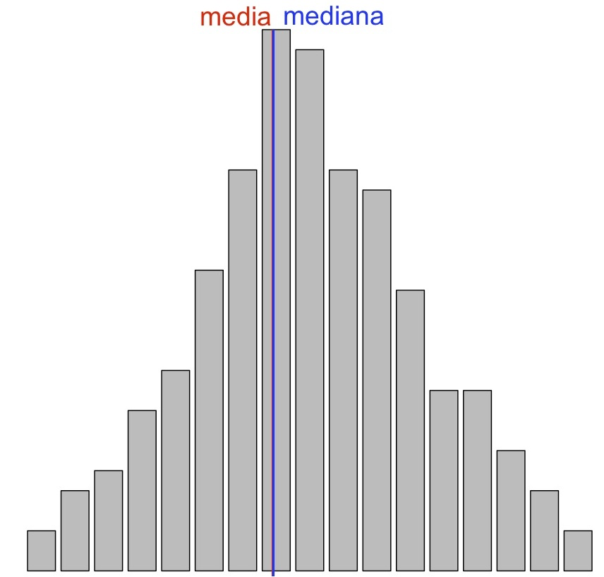
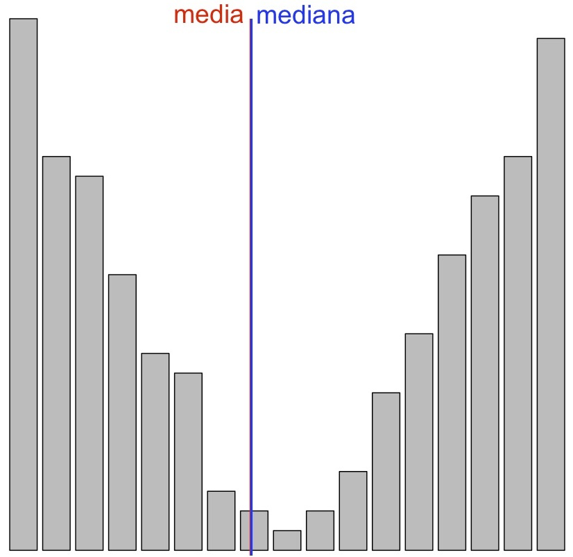
par(mfrow=c(1,1))
```

* La variable presenta una **asimetría negativa** o **a la izquierda** cuando la cola de la izquierda es más larga que la de la derecha, en el sentido de que hay más valores más alejados de la media por la izquierda que por la derecha. También decimos en este caso que la variable  **tiene cola a la izquierda**.

```{r histasimesq,echo=FALSE,fig.cap="Variable asimétrica a la izquierda"}
knitr::include_graphics("INREMDN_files/figure-html/asimesquerra.png")
```

* La variable presenta una **asimetría positiva** o **a la derecha** cuando la cola de la derecha es más larga que la de la izquierda, en el sentido de que hay más valores más alejados de la media por la derecha que por la izquierda. **tiene cola a la derecha**.

```{r histasimdreta,echo=FALSE,fig.cap="Variable asimétrica a la derecha"}
knitr::include_graphics("INREMDN_files/figure-html/asimdreta.png")
```

En los histogramas anteriores hemos dibujado las líneas verticales sobre la media y la mediana.

* En una variable simétrica, la simetría hace que la media y la mediana sean aproximadamente iguales

* En una variable asimétrica a la izquierda, la existencia de valores relativamente muy pequeños en el extremo de la cola de la izquierda suele desplazar la media hacia la izquierda de la mediana, de manera que la media suele ser más pequeña que la mediana

* Y al revés, en una variable asimétrica a la derecha, la existencia de valores relativamente muy grandes en el extremo de la cola de la derecha suele desplazar la media hacia la derecha de la mediana, de manera que la media suele ser más grande que la mediana

```{block2,type="rmdcaution"}
En los puntos anteriores hemos descrito lo que "suele pasar" con la media y la mediana en variables asimétricas, pero no siempre pasa. Así, si la media de un vector de datos es bastante más grande que la mediana, suele ser señal de que la 
el vector es asimétrico a la derecha, pero solo los "suele ser": con un poco de imaginación se puede construir un vector asimétrico a la izquierda con la media a la derecha de la mediana. Pensadlo un poco.
```


```{r salarisrep,echo=FALSE, out.width="75%"}
knitr::include_graphics("INREMDN_files/figure-html/salaris.png")
```

Pues bien, el coeficiente de asimetría $\gamma_1$ indica el tipo de asimetría de la variable:

* Cuando $\gamma_1\approx 0$, la distribución de los datos es simétrica
* Cuando $\gamma_1< 0$, la variable es asimétrica negativa, es decir, a la izquierda
* Cuando $\gamma_1> 0$, la variable es asimétrica positiva, es decir, a la derecha

La mejor manera de decidir la asimetría de una variable es por medio de un histograma, aunque a menudo también se puede ver en un diagrama de caja, como muestran los gráficos siguientes:


```{r histvsbpsim,echo=FALSE,fig.cap="Histograma y diagrama de caja de una variable simétrica"}
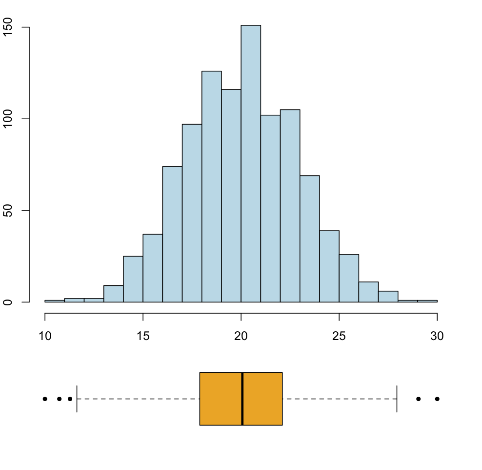
```

```{r histvsbpesq,echo=FALSE,fig.cap="Histograma y diagrama de caja de una variable asimétrica a la izquierda"}
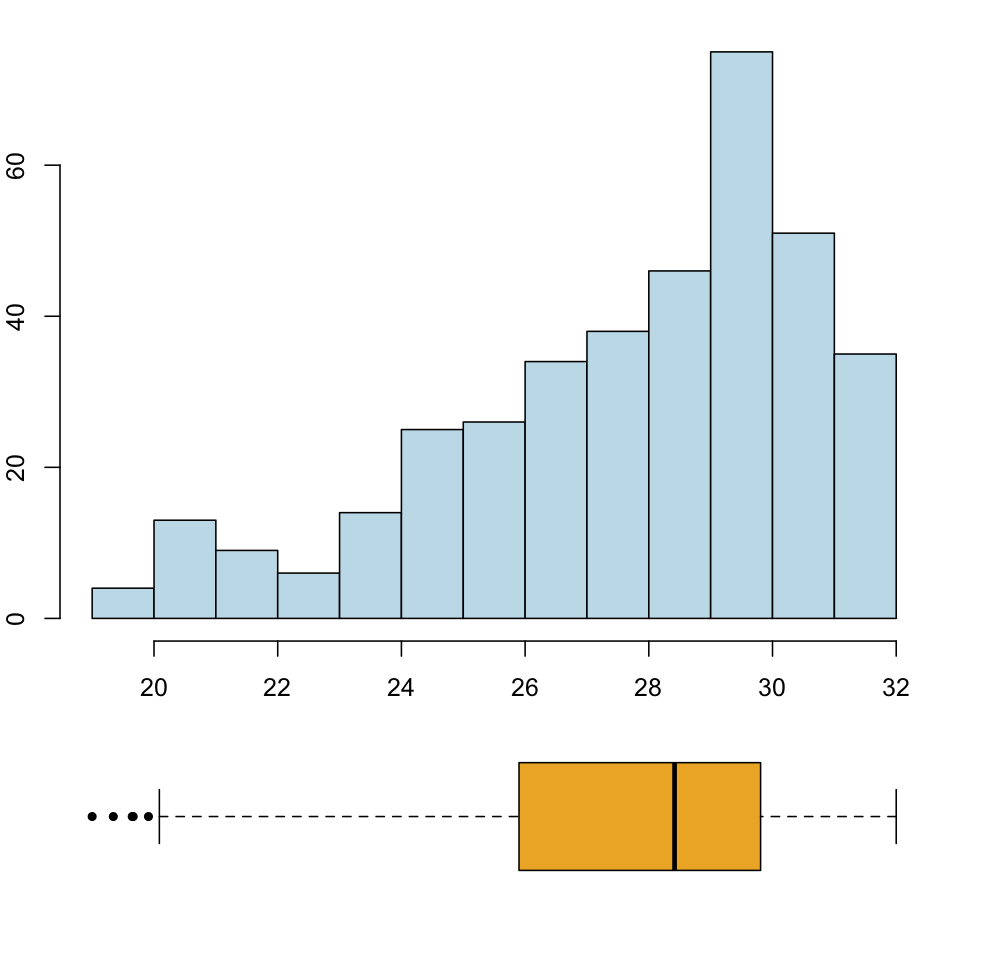
```

```{r histvsbpdreta,echo=FALSE,fig.cap="Histograma y diagrama de caja de una variable asimétrica a la izquierda"}
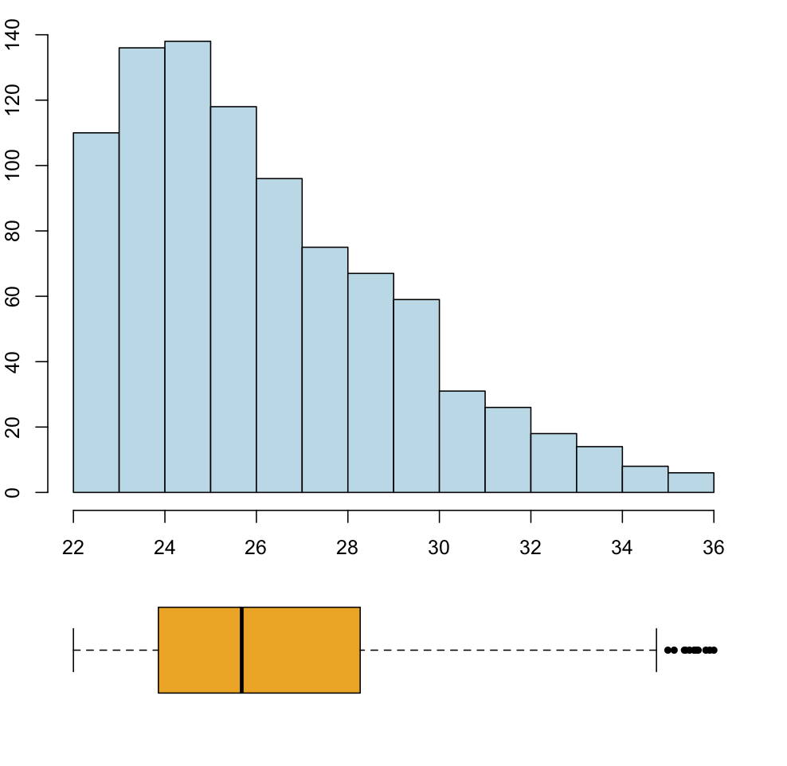
```

```{block2,type="rmdimportant"}
Usar la media y la desviación típica (o la varianza) para describir el "valor central" de una variable y cuantificar su dispersión, respectivamente, es lo adecuado solo cuando la variable es bastante simétrica: más aún, solo cuando es bastante simétrica y su histograma tiene la forma de la izquierda de la Figura \@ref(fig:histssim), del estilo de una campana de Gauss (Figura \@ref(fig:Gauss)). En este caso, el intervalo $\overline{x}\pm s_x$ suele contener aproximadamente unos 2/3 de los datos de la muestra.

Para variables muy asimétricas o simétricas en forma de U como la de la derecha de la Figura \@ref(fig:histssim), es mejor usar la mediana y el intervalo intercuartílico. Recordad que este último contiene aproximadamente el 50% de la muestra.
```

```{r Gauss,echo=FALSE,fig.cap="Una campana de Gauss"}
curve(dnorm(x,0,3),xlim=c(-10,10),xlab="",ylab="",xaxt="n",yaxt="n",bty="l")
```


```{example}
Considerad la variable que tiene el histograma siguiente:
  
```

```{r asim,echo=FALSE}
knitr::include_graphics("INREMDN_files/figure-html/asim.png")
```

Resulta que su media es $\overline{x}=3.1$ y su desviación típica es $s_x=2.5$, y que el intervalo $[\overline{x}-s_x,\overline{x}+s_x]$ contiene un 84% de la muestra. Su mediana es $Q_{0.5}=2.3$, a la izquierda de la media, y su intervalo intercuartílico $IQI$ es (1.3,4.2) Por cierto, su coeficiente de asimetría es $\gamma_1=1.7$, lo que es consistente con su cola a la derecha. 

Considerad la variable simétrica siguiente:

```{r sim,echo=FALSE}
knitr::include_graphics("INREMDN_files/figure-html/sim.png")
```

Resulta que su media es $\overline{x}=2.9$ y su desviación típica es $s_x=1.1$, y que el intervalo $[\overline{x}-s_x,\overline{x}+s_x]$ contiene un 64% de la muestra. Su mediana es $Q_{0.5}=3$, muy cercana a su media, y su $IQI$ es (2.2, 3.7). Su coeficiente de asimetría es $\gamma_1=-0.03$, lo que es consistente con su simetría. 

Considerad finalmente la variable siguiente, simétrica pero en forma de U

```{r simu,echo=FALSE}
knitr::include_graphics("INREMDN_files/figure-html/usim.png")
```

Resulta que su media es $\overline{x}=3.9$ y su desviación típica es $s_x=2.2$, pero el intervalo $[\overline{x}-s_x,\overline{x}+s_x]$ contiene solo el 52% de la muestra. Su mediana es también $Q_{0.5}=3.9$  y su $IQI$ es (1.8,5.9). Su coeficiente de asimetría es $\gamma_1=0.0007$.


```{block2,type="rmdnote"}
Los tres tipos de simetría/asimetría se generalizan de manera inmediata a variables poblacionales, a partir de alguna representación gráfica de su distribución.

Por ejemplo, si recordáis el gráfico de la distribución de los salarios anuales españoles, y que por si no lo recordáis repetimos aquí debajo, presenta una clara asimetría a la derecha que hace que el salario medio sea mayor que el mediano.
```


No nos hemos olvidado del **coeficiente de curtosis**, $\beta_2$. Este estadístico mide el grado de "apuntamiento" de la distribución de la variable.

* Cuando el histograma se parece al de una campana de Gauss (diremos que la variable es **mesocúrtica**), $\beta_2\approx 0$


```{r Meso,echo=FALSE,fig.cap="Una variable mesocúrtica"}
knitr::include_graphics("INREMDN_files/figure-html/Meso.png")
```

* Cuando el histograma es más puntiagudo que una campana de Gauss (diremos que la variable es **leptocúrtica**), $\beta_2> 0$

```{r Lepto,echo=FALSE,fig.cap="Una variable leptocúrtica"}
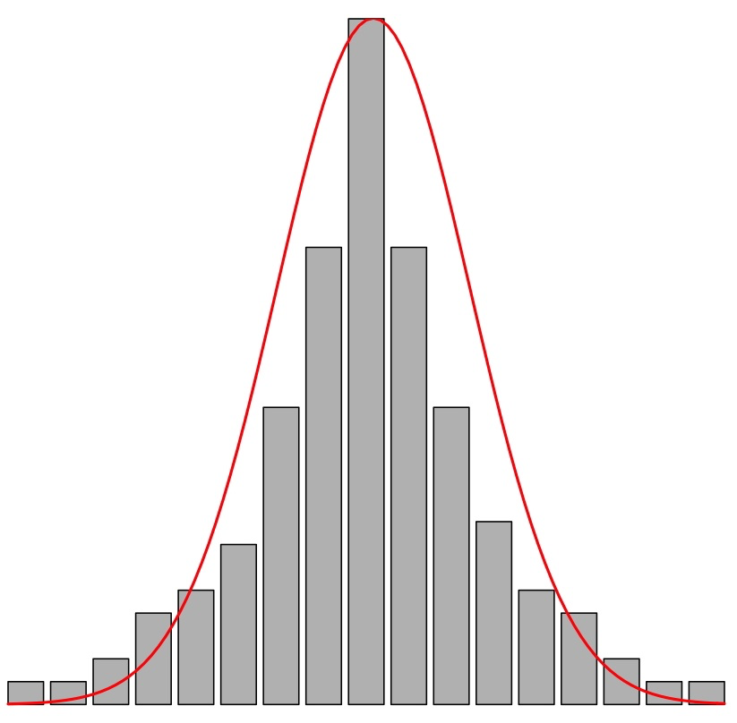
```

* Cuando el histograma es más achatado que una campana de Gauss (diremos que la variable es **platicúrtica**), $\beta_2< 0$

```{r Plati,echo=FALSE,fig.cap="Una variable platicúrtica"}
knitr::include_graphics("INREMDN_files/figure-html/Plati.png")
```


## Estadísticos sobre daatos agrupados 

En nuestro lenguaje cotidiano, solemos **agrupar** datos cuantitativos sin que seamos conscientes de ello. Cuando decimos, por ejemplo, que la edad de alguien es de 18 años, no queremos decir que nació justo hoy hace 18 años, sino que ya ha cumplido los 18 años, pero aún no ha cumplido los 19; es decir, que agrupamos todas las edades que caen dentro del intervalo [18,19) en una misma clase, que llamamos "18 años". Del mismo modo, que alguien mida 1.72 no significa que esta sea su altura exacta, con la precisión del grueso de un cabello, sino que su altura pertenece a un intervalo de valores en torno a 1.72 metros que identificamos con "1.72". Bajo  la calificación de "aprobado" agrupamos todas las notas mayores o iguales que 5 y menores que 7. Y estamos seguros de que se os ocurren otros ejemplos. 

Muy a menudo, los datos cuantitativos se recogen directamente agrupados, como por ejemplo franjas salariales o el número de hermanos en la tabla de datos \@ref(tab:tabla1). Y aunque las clases definan una variable ordinal, es muy probable que nos interese interpretarlas como eso: clases resultado de agrupar datos cuantitativos. Su representación gráfica adecuada es claramente un histograma, pero ¿cómo podemos calcular los estadísticos? Está claro que de manera exacta es imposible si no conocemos los datos **brutos**,  sin agrupar. Pero podemos intentar aproximarlos.

* La **clase modal** es la clase de mayor frecuencia
* Para calcular la media, la varianza, etc., para cada clase tomamos un valor representativo de la misma, a la que llamaremos su **marca de clase** (normalmente, el punto medio de la clase), y entenderemos que nuestra muestra está formada, para cada clase, por tantas copias de su marca como la frecuencia de la clase.

```{example tensioagrup2}
Volvamos a la muestra de tensiones arteriales medias de 120 adultos del Ejemplo \@ref(exm:tensioagrup) y supongamos que nos han dado directamente los datos agrupados en 9 clases de amplitud 10:

```


Si tomamos 9 clases, con las frecuencias
```{r,echo=FALSE}
Clase=c("[80,90)","[90,100)","[100,110)","[110,120)","[120,130)","[130,140)","[140,150)","[150,160)","[160,170)")
Frecuencia=c(3,3,16,33,23,22,13,5,2)
DF=data.frame(Clase,Frecuencia)
kable(DF)%>%
  kable_styling(full_width = F)
```

La clase modal es [110,120). Para aproximar la media y la varianza de la muestra original, tomaremos como marcas de clase los puntos medios de las clases (85,95,...,165) y supondremos que la muestra está formada por 3 copias del valor 85, 3 copias del valor 95, 16 copias del valor 105,...,2 copias del valor 165. Entonces

* Aproximamos la media de la muestra por
$$
\frac{3\times 85+3\times 95+16\times 105+\cdots+2\times 165}{120}=123.75
$$

* Aproximamos la varianza de la muestra por
$$
\frac{3\times (85-123.75)^2+3\times (95-123.75)^2+16\times (105-123.75)^2+\cdots+2\times (165-123.75)^2}{120}=267.6
$$

Se han propuesto muchos métodos para intentar adivinar la mediana y los otros cuantiles de una variable cuantitativa agrupada a partir de las tablas de frecuencias de sus clases. Aquí explicaremos el más sencillo y lo ilustraremos con el ejemplo anterior. Por comodidad, vamos a añadir las frecuencias acumuladas de las clases a la tabla de frecuencias:

```{r,echo=FALSE}
Clase=c("[80,90)","[90,100)","[100,110)","[110,120)","[120,130)","[130,140)","[140,150)","[150,160)","[160,170)")
Frecuencia=c(3,3,16,33,23,22,13,5,2)
Acum=cumsum(Frecuencia)
DF=data.frame(Clase,Frecuencia,Acum)
names(DF)=c("Clase","Frecuencia","Frecuencia acumulada")
kable(DF)%>%
  kable_styling(full_width = F)
```


En primer lugar buscamos en qué clase ha de caer (qué clase contendría el valor que separa las dos mitades de la muestra): lo llamaremos el  **intervalo crítico para la mediana**. En nuestro ejemplo, será la primera clase cuya frecuencia acumulada sea mayor oigual que 120/2=60. Se trata del intervalo [120,130).

Sean  $[L_c, L_{c+1})$ este intervalo crítico, $N_{c-1}$, la frecuencia absoluta acumulada del intervalo anterior al crítico (si el intervalo crítico es el primero, tomamos $N_{c-1}=0$), y $N_c$, la frecuencia absoluta acumulada del intervalo crítico. Entonces, lo que hacemos es unir con una recta los puntos $(L_c,N_{c-1})$ y $(L_{c+1},N_c)$ y aproximar  la mediana por medio de la abscisa $M$ del punto sobre esta recta cuya ordenada es $n/2$ (véase la Figura \@ref(fig:medianagrup)). La fórmula concreta, por si no os acordáis, es
$$
M=L_{c}+\frac{L_{c+1}-L_{c}}{N_c-N_{c-1}}\cdot \Big(\frac{n}{2}- N_{c-1}\Big).
$$


```{r medianagrup, out.width="60%", echo=FALSE, fig.cap='Aproximación lineal de la mediana a partir de las frecuencias de los datos agrupados.'}
knitr::include_graphics("INREMDN_files/figure-html/medianagrup.png")
```

En nuestro ejemplo, $L_c=120$, $L_{c+1}=130$, $N_{c-1}=55$, $N_c=78$ y por lo tanto estimamos que
$$
M=120+\frac{130-120}{78-55}\cdot (60- 55)=122.17
$$

Un procedimiento similar se puede usar  para aproximar cualquier cuantil $Q_{p}$ de orden $p$: buscamos su intervalo crítico $[L_c,L_{c+1})$ y usamos la fórmula anterior cambiando $n/2$ por $p\cdot n$.

```{block2,type="rmdexercici"}
Considerad el agrupamiento  en 15 clases de la muestra de tensiones arteriales medias de 120 adultos del Ejemplo \@ref(exm:tensioagrup). A partir de este agrupamiento, estimad los valores de la media, la varianza y la mediana de la muestra, y comparadlos con los obtenidos a partir de 9 clases. ¿Cuáles creéis que estiman mejor los estadísticos de la muestra original?
```


## Datos cuantitativos bivariantes

Si tenemos observaciones de dos variables cuantitativas medidas sobre una misma muestra de $n$ individuos, las recogemos en una **tabla de datos cuantitativos bivariante**
$$
\begin{array}{c|c|c}
\textbf{Individuo} &\textbf{Variable 1} &\textbf{Variable 2}\\ \hline
1 & x_{1} & y_{1} \cr
2 & x_{2} & y_{2} \cr
3 & x_{3} & y_{3} \cr
\vdots &\vdots & \vdots \cr 
n & x_{n} & y_{n} 
\end{array}
$$

Podemos representar esta tabla por medio de un **gráfico de dispersión** (*scatter plot*): el gráfico de los puntos $(x_k,y_k)$

```{example,tensionscatter}
Hemos medido la tensión arterial media (en mmHg) y el nivel de colesterol (en mg/dl) de 10 individuos y recogido estos valores en la tabla siguiente:
  
```

```{r tensioncolest1,echo=FALSE}
Tensión=c(105.7,117.4,131.9,117.8,133.0,107.9,118.6,123.4,124.1,113.4)
Colesterol=c(169.3,191.7,202.6,218.2,223.2,180.0,230.4,211.8,202.3,185.3)
DF=data.frame(Tensión,Colesterol)
kable(DF,row.names=TRUE)%>%
  kable_styling(full_width = F)
```

Su diagrama de dispersión es
```{r,echo=FALSE}
plot(Tensión,Colesterol,pch=20)
```


Una **serie temporal** es un caso particular de tabla de datos cuantitativos bivariante en la que la primer variable representa el decurso del tiempo. En este caso, es conveniente unir con segmentos los puntos consecutivos en el tiempo para ayudar en la visualización de la evolución de los datos.

```{example}
Consideremos la siguiente tabla de los números diarios de defunciones por COVID-19 en la Baleares entre día 16 y día 31 de marzo de 2019:

   
```

```{r,echo=FALSE}
Día=16:31
Defunciones=c(0,0,1,0,2,0,6,0,3,4,5,4,3,8,5,4)
DF=data.frame(Día,Defunciones)
kable(DF)
```
  
Se trata de una serie temporal. Su gráfico de dispersión es

```{r}
plot(Día,Defunciones,type="o",pch=20)
```

A menudo nos interesará describir por medio de un valor la **asociación**  (propensión a variar conjuntamente) de dos variables cuantitativas medidas sobre una misma muestra de individuos: por ejemplo, medir la tendencia del nivel de colesterol a crecer con la tensión arterial media en la tabla del Ejemplo \@ref(exm:tensionscatter). 

El estadístico que más se usa con este fin es la **covarianza**. Su definición, para los vectores $x=(x_1,\ldots,x_n)$ e $y=(y_1,\ldots,y_n)$, es
$$
s_{x,y}=\frac{1}{n}\sum_{i=1}^n (x_i-\overline{x})(y_i-\overline{y})
$$


```{block2,type="rmdcaution"}
También hay una versión **muestral**, dividiendo por $n-1$ en lugar de $n$, que es la que calculan la mayoría de los paquetes estadísticos. El motivo es el mismo que ya explicamos con ocasión de la varianza.
```

```{block2,type="rmdimportant"}
Observad que la covarianza de un vector consigo mismo es su varianza: $s_{x,x}=s_x^2$.
```

El signo de la covarianza mide el signo de la  asociación  entre los dos vectores:

* La covarianza es **positiva** cuando $x$ e $y$ satisfacen la condición siguiente: si una de las dos variables crece, la otra también tiende a crecer; es decir, si $x_i<x_j$, $y_j$ tiende a ser  mayor que $y_i$, y recíprocamente.

```{r,echo=FALSE,fig.cap="Covarianza positiva"}
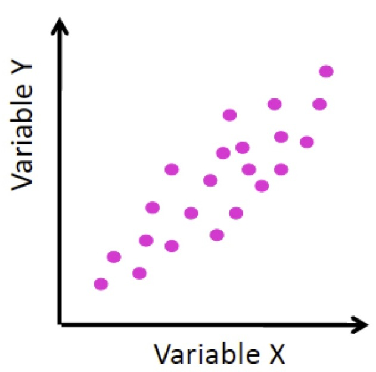
```

* La covarianza es **negativa** cuando $x$ e $y$ satisfacen la condición siguiente: si una de las dos variables crece, la otra  tiende a decrecer; es decir, si $x_i<x_j$, $y_j$ tiende a ser  menor que $y_i$, y viceversa.

```{r,echo=FALSE,fig.cap="Covarianza negativa"}
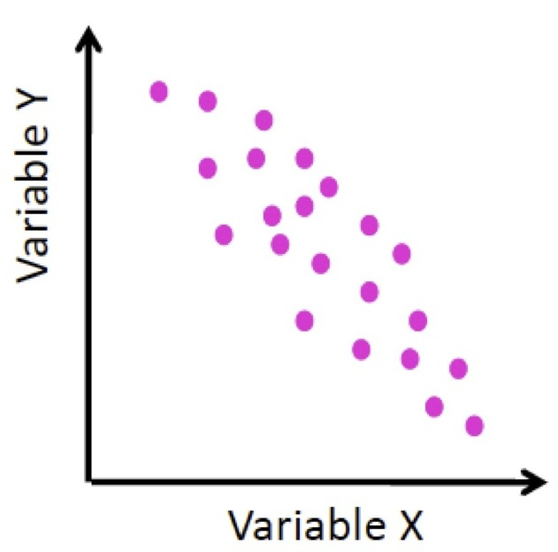
```

* Si la covarianza es muy cercana a 0, es porque no hay una tendencia clara al crecimiento o decrecimiento de $y_i$ en función del de  $x_i$

```{r,echo=FALSE,fig.cap="Covarianza 0"}
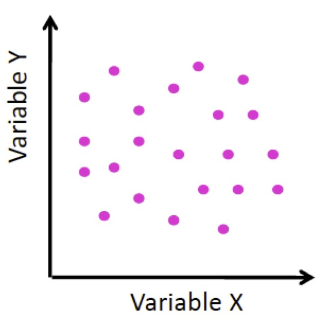
```

```{block2,type="rmdimportant"}
En particular, si las variables $x$ e $y$ son **independientes**, por ahora, en el sentido intuitivo de que el valor de $x$ no influye para nada en el valor de $y$, la covarianza de $x$ e $y$ es 0.
```


```{example}
Volvamos a la tabla de tensiones arteriales medias y niveles de colesterol del Ejemplo \@ref(exm:tensionscatter). Las medias de las variables son


```

$$
\begin{array}{l}
\overline{\text{Tensión}}=\dfrac{105.7+117.4+131.9+\cdots+113.4}{10}=119.32\\
\overline{\text{Colesterol}}=\dfrac{169.3+191.7+202.6+\cdots+185.3}{10}=201.48
\end{array}
$$
y su covarianza es
$$
s_{\text{Tensión},\text{Colesterol}}=\frac{(105.7-119.32)(169.3-201.48)+(117.4-119.32)(191.7-201.48)+\cdots+(113.4-119.32)(185.3-201.48)}{10}=110.9164
$$
Del hecho que esta covarianza sea positiva deducimos que, en esta muestra, la tensión media y el nivel de colesterol tienden a crecer juntos, como ya observamos en el diagrama de dispersión del Ejemplo \@ref(exm:tensionscatter).


Ahora bien, el valor de la covarianza es difícil de interpretar más allá de su signo. Por ejemplo, si la covarianza de las variables Tensión y Colesterol en otra muestra de individuos fuera mayor que la que hemos obtenido en la muestra anterior, eso no tendría por qué significar que la tendencia al crecimiento conjunto de estas dos variables en la nueva muestra fuera mayor que en la nuestra. Por ello, a menudo se usa una versión normalizada de la misma, la **correlación de Pearson**, definida como la covarianza dividida por el producto de las desviaciones típicas:
$$
r_{x,y}=\frac{s_{x,y}}{s_xs_y}
$$

Como el signo de $r_{x,y}$ es el mismo que el de $s_{x,y}$, el signo de la 
correlación de Pearson tiene el mismo significado que el de la covarianza:

*  $r_{x,y}>0$ cuando $y$ tiende a crecer si $x$ crece y a decrecer si $x$ decrece
* $r_{x,y}<0$ cuando $y$ tiende a decrecer si $x$ crece y a crecer si $x$ decrece
* $r_{x,y}\approx 0$ cuando no hay ninguna tendencia  en este sentido; decimos entonces que $x$ e $y$ están *incorreladas*. 

Pero la correlación de Pearson lleva más información que la covarianza, porque 
**mide la relación lineal entre los dos vectores**, en el sentido de las propiedades siguientes:

* Se tiene que $-1\leq r_{x,y}\leq 1$

* Cuanto más cerca está $r_{x,y}$ de 1 o -1, más se aproximan los puntos $(x_i,y_i)$ a estar sobre una recta, creciente si $r_{x,y}>0$ y decreciente si $r_{x,y}<0$

* Y en concreto,los puntos $(x_i,y_i)$ están sobre una recta creciente exactamente cuando $r_{x,y}=1$, y están sobre una recta decreciente exactamente cuando $r_{x,y}=-1$

```{example}
Seguimos con la tabla de tensiones arteriales medias y niveles de colesterol del Ejemplo \@ref(exm:tensionscatter). Ya hemos obtenido su covarianza, $s_{\text{Tensión},\text{Colesterol}}=110.9164$. Sus desviaciones típicas son
$$
\begin{array}{l}
s_{\text{Tensión}}=\sqrt{\dfrac{(105.7-119.32)^2+(117.4-119.32)^2+(131.9-119.32)^2+\cdots+(113.4-119.32)^2}{10}}=8.616\\
s_{\text{Colesterol}}=\sqrt{\dfrac{(169.3-201.48)^2+(191.7-201.48)^2+(202.6-201.48)^2+\cdots+(185.3-201.48)^2}{10}}=18.84
\end{array}
$$
por lo que su correlación de Pearson es
$$
r_{\text{Tensión},\text{Colesterol}}=\frac{110.9164}{8.616\cdot 18.84}=0.683
$$
Los pares de valores de tensión arterial media y el nivel de colesterol de los individuos de la muestra presentan bastante tendencia a estar sobre una recta.

```


Gráficamente podemos visualizar la tendencia de los puntos de una tabla bivariante a estar sobre una recta añadiendo a su gráfico de dispersión su **recta de regresión** (para ser precisos, **lineal por mínimos cuadrados**, pero por ahora omitiremos esta apostilla, hasta el tema de Regresión Lineal hacia el final de curso). Se trata de la recta que más se aproxima a los puntos $(x_i,y_i)$ en el sentido siguiente. 

Dada una recta $y=ax+b$, el **error** que se comete al estimar con esta recta el valor $y_i$ sobre el sujeto correspondiente al par $(x_i,y_i)$ es $y_i-(ax_i+b)$.
La **recta de regresión** es la que tiene coeficientes $a,b$ que hacen mínima la suma de los cuadrados de estos errores
$$
\sum_{i=1}^n (y_i-(ax_i+b))^2
$$

Resulta que los coeficientes de esta recta de regresión son 
$$
a=\frac{s_{x,y}}{s_x^2},\quad b = \overline{y}-a\cdot \overline{x}.
$$
```{example}
Siguiendo con nuestro ejemplo de tensiones y niveles de colesterol, la recta de regresión del nivel de colesterol en función de la tensión media tiene pendiente
$$
  a=\frac{s_{\text{Tensión},\text{Colesterol}}}{s_{\text{Colesterol}}^2}=\frac{110.9164}{8.616^2}=1.494
$$
  y término independiente
$$
b=  \overline{\text{Colesterol}}-a\cdot \overline{\text{Tensión}}=201.48-1.494\times 119.32=23.216
$$

El gráfico de dispersión de los puntos junto a esta recta de regresión es

```

```{r,echo=FALSE}
plot(Tensión,Colesterol,pch=20)
abline(lm(Colesterol~Tensión),lwd=1.5,col="red")
```

```{block2,type="rmdimportant"}
El valor de la correlación de Pearson no siempre es suficiente para valorar el ajuste de los puntos a una recta. Es siempre conveniente dibujar los puntos y la recta de regresión lineal y darles un vistazo.
```


Por ejemplo, F. Anscombe produjo los cuatro conjuntos de puntos descritos en la Figura \@ref(fig:anscombe). Como podéis, ver, tienen ajustes muy diferentes a una recta, y en cambio resulta que tienen el mismo valor de $r$: 0.816. Para más detalles, consultad la [correspondiente entrada de la Wikipedia](https://es.wikipedia.org/wiki/Cuarteto_de_Anscombe)

```{r anscombe,echo=FALSE,fig.cap="El cuarteto de Anscombe",fig.width=10,out.width="90%"}
par(mfrow=c(2,2))
plot(anscombe$x1,anscombe$y1,main="Conjunt de dades 1")
abline(lm(y1~x1,data=anscombe),col="red",lwd=1.5)
plot(anscombe$x2,anscombe$y2,data=anscombe,main="Conjunt de dades 2")
abline(lm(y2~x2,data=anscombe),col="red",lwd=1.5)
plot(anscombe$x3,anscombe$y3,main="Conjunt de dades 3")
abline(lm(y3~x3,data=anscombe),col="red",lwd=1.5)
plot(anscombe$x4,anscombe$y4,main="Conjunt de dades 4")
abline(lm(y4~x4,data=anscombe),col="red",lwd=1.5)
```


````{block2,type="rmdnote"}
Ser incorrelados no es sinónimo de que no haya ninguna dependencia entre las dos variables. Por ejemplo, los conjuntos de puntos de la Figura \@ref(fig:datasaurus) tienen correlación casi 0 (en concreto 0.004), y es claro que en cada cas hay una fuerte dependencia entre los valores de $x$ y de $y$.
```


```{r datasaurus,fig.width=10,out.width="90%",fig.asp=0.5,echo=FALSE,fig.cap="Dos conjuntos de datos incorrelados"}
datasaure=read.table("https://raw.githubusercontent.com/AprendeR-UIB/MatesIIAD/master/dades/datasaure.txt",header=TRUE,sep="\t")
str(datasaure)
dino=datasaure[datasaure$dataset=="dino",2:3]
star=datasaure[datasaure$dataset=="star",2:3]
par(mfrow=c(1,2))
plot(dino,pch=20)
abline(lm(dino$y~dino$x),col="red",lwd=1.5)
plot(star,pch=20)
abline(lm(star$y~star$x),col="red",lwd=1.5)
par(mfrow=c(1,1))
```


Como hemos visto, la correlación de Pearson mide la dependencia lineal entre dos variables cuantitativas. Otras medidas de correlación miden otros tipos de dependencia. La alternativa más popular es la **correlación de Pearson**, $r_S$, que mide la concordancia en el orden de los individuos según sus valores en las dos variables medidas. Se calcula, *grosso modo*, de la manera siguiente:

* A cada individuo de la muestra le asignamos su posición (su **rango**) según el orden creciente de los valores $x_i$ 

* A cada individuo de la muestra le asignamos su rango según el orden creciente de los valores $y_i$

* Calculamos la correlación de Pearson de los vectores de rangos

La correlación de Pearson también se puede usar para variables ordinales **¡La de Pearson no!**

```{example}
Volvemos a nuestro ejemplo de tensiones y niveles de colesterol. Ampliamos la tabla de datos con los rangos de los individuos recogidos en la misma para cada variable:
  
```
 
```{r}
Tensión=c(105.7,117.4,131.9,117.8,133.0,107.9,118.6,123.4,124.1,113.4)
RT=rank(Tensión)
Colesterol=c(169.3,191.7,202.6,218.2,223.2,180.0,230.4,211.8,202.3,185.3)
RC=rank(Colesterol)
DF=data.frame(Tensión,RT,Colesterol,RC)
names(DF)=c("Tensión","Rango","Colesterol","Rango")
kable(DF,row.names=TRUE)%>%
  kable_styling(full_width = F)
```
 
La correlación de Spearman de las dos variables será la correlación de Pearson de sus vectores de rangos. Si la calculáis, da ${r_S}=0.73333$.


## Gráficos en escala logarítmica 

Los ejes de todos los gráficos para variables cuantitativas producidos en las secciones anteriores estaban en **escala lineal**:  pares de marcas a misma distancia tienen diferencias iguales.

A veces es  conveniente dibujar un gráfico con un eje (o ambos) en **escala logarítmica**:  pares de marcas a misma distancia tienen **cocientes** iguales
(es decir, diferencias de sus logaritmos iguales, de ahí el nombre).

Por ejemplo, el gráfico siguiente representa la serie temporal de números acumulados de muertos por COVID-19 en las Balears entre el 16 de marzo y el 25 de abril de 2020. Podéis comprobar que ambos ejes están en escala lineal.

```{r,echo=FALSE,fig.cap="Gráfico en escala lineal"}
Día=1:41
Morts=c(1,1,2,2,4,4,10,10,13,17,22,26,29,37,42,46,58,69,71,75,81,84,89,89,97,102,112,117,118,125,131,134,148,155,157,161,164,168,172,174,175)
plot(Día,Morts,xlab="Días desde 16/03/2020", ylab="Defunciones acumuladas",type="o",pch=20)
```
  
Vamos ahora a dibujar este gráfico con el eje de las ordenadas en escala logarítmica (le llamaremos un gráfico en *escala semilogarítmica*):

```{r,echo=FALSE,fig.cap="Gráfico en escala semilogarítmica"}
plot(Día,Morts,xlab="Días desde 16/03/2020",ylab="Defunciones acumuladas",type="o",pch=20,log="y")
```
  
Observad las marcas en el eje de las ordenadas: por ejemplo, la distancia entre 1 y 2 es la misma que entre 10 y 20, y la distancia entre 1 y 5 es la misma que entre 10 y 50.

Y ahora vamos a dibujarlo con ambos ejes en escala logarítmica (le llamaremos un gráfico en *escala doble logarítmica*):


```{r,echo=FALSE,fig.cap="Gráfico en escala doble logarítmica"}
plot(Día,Morts,xlab="Días desde 16/03/2020",ylab="Defunciones acumuladas",type="o",pch=20,log="xy")
```

Un buen motivo para dibujar un gráfico en escala semilogarítmica o doble logarítmica puede ser el necesitar representar simultáneamente varias variables de rangos muy dferentes. Por ejemplo, considerad la figura siguiente:

```{r,echo=FALSE,fig.width=10,out.width="75%"}
knitr::include_graphics("INREMDN_files/figure-html/h1n1.png")
```
 
Dibujada en escala lineal, se perdería mucho detalle: la línea inferior casi se identificaría con el eje de abscisas, y las líneas centrales parecerían iguales.

Otro motivo puede ser simplemente el hacer aparecer detalles que nos ayuden a entender mejor los datos. Por ejemplo, los dos gráficso siguientes muestran la mortalidad anual específica por tuberculosis en Inglaterra y Gales entre 1871 y 1971, a la izquierda en escala lineal y a la derecha en escala semilogarítmica:

```{r,echo=FALSE,fig.width=10,out.width="75%"}
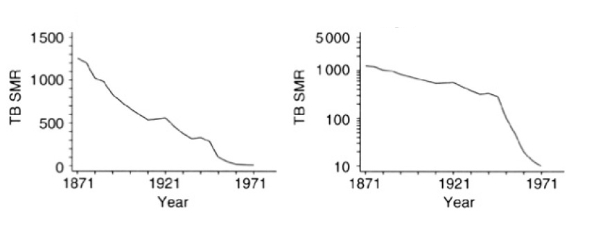
```

El gráfico semilogarítmico permite apreciar mejor el descenso en la mortalidad a partir de mediados de los años cuarenta, con la introducción de la penicilina.

 

## Ejercicios

### Problemas {-}

**(1)** Considerad el diagrama siguiente, que muestra los perímetros braquiales derechas de 120 mujeres.

```{r braquial,echo=FALSE}
knitr::include_graphics("INREMDN_files/figure-html/braquial.png")
```

*(A)* ¿Qué tipo de gráfico es?

 
1. Un diagrama de barras.

1. Un diagrama de caja.

1.  Un diagrama de mosaico.

1.  Un histograma.


*(B)* ¿Qué tipo de variable es el perímetro braquial?}

 
1. Nominal.

1.  Ordinal.

1.  Cuantitativa discreta.

1. Cuantitativa continua.


*(C)* ¿Cuál es la clase modal?}

 
1. 220--240.

1.  240--260.

1.  260--280.

1. 280--300.

1. No lo podemos saber a partir del gráfico.


*(D)* ¿Cómo describiríais la asimetría de la muestra?

 
1. Simétrica.

1.  Asimétrica a la izquierda.

1.  Asimétrica a la derecha.

1. Simétrica en forma de U. 


*(E)* ¿En qué clase cae la mediana de la muestra?

 
1. 220--240.

1.  240--260.

1.  260--280.

1. 280--300.

1. No lo podemos saber a partir del gráfico.


*(F)* ¿En qué clase cae el primer cuartil de la muestra?

 
1. 220--240.

1.  240--260.

1.  260--280.

1. 280--300.

1. No lo podemos saber a partir del gráfico.


*(G)* ¿En qué clase estimáis que cae la media de la muestra?
 
1. 220-240.

1.  240-260.

1.  260-280.

1. 280-300.

1. 300-320.


### Test {-}


*(1)*  En una asignatura de la UIB  hay un 40% de matriculados de Palma, un 35% de matriculados del resto de Mallorca y un 25% de matriculados de fuera de Mallorca.  En la encuesta donde los estudiantes anotaron su procedencia, "Palma" estaba identificado con un 1, "el resto de Mallorca" con un 2 y "fuera de Mallorca" con un 3 ¿Cuáles de las afirmaciones siguientes son correctas? Marcad todas las correctas. 


1. El origen medio de estos estudiantes es "Mallorca."
1. El origen medio de estos estudiantes es "el resto de Mallorca."
1. El origen medio de estos estudiantes es 1.85.
1. La mediana de los orígenes de estos estudiantes es "el resto de Mallorca."
1. El resto de afirmaciones son falsas.


*(2)* Un estudio describe los diagnósticos de ingresados en un servicio de urgencias durante una semana que requirieron hospitalización. Estos valores fueron:

* 6 admisiones por apendicitis aguda 
* 7 admisiones por colecistitis aguda %(infección de la vesícula biliar)
* 12 admisiones por enfermedad de úlcera péptica% (úlceras de estómago)
* 4 admisiones por gastritis% (inflamación del revestimiento del estómago)

¿Cuál de los siguientes estadísticos es el más apropiado para resumir la tendencia central de estos diagnósticos?


1. La moda 

1. La media

1. La mediana

1. La varianza


*(3)* Si en un conjunto de datos cuantitativos la media aritmética es estrictamente menor que la mediana (marcad todas las respuestas correctas):

1.  La muestra es asimétrica con cola a la izquierda. 
1.  La muestra es asimétrica con cola a la derecha.
1.  No podemos saber si la muestra es simétrica o asimétrica.
1.  Más del 50% de los valores son menores que la media.
1. Más del 50% de los valores son mayores que la media.*(4)* 
1. Ninguna de las respuestas anteriores es correcta.


*(4)* Un profesor calculó algunas medidas de tendencia central de los resultados de un examen.  ¿Cuál de las afirmaciones siguientes no aporta ninguna información nueva sobre los resultados del examen?


1. Aproximadamente la mitad de los estudiantes tuvieron una nota por encima de la moda.
1. Aproximadamente la mitad de los estudiantes tuvieron una nota por encima de la mediana. 
1. Aproximadamente la mitad de los estudiantes tuvieron una nota por encima de la media.
1. Aproximadamente  la mitad de los estudiantes suspendieron el examen.
1. En realidad, todas las respuestas anteriores aportan información nueva sobre los resultados del examen.


*(5)* La desviación típica de un conjunto de datos, ¿puede ser negativa?

1. Sí
1. No

*(6)* ¿Qué es el recorrido de un conjunto de datos?


1. La distancia entre la mediana y la media.
1. La distancia entre la media y el máximo.
1. La distancia entre el mínimo y el máximo. 
1. La distancia entre la mediana y el máximo.
1. La distancia entre los cuartiles primero y tercero.


*(7)* ¿Cuáles de los siguientes estadísticos cambian siempre que se cambia un solo valor en el conjunto de datos? Marcad todas las respuestas correctas.


1. La moda
1. La mediana
1.  La media 
1.  La desviación típica
1.  El tercer cuartil
1.  Ninguno de ellos

*(8)* Con la definición que hemos dado de cuantil, ¿cuál es el tercer cuartil del siguiente conjunto de 20 números  (que podían tomar valores entre 1 y 40)? 

<p style="text-align:center">12, 15, 15, 16, 17, 18, 20, 22, 23, 23, 24, 24, 25, 25, 26, 28, 28, 28, 29, 32</p>


1. 22
1. 26 
1. 27
1. 28
1. 30
1. Ninguno de los anteriores

*(9)* Una correlación de Pearson $r=-0.4$ entre dos variables $X$ e $Y$ medidas sobre una misma muestra de individuos indica:

1. Un aumento de $X$ va acompañado de un aumento de $Y$, y la relación es fuerte
1. Un aumento de $X$ va acompañado de un aumento de $Y$, y la relación es moderada
1. Un aumento de $X$ va acompañado de una disminución de $Y$, y la relación es fuerte
1. Un aumento de $X$ va acompañado de una disminución de $Y$, y la relación es moderada
1.  Las variables $X$ e $Y$ son independientes sobre la muestra

*(10)* Un diagrama de dispersión de  dos variables $X$ e $Y$ medidas sobre una misma muestra de individuos sirve para mostrar:

1. La relación entre las varianzas de estos dos conjuntos de datos
1. La frecuencia con que cada dato aparece en ambas variables
1. Las medias de los dos conjuntos de datos
1. Los valores de $Y$ en función de los valores de $X$ 
1. Las frecuencias relativas de los datos que caen dentro de las diferentes clases

*(11)* En los 10 nacimientos que tuvieron lugar en un hospital en un día determinado, se apuntó el peso del recien nacido ($X$) y la edad de la madre ($Y$). Curiosamente, todos los bebés pesaron lo mismo: 2.6 kg. ¿Cuál fue la correlación de Pearson $r$ entre los pesos y las edades?

1. 1
1. 0  
1. 2.6
1. 0.26
1. Imposible saberlo, sin conocer las edades de las madres
