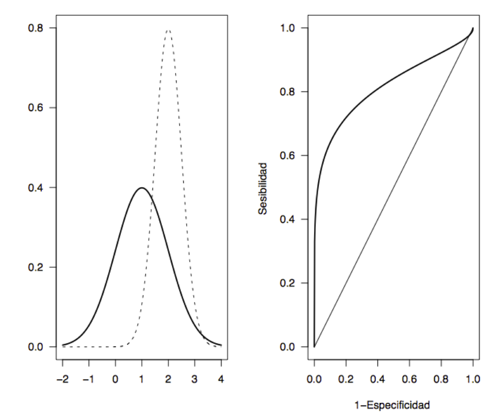

## Variables aleatorias continuas: Conceptos generales

### Densidad y distribución

En este curso nos vamos a restringir variables aleatorias continuas $X: \Omega\to \mathbb{R}$ que satisfacen la siguiente propiedad extra: su **función de distribución**
$$
\begin{array}{rcl}
F_X: \mathbb{R} & \to & [0,1]\\
x &\mapsto &P(X\leq x)
\end{array}
$$ 
es continua.

Fijaos entonces que, si $X$ es una variable aleatoria continua, 
$$
P(X=a)=0 \text{ para todo $a\in \mathbb{R}$}.
$$

```{block2,type="rmdcorbes"}
En efecto,
$$
\begin{array}{rl}
P(X=a)\!\!\!\!\! & =P(X\leq a)-P(X<a)=P(X\leq a)- P\Big(\bigcup_{n\geq 1}\Big(X\leq a-\dfrac{1}{n}\Big)\Big)\\
& \displaystyle = P(X\leq a)-\lim_{n\geq 1} P\Big(X\leq a-\dfrac{1}{n}\Big)\\
& \displaystyle = F_X(a)-\lim_{n\geq 1} F_X\Big(a-\dfrac{1}{n}\Big)=0
\end{array}
$$
por la continuidad de la $F_X$.

```

En particular, para una variable aleatoria continua, **probabilidad 0 no significa imposible**. Cada valor de $X$ tiene probabilidad 0, pero cuando tomamos un sujeto, algún valor de $X$ tendrá, por lo que ese valor ha de ser posible.

De $P(X=a)=0$ se deduce que la probabilidad de un suceso definido con una desigualdad es exactamente la misma que la del suceso correspondiente definido con una desigualdad estricta. Por ejemplo:

* $P(X\geq a)=P(X> a)+P(X=a)=P(X> a)$
* $P(a\leq X\leq a)=P(a<X<b)+P(X=a)+P(X=b)$ $=P(a<X<b)$


Como $P(X=a)=0$, no podemos definir la densidad como $f_X(a)=P(X=a)$. Pero recordad que, en las variables aleatorias discretas
$$
F_X(a)=\sum_{x\leq a} f_X(x)
$$

En el contexto de matemáticas "continuas", la suma $\sum$ se traduce en la integral $\int$. Se define entonces la  **función de densidad** de una variable aleatoria continua $X$ como la función $f_X:\mathbb{R}\to \mathbb{R}$ tal que $f_X(x)\geq 0$, para todo $x\in \mathbb{R}$, y
$$
F_X(a)=\int_{-\infty}^a f_{X}(x)\, dx\quad \text{para todo $a\in \mathbb{R}$.}
$$

La función de densidad $f_X$ es la función tal que $y=f_X(x)$ es la curva para la que, para todo valor $a$, $F_X(a)$ es el **área bajo esta curva** (entre la curva y el eje de abscisas) a la izquierda de $x=a$.


```{r echo=FALSE, out.width="60%"}
knitr::include_graphics("INREMDN_files/figure-html/graficadensidad3.png")
```

Como $P(X\leq a)$ es el área  bajo la curva $y=f_X(x)$ a la izquierda de $x=a$,
$$
\begin{array}{rl}
P(a\leq X\leq b)\!\!\!\! & =P(X\leq b)-P(X<a)\\
&=P(X\leq b)-P(X\leq a)
\end{array}
$$
es el área  bajo la curva $y=f_X(x)$ a la izquierda de $x=b$ **menos** el área  bajo la curva $y=f_X(x)$ a la izquierda de $x=a$, es decir, 
**$P(a\leq X\leq b)$ es igual al área  bajo la curva $y=f_X(x)$ entre $x=a$ y $x=b$.**


```{r echo=FALSE, out.width="60%"}
knitr::include_graphics("INREMDN_files/figure-html/entreaib.png")
```

 

Como $P(\Omega)=1$,
$$
P(X<\infty)=\int_{-\infty}^{\infty} f_X(x)\,dx=1
$$
**El área total bajo la curva $y=f_X(x)$ es 1.**

Sabemos que $P(X=a)=0$, pero si $\varepsilon>0$ es muy, muy pequeño,
el área bajo $y=f_X(x)$ entre $a-\varepsilon$ y $a+\varepsilon$ es aproximadamente  $2\varepsilon\cdot f_X(a)$


```{r echo=FALSE, out.width="60%"}
knitr::include_graphics("INREMDN_files/figure-html/density.png")
```

Por lo tanto $f_X(a)$ nos da una indicación de la probabilidad de que $X$ valga aproximadamente $a$ (pero **no es** $P(X=a)$, que vale 0).

### Esperanza, varianza, cuantiles...

La esperanza y la varianza de una variable aleatoria continua $X$, con función de densidad $f_X$, se definen como en el caso discreto, substituyendo la suma $\sum_{x\in D_x}$ por una integral.


La **esperanza** (**media**, **valor esperado**...) de $X$ es 
$$
E(X)=\int_{-\infty}^{\infty}x \cdot f_{X}(x)\, dx
$$
También se escribe $\mu_X$ o simplemente $\mu$.

Este valor tiene la misma interpretación que en el caso discreto: 

* Representa el valor medio de $X$ sobre el total de la población

* Es (con probabilidad 1) el límite de la media aritmética de los valores de $X$ sobre muestras aleatorias simples de tamaño $n$, cuando $n\to \infty$.

Si $g:\mathbb{R}\to \mathbb{R}$ es una función continua,
la **esperanza** de $g(X)$ es
$$
E(g(X))=\int_{-\infty}^{+\infty} g(x) f_X(x)dx
$$

La **varianza** de $X$ es
$$
Var(X)=E((X-E(X))^2)
$$
y se puede demostrar que es igual a
$$
Var(X)=E(X^2)-E(X)^2
$$
También se escribe $\sigma_X^2$ o simplemente $\sigma^2$.


La **desviación típica** de $X$ es 
$$
\sigma(X)=+\sqrt{Var(X)}
$$
y también se escribe $\sigma_X$ o $\sigma$.


Como en el caso discreto, la varianza y la desviación típica miden la variabilidad de los resultados de $X$ respecto de su valor medio.

Estos parámetros de $X$ tienen las **mismas propiedades** en el caso continuo que en el discreto. Las recordamos:

* $E(b)=b$, si $b$ es una variable aleatoria constante.


* $E(a X+b)=a E(X)+b$.


* $E(X+Y)=E(X)+E(Y)$.


* Si $X\leq Y$, entonces $E(X)\leq E(Y)$.


* $Var(aX+b)=a^2 Var(X)$, donde $a,b$ son constantes reales.


* $\sigma(aX+b)=|a|\cdot \sigma(X)$.


* $Var(b)=0$, si $b$ es una variable aleatoria constante


* $Var(X+Y)=Var(X)+Var(Y)$ si $X,Y$ son **independientes**


El **cuantil de orden $p$** (o **$p$-cuantil**) de una variable aleatoria continua $X$ es el valor $x_p\in \mathbb{R}$ más pequeño tal que 
$$
F_X(x_p)=P(X\leq x_p)=p
$$

```{block2,type="rmdcorbes"}
Fijaos en que como $F_X$ es continua, tiende a 0 cuando $x\to -\infty$ y tiende a 1 cuando $x\to -\infty$, por el Teorema del Valor medio de las funciones continuas (que dice, básicamente, que las funciones continuas no dan saltos) toma todos los valores en (0,1) y por lo tanto dado cualquier $p\in (0,1)$ existe algún $x$ tal que $F_X(x)=p$.
```

La **mediana** de $X$ es su 0.5-cuantil,  el **primer** y **tercer cuartiles** son su 0.25-cuantil y su 0.75-cuantil, etc.


## Variables aleatorias normales

### Propiedades básicas

Una variable aleatoria continua $X$ es **normal** (o **tiene distribución normal**) de parámetros
$\mu$ y $\sigma$ ($N(\mu,\sigma)$, para abreviar) cuando su función de densidad es

```{r, echo=FALSE,fig.width=1,out.width="35%"}
knitr::include_graphics("INREMDN_files/figure-html/censored.png")
```

Naturalmente, no os tenéis que saber esta fórmula. Pero sí que tenéis que saber que:

* Una variable aleatoria normal $X$ es continua, y por lo tanto $P(X=x)=0$, $P(X\leq x)=P(X<x)$ etc.

* Si $X$ es $N(\mu,\sigma)$, entonces su valor esperado es $E(X)=\mu$ y su desviación típica es $\sigma_X=\sigma$.

Una variable aleatoria normal es **típica** (o **estándar**) cuando tiene $\mu=0$ y $\sigma=1$; la denotaremos usualmente por $Z$. Por lo tanto,
si $Z$ es $N(0,1)$, $E(Z)=0$ y $\sigma(Z)=1$.


La gráfica de la densidad de una variable aleatoria normal es la conocida **campana de Gauss**:

```{r,echo=FALSE}
curve(dnorm(x),-5,5,col="blue",lwd=3,ylim=c(0,0.5),main="Densidad de N(0,1)",xlab="",ylab="")
abline(v=0)
```


La distribución normal es una distribución teórica, no la encontraréis exacta en la vida real. Y pese a su nombre, no es más "normal" que otras distribuciones continuas.


```{r, echo=FALSE,out.width="40%"}
knitr::include_graphics("INREMDN_files/figure-html/paranormal.png")
```

Su impottancia se debe a que muchas distribuciones de la vida real son aproximadamente nomales, porque:

> Toda variable aleatoria que consista en tomar $n$ medidas independientes de una o varias variables aleatorias y sumarlas, tiene distribución aproximadamente normal **cuando $n$ es muy grande**, aunque las variables aleatorias de partida no sean normales


```{example}
Una variable binomial $B(n,p)$ se obtiene tomando $n$ medidas independientes de una variable Bernoulli $B(1,p)$ y sumando los resultados. Por lo tanto, por la "regla" anterior, una  $B(n,p)$ tendría que ser aproximadamente normal si $n$ es grande. Pues sí, si $n$ es grande (pongamos mayor que 100, aunque si $p$ está lejos de 0 o 1 el tamaño de las muestras puede ser mucho menor), la distribución de una variable $X$ binomial $B(n,p)$ es aproximadamente la de una normal $N(np,\sqrt{np(1-p)})$, donde, recordad que si $X$ es $B(n,p)$, entonces $\mu_X=np$ y $\sigma_X=\sqrt{np(1-p)}$. 


```

Por ejemplo, el gráfico siguiente compara las funciones de distribución de una binomial $B(50,0.3)$ y una normal $N(50\cdot 0.3,\sqrt{50\cdot 0.3\cdot 0.7})$.


```{r,echo=FALSE}
curve(pnorm(x,50*0.3,sqrt(50*0.3*0.7)),xlim=c(0,30),xlab="",ylab="",col="blue",lwd=2,main="Ditribuciones de B(50,0.3) y N(50*0.3,sqrt(50*0.3*0.7)")
curve(pbinom(x,50,0.3),col="red",add=TRUE)
legend("topleft",lty=c(1,1),col=c("blue","red"),legend=c("Normal","Binomial"),cex=0.75)
```


Para calcular probabilidades de una $N(\mu,\sigma)$,  hay que calcular las integrales a mano

```{r,echo=FALSE, out.width="40%", scale=0.5}
knitr::include_graphics("INREMDN_files/figure-html/dontpanic.png")
```

O podéis usar R o alguna aplicación para móvil o tablet. Par R, la normal es `norm`. Así, por ejemplo, si $X$ es $N(1,2)$

* $P(X\leq 1.5)$ es
```{r}
pnorm(1.5,1,2)
```

* El 0.4-cuantil de $X$, es decir, el valor $q$ tal que $P(X\leq q)=0.4$ es
```{r}
qnorm(0.4,1,2)
```

* $P(X=1.5)$ es 

```{r}
dnorm(1.5,1,2)
```

```{block2,type="rmderror"}
¡No! Como $X$ es continua, $P(X=1.5)=0$. `dnorm(1.5,1,2)` calcula el valor de la función de densidad de $X$ en 1.5, que no creemos que os interese mucho.
```

Una de las propiedades clave de la distribución normal es su simetría:

```{block2, type='rmdimportant'}
Si $X$ es $N(\mu,\sigma)$, su densidad $f_X$ es simétrica respecto de $x=\mu$, es decir,
$$
f_{X}(\mu-x)=f_{X}(\mu+x),
$$
y tiene el máximo en $x=\mu$. Decimos entonces que $\mu$ es la **moda** de $X$.
```

```{r, echo=FALSE, out.width="80%", fig.width=8, fig.asp = 0.5}
curve(dnorm,-4,4,xaxt="n",yaxt="n",xaxs="i",yaxs="i",xlab="",bty="l",ylab="",lwd=2)
abline(v=0,lty=2)
axis(1,at=c(0), labels=c(expression(mu)))
```

```{block2, type='rmdnote'}
Recordamos que no tiene sentido definir la moda de una variable continua $X$ como el valor $x_0$ tal que $P(X=x_0)$ sea máximo, porque $P(X=x)=0$ para todo $x\in \mathbb{R}$. Se define entonces la **moda** de una variable continua $X$ como el valor (o los valores) $x_0$ tal(es) que $f_X(x_0)$ es máximo.
```

En particular, si $Z$ es $N(0,1)$, entonces $f_Z$ es simétrica alrededor de $x=0$, es decir, $f_{Z}(-x)=f_{Z}(x)$, y la moda de $Z$ es $x=0$

Recordad que la función de distribución de una variable aleatoria continua $X$,
$$
P(X\leq x)=F_X(x)
$$ 
es el área comprendida entre la densidad $y=f_X(x)$ y el eje de abscisas a la izquierda de $x$.

```{r,echo=FALSE, out.width="80%", fig.width=8, fig.asp = 0.5}
x <- seq(-4,4,.1)

plot(x,dnorm(x),type="l",xlab="",ylab=expression(f[X](x)),xaxs="i",yaxs="i",ylim=c(0,.4),bty="l",xaxt="n",yaxt="n")
polysection <- function(a,b,dist=dnorm,col="blue",n=11){
    dx <- seq(a,b,length.out=n)
    polygon(c(a,dx,b),c(0,dist(dx),0),border=NA,col=col)
}

for(i in -4:0){
    polysection(i,i+1,col="grey")
}

axis(1,at=c(1), labels=c(expression(x)))
arrows(-0,0.1,-2.5,0.3,lwd=2)
text(-2.5,0.32,expression(F[X](x)== P(X<=x) ) )
```

Entonces, la simetría de $f_X$ hace que las áreas a la izquierda de $\mu-x$ y a la derecha de $\mu+x$ sean iguales.


```{r, echo=FALSE, out.width="80%", fig.width=8, fig.asp = 0.5}
x <- seq(-4,4,.1)

plot(x,dnorm(x),type="l",xlab="",ylab="",xaxs="i",yaxs="i",ylim=c(0,.4),bty="l",xaxt="n",yaxt="n",lwd=2)
polysection <- function(a,b,dist=dnorm,col="blue",n=11){
    dx <- seq(a,b,length.out=n)
    polygon(c(a,dx,b),c(0,dist(dx),0),border=NA,col=col)
}

for(i in -4:-2){
    polysection(i,i+1,col="blue")
  #  polysection(-i-1,-i,col="grey")
}
for(i in 1:4){
    polysection(i,i+1,col="blue")
  #  polysection(-i-1,-i,col="grey")
}


axis(1,at=c(-1,0,1), labels=c(expression(mu-x),expression(mu),expression(mu+x)))
abline(v=0,lty=2)
```

Es decir,
$$
P(X\leq \mu-x)=P(X\geq \mu+x)=1-P(X\leq \mu+x)
$$

En particular (tomando $x=0$)
$$
P(X\leq \mu)=1-P(X\leq \mu)\Rightarrow P(X\leq \mu)=0.5
$$
y por lo tanto, $\mu$ es también la **mediana** de $X$.

```{block2, type='rmdimportant'}
Si $X$ es $N(\mu,\sigma)$, $\mu$ es la moda, la mediana y la media, o esperanza, de $X$.
```


En particular, si $Z$ es $N(0,1)$, las áreas a la izquierda de $-z$ y a la derecha de $z$ son iguales
$$
P(Z\leq -z)=P(Z\geq z)=1-P(Z\leq z)
$$
 y la mediana de $Z$ es 0


```{r, eval=FALSE, echo=FALSE, out.width="80%", fig.width=8, fig.asp = 0.5}
x <- seq(-4,4,.1)

plot(x,dnorm(x),type="l",xlab="",ylab="",xaxs="i",yaxs="i",ylim=c(0,.4),bty="l",xaxt="n",yaxt="n",lwd=2)
polysection <- function(a,b,dist=dnorm,col="blue",n=11){
    dx <- seq(a,b,length.out=n)
    polygon(c(a,dx,b),c(0,dist(dx),0),border=NA,col=col)
}

for(i in -4:-2){
    polysection(i,i+1,col="blue")
  #  polysection(-i-1,-i,col="grey")
}
for(i in 1:4){
    polysection(i,i+1,col="blue")
  #  polysection(-i-1,-i,col="grey")
}


axis(1,at=c(-1,0,1), labels=c(expression(-z),"0",expression(z)))
abline(v=0,lty=2)
```


Si $\mu$ crece, desplaza a la derecha el máximo de la densidad, y con él toda la curva de manera rígida.

```{r, echo=FALSE, out.width="80%", fig.width=8, fig.asp = 0.5}
curve(dnorm(x,0,1),-4,6,col="red",xaxs="i",yaxs="i",ylim=c(0,0.5),bty="l",xaxt="n",yaxt="n",xlab="",ylab="",lwd=2,main=expression(mu[1]<mu[2]))
curve(dnorm(x,2,1),-4,6,col="blue",lwd=2,add=T)
abline(v=0)
abline(v=2)
axis(1,at=c(0,2), labels=c(expression(mu[1]),expression(mu[2])))
text(-1.5,0.32,expression(N(mu[1],sigma)),col="red")
text(3.5,0.32,expression(N(mu[2],sigma)),col="blue")
```

Si $\sigma$ crece, la curva se aplana: al aumentar la desviación típica, los valores se alejan más del valor medio. 


```{r, echo=FALSE, out.width="80%", fig.width=8, fig.asp = 0.5}
curve(dnorm(x,0,1),-6,6,col="red",xaxs="i",yaxs="i",ylim=c(0,0.5),bty="l",xaxt="n",yaxt="n",xlab="",ylab="",lwd=2,main=expression(sigma[1]<sigma[2]))
curve(dnorm(x,0,1.5),col="blue",lwd=2,add=T)
abline(v=0)
axis(1,at=c(0), labels=c(expression(mu)))
text(-1.5,0.32,expression(N(mu,sigma[1])),col="red")
text(3.5,0.1,expression(N(mu,sigma[2])),col="blue")
```

El gráfico siguiente muestra el efecto combinado:

```{r, echo=FALSE, out.width="80%", fig.width=8, fig.asp = 0.5}
curve(dnorm(x,0,1),-4,8,col="red",xaxs="i",yaxs="i",ylim=c(0,0.5),bty="l",xaxt="n",yaxt="n",xlab="",ylab="",
      lwd=2,main=expression(paste(mu[1]<mu[2], " i ", sigma[1]<sigma[2])))
curve(dnorm(x,2,1.5),col="blue",lwd=2,add=T)
abline(v=0)
abline(v=2)
axis(1,at=c(0,2), labels=c(expression(mu[1]),expression(mu[2])))
text(-1.5,0.32,expression(N(mu[1],sigma[1])),col="red")
text(3.5,0.25,expression(N(mu[2],sigma[2])),col="blue")
```

Denotaremos por $z_q$ el **$q$-cuantil** de una variable normal estándar $Z$. Es decir, $z_q$ es el valor tal que $P(Z\leq z_q)=q$. 

Aparte del hecho que $z_{0.5}=0$ (la mediana de $Z$ es 0), hay dos cuantiles más de la normal estándard que tendríais que recordar:

* $z_{0.95}=1.64$; es decir, $P(Z\leq 1.64)=0.95$ y por lo tanto $P(Z\leq -1.64)=P(Z\geq 1.64)=0.05$.

* $z_{0.975}=1.96$; es decir, $P(Z\leq 1.96)=0.975$ y por lo tanto $P(Z\leq -1.96)=P(Z\leq 1.96)=0.025$

```{block2, type='rmdmercifulgod'}
Muy a menudo el valor 1.96 de $z_{0.975}$ se aproxima por 2. Tenéis permiso para hacerlo cuando no disponéis de medios (R, aplis de móvil) para calcular cuantiles.
```

### Combinaciones lineales

Una de las propiedades de la distribución normal que nos facilitan mucho la vida es que **toda combinación lineal de variables aleatorias normales independientes es normal**. En concreto:

```{theorem,comblinnormals}
1. Si $X$ es $N(\mu,\sigma)$ y $a,b\in \mathbb{R}$, entonces
$aX+b$ es $N(a\mu+b,|a|\cdot\sigma)$

2. En particular, si $X$ es $N(\mu,\sigma)$, entonces su **tipificada** (o **estandarizada**)
$$
Z=\dfrac{X-\mu}{\sigma}
$$
es $N(0,1)$.

3. Si $X_1,\ldots,X_n$ son variables aleatorias normales **independientes** y $a_1,\ldots,a_n,b\in \mathbb{R}$, entonces
$a_1X_1+\cdots +a_nX_n+b$ es $N(\mu,\sigma)$ con
$$
\mu=a_1\mu_1+\cdots +a_n\mu_n+b,\ 
\sigma=\sqrt{a_1^2\sigma^2_1+\cdots +a_n^2\sigma^2_n}
$$
```


```{block2,type="rmdnote"}
Que toda combinación lineal de variables normales vuelva a ser del mismo tipo, es decir, normal, es una propiedad muy útil de las variables normales que no comparten muchos otras distribuciones. Por ejemplo, si $X$ es una variable binomial $B(n,p)$ con $p\neq 0$, $2X$ no es una variable binomial, porque solo toma valores pares y una variable binomial $B(m,q)$ puede tomar todos los valores entre 0 y $m$.
```


Las probabilidades de la normal tipificada determinan las de la normal original, porque si  $X$ es $N(\mu,\sigma)$:
$$
\begin{array}{rl}
P(a\leq X\leq b) & \displaystyle  =P\Big( \frac{a-\mu}{\sigma}\leq \frac{X-\mu}{\sigma}\leq \frac{b-\mu}{\sigma}\Big)\\ & \displaystyle =P\Big(\frac{a-\mu}{\sigma}\leq Z\leq \frac{b-\mu}{\sigma}\Big)
\end{array}
$$
Sirve para deducir fórmulas, y vuestros padres las usaban para cálculos (con tablas); ahora es más cómodo usar una aplicación del móvil.


## Intervals de referència 


Un **intervalo de referencia** del $100q%$ para una variable aleatoria $X$ es un intervalo $[a,b]$ tal que 
$$
P(a\leq X\leq b)=q.
$$
Es decir, un intervalo de referencia del $100q%$ para $X$ es un intervalo que contiene los valores de $X$ del $100q%$ de los sujetos de la población.

Los más comunes son los intervalos de referencia del 95% ($q=0.95$), que satisfacen que
$$
P(a\leq X\leq b)=0.95
$$
y son los, que por ejemplo, os dan como valores de referencia en las analíticas:

```{r, echo=FALSE, out.width="80%"}
knitr::include_graphics("INREMDN_files/figure-html/analit.png")
```

```{block2,type="rmdnote"}
Cuando se habla de un **intervalo de referencia** sin dar la probabilidad, se sobreentiende siempre que es el intervalo de referencia del 95%.
```


Cuando $X\sim N(\mu,\sigma)$, estos intervalos de referencia se toman siempre **centrados en la media** $\mu$, es decir, de la forma $[\mu-\text{algo},\mu+\text{algo}]$. Para calcularlos fácilmente, podemos emplear el resultado siguiente:

```{theorem} 
Si $X$ es $N(\mu,\sigma)$, un intervalo de referencia del $100q%$ para $X$ es
$$
[\mu- z_{(1+q)/2}\cdot \sigma, \mu+ z_{(1+q)/2}\cdot \sigma]
$$
donde  $z_{(1+q)/2}$ denota el $(1+q)/2$-cuantil de la normal estándar $Z$. Normalmente lo escribiremos
$$
\mu\pm z_{(1+q)/2}\cdot \sigma.
$$

```


```{block2, type='rmdcorbes'}
En efecto:
$$
\begin{array}{l}
P(\mu-x\leq X\leq \mu+x)=q\\
\qquad \Longleftrightarrow \displaystyle P\Big(\frac{\mu-x-\mu}{\sigma}\leq \frac{X-\mu}{\sigma}\leq \frac{\mu+x-\mu}{\sigma}\Big)=q\\
\qquad \Longleftrightarrow \displaystyle P(-x/{\sigma}\leq Z\leq {x}/{\sigma})=q\\
\qquad \Longleftrightarrow \displaystyle P(Z\leq {x}/{\sigma})-P(Z\leq -{x}/{\sigma})=q\\
\qquad \Longleftrightarrow \displaystyle P(Z\leq {x}/{\sigma})-(1-P(Z\leq {x}/{\sigma}))=q\\
\qquad \mbox{(per la simetria de $f_Z$ al voltant de 0)}\\
\qquad \Longleftrightarrow \displaystyle 2P(Z\leq {x}/{\sigma})=q+1\\
\qquad \Longleftrightarrow P(Z\leq {x}/{\sigma})=(1+q)/2\\
\qquad \Longleftrightarrow x/\sigma=
z_{(1+q)/2}\\
\qquad \Longleftrightarrow x=z_{(1+q)/2}\cdot \sigma
\end{array}
$$

```


En particular, como si $q=0.95$, entonces $(1+q)/2=0.975$ y entonces $z_{0.975}=1.96$, el intervalo de referencia del 95% para una $X$ normal $N(\mu,\sigma)$ es
$$
\mu\pm 1.96\sigma
$$
Y como este 1.96  a menudo se aproxima por 2, el intervalo de referencia del 95% se simplifica a
$$
\mu\pm 2\sigma.
$$
Esto dice, básicamente, que

> si una población sigue una distribución normal $N(\mu,\sigma)$, un 95% de sus individuos tienen su valor de $X$ a distancia como a máximo $2\sigma$ ("a dos sigmas") de $\mu$.


```{example}
Según la OMS, las alturas de las mujeres europeas de 18 años (en cm) siguen una ley $N(163.1,18.53)$. ¿Cuál es el intervalo de alturas centrado en la media que contenga a la mitad las europeas de 18 años?
    
```   
    
Fijaos en que, si llamamos $X$ a la variable aleatoria "Altura de una mujer europea de 18 años en cm", lo que quiero encontrar es el intervalo centrado en su media, 163.1, tal que la probabilidad de que la altura de una europea de 18 años escogida al azar pertenezca a este intervalo sea 0.5 Es decir, el intervalo de referencia del 50% para $X$.

Como $X$ es $N(163.1,18.53)$ y si $q=0.5$, entonces $(1+q)/2=0.75$ y podemos calcular con R o una aplicación el 0.75-cuantil $z_{0.75}$ de una normal estándar. Por ejemplo, con R,
```{r}
qnorm(0.75)
```

Por lo tanto, redondeando a mm, es el intervalo $163.1\pm 0.6745\cdot 18.53$, es decir $[150.6, 175.6]$. Por lo tanto, la mitad de las mujeres europeas de 18 años miden entre  150.6 y 175.6.


El **z-score** (**valor**, **puntuación**, **puntaje**...) de un valor $x_0\in \mathbb{R}$ respecto de una distribución $N(\mu,\sigma)$ es
$$
\frac{x_0-\mu}{\sigma}
$$

Es decir, el z-score de $x_0$ es el resultado de "tipificar" $x_0$ en el sentido del Teorema \@ref(thm:comblinnormals).2.

Si la variable poblacional es normal, cuanto mayor es el valor absoluto del z-score de $x_0$, más "raro" es $x_0$; el signo nos dice si es más grande o más pequeño que el valor esperado $\mu$.

```{example} 
Recordad que, según la OMS, las alturas de las mujeres europeas de 18 años siguen una ley $N(163.1,18.53)$. ¿Cuál sería el z-score de una jugadora de baloncesto de 18 años que midiera 191 cm?

```

Es
$$ 
\frac{191-163.1}{18.53}=1.5
$$

Esto se suele leer diciendo que la altura de esta jugadora está *a 1.5 sigmas por encima de la altura media*.


### Aplicaciones en criterios diagnósticos

Supongamos que la concentración de un cierto metabolito es una variable aleatoria:

* En personas **enfermas** (de una determinada enfermedad), $X_E$, $N(\mu_E, \sigma_E)$.

* En personas **sanas** (sin esa enfermedad), $X_S$, $N(\mu_S, \sigma_S)$;

Supongamos, para fijar ideas, que $\mu_E>\mu_S$: la concentración media de este metabolito en los enfermos es más alta que en las sanas.

Podemos usar como prueba diagnóstica de la enfermedad la concentración del metabolito. Para cada valor de referencia  $x_0$, nuestra prueba da:

* **Positivo**, si la concentración es mayor que $x_0$

* **Negativo**, si la concentración es menor que $x_0$

Entonces:

* La **sensibilidad** de esta prueba es
$$
P(+|E)  =P(X_E\geq x_0)=1-P(X_E< x_0)=1-F_{X_E}(x_0)
$$

* Su **especificidad**  es
$$
P(-|S)=P(X_S< x_0)=F_{X_S}(x_0)
$$

* Su **tasa de falsos positivos** es
$$
P(+|S)=P(X_S\geq  x_0)=1-F_{X_S}(x_0)
$$


Al variar $x_0$, tenemos valores diferentes de la sensibilidad y la tasa de falsos positivos y podemos dibujar una curva ROC y escoger el umbral con algún criterio.

```{example}
Imaginad que la densidad de $X_E$ es la línea discontinua del gráfico de la izquierda de la Figura \@ref(fig:rocnormal) y la de $X_S$ la línea continua. Ambas son normales y $\mu_E>\mu_S$. 

```


```{r, rocnormal, echo=FALSE, out.width="80%",scale=2}

```

Si para cada $x$ dibujamos los puntos $(1-F_{X_S}(x),1-F_{X_E}(x))$, obtenemos la curva ROC de la derecha de dicha figura.


```{example}
Se acepta que la presión sistólica se distribuye como una variable normal con valor medio y  desviación típica que dependen de la edad. Para la franja de edad 16-24 años, estos valores son:

* Para hombres, $\mu=124$ y $\sigma=13.7$
* Para mujeres, $\mu=117$ y $\sigma=13.7$

El modelo de hipertensión-hipotensión aceptado es el descrito en la Figura \@ref(fig:hiperhipo). Queremos calcular los límites de cada clase para cada sexo en este grupo de edad.

```


```{r, hiperhipo, echo=FALSE, out.width="80%"}
knitr::include_graphics("INREMDN_files/figure-html/hiperhipo.png")
```

Veamos:

* El límite superior del grupo de hipotensión es el valor que deja a la izquierda un 5% de las tensiones: el 0.05-cuantil de la distribución.
* El límite superior del grupo de riesgo de hipotensión es el valor que deja a la izquierda un 10% de las tensiones: el 0.1-cuantil de la distribución.
* El límite inferior del grupo de riesgo de hipertensión es el valor que deja a la izquierda un 90% de las tensiones: el 0.9-cuantil de la distribución.
* El límite inferior del grupo de hipertensión es el valor que deja a la izquierda un 95% de las tensiones: el 0.95-cuantil de la distribución.

En los hombres, la tensión sistólica es una variable aleatoria $N(124,13.7)$. Podemos usar R o una aplicación para calcular estos cuantiles. Con R:

```{r}
qnorm(0.05,124,13.7)
qnorm(0.1,124,13.7)
qnorm(0.9,124,13.7)
qnorm(0.95,124,13.7)
```

```{block2,type="rmdromans"}
Hemos trabajado más de lo necesario: por la simetría, el 0.95-cuantil ha de estar a la misma distancia de $\mu$ que el 0.05-cuantil, pero a la derecha:
$$
124-101.4655=22.5345\Longrightarrow  124+22.5345=126.5345
$$
Lo mismo pasa con el 0.9-cuantil y el 0.1-cuantil, comprobadlo.
```

En resumen,entre los hombres de 16 a 24 años:
$$
\begin{array}{|ll|}
\hline
\text{Grupo} & \text{Intervalo}\\ \hline
\text{Hipotenso} & <101.5\\
\text{Prehipotenso} & 101.5\text{ a }106.4\\
\text{Normotenso} & 106.4\text{ a }141.6\\
\text{Prehipertenso} & 141.6\text{ a }141.5\\
\text{Hipertenso} & > 141.5\\ \hline
\end{array}
$$


```{block2,type="rmdexercici"}
Calculad los límites para las mujeres.
```


## Distribuciones muestrales

### Conceptos básicos

El problema típico de la **estadística inferencial** es:

* Queremos conocer el valor de una característica en el total de una población, pero no podemos medir esta característica en **todos** los individuos de la población

* Extraemos una muestra de la población, medimos la característica en los individuos de esta muestra, calculamos algo con estas medidas e **inferimos** el valor de la característica en el global de la población.

Inmediatamente surgen varias preguntas que responderemos en esta sección y la próxima lección.

* ¿Cómo tiene que ser la muestra?
* ¿Qué tenemos que calcular?
* ¿Con qué precisión podemos inferir la característica de la población?

De entrada, vamos a suponer de ahora en adelante que tomamos **muestras aleatorias simples**. También permitimos muestras aleatorias sin reposición si la población es mucho más grande que la muestra, ya que entonces no hay diferencia práctica entre permitir y prohibir las repeticiones.

```{block2,type"rmdnote"}
Sí, ya sabemos que en la práctica casi nunca tomamos muestras aleatorias. En este caso, recordad lo que os explicábamos en la Sección \@ref(sec:oport). Lo que se suele hacer es describir en detalle las características de la muestra para justificar que, pese a no ser aleatoria, es razonablemente representativa de la población y podría pasar por  aleatoria.
```


¿Qué calculamos? Pues un **estimador**: alguna función adecuada aplicada a los valores de la muestra. 

Por ejemplo

* Queremos estimar la altura media de los estudiantes de la UIB: tomamos una muestra aleatoria de estudiantes de la UIB, medimos sus alturas y calculamos su media aritmética.

* Queremos estimar el riesgo relativo apara un estudiante de la UIB de suspender alguna asignatura si es fumador:  tomamos una muestra aleatoria de estudiantes de la UIB, anotamos si fuman o no, si han suspendido alguna asignatura o no, y restamos de la proporción de suspensos entre los fumadores la proporción de suspensos entre los  o fumadores.

```{block2,type="rmdimportant"}
Fijaos que un estimador es una **variable aleatoria**, definida sobre la población formada por las muestras de la población, y por lo tanto tiene  función de distribución (que genéricamente llamaremos **distribución muestral**, para indicar que mida la probabilidad de que al valor del **estimador sobre una muestra** le pase algo), esperanza, desviación típica, etc.
```

### Media muestral

Cuando queremos estimar el valor medio de una medida sobre una población, tomamos una muestra de valores y calculamos la media aritmética, ¿verdad? 

Pues eso. Dada una variable aleatoria $X$, llamamos **media muestral**, $\overline{X}$, a la variable aleatoria consistente en tomar una muestra aleatoria de tamaño $n$ de $X$ y calcular la media aritmética de sus valores


```{block2,type="rmdimportant"}
**Recordad**: Los estimadores como $\overline{X}$ tienen siempre sentido para muestras en general, pero casi todos los teoremas que establecen sus propiedades solo son ciertos bajo restricciones (que las muestras sean aleatorias simples, condiciones extra sobre la variable aleatoria poblacional, ...)  por lo que sus consecuencias solo son seguras bajo estas restricciones.
```

Tenemos el teorema siguiente

```{theorem,mitjmostgral}
Sea $X$ una variable aleatoria de media $\mu_X$ y desviación típica $\sigma_X$, y sea $\overline{X}$ la media artimética de muestras aleatorias de tamaño $n$ de $X$. Entonces:


* $E(\overline{X})=\mu_X$

* Si las muestras aleatorias  son simples, $\sigma(\overline{X})=\dfrac{\sigma_X}{\sqrt{n}}$

* Si las muestras aleatorias  no son simples y $N$ es el tamaño de la población,
$$
\sigma(\overline{X})=\frac{\sigma_X}{\sqrt{n}}\cdot\sqrt{\frac{N-n}{N-1}}
$$
```

Al factor 
$$
\sqrt{\frac{N-n}{N-1}}
$$ 
que transforma $\sigma(\overline{X})$ para muestras aleatorias simples a muestras aleatorias sin reposición se le llama **factor de población finita**, y si os fijáis, es el que transformaba la desviación típica de una variable binomial (que cuenta éxitos en muestras aleatorias simples) en la desviación típica de una variable hipergeométrica  (que cuenta éxitos en muestras aleatorias sin reposición).

```{block2,type"rmdimportant"}
Y recordad que si el tamaño de la población $N$ es muy grande relativamente a $n$, podemos suponer que una muestra aleatoria sin reposición es simple.
```


\frametitle{Media muestral}
\begin{itemize}
* $\red{E(\overline{X})=\mu_X}$: $\overline{X}$ sirve para estimar $\mu_X$ (es un buen **estimador} (\red{no sesgado}) de $\mu_X$):


{\it Si repitiésemos muchas veces el proceso de tomar una m.a.\  de $X$ y calcular su media, es muy probable
que la media de estas medias se aproximara mucho a $\mu_X$}


* **$\sigma(\overline{X})= \sigma_X/\sqrt{n}$}: la variabilidad de las medias crece con la de $X$ y decrece cuando tomamos muestras mayores

**$\sigma_X/\sqrt{n}$} es el **error típico} de $\overline{X}$ (para la v.a.\ $X$ y m.a.s.\ de tamaño $n$)
\end{itemize}


\frametitle{Distribución muestral de $\overline{X}$}

Recordando que una combinación de vv.aa.\ normales independientes es normal, tenemos:
\begin{teorema}
Si $X$ es $N(\mu_X,\sigma_X)$ y las mm.aa.\  son simples, entonces
$$
\overline{X}$ es $N\Big(\mu_X,\frac{\sigma_X}{\sqrt{n}}\Big)
$$
y por lo tanto
$$
Z=\frac{\overline{X}-\mu_X}{\frac{\sigma_X}{\sqrt{n}}}$ es $N(0,1)
$$
\end{teorema}


\frametitle{Teorema Central del Límite}
\begin{teorema}
Sea $X$ una v.a.\ **cualquiera} de esperanza $\mu_X$ y desviación típica $\sigma_X$. Si las mm.aa.\  son simples, entonces,
cuando $n\to  \infty$, 
$$
\overline{X}\mbox{ tiende a ser }N\Big(\mu_X,\frac{\sigma_X}{\sqrt{n}}\Big)
$$
y por lo tanto
$$
Z=\frac{\overline{X}-\mu_X}{\frac{\sigma_X}{\sqrt{n}}}\mbox{ tiende a ser }N(0,1)
$$
\end{teorema}


\frametitle{Distribución muestral de $\overline{X}$}

En resumen, para  mm.aa.\ simples:
\begin{itemize}
* Si $X$ es normal, siempre
$$
\overline{X}$ es $N\Big(\mu_X,\dfrac{\sigma_X}{\sqrt{n}}\Big)
$$

* Si $X$ no es normal pero $n$ es grande (**$n\geq 30$ o \underline{\textbf{40}}}), 
$$
\overline{X}\approx N\Big(\mu_X,\dfrac{\sigma_X}{\sqrt{n}}\Big)
$$
\end{itemize}

Para muestras  que no sean (prácticamente) aleatorias simples, ambos resultados son falsos (incluso usando el factor de población finita), pero si no tenemos nada más\ldots


\frametitle{Ejercicios} 

¿Qué sois vosotros? Marcad la única respuesta correcta
\begin{enumerate}[(a)] 
* Una m.a.s.\ de los estudiantes de 1er curso de Medicina de España.
* Una m.a.\ no simple de los estudiantes de 1er curso de Medicina de España.
* Una muestra de conveniencia de los estudiantes de 1er curso de Medicina de España. \only<2>{{\Large\red \checkmark}}
* Ninguna de las otras respuestas es correcta.
\end{enumerate}


\frametitle{Ejercicios}
 Si queremos disminuir a la mitad el error típico de una media muestral  (calculada a partir de m.a.s.): 
\begin{enumerate}[(a)] 
* Tenemos que aumentar en un 50% el tamaño de la muestra
* Tenemos que doblar el tamaño  de la muestra.
* Tenemos que cuadruplicar el tamaño  de la muestra.  \only<2>{{\Large\red \checkmark}}
* Tenemos que dividir por 2 el tamaño  de la muestra.
* Tenemos que dividir por 4 el tamaño  de la muestra.
* Ninguna de las otras respuestas es correcta.
\end{enumerate}


\subsection{Varianza muestral}

\frametitle{Varianza muestral}

**Varianza muestral}, \red{$\widetilde{S}_{X}^2$}: Tomamos una m.a.\  de tamaño $n$ de una v.a.\ $X$ y calculamos la varianza \blue{muestral} de sus valores


**Desviación típica muestral}, \red{$\widetilde{S}_{X}$}: Tomamos una m.a.\  de tamaño $n$ de una v.a.\ $X$ y calculamos la desviación típica \blue{muestral} de sus valores

Formalmente, si se trata de una m.a.s., tomamos $n$ copias independientes $X_1,\ldots,X_n$ de una misma v.a.\ $X$ y entonces
$$
 \red{\widetilde{S}_{X}^2}=\frac{\sum_{i=1}^n (X_{i}-\overline{X})^2}{\blue{n-1}},\quad 
 \red{\widetilde{S}_{X}}=+\sqrt{\widetilde{S}_{X}^2}
$$


\frametitle{Varianza muestral}

\begin{teorema}
Si $X$ es $N(\mu_X,\sigma_X)$ y tomamos mm.aa.ss.\ de tamaño $n$: 

\begin{itemize}
* $\red{E(\widetilde{S}_{X}^2)}=\sigma_{X}^2$
\end{itemize}
\end{teorema}


Por lo tanto, si $X$ es normal,  $\widetilde{S}_{X}^2$ es un buen \red{estimador} de $\sigma_{X}^2$:


{\it Si repitiéramos muchas veces el proceso de tomar una m.a.s.\ de $X$ y calcular su varianza \red{muestral}, es muy probable
que la media de estas varianzas muestrales se aproximara mucho a $Var(X)$}


\frametitle{Varianza muestral}

\begin{teorema}
Si $X$ es $N(\mu_X,\sigma_X)$ y tomamos mm.aa.ss.\ de tamaño $n$: 

\begin{itemize}
* $E(\widetilde{S}_{X}^2)=\sigma_{X}^2$

* La v.a.\ $\dfrac{(n-1)\widetilde{S}_{X}^2}{\sigma_{X}^2}$ tiene distribución conocida:
$\chi_{n-1}^2$
\end{itemize}
\end{teorema}


Si $X$ no es normal o si las muestras no son simples, los dos puntos son en general  ``muy falsos''

\red{¡Atención!} $E(\widetilde{S}_{X})\ \red{\neq}\ \sigma_{X}$

\red{¡Atención!} Si $S^2_{X}$ es la varianza a secas (dividiendo por $n$), $E(S^2_{X})\ \red{\neq}\ \sigma^2_{X}$


\frametitle{La distribución $\chi_n^2$}\vspace*{-2ex}

La distribución $\chi_n^2$ ($\chi$: en castellano, **ji}; en catalán, **khi};  en inglés, **chi}), donde $n$ son los **grados de libertad}, es la distribución de probabilidad de la suma de los cuadrados de $n$ vv.aa.\ $N(0,1)$

\begin{center}
\includegraphics[width=0.8\linewidth]{chisqs}

\footnotesize Función de densidad de $\chi^2_n$ para algunos $n$
\end{center}


\frametitle{La distribución $\chi_n^2$}
\vspace{-1cm}

\begin{center}
\includegraphics[width=0.8\linewidth]{khi2vsN}

Si $n$ es MUY grande, $\chi^2_n\approx N(n,\sqrt{n})$
\end{center}


\frametitle{Distribución muestral de $\overline{X}$, de nuevo}

\begin{teorema}
Si $X$ es $N(\mu_X,\sigma_X)$ y tomamos  mm.aa.ss.\ de tamaño $n$, la v.a.
$$
T=\frac{\overline{X}-\mu}{\widetilde{S}_{X}/\sqrt{n}}
$$
 tiene distribución conocida: \red{$t_{n-1}$} (**$t$ de Student} con $n-1$ grados de libertad) 
\end{teorema}


\red{$\widetilde{S}_{X}/\sqrt{n}$}: el **error típico} de la muestra, estima el error típico $\sigma_X/\sqrt{n}$ de $\overline{X}$


\frametitle{Distribución $t$ de Student}

La distribución $t$ de Student con $n$ grados de libertad, 
\red{$t_{n}$} satisface que:

\begin{itemize}

* Si $T$ es una v.a.\ con distribución $t_n$,
$$
E(T)=0\mbox{ si $n>1$ y }Var(T)=\dfrac{n}{n-2}\mbox{ si $n>2$}
$$
y su \red{función de distribución es simétrica respecto de $0$} (como la de una $N(0,1)$):
$$
P(T\leq -x)=P(T\geq x)=1-P(T\leq x)
$$

* Si $n$ es grande, una $t_{n}$ es aproximadamente una $N(0,1)$ (pero con un poco más de varianza: un poco más achatada)

\end{itemize}


\frametitle{Distribución $t$ de Student}
\vspace{-0.6cm}

\begin{center}
\includegraphics[width=0.9\linewidth]{tstud-div.pdf}
\end{center}


\frametitle{Distribución $t$ de Student}
\vspace{-0.6cm}

\begin{center}
\includegraphics[width=0.9\linewidth]{tvsN.pdf}
\end{center}


\subsection{Proporción muestral}


\frametitle{Proporción muestral}

**Proporción muestral}, \red{$\widehat{p}_X$}: Tomamos una m.a.\  de tamaño $n$ de una v.a.\ $X$ es $B(1,p_X)$ de \blue{Bernoulli}  y contamos el número total de éxitos


Formalmente, si se trata de una m.a.s., tomamos $n$ copias independientes $X_1,\ldots,X_n$ de una misma v.a.\ $X$ de Bernoulli y 
$$
\red{\widehat{p}_X}=\frac{X_1+\cdots+X_n}{n}=\overline{X}
$$

Como $\widehat{p}_X$ es un caso particular de $\overline{X}$,  todo el que hemos dicho  para medias muestrales vale también para proporciones muestrales


\frametitle{Proporción muestral}\vspace*{-2ex}

\begin{teorema}
Si $X$ es una v.a.\ de Bernoulli con probabilidad de éxito (\red{proporción} o \red{probabilidad poblacional}) $p_X$
\begin{itemize}
* $\red{E(\widehat{p}_X)}=p_X$

* Si las mm.aa.\  son simples, $\red{\sigma({\widehat{p}_X})}=\sqrt{\dfrac{p_X(1-p_X)}{n}}$


* Si las mm.aa.\  no son simples (y $N$ es el tamaño de la población), 
$$
\red{\sigma({\widehat{p}_X})}=\sqrt{\frac{p_X(1-p_X)}{n}}\cdot
\blue{\sqrt{\frac{N-n}{N-1}}}
$$
Si $N$ es muy grande relativamente a $n$, podemos suponer que una m.a.\  es simple
\end{itemize}
\end{teorema}


\frametitle{Proporción muestral}

\begin{itemize}
* $\red{E(\widehat{p}_X)=p_X}$: $\widehat{p}_X$ es un buen estimador de $p_X$:

{\it Si repitiéramos muchas veces el proceso de tomar una m.a.s.\ de una v.a.\ de Bernoulli $X$ y calcular su proporción muestral, es muy probable que
la media de estas proporciones muestrales se acercara a la proporción poblacional $p_X$}


* **$\sigma(\widehat{p}_X)= \sqrt{\dfrac{p_X(1-p_X)}{n}}$}: la variabilidad de los resultados de $\widehat{p}_X$ decrece cuando tomamos muestras mayores
\end{itemize}


\frametitle{Distribución muestral de $\widehat{p}_X$}

Si tomamos una m.a.s.\ de tamaño $n$ de una v.a.\ Bernoulli $X$:

\begin{itemize}

* **$\sqrt{\dfrac{p_X(1-p_X)}{n}}$} es el **error típico} de la v.a.\ $\widehat{p}_X$

* **$\sqrt{\dfrac{\widehat{p}_X(1-\widehat{p}_X)}{n}}$} es el \red{error típico} de la muestra, que estima el error típico de $\widehat{p}_X$
\end{itemize}


\frametitle{Distribución muestral de $\widehat{p}_X$}\vspace*{-2ex}


Por el T.C.L.:

\begin{block}{``Teorema''}
Si $n$ es grande (**$n\geq 30$ o \underline{\textbf{40}}}) y las mm.aa.\  son simples, 
$$
\widehat{p}_X\approx N\Big (p_X,\sqrt{\frac{p_X(1-p_X)}{n}}\Big)
$$
y por lo tanto
$$
\frac{\widehat{p}_X-p_X}{\sqrt{\frac{{p}_X(1-{p}_X)}{n}}}\approx N(0,1)
$$
\end{block}


\frametitle{Otros}\vspace*{-1ex}

Otros casos que nos interesarán:

\begin{itemize}
* Diferencia de medias: Dadas dos vv.aa.\ $X_1$ y $X_2$ de medias $\mu_1$ y $\mu_2$, queremos estimar la diferencia $\mu_1-\mu_2$; en función del significado de la diferencia:
\begin{itemize}
* Podemos tomar una m.a.s.\ de $X_1-X_2$ y calcular su media
* Podemos tomar una m.a.s.\ de $X_1$, una m.a.s de $X_2$ y restar las medias aritméticas
\end{itemize}
En ambos caso, el estimador es \red{$\overline{X_1}-\overline{X_2}$}


* Diferencia o cociente de proporciones (riesgos atribuibles, relativos, etc.)\ldots

* Odds ratio de dos proporciones\ldots
\end{itemize}


\frametitle{Desviación típica \textsl{vs} error típico}\vspace*{-2ex}

No confundáis:
\begin{itemize}
* \red{Desviación típica} (\red{estándar}) \blue{de una v.a.}: El parámetro poblacional, normalmente desconocido

* \red{Desviación típica}  (muestral o no) \blue{de una muestra}: El estadístico que calculamos sobre la muestra; lo damos cuando describimos la muestra


* \red{Error típico}   \blue{de un estimador}: La desviación típica de la v.a.\ que define el estimador, normalmente desconocida

* \red{Error típico}   \blue{de una muestra}: Estimación del error típico del estimador a partir de la muestra 
\end{itemize}

El error típico es mucho más pequeño que la desviación típica


%
%
%
%\frametitle{Desviación típica \textsl{vs} error típico}\vspace*{-2ex}
%
%\begin{center}
%\includegraphics[width=\linewidth]{sdvsse1}
%\end{center}
%
%
%
%
%{\tiny S. Schmitz-Valckenberg \textsl{et al}. ``Natural history of geographic atrophy progression secondary to age-related macular degeneration (Geographic Atrophy Progression Study).'' \textit{Ophthalmology}, 123 (2016), 361--368
%
%}
%
%
%
%
%
%\frametitle{Desviación típica \textsl{vs} error típico}\vspace*{-2.5ex}
%
%\begin{center}
%\includegraphics[width=\linewidth]{sdvsse2}
%\end{center}
%
%
%
%
%{\tiny A. Landucci \textsl{et al}. ``Efficacy of a single dose of low-level laser therapy in reducing pain, swelling, and trismus following third molar extraction surgery.'' \textit{Int. J. Oral Maxillo. Surg.}, 45  (2016), 392--398.
%
%}
%
%
%
%
%
%\frametitle{Desviación típica \textsl{vs} error típico}\vspace*{2ex}
%
%\begin{center}
%\includegraphics[width=\linewidth]{sdvsse3}
%\end{center}
%
%
%
%
%{\tiny L. Liaudet, \textsl{et al}. ``Comparison of inflammation, organ damage, [\ldots]''. \textit{Infection and immunity}, 70          (2002), 192--198.
%
%}
%
%
%
%
%\frametitle{Inciso}
%
%\begin{center}
%\includegraphics[width=0.6\linewidth]{sdvsse4}\\
%\sl Mean $+$ standard error, $n = 5$ to 6/group
%\end{center}
%
%
%
%
%{\tiny L. Liaudet, \textsl{et al}. ``Comparison of inflammation, organ damage, [\ldots]''. \textit{Infection and immunity}, 70          (2002), 192--198.
%
%}
%
%


\frametitle{Ejercicios}

Si el tamaño de una muestra aleatoria simple de una v.a.\ aumenta (marcad todas las afirmaciones correctas):

\begin{enumerate}[(a)] 
* La media muestral siempre disminuye. 
* El error típico de la media muestral siempre disminuye. \only<2>{{\Large\red \checkmark}}
* El error típico de la muestra siempre disminuye.  
* La varianza muestral siempre aumenta. 
* El número de grados de libertad del estimador $\chi^2$ asociado a la varianza muestral siempre aumenta. \only<2>{{\Large\red \checkmark}}
* Ninguna de las otras afirmaciones es correcta
\end{enumerate}


\frametitle{Ejercicios}

 La prevalencia de una afección en una población es del 10%. Si estimamos dicha prevalencia repetidamente a partir de muestras de tamaño 1000, estas estimaciones siguen una distribución que  (marcad todas las afirmaciones correctas): 
 
\begin{enumerate}[(a)] 
* Es una distribución muestral.\only<2>{{\Large\red \checkmark}}
* Es aproximadamente normal. \only<2>{{\Large\red \checkmark}}
* Es binomial. 
* Tiene media 0.1. \only<2>{{\Large\red \checkmark}}
* Tiene media 900. 
* Ninguna de las otras afirmaciones es correcta
\end{enumerate}


