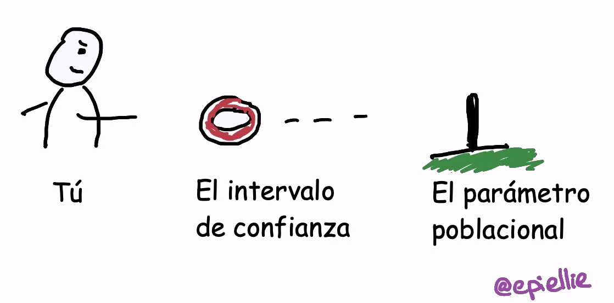
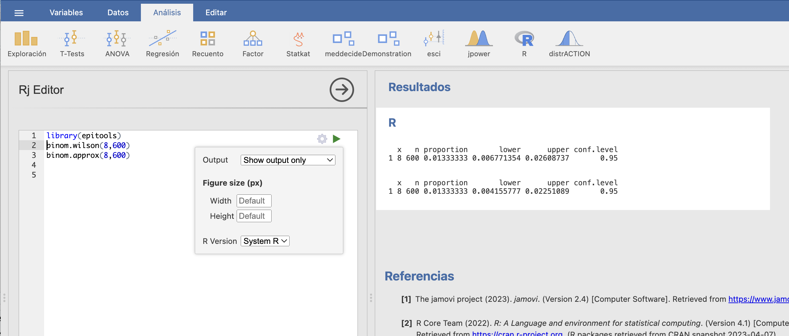
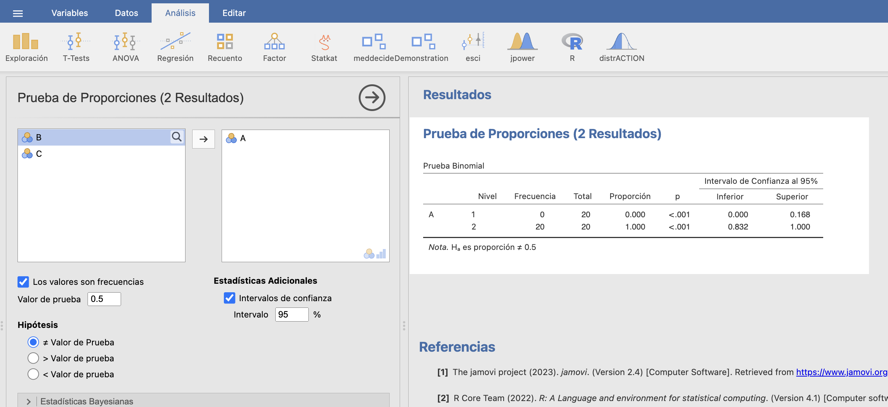

# Intervalos de confianza

Los estimadores de la lección anterior nos permiten hacer una **estimación puntual** del valor de un parámetro de una variable poblacional: es decir, intentar adivinar su valor. Pero, naturalmente, es muy difícil que a partir de una muestra podamos acertar exactamente el valor del parámetro. Las técnicas de la estadística inferencial nos permiten entonces cuantificar la precisión de esta estimación. Esto se hace complementando la estimación puntual con un intervalo alrededor de la misma donde "estemos muy seguros de que cae el valor real del parámetro".


```{r, echo=FALSE, out.width="50%", fig.cap="elEconomista.es, 27/5/2019"}
knitr::include_graphics("INREMDN_files/figure-html/ecoaula.png")
```

Obviamente, no es necesario saber estadística para dar un intervalo donde estemos muy seguros de que cae el valor real del parámetro. Basta dar un intervalo lo bastante grande como para contener todos los valores razonables del parámetro.


```{r, echo=FALSE, out.width="80%"}
knitr::include_graphics("INREMDN_files/figure-html/Garfield.png")
```


De lo que se trata es de dar un intervalo **lo más estrecho posible** donde estemos muy seguros de que cae el valor real del parámetro. El tamaño de este intervalo dependerá:

* De la variabilidad del estimador: cuánta más variabilidad tenga, menos precisa será la estimación. Normalmente, la variabilidad del estimador crece con la desviación típica de la variable poblacional y decrece con el tamaño de las muestras.

* Del **nivel de confianza**, o  **seguridad**: cómo de seguros queremos estar de que el valor real del parámetro pertenece al intervalo que damos. Cuánto más seguros queramos estar, más ancho tendrá que ser el intervalo.


## Definiciones básicas {#sec:IC}

Un **intervalo de confianza del Q%** (para abreviar, un **IC-Q%**) de un parámetro poblacional es un intervalo obtenido aplicando a una muestra aleatoria simple de tamaño $n$ una fórmula que satisface la propiedad siguiente: 

> El intervalo obtenido contiene el valor del parámetro poblacional **el Q% de las veces** que aplicamos la fórmula a muestras aleatorias simples de tamaño $n$ tomadas al azar.


Tener una **confianza del Q%** significa pues que lo calculamos con una fórmula que **acierta el Q% de las veces que la aplicamos**. 

```{block2,type="rmdimportant"}
El Q% de los intervalos de confianza del Q% contienen el valor real del parámetro que quieren estimar.
```


Pero asumimos que en un (100-Q)% de las veces da un intervalo que no contiene el valor del parámetro poblacional, **y no sabemos cuándo sí y cuándo no**. De manera que solo podemos tener una cierta confianza, fruto del optimismo, de que esta fórmula acierta con nuestra muestra. 


```{example}
En un experimento  medimos el porcentaje de aumento de alcohol en sangre a 40 personas después de tomar 4 cañas de cerveza. En el Ejemplo \@ref(exm:alcohol1) calcularemos con los datos obtenidos en este experimento un IC-95% para el porcentaje de aumento medio de alcohol en sangre de una persona después de beber 4 cañas de cerveza. Obtendremos el intervalo [40.53, 41.87].


```

Esto significará que **tenemos un 95% de seguridad** en que el aumento medio de alcohol en sangre de una persona después de beber 4 cañas de cerveza está entre el 40.53% y el 41.87%, porque habremos calculado este intervalo con una fórmula que el 95% de las veces que la aplicamos a muestras aleatorias de tamaño 40  da un intervalo que contiene la media poblacional que queremos estimar. Nosotros somos optimistas y "confiamos" estar dentro de este 95% de aciertos. 

A menudo esto lo escribiremos diciendo que:

> Hay un 95% de probabilidad de que el intervalo [40.53, 41.87] contenga el valor real del aumento medio de alcohol en sangre de una persona después de beber 4 cañas de cerveza.

Pero hay que entender lo que dice esta frase: 

* Por definición, un 95% de los intervalos de confianza del 95% para el aumento medio de alcohol etc. contienen el valor real de este aumento medio.

* [40.53, 41.87] es **un** intervalo de confianza del 95% para el aumento medio de alcohol etc., obtenido a partir de una muestra aleatoria.

* Entonces, [40.53, 41.87] tiene una probabilidad del 95% de contener el valor real del aumento medio de alcohol etc. en el mismo sentido que si un 95% de las personas tienen una determinada característica, y cojo una persona al azar, esta persona tiene un 95% de probabilidad de tener esa característica.

```{block2, type='rmdcaution'}
No confundáis: 

* **Intervalo de referencia del Q% para una variable aleatoria**: Intervalo que contiene **el valor de la variable aleatoria en un individuo** con probabilidad Q%. 

* **Intervalo de confianza del Q% para un parámetro**: Intervalo que contiene **el valor poblacional del parámetro de la variable aleatoria** "con probabilidad" Q%, en el sentido de que lo hemos calculado con una fórmula que da un intervalo que contiene dicho parámetro el Q% de las veces que la aplicamos a una muestra aleatoria.

* **Intervalo de referencia del Q% para un estimador**: Intervalo que contiene **el valor del estimador sobre una muestra aleatoria** con probabilidad Q%. 

```


Por ejemplo:

* Si decimos que un **intervalo de referencia del 95%** para la concentración de una proteína en suero en individuos sanos en g/dl es [11,16], esto  significa 

    * que un 95% de los individuos sanos tienen una concentración de esta proteína en suero entre 11 y 16 g/dl
    
    es decir, 
    
    * que si escogemos al azar un individuo sano, la probabilidad de que su concentración de esta proteína en suero esté entre 11 y 16 g/dl es del 95%.

* Si decimos que un **intervalo de confianza del 95%** para la concentración media de una proteína en suero en individuos sanos tamaño en g/dl es [11,16], esto significa 

    * que este intervalo tiene un 95% de probabilidad de contener la concentración media de esta proteína en suero en individuos sanos tamaño en g/dl, 
    
    en el sentido de que lo hemos obtenido aplicando a una muestra aleatoria de concentraciones de esta proteína en suero en individuos sanos  una fórmula que da un intervalo que contiene la media poblacional un 95% de las veces que la aplicamos a muestras aleatorias del mismo tamaño que la nuestra.
    

* Si decimos que el 95% de las muestras de 100 concentraciones de una determinada proteína en suero en individuos sanos tienen la media muestral entre 11 y 16 g/dl, esto es un **intervalo de referencia del 95% para la media muestral** de muestras de tamaño 100, no un intervalo de confianza para la concentración media poblacional ni un intervalo de referencia para el valor de la concentración en un individuo.


```{block2,type="rmdcaution"}
A menudo calcularéis un intervalo de confianza del Q% para un cierto parámetro $\theta$ de una población, os dará $[a,b]$, y con el poco rigor con el que a veces os expresáis, os será igual decir 

> "el valor real de $\theta$ tiene una probabilidad del Q% de pertenecer a $[a,b]$"

que

> "$[a,b]$ tiene una probabilidad del Q% de contener el valor real de $\theta$"

Pero estas dos frases no dicen exactamente lo mismo, y de hecho la primera es falsa. Fijaos en que, en la primera frase hablamos de la probabilidad de que a $\theta$ le pase algo, y en la segunda de que a $[a,b]$ le pase algo.

La primera frase dice que $\theta$ varía y un Q% de sus valores pertenece a $[a,b]$. Esto es falso. "El valor real de $\theta$" es un número que no varía.  Para nuestra población vale algo concreto, desconocido pero concreto, que pertenecerá o no al intervalo $[a,b]$.

La segunda frase en cambio se puede entender de la manera siguiente. El intervalo $[a,b]$ forma parte de toda la población de intervalos de confianza del Q% para $\theta$ calculados a partir de muestras aleatorias simples de nuestra población. Un Q% de estos intervalos contiene el valor real de $\theta$. Por lo tanto, podemos decir que nuestro intervalo $[a,b]$ tiene una probabilidad del Q% de contener el valor real de $\theta$. Esta interpretación es correcta.

```


```{r, echo=FALSE, out.width="50%", fig.cap="Un intervalo de confianza es como el juego de las anillas: el palo (el parámetro) es fijo, y intentas acertar con la anilla (el intervalo)."}

```


Que un IC-Q% para un parámetro $\theta$ sea $[a,b]$ sirve:

* Para estimar $\theta$ con este margen de confianza: Estamos bastante seguros de que el valor poblacional de $\theta$ está entre $a$ y $b$  (porque la fórmula usada acierta a menudo).

* Para descartar, con este margen de confianza,  que $\theta$ valga cualquier valor concreto fuera de $[a,b]$: Como estamos bastante seguros de que el valor real de $\theta$ está entre $a$ y $b$, también estamos bastante seguros de que es diferente de cualquier valor que nos den menor que $a$ o mayor que $b$.

Por ejemplo: si un IC-95% para la prevalencia $p$ de una determinada enfermedad en una población  va de 0.025 a 0.047:

* Estamos muy ("un 95%") seguros de que $p$ está entre 0.025 y 0.047 (porque un 95% de los IC-95% para $p$ contienen el valor real de $p$).

* Estamos muy  ("un 95%") seguros de que $p$ no vale 0.05 (porque 0.05 no pertenece al intervalo donde estamos muy seguros de que cae el valor real de $p$).

* Pero no estamos muy seguros de que $p$ sea 0.03, por mucho que $0.03\in [0.025,0.047]$: estamos muy seguros de que $p$ está entre 0.025 y 0.047, pero solo eso.


Hay dos tipos de métodos básicos de cálculo de intervalos de confianza a partir de una muestra aleatoria:


* **Paramétricos**: Usando alguna fórmula basada en la distribución muestral del estimador. Se basan en teoremas y solo tiene sentido usarlos si la variable aleatoria y la muestra aleatoria satisfacen (aproximadamente) las hipótesis de los teoremas.

* **No paramétricos**. Los otros. El más popular, y nuestro favorito, es el **bootstrap**:

    * De nuestra muestra, tomamos al azar muchas (miles) muestras aleatorias con reposición del mismo tamaño que nuestra muestra.
    * Calculamos el estimador para cada una de estas muestras.
    * Usamos el vector de resultados para estimar un intervalo de confianza. Por ejemplo, tomamos como IC-95% el intervalo entre los cuantiles 0.025 y 0.975 de este vector.

    El **bootstrap** se puede usar siempre y funciona bien si la muestra es aleatoria, pero se basa en un proceso aleatorio y por lo tanto cada ejecución sobre una misma muestra puede dar un intervalo diferente.

```{block2,type="rmdnote"}
El **bootstrap** es una herramienta muy poderosa para calcular intervalos de confianza y, en general, para estimar la distribución muestral de un estadístico. Tanto, que en la práctica ya empieza a sustituir los métodos paramétricos. Pero no hace milagros: si la muestra es pequeña o muy poco representativa de la población, un intervalo de confianza calculado con el bootstrap sirve de tan poco como uno calculado con un método paramétrico.
```


```{r, echo=FALSE,fig.cap='En inglés, la *bootstrap* es la trabilla de la bota, y el método del *bootstrap* refiere a la expresión inglesa "elevarse tirando de las trabillas".'}

```


## Un ejemplo: IC-95% para la media de una variable aleatoria normal

Una de las fórmulas más conocidas para intervalos de confianza  es la siguiente:

```{block2, type="rmdimportant"}
Si $X$ es $N(\mu,\sigma)$ y tenemos una muestra aleatoria simple de tamaño $n$, media muestral $\overline{X}$ y desviación típica muestral $\widetilde{S}_X$, un IC-95% para $\mu$ es
$$
\Bigg[\overline{X}-t_{n-1,0.975}\cdot \frac{\widetilde{S}_X}{\sqrt{n}},\ \overline{X}+t_{n-1,0.975}\cdot\frac{\widetilde{S}_X}{\sqrt{n}}\Bigg]
$$
donde $t_{n-1,0.975}$ denota el 0.975-cuantil de la distribución t de Student $t_{n-1}$. 
```

Este intervalo a veces lo escribiremos
$$
\overline{X}\pm t_{n-1,0.975}\cdot \frac{\widetilde{S}_X}{\sqrt{n}}
$$
para recalcar que estamos estimando $\mu$ por medio de $\overline{X}$ más o menos un cierto error.


```{block2,type="rmdcaution"}
A algunos de vosotros os habrán explicado en Bachillerato, o encontraréis en libros que consultéis, una fórmula para el IC-95% para $\mu$ similar a esta, pero cambiando la $\widetilde{S}_X$ por $\sigma$ y el $t_{n-1,0.975}$ por $z_{0.975}$, el 0.975-cuantil de la normal estándar. Esta otra fórmula solo se puede usar si se conoce la desviación típica poblacional $\sigma$, lo que, en la práctica, nunca pasará. Por lo tanto, por favor, olvidadla.
```

¿Cómo podemos estar seguros de que un 95% de las veces que apliquemos esta fórmula a una muestra aleatoria simple el intervalo que obtengamos contendrá el valor real de la media? 

Vamos a explicar de dónde sale esta fórmula, puesto que es un paradigma de cómo se obtienen la mayoría de las fórmulas paramétricas para intervalos de confianza. Quien se la quiera tomar como dogma de fe, que salte directamente al Ejemplo \@ref(exm:experimentot).

Supongamos pues que $X$ es $N(\mu,\sigma)$ y que tenemos una muestra aleatoria simple de tamaño $n$, media muestral $\overline{X}$ y desviación típica muestral $\widetilde{S}_X$. En esta situación, sabemos que 
$$
T=\frac{\overline{X}-\mu}{\widetilde{S}_{X}/\sqrt{n}}
$$
tiene distribución t de Student con $n-1$ grados de libertad, $t_{n-1}$.

Si podemos encontrar $A,B\in \mathbb{R}$ tales que
$$
P(A\leqslant T\leqslant B)=0.95,
$$
entonces:
$$
\begin{array}{rl}
0.95\!\!\!\! & =P\Bigg(A\leqslant   \dfrac{\overline{X}-\mu}{\widetilde{S}_{X}/\sqrt{n}}\leqslant  B\Bigg)\\[2ex]
& =P\Bigg(A\cdot \dfrac{\widetilde{S}_X}{\sqrt{n}}\leqslant  \overline{X}-\mu \leqslant  B\cdot \dfrac{\widetilde{S}_X}{\sqrt{n}}\Bigg)\\[2ex]
& =P\Bigg(-\overline{X}+A\cdot \dfrac{\widetilde{S}_X}{\sqrt{n}}\leqslant  -\mu \leqslant  -\overline{X}+B\cdot \dfrac{\widetilde{S}_X}{\sqrt{n}}\Bigg)\\[2ex]
& =P\Bigg(\overline{X}-B\cdot \dfrac{\widetilde{S}_X}{\sqrt{n}}\leqslant  \mu \leqslant  \overline{X}-A\cdot \dfrac{\widetilde{S}_X}{\sqrt{n}}\Bigg)
\end{array}
$$


Como $P(A\leqslant  T\leqslant  B)=0.95$ significa que para el 95% de las muestras aleatorias simples de tamaño $n$ el valor de $T$ está  entre $A$ y $B$, 
$$
P\Bigg(\overline{X}-B\cdot \frac{\widetilde{S}_X}{\sqrt{n}}\leqslant  \mu \leqslant  \overline{X}-A\cdot \frac{\widetilde{S}_X}{\sqrt{n}}\Bigg)=0.95
$$
significará que para el 95% de las muestras aleatorias simples de tamaño $n$ la $\mu$ cae dentro del intervalo
$$
\Bigg[\overline{X}-B\cdot \frac{\widetilde{S}_X}{\sqrt{n}},\ \overline{X}-A\cdot \frac{\widetilde{S}_X}{\sqrt{n}}\Bigg]
$$
Por lo tanto, ¡esto será un IC-95% para $\mu$!

Nos falta encontrar los $A,B$ tales que $P(A\leqslant T\leqslant B)=0.95$. Para encontrarlos, usaremos **cuantiles de la distribución de $T$**. Recordemos que, por definición de cuantil, 
$$
P(T\leqslant t_{n-1,0.975})=0.975
$$
y por la simetría de la $t$ de Student,
$$
P(T\leqslant  -t_{n-1,0.975})=P(T\geqslant t_{n-1,0.975})=0.025
$$
Por tanto:
$$
\begin{array}{l}
P(-t_{n-1,0.975}\leqslant  T\leqslant  t_{n-1,0.975})\\
\quad =P(T\leqslant  t_{n-1,0.975})-P(T\leqslant  -t_{n-1,0.975})\\
\quad =0.975-0.025=0.95
\end{array}
$$

```{r,echo=FALSE,out.width="60%"}
n=10
x <- seq(-3.2,3.2,.05)
plot(x,dt(x,n),type="l",xlab="",ylab="",xlim=c(-3.2,3.2),ylim=c(0,.4),bty="n",lwd=2,xaxt="n",yaxt="n")
abline(h=0)
polysection <- function(a,b,col="blue",n=11){
  dx <- seq(a,b,length.out=n)
  polygon(c(a,dx,b),c(0,dt(dx,n),0),border=NA,col=col)
}

for(i in 2:3){
  polysection(i,i+1,col="light blue")
}
points(x,dt(x,n),type="l",lwd=2)
abline(h=0)

for(i in (-4):(-3)){
  polysection(i,i+1,col="light blue")
}
points(x,dt(x,n),type="l",lwd=2)


axis(1,at=c(-2,2), labels=c(expression(-t["n-1,0.975"]),expression(t["n-1,0.975"])),cex.axis=1.2,tick=TRUE,line = -0.6)
arrows(2.5,dt(2.5,10)/2,3,0.1,lwd=1)
arrows(-2.5,dt(-2.5,10)/2,-3,0.1,lwd=1)
#segments(2,0,2,dt(2,n))
#segments(-2,0,-2,dt(-2,n))
text(3,0.12,expression(0.025))
text(-3,0.12,expression(0.025))
text(0,0.12,expression(0.95))
```


Así pues, podemos tomar
$$
A=-t_{n-1,0.975},\quad B=t_{n-1,0.975}
$$
y obtenemos el IC-95% para $\mu$ anunciado:
$$
\Bigg[\overline{X}-t_{n-1,0.975}\cdot \frac{\widetilde{S}_X}{\sqrt{n}},\ \overline{X}+t_{n-1,0.975}\cdot\frac{\widetilde{S}_X}{\sqrt{n}}\Bigg]
$$


```{example,experimentot}
El ítem "Testing hypothesis" del módulo **Demonstration** de JAMOVI permite, entre otras cosas, realizar experimentos con la fórmula anterior para estudiar su frecuencia de "aciertos", en el sentido de que el intervalo que produce al aplicarla a una muestra contiene la $\mu$. Aquí vamos a llevar a cabo explícitamente un experimento en el mismo sentido.  En el bloque de código de `R` siguiente, que podéis ejecutar en el editor de `R` de JAMOVI: 
  

```
  
* Generamos al azar una `Población` de 10^7^ "individuos" que siguen una ley normal estándar y calculamos la media `mu` de esta población.

* Definimos una función `IC` que calcula el IC-95% para la media $\mu$ con la fórmula anterior. 

* Tomamos, al azar, 200 muestras aleatorias simples de tamaño 50 de nuestra población y les aplicamos esta función. Obtenemos una matriz `M` de 200 columnas formadas por los dos extremos de los intervalos.

* Dibujamos los intervalos de confianza en un gráfico como segmentos horizontales, en gris los que contienen el valor "poblacional" de `mu` y en rojo los que no lo contienen. La recta vertical marca el valor de `mu`.


```{r,echo=FALSE}
set.seed(1200)
```

```{r}
Población=rnorm(10^7)
mu=mean(Población)
mu
```

```{r,results="hide"}
N=200 #Número de muestras
n=50  #Tamaño de las muestras
IC=function(x){
  n=length(x)
  mean(x)+qt(0.975,n-1)*sd(x)/sqrt(n)*c(-1,1)}
M=replicate(N,IC(sample(Población,n,replace=TRUE)))
plot(1,type="n",xlim=c(-0.8,0.8),ylim=c(0,200),
  xlab="Valores",ylab="Repeticiones", main="200 IC-95%")
seg.int=function(i){color="grey";
  if((mu<M[1,i]) | (mu>M[2,i])){color="red"}
  segments(M[1,i],i,M[2,i],i,col=color,lwd=2)}
sapply(1:N,FUN=seg.int)
abline(v=mu,lwd=2)
```

```{r,include=FALSE}
Encerts=length(which(mu>=M[1,] & mu<=M[2,]))
```


Si contáis los intervalos rojos, veréis que hemos fallado `r 200-Encerts` veces y por lo tanto hemos acertado `r Encerts` veces, es decir, en un `r round(100*Encerts/200,1)`% de los intervalos. Es aproximadamente lo que esperábamos. Si lo probáis en casa, ejecutando el código de R que hemos dado, obtendréis  otros resultados, a veces mejores, a veces peores. Es lo que tiene la aleatoriedad. Podéis cambiar el valor de `N` (número de muestras) o `n`(el tamaño de las muestras) para ver qué pasa si tomáis más muestras o muestras más grandes. (Si queréis obtener exactamente nuestro gráfico, justo antes de `Población=rnorm(10^7)` ejecutad `set.seed(1200)`.)

Queremos remarcar que, en nuestra simulación, de los 200 IC-95% que hemos calculado, `r 200-Encerts` no han contenido el valor real de $\mu$. Un intervalo de confianza no siempre acierta.

```{block2, type='rmdcaution'}
De media, un IC-Q% **NO contiene el valor real del parámetro en un (100-Q)%** de las ocasiones.
```

Por ejemplo, de media, un 5% de las veces que calculemos un IC-95%, el parámetro poblacional no pertenecerá al intervalo obtenido. 

Por lo tanto, si calculamos $n$ IC-95% sobre muestras aleatorias simples independientes, el número de veces en que el intervalo resultante  no contendrá el parámetro poblacional seguirá una distribución binomial $B(n,0.05)$. El gráfico siguiente representa el valor de $P(X\geqslant 1)$ para una variable aleatoria $X$ de tipo $B(n,0.05)$, para $n=0,...,100$, y por lo tanto la probabilidad de que si calculamos $n$ IC-95% sobre muestras aleatorias simples independientes, al menos uno de ellos no contenga el parámetro poblacional deseado.


```{r,echo=FALSE}
plot(1-dbinom(0,0:100,0.05),pch=20,xlab="n",ylab="Probabilitat",
     main="Probabilidad de algún éxito en una B(n,0.05)")
```

Esto es un problema grave en artículos científicos donde se calculen intervalos de confianza para muchos parámetros. De media, uno de cada veinte IC-95% que se calculan no contiene el valor real del parámetro que se pretende estimar. Y no se puede hacer nada al respecto, forma parte de la definición. Si queréis bajar este porcentaje de errores, hay que aumentar el nivel de confianza y los intervalos serán más anchos y por lo tanto menos útiles.

```{example, alcohol1}
Volvamos al experimento en el que medimos el porcentaje de aumento de alcohol en sangre a 40 personas después de tomar 4 cañas de cerveza. La media y la desviación típica muestral de estos porcentajes de incremento fueron
$$
\overline{x}=41.2,\quad \widetilde{s}=2.1.
$$


```
Para calcular un IC-95% para el porcentaje medio de aumento de alcohol en sangre después de tomar 4 cañas de cerveza, $\mu$ para abreviar, supondremos que la variable aleatoria de interés (de la que queremos estimar la media)  $X$, que es "Tomamos una persona, bebe 4 cañas de cerveza y  medimos el porcentaje de aumento de alcohol en sangre tras beberlas",  es **normal** y que la muestra que hemos tomado de esta variable es **aleatoria simple**.


Entonces, como $t_{n-1,0.975}=`r round(qt(0.975,39),4)`$, un IC-95% para $\mu$ es
$$
41.2\pm 2.0227\cdot \frac{2.1}{\sqrt{40}}\Rightarrow 41.2\pm 0.67\Rightarrow [40.53, 41.87]
$$

Por lo tanto, estimamos con un 95% de confianza que el porcentaje medio de aumento de alcohol en sangre después de tomar 4 cañas de cerveza está entre el 40.5% y el 41.9%, o que es del 41.2% más menos 0.7 puntos porcentuales.

Para calcular el intervalo anterior hemos supuesto que la variable poblacional "Porcentaje de aumento de alcohol en sangre después de tomar 4 cañas de cerveza" sigue una distribución normal. ¿Y si no fuera normal? 

* En este caso, como el tamaño de la muestra $n=40$ es lo bastante grande,  el Teorema \@ref(thm:ICmu) de la próxima sección nos dice que el intervalo obtenido sigue siendo (aproximadamente) un intervalo de confianza del 95% para $\mu$.

* Si $n$ fuera pequeño y $X$ muy diferente de una normal, no se puede usar esta fórmula y habría que buscarse la vida (por ejemplo, usar el método bootstrap).

También hemos supuesto que era una muestra aleatoria simple. ¿Y si no lo es?

* Si es aleatoria, como la población sobre la que tenemos definida nuestra variable aleatoria, las personas que pueden tomar 4 cañas de cerveza, es muy grande, a efectos prácticos la podemos considerar simple.

* Pero seguro que no es aleatoria, sino oportunista. En este caso, no hemos sacado 40 personas por sorteo de la lista de toda la población mundial, ni siquiera de la de Mallorca, sino que hemos buscado voluntarios. Entonces, no podemos hacer nada para salvar la fórmula, y su validez depende de si la muestra de personas usada puede pasar por aleatoria o no. 


## Intervalo de confianza para la media basado en la t de Student

```{block2,type="rmdcaution"}
A partir de ahora, para evitar ambigüedades, en las fórmulas expresaremos el nivel de confianza de los intervalos en tanto por uno, no en tanto por ciento; es decir, como una proporción en vez de como un porcentaje. Por lo tanto, hablaremos de **intervalos de confianza de nivel de confianza $q$** (**IC-$q$**), con $q$ entre 0 y 1, en vez de intervalos de confianza del Q% con Q=100q. Con estas notaciones, por ejemplo, los intervalos de confianza del 95% serán intervalos de confianza de nivel de confianza 0.95, IC-0.95.
```

El mismo argumento de la sección anterior, cambiando 0.95 por $q$, da:

```{theorem}
Si $X$ es $N(\mu,\sigma)$ y tomamos una muestra aleatoria simple de tamaño $n$, media muestral $\overline{X}$ y desviación típica muestral $\widetilde{S}_X$, un IC-$q$ para $\mu$ es
$$
\overline{X}\pm t_{n-1,(1+q)/2}\cdot \frac{\widetilde{S}_X}{\sqrt{n}}
$$

```

La fórmula de la sección anterior es un caso particular de esta, porque en los IC-0.95, $q=0.95$ y por lo tanto $(1+q)/2=1.95/2=0.975$. 

Más en general:

```{theorem, ICmu}
Si $X$ es una variable aleatoria cualquiera de media poblacional $\mu$ y tomamos una muestra aleatoria simple de $X$ de tamaño $n$ grande (digamos, de 40 o más elementos), entonces, un IC-$q$ para $\mu$ es aproximadamente
$$
\overline{X}\pm t_{n-1,(1+q)/2}\cdot \frac{\widetilde{S}_X}{\sqrt{n}}
$$


```

La aproximación del teorema anterior es mejor cuanto mayor sea $n$ o cuanto más próxima a una normal sea la variable poblacional $X$.

En resumen:

```{block2, type='rmdimportant'}
Podemos usar la fórmula para el IC-$q$ para la media poblacional basada en la t de Student
$$
\overline{X}\pm t_{n-1,(1+q)/2}\cdot \frac{\widetilde{S}_X}{\sqrt{n}}
$$
si la variable poblacional es normal o si la muestra aleatoria simple es grande.
```

Observad que la estructura del IC-$q$ para $\mu$ dado por esta fórmula es

> estimador $\pm$ ($\frac{1+q}{2}$-cuantil de la distr. muestral)$\times$(error típico de la muestra)

Esta estructura es muy típica (pero no universal: no creáis que todos los intervalos de confianza paramétricos tienen esta forma) y cumple que:

* El intervalo de confianza está centrado en la estimación puntual.

* La "probabilidad de equivocarnos" se reparte por igual a los dos lados del intervalo: de media, en una fracción $(1-q)/2$ de las veces que se aplica la fórmula, el valor real del parámetro cae a la izquierda del extremo inferior y en otra fracción $(1-q)/2$ de estas ocasiones cae a la derecha del extremo superior.

```{block2,type="rmdimportant"}
Para una misma muestra y una misma fórmula (paramétrica) para calcular el intervalo de confianza, si el nivel de confianza crece, el intervalo se ensancha.
```

Esto es general, **para todos los intervalos de confianza paramétricos**. El motivo intuitivo es que, para estar más seguros de que un intervalo contiene un valor, el intervalo tiene que ser más ancho. En un intervalo de confianza con la estructura descrita hace un momento, el motivo matemático es que a mayor $q$, mayor $(1+q)/2$-cuantil de la distribución muestral.

Por ejemplo, en el Ejemplo \@ref(exm:alcohol1), teníamos $n=40$, $\overline{x}=41.2$ y $\widetilde{s}=2.1$:

* El IC-95% tiene $q=0.95$, por lo tanto $t_{n-1,(1+q)/2}=t_{39,0.975}=2.02$, y daba 
$$
41.2\pm 2.02\cdot \frac{2.1}{\sqrt{40}}\Rightarrow 41.2\pm 0.67
$$

* El IC-99% tiene $q=0.99$, por lo tanto $t_{n-1,(1+q)/2}=t_{39,0.995}=2.71$, y da
$$
41.2\pm 2.71\cdot \frac{2.1}{\sqrt{40}}\Rightarrow 41.2\pm 0.9
$$
más ancho

* Pero si cambiamos de muestra (o de fórmula, si hay más de una) para calcular el intervalo de confianza, puede pasar cualquier cosa.


El intervalo de confianza para una media usando la fórmula basada en la t de Student se puede calcular con JAMOVI marcando las casillas *Diferencia de medias* e *Intervalo de confianza* (y eligiendo el nivel de confianza) en **T-tests/Prueba T en una muestra**.

```{example,tempsIC}
Queremos calcular un intervalo de confianza del 95% para la temperatura media de las personas. Para ello, vamos a usar unos datos recogidos por P.A. Mackowiak, S. S. Wasserman y M.M. Levine en un [estudio de 1992](https://jamanetwork.com/journals/jama/article-abstract/400116), en el que tomaron la temperatura a una muestra transversal de 230 personas (114 hombres y 116 mujeres). Tenemos guardadas estas temperaturas en la tabla **Temperaturas.txt** que podéis descargar de https://raw.githubusercontent.com/AprendeR-UIB/INREMDN/master/Dades/Temperaturas.txt.

```

Tras descargarla, la importamos abriéndola con *Importar especial*. Seleccionamos **T-tests/Prueba T en una muestra**, elegimos la variable `Temperatura` como "variable dependiente" y marcamos *Diferencia de medias* e *Intervalo de confianza* (hemos marcado también *Descriptivas* para calcular algunos estadísticos de la muestra). Obtenemos la pantalla siguiente:


```{r jamoviIC1,echo=FALSE,out.width="100%"}

```

Por ahora nos fijamos solo en las tres últimas columnas de la tabla superior: el valor "Diferencia de medias" es la media de la muestra (su "diferencia" con 0, que es el *Valor de prueba* en la columna de la izquierda)  y los extremos inferior y superior del intervalo de confianza para la media poblacional del nivel de confianza que hayamos escogdo. La media muestral ha dado 36.8^o^ y el intervalo de confianza del 95% va de 36.8^o^ a 36.9^o^. Podéis comprobar que coincide (salvo errores de redondeo) con lo que da la fórmula que hemos explicado: al marcar la casilla *Descriptivas* hemos obtenido el tamaño de la muestra N, la media y la desviación típica (DE, desviación estándar) y podéis calcular que $z_{229,0.975}=1.97$, y tenéis todos los datos necesarios para usar la fórmula.


## Intervalos de confianza para proporciones 

Supongamos que tenemos una variable Bernoulli $X$ con probabilidad poblacional de éxito $p_X$ desconocida. Queremos calcular un intervalo de confianza para $p_X$.  Para hacerlo, tomamos una muestra aleatoria simple de $X$ de tamaño $n$, con número de éxitos $S$ y por tanto proporción muestral de éxitos $\widehat{p}_{X}=S/n$.

Explicaremos los tres métodos más populares para calcular este intervalo de confianza:

```{block2, type="rmdimportant"}
* El **método exacto de Clopper-Pearson**, que se puede aplicar siempre pero suele dar intervalos de confianza más anchos de lo necesario (o dicho de otra manera, de "más confianza" de la que pedíamos).

* El **método aproximado de Wilson**, que se puede usar cuando la muestra es grande, digamos que de tamaño 40 o más. Su fórmula se basa en que, por el Teorema Central del Límite, la proporción muestral de muestras aleatorias simples grandes sigue una distribución aproximadamente normal. 

* El **método aproximado de Laplace**, que es una simplificación del método de Wilson, pero solo se puede usar cuando la muestra es bastante más grande, digamos que de tamaño 100 o más, y la proporción muestral $\widehat{p}_{X}$ no es muy próxima ni a 0 ni a 1. Es el método más clásico y conocido.

Los tres métodos solo valen para muestras aleatorias simples, o al menos que puedan pasar por aleatorias simples.

```


#### Método "exacto" de Clopper-Pearson {-}

Este método se basa en que el número de éxitos $S$ en muestras aleatorias simples de tamaño $n$ de $X$ tiene una distribución conocida: es binomial $B(n,p_X)$. Razonando de manera similar a cómo obteníamos el intervalo para $\mu$ basado en la t de Student se llega a una fórmula de un intervalo de confianza para $p_X$ que os vamos a ahorrar, ya que **nunca** se aplica "a mano".

Este método tiene la ventaja de que se puede usar siempre, independientemente del tamaño de la muestra, y es "exacto" porque se basa en la distribución exacta de $S$.  Pero tiene algunos inconvenientes:

* Como los números de éxitos en muestras de tamaño fijo avanzan a saltos (0, 1, 2, 3,...), suele dar intervalos de confianza más anchos de lo necesario.
* Los intervalos que produce no son de la forma "probabilidad muestral $\pm$ algo".
* Se necesita un ordenador para calcularlo, no basta una calculadora.

Con JAMOVI, se calcula en **Frecuencias/2 Resultados. Prueba binomial**. 

```{example, ICambJAM}
En una muestra de 600 personas de una población, ha habido 8 con una determinada enfermedad X. Queremos calcular un intervalo de confianza del 95% para la prevalencia de esta enfermedad.
```

Para ello, entramos en una variable las frecuencias de éxitos (enfermos) y fracasos (sanos), 8 y 592, respectivamente. 


```{r jamoviIC2,echo=FALSE,out.width="100%"}

```


Luego, en **Frecuencias/2 Resultados. Prueba binomial** seleccionamos esta variable y marcamos las casillas *Los valores son frecuencias* e *Intervalos de confianza* especificando el nivel de confianza deseado:


```{r jamoviIC3,echo=FALSE,out.width="100%"}
knitr::include_graphics("INREMDN_files/figure-html/JAMOVI.IC.3.png")
```

De esta manera obtenemos los intervalos de confianza de Clopper-Pearson para las proporciones poblacionales tanto de éxitos como de fracasos. En nuestro ejemplo, el de los éxitos es el que queremos: estimamos con un 95% de confianza que la prevalencia de la enfermedad está entre el 0.58% y el 2.61%.

Si en vez de tener las frecuencias de enfermos y sanos dispusiéramos de una variable con esta información para cada sujeto de la muestra, seleccionaríamos esta variable y no marcaríamos la casilla *Los valores son frecuencias*.


#### Método aproximado de Wilson {-}

Supongamos ahora que tomamos una muestra aleatoria simple de $X$ de tamaño $n$ grande, pongamos $n\geqslant 40$, y proporción muestral de éxitos $\widehat{p}_{X}$. En estas condiciones, por el Teorema Central del Límite, sabemos que la distribución de
$$
Z=\dfrac{\widehat{p}_{X}-p_X}
{\sqrt{\frac{p_X(1-p_X)}{n}}}
$$
es aproximadamente la de una $N(0,1)$. Por lo tanto
$$
P\Big(-z_{(1+q)/2}\leqslant \dfrac{\widehat{p}_{X}-p_X}
{\sqrt{\frac{p_X(1-p_X)}{n}}}\leqslant z_{(1+q)/2}\Big)\approx q
$$

Despejando $p_X$ como en el cálculo del IC-95% para la $\mu$ usando la t de Student, obtenemos el resultado siguiente (que no hay que saber, tranquilos):

```{theorem}
Si $n$ es grande, un IC-$q$ para $p_X$ es aproximadamente: 
$$
\frac{\widehat{p}_{X}+\frac{z_{(1+q)/{2}}^2}{2n}}{1+\frac{z_{(1+q)/{2}}^2}{n}}\pm z_{(1+q)/{2}}\cdot \frac{\sqrt{\frac{\widehat{p}_{X}(1-\widehat{p}_{X})}{n}+\frac{z_{(1+q)/{2}}^2}{4n^2}}}{1+\frac{z_{(1+q)/{2}}^2}{n}}
$$
  

```


Fijaos en que:

* Este método no se puede usar con muestras de cualquier tamaño, han de ser lo bastante  grandes como para poder invocar el Teorema Central del Límite.
* El centro del intervalo no es $\widehat{p}_X$.
* Se basa en la aproximación a la normal dada por el Teorema Central del Límite, y por lo tanto el intervalo resultante es un intervalo de confianza "aproximado", no exacto como el de Clopper-Pearson. Esto no es un gran problema, porque total, la muestra usada seguramente tampoco será aleatoria simple. 


#### Fórmula de Laplace {-}

Supongamos finalmente que tomamos una muestra aleatoria simple de $X$ de tamaño $n$ todavía más grande y que el valor de $\widehat{p}_{X}$ no es muy próximo ni a 0 ni a 1.  Para fijar unas condiciones suficientes, supongamos que:

* $n\geqslant 100$.
* Tanto el número de éxitos, $S$, como el número de fracasos, $n-S$, en la muestra son $\geqslant 10$.


En este caso, en la fórmula del intervalo de Wilson los términos $z_{(1+q)/{2}}^2/n$ son despreciablemente pequeños comparados con los otros. Si los igualamos a  0, obtenemos la fórmula siguiente:

```{theorem}
En las condiciones explicadas, un IC-$q$ para $p_X$ es aproximadamente
$$
\widehat{p}_{X}\pm z_{(q+1)/2}\sqrt{\frac{\widehat{p}_{X}
(1-\widehat{p}_{X})}{n}}
$$


```

Esta fórmula es la más popular, y forma parte de la "cultura general" de un científico. De hecho, tiene más de 200 años y precede en más de 100 años a los otros dos métodos. Además, tiene la forma familiar "estimador $\pm$ cuantil$\times$error típico".

 
```{block2,type="rmdmercifulgod"}
Os tenéis que saber la fórmula de Laplace, no hace falta saber las fórmulas de los otros dos métodos. Pero sí cuándo se pueden usar y cuándo no y sus ventajas e inconvenientes.

```


JAMOVI por ahora no incorpora el cálculo de los intervalos de Wilson y de Laplace, pero los podéis calcular en la ventana de su editor de `R` con las funciones `binom.wilson` y `binom.approx` del paquete **epitools**, respectivamente (y ya que estamos, el intervalo de Clopper-Pearson se obtiene con la función `binom.exact`). La sintaxis de estas funciones es siempre la misma:

```{r, eval=FALSE}
binom.lo-que-sea(x,n,conf.level)
```

donde `x` y `n` representan, respectivamente, el número de éxitos y el tamaño de la muestra, y `conf.level` es nuestra $q$, el nivel de confianza en tanto por uno. El valor por defecto de `conf.level` es 0.95, por lo que no hace falta especificarlo si queréis calcular un IC-95%. El intervalo que se obtiene tiene como extremo inferior el valor `lower` y extremo superior el valor `upper`.


Así, siguiendo con el Ejemplo \@ref(exm:ICambJAM), para calcular los intervalos de confianza de Wilson y de Laplace del 95% para la prevalencia de la enfermedad ejecutaríamos en **R/Rj Editor** (tras elegir en la ruedecita de opciones de la esquina superior derecha *System R*):


```{r jamoviIC4,echo=FALSE,out.width="100%"}

```

Así que, en resumen, los IC-95% que hemos obtenido son:

* Clopper-Pearson: [0.0058,0.0261]
* Wilson: [0.0068,0.0261] 
* Laplace: [0.0042,0.0225] 

¿Con cuál nos quedamos?

```{block2,type="rmdromans"}
Cuando podemos calcular más de un intervalo de confianza para $p_X$, ¿cuál calculamos?


De entrada hay que advertir que si podemos calcular más de un intervalo, seguramente los que podamos calcular darán resultados muy parecidos. Además, recordad que las tres fórmulas solo nos dan "un nivel de confianza $q$" si se aplican a muestras aleatorias simples, y nuestras muestras casi siempre serán oportunistas, en cuyo caso, si nos ponemos tiquismiquis, no podemos aplicar ninguna. Ni hacer nada de estadística inferencial.

Solo un consejo: Si podéis usar la fórmula de Laplace, usadla. Todo el mundo lo conoce, forma parte de la cultura general del científico, y da un intervalo centrado en la proporción muestral.
```


```{example}
En una muestra de 20 pacientes operados de cáncer de próstata con una nueva técnica, ninguno desarrolló complicaciones importantes en las 24 horas siguientes a la operación.
¿Cuál sería un IC-95% para la proporción de pacientes operados con esta  técnica nueva que desarrollan complicaciones importantes en las 24 horas siguientes a la operación?


```

Para calcularlo solo podemos usar el método de Clopper-Pearson, y este es uno de los pocos casos en que este intervalo tiene una expresión analítica sencilla. Si en una muestra aleatoria simple de tamaño $n$ de una variable $Be(p_X)$ obtenemos 0 éxitos, el IC-$q$ de Clopper-Pearson para $p_X$ es 
$$
\Big[0,1-\Big(\frac{1-q}{2}\Big)^{1/n}\Big]
$$
que, si $q=0.95$, queda
$$
[0,1-0.025^{1/n}].
$$
En nuestro caso, $n=20$, da el intervalo [0,0.1684]. Por lo tanto, estimamos con un 95% de confianza que menos del 16.84% de los pacientes operados con esta  técnica nueva desarrollan complicaciones importantes en las 24 horas siguientes a la operación.

Con JAMOVI, tras entrar 0 y 20 en la variable A:


```{r jamoviIC5,echo=FALSE,out.width="100%"}

```


Cuando se tiene que calcular "a mano" un intervalo de confianza del 95% para una probabilidad $p_X$ a partir de una muestra aleatoria simple donde no ha habido ningún éxito, a menudo se usa la regla siguiente:

> **Regla del 3:** Cuando en una muestra aleatoria simple de tamaño $n$ de una variable aleatoria de Bernoulli de parámetro $p_X$ no encontramos ningún éxito, un IC-95% para $p_X$ va, aproximadamente, de 0 a $3/n$.

Con esta regla, en nuestro ejemplo con $n=20$ obtendríamos el intervalo [0,3/20]=[0,0.15], no muy lejos del [0,0.1684] que hemos obtenido. 

Para ver cómo la regla del 3 aproxima el intervalo de Clopper-Pearson, el gráfico siguiente muestra los valores $3/n$ y el extremo superior del IC-95% de Clopper-Pearson a partir de una muestra de tamaño $n$ con 0 éxitos:

```{r,echo=FALSE}
library(epitools)
f=function(n){binom.exact(0,n)$upper}
plot(1:100,sapply(1:100,f),pch=20,cex=0.7,xlab="n",ylab="Extremo superior",
main="Extremo superior de un IC-95% en caso de 0 éxitos")
curve(3/x,col="red",lwd=2,add=TRUE)
legend("topright",lty=c(NA,1),pch=c(20,NA),
legend=c("Clopper-Pearson","Regla del 3"),col=c("black","red"),cex=0.7)
```

Si la muestra hubiera sido mayor, pongamos de 50 pacientes y de nuevo 0 complicaciones graves, también podríamos usar el método de Wilson.  Calculémoslo con R:

```{r}
binom.wilson(0,50)
```

Da el intervalo  [0,0.0713]. El método de Clopper-Pearson da en este caso
```{r}
binom.exact(0,50)
```

y la regla del 3 da [0,0.06]. 

El gráfico siguiente muestra los valores $3/n$ y los extremos superiores de los IC-95% de Clopper-Pearson y de Wilson a partir de una muestra de tamaño $n$ ($n\geqslant 40$ para los intervalos de confianza de Wilson) con 0 éxitos:

```{r, echo=FALSE}
f=function(n){binom.exact(0,n)$upper}
plot(1:100,sapply(1:100,f),pch=20,cex=0.5,xlab="n",ylab="Extremo superior",
main="Extremo superior de un IC-95% en caso de 0 éxitos")
curve(3/x,col="red",lwd=1.5,add=TRUE)
points(40:100,3.84/(40:100+3.84),pch=20,cex=0.5,col="blue")
legend("topright",lty=c(NA,NA,1),pch=c(20,20,NA),
legend=c("Clopper-Pearson","Wilson","Regla del 3"),col=c("black","blue","red"),cex=0.7)
```

Los extremos superiores de los intervalos de Clopper-Pearson y Wilson se superponen en este último gráfico.

```{block2,type="rmdcaution"}
Aunque la muestra de pacientes hubiera sido enorme, yo qué sé, de 30000 pacientes, con 0 casos de complicaciones graves no se puede usar la fórmula de Laplace. De hecho, si la aplicáis con 0 éxitos obtenéis el interval [0,0]. Comprobadlo.
```

```{example} 
En un ensayo de un tratamiento de quimioterapia, en una muestra de 100 pacientes tratados, 25 desarrollaron cáncer testicular secundario. ¿Cuál es un IC-95% para la proporción de pacientes tratados con esta quimioterapia que desarrollan cáncer testicular?

```

En este caso podemos usar los tres métodos.

* Clopper-Pearson, porque se puede usar siempre.
* Wilson, porque $n=100\geqslant 40$.
* Laplace, porque $n\geqslant 100$, $S=25\geqslant 10$ y $n-S=75\geqslant 10$.

Vamos a aplicar a mano la fórmula de Laplace, que es la única que es sensato calcular a mano (y es la que os recomendamos usar si podéis). Tenemos que $\widehat{p}_{X}=25/100=0.25$ y $z_{0.975}=1.96$. Da:
$$
0.25\pm 1.96\sqrt{\frac{0.25\cdot 0.75}{100}}=0.25\pm 0.085\Rightarrow [0.165, 0.335]
$$
Concluimos, con un nivel de confianza del 95%, que entre aproximadamente un 16.5% y un 33.5% de los pacientes tratados con esta quimioterapia desarrollan cáncer testicular. En este caso podríamos decir que estimamos, con un nivel de confianza del 95%, que el porcentaje de pacientes tratados con esta quimioterapia  que desarrollan cáncer testicular es del 25% más o menos 8.5 puntos porcentuales.

Por si os interesan:

* El intervalo de Clopper-Pearson da 
```{r}
binom.exact(25,100)
```

* El intervalo de Wilson da 
```{r}
binom.wilson(25,100)
```

Ya que estamos, calculamos el intervalo de Laplace con R:
```{r}
binom.approx(25,100)
```
Da lo mismo que a mano.


Como podéis ver, los tres dan muy parecidos, con diferencias en los extremos de un punto porcentual.

#### Cálculo del tamaño de la muestra para fijar el error {-}

Llamaremos **margen de error** (o **error**, **precisión**...) de un intervalo de confianza de Laplace a la mitad de su amplitud. En el caso del intervalo de Laplace, este margen de error es lo que sumamos y restamos a la proporción muestral para obtenerlo:
$$
M= z_{(q+1)/2} \sqrt{\frac{\widehat{p}_{X} (1-\widehat{p}_{X})}{n}}
$$
Fijaos en que el intervalo de confianza de Laplace es $\widehat{p}_X\pm M$ y por lo tanto, si contiene el valor real de $p_X$, el error $|\widehat{p}_X-p_X|$ que cometemos cuando decimos que el valor de $p_X$ es $\widehat{p}_X$ es como máximo este $M$.


Una pregunta que hay que hacerse al diseñar un estudio es ¿de qué tamaño he de tomar la muestra para garantizar que el margen de error en la estimación sea como máximo un valor dado $M_{max}$?
En el caso del intervalo de Laplace para una proporción, podemos dar un tamaño $n$ que garantice un error máximo dado  $M_{max}$ valga lo que valga $\widehat{p}_{X}\in [0,1]$.


Fijaos en que la función $y=p(1-p)$, con $p\in [0,1]$, es una parábola cóncava con vértice en su punto $p=0.5$.

```{r,echo=FALSE}
curve(x*(1-x),xlim=c(0,1),xlab="p",ylab="",main="Gráfico de y=p(1-p)")
abline(v=0.5,lty="dashed")
```

Por lo tanto, $y=p(1-p)$ toma su valor máximo en $p=0.5$. Así, pues, valga lo que valga $\widehat{p}_{X}$, siempre pasa que
$$
\widehat{p}_{X} (1-\widehat{p}_{X})\leqslant 0.5(1-0.5)=0.5^2
$$
y por lo tanto
$$
\begin{array}{l}
\displaystyle M=z_{(q+1)/2} \sqrt{\frac{\widehat{p}_{X} (1-\widehat{p}_{X})}{n}}\\
\qquad\displaystyle 
\leqslant z_{(q+1)/2}\sqrt{\frac{0.5^2}{n}}=\frac{0.5z_{(q+1)/2}}{\sqrt{n}}=\frac{z_{(q+1)/2}}{2\sqrt{n}}
\end{array}
$$

Así pues, si tomamos $n$ tal que
$$
\frac{z_{(q+1)/2}}{2\sqrt{n}}\leqslant M_{max}
$$
entonces seguro que $M\leqslant M_{max}$, independientemente del valor de $\widehat{p}_{X}$.

Por consiguiente, lo que haremos será calcular la $n$ para obtener un margen de error como máximo $M_{max}$ en el **caso más desfavorable**: cuando el intervalo de confianza es lo más ancho posible, es decir, suponiendo que $\widehat{p}_{X}=0.5$:
$$
M_{max}\geqslant \frac{z_{(q+1)/2}}{2\sqrt{n}}
\Longrightarrow
n\geqslant \left(\frac{z_{(q+1)/2}}{2\cdot M_{max}}
\right)^2
$$

En resumen:

```{theorem}
Si 
$$
n\geqslant \left(\frac{z_{(q+1)/2}}{2\cdot M_{max}}\right)^2,
$$
el margen de error del intervalo de Laplace calculado con una muestra de tamaño $n$  será como máximo $M_{max}$.


```

```{example}
¿Cuál es el menor tamaño de una muestra que garantiza un margen de error de como máximo 0.05 al estimar una proporción $p_X$ usando un intervalo de confianza de Laplace del 95%?

```

Por el teorema anterior, para garantizar un margen de error de 0.05 al calcular un IC-95% para una proporción $p_X$ usando la fórmula de Laplace, tenemos que usar una muestra de tamaño $n$ tal que
$$
n\geqslant \Bigg(\frac{z_{(1+q)/2}}{2M_{max}}\Bigg)^2=\Bigg(\frac{1.96}{0.1}\Bigg)^2=384.16
$$

El menor tamaño  que satisface esta condición es $n=385$.

```{block2,type="rmdcaution"}
La respuesta correcta no es 384, por mucho que 384.16 se redondee a 384. Fijaos en que 384 no es más grande que 384.16.
```

Observad tres cosas:

* El valor de $n$ solo depende del margen de error deseado  y del nivel de confianza, no de la naturaleza del estudio.

* Tal y como hemos encontrado la $n$, estamos seguros de que si tomamos una muestra como mínimo de este tamaño, el margen de error del intervalo de confianza de Laplace será como máximo $M_{max}$, sea cual sea la muestra. ¡Es de las pocas veces que podemos estar seguros de algo en estadística!

* El teorema anterior es para el intervalo de Laplace, pero la $n$ seguramente os saldrá muy grande y en este caso el intervalo de Laplace aproxima muy bien los otros dos intervalos si la proporción muestral luego no os sale muy extrema.

#### "Poblaciones finitas" {-}

En esta sección hasta ahora hemos usado muestras aleatorias simples. Ya sabemos que si tomamos muestras aleatorias sin reposición y la  población es mucho más grande que el tamaño $n$ de las muestras, las fórmulas que hemos dado siguen funcionando  (aproximadamente) bien. Pero, ¿qué pasa si tomamos una muestra aleatoria sin reposición y la población no es mucho más grande que la muestra? 

Cierto es que hay métodos tipo el de Clopper-Pearson que usan que el número de éxitos en muestras aleatorias sin reposición sigue una distribución hipergeométrica, pero son aun más complicados que el de Clopper-Pearson. Lo que se hace cuando se puede es usar la fórmula de Laplace teniendo en cuenta el **factor de población finita**:

* Si $X$ una variable aleatoria de Bernoulli $Be(p_X)$ definida sobre una población  de tamaño $N$ y tomamos una muestra aleatoria sin reposición de $X$, con $n\geqslant 100$ y números de éxitos y fracasos $\geqslant 10$, un intervalo de confianza de nivel de confianza $q$ para $p_X$ es, aproximadamente,
$$
\widehat{p}_{X}\pm z_{(q+1)/2}\sqrt{\frac{\widehat{p}_{X}
(1-\widehat{p}_{X})}{n}}\sqrt{\frac{\vphantom{(}N-n}{N-1}}
$$

* En las condiciones del punto anterior, para obtener un intervalo de confianza de nivel de confianza $q$ para $p_X$ con un margen de error $M_{max}$ en el caso más desfavorable ($\widehat{p}_X=0.5$) habrá que tomar una muestra de tamaño
$$
n\geqslant \frac{Nz_{(q+1)/2}^2}{4(N-1)M_{max}^2+z_{(q+1)/2}^2}
$$

```{example}
En una muestra aleatoria sin reposición de 727 estudiantes de la UIB ($N=11797$), 557 afirmaron haber cometido plagio en algún trabajo durante sus estudios. ¿Cuál sería un intervalo de confianza del 95% para la proporción $p_X$ de estudiantes de la UIB que han cometido plagio en algún trabajo?


```

Una muestra de 727 estudiantes diferentes es muy grande respecto del total de estudiantes de la UIB, por lo que conviene usar la fórmula de Laplace con el factor de población finita:
$$
\widehat{p}_{X}\pm z_{(q+1)/2}\sqrt{\frac{\widehat{p}_{X}
(1-\widehat{p}_{X})}{n}}\sqrt{\frac{\vphantom{(}N-n}{N-1}}
$$
donde $\widehat{p}_{X}=557/727=`r round(557/727,3)`$, $z_{(q+1)/2}=1.96$, $n=727$ y $N=12000$: da
$$
0.766\pm 1.96\sqrt{\frac{0.766(1-0.766)}{727}}\sqrt{\frac{\vphantom{(}11797-727}{11797-1}}\Rightarrow [0.736, 0.796]
$$
Estimamos con un nivel de confianza del 95% que entre un 73.6% y un 79.6% de los estudiantes de la UIB han cometido plagio en algún trabajo.


```{r, echo=FALSE, out.width="80%", fig.cap="https://diari.uib.cat/digitalAssets/125/125740_1_reportatge.pdf"}
knitr::include_graphics("INREMDN_files/figure-html/plagiuib.png")
```


## (Bonus track) Otros intervalos de confianza

Como os podéis imaginar, hay fórmulas paramétricas para calcular intervalos de confianza (y a veces más de una) para todos los parámetros de interés: varianza, desviación típica, RR, RA, *odds ratios*, etc. No vamos a dar las fórmulas de todos ellos; en la vida real, los intervalos de confianza se calculan con algún paquete estadístico. Pero al menos vamos a dar dos fórmulas muy comunes y conocidas.

### Un intervalo de confianza para la diferencia de proporciones 

Sean $X_1$ y $X_2$ dos variables Bernoulli de probabilidades poblacionales de éxito $p_1$ y $p_2$, respectivamente.  Supongamos que queremos calcular un IC-$q$ para la diferencia de estas probabilidades, $p_1-p_2$. Para ello, tomamos dos muestras **independientes**, una de cada variable:

* Una muestra aleatoria simple de tamaño $n_1$ de $X_1$, de proporción muestral $\widehat{p}_1$.
* Una muestra aleatoria simple de tamaño $n_2$ de $X_2$, de proporción muestral $\widehat{p}_2$.

Si las dos muestras son grandes, pongamos cada una de 50 o más sujetos, y las proporciones muestrales no son muy cercanas a 0 o a 1 (para fijar ideas, que en cada muestra haya como mínimo 5 éxitos y 5 fracasos), un IC-$q$ para la diferencia $p_1-p_2$ es, aproximadamente,
$$
\widehat{p}_1-\widehat{p}_2 \pm z_{(q+1)/2}\cdot
\sqrt{\frac{n_1 \widehat{p}_1 +n_2 \widehat{p}_2}{n_1
+n_2}\cdot \frac{n_1 (1-\widehat{p}_1) +n_2( 1-\widehat{p}_2)}{n_1
+n_2}\cdot \Big(\frac{1}{n_1}+\frac{1}{n_2}
\Big)}
$$
Notad que $n_1 \widehat{p}_1 +n_2 \widehat{p}_2$ es el número total de éxitos y $n_1 (1-\widehat{p}_1) +n_2( 1-\widehat{p}_2)$ el número total de fracasos en las dos muestras.

```{example}
En un [estudio francés](https://www.medrxiv.org/content/10.1101/2020.10.19.20214940v1) sobre la efectividad de la hidroxicloroquina en el tratamiento de la COVID-19 leve o moderada en personas de edad avanzada, participaron 247 pacientes de este grupo de riesgo. Se dividieron al azar en dos grupos de 124 y 123 sujetos. Los del primer grupo fueron tratados con hidroxicloroquina y los del segundo grupo, con un placebo. Se anotó en cada grupo cuántos fallecieron o necesitaron intubación en los 14 días siguientes al inicio del tratamiento (lo resumiremos en "desenlace negativo"). En el grupo tratado con hidroxicloroquina hubo 9 desenlaces negativos y en el grupo del placebo, 8.


```

Llamemos $p_1$ a la probabilidad de que un paciente  de edad avanzada con COVID-19 leve o moderada tratado con placebo tenga un desenlace negativo, y $p_2$ a la correspondiente probabilidad para los tratados con  hidroxicloroquina. Queremos calcular un IC-95% para la RAR de desenlace negativo con  hidroxicloroquina comparado con placebo, es decir, para la diferencia $p_1-p_2$.

Las variables de interés son:

* $X_1$: Tomamos un paciente  de edad avanzada con COVID-19 leve o moderada, lo tratamos con placebo y miramos si tiene un desenlace negativo; es Bernoulli $Be(p_1)$.

* $X_2$: Tomamos un paciente  de edad avanzada con COVID-19 leve o moderada, lo tratamos con hidroxicloroquina y miramos si tiene un desenlace negativo; es Bernoulli $Be(p_2)$.

Hemos tomado una muestra de $X_1$ de tamaño $n_1=123$ y ha tenido 8 éxitos, de manera que su proporción muestral ha sido $\widehat{p}_1=8/123=0.06504$, y hemos tomado una muestra de $X_2$ de tamaño $n_2=124$ y ha tenido 9 éxitos, de manera que su proporción muestral ha sido $\widehat{p}_2=9/124=0.07258$. El número total de éxitos (es decir, de desenlaces negativos) ha sido $8+9=17$ y el de fracasos $247-17=230$. Las dos muestras son independientes, ya que hemos asignado al azar los sujetos a uno u otro grupo.

Suponiendo que las muestras puedan pasar por aleatorias, estamos en condiciones de aplicar la fórmula anterior. Obtenemos
$$
\begin{array}{l}
\displaystyle 0.06504-0.07258 \pm 1.96\cdot
\sqrt{\frac{17}{247}\cdot \frac{230}{247}\cdot \Big(\frac{1}{123}+\frac{1}{124}
\Big)}\\
\qquad\qquad =-0.00754\pm 0.06314\Rightarrow [-0.0707,  0.0556]
\end{array}
$$
Así pues, estimamos con un 95% de confianza que la RAR de desenlace negativo con  hidroxicloroquina entre estos pacientes está entre  -0.0707 y 0.0556. Es decir, estimamos con una confianza del 95% que el efecto de administrar hidroxicloroquina está entre el aumento en 7.1 puntos porcentuales del riesgo de desenlace negativo y su disminución en 5.6 puntos porcentuales. En particular, no podemos ni afirmar ni descartar que su uso mejore el pronóstico del paciente.

Con JAMOVI,  podemos calcular este intervalo de confianza en **Frecuencias/Muestras independientes: Prueba de asociación de $\chi^2$** a partir de una tabla
de datos que contenga la muestra. En este caso concreto, hemos guardado los datos en la tabla *EstudioHCQ.csv* que podéis descargar de https://raw.githubusercontent.com/AprendeR-UIB/INREMDN/master/Dades/EstudioHCQ.csv. Contiene las variables `Tratamiento` que indica el tratamiento (HCQ es la abreviatura de hidroxicloroquina) y `DN` que indica si hubo desenlace negativo o no.

Para calcular el intervalo de confianza anterior, importamos la tabla y cambiamos el orden de los niveles de `DN` para que 1 vaya antes que 0. A continuación, seleccionamos en **Frecuencias/Muestras independientes: Prueba de asociación de $\chi^2$** las casillas *Diferencia de proporciones* e *Intervalo de confianza*, así como *Comparar columnas* si, como hemos hecho nosotros, hemos definido el Tratamiento como la variable de las columnas:


```{r jamoviIC6,echo=FALSE,out.width="100%"}

```

Obtenemos el mismo intervalo de confianza que antes.


### Intervalos de confianza para diferencias de medias


Sean $X_1$ y $X_2$ dos variables de medias $\mu_1$ y $\mu_2$, respectivamente.
Supongamos que queremos calcular un IC-$q$ para la diferencia de medias $\mu_1-\mu_2$.
Para ello, tomamos:

* Una muestra aleatoria simple de tamaño $n_1$ de $X_1$, de media muestral $\overline{X}_1$.
* Una muestra aleatoria simple de tamaño $n_2$ de $X_2$, de media muestral $\overline{X}_2$. 

Si  $X_1$ y $X_2$ son aproximadamente normales o si las muestras usadas son grandes (de nuevo, digamos, **ambas** de tamaño como mínimo 40), entonces podemos usar un método paramétrico basado en una distribución t de Student, que da un intervalo centrado en la diferencia de medias muestrales, de la forma
$$
\overline{X}_1-\overline{X}_2\pm t_{\nu,(q+1)/2}\times\text{error típico}
$$

Pero el número de grados de libertad $\nu$ a usar en el cuantil y la fórmula del error típico van a depender de dos factores.

Por un lado, de que las muestras sean **independientes** (hemos medido $X_1$ y $X_2$ sobre dos muestras obtenidas de manera independiente la una de la otra) o **emparejadas** (hemos medido $X_1$ y $X_2$ sobre los individuos de una misma muestra o hay algún emparejamiento explícito entre los sujetos de las dos muestras; en particular, **si las muestras son emparejadas ha de pasar que $n_1=n_2$**).

Y si las muestras son independientes, la fórmula a usar depende de si las varianzas de $X_1$ y $X_2$ son iguales o diferentes. (¿Y cómo podemos saber si son iguales o diferentes? Ya os podéis imaginar que, con un 100% de seguridad, no podremos; pero sí que podemos determinar si son iguales o no con un cierto margen de confianza, es decir, aceptando una pequeña probabilidad de equivocarnos. No os perdáis las próximas lecciones.)

Os damos las fórmulas por si algún día tenéis que calcular uno a mano. No hace falta saberlas, pero sí recordar que la fórmula concreta a usar depende de estas condiciones. Supongamos, pues, que  $X_1$ y $X_2$ son aproximadamente normales o  que $n_1,n_2\geqslant 40$. Entonces:

* Si las muestras son emparejadas y $n_1=n_2=n$, un IC-$q$ para $\mu_1-\mu_2$ es
$$
\overline{X}_1-\overline{X}_2\pm t_{n-1,(q+1)/2}\cdot \frac{\widetilde{S}_D}{\sqrt{n}}
$$
donde $\widetilde{S}_D$ es la  desviación típica muestral de las diferencias $X_1-X_2$ sobre las parejas de la muestra.

```{block2,type="rmdnote"}
Esta fórmula es simplemente la traducción de la fórmula basada en la t de Student del IC-$q$, aplicada a estimar la media $\mu_1-\mu_2$ de la variable $D=X_1-X_2$ a partir de una muestra de valores de esta diferencia.
```

* Si las muestras son independientes y $\sigma_{X_1}^2=\sigma_{X_2}^2$, un IC-$q$ para $\mu_1-\mu_2$ es
$$
\overline{X}_1-\overline{X}_2\pm t_{n_1+n_2-2,(q+1)/2} \sqrt{\Big(\frac{1}{n_1}+\frac{1}{n_2}\Big)\cdot 
\frac{(n_1-1)\widetilde{S}_1^2+(n_2-1)\widetilde{S}_2^2}
{n_1+n_2-2}}
$$
donde $\widetilde{S}_1^2$ y $\widetilde{S}_2^2$ son las varianzas muestrales de las muestras de $X_1$ y $X_2$, respectivamente.

* Si las muestras son independientes y $\sigma_{X_1}^2\neq \sigma_{X_2}^2$, un IC-$q$ para $\mu_1-\mu_2$ es
$$
\overline{X}_1-\overline{X}_2\pm t_{\nu,(q+1)/2}\cdot\sqrt{\frac{\widetilde{S}_1^2}{n_1}+\frac{\widetilde{S}_2^2}{n_2}}
$$
donde, de nuevo, $\widetilde{S}_1^2$ y $\widetilde{S}_2^2$ son las varianzas muestrales de las muestras de $X_1$ y $X_2$, respectivamente, y ahora el número de grados de libertad que tenemos que usar al calcular el cuantil es
$$
\nu=\frac{\displaystyle \left( \frac{\widetilde{S}_1^2}{n_1}+\frac{\widetilde{S}_2^2}{n_2}\right)^2}{\displaystyle \frac{1}{n_1-1}\left(\frac{\widetilde{S}_1^2}{n_1}\right)^2+\frac{1}{n_2-1}\left(\frac{\widetilde{S}_2^2}{n_2}\right)^2}
$$

```{example,tempsIC2}
Queremos calcular un intervalo de confianza del 95% para la diferencia en la temperatura media de las mujeres y los hombres. Para ello, vamos a usar la tabla de datos que ya usamos en el Ejemplo \@ref(exm:tempsIC).


```

Demos algunos nombres. Las variables aleatorias de interés son:

* $X_F$: "Tomamos una mujer y le tomamos la temperatura, en grados C",de media $\mu_F$ y desviación típica $\sigma_F$.
* $X_M$: "Tomamos un hombre y le tomamos la temperatura, en grados C", de media $\mu_M$ y desviación típica $\sigma_M$.

Vamos a calcular un IC-95% para $\mu_F-\mu_M$. Como ambas muestras son grandes, vamos a usar una fórmula basada en la t de Student. Calculamos con JAMOVI los estadísticos necesarios:


```{r jamoviIC7,echo=FALSE,out.width="100%"}

```

Tenemos pues los datos siguientes:

* Para la muestra de $X_F$, su tamaño es $n_F=116$, su media muestral es $\overline{X}_F=36.9$ y su varianza muestral es $\widetilde{S}_F^2=0.191$.

* Para la muestra de $X_M$, su tamaño es $n_M=114$, su media muestral es $\overline{X}_M=36.75$ y su varianza muestral es $\widetilde{S}_M^2=0.228$.

Para calcular el IC-95%, necesitamos saber si $\sigma_M^2=\sigma_F^2$ o $\sigma_M^2\neq \sigma_F^2$. Vamos a suponer que $\sigma_M^2=\sigma_F^2$, es decir, que las temperaturas de las mujeres son "igual de variadas" que las de los hombres, básicamente porque no vemos ningún motivo para que no sea así (bueno, y porque en una próxima lección veremos cómo decidir, con una cierta probabilidad de equivocarnos, si dos varianzas poblacionales son iguales o diferentes, y en concreto concluiremos que, en este caso, podemos aceptar que $\sigma_M^2=\sigma_F^2$).

Así que hemos de usar la fórmula para muestras independientes y varianzas iguales:
$$
\overline{X}_F-\overline{X}_M\pm t_{n_F+n_M-2,0.975} \sqrt{\Big(\frac{1}{n_F}+\frac{1}{n_M}\Big)\cdot 
\frac{(n_F-1)\widetilde{S}_F^2+(n_M-1)\widetilde{S}_M^2}
{n_F+n_M-2}}
$$

donde $t_{n_F+n_M-2,0.975}=t_{228,0.975}=1.97$. Da
$$
\begin{array}{l}
\displaystyle 36.9-36.7\pm 1.97 \sqrt{\Big(\frac{1}{116}+\frac{1}{114}\Big)\cdot 
\frac{115\cdot 0.191+113\cdot 0.228}
{228}}\\ 
\qquad \displaystyle = 0.2\pm 1.97\cdot 0.06\Longrightarrow [ 0.037, 0.273]
\end{array}
$$
Estimamos con un 95% de confianza que la temperatura media de las mujeres es entre una y dos décimas de grado C más alta que la de los hombres.

Con JAMOVI,  podemos calcular estos intervalos de confianza a partir de una tabla de datos en **T-Tests/Prueba T para muestras independientes** (si las muestras son independientes) o **T-Tests/Prueba T para muestras apareadas** (si las muestras son emparejadas). En el primer caso, a parte de *Diferencia de medias* e *Intervalo de confiaza*, hay que marcar *t de Student*  si suponemos que las varianzas poblacionales son iguales y *t de Welch*  si suponemos que las varianzas poblacionales son diferentes.

Por ejemplo, para calcular el intervalo de confianza anterior suponiendo que las varianzas de las temperaturas de hombres son iguales:


```{r jamoviIC8,echo=FALSE,out.width="100%"}

```

(no da exactamente igual a nuestro intervalo por errores de redondeo) y suponiendo que las varianzas de las temperaturas de hombres son diferentes:


```{r jamoviIC9,echo=FALSE,out.width="100%"}

```


## Test

**(1)** En un estudio transversal sobre una muestra de 500 sujetos representativos de una comunidad, se ha observado una prevalencia de una determinada enfermedad del 20% (IC 95%: 16.5%-23.5%). ¿Cuál de las afirmaciones siguientes es correcta? 

1. Si tomamos otra muestra de 500 sujetos de la misma comunidad, hay un 95% de probabilidad de que el intervalo 16.5%-23.5% contenga el porcentaje de sujetos de la muestra que tienen esta enfermedad.
1. Un 95% de los individuos de la comunidad tienen entre el 16.5% y el 23.5% de probabilidad de tener esta enfermedad.
1. La fórmula con la que hemos obtenido el intervalo 16.5%-23.5% produce intervalos que contienen la proporción poblacional de enfermos en un 95% de las ocasiones. 
1. La fórmula con la que hemos obtenido el intervalo 16.5%-23.5% produce intervalos que contienen la proporción de enfermos en la muestra en un 95% de las ocasiones.
1. Todas las otras respuestas son falsas.


**(2)** Tomamos una muestra aleatoria simple de tamaño 50 de una variable aleatoria. Calculamos un intervalo de confianza del 90% para la media de la variable aleatoria a partir de esta muestra, da [11.8,12.8]. ¿Qué significa esto? 

1. Que  hemos obtenido este intervalo con una fórmula que el 90% de las veces da un intervalo que contiene el valor real de la variable. 
1. Que hemos obtenido este intervalo  con una fórmula que el 90% de las veces da un intervalo que contiene el valor de la media de la muestra usada para calcularlo.
1. Que hemos obtenido este intervalo  con una fórmula que el 90% de las veces da un intervalo que contiene el valor de la media muestral de cualquier muestra.
1. Que hemos obtenido este intervalo  con una fórmula que el 90% de las veces da un intervalo que contiene el valor real de la media de la variable aleatoria. 
1. Ninguna de las respuestas anteriores es correcta. 


**(3)** En un estudio transversal sobre una muestra de sujetos representativos de una comunidad, se ha observado una prevalencia de la hipertensión arterial (HTA) del 20% (intervalo de confianza del 95%: 15%-25%). ¿Qué conclusión es la correcta?

1. Se tiene un 95% de seguridad de que entre un 15% y un 25% de los sujetos de la muestra son hipertensos. 
1. Se tiene un 95% de seguridad de que entre un 15% y un 25% de los sujetos de la comunidad son hipertensos. 
1. Se tiene un 95% de seguridad de que la prevalencia de la HTA en la comunidad es del 20%. 
1. La prevalencia real de HTA en la comunidad se sitúa entre el 15% y el 25%. 
1. Ninguna de las respuestas anteriores es correcta. 


**(4)** Un intervalo de confianza del 99% para la concentración de un determinado metabolito en  sangre es [10,12]. De acuerdo con esto, esperamos encontrar fuera de este intervalo:

1. Un 1% de las concentraciones medias de todas las muestras de cualquier tamaño
1. Un 1% de las concentraciones medias de las muestras grandes (con $n\geqslant 40$) 
1. Un 99% de las concentraciones medias  de todas las muestras de cualquier tamaño
1. Un 1% de todas las concentraciones en la población
1. Un 99% de todas las concentraciones en la población
1. Ninguna de las anteriores respuestas es correcta


**(5)** En un artículo publican un intervalo de confianza del 95% para una media $\mu$ calculado con la fórmula basada en la t de Student sobre una muestra de tamaño 100: es [11.8,12.8]. ¿Qué ha valido, aproximadamente, la desviación típica muestral de la muestra?

1. 12.3
1. 2.5
1. 3
1. 6.5
1. No lo podemos saber a partir de los datos dados


**(6)** En una muestra de 88 estudiantes, se encontró que un 8% consumían bebidas energéticas (IC 95%: 2% a 14%, método de Laplace). ¿Cuál o cuáles de las afirmaciones siguientes son ciertas?

1. Otra muestra del mismo tamaño siempre mostraría una tasa de estudiantes consumidores de bebidas energéticas entre el 2% y el 14%. 
1. El 95% del estudiantes tiene una probabilidad de entre el 2% y el 14% de consumir bebidas energéticas.
1. Estamos muy seguros de que entre el 2% y el 14% de los estudiantes consumen bebidas energéticas.
1. Si la muestra hubiera sido de 880 estudiantes y también hubiera tenido un 8% de consumidores de bebidas energéticas, el intervalo de confianza del 95% hubiera sido más estrecho. 
1. Sería imposible obtener este IC-95% si la tasa de consumo de bebidas energéticas entre los estudiantes fuera del 20%.


**(7)** Tomamos una muestra aleatoria de 200 residentes de Santa Margalida (población, 12000 habitantes) para calcular un intervalo de confianza para la proporción de los *margalidans* que presentan una determinada condición. ¿Cuál o cuáles  de las afirmaciones siguientes son verdaderas? 

1. Si la muestra es simple, no hay que tener en cuenta el factor de población finita. 
1. Aunque la muestra sea simple, hay que tener en cuenta el factor de población finita.
1. Si la muestra no es simple, hay que tener en cuenta el factor de población finita.
1. Una muestra aleatoria sin reposición de tamaño 200 de una población de tamaño 12000 siempre podemos entender que es simple, a efectos de calcular intervalos de confianza de proporciones.
1. Todas las otras respuestas son falsas.


**(8)** Estamos calculando intervalos de confianza para la probabilidad de éxito de una variable de Bernoulli a partir de muestras aleatorias simples del mismo tamaño usando la fórmula de Laplace. Sobre una muestra hemos obtenido una proporción muestral de éxitos $\widehat{p}_X=0.5$ y sobre otra muestra una proporción muestral de éxitos $\widehat{p}_X=0.7$. ¿Cuál de los dos intervalos de confianza es más ancho?


1. El calculado con la muestra con $\widehat{p}_X=0.5$ 
1. El calculado con la muestra con $\widehat{p}_X=0.7$
1. Como  las dos muestras son del mismo tamaño, los dos intervalos tienen la misma amplitud
1. Como las dos muestras son diferentes, no lo podemos saber
1. Ninguna de las respuestas anteriores es correcta


**(9)** Para calcular un intervalo de confianza del 95% para el valor medio $\mu$ de una población, hemos tomado una muestra aleatoria simple de tamaño 100. Si, con la misma muestra, calculáramos un intervalo de confianza del 99% para $\mu$, ¿cómo sería este intervalo?

1. Más ancho que el anterior 
1. Más estrecho que el anterior
1. Como la muestra es la misma, el intervalo será el mismo
1. Puede pasar cualquier cosa
1. Ninguna de las otras respuestas es correcta


**(10)** Para calcular un intervalo de confianza del 95% para el valor medio de una población, habíamos decidido tomar una muestra aleatoria simple de tamaño 200, pero resulta demasiado costoso, y hemos decidido reducir el tamaño a 100. ¿Tiene esta decisión algún efecto sobre el tamaño del intervalo de confianza?

1. Con 100 el intervalo de confianza seguro que será más ancho que con 200
1. Con 100 el intervalo de confianza seguro será más estrecho que con 200
1. Como que el nivel de confianza es el mismo, los intervalos de confianza seguro que tendrán el mismo tamaño
1. Con 100 esperamos que el intervalo de confianza sea más ancho que con 200
1. Con 100 esperamos que el intervalo de confianza sea más estrecho que con 200
1. Como que el nivel de confianza es el mismo, esperamos que los intervalos de confianza tengan el mismo tamaño
1. Ninguna de las otras afirmaciones es correcta

**(11)** Con el fin de disminuir el margen de error en la estimación de la media de una variable aleatoria por medio de la media aritmética de una muestra, lo mejor que podemos hacer es (marca una única respuesta):

1. Disminuir la varianza de la variable aleatoria poblacional.
1. Aumentar el nivel de confianza. 
1. Disminuir el nivel de confianza. 
1. Aumentar el tamaño de la muestra. 
1. Reducir el tamaño de la muestra. 
1. Eliminar los valores dudosos de la muestra. 


**(12)** Un investigador quiere determinar la proporción de estudiantes de secundaria de una determinada comunidad que consumen bebidas energéticas mediante una encuesta a una muestra de estudiantes. Para calcular el tamaño muestral que necesita para su estudio ya dispone de los datos siguientes: tamaño de la población objetivo; porcentaje esperado de estudiantes que no contestarán la encuesta; la precisión con la que desea dar la estimación de la proporción (5 puntos porcentuales); el nivel de confianza (95%). Quiere calcular esta tamaño muestral en el caso más desfavorable.
¿Qué otros datos le faltan? (marcad todas las respuestas correctas):

1. Saber el error estándar de la proporción muestral de estudiantes consumidores de bebidas energéticas.
1. Estimar la desviación típica de la proporción de consumidores de bebidas energéticas.
1. Conocer la proporción de consumidores de bebidas energéticas en el total de la población de la zona de interés. 
1. Estimar la proporción de estudiantes consumidores de bebidas energéticas con una pequeña prueba piloto. 
1. Como  quiere calcular el intervalo de confianza en el caso más desfavorable, ya no le hace falta ningún otra dato. 


**(13)** En España hay aproximadamente 43,000 estudiantes universitarios de Medicina. Imaginad que se pasó una encuesta a una muestra aleatoria simple de 200 de ellos y que 198 respondieron que la materia que menos les había gustado había sido la Estadística. Si quisiera calcular un intervalo de confianza para la proporción de estudiantes de Medicina para los que la materia menos favorita es la Estadística a partir de estos datos, ¿qué métodos podría usar? 

1. Solo el de Clopper-Pearson
1. Solo el de Clopper-Pearson y el de Wilson 
1. El de Clopper-Pearson, el de Wilson y el de Laplace
1. Solo el método de Laplace con el factor de población finita
1. Ninguna de las otras respuestas es correcta

**(14)** Los EE. UU. tienen aproximadamente 330 millones de habitantes. Imaginad que queremos estimar con un 95% de confianza la proporción de ellos que tienen algún tatuaje. ¿Cuántos estadounidenses elegidos al azar tendríamos que entrevistar como mínimo para garantizar un margen de error inferior a 0.05 (5 puntos porcentuales)? Escoge de entre los números siguientes el que creas que más se acerca.

1. Unos 50
1. Unos 500
1. Unos 5000
1. Unos 50,000
1. Unos 500,000

**(15)** España tiene un poco más de una décima parte de los habitantes de EEUU. Imaginad que ahora queremos estimar con un 95% de confianza la proporción de españoles que tienen algún tatuaje. El número mínimo de españoles que tendríamos que entrevistar al azar para garantizar un margen de error inferior a 0.05 (marca la continuación correcta): 

1. Es menor que el que tendríamos que usar en los EEUU (para estimar la proporción de estadounidenses tatuados con un 95% de confianza y un margen de error inferior a 0.05, se sobreentiende)
1. Es mayor que el que tendríamos que usar en los EEUU
1. Es exactamente el mismo que el que tendríamos que usar en los EEUU
1. Nos faltan datos para establecer su relación con el que tendríamos que usar en los EEUU


**(16)** Para calcular un IC de nivel de confianza $q$ para la media poblacional $\mu$ de un cierto parámetro con la fórmula basada en la t de Student, hemos tomado una muestra aleatoria simple  de 100 individuos con $\overline{x}=2$ y $\widetilde{s}_X^2=0.8$. Si ahora usamos otra muestra aleatoria simple  de 100 individuos y obtenemos $\overline{x}=3$ y $\widetilde{s}_X^2=0.6$, ¿cómo será el IC-$q$ que obtengamos? 


1. Igual de ancho que el anterior. 
1. Más estrecho que el anterior.
1. Más ancho que el anterior. 
1. No podemos saber si el nuevo IC será más ancho, más estrecho o igual de ancho que el anterior. 

**(17)** Un artículo de una revista científica informa de que el intervalo de confianza del 95% del nivel medio de colesterolemia en los adultos atendidos en un Centro de Salud es 192-208. Se aceptó que la variable tenía una distribución normal y el número de pacientes estudiados fue de 100. ¿Cuáles de las siguientes afirmaciones son verdaderas?

1. Es muy probable que el nivel medio poblacional esté comprendido entre 192 y 208. 
1. Si se repitiera el estudio muchas veces, en un 95% de ellas se obtendría una media muestral comprendida entre 192 y 208. 
1. El 95% de los adultos de la población tiene un nivel de colesterolemia comprendido entre 192 y 208. 
1. La media muestral encontrada en el estudio es de 200.
1. La desviación típica muestral encontrada en el estudio ha sido aproximadamente 40 o 41. 
1. Ninguna de las anteriores respuestas es correcta.

**(18)** Un intervalo de confianza del 95% para la media estimado a partir de una muestra (marca todas las afirmaciones correctas): 

1. Es un intervalo en el cual, a largo plazo, caen el 95% de las observaciones. 
1. Es una manera de expresar la precisión de la estimación de la media. 
1. Es un intervalo que se ha calculado con una fórmula para que incluya la media muestral en el 95% de las  ocasiones que la apliquemos a muestras. 
1. Es un intervalo que se ha calculado con una fórmula para que incluya la media de la población en el 95% de las 
ocasiones que la apliquemos a muestras.  
1. Es una manera de expresar la variabilidad de un conjunto de observaciones. 

