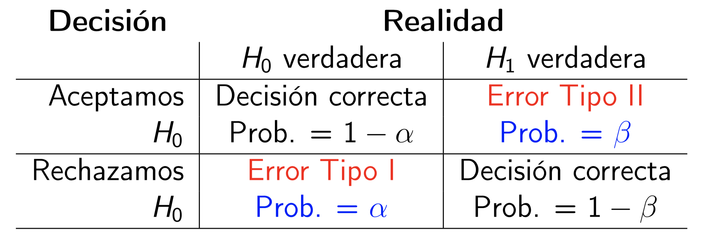
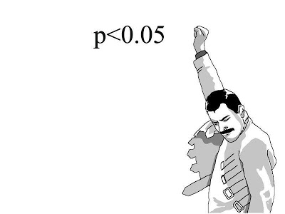

# Contrastes de hipótesis

En muchas situaciones, queremos tomar una **decisión** sobre si podemos aceptar o rechazar una **hipótesis** relativa al valor de un parámetro en una o varias poblaciones, y para tomar esta decisión, nos basamos en los datos de una muestra. Por ejemplo:

* Queremos saber si una moneda está trucada a favor de cara. 

    Para decidirlo, la lanzamos varias veces y contamos cuántas caras salen.
 
* Queremos decidir si un tratamiento nuevo A es más efectivo que el tratamiento anterior B en la curación de una enfermedad X. 

    Para decidirlo, llevamos a cabo un ensayo clínico, tratando con A un grupo de enfermos y con B otro grupo de enfermos, y comparamos la tasa de curación de los tratamientos sobre estos dos grupos.

El método estadístico que se usa para aceptar o rechazar una hipótesis a partir de los datos de una muestra recibe el nombre de **contraste de hipótesis**.


## Hipótesis nula y alternativa


En un contraste de hipótesis, se comparan siempre dos hipótesis alternativas: la **hipótesis nula** $H_{0}$ y la **hipótesis alternativa** $H_{1}$. Se suele plantear formalmente
$$
\left\{\begin{array}{ll}
H_{0}:\text{hipótesis nula}\\ 
H_{1}:\text{hipótesis alternativa}
\end{array}
\right.
$$

En los contrastes de hipótesis de este curso:

* La **hipótesis nula** $H_{0}$ es "no hay diferencia", "no pasa nada", "no hay nada extraño" o el equivalente en el contexto del contraste:

    * La moneda es equilibrada (50% de probabilidad de cara).

    * Los tratamientos A y B son igual de efectivos en la curación de la enfermedad X.

* La **hipótesis alternativa** $H_{1}$ plantea la diferencia de la que buscamos evidencia:

    * La moneda está trucada a favor de cara (más del 50% de probabilidad de cara).

    * A es más efectivo que B en la curación de la enfermedad X.

* Estamos dispuestos a aceptar $H_0$ por defecto: que no hay diferencia, que no pasa nada. 

    * Por defecto, estamos dispuestos a aceptar que la moneda es equilibrada (la mayoría lo son, ¿no?).

    * Por defecto, estamos dispuestos a aceptar que los dos tratamientos son igual de efectivos (si tomáis dos sustancias cualesquiera y las administráis a enfermos de X, lo más normal es que ninguna de los dos tenga efecto alguno, y por lo tanto que las dos sean igual de (in)efectivas).

* Si obtenemos evidencia suficiente de que $H_0$ es falsa, rechazaremos $H_0$ en favor de $H_1$ y concluiremos que $H_1$ es verdadera. 

     ¿Qué quiere decir "obtener evidencia suficiente de que $H_0$ es falsa"? Pues que las pruebas obtenidas hacen que $H_0$ sea **inverosímil** (difícil de creer) por comparación con $H_1$:

    * Tendremos evidencia de que la moneda está trucada a favor de cara si en nuestra serie de lanzamientos la proporción de caras es tan y tan grande que hace muy difícil creer que la moneda no esté trucada a favor de cara.

    * Tendremos evidencia de que A es más efectivo que B en la curación de X si en nuestro ensayo la tasa de curación de la enfermedad X con el tratamiento A es tan y tan superior a la de B que hace muy difícil creer que los dos tratamientos sean igual de efectivos.

* Si no obtenemos evidencia suficiente de que $H_0$ es falsa, es decir, si nuestros datos son razonablemente compatibles con $H_0$, no podremos rechazarla. Entonces, aceptaremos la hipótesis nula.

    * Aceptaremos que la moneda no está trucada a favor de cara si en nuestra serie de lanzamientos la proporción de caras no es lo bastante grande como para hacer muy difícil creer que sea equilibrada

    * Aceptaremos que A es igual de efectivo que B en la curación de  X si en nuestro ensayo la tasa de curación de la enfermedad X con el tratamiento A no es lo bastante superior a la de B como para hacer muy difícil creer que los dos tratamientos sean igual de efectivos.

```{block2,type="rmdrecordau"}
Rechazamos la hipótesis nula en favor de la alternativa cuando sería mucha, mucha, pero mucha casualidad obtener los resultados obtenidos si la hipótesis nula fuera cierta en vez de la alternativa.
```


```{block2,type="rmdcaution"}
Si rechazamos $H_0$ en favor de $H_1$, en general **no** será porque hayamos demostrado que $H_0$ sea imposible, ni siquiera que sea improbable: tan solo habremos observado que es difícil de creer que sea verdad a la vista de los resultados de nuestro experimento.
```

Por ejemplo, si en una secuencia de 30 lanzamientos de una moneda obtenemos todas las veces cara, seguramente lo consideraremos evidencia de que la moneda está trucada, pero **no demuestra que la moneda esté trucada**. Sí, cuesta creer que no esté trucada, pero no es imposible: la moneda podría ser equilibrada y por puro azar nosotros haber tenido esta racha de caras. Y tampoco podemos decir que sea improbable que sea equilibrada, puesto que nosotros sabemos calcular
$$
P(\text{30 caras en 30 lanzamientos}\,|\,\text{La moneda es equilibrada})
$$
que vale $0.5^{30}=9.3\cdot 10^{-10}$ (y por lo tanto, de media, aproximadamente en una de cada mil millones de veces que se efectúan 30 lanzamientos seguidos de una moneda equilibrada, se obtienen 30 caras: no es imposible). Pero no sabemos calcular
$$
P(\text{La moneda es equilibrada}\,|\,\text{30 caras en 30 lanzamientos}).
$$

```{block2,type="rmdcaution"}
Si aceptamos la hipótesis nula es porque no encontramos motivos para dudar de ella, pero no habremos encontrado evidencia de que sea verdadera ni habremos demostrado que sea probable (y posible en principio lo es siempre).
```

Por ejemplo, si en una secuencia de 4 lanzamientos de una moneda obtenemos 2 caras, tendremos que aceptar que la moneda es equilibrada. Pero podría ser que estuviera ligeramente sesgada hacia cara y no haberse notado en una secuencia tan corta de lanzamientos. Así que no hemos encontrado evidencia de que sea equilibrada, simplemente no lo podemos descartar (como tampoco podemos descartar que la probabilidad de cara sea, yo qué sé, 0.50001). 


```{example,juicio}
En un juicio (en el que el acusado es inocente si no se demuestra lo contrario) se busca evidencia sufiente de que el acusado es culpable. Por lo tanto, esta es la hipótesis alternativa. Por otro lado, que "no pase nada" significa que el acusado es inocente: casi todo el mundo es inocente del cargo concreto que se juzga en ese momento. Esta será la hipótesis nula. Así pues, el contraste es:

```

* El contraste es
$$
\left\{\begin{array}{ll} 
H_{0}:\text{El acusado es inocente}\\ 
H_{1}:\text{El acusado es culpable}
\end{array}
\right.
$$


* Se aportan pruebas.

* Si el jurado encuentra  las pruebas lo bastante incriminatorias, "más allá de toda duda razonable", declara **culpable** el acusado (rechaza $H_0$ en favor de $H_1$).

* Si el jurado no las encuentra lo bastante incriminatorias, lo considera **no culpable** (no rechaza $H_{0}$).

Observad que considerar no culpable no es lo mismo que demostrar que es inocente: simplemente, se considera que el acusado no es culpable porque no se ha encontrado  evidencia suficiente de que sea culpable.


```{example,examen}
Un examen es un contraste de hipótesis. En este caso, "no pasa nada" significa que el estudiante es como si no hubiera ido al curso, no ha aprendido nada, y por tanto esta es la hipótesis nula. Con el examen buscamos evidencia de que el estudiante ha aprendido la materia, por lo tanto esta será la hipótesis alternativa. Así:

```

* Contraste:
$$
\left\{\begin{array}{ll} 
H_{0}:\text{El estudiante no sabe la materia}\\ 
H_{1}:\text{El estudiante sabe la materia}
\end{array}
\right.
$$

* Tomamos una muestra del conocimiento del estudiante (el estudiante hace el examen).

* Si hay suficiente evidencia en favor de $H_1$ (si el examen le sale lo bastante bien), rechazamos $H_0$: decidimos que el estudiante sabe la materia, aprueba la asignatura.

* Si no hay evidencia suficiente en favor de $H_1$ (si el examen no le sale lo bastante bien), nos quedamos con $H_0$: concluimos que el estudiante no ha aprendido la materia, suspende la asignatura.


```{example,CHdiag}
Una prueba diagnóstica de una enfermedad es un contraste de hipótesis. En este caso, "no pasa nada" significa que la persona está sana, y por tanto esta es la hipótesis nula. Con la prueba diagnóstica buscamos evidencia de que tiene la enfermedad, por lo tanto esta será la hipótesis alternativa. Es decir, el contraste es 

```

$$
\left\{\begin{array}{ll} 
H_{0}:\text{La persona no tiene la enfermedad}\\ 
H_{1}:\text{La persona sí tiene la enfermedad}
\end{array}
\right.
$$


```{example,esport1}
Si leemos la noticia siguiente en el diario, puede que nos preguntemos si es verdad que las mujeres practican  menos deporte que los hombres.


```


```{r, echo=FALSE, fig.width=4,out.width="75%"}
knitr::include_graphics("INREMDN_files/figure-html/mujeresdeporte.png")
```

Esta pregunta la podemos plantear de muchas maneras:

* ¿Toda mujer hace cada día menos horas de deporte que cualquier hombre?

* Si tomo una mujer y un hombre al azar, ¿es más probable que ella practique menos deporte que él?

* ¿La mayoría de las mujeres hacen cada día menos horas de deporte que la mayoría de los hombres?

* ¿La proporción de practicantes de deporte entre las mujeres es menor que entre los hombres?

* ¿La media semanal de veces que las mujeres practican deporte es menor que la de los hombres?

* ¿La media semanal de horas que las mujeres practican deporte es menor que la de los hombres?

* ...

Cada una de estas preguntas se traduciría en un contraste de hipótesis diferente. Puesto que aquí estamos tratando contrastes sobre parámetros poblacionales (medias, proporciones, etc.), podríamos plantear alguno de los tres últimos contrastes. Vamos a centrarnos en la última cuestión, sobre medias semanales de horas de deporte. 

En este contraste, las variables poblacionales de interés son:

* $X_m$: "Tomo una mujer y calculo su número medio de horas semanales de deporte", con media $\mu_m$: la media semanal de horas de deporte de las mujeres (la media de las medias de horas semanales de deporte de todas las mujeres es la media de horas semanales de deporte de las mujeres).

* $X_h$: "Tomo un hombre y calculo su número medio de horas semanales de deporte", con media $\mu_h$: la media semanal de horas  de deporte de los hombres.


El contraste que queremos realizar es 

* **Hipótesis nula**: no hay diferencia entre las medias semanales de horas de deporte de hombres y mujeres. 

* **Hipótesis alternativa**: la media semanal de horas de deporte de las mujeres es más pequeña que la de los hombres.

Es decir
$$
\left\{\begin{array}{ll} 
H_{0}: \mu_m=\mu_h\\ 
H_{1}:\mu_m<\mu_h
\end{array}
\right.
$$

El procedimiento para llevar  a cabo este contraste sería:

* Tomaríamos muestras aleatorias de mujeres y de hombres y les preguntaríamos sus hábitos de práctica de deporte.

* Calcularíamos la media muestral $\overline{X}_m$ de horas semanales de deporte de las mujeres de la muestra.

* Calcularíamos la media muestral $\overline{X}_h$ de horas semanales de deporte de los hombres de la muestra.

* Si $\overline{X}_m$ fuera mucho menor que $\overline{X}_h$, lo tomaríamos como evidencia de que $\mu_m<\mu_h$.

* Si $\overline{X}_m$ no fuera mucho menor que $\overline{X}_h$, no podríamos rechazar que $\mu_m=\mu_h$.

¿Qué significa "$\overline{X}_m$ mucho menor que $\overline{X}_h$"? Una opción, que podríamos importar del tema anterior, seria calcular un intervalo de confianza del 95% para $\mu_m-\mu_h$ a partir de la muestra. Entonces:

* Si este intervalo de confianza estuviera totalmente a la izquierda del 0, con un 95% de confianza podríamos concluir que $\mu_m<\mu_h$ (porque tendríamos un 95% de seguridad de que el valor real de la diferencia $\mu_m-\mu_h$ pertenece a un intervalo de números estrictamente negativos).

* En caso contrario (si contuviera el 0 o si estuviera totalmente a la derecha del 0), con un 95% de confianza no podríamos concluir que $\mu_m<\mu_h$.

Aquí querremos afinar un poco más que lo del "nivel de confianza", por lo que el procedimiento será algo más complicado. Básicamente, la idea es que vamos a usar diferentes fórmulas para calcular los intervalos de confianza según la forma de la hipótesis alternativa, ya lo veremos.

Antes de cerrar esta sección, queremos destacar algunas advertencias.

```{block2,type="rmdcaution"}
Las hipótesis de los contrastes son sobre parámetros de las poblaciones, NO sobre estadísticos de las muestras.
```

En el ejemplo anterior, las hipótesis del contraste comparaban las **medias poblacionales** de horas semanales de deporte de las mujeres y los hombres, no las medias de horas semanales de deporte de las mujeres y los hombres de la muestra. 

Para comparar las medias muestrales no nos hace falta un contraste de hipótesis: las calculamos y punto. En cambio, como no podemos calcular las medias semanales de horas de deporte de todas las mujeres y de todos los hombres, nos vemos obligados a hacer un contraste de hipótesis.

```{block2,type="rmdcaution"}
La falta de evidencia en favor de $H_1$ no es evidencia en favor de $H_0$.
```

Si no podemos asegurar que las mujeres practiquen menos deporte que los hombres (porque no hayamos encontrado evidencia a favor de esta hipótesis), esto no significará que hayamos encontrado evidencia de que los hombres y las mujeres practiquen la misma cantidad de deporte o de que las mujeres practiquen más deporte. Lo que significará es que la evidencia en favor de $H_1$ **no ha sido lo bastante fuerte como para poder estimar que esta es la hipótesis verdadera** y por tanto aceptamos que no hay diferencia en la media semanal de horas de deporte practicada por ambos sexos.

```{block2,type="rmdcaution"}
De hecho, (casi) nunca podremos encontrar evidencia de la hipótesis nula.
```

Si por ejemplo en nuestro estudio hubiéramos encontrado que $\overline{X}_m=\overline{X}_h$, esto sería compatible con la hipótesis nula $\mu_m=\mu_h$, y por eso no la podríamos rechazar, pero no aportaría evidencia de que $\mu_m=\mu_h$, puesto que seguramente también sería compatible, por ejemplo, con $\mu_m=\mu_h+0.0007$ (las mujeres hacen, de media, un minuto más de deporte a la semana que los hombres).


```{block2,type="rmdcaution"}
La pregunta (el contraste) se plantea *a priori* a partir de hipótesis o suposiciones previas, antes de obtener los datos. No vale cambiar de contraste a la vista de los datos obtenidos.
```

Tenemos que plantear la pregunta   antes de recoger la muestra. Si estamos interesados en el contraste
$$
\left\{\begin{array}{ll} 
H_{0}: \mu_m=\mu_h\\ 
H_{1}:\mu_m<\mu_h
\end{array}
\right.
$$
y obtenemos que $\overline{X}_m$ es mucho mayor que $\overline{X}_h$ en nuestra muestra, concluimos que no tenemos evidencia de que $\mu_m<\mu_h$ y punto. **Sería hacer trampas** decir: "No hemos encontrado evidencia de que las mujeres practiquen menos deporte que los hombres, pero si con estos mismos datos realizamos el contraste
$$
\left\{\begin{array}{ll} 
H_{0}: \mu_m=\mu_h\\ 
H_{1}:\mu_m>\mu_h
\end{array}
\right.
$$
sí que obtenemos evidencia de que ellas practican más deporte que ellos."

De esto se dice **ir a pescar evidencias** o también **torturar los datos**: obtener unos datos y buscar de qué dan evidencia. Es mala praxis científica. Cualquier conjunto de datos, si lo torturamos lo suficiente, acaba dando evidencia de algo.

```{block2,type="rmdcaution"}
Escoged la hipótesis alternativa en función de lo que buscáis evidencia.
```

No confundáis
$$
\left\{\begin{array}{ll} 
H_{0}: \mu_m=\mu_h\\ 
H_{1}:\mu_m<\mu_h
\end{array}
\right.
$$
con
$$
\left\{\begin{array}{ll} 
H_{0}: \mu_m=\mu_h\\ 
H_{1}:\mu_m \neq \mu_h
\end{array}
\right.
$$
que traduce la pregunta "Los hombres y las mujeres, ¿practican deporte un número diferente de horas a la semana,  de media?"


```{block2,type="rmdimportant"}
**Reglas para elegir $H_0$ y $H_1$ en este curso**:

* $H_0$ siempre se tiene que definir mediante una igualdad.

* $H_1$ es la hipótesis de la que buscamos evidencia, y se tiene que definir  mediante algo "estricto":

    * **Hipótesis unilateral** (*one-sided*; también **de una cola**, *one-tailed*): definida con **<** o con **>**.

    * **Hipótesis bilateral** (*two-sided*; también **de dos colas**, *two-tailed*): definida con $\mathbf{\neq}$.
```

Los contrastes toman el nombre del tipo de hipótesis alternativa: **contraste unilateral**, **contraste de dos colas**, etc.


## Un ejemplo {#sec:moneda}

Tenemos una moneda, y creemos que está trucada en favor de cara. Queremos contrastarlo. 

Aquí la variable aleatoria $X$ que nos interesa es "lanzamos la moneda y miramos si sale cara", que es de Bernoulli con probabilidad de éxito (es decir, probabilidad de sacar cara con nuestra moneda) $p_{\mathit{Cara}}$.

La hipótesis nula será que la moneda no está trucada (no le pasa nada a nuestra moneda), y la alternativa (de la que busco evidencia), que la moneda está trucada en favor de cara. En términos de $p_{\mathit{Cara}}$, el contraste es
$$
\left\{\begin{array}{ll} 
H_{0}:p_{\mathit{Cara}}= 0.5\\ 
H_{1}:p_{\mathit{Cara}}> 0.5
\end{array}
\right.
$$

```{example}
Supongamos que lanzamos la moneda 3 veces y obtenemos 3 caras. ¿Es evidencia suficiente de que está trucada a favor de cara?


```

Llamemos $S_3$ a la variable aleatoria "Número de caras en 3 lanzamientos de esta moneda." Si la moneda no está trucada, $S_3$ es binomial $B(3,0.5)$, y por lo tanto
$$
P(S_3=3)=0.5^{3}=0.125.
$$

El resultado obtenido no es muy improbable con una moneda equilibrada: pasa, de media, en 1 de cada 8 secuencias de 3 lanzamientos. Por lo tanto, no vamos a considerarlo evidencia suficiente de que la moneda esté trucada. Aceptamos que la moneda es equilibrada.

```{block2,type="rmdrecordau"}
A este tipo de procedimiento, usar la distribución binomial del número de éxitos en una muestra aleatoria simple de una variable aleatoria de Bernoulli para contrastar un valor de su probabilidad poblacional de éxito, lo llamaremos un **test binomial**.
```


```{example}
Supongamos que ahora lanzamos la moneda 10 veces y obtenemos 10 caras. ¿Es evidencia suficiente de que está trucada a favor de cara?


```

Llamemos $S_{10}$ a la variable aleatoria "Número de caras en 10 lanzamientos." Si la moneda no está trucada, $S_{10}$ es $B(10,0.5)$ y por lo tanto
$$
P(S_{10}=10)=0.5^{10}=0.001
$$

El resultado obtenido es bastante improbable si la moneda no está trucada: si la moneda fuera equilibrada, de media solo en 1 de cada 1000 secuencias de 10 lanzamientos obtendríamos 10 caras. Es decir:

> El resultado de nuestro experimento sería muy raro si la moneda fuera equilibrada, por lo tanto es **inverosímil** que sea equilibrada.

Lo consideramos evidencia de que está trucada.

```{block2,type="rmdnote"}
Observad el razonamiento que hemos efectuado. Tenemos una hipótesis de partida (la nula), realizamos un experimento  y obtenemos un resultado que es muy improbable si la hipótesis de partida es verdadera. Una de dos:

* O la hipótesis de partida es falsa.
* O la hipótesis de partida es verdadera y ha pasado algo muy raro.

¿Qué es lo más sensato concluir? Teniendo en cuenta que las cosas muy raras no suelen pasar, lo más sensato es concluir que la hipótesis de partida es falsa.
```

El procedimiento que hemos seguido en los dos ejemplos anteriores ha sido el siguiente:

1. Hemos planteado el contraste:
$$
\left\{\begin{array}{ll} 
H_{0}:p_{\mathit{Cara}}= 0.5\\ 
H_{1}:p_{\mathit{Cara}}> 0.5
\end{array}
\right.
$$

2. Hemos recogido una muestra aleatoria simple de valores: la secuencia de lanzamientos.

3. Hemos elegido un **estadístico de contraste** con distribución de probabilidades conocida cuando $H_0$ es verdadera: en nuestro caso, el número de caras.

4. Hemos calculado el valor de este estadístico sobre nuestra muestra.

5. Hemos calculado la probabilidad de que el estadístico tome el valor observado si $H_0$ es verdadera.

6. Si esta probabilidad es muy pequeña, lo consideramos evidencia de que $H_1$ es verdadera

7. Si no es lo bastante pequeña, no tenemos evidencia de que $H_0$ sea falsa.

Bien, esto es lo que hemos hecho, pero no es del todo correcto. En los puntos (5) y (6) decimos que: "Calculamos la probabilidad de que el estadístico tome el valor observado si $H_0$ es verdadera y si es muy pequeña, lo consideramos evidencia de que $H_1$ es verdadera." ¿Seguro que queremos hacer esto?

* Supongamos que, en el contraste anterior, lanzamos la moneda 10 veces y obtenemos 10 **cruces**. ¿Es evidencia suficiente de que está trucada en favor de cara? Obviamente no lo puede ser, pero la probabilidad es la misma que antes:
$$
P(S_{10}=0)=0.5^{10}=0.001
$$


* En muchos casos, **la probabilidad de obtener exactamente lo que hemos obtenido puede ser muy pequeña, independientemente de lo que hayamos obtenido**. Por ejemplo, supongamos que lanzamos la moneda 10000 veces y obtenemos 5000 caras. Si la moneda es equilibrada, el número de caras seguirá una distribución binomial $B(10000,0.5)$ y la probabilidad de obtener 5000 caras será 
$$
\binom{10000}{5000}0.5^{10000}=0.008
$$
muy pequeña, pero está claro que si la mitad de lanzamientos dan cara, no se puede considerar evidencia de que la moneda esté trucada. 

    O, más exagerado aún, si el estadístico de contraste es una variable continua, la probabilidad de que tome un valor concreto, el que sea, es 0 por definición. Más pequeño imposible, pero no siempre rechazaremos la hipótesis nula.

```{r, echo=FALSE, out.width="40%",fig.cap="\"Null hypothesis\" (https://xkcd.com/892/ (CC-BI-NC 2.5))"}
library(linguisticsdown)
include_graphics2("https://imgs.xkcd.com/comics/null_hypothesis.png")
```


Así que:

```{block2,type="rmdrecordau"}
En realidad, en (5) se calcula la probabilidad de que, si $H_0$ es verdadera, el estadístico tome un valor tan extremo o más, en el sentido de $H_1$, que el obtenido. A esta probabilidad la llamamos el **p-valor**. 
```

En nuestro ejemplo de la moneda, como  la hipótesis nula es $p_{\mathit{Cara}}= 0.5$ y la hipótesis alternativa es $p_{\mathit{Cara}}> 0.5$, el p-valor es la probabilidad de que, si $p_{\mathit{Cara}}= 0.5$, el número de caras sea igual o mayor que el obtenido en nuestra muestra. 

En los dos ejemplos anteriores concretos, donde obteníamos 3 caras en 3 lanzamientos y 10 caras en 10 lanzamientos, era lo mismo pedir que el número de caras fuera igual al obtenido y pedir que el número de caras fuera  mayor o igual que el obtenido, porque en los dos experimentos hemos obtenido el número máximo posible de caras; por ejemplo, sacar 3 o más caras en 3 lanzamientos es exactamente lo mismo que sacar 3 caras en 3 lanzamientos. Pero en general esto no será así.


```{example}
Volvamos a nuestro contraste
$$
\left\{\begin{array}{ll} 
H_{0}:p_{\mathit{Cara}}= 0.5\\ 
H_{1}:p_{\mathit{Cara}}> 0.5
\end{array}
\right.
$$
Supongamos que lanzamos la moneda  10 veces y obtenemos 7 caras. ¿Es evidencia suficiente de que está trucada a favor de cara?


```

Seguimos llamando $S_{10}$ a la variable aleatoria "Número de caras en 10 lanzamientos". Si la moneda no está trucada, $S_{10}$ es $B(10,0.5)$. Como  la hipótesis alternativa es $p_{\mathit{Cara}}> 0.5$, "obtener un número de caras tan extremo o más que el que hemos obtenido en el sentido de la hipótesis alternativa" es sacar **tantas caras como las que hemos obtenido o más**, es decir sacar 7 o más caras.  Por lo tanto
$$
\text{p-valor}=P(S_{10}\geqslant 7)=1-P(S_{10}\leqslant 6)=\texttt{1-pbinom(6,10,0.5)}=0.172
$$


Un número de caras igual o superior al obtenido no es muy improbable si la moneda no está trucada: pasaría en 1 de cada 6 secuencias de 10 lanzamientos. Por lo tanto, como es bastante compatible con el equilibrio de la moneda, no lo podemos considerar evidencia de que esté trucada a favor de cara.

```{example}
Tenemos una moneda, y ahora creemos que está trucada a favor de cruz. Queremos contrastarlo. Planteado en términos de $p_{\mathit{Cara}}$, el contraste que queremos realizar es
$$
\left\{\begin{array}{ll} 
H_{0}:p_{\mathit{Cara}}= 0.5\\ 
H_{1}: p_{\mathit{Cara}}< 0.5
\end{array}
\right.
$$
Imaginad que lanzamos la moneda  10 veces y obtenemos 1 cara. ¿Es suficiente evidencia  de que $p_{\mathit{Cara}}< 0.5$?


```

Seguimos llamando $S_{10}$ a la variable aleatoria "Número de caras en 10 lanzamientos de esta moneda." Si la moneda no está trucada, $S_{10}$ es $B(10,0.5)$.

Ahora, como  $H_{1}$ es $p_{\mathit{Cara}}< 0.5$, "obtener un número de caras tan extremo o más que el que hemos obtenido, en el sentido de la hipótesis alternativa" es sacar tantas caras como las que hemos obtenido **o menos**, es decir sacar como máximo 1 cara. Por lo tanto
$$
\text{p-valor}=P(S_{10}\leqslant 1)=\texttt{pbinom(1,10,0.5)}=0.01
$$
Un resultado tan o más extremo como el obtenido es muy improbable si $p_{\mathit{Cara}}= 0.5$: de media, solo ocurre en 1 de cada 100 secuencias de 10 lanzamientos. Lo podemos considerar evidencia de que la moneda sí que está trucada en favor de cruz.


## El p-valor {#sec:pval}

El **p-valor** de un contraste es la probabilidad de que, si la hipótesis nula es verdadera, el estadístico de contraste tome en una muestra aleatoria simple del mismo tamaño que la nuestra un valor tan o más extremo, en el sentido de la hipótesis alternativa, que el obtenido con la muestra usada para realizar el contraste. 

Lo repetimos, poniendo énfasis en los componentes fundamentales de la definición. El **p-valor** es:

* La probabilidad de que,
* si la hipótesis nula es verdadera, 
* el estadístico de contraste tome en una muestra aleatoria simple del mismo tamaño que la nuestra
* un valor tan o más extremo, en el sentido de la hipótesis alternativa, 
* que el obtenido con nuestra muestra.

```{example}
Supongamos que en el contraste de las medias semanales de horas de deporte de hombres y mujeres del Ejemplo \@ref(exm:esport1) usamos como estadístico de contraste la diferencia entre las medias muestrales $\overline{X}_m-\overline{X}_h$ (no será así: ¡solo es un ejemplo!), que hemos tomado muestras de 50 mujeres y de 50 hombres, y que la diferencia de medias muestrales ha sido -1.2. Entonces, el p-valor del contraste es


```

* La probabilidad de que,

* si la hipótesis nula es verdadera, 

    si $\mu_m=\mu_h$, es decir, si los hombres y las mujeres practican de media el mismo número de horas de deporte a la semana,

* el estadístico de contraste tome en una muestra aleatoria simple del mismo tamaño que la nuestra

   el valor de $\overline{X}_m-\overline{X}_h$, es decir, de la diferencia entre las medias muestrales de horas semanales de deporte en las mujeres y en los hombres, en una muestra aleatoria formada por 50 mujeres y 50 hombres

* un valor tan o más extremo, en el sentido de la hipótesis alternativa, 

    sea **menor o igual** (porque la hipótesis alternativa es $\mu_m<\mu_h$, es decir $\mu_m-\mu_h<0$)

* que el obtenido con nuestra muestra.

    que el de nuestra muestra, -1.2.

En resumen, el p-valor seria en este caso

> La probabilidad, si $\mu_m=\mu_h$, de que, si tomamos una muestra aleatoria de 50 mujeres y 50 hombres, el valor de $\overline{X}_m-\overline{X}_h$ que obtengamos sea menor o igual que -1.2.

Si esta probabilidad es muy pequeña, la muestra obtenida es poco consistente con la hipótesis nula y por tanto concluiremos que la hipótesis alternativa es verdadera. Si, en cambio, esta probabilidad no es muy pequeña, la muestra obtenida es consistente con la hipótesis nula y por tanto no podremos rechazar que $H_0$ sea verdadera.


```{block2,type="rmdimportant"}
El p-valor **NO** es:

* La probabilidad de que $H_0$ sea verdadera condicionada a nuestro resultado.

* La probabilidad de que $H_1$ sea falsa condicionada a nuestro resultado.


```

Es al revés: El p-valor es la probabilidad de nuestro resultado (o uno más extremo) condicionada a que $H_0$ sea verdadera. Por lo tanto, el p-valor es una evidencia **indirecta inversa** de $H_1$: 

> Cuanto menor sea el p-valor, más raro sería lo que hemos obtenido si $H_0$ fuera verdadera y $H_1$ falsa, y por tanto más evidencia tenemos de que $H_0$ no puede ser verdadera y que la verdadera es $H_1$.

Por ejemplo, si el p-valor de un contraste da 0.03:

* **Significa** que, si $H_0$ es verdadera, la probabilidad de que el estadístico de contraste tome sobre una muestra un valor tan extremo o más, en el sentido de $H_1$, que el que hemos obtenido es 0.03.

    * **¿Lo encontráis pequeño?** Lo tomáis como evidencia de que $H_0$ es falsa y $H_1$ verdadera.

    * **¿No lo encontráis pequeño?** No tenéis evidencia para rechazar que $H_0$ es verdadera.

* **No significa** que:

     * La probabilidad de que $H_0$ sea verdadera es 0.03.

    * $H_0$ es verdadera un 3% de las veces.

```{block2,type="rmdimportant"}
En un contraste de hipótesis no obtenemos ninguna información directa sobre la probabilidad de $H_0$ o de $H_1$.
```


```{example}
Tenemos una moneda y creemos que está trucada; a favor de cara o a favor de cruz, no lo sabemos, solo sospechamos que no es equilibrada. Queremos contrastarlo. 

```

Planteado en términos de la probabilidad de sacar cara $p_{\mathit{Cara}}$, el contraste que queremos realizar ahora es
$$
\left\{\begin{array}{ll} 
H_{0}:p_{\mathit{Cara}}= 0.5\\ 
H_{1}:p_{\mathit{Cara}}\neq 0.5
\end{array}
\right.
$$
Supongamos que la lanzamos 10 veces y obtenemos 8 caras. ¿Es evidencia suficiente de que está trucada?


Como en la sección anterior, sea $S_{10}$ la variable "Número de caras en 10 lanzamientos". Si $p_{\mathit{Cara}}= 0.5$,  $S_{10}$ es $B(10,0.5)$.

Si la hipótesis nula fuera verdadera, esperaríamos sacar 5 caras y 5 cruces. Como la hipótesis alternativa es $H_{1}:p_{\mathit{Cara}}\neq 0.5$, ahora "obtener un resultado tan o más extremo, en el sentido de la hipótesis alternativa, que el obtenido" es **sacar un resultado tan diferente o más de 5 caras y 5 cruces que el obtenido**. Es decir, sacar al menos 8 caras o al menos 8 cruces, o lo que es el mismo, sacar o bien 8 o más caras, o bien 2 o menos caras. Por lo tanto, el p-valor es
$$
\begin{array}{l}
P(S_{10}\geqslant 8\text{ o }S_{10}\leqslant 2) =P(S_{10}\geqslant 8) + P(S_{10}\leqslant 2)\\
\qquad =1-P(S_{10}\leqslant 7) + P(S_{10}\leqslant 2)\\
\qquad =\texttt{1-pbinom(7,10,0.5)+pbinom(2,10,0.5)}\\
\qquad =`r round(1-pbinom(7,10,0.5)+pbinom(2,10,0.5),2)`
\end{array}
$$


Por lo tanto, si la moneda no está trucada, un resultado como el obtenido o más lejano de "mitad caras, mitad cruces" no es muy improbable: 1 de cada 9 veces pasaría. ¿Es evidencia suficiente de que esté trucada?

La respuesta corta es que no. La respuesta larga es que depende de cuánto estemos dispuestos a arriesgarnos a rechazar la hipótesis nula cuando es verdadera. 

## Tipo de errores

La comparación entre la realidad y la conclusión de un contraste da lugar a cuatro situaciones posibles, resumidas en la tabla siguiente:


```{r, echo=FALSE,fig.width=1,out.width="75%"}

```


* Si $H_0$ es la hipótesis verdadera en la realidad y nosotros decidimos que $H_1$ es verdadera:

   * La conclusión del contraste es errónea. Lo llamaremos un **error de tipo I**, **error $\alpha$** o **falso positivo**. 

    * Denotaremos por $\alpha$ la probabilidad de cometer un error de tipo I, es decir, de rechazar $H_0$ si es verdadera, y la llamaremos el **nivel de significación**: 
$$
\alpha=P(\text{Rechazar } H_0\,|\, H_0\text{ verdadera}).
$$

* Si $H_1$ es la hipótesis verdadera en la realidad y nosotros aceptamos $H_0$:

    * La conclusión del contraste es errónea. Lo llamaremos **error de tipo II**, **error $\beta$** o  **falso negativo**. 

    * Denotaremos por $\beta$ la probabilidad de cometer un error de tipo II, es decir, de aceptar $H_0$ si $H_1$ es verdadera:
$$
\beta=P(\text{Aceptar } H_0\,|\, H_1\text{ verdadera}).
$$


* Si $H_1$ es la hipótesis verdadera en la realidad y nosotros decidimos rechazar $H_0$ en favor de $H_1$: 

    * La conclusión del contraste es correcta. Lo llamaremos un **verdadero positivo**. 

   * La probabilidad de acertar con un verdadero  positivo es $1-\beta$ y la llamaremos la **potencia**:

$$
1-\beta=P(\text{Rechazar } H_0\,|\, H_1\text{ verdadera}).
$$

* Si $H_0$ es la hipótesis verdadera en la realidad y nosotros la aceptamos:

   * La conclusión del contraste es correcta. Lo llamaremos un **verdadero negativo**. 

    * La probabilidad de acertar con un verdadero negativo es $1-\alpha$ y la llamaremos el **nivel de confianza**:
$$
1-\alpha=P(\text{Aceptar } H_0\,|\, H_0\text{ verdadera}).
$$


```{block2,type="rmdrecordau"}
En el contexto de un contraste de hipótesis, 

* Un **resultado positivo** es rechazar la hipótesis nula y decidir que la alternativa es la verdadera (hemos encontrado algo).

* Un **resultado negativo** es aceptar la hipótesis nula (no hemos encontrado nada y nos conformamos con la hipótesis nula).

```


Repetimos:

* El **nivel de significación** de un contraste es la probabilidad de que, **si la hipótesis nula es verdadera**, nosotros nos equivoquemos y la rechacemos en favor de la alternativa:
$$
\alpha=P(\text{Rechazar } H_0\,|\, H_0\text{ verdadera}).
$$

* La **potencia** de un contraste es la probabilidad de que, **si la hipótesis alternativa es verdadera**, nosotros lo detectemos y rechacemos la hipótesis nula en favor de la alternativa:
$$
1-\beta=P(\text{Rechazar } H_0\,|\, H_1\text{ verdadera}).
$$


```{example}
En un test de embarazo, el contraste que se realiza es:
$$
\left\{\begin{array}{ll} 
H_{0}:\text{No estás embarazada}\\ 
H_{1}:\text{Estás embarazada}
\end{array}
\right.
$$


```

```{r, echo=FALSE,fig.width=1,out.width="60%"}
knitr::include_graphics("INREMDN_files/figure-html/types.png")
```


```{example}
En un juicio, donde se tiene que declarar un acusado inocente o culpable, el contraste era
$$
\left\{\begin{array}{ll} 
H_{0}:\text{El acusado es inocente}\\ 
H_{1}:\text{El acusado es culpable}
\end{array}
\right.
$$

````

Se pueden cometer dos errores:

* **Error de tipo I**: Declarar culpable un inocente.

* **Error de tipo II**: Declarar no culpable un culpable.

Es peor el error de tipo I, conviene minimizar la probabilidad de cometerlo. Por eso solo se declara a alguien culpable cuando las pruebas lo "demuestran más allá de toda duda razonable".

```{example}
En un examen, el contraste era
$$
\left\{\begin{array}{ll} 
H_{0}:\text{El estudiante no sabe la materia}\\ 
H_{1}:\text{El estudiante sabe la materia}
\end{array}
\right.
$$

```

Se pueden dar dos errores:

* Que el estudiante apruebe sin saber la materia.

* Que el estudiante suspenda sabiendo  la materia.

```{block2,type="rmdexercici"}
¿Cuál es el de tipo I y cuál el de tipo II? ¿Cuál creéis que es peor?
```


```{block2,type="rmdexercici"}
Recordad la interpretación de una prueba diagnóstica como un contraste de hipótesis (Ejemplo \@ref(exm:CHdiag)). Interpretad su especificidad y sensibilidad en términos de $\alpha$ y $\beta$.
```


Normalmente, se considera peor cometer un error de tipo I que cometer un error de tipo II. Por lo tanto, el objetivo primario en un contraste es encontrar una regla de rechazo de $H_{0}$ que tenga poca probabilidad $\alpha$ de error de tipo I. Pero también querríamos minimizar la probabilidad $\beta$ de error de tipo II.
El problema es que cuando hacemos que $\alpha$ disminuya, $\beta$ suele aumentar, porque al hacer más difícil rechazar la hipótesis nula, aumenta el riesgo de no rechazarla aunque sea falsa.

```{r, echo=FALSE,fig.width=5,fig.asp=2}
knitr::include_graphics("INREMDN_files/figure-html/columpio.png")
```

¿Qué se suele hacer? 

1. Se da una regla de decisión para el nivel de significación $\alpha$ deseado.

2. Después, se toma el tamaño $n$ adecuado de la muestra para reducir la $\beta$ al valor deseado.


```{block2,type="rmdimportant"}
Es costumbre tomar $\alpha=0.05$, una probabilidad de 1 entre 20: algo menos que la probabilidad de sacar 4 caras seguidas con una moneda equilibrada.
```


```{r, echo=FALSE, out.width="50%", fig.cap="No adoraréis falsos dioses."}
knitr::include_graphics("INREMDN_files/figure-html/worship.png")
```


Antes de acabar con los errores, fijaos en que si efectuamos $M$ contrastes (independientes) usando una regla de decisión que garantice un nivel de significación $\alpha$ dado, y en todos estos contrastes la $H_0$ es verdadera, el número de contrastes donde nos equivocaremos y rechazaremos $H_0$ tiene distribución binomial $B(M,\alpha)$. En particular, esperamos equivocarnos en $\alpha M$ de estos $M$ contrastes en los que la hipótesis nula sea verdadera.  

En concreto, tomando $\alpha=0.05$, aceptamos una probabilidad de equivocarnos rechazando $H_0$ en favor de $H_1$ de 0.05. Es decir, asumimos que, de media, nos vamos a equivocar 1 de cada 20 veces que la hipótesis nula sea verdadera.


```{block2,type="rmdcaution"}
Si efectuamos muchos contrastes, aumenta la probabilidad de "encontrar algo" aunque no haya nada que encontrar, y acabar diciendo que las gominolas verdes curan el acné.
```


```{r, echo=FALSE,fig.cap="\"Significant\" (https://xkcd.com/882/ (CC-BI-NC 2.5))"}
library(linguisticsdown)
include_graphics2("http://imgs.xkcd.com/comics/significant.png")
```


## Ejemplo: El test t {#sec:exttest}

La concentración media de calcio en plasma en hombres sanos de 22 a 44 años es de 2.5 mmol/l. 
Supongamos que nos preguntamos si los hombres jóvenes con diabetes tienen una concentración de calcio en plasma mayor que estos 2.5 mmol/l. Traducimos esta cuestión en un contraste de hipótesis sobre la concentración media de calcio en plasma en los hombres jóvenes con diabetes, a la que llamaremos $\mu$:

* La hipótesis nula será que no hay diferencia entre $\mu$ y la concentración media de calcio en plasma en los hombres jóvenes sanos, es decir, que $\mu=2.5$

* La hipótesis alternativa es de lo que buscamos evidencia: que $\mu>2.5$.

Por lo tanto, el contraste que queremos realizar es 
$$
\left\{\begin{array}{l}
H_{0}:\mu=2.5\\ 
H_{1}:\mu >2.5
\end{array}
\right.
$$

Llamemos $X$ a la variable aleatoria "Tomamos un hombre diabético de 22 a 44 años y le medimos la concentración de calcio en plasma en mmol/l". Vamos a suponer en esta sección que esta variable $X$ sigue una ley normal.

En una muestra de 40 diabéticos de esta franja de edad, se obtuvo una concentración media de calcio en plasma de $\overline{x}=3.2$ mmol/l con una desviación típica muestral $\widetilde{s}=1.5$. Vamos a suponer que podemos considerar esta muestra de diabéticos jóvenes como aleatoria. 


Nos encontramos ante un caso particular de la situación siguiente. Tenemos una variable aleatoria poblacional $X$ normal de media $\mu$ y planteamos el contraste
$$
\left\{\begin{array}{l}
H_{0}:\mu=\mu_0\\ 
H_{1}:\mu >\mu_0
\end{array}
\right.
$$
para un valor concreto $\mu_0$. Queremos tomar una decisión a partir de una muestra aleatoria simple.

La idea es que rechazaremos $H_0$ en favor de $H_1$ si la media muestral es mucho mayor que $\mu_0$: tanto, que sería muy improbable que fuera así de grande si la media poblacional fuera exactamente $\mu_0$. El problema es que no sabemos calcular probabilidades para $\overline{X}$ si solo sabemos que $X$ es normal de media $\mu_0$, por lo tanto hemos de usar otro estadístico de contraste, $\overline{X}$ no funcionará.

Llegados a este punto, nos acordamos de que  $H_0$ es verdadera, es decir, si la media de $X$ es $\mu_0$, entonces
$$
T=\frac{\overline{X}-\mu_0}{{\widetilde{S}_X}/{\sqrt{n}}}
$$
tiene distribución $t_{n-1}$. Y podemos traducir que "$\overline{X}$ sea mucho mayor que $\mu_0$" en que "$T$ sea mucho mayor que 0".

Entonces, la idea que guiará el procedimiento para tomar una decisión en este contraste será la siguiente:

> Rechazaremos $H_0$ en favor de $H_1$ si este **estadístico de contraste** $T$ toma un valor "muy grande" sobre la muestra.

La definición precisa de "muy grande" dependerá del valor de $\alpha$ que queramos tomar, es decir, de la probabilidad de cometer un error de tipo I que estemos dispuestos a asumir: cuanto menor queramos que sea $\alpha$, mayor tendrá que ser la evidencia a favor de $\mu>\mu_0$, es decir, mayor tendrá que ser  $T$. Aquí vamos a tomar el valor usual $\alpha=0.05$.

Sea $T_0$ el valor que toma el estadístico de contraste $T$ en nuestra muestra. Rechazaremos $H_{0}$ si $T_0$ es mayor que un cierto umbral $L_0$, que determinamos a partir de $\alpha$:

$$
\begin{array}{l}
\alpha = P(\text{Rechazar } H_{0}\,|\, H_{0} \text{ cierta})=P(T> L_0)\\
\qquad\quad \Longrightarrow 1-\alpha= P(T\leqslant L_0)\Longrightarrow 
L_0= t_{n-1,1-\alpha}
\end{array}
$$

```{r,echo=FALSE,fig.width=6,out.width="60%"}
n=10
x <- seq(-3.2,3.2,.05)
plot(x,dt(x,n),type="l",xlab="",ylab="",xlim=c(-3.2,3.2),ylim=c(0,.4),bty="n",xaxt="n",yaxt="n",lwd=3)
abline(h=0)
polysection <- function(a,b,col="blue",n=11){
dx <- seq(a,b,length.out=n)
polygon(c(a,dx,b),c(0,dt(dx,n),0),border=NA,col=col)
}

for(y in 2:3){
polysection(y,y+1,col="light blue")
}
points(x,dt(x,n),type="l",lwd=3)
abline(h=0)

axis(1,at=c(2), labels=c(expression(L[0])),cex.axis=1.5,tick=FALSE,line = -1.2)
arrows(2.5,dt(2.5,10)/2,3,0.1,lwd=1)
segments(2,0,2,dt(2,n))
text(3,0.12,expression(alpha),cex=2)
```


Por lo tanto, para que el nivel de significación del contraste sea $\alpha$, 

> Rechazaremos $H_0$ si $T_0>t_{n-1,1-\alpha}$

Llamaremos a esta regla una **regla de rechazo** para este tipo de contraste.

Volvamos a nuestro ejemplo de los jóvenes diabéticos 
$$
\left\{\begin{array}{l}
H_{0}:\mu=2.5\\ 
H_{1}:\mu > 2.5
\end{array}
\right.
$$
Si $\alpha=0.05$ y $n=40$, el umbral a partir del cual rechazamos $H_0$ es $t_{n-1,1-\alpha}=t_{39,0.95}=1.685$.

En nuestra muestra tenemos que $\overline{x}=3.2$, $\widetilde{s}=1.5$ y $n=40$, por lo tanto el estadístico de contraste vale
$$
T_0=\frac{3.2-2.5}{1.5/\sqrt{40}}=2.95
$$

```{r,echo=FALSE,fig.width=7,out.width="60%"}
n=39
x <- seq(-4,4,.05)
plot(x,dt(x,n),type="l",xlab="",ylab="",xlim=c(-4,4),ylim=c(0,.4),bty="n",xaxt="n",yaxt="n",lwd=2.5)
polysection <- function(a,b,col,n=39){
dx <- seq(a,b,length.out=n)
polygon(c(a,dx,b),c(0,dt(dx,n),0),border=NA,col=col)
}

for(y in 1.7:4){
polysection(y,y+1,col="light blue")
}

points(x,dt(x,n),type="l",lwd=2.5)
abline(h=0)

#axis(1, at = 1:10, line = -0.7, lwd = 0, cex.axis = 0.9,line = -0.7)

axis(1,at=c(2.5), labels=c(2.95),cex.axis=1.2,tick=FALSE,line = -1.2,col.axis="red")
axis(1,at=c(1.7), labels=c(1.685),cex.axis=1.2,tick=FALSE,line = -1.2)
points(2.5,0,type="p",pch=20,cex=2,col="red")
arrows(3,dt(3,10)/2,3.5,0.1,lwd=1)
segments(1.7,0,1.7,0.4)
text(3.7,0.12,0.05,cex=1.2)
text(3,0.4,"Región de rechazo", cex=1.2, col="blue")
text(3,0.38,"de", cex=1.2, col="blue")
text(3.44,0.378,expression(H[0]), cex=1.2, col="blue")

text(-2,0.4,"Región de aceptación", cex=1.2)
text(-2.2,0.38,"de", cex=1.2)
text(-1.76,0.378,expression(H[0]), cex=1.2)
```


Como 2.95>1.685, concluimos con un nivel de significación del 5% que el nivel medio de calcio en sangre en los jóvenes diabéticos es mayor que en los jóvenes sanos.


Vamos a ver como entra en juego el p-valor. Recordad que rechazamos $H_0$ cuando $T_0>t_{n-1,1-\alpha}$:
$$
\begin{array}{l}
\text{Rechazamos $H_0$} \Longleftrightarrow T_0> t_{n-1,1-\alpha}\\
\qquad \Longleftrightarrow P(T\geqslant T_0)< P(T\geqslant t_{n-1,1-\alpha})\\
\qquad \Longleftrightarrow P(T\geqslant T_0)< 1-P(T\leqslant t_{n-1,1-\alpha})=1-(1-\alpha)=\alpha\\
\qquad \Longleftrightarrow P(T\geqslant T_0)<\alpha
\end{array}
$$

I ahora notad que $P(T\geqslant T_0)$ es la probabilidad de que, si $H_0$ es verdadera, el estadístico de contraste $T$ tome un valor tan o más extremo, en el sentido de $H_1: \mu>2.5$, que el obtenido en nuestra muestra, $T_0$: ¡es el **p-valor** del contraste! Por lo tanto, tenemos otra regla de rechazo, equivalente a la anterior:

> Rechazaremos $H_0$ si el p-valor es menor que $\alpha$

En nuestro ejemplo, ya hemos calculado $T_0=2.95$. Entonces,
$$
\text{p-valor} =P(T\geqslant 2.95)=\texttt{1-pt(2.95,39)} =0.003
$$
Como el p-valor es menor que 0.05:

> Concluimos con un nivel de significación del 5% que el nivel medio de calcio en plasma en los jóvenes diabéticos es mayor que en los jóvenes sanos. 

Esto se suele expresar diciendo que

> Hemos obtenido evidencia estadísticamente significativa de que el nivel medio de calcio en plasma en los jóvenes diabéticos es mayor que en los jóvenes sanos.  

```{r,out.width="60%", echo=FALSE,out.width="35%"}

```

```{block2,type="rmdrecordau"}
A este tipo de procedimiento para comparar la $\mu$ de una variable con un valor dado $\mu_0$, usando que  
$$
T=\frac{\overline{X}-\mu_0}{{\widetilde{S}_X}/{\sqrt{n}}}
$$
sigue una distribución t de Student con $n-1$ grados de libertad, $t_{n-1}$,  se le llama un **test t**. En la próxima lección explicaremos cuándo se puede usar.
```


Fijaos en que nuestra conclusión ha sido que "concluimos con un **nivel de significación del 5%** que el nivel medio de calcio en sangre en los jóvenes diabéticos es mayor que en los jóvenes sanos." Por lo tanto,  **aceptamos una probabilidad del 5% de cometer un falso positivo**. Si en realidad el nivel medio de calcio en sangre en los jóvenes diabéticos es el mismo que en los sanos, la probabilidad que tenemos de equivocarnos y concluir que el nivel medio de calcio en sangre en los jóvenes diabéticos es mayor que en los sanos es del 5%.

```{block2,type="rmdimportant"}
Que tengamos un 5% de probabilidad de equivocarnos significa que, si la hipótesis nula es verdadera, un 5% de las muestras aleatorias de 40 diabéticos sanos dan un valor de $T$ que nos hace rechazar la hipótesis nula.
```

```{example}
Vamos a estudiar esta tasa de aciertos por medio de una simulación.


```


Primero supondremos que el nivel medio real es 2.5, y simularemos la probabilidad de error de tipo I. Como  estamos realizando el contraste con nivel de significación 0.05, esperamos alrededor de un 5% de errores de tipo I. Para fijar ideas, modelaremos la población de jóvenes diabéticos por medio de una variable aleatoria normal $N(2.5,0.5)$. La $\sigma=0.5$ nos la hemos inventado.  Damos el código R de la simulación, por si la queréis repetir en casa. Cada simulación dará resultados diferentes, pero en general serán muy parecidos a los nuestros.

```{r,echo=FALSE}
set.seed(42)
```

```{r}
mu0=2.5
sigma0=0.5
```
El umbral $L_0$ para $n=40$ y $\alpha=0.05$ es $t_{39,0.975}$:

```{r}
L0=qt(0.95,39)
L0
```

La función `estadístico` siguiente toma una muestra aleatoria de tamaño $n$ de una variable $N(\mu, \sigma)$ y calcula el estadístico de contraste $T$:

```{r}
estadístico=function(n,mu,sigma){
muestra=rnorm(n,mu,sigma) 
(mean(muestra)-mu0)/(sd(muestra)/sqrt(n))
}
```

Ahora, repetimos 200 veces el proceso de tomar una muestra aleatoria de tamaño 40 de nuestra población y calcular la $T$ correspondiente. Llamamos `Tes` al vector de estos valores de $T$:

```{r}
Tes=replicate(200,estadístico(40,mu0,sigma0))

```

Finalmente, calculamos la proporción de veces que la $T$ ha dado un valor mayor que el umbral $L_0$, es decir, la proporción de veces que rechazamos la hipótesis nula $\mu=2.5$ y que por lo tanto cometemos un error de tipo I.

```{r}
p.error.Tipo.I=length(which((Tes>L0)==TRUE))/200
p.error.Tipo.I
```

Hemos cometido un `r 100*p.error.Tipo.I`% de errores de tipo I, muy cercano al 5% "poblacional" (en el conjunto de todas las muestras aleatorias que pudiéramos tomar).

Ahora vamos a suponer que el nivel medio real es estrictamente mayor que 2.5, y vamos a simular los errores de tipo II, para ver con qué frecuencia los cometemos. Para empezar, generamos al azar un vector de 100 $\mu$'s entre 2.6 y 3, de manera que todos los valores tengan la misma probabilidad de salir.

```{r}
mus=runif(100,2.6,3)
```

Y ahora lo que haremos será lo siguiente. Para cada $\mu_i$ de este vector, tomaremos como "población de diabéticos" una variable $N(\mu_i,0.5)$. A continuación, para cada una de estas poblaciones, repetiremos 200 veces el proceso de tomar una muestra aleatoria simple de tamaño 40 de esta población y calcular la $T$ correspondiente. Después, para cada población, miraremos la proporción de veces que la $T$ ha dado menor o igual que el umbral $L_0$, es decir, la proporción de veces que  aceptaríamos la hipótesis nula $\mu=2.5$ y que por lo tanto cometeríamos un error de tipo II. Organizamos todas estas proporciones en un vector que llamamos **p.error.Tipo.II**.


```{r}
p.error.Tipo.II=rep(1,100)
for (j in 1:100){
  Tes=replicate(200,estadístico(40,mus[j],sigma0))    
  p.error.Tipo.II[j]=length(which((Tes<=L0)==TRUE))/200
}
p.error.Tipo.II
```

En algunos casos no hemos cometido ningún error de tipo II, y en otros, en más de la mitad de las veces. La proporción media de errores de tipo II ha sido:

```{r}
mean(p.error.Tipo.II)
```

Si tomamos muestras más grandes, la probabilidad de error de tipo II disminuye. Comprobémoslo repitiendo este segundo experimento con muestras de tamaño 400.

```{r}
p.error.Tipo.II.400=rep(1,100)
for (j in 1:100){
Tes=replicate(200,estadístico(400,mus[j],sigma0))    
  p.error.Tipo.II.400[j]=length(which((Tes<=L0)==TRUE))/200
}
mean(p.error.Tipo.II.400)
```

```{block2,type="rmdcorbes"}
Por si no os habéis encontrado nunca con la notación que ha usado R para dar este resultado, es la llamada **notación científica** y se usa para expresar números muy grandes o muy pequeños. La `e` significa "multiplica el número que me precede por 10 elevado al número que me sigue". Así, `2e-04` significa $2\times 10^{-4}$, o sea, 0.0004.
```
  

Multiplicando por 10 el tamaño de las muestras, hemos bajado de una tasa de errores  de tipo II del `r 100*mean(p.error.Tipo.II)`% al `r 100*mean(p.error.Tipo.II.400)`%.

Recordad que la **potencia** de un contraste es la probabilidad de **no** cometer un error de tipo II. Hemos visto que tomando muestras más grandes, la proporción de errores de tipo II ha disminuido. Esto es general: 


```{block2,type="rmdimportant"}
Si fijamos el nivel de significación, cuanto mayores son las muestras, mayor es la potencia del contraste.
```

Volvemos a la situación general en la que tenemos una variable aleatoria $X$ normal $N(\mu,\sigma)$ y queremos comparar $\mu$ con cierto valor $\mu_0$ y supongamos que ahora buscamos evidencia de que $\mu<\mu_0$, de manera que el contraste es
$$
\left\{\begin{array}{l}
H_{0}:\mu=\mu_0\\ 
H_{1}:\mu < \mu_0
\end{array}
\right.
$$
En este caso, el p-valor es $P(T\leqslant T_0)$ y, razonando exactamente igual que antes, obtenemos las dos reglas de rechazo equivalentes siguientes:

> Rechazaremos $H_0$ si $T_0< t_{n-1,\alpha}$ 

> Rechazaremos $H_0$ si el p-valor es menor que $\alpha$


¿Y qué pasa si ahora buscamos evidencia de que $\mu$ **es diferente** de $\mu_0$? Es decir, si nos planteamos el contraste
$$
\left\{\begin{array}{l}
H_{0}:\mu=\mu_0\\ 
H_{1}:\mu\ 
\neq \mu_0
\end{array}
\right.
$$

En este caso, rechazaremos $H_{0}$ cuando $\overline{X}$ es lo bastante diferente de $\mu_0$, por encima o por debajo de $\mu_0$, y esto lo traducimos en que rechazaremos $H_{0}$ cuando $|T_0|$ (el **valor absoluto** de $T_0$) sea mayor que cierto umbral $L_0$, que determinamos a partir de $\alpha$ como antes:

$$
\begin{array}{l}
\alpha = P(\text{Rechazar } H_{0}| H_{0} \text{ verdadera})=P(|T|> L_0)\\
\hphantom{\alpha} = P(T< -L_0\text{ o } T>L_0)= P(T< -L_0)+P(T>L_0)\\
\hphantom{\alpha} =2P(T>L_0) \text{ (por la simetría de $t_{n-1}$)}\\
\Longrightarrow \alpha/2=P(T>L_0)= 1-P(T\leqslant L_0) \\
\Longrightarrow P(T\leqslant L_0)=1-\alpha/2\Longrightarrow 
L_0= t_{n-1,1-\alpha/2}
\end{array}
$$

Por lo tanto, en un contraste bilateral con nivel de significación $\alpha$, tenemos la regla de rechazo siguiente:

> Rechazaremos $H_0$ si $|T_0|>t_{n-1,1-\alpha/2}$

En este caso, el p-valor será la probabilidad de que $T$ tome un valor tan o más extremo que $T_0$, en el sentido de la hipótesis alternativa, es decir, más lejos de 0 que $T_0$: mayor que $|T_0|$ o menor que $-|T_0|$:
$$
\text{p-valor} =P(T\leqslant -|T_0|)+P(T\geqslant |T_0|)=2 P(T\geqslant |T_0|).
$$
Fijaos en que usamos que, por la simetría de las variables t de Student, $P(T\leqslant -|T_0|)=P(T\geqslant |T_0|)$.

Por lo tanto,
$$
\begin{array}{l}
\text{Rechazamos $H_0$} \Longleftrightarrow |T_0|>t_{n-1,1-\alpha/2}\\
\qquad \Longleftrightarrow P(T\geqslant |T_0|)<{\alpha}/{2}\\
\qquad\Longleftrightarrow 2 P(T\geqslant |T_0|)<\alpha\\
\qquad \Longleftrightarrow \text{p-valor} < \alpha 
\end{array}
$$

Así pues, en un contraste bilateral con nivel de significación $\alpha$ también tenemos la regla de rechazo:

> Rechazaremos $H_0$ si el p-valor es menor que $\alpha$

```{block2,type="rmdimportant"}
En resumen, en un contraste de una media $\mu$ usando un test t sobre una muestra de tamaño $n$ y nivel de significación $\alpha$:

* Si $H_1:\mu> \mu_0$:
  
    * Rechazamos $H_0$ si $T_0>t_{n-1,1-\alpha}$
    * El p-valor es $P(T\geqslant T_0)$
    * Rechazamos $H_0$ si el p-valor es menor que $\alpha$

* Si $H_1:\mu< \mu_0$:
  
    * Rechazamos $H_0$ si $T_0< t_{n-1,\alpha}$
    * El p-valor es $P(T\leqslant T_0)$
    * Rechazamos $H_0$ si el p-valor es menor que $\alpha$

* Si $H_1:\mu\neq \mu_0$:
  
    * Rechazamos $H_0$ si $|T_0|>t_{n-1,1-\alpha/2}$
    * El p-valor es $2P(T\geqslant |T_0|)$
    * Rechazamos $H_0$ si el p-valor es menor que $\alpha$

```

```{block2,type="rmdrecordau"}
Siempre, en todos los contrastes y no solo en los tests t, **se rechaza la hipótesis nula en favor de la alternativa si el p-valor es menor que el nivel de significación**.
```


```{example,ttestmu20}
Sea $X$ una población normal. Queremos realizar el contraste
$$
\left\{\begin{array}{l}
H_{0}:\mu=20\\ H_{1}:\mu>20
\end{array}
\right.
$$
con un nivel de significación de 0.05. Tomamos una muestra aleatoria simple de $n=25$ observaciones y obtenemos $\overline{x}=20.7$ y $\widetilde{s}=1.8$. ¿Qué decidimos?

```


* Estadístico de contraste: 
$$
T=\dfrac{\overline{X}-\mu_0}{\widetilde{S}_X/\sqrt{n}}
$$
que si $\mu=\mu_0$, tiene distribución $t_{n-1}$.

* Toma el valor 
$$
T_0=\dfrac{20.7-20}{{1.8}/{\sqrt{25}}}=1.944
$$


* p-valor
$$
P(T\geqslant 1.944)=\texttt{1-pt(1.944,24)}=0.032
$$

* **Decisión**: Como el p-valor es más pequeño que 0.05, rechazamos $H_0$ y concluimos (con $\alpha=0.05$) que $\mu>20$. Es decir, hemos obtenido evidencia estadísticamente significativa de que $\mu>20$.

```{example}
Sea $X$ una población normal. Queremos realizar el contraste
$$
\left\{\begin{array}{l}
H_{0}:\mu=20\\ H_{1}:\mu>20
\end{array}
\right.
$$
con un nivel de significación de 0.01. Con la misma muestra aleatoria simple del ejemplo anterior, ¿qué decidimos?

```

El p-valor es el mismo que antes, 0.032, porque el contraste y la muestra son los mismos. Como este p-valor ahora es mayor que 0.01, no podemos rechazar $H_0$ con $\alpha=0.01$ y tenemos que aceptar que $\mu=20$. Con este nivel de significación, no hemos obtenido evidencia de que $\mu>20$.

```{block2,type="rmdnote"}
Fijaos en que para reducir la probabilidad de equivocarnos rechazando $H_0$ si es verdadera, facilitamos aceptarla "por si acaso".

```

```{example,ttestmu20petit}
Sea $X$ una población normal. Queremos realizar el contraste
$$
\left\{\begin{array}{l}
H_{0}:\mu=20\\ H_{1}:\mu< 20
\end{array}
\right.
$$
con un nivel de significación de 0.05. Con la misma muestra aleatoria simple de los ejemplos anteriores ($n=25$, $\overline{x}=20.7$, $\widetilde{s}=1.8$), ¿qué decidimos?

```


* El estadístico de contraste y su valor $T_0$ son el mismos que antes. 


* p-valor
$$
P(T\leqslant 1.944)=\texttt{pt(1.944,24)}=0.968
$$

* **Decisión**: Como  el p-valor es mayor que 0.05, no podemos rechazar $H_0$ y tenemos que aceptar que $\mu=20$. Es decir, no hemos obtenido evidencia estadísticamente significativa de que $\mu<20$.

```{block2,type="rmderror"}
Veamos, ¿cómo queríais que hubiéramos encontrado evidencia de que $\mu<20$ si nos ha salido una media muestral 20.7, mayor que 20? No hacía falta hacer ningún cálculo (y exponernos a equivocarnos), bastaba razonar un poco.
```


```{example,ttest1bis}
Sea $X$ una población normal. Queremos realizar el contraste
$$
\left\{\begin{array}{l}
H_{0}:\mu=20\\ H_{1}:\mu
\neq 20
\end{array}
\right.
$$
con un nivel de significación de 0.05. Con la misma muestra aleatoria simple de los ejemplos anteriores, ¿qué decidimos?

```

Recordemos que $n=25$, $\overline{x}=20.7$ y $\widetilde{s}=1.8$. El estadístico de contraste tomaba el valor $T_0=1.944$.

Ahora el p-valor es
$$
2\cdot P(T\geqslant 1.944)=\texttt{2(1-pt(1.944,24))}=0.064
$$

Como  el p-valor es más grande que $\alpha$, no podemos rechazar $H_0$: no podemos afirmar con $\alpha=0.05$ que $\mu\neq 20$. Es decir, no hemos obtenido evidencia estadísticamente significativa de que $\mu\neq 20$.

```{block2,type="rmdromans"}
¿Cómo puede ser que, con la misma muestra y mismo nivel de significación, podamos concluir que $\mu> 20$ pero no podamos concluir que $\mu \neq 20$? ¿Acaso $\mu> 20$ no implica que $\mu \neq 20$?
```

Veamos, si hubiéramos demostrado que seguro que $\mu> 20$, está claro que esto implicaría que $\mu
\neq 20$. Pero hemos llegado a la conclusión $\mu> 20$ asumiendo una cierta probabilidad de cometer un error de tipo I, y nos preguntamos si podemos decidir que $\mu \neq 20$ asumiendo el mismo riesgo de equivocarnos. En esta situación las reglas de la lógica aristotélica ya no funcionan.

Fijaos en que, en realidad, lo que pasa es que encontraríamos evidencia de que $\mu \neq 20$ si $T$ fuera muy grande o muy pequeño. Por lo tanto, en el contraste bilateral tenemos dos fuentes de error de tipo I: que por puro azar $T$ nos salga muy grande o que nos salga muy pequeño.  En cambio, solo encontraremos evidencia de que $\mu> 20$ si $T$ es muy grande, y por tanto en el contraste unilateral tenemos una sola fuente de error de tipo I. Entonces, para garantizar la misma probabilidad de error de tipo I, tenemos que ser mucho más exigentes en el contraste bilateral, donde nos podemos equivocar de dos maneras diferentes, que en el unilateral. Por eso es más fácil rechazar la hipótesis nula en un contraste unilateral que en uno bilateral.


```{example}
Sea $X$ una población normal. Queremos realizar el contraste
$$
\left\{\begin{array}{l}
H_{0}:\mu=20\\ H_{1}:\mu \neq 20
\end{array}
\right.
$$
con un nivel de significación de 0.05. Tomamos una muestra aleatoria simple de $n=25$ observaciones y obtenemos $\overline{x}=19$ y $\widetilde{s}=1.8$. ¿Qué decidimos?

```


* Estadístico de contraste: 
$T=\dfrac{\overline{X}-\mu_0}{\widetilde{S}_X/\sqrt{n}}$


* Toma el valor 
$$
T_0=\dfrac{19-20}{{1.8}/{\sqrt{25}}}=-2.778
$$

* p-valor
$$
2P(T\geqslant -2.778)=\texttt{2(1-pt(-2.778,24))}=1.99
$$

* Decisión: como  el p-valor es mayor que $\alpha$, no podemos rechazar $H_0$.

```{block2,type="rmderror"}
El p-valor es una probabilidad. ¿Cómo queréis que dé 1.99?
```

**¡NO!** El p-valor no es $2\cdot P(T\geqslant T_0)$, sino $2\cdot P(T\geqslant |T_0|)$. Por lo tanto, el p-valor es
$$
2\cdot P(T\geqslant 2.778)=\texttt{2(1-pt(2.778,24))}=0.01
$$
y como este p-valor es más pequeño que $\alpha$, podemos rechazar $H_0$ y concluir, con nivel de significación 0.05, que $\mu\neq 20$. Es decir,  hemos obtenido evidencia estadísticamente significativa de que $\mu\neq 20$.


## Recapitulación 

Repasemos los conceptos introducidos hasta ahora, y pongamos nombre a  otros:

* **Nivel de significación**, $\alpha$: probabilidad de rechazar $H_0$ si esta es verdadera (probabilidad de **error de tipo I**, de falso positivo).

* **Nivel de confianza**, $1-\alpha$: probabilidad de aceptar $H_0$ si esta es verdadera (probabilidad de  verdadero negativo).

* **Potencia**, $1-\beta$: probabilidad de rechazar $H_0$ si $H_1$ es verdadera (probabilidad de verdadero  positivo).


* **Estadístico de contraste**: el valor que calculamos sobre una muestra aleatoria simple para efectuar el contraste

* **Región crítica o de rechazo**: el rango de valores del estadístico de contraste para los que rechazamos $H_{0}$ con un nivel de significación $\alpha$ dado.

* **Región de aceptación**: el complementario de la región de rechazo, es decir, el rango de valores del estadístico de contraste para los que aceptamos $H_{0}$ con un nivel de significación $\alpha$ dado.

* **p-valor**: la probabilidad de que, si $H_0$ es verdadera, el estadístico de contraste tome sobre una muestra aleatoria simple del mismo tamaño que la nuestra un valor tan o más extremo (en el sentido de $H_1$) que el obtenido sobre nuestra muestra.


```{example}
Si realizamos un test t para efectuar un contraste
$$
\left\{\begin{array}{l}
H_{0}:\mu=\mu_0\\ 
H_{1}:\mu > \mu_0
\end{array}
\right.
$$
rechazamos $H_0$ con nivel de significación $\alpha$ (o con nivel de confianza $1-\alpha$) cuando
$$
T=\dfrac{\overline{X}-\mu_0}{{\widetilde{S}_X}/{\sqrt{n}}}>t_{n-1,1-\alpha}
$$

```

Por lo tanto:

* **Estadístico de contraste**: este $T$

* **Región crítica** para el nivel de significación $\alpha$: el intervalo $(t_{n-1,1-\alpha},\infty)$

* **Región de aceptación** para el nivel de significación $\alpha$: el intervalo $(-\infty,t_{n-1,1-\alpha}]$

* **p-valor**: $P(T\geqslant T_0)$, donde $T_0$ denota el valor de $T$ en nuestra muestra

Si en cambio el contraste que queremos efectuar es
$$
\left\{\begin{array}{l}
H_{0}:\mu=\mu_0\\ 
H_{1}:\mu < \mu_0
\end{array}
\right.
$$
rechazamos $H_0$ con nivel de significación $\alpha$ (o con nivel de confianza $1-\alpha$) cuando
$$
T=\dfrac{\overline{X}-\mu_0}{{\widetilde{S}_X}/{\sqrt{n}}}<t_{n-1,\alpha}
$$

Por lo tanto:

* **Estadístico de contraste**: el mismo $T$ que antes

* **Región crítica** para el nivel de significación $\alpha$: el intervalo $(-\infty,t_{n-1,\alpha})$

* **Región de aceptación** para el nivel de significación $\alpha$: el intervalo $[t_{n-1,\alpha},\infty)$

* **p-valor**: $P(T\leqslant T_0)$

Finalmente, si el contraste que queremos realizar es
$$
\left\{\begin{array}{l}
H_{0}:\mu=\mu_0\\ 
H_{1}:\mu 
\neq \mu_0
\end{array}
\right.
$$
rechazamos $H_0$ con nivel de significación $\alpha$ (o con nivel de confianza $1-\alpha$) cuando
$$
|T|=\left|\dfrac{\overline{X}-\mu_0}{{\widetilde{S}_X}/{\sqrt{n}}}\right|>t_{n-1,1-\alpha/2}
$$
Por lo tanto:

* **Estadístico de contraste**: el mismo $T$ que antes

* **Región crítica** para el nivel de significación $\alpha$: la unión de intervalos $(-\infty,-t_{n-1,1-\alpha/2})\cup (t_{n-1,1-\alpha/2},\infty)$

* **Región de aceptación** para el nivel de significación $\alpha$: el intervalo $[-t_{n-1,1-\alpha/2},t_{n-1,1-\alpha/2}]$

* **p-valor**: $2P(T\geqslant |T_0|)$

### Intervalo de confianza de un contraste {-}

El **intervalo de confianza de nivel de confianza $1-\alpha$** de un contraste es un intervalo que tiene una  probabilidad $1-\alpha$ de contener el parámetro poblacional que contrastamos, en el sentido de los intervalos de confianza del tema anterior: se calcula con una fórmula que en un $(1-\alpha)\cdot 100%$ de las veces que la aplicamos a una muestra aleatoria simple, produce un intervalo que contiene el parámetro poblacional.


Este intervalo de confianza se obtiene imponiendo que el estadístico de contraste pertenezca a la región de aceptación para el nivel de significación $\alpha$ y despejando el parámetro poblacional.

* Cuando $H_1$ es bilateral, coincide con el intervalo de confianza dado en el tema anterior.

* Cuando $H_1$ es unilateral, da un intervalo infinito en el lado definido por la hipótesis alternativa.

Por ejemplo, consideremos el caso de un test t para efectuar un contraste
$$
\left\{\begin{array}{l}
H_{0}:\mu=\mu_0\\ 
H_{1}:\mu > \mu_0
\end{array}
\right.
$$
Aceptamos $H_0$ con nivel de significación $\alpha$ cuando
$$
\dfrac{\overline{X}-\mu_0}{{\widetilde{S}_X}/{\sqrt{n}}}\leqslant t_{n-1,1-\alpha}
$$
Despejando $\mu_0$, obtenemos
$$
\overline{X}- t_{n-1,1-\alpha}\cdot \dfrac{\widetilde{S}_X}{\sqrt{n}}\leqslant \mu_0
$$
Por lo tanto, el **intervalo de confianza de nivel de confianza $1-\alpha$ para este contraste** es
$$
\Bigg[\overline{X}- t_{n-1,1-\alpha}\cdot \dfrac{\widetilde{S}_X}{\sqrt{n}},\infty\Bigg)
$$
Si la $\mu_0$ que contrastamos pertenece a este intervalo, no podemos concluir que la $\mu$ poblacional sea más mayor que $\mu_0$, y por tanto no podemos rechazar que $\mu=\mu_0$. 

```{block2,type="rmdimportant"}
Los valores de $\mu_0$ en este intervalo son tan grandes que con nuestra muestra no hemos obtenido evidencia de que la $\mu$ real sea mayor que ellos.
```

En el ejemplo de los diabéticos de la Sección \@ref(sec:exttest), da el intervalo
$$
\Bigg[3.2- 1.73\cdot \dfrac{1.5}{\sqrt{20}},\infty\Bigg)=[2.62,\infty)
$$

Obtenemos que, con un nivel de confianza del 95%, la concentración media de calcio en sangre en los jóvenes diabéticos es como mínimo 2.62, y que por lo tanto, con este nivel de confianza, no puede ser 2.5, aunque por poco.

Si efectuamos un contraste bilateral con un test t 
$$
\left\{\begin{array}{l}
H_{0}:\mu=\mu_0\\ 
H_{1}:\mu
\neq \mu_0
\end{array}
\right.
$$
aceptamos $H_0$ con nivel de significación $\alpha$ cuando
$$
-t_{n-1,1-\alpha/2}\leqslant \dfrac{\overline{X}-\mu_0}{{\widetilde{S}_X}/{\sqrt{n}}}\leqslant t_{n-1,1-\alpha/2}
$$
Despejando $\mu_0$, obtenemos:
$$
\overline{X}- t_{n-1,1-\alpha/2}\cdot \dfrac{\widetilde{S}_X}{\sqrt{n}}\leqslant \mu_0 \leqslant \overline{X}+ t_{n-1,1-\alpha/2}\cdot \dfrac{\widetilde{S}_X}{\sqrt{n}}
$$
Por lo tanto, el intervalo de confianza de nivel de confianza $1-\alpha$ para este contraste es
$$
\Bigg[\overline{X}- t_{n-1,1-\alpha/2}\cdot \dfrac{\widetilde{S}_X}{\sqrt{n}},\overline{X}+ t_{n-1,1-\alpha/2}\cdot \dfrac{\widetilde{S}_X}{\sqrt{n}}\Bigg]
$$
¿Os suena? Llamando $q$ a $1-\alpha$, de manera que
$$
1-\frac{\alpha}{2}=1-\frac{1-q}{2}=\frac{1+q}{2},
$$
da
$$
\Bigg[\overline{X}- t_{n-1,(1+q)/2}\cdot \dfrac{\widetilde{S}_X}{\sqrt{n}},\overline{X}+ t_{n-1,(1+q)/2}\cdot \dfrac{\widetilde{S}_X}{\sqrt{n}}\Bigg]
$$

Es el intervalo de confianza para $\mu$ basado en la t de Student que vimos en el tema anterior.


```{block2,type="rmdrecordau"}
En resument, dado un contraste de hipótesis, podemos decidir si rechazamos $H_0$ en favor de $H_1$ con nivel de significación $\alpha$ usando:

* **La región crítica**: Si el estadístico de contraste cae dentro de la región crítica para el nivel de significación $\alpha$, rechazamos $H_0$.

* **El p-valor**: Si el p-valor es menor que el nivel de significación $\alpha$, rechazamos $H_0$.

* **El intervalo de confianza**: Si el valor que contrastamos del parámetro poblacional no pertenece al intervalo de confianza de nivel de confianza $1-\alpha$, rechazamos $H_0$.

Los tres métodos son equivalentes. 
```

En la práctica no se usa la región crítica: su papel se reduce a ser un paso intermedio en la obtención de las otras dos reglas de rechazo. Por otro lado, el uso del p-valor es muy discutido porque da lugar a falsas interpretaciones (la probabilidad de que la hipótesis nula sea verdadera; un valor a comparar con el umbral absoluto 0.05 sin tener nada más en consideración), pero bien entendido (como una medida de lo consistente  con la hipótesis nula que es lo observado) es útil.

Nosotros consideramos que lo más adecuado es dar el p-valor y el intervalo de confianza: 

* El p-valor, porque aun es lo que todo el mundo espera y para que el lector lo pueda comparar con el nivel de significación que considere oportuno.
* El intervalo de confianza, porque muestra el margen con el cual hemos aceptado o rechazado la hipótesis nula con nuestro nivel de significación.

Si no establecemos un nivel de significación $\alpha$, lo habitual es:

* Aceptar $H_0$ si el p-valor es mayor que 0.1: se dice que el p-valor **no es estadísticamente significativo**

* Rechazar $H_0$ si el p-valor es menor que 0.05: se dice que el p-valor **es estadísticamente significativo**

* Si el p-valor está entre 0.05 y 0.1 y no se ha fijado nivel de significación, lo mejor que podéis hacer es no concluir nada y decir que es necesario repetir el estudio con una muestra mayor.

Cuando el p-valor es menor que 0.05, se suelen distinguir tres franjas:

* **Significativo** si está entre 0.01 y 0.05
* **Fuertemente significativo** si está entre 0.001 y 0.01
* **Muy significativo** si es menor que 0.001

Normalmente estas franjas se indican con un código de asteriscos: 

* Un asterisco, *, para los p-valores entre 0.01 y 0.05

* Dos asteriscos, **, para los p-valores entre 0.001 y 0.01

* Tres asteriscos, ***, para los p-valores por debajo de 0.001

Aunque hay otras propuestas:

```{r, echo=FALSE,fig.ningún="Emoticonos para representar los niveles de significación estadística (BMJ 2018; 363, doi: https://doi.org/10.1136/bmj.k5033)", out.width="80%"}
knitr::include_graphics("INREMDN_files/figure-html/emojis.png")
```


```{r, echo=FALSE,out.width="40%",fig.cap="\"P-values\" (https://xkcd.com/1478/ (CC-BI-NC 2.5))"}
include_graphics2("https://imgs.xkcd.com/comics/p_values.png")
```


Dado que rechazamos $H_0$ si, y solo si, el p-valor es menor que $\alpha$, el p-valor de un contraste es el nivel de significación más pequeño para el cual rechazaríamos la hipótesis nula. Es decir:

```{block2,type="rmdimportant"}
El p-valor obtenido en un contraste es la probabilidad mínima de equivocarnos que asumimos al rechazar la hipótesis nula si esta es verdadera.
```

Por lo tanto, por favor, acostumbraos a dar el p-valor, y no la franja de significación donde cae.

### La potencia {-}

Recordad que la **potencia** $1-\beta$ es la probabilidad de rechazar $H_0$ cuando $H_1$ es verdadera.

Por ejemplo, en el ejemplo del calcio en diabéticos de la Sección \@ref(sec:exttest), la regla de rechazo era 
$$
T=\frac{\overline{X}-2.5}{\widetilde{S}_X/\sqrt{n}}>1.685,
$$
por lo tanto la potencia era
$$
1-\beta=P(\text{Rechazar } H_0\,|\, H_1\text{ verdadera})=P(T>1.685\,|\, \mu>2.5).
$$
Esta probabilidad es imposible de calcular, pero hay programas que la saben estimar. Vamos a explicar muy por encima cómo.

Para cada tipo de contraste se tiene una relación numérica entre:


* La **potencia** $1-\beta$

* El **tamaño** de la muestra $n$: la potencia crece con $n$

* El **nivel de significación** $\alpha$: la potencia decrece con $\alpha$

* El **tamaño del efecto**, un valor que cuantifica la diferencia entre el parámetro muestral y el valor contrastado. La potencia crece con el valor absoluto del tamaño del efecto.

Esta relación permite calcular cualquiera de los cuatro valores a partir de los otros tres. No entraremos en el detalle de cómo, pero al menos permitidnos mencionar que, con R, el paquete **pwr** proporciona las funciones que permiten hacerlo para los contrastes más usuales.

Entonces, al planear un experimento para realizar un contraste, lo que hay que hacer es:

* Fijar el nivel de significación deseado

* Fijar la potencia deseada

* Estimar el tamaño del efecto esperado (a partir de nuestra teoría, de nuestra experiencia, de los resultados de otros estudios...).

y usar un programa adecuado que calcule el tamaño de la muestra necesario para lograr la potencia deseada a partir de estos valores.

```{block2,type="rmdcaution"}
Desconfiad de los trabajos donde esto no se haga. Podría ser que la potencia fuera muy baja y hubiera un **sesgo de infrapotencia** (*underpower*): se necesitaba un efecto muy grande para poder rechazar la hipótesis nula y publicar el artículo.
```


### Resultados estadísticamente significativos *versus* resultados  clínicamente significativos  {-}

Que en un contraste obtengamos un valor estadísticamente significativo quiere decir que es muy improbable el valor del estadístico se obtenga por pura casualidad si la hipótesis nula es verdadera, y que es más verosímil que en la realidad sea la hipótesis alternativa la verdadera. Pero que un resultado sea estadísticamente significativo puede deberse a una diferencia muy pequeña en una muestra muy grande. Y esta diferencia tan pequeña puede que no sea clínicamente relevante.

Por ejemplo, imaginad que queremos estudiar si una vacuna para una determinada enfermedad es efectiva. Tomamos dos grupos de $N$ personas cada uno, vacunamos las de un grupo, dejamos sin vacunar las del otro, esperamos un tiempo prudencial, y contamos cuántos han enfermado en cada grupo. Fijemos el nivel de significación usual $\alpha=0.05$ y supongamos que obtenemos un p-valor por debajo de 0.05.
¡Gran júbilo! Hemos obtenido evidencia estadísticamente significativa de que nuestra vacuna funciona. Una diferencia entre las proporciones de enfermos en el grupo de control  y  el grupo de vacunados como la que hemos encontrado sería muy improbable si la vacuna no fuera efectiva. 

Pero a este p-valor pequeño podemos llegar de muchas maneras. Por ejemplo:

* Puede que hayamos tomado $N=100$ sujetos en cada grupo y que hayan enfermado 20 controles, un 20%, y 10 vacunados, un 10% (el p-valor del test aproximado de dos proporciones que explicaremos en el próximo tema es, con estos valores, 0.024). En este caso podríamos considerar el resultado no solo estadísticamente significativo, sino clínicamente relevante: en nuestro experimento, la vacuna ha reducido a la mitad el riesgo de contraer la enfermedad, 10 puntos porcentuales en términos absolutos.


* Podríamos haber tomado $N=100,000$ sujetos en cada grupo y que hayan enfermado 20000 controles, un 20%, y 19600 vacunados, un 19.6% (el p-valor del test aproximado que hemos mencionado antes es, con estos valores, 0.012). En este caso el resultado sigue siendo estadísticamente significativo, incluso más que antes, porque el p-valor es más pequeño, pero la relevancia clínica ya no está tan clara: estimamos que la vacuna reduce en un 2% el riesgo de contraer la enfermedad, en términos absolutos 4 décimas de punto porcentual.

En el segundo caso, con una muestra tan grande, la potencia era muy grande y  como consecuencia cualquier pequeña diferencia se convertía en estadísticamente significativa, aunque fuera eso, pequeña. 

En este curso nos preocupamos sobre todo del significado estadístico del resultado de un estudio, que medimos con el p-valor. Más adelante en vuestra vida profesional, el significado clínico lo tendréis que decidir vosotros a partir de vuestra experiencia (de la que ahora carecéis). 


```{r cyanide3,echo=FALSE,out.width="80%", fig.cap="Estadísticamente significativo no significa clínicamente relevante." }
knitr::include_graphics("INREMDN_files/figure-html/cyanidesignest.png")
```
 


### (Bonus track) El riesgo de falso positivo {-}

El paquete **statcheck** de R permite revisar de manera automática todos los cálculos de un artículo escrito en un formato concreto en psicología y comprobar los p-valores. [Los autores del paquete analizaron 30,000 artículos](https://link.springer.com/article/10.3758/s13428-015-0664-2) y concluyeron que: 

> "Hemos encontrado que la mitad de los artículos contienen al menos un p-valor erróneo. Y uno de cada ocho artículos contiene un p-valor erróneo que además afecta la conclusión estadística."

Por lo tanto,

* Cualquier artículo puede dar un p-valor pequeño que esté equivocado

No os fiéis de los resultados. Si las conclusiones os interesan, revisad los cálculos.

Además, tened presente que:

* Cualquier estudio mal diseñado o mal realizado puede dar un p-valor pequeño... que no signifique absolutamente nada.

     Si las conclusiones de un artículo os interesan, revisad si el estudio ha sido bien diseñado, ejecutado y analizado.
    

* Cualquier estudio perfectamente diseñado y realizado puede dar por puro azar un p-valor pequeño... que implique un falso positivo.

    Contra esto último no podemos hacer nada, salvo ser escépticos. 

Bueno. sí que podemos hacer algo. Calcular el  **riesgo de falso positivo**, **FPR**, del contraste, que es
$$
P(H_0\text{ verdadera}|H_0\text{ rechazada}).
$$
Por el teorema de Bayes (notad que interpretamos $H_1$ como lo contrario de $H_0$)
$$
\begin{array}{rl}
FPR&=\dfrac{P(H_0)\cdot P(H_0\text{ rech.}|H_0)}{P(H_0)\cdot P(H_0\text{ rech.}|H_0)+P(H_1)\cdot P(H_0\text{ rech.}|H_1)}\\
& =\dfrac{P(H_0)\cdot \alpha}{P(H_0)\cdot \alpha+(1-P(H_0))\cdot (1-\beta)}\\
& =\dfrac{(1-P(H_1))\cdot \alpha}{(1-P(H_1))\cdot \alpha+ P(H_1)\cdot (1-\beta)}
\end{array}
$$

Por lo tanto, para calcularlo, tenemos que saber el nivel de significación y la potencia y tenemos que decidir *a priori* qué probabilidad asignamos a que $H_1$ sea verdadera. 


```{example}
En [un estudio](https://journals.sagepub.com/doi/abs/10.1177/0956797611414726)  se repartieron 66 participantes en dos grupos de 33, a los que llamaremos grupo Bandera y grupo Control, y les mostraron las mismas 4 fotos de edificios. Dos de las fotografías del grupo Bandera  mostraban una bandera de los EE.UU. En las fotografías del grupo Control, estas banderas habían sido eliminadas digitalmente. Para enmascarar el estudio, se les pidió que adivinaran la hora del día en que fueron tomadas las fotos.

```


Después de mirar las fotos, los participantes rellenaron un cuestionario sobre ideas políticas, a partir del cual se puede calcular un "índice de republicanismo" (en el sentido norteamericano del término) $M$ de quien lo ha contestado. Resulta que $M$ fue significativamente más alto en el grupo Bandera que en el grupo Control, y con un nivel de significación $\alpha=0.05$ los autores del estudio concluyeron que mirar fotos con banderas estatales  "derechiza" tus ideas políticas. Vamos a estimar el riesgo que este positivo sea falso.

Como *a priori* encontramos muy improbable que la conclusión sea cierta, le asignaremos una probabilidad de $P(H_1)=0.1$ y gracias. Usaremos su $\alpha=0.05$, y si se calcula la potencia del contraste publicado, se obtiene que fue de 0.5.

Entonces 
$$
FPR =\dfrac{0.9\cdot 0.05}{0.9\cdot 0.05+0.1\cdot 0.5}=0.47
$$
Por lo tanto, *a posteriori*, creemos que hay un 47% de probabilidades de que $H_1$ sea falsa y un 53% de probabilidades de que $H_1$ sea verdadera.


## Test

**(1)** Cuando escribimos formalmente un contraste de hipótesis, ¿qué es $H_1$?

1. Es la primera hipótesis que hacemos y que después ya modificaremos en función de los datos obtenidos
1. Es la hipótesis nula
1. Es la hipótesis alternativa 
1. Es la variable aleatoria poblacional de interés
1. Ninguna de las otras respuestas es la correcta

**(2)** Un test de COVID-19 no es nada más que un contraste de hipótesis: tomas una muestra del individuo y decides si está enfermo o no. ¿Qué contraste es?

1. H~0~: El individuo está infectado; H~1~: El individuo no está infectado
1. H~0~: El individuo no está infectado; H~1~: El individuo está infectado 
1. H~0~: El individuo no está infectado; H~1~: El individuo podría estar infectado
1. H~0~: No sé si el individuo está infectado; H~1~: El individuo está infectado

**(3)** Un científico publica un artículo donde afirma que las personas que toman un determinado medicamento tienen una mayor probabilidad de formación de cálculos renales. Más tarde se descubre que en realidad esta asociación no existe. ¿Qué tipo de error cometió el científico y por qué?


1. Tipo I, porque afirmó que la hipótesis nula es cierta cuando en realidad es falsa.
1. Tipo I, porque afirmó que la hipótesis nula es falsa cuando en realidad es cierta. 
1. Tipo II, porque afirmó que la hipótesis nula es cierta cuando en realidad es falsa.
1. Tipo II, porque afirmó que la hipótesis nula es falsa cuando en realidad es cierta.

**(4)** En un examen considerado como un contraste (marca todas las respuestas
correctas):


1. Que el estudiante apruebe sin saber la materia es un error de tipo I 
1. Que el estudiante apruebe sin saber la materia es un error de tipo II
1. Que el estudiante apruebe sin saber la materia es simultáneamente un error de tipo I y de tipo II
1. El nivel de significación es la probabilidad de que el estudiante apruebe sin saber la materia 
1. El nivel de significación es la probabilidad de que el estudiante suspenda si no sabe la materia

**(5)** ¿Qué significa que en un contraste de hipótesis tomemos un nivel de significación del 1%? Marca la respuesta correcta:


1. Que un 1% de las veces que la hipótesis nula sea falsa la rechazaremos en favor de la alternativa.
1. Que un 1% de las veces que la hipótesis nula sea falsa la aceptaremos.
1. Que un 1% de las veces que la hipótesis nula sea verdadera la rechazaremos en favor de la alternativa.
1. Que un 1% de las veces que la hipótesis nula sea verdadera la aceptaremos.
1. Que un 1% de las veces rechazaremos la hipótesis nula.
1. Que un 1% de las veces aceptaremos la hipótesis nula.
1. Todas las otras respuestas son incorrectas. 


 
**(6)**  Al analizar los resultados de un ensayo clínico, se concluye que la tasa de curación de los dos tratamientos estudiados son diferentes, con un p-valor de 0.034. Esto significa (marca todas las respuestas correctas):

1.  Que  hay un 3.4% de probabilidad de que, si se repite el estudio, no se encuentren diferencias significativas.
1.  Que  hay un 3.4% de probabilidad de que la tasa de curación de los tratamientos estudiados sean iguales.
1.  Que hay un 3.4% de diferencia, o más, en las tasas de curación de los tratamientos estudiados.
1.  Que ha habido un 3.4% de diferencia, o más, en las tasas de curación de los tratamientos en nuestras muestras.
1.  Que hay un 3.4% de probabilidad de que la diferencia obtenida entre las tasas de curación, o una aún mayor, se obtenga por pura casualidad.
1. Todas las otras respuestas son incorrectas. 


**(7)** En un pequeño ensayo aleatorio simple ciego de un nuevo tratamiento en pacientes con infarto de miocardio agudo, la mortalidad en el grupo tratado fue la mitad que en el grupo control, pero
la diferencia no resultó estadísticamente significativa. Podemos concluir que (marca todas las respuestas correctas):

1.  Como la diferencia no es estadísticamente significativa, el tratamiento es inútil. 
1. Podría ser que  el contraste tuviera poca potencia, y por eso la diferencia detectada no ha sido estadísticamente significativa.
1. La reducción observada de la mortalidad es tan grande que deberíamos introducir el tratamiento inmediatamente, aunque dicha reducción no sea   estadísticamente significativa.
1. Esto se debe a que el ensayo fue simple ciego, y no doble ciego.
1. Es conveniente llevar a cabo un nuevo ensayo sobre una muestra de pacientes de mayor tamaño.
1. Todas las otras respuestas son incorrectas. 


**(8)** En un estudio donde se contrastó si los individuos con hipertensión arterial tienen un mayor riesgo de sufrir un infarto de miocardio que los individuos normotensos, se obtuvo un p-valor de 0.02. ¿Qué quiere decir esto?
 (Marca una sola respuesta.)


1. La probabilidad de que los hipertensos tengan más riesgo de sufrir un infarto de miocardio que los normotensos es 0.02
1. La probabilidad de que los hipertensos tengan más riesgo de sufrir un infarto de miocardio que los normotensos es 0.98
1. Un hipertenso tiene una probabilidad de sufrir un infarto de miocardio un 2% mayor que un normotenso.
1. En las muestras que hemos usado en el estudio, la proporción de hipertensos que han sufrido un infarto de miocardio es un 2% mayor que la de normotensos que han sufrido un infarto de miocardio 
1. Ninguna de las otras respuestas es correcta. 


**(9)** En un estudio sobre lactancia materna e inteligencia, a 300 niños
que fueron muy pequeños al nacer se les dio la leche materna de su madre o leche infantil, a elección de la madre. A la edad de 8 años, se midió el CI (cociente intelectual) de estos niños. El CI medio en el grupo de  leche infantil fue 92.8, en comparación con un CI medio de 103.0 en el grupo de leche materna. La diferencia fue significativa, $p<0.001$. Marca todas  las afirmaciones correctas:

1.  Hay evidencia estadísticamente significativa de que la alimentación mediante leche infantil de los bebés muy pequeños reduce su CI a los 8 años. 
1.  Hay evidencia estadísticamente significativa de que elegir alimentar un bebé muy pequeño con leche materna aumenta el CI del niño a los 8 años.
1. Hay evidencia estadísticamente significativa de que el tipo de leche no tiene ningún efecto en el CI subsecuente.
1. La probabilidad de que el tipo de leche no afecte al CI subsiguiente es inferior al 0.1%. 
1. Si la elección del tipo de leche influyera en el CI, la probabilidad de que la diferencia observada del CI medio en el grupo de leche materna menos  el del grupo de leche infantil fuera la de este estudio, o menor, es menor que 0.001. 
1. Todas las otras respuestas son incorrectas.  

 
**(10)** En un contraste de hipótesis estadístico, si la hipótesis alternativa es verdadera pero se acepta la hipótesis nula (marca todas las conclusiones correctas, hay al menos una):


1. Se comete un error de tipo I.
1. Se comete  un error de tipo II. 
1. La potencia disminuye.
1. El p-valor es mayor que el nivel de significación. 
1. El p-valor es menor que el nivel de significación. 


**(11)** Siempre que en un contraste de hipótesis NO se rechaza la hipótesis nula, ¿cuál o cuáles de las siguientes afirmaciones son correctas? 


1. Se ha demostrado que la hipótesis nula es verdadera.
1. Se ha demostrado que la hipótesis alternativa es falsa.
1. Se ha encontrado evidencia de que la hipótesis nula es verdadera
1. Se ha encontrado evidencia de que la hipótesis alternativa es falsa
1. Ninguna de las otras afirmaciones es verdadera.


**(12)** Si en un contraste de hipótesis tomamos un nivel de significación del 10% y una potencia del 60% y obtenemos un p-valor de 0.28, ¿cuál de las afirmaciones siguientes es verdadera? 

1. Aceptamos la hipótesis nula porque 0.28>0.1. 
1. Aceptamos la hipótesis nula porque 0.28<0.6.
1. Rechazamos la hipótesis nula porque 0.28>0.1.
1. Rechazamos la hipótesis nula porque 0.28<0.6.
1. Con los datos dados, no tenemos criterio para aceptar o rechazar la hipótesis nula.


**(13)** En un estudio se trató con un suplemento dietético más dieta a 39 insuficientes renales y solamente con dieta a 40, de manera que los pacientes conocían qué tratamiento recibieron. Se compararon 20 variables entre ambos grupos y en una comparación se encontró una diferencia a favor del suplemento  estadísticamente significativa con un nivel de significación del 5% (p-valor 0.000021). ¿Cómo interpretas estos resultados?  Marca una sola respuesta.


1.  El estudio no permite concluir nada, ya si realizamos 20 contrastes con un nivel de significación del 5%, esperamos que alguno dé un resultado estadísticamente significativo aunque no haya diferencia entre los tratamientos
1. El p-valor tan pequeño descarta la posibilidad de un falso positivo en el caso en que se ha encontrado una diferencia estadísticamente significativa
1. El hecho de haber encontrado   una diferencia estadísticamente significativa en una comparación puede deberse a un error de tipo II
1. Con unas muestras de pacientes tan pequeñas, la potencia de los contrastes seguramente es muy baja, lo que explica que hayamos obtenido algún resultado estadísticamente significativo
1. Como en un 5% (el nivel de significación) de los contrastes se obtuvo un resultado favorable a favor del suplemento dietético, concluimos que su introducción es eficaz

**(14)** En un contraste que hemos llevado a cabo con nivel de significación 0.05 hemos obtenido un p-valor de 1.8. ¿Cuál ha de ser nuestra decisión?

1. Aceptar la hipótesis nula, porque el p-valor es mayor que el nivel de significación.
1. Rechazar la hipótesis nula, porque el p-valor es tan raro que hace inverosímil que la hipótesis nula sea verdadera.
1. Revisar los cálculos, a ver dónde nos hemos equivocado.
1. Ninguna de las otras respuestas es correcta.


**(15)** En un contraste con $\alpha=0.05$ rechazamos la hipótesis nula. ¿Qué pasaría si, con la misma muestra, tomáramos $\alpha=0.1$?


1. Seguro que también rechazaríamos la hipótesis nula 
1. Seguro que no rechazaríamos la hipótesis nula
1. Puede pasar cualquier cosa 

**(16)** En un contraste con $\alpha=0.05$ no rechazamos la hipótesis nula. ¿Qué pasaría si, con la misma muestra, tomáramos $\alpha=0.1$? 

1. Seguro que tampoco rechazaríamos la hipótesis nula
1. Seguro que sí que rechazaríamos la hipótesis nula
1. Puede pasar cualquier cosa

**(17)** En un contraste de una media usando un test t, el aumento del tamaño de la muestra (marca todas las respuestas correctas):


1. Mejora la aproximación del estadístico de contraste a una distribución normal. 
1. Esperamos que disminuya la probabilidad de error de tipo I. 
1. Esperamos que disminuya la probabilidad de error de tipo II. 
1. Esperamos que disminuya la potencia del contraste. 
1. Hace menos probable que la hipótesis nula sea verdadera.
1. Todas las otras respuestas son incorrectas. 


**(18)** En un contraste de hipótesis en el que la hipótesis nula es verdadera (marca una sola respuesta):


1. Solo podemos cometer un error de tipo I.
1. Solo podemos cometer un error de tipo II. 
1. Podemos cometer tanto un error de tipo I como un error de tipo II, pero no los dos.
1. Podemos cometer tanto un error de tipo I como un error de tipo II, y podemos cometerlos los dos simultáneamente.
1. Como  la hipótesis nula es verdadera, no podemos cometer ni un error de tipo I ni un error de tipo II.
1. Todas las otras respuestas son falsas.

**(19)** ¿Qué es la región de aceptación de un contraste sobre un parámetro poblacional?

1. El conjunto de los valores del parámetro poblacional para los que tenemos que aceptar la hipótesis nula
1. El conjunto de los valores del parámetro poblacional para los que tenemos que aceptar la hipótesis alternativa
1. El conjunto de los valores del estadístico de contraste para los que tenemos que aceptar la hipótesis nula 
1. El conjunto de los valores del estadístico de contraste para los que tenemos que aceptar la hipótesis alternativa
1. El conjunto de las estimaciones aceptables del parámetro poblacional a partir de la muestra

**(20)** Si efectuamos un mismo contraste con el mismo nivel de significación dos veces con dos muestras diferentes del mismo tamaño (marca las continuaciones correctas):

1. La región de aceptación del contraste será las dos veces la misma 
1. La región de aceptación del contraste puede dar diferente con cada muestra 
1. El intervalo de confianza del contraste será las dos veces el mismo 
1. El intervalo de confianza del contraste puede dar diferente con cada muestra 


**(21)** En un contraste de hipótesis hemos rechazado la hipótesis nula en favor de la alternativa con nivel de significación del 10%. El contraste ha tenido una potencia del 60%. ¿Cuál o cuáles de las afirmaciones siguientes son correctas en esta situación?


1. La probabilidad que la hipótesis nula sea verdadera es 0.1
1. La probabilidad que la hipótesis nula sea verdadera es 0.4
1. La probabilidad que la hipótesis alternativa sea verdadera es 0.1
1. La probabilidad que la hipótesis alternativa sea verdadera es 0.4
1. Ninguna de las otras respuestas es correcta. 


**(22)** Hemos efectuado el mismo contraste con dos muestras: con la primera hemos obtenido un p-valor de 0.1 y con la segunda un p-valor de 0.01. ¿Cuál o cuáles de las afirmaciones siguientes son correctas?


1. Es más probable que sea verdadera la hipótesis nula del contraste con la primera muestra que la hipótesis nula del contraste con la segunda muestra
1. Es más probable que sea verdadera la hipótesis nula del contraste con la segunda muestra que la hipótesis nula del contraste con la primera muestra
1. No hay manera de saber si la hipótesis nula del contraste con la primera muestra es más probable o menos probable que la hipótesis nula del contraste con la segunda muestra
1. Ninguna de las otras respuestas es correcta 


**(23)** Hemos efectuado un test t de una media, con hipótesis alternativa $\mu\neq 2$. ¿Es posible que hayamos obtenido (con la misma muestra) un intervalo de confianza del contraste del 95% [2.1,3.2] y un p-valor 0.13?


1. Sí 
1. No


**(24)** Hemos efectuado un test t de una media, con hipótesis alternativa $\mu\neq 2$. Es posible que hayamos obtenido (con la misma muestra) un intervalo de confianza del contraste del 95% [1.8,3.2] y un p-valor 0.13?


1. Sí 
1. No


**(25)** Hemos efectuado un test t de una media, con hipótesis alternativa $\mu<2$. Es posible que hayamos obtenido (con la misma muestra) un intervalo de confianza del contraste del 95% [1.8,3.2] y un p-valor 0.13?


1. Sí
1. No 

**(26)** Hemos efectuado dos veces, con dos muestras diferentes, un mismo test t de una media, con hipótesis alternativa $\mu\neq 2$. Es posible que con una muestra hayamos obtenido un intervalo de confianza del contraste del 95% [2.1,3.2] y con la otra muestra un p-valor 0.13?


1. Sí
1. No