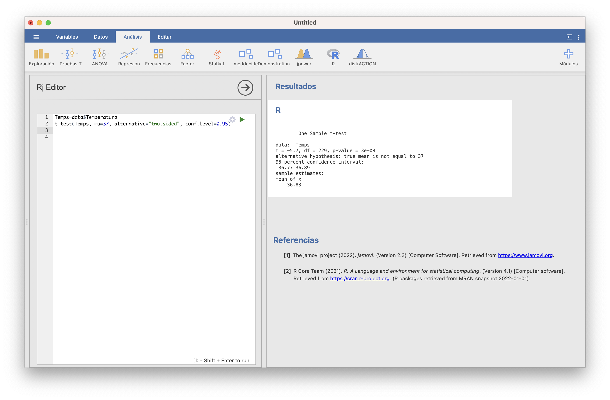
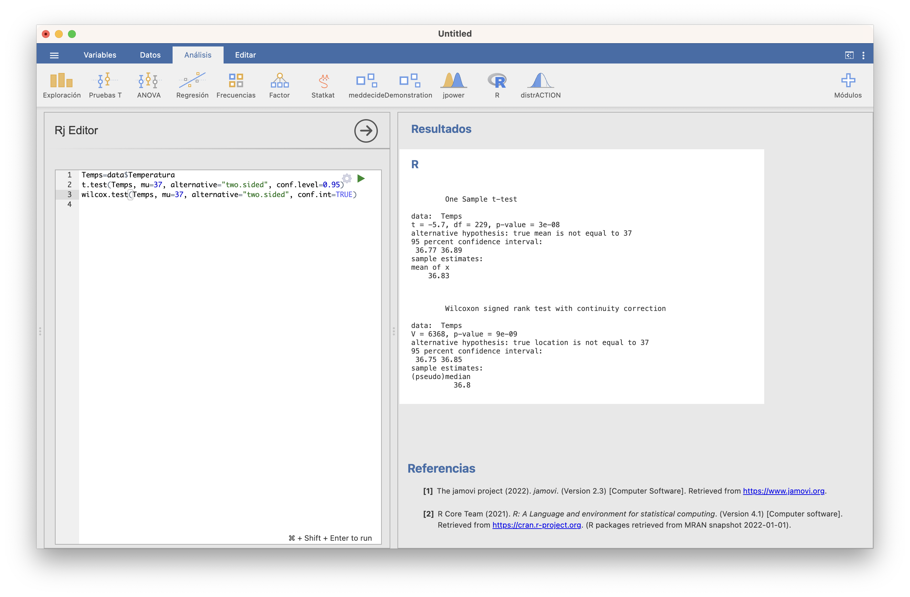
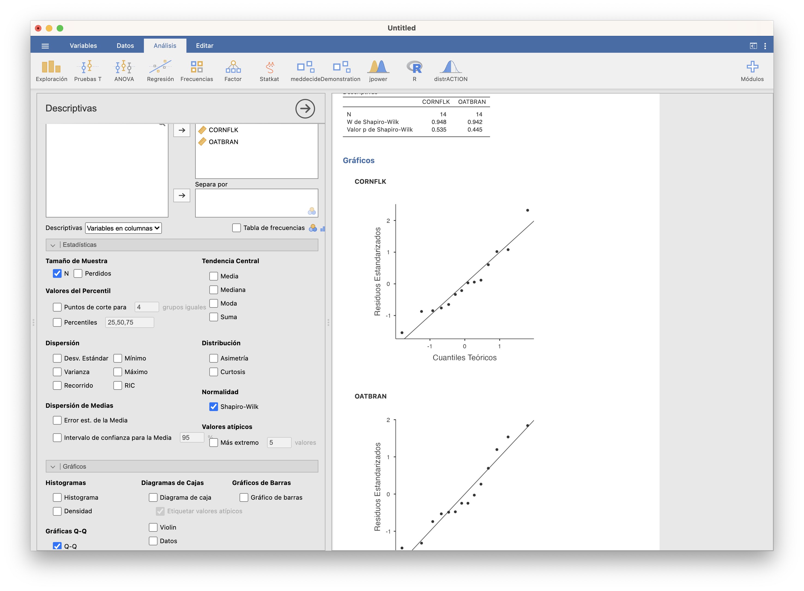
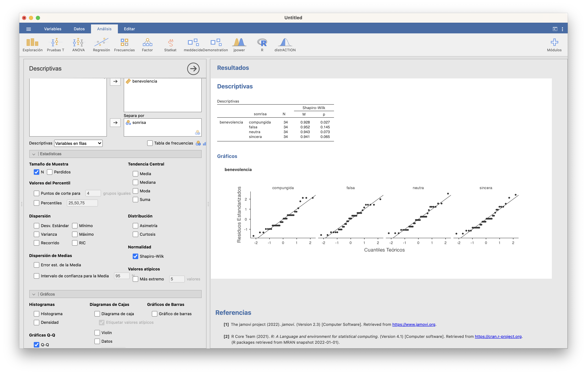
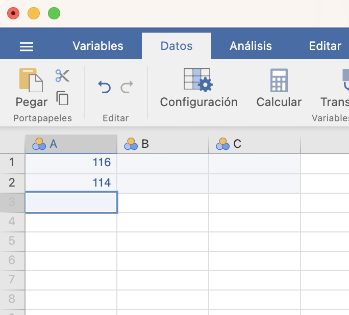
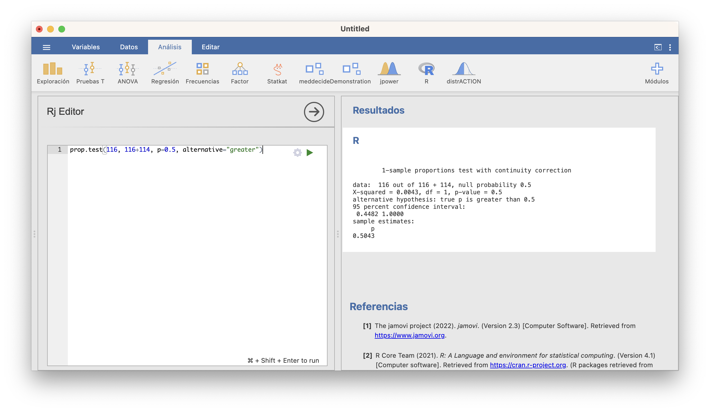
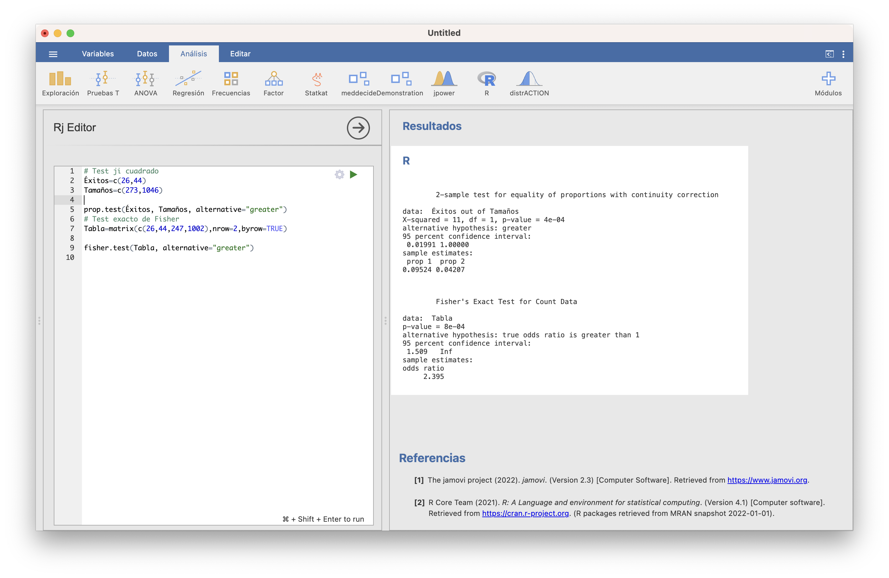
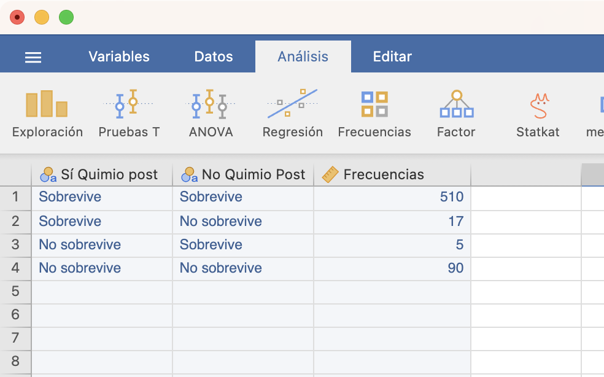
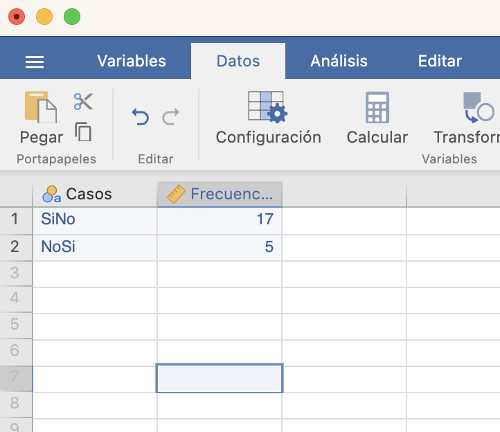

# Qué test usar?

En esta lección estudiamos los contrastes de hipótesis más frecuentes sobre medias, varianzas, proporciones, etc. El objetivo principal es, para cada tipo de contraste, explicar qué tests se pueden usar. Para la mayoría de estos tests no vamos a explicar las fórmulas de los estadísticos de contraste o intervalos de confianza, solo qué test usar en cada situación, cómo efectuarlos con JAMOVI y cómo interpretar los resultados. 

## Contrastes para medias

### Contrastes para una media

Sea $X$ una variable aleatoria de media $\mu$.  Queremos realizar un contraste sobre $\mu$, de la forma
$$
\left\{\begin{array}{l}
H_{0}:\mu=\mu_0\\ 
H_{1}:\mu \neq\mu_0\text{ o }\mu >\mu_0\text{ o }\mu<\mu_0
\end{array}
\right.
$$
Para ello, medimos $X$ sobre una muestra aleatoria simple de tamaño $n$.

#### Test t

Supongamos que estamos en una de las dos situaciones siguientes:

* $X$ es normal; o

* $X$ no es necesariamente normal pero el tamaño $n$ de la muestra que tomamos es grande (digamos, para fijar ideas, que $n\geqslant 40$).

En cualquiera de estas dos situaciones, podemos usar el **test t** que hemos explicado en la lección anterior para realizar el contraste.  JAMOVI lo ofrece en la sección **Prueba T en una muestra** del módulo **Pruebas T** (lo que abreviaremos a partir de ahora como **Pruebas T/Prueba T en una muestra**) de su instalación básica.


```{example,temp}
La temperatura media del cuerpo humano, ¿es el valor comúnmente aceptado de 37^o^ C?
```

Para empezar, tenemos que traducir esta pregunta a un contraste de hipótesis:

* **Variable aleatoria poblacional**: $X$: temperatura del cuerpo humano en ^o^C, de media $\mu$.

* **Contraste**: Nos preguntamos si $\mu=37^{\mathrm{o}}$ o no, por lo que el contraste es bilateral:
$$
\left\{\begin{array}{l}
H_{0}:\mu=37\\
H_{1}:\mu\neq 37
\end{array}\right.
$$

Para efectuar el contraste, necesitamos una muestra de temperaturas. Vamos a usar las recogidas por P. A. Mackowiak, S. S. Wasserman y M. M. Levine que ya usamos en el Ejemplo \@ref(exm:tempsIC), y que tenemos guardadas en la variable **Temperatura** de la tabla de datos **Temperaturas.txt**. 

Con JAMOVI, importamos el fichero  **Temperaturas.txt** en una tabla de datos (con **Importar especial**). Dando una ojeada a la tabla de datos (con el menú **Datos**), o usando la casilla *N* de **Exploración/Descriptivas**, vemos que la muestra es de tamaño 230, más que suficiente para poder usar un test t. 

Entonces, abrimos **Pruebas T/Prueba T en una muestra**;  seleccionamos  como variable dependiente la `Temperatura`;  entramos 37 en la casilla *Valor de la prueba*; y marcamos las casillas que se muestran en la figura que sigue. Obtenemos la tabla de la derecha de la figura (observad que JAMOVI llama  $H_a$ a nuestra hipótesis alternativa $H_1$):

```{r jamovit1,echo=FALSE,out.width="100%"}

```
    
El intervalo de confianza del 95% para la $\mu$ se obtiene sumando el valor que se contrasta (en nuestro caso 37) al "intervalo de confianza al 95%" obtenido, por lo tanto es [`r 37+c(-0.235,-0.114)`]. Sobre el p-valor, sólo nos dice que es menor que 0.001, no nos da su valor exacto.  En resumen, hemos encontrado evidencia estadísticamente significativa de que la temperatura media del cuerpo humano no es de 37^o^ C, y estimamos con un 95% de confianza que está entre 36.8^o^ C y 36.9^o^ C, o sea, entre una y dos décimas por debajo de 37^o^ C. Si esto es clínicamente importante o no para definir "fiebre" ya no es un problema de estadística.

En este caso, si queremos saber qué vale el p-valor (que es lo que en el tema anterior os recomendábamos publicar), tendremos que usar la función `t.test` de `R`. Esta función  `t.test` se aplica a un argumento formado por:

* el vector que contiene la muestra;
* el parámetro `mu` igualado al valor que contrastamos; 
* el paràmetro `alternative` que indica el tipo de contraste, igualándolo a `"two.sided"` (para contrastes bilaterales, es decir, con $\neq$), `"less"` ($<$) o `"greater"` ($>$); no os olvidéis de las comillas en los valores de este parámetro;
* el parámetro `conf.level` que indica el nivel de confianza $1-\alpha$, en nuestro caso 0.95, que corresponde a $\alpha=0.05$ (como este es el valor por defecto de este parámetro, no es necesario especificarlo).

```{r,include=FALSE}
data=read.table("Temperaturas.txt",header=TRUE)
Temps=data$Temperatura
t.test(Temps, mu=37, alternative="two.sided", conf.level=0.95)
```

JAMOVI ha importado el fichero **Temperaturas.txt** en una tabla de datos que ha llamado `data`. El código siguiente, ejecutado en la ventana de  **R/Rj Editor**, define un vector llamado `Temps` con la variable `Temperatura` de `data` y efectua el test t deseado:


```{r jamovit1.5,echo=FALSE,out.width="100%"}

```
    
El resultado contiene:

* El p-valor (`p-value`) del contraste: 3·10^-8^
* El intervalo de confianza del 95% (`95 percent confidence interval`): va de 36.77^o^ C a 36.89^o^ C
* La media muestral (`mean of x`): 36.83
    
    
#### Test no paramétrico

Si no podemos suponer que la variable aleatoria de interés sea normal y la muestra es pequeña, no podemos usar un test t. Entonces, hay que usar algún **test no paramétrico** que no requiera de la normalidad de la variable  poblacional. El recomendado en este caso es el [**Test de Wilcoxon**](https://en.wikipedia.org/wiki/Wilcoxon_signed-rank_test), aunque conviene tener presente que, en el fondo, este test compara medianas y no medias. Con JAMOVI, hay que marcar la casilla *Rangos de Wilcoxon* en vez de *t de Student* en **Pruebas T/Prueba T en una muestra**: 


```{r jamovit2,echo=FALSE,out.width="100%"}

```

Con `R` se usa la función `wilcox.test`, con la misma sintaxis que `t.test` salvo que, si eso, hay que indicar con `conf.int=TRUE` que queremos el intervalo de confianza para la temperatura media (en realidad, este intervalo, y el de JAMOVI, es para la *pseudomediana*: la mediana de las medias aritméticas de pares independientes de temperaturas, que coincide con la media si la distribución es simétrica), ya que por defecto no lo da:


```{r jamovit2b,echo=FALSE,out.width="100%"}

```


### Inciso: tests de normalidad

Muchos tests, como por ejemplo los tests t cuando las muestras son pequeñas, requieren que las variables poblacionales sea normales para que las conclusiones sean válidas. Para poder decidir si podemos aceptar o no que la variable poblacional es normal, se usa un **contraste de normalidad**, con hipótesis nula 
$$
H_0: \text{Esta muestra proviene de una variable aleatoria normal}
$$
e hipótesis alternativa 
$$
H_1: \text{No es verdad que esta muestra provenga de una variable aleatoria normal}
$$

Hay [muchos tests](https://en.wikipedia.org/wiki/Normality_test) que se pueden usar para efectuar este contraste. Por ejemplo, tras instalar el módulo **moretests** (que añade funcionalidades a los módulos básicos), cuando marcamos la casilla *Prueba de normalidad* al realizar algún test t, JAMOVI realiza tres tests de normalidad: el de **Shapiro-Wilk**, el de **Kolmogorov-Smirnov** y el de **Anderson-Darling**:


```{r jamoviN1,echo=FALSE,out.width="100%"}
knitr::include_graphics("INREMDN_files/figure-html/JAMOVI.N.1.png")
```

Os recomendamos que, en caso de disparidad de conclusiones según los p-valores (como pasa en nuestro ejemplo, donde el p-valor del test de Kolgomorov-Smirnov es mayor que 0.1 y los otros dos son 0.003) os quedéis con la conclusión del test de Shapiro-Wilk, que es el más fiable (el test de Kolmogorov-Smirnov es el más conocido, pero no es bueno detectando diferencias con la normal en las colas; el test de Anderson-Darling resuelve este problema, pero en muestras muy grandes tiende a dar muchos falsos positivos). El test de Shapiro-Wilk también está disponible en **Exploración/Descriptivas**. Con `R` se efectua con la función `shapiro.test` aplicado a la muestra. 

Así pues, como vemos, en nuestro ejemplo podemos rechazar que la muestra de temperaturas provenga de una variable normal. Esto no afecta a la validez de la conclusión del test t, porque la muestra era muy grande.

La conclusión de un test de normalidad se puede ilustrar con algún gráfico que  muestre si la muestra se ajusta o no a lo que sería de esperar si la distribución poblacional fuera normal. Por ejemplo, un histograma superponiendo la densidad de la normal de media y desviación típicas estimadas con la muestra. Otro de los gráficos más usados en este contexto son los q-q-plots. 

Un  **q-q-plot** de una muestra y una distribución teórica concreta (por ejemplo, una normal $N(\mu,\sigma)$) es el gráfico de los llamados **q-q-puntos**: los puntos de la forma 
$$
(q\text{-cuantil de la distribución téorica},\ q\text{-cuantil de la muestra}),
$$
para varios valores de $q$. Si la muestra proviene de la distribución teórica, es de esperar que el q-cuantil de la muestra sea muy parecido al q-cuantil de la distribución y por lo tanto que estos q-q-puntos estén cerca de la diagonal principal $y=x$.

JAMOVI dibuja un q-q-plot marcando la casilla *Gráfica Q-Q* en cualquier prueba t o en  **Exploración/Descriptivas**.


```{r jamoviN2,echo=FALSE,out.width="100%"}
knitr::include_graphics("INREMDN_files/figure-html/JAMOVI.N.2.png")
```


La función `qqPlot` del paquete **car** de `R`produce unos q-q-plots más adecuados, que además muestran una "región de confianza del 95%", con el significado usual de nivel de confianza (para el 95% de las muestras de la distribución, los q-q-plot caen dentro de esta región; por lo tanto, si nuestro q-q-plot sale fuera de esta región, tenemos evidencia de que la muestra no proviene de la distribución teórica). La sintaxis para usarla es la que sigue (cambiad `Temps` por la muestra de la que queráis dibujar el q-q-plot)

```{r}
library(car)
qqPlot(Temps, distribution="norm", mean=mean(Temps), sd=sd(Temps),
       ylab="Cuantiles de la muestra", xlab="Cuantiles de normal", 
       pch=20, id=FALSE)
```

La existencia de muchos q-q-puntos fuera de la franja de confianza nos vuelve a aportar evidencia de que la muestra de temperaturas no se ajusta a una distribución normal.


### Contrastes para dos medias

Sean ahora $X_1$ y $X_2$ dos variables aleatorias de medias $\mu_1$ y $\mu_2$, respectivamente. Queremos compararlas, mediante un contraste de la forma
$$
\left\{\begin{array}{l}
H_{0}:\mu_1=\mu_2\\ 
H_{1}:\mu_1 \neq\mu_2\text{ o }\mu_1 >\mu_2\text{ o }\mu_1<\mu_2
\end{array}
\right.
$$
Para ello, medimos $X_1$ sobre una muestra aleatoria simple de tamaño $n_1$, y $X_2$ sobre una muestra aleatoria simple de tamaño $n_2$.

#### Tests t


Supongamos que estamos en una de las dos situaciones siguientes:

* $X_1,X_2$ son  ambas normales; o

* $X_1,X_2$ no son necesariamente ambas normales pero los tamaños $n_1,n_2$ de las muestras  son **ambos** grandes (digamos, para fijar ideas, que $n_1,n_2\geqslant 40$).

Si se cumple alguna de estas dos condiciones, podemos usar un **test t**, basado en un estadístico de contraste $T$ adecuado con distribución t de Student. Los estadísticos de contraste concretos y los grados de libertad de su distribución t de Student son los que dimos al hablar de intervalos de confianza para la diferencia de dos medias en el tema anterior, y dependen de las mismas condiciones que comentábamos allí:

* De si las dos muestras son:

    * **independientes**: hemos medido $X_1$ y $X_2$ sobre dos muestras aleatorias simples obtenidas de manera independiente la una de la otra; o 
    
    * **emparejadas**: hemos medido $X_1$ y $X_2$ sobre los individuos de una misma muestra aleatoria simple o hay un emparejamiento natural entre los sujetos de las dos muestras. 
    
```{block2, type="rmdnote"}
En el caso emparejado, podemos entender que tenemos una sola muestra, formada por los sujetos que medimos dos veces o por las parejas de sujetos. Entonces, podemos considerar la diferencia $D=X_1-X_2$, que tendrá media poblacional $\mu_D=\mu_1-\mu_2$, y traducir el contraste
$$
\left\{\begin{array}{l}
H_{0}:\mu_1=\mu_2\\ 
H_{1}:\mu_1 \neq\mu_2\text{ o }\mu_1 >\mu_2\text{ o }\mu_1<\mu_2
\end{array}
\right.
$$
en el contraste de una sola media
$$
\left\{\begin{array}{l}
H_{0}:\mu_D=0\\ 
H_{1}:\mu_D \neq 0\text{ o }\mu_D >0\text{ o }\mu_D<0
\end{array}
\right.
$$
Es decir, cuando las muestras son emparejadas, consideramos nuestro contraste de dos medias como un contraste de una sola media, usando como muestra las diferencias $X_1-X_2$ sobre nuestras parejas de sujetos.
```
    
    
* Cuando las muestras son independientes, la prueba concreta a efectuar también depende de si las variables poblacionales $X_1$ y $X_2$ tienen la **misma varianza** o no, que en principio se ha de decidir con otro contraste.


Todos estos tests t están implementados en la función `t.test` de `R` y en el módulo  **Pruebas T** de JAMOVI. 


```{example,tempHD}
La temperatura media de las hombres, ¿es menor que la de las mujeres?
```

Traducimos esta pregunta en un contraste de hipótesis:


* **Variables aleatorias poblacionales**:
 
    * $X_m$: temperatura de un hombre (M) en ^o^C, de media $\mu_f$
    * $X_f$: temperatura de una mujer (F) en ^o^C, de media $\mu_f$


* **Contraste**: Nos preguntamos si $\mu_m$ es menor que $\mu_f$
$$
\left\{\begin{array}{l}
H_{0}:\mu_m=\mu_f\\
H_{1}:\mu_m< \mu_f
\end{array}\right.
$$

Necesitamos una muestra de temperaturas de hombres y de mujeres. La  tabla de datos **Temperaturas.txt** que hemos usado en los ejemplos anteriores contiene una variable **Sexo** con el  sexo de los sujetos: M para hombres y F para mujeres. La muestra fue transversal, así que las muestras de hombres y mujeres son independientes (las que salieron en la muestra global). 

Con JAMOVI, tras importar el fichero  **Temperaturas.txt** en una tabla de datos, calculamos los tamaños de ambas muestras con la casilla *N* de **Exploración/Descriptivas**, seleccionando  como variable dependiente la `Temperatura` y como variable de agrupación el `Sexo`. Aprovechamos para calcular los estadísticos básicos de cada muestra y dibujar sus boxplot:


```{r jamovit2.5,echo=FALSE,out.width="100%"}

```

Vemos que las temperaturas de las mujeres (F), y en particular su media y su mediana, son ligeramente mayores que las de los hombres (M). Como las muestras de mujeres y  hombres  son lo bastante grandes (116 y 114 sujetos, respectivamente), podemos usar un test t para realizar el contraste.
Para ello, usamos **Pruebas T/Prueba T para muestras independientes** y seleccionamos de nuevo como variable dependiente la `Temperatura` y como variable de agrupación el `Sexo`. Como en la variable `Sexo` las mujeres son F y los hombres M y JAMOVI los va a tomar ordenados alfabéticamente, la hipótesis alternativa tiene que ser *Grupo 1 > Grupo 2*, es decir, con las notaciones que usamos, $\mu_f>\mu_m$. 

En esta ventana, la casilla *t de Student* corresponde al test suponiendo varianzas poblacionales iguales y la casilla *t de Welch* al test suponiendo varianzas poblacionales diferentes. Vamos a efectuar los dos tests de golpe, y cruzaremos los dedos para que den la misma conclusión:

```{r jamovit3,echo=FALSE,out.width="100%"}

```


En ambos casos el p-valor es (redondeado)  0.005, muy pequeño. Así, pues, hemos obtenido evidencia estadísticamente significativa de que los hombres tienen una temperatura corporal media inferior a la de las mujeres. Además, ambos intervalos de  confianza del 95% para $\mu_f-\mu_m$ van de alrededor de 0.056 a  $\infty$ (*Inf*), por lo que tenemos un 95% de confianza de que la temperatura corporal media es 6 centésimas de grado mayor en las mujeres que en los hombres. La diferencia de las medias muestrales $\overline{X}_f-\overline{X}_m$  ha  sido  0.155^o^ C, es decir, la media muestral de temperaturas de mujeres ha sido 0.16^o^ C mayor que en los hombres. 

¿Qué pasaría si los tests suponiendo varianzas iguales y diferentes hubieran dado resultados diferentes? En este caso tendríamos que decidir qué conclusion nos creemos, decidiendo si podemos aceptar o rechazar que las varianzas poblacionales sean iguales o no. Podéis contrastar la igualdad de varianzas en esta misma ventana marcando la casilla *Test de homogeneidad*, que efectua el contraste con hipótesis nula que las dos varianzas poblacionales son iguales e hipótesis alternativa que son diferentes. Con el módulo **moretests** instalado, da el resultado de dos tests: el de **Levene** y el **test F** (*Variance ratio*). Ya volveremos sobre ellos en la próxima sección. En todo caso, como su p-valor es grande, aquí aceptaríamos que las dos varianzas poblacionales son iguales. 


```{r jamovit3.5,echo=FALSE,out.width="100%"}

```


Si preferís usar la función `t.test`, hay que entrar como argumentos:

* Los vectores que contienen la muestra de $X_1$ y la muestra de $X_2$.

* El tipo de contraste, que se especifica con el parámetro `alternative` como en el caso de una sola media.

* El tipo de muestras, que se especifica igualando el parámetro `paired` a `FALSE` si son independientes o a `TRUE` si son emparejadas.

* En caso de muestras independientes, si las varianzas son iguales o diferentes, que se especifica igualando el parámetro `var.equal` a `TRUE`  o a `FALSE`, respectivamente.

* El nivel de confianza, que se especifica con el parámetro `conf.level` como en el caso de una sola media y no hace falta si es 0.95.


El código siguiente define vectores `TempsH` y `TempsM` con las temperaturas de los hombres y las mujeres de esta tabla, y efectua los tests t suponiendo que las varianzas son iguales y que son diferentes, respectivamente

```{r jamovit2.7,echo=FALSE,out.width="100%"}
knitr::include_graphics("INREMDN_files/figure-html/JAMOVI.t.2.7.png")
```


#### Tests no paramétricos

Si no podemos suponer que las variables aleatorias  de interés sean normales y si  alguna muestra es pequeña, hay que usar algún **test no paramétrico**.
Para contrastes de dos medias, los recomendados son:

* **Test de Wilcoxon** para muestras emparejadas (que, recordad, se traduce en un contraste sobre la media de las diferencias, y en los contrastes de una media ya recomendábamos el test de Wilcoxon).

* [**Test de Mann-Whitney**](https://en.wikipedia.org/wiki/Mann–Whitney_U_test) para muestras independientes.

En JAMOVI se marcan las casillas *rangos de Wilcoxon* o *U de Mann-Whitney*, según corresponda. 

```{block2,type="rmdimportant"}
Usad tests paramétricos siempre que podáis, pero solo cuando podáis.
Los mejores tests no paramétricos suelen tener potencia inferior a los mejores tests paramétricos. Pero usar, por ejemplo, un test t cuando no toca, porque alguna variable no sea normal y alguna muestra sea pequeña, puede llevar a conclusiones equivocadas.
```

Con R, ambos tests se calculan con la función `wilcox.test`, con una sintaxis idéntica a la de `t.test` para dos muestras excepto que no dispone del parámetro `var.equal` (ya que ahora no nos interesa lo más mínimo saber si las variables tienen varianzas iguales o diferentes en el caso de contrastes de dos medias con muestras independientes) y hay que usar el parámetro `conf.int=TRUE` si se quiere un intervalo de confianza (para la diferencia de las pseudomedianas de $X_1$ y $X_2$). 


```{block2,type="rmdnote"}
En el caso de dos muestras, para comprobar si ambas muestras se ajustan a variables normales con JAMOVI, no podemos hacerlo desde el módulo **Pruebas T** sino desde **Exploración/Descriptivas**. En nuestro ejemplo (véase la figura que sigue),  tenemos que separar  la variable `Temperatura` según el `Sexo`. Marcando la casilla *Shapiro-Wilk*, obtenemos los p-valores del test de Shapiro-Wilk tanto para F como para M. Ambos son menores que 0.05, así que podemos rechazar que las muestras provengan de distribuciones normales.
```


```{r jamovitN3,echo=FALSE,out.width="100%"}

```


Veamos otro ejemplo.

```{example,oatbran}
Desayunar salvado de avena (*oat bran*) en lugar de copos de maíz (*corn flakes*), ¿ayuda a reducir el nivel de colesterol?
  
  
```

Planteémoslo como un contraste de hipótesis. Las variables aleatorias poblacionales de interés son:

* $X_{ob}$: nivel de colesterol al consumir salvado de avena, de media $\mu_{ob}$
* $X_{cf}$: nivel de colesterol al consumir copos de maíz, de media $\mu_{cf}$

El contraste que queremos realizar es
$$
\left\{\begin{array}{l}
H_{0}:\mu_{ob}=\mu_{cf}\\
H_{1}:\mu_{ob}< \mu_{cf}
\end{array}\right.
$$


Para hacerlo, vamos a usar los datos obtenidos por J. Anderson *et al* en su estudio ["Oat-bran cereal lowers serum total and LDL cholesterol in hypercholesterolemic men"](https://academic.oup.com/ajcn/article-abstract/52/3/495/4650821) (*The American Journal of Clinical Nutrition* 52 (1990), pp. 495-499). Se trata de un ensayo clínico cruzado sobre 14 individuos. A cada uno de ellos se le asignó uno de los dos desayunos de manera aleatoria y lo tomaron durante 15 días. Al final de este periodo, se les midió el nivel de colesterol en sangre. Pasado un mes de descanso, cada participante desayunó durante 15 días el otro producto, y al final se los volvió a medir el nivel de colesterol en sangre. Tenemos los niveles de colesterol que obtuvieron en la tabla de datos **oatbran.txt**, donde están medidos en milimoles por litro (mmol/l), así que esta será la unidad que tomamos en las variables poblacionales. 

Con JAMOVI, importamos el fichero  **oatbran.txt** en una tabla de datos. Como las muestras son pequeñas (de tamaño 14), si queremos aplicar un test t necesitamos poder aceptar que provienen de variables normales. Vamos a  **Exploración/Descriptivas**, escogemos ambas variables, `CORNFLK` y `OATBRAN`, y marcamos el test de Shapiro-Wilk (y, ya que estamos, las gráficas Q-Q):


```{r jamoviN4,echo=FALSE,out.width="100%"}

```

Ambos p-valores son muy grandes, así que vamos a aceptar que ambas muestras provienen de variables normales y usaremos un test t de dos medias.

En este caso, como las muestras son emparejadas (hemos medido las dos variables aleatorias sobre los mismos individuos), hay que elegir **Pruebas T/Prueba t para muestras emparejadas**. Cuidado con la hipótesis alternativa: como JAMOVI toma como primera variable `CORNFLK` y segunda variable `OATBRAN` y nuestra hipótesis alternativa es que los *oat bran* reducen el nivel de colesterol respecto de los *corn flakes*, hemos de marcar "Medida 1 > Medida 2".


```{r jamovit4,echo=FALSE,out.width="100%"}

```


Obtenemos un p-valor de 0.003. Por lo tanto, hemos encontrado evidencia estadísticamente significativa de que desayunar salvado reduce el nivel medio de colesterol respecto de desayunar  copos de maíz. El intervalo de confianza del 95% para $\mu_{cf}-\mu_{ob}$ va de 0.163 a $\infty$. Por lo tanto, tenemos un 95% de confianza en que desayunar salvado reduce en al menos 0.163 mmol/l el nivel medio de colesterol respecto de desayunar  copos de maíz.

¿Y si no quisiéramos, o no pudiéramos, suponer que las muestras provienen de distribuciones normales? Entonces usaríamos un test de Wilcoxon:


```{r jamovit5,echo=FALSE,out.width="100%"}

```


El p-valor da 0.006, por lo que la conclusión es la misma.


```{block2,type="rmdexercici"}
Típica pregunta de MIR (esta, de 2017):

El grosor del pliegue subcutáneo de grasa a nivel del tríceps se utiliza a veces para evaluar la cantidad de grasa corporal. Esta variable no se distribuye normalmente en las poblaciones. Queremos comparar el valor medio de esta variable en dos poblaciones que suponemos presentan distinta condición nutricional. La prueba estadística más adecuada para contrastar la hipótesis es: 

* La prueba de Mann-Whitney.  
* La prueba t de Student.  
* El cálculo del coeficiente de correlación de Pearson. 
* La prueba F de Snedecor.

```

### Contrastes para más de dos medias

Sean ahora $X_1,X_2,\ldots, X_k$ $k$ variables aleatorias de medias $\mu_1,\mu_2,\ldots,\mu_k$ y desviaciones típicas $\sigma_1,\sigma_2,\ldots,\sigma_k$, respectivamente. Normalmente, se tratará de una misma variable aleatoria definida sobre $k$ poblaciones diferentes.

Nos preguntamos si es verdad o no que estas $k$ variables tienen la misma media. Es decir, planteamos el contraste
$$
\left\{\begin{array}{l}
H_{0}:\mu_1=\mu_2=\cdots=\mu_k\\ 
H_{1}:\text{No es verdad que } \mu_1=\mu_2=\cdots=\mu_k
\end{array}
\right.
$$
Para ello, medimos cada $X_i$ sobre una muestra aleatoria simple de tamaño $n_i$. 
```{block2,type="rmdimportant"}
Observad que $H_1$ en el contraste anterior es equivalente a
$$
\text{Existen $i,j$ tales que } \mu_i \neq \mu_j
$$
**no** a
$$
\mu_i \neq \mu_j \text{ para todos los pares $i,j$ con $i\neq j$} 
$$
```


```{example, somriures}
En un estudio (publicado en *Personality and Social Psychology Bulletin* 21 (1995), pp. 207-214) se quiso determinar si la benevolencia con la se juzga a una persona depende de cómo sonríe.
```

Para ello se seleccionaron 136 personas, que se dividieron al azar en  4 grupos de 34. A las personas de cada grupo se les pasó un dosier donde se acusaba a un hombre de una falta grave (en un contexto universitario) y, tras estudiarlo, se les pusieron cinco preguntas sobre la culpabilidad del acusado y el castigo que se merecía. A partir de las respuestas de cada sujeto, se calculó un "índice de benevolencia" de cómo había juzgado al acusado. 

Los dosieres eran idénticos, excepto la foto del acusado: mismo hombre, pero diferente tipo de sonrisa:


```{r somriures1,echo=FALSE,out.width="100%"}
knitr::include_graphics("INREMDN_files/figure-html/somriures.png")
```

Tenemos los índices obtenidos en el fichero **smiles.txt**. Veamos sus estadísticos básicos y un diagrama de caja.


```{r somriuresJ1,echo=FALSE,out.width="100%"}

```

Vemos que la sonrisa neutra ha generado una menor benevolencia y la falsa, mayor. Queremos determinar si las diferencias son lo bastante grandes para aportar evidencia que la benevolencia depende de la sonrisa.


En este caso tenemos una variable aleatoria, el índice de benevolencia con el que se juzga al acusado, definida sobre cuatro subpoblaciones definidas por el tipo de sonrisa en la foto. Llamemos $\mu_s$, $\mu_f$, $\mu_c$ y $\mu_n$ a sus medias: los índices de benevolencia medios con los que se juzga el dosier cuando la sonrisa es sincera, falsa, compungida o neutra, respectivamente.

Entonces, queremos realizar el contraste
$$
\left\{
\begin{array}{l}
H_0 : \mu_s=\mu_{f}=\mu_{c}=\mu_{n} \\
H_1 : \mbox{Hay algún par de sonrisas }i,j\mbox{ tales que }  \mu_i \neq \mu_j
\end{array}
\right.
$$

Un posible modo de resolver este contraste sería realizar los seis contrastes de pares de medias $\mu_i=\mu_j$ contra $\mu_i\neq \mu_j$, pero esto aumenta la probabilidad de error si no ajustamos los p-valores. Y tenemos que comparar todas las medias dos a dos, porque podría pasar, por ejemplo, que no pudiéramos rechazar que $\mu_n= \mu_s$ ni que $\mu_s= \mu_f$, pero sí que pudiéramos rechazar que $\mu_n= \mu_f$.

Lo que queremos es un test que nos diga en un solo paso si todas las medias son iguales o no. La técnica más usual es el **Análisis de la Varianza** (**ANOVA**, del inglés *ANalysis Of  VAriance*). Esta técnica se puede aplicar bajo diferentes diseños  experimentales: por ejemplo,  según cuántos factores usemos para separar la población en subpoblaciones (uno o varios) o según cómo escojamos las muestras (independientes o emparejadas).

La idea básica del ANOVA es que tenemos evidencia de que no todas las medias poblacionales son iguales si la variabilidad de las medias poblacionales es muy grande en relacion a la variabilidad total de los datos obtenidos: de ahí la **VA**riancia en el nombre. Esta variabilidad relativa se mide mediante un estadístico de contraste adecuado que, si todas la medias poblacionales son iguales y se satisfacen las condiciones adecuadas, tiene una distribución conocida (llamada **F de Fisher-Snedecor**: es la distribución de un cociente de dos variables $\chi^2$ independientes, y sus parámetros son los grados de libertad de estas dos distribuciones $\chi^2$).  Por lo tanto podemos usar esta distribución para calcular un p-valor que nos dé lo improbablemente grande que es la variabilidad de las medias muestrales si las medias poblacionales fueran todas iguales. 

#### Diseño ANOVA de un factor

En un estudio de diseño **ANOVA de un factor** (*One way ANOVA*):

* Usamos un solo factor para clasificar la población en subpoblaciones.

* Tomamos una muestra aleatoria simple de la variable aleatoria sobre cada subpoblación, independientes unas de otras.

El Ejemplo \@ref(exm:somriures) es de tipo ANOVA de 1 factor: el factor que usamos para clasificar los índices de benevolencia es el tipo de sonrisa en la foto, y hemos tomado una muestra de índices de benevolencia para cada tipo de sonrisa, independientes las unas de las otras porque hemos asignado las fotos al azar a los participantes.

##### ANOVA de un factor {-}

Supongamos que tenemos que realizar una comparación de medias en un estudio de diseño ANOVA de 1 vía. Si se cumple además que:

* Cada una de las $k$ variables aleatorias de las que hemos tomado muestras sigue una ley normal

* **Homocedasticidad** o **homogeneidad**: Todas estas variables tienen la misma varianza, $\sigma^2$. 

Entonces podemos usar un test ANOVA. JAMOVI ofrece el ANOVA de 1 vía en **ANOVA/ANOVA de Un Factor**. 

```{example}
Sigamos con el Ejemplo \@ref(exm:somriures). Ya hemos cargado la tabla. Efectuamos los tests de Shapiro-Wilks (separando la variable `benevolencia` según el factor `sonrisa`) y obtenemos los 4 p-valores por encima de 0.05, así que vamos a aceptar que para los cuatro tipos de sonrisas los índices de benevolencia se ajustan a distribuciones normales.
```


```{r somriuresJ2,echo=FALSE,out.width="100%"}

```

Abriendo entonces  **ANOVA/ANOVA de Un Factor**, separamos de nuevo la variable dependiente `benevolencia` según el factor `sonrisa`, marcamos la *Prueba de homogeneidad* para saber si podemos aceptar o no que las varianzas poblacionales son todas iguales, y como el p-valor de ambos tests es grande, marcamos la casilla *Asumir iguales (Fisher)*, que efectua el test ANOVA.


```{r somriuresJ3,echo=FALSE,out.width="100%"}

```

El p-valor es 0.018, por lo que obtenemos evidencia estadística de que al menos un par de medias son diferentes.

```{block2,type="rmdnote"}
Un ANOVA de 1 factor aplicado a solo dos medias es equivalente a un test t para dos medias suponiendo varianzas iguales.
```


También podéis usar **ANOVA/ANOVA** para efectuar un ANOVA de un factor, mucho más rico en opciones (pero para el nivel de este curso casi todas innecesarias).

##### Alternativas {-}

El test ANOVA de Fisher es bastante robusto a una ligera desviación de la normalidad de las muestras, pero deja estrepitosamente de ser válido si las varianzas poblacionales no son iguales.

Si las variables poblacionales son normales, pero no podemos aceptar que tengan todas la misma varianza, lo recomendado es usar una variante llamada **ANOVA de Welch**, y que en JAMOVI se ejecuta marcando *No asumir iguales (Welch)* en lugar de *Asumir iguales (Fisher)*.  

Otra posibilidad es usar  el test no paramétrico de Kruskal-Wallis, que extiende a más de dos medias el test de Mann-Whitney. JAMOVI lo ofrece en **ANOVA/No paramétrico/ANOVA de Un Factor: Kruskall-Wallis**. 


#### Tests *post hoc* {-}

Si hemos rechazado la hipótesis nula $H_0:\mu_1=\cdots =\mu_k$, nos puede interesar estimar qué parejas de niveles tienen medias diferentes. La manera más popular es realizar los $\binom{k}{2}$ contrastes
$$
\left\{
\begin{array}{ll}
H_0 &: \mu_i=\mu_j \\
H_1 &: \mu_i \neq \mu_j
\end{array}
\right.
$$
usando un test t adecuado (si las muestras se ajustan a normalidad o son lo bastante grandes) o un test de Mann-Whitney (si no se puede usar un test t para todos los pares de medias). En caso de homogeneidad de varianzas, el test t no es exactamene el que hemos explicado para pares de medias y varianzas iguales porque usa todas las muestras, y no solo las dos involucradas, para estimar el error típico. 

Pero hay que ir con cuidado con el nivel de significación global. Como vimos en el tema anterior, si efectuamos muchos contrastes de pares de medias, la probabilidad de cometer un error de tipo I *en alguno* aumenta, por lo que hay que reducir el nivel de significación con el que los efectuamos o, equivalentemente, ajustar los p-valores. En **ANOVA/ANOVA de Un Factor** JAMOVI efectua un ajuste por defecto que es más que suficiente para nuestros propósitos. Si queréis usar  otros ajustes, por ejemplo el de Bonferroni que mencionábamos en el tema anterior  (multiplicar los p-valores por el número de tests), los encontraréis en **ANOVA/ANOVA/Pruebas Post Hoc**. Normalmente no habrá grandes diferencias en las conclusiones de los tests según el método de ajuste usado.

```{example}
Seguimos con nuestro ejemplo sobre la benevolencia que suscitan los diferentes tipos de sonrisa. Con un ANOVA de 1 factor hemos obtenido evidencia seignificativa de que hay al menos un par de sonrisas con índices de benevolencia medios diferentes. Vamos a investigar cuáles.
```

Antes de nada, un gráfico: en **ANOVA/ANOVA de Un Factor** pedimos que añada "Gráficas Descriptivas":


```{r somriuresJ6,echo=FALSE,out.width="100%"}

```

Nos da los intervalos de confianza del 95% para las cuatro medias. Observad que todos los pares de intervalos de confianza se solapan salvo dos: el de la sonrisa falsa y el de la sonrisa neutra. Este gráfico nos aporta evidencia de que estas dos medias no son iguales (cada una pertenece a su intervalo de confianza con una confianza del 95%, y estos dos intervalos son disjuntos) y nos indica que los otros pares de medias pueden ser iguales  (sus intervalos de confianza no son disjuntos). Esto es solo una indicación gráfica del resultado que tenemos que esperar, pero no nos da el resultado del test con la confianza que deseamos: las conclusiones se basan en que *todos* los IC 95% aciertan, y la probabilidad de que eso ocurra es menor que 0.95.
 
Vamos ya a realizar las comparaciones posteriores por parejas.
Usamos para ello la ventana **ANOVA/ANOVA de Un Factor/Pruebas Post-Hoc**. Como hemos aceptado que las variables poblacionales son todas iguales, marcamos *Tukey (varianzas iguales)*:


```{r somriuresJ4,echo=FALSE,out.width="100%"}

```

En la tabla obtenemos la diferencia de medias "fila menos columna" y el p-valor del test para cada par formado por las medias para el tipo de sonrisa de la fila y el de la columna. Los p-valores están ajustados por el mmétodo de Tukey, demasiado complicad para explicarlo aquí,  así que tenemos que compararlos directamente con el nivel de significación elegido. Si este es 0.05, observamos que solo obtenemos evidencia de diferencia de medias para el par sonrisa falsa-sonrisa neutra. Para el resto de pares de medias no podemos rechazar que sean iguales. Era lo que esperábamos.

Si quisiéramos usar por ejemplo el ajuste de Bonferroni, tendríamos que efectuar el ANOVA con **ANOVA/ANOVA**:


```{r somriuresJ5,echo=FALSE,out.width="100%"}

```

Hemos marcado también la columna de p-valores sin ajustar ("p") y la del ajuste de Tukey para que veáis que el ajuste de Bonferroni consiste en tomar el mínimo de 1 y el resultado de multiplicar el p-valor por 6 (el número total de contrastes de pares de medias) y podáis comparar los valores ajustados de Bonferroni con los de Tukey. La conclusión con los dos tipos de ajuste es la misma.


##### Continuará

## Contrastes para varianzas

### Contrastes bilaterales para dos varianzas

Sean $X_1$ y $X_2$ dos variables aleatorias de desviaciones típicas $\sigma_1$ y  $\sigma_2$. Queremos realizar el contraste 
$$
\left\{\begin{array}{l}
H_{0}:\sigma_1=\sigma_2\\
H_{1}:\sigma_1\neq \sigma_2
\end{array}
\right.
$$
o, equivalentemente, 
$$
\left\{\begin{array}{l}
H_{0}:\sigma_1^2=\sigma_2^2\\
H_{1}:\sigma_1^2\neq \sigma_2^2
\end{array}
\right.
$$


Si $X_1$ y $X_2$ son **las dos normales**, podemos usar el **test F**. Este test usa como estadístico de contraste el cociente de varianzas muestrales,   $\widetilde{S}^2_{X_1}/\widetilde{S}^2_{X_2}$, que, si $\sigma_1=\sigma_2$, tiene  distribución F de Fisher-Snedecor, de ahí el nombre del test.

Con JAMOVI, se realiza marcando la casilla *Test de homogeneidad* al llevar a cabo un test t de dos muestras independientes con el módulo **moretests** instalado: es el resultado de la fila "Variance ratio".  Con `R` se realiza con la función `var.test`  aplicada a las dos muestras y además os da un intervalo de confianza para el cociente $\sigma_1^2/\sigma_2^2$. La ventaja de `var.test` es que también permite efectuar contrastes unilaterales, especificando el parámetro `alternative`.

El test F no és válido a poco que las variables $X_1$ o $X_2$ difieran de normales, incluso aunque las muestras sean grandes. Si no podemos aceptar que $X_1$ y $X_2$ sean normales, es necesario usar un test no paramétrico. JAMOVI usa el [**test de Levene**](https://en.wikipedia.org/wiki/Levene%27s_test), que lleva a cabo marcando la mencionada casilla *Test de homogeneidad*. 

Ya hemos visto un ejemplo de contraste bilateral de varianzas en el Ejemplo \@ref(exm:tempHD).

### Contrastes de homogeneidad para más de dos varianzas

Sean ahora $X_1,X_2,\ldots,X_k$ $k$ variables aleatorias, de desviaciones típicas $\sigma_1,\sigma_2,\ldots,\sigma_k$ respectivamente.. Queremos realizar el contraste 
$$
\left\{\begin{array}{l}
H_{0}:\sigma_1=\sigma_2=\cdots=\sigma_k\\
H_{1}: \text{Hay algún par }i,j\text{ tal que }\sigma_1\neq \sigma_2
\end{array}
\right.
$$
o, equivalentemente, 
$$
\left\{\begin{array}{l}
H_{0}:\sigma_1^2=\sigma_2^2=\cdots=\sigma_k^2\\
H_{1}: \text{Hay algún par }i,j\text{ tal que }\sigma_1^2\neq \sigma_2^2
\end{array}
\right.
$$

Si todas las variables son normales, lo mejor es usar el [**test de Bartlett**](https://en.wikipedia.org/wiki/Bartlett%27s_test), pero si alguna muestra no se ajusta a una variable normal, conviene usar algún test no paramétrico. JAMOVI ofrece el **test de Levene**, que también sirve para dos medias, ya está bien. 

Como hemos visto en la sección anterior, ambos tests se pueden efectuar marcando la casilla *Prueba de homogeneidad* al hacer un ANOVA de un factor con **ANOVA/ANOVA de Un Factor** y el módulo *moretests* instalado.


## Contrastes para proporciones

### Contrastes para una proporción


Sea $X$ una variable aleatoria Bernoulli de parámetro $p$. Queremos realizar un contraste
$$
\left\{\begin{array}{l}
H_{0}:p=p_0\\ 
H_{1}:p\neq p_0\text{ o }p> p_0\text{ o }p< p_0
\end{array}
\right.
$$

Tomamos una muestra aleatoria simple de $X$ de tamaño $n$.


#### Test binomial

Como vimos en el tema anterior, siempre podemos usar el **test binomial**, que usa que  si $p=p_0$, el número de éxitos en una m.a.s. de tamaño $n$ tiene distribución $B(n,p_0)$. Para llevarlo a cabo con JAMOVI, podemos usar   **Frecuencias/Prueba binomial**. 


```{example, sexes}
La muestra de personas recogidas en la tabla de datos de temperaturas usada hasta ahora fue transversal, sin números prefijados de hombres y mujeres. Su composición en sexos, ¿aporta evidencia estadística de que la proporción de mujeres en la población es estrictamente mayor que la de hombres?
  
```

Sea $p$ la proporción de mujeres en la población. Podemos traducir la pregunta planteada en el contraste

$$
\left\{
\begin{array}{l}
H_0:p=0.5\\
H_1:p>0.5
\end{array}
\right.
$$

La ventana del test binomial para este contraste con JAMOVI es:


```{r jamovip1,echo=FALSE,out.width="100%"}

```

JAMOVI ha realizado el test binomial para las mujeres (F) y para los hombres (M): el que nos interesa es el primero. Con un p-valor 0.474 y un intervalo de confianza para $p$ de 0.448 a 1, no podemos rechazar que p sea 0.5.

Si no disponemos de la tabla de datos sino solo de las frecuencias, tenemos que entrarlas como una variable en una tabla de datos:

```{r jamovip1.2,echo=FALSE,out.width="40%"}

```

y al cargar la variable en la ventana **Frecuencias/Prueba binomial**, marcar la casilla *Los valores son frecuencias*:


```{r jamovip1.3,echo=FALSE,out.width="100%"}

```


#### Test aproximado

Si el tamaño $n$ de la muestra es grande  (digamos $\geqslant 40$), podemos usar el **test aproximado** basado en que, si $H_0: p=p_0$ es verdadera y $n$ es grande, por el Teorema Central del Límite
$$
\frac{\widehat{p}_X-p_0}{\sqrt{\frac{\widehat{p}_X(1-\widehat{p}_X)}{n}}}\approx N(0,1)
$$

Este test es mucho más popular que el binomial, porque se puede efectuar "a mano" con una simple calculadora. Curiosamente, JAMOVI no lo implementa tal cual (solo un test equivalente y solo para el contraste bilateral, en **Frecuencias/Prueba de proporciones (N resultados)**; volveremos sobre él al hablar de contrastes para dos, o más, proporciones), pero podéis usar la función `prop.test` de `R`, aplicada a: el número de éxitos; el tamaño total de la muestra; el parámetro `p` igualado al valor a contrastar $p_0$; el parámetro `alternative` igualado al tipo de contraste; y el parámetro `conf.level` igualado al nivel de confianza (si es 0.95, no hace falta especificarlo). En esta función `R` usa por defecto una corrección de continuidad que se suele usar al aproximar variables aleatorias discretas por medio de variables continuas y que suele mejorar los resultados del test. Podéis cancelar esta corrección de continuidad con el parámetro `correct=FALSE` pero os recomendamos que la mantengáis.


```{r jamovip1.4,echo=FALSE,out.width="100%"}

```


### Contrastes para dos proporciones


Sean $X_1$ y $X_2$ dos variables aleatorias Bernoulli de probabilidades poblacionales de éxito $p_1$ y $p_2$, respectivamente.

Queremos realizar un contraste
$$
\left\{\begin{array}{l}
H_{0}:p_1=p_2\\ 
H_{1}:p_1\neq p_2\text{ o }p_1> p_2\text{ o }p_1< p_2
\end{array}
\right.
$$
Para ello, tomamos una muestra aleatoria simple de tamaño $n_1$ de $X_1$ y una muestra aleatoria simple de tamaño $n_2$ de $X_2$. Como en  la comparación de dos medias, estas muestras pueden ser independientes o emparejadas.


#### Tests para dos proporciones con muestras independientes

##### Test $\chi^2$ {-}

Cuando las dos muestras son grandes, digamos las dos de tamaño $\geqslant 40$,  podemos usar el llamado **test $\chi^2$**. Usa el estadístico de contraste que ya explicamos al hablar de intervalos de confianza para la diferencia de dos proporciones. Si $p_1=p_2$ y las muestras son lo bastante grandes, este estadístico de contraste sigue una ley aproximadamente normal estándar (por si os lía el nombre del test, recordad que el cuadrado de una normal estándar tiene distribución $\chi_1^2$ y esto es lo que realmente usa el test). 

En JAMOVI lo encontramos en **Frecuencias/Muestras independientes: Prueba de asociación de $\chi^2$**. Os recomendamos usar la versión "con corrección de continuidad", que aplica la corrección de continuidad que comentábamos al hablar de `prop.test`.


```{example,bronquitis}
¿Hay asociación positiva entre bronquitis en la infancia y tos crónica en la adolescencia, en el sentido de que el riesgo de tos crónica es mayor entre los adolescentes que siendo niños tuvieron bronquitis?
```

Para responder esta cuestión, en un estudio transversal se tomaron 1319 niños de 14 años, se miró si en ese momento tenían tos crónica o no y si a los 5 años habían tenido bronquitis o no. El resultado fue la tabla siguiente:
$$
\begin{array}{c}
\qquad\qquad\qquad\qquad\textbf{Bronquitis}\\
\qquad\qquad\qquad\qquad\textbf{a los 5 años}\\
\begin{array}{ll|cc}
& &  \quad\text{Sí}\quad  &\quad  \text{No}\quad  \\ \hline
\textbf{Tos a los}   & \text{Sí}  & 26 &     44 \\ 
\textbf{14 años} & \text{No} & 247 &            1002
\end{array}
\end{array}
$$
Tenemos los datos de los niños guardados en el fichero **bronquitis.txt**.

Las variables aleatorias de interés son:

* $X_1$: Que un niño que tuvo bronquitis a los 5 años, tenga tos crónica a los 14, de probabilidad poblacional de éxito $p_1$
* $X_2$:  Que un niño que no tuvo bronquitis a los 5 años, tenga tos crónica a los 14, de probabilidad poblacional de éxito $p_2$

El contraste que queremos realizar es
$$
\left\{\begin{array}{l}
H_{0}:p_1=p_2\\
H_{1}:p_1>p_2
\end{array}\right.
$$

Como las dos muestras son grandes, podemos usar el test $\chi^2$. Para hacerlo con JAMOVI, importamos el fichero **bronquitis.txt** en una tabla de datos. A continuación, en **Datos/Configuración**, en la lista de "Niveles" ponemos el 1 encima del 0 (seleccionándolo y subíendolo con la flecha). Finalmente, vamos a **Frecuencias/Muestras independientes**, elegimos `bronquitis` como variable columna y `tos` como variable fila y marcamos que queremos comparar por "columnas" (la dimensión de las dos variables cuyas probabilidades de éxito queremos comparar). Observad que en este fichero los Síes son 1 y los Noes 0, y en la tabla de frecuencias la primera columna ahora es 1 y la  segunda 0, por lo que la hipótesis alternativa ha de ser "Grupo 1 > Grupo 2". Mirad en la figura el resto de casillas marcadas.


```{r jamovip5,echo=FALSE,out.width="100%"}

```

El p-valor es menor que 0.001, por lo que obtenemos evidencia estadísticamente significativa de que la probabilidad de tos crónica en la adolescencia es mayor entre los que sufrieron bronquitis infantil. El RA estimado es de 0.174, con un IC 95% entre 0.077 y 1, y el RR estimado es de 1.88, con un IC 95% entre 1.36 y 2.60; es decir, con un 95% de confianza estimamos que:

* El riesgo de tos crónica en la adolescencia es al menos 7.7 puntos porcentuales mayor entre los adolescentes que tuvieron bronquitis infantil que entre los que no
* El riesgo de tos crónica en la adolescencia es entre un 36% y un 160% mayor entre los adolescentes que tuvieron bronquitis infantil que entre los que no


```{block2,type="rmdnote"}
En los tests $\chi^2$ unilaterales para dos proporciones, el intervalo de confianza para el RR que calcula JAMOVI es el del test bilateral. Bueno, menos es nada.
```

Si no hubiéramos dispuesto del fichero con los datos brutos y solo tuviéramos la tabla de frecuencias, las entraríamos en una tabla de datos como la que sigue:


```{r jamovip6.1,echo=FALSE,out.width="40%"}

```

y procederíamos como antes, solo que ahora declararíamos la variable con las frecuencias como "Frecuencias":


```{r jamovip6.2,echo=FALSE,out.width="100%"}
knitr::include_graphics("INREMDN_files/figure-html/JAMOVI.p.6.2.png")
```


##### Test exacto de Fisher {-}

En un contraste de dos proporciones siempre podemos usar el [**test exacto de Fisher**](https://en.wikipedia.org/wiki/Fisher%27s_exact_test). Se basa en la idea de que si la hipótesis nula es verdadera (es decir, si $p_1=p_2$) entonces sería como si las dos muestras se hubieran obtenido de la misma población. No entraremos en detalle. Lo importante, y lo que lo hace impopular en algunos ámbitos, es que en realidad no compara las proporciones poblacionales de éxito $p_1$ y $p_2$, sino sus **odds** y el intervalo de confianza que da es para el cociente de estas odds: es decir, para la  **odds ratio**. 

```{block2,type="rmdimportant"}
En particular, si el estudio es de casos y controles con una muestra estratificada que no permita estimar riesgos, el test exacto de Fisher es el único test válido, ya que entonces no tiene sentido comparar las probabilidades del desenlace codicionadas a la exposición y la no exposición.
```

Con JAMOVI se efectua marcando *Test exacto de Fisher* y *Razón de Odds* en **Datos/Configuración**, y el resto de casillas (y preparación) como para el test $\chi^2$. Por ejemplo, para efectuarlo en la situación del Ejemplo \@ref(exm:bronquitis) a partir del fichero de datos marcaríamos:


```{r jamovip7,echo=FALSE,out.width="100%"}

```


El p-valor es de nuevo menor que 0.001, por lo que obtenemos evidencia estadísticamente significativa de que *las odds, y por lo tanto el riesgo* 
de tos crónica en la adolescencia aumenta en los adolescentes que tuvieron bronquitis infantil. La OR estimada de tos crónica relativa a la bronquitis infantil es de 2.4, con un IC 95% entre 1.45 y 3.97. Por lo tanto estimamos con un 95% de confianza las odds de tos crónica en la adolescencia son entre un 45% y un 297% mayores entre los que tuvieron bronquitis infantil. De nuevo, este IC es el del test bilateral, aunque hayamos efectuado un test unilateral.

Si queréis, o necesitáis, efectuar estos dos tests con `R`, por ejemplo para calcular el p-valor:

* El test $\chi^2$ también se hace con la función `prop.test`, ahora aplicada al vector con los números de éxitos y el vector con el tamaño de las muestras
* El test exacto de Fisher se hace con la función `fisher.test` aplicada a la matriz con la tabla de contingencia.

Observad la sintaxis para nuestro ejemplo en ambos casos en la figura siguiente:


```{r jamovip7.3,echo=FALSE,out.width="100%"}

```

El p-valor del test $\chi^2$ es 0.0004. El p-valor del test exacto de Fisher es 0.0008 y el IC 95% del contraste unilateral para la odds ratio va de  1.509 a $\infty$, por lo que estimamos que las odds de tos crónica en la adolescencia si se ha tenido bronquitis en la infancia son al menos un 50.9% mayores que si no se ha tenido.


#### Tests para 2 proporciones con muestras emparejadas

Supongamos ahora que tomamos las muestras emparejadas, ambas de tamaño $n$. Para simplificar el lenguaje, supondremos que las dos muestras se obtienen midiendo las variables $X_1$ y $X_2$ sobre los sujetos de una misma muestra aleatoria simple.

##### Test de McNemar {-} 

Si el contraste es **bilateral** y el número de **casos discordantes** (aquellos que son éxito para una variable y fracaso para la otra) es lo bastante grande (digamos que $\geqslant 25$), el test recomendado es el **test de McNemar**. Si la tabla de contingencia es 
$$
\begin{array}{c}
\hphantom{Variable No}\quad\textbf{Variable $X_1$}\\
\begin{array}{ll|cc}
& & \quad \text{Sí}\quad & \quad\text{No}\quad \\ \hline
\textbf{Variable} & \text{Sí}  & a &     b \\ 
\textbf{$X_2$} & \text{No} & c &     d 
\end{array}
\end{array}
$$
(y por lo tanto el número de casos discordantes, que ha de ser $\geqslant 25$, es $b+c$), este test usa que el estadístico
$$
\frac{(b-c)^2}{b+c}
$$
tiene una distribución aproximadamente $\chi^2_1$ si la hipótesis nula es cierta.

En JAMOVI lo encontramos en **Frecuencias/Muestras apareadas: Prueba de McNemar**.

```{example,quimiopost}
Si en el tratamiento del cáncer de mama, a la quimioterapia perioperatoria y la  mastectomía le añadimos quimioterapia postoperatoria durante 6 meses, ¿hay diferencia en la tasa de supervivencia a 5 años vista?
```

Para resolver esta cuestión, en un ensayo clínico se trató un grupo de 1244 pacientes, emparejadas según diferentes características.  En cada pareja de pacientes se repartieron los dos tratamientos al azar:  quimioterapia perioperatoria y mastectomía, o quimioterapia perioperatoria, mastectomía y quimioterapia postoperatoria durante 6 meses. Se anotó la supervivencia a los 5 años de las pacientes. Los datos obtenidos fueron:
$$
\begin{array}{c}
\hphantom{postoperatoria No sobrevive}\qquad\textbf{No quimio postperatoria}\\
\begin{array}{ll|cc}
& & \quad\text{Sobrevive}\quad & \quad\text{No sobrevive}\quad \\ \hline
\textbf{Sí quimio} & \text{Sobrevive}  & 510 &     17 \\ 
\textbf{postoperatoria} & \text{No sobrevive} & 5 &       90
\end{array}
\end{array}
$$

En este caso, las variables aleatorias de interés son:

* $X_1$: Que una paciente con cáncer de mama tratada con mastectomía y quimioterapia perioperatoria sobreviva 5 años, de probabilidad de éxito $p_1$
* $X_2$:   Que una paciente con cáncer de mama tratada con mastectomía, quimioterapia perioperatoria y quimioterapia postoperatoria sobreviva 5 años, de probabilidad de éxito $p_2$


El contraste que nos interesa es si hay diferencia entre $p_1$ y $p_2$, no tenemos una hipótesis alternativa preconcebida sobre si un tratamiento es superior al otro:
$$
\left\{\begin{array}{l}
H_{0}:p_1=p_2\\
H_{1}:p_1\neq p_2
\end{array}\right.
$$

El contraste es bilateral, tenemos dos muestras emparejadas y 22 casos discordantes (parejas de pacientes en las que una murió antes de los 5 años y la otra sobrevivió). En principio este número es algo justo para poder usar un test de McNemar, pero a falta de alternativa será el que emplearemos.

Entramos las frecuencias en una tabla de datos:


```{r jamovip7.1,echo=FALSE,out.width="40%"}

```

A continuación, en la lista de "Niveles" de **Datos/Configuración** ponemos en cada variable el nivel correspondiente al Éxito (en nuestro caso, Sobrevive) encima del fracaso. Finalmente, vamos a **Frecuencias/Muestras apareadas**, entramos las variables, y marcamos *Test $\chi^2$ con corrección de continuidad* (recomendable sobre el *Test $\chi^2$* a secas). 


```{r jamovip7.2,echo=FALSE,out.width="100%"}

```

Obtenemos un p-valor 0.019. Por lo tanto, con un nivel de significación del 5% concluimos que la probabilidad de supervivencia a 5 años bajo los dos tratamientos es diferente. Y entonces, como la supervivencia a 5 años ha sido más frecuente entre las que sí recibieron quimioterapia postoperatoria, concluímos que incluirla aumenta significativamente la probabilidad de supervivencia a 5 años.


##### Test binomial {-}

Si no podéis usar el test de McNemar, siempre podéis usar un **test binomial** para efectuar un contraste de dos proporciones con dos muestras emparejadas. La idea es que si $p_1=p_2$, las probabilidades poblacionales de los pares (Sí,No) y (No,Sí) entre los pares discordantes son la misma, ambas 0.5, mientras que si, por ejemplo, $p_1> p_2$, la probabilidad poblacional del par (Sí,No)  entre los pares discordantes es mayor que la del par (No,Sí), y por lo tanto mayor que 0.5.
Entonces:

* tomamos la muestra solo de los casos discordantes, y 
* comparamos la probabilidad de (Sí,No) con 0.5 exactamente en el mismo sentido con el que comparábamos $p_1$ y $p_2$. 

Fijaos que en este contraste solo nos interesará el p-valor, porque el intervalo de confianza va a ser para la proporción de los pares (Si,No) en la población de casos discordantes.

Imaginemos por ejemplo que ahora sí que nos preguntamos si añadir, en el tratamiento del cáncer de mama, quimioterapia postoperatoria durante 6 meses a la quimioterapia perioperatoria y la  mastectomía aumenta la tasa de supervivencia a 5 años. Con las notaciones del ejemplo anterior, el contraste es ahora
$$
\left\{\begin{array}{l}
H_{0}:p_1=p_2\\
H_{1}:p_1> p_2
\end{array}\right.
$$
Como es un contraste unilateral, no podemos usar un test de McNemar, así que vamos a usar el test binomial. Entramos las frecuencias de los dos tipos de casos discordantes de nuestra muestra


```{r jamovip8.1,echo=FALSE,out.width="40%"}

```

y efectuamos el test binomial correspondiente en **Frecuencias/Prueba binomial**


```{r jamovip8.2,echo=FALSE,out.width="100%"}

```

Obtenemos un p-valor 0.008. Por lo tanto, con un nivel de significación del 5% concluimos que la probabilidad de supervivencia a 5 años con quimioterapia postoperatoria es mayor que sin quimioterapia postoperatoria. 


### Contrastes para más de dos proporciones y contrastes de independencia

