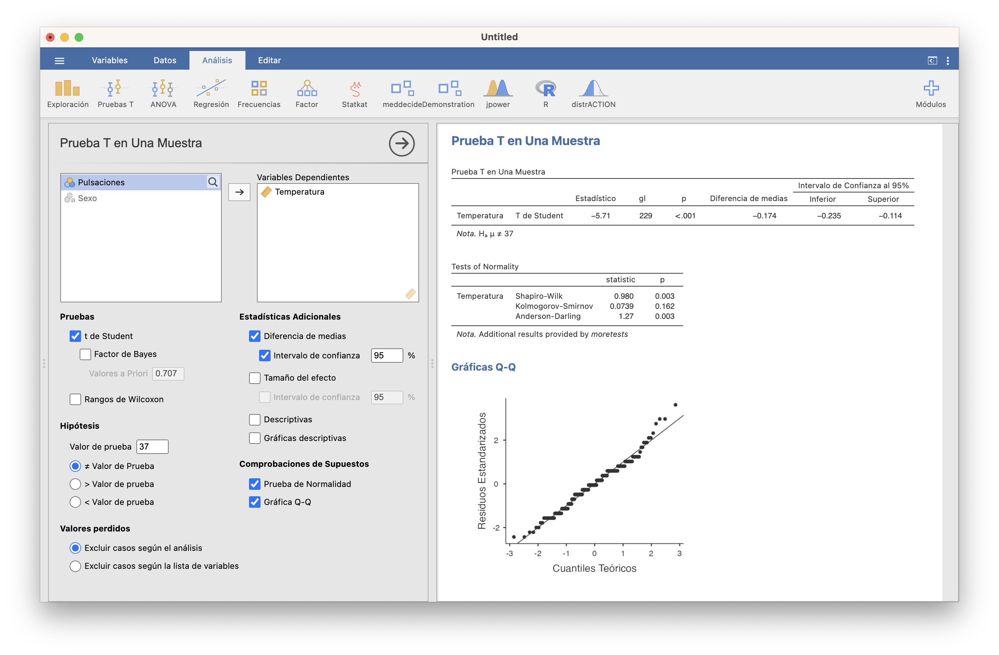
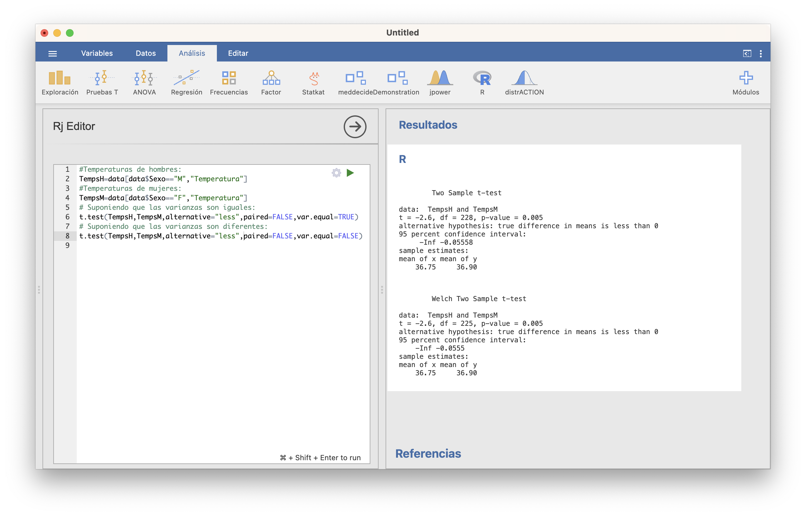
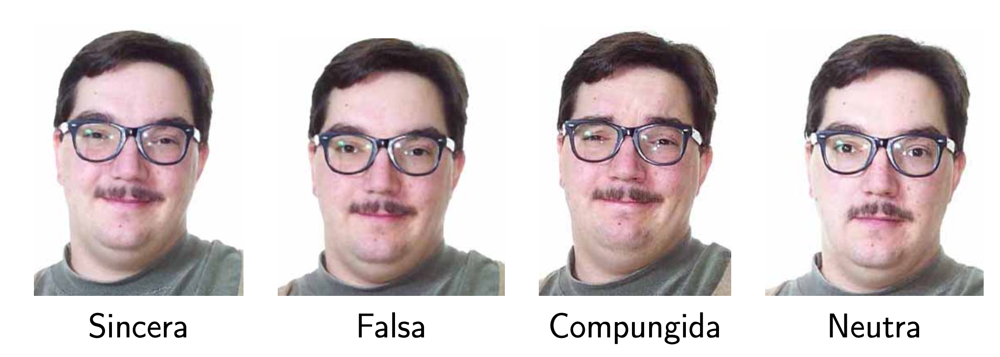

# ¿Qué test usar?

En esta lección estudiamos los contrastes de hipótesis más frecuentes sobre medias, varianzas, proporciones, etc. El objetivo principal es explicar qué tests resuelven cada tipo de contraste. Para la mayoría de estos tests no vamos a explicar las fórmulas de los estadísticos de contraste o intervalos de confianza, solo cuándo se pueden usar, cómo efectuarlos con JAMOVI y cómo interpretar los resultados. 

## Contrastes para medias

### Contrastes para una media

Sea $X$ una variable aleatoria de media $\mu$.  Queremos realizar un contraste sobre $\mu$, de la forma
$$
\left\{\begin{array}{l}
H_{0}:\mu=\mu_0\\ 
H_{1}:\mu \neq\mu_0\text{ o }\mu >\mu_0\text{ o }\mu<\mu_0
\end{array}
\right.
$$
Para ello, medimos $X$ sobre una muestra aleatoria simple de tamaño $n$.

#### Test t

Supongamos que estamos en una de las dos situaciones siguientes:

* $X$ es normal; o

* $X$ no es necesariamente normal pero el tamaño $n$ de la muestra que tomamos es grande (digamos, para fijar ideas, que $n\geqslant 40$).

En cualquiera de estas dos situaciones, podemos usar el **test t** que hemos explicado en la lección anterior para realizar el contraste.  JAMOVI lo ofrece en la sección  **Pruebas T/Prueba T en una muestra** de su instalación básica.


```{example}
La temperatura media del cuerpo humano, ¿es el valor comúnmente aceptado de 37^o^ C?
```

Para empezar, tenemos que traducir esta pregunta a un contraste de hipótesis:

* **Variable aleatoria poblacional**: $X$: temperatura del cuerpo humano en ^o^C, de media $\mu$.

* **Contraste**: Nos preguntamos si $\mu=37^{\mathrm{o}}$ o no, por lo que el contraste es bilateral:
$$
\left\{\begin{array}{l}
H_{0}:\mu=37\\
H_{1}:\mu\neq 37
\end{array}\right.
$$

Para efectuar el contraste, necesitamos una muestra de temperaturas. Vamos a usar las recogidas por P. A. Mackowiak, S. S. Wasserman y M. M. Levine que ya usamos en el Ejemplo \@ref(exm:tempsIC), y que tenemos guardadas en la variable `Temperatura` de la tabla de datos [**Temperaturas.txt**](https://raw.githubusercontent.com/AprendeR-UIB/INREMDN/master/Dades/Temperaturas.txt). 

Con JAMOVI, importamos el fichero  **Temperaturas.txt** en una tabla de datos (con **Importar especial**). Dando una ojeada a la tabla de datos (con el menú **Datos**), o usando la casilla *N* de **Exploración/Descriptivas**, vemos que la muestra es de tamaño 230, más que suficiente para poder usar un test t. 

Entonces, abrimos **Pruebas T/Prueba T en una muestra**;  seleccionamos  como variable dependiente la `Temperatura`;  entramos 37 en la casilla *Valor de la prueba*; y marcamos las casillas que se muestran en la figura que sigue. Obtenemos la tabla de la derecha de la figura (observad que JAMOVI llama  $H_a$ a nuestra hipótesis alternativa $H_1$):

```{r jamovit1,echo=FALSE,out.width="100%"}
knitr::include_graphics("INREMDN_files/figure-html/JAMOVI.t.1.png")
```
    
El intervalo de confianza del 95% para la $\mu$ se obtiene sumando el valor que se contrasta (en nuestro caso 37) al "intervalo de confianza al 95%" obtenido, por lo tanto es [`r 37+c(-0.235,-0.114)`]. Sobre el p-valor, sólo nos dice que es menor que 0.001, no nos da su valor exacto.  En resumen, hemos encontrado evidencia estadísticamente significativa de que la temperatura media del cuerpo humano no es de 37^o^ C, y estimamos con un 95% de confianza que está entre 36.8^o^ C y 36.9^o^ C, o sea, entre una y dos décimas por debajo de 37^o^ C. Si esto es clínicamente importante o no para definir "fiebre" ya no es un problema de estadística.

En este caso, si queremos saber qué vale el p-valor (que es lo que en el tema anterior os recomendábamos publicar), tendremos que usar la función `t.test` de R . Esta función  `t.test` se aplica a un argumento formado por:

* el vector que contiene la muestra;
* el parámetro `mu` igualado al valor que contrastamos; 
* el paràmetro `alternative` que indica el tipo de contraste, igualándolo a `"two.sided"` (para contrastes bilaterales, es decir, con $\neq$), `"less"` ($<$) o `"greater"` ($>$); no os olvidéis de las comillas en los valores de este parámetro;
* el parámetro `conf.level` que indica el nivel de confianza $1-\alpha$, en nuestro caso 0.95, que corresponde a $\alpha=0.05$ (como este es el valor por defecto de este parámetro, no es necesario especificarlo).

```{r,include=FALSE}
data=read.table("Temperaturas.txt",header=TRUE)
Temps=data$Temperatura
t.test(Temps, mu=37, alternative="two.sided", conf.level=0.95)
```

JAMOVI ha importado el fichero **Temperaturas.txt** en una tabla de datos que ha llamado `data`. El código siguiente, ejecutado en la ventana de  **R/Rj Editor**, define un vector llamado `Temps` con la variable `Temperatura` de `data` y efectua el test t deseado:


```{r jamovit1.5,echo=FALSE,out.width="100%"}

```
    
El resultado contiene:

* El p-valor (`p-value`) del contraste: 3·10^-8^
* El intervalo de confianza del 95% (`95 percent confidence interval`): va de 36.77^o^ C a 36.89^o^ C
* La media muestral (`mean of x`): 36.83
    
    
#### Test no paramétrico

Si no podemos suponer que la variable aleatoria de interés sea normal y la muestra no es lo bastante grande, no podemos usar un test t. Entonces, hay que usar algún **test no paramétrico** que no requiera de la normalidad de la variable  poblacional. El más popular es el [**Test de Wilcoxon**](https://en.wikipedia.org/wiki/Wilcoxon_signed-rank_test), aunque conviene tener presente que, en el fondo, este test compara medianas y no medias. Con JAMOVI, hay que marcar la casilla *Rangos de Wilcoxon* en vez de *t de Student* en **Pruebas T/Prueba T en una muestra**: 


```{r jamovit2,echo=FALSE,out.width="100%"}
knitr::include_graphics("INREMDN_files/figure-html/JAMOVI.t.2.png")
```

Con R  se usa la función `wilcox.test`, con la misma sintaxis que `t.test` salvo que, si eso, hay que indicar con `conf.int=TRUE` que queremos el intervalo de confianza para la temperatura media (en realidad, este intervalo, y el que da JAMOVI, es para la *pseudomediana*: la mediana de las medias aritméticas de pares independientes de temperaturas, que coincide con la media si la distribución es simétrica), ya que por defecto no lo da:


```{r jamovit2b,echo=FALSE,out.width="100%"}
knitr::include_graphics("INREMDN_files/figure-html/JAMOVI.t.2b.png")
```


### Inciso: tests de normalidad

Muchos tests, como por ejemplo los tests t cuando las muestras son pequeñas, requieren que las variables poblacionales sea normales para que las conclusiones sean válidas. Para poder decidir si podemos aceptar o no que la variable poblacional es normal, se usa un **contraste de normalidad**, con hipótesis nula 
$$
H_0: \text{Esta muestra proviene de una variable aleatoria normal}
$$
e hipótesis alternativa 
$$
H_1: \text{No es verdad que esta muestra provenga de una variable aleatoria normal}
$$

Hay [muchos tests](https://en.wikipedia.org/wiki/Normality_test) que se pueden usar para efectuar este contraste. Por ejemplo, tras instalar el módulo **moretests** (que añade funcionalidades a los módulos básicos), cuando marcamos la casilla *Prueba de normalidad* al realizar algún test t, JAMOVI realiza tres pruebas de normalidad: la de **Shapiro-Wilk**, la de **Kolmogorov-Smirnov** y la de **Anderson-Darling**:


```{r jamoviN1,echo=FALSE,out.width="100%"}
knitr::include_graphics("INREMDN_files/figure-html/JAMOVI.N.1.png")
```

Os recomendamos que, en caso de disparidad de conclusiones según los p-valores (como pasa en nuestro ejemplo, donde el p-valor del test de Kolgomorov-Smirnov es mayor que 0.1 y los otros dos son 0.003) os quedéis con la conclusión del test de Shapiro-Wilk, que es el más fiable (el test de Kolmogorov-Smirnov es el más conocido, pero no es bueno detectando diferencias con la normal en las colas; el test de Anderson-Darling resuelve este problema, pero en muestras muy grandes tiende a dar muchos falsos positivos). El test de Shapiro-Wilk también está disponible en **Exploración/Descriptivas**. Con R  se efectua con la función `shapiro.test` aplicado a la muestra. 

Así pues, como vemos, hemos obtenido evidencia estadísticamente significativa de que la muestra de temperaturas no proviene de una variable normal. Por suerte, esto no afecta a la validez de la conclusión del test t, porque la muestra era muy grande.

La conclusión de un test de normalidad se puede ilustrar con algún gráfico que  muestre si la muestra se ajusta o no a lo que sería de esperar si proviniera de una variable poblacional normal. Por ejemplo, un histograma de la muestra superponiendo la densidad de la normal de media y desviación típicas estimadas con la muestra. Otro de los gráficos más usados en este contexto son los q-q-plots. 

Un  **q-q-plot** de una muestra y una distribución teórica concreta (por ejemplo, una normal $N(\mu,\sigma)$) es el gráfico de los llamados **q-q-puntos**: los puntos de la forma 
$$
(q\text{-cuantil de la distribución téorica},\ q\text{-cuantil de la muestra}),
$$
para varios valores de $q$. Si la muestra proviene de la distribución teórica, es de esperar que el q-cuantil de la muestra sea muy parecido al q-cuantil de la distribución y por lo tanto que estos q-q-puntos estén cerca de la diagonal principal $y=x$.

JAMOVI dibuja un q-q-plot marcando la casilla *Gráfica Q-Q* en cualquier prueba t o en  **Exploración/Descriptivas**.


```{r jamoviN2,echo=FALSE,out.width="100%"}

```


La función `qqPlot` del paquete **car** de R produce unos q-q-plots más adecuados que incluyen una "región de confianza del 95%" con el significado usual de nivel de confianza (para el 95% de las muestras de la distribución, los q-q-plot caen dentro de esta región; por lo tanto, si nuestro q-q-plot sale fuera de esta región, tenemos evidencia de que la muestra no proviene de la distribución teórica). La sintaxis para usarla es la que sigue (cambiad `Temps` por la muestra de la que queráis dibujar el q-q-plot)

```{r}
library(car)
qqPlot(Temps, distribution="norm", mean=mean(Temps), sd=sd(Temps),
       ylab="Cuantiles de la muestra", xlab="Cuantiles de normal", 
       pch=20, id=FALSE)
```

La existencia de muchos q-q-puntos fuera de la franja de confianza nos vuelve a aportar evidencia de que la muestra de temperaturas no se ajusta a una distribución normal.


### Contrastes para dos medias

Sean ahora $X_1$ y $X_2$ dos variables aleatorias de medias $\mu_1$ y $\mu_2$, respectivamente. Queremos compararlas, mediante un contraste de la forma
$$
\left\{\begin{array}{l}
H_{0}:\mu_1=\mu_2\\ 
H_{1}:\mu_1 \neq\mu_2\text{ o }\mu_1 >\mu_2\text{ o }\mu_1<\mu_2
\end{array}
\right.
$$
Para ello, medimos $X_1$ sobre una muestra aleatoria simple de tamaño $n_1$, y $X_2$ sobre una muestra aleatoria simple de tamaño $n_2$.

#### Tests t


Supongamos que estamos en una de las dos situaciones siguientes:

* $X_1,X_2$ son  ambas normales; o

* $X_1,X_2$ no son necesariamente ambas normales pero los tamaños $n_1,n_2$ de las muestras  son **ambos** grandes (digamos, para fijar ideas, que $n_1,n_2\geqslant 40$).

Si se cumple alguna de estas dos condiciones, podemos usar un **test t**, basado en un estadístico de contraste $T$ adecuado con distribución t de Student. Los estadísticos de contraste concretos y los grados de libertad de su distribución t de Student son los que dimos al hablar de intervalos de confianza para la diferencia de dos medias en el tema anterior, y dependen de las mismas condiciones que comentábamos allí:

* De si las dos muestras son:

    * **independientes**: hemos medido $X_1$ y $X_2$ sobre dos muestras aleatorias simples obtenidas de manera independiente la una de la otra; o 
    
    * **apareadas** (o **pareadas**, **emparejadas**...): hemos medido $X_1$ y $X_2$ sobre los individuos de una misma muestra aleatoria simple o hay un apareamiento natural entre los sujetos de las dos muestras. 
    
```{block2, type="rmdnote"}
En el caso apareado, podemos entender que tenemos una sola muestra, formada por los sujetos que medimos dos veces o por las parejas de sujetos. Entonces, podemos considerar la diferencia $D=X_1-X_2$, que tendrá media poblacional $\mu_D=\mu_1-\mu_2$, y traducir el contraste
$$
\left\{\begin{array}{l}
H_{0}:\mu_1=\mu_2\\ 
H_{1}:\mu_1 \neq\mu_2\text{ o }\mu_1 >\mu_2\text{ o }\mu_1<\mu_2
\end{array}
\right.
$$
en el contraste de una sola media
$$
\left\{\begin{array}{l}
H_{0}:\mu_D=0\\ 
H_{1}:\mu_D \neq 0\text{ o }\mu_D >0\text{ o }\mu_D<0
\end{array}
\right.
$$
Es decir, cuando las muestras son apareadas, consideramos nuestro contraste de dos medias como un contraste de una sola media, usando como muestra las diferencias $X_1-X_2$ sobre nuestras parejas de sujetos.
```
    
    
* Cuando las muestras son independientes, el estadístico y sus grados de libertad también dependen de si las variables poblacionales $X_1$ y $X_2$ tienen la **misma varianza** o no, que en principio se ha de decidir con otro contraste.


Todos estos tests t están implementados en la función `t.test` de R  y en el módulo  **Pruebas T** de JAMOVI. 


```{example,tempHD}
La temperatura media de las hombres, ¿es menor que la de las mujeres?
```

Traducimos esta pregunta en un contraste de hipótesis:


* **Variables aleatorias poblacionales**:
 
    * $X_m$: temperatura de un hombre en ^o^C, de media $\mu_m$
    * $X_f$: temperatura de una mujer en ^o^C, de media $\mu_f$


* **Contraste**: Nos preguntamos si $\mu_m$ es menor que $\mu_f$
$$
\left\{\begin{array}{l}
H_{0}:\mu_m=\mu_f\\
H_{1}:\mu_m< \mu_f
\end{array}\right.
$$

Necesitamos una muestra de temperaturas de hombres y de mujeres. La  tabla de datos **Temperaturas.txt** que hemos usado en el ejemplo anterior contiene una variable **Sexo** con el  sexo de los sujetos: M para hombres y F para mujeres. La muestra fue transversal, así que las muestras de hombres y mujeres son independientes (las que salieron en la muestra global). 

Con JAMOVI, tras importar el fichero  **Temperaturas.txt** en una tabla de datos, calculamos los tamaños de ambas muestras con la casilla *N* de **Exploración/Descriptivas**, seleccionando  como variable dependiente la `Temperatura` y como variable de agrupación el `Sexo`. Aprovechamos para calcular los estadísticos básicos de cada muestra y dibujar sus boxplot:


```{r jamovit2.5,echo=FALSE,out.width="100%"}
knitr::include_graphics("INREMDN_files/figure-html/JAMOVI.t.2.5.png")
```

Vemos que las temperaturas de las mujeres (F), y en particular su media y su mediana, son ligeramente mayores que las de los hombres (M). Como las muestras de mujeres y  hombres  son lo bastante grandes (116 y 114 sujetos, respectivamente), podemos usar un test t para realizar el contraste.
Para ello, usamos **Pruebas T/Prueba T para muestras independientes** y seleccionamos de nuevo como variable dependiente la `Temperatura` y como variable de agrupación el `Sexo`. Como en la variable `Sexo` las mujeres son F y los hombres M y JAMOVI los va a tomar ordenados alfabéticamente, la hipótesis alternativa tiene que ser *Grupo 1 > Grupo 2*, es decir, con las notaciones que usamos, $\mu_f>\mu_m$. 

En esta ventana, la casilla *t de Student* corresponde al test suponiendo varianzas poblacionales iguales y la casilla *t de Welch* al test suponiendo varianzas poblacionales diferentes. Vamos a efectuar los dos tests de golpe, y cruzaremos los dedos para que den la misma conclusión:

```{r jamovit3,echo=FALSE,out.width="100%"}
knitr::include_graphics("INREMDN_files/figure-html/JAMOVI.t.3.png")
```


En ambos casos el p-valor es (redondeado)  0.005, muy pequeño. Así, pues, hemos obtenido evidencia estadísticamente significativa de que los hombres tienen una temperatura corporal media inferior a la de las mujeres. Además, ambos intervalos de  confianza del 95% para $\mu_f-\mu_m$ van de alrededor de 0.056 a  $\infty$ (*Inf*), por lo que tenemos un 95% de confianza de que la temperatura corporal media es al menos unas 5.6 centésimas de grado mayor en las mujeres que en los hombres. La diferencia de las medias muestrales $\overline{X}_f-\overline{X}_m$  ha  sido  0.155^o^ C, es decir, la media muestral de temperaturas de mujeres ha sido 0.16^o^ C mayor que en los hombres. 

¿Qué pasaría si los tests suponiendo varianzas iguales y diferentes hubieran dado resultados diferentes? En este caso tendríamos que decidir qué conclusion tenemos que creer, decidiendo si podemos aceptar o rechazar que las varianzas poblacionales sean iguales o no. Podéis contrastar la igualdad de varianzas en esta misma ventana marcando la casilla *Test de homogeneidad*, que efectua el contraste con hipótesis nula que las dos varianzas poblacionales son iguales e hipótesis alternativa que son diferentes. Con el módulo **moretests** instalado, da el resultado de dos tests: el de **Levene** y el **test F** (*Variance ratio*). Ya volveremos sobre ellos en la próxima sección. En todo caso, como su p-valor es grande, aquí aceptaríamos que las dos varianzas poblacionales son iguales. 


```{r jamovit3.5,echo=FALSE,out.width="100%"}
knitr::include_graphics("INREMDN_files/figure-html/JAMOVI.t.3.5.png")
```


Si preferís usar la función `t.test`, hay que entrar como argumentos:

* Los vectores que contienen la muestra de $X_1$ y la muestra de $X_2$.

* El tipo de contraste, que se especifica con el parámetro `alternative` como en el caso de una sola media.

* El tipo de muestras, que se especifica igualando el parámetro `paired` a `FALSE` si son independientes o a `TRUE` si son apareadas.

* En caso de muestras independientes, si las varianzas poblacionales son iguales o diferentes igualando el parámetro `var.equal` a `TRUE`  o a `FALSE`, respectivamente.

* El nivel de confianza, que se especifica con el parámetro `conf.level` como en el caso de una sola media y no hace falta si es 0.95.


El código siguiente define vectores `TempsH` y `TempsM` con las temperaturas de los hombres y las mujeres de esta tabla, y efectua los tests t suponiendo que las varianzas son iguales y que son diferentes, respectivamente

```{r jamovit2.7,echo=FALSE,out.width="100%"}

```


#### Tests no paramétricos

Si no podemos suponer que las variables aleatorias  de interés sean normales y si  alguna muestra es pequeña, hay que usar algún **test no paramétrico**. Los más populares son:

* el **test de Wilcoxon** para muestras apareadas (que, recordad, se traduce en un contraste sobre la media de las diferencias, y en los contrastes de una media ya recomendábamos el test de Wilcoxon).

* el [**test de Mann-Whitney**](https://en.wikipedia.org/wiki/Mann–Whitney_U_test) para muestras independientes.

En JAMOVI se marcan las casillas *rangos de Wilcoxon* o *U de Mann-Whitney*, según corresponda. 

```{block2,type="rmdimportant"}
Usad tests paramétricos siempre que podáis, pero solo cuando podáis.
Los mejores tests no paramétricos suelen tener potencia inferior a los mejores tests paramétricos. Pero usar, por ejemplo, un test t cuando no toca, porque alguna variable no sea normal y alguna muestra sea pequeña, puede llevar a conclusiones equivocadas.
```

Con R, ambos tests se calculan con la función `wilcox.test`, con una sintaxis idéntica a la de `t.test` para dos muestras excepto que no dispone del parámetro `var.equal` (ya que ahora no nos interesa lo más mínimo saber si las variables tienen varianzas iguales o diferentes en el caso de contrastes de dos medias con muestras independientes) y hay que usar el parámetro `conf.int=TRUE` si se quiere un intervalo de confianza (para la diferencia de las pseudomedianas de $X_1$ y $X_2$). 


```{block2,type="rmdnote"}
En el caso de dos muestras, para comprobar si ambas muestras se ajustan a variables normales con JAMOVI, no podemos hacerlo desde el módulo **Pruebas T** sino desde **Exploración/Descriptivas**. En nuestro ejemplo (véase la figura que sigue),  tenemos que separar  la variable `Temperatura` según el `Sexo`. Marcando la casilla *Shapiro-Wilk*, obtenemos los p-valores del test de Shapiro-Wilk tanto para F como para M. Ambos son menores que 0.05, así que tenemos evidencia estadísticamente significativa de que ni las temperaturas de hombres ni las de mujeres  siguen distribuciones normales.
```


```{r jamovitN3,echo=FALSE,out.width="100%"}
knitr::include_graphics("INREMDN_files/figure-html/JAMOVI.N.3.png")
```


Veamos otro ejemplo.

```{example,oatbran}
Desayunar salvado de avena (*oat bran*) en lugar de copos de maíz (*corn flakes*), ¿ayuda a reducir el nivel de colesterol?
  
  
```

Planteémoslo como un contraste de hipótesis. Las variables aleatorias poblacionales de interés son:

* $X_{ob}$: nivel de colesterol al consumir salvado de avena, de media $\mu_{ob}$
* $X_{cf}$: nivel de colesterol al consumir copos de maíz, de media $\mu_{cf}$

El contraste que queremos realizar es
$$
\left\{\begin{array}{l}
H_{0}:\mu_{ob}=\mu_{cf}\\
H_{1}:\mu_{ob}< \mu_{cf}
\end{array}\right.
$$


Para hacerlo, vamos a usar los datos obtenidos por J. Anderson *et al* en su estudio ["Oat-bran cereal lowers serum total and LDL cholesterol in hypercholesterolemic men"](https://academic.oup.com/ajcn/article-abstract/52/3/495/4650821) (*The American Journal of Clinical Nutrition* 52 (1990), pp. 495-499). Se trata de un ensayo clínico cruzado sobre 14 individuos. A cada uno de ellos se le asignó uno de los dos desayunos de manera aleatoria y lo tomaron durante 15 días. Al final de este periodo, se les midió el nivel de colesterol en sangre. Pasado un mes de descanso, cada participante desayunó durante 15 días el otro producto, y al final se les volvió a medir el nivel de colesterol en sangre. Tenemos los niveles de colesterol que obtuvieron en la tabla de datos [**oatbran.txt**](https://raw.githubusercontent.com/AprendeR-UIB/INREMDN/master/Dades/oatbran.txt), donde están medidos en milimoles por litro (mmol/l), así que esta será la unidad que tomamos en las variables poblacionales. 

Con JAMOVI, importamos el fichero  **oatbran.txt** en una tabla de datos. Como las muestras son pequeñas (de tamaño 14), si queremos aplicar un test t necesitamos poder aceptar que provienen de variables normales. Vamos a  **Exploración/Descriptivas**, escogemos ambas variables, `CORNFLK` y `OATBRAN`, y marcamos el test de Shapiro-Wilk (y, ya que estamos, las gráficas Q-Q):


```{r jamoviN4,echo=FALSE,out.width="100%"}

```

Ambos p-valores son muy grandes, así que vamos a aceptar que ambas muestras provienen de variables normales y usaremos un test t de dos medias.

En este caso, como las muestras son apareadas (hemos medido las dos variables aleatorias sobre los mismos individuos), hay que elegir **Pruebas T/Prueba t para muestras apareadas**. Cuidado con la hipótesis alternativa: como JAMOVI toma como primera variable `CORNFLK` y segunda variable `OATBRAN` y nuestra hipótesis alternativa es que los *oat bran* reducen el nivel de colesterol respecto de los *corn flakes*, hemos de marcar "Medida 1 > Medida 2".


```{r jamovit4,echo=FALSE,out.width="100%"}
knitr::include_graphics("INREMDN_files/figure-html/JAMOVI.t.4.png")
```


Obtenemos un p-valor de 0.003. Por lo tanto, hemos encontrado evidencia estadísticamente significativa de que desayunar salvado reduce el nivel medio de colesterol respecto de desayunar  copos de maíz. El intervalo de confianza del 95% para $\mu_{cf}-\mu_{ob}$ va de 0.163 a $\infty$. Por lo tanto, tenemos un 95% de confianza en que desayunar salvado reduce en al menos 0.163 mmol/l el nivel medio de colesterol respecto de desayunar  copos de maíz.

¿Y si no quisiéramos, o no pudiéramos, suponer que las muestras provienen de distribuciones normales? Entonces usaríamos un test de Wilcoxon:


```{r jamovit5,echo=FALSE,out.width="100%"}
knitr::include_graphics("INREMDN_files/figure-html/JAMOVI.t.5.png")
```


El p-valor da 0.006, por lo que la conclusión es la misma.


```{block2,type="rmdexercici"}
Típica pregunta de MIR (esta, de 2017):

El grosor del pliegue subcutáneo de grasa a nivel del tríceps se utiliza a veces para evaluar la cantidad de grasa corporal. Esta variable no se distribuye normalmente en las poblaciones. Queremos comparar el valor medio de esta variable en dos poblaciones que suponemos presentan distinta condición nutricional. La prueba estadística más adecuada para contrastar la hipótesis es: 

* La prueba de Mann-Whitney.  
* La prueba t de Student.  
* El cálculo del coeficiente de correlación de Pearson. 
* La prueba F de Snedecor.

```

### Contrastes para más de dos medias

Sean ahora $X_1,X_2,\ldots, X_k$ $k$ variables aleatorias de medias $\mu_1,\mu_2,\ldots,\mu_k$ y desviaciones típicas $\sigma_1,\sigma_2,\ldots,\sigma_k$, respectivamente. Normalmente, se tratará de una misma variable aleatoria definida sobre $k$ poblaciones diferentes.

Nos preguntamos si es verdad o no que estas $k$ variables tienen la misma media. Es decir, planteamos el contraste
$$
\left\{\begin{array}{l}
H_{0}:\mu_1=\mu_2=\cdots=\mu_k\\ 
H_{1}:\text{No es verdad que } \mu_1=\mu_2=\cdots=\mu_k
\end{array}
\right.
$$
Para ello, medimos cada $X_i$ sobre una muestra aleatoria simple de tamaño $n_i$. 
```{block2,type="rmdimportant"}
Observad que $H_1$ en el contraste anterior es equivalente a
$$
\text{Existen $i,j$ tales que } \mu_i \neq \mu_j
$$
**no** a
$$
\mu_i \neq \mu_j \text{ para todos los pares $i,j$ con $i\neq j$} 
$$
```


```{example, somriures}
En un estudio (publicado en *Personality and Social Psychology Bulletin* 21 (1995), pp. 207-214) se quiso determinar si la benevolencia con la se juzga a una persona depende de cómo sonríe.
```

Para ello se seleccionaron 136 personas, que se dividieron al azar en  4 grupos de 34. A las personas de cada grupo se les pasó un dosier donde se acusaba a un hombre de una falta grave (en un contexto universitario) y, tras estudiarlo, se les pusieron cinco preguntas sobre la culpabilidad del acusado y el castigo que se merecía. A partir de las respuestas de cada sujeto, se calculó un "índice de benevolencia" de cómo había juzgado al acusado. 

Los dosieres eran idénticos, excepto la foto del acusado: mismo hombre, pero diferente tipo de sonrisa:


```{r somriures1,echo=FALSE,out.width="100%"}

```

Tenemos los índices obtenidos en el fichero **smiles.txt**. Veamos sus estadísticos básicos y un diagrama de cajas.


```{r somriuresJ1,echo=FALSE,out.width="100%"}
knitr::include_graphics("INREMDN_files/figure-html/somriuresJ1.png")
```

Vemos que la sonrisa neutra ha generado una menor benevolencia y la falsa, mayor. Queremos determinar si las diferencias son lo bastante grandes para aportar evidencia que la benevolencia depende de la sonrisa.


En este caso tenemos una variable aleatoria, el índice de benevolencia con el que se juzga al acusado, definida sobre cuatro subpoblaciones definidas por el tipo de sonrisa en la foto. Llamemos $\mu_s$, $\mu_f$, $\mu_c$ y $\mu_n$ a sus medias: los índices de benevolencia medios con los que se juzga el dosier cuando la sonrisa es sincera, falsa, compungida o neutra, respectivamente.

Entonces, queremos realizar el contraste
$$
\left\{
\begin{array}{l}
H_0 : \mu_s=\mu_{f}=\mu_{c}=\mu_{n} \\
H_1 : \mbox{Hay algún par de sonrisas }i,j\mbox{ tales que }  \mu_i \neq \mu_j
\end{array}
\right.
$$

Un posible modo de resolver este contraste sería realizar los seis contrastes de pares de medias $\mu_i=\mu_j$ contra $\mu_i\neq \mu_j$, pero esto aumenta la probabilidad de error si no ajustamos los p-valores. Y tenemos que comparar todas las medias dos a dos, porque podría pasar, por ejemplo, que no pudiéramos rechazar que $\mu_n= \mu_s$ ni que $\mu_s= \mu_f$, pero sí que pudiéramos rechazar que $\mu_n= \mu_f$.

Lo que queremos es un test que nos diga en un solo paso si todas las medias son iguales o si por el contrario hay alguna diferencia. La técnica más usual es el **Análisis de la Varianza** (**ANOVA**, del inglés *ANalysis Of  VAriance*). Esta técnica se puede aplicar bajo diferentes diseños  experimentales: por ejemplo,  según cuántos factores usemos para separar la población en subpoblaciones (uno o varios) o según cómo escojamos las muestras (independientes o apareadas).

La idea básica del ANOVA es que tenemos evidencia de que no todas las medias poblacionales son iguales si la variabilidad de las medias poblacionales es muy grande en relacion a la variabilidad total de los datos obtenidos: de ahí la **VA**riancia en el nombre. Esta variabilidad relativa se mide mediante un estadístico de contraste adecuado que, si todas la medias poblacionales son iguales y se satisfacen las condiciones adecuadas, tiene una distribución conocida (llamada **F de Fisher-Snedecor**: es la distribución de un cociente de dos variables $\chi^2$ independientes, y sus parámetros son los grados de libertad de estas dos distribuciones $\chi^2$).  Por lo tanto podemos usar esta distribución para calcular un p-valor que nos dé lo improbablemente grande que es la variabilidad de las medias muestrales si las medias poblacionales fueran todas iguales. 

#### Diseño ANOVA de un factor

En un estudio de diseño **ANOVA de un factor** o **de una vía** (*One way ANOVA*):

* Usamos un solo factor para clasificar la población en subpoblaciones.

* Tomamos una muestra aleatoria simple de la variable aleatoria sobre cada subpoblación, independientes unas de otras.

El Ejemplo \@ref(exm:somriures) es de tipo ANOVA de un factor: se clasifican los índices de benevolencia según un solo factor, el tipo de sonrisa en la foto, y se ha tomado una muestra de índices de benevolencia para cada tipo de sonrisa. Estas muestras son independientes porque se asignaron las fotos al azar a los participantes.

##### ANOVA de un factor {-}

Supongamos que tenemos que realizar una comparación de medias en un estudio de diseño ANOVA de un factor. Si se cumple que:

* Cada una de las $k$ variables aleatorias de las que hemos tomado muestras sigue una ley normal

* **Homocedasticidad** u **homogeneidad**: Todas estas variables tienen la misma varianza 

entonces podemos usar un test ANOVA. JAMOVI ofrece el ANOVA de un factor en **ANOVA/ANOVA de Un Factor**. 

```{example}
Sigamos con el Ejemplo \@ref(exm:somriures). Ya hemos cargado la tabla. Efectuamos los tests de Shapiro-Wilks (separando la variable `benevolencia` según el factor `sonrisa`) y obtenemos los 4 p-valores por encima de 0.05, así que vamos a aceptar que para los cuatro tipos de sonrisas los índices de benevolencia se ajustan a distribuciones normales.
```


```{r somriuresJ2,echo=FALSE,out.width="100%"}
knitr::include_graphics("INREMDN_files/figure-html/somriuresJ2.png")
```

Abriendo entonces  **ANOVA/ANOVA de Un Factor**, separamos de nuevo la variable dependiente `benevolencia` según el factor `sonrisa`, marcamos la *Prueba de homogeneidad* para saber si podemos aceptar o no que las varianzas poblacionales son todas iguales, y como el p-valor de ambos tests es grande, marcamos la casilla *Asumir iguales (Fisher)*, que efectua el test ANOVA.


```{r somriuresJ3,echo=FALSE,out.width="100%"}
knitr::include_graphics("INREMDN_files/figure-html/somriuresJ3.png")
```

El p-valor es 0.018, por lo que obtenemos evidencia estadística de que al menos un par de medias son diferentes.

```{block2,type="rmdnote"}
Un ANOVA de un factor aplicado a solo dos medias es equivalente a un test t para dos medias suponiendo varianzas iguales.
```


También podéis usar **ANOVA/ANOVA** para efectuar un ANOVA de un factor, mucho más rico en opciones (pero para el nivel de este curso casi todas innecesarias).

##### Alternativas {-}

El test ANOVA de Fisher es bastante robusto a una ligera desviación de la normalidad de las muestras, pero deja estrepitosamente de ser válido si las varianzas poblacionales no son iguales.

Si las variables poblacionales son normales, pero no podemos aceptar que tengan todas la misma varianza, lo recomendado es usar una variante llamada **ANOVA de Welch**, y que en JAMOVI se ejecuta marcando *No asumir iguales (Welch)* en lugar de *Asumir iguales (Fisher)*.  

Otra posibilidad es usar  el test no paramétrico de Kruskal-Wallis, que extiende a más de dos medias el test de Mann-Whitney. JAMOVI lo ofrece en **ANOVA/No paramétrico/ANOVA de Un Factor: Kruskall-Wallis**. 


#### Tests *post hoc* {-}

Si hemos rechazado la hipótesis nula $H_0:\mu_1=\cdots =\mu_k$, nos puede interesar estimar qué parejas de niveles tienen medias diferentes. La manera más popular es realizar los $\binom{k}{2}$ contrastes
$$
\left\{
\begin{array}{ll}
H_0 &: \mu_i=\mu_j \\
H_1 &: \mu_i \neq \mu_j
\end{array}
\right.
$$
usando un test t adecuado (si las muestras se ajustan a normalidad o son lo bastante grandes) o un test de Mann-Whitney (si no se puede usar un test t para todos los pares de medias). En caso de homogeneidad de varianzas, el test t no es exactamene el que hemos explicado para pares de medias y varianzas iguales porque usa todas las muestras, y no solo las dos involucradas, para estimar el error típico. 

Pero hay que ir con cuidado con el nivel de significación global. Como vimos en el tema anterior, si efectuamos muchos contrastes de pares de medias, la probabilidad de cometer un error de tipo I *en alguno* aumenta, por lo que hay que reducir el nivel de significación con el que los efectuamos o, equivalentemente, ajustar los p-valores. En **ANOVA/ANOVA de Un Factor** JAMOVI efectua un ajuste por defecto que es más que suficiente para nuestros propósitos. Si queréis usar  otros ajustes, por ejemplo el de Bonferroni que mencionábamos en el tema anterior  (multiplicar los p-valores por el número de tests), los encontraréis en **ANOVA/ANOVA/Pruebas Post Hoc**. Normalmente no habrá grandes diferencias en las conclusiones de los tests según el método de ajuste usado.

```{example}
Seguimos con nuestro ejemplo sobre la benevolencia que suscitan los diferentes tipos de sonrisa. Con un ANOVA de un factor hemos obtenido evidencia significativa de que hay pares de sonrisas que inducen índices de benevolencia medios diferentes. Vamos a investigar cuáles.
```

Antes de nada, un gráfico: en **ANOVA/ANOVA de Un Factor** pedimos que añada "Gráficas Descriptivas":


```{r somriuresJ6,echo=FALSE,out.width="100%"}
knitr::include_graphics("INREMDN_files/figure-html/somriuresJ6.png")
```

Nos da los intervalos de confianza del 95% para las cuatro medias. Observad que todos los pares de intervalos de confianza se solapan salvo dos: el de la sonrisa falsa y el de la sonrisa neutra. Este gráfico nos aporta evidencia de que estas dos medias no son iguales (cada una pertenece a su intervalo de confianza con una confianza del 95%, y estos dos intervalos son disjuntos) y nos indica que los otros pares de medias pueden ser iguales  (sus intervalos de confianza no son disjuntos). Esto es solo una indicación gráfica del resultado que tenemos que esperar, pero no nos da el resultado del test con la confianza que deseamos: las conclusiones se basan en que *todos* los IC 95% aciertan, y la probabilidad de que eso ocurra es menor que 0.95.
 
Vamos ya a realizar las comparaciones posteriores por parejas.
Usamos para ello la ventana **ANOVA/ANOVA de Un Factor/Pruebas Post-Hoc**. Como hemos aceptado que las variables poblacionales son todas iguales, marcamos *Tukey (varianzas iguales)*:


```{r somriuresJ4,echo=FALSE,out.width="100%"}

```

En la tabla obtenemos la diferencia de medias "fila menos columna" y el p-valor del test para cada par formado por las medias para el tipo de sonrisa de la fila y el de la columna. Los p-valores están ajustados por el [método de Tukey](https://en.wikipedia.org/wiki/Tukey%27s_range_test), que no vamos a explicar. Lo importante es que, como ya están ajustados, hay que compararlos directamente con el nivel de significación elegido. Tomando $\alpha=0.05$, solo obtenemos evidencia de diferencia de medias para el par sonrisa falsa-sonrisa neutra. Para el resto de pares de medias no podemos rechazar que sean iguales. Era lo que esperábamos.

Si quisiéramos usar por ejemplo el ajuste de Bonferroni, tendríamos que efectuar el ANOVA con **ANOVA/ANOVA**:


```{r somriuresJ5,echo=FALSE,out.width="100%"}
knitr::include_graphics("INREMDN_files/figure-html/somriuresJ5.png")
```

Hemos marcado también la columna de p-valores sin ajustar ("p") y la del ajuste de Tukey para que veáis que el ajuste de Bonferroni consiste en tomar el mínimo de 1 y el resultado de multiplicar el p-valor por 6 (el número total de contrastes de pares de medias) y podáis comparar los valores ajustados de Bonferroni con los de Tukey. La conclusión con los dos tipos de ajuste es la misma.

#### Diseño ANOVA de bloques


Así como el diseño de ANOVA de una vía generaliza a más de dos medias el contraste de igualdad de dos medias con muestras independientes, el ANOVA de bloques generaliza a más de dos medias el contraste de igualdad de dos medias *con muestras apareadas*.

```{example}
Para comparar los efectos de dos analgésicos y un placebo en el tratamiento de la cefalea se reclutaron 10 enfermos de cefalea y a cada uno se le aplicaron los tres tratamientos en diferentes episodios de cefalea. El orden de los tratamientos en cada sujeto fue aleatorio. El efecto de los tratamientos se cuantificó mediante el tiempo (en minutos) que tardó en desaparecer la cefalea con el tratamiento.
```

Los resultados fueron los siguientes:
$$
\begin{array}{c|ccc}
\text{Sujeto} & \text{Placebo} & \text{Analgésico A}&\text{Analgésico B}\\\hline
        1 & 35 & 20 & 22\\
        2 & 40 & 35 & 42\\
        3 & 60 & 50 & 30\\
        4 & 50 & 40 & 35\\
        5 & 50 & 30 & 22 \\
        6 & 52 & 30 & 25\\
        7 & 37 & 22 & 18\\
        8 & 45 & 30 & 28\\
        9 & 40 & 45 & 35\\
        10 & 47 & 40 & 37
\end{array}
$$
       
Si llamamos   

* $\mu_P$: Tiempo medio tomando el placebo

* $\mu_A$: Tiempo medio tomando el analgésico A

* $\mu_B$: Tiempo medio tomando el analgésico B

queremos realizar el contraste:
$$
  \left\{
    \begin{array}{l}
    H_0 : \mu_P =\mu_A =\mu_B \\
    H_1 : \mu_P\neq \mu_A\mbox{ o }\mu_P\neq \mu_B\mbox{ o }\mu_A\neq \mu_B
    \end{array}
    \right.
$$
      
Aunque se ha usado un factor para clasificar la población (el tipo de tratamiento), no se trata de un diseño de ANOVA de una vía, porque  las muestras de cada nivel no son independientes, sino apareadas. Se trata de un **diseño de ANOVA de bloques**.
    
En un experimento con diseño de ANOVA de bloques:    
    
* Tenemos $k$ tratamientos que queremos comparar.
    
* Escogemos $b$ **bloques**: conjuntos de $k$ sujetos apareados (por ejemplo, cada bloque formado por $k$ copias del mismo sujeto).
    
* Dentro de cada bloque, asignamos aleatoriamente a cada sujeto un tratamiento, de manera que cada tratamiento se use exactamente una vez dentro de cada bloque.

    Por ejemplo, si cada bloque corresponde a un único sujeto, le asignamos  los tratamientos en diferentes momentos de tiempo en un orden aleatorio, como hemos hecho en nuestro ejemplo.
    
El contraste que se quiere realizar es
$$
      \left\{
        \begin{array}{l}
        H_0 : \mu_{1} =\mu_{2} =\cdots =\mu_{k} \\
        H_1 : \mbox{Hay $i,j$ tales que } \mu_{i}  \neq \mu_{j}
        \end{array}
        \right.
$$
donde cada $\mu_{i}$ es la media del tratamiento $i$-ésimo
        
La filosofía del contraste ANOVA es similar al de un factor: se considera que se tiene  evidencia de que no todas las medias poblacionales son iguales si la variabilidad de las medias poblacionales es muy grande en relacion a la variabilidad total de los datos obtenidos, pero ahora *tras descontar la contribución a esta última de la variabilidad de las medias de los bloques*. 

       
Para que las conclusiones de un ANOVA de bloques  tengan sentido, ha de pasar que
          
a. Las $k\cdot b$ observaciones sean muestras aleatorias  (de tamaño 1) e independientes de las $k\cdot b$ poblaciones definidas por las medidas que se tomarían para cada combinación de sujeto y tratamiento
        
a. Estas $k\cdot b$ poblaciones sean  normales y todas tengan la misma varianza
        
a. No haya **interacción** entre los bloques y los tratamientos: Que para cada par de tratamientos $i,j$, la diferencia entre las medias (poblacionales) de las mediciones del tratamiento $i$ y el tratamiento $j$ en todos los bloques sea la misma.
 
Ninguna de estas condiciones se puede contrastar directamente, por lo tanto el experimentador ha de decidir si se cumplen o no según su experiencia.
Si no se cree que se cumpla (b), puede ser conveniente efectuar un test no paramétrico.  Si se cree que puede haber interacción entre los bloques y los tratamientos, es más recomendable usar un ANOVA de 2 factores (véase la siguiente sección).
       
Podemos efectuar un ANOVA de bloques con JAMOVI en la pestaña **ANOVA/ANOVA de Medidas Repetidas**. Para ello,  tenemos que tener  la tabla  con los resultados de las mediciones en una tabla de datos con filas los bloques y columnas los tratamientos. Para el ejemplo anterior, la tenemos en el fichero *Analgesicos.csv*.  Tras importarla, comprobad (o especificad) que las variables de los tratamientos son numéricas.


```{r ANOVA.b.1,echo=FALSE,out.width="100%"}
knitr::include_graphics("INREMDN_files/figure-html/ANOVA.b.1.png")
```

A continuación, en la ventana "Factores de Medidas Repetidas" de **ANOVA/ANOVA de Medidas Repetidas** tenemos que indicar cuántos tratamientos usamos. Como en nuestro ejemplo usamos tres tratamientos, hemos de añadir un "Nivel 3" a los dos que se especifican por defecto. Es una buena idea poner nombres tanto al factor que usamos para clasificar los tratamientos como a sus niveles (clicando encima y reescribiendo).


```{r ANOVA.b.2,echo=FALSE,out.width="100%"}

```


A continuación, arrastramos las variables de cada tratamiento a su nivel correspondiende en la ventana "Celdas de Medidas Repetidas":


```{r ANOVA.b.3,echo=FALSE,out.width="100%"}
knitr::include_graphics("INREMDN_files/figure-html/ANOVA.b.3.png")
```
   

El p-valor <0.001 nos indica que hay evidencia estadística de diferencia en las eficacias medias de al menos dos tratamientos. Los contrastes *post hoc* por parejas se efectuan más abajo en la misma pestaña, seleccionando el factor. Se puede también elegir el método de corrección de p-valores.


```{r ANOVA.b.4,echo=FALSE,out.width="100%"}

```
Obtenemos evidencia significativa de diferencia entre ambos tratamientos y el placebo, pero no de diferencia entre los dos tratamientos.


El test no paramétrico que generaliza al diseño ANOVA de bloques el test de Wilcoxon es el test de Friedman que se encuentra en la pestaña **ANOVA/No Paramétrico/ANOVA de Medidas Repetidas (Friedman)**. En él solo hay que seleccionar las variables que contienen las mediciones de tratamientos. También se pueden efectuar los tests **post hoc** por parejas (y no os burléis del "no paramédico" por "no paramétrico" de la versión actual en español, ya lo arreglarán).


```{r ANOVA.b.5,echo=FALSE,out.width="100%"}

```


#### Diseño ANOVA multifactorial


En un experimento de diseño de **ANOVA factorial** se usan las combinaciones de niveles de dos o más factores para definir las subpoblaciones para las que comparamos las medias de una variable aleatoria.  El caso más sencillo, que es el único que trataremos aquí es el diseño de  **ANOVA de dos vías** o **de dos factores**:

*  Usamos las combinaciones de niveles de dos factores para definir las subpoblaciones

* Para cada pareja de niveles, uno de cada factor,  tomamos una muestra aleatoria simple de la subpoblación definida por la combinación de ambos niveles. Estas muestras han de ser independientes las unas de las otras y todas del mismo tamaño $n\geqslant 2$.

```{example}
Para contrastar si el nivel de colesterol depende del sexo o la complexión de las personas, se midió el nivel de colesterol (en mg/dL) de 30 personas de cada combinación de sexo (*male* o *female*) y complexión (*small*, *medium* o *large*). Tenemos los datos guardados en el tabla de datos [**colesterol.csv**](https://raw.githubusercontent.com/AprendeR-UIB/INREMDN/master/Dades/colesterol.csv), con variables *chol* (el nivel de colesterol), *sex* (el sexo) y *frame* (la complexión). 
```

```{r ANOVA2w.1,echo=FALSE,out.width="100%"}

```


En un estudio como el de este ejemplo, en realidad nos podemos plantear cuatro preguntas:

*  ¿Hay diferencia en el nivel medio de colesterol según el sexo, teniendo en cuenta la posible influencia de la complexión en el nivel del colesterol?

*  ¿Hay diferencia en el nivel medio de colesterol según la complexión, teniendo en cuenta la posible influencia del sexo en el nivel del colesterol?

*  ¿Hay diferencia en el nivel medio de colesterol según la combinación sexo-complexión?

*  ¿Hay interacción en el nivel medio de colesterol entre el sexo y la complexión (en el sentido de que el efecto de los niveles de un factor se magnifiquen en los del otro factor: por ejemplo, que la diferencia en el nivel medio de colesterol entre hombres y mujeres dependa de su complexión)?

Formalmente, usamos dos factores $A$ y $B$ para clasificar la población sobre la que medimos una variable $X$. El factor $A$ tiene $k$ niveles: $a_1,\ldots,a_k$. El factor $B$ tiene $l$ niveles: $b_1,\ldots,b_l$. Tomamos para cada par $(a_i,b_j)$ una muestra aleatoria simple de tamaño $n$, independientes las unas de las otras. Por lo tanto, el número total de observaciones es $n\cdot k\cdot l$.

Llamemos:

*  $\mu_{i\bullet}$: media poblacional de $X$ para los sujetos del nivel $a_i$ de $A$

*  $\mu_{\bullet j}$: media poblacional de $X$ para los sujetos del nivel $b_j$ de $B$

*  $\mu_{ij}$: media poblacional de $X$ para los sujetos que son simultáneamente del nivel $a_i$ de $A$ y del nivel $b_j$ de $B$

Planteamos los cuatro contrastes siguientes:

* **Contraste de medias del factor $A$**: Contrastamos si hay diferencias entre los niveles del factor $A$:
$$
\left\{
\begin{array}{l}
H_0 : \mu_{1\bullet}=\mu_{2\bullet}=\cdots
=\mu_{k\bullet} \\
H_1 : \mbox{Hay $i,i'$ tales que  $\mu_{i\bullet}\neq \mu_{i'\bullet}$}
\end{array}
\right.
$$


* **Contraste de medias del factor $B$**: Contrastamos si hay diferencias entre los niveles del factor $B$:
$$
\left\{
\begin{array}{l}
H_0 : \mu_{\bullet 1}=\mu_{\bullet 2}=\cdots =\mu_{\bullet l} \\
H_1 : \mbox{Hay $j,j''$ tales que  $\mu_{\bullet j}\neq \mu_{\bullet j'}$}
\end{array}
\right.
$$

* **Contraste de medias de la combinación $A$-$B$**: Contrastamos si hay diferencias entre las parejas (nivel de $A$, nivel de $B$):
$$
\left\{
\begin{array}{l}
H_0 : \mbox{Para todos $i,j,i',j'$,  $\mu_{ij}=\mu_{i'j'}$} \\
H_1 : \mbox{Hay $i,j,i',j'$ tales que  $\mu_{ij}\neq \mu_{i'j'}$}
\end{array}
\right.
$$


* **Contraste de interacción**: Contrastamos si hay interacción entre los niveles de $A$ y $B$
$$
\left\{
\begin{array}{l}
H_0 : \mbox{No hay interacción entre ningún par de niveles} \\
H_1 : \mbox{Hay interacción entre algún par de niveles}
\end{array}
\right.
$$

Para que las conclusiones del ANOVA de dos vías tengan sentido, es necesario que:

*  Las observaciones para cada combinación de niveles constituyan
muestras aleatorias simples independientes, cada una de tamaño $n$, de  las $k\cdot l$
subpoblaciones definidas por las combinaciones de un nivel de $A$ y un nivel de $B$.
 

*  La restricción de $X$ a cada una de estas $k\cdot l$ poblaciones sea normal y todas tengan la misma varianza.

En JAMOVI, los ANOVA factoriales, y en particular el de dos vías, se pueden efectuar en la pestaña **ANOVA/ANOVA**, seleccionando la variable que contiene los valores como "Variable dependiente" y las variables correspondientes a los factores como "Factores Fijos", y marcando la casilla "Modelo Global":


```{r ANOVA2w.2,echo=FALSE,out.width="100%"}
knitr::include_graphics("INREMDN_files/figure-html/ANOVA2w.2.png")
```

En esta tabla:

* La fila "frame" corresponde al contraste de medias del factor *frame*: como el p-valor es 0.066, con nivel de significación 0.05 no tenemos evidencia estadística de que el nivel medio de colesterol varíe con la complexión

* La fila "sex" corresponde al contraste de medias del factor *sex*: como el p-valor es 0.332, no tenemos evidencia estadística de que el nivel medio de colesterol varíe con el sexo

* La fila "Modelo Global" corresponde al contraste de medias de la combinación *sex*-*frame*:  como el p-valor es 0.26, no tenemos evidencia estadística de que el nivel medio de colesterol varíe con la combinación de sexo y complexión

* La fila "frame*sex" corresponde al contraste de interacción: como el p-valor es 0.958, no tenemos evidencia estadística de que haya interacción entre el sexo y la complexión en el nivel medio de colesterol: es decir, no tenemos evidencia de que las diferencias entre los niveles medios de hombres y mujeres de las tres complexiones no sean iguales.


Si hubiéramos encontrado evidencia de diferencias entre medias para algún factor, podríamos efectuar los contrastes post-hoc por parejas en la sección "Pruebas post-hoc". 


```{r ANOVA2w.3,echo=FALSE,out.width="100%"}

```


## Contrastes para varianzas

### Contrastes bilaterales para dos varianzas

Sean $X_1$ y $X_2$ dos variables aleatorias de desviaciones típicas $\sigma_1$ y  $\sigma_2$. Queremos realizar el contraste 
$$
\left\{\begin{array}{l}
H_{0}:\sigma_1=\sigma_2\\
H_{1}:\sigma_1\neq \sigma_2
\end{array}
\right.
$$
o, equivalentemente, 
$$
\left\{\begin{array}{l}
H_{0}:\sigma_1^2=\sigma_2^2\\
H_{1}:\sigma_1^2\neq \sigma_2^2
\end{array}
\right.
$$


Si $X_1$ y $X_2$ son **las dos normales**, podemos usar el **test F**. Este test usa como estadístico de contraste el cociente de varianzas muestrales,   $\widetilde{S}^2_{X_1}/\widetilde{S}^2_{X_2}$, que, si $\sigma_1=\sigma_2$, tiene  distribución F de Fisher-Snedecor, de ahí el nombre del test.

Con JAMOVI, se realiza marcando la casilla *Test de homogeneidad* al llevar a cabo un test t de dos muestras independientes con el módulo **moretests** instalado: es el resultado de la fila "Variance ratio".  Con R  se realiza con la función `var.test`  aplicada a las dos muestras y además os da un intervalo de confianza para el cociente $\sigma_1^2/\sigma_2^2$. La ventaja de `var.test` es que también permite efectuar contrastes unilaterales, especificando el parámetro `alternative`.

El test F no és válido a poco que las variables $X_1$ o $X_2$ difieran de normales, incluso aunque las muestras sean grandes. Si no podemos aceptar que $X_1$ y $X_2$ sean normales, es necesario usar un test no paramétrico. JAMOVI usa el [**test de Levene**](https://en.wikipedia.org/wiki/Levene%27s_test), que lleva a cabo marcando la mencionada casilla *Test de homogeneidad*. 

Ya hemos visto un ejemplo de contraste bilateral de varianzas en el Ejemplo \@ref(exm:tempHD).

### Contrastes de homogeneidad para más de dos varianzas

Sean ahora $X_1,X_2,\ldots,X_k$ $k$ variables aleatorias, de desviaciones típicas $\sigma_1,\sigma_2,\ldots,\sigma_k$ respectivamente.. Queremos realizar el contraste 
$$
\left\{\begin{array}{l}
H_{0}:\sigma_1=\sigma_2=\cdots=\sigma_k\\
H_{1}: \text{Hay algún par }i,j\text{ tal que }\sigma_i\neq \sigma_j
\end{array}
\right.
$$
o, equivalentemente, 
$$
\left\{\begin{array}{l}
H_{0}:\sigma_1^2=\sigma_2^2=\cdots=\sigma_k^2\\
H_{1}: \text{Hay algún par }i,j\text{ tal que }\sigma_i^2\neq \sigma_j^2
\end{array}
\right.
$$

Si todas las variables son normales, lo mejor es usar el [**test de Bartlett**](https://en.wikipedia.org/wiki/Bartlett%27s_test), pero si alguna muestra no se ajusta a una variable normal, conviene usar algún test no paramétrico. JAMOVI ofrece el **test de Levene**, que también sirve para dos medias, ya está bien. 

Como hemos visto en la sección anterior, ambos tests se pueden efectuar marcando la casilla *Prueba de homogeneidad* al hacer un ANOVA de un factor con **ANOVA/ANOVA de Un Factor** y el módulo **moretests** instalado.


## Contrastes para proporciones

### Contrastes para una proporción


Sea $X$ una variable aleatoria Bernoulli de parámetro $p$. Queremos realizar un contraste
$$
\left\{\begin{array}{l}
H_{0}:p=p_0\\ 
H_{1}:p\neq p_0\text{ o }p> p_0\text{ o }p< p_0
\end{array}
\right.
$$

Tomamos una muestra aleatoria simple de $X$ de tamaño $n$.


#### Test binomial

Como vimos en el tema anterior, siempre podemos usar el **test binomial**, que usa que  si $p=p_0$, el número de éxitos en una m.a.s. de tamaño $n$ tiene distribución $B(n,p_0)$. Para llevarlo a cabo con JAMOVI, podemos usar   **Frecuencias/Prueba binomial**. 


```{example, sexes}
La muestra de personas recogidas en la tabla de datos de temperaturas usada hasta ahora fue transversal, sin números prefijados de hombres y mujeres. Su composición en sexos, ¿aporta evidencia estadística de que la proporción de mujeres en la población es estrictamente mayor que la de hombres?
  
```

Sea $p$ la proporción de mujeres en la población. Podemos traducir la pregunta planteada en el contraste

$$
\left\{
\begin{array}{l}
H_0:p=0.5\\
H_1:p>0.5
\end{array}
\right.
$$

La ventana del test binomial para este contraste con JAMOVI es:


```{r jamovip1,echo=FALSE,out.width="100%"}
knitr::include_graphics("INREMDN_files/figure-html/JAMOVI.p.1.png")
```

JAMOVI ha realizado el test binomial para las mujeres (F) y para los hombres (M): el que nos interesa es el primero. Con un p-valor 0.474 y un intervalo de confianza para $p$ de 0.448 a 1, no podemos rechazar que $p$ sea 0.5.

Si no disponemos de la tabla de datos sino solo de las frecuencias, tenemos que entrarlas como una variable en una tabla de datos:

```{r jamovip1.2,echo=FALSE,out.width="40%"}

```

y al cargar la variable en la ventana **Frecuencias/Prueba binomial**, marcar la casilla *Los valores son frecuencias*:


```{r jamovip1.3,echo=FALSE,out.width="100%"}

```


#### Test aproximado

Si el tamaño $n$ de la muestra es grande  (digamos $\geqslant 40$), podemos usar el **test aproximado** basado en que, si $H_0: p=p_0$ es verdadera y $n$ es grande, por el Teorema Central del Límite
$$
\frac{\widehat{p}_X-p_0}{\sqrt{\frac{\widehat{p}_X(1-\widehat{p}_X)}{n}}}\approx N(0,1)
$$

Este test es mucho más popular que el binomial, porque se puede efectuar "a mano" con una simple calculadora. Curiosamente, JAMOVI no lo implementa tal cual (solo un test equivalente y solo para el contraste bilateral, en **Frecuencias/Prueba de proporciones (N resultados)**; volveremos sobre él al hablar de contrastes para dos, o más, proporciones), pero podéis usar la función `prop.test` de R , aplicada a: el número de éxitos; el tamaño total de la muestra; el parámetro `p` igualado al valor a contrastar $p_0$; el parámetro `alternative` igualado al tipo de contraste; y el parámetro `conf.level` igualado al nivel de confianza (si es 0.95, no hace falta especificarlo). En esta función R  usa por defecto una corrección de continuidad que se suele usar al aproximar variables aleatorias discretas por medio de variables continuas y que suele mejorar los resultados del test. Podéis cancelar esta corrección de continuidad con el parámetro `correct=FALSE` pero os recomendamos que la mantengáis.


```{r jamovip1.4,echo=FALSE,out.width="100%"}
knitr::include_graphics("INREMDN_files/figure-html/JAMOVI.p.1.4.png")
```


### Contrastes para dos proporciones


Sean $X_1$ y $X_2$ dos variables aleatorias Bernoulli de probabilidades poblacionales de éxito $p_1$ y $p_2$, respectivamente.

Queremos realizar un contraste
$$
\left\{\begin{array}{l}
H_{0}:p_1=p_2\\ 
H_{1}:p_1\neq p_2\text{ o }p_1> p_2\text{ o }p_1< p_2
\end{array}
\right.
$$
Para ello, tomamos una muestra aleatoria simple de tamaño $n_1$ de $X_1$ y una muestra aleatoria simple de tamaño $n_2$ de $X_2$. Como en  la comparación de dos medias, estas muestras pueden ser independientes o apareadas.


#### Tests para dos proporciones con muestras independientes

##### Test $\chi^2$ {-}

Cuando las dos muestras son grandes, digamos las dos de tamaño $\geqslant 40$,  podemos usar el llamado **test $\chi^2$**. Usa el estadístico de contraste que ya explicamos al hablar de intervalos de confianza para la diferencia de dos proporciones. Si $p_1=p_2$ y las muestras son lo bastante grandes, este estadístico de contraste sigue una ley aproximadamente normal estándar (por si os lía el nombre del test, recordad que el cuadrado de una normal estándar tiene distribución $\chi_1^2$ y esto es lo que realmente usa el test). 

En JAMOVI lo encontramos en **Frecuencias/Muestras independientes: Prueba de asociación de $\chi^2$**. Os recomendamos usar la versión "con corrección de continuidad", que aplica la corrección de continuidad que comentábamos al hablar de `prop.test`.


```{example,bronquitis}
¿Hay asociación positiva entre bronquitis en la infancia y tos crónica en la adolescencia, en el sentido de que el riesgo de tos crónica es mayor entre los adolescentes que siendo niños tuvieron bronquitis?
```

Para responder esta cuestión, en un estudio transversal se tomaron 1319 niños de 14 años, se miró si en ese momento tenían tos crónica o no y si a los 5 años habían tenido bronquitis o no. El resultado fue la tabla siguiente:
$$
\begin{array}{c}
\qquad\qquad\qquad\qquad\textbf{Bronquitis}\\
\qquad\qquad\qquad\qquad\textbf{a los 5 años}\\
\begin{array}{ll|cc}
& &  \quad\text{Sí}\quad  &\quad  \text{No}\quad  \\ \hline
\textbf{Tos a los}   & \text{Sí}  & 26 &     44 \\ 
\textbf{14 años} & \text{No} & 247 &            1002
\end{array}
\end{array}
$$
Tenemos los datos de los niños guardados en el fichero **bronquitis.txt**.

Las variables aleatorias de interés son:

* $X_1$: Que un niño que tuvo bronquitis a los 5 años, tenga tos crónica a los 14, de probabilidad poblacional de éxito $p_1$
* $X_2$:  Que un niño que no tuvo bronquitis a los 5 años, tenga tos crónica a los 14, de probabilidad poblacional de éxito $p_2$

El contraste que queremos realizar es
$$
\left\{\begin{array}{l}
H_{0}:p_1=p_2\\
H_{1}:p_1>p_2
\end{array}\right.
$$

Como las dos muestras son grandes, podemos usar el test $\chi^2$. Para hacerlo con JAMOVI, importamos el fichero **bronquitis.txt** en una tabla de datos. A continuación, en **Datos/Configuración**, en la lista de "Niveles" ponemos el 1 encima del 0 (seleccionándolo y subíendolo con la flecha). Finalmente, vamos a **Frecuencias/Muestras independientes**, elegimos `bronquitis` como variable columna y `tos` como variable fila y marcamos que queremos comparar por "columnas" (la dimensión de las dos variables cuyas probabilidades de éxito queremos comparar). Observad que en este fichero los Síes son 1 y los Noes 0, y en la tabla de frecuencias la primera columna ahora es 1 y la  segunda 0, por lo que la hipótesis alternativa ha de ser "Grupo 1 > Grupo 2". Mirad en la figura el resto de casillas marcadas.


```{r jamovip5,echo=FALSE,out.width="100%"}

```

El p-valor es menor que 0.001, por lo que obtenemos evidencia estadísticamente significativa de que la probabilidad de tos crónica en la adolescencia es mayor entre los que sufrieron bronquitis infantil. El Riesgo Absoluto Atribuible estimado es de 0.174, con un IC 95% entre 0.077 y 1, y el Riesgo Relativo estimado es de 1.88, con un IC 95% entre 1.36 y 2.60; es decir, con un 95% de confianza estimamos que:

* El riesgo de tos crónica en la adolescencia es al menos 7.7 puntos porcentuales mayor entre los adolescentes que tuvieron bronquitis infantil que entre los que no
* El riesgo de tos crónica en la adolescencia es entre un 36% y un 160% mayor entre los adolescentes que tuvieron bronquitis infantil que entre los que no


```{block2,type="rmdnote"}
En los tests $\chi^2$ unilaterales para dos proporciones, el intervalo de confianza para el RR que calcula JAMOVI es el del test bilateral. Bueno, menos es nada.
```

Si no hubiéramos dispuesto del fichero con los datos brutos y solo tuviéramos la tabla de frecuencias, las entraríamos en una tabla de datos como la que sigue:


```{r jamovip6.1,echo=FALSE,out.width="40%"}
knitr::include_graphics("INREMDN_files/figure-html/JAMOVI.p.6.1.png")
```

y procederíamos como antes, solo que ahora declararíamos la variable con las frecuencias como "Frecuencias":


```{r jamovip6.2,echo=FALSE,out.width="100%"}
knitr::include_graphics("INREMDN_files/figure-html/JAMOVI.p.6.2.png")
```


##### Test exacto de Fisher {-}

En un contraste de dos proporciones a partir de muestras independientes siempre podemos usar el [**test exacto de Fisher**](https://en.wikipedia.org/wiki/Fisher%27s_exact_test). Se basa en la idea de que si la hipótesis nula es verdadera (es decir, si $p_1=p_2$) entonces sería como si las dos muestras se hubieran obtenido de la misma población. No entraremos en detalle. Lo importante, y lo que lo hace impopular en algunos ámbitos, es que en realidad no compara las proporciones poblacionales de éxito $p_1$ y $p_2$, sino sus **odds** y el intervalo de confianza que da es para el cociente de estas odds: es decir, para la  **odds ratio**. 

```{block2,type="rmdimportant"}
En particular, si el estudio es de casos y controles con una muestra estratificada que no permita estimar riesgos, el test exacto de Fisher es el único test válido, ya que entonces no tiene sentido comparar las probabilidades del desenlace codicionadas a la exposición y la no exposición.
```

Con JAMOVI se efectua marcando *Test exacto de Fisher* y *Razón de Odds* en **Datos/Configuración**, y el resto de casillas (y preparación) como para el test $\chi^2$. Por ejemplo, para efectuarlo en la situación del Ejemplo \@ref(exm:bronquitis) a partir del fichero de datos marcaríamos:


```{r jamovip7,echo=FALSE,out.width="100%"}

```


El p-valor es de nuevo menor que 0.001, por lo que obtenemos evidencia estadísticamente significativa de que *las odds, y por lo tanto el riesgo*, 
de tos crónica en la adolescencia aumentan en los adolescentes que tuvieron bronquitis infantil. La OR estimada de tos crónica relativa a la bronquitis infantil es de 2.4, con un IC 95% entre 1.45 y 3.97. Por lo tanto estimamos con un 95% de confianza que las odds de tos crónica en la adolescencia son entre un 45% y un 297% mayores entre los que tuvieron bronquitis infantil. De nuevo, este IC es el del test bilateral, aunque hayamos efectuado un test unilateral.

Si queréis, o necesitáis, efectuar estos dos tests con R , por ejemplo para calcular el p-valor exacto o, en el caso unilateral, el intervalo de confianza correcto:

* El test $\chi^2$ también se hace con la función `prop.test`, ahora aplicada al vector con los números de éxitos y el vector con el tamaño de las muestras
* El test exacto de Fisher se hace con la función `fisher.test` aplicada a la matriz con la tabla de contingencia.

Observad la sintaxis para nuestro ejemplo en ambos casos en la figura siguiente:


```{r jamovip7.3,echo=FALSE,out.width="100%"}

```

El p-valor del test $\chi^2$ es 0.0004. El p-valor del test exacto de Fisher es 0.0008 y el IC 95% del contraste unilateral para la odds ratio va de  1.509 a $\infty$, por lo que estimamos que las odds de tos crónica en la adolescencia si se ha tenido bronquitis en la infancia son al menos un 50.9% mayores que si no se ha tenido.


#### Tests para dos proporciones con muestras apareadas

Supongamos ahora que tomamos las muestras apareadas, ambas de tamaño $n$. Para simplificar el lenguaje, supondremos que las dos muestras se obtienen midiendo las variables $X_1$ y $X_2$ sobre los sujetos de una misma muestra aleatoria simple.

##### Test de McNemar {-} 

Si el contraste es **bilateral** y el número de **casos discordantes** (aquellos que son éxito para una variable y fracaso para la otra) es lo bastante grande (digamos que $\geqslant 25$), el test recomendado es el **test de McNemar**. Si la tabla de contingencia es 
$$
\begin{array}{c}
\hphantom{Variable No}\quad\textbf{Variable $X_1$}\\
\begin{array}{ll|cc}
& & \quad \text{Sí}\quad & \quad\text{No}\quad \\ \hline
\textbf{Variable} & \text{Sí}  & a &     b \\ 
\textbf{$X_2$} & \text{No} & c &     d 
\end{array}
\end{array}
$$
(y por lo tanto el número de casos discordantes, que ha de ser $\geqslant 25$, es $b+c$), este test usa que el estadístico
$$
\frac{(b-c)^2}{b+c}
$$
tiene una distribución aproximadamente $\chi^2_1$ si la hipótesis nula es cierta.

En JAMOVI lo encontramos en **Frecuencias/Muestras apareadas: Prueba de McNemar**.

```{example,quimiopost}
Si en el tratamiento del cáncer de mama, a la quimioterapia perioperatoria y la  mastectomía le añadimos quimioterapia postoperatoria durante 6 meses, ¿hay diferencia en la tasa de supervivencia a 5 años vista?
```

Para resolver esta cuestión, en un ensayo clínico se trató un grupo de 1244 pacientes, apareadas según diferentes características.  En cada pareja de pacientes se repartieron los dos tratamientos al azar:  quimioterapia perioperatoria y mastectomía, o quimioterapia perioperatoria, mastectomía y quimioterapia postoperatoria durante 6 meses. Se anotó la supervivencia a los 5 años de las pacientes. Los datos obtenidos fueron:
$$
\begin{array}{c}
\hphantom{postoperatoria No sobrevive}\qquad\textbf{No quimio postperatoria}\\
\begin{array}{ll|cc}
& & \quad\text{Sobrevive}\quad & \quad\text{No sobrevive}\quad \\ \hline
\textbf{Sí quimio} & \text{Sobrevive}  & 510 &     17 \\ 
\textbf{postoperatoria} & \text{No sobrevive} & 5 &       90
\end{array}
\end{array}
$$

En este caso, las variables aleatorias de interés son:

* $X_1$: Que una paciente con cáncer de mama tratada con mastectomía y quimioterapia perioperatoria sobreviva 5 años, de probabilidad de éxito $p_1$
* $X_2$:   Que una paciente con cáncer de mama tratada con mastectomía, quimioterapia perioperatoria y quimioterapia postoperatoria sobreviva 5 años, de probabilidad de éxito $p_2$


El contraste que nos interesa es si hay diferencia entre $p_1$ y $p_2$, no tenemos una hipótesis alternativa preconcebida sobre si un tratamiento es superior al otro:
$$
\left\{\begin{array}{l}
H_{0}:p_1=p_2\\
H_{1}:p_1\neq p_2
\end{array}\right.
$$

El contraste es bilateral, tenemos dos muestras apareadas y 22 casos discordantes (parejas de pacientes en las que una murió antes de los 5 años y la otra sobrevivió). En principio este número es algo justo para poder usar un test de McNemar, pero a falta de alternativa será el que emplearemos.

Entramos las frecuencias en una tabla de datos:


```{r jamovip7.1,echo=FALSE,out.width="40%"}
knitr::include_graphics("INREMDN_files/figure-html/JAMOVI.p.7.1.png")
```

A continuación, en la lista de "Niveles" de **Datos/Configuración** ponemos en cada variable el nivel correspondiente al Éxito (en nuestro caso, Sobrevive) encima del fracaso. Finalmente, vamos a **Frecuencias/Muestras apareadas**, entramos las variables, y marcamos *Test $\chi^2$ con corrección de continuidad* (recomendable sobre el *Test $\chi^2$* a secas). 


```{r jamovip7.2,echo=FALSE,out.width="100%"}
knitr::include_graphics("INREMDN_files/figure-html/JAMOVI.p.7.2.png")
```

Obtenemos un p-valor 0.019. Por lo tanto, con un nivel de significación del 5% concluimos que la probabilidad de supervivencia a 5 años bajo los dos tratamientos es diferente. Y entonces, como la supervivencia a 5 años ha sido más frecuente entre las que sí recibieron quimioterapia postoperatoria, concluímos que incluirla aumenta significativamente la probabilidad de supervivencia a 5 años.


##### Test binomial {-}

Si no podéis usar el test de McNemar, siempre podéis usar un **test binomial** para efectuar un contraste de dos proporciones con dos muestras apareadas. La idea es que si $p_1=p_2$, las probabilidades poblacionales de los pares (Sí,No) y (No,Sí) entre los pares discordantes son la misma, ambas 0.5, mientras que si, por ejemplo, $p_1> p_2$, la probabilidad poblacional del par (Sí,No)  entre los pares discordantes es mayor que la del par (No,Sí), y por lo tanto mayor que 0.5.
Entonces:

* tomamos la muestra solo de los casos discordantes, y 
* comparamos la probabilidad de (Sí,No) con 0.5 exactamente en el mismo sentido con el que comparábamos $p_1$ y $p_2$. 

Fijaos que en este contraste solo nos interesará el p-valor, porque el intervalo de confianza va a ser para la proporción de los pares (Si,No) en la población de casos discordantes.

Imaginemos por ejemplo que ahora sí que nos preguntamos si añadir, en el tratamiento del cáncer de mama, quimioterapia postoperatoria durante 6 meses a la quimioterapia perioperatoria y la  mastectomía aumenta la tasa de supervivencia a 5 años. Con las notaciones del ejemplo anterior, el contraste es ahora
$$
\left\{\begin{array}{l}
H_{0}:p_1=p_2\\
H_{1}:p_1> p_2
\end{array}\right.
$$
Como es un contraste unilateral, no podemos usar un test de McNemar, así que vamos a usar el test binomial. Entramos las frecuencias de los dos tipos de casos discordantes de nuestra muestra


```{r jamovip8.1,echo=FALSE,out.width="40%"}
knitr::include_graphics("INREMDN_files/figure-html/JAMOVI.p.8.1.png")
```

y efectuamos el test binomial correspondiente en **Frecuencias/Prueba binomial**


```{r jamovip8.2,echo=FALSE,out.width="100%"}
knitr::include_graphics("INREMDN_files/figure-html/JAMOVI.p.8.2.png")
```

Obtenemos un p-valor 0.008. Por lo tanto, con un nivel de significación del 5% concluimos que la probabilidad de supervivencia a 5 años con quimioterapia postoperatoria es mayor que sin quimioterapia postoperatoria. 


### Contrastes para más de dos proporciones

El contraste de igualdad o no de más dos o más proporciones es un caso particular de contraste de igualdad de dos o más distribuciones que estudiaremos en la Sección \@ref(sec:testindep)

## Contrastes para distribuciones

### Contrastes de bondad de ajuste de una muestra a una distribución


A menudo queremos contrastar si una muestra proviene o no de una distribución concreta. Por ejemplo:

* Lanzamos un dado cúbico varias veces, apuntamos los resultados, y de estos resultados queremos deducir si el dado está equilibrado o no: es decir, si al lanzarlo todas sus caras tienen la misma probabilidad de salir, 1/6, o no.

* Anotamos los casos diarios de ingresos por una enfermedad concreta en un hospital, y deseamos saber si se ajustan a una distribución de Poisson.

* Hemos usado unas muestras pequeñas en un test t para comparar dos medias; para que nos podamos fiar del resultado del contraste, estas muestras tendrían que provenir de distribuciones aproximadamente normales.

En todos estos casos, nos interesa un contraste cuya hipótesis nula es que la muestra sigue una cierta distribución: técnicamente, se dice que la muestra **se ajusta** a esa distribución. La hipótesis alternativa es que la muestra no sigue dicha distribución, es decir, que **no se ajusta** a la misma. Genéricamente,  a este tipo de contrastes se les llama  **de bondad de ajuste**.


$$
\left\{
\begin{array}{l}
H_0: \text{ la muestra se ajusta a una determinada distribución}\\
H_1: \text{ la muestra NO se ajusta a esa distribución}
\end{array}
\right.
$$

Como siempre, si obtenemos evidencia que nos permita rechazar la hipótesis nula, concluiremos que la muestra no se ajusta a esa distribución. Esta evidencia se obtiene comparando nuestra muestra con la "esperada" para la distribución que contrastamos: si son muy diferentes, lo tomamos como evidencia de que nuestra muestra no sigue dicha distribución, porque sería muy "rara" si la siguiera. Si nuestra muestra no es lo bastante diferente de la esperada como para hacernos dudar de que siga dicha distribución, no obtenemos evidencia que nos permita rechazar la hipótesis nula  y aceptamos que la muestra se ajusta a la distribución dada.


#### Test $\chi^2$ de bondad de ajuste para distribuciones discretas

El test más popular para contrastar si una muestra de una variable aleatoria cualitativa, ordinal o cuantitativa discreta se ajusta a una distribución dada es el **test $\chi^2$ de Pearson**. Este test compara las frecuencias de los posibles valores de la variable en la *muestra observada* con las esperadas en una muestra de la distribución contrastada del mismo tamaño mediante un estadístico que cuantifica esta diferencia y que, si se cumplen unas determinadas condiciones, tiene una distribución de probabilidad conocida (¡Sorpresa! Será una $\chi^2$). Si el estadístico toma un valor improbablemente grande, es señal de que las *frecuencias observadas* son muy diferentes de las *frecuencias esperadas* y nos hace dudar de que la hipótesis nula sea verdadera. 

Veamos un ejemplo que igual os es útil.


```{example, loteria1}
La tabla que sigue muestra las frecuencias de aparición de las últimas cifras del Gordo de Navidad entre 1812 y 2023. En total, 213 sorteos contando la repetición de un sorteo durante la Guerra Civil.
```


$$
\begin{array}{l|cccccccccc}
\hline
\text{cifra} & 0 &  1 &  2 &  3 &  4 &  5 &  6 &  7 &  8 &  9 \\ \hline 
\text{frecuencia} & 23 &  8 & 13 & 21 & 26 & 31 & 27 & 23 & 25 & 16 \\
\hline
\end{array}
$$
Si estas últimas cifras tuvieran todas la misma probabilidad de salir, esta probabilidad sería 1/10. Entonces, esperaríamos de media unas 213/10=21.3 ocurrencias de cada cifra. El diagrama de barras inferior muestra que hay algunas desviaciones notables respecto de esta media, marcada con la línea roja discontinua. Las diferencias que observamos respecto de los valores esperados, ¿son los bastante grandes como para hacernos dudar de que todas las cifras salgan con la misma probabilidad, sin ningún tipo de sesgo? O, por el contrario, ¿son razonables dentro de lo que se puede achacar al azar?


```{r,echo=FALSE,out.width="75%"}
loteria=data.frame(read.csv("loteria.csv"))
barplot(table(loteria$ultimacifra),col="light blue",xlab="Cifra",ylab="Frecuencia",main="Frecuencias de las últimas cifras del Gordo de Navidad")
abline(h=21.3,col="red",lty=2)
```


Este ejemplo ilustra la situación general siguiente:

* Tenemos una muestra aleatoria simple de *n* observaciones que queremos contrastar si se ajusta o no a una **distribución totalmente determinada**. El contraste que queremos realizar es
$$
\left\{\begin{array}{l}
H_{0}: \mbox{ La muestra se ajusta a esta distribución}\\
H_{1}: \mbox{ La población no se ajusta a esta distribución}
\end{array}
\right.
$$

    
    En el ejemplo anterior, queremos contrastar si las últimas cifras del Gordo se ajustan a una **distribución uniforme**: si todas tienen la misma probabilidad.

* Agrupamos todos los elementos del dominio de la distribución teórica que contrastamos en un número finito *k* de **clases** que denotaremos por $C_1,\ldots,C_k$. Cada clase puede corresponder a un solo elemento del dominio o a más de uno, pero todo elemento del dominio ha de pertenecer a una, y solo una, clase. Queremos recalcar que el número de clases ha de ser finito.

    
    En nuestro ejemplo, hemos tomado 10 clases, una para cada  elemento del dominio: la clase formada solo por el 0, la clase formada solo por el 1, etc. 

    El hecho de que la distribución que queremos contrastar esté totalmente determinada nos ha de permitir calcular la probabilidad de cada clase.

* Para cada clase $C_i$, sean

    * $obs_i$: la frecuencia absoluta *observada* de esta clase en la muestra. 
    
        En nuestro ejemplo, son las frecuencias de cada última cifra que hemos dado en la tabla.

    * $p_i$: la probabilidad *teórica* de esta clase para la distribución de probabilidades que estamos contrastando.
    
        En nuestro ejemplo, cada $p_i$ vale 1/10.

    * $esp_i$: la frecuencia absoluta *esperada* de esta clase si se hubiera obtenido con la distribución que estamos contrastando: $esp_i=p_i\cdot n$.
    
        En nuestro ejemplo, cada $esp_i$ vale 21.3.

* Se calcula entonces el estadístico de contraste
$$
\chi^2=\sum_{i=1}^k \frac{(obs_{i}-esp_{i})^2}{esp_{i}}
$$

    
    Fijaos en que $\chi^2$ mide, de una manera concreta, la diferencia entre las $obs_i$ y las $esp_i$.
    
Lo que necesitamos ahora es saber a partir de qué valor esta $\chi^2$ es tan grande que sería muy improbable si la muestra proviniera de la distribución contrastada, lo que nos permitiría concluir que es inverosímil que provenga de dicha distribución.


```{theorem}
Si

* $n$ es grande (digamos que $n\geqslant  30$)

* Las $k$ clases elegidas forman una partición del dominio: $p_1+\cdots+p_k=1$ 

* Las clases cumplen la **regla de Cochran**:  $esp_i\geqslant 5$ para todo $i=1,\ldots,k$

entonces el estadístico $\chi^2$ tiene distribución aproximadamente $\chi_{k-1}^2$ ($\chi^2$ con número de grados de libertad **el número de clases menos 1**).
```


Por lo tanto, si llamamos $\chi^2_0$ a lo que ha valido el estadístico de contraste $\chi^2$ en nuestra muestra, el **p-valor** del contraste, que nos permite decidir si aceptamos o rechazamos la hipótesis nula de que la muestra proviene de la distribución contrastada, es
$$
P(\chi_{k-1}^2\geqslant \chi^2_0).
$$

Siguiendo con nuestro ejemplo del Gordo de Navidad, si calculamos el valor de $\chi^2_0$, da
$$
\frac{(23-21.3)^2}{21.3}+\frac{(8-21.3)^2}{21.3}+\frac{(13-21.3)^2}{21.3}+\cdots+\frac{(16-21.3)^2}{21.3}=20.756
$$
Como $k=10$, el p-valor será $P(\chi_9^2\geqslant 20.756)=0.014$.


```{r, echo=FALSE,out.width="50%"}
knitr::include_graphics("INREMDN_files/figure-html/estorat.png")
```


Naturalmente, puede ser un error de tipo I. Pero por si acaso, no juguéis a números que terminen en 1 o 2...


En JAMOVI, este test $\chi^2$ se encuentra disponible en la pestaña **Recuento/N Resultados ($\chi^2$ de bondad de ajuste)**. Se puede aplicar directamente a una muestra o a las frecuencias observadas. 

```{example}
Seguimos con el ejemplo de las terminaciones de los Gordos de Navidad. Tenemos estas terminaciones en la variable *ultimacifra* de la tabla de datos *loteria.csv*. Si, tras cargar la tabla de datos, en **Recuento/N Resultados ($\chi^2$ de bondad de ajuste)** elegimos esta variable, por defecto realiza el contraste de bondad de ajuste a la distribución uniforme, en la que todos los resultados presentes en dicha variable tienen la misma probabilidad y que es el que queremos efectuar en este ejemplo.
```

Hemos marcado además la casilla de "Frecuencias esperadas" para que nos dé las frecuencias esperadas de cada clase y así comprobar que se satisface la regla de Cochran:

```{r JAMOVI.ji2.1, echo=FALSE,out.width="100%"}
knitr::include_graphics("INREMDN_files/figure-html/JAMOVI.ji2.1.png")
```

Obtenemos al final el valor del estadístico $\chi^2$, el número *gl* de grados de libertad que ha usado para calcular el p-valor, y el valor *p* de este último.

Supongamos ahora que no disponemos de los datos originales, sino solo de las frecuencias observadas de las clases. Entonces, primero tenemos que definir una variable con las diferentes clases (en nuestro ejemplo las cifras de 0 a 9) y una variable con sus frecuencias observadas.


```{r JAMOVI.ji2.2, echo=FALSE,out.width="40%"}
knitr::include_graphics("INREMDN_files/figure-html/JAMOVI.ji2.2.png")
```

A continuación, en **Recuento/N Resultados ($\chi^2$ de bondad de ajuste)** elegimos como "Variable" la que especifica las clases y como "Frecuencias (opcional)" la columna con las frecuencias:


```{r JAMOVI.ji2.3, echo=FALSE,out.width="100%"}
knitr::include_graphics("INREMDN_files/figure-html/JAMOVI.ji2.3.png")
```

El resultado es el mismo que antes.

En ambos casos, si en vez de contrastar si todas las últimas cifras aparecen con la misma probabilidad quisiéramos contrastar alguna otra hipótesis sobre los valores de estas probabilidades, las especificaríamos en la columna "Razón" de la tabla de "Proporciones esperadas".

```{example}
La distribución por edades de la población española es la siguiente:
```

$$
\begin{array}{c|ccccccccc}
\text{edad} & 0\!-\!9 & 10\!-\!19 & 20\!-\!29 & 30\!-\!39 & 40\!-\!49 & 50\!-\!59 & 60\!-\!69 & 70\!-\!79 & 80\text{ o más}\\\hline
\text{%} & 9.3 & 10& 10&13.2& 17& 14.9& 11& 8.4& 6.2
\end{array}
$$

En una muestra de 65 españoles diagnosticados de COVID-19 durante la primera ola pandémica, se obtuvieron las frecuencias de edades siguientes:
$$
\begin{array}{c|ccccccccc}
\text{edad} & 0\!-\!9 & 10\!-\!19 & 20\!-\!29 & 30\!-\!39 & 40\!-\!49 & 50\!-\!59 & 60\!-\!69 & 70\!-\!79 & 80\text{ o más}\\\hline
\text{frecuencia} & 1 & 1& 5&8& 11& 10& 11& 11& 7
\end{array}
$$

Nos preguntamos si esta muestra aporta evidencia de que la distribución por edades de los españoles con COVID-19 durante la primera ola es diferente a la de la población española en general y por lo tanto de que la COVID-19 afectó de manera diferente unas franjas de edad que otras. Es un ejemplo típico de contraste de bondad de ajuste.  La hipótesis nula del contraste es que nuestra muestra de edades se ajusta a la distribución de las edades de la población española, y la hipótesis alternativa es que esto no es verdad.

Tomamos como clases las 9 franjas de edad dadas. Sus probabilidades teóricas $p_i$ son las definidas por la población española, y sus frecuencias esperadas $esp_i$ serán las probabilidades teóricas multiplicadas por el tamaño de la muestra, 65.

$$
\begin{array}{c|ccccccccc}
C_i & 0\!-\!9 & 10\!-\!19 & 20\!-\!29 & 30\!-\!39 & 40\!-\!49 & 50\!-\!59 & 60\!-\!69 & 70\!-\!79 & 80\text{ o más}\\\hline
obs_i & 1 & 1& 5&8& 11& 10& 11& 11& 7\\
p_i & 0.093 & 0.100& 0.100& 0.132& 0.170& 0.149& 0.110& 0.084& 0.062\\
esp_i & 6.045 &  6.500 &  6.500  & 8.580 & 11.050 &  9.685  & 7.150  & 5.460  & 4.030
\end{array}
$$

El estadístico de contraste vale
$$
\chi^2_0=\frac{(1-6.045)^2}{6.045}+\frac{(1-6.5)^2}{6.5}+\cdots+\frac{(7-4.03)^2}{4.03}=19.14
$$
y el p-valor vale $P(\chi_8^2\geqslant 19.14)=0.014$. En JAMOVI se hace como antes, solo que ahora en  la columna "Razón" de la tabla de "Proporciones esperadas" entramos las probabilidades teóricas.


```{r JAMOVI.ji2.MC1, echo=FALSE,out.width="100%"}
knitr::include_graphics("INREMDN_files/figure-html/JAMOVI.ji2.MC1.png")
```

Con un p-valor de 0.014, tenemos evidencia estadística de que la distribución por edades de los españoles con COVID-19 durante la primera ola fue diferente de la de la población española en general.

¿Seguro?


```{block2,type="rmderror"}
**¿Y la regla de Cochran?**
```


En este ejemplo no podemos usar tal cual el test $\chi^2$, porque no se cumplen las condiciones teóricas que nos garantizan que sus conclusiones sean significativas: tenemos una clase con frecuencia esperada <5. Por lo tanto, lo que hemos hecho no es correcto y no nos podemos fiar de la conclusión. ¿Qué podemos hacer en este caso?

Una opción es unir clases: si unimos las dos últimas clases en una única clase "70 o más" su frecuencia esperada será la suma de las frecuencias esperadas de las clases agrupadas, 9.49, y habremos solventado el problema. La nueva tabla será:


$$
\begin{array}{c|cccccccc}
C_i & 0\!-\!9 & 10\!-\!19 & 20\!-\!29 & 30\!-\!39 & 40\!-\!49 & 50\!-\!59 & 60\!-\!69 & 70\text{ o más}\\\hline
obs_i & 1 & 1& 5&8& 11& 10& 11& 18\\
p_i & 0.093 & 0.100& 0.100& 0.132& 0.170& 0.149& 0.110& 0.146\\
esp_i & 6.045 &  6.500 &  6.500  & 8.580 & 11.050 &  9.685  & 7.150  & 9.49
\end{array}
$$

El estadístico de contraste vale
$$
\chi^2_0=\frac{(1-6.045)^2}{6.045}+\frac{(1-6.5)^2}{6.5}+\cdots+\frac{(18-9.49)^2}{9.49}=18.964
$$
y el p-valor vale $P(\chi_7^2\geqslant 18.964)=0.0083$. 


```{r JAMOVI.ji2.MC1bis, echo=FALSE,out.width="100%"}

```


Otra opción, si queréis mantener como clases las definidas al principio, es usar la versión **MonteCarlo** del test $\chi^2$, basada en simulaciones. Este test consiste en:

1. Se genera un conjunto muy grande de muestras aleatorias simples (nosotros tomaremos 5000) con la distribución contrastada, todas del mismo tamaño que  nuestra muestra.

1. Se calcula el estadístico de contraste $\chi^2$ para cada muestra.

1. Se estima el p-valor como la fracción de muestras que han dado un valor de $\chi^2$ mayor que el de nuestra muestra.

JAMOVI no tiene implementado por ahora este test MonteCarlo, y es una pena porque es el que os recomendamos usar. Se puede efectuar con las funciones adecuadas en su ventana del editor de R :

* Definimos un vector `Obs` con las frecuencias observadas:
```{r}
Obs=c(1, 1, 5, 8, 11, 10, 11, 11, 7)
```

* Definimos un vector `Probs` con las probabilidades teóricas
```{r}
Probs=c(0.093, 0.100, 0.100, 0.132, 0.170, 0.149, 0.110, 0.084, 0.062)
```

* Ejecutamos la función siguiente (donde el valor de `B` es el número de simulaciones que queremos)
```{r,eval=FALSE}
chisq.test(Obs, p=Probs, simulate.p.value=TRUE, B=5000)
```


```{r JAMOVI.ji2.MC2, echo=FALSE,out.width="100%"}
knitr::include_graphics("INREMDN_files/figure-html/JAMOVI.ji2.MC2.png")
```

Obtenemos el p-valor (`p-value`) 0.01. Esto significa que *solo un 1% de las muestras de 65 personas cuyas edades siguen la distribución española en general, han dado un valor de $\chi^2$ mayor que el de nuestra muestra original*. Esto nos tiene que hacer concluir que nuestra muestra sería muy rara si se hubiera obtenido con la distribución de franjas de edad española en general. Así que, ahora sí de manera fiable, hemos obtenido evidencia estadística de que la distribución por edades de los españoles con COVID-19 durante la primera ola fue diferente a la de la población española en general.

```{block2,type="rmdnote"}
El test de MonteCarlo se basa en simulaciones aleatorias, por lo que ejecuciones diferentes con los mismos datos pueden dar p-valores diferentes. Pero si el número de simulaciones es lo bastante grande, es muy robusto y las conclusiones no difieren.
```


Veamos ahora un ejemplo detallado de la aplicación de un test $\chi^2$ a un contraste de bondad de ajuste a una familia de distribuciones, no a una distribución completamente determinada.

```{example,GoFPoisson}
Si la concepción fuera un acontecimiento aleatorio en mujeres en edad fértil, los números de hijos de mujeres en edad fértil seguirían una distribución de Poisson.  La tabla siguiente da los números de hijos de 125 mujeres entre 20 y 45 años (elegidas al azar entre las pacientes del servicio de ginecología de un hospital concreto).
```

$$
\begin{array}{l|ccccccc}
\hline
\text{hijos} & 0 & 1 & 2 & 3 & 4 & 5 & \geqslant 6 \\ \hline
\text{frecuencia} & 59 & 44 & 14 & 3 & 4 &1 & 0\\
\hline
\end{array}
$$

Queremos contrastar si podemos aceptar que estos números de hijos provienen de una distribución de Poisson. Es decir, queremos realizar el contraste
$$
\left\{\begin{array}{l}
H_{0}: \mbox{La muestra se ajusta a una distribución de Poisson}\\
H_{1}: \mbox{La muestra no se ajusta a una distribución de Poisson}
\end{array}
\right.
$$
Fijaos antes de empezar en que *no* estamos en la situación general para poder efectuar un test $\chi^2$: "una distribución de Poisson" no es una distribución completamente determinada, para la que podamos calcular probabilidades. Necesitamos saber su $\lambda$ para poder calcular probabilidades.

Como $\lambda$ es la esperanza de la variable aleatoria, la podemos estimar con la media muestral de nuestra muestra:
$$
\lambda=
\frac{59\cdot 0+ 44\cdot 1+  14\cdot 2+ 3\cdot 3+ 4\cdot 4+1\cdot 5}{125}=0.816
$$

Pero **¡ATENCIÓN!** Cuando hay que estimar algún parámetro de la distribución con la muestra, se tiene que tener en cuenta la regla siguiente:


```{block2,type="rmdimportant"}
Si para determinar completamente la distribución hemos tenido que estimar algún parámetro ($\mu$, $\sigma$, $\lambda$, ...) con nuestra muestra, para calcular el p-valor *se ha de restar a los grados de libertad el número de parámetros estimados*. Es decir, si se han estimado $m$ parámetros, el p-valor es 
$$
P(\chi_{k-1-m}^2\geqslant \chi^2_0).
$$

```

Tendremos que recordarlo al final, en el momento de calcular el p-valor. Por ahora seguimos con el proceso.

* Hay que partir el dominio de la distribución teórica en un número finito de clases. El dominio de una variable de Poisson en todo el conjunto de los números naturales, por lo que no podremos usar como clases sus elementos uno a uno. Lo que haremos por ahora será tomar las clases que nos dan en la tabla de frecuencias. Es decir, tomamos como clases $C_1=\{0\}$, $C_2=\{1\}$, $C_3=\{2\}$, $C_4=\{3\}$, $C_5=\{4\}$, $C_6=\{5\}$ y $C_7=\{6,7,8,\ldots\}$.
$$
\begin{array}{l|ccccccc}
\hline
C_i & 0 & 1 & 2 & 3 & 4 & 5 &  \geqslant 6 \\ \hline
obs_i & 59 & 44 & 14 & 3 & 4 &1 & 0 \\
\hline
\end{array}
$$

```{block2,type="rmdimportant"}
Las clases han de cubrir todo el dominio de la distribución teórica que contrastamos, no solo los valores de la muestra. Si el dominio es todo $\mathbb{N}$, las clases tienen que cubrir todo $\mathbb{N}$. 
```

* Calculamos (**Ejercicio**) la probabilidad $p_i$ de cada clase para una variable $X$ con distribución de Poisson con $\lambda=0.816$ y su frecuencia esperada $esp_i=p_i\cdot 125$:
$$
\begin{array}{l|cccccc}
\hline
C_i & 0 & 1 & 2 & 3 & 4 & 5 & \geqslant 6 \\ \hline
obs_i & 59 & 44 & 14 & 3 & 4 &1 & 0 \\\hline
p_i & 0.442 & 0.361 & 0.147 & 0.040 & 0.008 & 0.001 & 0.001\\
\hline
esp_i& 55.250 & 45.125 & 18.375  & 5.000  & 1.000   &0.125 &  0.125\\
\hline
\end{array}
$$

Nuestra muestra es de tamaño mayor que 30 y las clases cubren todo el dominio de la variable teórica con la que comparamos nuestra muestra. Pero hay clases con frecuencia esperada menor que 5, por lo que tal cual no podemos usar el test $\chi^2$. 

Cuando hemos tenido que estimar parámetros, como en este ejemplo,  no es adecuado usar la versión MonteCarlo del test $\chi^2$, porque la conclusión sería sobre si la muestra se ajusta o no a la distribución de Poisson concreta usada en las simulaciones, no sobre si se ajusta o no a *una* distribución de Poisson.

Lo adecuado entonces es agrupar el mínimo número de clases consecutivas para conseguir que todas las frecuencias esperadas sean $\geqslant 5$. En nuestro caso, agruparemos las clases $C_4=\{3\}$, $C_5=\{4\}$, $C_6=\{5\}$ y $C_7=\{6,7,8,\ldots\}$ en una sola.
$$
\begin{array}{l|cccc}
\hline
C_i & 0 & 1 & 2 &  \geqslant 3  \\ \hline
obs_i & 59 & 44 & 14 & 8 &  \\\hline
p_i & 0.442 & 0.361 & 0.147 & 0.05\\
\hline
esp_i& 55.250 & 45.125 & 18.375  & 6.250 \\
\hline
\end{array}
$$
Ya estamos en las condiciones de efectuar el test $\chi^2$: entramos en JAMOVI una variable con los valores 0, 1, 2, 3 (este último representará toda la clase $\geqslant 3$), una variable con sus frecuencias observadas 59, 44, 14, 8, y en "Proporciones esperadas" de 
**Recuento/N Resultados ($\chi^2$ de bondad de ajuste)** entramos las probabilidades teóricas:


```{r JAMOVI.ji2.4, echo=FALSE,out.width="100%"}

```

El p-valor 0.612 indica que podemos aceptar que los números de hijos se ajustan a una distribución de Poisson.

```{block2,type="rmderrorpetit"}
**¡No!** Para calcular el p-valor, hay que restar el número de parámetros estimados al número de grados de libertad.
```

```{r , echo=FALSE,out.width="50%"}
knitr::include_graphics("INREMDN_files/figure-html/batman.png")
```

Como R  no sabe que hemos estimado la $\lambda$ con nuestra muestra, ha usado 3 grados de libertad (*gl* en la tabla inferior), pero en realidad el p-valor ha de ser $P(\chi^2_2\geqslant 1.81)$. Tenemos que calcularlo nosotros al final.


```{r JAMOVI.ji2.5, echo=FALSE,out.width="100%"}
knitr::include_graphics("INREMDN_files/figure-html/JAMOVI.ji2.5.png")
```

El p-valor correcto es 0.405. Por lo tanto, ahora sí, podemos aceptar que nuestra muestra de números de hijos sigue una distribución de Poisson.


#### Contrastes de normalidad

Que una o varias muestras provengan de una distribución normal es una hipótesis en muchos teoremas. Por ejemplo, para efectuar un test t con muestras pequeñas, es necesario que las poblacionales sean normales, o lo que es lo mismo, que las muestras provengan de variables normales. En realidad, lo que miramos en estos casos es si cada  muestra se ajusta a una variable normal. Si lo podemos rechazar, entonces podemos rechazar que provenga de una variable con distribución normal. Si no lo podemos rechazar, entonces no podemos rechazar que provenga de una variable con distribución normal y aceptamos que lo cumple.

Hay muchos tests de normalidad diferentes. Ya hemos explicado cómo efectuar algunos en un Inciso en la sección de contrastes de una media, así que no lo repetiremos aquí, aunque convendría que, ahora que tenéis una nueva luz sobre  contrastes de bondad de ajuste, revisitarais ese Inciso.


### Contrastes de igualdad de dos o más distribuciones {#sec:testindep}

Supongamos que tenemos $m$ variables aleatorias $X_1,\ldots,X_m$, todas ellas con el mismo dominio finito $\{x_1,\ldots,x_k\}$. Usualmente, se tratará de la restricción de una  variable aleatoria $X$ a diferentes subpoblaciones de la población en la que está definida.  

Queremos contrastar si es verdad o no que todas estas variables aleatorias tienen la misma distribución de probabilidad. Es decir, si se cumple que
$$
P(X_i=x_l)=P(X_j=x_l)\text{ para todos $i,j=1,\ldots,m$ y $l=1,\ldots,k$}
$$
o si, por el contrario, al menos dos variables $X_{i_0}$ y $X_{j_0}$ tienen diferentes probabilidades de tomar algún mismo valor.

Por lo tanto, el contraste que nos interesa es
$$
\left\{\begin{array}{l}
H_0:\text{ $X_1,\ldots,X_m$ tienen todas la misma distribución de probabilidad}\\
H_1:\text{ No es verdad que $X_1,\ldots,X_m$ tengan todas la misma distribución de probabilidad}
\end{array}\right.
$$


Un caso particular de este contraste es el de **igualdad de varias proporciones**: si $X_1,\ldots,X_m$ son de Bernoulli, contrastar si tienen o no la misma distribución es exactamente lo mismo que contrastar si tienen o no la misma probabilidad de éxito. 

Otro caso particular son los **contrastes de independencia** en los que tenemos dos variables aleatorias con dominio finito, llamémoslas $A$ con dominio $\{a_1,\ldots,a_m\}$ y $B$  con dominio $\{b_1,\ldots,b_k\}$, y nos preguntamos si son independientes o no: es decir, si
es verdad que para todos $i,j=1,\ldots,m$ y $l=1,\ldots,k$
$$
P(B=b_l|A=a_i)=P(B=b_l|A=a_j)
$$

Si llamamos $B_i$ a la variable $B$ restringida a los sujetos de la población en los que $A$ vale $a_i$, tenemos que la independencia de $A$ y $B$ es equivalente a que las variables $B_1,\ldots,B_m$ tengan todas la misma distribución.

Volvamos a la situación inicial: $m$ variables aleatorias $X_1,\ldots,X_m$ con dominio $\{x_1,\ldots,x_k\}$. Para contrastar la igualdad de sus distribuciones, tomamos una muestra aleatoria simple de cada una de ellas, independientes las unas de las otras. Estas muestras se pueden tomar de manera estratificada, escogiendo una muestra de tamaño prefijado de cada una, o de manera transversal, si se trataba de la misma variable definida sobre diferentes subpoblaciones y hemos elegido una muestra transversal de la población global. 

Sea como sea, obtendremos una tabla de frecuencias como la siguiente:
$$
\begin{array}{c|cccc}
& X_1 & X_2 & \ldots & X_m\\ \hline
x_1 & n_{1,1} & n_{1,2} & \ldots & n_{1,m}\\
x_2 & n_{2,1} & n_{2,2} & \ldots & n_{2,m}\\
\vdots & \vdots &\vdots &\ddots & \vdots \\
x_k & n_{k,1} & n_{k,2} & \ldots & n_{k,m}\\
\end{array}
$$


```{example}
Queremos contrastar si el tipo de parto de una gestante que haya tenido COVID-19 durante el embarazo depende de la sintomatología de la enfermedad. Para ello, hemos tomado una muestra de 1000 gestantes españolas que dieron positivo en COVID-19 durante su embarazo y hemos anotado el nivel de gravedad de la infección (clasificado en asintomático, leve o grave) y el tipo de parto que tuvieron (eutócico, instrumental, cesárea programada o cesárea urgente). Hemos obtenido la tabla de frecuencias siguiente:
```

$$
\begin{array}{c}
\qquad\qquad\qquad\qquad\qquad\qquad      \textbf{Síntomas}\\[-2ex]
\begin{array}{lr|ccc|c}
& & \text{Asintomática} & \text{Leve} & \text{Grave} & \text{Total}\\ \hline
&  \text{Eutócico}       &             305 &  234   &  95 & 634\\
\textbf{Tipo de} &  \text{Instrumental} &                  48 &  46 &   13 & 107\\
\textbf{parto} &  \text{Cesárea programada} &           28 &  43  &  30 & 101\\
& \text{Cesárea urgente}    &         72  & 58 &   28 & 158\\ \hline
& \text{Total} & 453   &       381   &       166 & 1000
\end{array}
\end{array}
$$

En este ejemplo, queremos contrastar si las variables aleatorias

* $X_a$: Tomamos una gestante que tuvo COVID-19 asintomático durante el embarazo y anotamos su tipo de parto

* $X_l$ y $X_g$: Lo mismo, para COVID-19 leve y grave, respectivamente

tienen la misma distribución de probabilidad:

$$
\left\{
\begin{array}{l}
H_0: \text{ $X_a$, $X_l$ y $X_g$ tienen la misma distribución de probabilidad}\\
H_0: \text{ No es verdad que $X_a$, $X_l$ y $X_g$ tengan la misma distribución de probabilidad}
\end{array}
\right.
$$

En este ejemplo, la muestra aleatoria de cada variable proviene de una muestra transversal de gestantes con COVID-19, asignando cada gestante a su grupo sintomático y anotando su tipo de parto. 


Volvamos a la situación general. Para cada $i=1,\ldots,m$, sea $n_{\bullet,i}$ la suma de la columna $i$-ésima de la tabla de frecuencias, es decir, el tamaño de la muestra de la variable $X_i$, y para cada $l=1,\ldots,k$ sea $n_{l,\bullet}$ la suma de la fila $l$-ésima de la tabla de frecuencias, es decir, el número total de apariciones de $x_l$ en la muestra global. Finalmente, sea $n$ el tamaño de la muestra total.

$$
\begin{array}{c|cccc|c}
& X_1 & X_2 & \ldots & X_m & \text{Total}\\ \hline
x_1 & n_{1,1} & n_{1,2} & \ldots & n_{1,m} & n_{1,\bullet}\\
x_2 & n_{2,1} & n_{2,2} & \ldots & n_{2,m}& n_{2,\bullet}\\
\vdots & \vdots &\vdots &\ddots & \vdots & \vdots \\
x_k & n_{k,1} & n_{k,2} & \ldots & n_{k,m} & n_{k,\bullet}\\\hline
\text{Total} & n_{\bullet,1} &  n_{\bullet,2} &\ldots &  n_{\bullet,m} & n
\end{array}
$$

Resulta que el contraste de igualdad de varias distribuciones se puede interpretar como un contraste de bondad de ajuste. La manera más sencilla de entenderlo es suponer que, como en nuestro ejemplo, las variables $X_1,\ldots,X_m$ que comparamos son la restricción de una cierta variable aleatoria $X$ a diferentes poblaciones que forman una partición de la población donde $X$ está definida. Es el caso de nuestro ejemplo, donde esta variable $X$ es la que toma una embarazada con COVID-19 y anota su tipo de parto, y las variables $X_a,X_l,X_g$ se obtienen partiendo el conjunto de embarazadas en tres grupos sintomáticos y restringiendo la $X$ a cada uno de ellos.


En este caso, que las variables $X_1,\ldots,X_m$ tengan todas exactamente la misma distribución de probabilidad es equivalente a que todas tengan la misma distribución de probabilidad que $X$. En efecto, para cada $l=1,\ldots,k$, si
$$
P(X_1=x_l)=P(X_2=x_l)=\cdots=P(X_m=x_l)
$$
entonces
$$
P(X=x_l)=P(X_1=x_l)=P(X_2=x_l)=\cdots=P(X_m=x_l)
$$

Si la hipótesis nula es cierta, podemos estimar $P(X=x_l)$ a partir de la muestra global como $n_{l,\bullet}/n$. Por lo tanto, si la hipótesis nula fuera cierta, para cada $i=1,\ldots,m$, la frecuencia esperada del valor $x_l$ en la muestra de $X_i$ sería 
$$
P(X_i=x_l)\cdot n_{\bullet,i}=P(X=x_l)\cdot n_{\bullet,i}=\frac{n_{l,\bullet}\cdot n_{\bullet,i}}{n}
$$

Y resulta que podemos comparar las frecuencias que hemos observado, $n_{i,l}$, con estas frecuencias esperadas si la hipótesis nula fuera cierta usando un estadístico $\chi^2$ como el de los contrastes de bondad de ajuste:

```{theorem}
Con las notaciones anteriores, si

* $n$ es grande (digamos que $n\geqslant  30$)

* **Regla de Cochran**: cada frecuencia esperada $(n_{l,\bullet}\cdot n_{\bullet,i})/n$ es  $\geqslant 5$
  
entonces 
$$
\chi^2=\sum_{i=1}^m\sum\limits_{l=1}^k \frac{ \left( n_{ij}- \frac{n_{l,\bullet}\cdot n_{\bullet,i}}{n}\right)^2 } {\frac{n_{l,\bullet}\cdot n_{\bullet,i}}{n}}
$$
tiene distribución aproximadamente $\chi_{(m-1)(k-1))}^2$.
```

```{block2,type="rmdimportant"}
Mirad el número de grados de libertad: número de filas menos 1 por número de columnas menos 1. 
```


Volvemos a nuestro ejemplo. Las probabilidades estimadas de la variable $X$ definida por el tipo de parto son:
$$
\begin{array}{r|cc}
\textbf{Tipo} & \textbf{Prob. estimada}\\ \hline
\text{Eutócico}       &  634/1000=0.634\\
\text{Instrumental} &  107/1000=0.107\\
\text{Cesárea programada} &  101/1000=0.101\\
\text{Cesárea urgente}    &  158/1000=0.158
\end{array}
$$
y la tabla de frecuencias esperadas será

$$
\begin{array}{c}
\begin{array}{r|ccc}
& \text{Asintomática} & \text{Leve} & \text{Grave} \\ \hline
\text{Eutócico}       &  \frac{453\cdot 634}{1000} &   \frac{381\cdot 634}{1000}   &       \frac{166\cdot 634}{1000} \\
 \text{Instrumental} &   \frac{453\cdot 107}{1000}   &       \frac{381\cdot 107}{1000}    &       \frac{166\cdot 107}{1000} \\
\text{Cesárea programada} &   \frac{453\cdot 101}{1000}    &       \frac{381\cdot 101}{1000}   &       \frac{166\cdot 101}{1000}\\
\text{Cesárea urgente}    &  \frac{453\cdot 158}{1000}   &       \frac{381\cdot 158}{1000}   &       \frac{166\cdot 158}{1000}
\end{array}\\
\downarrow\\
\begin{array}{r|ccc}
& \text{Asintomática} & \text{Leve} & \text{Grave} \\ \hline
\text{Eutócico}       &  287.202   & 241.554   & 105.244 \\
 \text{Instrumental} &   48.471   &  40.767    & 17.762 \\
\text{Cesárea programada} &  45.753   &  38.481   &  16.766\\
\text{Cesárea urgente}    & 71.574   &  60.198    & 26.228
\end{array}
\end{array}
$$

El valor del estadístico de contraste es
$$
\begin{array}{rl}
\chi^2_0 &\displaystyle =\frac{(305-287.202)^2}{287.202}+\frac{(234-241.554)^2}{241.554}+\frac{(95-105.224)^2}{105.224}+\frac{(48-48.471)^2}{48.471}+\cdots\\ &
=22.357
\end{array}
$$
El número de grados de libertad de la $\chi^2$ con la que tenemos que calcular el p-valor es $(4-1)\cdot (3-1)=6$. Por lo tanto el p-valor es $P(\chi^2_6\geqslant 22.357)=0.001$.

Hemos obtenido evidencia estadística de que las distribuciones de tipos de parto en los tres grupos sintomáticos de COVID-19 en embarazadas no son la misma. Esto se suele abreviar diciendo que hemos encontrado evidencia estadística **de asociación** entre el tipo de parto y el grupo sintomático de la embarazada.


En JAMOVI este test está implementado en la pestaña **Frecuencias/Muestras independientes (Prueba de asociación de $\chi^2$)**. Se puede aplicar a una tabla de datos con los datos originales o a unas variables en las que hayamos entrado las frecuencias observadas. Vamos a hacerlo de esta última manera. En primer lugar, definimos tres variables: `Tipo`, con los tipos de parto, `Síntomas`, con el grupo sintomático, y `Frecuencias`, con las frecuencias observadas. Las dos primeras variables tienen que estar definidas de manera que formen cada par (Tipo,Grupo sintomático) y la tercera tiene que valer la frecuencia observada de dicho par.


```{r JAMOVI.ji2ind.1, echo=FALSE,out.width="40%"}
knitr::include_graphics("INREMDN_files/figure-html/JAMOVI.ji2ind.1.png")
```

A continuación, en **Frecuencias/Muestras independientes (Prueba de asociación de $\chi^2$)** seleccionamos como "Filas" y "Columnas" las variables `Tipo` y `Síntomas` y como "Frecuencias" la variable `Frecuencias`. Si además marcamos en **Celdas** la casilla de "Frecuencias esperadas" obtendremos las frecuencias esperadas y en particular podremos comprobar si se cumple la regla de Cochran y por lo tanto tiene sentido usar el test $\chi^2$.


```{r JAMOVI.ji2ind.2, echo=FALSE,out.width="100%"}
knitr::include_graphics("INREMDN_files/figure-html/JAMOVI.ji2ind.2.png")
```

```{block2,type="rmdnote"}
Tal y como se calculan las frecuencias esperadas, vemos que la más pequeña va a ser la correspondiente a la fila de suma mínima y la columna de suma mínima, e igual al producto de estas dos sumas dividido por el tamaño total de la muestra. Si esta frecuencia esperada mínima es $\geqslant 5$, el resto también lo serán y se cumplirá la regla de Cochran.

En nuestro ejemplo, la fila de suma mínima es la de las cesáreas programadas y la columna de suma mínima es la de las infectadas graves: la frecuencia esperada mínima es 166·101/1000=16.766, mayor que 5.


```


Veamos otro ejemplo, en este caso de comparación de proporciones.

```{example}
Para estudiar si hay asociación en los niños entre el hábito tabáquico y la tos nocturna, se tomó una muestra de  2847 niños de 12 años y se obtuvo la siguiente información:
```

$$
\begin{array}{c}
\qquad\qquad\qquad\qquad\textbf{Hábito tabáquico}\\
\begin{array}{lc|ccc|c}
 & & \text{No fumador} &  \text{Ocasional} &  \text{Regular} &  \text{Total} \\\hline
\textbf{Tos} &\text{Sí} & 266 & 395 & 80 & 741\\
\textbf{nocturna} &\text{No}& 1037 & 977 & 92 & 2106\\\hline
&\text{Total} &1303 & 1372 & 172 & 2847\\
\end{array}
\end{array}
$$

Llamemos $p_n$, $p_o$ y $p_r$ a las probabilidades de que tenga tos nocturna un niño no fumador, un niño fumador ocasional y un niño fumador regular, respectivamente. Queremos realizar el contraste
$$
\left\{\begin{array}{ll}
H_0:\ p_n=p_o=p_r\\
H_1:\text{ No es cierto que $p_n=p_o=p_r$}
\end{array}
\right.
$$

Si llamamos $X_n$ a la variable aleatoria de Bernoulli que toma un niño no fumador y da 1 si tiene tos nocturna y 0 si no, y $X_o,X_r$ a las variables aleatorias similares para niños fumadores ocasionales y regulares, respectivamente, el contraste planteado es equivalente a
$$
\left\{\begin{array}{ll}
H_0:\text{ $X_n,X_o,X_r$ tienen la misma distribución de probabilidad}\\
H_1:\text{ No es cierto que $X_n,X_o,X_r$ tengan la misma distribución de probabilidad}
\end{array}
\right.
$$

La muestra es muy grande, pero para poder usar un test $\chi^2$ tenemos que confirmar que la frecuencia esperada mínima es $\geqslant 5$. La frecuencia esperada mínima será el producte de la suma mínima de una fila por la suma mínima de una columna, dividido por el tamaño de la muestra: 172·741/2847=44.767. Por lo tanto todas las frecuencias esperadas serán mayores que esta, y en particular mayores que 5. 

Entramos la tabla de frecuencias observadas en JAMOVI:


```{r JAMOVI.ji2ind.3, echo=FALSE,out.width="60%"}

```

y efectuamos el test:


```{r JAMOVI.ji2ind.4, echo=FALSE,out.width="100%"}

```

Como el p-valor es menor que 0.001, hemos obtenido evidencia estadística  de asociación  entre la tos nocturna y el hápito tabáquico en niños.

De nuevo, si el tamaño de la muestra no es lo bastante grande o si no se cumple la regla de Cochran, se puede usar la versión MonteCarlo. Por ejemplo, imaginad que la muestra de niños del ejemplo anterior hubiera sido 10 veces más pequeña, de tamaño 285, y las frecuencias hubieran sido las originales divididas por 10:

$$
\begin{array}{c}
\qquad\qquad\qquad\qquad\textbf{Hábito tabáquico}\\[-1ex]
\begin{array}{lc|ccc|c}
 & & \text{No fumador} &  \text{Ocasional} &  \text{Regular} &  \text{Total} \\\hline
\textbf{Tos} &\text{Sí} & 27 & 39 & 8 & 74\\
\textbf{nocturna} &\text{No}& 104 & 98 & 9 & 211\\\hline
&\text{Total} &131 & 137 & 17 & 285\\
\end{array}
\end{array}
$$

Si las probabilidades de tos nocturna en los tres grupos de hábito tabáquico  fueran las mismas, la menor frecuencia esperada sería 17·74/285=4.41, y no se podría usar el test $\chi^2$ tal cual.
Para usar el test MonteCarlo:

1. Definimos una matriz con la tabla de frecuencias (la función `rbind` define una matriz con filas las que le entramos)

```{r}
Obs=rbind(c(27, 39, 8), c(104, 98, 9))
```

2. Ejecutamos la función siguiente:

```{r,eval=FALSE}
chisq.test(Obs, simulate.p.value=TRUE, B=5000)
```

```{r JAMOVI.ji2ind.MCF, echo=FALSE,out.width="100%"}

```

Como el p-valor es 0.04, volvemos a obtener evidencia estadística  de asociación  entre la tos nocturna y el hábito tabáquico en niños.


## Contrastes de correlación

Imaginad que queremos estudiar si el consumo de  frutos secos se asocia a una disminución del nivel de colesterol. Una posibilidad es plantear la pregunta *¿Consumir habitualmente frutos secos reduce el nivel medio de colesterol?*. Para responder esta pregunta, tomaríamos una muestra de individuos y de cada uno de ellos anotaríamos su nivel de colesterol y si come frutos secos habitualmente o no.  Entonces, con estos datos, podríamos efectuar un contraste de dos medias con muestras independientes.

Pero también podríamos plantear la pregunta  *¿Cuanto más frutos secos se comen, menos colesterol se tiene?*. Tomaríamos una muestra grande de individuos y de cada uno de ellos anotaríamos su nivel de colesterol y la cantidad de frutos secos que come en una semana.  ¿Y ahora qué?

Recordad de la lección de Estadística Descriptiva de datos continuos que dados los valores de dos variables medidas sobre una misma muestra de sujetos, podíamos cuantificar la tendencia a crecer, o decrecer, conjuntamente de estos dos conjuntos de valores mediante su **correlación**, bien de Pearson o de Spearman. Resulta que la correlación de Pearson de los valores de dos variables medidas sobre una misma muestra de sujetos estima la **correlación poblacional** de estas variables, y que el signo de esta correlación sirve para determinar si, a nivel poblacional, las dos variables tienden a crecer o a decrecer conjuntamente (y su valor absoluto mide la tendencia a hacerlo de manera lineal). En particular, podremos usar la correlación dos muestras apareadas para contrastar si las variables poblacionales tienen tendencia a  crecer o decrecer conjuntamente o si, por el contrario, el comportamiento de una no tienen nada que ver con el de la otra.

Hay que introducir algunos conceptos para poder fijar exactamente de qué estamos hablando. 
Sean $X,Y$ dos variables aleatorias, de medias $\mu_X,\mu_Y$ y desviaciones típicas $\sigma_X,\sigma_Y$, definidas sobre una misma población.

La covarianza y la correlación de Pearson (*poblacionales*) de $X$ e $Y$ se definen como las de las muestras, pero ahora para toda la población. En concreto, la **covarianza** de $X$ y $Y$ es
$$
\sigma_{X,Y}=E((X-\mu_X)\cdot ( Y-\mu_Y)) = E(X\cdot Y) -\mu_X\cdot \mu_Y
$$
Si $X,Y$ son discretas,
$$
\sigma_{X,Y}=\sum_{x,y} x\cdot y\cdot P(X=x,Y=y) -\Big(\sum_{x} x\cdot P(X=x)\Big)\Big(\sum_{y} y\cdot P(Y=y)\Big)
$$

```{example}
Sea $X$ la variable que cuenta el número de caras al lanzar 2 veces una moneda equilibrada e 
$Y$ la variable de Bernoulli que vale 1 si al lanzar 2 veces una moneda equilibrada dan el mismo resultado, y 0 si no.
```

$$
\begin{array}{c|c|c}
\text{Resultado} & X & Y\\ \hline
\text{Cara-Cara} & 2 & 1\\
\text{Cara-Cruz} & 1& 0\\
\text{Cruz-Cara} & 1& 0\\
\text{Cruz-Cruz} & 0& 1
\end{array}
$$
Calculemos las probabilidades involucradas en el cálculo de $\sigma_{X,Y}$:

* $P(X=0)=0.25$, $P(X=1)=0.5$, $P(X=2)=0.25$

* $P(Y=0)=0.5$, $P(Y=1)=0.5$

* $P(X=2,Y=1)=0.25$, $P(X=1,Y=0)=0.5$, $P(X=0,Y=1)=0.25$, $P(X=2,Y=0)=P(X=1,Y=1)=P(X=0,Y=0)=0$

Entonces

* $\mu_X=\sum_{x} x\cdot P(X=x)=0\cdot 0.25+1\cdot 0.5+2\cdot 0.25=1$

* $\mu_Y=\sum_{y} y\cdot P(Y=y)=0\cdot 0.5+1\cdot 0.5=0.5$

* $E(X\cdot Y)=\sum_{x,y} x\cdot y\cdot P(X=x,Y=y)=2\cdot 1\cdot 0.25+1\cdot 0\cdot 0.5+0\cdot 1\cdot 0.25=0.5$

y finalmente
$$
\sigma_{X,Y}=E(X\cdot Y) -\mu_X\cdot \mu_Y=0.5-1\cdot 0.5=0
$$


La covarianza de $X$ y $Y$ tiene las mismas propiedades para toda la población que la covarianza de dos muestras.  

1. $\sigma_{X,Y}$ mide la *tendencia al crecimiento conjunto* de $X,Y$

    * $\sigma_{X,Y}>0$ significa que

        * Cuando $X$ es más *grande* en un individuo 1 que en un individuo 2, $Y$ tiende a ser más *grande* en el individuo 1 que en el individuo 2

        * Cuando $X$ es más *pequeño* en un individuo 1 que en un individuo 2, $Y$ tiende a ser más *pequeño* en el individuo 1 que en el individuo 2 

    * $\sigma_{X,Y}<0$ significa que

        * Cuando $X$ es más *grande* en un individuo 1 que en un individuo 2, $Y$ tiende a ser más*pequeño* en el individuo 1 que en el individuo 2

        * Cuando $X$ es más *pequeño* en un individuo 1 que en un individuo 2, $Y$ tiende a ser más *grande* en el individuo 1 que en el individuo 2 

    *  $\sigma_{X,Y}=0$ significa que no hay ninguna tendencia en este sentido

* Las unidades son las de $X$ por las de $Y$

* La covarianza es simétrica: $\sigma_{X,Y}=\sigma_{Y,X}$

* La covarianza de una variable consigo misma es su varianza: $\sigma_{X,X}=\sigma^2_X$

* Si $X$ e $Y$ son independientes, $\sigma_{X,Y}=0$

* Pero $\sigma_{X,Y}=0$ no implica que $X$ e $Y$ sean independientes.

     Por ejemplo, las variables $X,Y$ del ejemplo anterior tienen $\sigma_{X,Y}=0$ pero no son independientes porque
$$
P(X=1,Y=1)=0,\ P(X=1)\cdot P(Y=1)=0.5\cdot 0.5=0.25
$$

$\sigma_{X,Y}$ mide la "tendencia al crecimiento conjunto" de $X,Y$, y el signo es fácil de interpretar, pero el valor absoluto no

La **correlación** (**de Pearson**) de $X,Y$ es
$$
\rho_{X,Y}=\frac{\sigma_{X,Y}}{\sigma_{X}\cdot \sigma_{Y}}
$$

De nuevo, sus propiedades son las de la correlación de Pearson de muestras, pero ahora para toda la población:

* $\rho_{X,Y}$ no tiene unidades 

* $\rho_{X,Y}=\rho_{Y,X}$ 

* $\rho_{X,X}=1$

* El signo de $\rho_{X,Y}$ es el mismo que el de $\sigma_{X,Y}$

* $\rho_{X,Y}=0 \Longleftrightarrow \sigma_{X,Y}=0$

    Por lo tanto
    
    * Si $X$ y $Y$ son independientes, $\rho_{X,Y}=0$
    * Pero $\rho_{X,Y}=0$ no implica que $X$ y $Y$ sean independientes
    
    Se dice que dos variables $X,Y$ son **incorreladas** cuando $\rho_{X,Y}=0$

* $-1\leqslant \rho_{X,Y}\leqslant 1$

* $\rho_{X,Y}=\pm 1$ si, y solo si, $Y=a X+b$. La pendiente $a$ de esta recta tiene el mismo signo que $\rho_{X,Y}$. 


* Cuanto más se acerca $|\rho_{X,Y}|$ a 1, más se acerca $Y$ a ser función lineal de $X$

    * Si $\rho_{X,Y}>0$, la dependencia lineal es creciente
    * Si $\rho_{X,Y}<0$, la dependencia lineal es decreciente


```{block2,type="rmdimportant"}
La  correlación de Pearson mide la tendencia de dos variables a variar conjuntamente de manera lineal. **No** mide que el aumento de una variable implique o sea la causa del crecimiento o decrecimiento de la otra.
```

Un ejemplo, que además es importante tener siempre en cuenta:

```{theorem}
Si $X_1,X_2$ son dos copias independientes de una misma variable aleatoria $X$,
$$
\rho_{X_1,X_2-X_1}=-\frac{1}{\sqrt{2}}\approx -0.71
$$
```

Por lo tanto, $X_2-X_1$ decrece "bastante" linealmente en $X_1$. Por ejemplo, suponed que un día hacéis un test (su nota es $X_1$) y que al día siguiente  hacéis otro test  de dificultad similar y sin haber estudiado más  (su nota es $X_2$).

* Si sacáis una nota baja en $X_1$, lo más probable es que $X_2-X_1$ sea grande (positivo) y por lo tanto $X_2$ sea más alta

* Si sacáis una nota alta en $X_1$, lo más probable es que $X_2-X_1$ sea pequeño (negativo) y por lo tanto $X_2$ sea más baja

```{example}
Sea $X$ el resultado de lanzar un dado de 4 caras, y sean $X_1,X_2$ dos copias independientes de $X$, es decir, los resultados de lanzar dos veces consecutivas el dado. Los  resultados posibles son los siguientes:
```

$$
\begin{array}{c|cccc}
X_1\backslash X_2& 1 & 2 & 3 & 4\\\hline
1 & X_1=1 & X_1=1 & X_1=1 & X_1=1\\
& X_2\!-\!X_1=0& X_2\!-\!X_1=1& X_2\!-\!X_1=2& X_2\!-\!X_1=3\\\hline
2 & X_1=2& X_1=2& X_1=2& X_1=2\\
& X_2\!-\!X_1=\!-\!1& X_2\!-\!X_1=0& X_2\!-\!X_1=1& X_2\!-\!X_1=2\\\hline
3 & X_1=3& X_1=3& X_1=3& X_1=3\\
& X_2\!-\!X_1=\!-\!2& X_2\!-\!X_1=\!-\!1& X_2\!-\!X_1=0& X_2\!-\!X_1=1\\\hline
4& X_1=4& X_1=4& X_1=4& X_1=4\\
& X_2\!-\!X_1=\!-\!3& X_2\!-\!X_1=\!-\!2& X_2\!-\!X_1=\!-\!1& X_2\!-\!X_1=0\\\hline
\end{array}
$$

El gráfico de los pares $(X_1,X_2-X_1)$ muestra que $X_2-X_1$ tiene una tendencia clara a decrecer a medida que $X_1$ aumenta:


```{r RplotCorDaus, echo=FALSE,out.width="60%"}

```


```{block2,type="rmdcorbes"}
Por si alguien necesita la demostración del teorema anterior, aquí va. Es pura manipulación algebraica recordando que la covarianza de dos variables independientes es 0. Por definición,
$$
\rho_{X_1,X_2-X_1}=\dfrac{\sigma_{X_1,X_2-X_1}}{\sigma_{X_1}\sigma_{X_2-X_1}}
$$
donde
$$
\begin{array}{l}
\sigma_{X_2-X_1}=\sqrt{\sigma^2_{X_2-X_1}}\\[2ex]
\quad =\sqrt{\sigma^2_{X_2}+\sigma^2_{X_1}}\ \text{(porque son independientes)}\\[2ex]
\quad =\sqrt{\sigma^2_{X}+\sigma^2_{X}}\ \text{(porque $X_1,X_2$ son copias de $X$)}\\[2ex]
\quad =\sqrt{2\sigma^2_{X}}=\sigma_{X}\sqrt{2}
\end{array}
$$
y
$$
\begin{array}{l}
\sigma_{X_1,X_2-X_1}=E(X_1(X_2-X_1))-E(X_1)E(X_2-X_1)\\[1ex]
\quad =E(X_1X_2-X_1^2)-E(X_1)(E(X_2)-E(X_1))\\[1ex]
\quad =E(X_1X_2)-E(X_1^2)-E(X_1)E(X_2)+E(X_1)E(X_1)\\[1ex]
\quad =E(X_1)E(X_2)-E(X_1^2)-E(X_1)E(X_2)+E(X_1)E(X_1)\\[1ex]
\quad \text{(porque son independientes)}\\[1ex]
\quad =-E(X_1^2)+E(X_1)E(X_1)=-\sigma^2_{X_1}=-\sigma^2_{X}
\end{array}
$$
de donde
$$
\rho_{X_1,X_2-X_1}=\dfrac{\sigma_{X_1,X_2-X_1}}{\sigma_{X_1}\sigma_{X_2-X_1}}=\dfrac{-\sigma^2_{X}}{\sigma_{X}\cdot \sigma_{X}\sqrt{2}} =-\frac{1}{\sqrt{2}}
$$
```


Un **contraste de correlación** de dos variables aleatorias $X,Y$ es un contraste de la forma
$$
\left\{
\begin{array}{ll}
H_0: & \rho_{X,Y}=0\\
H_1: & \rho_{X,Y}> 0\text{ o }\rho_{X,Y}< 0\text{ o }\rho_{X,Y}\neq 0
\end{array}
\right.
$$
Si rechazamos $H_0$, en particular rechazamos que $X$ e $Y$ sean independientes.

No vamos explicar las fórmulas para efectuar este contraste, ni las condiciones necesarias para que el contraste sea válido. En JAMOVI, disponéis de este test en la sección **Regresión/Matriz de Correlaciones**.

```{example}
La tabla de datos [**Temperaturas.txt**](https://raw.githubusercontent.com/AprendeR-UIB/INREMDN/master/Dades/Temperaturas.txt) que ya hemos usado en otras ocasiones contiene no solo las temperaturas de 231 personas, sino también sus números de pulsaciones por minuto. Nos preguntamos si hay asociación entre la temperatura y el número de pulsaciones por minuto de una persona, o si por el contrario son independientes. Aquí traducimos esta pregunta en términos de correlación, cambiando "independientes" por "incorreladas". Por lo tanto, el contraste que nos interesa es 
$$
\left\{
\begin{array}{ll}
H_0: & \rho_{\text{Pulsaciones}, \text{Temperatura}}=0\\
H_1: & \rho_{\text{Pulsaciones}, \text{Temperatura}}\neq 0
\end{array}
\right.
$$

```


Si, tras cargar la tabla de datos, dibujamos el diagrama de dispersión de los pares pulsaciones-temperatura, vemos que hay una tendencia a que ambas variables crezcan conjuntamente.


```{r jamovi.corr1,echo=FALSE,out.width="100%"}

```

¿Es esta tendencia suficiente para aportar evidencia de que estas variables tienen correlación no nula? Vamos a **Regresión/Matriz de Correlaciones**, seleccionamos ambas variables y marcamos las casillas "Pearson" (para trabajar con al correlación de Pearson), "Hipótesis Correlacionada" (para indicar que la hipótesis alternativa es que las variables son correlacionadas, es decir, que su correlación es no nula),  "Mostrar significación" (para que nos dé el p-valor) e "Intervalos de Confianza" (para que también lo dé):


```{r jamovi.corr2,echo=FALSE,out.width="100%"}

```

Obtenemos un p-valor menor que 0.001 y un intervalo de confianza del 95% para $\rho_{\text{Pulsaciones}, \text{Temperatura}}$ que va de 0.201 a 0.433. Tenemos por lo tanto evidencia de que $\rho_{\text{Pulsaciones}, \text{Temperatura}}\neq 0$, y en particular de que el número de pulsaciones y la temperatura no son variables independientes.

## Test

**(1)** En un estudio clínico, a una serie de pacientes se les trata con un nuevo fármaco para determinar si, en un cierto período de tiempo después de la administración de dicho fármaco, el nivel de bilirrubina ha disminuido. Se acepta que la distribución de la bilirrubina es normal. ¿Cuál es la prueba estadística de elección? 

1. Un test t para muestras apareadas 
1. Un test t para muestras independientes  
1. Un test F de comparación de varianzas 
1. Un test de Wilcoxon 
1. Un test exacto de Fisher 

**(2)** La prueba para comparar dos medias usando muestras apareadas basada en la t de Student (marca todas las respuestas correctas):
   
1. Es adecuada cuando las muestras son pequeñas 
1. También se puede usar para muestras independientes 
1. Solo se puede usar si las poblaciones tienen distribuciones normales 
1. En el fondo es un test t de una media
1. Ninguna de las otras respuestas es correcta 


**(3)**  ¿Cuál de las siguientes condiciones permite usar, por si sola, un test t para comparar dos medias?
   
1.  El número de observaciones tiene que ser el mismo en los dos grupos 
1. Las varianzas muestrales tienen que ser aproximadamente las mismas en los dos grupos 
1. Las medias  tienen que ser aproximadamente iguales en los dos grupos 
1. Las observaciones  tienen que provenir de distribuciones aproximadamente normales 
1. Las muestras  tienen que ser pequeñas 

**(4)** En un ensayo clínico comparando dos grupos de pacientes, una de las medidas que se estudió fue un cierto tiempo de reacción que es muy asimétrico a la derecha. Para contrastar la diferencia entre las medias de este tiempo de reacción en los dos grupos de pacientes, los enfoques correctos posibles incluyen (marca todas las respuestas correctas):
   
1. Un test t si los dos grupos tenían más de 100 sujetos cada uno 
1. Como se trata de un contraste de medias con muestras independientes, podemos usar un test t aunque los grupos sean pequeños 
1. Como las medidas de este tiempo de reacción siguen una ley normal, podemos usar un test t aunque los grupos sean pequeños 
1. Un test de Wilcoxon
1. Un test de Mann-Whitney

**(5)** En un test t de comparación de medias usando dos muestras independientes, el hecho de que las distribuciones poblacionales se desvíen mucho de una normal puede afectar seriamente la validez del contraste  (marca todas las continuaciones correctas):
   
1.  Si los tamaños de las muestras son iguales 
1.  Si los tamaños de las muestras son diferentes 
1.  Si el tamaño de una de las muestras es pequeño, aunque la suma de ambos tamaños sea muy grande 
1. Independientemente de los tamaños de las muestras, si las distribuciones poblacionales son muy asimétricas  
1. Si las varianzas poblacionales son diferentes


**(6)** Se pretende comparar la frecuencia de complicaciones de dos preparados distintos de un mismo fármaco. Se observó un 5% de complicaciones con un preparado y un 3% con el otro, siendo esta diferencia estadísticamente significativa (p=0.005). La interpretación correcta de este resultado es (marca la respuesta correcta):
   
1.  Si ambos preparados tuvieran la misma frecuencia de complicaciones, la probabilidad de encontrar una diferencia igual o mayor a la observada es 0.005. 

1.  La probabilidad de que ambos preparados tengan la misma frecuencia de complicaciones es de 0.005.

1.  Es seguro que los dos preparados tienen distinta frecuencia de complicaciones.

1.  Es seguro que los dos preparados no tienen la misma frecuencia de complicaciones.

1.   La probabilidad de que ambos preparados tengan la misma frecuencia de complicaciones es de 0.995.


**(7)** En un estudio que compara la eficacia de dos fármacos por medio de un test t no se observa una diferencia estadísticamente significativa entre ellos. Si en realidad la eficacia de estos tratamientos fuera diferente, todos los siguientes factores podrían explicar por qué se ha obtenido un resultado "falso negativo", EXCEPTO uno. ¿Cuál?
 
1.  Las variables no tienen distribución normal.
1. Las muestras no son lo bastante grandes.
1. No se ha tenido en cuenta si las muestras son independientes o apareadas.
1. Si las muestras eran independientes, no se ha tenido en cuenta si las variancias muestrales eran iguales o diferentes.
1. Falta de potencia del contraste.


**(8)**  Para que la prueba estándar $\chi^2$ aplicada a una tabla de contingencia para comparar las distribuciones de dos variables con el mismo dominio sea válida, es necesario que (marca todas las respuestas correctas):
   
1.  Todas las frecuencias esperadas sean mayores que 5 
1. Las dos variables sean continuas
1. Las dos variables tengan distribución aproximadamente normal
1. Todas las frecuencias observadas sean mayores que 5
1. La muestra global tenga como mínimo 100 sujetos

**(9)**  En una prueba estándar $\chi^2$ aplicada a una tabla de contingencia para comparar las distribuciones de tres variables que pueden tomar los mismos 5 valores cada una (marca todas las continuaciones correctas):
   
1.  Las variables han de ser cuantitativas
1.  Las frecuencias observadas se comparan con las frecuencias esperadas 
1.  El estadístico de contraste tiene 15 grados de libertad
1.  Para que sea válida, todos los valores observados han de ser mayores que uno
1.  El estadístico de contraste tiene 14 grados de libertad

$$
\begin{array}{c}
\qquad\qquad\qquad\textbf{Según los hijos}\\
\begin{array}{l|cc|c}
\textbf{Según los padres}  & \text{Tos} & \text{No tos} & \text{Total}\\ \hline
\text{Tos} &100 & 300 & 400\\
 \text{No tos} & 400 & 4200 & 4600\\ \hline
\text{Total} & 500 & 4500 & 5000
\end{array}
\end{array}
$$


**(10)** La tabla anterior recoge los casos de tos a primera hora de la mañana en un grupo de escolares, según los hijos y según los padres. En esta tabla (marca todas las continaciones correctas)

   
1. Si los informes de tos matutina por parte de padres y de hijos fueran independientes, esperaríamos que las cuatro entradas de la tabla central fueran iguales
1. Si hubiera asociación entre los informes de tos matutina por parte de padres y de hijos, esperaríamos que las cuatro entradas de la tabla central fueran iguales
1.  Si hubiera asociación entre los informes de tos matutina por parte de padres y de hijos, esperaríamos que no hubiera casos discordantes
1. Si los informes de tos matutina por parte de padres y de hijos fueran independientes, esperaríamos unos 40 casos en los que padres e hijos informaran ambos de tos matutina 
1. Si el p-valor del test adecuado para contrastar la asociación entre el informe de tos matutina por los hijos y por los padres aplicado a esta tabla fuera prácticamente 0 (que lo es), deduciríamos que hay evidencia estadísticamente significativa de que los informes de tos matutina por parte de padres y de hijos son independientes


**(11)** En la tabla anterior (marca todas las respuestas correctas):
   
1.  La asociación, o no, entre el informe de tos matutina por los hijos y por los padres se puede contrastar con un test $\chi^2$
1.  La asociación, o no, entre el informe de tos matutina por los hijos y por los padres se puede contrastar con el test de McNemar 
1.  La asociación, o no, entre el informe de tos matutina por los hijos y por los padres se puede contrastar con el test exacto de Fisher
1.  La igualdad, o no, de la prevalencia de la tos matutina según los hijos y según los padres se puede contrastar con  un test $\chi^2$
  1.  La igualdad, o no, de la prevalencia de la tos matutina según los hijos y según los padres se puede contrastar con el test de McNemar 
1. La igualdad, o no, de la prevalencia de la tos matutina según los hijos y según los padres se puede contrastar con el test exacto de Fisher


**(12)** ¿En cuáles de estos contrastes se puede usar un test de McNemar? (marca todas las respuestas correctas):
   
1. Comparar la proporción de fumadores de cigarrillos entre casos de cáncer y controles sanos apareados por edad y sexo 
1. Contrastar la asociación entre el tabaquismo y los síntomas de enfermedades respiratorias en un grupo de asmáticos
1. Contrastar si la prevalencia de los síntomas de enfermedades respiratorias en fumadores aumenta con el número medio de cigarrillos diarios fumados
1. Contrastar si cambia la media del  flujo espiratorio máximo en un grupo de asmáticos de invierno a verano
1. Comparar la proporción de fumadores de cigarrillos entre un grupo de casos de cáncer y una muestra aleatoria de la población general


**(13)**  En un ensayo clínico se comparan tres tratamientos (placebo, tratamiento establecido y un tratamiento nuevo). La variable respuesta es el nivel de glucosa en sangre. Aceptando que esta variable tiene una distribución normal, la prueba correcta para comparar la respuesta es:
   
1.  Un test t
1.   Un test de Wilcoxon
1.   Un Análisis de la Varianza 
1.  Un test de Kruskal-Wallis
1.   Un test ji-cuadrado


**(14)** En un ensayo clínico se comparan tres tratamientos (placebo, tratamiento establecido y un tratamiento nuevo). La variable respuesta es continua, pero muy asimétrica a la derecha. El test correcto para comparar la respuesta es:
   
1.  Un test t
1.   Un test de Wilcoxon
1.   Un Análisis de la Varianza 
1.  Un test de Kruskal-Wallis
1.   Un test ji-cuadrado

**(15)** Un investigador está interesado en determinar si existe una asociación entre las cifras de tensión arterial diastólica (medida en mm de Hg) y los niveles de colesterol (medidos en mgr/ml). Para ello, ha realizado estas mediciones a 230 voluntarios. ¿Qué prueba estadística es la más apropiada para examinar esta asociación? 
   
1.  Un test t
1.   Un Análisis de la Varianza
1.   Un test ji-cuadrado
1.   Un test de correlación de Pearson 
1.  Un test exacto de Fisher

**(16)**  Un ensayo clínico evalúa tres pautas terapéuticas en pacientes hipertensos. Para comparar las cifras de presión arterial sistólica observadas en los tres grupos a los 6 meses de tratamiento, ¿qué prueba estadística es la más adecuada?  

   
1.  Un Análisis de la Varianza 
1.  Un test t  para muestras independientes
1.    Un test de correlación de Pearson
1.  Un test ji-cuadrado
1.   Un coeficiente de correlación de Spearman


**(17)** Un ensayo clínico evalúa dos pautas terapéuticas en pacientes hipertensos. Para comparar los porcentajes de pacientes en los que el tratamiento ha tenido efecto  en cada grupo a los 6 meses de tratamiento, ¿qué prueba estadística es la más adecuada? 
   
1.  Un test t para muestras independientes
1.   Un test de Wilcoxon
1.  Un Análisis de la Varianza
1.   Un test de McNemar
1.   Un test ji-cuadrado 


**(18)** Se ha realizado un ensayo clínico encaminado a valorar el descenso de la presión portal obtenido después de la administración aguda de tres alternativas de tratamiento en pacientes cirróticos con varices esofágicas. La variable de respuesta es el gradiente de presión venosa hepática que es continua y de distribución normal. ¿Cuál de las siguientes pruebas estadísticas es la correcta para comparar la respuesta?:
   
1.  Un test t   para muestras independientes
1.   Un test de Wilcoxon
1.  Un Análisis de la Varianza 
1.  Una test exacto de Fisher
1.  Una prueba de Mann-Whitney


**(19)** ¿Para qué sirve un q-q-plot? 

1. Para estimar la q de una muestra
1. Para visualizar si una muestra sigue una distribución dada
1. Para visualizar si los puntos de una muestra tienden a estar sobre una recta
1. Para visualizar si dos muestras son aparejadas o independientes


**(20)** Hemos efectuado un test bilateral de Fisher de dos proporciones. ¿Es posible que hayamos obtenido un IC 95% [0.5,3.8] y un p-valor 0.15?

1. Sí
1. No

**(21)** ¿Cuál, o cuáles, de las afirmaciones siguientes son verdaderas sobre un test $\chi^2$ de bondad de ajuste?

1. Si todas las frecuencias observadas son más grandes o iguales que 5, seguro que podemos aplicarlo
1. Si todas las frecuencias esperadas son más grandes o iguales que 5, seguro que podemos aplicarlo
1. Si todas las frecuencias observadas son más grandes o iguales que 5, y empleamos 10 clases, seguro que podemos aplicarlo
1. Si todas las frecuencias esperadas son más grandes o iguales que 5, y empleamos 10 clases, seguro que podemos aplicarlo
1.  Ninguna de las otras afirmaciones es verdadera


**(22)** En un contraste de bondad de ajuste para decidir si una muestra se ajusta a una variable normal o no, obtenemos un p-valor más grande que el nivel de significación. ¿Cuál, o cuáles,  de las afirmaciones siguientes son correctas?

1. Concluimos que la variable no sigue una distribución normal
1. Aceptamos que la variable sigue una distribución normal.
1. Hemos obtenido evidencia estadísticamente significativa que la variable es normal.
1. No hemos obtenido evidencia estadísticamente significativa que la variable sea normal.
1. No hemos obtenido evidencia estadísticamente significativa que la variable no sea normal.
1. Podría tratarse de un error de tipo I
1. Podría tratarse de un error de tipo II
1. Todas las otras afirmaciones son falsas.

**(23)** Para que el test ji cuadrado para contrastar la igualdad de la distribución de una variable discreta a varias subpoblaciones sea válido, es necesario que (marca todas las continuaciones correctas):

1. Todas las frecuencias esperadas sean más grandes o iguales que 5
1. Todas las frecuencias observadas sean más grandes o iguales que 5
1. El tamaño total de la muestra sea como mínimo 30
1. El tamaño  total de la muestra sea como mínimo 100
1. La variable poblacional sea normal o todas las muestras sean de tamaño como mínimo 40
1. Todas las otras respuestas son incorrectas

**(24)** ¿Para qué sirve un ANOVA?

1. Para contrastar si los valores medios de una variable cuantitativa sobre varias poblaciones son todos diferentes o no
1. Para contrastar si los valores medios de una variable cuantitativa sobre varias poblaciones son todos iguales o no
1. Para contrastar si entre los valores medios de una variable cuantitativa sobre varias poblaciones hay exactamente dos que sean diferentes o no.
1. Para contrastar si las medias muestrales de una variable cuantitativa sobre varias muestras extraídas de diferentes subpoblaciones son todas iguales o no
1. Para contrastar si las medias muestrales de una variable cuantitativa sobre varias muestras extraídas de diferentes subpoblaciones son todas diferentes o no
1. Para contrastar si las varianzas de una variable cuantitativa sobre varias poblaciones son todas diferentes o no
1. Para contrastar si las varianzas de una variable continua sobre varias poblaciones son todas iguales o no

**(25)** ¿Cuál es la hipótesis alternativa en el contraste que efectuamos con un ANOVA?

1. Que todas las medias muestrales son diferentes.
1. Que todas las medias poblacionales son diferentes.
1. Que hay alguna pareja de medias muestrales que son diferentes
1. Que hay alguna pareja de medias poblacionales que son diferentes
1. Que hay exactamente una pareja de medias muestrales que son diferentes
1. Que hay exactamente una pareja de medias poblacionales que son diferentes
1. Ninguna de las anteriores

**(26)** ¿Qué sería un error de tipo II en una ANOVA?

1. Concluir que todas las medias muestrales son iguales cuando en realidad son todas diferentes
1. Concluir que hay una pareja de medias muestrales que son iguales cuando en realidad son todas diferentes
1. Concluir que todas las medias muestrales son iguales cuando en realidad hay alguna pareja que son diferentes
1. Concluir que todas las medias poblacionales son iguales cuando en realidad son todas diferentes
1. Concluir que hay una pareja de medias poblacionales que son iguales cuando en realidad son todas diferentes
1. Concluir que todas las medias poblacionales son iguales cuando en realidad hay alguna pareja que son diferentes


