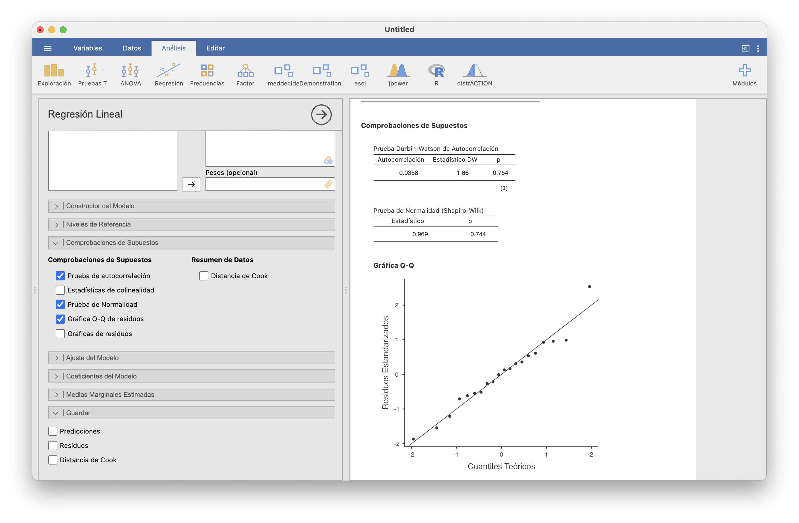
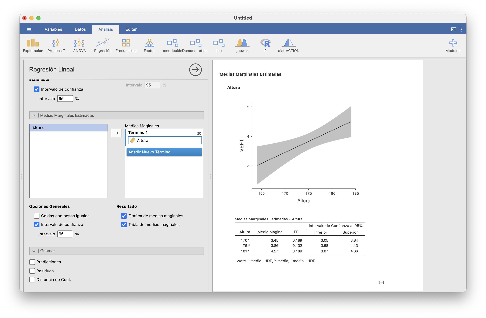
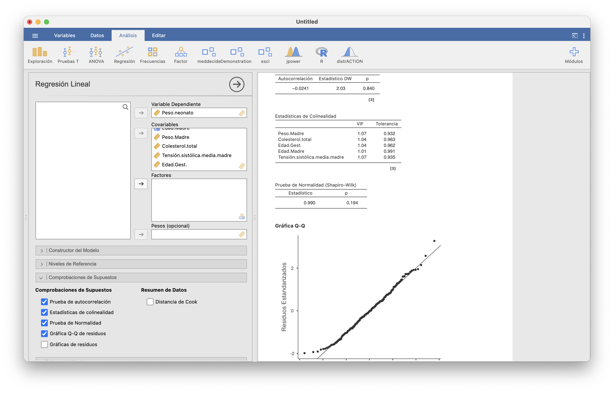

# Regresión lineal

Terminábamos el tema anterior con los contrastes de correlación. Recordad que en un contraste de correlación bilateral buscamos evidencia estadística de que la correlación entre dos variables continuas definidas sobre una misma población es no nula y por lo tanto de que dependen linealmente la una de la otra. En este tema iremos un paso más allá y estimaremos esta dependencia lineal, que representaremos expresando una de las variables, la variable **dependiente**, como una función lineal de la otra, la variable **independiente**. 

En estadística descriptiva, la estimación de esta fórmula lineal nos permite añadir al gráfico de dispersión de una muestra de ambas variables "la recta que más se aproxima a los puntos del gráfico". Ya hablamos de esta recta en la Sección \@ref(sec:edbivar), donde la llamamos **recta de regresión**. Ahora, en estadística inferencial,  esta recta de regresión nos permite, por ejemplo,  predecir el valor de la variable dependiente sobre un individuo del que sepamos el valor de la variable independiente. Naturalmente, esta predicción conllevará una cierta incertidumbre que dependerá de la "confianza" que queramos tener en el valor predicho. 

En los párrafos anteriores hablábamos solo de estudiar la dependencia lineal de una variable continua respecto de otra variable continua. Este es el contexto de la **regresión lineal simple**. Pero, naturalmente, podemos estar interesados en otras situaciones: por ejemplo, puede que nos interese estudiar la dependencia lineal de una variable continua respecto de varias variables continuas, y no solo de una sola, en la **regresión lineal múltiple**, o de una variable aleatoria discreta respecto de una o varias variables continuas o discretas, para lo que usaríamos  **regresión lineal generalizada**. 

Aunque la regresión lineal simple es un caso particular de la regresión lineal múltiple, empezaremos tratando en detalle la primera ya que es la más sencilla. Por otro lado, de la regresión lineal generalizada solo explicaremos el tipo más útil en medicina: una variable binaria como función lineal de una o varias variables también binarias, los que nos permitirá calcular **odds ratios ajustadas**: la OR de la variable dependiente relativa a cada una de las variables independientes *tras descontar el efecto de las otras variables independientes.*

## Regresión lineal simple {#sec:rls}

Empezamos planteando un ejemplo que nos acompañará a lo largo de toda esta sección:

```{example VEF}
Con el objetivo de estudiar la relación entre la altura y el VEF1 (el Volumen Espiratorio Forzado en 1 segundo) en los jóvenes, se midieron ambos valores en una muestra de 20 estudiantes varones sanos. Los datos obtenidos (las alturas en cm y el VEF1 en litros) están recogidos en el fichero [VEF.csv](https://raw.githubusercontent.com/AprendeR-UIB/INREMDN/master/Dades/VEF.csv).
```

El gráfico de dispersión siguiente muestra los pares altura-VEF1 de los sujetos de esta muestra.

```{r,echo=FALSE}
VEF=data.frame(readr::read_delim("VEF.csv", 
    delim = ";", escape_double = FALSE, trim_ws = TRUE))
plot(VEF,ylab="VEF1",xlab="Altura",cex=0.8,pch=20)
```

En la Sección \@ref(sec:edbivar) añadíamos a este gráfico la *recta de regresión* que "más se aproxima" a los puntos:


```{r,echo=FALSE}
plot(VEF,ylab="VEF1",xlab="Altura",cex=0.8,pch=20)
abline(lm(VEF$VEF1~VEF$Altura),col="red",lwd=1.2)
```


En ese momento, esta recta nos permitía visualizar mejor la tendencia al crecimiento lineal conjunto de las dos variables en la muestra. Esta tendencia es estadísticamente significativa, como muestra el análisis de estos datos en **Regresión/Matriz de Correlaciones** de JAMOVI:


```{r jamoviRLS0,echo=FALSE,out.width="100%"}

```

La correlación de Pearson entre las alturas y los VEF1 de la muestra vale 0.581, y en el contraste de hipótesis $\rho_{\text{Altura, VEF1}}=0$ contra $\rho_{\text{Altura, VEF1}}>0$ obtenemos un p-valor de 0.004 y un intervalo de confianza del 95% para $\rho_{\text{Altura, VEF1}}$ entre 0.259 y 1. Marcando todas las casillas de "Gráficas" hemos obtenido el gráfico de dispersión de la muestra con la recta de regresión y además las gráficas de las densidades estimadas de las alturas y los VEF1. La franja gris alrededor de la recta de regresión indica, para cada altura, el intervalo de confianza del 95% para el VEF1 esperado en los jóvenes sanos de esa altura.  

Nuestro objetivo en este tema es estimar la dependencia lineal del VEF1 en función de la altura en el total de la población de los varones jóvenes sanos, de cuya existencia  hemos obtenido evidencia, y usarla, por ejemplo, para estimar el VEF1 esperado de un joven a partir de su altura.  Este tipo de problemas forman el ámbito de la **regresión lineal simple**, donde *simple* indica que usamos una sola variable independiente (por oposición a la regresión lineal **múltiple**, en la que usamos más de una variable independiente).

### La recta de regresión lineal por mínimos cuadrados

La situación general en una regresión lineal simple es la siguiente. Tenemos dos variables $X$ e $Y$ continuas definidas sobre una población y queremos modelar $Y$ como una función lineal de $X$. Para ello, medimos estas variables sobre una muestra de $n$ sujetos de la población y obtenemos un conjunto de pares de valores  $(x_i,y_i)_{i=1,2,\ldots,n}$. 

En este contexto, llamamos a $X$ la  variable **independiente** y a $Y$ la variable  **dependiente**. La variable independiente no tiene por qué ser aleatoria, en el sentido de que podría ser que nosotros  impusiéramos sus valores sobre los sujetos de la muestra. Por ejemplo, $X$ podría ser la dosis de una medicina y que nosotros asignásemos a cada sujeto de la muestra una dosis concreta, no al azar. En cambio, la variable $Y$ sí que tiene que ser aleatoria; si no lo fuera, no tendría sentido usar estadística para estudiarla. 

Suponemos que, a nivel poblacional, *el valor esperado de $Y$ en un individuo es una función lineal de su valor de $X$*.

```{block2,type="rmdromans"}
Si supiéramos que $Y$ no depende linealmente de $X$, ¿para qué íbamos a preocuparnos en modelar $Y$ como una función lineal de $X$? 
```

Formalmente,  si llamamos

* $Y|x$ a la variable aleatoria $Y$ restringida a los individuos en los que $X$ vale $x$

*  $\mu_{Y|x}$ al valor esperado de $Y|x$, es decir, al valor medio de la variable $Y$ sobre todos los individuos de la población en los que $X$ vale $x$

suponemos que existen coeficientes  $\beta_0,\beta_1\in \mathbb{R}$ tales que
$$
\mu_{Y|x}=\beta_0+\beta_1 x.
$$

Los coeficientes $\beta_0$ (el **término constante** o **independiente** de la función lineal) y $\beta_1$ (su **pendiente**) son parámetros que queremos estimar. Por la forma de esta función lineal, el significado de estos coeficientes es el siguiente:

* $\beta_0$ es el valor esperado de $Y$ en los individuos en los que $X=0$

* $\beta_1$ es el incremento esperado del valor de $Y$ cuando el valor de $X$ aumenta en 1 unidad

Tomamos una muestra $(x_i,y_i)_{i=1,\ldots,n}$ de $n$ valores de $(X,Y)$ y con ella obtenemos estimaciones $b_0,b_1$ de  $\beta_0$ y $\beta_1$. Estas estimaciones definen la **recta de regresión** de $Y$ en función de $X$
$$
y=b_0+b_1 x
$$


Esta recta sirve, por ejemplo, para, dado un valor $x_0$ de $X$, estimar el valor esperado de $Y$ en los individuos en los que $X$ valga $x_0$. Denotaremos por $\widehat{y}$ el valor **estimado** de $Y$ en un sujeto cuyo valor de $X$ sea  $x$ usando la recta de regresión:
$$
\widehat{y}=b_0+b_1 x
$$ 

Hay varias técnicas para estimar los coeficientes $\beta_0,\beta_1$. Aquí vamos a explicar la más popular: la **regresión lineal por mínimos cuadrados**. La idea es que tomamos como $y=b_0+b_1 x$  la recta que minimiza su suma de distancias verticales desde los puntos de la muestra.

En concreto, dados $b_0,b_1$, llamamos el  **error** del modelo $\widehat{y}=b_0+b_1 x$ en el punto $i$-ésimo de la muestra $(x_i,y_i)$ a la diferencia $e_i$ entre el valor  $y_i$ de $Y$ en este punto y su valor  estimado $\widehat{y}_i$ de $Y$:
$$
e_i=y_i-\widehat{y}_i=y_i-b_0-b_1 x_i
$$
El valor absoluto de $e_i$ es la **distancia vertical** del punto $(x_i,y_i)$ a la recta $y=b_0+b_1 x$: la longitud del segmento vertical que une el punto con la recta. El gráfico siguiente muestra estos errores para nuestra muestra de alturas y VEF1 y la recta de regresión que hemos dibujado. 

```{r,echo=FALSE}
plot(VEF,ylab="VEF1",xlab="Altura",cex=0.8,pch=20)
abline(lm(VEF$VEF1~VEF$Altura),col="red")
segments(VEF$Altura,VEF$VEF1,VEF$Altura,-9.19039+0.07439*VEF$Altura,
lty="dashed",lwd=0.75,main="Errores")
```


Los **estimadores por mínimos cuadrados**  de $\beta_0$ y $\beta_1$ son entonces los valores $b_0,b_1$ que minimizan la suma de los cuadrados de estos errores: es decir, los valores $b_0,b_1$ tales que el valor de la suma
$$
\sum_{i=1}^n (y_i-b_0-b_1 x_i)^2
$$
es mínimo.

Derivando, igualando a 0, operando etc. obtenemos el resultado siguiente, que ya anunciamos en la Sección \@ref(sec:edbivar):

```{theorem}
Los estimadores por mínimos cuadrados $b_0$ y $b_1$ de $\beta_0$ y $\beta_1$ a partir de la muestra $(x_i,y_i)_{i=1,\ldots,n}$ son
$$
b_1 =\frac{s_{x,y}}{s_x^2},\quad b_0 = \overline{y}-b_1 \overline{x}
$$
donde $s_{x,y}$ es la covarianza de los vectores $x=(x_1,\ldots,x_n)$ e $y=(y_1,\ldots,y_n)$, $\overline{x}$ e $\overline{y}$ son sus respectivas medias muestrales y $s_x^2$ es la varianza de $x$.
``` 


En JAMOVI, la recta de regresión por mínimos cuadrados de $Y$ en función de $X$ se calcula en **Regresión/Regresión lineal**. En nuestro ejemplo, para calcular la recta de regresión por mínimos cuadrados de `VEF1` en función de `Altura`, seleccionaríamos `Altura` como "Covariable" (otra manera de llamar a las variables independientes) y `VEF1` como "Variable dependiente" y obtendríamos la ventana siguiente:


```{r jamoviRLS1,echo=FALSE,out.width="100%"}

```

La columna "Estimador" de la  tabla "Coeficientes del Modelo - VEF1" nos da los valores de $b_0$ (fila "Constante") y $b_1$ (fila "Altura"). Por lo tanto, hemos obtenido la recta de regresión
$$
y=-9.1904+0.0744x
$$
Es decir, estimamos que en la población de los jóvenes varones sanos se cumple la relación
$$
\mbox{VEF1}=-9.1904+  0.0744\cdot \mbox{Altura}
$$

De este modelo deducimos que si un joven sano mide 1 cm más que otro, esperamos que su VEF1 sea 7.44 centilitros mayor. 

```{block2,type="rmdromans"}
También deducimos que el VEF1 esperado de un joven de 0 cm es de -9.1904 litros, pero esto, naturalmente, no tiene ningún sentido.

Para evitar hablar de  VEF1 negativos en jóvenes que no pueden existir, una posible estrategia es, en vez de tomar como variable independiente la altura, tomar la diferencia entre la altura y un cierto valor base razonable, de manera que el 0 corresponda a ese valor base. Por ejemplo, tomar como variable independiente la diferencia entre la altura y 140 cm.
```


```{example,VEF1-165}
¿Qué VEF1 esperamos en un estudiante varón sano de 165 cm?
```

Según el modelo lineal obtenido, el valor esperado de VEF1 cuando $\mbox{Altura}=175$ es $-9.1904+0.0744\cdot 165=3.086$. Aunque naturalmente, a estas altura hemos de tener claro que hemos de acompañar esta estimación puntual con un intervalo de confianza. Los estudiaremos en la Sección \@ref(sec:confintrls).
 

La recta de regresión por mínimos cuadrados tiene las dos propiedades siguientes:

*  Por la fórmula que calcula $b_0$, la recta pasa por el punto medio $(\overline{x},\overline{y})$ de la muestra:
$$
b_0+b_1 \overline{x}=\overline{y}
$$

*  La media $\overline{\,\widehat{y}\,}$ de los valores estimados de $Y$ en los puntos de la muestra  es igual a la media de los valores de $Y$ en la muestra, porque
$$
\overline{\,\widehat{y}\,}=\frac{1}{n}\sum_{i=1}^n \widehat{y}_i=
\frac{1}{n}\sum_{i=1}^n (b_0+b_1x_i)=b_0+b_1\cdot \frac{\sum_{i=1}^n x_i}{n}=b_0+b_1 \overline{x}= \overline{y}
$$


### El coeficiente de determinación

En principio,  la adecuación de la recta de regresión lineal obtenida para modelar $Y$ como función lineal de $X$ se mide por medio del valor absoluto $|r_{x,y}|$ de la correlación de Pearson de $x=(x_1,\ldots,x_n)$ e $y=(y_1,\ldots,y_n)$. Recordemos que $r_{x,y}$ estima la correlación de Pearson $\rho_{X,Y}$ de las variables $X,Y$, y que cuanto mayor es el valor absoluto de $\rho_{X,Y}$, más se aproxima $Y$ a ser una función lineal de $X$.

Ahora bien, por motivos que explicamos un poco más abajo, en la práctica en vez de usar este valor absoluto $|r_{x,y}|$ se usa el cuadrado de la regresión, $r_{x,y}^2$: cuánto mayor sea este cuadrado, mayor será $|r_{x,y}|$ y por lo tanto más se aproxima $Y$ a ser una función lineal de $X$. En el contexto de la regresión lineal por mínimos cuadrado, a  $r_{x,y}^2$ se le llama el **coeficiente de determinación** y se lo denota por $R^2$. Como $r_{x,y}$ toma valores entre -1 y 1, $R^2$ toma valores entre 0 y 1. 

JAMOVI da el $R^2$ en la tabla  "Medidas de ajuste del modelo" al calcular la recta de regresión: $R$ es la correlación de Pearson y $R^2$ su cuadrado, el coeficiente de determinación. El de nuestro ejemplo vale 0.338.


```{block2, type="rmdcorbes"}
El motivo por el que se usa $R^2$ y no $|r_{x,y}|$ es que, calculando un poco, se obtiene que el coeficiente de determinación es igual a *la varianza de los valores estimados* de $Y$ sobre la muestra usada dividida por *la varianza de los valores observados* de $Y$ en la muestra:
$$
r_{x,y}^2=\frac{s_{\widehat{y}}^2}{s_y^2}.
$$
Es decir, $R^2$ mide la fracción de la varianza de $y$  que "explica" la varianza  de los valores estimados $\widehat{y}$. 

Esta medida también tendrá sentido en la regresión lineal múltiple, y además entronca con la filosofía del ANOVA, en el que se toman como estadísticos "cocientes de variabilidades", por lo que se prefiere este cociente a $|r_{x,y}|$.


```

```{block2,type="rmdcaution"}
Como ya os comentamos en la Sección  \@ref(sec:edbivar), 
no es conveniente valorar la bondad del modelo solo con el valor de $r_{x,y}$ o, equivalentemente, de $R^2$: conviene **siempre** dibujar el gráfico de dispersión y la recta de regresión. Recordad los conjuntos de datos de Anscombe que mostrábamos en el Ejemplo \@ref(exm:Anscombe) y que volvemos a dibujar en el gráfico que sigue: los cuatro conjuntos de puntos tienen la misma recta de regresión y  el mismo $R^2$, 0.666, pero se ajustan de maneras muy diferentes a la recta de regresión.
```


```{r anscombe2,echo=FALSE,fig.cap="El cuarteto de Anscombe",fig.width=10,out.width="90%"}
par(mfrow=c(2,2))
plot(anscombe$x1,anscombe$y1,main="Conjunto de datos 1",pch=20)
abline(lm(y1~x1,data=anscombe),col="red",lwd=1.5)
plot(anscombe$x2,anscombe$y2,data=anscombe,main="Conjunto de datos 2",pch=20)
abline(lm(y2~x2,data=anscombe),col="red",lwd=1.5)
plot(anscombe$x3,anscombe$y3,main="Conjunto de datos 3",pch=20)
abline(lm(y3~x3,data=anscombe),col="red",lwd=1.5)
plot(anscombe$x4,anscombe$y4,main="Conjunto de datos 4",pch=20)
abline(lm(y4~x4,data=anscombe),col="red",lwd=1.5)
```


### Intervalos de confianza {#sec:confintrls}


Bien, ya sabemos calcular la recta de regresión por mínimos cuadrados a partir de una muestra. Pero hay que recordar que  sus coeficientes $b_0,b_1$ son *estimaciones* de los coeficientes "verdaderos" de la relación $\mu_{Y|x}=\beta_0+\beta_1 x$. Cuando estimamos algo a partir de una muestra, es conveniente controlar el error de la estimación mediante intervalos de confianza, que en este caso nos dirán, para un nivel de confianza dado, entre qué valores creemos que se mueven los valores reales de $\beta_0$ y $\beta_1$. Y claro, la incertidumbre en la estimación de $\beta_0$ y $\beta_1$ forzosamente se traducirá en una incertidumbre en las predicciones realizadas usando la recta de regresión, que también describiremos mediante intervalos de confianza.

Como siempre, para poder usar fórmulas paramétricas para calcular intervalos de confianza necesitamos que se verifiquen algunas condiciones sobre las variables involucradas. En este caso, las condiciones que vamos a suponer que se cumplen son:

> Las variables aleatorias error $E_i=Y|x_i-\beta_0-\beta_1 x_i$ tienen todas la misma distribución normal de media 0, y son incorreladas dos a dos ($\sigma_{E_i,E_j}=0$ si $i\neq j$).

Si estas condiciones se satisfacen, entonces:

*  El valor esperado de $b_0$ es $\beta_0$ y el valor esperado de $b_1$ es $\beta_1$: $b_0$ y $b_1$ son estimadores **insesgados** de $\beta_0$ y $\beta_1$.

*  Entre todos los estimadores insesgados de $\beta_0$ y $\beta_1$, $b_0$ y $b_1$ son los que tienen menor error típico (son los más **precisos**)

*  Unos  estadísticos relacionados con $b_0$ y $b_1$ (y que no vamos a dar, tranquilos) tienen distribuciones t de Student conocidas, lo que permite calcular intervalos de confianza para $\beta_0$, $\beta_1$ y $\mu_{Y|x_0}$ centrados en las estimaciones.


Con JAMOVI podéis comprobar si se puede aceptar si las variables error $E_i$ cumplen las suposiciones que hemos hecho para que el cálculo de intervalos de confianza tenga sentido en  **Regresión/Regresión lineal/Comprobaciones de supuestos**. En la regresión lineal simple nos interesan la "Prueba de normalidad" y la "Prueba de autocorrelación":


```{r jamoviRLS2,echo=FALSE,out.width="100%"}

```

Los p-valores del test de normalidad y del test de autocorrelación son grandes, por lo que podemos aceptar que todas la variables $E_i$ tienen la misma distribución normal de media 0 y que están incorreladas. La conclusión sobre la normalidad de los residuos la hemos ilustrado con su q-q-plot.

Para calcular con JAMOVI los intervalos de confianza para $\beta_0$ y $\beta_1$ tenéis que ir a **Regresión/Regresión lineal/Coeficientes del modelo** y marcar "Intervalo de confianza" y especificar el nivel de confianza:

```{r jamoviRLS3,echo=FALSE,out.width="100%"}

```

Concluimos con un 95% de confianza que $\beta_0$ está entre -18.238 y -0.143 y que $\beta_1$ está entre 0.023 y 0.126. En la última columna, "p", de la  tabla "Coeficientes del modelo" se da el p-valor de los contrastes bilaterales $\beta_i=0$ contra $\beta_i\neq 0$. 

Aquí es el momento de preguntarnos, más allá del contraste de correlación, si realmente el modelo lineal era adecuado o no. Si no podemos rechazar que $\beta_1=0$, no podemos concluir que el modelo de regresión lineal tenga sentido: $\beta_1=0$ significaría que $\mu_{Y|x}=\beta_0$ para todo $x$, es decir, que el valor esperado de $Y$ en un individuo no depende del valor de $X$. En nuestro ejemplo, el p-valor del contraste $\beta_1=0$ contra $\beta_1\neq 0$ es 0.007, por lo que tenemos evidencia estadísticamente significativa de que $\beta_1\neq 0$ y por lo tanto de que el valor de VEF1 de una persona depende linealmente de su altura. 


Pasemos a los intervalos de confianza para la predicción del valor de $Y$ dado un valor concreto $x_0$ de $X$. Aquí podemos distinguir dos preguntas:

* ¿Cuál es el valor **esperado** de $Y$ en un sujeto en el que $X$ valga $x_0$? Es decir, ¿qué vale el valor medio de $Y$ en los sujetos en los que $X$ vale $x_0$?

    Por ejemplo, ¿cuál es el VEF1 medio de los jóvenes varones sanos que miden 165 cm?

* Dado un sujeto concreto cuya $X$ vale $x_0$, ¿qué vale su $Y$?

    Por ejemplo, si Pep es un joven sano que mide 1.65 ¿que vale su VEF1?

Las estimaciones puntuales que responden a ambas preguntas valen lo mismo: $\widehat{y}=b_0+b_1x$. Pero si lo pensamos un poco nos daremos cuenta de que, para un mismo nivel de confianza, el intervalo de confianza del valor esperado de $Y$ será más estrecho que el intervalo de confianza del valor de $Y$ en un sujeto: hay más incertidumbre en la estimación de $Y$ en *un sujeto concreto* con $X=x_0$ que en la estimación del valor medio de $Y$ en *todos los sujetos* con $X=x_0$.

A día de hoy, JAMOVI responde parcialmente a la primera pregunta, para un nivel de confianza dado. Si en **Regresión/Regresión lineal/Medias Marginales Estimadas** arrastramos la variable Altura a la columna "Medias marginales" y marcamos las  casillas "Intervalo de confianza" (por ejemplo, del 95%), "Gráfica de medias marginales" y "Tabla de medias marginales", obtenemos el resultado siguiente:


```{r jamoviRLS4,echo=FALSE,out.width="100%"}

```

En el gráfico,  la región gris  marca para cada altura el intervalo de confianza del 95% del VEF1 esperado  en las personas de esa altura. Observad cómo este intervalo de confianza se ensancha a medida que la altura se aleja de la media de la muestra. Por otro lado,  en la tabla se obtienen los intervalos de confianza del VEF1 esperado para las personas cuya altura es, respectivamente, la media de las alturas de la muestra menos su desviación típica, la altura media y  la media de las alturas de la muestra más su desviación típica.

Si queremos calculr el IC-95% para el VEF1 medio de las personas de otra altura concreta, hay que usar las funciones adecuadas de R en la ventana **R/Rj**. A modo de ejemplo, supongamos que queremos calcular el IC-95% para el VEF1 esperado de una persona que mida 165 cm. Los pasos a seguir son los siguientes.

* Extraer vectores con las variables independiente y dependiente de la muestra (y recordad que JAMOVI llama `data` al resultado de importar una tabla de datos, independientemente del nombre original del fichero). Los llamaremos `X` e `Y`.

    En nuestro caso, haríamos
```{r,eval=FALSE}
X=data$Altura
Y=data$VEF1
```


* Definir una tabla de datos con el valor de la variable independiente `X` para el que queramos calcular el intervalo de confianza del valor esperado de la variable dependiente. La llamaremos `X.nuevas`.

    En nuestro caso, entraríamos 
```{r,eval=FALSE}
X.nuevas=data.frame(X=165)
```
     
     

* Ejecutar la instrucción
```{r,eval=FALSE}
predict(lm(Y~X), X.nuevas, interval="confidence")
```
donde `X` e `Y` son los vectores con las variables independiente y dependiente de la muestra que hemos definido al principio y `X.nuevas` es la tabla de datos con los "nuevos" valores de la variable independiente. Si el nivel de confianza deseado es otro que 0.95, se tiene que especificar igualándolo al parámetro `level`. 


Todo entero en JAMOVI:


```{r jamoviRLS5,echo=FALSE,out.width="100%"}

```


En este resultado, `fit` es el VEF1 medio estimado cuando Altura=165 (no coincide con nuestra predicción en el Ejemplo \@ref(exm:VEF1-165) porque nosotros hemos tomado los coeficientes redondeados a 4 cifras decimales), y `lwr` y `upr` son los extremos inferior y superior para el intervalo de confianza del 95% para el VEF1 medio de las personas de 165 cm. Asi pues, estimamos con un 95% de confianza que el VEF1 medio de los jóvenes sanos de 1.65 m está entre 2.48 y 3.69 litros.


Para estimar el VEF1 de un joven concretp a partir de su altura, el proceso es el mismo, pero en la función `predict` hay que usar `interval="prediction"` en vez de `interval="confidence"`:

```{r, eval=FALSE}
predict(lm(Y~X), X.nuevas, interval="prediction")
```


```{r jamoviRLS6,echo=FALSE,out.width="100%"}

```

En resumen, si Pep fuera un joven sano de 1.65 m:

* Estimaría con un 95% de confianza que su VEF1 está entre 1.71 y 4.46 litros. 

* Estimaría con un 95% de confianza que el VEF1 medio de los jóvenes sanos de su altura está entre 2.48 y 3.69 litros.

Como veis, la predicción del VEF1 de Pep es mucho más incierta que la de su VEF1 "esperado": es más difícil acertar el VEF1 de una persona que el valor medio del VEF1 de un grupo de personas.


## Regresión lineal múltiple

En el modelo de regresión lineal simple modelábamos una variable dependiente $Y$ en función de una única variable independiente $X$. Pero normalmente habrá más de una variables que influyan, o que al menos puedan influir, en el comportamiento de $Y$.
La regresión lineal múltiple trata el problema de estudiar la expresión de una variable dependiente como función lineal de varias variables independientes. El planteamiento es exactamente el mismo que en el caso simple, solo que con más variables independientes.

### La función de regresión lineal múltiple

Supongamos que tenemos $k$ variables independientes $X_1,\ldots, X_k$ y una variable aleatoria dependiente $Y$ definidas sobre una población y que *el valor esperado de  $Y$ en un individuo es una función lineal de sus valores de  $X_1,\ldots, X_k$.* Es decir, que si llamamos

*  $Y|x_1,\ldots,x_k$ a la variable aleatoria $Y$ restringida a los individuos en los que $X_1$ vale $x_1$, $X_2$ vale $x_2$, ... y $X_k$ vale $x_k$

*  $\mu_{Y|x_1,\ldots,x_k}$ al valor esperado de $Y|x_1,\ldots,x_k$; es decir, al valor medio de $Y$ sobre todos los individuos de la población en los que $X_1$ vale $x_1$, $X_2$ vale $x_2$,... y $X_k$ vale $x_k$

suponemos que existen coeficientes $\beta_0,\beta_1,\ldots,\beta_k\in \mathbb{R}$ tales que

$$
  \mu_{Y|x_1,\ldots,x_k}= \beta_0+\beta_1 x_1+\cdots+\beta_k x_k
$$

Como en el caso simple:

* $\beta_0$ es el valor esperado de $Y$  en los individuos en los que $X_1=\cdots=X_k=0$

* Cada $\beta_i$, $i=1,\ldots,k$, es el incremento esperado del valor de $Y$  cuando el valor de  $X_i$ aumenta en 1 unidad y el resto de las variables independientes permanecen constantes.

Queremos estimar estos coeficientes $\beta_0,\beta_1,\ldots,\beta_k$ a partir de los valores
$$
  (x_{i,1},x_{i,2},\ldots,x_{i,k},y_i)_{i=1,\ldots,n}
$$
de $(X_1,\ldots,X_k,Y)$ sobre una muestra de la población.  Usaremos la notación $\underline{x}_i=: (x_{i,1},x_{i,2},\ldots,x_{i,k})$, para cada $i=1,\ldots,n$.

Sean $b_0,b_1,\ldots,b_k$ las estimaciones obtenidas de  $\beta_0,\beta_1,\ldots,\beta_k$. Estas estimaciones definen la **función lineal de regresión** 
$$
y=b_0+b_1 x_1+\cdots+b_kx_k
$$

Como en el caso simple, dado un sujeto de la población con $X_i=x_i$ para cada $i=1,\ldots,k$, denotaremos por $\widehat{y}$ su valor de $Y$ predicho por esta función, es decir,
$$
\widehat{y}=b_0+b_1 x_1+\cdots+b_kx_k
$$


De nuevo vamos a usar la técnica de **regresión lineal por mínimos cuadrados** para estimar estos coeficientes.  Dados $b_0,b_1,\ldots,b_k$, llamamos el  **error** $e_i$ del modelo $y=b_0+b_1 x_1+\cdots+b_kx_k$ en el punto $i$-ésimo de la muestra $(x_{i,1},x_{i,2},\ldots,x_{i,k},y_i)$ a la diferencia entre el valor $y_i$ de $Y$ en este punto y su valor estimado $\widehat{y}_i=b_0+b_1 x_{i,1}+\cdots+b_kx_{i,k}$:
$$
e_i=y_i-\widehat{y}_i=y_i-(b_0+b_1 x_{i,1}+\cdots+b_kx_{i,k})
$$
Los **estimadores por mínimos cuadrados** $b_0,b_1,\ldots,b_k$ de $\beta_0,\beta_1,\ldots,\beta_k$ son los que minimizan la suma de los cuadrados de estos errores. Las fórmulas de estos estimadores son más complicadas que en el caso simple, así que no las daremos.  Con JAMOVI, se calculan en **Regresión/Regresión lineal**.

Veamos un ejemplo.


```{example,pesoneonato1}
Se postula que el peso de un neonato ($Y$) es una función lineal de la edad y el peso de la madre al inicio del embarazo ($X_1,X_2$), la tensión sistólica media de la madre durante el embarazo ($X_3$), el nivel de colesterol materno a principios del embarazo ($X_4$) y la edad gestacional en el momento del parto ($X_5$).
```

Hemos recogido estos datos para una muestra de 195 partos simples en el fichero [Datos.neonatos.csv](https://raw.githubusercontent.com/AprendeR-UIB/INREMDN/master/Dades/Datos.neonatos.csv). En esta tabla, la edad de la madre está en años y su peso en kg, la edad gestacional en semanas, la tensión en mm Hg, el nivel de colesterol en mg/dl y el peso del neonato en gramos.

El modelo que suponemos es
$$
\mu_{Y|x_1,x_2,x_3,x_4,x_5}=\beta_0+\beta_1x_1+\beta_2x_2+\beta_3x_3+\beta_4x_4+\beta_5x_5
$$
y a partir de nuestra muestra queremos estimar los coeficientes   $\beta_0,\ldots,\beta_5$ de este modelo para luego poder predecir el peso neonatal en función de las características maternas. 

Para ello, tras importar la tabla de datos en JAMOVI, en **Regresión/Regresión lineal** seleccionamos `Peso.neonato` como "Variable dependiente" y el resto de variables como "Covariables":


```{r jamoviRLM1,echo=FALSE,out.width="100%"}

```


La columna "Estimador" de la tabla que resulta contiene los coeficientes estimados de la función de regresión lineal:
$$
y=-5417.14+11.18x_1+5.37x_2-1.68x_3+8.69x_4+166.07x_5
$$
es decir,
$$
\begin{array}{rl}
\text{Peso.neonato}\ =\!\!\!\!\! & -5417.14+11.18\cdot \text{Edad.madre}+5.37\cdot \text{Peso.madre}\\
&\quad -1.68\cdot\text{Tensión.sistólica}+8.69\cdot\text{Nivel.colesterol}\\
&\quad +166.07\cdot\text{Edad.gestacional}
\end{array}
$$

A partir de este modelo podemos predecir el aumento esperado del peso del neonato asociado al aumento en una unidad de cada variable independiente si las otras variables permanecen constantes. Por ejemplo, a igualdad de los valores del resto de variables independientes, el aumento de 1 mg/dl en el nivel de colesterol basal está asociado a un aumento esperado de 8.7 gramos del neonato. 


La función de regresión lineal por mínimos cuadrados tiene las dos propiedades siguientes, que extienden a más de una variable independiente las propiedades de la recta de regresión por mínimos cuadrados:

*  El hiperplano de regresión pasa por el vector de medias muestrales  $(\overline{x}_1,\overline{x}_2,\ldots,\overline{x}_k,\overline{y})$:
$$
    \overline{y}=b_0+b_1 \overline{x}_1+\cdots+b_1 \overline{x}_k
$$
    
*  La media de los valores estimados de  la variable dependiente en la muestra es igual a la media de sus valores observados:
$$
    \overline{\,\widehat{y}\,}=\overline{y}
$$
    
    
### Coeficientes de determinación    
    
El  **coeficiente de determinación** de una regresión lineal múltiple es
$$
    R^2=\frac{s^2_{\widehat{y}}}{s^2_y}
$$
Su valor está entre 0 y 1 y cuanto más se acerque a 1, mejor consideramos el modelo lineal obtenido. JAMOVI lo da en la tabla "Medidas de Ajuste del Modelo". En nuestro ejemplo del peso neonatal, vale 0.446.

El problema de $R^2$ es que su valor siempre aumenta con el número de variables independientes, incluso si las variables que añadimos no sirven para nada. Si, por ejemplo, en la tabla anterior añadiéramos el número de libros que leyó el abuelo del neonato en el año del parto, $R^2$ crecería, pero está claro que añadir al modelo esta nueva variable que no tienen nada que ver con el peso neonatal no puede "mejorarlo".
  
Para tener esto en cuenta, para comparar la bondad de modelos con números diferentes de variables independientes en lugar de usar $R^2$  se usa el **coeficiente de determinación corregido** o **ajustado**
$$
R^2_{\textit{adj}}=1-(1-R^2)\frac{n-1}{n-k-1}
$$
A mayor valor de $R^2_{\textit{adj}}$, mejor es el modelo.

JAMOVI lo calcula marcando la casilla "R^2^ corregida" en **Regresión/Regresión lineal/Ajuste del Modelo**.

```{r jamoviRLM2,echo=FALSE,out.width="100%"}

```

Por ejemplo, si en el modelo lineal del peso neonatal no tenemos en cuenta la edad de la madre, ¿mejora el modelo? Repetimos el cálculo de la regresión lineal múltiple anterior, pero ahora sin la edad de la madre como covariable, y comparamos el $R^2_{\textit{adj}}$ con el anterior:
  

```{r jamoviRLM3,echo=FALSE,out.width="100%"}

```

Si no tenemos en cuenta la edad de la madre, el $R^2_{\textit{adj}}$ baja de 0.431 a 0.421, por lo que el modelo empeora.
  
   
### Intervalos de confianza

Supongamos ahora que:

> Las variables aleatoria **error** 
$$
E_{i}=(Y|\underline{x}_{i})-(\beta_0+\beta_1 x_{i,1}+\cdots+\beta_k x_{i,k})
$$
tienen todas la misma distribución normal de media 0, y son incorreladas dos a dos.

En esta caso, como en la regresión simple,     
    
* Para cada $i=0,\ldots,k$, $b_i$ es un estimador  insesgado del correspondiente $\beta_i$

*  Entre todos los estimadores insesgados de los $\beta_i$, los $b_i$ son los más precisos
  
*  Unos ciertos estadísticos relacionados con los $b_i$ tienen distribuciones t de Student conocidas, lo que permite calcular intervalos de confianza para cada $\beta_i$ y para predicciones de $Y$ centrados en sus estimaciones puntuales
  
La comprobación de las condiciones para poder calcular estos intervalos de confianza se lleva a cabo con JAMOVI como en el caso simple, en **Regresión/Regresión lineal/Comprobaciones de supuestos**. Ya que estamos, en el caso múltiple, aparte de "Prueba de normalidad" y  "Prueba de autocorrelación" nos interesa marcar "Estadísticas de colinealidad". En el próximo apartado explicaremos por qué.


```{r jamoviRLM4,echo=FALSE,out.width="100%"}

```
  
En nuestro ejemplo, los p-valores de las pruebas de normalidad  y autocorrelación nos permiten aceptar que las variables aleatorias  $E_{i}$ tienen todas la misma distribución normal de media 0, y son incorreladas dos a dos. Por lo tanto tendrá sentido calcular intervalos de confianza.
  
Los intervalos de confianza para los coeficientes de la regresión lineal se calculan como en el caso simple, marcando la casilla "Intervalo de confianza" en **Regresión/Regresión lineal/Coeficientes del Modelo**:


```{r jamoviRLM5,echo=FALSE,out.width="100%"}

```

Para cada  coeficiente obtenemos su intervalo de confianza y el p-valor del contraste bilateral que lo compara con 0. Así, en nuestro ejemplo estimamos con un 95% de confianza que el coeficiente $\beta_1$ de la edad de la madre está entre 1.03 y 21.34, y en particular que no es 0. En cambio, no podemos rechazar que el coeficiente de la Tensión sistólica media de la madre sea 0.

Por lo que refiere a los intervalos de confianza para las predicciones de la variable dependiente en función de las independientes, se pueden calcular con la función `predict` en la ventana del editor de R como en el caso simple. Por ejemplo, supongamos que queremos predecir el peso del bebé de una parturienta de 31 años que pesa 72 kg, con nivel de colesterol inicial 182 mg/dl y tendisón sistólica media durante el embarazo 120 si la duración del parto ha sido exactamente 36 semanas.


* Extraemos vectores con las variables independientes y dependiente de la muestra.

```{r,eval=FALSE}
X1=data$Edad.Madre
X2=data$Peso.Madre
X3=data$Tensión.sistólica.media.madre
X4=data$Colesterol.total
X5=data$Edad.Gest.
Y=data$Peso.neonato
```


* Definimos una tabla de datos con los valores de las variables independientes en nuestro sujeto:

```{r,eval=FALSE}
X.nuevas=data.frame(X1=31,X2=72,X3=120,X4=182,X5=36)
```
 
* Ejecutamos la instrucción
```{r,eval=FALSE}
predict(lm(Y~X1+...+Xk), X.nuevas, interval=...)
```
donde `X1`,...,`Xk` son los vectores con las variables independientes (en nuestro ejemplo usaríamos `X1+X2+X3+X4+X5`), `Y` el vector con la variable dependiente e igualamos `interval` a `"confidence"` si queremos el intervalo de confianza del valor esperado de `Y` o a `"prediction"` si queremos este intervalo de confianza para un sujeto concreto.

Lo entramos todo en la ventana del editor de R:

```{r jamoviRLM6,echo=FALSE,out.width="100%"}

```

Hemos obtenido que:

* Nuestra predicción puntual del peso del bebé de nuestra parturienta es de 2.676 kg


* Con un 95% de confianza, estimamos que su peso esperado (es decir, el peso medio de los bebés de las parturientas con los mismos valores de variables independientes que la nuestra) está entre 2.520 y 2.381 kg.

* Con un 95% de confianza, estimamos que el bebé de esta parturienta concreta pesará entre 1.915 y 3.435 gramos.

### Adecuación del modelo

Los p-valores de los contrastes bilaterales $\beta_i=0$ contra $\beta_i\neq 0$ nos permiten estudiar qué coeficientes de la función de regresión podemos rechazar que sean 0. Por ejemplo, en nuestro estudio con un nivel de significación del 5% podemos rechazar que todos los coeficientes de variables independientes (y el término constante) sean 0 salvo el de la Tensión sistólica media de la madre.

Por otro lado, podemos usar las "estadísticas de colinealidad" que obtenemos marcando la casilla correspondiente en **Regresión/Regresión lineal/Comprobaciones de Supuestos** para valorar si alguna variable independiente es función lineal de las otras o no. En concreto, el valor de VIF (*Variance Inflation Factor*) de una variable es
$$
\frac{1}{1-R^2_{\text{la variable}}}
$$
donde $R^2_{\text{la variable}}$ indica el $R^2$ de la regresión lineal de esa variable, tomándola como dependiente, respecto de las otras variables independientes. Un valor del VIF muy cercano a 1 indica un $R^2_{\text{la variable}}$ muy cercano a 0 y por lo tanto que esa variable no se aproxima a una combinación lineal del resto. Es el caso de nuestro ejemplo. En cambio, un valor muy grande del VIF significaría un valor muy grandedel $R^2_{\text{la variable}}$ y por lo tanto que esa variable es combinación lineal del resto. En este caso podríamos eliminarla de la regresión, ya que no aporta información nueva en la estimación de la $Y$. 
  
Volviendo a los p-valores de los contrastes $\beta_i=0$ contra $\beta_i\neq 0$, si no podemos  rechazar que algún $\beta_i$, con $i=1,\ldots,k$, sea 0, no podemos concluir que el modelo de regresión lineal tenga sentido:  $\beta_1=\cdots=\beta_k=0$ 
significaría que  el valor esperado de $Y$ en un sujeto no depende de sus valores de $X_1,\ldots,X_k$.

Pero claro, eso son $k$ contrastes, y ya sabemos que la probabilidad de cometer en alguno un error de tipo I crece con $k$. Además los contrastes no són independientes, ya que los realizamos todos con la misma muestra, así que ajustar los p-valores no es tan sencillo como multiplicarlos por $k$.
 
Una manera de solventar este problema es usar un ANOVA. Si $\beta_1=\beta_2=\cdots=\beta_k=0$, entonces 
$$
\mu_{Y|\underline{x}_1}=\cdots=\mu_{Y|\underline{x}_k}=\beta_0
$$
Por lo tanto, si en el contraste de $k$ medias
$$
\left\{\begin{array}{l}
H_0:\mu_{Y|\underline{x}_1}=\cdots=\mu_{Y|\underline{x}_k}\\
H_1:\mbox{no es verdad que } \mu_{Y|\underline{x}_1}=\cdots=\mu_{Y|\underline{x}_k}
\end{array}
\right.
$$
podemos rechazar la hipótesis nula, obtenemos evidencia de que no es verdad que $\beta_1=\beta_2=\cdots=\beta_k=0$ y por lo tanto de que el modelo lineal tiene sentido.

JAMOVI lleva a cabo el ANOVA que resuelve este contraste marcando "Prueba F" en **Regresión/Regresión lineal/Ajuste del Modelo**:


```{r jamoviRLM7,echo=FALSE,out.width="100%"}

```

El resultado se añade a la tabla "Medidas de ajuste del modelo". El p-valor del ANOVA da <0.001, por lo que tenemos evidencia de que los pesos esperados dependen de las variables independientes. 

**AIC y BIC comparando modelos?**


## Regresión logística