--- 
title: "Bioestadística (Medicina UIB)"
date: "2021-07-26"
site: bookdown::bookdown_site
output: 
   bookdown::html_book:
    includes:
      in_header: style.css
    pandoc_args: [
      "+RTS", "-K64m",
      "-RTS"
    ]  
documentclass: book
#bibliography: [book.bib, packages.bib]
biblio-style: apalike
link-citations: yes
github-repo: AprendeR-UIB/INREMDN
description: "Apunts Bioestadística per a Medicina bookdown::gitbook."
---


\renewcommand\chaptername{Tema}
\renewcommand{\leq}{\leqslant}
\renewcommand{\geq}{\geqslant}

# Presentación {-}

Esto es una edición en línea de los apuntes de *Introducción a la Investigación en Salud y Bioestadística* del grado de Medicina de la UIB. Este trabajo se publica bajo licencia [Atribución-No Comercial-SinDerivados 4.0](https://creativecommons.org/licenses/by-nc-nd/4.0/)
 
Estos apuntes están permanentemente en construcción. En la lista siguiente iremos anunciando las actualizaciones:


* 2021-09-15: 

El libro está escrito en *R Markdown*, usando *RStudio* como editor de textos y el paquete **bookdown** para convertir los ficheros *markdown* en un libro.


**Significado de algunas cajas**:

\BeginKnitrBlock{rmdimportant}<div class="rmdimportant">Material muy importante.</div>\EndKnitrBlock{rmdimportant}

\BeginKnitrBlock{rmdcaution}<div class="rmdcaution">¡Cuidado!</div>\EndKnitrBlock{rmdcaution}

\BeginKnitrBlock{rmdexercici}<div class="rmdexercici">Ejercicio.</div>\EndKnitrBlock{rmdexercici}

\BeginKnitrBlock{rmdcorbes}<div class="rmdcorbes">Detalles matemáticos que os pueden interesar, pero que podéis obviar sin ningún problema.</div>\EndKnitrBlock{rmdcorbes}

\BeginKnitrBlock{rmdnote}<div class="rmdnote">Comentario que queremos enfatizar.</div>\EndKnitrBlock{rmdnote}

\BeginKnitrBlock{rmdrecordau}<div class="rmdrecordau">Comentario que queremos que recordéis</div>\EndKnitrBlock{rmdrecordau}

\BeginKnitrBlock{rmdromans}<div class="rmdromans">Cuestión en la que queremos que caigáis en la cuenta.</div>\EndKnitrBlock{rmdromans}

\BeginKnitrBlock{rmderrorpetit}<div class="rmderrorpetit">Acabamos de matar un gatito</div>\EndKnitrBlock{rmderrorpetit}


<!--chapter:end:index.Rmd-->


# (PART\*) Tema I: Introducción a los estudios médicos y la estadística  {-}


# Introducción

Incluso aunque seáis recién llegados al grado de Medicina, con la que nos cayó encima en el 2020 seguro que el tipo de situación siguiente os va a ser familiar. Suponed que se ha realizado un estudio clínico sobre una muestra de individuos para determinar:

* si una nueva vacuna es efectiva para prevenir una cierta enfermedad;


* o si un  grupo de riesgo concreto tiene una mayor probabilidad de complicaciones en la evolución de una enfermedad;


* o si un determinado comportamiento es efectivo en la prevención de una enfermedad;


* o si una nueva terapia es más efectiva, o tiene menos efectos secundarios adversos, que las terapias anteriores;


* o si una nueva técnica diagnóstica para una determinada enfermedad es más precisa que las anteriores, o igual de precisa pero más barata, o más rápida, o menos intrusiva...


La información obtenida en este estudio se habrá recogido sobre un conjunto más o menos pequeño de individuos, y queremos saber hasta qué punto se puede generalizar al total de la población mundial, o al menos a la población de nuestro entorno. La estadística es la que nos permite esta generalización.

Se ha definido estadística de muchas maneras. La que más nos gusta, y que entronca con la situación que acabamos de explicar, es que 

> La **estadística** es la ciencia que permite adquirir conocimiento generalizable a partir de datos. 


Una definición en la que apenas sobran palabras:

* En estadística, siempre se empieza obteniendo unos **datos** sobre un grupo (relativamente pequeño) de individuos de una población. Bueno, en realidad, no se empieza obteniendo los datos, sino planificando cuidadosamente cómo se van a obtener, pero todo forma parte de la "obtención" de los datos.
* Usando estos datos, se **generaliza** el **conocimiento** que se ha obtenido sobre los individuos del grupo elegido al total de la población.
* Y no se trata de trucos de magia adivinatoria, sino de una **ciencia** cuya metodología ha sido validada por medio de demostraciones matemáticas o, en el peor de los casos, mediante simulaciones numéricas (el equivalente en matemáticas de los experimentos en las otras ciencias). 


<div class="figure" style="text-align: center">

<p class="caption">(\#fig:gaturro)Gaturro ((c) Nick) y la estadística.</p>
</div>


Como decíamos, la situación de partida a la hora de aplicar técnicas estadísticas es que disponemos de un conjunto de datos que describen algunas características de un grupo de individuos elegidos de una población. El análisis estadístico de estos datos puede ser entonces de dos tipos básicos:

*  **Análisis descriptivo**, cuando nuestro objetivo sea simplemente resumir, representar y explicar los datos concretos de los que disponemos. La **estadística descriptiva**  es el conjunto de técnicas que se usan con este fin. 

* **Análisis inferencial**, si nuestro objetivo es deducir  (**inferir**),  a partir de estos datos, información significativa sobre el total de la población de interés.  Las técnicas que se usan en este caso forman la **estadística inferencial**.


<div class="figure" style="text-align: center">
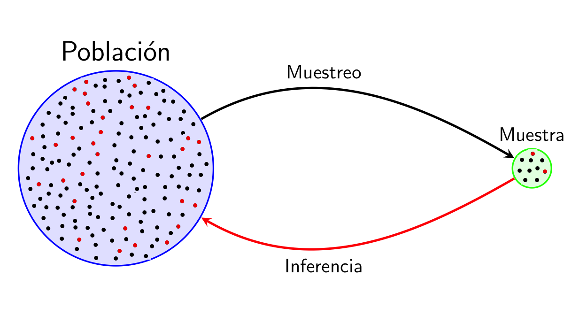
<p class="caption">(\#fig:estinf)Estadística inferencial.</p>
</div>

Ambos tipos de análisis están relacionados. Por un lado, porque es conveniente (obligatorio, en nuestra opinión) empezar cualquier análisis inferencial dando un vistazo a los datos que se usarán. Por otro, porque muchas técnicas descriptivas permiten estimar propiedades de la población de la que se ha extraído la muestra. Por citar un ejemplo, la media aritmética de las alturas de una muestra de individuos nos da un valor  más o menos representativo de esta muestra, pero también sirve para *estimar*  la altura media de los individuos de la población total.

La estadística inferencial entra en juego cuando se quiere obtener información sobre una población y no se puede acceder a todos sus integrantes. Si por ejemplo queremos conocer la altura media  de los estudiantes matriculados en esta asignatura de la UIB en este curso, en principio no necesitamos para nada la estadística inferencial. Son pocos, los medimos a todos y calculamos la media. En todo caso, usaríamos técnicas de estadística descriptiva para describir estas alturas de manera adecuada. Pero si quisiéramos conocer la altura media de los residentes en Mallorca de 18 años, sería muy complicado medirlos a todos. Entonces, lo que haríamos sería tomar una muestra representativa de esta población, medirlos y a partir de sus alturas estimar dicha altura media. Naturalmente, lo más seguro es que de esta manera no obtuviéramos el valor exacto de la altura media de los residentes en Mallorca de 18 años, nos tendríamos que conformar con obtener una aproximación dentro de un cierto margen de error y determinar la probabilidad de acertar con nuestra estimación y este margen de error. La estadística inferencial es la que nos permite acotar el error que podamos haber cometido y calcular la probabilidad de cometerlo, incluyendo la metodología que tendríamos que haber usado para tomar la muestra en primer lugar.


<div class="figure" style="text-align: center">

<p class="caption">(\#fig:cyanide)Cyanide and Happinness ((c) Explosm.net) y la estadística.</p>
</div>


Hace más de 80 años, la prestigiosa revista médica *The Lancet* ya avisaba en [un editorial titulado "Matemáticas y medicina"](https://www.sciencedirect.com/science/article/abs/pii/S0140673600865708) que muchos de los problemas en medicina son de estadística. Nos encanta la frase (a partir de la segunda línea del fragmento mostrado  en la Figura \@ref(fig:lancet2)): "Los métodos estadísticos sencillos son mucho más de nuestra incumbencia que muchas de las cosas que nos obligan  a estudiar en los seis largos años del currículo de Medicina". 


<div class="figure" style="text-align: center">

<p class="caption">(\#fig:lancet2)Fragmento del editorial "Matemáticas y medicina" de *The Lancet* (2 de enero de 1937).</p>
</div>


En los últimos años, la necesidad de su conocimiento se ha reforzado con el auge de la  **Medicina Basada en la Evidencia**. No vamos ahora a entrar en detalle sobre este enfoque de la medicina, porque seguro que os lo van a explicar en otras asignaturas mucho mejor  de lo que lo haríamos aquí. Pero al menos hay que tener presente que su objetivo es **tomar decisiones médicas en base a la mejor evidencia científica disponible**. La evaluación de la evidencia disponible  se tiene que basar en dos Es: en la **E**xperiencia del médico y en la **E**stadística. La segunda **E** se debe a que la mayoría de estudios médicos fundamentan sus conclusiones por medio de la estadística. Ya sabéis,  usan la estadística para generalizar lo observado sobre los sujetos de una muestra a toda una población. Por tanto, para evaluar la fuerza de la evidencia obtenida  en los estudios que consultéis a la hora de tomar una decisión, os serán  necesarios unos mínimos conocimientos de estadística. Tendréis que  ser capaces, por ejemplo, de discernir si el estudio se ha llevado a cabo correctamente, si el análisis de los datos se ha realizado de manera correcta, si las conclusiones a las que han llegado sus autores están bien fundamentadas y hasta qué punto son válidas en el caso clínico concreto que os ocupe. 

Pues eso, el objetivo de esta asignatura es que adquiráis algunos de estos mínimos conocimientos de estadística.


<!--chapter:end:01-Intro.Rmd-->

# Estudios médicos {#chap:estudios}


Un **estudio** es un proceso cuyo objetivo es obtener evidencia empírica sobre alguna cuestión. En el caso de los estudios **médicos** que nos ocupan en este curso, esta cuestión es, naturalmente, sobre algún aspecto de la salud de las personas:  la efectividad de un tratamiento, la precisión de un test diagnóstico, las causas de una enfermedad, algún tema de salud pública... 


<div class="figure" style="text-align: center">

<p class="caption">(\#fig:anuncis)Estudios médicos.</p>
</div>


## Pasos de un estudio médico {#sec:pasos}

Para ir calentando motores, vamos a describir brevemente la estructura habitual de un estudio médico, y lo ilustraremos con el artículo ["Marcha nórdica para prevención cardiovascular en pacientes con cardiopatía isquémica crónica o síndrome metabólico"](https://www.sciencedirect.com/science/article/pii/S0025775316305024) (C. Vehí *et al*,^[Este *et al* significa "y otros" y se utiliza para no dar toda la lista de autores de un artículo.] *Medicina Clínica* 147 (2016), pp. 537-539) que convendría que fuerais consultando en paralelo a esta sección.

En un estudio médico por norma general se llevan a cabo los pasos siguientes:

1. Se definen los **objetivos** de la investigación. En este primer paso,

    * Se describe la hipótesis general que se quiere investigar.
    * Se concretan los objetivos específicos dentro de este marco general.
    
    En el artículo que estamos siguiendo a modo de ejemplo:
    
    * La hipótesis general es que el ejercicio físico es efectivo en la prevención de riesgos cardiovasculares.
    * El objetivo específico es determinar si la marcha nórdica reduce los factores de riesgo cardiovascular en los individuos del área sanitaria mediterránea.

1. Se investigan los **antecedentes** sobre los objetivos específicos: ¿Qué se sabe sobre el tema?

    En nuestro ejemplo, los autores recogen algunos beneficios generales de la marcha nórdica y luego afirman que "no hay datos de esta modalidad de ejercicio en el ámbito médico de la población mediterránea". 

1. Se **planifica** cómo se van a recoger los datos.

    En nuestro ejemplo, encontraréis el detalle de este punto en el apartado "Material y métodos" del artículo: tipo de estudio, criterios de inclusión de los participantes, actividad que tenían que realizar los participantes y cómo se recogieron los datos.

1. Se ejecuta  el plan trazado y se **recogen** los datos.


1. Se **analizan** los datos.

    En nuestro ejemplo, los resultados de este análisis se recogen básicamente en la Tabla 2 del artículo.

1. Se extraen **conclusiones**.

    En nuestro ejemplo, las encontraréis en el apartado  "Discusión y conclusiones" del artículo. Básicamente, los autores concluyen que "Un programa de marcha nórdica es factible en el sistema sanitario público y puede ser útil  para mejorar el control de los factores de riesgo cardiovascular".

1. Se **publican** los resultados.

    Pues eso, los resultados del estudio de nuestro ejemplo se publicaron  en el artículo que estamos comentando.
    
Es un buen momento para que volváis al artículo y observéis su estructura, típica de los artículos en ciencias experimentales. Se trata de la estructura **IMRyD**, acrónimo de:

1. **Introducción**, donde se recogen los pasos 1 y 2 del proceso anterior.

2. **Metodología** ("Material y métodos", en este artículo concreto), donde se detallan los pasos 3 y 4.

1. **Resultados**, donde se explica el análisis de los datos y los resultados "numéricos" del mismo, sin extraer conclusiones aún (en plan "obtuvimos esto, esto, esto y esto").

1. **Discusión** ("Discusión y conclusiones", en este artículo concreto),  donde se completa el análisis de los datos,  se extraen las conclusiones y se discute su alcance.

El artículo científico además tiene otras dos partes muy importantes:

* El **Resumen** (*Abstract*) al principio, describiendo lo más relevante de cada una de las cuatro partes centrales del artículo. Este resumen está relacionado con el último paso del proceso de investigación, la publicación de resultados, ya que es lo único que se lee en la mayoría de los casos, entrando solo en el detalle del artículo cuando, tras la lectura del resumen, decidimos que nos interesa de verdad.

* La **Bibliografía** al final, relacionada en parte con el paso 2 (los antecedentes).


<div class="figure" style="text-align: center">
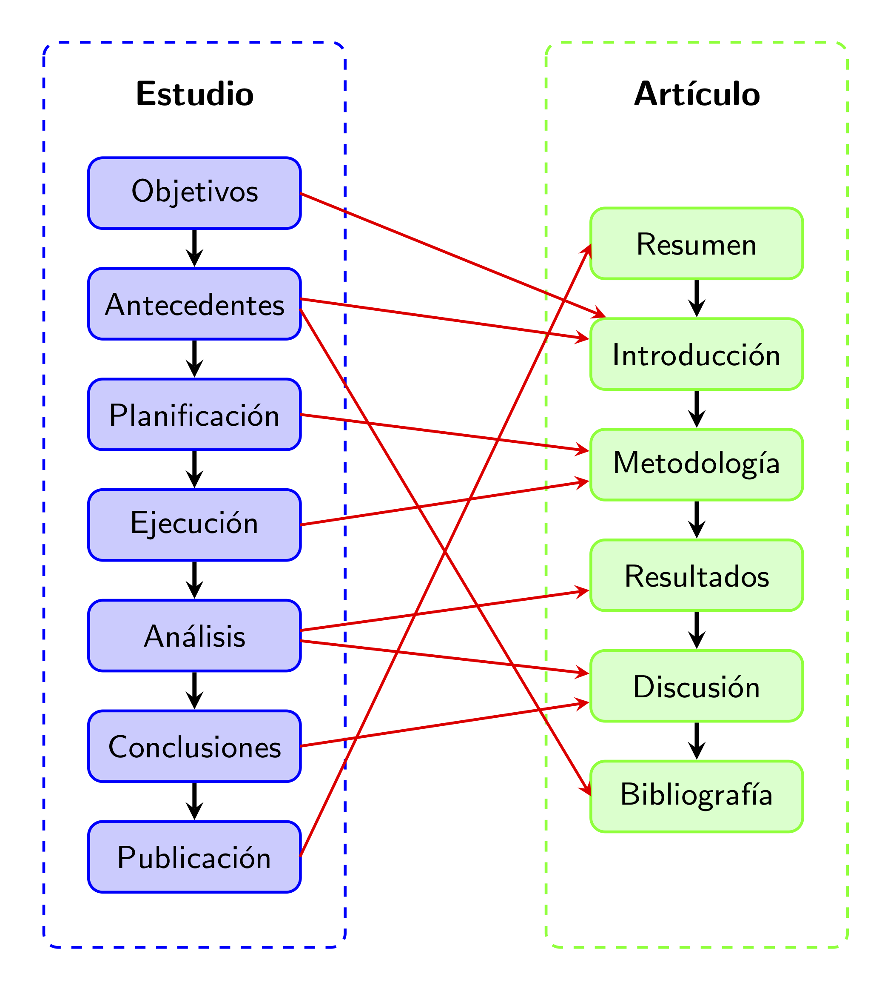
<p class="caption">(\#fig:pasosvsarticle)Correspondencia entre los pasos de un estudio y la estructura IMRyD de un artículo científico.</p>
</div>


## Algunos calificativos para los estudios médicos

Podemos clasificar los estudios médicos de diferentes maneras:

* Según su **alcance**:

    * **Descriptivos**: Se limitan a describir las características de un grupo de individuos.

    * **Analíticos**: Intentan inferir asociaciones para el total de la población (de tipo causa/efecto, antecedente/desenlace, ...).
    
    Por ejemplo:
    
    * "A cinco pacientes con la enfermedad X les hemos administrado el tratamiento A y tres estaban curados a los 8 días de iniciar el tratamiento. Y punto.": **Descriptivo**.
    * "Hemos dividido un grupo de pacientes con la enfermedad  X en dos grupos. A unos les hemos administrado el tratamiento A y a los otros el tratamiento B. Los tratados con A han tenido una tasa de curación en 8 días más alta que los tratados con B. Llegamos a la conclusión que el tratamiento A es más efectivo que el B para los enfermos de X.": **Analítico**.
    
    
* Según el **papel jugado por el investigador**:

    * **Observacionales**: El investigador se limita a recoger datos, sin ejercer ninguna influencia planificada sobre los acontecimientos que generan estos datos.

    * **Intervencionista**: El investigador influye  de manera planificada en  los acontecimientos que generan los datos que recoge. 
    
    
    Por ejemplo:
    
    * "Hemos recogido datos de todos los pacientes con la enfermedad  X en nuestro hospital durante un año y anotado qué tratamiento se les ha administrado. Los tratados con A han presentado una tasa de curación en 8 días más alta que los tratados con B.": **Observacional**.
    * "Hemos dividido al azar un grupo de pacientes con la enfermedad  X en dos grupos del mismo tamaño. A unos les hemos administrado el tratamiento A y a los otros el tratamiento B. Los tratados con A han tenido una tasa de curación en 8 días más alta que los tratados con B.": **Intervencionista**.
    
* Según el **lapso de tiempo** sobre el que se recoge la información:

    * **Transversales**: Se recoge información sobre un solo momento.

    * **Longitudinales**: Se recoge información sobre varios momentos de tiempo y se estudian los cambios producidos entre los mismos.
    
         A su vez, estos últimos suelen dividirse en:

         * **Prospectivos**: Se recoge información en un momento concreto (normalmente, al inicio del estudio) y en momentos posteriores.

         * **Retrospectivos**: Se recoge información en un momento concreto (de nuevo, normalmente, al inicio del estudio) y sobre momentos anteriores.
         
    Por ejemplo:
    
    * "Hoy hemos tomado una muestra de 100 estudiantes de la UIB y les hemos hecho un test de COVID-19." **Transversal**.
    * "Hoy hemos tomado un grupo de enfermos de COVID-19 y les vamos a hacer un seguimiento para estudiar si la evolución de la enfermedad depende del Índice de Masa Corporal del enfermo en el momento del diagnóstico." **Longitudinal prospectivo**.
    * "Hoy hemos tomado un grupo de enfermos de COVID-19 con síntomas leves y un grupo con síntomas muy graves, y les hemos preguntado por su hábito de uso de mascarilla en las últimas semanas." **Longitudinal retrospectivo**.
        
\BeginKnitrBlock{example}<div class="example"><span class="example" id="exm:unnamed-chunk-16"><strong>(\#exm:unnamed-chunk-16) </strong></span>El estudio sobre la marcha nórdica de la sección anterior es:
  
* **Analítico**, puesto que su objetivo es inferir los efectos de la marcha nórdica en los factores de riesgo cardiovascular para las personas del área sanitaria mediterránea, no solo describir qué les pasó a los 23 individuos que participaron en el estudio.
 
* **Longitudinal prospectivo**, puesto que se compararon datos tomados en el momento de iniciar el estudio y al cabo de un año.

* **Intervencionista**, puesto que los investigadores influyeron en el comportamiento de los participantes al hacerles realizar unas sesiones semanales de marcha nórdica con el fin de estudiar su efecto.
</div>\EndKnitrBlock{example}

\BeginKnitrBlock{rmdnote}<div class="rmdnote">Si los investigadores hubieran recetado una terapia de marcha nórdica a los participantes porque, según su criterio médico, lo necesitaban y no porque participaban en un estudio, este no hubiera sido intervencionista, sino observacional.</div>\EndKnitrBlock{rmdnote}

\BeginKnitrBlock{rmdexercici}<div class="rmdexercici">Combinando los tipos de estudio según el papel jugado por el investigador y según el lapso de tiempo sobre el que se recoge la información, tenemos estudios:
  
* Observacionales transversales
* Observacionales prospectivos
* Observacionales retrospectivos
* Intervencionistas transversales
* Intervencionistas prospectivos
* Intervencionistas retrospectivos

Acabamos de ver que hay estudios intervencionistas prospectivos. ¿Los hay de las otras cinco clases de estudios de esta lista, o hay algún par de características que es imposible que un estudio las tenga simultáneamente?
</div>\EndKnitrBlock{rmdexercici}


       
En las siguientes secciones discutimos con más detalle los tipos más básicos de estudios médicos, anotados en la Figura \@ref(fig:estudisgraf).


<div class="figure" style="text-align: center">

<p class="caption">(\#fig:estudisgraf)Tipos básicos de estudios médicos.</p>
</div>

## Estudios descriptivos

Los tres tipos principales de estudios descriptivos son:

* **Informe de caso**: La descripción detallada de un paciente.

* **Serie de casos**: Descripción detallada de un conjunto pequeño de pacientes (pero más de uno, o sería un informe de *un* caso) con alguna característica en común que hace que tenga sentido agruparlos. La información se recoge por medio de sus historias clínicas  y entrevistas clínicas.

* **Encuesta** (*Survey*): Descripción de un conjunto "grande" de individuos con alguna característica en común. La información se recoge por medio de cuestionarios o entrevistas.

Recordad que los estudios descriptivos solo **describen** un sujeto o un conjunto de sujetos, sin pretender ir más allá. Aparte de su utilidad como anécdota ("¡Mira, a este esto le funcionó, vamos a probar a ver!") y para alertar de nuevas enfermedades, sirven principalmente para identificar observaciones interesantes que merezcan ser investigadas.


\BeginKnitrBlock{example}<div class="example"><span class="example" id="exm:origenesHIV"><strong>(\#exm:origenesHIV) </strong></span>Lo que más tarde se reconocería como la epidemia de SIDA se presentó en sociedad en unas primeras series de casos publicadas a principios de los años 1980. En ellos se describían casos de jóvenes homosexuales sanos que  habían desarrollado enfermedades relacionadas con una deficiencia grave del sistema inmunitario, como por ejemplo infecciones oportunistas o el sarcoma de Kaposi (un tipo de cáncer de piel asociado a una infección vírica que hasta entonces solo se había detectado básicamente en ancianos de ascendencia judía o mediterránea y en jóvenes en África). Cuando el número de publicaciones de casos similares fue abrumador, se llevó a cabo un [estudio de casos y controles](https://www.acpjournals.org/doi/abs/10.7326/0003-4819-99-2-145) (*casos*: enfermos de lo que fuera esa enfermedad; *controles*: personas sanas de características similares a los casos; explicaremos los estudios de casos y controles en la próxima sección) para determinar cuáles eran las características, hábitos, comportamientos etc. que tenían en común los enfermos y no compartían con los sanos.
</div>\EndKnitrBlock{example}


\BeginKnitrBlock{example}<div class="example"><span class="example" id="exm:diabetesSC"><strong>(\#exm:diabetesSC) </strong></span>El artículo ["Diabetes tipo 2 en niños. Serie de casos"](http://www.scielo.org.pe/pdf/rmh/v26n1/a02v26n1.pdf)  (H. Manrique-Hurtado *et al*, *Revista Médica Herediana* 26 (2015), pp. 5-9) es, como indica su título, un ejemplo típico de serie de casos. Se trata de una descripción detallada de las características de todos los niños y adolescentes diagnosticados de diabetes tipo 2 (DM2) en dos hospitales de Lima (Perú) entre 2008 y 2013. En total, se describen 32 sujetos de entre 8 y 19 años.

Entre otras características, se observó que, en el momento del diagnóstico, el 85% de ellos presentaban acantosis pigmentaria (un transtorno de la piel); que un 17%  tenían  cetoacidosis diabética (CAD), que suele ir asociada a diabetes  tipo 1 y no 2; y que estos últimos presentaban todos una serie de características comunes, por ejemplo todos tenían acantosis pigmentaria. 

Todas estas observaciones sirven para confirmar, o contradecir, observaciones realizadas en otros momentos u otros países sobre enfermos de DM2 en esta franja de edad. Además,  plantean cuestiones sobre la DM2 en niños y adolescentes  que pueden ser susceptibles de responderse mediante estudios analíticos. Por ejemplo: ¿Es la acantosis pigmentaria un síntoma frecuente de DM2 entre niños y adolescentes? ¿Presentar CAD y acantosis pigmentaria es más síntoma de DM2 que de DM1 entre niños y adolescentes?
  
  </div>\EndKnitrBlock{example}

\BeginKnitrBlock{example}<div class="example"><span class="example" id="exm:surveycovid"><strong>(\#exm:surveycovid) </strong></span>En el estudio ["Survey of COVID-19 Disease Among Orthopaedic Surgeons in Wuhan, People’s Republic of China"](https://journals.lww.com/jbjsjournal/Fulltext/2020/05200/Survey_of_COVID_19_Disease_Among_Orthopaedic.1.aspx) (X. Guo *et al*, *The Journal of Bone and Joint Surgery*  102 (2020),  pp. 847-854), se pasó un cuestionario a todos los cirujanos ortopédicos del área urbana de Wuhan (China) que no habían sido destinados específicamente a tratar enfermos de COVID-19. El objetivo era identificar cuántos habían tenido COVID-19 antes de finales de febrero de 2020 y recoger una serie de características de interés sobre ellos: sus síntomas, a cuánta gente contagiaron, su estado de salud previo al contagio, la distancia de su hospital al Mercado de Huanan (el presunto origen de la pandemia) etc. Se encontraron en total 24 infectados, y sus características se describen en el artículo mencionado.

Esta parte del estudio es descriptiva: una descripción de todos los casos de COVID-19 en un colectivo concreto. El estudio luego tuvo una segunda parte analítica que clasificaremos como **de casos y controles** en la próxima sección.

</div>\EndKnitrBlock{example}

\BeginKnitrBlock{rmdromans}<div class="rmdromans">Hemos dicho que una serie de casos describe un grupo pequeño de individuos, y que un *survey* describe un grupo grande. En la serie de casos del Ejemplo \@ref(exm:diabetesSC) se describieron 32 pacientes, y en el *survey* (así es como lo clasifican sus autores en el título) del Ejemplo \@ref(exm:surveycovid) solo 24 infectados. ¿32 es pequeño y 24 es grande?
  
¡Claro que no! La diferencia aquí está en cómo se obtuvo la información: por medio de historias clínicas en el estudio peruano y  por medio de un cuestionario en el estudio chino. Además, en este segundo caso el cuestionario se pasó a 428 médicos, por lo que el número de pacientes "descritos" podría haber sido mucho mayor.

De todas formas, no hay una línea divisoria clara entre las series de casos y los *surveys*. Ni falta que hace.</div>\EndKnitrBlock{rmdromans}


## Estudios de casos y controles {#sec:cyc}

En un **estudio de casos y controles**:

* Se toma un grupo de individuos con una enfermedad  (los **casos**) y un grupo de individuos sin esta enfermedad (los **controles**)

* Se les compara **retrospectivamente** para encontrar diferencias en  su exposición a factores de riesgo en el pasado. 

* Se determinan qué factores de riesgo fueron más frecuentes entre los casos que entre los controles.

* Se infiere que, en la población general, la exposición a dichos factores está asociada a una mayor probabilidad de sufrir la enfermedad. 


<div class="figure" style="text-align: center">

<p class="caption">(\#fig:cataratas)Esquema del estudio de casos y controles del Ejemplo \@ref(exm:rubeola).</p>
</div>


\BeginKnitrBlock{example}<div class="example"><span class="example" id="exm:rubeola"><strong>(\#exm:rubeola) </strong></span>En [uno de los primeros estudios de casos y controles](https://www.ncbi.nlm.nih.gov/pmc/articles/PMC2022425/), R. Doll y A. Bradford Hill tomaron  1357 **casos** de hombres con cáncer de pulmón y 1357 **controles**, hombres con cáncer de otros tipos. Les preguntaron por el número medio diario de cigarrillos que habían fumado durante los 10 años anteriores al diagnóstico. Los resultados fueron los de la Figura \@ref(fig:doll), donde se observa una clara tendencia a ser más fumador entre los casos que entre los controles.
</div>\EndKnitrBlock{example}


<div class="figure" style="text-align: center">
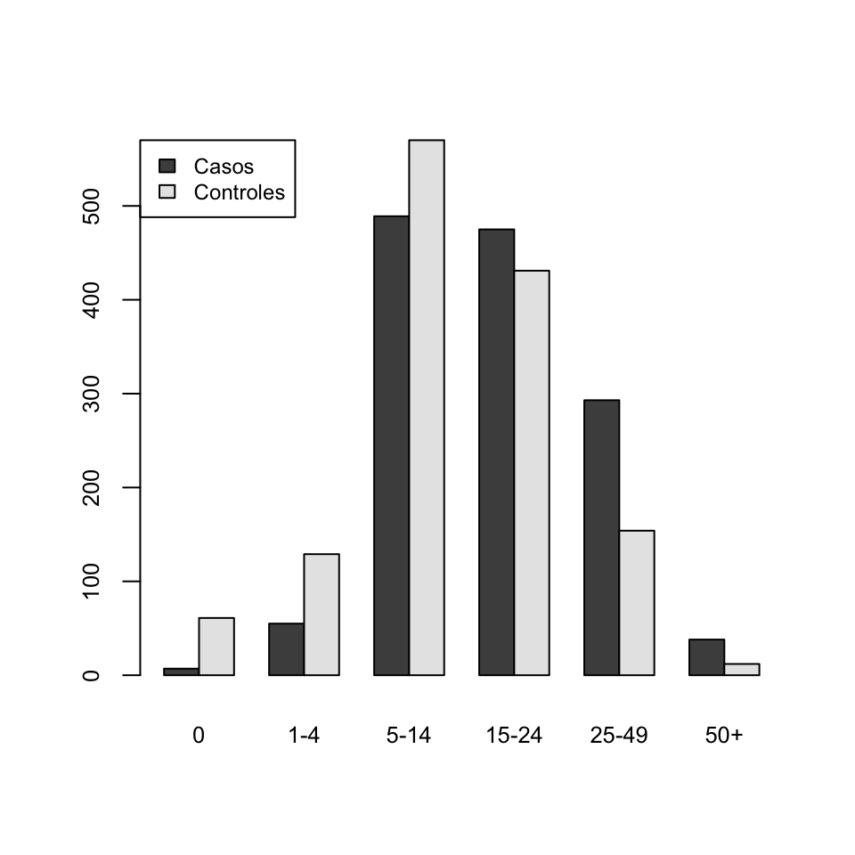
<p class="caption">(\#fig:doll)Consumo de tabaco en la muestra analizada por R. Doll y R. Bradford Hill en "Study of the Aetiology of Carcinoma of the Lung", *British Medical Journal* 2 (1952), pp. 1271–1286.</p>
</div>

Los estudios de casos y controles son:

* **Observacionales**, porque se recogen datos y se analizan sin influir en las características que se han medido.

* **Analíticos**, puesto que el objetivo es deducir la asociación entre los factores de riesgo y la enfermedad a nivel poblacional.

* **Longitudinales**, puesto que se analiza información sobre un período de tiempo, que va desde el momento en que los sujetos son declarados casos o controles hacia el pasado. Por lo tanto, son además **retrospectivos**. 

Veamos un estudio de casos y controles más reciente.

\BeginKnitrBlock{example}<div class="example"><span class="example" id="exm:tuberculosisCC"><strong>(\#exm:tuberculosisCC) </strong></span>En el estudio ["Tabaquismo y fracaso del tratamiento de la tuberculosis pulmonar. Un estudio de casos y controles"](https://www.scielo.br/scielo.php?pid=S1806-37132019000200205&script=sci_arttext&tlng=es) (J. P. Aguilar *et al*, *Jornal Brasileiro de Pneumologia* 45.2 (2019), e20180359) se tomaron todos los pacientes que recibieron tratamiento contra la tuberculosis en una institución brasileña concreta entre 2007 y 2015 y que además satisfacían algunas restricciones extra (mayores de 15 años, sin diabetes ni SIDA...). Se definieron como **casos** aquellos pacientes en los que el tratamiento fracasó (según unos criterios precisos) y como **controles** aquellos pacientes en los que tuvo éxito. En total fueron 50 casos y 234 controles.

</div>\EndKnitrBlock{example}

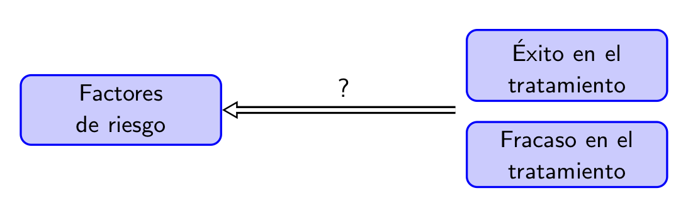
    

Se analizaron un buen número de antecedentes que pudieran influir en el desenlace del tratamiento de la tuberculosis: sexo, edad, historial  de fumador, historial de consumo de alcohol, salario etc. La única diferencia "significativa"  que encontraron fue en el fumar: un 52% de los casos eran fumadores en el momento del diagnóstico de la tuberculosis o lo habían sido antes, contra solo un 30% de los controles. En cambio, por ejemplo, eran consumidores frecuentes de alcohol en el momento del diagnóstico de la tuberculosis o lo habían sido antes un 59% de los casos y un 52% de los controles, una diferencia que no fue lo suficientemente grande como para poder considerarla "significativa".

El adjetivo **significativo**, que ha salido dos veces y hemos entrecomillado en el párrafo anterior, tiene un significado muy concreto en estadística, sobre el que volveremos más adelante en el curso. Por ahora lo tomaremos en el sentido intuitivo de **tan grande que sería muy raro que fuera causalidad, lo que nos hace sospechar que también hay diferencia en la población en general**. Por ejemplo: 

* La diferencia entre el 52% de fumadores entre los casos y el 30%  de fumadores entre los controles fue tan grande, que hubiera sido muy improbable si, en la población general, la proporción de fumadores entre los casos no fuera mayor que entre los controles. 

     Esto nos hace dudar de que estas proporciones sean iguales a nivel poblacional y concluir que la proporción de fumadores entre los individuos en los que el tratamiento de tuberculosis fracasa es mayor que entre aquellos en los que tiene éxito.
     
* La diferencia entre el 59% de consumidores frecuentes de alcohol entre los casos y el 52% entre los controles no fue lo bastante grande como para ser muy improbable si, en la población general, la proporción de consumidores  frecuentes de alcohol entre los casos no fuera mayor que entre los controles. 

    Entonces, no tenemos motivo para concluir que la proporción de  consumidores frecuentes de alcohol entre los individuos en los que el tratamiento de tuberculosis fracasa sea mayor que entre aquellos en los que tiene éxito.


En este estudio, los números de casos y controles no se prefijaron en su diseño, sino que se tomaron "los que encontraron" en un grupo de individuos. Por lo tanto, en principio, su composición en casos y controles refleja la de la población. Diremos en casos como este que el grupo de sujetos analizados forman una muestra **transversal** de la población.

\BeginKnitrBlock{rmdcaution}<div class="rmdcaution">Id con cuidado, que el adjetivo transversal ya ha salido con dos significados diferentes (y aún habrá un tercero):
  
* Estudio **transversal** en el tiempo: Se recogen datos sobre un solo momento.
* Muestra **transversal**: Una muestra cuya composición es representativa de la población
</div>\EndKnitrBlock{rmdcaution}

Esto no siempre es así, y a veces se toman números concretos, o al menos relacionados entre si, de casos y controles: tantos casos como controles, el doble de controles que de casos... Más adelante llamaremos a una muestra de este estilo **estratificada** (Sección \@ref(sec:estr)). Es importante distinguir las muestras transversales de las estratificadas, porque hay que tener en cuenta el tipo de muestra que se ha tomado a la hora de realizar el análisis estadístico de los datos y extraer conclusiones. 

Por ejemplo, tal y como se tomó la muestra en el estudio anterior, tiene sentido calcular la proporción de tuberculosos sobre los que el tratamiento tuvo éxito y usar esta proporción para estimar la tasa de éxito del tratamiento entre los tuberculosos en general. En cambio, imaginad que se hubieran tomado a propósito el mismo número de casos que de controles. Ahora la proporción de tuberculosos tratados con éxito en la muestra sería "artificial", y no se podría usar para inferir información sobre la tasa de éxito del tratamiento.


Veamos dos ejemplos de estudios de casos y controles con muestras estratificadas.

\BeginKnitrBlock{example}<div class="example"><span class="example" id="exm:CAPUA"><strong>(\#exm:CAPUA) </strong></span>Considerad el estudio ["Efecto del alcohol y sus metabolitos en el cáncer de pulmón: estudio CAPUA"](https://www.sciencedirect.com/science/article/pii/S0025775317300362) (S. M. Álvarez-Avellón *et al*, *Medicina Clínica* 148 (2017), pp. 531-538). En él se incluyeron 876 **casos**, enfermos de cáncer de pulmón ingresados en una serie de hospitales asturianos entre 2000 y 2010, y 840 **controles**, pacientes que fueron atendidos en los mismos hospitales que los casos por patologías no relacionadas con ningún factor de riesgo conocido de cáncer de pulmón. Se les entrevistó para conocer sus hábitos alimentarios y de consumo de alcohol y tabaco y se les realizó un análisis genético de los polimorfismos de algunos genes que codifican enzimas participantes en el metabolismo del alcohol y el folato (un tipo de vitamina B). Copiamos algunas conclusiones:
  
</div>\EndKnitrBlock{example}

* Un consumo de alcohol de 0.1-9.9 g/día disminuye el riesgo de cáncer de pulmón, aunque la diferencia no es significativa. 

* Un consumo de alcohol de ≥ 30 g/día y de tabaco de ≥ 36 paquetes/año aumenta significativamente el riesgo de cáncer de pulmón. 

* Un consumo de alcohol de 10-29.9 g/día en individuos portadores del alelo *ADH1B 48His* aumenta de manera significativa el riesgo de cáncer de pulmón. 


\BeginKnitrBlock{example}<div class="example"><span class="example" id="exm:surveycovid2"><strong>(\#exm:surveycovid2) </strong></span>Volvamos al Ejemplo \@ref(exm:surveycovid). Una vez identificados los 24 cirujanos que habían tenido la COVID-19, se escogieron al azar 48 cirujanos (dos por cada enfermo)  que **no** habían tenido (aún) la COVID-19 de entre los que habían respondido el cuestionario. Se compararon entonces los datos sobre la exposición previa a algunos factores de riesgo entre ambos grupos: grado de fatiga, horas de sueño, uso de mascarilla al tratar con pacientes, etc. Esta segunda parte del estudio es claramente de **casos** (cirujanos que habían tenido COVID-19) y **controles** (cirujanos que no habían tenido COVID-19).

</div>\EndKnitrBlock{example}

En este estudio chino se puede observar la gran ventaja de un estudio de casos y controles sobre un estudio descriptivo: el disponer del grupo de control para poder comparar. Por ejemplo, resultó que un 58.7% de los cirujanos que habían tenido COVID-19 no habían recibido formación específica reciente sobre control de infecciones. Son muchos, pero esta cifra aislada no sirve para concluir que no haber recibido formación específica reciente sobre control de infecciones aumenta el riesgo de contraer la COVID-19. A lo mejor ese 58.7% es el porcentaje global de cirujanos ortopédicos de Wuhan que no habían recibido este tipo de formación, en cuyo caso no habría diferencia entre haber tenido o no COVID-19 en este aspecto.


El grupo de control es el que nos sirve de referencia y permite comparar este porcentaje con la población "sana". El porcentaje de controles que no habían recibido formación específica reciente sobre control de infecciones fue solo del 33%. Ahora sí vemos que la proporción de "expuestos al factor de riesgo" (no recibir este tipo de formación) entre los casos  es mucho mayor que entre los controles.


\BeginKnitrBlock{rmdnote}<div class="rmdnote">Al problema de conocer de la proporción de expuestos solo en el grupo de enfermos, sin saber esta proporción en un grupo de control (sea de sanos, sea una muestra transversal representativa de la población) se le suele llamar **problema de falta de denominador**. Cuando más adelante hablemos de riesgos relativos y *odds ratios* (Sección \@ref(sec:probaplic2)) se entenderá qué hace aquí la palabra "denominador".</div>\EndKnitrBlock{rmdnote}


\BeginKnitrBlock{rmdcaution}<div class="rmdcaution">Hemos dicho que la diferencia entre casos y controles es la presencia o no de una "enfermedad" y que se analiza su exposición previa a "factores de riesgo". Aquí tanto "enfermedad" como "factores de riesgo" se han de tomar en un sentido  metafórico. Los casos son individuos a los que "ahora" (en un momento determinado) les pasa "algo", que puede ser una enfermedad pero también puede ser un embarazo o suspender una asignatura o cualquier otro **desenlace** (su nombre técnico), y se estudia "qué han hecho" (la **exposición**) antes del desenlace para intentar establecer una posible relación de causa-efecto.
</div>\EndKnitrBlock{rmdcaution}

Por ejemplo:

* Podemos querer determinar mediante un estudio de casos y controles si el fracaso escolar está asociado a un aumento de la probabilidad de ser fumador. Entonces, tomamos como casos un grupo de fumadores y como controles un grupo de no fumadores, y consultamos su historial académico.

* Podemos querer determinar mediante un estudio de casos y controles si los fumadores tienen una mayor probabilidad de fracaso escolar. Entonces, tomamos como casos un grupo de personas que no llegaron a terminar la ESO y como controles un grupo de universitarios, y les pedimos cuánto fumaban en Secundaria. 

\BeginKnitrBlock{rmdcaution}<div class="rmdcaution">Observad cómo hemos evitado usar, ni siquiera sugerir, la palabra "causa" en los objetivos de los dos puntos anteriores, aun a riesgo de complicar la redacción. Nada de "el fracaso escolar aumenta la probabilidad de fumar" o "fumar aumenta la probabilidad de fracaso escolar". Volvemos sobre este punto en un rato.</div>\EndKnitrBlock{rmdcaution}

Por otro lado, tened presente que una exposición puede ser perjudicial en algún aspecto y beneficiosa en otro. Por ejemplo, tomar el sol está asociado a un incremento del riesgo de cáncer de piel y en este sentido es perjudicial. Pero también está asociado (vía la producción de vitamina D) a una disminución del riesgo de cáncer de colon, por lo que en este sentido es protector.


Algunas **ventajas** de los estudios de casos y controles:

* Suelen ser fáciles de llevar a cabo  y rápidos (todos los datos se pueden recoger sin tener que hacer un seguimiento a los sujetos) y por lo tanto baratos; también en los estudios médicos el tiempo es oro.

* Son adecuados para estudiar enfermedades raras, poco frecuentes o de desarrollo muy corto, ya que podemos partir de un grupo de enfermos que tengamos identificados previamente y un grupo de sanos, sin tener necesidad de buscar enfermos en una muestra transversal de individuos. Fijaos en que si los enfermos son muy escasos, para encontrar un número razonablemente grande en una muestra transversal, esta tendrá que ser enorme. Esto dificultará la ejecución del estudio.

* Podemos estudiar de golpe la asociación entre la exposición a muchos factores de riesgo y la enfermedad que nos ocupa.

Y ahora algunos inconvenientes.

El primero ya lo hemos advertido hace un instante. **Un estudio de casos y controles no puede "demostrar" que la exposición a un riesgo "cause" un desenlace**. Ni un estudio de casos y controles, ni ningún otro tipo de estudio observacional. En realidad, si nos apuráis, **ningún tipo de estudio médico puede demostrar con total seguridad que la exposición a un riesgo causa un desenlace**. 

Por ejemplo, en el estudio de casos y controles sobre consumo de alcohol y cáncer de pulmón del Ejemplo \@ref(exm:CAPUA) observaron que entre los enfermos de cáncer de pulmón había una mayor frecuencia de sujetos que consumían 30 gramos diarios o más de alcohol y 36 paquetes de tabaco anuales o más, y de aquí concluyen que "*un consumo de alcohol de ≥ 30 g/día y de tabaco de ≥ 36 paquetes/año aumenta significativamente el riesgo de cáncer de pulmón*".

Pero esta afirmación hay que entenderla. De ninguna manera están afirmando que un consumo de alcohol de ≥ 30 g/día y de tabaco de ≥ 36  paquetes/año "cause un aumento" del riesgo de cáncer de pulmón. Lo que quieren decir es simplemente que entre los individuos con estos malos hábitos hay una mayor frecuencia de cáncer de pulmón que en el resto de la población. Esta mayor frecuencia puede ser debida a estos malos hábitos, pero también a alguna otra causa desconocida relacionada por un lado con el consumo de tabaco y alcohol y por otro con el cáncer de pulmón. Se trataría de un **confundidor**, una característica asociada con la exposición que puede causar la enfermedad. 

Por ejemplo, podríamos encontrar una asociación entre tomar café y tener cáncer de pulmón que fuera debida a que los consumidores de café tienden a ser fumadores y el fumar aumenta la probabilidad de cáncer de pulmón, sin que el café por si mismo aumente dicha probabilidad.
    
<div class="figure" style="text-align: center">

<p class="caption">(\#fig:benigni)"-Do you smoke? -Only when I drink [pausa] coffee." Roberto Benigni en  *Strange to meet you* de Jim Jarmusch; https://www.youtube.com/watch?v=pBa-2nXCc7g </p>
</div>
    
Los estudios de casos y controles (y en general todos los estudios observacionales) son muy susceptibles al efecto de confundidores.  Veamos un ejemplo famoso de confundidor.
    
\BeginKnitrBlock{example}<div class="example"><span class="example" id="exm:fumarDownCC"><strong>(\#exm:fumarDownCC) </strong></span>En el estudio de casos y controles ["Congenital malformations and maternal smoking during pregnancy"](https://onlinelibrary.wiley.com/doi/abs/10.1002/tera.1420340109) (P. Shiono *et al*, *Teratology* 34 (1986), pp. 65-71) se observó que las madres fumadoras  tenían una frecuencia menor de hijos con síndrome de Down. ¿Se había encontrado por fin un efecto beneficioso del fumar?  
</div>\EndKnitrBlock{example}

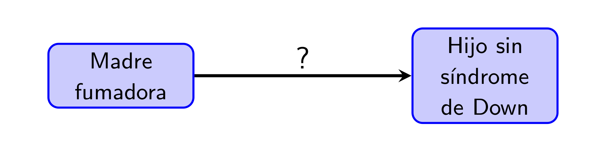

No, ¡qué va! Más adelante, en el artículo ["Maternal smoking and Down syndrome: the confounding effect of maternal age"](https://academic.oup.com/aje/article/149/5/442/135974) (C. L Chen *et al*,  *American Journal of Epidemiology* 149 (1999), pp. 442-446) se observó que no se había tenido en cuenta la edad de las madres. Las madres jóvenes suelen ser fumadoras con mayor frecuencia que las no tan jóvenes, y las madres de más de 40 años tienen una mayor frecuencia de hijos con síndrome de Down. Aquí la edad es el factor confundidor que hace que parezca que las mujeres fumadoras tienen menor probabilidad de tener hijos con síndrome de Down, cuando en realidad son las madres jóvenes las que son más fumadores y tienen menos hijos con síndrome de Down.

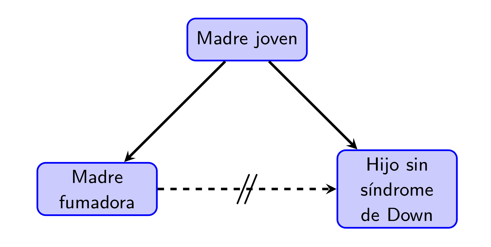

Seguimos con los inconvenientes.  **Los estudios de casos y controles son muy susceptibles a algunos tipos de  sesgos concretos** relacionados con la manera cómo se recogen los datos. Un **sesgo** en un estudio es un error sistemático que afecte a los datos recogidos y pueda perjudicar la corrección de las conclusiones obtenidas. Estudiaremos el tema de los sesgos en general con más detalle en la Sección \@ref(sec:sesgos). Por ahora, vamos a anotar varios sesgos típicos que pueden darse en estudios de casos y controles.

* Si los datos sobre la exposición a riesgos se recogen mediante entrevistas o cuestionarios, los sujetos pueden mentir (recordad la máxima "Todo el mundo miente" del Dr. G. House y los internistas en general), consciente (para ocultar comportamientos de los que se avergüencen, para contentar el entrevistador,...) o inconscientemente (por haber olvidado detalles relevantes). O al menos puede que no recuerden bien los detalles. En ambos casos diremos que se produce un **sesgo de recuerdo**.
    
\BeginKnitrBlock{rmdromans}<div class="rmdromans">Hay [un estudio  famoso](https://academic.oup.com/jnci/article-abstract/21/4/713/869173) en el que se preguntó a un grupo de hombres si estaban circuncidados: un 34% de los que contestaron que sí, en realidad no lo estaban, y un 34.6% de los que contestaron que no, en realidad sí que lo estaban.</div>\EndKnitrBlock{rmdromans}

* En particular, se puede dar un **sesgo de recuerdo diferencial**, ya que los casos y los controles pueden recordar datos relevantes de manera diferente. Si uno tiene un percance, suele recordar con más frecuencia los detalles previos al mismo para buscar "qué hizo mal" que una persona que no lo haya tenido.

* También se puede dar un **sesgo de supervivencia**, si solo se estudian individuos "vivos". Por ejemplo, si queremos llevar a cabo un estudio de casos y controles para una enfermedad rara con una tasa de mortalidad a corto plazo muy alta y tomamos como casos enfermos diagnosticados que estén vivos, puede que bastantes de ellos hayan sobrevivido más tiempo a la enfermedad que lo normal y por lo tanto no sean casos típicos.

     Pero si se quiere incluir casos ya fallecidos, seguramente habrá que entrevistar a familiares para conocer detalles de su exposición a factores de riesgo y aumenta el peligro de  sesgo de recuerdo. Si uno ya ha difuminado en su memoria los riesgos que corría hace 10 años, mucho menos los recordarán sus familiares.
   
Por otro lado, hay que tener mucho cuidado en la **selección de controles**. En teoría, para poder concluir que hay asociación entre la exposición y la enfermedad, sería necesario que:

* Los controles fueran similares a los casos en todos los aspectos salvo en la exposición.
* Los controles fueran representativos de la población de sanos.
    
En la práctica es muy difícil conseguir ambas condiciones, sobre todo si la población de sanos no está bien definida.

Así por ejemplo, en el estudio sobre alcoholismo y cáncer de pulmón del Ejemplo \@ref(exm:CAPUA), el hecho de escoger los controles entre individuos hospitalizados podría haber sesgado este grupo. La ingesta desmesurada de alcohol aumenta el riesgo de patologías que no sean cáncer de pulmón pero que impliquen ingreso hospitalario. Por lo tanto, podría ser que el alcoholismo fuera más frecuente entre personas hospitalizadas que en la población en general. Los autores tuvieron que tener mucho cuidado en este aspecto, eligiendo hospitalizados de algo que *a priori* no tuviera nada que ver con el consumo de alcohol.

O en el ejemplo sobre el fracaso del tratamiento de la tuberculosis del Ejemplo \@ref(exm:tuberculosisCC), hubiera sido un error tomar como controles pacientes tratados con éxito de otras clínicas, que pudieran seguir protocolos de tratamiento diferentes, ya que entonces los controles no serían comparables a los casos.

El siguiente es un ejemplo famoso de la importancia de elegir bien los controles:

\BeginKnitrBlock{example}<div class="example"><span class="example" id="exm:krunkamp"><strong>(\#exm:krunkamp) </strong></span>En el artículo ["Association Between Malaria and Invasive Nontyphoidal Salmonella Infection in a Hospital Study: Accounting for Berkson's Bias"](https://academic.oup.com/cid/article/62/suppl_1/S83/2566657) (R. Krumkamp *et al*, *Clinical Infectious Diseases* 62 (2016), pp. S83–S89), se explica un estudio de casos y controles que en realidad fueron dos. El objetivo era determinar si la malaria es un factor de riesgo para la salmonelosis. Se tomaron como casos todos los niños ingresados en dos hospitales de Ghana con salmonelosis. Entonces:
  
</div>\EndKnitrBlock{example}

* En un primer estudio, se toman como controles todos los niños hospitalizados en los mismos hospitales con otras enfermedades bacterianas. Se obtuvo que la frecuencia de infecciones previas de malaria entre los **casos** fue significativamente mayor que entre los controles.

* En un segundo estudio, se toman como controles un grupo de niños sin ninguna enfermedad  bacteriana. Se obtuvo que la frecuencia de infecciones previas de malaria entre los **controles** fue significativamente mayor que entre los casos.


    
\BeginKnitrBlock{rmdimportant}<div class="rmdimportant">En todo caso, es conveniente siempre preguntarse si la exposición observada en los controles es la esperada en la población sana, o si por el contrario hay algún motivo por el que no tenga por qué serlo.</div>\EndKnitrBlock{rmdimportant}

Hemos dejado para el final un inconveniente muy específico de los estudios de casos y controles  en el que igual ya habéis caído. 

Fijaos en que el objetivo de un estudio de casos y controles es determinar si la exposición a un factor de riesgo aumenta la probabilidad de padecer una enfermedad y estimar en cuánto la aumenta. Por tanto, lo que se querría  comparar son las proporciones de enfermos entre los expuestos y entre los no expuestos, para ver si la primera es mayor que la segunda y cuánto mayor es. Pero las proporciones que se observan son justamente las contrarias de las que nos interesan. En un estudio de casos y controles, medimos  **las proporciones de expuestos y no expuestos entre enfermos y sanos**: 

* En el estudio sobre consumo de alcohol y cáncer de pulmón, en realidad se observó que entre los enfermos de cáncer de pulmón hubo una mayor frecuencia de consumo de 30 gramos diarios o más de alcohol  y  36 paquetes de tabaco anuales o más. Pero lo que queremos saber es si se da más frecuentemente el cáncer de pulmón entre las personas con estos malos hábitos que en el resto de la población.

* En la parte de casos y controles del estudio chino sobre cirujanos ortopédicos y COVID-19, se observó que la proporción de sujetos que no recibieron formación específica reciente sobre control de infecciones fue superior entre los enfermos de COVID-19 que entre los sanos. Pero lo que queremos saber es si la proporción de infectados entre los que no reciben esta formación es superior a la de infectados entre los que sí la reciben.


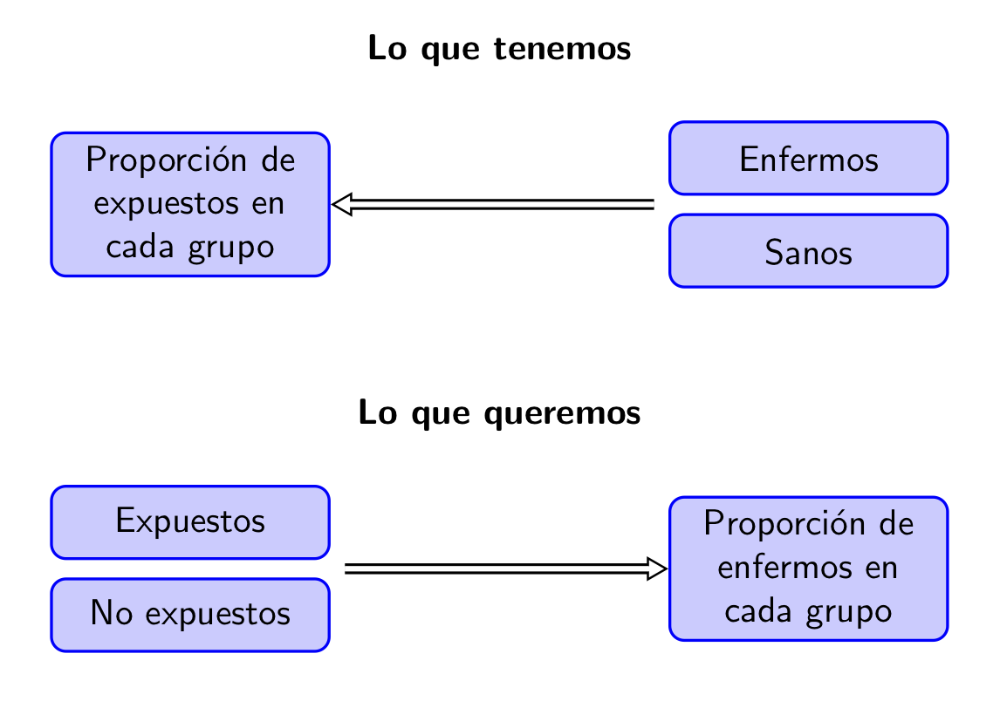

Pues bien, por un lado estamos de suerte: la conclusión global es correcta. **Si la proporción de expuestos entre los casos es mayor que entre los controles, la proporción de casos entre los expuestos es mayor que entre los no expuestos**. 

Hagamos los cálculos. Supongamos que en nuestra muestra hay $N$ casos y $M$ controles. De los $N$ casos, $n_1$ estuvieron expuestos al factor de riesgo y $n_0$ no. Entre los $M$ controles, estos números son $m_1$ y $m_0$, respectivamente. Llamemos $E_1=n_1+m_1$ al total de expuestos en la muestra y $E_0=n_0+m_0$ al de no expuestos. Estos números se resumen en la tabla siguiente:
$$
\begin{array}{r|c|c|c}
& \text{Casos} & \text{Controles} & \text{Total} \\ \hline
\text{Expuestos} & n_1 & m_1 & E_1\\ \hline
\text{No expuestos} & n_0 & m_0 & E_0\\ \hline
\text{Total} & N & M & N+M
\end{array}
$$

Ahora, en términos de estos valores:

* Que haya una mayor proporción de expuestos entre los casos que entre los controles significa que
$$
\begin{array}{rl}
\displaystyle \frac{n_1}{N}>\frac{m_1}{M} & \Longleftrightarrow \displaystyle
\frac{n_1}{n_1+n_0}>\frac{m_1}{m_1+m_0}\\
& \Longleftrightarrow n_1(m_1+m_0)>m_1(n_1+n_0)
\\
& \Longleftrightarrow n_1m_0>m_1n_0
\end{array}
$$

* Que haya una mayor proporción de casos entre los expuestos que entre los no expuestos significa que
$$
\begin{array}{rl}
\displaystyle \frac{n_1}{E_1}>\frac{n_0}{E_0} & \Longleftrightarrow \displaystyle
\frac{n_1}{n_1+m_1}>\frac{n_0}{n_0+m_0}\\
& \Longleftrightarrow n_1(n_0+m_0)>n_0(n_1+m_1)
\\
& \Longleftrightarrow n_1m_0>n_0m_1
\end{array}
$$

Como podemos ver, ambas condiciones son equivalentes.

Pero aquí se acaba nuestra suerte. 

\BeginKnitrBlock{rmdcaution}<div class="rmdcaution">Saber cuántas veces es mayor la fracción de expuestos entre los casos que entre  los controles, no nos permite saber en general cuántas veces es mayor la fracción de enfermos entre los expuestos que entre  los no expuestos.</div>\EndKnitrBlock{rmdcaution}


\BeginKnitrBlock{example}<div class="example"><span class="example" id="exm:fumadorescancer1"><strong>(\#exm:fumadorescancer1) </strong></span>Supongamos que tomamos un grupo de 100 enfermos de cáncer de pulmón (casos) y un grupo de 100 no enfermos de cáncer de pulmón (controles), y que entre los casos hay el triple de fumadores que entre los controles.

</div>\EndKnitrBlock{example}

Supongamos en primer lugar que entre los casos hay 30 fumadores y entre los controles 10. La tabla de frecuencias es
$$
\begin{array}{r|c|c|c}
& \text{Casos} & \text{Controles} & \text{Total} \\ \hline
\text{Fumadores} & 30 & 10 & 40\\ \hline
\text{No fumadores} & 70 & 90 & 160\\ \hline
\text{Total} & 100 & 100 & 200
\end{array}
$$
Entonces, la proporción de enfermos entre los fumadores es de 3/4, es decir, el 75%,  y entre los no fumadores es de 7/16, es decir, el 43.80%: la primera es 1.71 veces la segunda.

Supongamos ahora que entre los casos hay 90 fumadores y entre los controles 30. La tabla de frecuencias ahora es
$$
\begin{array}{r|c|c|c}
& \text{Casos} & \text{Controles} & \text{Total} \\ \hline
\text{Fumadores} & 90 & 30 & 120\\ \hline
\text{No fumadores} & 10 & 70 & 80\\ \hline
\text{Total} & 100 & 100 & 200
\end{array}
$$
La proporción de enfermos entre los fumadores sigue siendo del 75%, pero ahora entre los no fumadores es de 1/8, es decir, el 12.5%: la primera es 6 veces la segunda.

En ambos casos había el triple de fumadores entre los casos que entre los controles, pero al invertir las proporciones, han dado cocientes diferentes de las proporciones de enfermos entre fumadores y no fumadores. 

Por suerte, como veremos más adelante, un truco matemático nos permitirá capear este problema. 


\BeginKnitrBlock{rmdcaution}<div class="rmdcaution">Por otro lado, si tomamos unos números prefijados de casos y de controles que no representen las proporciones de enfermos y sanos en la población,
    
* ni las proporciones de casos entre los expuestos y  no expuestos en nuestra muestra
* ni la proporción de expuestos en nuestra muestra
    
no tienen por qué ser representativas de estas proporciones en el total de la población.
</div>\EndKnitrBlock{rmdcaution}

\BeginKnitrBlock{example}<div class="example"><span class="example" id="exm:fumadorescancer2"><strong>(\#exm:fumadorescancer2) </strong></span>Supongamos de nuevo que tomamos un grupo de 100 enfermos de cáncer de pulmón (casos) y un grupo de 100 no enfermos de cáncer de pulmón (controles). Esta muestra no es representativa de la población, contiene muchos más enfermos de cáncer de pulmón de lo que cabría esperar en una muestra representativa de 200 personas (no es cierto que la mitad de la población tenga cáncer de pulmón, ¿verdad?). 

</div>\EndKnitrBlock{example}

Por lo tanto, es de esperar que las proporciones de casos entre los expuestos y los no expuestos no sean representativas de la población, ya que en la muestra hay más casos de los que "tocaría". 

Y también es de esperar que la proporción de fumadores en la muestra tampoco sea representativa de la población, porque hay más casos de lo que tocaría, y la proporción de fumadores entre los casos es mayor, por lo que la cantidad de fumadores es seguramente mayor de lo que cabría esperar en una muestra transversal de 200 personas. 


## Estudios de cohorte


En un **estudio de cohorte**:

* Se toma un grupo de individuos expuestos a un factor de riesgo y un grupo de individuos no expuestos a dicho factor de riesgo, o más en general, varios grupos de individuos expuestos a diferentes factores de riesgo. 

* Se les realiza un seguimiento durante un período de tiempo para comparar **prospectivamente** (en el futuro) la aparición de una enfermedad en ambos grupos. 

* Se determina si es más frecuente la aparición  de la enfermedad entre los expuestos que entre los no expuestos. 

* En caso afirmativo, se infiere que, en la población general, la exposición a dichos factores está asociada a una mayor probabilidad de sufrir la enfermedad. 

* Como el objetivo es estudiar la aparición de la enfermedad tras la exposición, los individuos participantes han de estar **sanos** (es decir, sin la enfermedad de interés) en el momento de iniciar su seguimiento. 

\BeginKnitrBlock{rmdnote}<div class="rmdnote">El término "cohorte" del nombre refiere al grupo completo de individuos al que se realiza el seguimiento, aunque también a veces se llaman "cohortes" a los subgrupos de la cohorte global definidos por las diferentes exposiciones a factores de riesgo. Por este motivo, a veces se habla de **estudio de cohortes**, en plural. A nosotros se nos escapará más de una vez, no nos lo tengáis en cuenta.</div>\EndKnitrBlock{rmdnote}


<div class="figure" style="text-align: center">

<p class="caption">(\#fig:cohorteAsterix)No, esto no es una cohorte en el sentido de esta sección.</p>
</div>


\BeginKnitrBlock{rmdcaution}<div class="rmdcaution">De nuevo, los términos "factores de riesgo" y "enfermedad" se han de tomar en un sentido metafórico. Por ejemplo, podríamos comparar grupos de pacientes con una cierta enfermedad bajo diferentes tratamientos para comparar las tasas de curación. En este caso, los "factores de riesgo" son los tratamientos, y la "enfermedad" la curación. </div>\EndKnitrBlock{rmdcaution}


\BeginKnitrBlock{example}<div class="example"><span class="example" id="exm:EPCOCoh"><strong>(\#exm:EPCOCoh) </strong></span>Se han llevado a cabo muchos estudios de cohorte para analizar la asociación entre el hábito de fumar y el desarrollo de enfermedades pulmonares como la EPOC (Enfermedad Pulmonar Obstructiva Crónica). Por ejemplo, el realizado en el marco del *estudio de Rotterdam* (["Prevalence and incidence of COPD in smokers and non-smokers: the Rotterdam Study"](https://link.springer.com/article/10.1007/s10654-016-0132-z); N. Terzikhan *et al*,  *European Journal of Epidemiology* 31 (2016), pp. 785–792). En este estudio se realizó un seguimiento entre 1989 y 2009 a un grupo (variable, puesto que en algunos momentos se amplió la cohorte, pero vamos a expicar solo la idea general) de unos 14000 sujetos. De ellos, en el momento de incorporarse al estudio un 21.7% eran fumadores, un 43% habían sido fumadores  pero ya no lo eran, y un 35.3% nunca habían fumado. En el primer grupo, un 26% desarrolló EPOC durante el seguimiento; entre el segundo grupo,  un 13.6%, y en el tercero, un 6.4%. Las diferencias fueron significativas.

</div>\EndKnitrBlock{example}


<div class="figure" style="text-align: center">
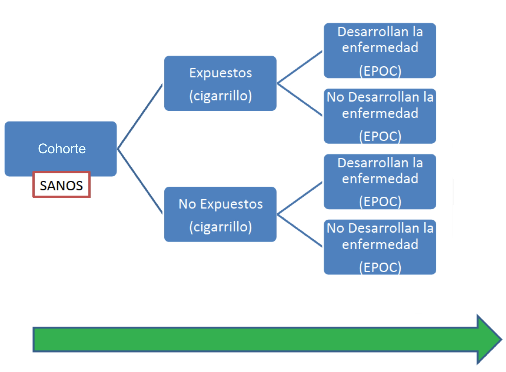
<p class="caption">(\#fig:epoc)Esquema de un estudio de cohorte.</p>
</div>


Los estudios de cohorte son también **observacionales**, **analíticos** y **longitudinales**, por exactamente los mismos motivos que los de casos y controles. La información que se analiza va desde el momento en que los sujetos son clasificados según su exposición a factores de riesgo hacia adelante, para ver si desarrollan la enfermedad, y por tanto siempre es prospectiva. Sin embargo, se suele distinguir entre estudios de cohorte **prospectivos** y **retrospectivos** según el momento (presente o pasado) en que se realiza la clasificación en expuestos y no expuestos:


* Estudio de cohorte **prospectivo**: se toman los expuestos y no expuestos a día de hoy, y se estudia su evolución futura (por tanto, esperando a que pase un cierto período de tiempo).


El estudio de Rotterdam fue prospectivo. Veamos otro ejemplo de estudio de cohorte prospectivo.

\BeginKnitrBlock{example}<div class="example"><span class="example" id="exm:IBScohorte"><strong>(\#exm:IBScohorte) </strong></span>En el estudio ["Increased risk of irritable bowel syndrome after bacterial gastroenteritis: cohort study"](https://www.ncbi.nlm.nih.gov/pmc/articles/PMC27756/) (L. A. García Rodríguez y A Ruigómez, *British Medical Journal* 318 (1999), 565-566) los autores realizaron un seguimiento a un grupo de pacientes que sufrieron un episodio de gastroenteritis bacteriana y lo compararon con un grupo de individuos sin gastroenteritis bacteriana. De ambos grupos se excluyeron los pacientes que ya tenían un historial de síndrome de colon irritable (SCI); recordad que en el inicio del estudio los sujetos han de estar libres de la enfermedad que se quiere ver aparecer. Además también se excluyeron los que tenían algún factor de riesgo conocido del SCI  (cáncer de colon, alcoholismo...), para poder "garantizar" que su riesgo de aparición del SCI fuera similar, salvo por la gastroenteritis. 

Se realizó un seguimiento a ambos grupos durante un año, al cabo del cual un 0.3% de la cohorte sana y un  4.4% de la cohorte con gastroenteritis  habían sido diagnosticados de SCI. 

</div>\EndKnitrBlock{example}


* Estudio de cohorte  **retrospectivo** o **histórico**: se toman los expuestos y no expuestos en un cierto momento del pasado, y se estudia su evolución hasta el día de hoy (sin tener que esperar nada de tiempo).


<div class="figure" style="text-align: center">
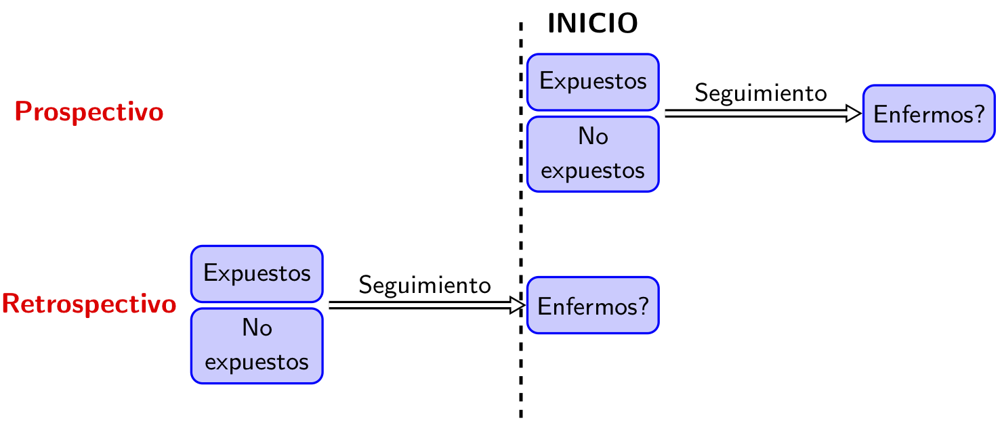
<p class="caption">(\#fig:INICIO)Estudios de cohorte prospectivos y retrospectivos.</p>
</div>


Veamos un ejemplo de estudio de cohorte retrospectivo.

\BeginKnitrBlock{example}<div class="example"><span class="example" id="exm:psoriasis"><strong>(\#exm:psoriasis) </strong></span>En el estudio ["Mortalidad en pacientes con psoriasis. Análisis de una cohorte retrospectiva"](https://www.sciencedirect.com/science/article/pii/S0025775316306832) (W. Masson *et al*, *Medicina Clínica* 148 (2017), pp. 483-488), llevado a cabo en 2016, se tomó una cohorte formada, por un lado, por todos los pacientes del Sistema de Salud de Buenos Aires que  a día 1/1/2010 tenían diagnóstico activo de psoriasis, en total 1500, y  por otro, por un grupo *de control* formado por 1500 pacientes elegidos al azar entre el resto de sujetos del mismo Sistema de Salud. Se anotaron los sujetos de ambos grupos que fallecieron antes del 30/6/2015. La tasa de mortalidad en el grupo de enfermos de psoriasis fue significativamente más alta que en el grupo de control.

</div>\EndKnitrBlock{example}


Observad las diferencia entre un estudio de casos y controles y un estudio de cohorte. Aunque ambos sean observacionales, analíticos y longitudinales:
  
* En un estudio de casos y controles, se clasifica el grupo de sujetos en sanos y enfermos y se estudia su exposición **anterior a esta clasificación** a los factores de riesgo objeto de estudio.

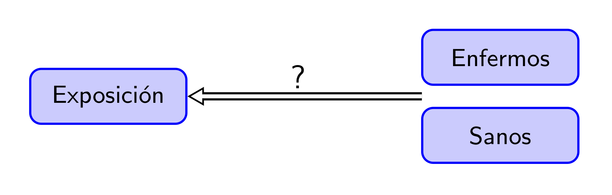

* En un estudio de cohorte, se clasifica el grupo de sujetos **sanos** en expuestos y no expuestos y se estudia el desarrollo **posterior a esta clasificación** de la enfermedad objeto de estudio. Si el estudio es de cohorte retrospectivo, la clasificación se realiza en el pasado, pero igualmente se determina si la enfermedad aparece en algún momento posterior a dicha clasificación.

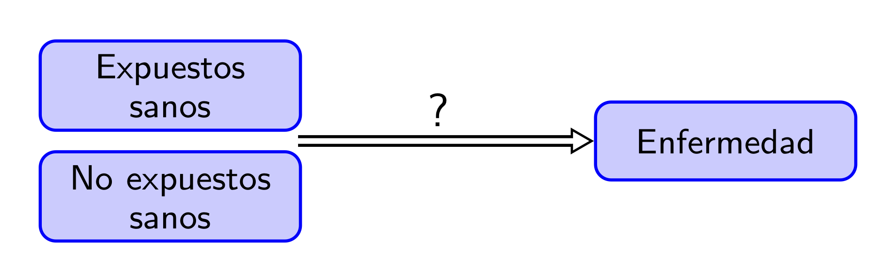


\BeginKnitrBlock{rmdexercici}<div class="rmdexercici">En una [nota de prensa de la Universidad de Michigan](http://ns.umich.edu/new/releases/5882) podemos leer:

> El peso al nacer tiene efectos importantes y duraderos, según revela un estudio difundido por la Universidad de Michigan. Pesar menos de 2.5 kg al nacer aumenta en un tercio las posibilidades de abandonar la escuela secundaria, reduce las ganancias anuales en alrededor de un 15% [...].

Considerad la pregunta de investigación siguiente: El peso al nacer, ¿influye en el éxito académico?

* Diseñad un estudio de casos y controles cuyo objetivo sea responder a esta pregunta.

* Diseñad un estudio de cohorte prospectivo cuyo objetivo sea responder a esta pregunta.

* Diseñad un estudio de cohorte retrospectivo cuyo objetivo sea responder a esta pregunta.

* ¿Cuál de los tres escogeríais llevar a cabo? ¿Por qué?

* Leed la nota de prensa y decidid qué calificativo describe mejor el estudio realizado por los científicos de la Universidad de Michigan:  casos y controles, cohorte prospectivo o  cohorte retrospectivo.
</div>\EndKnitrBlock{rmdexercici}

Algunas **ventajas** de los estudios de cohorte:

* Los estudios de cohorte son adecuados para estudiar factores de riesgo raros, por el mismo motivo que los  de casos y controles lo son para estudiar  enfermedades raras, 

* Permiten estimar las probabilidades en el sentido que nos interesa: siempre tiene sentido calcular las proporciones de expuestos y no expuestos que desarrollan una enfermedad, mientras que en un estudio de casos y controles en principio solo tiene sentido calcular las proporciones de enfermos y sanos que previamente estuvieron expuestos al factor de riesgo. 

* Los estudios de cohorte retrospectivos suelen ser, como los de casos y controles, relativamente fáciles de llevar a cabo, rápidos y baratos.

* Al hacer un seguimiento desde el momento de la exposición en adelante, son útiles no solo para estimar la proporción de expuestos y no expuestos que desarrollan la enfermedad, sino también la **incidencia** de la enfermedad en ambos grupos.

La **incidencia** de una enfermedad en una población mide el número de casos **nuevos** de dicha enfermedad en un período de tiempo. "Nuevos" quiere decir que no se cuentan en la incidencia los sujetos que ya estaban enfermos en el momento de iniciar el período de tiempo, pero  las recaídas de un mismo individuo sí que cuentan como casos nuevos en la incidencia.

Hay un poco de jaleo con la terminología precisa relacionada con la incidencia, de manera que si consultáis fuentes diferentes encontraréis definiciones ligeramente diferentes. Para fijar el lenguaje, en este curso vamos a distinguir entre **incidencia acumulada** y **densidad de incidencia**.
  
La **incidencia acumulada**, o simplemente **incidencia** a secas, es el **número, o la proporción, de casos nuevos** de la enfermedad durante un período de tiempo concreto. 

Por ejemplo, las siguientes frases refieren a la incidencia acumulada:

* "En los últimos siete días las Islas Baleares han contabilizado 1970 contagios de COVID-19."

* "En los últimos 14 días se han detectado en las Islas Baleares 249 casos por cada cien mil habitantes."

\BeginKnitrBlock{rmderror}<div class="rmderror">Para ser precisos, al calcular la incidencia acumulada como proporción, el denominador no tendría que ser el total de la población, sino el número de individuos sanos en la población al principio del período de tiempo considerado. Es decir, tendríamos que hablar de "En los últimos 14 días se han detectado en las Islas Baleares 249 casos por cada cien mil habitantes **sin COVID-19 hace 14 días**".</div>\EndKnitrBlock{rmderror}


Naturalmente, si el número de enfermos en la población es relativamente pequeño y solo conocemos una aproximación del número de habitantes en ese momento y además vamos a dar el resultado redondeado a números enteros de casos por cada cien mil o cada millón, no hay mucha diferencia entre dividir por el total de habitantes y dividir por el número de habitantes sanos. Pero la manera correcta de calcularla es la primera.


Por ejemplo, a la hora de calcular en septiembre de 2020 que "en los últimos 14 días se han detectado en las Islas Baleares 249 casos por cada cien mil habitantes":

* Se conoce la población de las Baleares solo aproximadamente. En realidad, se maneja una estimación de su población a 1 de enero de 2020. Esta estimación es de alrededor de 1,149,460 habitantes según el [último padrón de la CAIB](https://www.caib.es/ibestat/estadistiques/poblacio/padro/2acef6cf-175a-4826-b71e-8302b13c1262).

* El número de casos activos diagnosticados de COVID-19 (su **prevalencia**, concepto que trataremos en detalle en la siguiente sección) era de algo menos de 2500 enfermos.

Está claro que no va a haber mucha diferencia entre dividir el número de casos nuevos por 11.4946 (para obtener el número aproximado de casos nuevos por cien mil habitantes) o por 11.4696  (para obtener el número aproximado de casos nuevos por cien mil habitantes sanos). Sobre todo si no estamos seguros de la exactitud del denominador en ninguno de los dos casos.


Por otro lado, la **densidad de incidencia** es el **número medio de casos nuevos** de la enfermedad por unidad de tiempo (durante un cierto período de tiempo). 

Por ejemplo:

* "La densidad de incidencia de la COVID-19 en las Baleares durante la última semana ha sido de 461 contagios diarios."


Volviendo a los estudios de cohorte, algunos de sus **inconvenientes** son:

* Se puede dar el mismo problema con los **confundidores** que en los estudios de casos y controles.

     Por ejemplo, en el estudio de la mortalidad y la psoriasis del Ejemplo \@ref(exm:psoriasis), se especula con que la causa del aumento de mortalidad sea que "las modificaciones inmunológicas e inflamatorias observadas en la psoriasis podrían favorecer el desarrollo de la aterosclerosis", pero no está claro si la causa de las modificaciones  inmunológicas e inflamatorias es la psoriasis misma, o si la psoriasis y estas modificaciones se deben a una tercera causa. 

* Son poco adecuados para estudiar enfermedades raras, ya que entonces habrá que tomar una cohorte muy grande o realizar el seguimiento durante un período muy largo de tiempo para poder observar una cantidad razonable de enfermos. Por el mismo motivo, los estudios de cohorte prospectivos  son poco adecuados para estudiar enfermedades de desarrollo lento.

* Hay que tener en cuenta los **abandonos**: sujetos de la cohorte inicial a los que se les pierde la pista durante el seguimiento (en los estudios prospectivos) o sobre los que no se tiene información en el momento final del período de tiempo estudiado (en los estudios retrospectivos). Hay técnicas estadísticas específicas para tratarlos.

Además, los estudios de cohorte prospectivos tienen los siguientes inconvenientes específicos:

* Puede ser difícil, o al menos costoso, realizar el seguimiento durante un período largo de tiempo de un grupo grande de sujetos

* Se puede dar entre los sujetos seguidos un **sesgo de conocimiento**, que sucede cuando los individuos modifican su comportamiento habitual al saber que son observados (si los sujetos de la cohorte saben que se les realiza un seguimiento). 

Los estudios de cohorte retrospectivos resuelven estos inconvenientes, pero presentan uno de propio:

* Se usan datos históricos sobre la exposición, que casi siempre fueron anotados por personas diferentes a las que realizan el estudio y con otros fines (historias clínicas, otros estudios médicos). Esto hace que los datos no sean fiables o que no sean los más adecuados.


## Estudios transversales

En un **estudio transversal** se toma un grupo de individuos en principio representativo de una población (una **muestra transversal** de la población) y se miden en un momento concreto varias características de todos ellos: por ejemplo, una enfermedad y los factores de riesgo relacionados con la misma y presentes en ese momento. El objetivo es inferir qué asociación hay entre estas condiciones  en la población general.


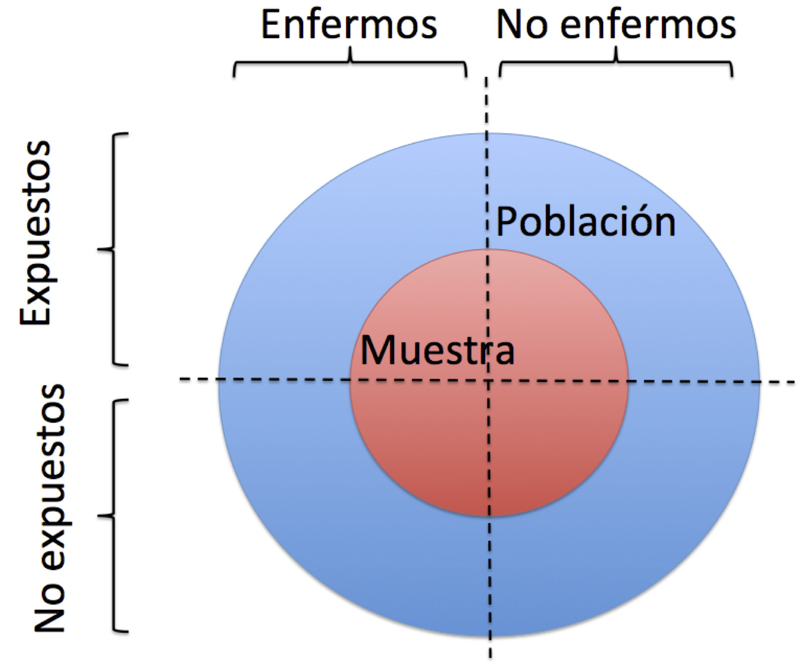

\BeginKnitrBlock{rmdimportant}<div class="rmdimportant">Para que un estudio sea **transversal** en el sentido de esta sección, es necesario que:

* Sea **transversal** en el tiempo: la información refiera a un solo momento.
* La muestra sea **transversal**: sin composición prefijada.
</div>\EndKnitrBlock{rmdimportant}


Una de las utilidades de los estudios transversales es poder estimar la **prevalencia** de una enfermedad (u otra característica): **la proporción**, o **el número**, **de individuos con la enfermedad** en una población en un momento determinado. 

 
\BeginKnitrBlock{rmdcaution}<div class="rmdcaution">No confundáis la  prevalencia  con la incidencia:

* La **prevalencia** representa el número **total** de enfermos en una población en un momento determinado
* La **incidencia** representa el número de enfermos **nuevos** en una población en un período de tiempo determinado

Por ejemplo, en ["Estimates of global, regional, and national incidence, prevalence, and mortality of HIV, 1980-2015: the Global Burden of Disease Study 2015"](https://www.sciencedirect.com/science/article/pii/S235230181630087X) (H. Wang *et al*, *The Lancet. HIV* 3 (2016), e361-87) se afirma que: 

> Desde 2005, la incidencia global del VIH se ha mantenido relativamente constante alrededor de 2.6 millones por año. La prevalencia global del VIH en 2015 era de 38.8 millones.

Estos 38.8 millones son el total de personas que estuvieron infectadas con VIH en algún momento de 2015, contando los que ya venían infectados de 2014 y los que se infectaron en 2015.
</div>\EndKnitrBlock{rmdcaution}


\BeginKnitrBlock{example}<div class="example"><span class="example" id="exm:corsaib"><strong>(\#exm:corsaib) </strong></span>En el estudio ["Prevalencia de factores de riesgo cardiovascular en las Islas Baleares (estudio CORSAIB)"](https://www.revespcardiol.org/es-prevalencia-factores-riesgo-cardiovascular-islas-articulo-13082539) (F. Rigo Carratalà *et al*, *Revista Española de Cardiología* 58 (2005), pp. 1411-1419) se tomó una muestra aleatoria de habitantes de las Islas Baleares de la manera siguiente. Se dividió la comunidad en 14 sectores y participaron 3 o 4 médicos de familia por sector (50 en total). A continuación, se seleccionó aleatoriamente a 40 personas entre las adscritas a cada médico participante. A partir de las frecuencias de diversos factores de riesgo cardiovascular en las personas de la muestra, se estimó su prevalencia en el total de nuestra comunidad. Por ejemplo:
  
  </div>\EndKnitrBlock{example}

> "Las prevalencias estimadas fueron: tabaquismo del 27% (el 36.9% en varones y el 18.7% en mujeres); hipertensión del 47.8% (el 52.3% en varones y el 43.4% en mujeres); hipercolesterolemia del 24.2% (el 24.4% en varones y el 24.1% en mujeres); diabetes del 11.7% (el 15.3% en varones y el 8.4% en mujeres); obesidad del 27% (el 24.8% en varones y el 29% en mujeres), sobrepeso del 40.1% (el 48.3% en varones y el 33.4% en mujeres) [...]"

Este ejemplo es un estudio transversal de prevalencia: 

* Se tomó una muestra **transversal** de la población (la que salió, sin especificar su composición según alguna clasificación de los individuos por factores de riesgo o enfermedades).

* Se midieron algunas características de los sujetos en un solo momento.

* El objetivo era estimar la prevalencia de estas características entre la población de  nuestra comunidad. 

En otros estudios transversales se estima la asociación entre factores de riesgo y enfermedades.

\BeginKnitrBlock{example}<div class="example"><span class="example" id="exm:quesada"><strong>(\#exm:quesada) </strong></span>En el estudio ["Relación entre el mes de nacimiento y la prevalencia de enfermedades crónicas"](https://www.sciencedirect.com/science/article/pii/S0025775316305693) (J. A. Quesada y A. Nolasco, *Medicina Clínica* 148 (2017), pp. 489-494), se escogió al azar una muestra de 29,478 españoles adultos y se anotó de cada uno de ellos su sexo y mes de nacimiento y si a 1 de enero de 2017 sufrían, o habían sufrido, alguna enfermedad crónica de una lista de veintisiete. Para ambos sexos se encontraron  asociaciones significativas entre el mes de nacimiento y algunas enfermedades crónicas. Por ejemplo, los hombres nacidos en noviembre parecen tener un mayor riesgo de sufrir cataratas.
</div>\EndKnitrBlock{example}

\BeginKnitrBlock{rmdromans}<div class="rmdromans">Vamos a ver, en este estudio se tomó una muestra de sujetos y se anotó, por un lado, si tenían o no una serie de enfermedades en un momento determinado y por otro su "exposición previa a un factor de riesgo" (su mes de nacimiento). ¿No sería un estudio de casos y controles? 
  
¿Y de cohorte retrospectivo? Porque también podríamos entender que se tomó una muestra de sujetos, se clasificaron según su exposición previa a un factor de riesgo (el mes de nacimiento) y se anotó si desarrollaron posteriormente alguna enfermedad de una lista, ¿no? </div>\EndKnitrBlock{rmdromans}
  
 
  
Pues sí,  podríamos considerarlo como de casos y controles, aunque el hecho de anotar no solo si los sujetos tenían las enfermedades a día 1/1/2017, sino también si las habían tenido en el pasado, no encaja del todo con un diseño de casos y controles. Pero como la "exposición", es decir, en este caso, el nacimiento, es anterior a cualquier enfermedad que pudieran desarrollar los sujetos, es aceptable.

Y seguramente también podríamos considerarlo de cohorte retrospectivo, aunque, de nuevo, para clasificarlo como tal es necesario que los sujetos no tuvieran las enfermedades en el momento de nacer. Recordad que en los estudios de cohorte, en el momento en el que se clasifican los sujetos según su exposición a factores de riesgo han de estar **sanos**.

De hecho, los autores dicen que es un estudio transversal, y para nuestro gusto esta sería la clasificación más adecuada, ya que se toma una  muestra representativa de la población española y se anotan varias características de los sujetos de la muestra. Pero en cambio el análisis estadístico que realizan sus autores es el típico de un estudio de casos y controles (ya trataremos esta cuestión en la Sección \@ref(sec:probaplic2) del tema de Probabilidades). Eso ya es entonces un error.

\BeginKnitrBlock{rmdimportant}<div class="rmdimportant">¿Cuál es entonces la respuesta correcta? La verdad es que cualquiera de las tres. Lo importante no es tanto poner una etiqueta a un estudio como razonar correctamente qué tipo de estudio "puede ser" para poder llevar a cabo luego el análisis estadístico  de los datos recogidos de manera consistente con el tipo elegido.</div>\EndKnitrBlock{rmdimportant}


\BeginKnitrBlock{example}<div class="example"><span class="example" id="exm:HS"><strong>(\#exm:HS) </strong></span>Consideremos el estudio ["Prevalencia de hipertensión arterial y otros factores de riesgo cardiovascular en la población con hipotiroidismo subclínico"](https://www.sciencedirect.com/science/article/pii/S0025775316305759) (L. G. Gil y A. de la Sierra, *Medicina Clínica* 148 (2017), pp. 351-353). En él, se tomó un grupo de  240 pacientes con hipotiroidismo subclínico (HS) visitados en un CAP de Terrassa, y un grupo de 480 pacientes  del mismo CAP sin HS (dos por cada uno con HS). Se evaluó en todos estos sujetos la presencia de hipertensión arterial, diabetes etc. El objetivo era comparar la prevalencia de estas patologías entre los pacientes con y sin HS.
</div>\EndKnitrBlock{example}

Aunque toda la información se recogió simultáneamente y el objetivo es estudiar prevalencias, desde el punto de vista del diseño no se trata de un estudio transversal. Fijaos en que no se tomó una muestra "transversal" de sujetos al azar, se analizó si tenían HS o no y se evaluó la presencia de las diferentes condiciones de interés. La muestra que tomaron tenía una composición concreta, dos sujetos sanos por cada enfermo, que no corresponde a la composición de la población (no es cierto que un tercio de la población tenga HS: su prevalencia está entre el 4% y el 8%, pudiendo llegar al 16% entre la población mayor de 60 años). Como lo que interesa es comparar la frecuencia de diversas condiciones entre enfermos de HS y sujetos sin HS, el estudio podría considerarse de cohorte, tomando como expuestos los enfermos de HS. O de casos (los enfermos de HS) y controles (los no enfermos de HS), también sería correcto. Lo importante es analizar los datos consecuentemente

En este caso los autores del estudio lo clasifican como de casos y controles y analizaron los datos de manera correcta según esta clasificación. Como veremos en el tema de Probabilidades, haberlo considerado de cohorte hubiera dado lugar a conclusiones más fáciles de entender, así que nosotros seguramente hubiéramos optado por clasificarlo como de cohorte.

\BeginKnitrBlock{rmdromans}<div class="rmdromans">¿De cohorte? ¿Y qué pasa con la condición de que los individuos han de estar "sanos" en el momento de clasificarlos en expuestos y no expuestos?

Sí, tenéis razón, estamos forzando un poco la definición de estudio de cohorte. Pero la condición de que los individuos de la cohorte han de estar sanos al empezar a correr el tiempo de seguimiento es para poder estudiar *la aparición posterior de la enfermedad*, con el objetivo final de encontrar evidencias de que la exposición causa la enfermedad. En este estudio no les interesaba la aparición posterior de nada, sino lo que pasaba en ese momento. Por ejemplo, qué proporciones de sujetos con y sin HS son hipertensos.</div>\EndKnitrBlock{rmdromans}

¿Cómo hubiera sido un estudio transversal? Pues si los investigadores hubieran tomado una muestra al azar de 720 pacientes del CAP y por pura casualidad hubieran salido 240 pacientes con HS y 480 sin HS. Entonces se podría estimar que un tercio de la población de Terrassa asignada a ese CAP sufre de HS y tocaría investigar las causas de esta anomalía. 

\BeginKnitrBlock{rmdcaution}<div class="rmdcaution">Es importante observar la diferencia entre un estudio transversal y un estudio descriptivo de tipo serie de casos o *survey*. En ambos casos se toma un grupo de sujetos y se miden una serie de características de los mismos en un momento concreto. Pero:

* **Los estudios transversales son analíticos**: El objetivo de la descripción de los individuos de la muestra es estimar asociaciones sobre características en el total de la población de la que se ha obtenido la muestra.

* **Las series de casos y los** *surveys* **son descriptivos**: El objetivo de la descripción de los individuos es exclusivamente ese, describir las características de este grupo de individuos, sin pretender generalizar las observaciones a una población mayor.
</div>\EndKnitrBlock{rmdcaution}


En el ejemplo anterior sobre HS, un estudio descriptivo hubiera consistido en describir (y solo describir) las características de todos los pacientes con HS asignados a ese CAP. Es los que se hizo en el próximo ejemplo, sobre el mismo tema.


\BeginKnitrBlock{example}<div class="example"><span class="example" id="exm:HSsurvey"><strong>(\#exm:HSsurvey) </strong></span>En el estudio ["Hipotiroidismo subclínico en la consulta de atención primaria"](https://www.sciencedirect.com/science/article/pii/S0212656706703237) (M. Torné-Coll *et al*, *Atención Primaria* 37 (2006), pp. 175-176) se tomaron todos los pacientes de 11 consultas de un CAP de un pueblo de Barcelona a los que les habían realizado analísis de sangre relacionados con la función tiroidea en algún momento de 2001  y se describieron diversas características de los mismos, con especial atención a cuántos fueron diagnosticados de hipotiroidismo subclínico  y sus características. Los autores explican que no se pueden extrapolar los resultados a la población general, porque la muestra estaba formada por individuos a los que se había prescrito un tipo de análisis de sangre concreto, señal de que presentaban síntomas que lo hicieran recomendable. 
</div>\EndKnitrBlock{example}

Se trata de un estudio descriptivo, no un estudio analítico transversal. Por el tamaño de la muestra, 141 individuos, sería un  *survey*, pero como la información se obtuvo a partir de las historias clínicas, también se podría considerar una serie de casos. En cualquier caso, descriptivo. Para curarse en salud, los autores dicen que es un "estudio transversal descriptivo."


La ventaja principal de los estudios transversales es que, como los de casos y controles y los de cohorte retrospectivos, son relativamente fáciles de llevar a cabo. Además, son el tipo de estudio adecuado para estimar prevalencias. 

Los inconvenientes que comparten con los otros estudios observacionales son que puede haber confundidores y que se pueden dar diferentes sesgos en la recogida de datos. Además, al basarse en una muestra "transversal" tomada en un momento concreto, es complicado usar un estudio transversal para estudiar  enfermedades poco frecuentes o de desarrollo rápido o exposiciones a riesgos poco frecuentes, ya que serían necesarias muestras muy grandes para poder esperar un número significativo de enfermos o de expuestos.  Tampoco permiten estimar incidencias, ya que para ello se necesita contar enfermos en diferentes momentos. Además, son muy susceptibles al sesgo de supervivencia que comentábamos en los estudios de casos y controles, ya que solo muestreamos individuos vivos. 

Pero de entre todos sus inconvenientes, el más destacable es que, al usar  información sobre un momento concreto,  a partir de un estudio transversal en principio **es imposible obtener ninguna información sobre relaciones temporales** tipo antecedente/desenlace. 

Si en una muestra de individuos anotamos, por ejemplo, si en ese momento tienen caries o no y si usan inhaladores para el asma o no, no obtenemos ninguna información sobre si alguna de esas dos condiciones es anterior a la otra y por lo tanto no podemos  deducir nada sobre si una podría ser susceptible de "causar" la otra.

O por ejemplo, en el estudio del Ejemplo \@ref(exm:HS), se observó que los enfermos de HS tenían un nivel de colesterol significativamente más alto que los controles. Pero no hay manera de saber a partir de los datos obtenidos en ese estudio si el HS aumenta el riesgo de hipercolesterolemia, o si es el colesterol alto el que aumenta el riesgo de HS, o ninguna de las dos cosas y las dos son consecuencia de un tercer factor.


\BeginKnitrBlock{rmdromans}<div class="rmdromans">Volviendo a la prevalencia, para liar más las cosas los epidemiólogos distinguen entre:

* **Prevalencia puntual**: lo que nosotros hemos definido como prevalencia, es decir, el número (o la proporción) de personas que tienen la enfermedad en un momento concreto.

* **Prevalencia de período**: el número (o la proporción) de **personas** que en algún momento de un período de tiempo concreto  han tenido la enfermedad, incluidos los que ya estaban enfermos al inicio del período de tiempo considerado. Si una persona  ha tenido varias veces la enfermedad durante el período de tiempo considerado, solo cuenta una vez en este valor. 

* **Prevalencia de vida**: el número (o la proporción) de **personas** que en algún momento de su vida han tenido la enfermedad. De nuevo, si una persona  ha sufrido varias veces la enfermedad a lo largo de su vida, solo cuenta una vez en este valor.
</div>\EndKnitrBlock{rmdromans}

\BeginKnitrBlock{rmdexercici}<div class="rmdexercici">En el examen MIR de 2020 se preguntó lo siguiente: En una población se produjeron 2000 accidentes mortales de tráfico desde el 1 de enero al 31 de diciembre de 2019. ¿Qué medida de frecuencia de accidentes se ha utilizado?: 

1. Prevalencia puntual.
1. Prevalencia de período.
1. Letalidad.
1. Incidencia.

Está claro que la respuesta ha de ser (2) o (4); no es prevalencia puntual, porque no es el número de casos en un momento concreto sino durante un período de tiempo, y no es letalidad porque no se trata de la proporción de accidentes de tráfico que dan lugar a la muerte de algún involucrado (esa sería la **tasa de letalidad** de los accidentes de tráfico).

¿Qué responderíais, (2) o (4)? ¿Por qué esa y no la otra?
</div>\EndKnitrBlock{rmdexercici}
  
<!--
Respuesta correcta: 2

Comentario:  La duda está entre la prevalencia de período y la incidencia. Como tengo que elegir, voto por prevalencia de período, ya que yo reservo "incidencia anual" para significar "número medio anual de casos nuevos, calculado a partir de los datos de varios años".

Pero la verdad es que tengo mis dudas. Veamos. Si medimos prevalencias e incidencias en números absolutos y no proporciones:

	•	La prevalencia de período de una condición es el número de sujetos que han tenido dicha condición en algún momento de un cierto período de tiempo (incluyendo los que ya la tenían antes, los que la adquirieron durante este período, y posibles repeticiones de un mismo sujeto que la adquiera y la pierda varias veces).

	•	La incidencia de una condición en un período de tiempo es el número de casos nuevos de dicha condición en ese período de tiempo.

El problema aquí es que los accidentes mortales son todos nuevos y no se repiten y no vienen de antes. Por lo tanto el número de accidentes mortales en un año (prevalencia de período) es el número de accidentes mortales NUEVOS en un año. Por tanto, la prevalencia de accidentes en un año y la incidencia de accidentes ese año coinciden. 
Y no solo yo tengo esa duda. Por ejemplo, en doi:10.29252/beat-070109, doi:10.1016/j.injury.2018.01.030 o doi:10.1371/journal. pone.0202240 a los números de accidentes de tráfico en un año lo llaman prevalencia de período, mientras que por ejemplo en doi:10.1136/ip.2008.019620, doi:10.1186/1752-2897-6-1, doi:10.1093/eurpub/ckq007  o doi:10.2471/BLT.14.150193 lo llaman incidencia (y no se trata de la media de varios años, sino en un solo año objeto de estudio).


doi: 10.1136/ip.2008.019638
 al cociente (número de accidentes en un año)/población lo llaman incidencia, y en https://doi.org/10.1371/journal. pone.0202240  
al citar los resultados del estudio anterior los llaman prevalencia de período de un año (one-year 
https://doi.org/10.1016/j.injury.2018.01.030


 https://doi.org/10.1016/j.injury.2018.01.030 al número de personas que sufrieron algún accidente de tráfico en un año le llaman prevalencia de período
-->


\BeginKnitrBlock{rmdexercici}<div class="rmdexercici">En un [estudio llevado a cabo en 1928](https://journals.sagepub.com/doi/abs/10.3181/00379727-26-4143?journalCode=ebma), R. Pearl quiso contrastar la hipótesis de que la tuberculosis previene el cáncer. Para ello, de un grupo de 7500 pacientes fallecidos en un hospital concreto, identificó a partir de sus autopsias todos los  que tenían cáncer en el momento de fallecer. En total, fueron 816. A continuación,  seleccionó  al azar otro grupo de 816 de entre los restantes, emparejados con los primeros por edades, raza y sexo. Encontró que un 6.6% de los enfermos de cáncer y un 16.3% de los sujetos del otro grupo tenían tuberculosis en el momento de fallecer. Pearl concluyó que, efectivamente, la tuberculosis previene el cáncer.

*(a)* ¿De qué tipo de estudio se trata? ¿Cuál es la "exposición" y cuál el "desenlace" de interés?

*(b)* Teniendo en cuenta que la tuberculosis era una de las causas principales de ingreso en el hospital donde se llevaron a cabo las autopsias, ¿creéis que su conclusión estaba justificada?
</div>\EndKnitrBlock{rmdexercici}

## Estudios ecológicos {#sec:ecol}

En un **estudio ecológico** las variables de interés que se comparan se miden a nivel de comunidades (países, ciudades, barrios...), no en individuos concretos. Por ejemplo, se comparan las prevalencias de una enfermedad en países  con diferentes niveles medios de exposición a un factor de riesgo. 

\BeginKnitrBlock{example}<div class="example"><span class="example" id="exm:radon"><strong>(\#exm:radon) </strong></span>En el estudio ["Radón residencial y cáncer de pulmón. Un estudio ecológico en Galicia"](https://www.sciencedirect.com/science/article/pii/S0025775313009202) (R. Barbosa-Lorenzo *et al*, *Medicina Clínica* 144 (2015), pp. 304-348) se consideraron 192 municipios de Galicia en los que se hubieran tomado varias mediciones de radón en domicilios entre 1993 y 2011, y se obtuvieron los números de muertes por cáncer de pulmón en esos municipios durante el período 1980-2009 del Registro de Mortalidad de Galicia. Se observó una asociación positiva  entre la mortalidad por cáncer de pulmón y la concentración de radón en domicilios, que fue estadísticamente significativa para los varones pero no para las mujeres. Se concluyó que "Estos datos evidencian que el radón residencial puede aumentar el riesgo de cáncer de pulmón en varones, aunque en las mujeres no se puede establecer ninguna conclusión".
</div>\EndKnitrBlock{example}

¿Es correcta la conclusión? El hecho de que se observe una tendencia a que la tasa de mortalidad por cáncer de pulmón entre los varones sea mayor en los **municipios** con mayor concentración media de radón residencial, ¿aporta evidencia de que el radón residencial aumenta el riesgo de cáncer de pulmón en **hombres**? (Pista: los autores usan el verbo "puede aumentar", no "aumenta".) 

No. Este tipo de conclusión es lo que se conoce como **falacia ecológica**: tomar una asociación positiva entre dos características a nivel de comunidades y traducirla a una asociación positiva a nivel de individuos.  En general, la asociación a nivel de comunidades no tiene por qué traducirse en una asociación a nivel de individuos. Por ejemplo, este estudio ecológico no aporta ninguna evidencia directa de que los **hombres**   expuestos a una concentración alta de radón en su domicilio tengan mayor probabilidad de cáncer de pulmón. A lo mejor ningún hombre con cáncer de pulmón en los municipios considerados estuvo expuesto a radón residencial. La asociación solo se observó a nivel de municipios.

Veamos otro ejemplo.

\BeginKnitrBlock{example}<div class="example"><span class="example" id="exm:colombiaBC"><strong>(\#exm:colombiaBC) </strong></span>En  ["Environmental factors and cancer incidence and mortality in different countries, with special reference to dietary practices"](https://onlinelibrary.wiley.com/doi/abs/10.1002/ijc.2910150411) (B. Armstrong y R. Doll, *International Journal of Cancer* 15 (1975), pp. 617-631) se compararon las incidencias y tasas de mortalidad de varios tipos de cáncer con el consumo medio de diferentes tipos de alimentos en 23 países (aquellos para los que pudieron obtener estos datos). Se observó, por ejemplo, el gráfico de la Figura \@ref(fig:cccr), que muestra que la incidencia de cáncer de colon entre las mujeres de un país tiende a ser mayor cuanto mayor es el consumo diario medio de carne roja en el país.
  </div>\EndKnitrBlock{example}


<div class="figure" style="text-align: center">
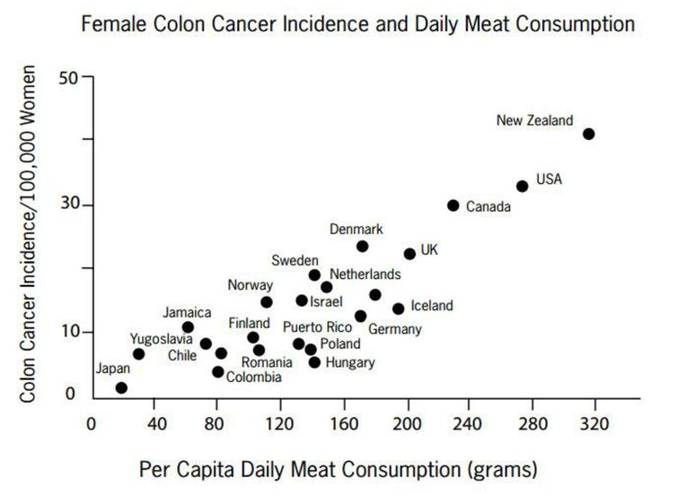
<p class="caption">(\#fig:cccr)Incidencia del cáncer de colon entre mujeres en función del consumo diario de carne roja *per capita* en  el estudio sobre factores ambientales y cáncer en diferentes países.</p>
</div>

¿Se puede concluir las mujeres que consumen más carne roja tienen un  riesgo mayor de tener cáncer de colon? No, la tendencia observada es a nivel de países, no a nivel individual. Para poder deducir una asociación a nivel de mujeres, sería necesario un estudio en el que se tomara una muestra de mujeres y de cada una se anotara su consumo de carne roja y si desarrolla, o ha desarrollado, cáncer de colon.

¿Para qué sirve entonces un estudio ecológico? Básicamente, para aportar evidencia indirecta de la veracidad de una hipótesis. Esta evidencia indirecta puede reforzar la evidencia obtenida en otros lugares o motivar estudios posteriores. Como además los estudios ecológicos son muy fáciles de llevar a cabo, ya que en general los datos en los que se basan son públicos en bases de datos al alcance de todos y se recogen en una tarde, son bastante comunes en epidemiología.


## Ensayos clínicos

En todos los tipos de estudios explicados hasta ahora, el investigador se limitaba a **observar** algunas características de un grupo de personas, sin que su participación en el estudio influya para nada en dichas características. Es decir, las acciones llevadas a cabo por los investigadores en el paso de recogida de datos fueron escoger la muestra y medir sus características, pero, por ejemplo, la exposición a factores de riesgo de los sujetos se debió a razones que no tuvieron nada que ver con el estudio.

En cambio, en los estudios **intervencionistas** el investigador **influye** en las características de los sujetos analizados, por ejemplo decidiendo quién va a tomar un medicamento y quién no, o quién se va exponer a un riesgo y quién no, y en principio controla todos los aspectos relevantes del experimento (o al menos lo intenta).

En este curso vamos a distinguir entre dos tipos de estudios intervencionistas:

* Estudio **experimental** (o **intervencionista aleatorizado y controlado**): En él, los individuos se distribuyen **al azar** (*aleatorizado*) en **al menos dos** grupos (*controlado*) que son sometidos a tratamientos **diferentes** para luego comparar los resultados. Usualmente, uno de los grupos sirve como grupo **de control**, por ejemplo porque no se les administra ningún tratamiento, o se les administra un **placebo** (explicamos qué es esto dentro de un rato) o el tratamiento de referencia  con el que se quiere comparar un nuevo tratamiento.

* Estudio **casi-experimental**: Todos los otros estudios intervencionistas. 


Por ejemplo, el estudio sobre marcha nórdica que usábamos en la Sección \@ref(sec:pasos)  es casi-experimental, puesto que no hay un grupo de control, solo el grupo a los que se "administró" marcha nórdica durante un año. 


\BeginKnitrBlock{rmdcaution}<div class="rmdcaution">El adjetivo "controlado" en la descripción de los estudios experimentales hace referencia a la existencia de al menos dos grupos que comparamos, uno de los cuales normalmente hace de "control". No a que el investigador en teoría "controle" todos los aspectos del estudio: eso está incluido en el adjetivo "intervencionista".</div>\EndKnitrBlock{rmdcaution}


Como comentaremos más adelante,  los estudios intervencionistas suelen aportar una mayor evidencia de la veracidad de sus conclusiones que los estudios observacionales. Pero a menudo es imposible llevarlos a cabo, o al menos no sería ético hacerlo. Por ejemplo, si queremos estudiar si la obesidad aumenta el riesgo de ingreso en UCI en caso de tener COVID-19, ¿cómo podríamos "intervenir" para que unos pacientes fueran obesos y otros no? O, retomando el ejemplo del radón y el cáncer de pulmón, no sería de ninguna manera ético exponer a propósito un grupo de personas al radón para ver si desarrollan más cáncer de pulmón que los no expuestos.


\BeginKnitrBlock{rmdnote}<div class="rmdnote">**En teoría**, lo estudios experimentales tendrían que permitir establecer una asociación causal entre las variables, porque **en teoría** el investigador controla completamente las características de los sujetos del estudio, de manera que las diferencias que se den entre los diferentes grupos solo puedan deberse a los diferentes tratamientos. Pero esto es solo **en teoría**, porque en la práctica es imposible controlarlo todo. </div>\EndKnitrBlock{rmdnote}

Se suele llamar **ensayo clínico** (o simplemente **ensayo**) a un estudio médico intervencionista con humanos. Un estudio médico en el que se pruebe un tratamiento sobre animales de laboratorio o sobre cultivos de células humanas en placas de Petri no se considera un ensayo clínico (a veces se los llama **ensayos pre-clínicos**).

En la ejecución de un ensayo clínico, vamos distinguir tres tipos de personas involucradas, o **partes**:

* Los **participantes**, es decir, los individuos que  forman la muestra que se estudia, a los que se administran (o no) los diferentes tratamientos.
* Las personas encargadas de **recoger** los datos sobre estos sujetos.
* Las personas encargadas de **analizar** los datos recogidos, que pueden coincidir o no con las que los recogen.

Vamos a clasificar los ensayos clínicos según el nivel de **enmascaramiento** de sus partes, es decir, según a quién se le oculta información:

* **Abierto**: Todas las partes del ensayo conocen toda la información sobre qué tratamiento recibe cada sujeto.

* **Simple ciego**: Una de las partes del ensayo, normalmente los participantes o el personal encargado de recoger los datos, no conoce el tratamiento que recibe cada sujeto.

* **Doble ciego**: Dos partes del ensayo, usualmente los participantes y los encargados de recoger los datos, desconocen el tratamiento que recibe cada  sujeto. 

* **Triple ciego**: Ni los participantes, ni los encargados de recoger los datos, ni los encargados de analizar los datos, conocen el tratamiento que recibe cada  sujeto.

El objetivo del enmascaramiento es **evitar sesgos en la recogida o el análisis de los datos**. Imaginad por ejemplo que estamos comparando un tratamiento nuevo del dolor articular crónico en el que tenemos muchas esperanzas con simplemente administrar el paracetamol de toda la vida.

* Si el paciente sabe que está tomando el tratamiento nuevo, puede autosugestionarse y sentir menos dolor.

* Si el que entrevista a los pacientes sabe qué está tomando cada uno, puede favorecer los datos sobre el tratamiento nuevo ("De 0 a 10, ¿cómo está hoy de dolor?" "Ay, no sé, un 5 o un 6." "¿Ponemos un 5?").

* Si el que analiza los datos sabe cada individuo de su tabla de datos a qué grupo pertenece, puede escoger de entre todas las técnicas correctas para analizarlos una que  favorezca el tratamiento nuevo. 

\BeginKnitrBlock{rmdnote}<div class="rmdnote">A menudo se usan los calificativos "simple ciego" o "doble ciego" en el sentido más general de que se esconde "algo" a una o dos partes, pero no tiene por qué ser el tratamiento. Por ejemplo, puede ser que los sujetos sepan perfectamente qué tratamiento reciben, pero que no sepan el objetivo final del estudio para que su conocimiento no influya en su comportamiento. </div>\EndKnitrBlock{rmdnote}


Hemos hablado hace un rato de placebo. Un **placebo** es una substancia similar en todos los aspectos a un tratamiento concreto excepto que es farmacológicamente inactiva. El típico ejemplo son las pastillas de azúcar exactamente con la misma forma y color que las pastillas del tratamiento, pero puede ser algo más exagerado: operar sin hacer nada, solo abrir y cerrar pero siguiendo el ceremonial de las operaciones quirúrgicas, como placebo de la operación quirúrgica "de verdad" que se está estudiando. 

Usar placebo  en un ensayo  clínico suele tener dos finalidades:

* **Enmascarar el ensayo**. Si el grupo de control recibe algo físicamente idéntico al tratamiento pero que no sirve para nada, se puede ocultar a los participantes (y a los que recogen los datos) quién está  tomando el tratamiento activo y quién no. En cambio, si a un grupo se les administra un tratamiento y a otro no se les administra nada, es imposible enmascarar el tipo de tratamiento a los participantes.

* **Evaluar el [efecto placebo](https://es.wikipedia.org/wiki/Efecto_placebo)**. Se trata de la alteración en la respuesta de un paciente por el simple hecho de recibir tratamiento. Por ejemplo, en un estudio sobre el tratamiento del dolor crónico, puede ser que el paciente note un cierto alivio del dolor por el mero hecho de "tomar algo", aunque sea azúcar. Muchas pseudoterapias se basan en este efecto.


\BeginKnitrBlock{example}<div class="example"><span class="example" id="exm:acupuntura"><strong>(\#exm:acupuntura) </strong></span>Considerad el estudio ["Effect of Zhubin (KI9) acupuncture in reducing alcohol craving in patients with alcohol dependence: a randomized placebo-controlled trial"](https://link.springer.com/article/10.1007/s11655-014-1851-1) (J. S. Lee *et al*, *Chinese Journal of Integrative Medicine* 21 (2015), pp. 307-311). Su objetivo era examinar el efecto de la acupuntura en un determinado punto para reducir el ansia de ingesta de alcohol en  alcohólicos. Para ello, se repartió de manera aleatoria 20 pacientes alcohólicos en dos grupos de 10. El grupo de tratamiento recibió acupuntura con agujas reales dos veces por semana durante 4 semanas, y el grupo de control recibió el mismo régimen de acupuntura pero con agujas de placebo (de punta roma, que no perforan la piel).  El doctor que practicó la acupuntura conocía qué tipo de aguja usaba, pero los pacientes y el personal encargado de realizarles el seguimiento, no.

</div>\EndKnitrBlock{example}

Como veis, se trata de un estudio experimental (hay intervención, aleatorización y dos grupos) y es doble ciego. Los resultados del ensayo se resumen en el gráfico siguiente, extraído del artículo:


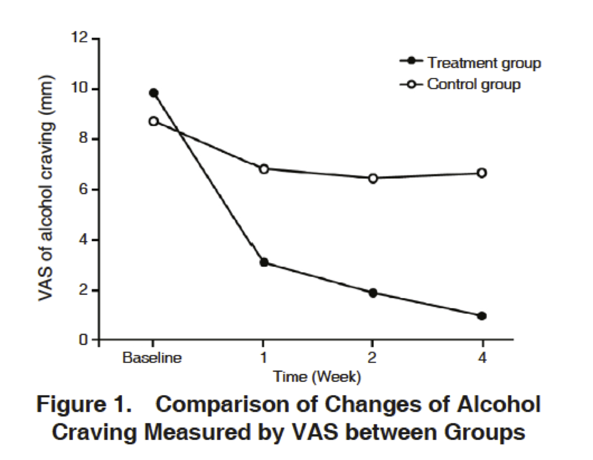

En él, observamos que la urgencia por tomar alcohol en el grupo de tratamiento (línea uniendo puntos rellenos) disminuyó mucho más que en el grupo de control, pero que en este último también disminuyó en las primeras sesiones, seguramente debido al efecto placebo.


Otra clasificación importante de los estudios controlados depende de cómo se forman los grupos:

*  **Grupos paralelos**: El grupo de participantes se divide en los diferentes grupos que recibirán los diferentes tratamientos.

<div class="figure" style="text-align: center">

<p class="caption">(\#fig:paralelos)Esquema de un estudio con dos grupos paralelos.</p>
</div>

*  **Grupos cruzados**: Los diferentes tratamientos son administrados a cada sujeto en momentos diferentes, en un orden elegido al azar si queremos que haya aleatorización. 


<div class="figure" style="text-align: center">
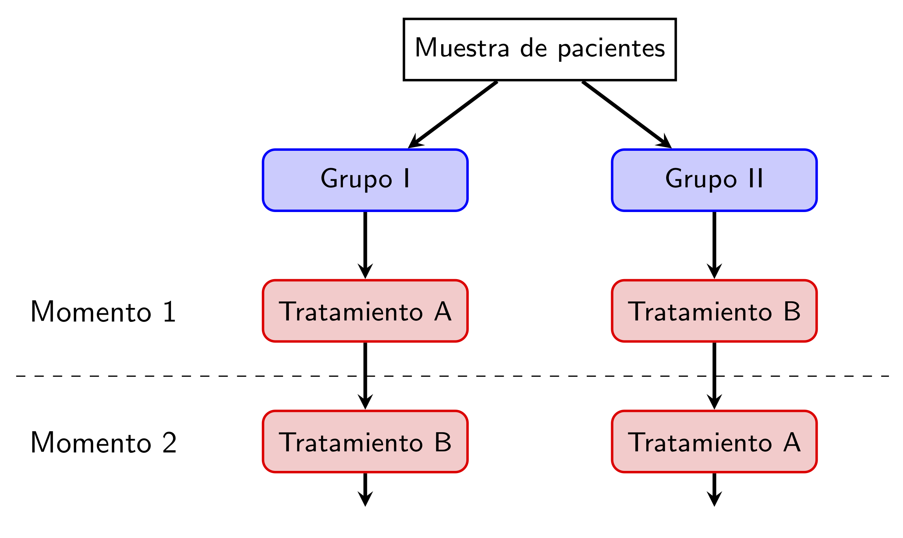
<p class="caption">(\#fig:cruzados)Esquema de un estudio con dos grupos cruzados.</p>
</div>

El estudio de acupuntura mencionado hace un rato fue de grupos paralelos: cada grupo recibió un único tratamiento, diferente en un grupo del otro. Veamos otro ejemplo de estudio con grupos paralelos.

\BeginKnitrBlock{example}<div class="example"><span class="example" id="exm:baile"><strong>(\#exm:baile) </strong></span>En el estudio ["Efectos de un programa de terapia de baile en la calidad de vida, el sueño y la presión arterial en mujeres de mediana edad: un ensayo controlado aleatorizado"](https://www.sciencedirect.com/science/article/pii/S0025775316303116) (M. Serrano-Guzmán *et al*, *Medicina Clínica* 147 (2016), pp. 334-339) participaron 67 mujeres de mediana edad prehipertensas e hipertensas. A cada una se la asignó al azar a un **grupo de intervención** (donde siguieron un programa de terapia de baile específico durante 8 semanas, además de su medicación) o a un **grupo control** (donde  continuaron con sus actividades y medicación habitual). 35 mujeres fueron a parar al grupo de intervención y 32 al grupo de control. Se midieron en ambos grupos la presión arterial, la calidad del sueño y la calidad de vida (estas dos últimas mediante indicadores específicos) al principio del estudio y tras las 8 semanas. El grupo de intervención mejoró significativamente sus valores de presión arterial,  calidad del sueño y  calidad de vida en comparación con el grupo control.
</div>\EndKnitrBlock{example}

Veamos ahora un ensayo con grupos cruzados.

\BeginKnitrBlock{example}<div class="example"><span class="example" id="exm:creuat2cec"><strong>(\#exm:creuat2cec) </strong></span>En el estudio ["Digestión deficiente e intolerancia a lactosa en un grupo de enfermos con colitis ulcerativa crónica inespecífica, Ensayo clínico controlado, cruzado y doblemente a ciegas"](http://www.revistagastroenterologiamexico.org/es-pdf-X0375090612226816) (G. A. Cabrera-Acosta *et al*, *Revista de Gastroenterología de México*  77 (2012), 26-30) participaron 39 pacientes diagnosticados de  colitis ulcerativa crónica inespecífica (CUCI). Cada uno de ellos recibió, de forma aleatoria, 12.5 g de lactosa o de maltosa en 250 ml de agua, tras un ayuno de 12 horas.  Al cabo de tres días de dieta habitual, cada participante recibió el preparado que no había recibido en la primera prueba. Tras cada sesión, se les realizó un test habitual de intolerancia a la lactosa (cantidad de hidrógeno en aire aspirado). Ni los participantes ni el personal que realizó los tests conocía el orden asignado de los productos consumidos. 18 enfermos (un 46% del total) presentaron digestión deficiente de lactosa.
</div>\EndKnitrBlock{example}

Observad algunos aspectos de este estudio:

* El ensayo fue **controlado**, ya que cada sujeto fue el control de si mismo. Se comparó para cada participante su digestión de la lactosa y de la "no-lactosa", que es el papel que juega la maltosa en este estudio. 

* El ensayo fue **aleatorizado**, ya que el orden de los productos administrados a cada sujeto fue decidido al azar. De esta manera, se intentó evitar posibles sesgos que podrían haberse dado si todos hubieran consumido cada producto en el mismo día. Por ejemplo, si hubiera algún factor desconocido que influyera en la digestión de la lactosa y que se hubiera dado el día que tocara lactosa a todos.

    Las dos tomas se separaron 72 horas para disminuir el efecto residual del azúcar consumido en la primera prueba.


* La maltosa en agua, tiene un aspecto y sabor similar al de la lactosa, por lo que sirvió de **placebo**.

* El ensayo fue **doble ciego**: los participantes no sabían qué bebían en cada toma y el personal que realizó y analizó los tests de intolerancia a la lactosa tampoco sabían qué habían tomado.


Es importante recalcar las similitudes y  diferencias entre los diseños de cohorte  y experimental en estudios para determinar la asociación entre una exposición y un desenlace.

* En ambos estudios se toma un grupo de expuestos y uno de no expuestos.

* En el estudio de cohorte, los sujetos pertenecen a un grupo u otro **por motivos externos** al estudio: por decisión propia, por criterio clínico, por motivos ambientales, geográficos, genéticos... Esto puede hacer que los sujetos con algunas características concretas sean más abundantes en un grupo que en otro.

* En el estudio experimental, los sujetos son asignados por el investigador **de manera aleatoria** a un grupo u otro. De esta manera se intenta prevenir que los sujetos con algunas características concretas tiendan a aparecer más en un grupo que en otro.

\BeginKnitrBlock{rmdcaution}<div class="rmdcaution">Comparad las dos situaciones siguientes. 

* En un estudio sobre la eficacia de dos tratamientos, A y B, para una enfermedad, se tomó un grupo de pacientes con esta enfermedad. A cada uno de ellos se le administró A o B según el **criterio clínico** del médico que los atendió, y se comparó la eficacia de ambos tratamientos.

* En un estudio sobre la eficacia de dos tratamientos, A y B, para una enfermedad, se tomó un grupo de pacientes con esta enfermedad. A cada uno de ellos se les administró A o B **al azar**, y se comparó la eficacia de ambos tratamientos.

El primero sería observacional, más en concreto de cohorte; el segundo, experimental.
</div>\EndKnitrBlock{rmdcaution}


\BeginKnitrBlock{rmdexercici}<div class="rmdexercici">En un [famoso estudio](https://www.ncbi.nlm.nih.gov/pmc/articles/PMC2272051/pdf/epidinfect00028-0013.pdf), el [Dr. Norman Gregg](https://es.wikipedia.org/wiki/Norman_Gregg) estudió 78 casos de recién nacidos con cataratas congénitas de toda Australia, y observó que en 68 de ellos se había diagnosticado que la madre había tenido la rubeola durante la primera parte del embarazo (en los 10 restantes, solo en 2 se descartaba explícitamente que hubiera pasado la rubeola durante el embarazo). Concluyó que había asociación entre la rubeola materna y las cataratas congénitas.

a. Por su diseño, ¿de  qué tipo de estudio se trata?

a. ¿Creéis que la conclusión de Gregg estaba justificada basándose solo a los datos de los 78 neonatos con cataratas? Si sí, ¿por qué? Si no, ¿qué información haría falta para poder llegar a una conclusión?

a. Si el estudio de Gregg no fue de casos y controles, diseñad (en detalle: cómo elegiríais los casos y los controles, cómo obtendríais la información etc.) un estudio de este tipo cuyo objetivo sea detectar la posible asociación entre la rubeola materna y las cataratas congénitas.

a. Repetid la pregunta anterior con un estudio de cohorte prospectivo.

a. Repetid la pregunta (c) con un estudio de cohorte retrospectivo.

a. Pensad en algún confundidor que pudiera aparecer en estos estudios observacionales. ¿Qué haríais para descartarlo?

a. ¿Sería posible o ético llevar a cabo un estudio experimental cuyo objetivo fuera detectar la posible asociación entre la rubeola materna y las cataratas congénitas?
</div>\EndKnitrBlock{rmdexercici}


Para terminar esta sección sobre estudios intervencionistas, vamos a describir los diferentes tipos, o **fases**, de los **ensayos farmacológicos**, en los que se investiga el efecto de un nuevo fármaco o vacuna.


<div class="figure" style="text-align: center">
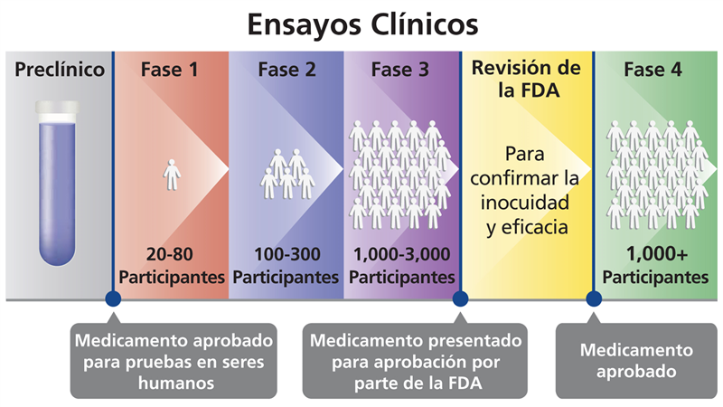
<p class="caption">(\#fig:ensayosclinicos)Fases de los ensayos farmacológicos; fuente: https://clinicalinfo.hiv.gov/es/glossary/ensayo-clinico</p>
</div>

* Los **ensayos de fase I** se centran en la pregunta **¿Es seguro el tratamiento?**. En ellos se prueba el fármaco en grupos pequeños (digamos, de decenas) de voluntarios no necesariamente enfermos, sin grupo de control. Estos ensayos  aportan datos preliminares sobre su toxicidad y efectividad en diferentes dosis.

* Los **ensayos de fase II** se centran en la pregunta **¿Es efectivo el tratamiento?**. En ellos se prueba el fármaco sobre un grupo de tamaño medio (digamos, de centenares) de enfermos  y se comparan los resultados con un grupo de control, pero posiblemente sin aleatorizar los tratamientos. En los ensayos de una vacuna, se prueba sobre todos los sujetos de la muestra, sin grupo de control. Se estudia la eficacia del medicamento (relación dosis/respuesta, dosis óptima, margen de seguridad....) y los efectos adversos a corto plazo en diferentes condiciones "de laboratorio",  seguramente diferentes de lo que va a ser su administración habitual si se aprueba el fármaco.

* Los **ensayos de fase III** se centran en la pregunta **¿Es mejor el nuevo tratamiento que el convencional?** Se trata de ensayos controlados aleatorizados sobre un grupo de enfermos mucho mayor (digamos, de miles) en los que se evalúa la eficacia del medicamento en condiciones de uso similares a las que se darán cuando se haya aprobado y su seguridad a más largo plazo, comparándolo con las alternativas terapéuticas disponibles.


* Los **ensayos de fase IV** se llevan a cabo tras la comercialización y varios años de uso del fármaco. En ellos se revalúa su efectividad y se estudian sus posibles nuevas indicaciones y su seguridad a largo plazo.


## A modo de resumen

El gráfico siguiente presenta un diagrama de flujo para clasificar un estudio médico en los diferentes tipos explicados hasta el momento.


<div class="figure" style="text-align: center">
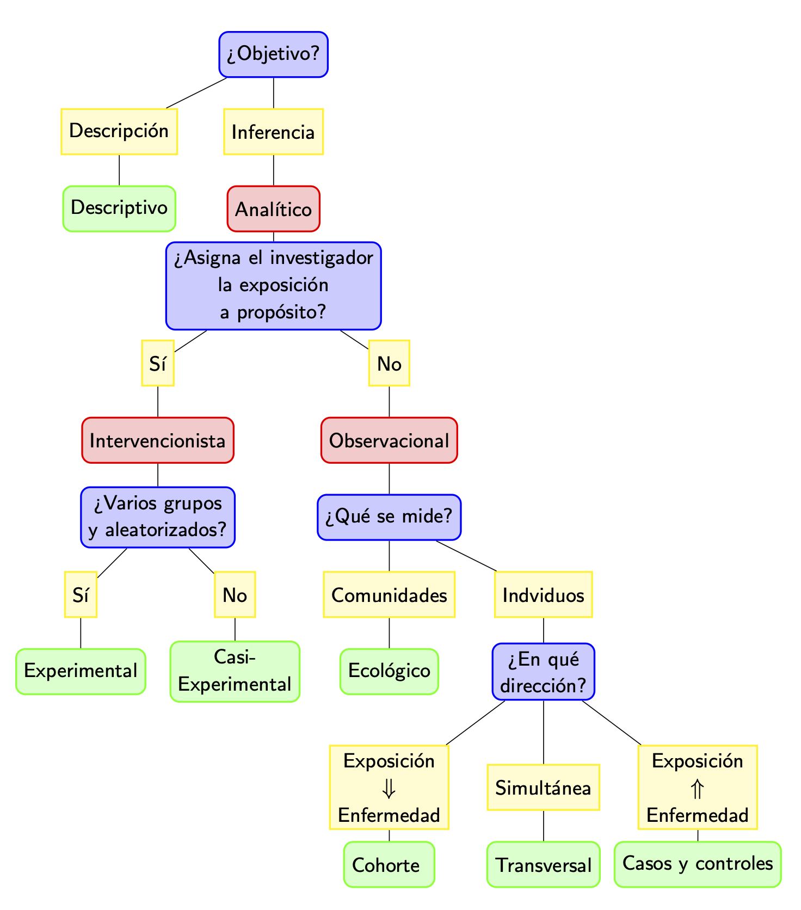
<p class="caption">(\#fig:algoritmo)Algoritmo para la clasificación básica de un estudio médico.</p>
</div>


Hay muchos más tipos de estudios médicos: estudios híbridos que mezclan aspectos de diferentes tipos (casos-cohorte, casos y controles anidados en una cohorte, estudios casi-experimentales con un control externo,...), estudios secuenciales (en los que se analizan cada cierto tiempo los resultados obtenidos y se decide si se continua el estudio ampliando la muestra o si se para antes de su final previsto), etc. No los vamos a estudiar en este curso.


## Revisiones sistemáticas y metaanálisis

Hay un último tipo de estudios que queremos comentar, en los que las muestras que se estudian están formadas por ... estudios médicos previos sobre un tema. Se trata de las **revisiones sistemáticas**: Resúmenes de todo lo publicado sobre un tema  específico. Entre las revisiones sistemáticas, aquí destacamos los **metaanálisis**, que usan técnicas estadísticas para analizar conjuntamente los resultados publicados en una serie de estudios previos sobre un tema concreto.


\BeginKnitrBlock{rmdnote}<div class="rmdnote">Observad que si se han efectuado, digamos, 25 estudios sobre un tema y en cada uno han participado, pongamos, 40 sujetos, al analizar conjuntamente los datos generados es como si se tratara de un estudio con 1000 sujetos. Como os podéis imaginar, las conclusiones que se obtienen a partir de 1000 sujetos son más fiables que las que se obtienen con 40. De hecho, seguramente sean más fiables que las que se obtienen en 25 estudios con 40 participantes cada uno, como veremos más adelante en el tema de Contrastes de Hipótesis.</div>\EndKnitrBlock{rmdnote}


<div class="figure" style="text-align: center">

<p class="caption">(\#fig:metaanálisis)Esquema de un metaanálisis.</p>
</div>

\BeginKnitrBlock{example}<div class="example"><span class="example" id="exm:acné"><strong>(\#exm:acné) </strong></span>En el estudio ["¿Resistencia en el acné? Un metaanálisis a propósito de la controversia"](https://www.sciencedirect.com/science/article/pii/S0009741115002364) (M. Álvarez-Sánchez *et al*, *Cirugía y Cirujanos* 84 (2016), pp. 190-195), se presenta un metaanálisis de las publicaciones de los 10 años anteriores a su aparición sobre la resistencia bacteriana del *Propionibacterium acnes* a los antibióticos tópicos usados habitualmente en el tratamiento del acné.
</div>\EndKnitrBlock{example}

En primer lugar, se hizo una selección sistemática de aquellos estudios que iban a ser incorporados al metaanálisis, que al final fueron solo 13 de 501 candidatos, según el proceso descrito en el **flujograma** siguiente:


<div class="figure" style="text-align: center">
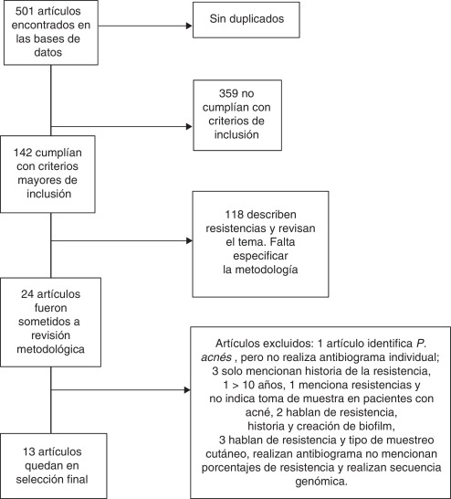
<p class="caption">(\#fig:acne2)Proceso de selección de los artículos en el estudio sobre resistencia en el acné (Figura 2 en el artículo).</p>
</div>

De los 13 estudios analizados, en 8 se había obtenido evidencia de un aumento en la resistencia del *P. acnes* a la eritromicina y clindamicina tópicas usadas en tratamientos anti acné, de los cuales solo en 1 fue significativo, y en 5 se obtuvo evidencia de un aumento en su sensibilidad, de los cuales en 2 fue significativo.  Al analizar conjuntamente los datos de los 13 estudios, se obtuvo evidencia de que ha habido un aumento en la resistencia del *P. acnes* a estos antibióticos, pero el aumento detectado no fue significativo. 

Los resultados de un metaanálisis se suelen representar mediante un **forest plot** (también se le llama **diagrama de efectos** o **blobograma**) como el de la Figura \@ref(fig:blob), que ya  explicaremos con más detalle en el Tema \@ref(chap:IC) sobre Intervalos de Confianza.

<div class="figure" style="text-align: center">
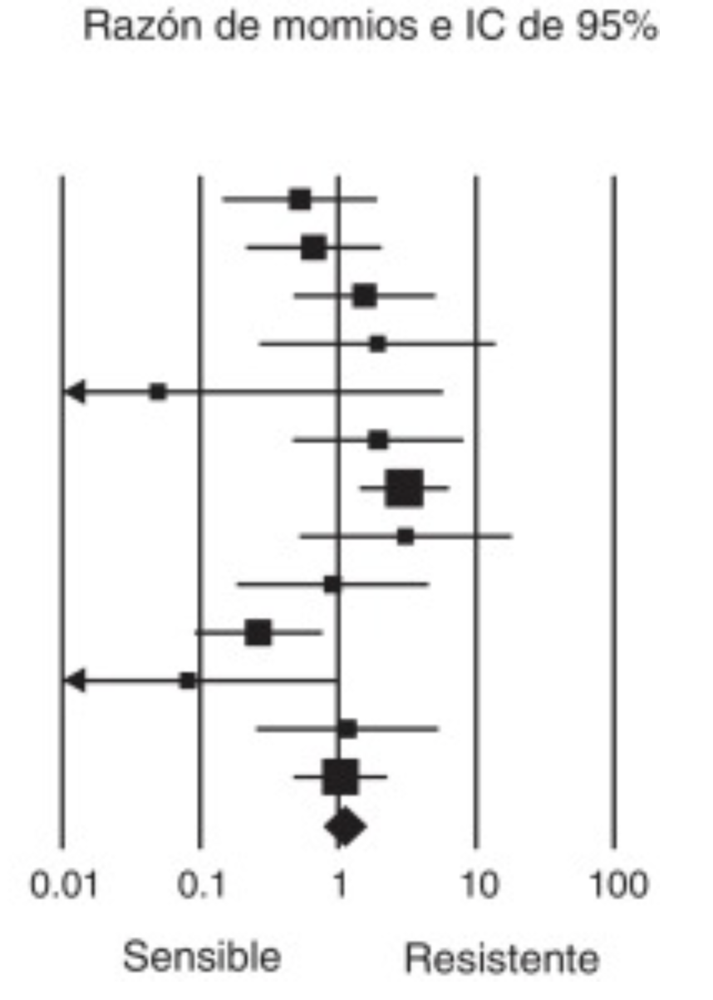
<p class="caption">(\#fig:blob)Forest plot del estudio sobre resistencia en el acné (Figura 1 en el artículo).</p>
</div>


Los metaanálisis representan  la cúspide de la evidencia en estudios médicos, como muestra la Figura \@ref(fig:piramide), pero no están exentos de problemas:

* Son sensibles al **sesgo de publicación**. Se tiende a publicar en revistas científicas solo aquellos estudios que presentan resultados positivos o al menos "interesantes"; las revistas científicas son un negocio, y la mayoría solo publican los artículos que puedan hacer crecer su prestigio y con él las ventas. Por este motivo, si solo se tienen en cuenta estudios publicados en revistas, las conclusiones pueden estar sesgadas. Es imprescindible buscar, e incluir, posibles estudios que hayan quedado sin publicar porque no obtuviesen evidencia significativa de nada.

* Si los estudios analizados son defectuosos, el metaanálisis no los salva, y las conclusiones pueden ser erróneas. Por ello es necesario establecer unos criterios precisos de calidad de los estudios cuyos datos se vayan a tener en cuenta.

Para terminar, la Figura \@ref(fig:piramide) representa la llamada **pirámide de la evidencia**, que ordena los tipos de estudio, de la base hacia la cúspide, en función de la calidad de la evidencia científica que, en general, aportan. Cuanto más arriba en la pirámide está un tipo de estudio, en principio con más seguridad se pueden adoptar sus conclusiones en la práctica médica. Si reflexionáis un poco, veréis que el orden que describe es muy razonable.


<div class="figure" style="text-align: center">
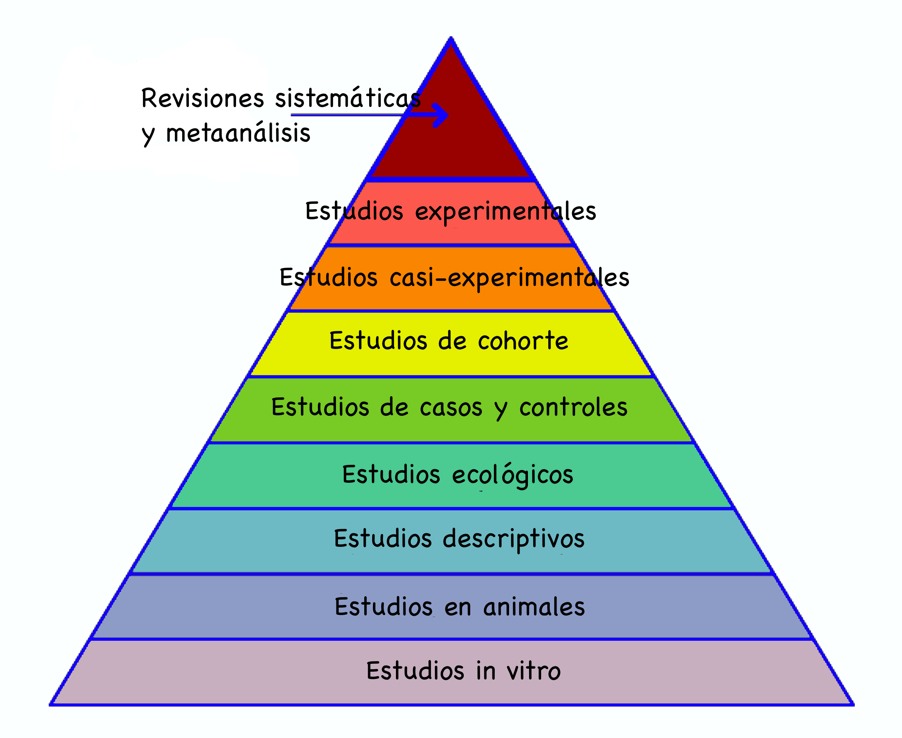
<p class="caption">(\#fig:piramide)Pirámide de la evidencia.</p>
</div>


## (Bonus track) Unos criterios de causalidad

El objetivo final de la mayoría de estudios médicos es establecer una relación de **causalidad**, de causa/efecto:

* Esta medicina cura esta enfermedad.
* La exposición a esto aumenta el riesgo de padecer esta enfermedad.
* Esta vacuna previene esta enfermedad.
* Etc. 

Por desgracia, como ya hemos comentado, es virtualmente imposible establecer sin ninguna duda una relación de causalidad entre dos eventos por medio de un estudio médico. Por ejemplo, ¿cómo podríamos estar absolutamente seguros de que fumar aumenta el riesgo de cáncer de pulmón? Pues tomando un grupo de personas, haciéndoles fumar cantidades fijas de cigarrillos diarios  y  anotando quiénes de ellos desarrollan cáncer de pulmón a lo largo de su vida. A continuación, volviendo atrás en el tiempo, impedirles totalmente que fumen, hacerles revivir su vida (su vida, y la del resto del universo) exactamente como en la primera ronda, salvo por el hecho de que ahora no fuman, y anotar quiénes desarrollan cáncer de pulmón en esta segunda oportunidad. Solo de esta manera garantizaríamos que cualquier diferencia en los números de cáncer de pulmón se debe al hecho de fumar.


Como no podemos usar esta técnica, hemos de echar mano a estudios como los explicados en las secciones anteriores, que en general solo muestran una asociación entre una exposición y un desenlace y en los que no podemos controlar todas las variables que puedan influir en el desenlace, incluyendo confundidores. Cierto es que en los estudios experimentales las controlamos más que en el resto, pero no al cien por cien. En estas condiciones, está claro que la asociación que se observe no tiene por qué implicar causalidad.

\BeginKnitrBlock{example}<div class="example"><span class="example" id="exm:univturmor"><strong>(\#exm:univturmor) </strong></span>En el estudio ["Socioeconomic position and the risk of brain tumour: a Swedish national population-based cohort study"](https://jech.bmj.com/content/70/12/1222) (A. Khanolkar *et al*, *Journal of Epidemiology and Community Health* 70  (2016), pp. 1222-1228) se realizó un seguimiento durante 17 años a más de 4 millones de suecos, y se observó una asociación sorprendente: los que habían cursado al menos 3 años de estudios universitarios tenían un 22% más de probabilidad de tener un glioma (un tipo de cáncer de cerebro) que los que solo tenían educación primaria.  La diferencia fue además estadísticamente significativa. ¿Creéis que puede ser verdad que tener estudios universitarios cause un aumento de la probabilidad de tener un glioma?
  
  </div>\EndKnitrBlock{example}

Seguramente no. Incluso los autores lo reconocen en las Conclusiones. En lo que se detectó una diferencia significativa fue en **el número de diagnósticos de glioma**, que pudo deberse  a que las personas con estudios superiores tienen una mayor probabilidad de que su glioma sea detectado, por ejemplo porque acudan al médico antes, y que sea registrado en el Registro Nacional de Cáncer, que es de donde se extrajo la información sobre los cánceres.  Naturalmente, en el periódico solo vais a encontrar la parte llamativa del estudio, como muestra el titular de la noticia del ABC sobre el tema.


<div class="figure" style="text-align: center">

<p class="caption">(\#fig:ABCglioma)Noticia publicada en el ABC el 21 junio de 2016. El texto completo está disponible en https://www.abc.es/salud/enfermedades/abci-estudios-universitarios-podrian-aumentar-riesgo-tumores-cerebrales-201606201751_noticia.html.</p>
</div>


El estadístico [Austin Bradford Hill](https://es.wikipedia.org/wiki/Austin_Bradford_Hill) (que ya ha aparecido en esta lección como coautor del estudio pionero sobre cáncer y tabaco del Ejemplo \@ref(exm:rubeola)) enunció la lista más popular de criterios de causalidad para poder aceptar que una asociación observada entre una exposición y un desenlace,  sea en realidad una relación causal. El primer criterio es obvio, y el único que es necesario que se cumpla:

* **Temporalidad**: La pretendida causa tiene que preceder temporalmente al efecto.

El resto de criterios son optativos, pero cuantos más se cumplan, más fuerza tiene el argumento en favor de la relación causa/efecto.  Vamos a ilustrarlos con  argumentos en favor de que niveles altos de colesterol en sangre aumentan el riesgo de enfermedad coronaria.

* **Fuerza de la asociación estadística**: Cuanto mayor sea la asociación observada (en el sentido, por ejemplo, de cuántas veces mayor es la frecuencia observada del desenlace entre los expuestos que entre los no expuestos), más creíble es que la exposición sea la causa del desenlace.

     Por ejemplo, ha habido estudios de cohorte en los que se ha observado un aumento de casi el 300% en la incidencia de enfermedades coronarias entre los sujetos con nivel muy alto de colesterol respecto de los sujetos con niveles normales.

* **Consistencia** o **reproducibilidad**: Si cada vez que se llevan a cabo estudios similares se obtienen conclusiones similares, es más creíble que esta asociación sea verdadera.

     La asociación entre niveles altos de colesterol y enfermedades coronarias se ha observado en multitud de estudios tanto de casos y controles como de cohorte sobre poblaciones de características diferentes. 


* **Plausibilidad biológica**: La existencia de una explicación biológica plausible de la relación causa/efecto hace más creíble que esta relación sea verdadera.

    Se ha comprobado que el colesterol LDL promueve el desarrollo de placas arterioescleróticas, y estas aparecen en las enfermedades cardíacas.
    
* **Coherencia**: Si la relación causa/efecto propuesta no va contra el conocimiento científico sobre el tema, es más creíble que sea verdadera.

    Fijaos en que no es lo mismo tener una explicación biológica para la causalidad (el criterio anterior) que la ausencia de teorías o estudios que la contradigan. En nuestro caso, la asociación entre el colesterol y la enfermedad cardíaca no contradice ningún estudio conocido ni ningún mecanismo biológico conocido.

* **Especificidad**: Si se han descartado mediante otros estudios otras posibles causas del desenlace, aumenta la verosimilitud de que la exposición para la que sí se ha encontrado una asociación lo cause.

    La asociación entre colesterol alto y el desarrollo de enfermedades cardíacas se ha mantenido cuando se han descartado los efectos de posibles confundidores como el tabaco, el alcohol, la edad, la tensión arterial etc.

* **Relación dosis-respuesta**: Si a mayor exposición se observa una mayor probabilidad de aparición del desenlace, es más creíble que la exposición sea la causa del desenlace.

     En el ejemplo que nos ocupa, se ha observado en muchos estudios que la probabilidad de tener una enfermedad cardíaca crece con el nivel de colesterol.

* **Reversibilidad**: Si se observa que al eliminar la exposición el desenlace desaparece,  es más creíble que la exposición sea la causa del desenlace.

     Se han realizado estudios experimentales en los que se ha observado que si se reduce el nivel de colesterol por medio de la administración de fármacos, se reduce la riesgo de enfermedad coronaria. 

* **Calidad del estudio**: La relación causa/efecto es más creíble si la asociación se ha establecido en un estudio experimental que si lo ha sido en estudios inferiores en la pirámide de la evidencia.

     Naturalmente, en nuestro ejemplo no se han llevado a cabo estudios experimentales en los que a sujetos se les aumentara el nivel de colesterol para ver si tenían un infarto, pero como hemos comentado sí que se han realizado en el sentido contrario.

* **Analogía**: Si se ha aceptado que exposiciones similares causan desenlaces similares, es más fácil de aceptar que esta relación causa/efecto se dé también en nuestro caso.

     Se han descrito mecanismos similares al relacionado con el colesterol LDL que producen placas arterioescleróticas.

## (Bonus track) Preguntas clínicas en formato PICO

Al buscar información sobre un tema médico específico, es importante formular la pregunta de manera adecuada. Un esquema muy usado para estructurar este tipo de preguntas es el **PICO**, acrónimo de **P**aciente-**I**ntervención-**C**omparación-**O***utcome* (resultado):

* ¿Sobre qué tipo de **P**aciente? Se trata de especificar con precisión el tipo de paciente (o de **P**ersona, si está sano) sobre el que nos interesa obtener información.

* ¿Qué **I**ntervención? Aquí **intervención** puede referir a un tratamiento de una enfermedad, la exposición a un factor de riesgo, una prueba diagnóstica...

* ¿**C**omparado con qué otra intervención? A veces esta parte no se tiene en cuenta, si no se quiere comparar el resultado de la intervención con nada sino simplemente saber su resultado. Hablaríamos entonces del formato **PIO**.

* ¿Qué resultado (**O***utcome*) nos interesa? Aquí **resultado** refiere a las consecuencias de la intervención en la salud del paciente.

\BeginKnitrBlock{example}<div class="example"><span class="example" id="exm:unnamed-chunk-50"><strong>(\#exm:unnamed-chunk-50) </strong></span>Vamos a traducir al formato PICO la pregunta "¿El uso de ácido acetil salicílico  (AAS), aumenta la supervivencia en el infarto agudo de miocardio?"

</div>\EndKnitrBlock{example}

* **P**aciente. ¿Ante qué tipo de pacientes se nos plantea el problema? No vale "las personas en general". Por ejemplo, podría ser:

    * En los pacientes mayores de 60 años con síndrome coronario agudo con [elevación del ST](http://www.medintensiva.org/es/significado-clinico-del-sindrome-coronario/articulo/S0210569111000866/)...

* **I**ntervención. ¿De qué tipo de acción queremos saber las consecuencias?

    * ... la administración de AAS...

* **C**omparación. ¿Con respecto a qué queremos comparar la intervención? 

    * ... con respecto a no administrarles nada...

* **O***utcome* (Resultado). ¿En qué efecto estamos interesados? Como a la larga nadie sobrevive a la vida, podría ser, por ejemplo

* ... ¿aumenta la tasa de supervivencia a 30 días vista?


Nos quedaría:

> En los pacientes mayores de 60 años con síndrome coronario agudo con elevación del ST, ¿la administración de AAS aumenta la tasa de supervivencia a los 30 días con respecto a no administrarles nada?

\BeginKnitrBlock{example}<div class="example"><span class="example" id="exm:unnamed-chunk-51"><strong>(\#exm:unnamed-chunk-51) </strong></span>Considerad la situación siguiente. X es una nueva paciente de 76 años que acude a nuestra consulta para hacerse un examen físico periódico. X se encuentra en buen estado de salud aunque sufre de hipertensión desde hace muchos años. Su hipertensión está controlada con éxito mediante beta-bloqueantes y nos ha expresado su satisfacción con esta terapia. Sin embargo, su hijo ha sido diagnosticado recientemente de hipertensión y se le ha recetado un [inhibidor de la ECA](https://es.wikipedia.org/wiki/Inhibidor_de_la_enzima_convertidora_de_angiotensina). X nos pregunta si este tratamiento sería una mejor opción para ella.

Vamos a traducir la pregunta planteada por X al formato PICO.
</div>\EndKnitrBlock{example}

* **P**: mujer, edad avanzada, hipertensa, por lo demás en buen estado de salud
* **I**: administrar un inhibidor de la ECA
* **C**: administrar beta-bloqueantes
* **O**: eficacia en la reducción de la presión arterial, efectos secundarios.

Como resultado, la pregunta PICO podría ser: 

> En mujeres hipertensas de edad avanzada, ¿un inhibidor  de la ECA es más eficaz que un beta-bloqueante para controlar la presión arterial alta y minimizar los efectos secundarios adversos?


## Test 

**(1)** Un estudio publicado describe varias características de los pacientes ingresados con neumonía en un hospital durante un año, incluidos el sexo, la edad, el historial de tabaquismo y el historial de ingresos previos por neumonía. ¿De qué tipo de estudio se trata?

1. Descriptivo
1. Transversal
1. De cohorte prospectivo
1. De cohorte retrospectivo
1. De casos y controles 

**(2)** En un artículo publicado se estudió a pacientes atendidos en una clínica por apendicitis aguda tratada con apendicectomía laparoscópica.
Se tomaron 50 de ellos que presentaron infección de la herida una semana después del alta y 50 que no la presentaron. El estudio comparó entre ambos grupos los factores que se anotaron en el ingreso, como la edad, el sexo, la presencia de dolor en el cuadrante inferior derecho, la temperatura, entre otros. ¿De qué tipo de estudio se trata?

1. Descriptivo
1. Transversal
1. De cohorte prospectivo
1. De cohorte retrospectivo
1. De casos y controles  

**(3)** Si identificamos pacientes con bronquitis crónica obstructiva en el año 2010 tratados y no tratados con corticoides por vía inhalatoria, y evaluamos su función respiratoria a día de hoy, se trata de un estudio:

1. Descriptivo
1. Transversal
1. De cohorte prospectivo
1. De cohorte retrospectivo
1. De casos y controles 


**(4)** Se ha llevado a cabo un estudio con el fin de determinar el riesgo de hemorragia digestiva alta (HDA) asociado con el uso de diferentes anti-inflamatorios no esteroideos (AINE). Para ello se incluyeron 2777 pacientes con HDA y 5532 pacientes emparejados con los anteriores por edad y mes de ingreso o consulta, en los mismos hospitales, pero por otras razones que no tuvieran que ver con el uso de AINE. Se comparó  la exposición previa a diferentes AINE en ambos grupos. ¿De qué tipo de estudio se trata?

1. Descriptivo
1. Transversal
1. De cohorte prospectivo
1. De cohorte retrospectivo
1. De casos y controles 
1. Experimental
1. Ecológico


**(5)** Que un ensayo clínico sea "abierto" significa que:

1. No requiere ingreso. 
1. Pueden incluirse sujetos en el ensayo una vez iniciado. 
1. No existe grupo control.
1. No es enmascarado. 
1. Sus resultados son extrapolables a la población general.


**(6)** En un centro de salud se está realizando un estudio para determinar el efecto de la exposición al humo del tabaco en hijos de padres fumadores. Para ello, se selecciona a un grupo de niños sanos entre 3 y 7 años cuyos padres son fumadores y al mismo tiempo se selecciona en el mismo centro un igual número de niños cuyos padres no son fumadores. Un año después se investigará en ambos grupos la aparición de enfermedades respiratorias durante ese año. ¿De qué tipo de estudio se trata?

1. Descriptivo
1. Transversal
1. De cohorte prospectivo
1. De cohorte retrospectivo
1. De casos y controles 
1. Experimental
1. Ecológico

**(7)** En un estudio de fase III destinado a confirmar la eficacia bacteriológica de un nuevo antibiótico para el tratamiento de pacientes con pielonefritis aguda (una infección bacteriana de las vías urinarias que puede desembocar en insuficiencia renal, sepsis...) grave, ¿Cuál de los siguientes diseños de ensayo clínico le parece más apropiado?

1. Paralelo, abierto, controlado con placebo
1. Paralelo, aleatorizado, doble ciego,  controlado con otro antibiótico 
1. Cruzado, abierto, controlado con otro antibiótico
1. Cruzado, aleatorizado, doble ciego,  controlado con placebo


**(8)** La medicina basada en la evidencia propone integrar las mejores evidencias con la experiencia clínica y las circunstancias de los pacientes en la toma de las decisiones clínicas. En relación a la calidad de la evidencia, ¿qué tipo de estudio de los siguientes nos proporciona evidencias de mayor calidad?: 

1. Revisiones sistemáticas 
1. Estudios de cohorte
1. Estudios de casos y controles
1. Ensayos clínicos aleatorizados y controlados
1. Ensayos clínicos doble ciegos, aleatorizados y controlados con placebo


**(9)** Seleccionamos una muestra aleatoria entre los pacientes que acuden a vacunarse de la gripe durante la campaña anual en un centro de salud. Se registra en los pacientes seleccionados si están utilizando fármacos hipolipemiantes y si están diagnosticados de diabetes mellitus, entre otros datos. Se obtiene que la diabetes mellitus es más frecuente entre los pacientes que toman hipolipemiantes que entre los que no los toman. ¿A cuál de los siguientes corresponde el diseño de este estudio?

1. Descriptivo
1. Transversal
1. De cohorte prospectivo
1. De cohorte retrospectivo
1. De casos y controles 
1. Experimental
1. Ecológico


**(10)** ¿Qué tipos de estudios permiten estimar la incidencia de una enfermedad? Marca todas las respuestas correctas:

1. Series de casos
1. De casos y controles
1. De cohorte  
1. Transversales


**(11)** El servicio de dermatología de un hospital ha registrado durante los últimos 20 años todos los casos diagnosticados de necrosis epidérmica tóxica en el centro. Se encuentra que un 20% de estos pacientes habían estado expuestos a carbamazepina en las 6 semanas previas al diagnóstico, mientras que un 10% habían estado expuestos a fenitoína. ¿A cuál de los siguientes corresponde el diseño de este estudio?

1. Descriptivo
1. Transversal
1. De cohorte prospectivo
1. De cohorte retrospectivo
1. De casos y controles 
1. Experimental
1. Ecológico
1. Revisión sistemática

**(12)** En un estudio epidemiológico se comparó el consumo de vino per cápita en distintos países  en el año 2012 con la tasa de mortalidad por infarto de miocardio en ese mismo año en dichos países. ¿De qué tipo de estudio se trata? 

1. Descriptivo
1. Transversal
1. De cohorte prospectivo
1. De cohorte retrospectivo
1. De casos y controles 
1. Experimental
1. Ecológico


**(13)**  Informamos a la gerencia de nuestro hospital de que la densidad de incidencia de infección en la Unidad de Cuidados Intensivos (UCI) es de 15 por mil y nos preguntan qué significa esa cifra. Nuestra contestación debería ser:

1.	Si hubiera 1.000 pacientes ingresados en la UCI, cada día habría 15 infecciones nuevas.
2.	De cada 1.000 ingresos en el hospital, 15 se infectan en la UCI.
3.	El riesgo diario de ingresar en la UCI es de 15 cada 1.000 habitantes en la población de referencia.
4.	Se infectan 15 pacientes de cada 1.000 que ingresan en la UCI.

**(14)** Los ensayos clínicos en fase II tienen como objetivo:

1. La estimación inicial de la seguridad y tolerancia
2. Demostrar el efecto terapéutico
3. Obtener información sobre la eficacia
4. Evaluar la aparición de efectos secundarios
5. Estimar la relación eficacia/coste del tratamiento


**(15)** De los siguientes criterios de causalidad en una asociación estadística entre una exposición y un desenlace, ¿cuál es el único necesario?:

1.	Plausibilidad biológica: Que se conozca una explicación biológica plausible de la asociación.
2.	Consistencia: Que se observe dicha asociación cada vez que se repita el estudio.
3.	Relación temporal adecuada: Que la exposición preceda en el tiempo al desenlace.
4.	Fuerza de la asociación: Que la asociación observada sea muy grande.


<!--chapter:end:02-Estudios.Rmd-->

# Algunos conceptos básicos {#chap:conceptos}

## Unidad de observación

En un estudio estadístico, la **unidad de observación** es, para entendernos, el tipo de qué o de quiénes que van a ser objeto de medición durante la investigación. En los estudios médicos normalmente serán personas, pero no siempre:

* Pueden ser sucesos que les pasen a personas, de manera que una misma persona pueda ser observada varias veces: por ejemplo, embarazos,  operaciones quirúrgicas, o el efecto de administrar, en momentos diferentes, diferentes tratamientos para una misma enfermedad crónica a un enfermo.

* Pueden ser partes de personas. Por ejemplo, si queremos estudiar si el uso del teléfono móvil aumenta el riesgo de cáncer de piel en las orejas, en los participantes del estudio compararemos la oreja dominante en este sentido con la otra, de manera que la unidad de observación son las orejas de las personas, no las personas.

* Recordad que en los estudios ecológicos (Sección \@ref(sec:ecol)) la unidad de información son las comunidades de las que se mide algún dato global. Por ejemplo, podemos medir en diferentes centros de educación primaria de una ciudad el gasto medio diario en sus máquinas expendedoras de alimentos procesados y la proporción de miopes entre sus alumnos, para estimar si hay alguna relación entre el consumo de alimentos procesados y la miopía. Aquí, la unidad de observación son los centros de educación primaria, no los alumnos.


## Población y muestra

En un estudio inferencial, queremos deducir (**inferir**) información sobre una **población** a partir de una **muestra** de la misma. 


<div class="figure" style="text-align: center">
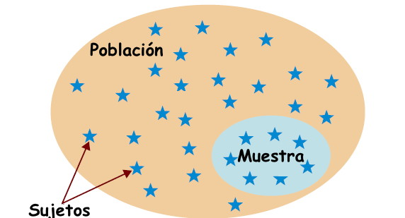
<p class="caption">(\#fig:unnamed-chunk-52)Población *versus* muestra</p>
</div>


\BeginKnitrBlock{example}<div class="example"><span class="example" id="exm:caldo"><strong>(\#exm:caldo) </strong></span>Si queremos saber si un caldo nos ha quedado soso, no nos lo bebemos todo, porque entonces nos quedaríamos sin caldo y ya no valdría la pena saber si está soso. Lo que hacemos es probar solo una cucharada. El caldo es la población, la cucharada la muestra. A partir del sabor de la cucharada, "estimamos" cómo nos ha quedado el caldo. 

</div>\EndKnitrBlock{example}


En general, una **población** es simplemente un conjunto de individuos u objetos (genéricamente, de **sujetos**) sobre los que queremos conocer alguna información. Esta población puede estar perfectamente definida en un lugar y tiempo: por ejemplo, los empadronados en Mallorca a día de hoy. Pero normalmente su definición será difusa. Si, por ejemplo, queremos estimar algo sobre "los españoles mayores de 65 años", ¿de quiénes estamos hablando exactamente? ¿De los que están vivos justo ahora? ¿De todos los que ha  habido en España desde su fundación? ¿Incluimos los que aún no han nacido?

Tranquilos, no nos vamos a romper mucho la cabeza con esto. Pero al menos tenéis que ser conscientes de que una población puede contener sujetos que en realidad no existen ni hayan existido ni vayan a existir, sino simplemente que "podrían existir". Y en medicina especialmente, cuando queremos estimar si un tratamiento será efectivo para tratar una cierta enfermedad... incluyendo los casos que aún no han contraído la enfermedad. Hablaremos entonces de una población **virtual** (en otros lugares la califican de población **metafórica**).

Por ejemplo, cuando decimos que 

> "La probabilidad de que salga Cara al lanzar una moneda equilibrada es 1/2", 

lo que significa es que 

> "Si tomamos la población formada por todos los posibles lanzamientos de todas las posibles monedas equilibradas, en la mitad de sus miembros el resultado es Cara."

Los miembros de esta población son todos los "posibles" lanzamientos de monedas equilibradas, los que se han realizado a lo largo de la historia, los que se realizarán en el futuro, y los que se podrían haber realizado o se podrían realizar en el futuro pero en realidad no han tenido lugar ni lo tendrán.


Otro ejemplo. Imaginad que comparamos las notas que (vosotros, estudiantes de primer curso del grado de Medicina de la UIB de este año académico) sacáis en dos cuestionarios diferentes sobre un mismo tema, uno sobre conceptos y el otro de cálculos, y que en el primero obtenéis una nota media mucho mayor que en el segundo. Inferimos que los estudiantes de primer curso de Medicina sacan de media mejor nota en tests de conceptos que en tests calculísticos. ¿Quiénes son estos "estudiantes de primer curso de Medicina"?  ¿Sobre qué población "inferimos" información a partir de este resultado? 

No sobre solo vosotros y para estos dos tests concretos, ya que entonces no estamos infiriendo nada, simplemente calificamos, constatamos que una nota media ha sido más alta que la otra, y paramos aquí. 


La población a la que querríamos generalizar los resultados podría ser  la de "todos los posibles estudiantes como vosotros que estuvieran cursando una asignatura como esta", que como veis ni está del todo bien definida ni ciertamente está formada exclusivamente por "individuos" que existan, o que hayan existido o que necesariamente vayan a existir. Naturalmente, esta población virtual la resumiremos en "los estudiantes de primer curso de Medicina".

Hasta ahora hemos hablado de la población, a menudo virtual, sobre la que queremos obtener información. Está será nuestra **población objetivo**, que hay que distinguir de la **muestra**:

* **Población objetivo**: un conjunto de sujetos con una o varias características sobre las que deseamos obtener información.

* **Muestra**:  el grupo de los sujetos concretos en los que medimos las características de interés.


\BeginKnitrBlock{example}<div class="example"><span class="example" id="exm:unnamed-chunk-53"><strong>(\#exm:unnamed-chunk-53) </strong></span>Una serie de 10 lanzamientos de una moneda equilibrada concreta es una muestra de la población de "los posibles lanzamientos de monedas equilibradas".

</div>\EndKnitrBlock{example}


\BeginKnitrBlock{example}<div class="example"><span class="example" id="exm:unnamed-chunk-54"><strong>(\#exm:unnamed-chunk-54) </strong></span>¿Y vosotros qué sois: una población o una muestra? Pues depende:

* Sois una población cuando lo que nos interesa es saber algo sobre **vosotros** y solo vosotros. 

* Sois una muestra si a partir de información sobre vosotros miramos de inferir información sobre **un grupo más grande de sujetos**:
  
    * Sobre los estudiantes de primer curso de Medicina en España
    * Sobre los estudiantes de la UIB de este curso
    * Sobre los jóvenes europeos
    * Sobre los mamíferos bípedos
    * Sobre ...

</div>\EndKnitrBlock{example}


\BeginKnitrBlock{rmdrecordau}<div class="rmdrecordau">Procurad tener siempre presente que, por mucho cuidado que pongamos en obtener una muestra de una población, numca será más que una aproximación imperfecta de esta.</div>\EndKnitrBlock{rmdrecordau}


Si podemos medir todos los individuos de la población objetivo, no nos hace falta usar estadística inferencial para intentar adivinar lo que queremos saber sobre la población: lo medimos sobre todo el mundo y ya está. Pero lo más normal es que no podamos medir todos los individuos de la población.

* La población puede ser demasiado grande. Por ejemplo, si queremos calcular la altura media de los europeos que hoy tienen 18 años, es prácticamente imposible medirlos todos.

* Como ya hemos comentado, la población puede ser **virtual** en el sentido de que puede contener miembros que en este momento ni existan. 

* Puede ser que para obtener la información de un sujeto lo tengamos que sacrificar. En este caso, para medir toda la población la tendríamos que exterminar.

* Puede ser simplemente que sea difícil acceder a toda la población: por ejemplo, los estudiantes de la UIB son relativamente pocos, unos 12000, pero sería complicado conseguir medirlos todos.


A la hora de determinar la validez de un estudio, es muy importante comparar la población objetivo con la:

* **Población muestreada**: el conjunto de sujetos (**unidades de observación**, en el sentido de la sección anterior) del que se extrae la muestra. 


<div class="figure" style="text-align: center">
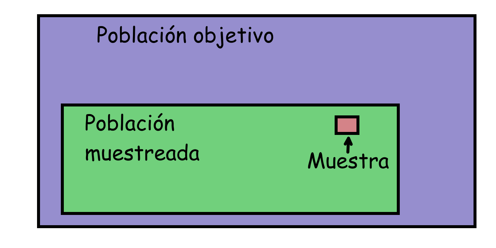
<p class="caption">(\#fig:muestra)Población objetivo, población muestrada y muestra.</p>
</div>

En la mayoría de las ocasiones, la población muestreada será un subconjunto de la población objetivo definido por una serie de restricciones, pero puede no serlo: pensad, por ejemplo, en los estudios ecológicos, donde la población objetivo son individuos y la población muestreada son grupos de individuos.

\BeginKnitrBlock{example}<div class="example"><span class="example" id="exm:tuberculosisrusia"><strong>(\#exm:tuberculosisrusia) </strong></span>Dad un vistazo al artículo ["Risk factors for pulmonary tuberculosis in Russia: case-control study"](https://www.bmj.com/content/332/7533/85.short)
(R. Coker *et al*, *British Medical Journal*  332 (2006), pp. 85-87). Su objetivo es "Determinar los factores de riesgo para la tuberculosis pulmonar en Rusia". Por lo tanto:
</div>\EndKnitrBlock{example}

* La **población objetivo** es toda la población de Rusia.

Ahora bien, la muestra se tomó solo entre los adultos de la ciudad de [Samara](https://es.wikipedia.org/wiki/Samara) y durante 2003. Por lo tanto:

* La **población muestreada** fueron los adultos que vivían en Samara en 2003.

Finalmente, leemos que los casos fueron todos los adultos de esta ciudad diagnosticados de tuberculosis pulmonar a los que se administró un  DOTS (Tratamiento Acortado Directamente Observado), en total 334. Como controles se tomó al azar el mismo número de personas entre la población adulta  de la ciudad sin historial de tuberculosis.

* La **muestra** fueron estas 668 personas.


\BeginKnitrBlock{example}<div class="example"><span class="example" id="exm:Hola"><strong>(\#exm:Hola) </strong></span>Para conocer la opinión de sus lectores sobre la familia real española, una conocida revista del corazón propuso una encuesta en línea en su web y analizó las respuestas. En este **estudio transversal**:
</div>\EndKnitrBlock{example}

* La **población objetivo** es la formada por "los lectores de esta revista".
* La **población muestreada** es la formada por los lectores  de esta revista con acceso a Internet el año en que se realizó la encuesta. 
* La **muestra** son los miles de personas concretas que voluntariamente respondieron la encuesta.

En el Ejemplo \@ref(exm:tuberculosisrusia), puede que la población muestreada no fuera representativa de **toda** Rusia. Los habitantes de una de las ciudades más pobladas de Rusia, a unos 1500 km al sudeste de Moscú, ¿son representativos de los habitantes de una aldea perdida en mitad de la nada siberiana? Pues no lo sabemos, pero creemos que no. Además, la muestra de casos tampoco representa el colectivo de tuberculosos de Samara, puesto que solo se reclutaron los que reunían las condiciones para un tratamiento concreto (los tuberculosos con frotis bucal negativo a veces no se incluyen en un programa DOTS).

En el Ejemplo \@ref(exm:Hola) está más claro que la población muestreada no es representativa de la población objetivo: seguramente excluye, por ejemplo, los lectores ancianos o los de zonas rurales con acceso difícil a Internet. Por otro lado, la muestra es aún más restrictiva, ya que los participantes fueron voluntarios, y sus características pueden ser diferentes de las de los lectores que prefirieron no opinar sobre este tema (nunca se sabe si el CNI vigila...)  o de las de los lectores que nunca responden encuestas.


Si la población muestreada no es representativa de la población objetivo, los resultados del estudio no tienen por qué poderse generalizar a esta última: diremos entonces  que se ha dado un **sesgo de falta de  representatividad**. Hablaremos sobre sesgos en la Sección \@ref(sec:sesgos).

\BeginKnitrBlock{example}<div class="example"><span class="example" id="exm:unnamed-chunk-56"><strong>(\#exm:unnamed-chunk-56) </strong></span>Al escogeros a vosotros como una muestra de la población de estudiantes de primer curso de Medicina, podríamos entender como población muestreada, por ejemplo, la de  "los estudiantes que  este año académico  cursan primer curso de Medicina en una universidad española". Seguramente esta población muestreada tiene características muy diferentes de las de los estudiantes que hace 40 años cursaron primer curso de Medicina en una universidad española, o de las de los estudiantes que este año académico cursan primer curso de Medicina en una universidad estadounidense.
</div>\EndKnitrBlock{example}

Un estudio médico toma información sobre una muestra de individuos y la generaliza a una población objetivo. Si nos ha interesado leerlo, seguramente será porque su población objetivo contiene, o al menos está relacionada con, la población que nos interesa a nosotros. Pero la muestra habrá sido tomada de una población muestreada que no tiene por qué coincidir con nuestra población de interés.  Es muy importante poder decidir entonces si las conclusiones a las que se llega en el estudio se pueden aplicar o no a nuestra población. No es el objetivo de este curso el que podáis tomar esta decisión, ya que no va de estadística sino de la experiencia médica que aún os falta. Pero sí que al menos seáis conscientes de que un resultado  estimado para una población puede no ser extrapolable a otra población.


\BeginKnitrBlock{example}<div class="example"><span class="example" id="exm:unnamed-chunk-57"><strong>(\#exm:unnamed-chunk-57) </strong></span>En el estudio ["D-dimer as a biomarker for disease severity and mortality in COVID-19 patients: a case control study"](https://link.springer.com/article/10.1186/s40560-020-00466-z)(Y. Yao *et al*, *Journal of Intensive Care*  8:49 (2020)) se compararon diversas características clínicas, analíticas y radiológicas entre los pacientes que fallecieron (17 en total) y los que no fallecieron (231) en un grupo de pacientes de COVID-19 tratados en el hospital Renmin de la Universidad de Wuhan. Su objetivo era determinar qué características aumentaban el riesgo de defunción entre los enfermos de COVID-19. 

Se encontró una asociación estadísticamente significativa entre  tener un nivel de dímero D en sangre muy alto, superior a 2 mg/l, y un aumento en el riesgo de [*exitus*](https://es.wikipedia.org/wiki/Exitus). Querríamos decidir si esta asociación también es válida para nuestros pacientes.

</div>\EndKnitrBlock{example}

¿Cuál es el problema? Pues que la población objetivo  del estudio es la de todos los enfermos de COVID-19, pero según el artículo la población muestreada fue la de "pacientes con al menos dos síntomas de COVID-19 y PCR positiva tratados en ese hospital concreto de Wuhan". Así que de entrada, los infectados con un solo síntoma quedan excluidos, por muy grave que sea ese síntoma. Además, habría que valorar si la población asignada a ese hospital se parece o no a la balear. Por ejemplo, la tasa de letalidad de la COVID-19 entre el grupo de pacientes examinados fue del 6.85%, mientras que en las Baleares en esa misma época era de alrededor del 2.4%, aunque este  dato refiere al total de infectados, incluyendo los asintomáticos. También habría que valorar si la asociación observada se debe a algún confundidor. Por ejemplo, la edad media de los sujetos de la muestra con niveles elevados de dímero D era  más alta que la de los que tenían un nivel normal, y la COVID-19 es más letal entre los ancianos. ¿Será la edad un factor de confusión en este estudio?   

\BeginKnitrBlock{rmdexercici}<div class="rmdexercici">En el artículo ["Tuberculosis treatment survival of HIV positive TB patients on directly observed treatment short-course in Southern Ethiopia: A retrospective cohort study"](https://bmcresnotes.biomedcentral.com/articles/10.1186/1756-0500-5-682) (D. Shaweno, *BMC Research Notes* 5:682 (2012)) se quiso estudiar si  la infección por VIH afecta la supervivencia a corto plazo de pacientes con tuberculosis (TB). Para ello, se consideraron todos los pacientes que habían participado en un estudio previo: se trataba de pacientes diagnosticados de TB durante el periodo 2006-2010 a los que se prescribió un tratamiento concreto de quimioterapia de 8 meses de duración y que además pasaron un test de VIH en el momento del diagnóstico positivo de TB. De este grupo de pacientes,  se escogieron al azar un subgrupo de 370 VIH-positivos y otro de 370 VIH-negativos, y se anotó el número de pacientes de cada subgrupo que fallecieron  durante los 8 meses que duraba el tratamiento. La conclusión fue que la tasa de mortalidad entre los paciente de TB VIH-positivos es mayor que entre los que son VIH-negativos.


*(a)* ¿Cuáles son la población objetivo, la población muestreada y la muestra? 

*(b)* ¿Creéis que la población muestreada es representativa de la población objetivo?
</div>\EndKnitrBlock{rmdexercici}


## Tipos básicos de muestreo {#sec:muestreo}

En un estudio estadístico inferencial, se toma una **muestra** de individuos de una **población** y se estiman algunas características de la población a partir de las de la muestra. Para que esto tenga sentido, es necesario que la muestra sea razonablemente **representativa** de la población. Pero, claro, sin conocer las características de la población, no podemos saber si una muestra es representativa o no. 

Para salir de este *impasse*, la solución comúnmente aceptada es tomar una muestra **aleatoria**, es decir, escogiendo sus sujetos de alguna manera al azar. Al hacerlo así:

* Se evitan preferencias en la elección, por lo que es más probable que la muestra sea representativa de la población Naturalmente, esto no está garantizado: por pura mala suerte nos puede salir una muestra súper rara, es lo que tiene el azar.
Pero al menos hemos hecho "lo que todo el mundo considera que es lo que hay que hacer" para intentar que sea representativa.


<div class="figure" style="text-align: center">
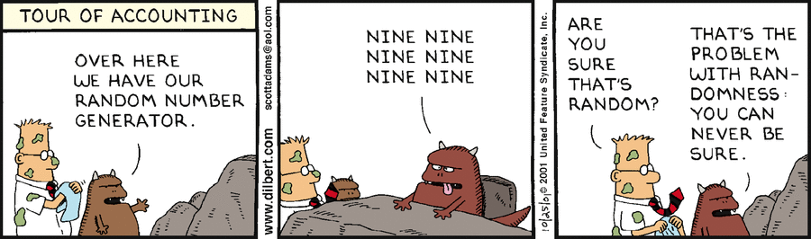
<p class="caption">(\#fig:unnamed-chunk-59) http://dilbert.com/strip/2001-10-25</p>
</div>

* Se pueden usar técnicas estadísticas que  permiten acotar errores en la estimación y su probabilidad; por ejemplo, que permite calcular la probabilidad de que nuestra muestra sea súper rara en algún sentido concreto.

\BeginKnitrBlock{example}<div class="example"><span class="example" id="exm:unnamed-chunk-60"><strong>(\#exm:unnamed-chunk-60) </strong></span>Para probar el caldo, antes de tomar una cucharada lo removemos bien. De este modo esperamos que las moléculas del caldo se organicen de manera aleatoria dentro de la olla y que la cucharada que tomemos sea representativa del caldo.

</div>\EndKnitrBlock{example}

Existen muchos métodos de **muestreo**. A continuación describimos algunos  de forma breve.

### Muestreo aleatorio con y sin reposición {#sec:mas}

El **muestreo aleatorio** consiste en seleccionar una muestra de la población de manera que todas las muestras del mismo tamaño sean **equiprobables**; es decir, que si fijamos el número de individuos de la muestra, cualquier conjunto de ese número de individuos tenga la misma probabilidad de ser seleccionado.  

Hay que distinguir entre dos tipos   de muestreo aleatorio: **con** y **sin reposición**.   Para ilustrarlos, supongamos que disponemos de una urna con 100 bolas numeradas del 1 al 100, de la que queremos extraer una muestra de 15 bolas. La Figura \@ref(fig:base) representa dicha urna.

<div class="figure" style="text-align: center">

<p class="caption">(\#fig:base)Una urna de 100 bolas.</p>
</div>

Una manera de hacerlo sería repetir 15 veces el proceso de sacar una bola de la urna, anotar su número y devolverla a la urna. El tipo de muestra obtenida de esta manera recibe el nombre de **muestra aleatoria con reposición**, o **muestra aleatoria simple**. Observad que con este procedimiento una misma bola puede aparecer varias veces en una muestra, y que todos los subconjuntos de 15 bolas "con posibles repeticiones"  tienen la misma probabilidad de obtenerse. Un posible resultado serían las bolas azules de la Figura \@ref(fig:simple); la bola azul más oscuro ha sido escogida dos veces en la muestra.


<div class="figure" style="text-align: center">
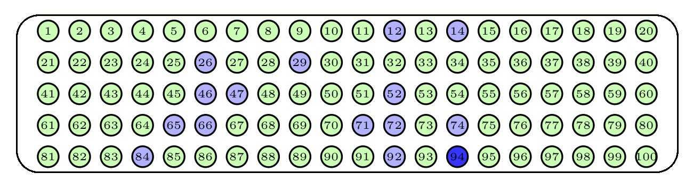
<p class="caption">(\#fig:simple)Una muestra aleatoria simple.</p>
</div>

Otra manera de extraer nuestra muestra sería repetir 15 veces el proceso de sacar una bola de la urna  pero ahora sin devolverla. Esto es equivalente a extraer de golpe 15 bolas de la urna. Estas muestras no tienen bolas repetidas, y cualquier selección de 15 bolas diferentes tiene la misma probabilidad de ser la obtenida.  En este caso se habla de una **muestra aleatoria sin reposición**. Un posible resultado serían las bolas azules de la Figura \@ref(fig:sinrep).

<div class="figure" style="text-align: center">

<p class="caption">(\#fig:sinrep)Una muestra aleatoria sin reposición.</p>
</div>


Cuando **el tamaño de la población es muy grande en relación al de la muestra**, como suele suceder en medicina, la probabilidad de que haya repeticiones en una muestra aleatoria simple es muy pequeña. Por ejemplo:

* Si escogemos 100 individuos de las Baleares (que tiene alrededor de 1,150,000 habitantes) al azar permitiendo repeticiones, la probabilidad de que se escoja más de una vez algún individuo es de 0.004: solo en 1 de cada 250 muestras de 100 individuos de las Baleares elegidos al azar permitiendo repeticiones habría alguna repetición.

* Si escogemos 100 estudiantes de la UIB (que tiene alrededor de 12000 estudiantes) al azar permitiendo repeticiones, la probabilidad de que se escoja más de una vez algún individuo es de 0.339: en  algo más de 1 de cada 3 muestras de 100 estudiantes de la UIB elegidos al azar permitiendo repeticiones habría alguna repetición. 

     En cambio, si escogemos **10** estudiantes de la UIB al azar permitiendo repeticiones, la probabilidad de que se escoja más de una vez algún individuo ya es de 0.004.

\BeginKnitrBlock{rmdnote}<div class="rmdnote">Ya daremos el detalle de cómo se calculan todas estas probabilidades en el Tema \@ref(chap:probst).</div>\EndKnitrBlock{rmdnote}


Esto nos permite considerar que, cuando la población es mucho más grande que la muestra,  los muestreos aleatorios con y sin reposición son **equivalentes** en el sentido siguiente: puesto que si la población es muy, muy grande, una muestra aleatoria con reposición tendría casi seguro  todos los elementos diferentes, podemos tomar directamente la muestra sin reposición y aceptar que permitíamos repeticiones, pero que no se han dado y que por tanto la muestra es simple. 

* Una muestra aleatoria de 100 individuos de las Baleares diferentes, o de 10 estudiantes diferentes de la UIB, puede pasar perfectamente por una muestra tomada permitiendo repeticiones, porque aunque las permitiéramos, solo obtendríamos alguna repetición en una de cada 250 ocasiones.

* Pero en cambio ya es difícil de creer que una muestra aleatoria de 100 estudiantes diferentes de la UIB haya sido tomada permitiendo repeticiones, porque en una de cada tres muestras tomadas permitiendo repeticiones nos saldría alguna repetición.

El muestreo aleatorio simple es el *estándard de excelencia* entre los métodos de muestreo, y la mayoría de los resultados que explicaremos en este curso presuponen que la muestra ha sido tomada aleatoria con reposición. Pero casi nunca es factible hacerlo. El motivo es que para poder tomar una muestra aleatoria de una población en el sentido de este apartado, con o sin reposición,  es necesario disponer de una lista completa de todos sus individuos  para poder sortear a quién vamos a seleccionar. Esto no siempre es posible. ¿Alguien tiene la  lista completa de, pongamos, todos los diabéticos de España? ¿Que incluya los que no saben que lo son? Por lo tanto, en la vida real no siempre podemos tomar muestras aleatorias en este sentido.

### Muestreo sistemático {#sec:sist}

Una manera muy sencilla de obtener una muestra de una población cuando disponemos de una lista ordenada de sus individuos y nos da pereza efectuar un sorteo es tomarlos a intervalos constantes: uno de cada cinco individuos, uno de cada diez... Podemos añadir un componente aleatorio escogiendo al azar el primer individuo que elegimos, y a partir del cual empezamos a contar. A esta técnica se la llama **muestreo sistemático**   o **a intervalos**, añadiendo el adjetivo **aleatorio** si además el primer sujeto se escoge de manera aleatoria. 

Así, por ejemplo, si de una clase de 100 estudiantes quisiéramos escoger una muestra de 10, podríamos elegir un estudiante al azar, y a partir de él, por orden alfabético, elegir el décimo estudiante, el vigésimo, el trigésimo, etc.; si al llegar al final de la lista de clase no hubiéramos completado la muestra, volveríamos al principio de la misma. 

La Figura \@ref(fig:sist) describe una muestra aleatoria sistemática de 15 bolas de nuestra urna de 100 bolas: hemos empezado a escoger por la bola roja oscura, que ha sido elegida al azar, y a partir de ella hemos tomado las bolas a intervalos de 7, volviendo al principio cuando hemos llegado al final de la lista numerada.


<div class="figure" style="text-align: center">

<p class="caption">(\#fig:sist)Una muestra aleatoria sistemática.</p>
</div>


Cuando no disponemos de una lista de toda la población pero sí que tenemos una manera de acceder de manera ordenada a sujetos de la misma (por ejemplo, enfermos que acuden a un hospital), podemos realizar un muestreo sistemático tomando los sujetos a intervalos constantes a medida que los encontramos y hasta completar el tamaño deseado de la muestra. Por ejemplo, para escoger una muestra de 10 pacientes que hayan acudido a Urgencias por traumatismos en la cabeza, podríamos escoger pacientes a intervalos regulares de entre los que acudieran a Urgencias por este motivo  hasta llegar a los 10.

   
### Muestreo aleatorio estratificado {#sec:estr}

Este método de muestreo se utiliza cuando la población está clasificada en  **estratos** que son de interés para la propiedad que se estudia. Estos estratos serán grupos de individuos definidos por una característica concreta, de manera que individuos del mismo estrato tengan esa característica en común (los estratos sean **homogéneos** internamente) y individuos de estratos diferentes tengan esa característica diferente (los estratos sean **heterogéneos** externamente). Por ejemplo: sexos, franjas de edad, provincias, casos y controles...

En este caso, se toma una muestra aleatoria de un tamaño prefijado de cada estrato (en el sentido de la Sección \@ref(sec:mas))  y se unen en una muestra global. A este proceso se le llama **muestreo aleatorio estratificado**.  

Por lo que refiere a los tamaños de las muestras de cada estrato, se suele optar por una de las dos estrategias siguientes: 

* Imponer que la composición por estratos de la muestra global mantenga las proporciones de la población original, de manera que el tamaño de la muestra de cada estrato represente el mismo porcentaje del total de la muestra que el estrato correspondiente en la población completa. 

* Tomar los tamaños de manera que los estratos que representen una fracción muy pequeña de la población (tan pequeña que no esperaríamos que tuvieran representación en una muestra aleatoria  **transversal** de la población, es decir, tomada del total de la población sin tener en cuenta su composición en estratos) tengan una representación en la muestra mucho mayor que la que les tocaría. 


<div class="figure" style="text-align: center">
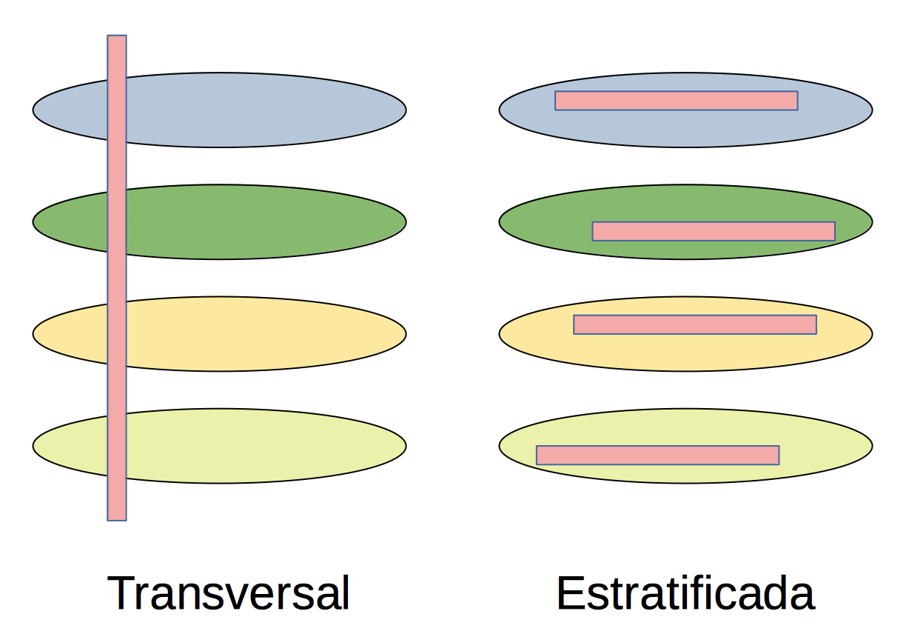
<p class="caption">(\#fig:unnamed-chunk-62)Muestra transversal *versus* estratificada</p>
</div>

Por ejemplo, los estratos podrían ser grupos de edad y podríamos tomar la muestra de cada grupo de edad de tamaño proporcional a la fracción que representa dicho grupo de edad en la población total. O podrían ser los sexos y procuraríamos que nuestra muestra estuviera formada por un 50% de hombres y un 50% de mujeres. O, en las Islas Baleares, los estratos podrían ser las islas, y entonces podríamos  imponer que el número de representantes de cada isla en la muestra fuera proporcional a su población relativa dentro del conjunto total de la Comunidad Autónoma, o podríamos tomar la misma cantidad de individuos de cada isla, independientemente de su población.


\BeginKnitrBlock{rmdnote}<div class="rmdnote">Cuando en un estudio de casos y controles escogemos un grupo de casos y uno de controles de tamaños prefijados, o  cuando en un estudio de cohorte escogemos un grupo de expuestos y uno de no expuestos de tamaños prefijados, se trata de una muestra estratificada, aunque no siempre será aleatoria.</div>\EndKnitrBlock{rmdnote}

Por continuar con nuestra urna de 100 bolas, supongamos que contiene 40 bolas de un color y 60 de otro color según muestra la Figura \@ref(fig:estratprevi).


<div class="figure" style="text-align: center">

<p class="caption">(\#fig:estratprevi)Nuestra urna ahora tiene dos  estratos.</p>
</div>
 
Para tomar una muestra aleatoria estratificada de 15 bolas, considerando como estratos los dos colores e imponiendo que la muestra refleje la composición de la urna, tomaríamos una muestra aleatoria de 6 bolas del primer color y una muestra aleatoria de 9 bolas del segundo color. De esta manera, los porcentajes de colores en la muestra serían los mismos que en la urna. La Figura \@ref(fig:estrat) describe una muestra obtenida de esta manera.


<div class="figure" style="text-align: center">

<p class="caption">(\#fig:estrat)Una muestra aleatoria estratificada.</p>
</div>
 
 
 
La ventaja del muestreo aleatorio estratificado respecto del transversal es que, como el investigador escoge una muestra de cada estrato de la población del tamaño que  considera adecuado:

* Permite estimar la información de interés para cada estrato por separado, como si se tratara de  estudios independientes. 

* Permite estimar la información sobre subpoblaciones minoritarias que en una muestra aleatoria transversal aparecerían  subrepresentadas.

En todo caso, el muestreo por estratos solo es necesario si esperamos que las características que queremos estudiar varíen según el estrato. Por ejemplo, si queremos tomar una muestra para estimar la altura media de los españoles adultos y no creemos que la altura de un español adulto dependa de su provincia de origen, no hay ninguna necesidad de esforzarse en tomar una muestra de cada provincia de manera que todas estén representadas adecuadamente en la muestra.

Observad que el muestreo aleatorio por estratos tiene el mismo inconveniente que el muestreo aleatorio de la Sección  \@ref(sec:mas): es necesario disponer de una lista completa de  los individuos de cada estrato para poder sortearlos.


\BeginKnitrBlock{rmdexercici}<div class="rmdexercici">Tenemos una población clasificada en dos estratos, A y B. La subpoblación A representa un 20% de la población y la B el 80% restante. Hemos tomado una muestra aleatoria estratificada formada por 100 sujetos de cada subpoblación. Hemos medido una cierta característica  X de estos sujetos. La media de los valores de X de los sujetos A ha dado 5 y la media de los valores de X de los sujetos B ha dado 10.

*(a)* ¿Qué vale la media de los valores de X de toda la muestra de 200 sujetos?

*(b)* A partir de estos datos, ¿qué estimáis que vale la media de X en el total de la población?
    </div>\EndKnitrBlock{rmdexercici}


### Muestreo por conglomerados {#sec:mcluster}

El proceso de obtener una muestra aleatoria en algunos casos es caro o difícil, incluso aunque dispongamos de la lista completa de la población. Imaginad que quisiéramos estudiar la prevalencia y gravedad de la miopía entre los estudiantes de Primaria de las Baleares.  Para ello  tendríamos que seleccionar una muestra representativa de esta población de escolares. Seguramente, con algo de esfuerzo, podríamos disponer de su lista completa para este curso y por lo tanto podríamos tomar una muestra aleatoria, pero entonces acceder a las niñas y niños que la formasen seguramente significaría  visitar muchos centros de primaria para entrevistar unos pocos alumnos de cada uno. Esto volvería el proceso lento y costoso. Y eso si consiguiéramos la lista completa de alumnos.

Una alternativa posible sería, en vez de elegir una muestra aleatoria de todos los estudiantes de Primaria, escoger primero al azar unas pocas aulas de primaria de colegios de las Baleares, a las que llamamos en este contexto **conglomerados** o **clústers**, y formar entonces nuestra muestra con todos los alumnos de estas aulas. Estaréis de acuerdo en que es mucho más fácil disponer de la lista completa de estudiantes de unas pocas aulas que conseguir la lista completa de todos los estudiantes de la Comunidad, y mucho más cómodo ir a unos pocos colegios a entrevistar grupos enteros que ir a muchos colegios a entrevistar a unos pocos estudiantes en cada uno. 

En un **muestreo aleatorio por conglomerados** o **clústers**, tenemos la población repartida en pequeños grupos, los clústers, y lo que hacemos es elegir al azar una muestra  de  clústers y tomar todos los individuos de los  clústers elegidos.


Volviendo de nuevo a nuestra urna, supongamos que sus 100 bolas se agrupan en 20 conglomerados de 5 bolas cada uno según las franjas verticales de la Figura \@ref(fig:clustprevi) (donde mantenemos la clasificación en dos colores para poder comparar el resultado del muestreo por conglomerados con el estratificado).


<div class="figure" style="text-align: center">

<p class="caption">(\#fig:clustprevi)Nuestra urna ahora tiene 2 estratos y 20 clústers.</p>
</div>

Para obtener una muestra aleatoria por conglomerados de tamaño 15, escogeríamos al azar 3 conglomerados y la muestra estaría formada por todas sus bolas.  La Figura \@ref(fig:clust) describe una muestra obtenida de esta manera: los conglomerados escogidos están marcados en azul.


<div class="figure" style="text-align: center">

<p class="caption">(\#fig:clust)Una muestra aleatoria por conglomerados.</p>
</div>


A menudo una vez elegidos los clústers no se toman todos los sujetos de los mismos, sino una muestra aleatoria de cada uno. Esto ya sería un ejemplo de muestreo **polietápico** (Sección \@ref(sec:poli)).

El muestreo por conglomerados se suele elegir por ser rápido de realizar, pero puede tener un inconveniente: puede que los sujetos de cada clúster  tiendan a parecerse los unos a los otros,  lo que puede sesgar la muestra. Cuando este método de muestreo es más efectivo es cuando se espera que los clústers sean heterogéneos en este sentido. En nuestro ejemplo de los niños de primaria de las Baleares, es más creíble que las clases sean heterogéneas por lo que refiere a la miopía que en lo referente a comportamientos en los que influya la pertenencia a un grupo, por ejemplo la series de TV preferidas.


\BeginKnitrBlock{rmdimportant}<div class="rmdimportant">Revisemos la diferencia entre el muestreo estratificado y el muestreo por conglomerados:

* **Muestreo estratificado**:
    * Los estratos forman una clasificación de los sujetos de la población en grupos grandes definidos por una característica que consideramos relevante en el estudio estadístico. Por ejemplo, el sexo o la franja de edad.

    * Se escoge una muestra de cada estrato.

* **Muestreo por conglomerados**:

    * Los conglomerados forman una clasificación de los sujetos de la población en grupos pequeños definidos por una característica que en principio es irrelevante en el estudio estadístico. Por ejemplo, la manzana donde viven o el médico de familia al que están asignados.

    * Se escogen algunos conglomerados y se forma la muestra con todos sus miembros.
</div>\EndKnitrBlock{rmdimportant}

### Muestreos no aleatorios   {#sec:oport}

Cuando la selección de la muestra no es aleatoria, se habla de  **muestreo no aleatorio**. En realidad es el tipo más frecuente de muestreo porque casi siempre nos tenemos que conformar con los sujetos disponibles.  Por ejemplo, en la UIB, para estimar la opinión que de un profesor tienen los alumnos de una clase, solo se tiene en cuenta las respuestas de los estudiantes que voluntariamente  rellenan la encuesta de opinión,  que de ninguna manera forman una  muestra aleatoria: el perfil del estudiante que responde voluntariamente una encuesta de este tipo es muy específico y no viene determinado por el azar. En este caso se trataría de una **muestra auto-seleccionada**. 

Otro tipo de muestras no aleatorias son las **oportunistas**. Este es el caso, por ejemplo, si para estimar la opinión que de un profesor tienen los alumnos de una asignatura se visita un día la clase y se pasa la encuesta a los estudiantes que ese día asistieron a clase. De nuevo, puede que los alumnos presentes no sean representativos del alumnado de la asignatura (pueden ser los más aplicados, o los menos enfermizos, o los no repetidores). 

La Figura \@ref(fig:oport) describe una muestra oportunista de nuestra urna: sus 15 primeras bolas. 

<div class="figure" style="text-align: center">

<p class="caption">(\#fig:oport)Una muestra oportunista.</p>
</div>


**Las técnicas de estadística inferencial no se pueden aplicar a muestras no aleatorias**. Pero normalmente solo podemos conseguir muestras no aleatorias. En este caso, lo que se suele hacer es describir en detalle las características de la muestra para justificar que, pese a no ser aleatoria, es razonablemente representativa de la población y podría pasar por  aleatoria. Por ejemplo, la muestra oportunista anterior de nuestra urna no es de ninguna manera representativa de su contenido por lo que refiere al color de las bolas.


\BeginKnitrBlock{rmdexercici}<div class="rmdexercici">Para conocer la opinión de los estudiantes de Medicina españoles sobre un tema concreto, os la pido a vosotros. ¿Qué tipo de muestreo he realizado de los explicados hasta ahora?</div>\EndKnitrBlock{rmdexercici}

### Muestreo polietápico {#sec:poli}

En el ejemplo de los estudiantes de Primaria, la muestra final de estudiantes estaba formada por todos los de los grupos elegidos. Otra opción podría haber sido, tras seleccionar la muestra aleatoria de grupos, entrevistar solo una muestra aleatoria de estudiantes de cada uno. Otro ejemplo: algunos estudios poblacionales a nivel estatal se realizan solamente en algunas provincias escogidas aleatoriamente, en las que luego se encuesta una muestra aleatoria de habitantes. Los dos son ejemplos de **muestreos polietápicos**, en los que la muestra no se obtiene en un solo paso, sino mediante diversas elecciones sucesivas. 

La Figura \@ref(fig:poli) muestra un ejemplo sencillo de muestreo polietápico de nuestra urna: hemos elegido al azar 5 conglomerados (marcados en azul) y de cada uno de ellos hemos elegido 3 bolas al azar sin reposición.


<div class="figure" style="text-align: center">

<p class="caption">(\#fig:poli)Una muestra polietápica.</p>
</div>

Veamos algunos ejemplos más. Recordad el estudio CORSAIB del Ejemplo \@ref(exm:corsaib). Vamos a detallar algo más  el proceso mediante el cual se eligieron los participantes:

1. Se dividieron las Baleares en 14 sectores geográficos. Se ofreció la participación a los médicos de familia para conseguir que colaborasen 3-4 médicos por sector, hasta llegar a los 50 médicos.

2. De la población adscrita a cada médico participante se obtuvo una muestra aleatoria  de 40 individuos.

Como veis, el muestreo tuvo dos etapas. En la primera se seleccionaron clústers mediante un muestreo no aleatorio estratificado: los estratos fueron los 14 sectores geográficos, los clústers elegidos estaban formados por los grupos de pacientes adscritos a los médicos de familia que voluntariamente participaron en el estudio. La segunda etapa fue un muestreo aleatorio sin reposición dentro de cada clúster.


Veamos otro ejemplo  más complicado. En el estudio ["Factors associated with risk of low folate intake among adolescents"](https://www.scielo.br/pdf/jped/v82n2/en_v82n2a08.pdf) (M. Vitolo *et al*, *Jornal de Pediatria* 82 (2006), pp. 121–126) 
los investigadores tenían que tomar una muestra de adolescentes de San Leopoldo (Brasil). Para ello:

1. En primer lugar, escogieron mediante un muestreo aleatorio sistemático varias secciones censales de las 40 que tiene la ciudad.
1. A continuación, escogieron al azar varias manzanas de cada una de estas secciones censales y una esquina de cada manzana.
1. Luego,  eligieron direcciones de cada manzana de manera sistemática: una de cada tres en sentido horario a partir de la esquina seleccionada.
1. Finalmente, se invitó a participar en el estudio a todos los habitantes de 10 a 19 años en las casas o fincas seleccionadas. El total eligible de adolescentes fueron 810, de los que aceptaron participar  722.

En este proceso, se realizaron: un muestreo sistemático (las secciones censales), dos muestreos aleatorios sin reposición (las manzanas y las esquinas), otro muestreo sistemático (las direcciones) y un muestreo no aleatorio (los voluntarios). 

Un último ejemplo. Recordad el estudio sobre enfermedades y mes de nacimiento del Ejemplo \@ref(exm:quesada), donde "se escogió al azar una muestra de 29,478 españoles". En  realidad, **no** se tomó una lista de toda la población española a 1 de enero de 2017 y se escogió al azar de manera equiprobable una conjunto de  29,478 personas, sino que se usó la muestra de la *Encuesta Nacional de Salud* de ese año, que se elige de la manera polietápica siguiente (podéis consultar [aquí](https://www.ine.es/metodologia/t15/t153041917.pdf) la metodología en detalle):

1. Se clasifican los municipios españoles en 7 tipos según su población.

2. En cada comunidad autónoma y para cada tipo de municipios, se toma una muestra aleatoria de un número de secciones censales proporcional a su población.

3. De cada sección censal elegida, se escogen un número fijo de  primeras residencias (en 2017 fueron 15) por muestreo aleatorio sistemático (y previa una ordenación específica de las viviendas según su tamaño).

4. En cada vivienda se escoge equiprobablemente un individuo adulto.

Fijaos que, en (2), se toma una muestra aleatoria estratificada de secciones censales: los estratos son las combinaciones de comunidad autónoma y tipo de municipio.

Existen otros tipos de muestreo, solo hemos explicado los más comunes. En cualquier caso, lo importante es recordar que el estudio estadístico que se realice  tiene que adaptarse al tipo de muestreo usado. Por ejemplo, no se pueden usar las mismas técnicas para analizar una muestra aleatoria simple que una muestra estratificada o una muestra por conglomerados.  En este curso nos ocuparemos casi exclusivamente del  **muestreo aleatorio simple**, es decir, al azar y con reposición, o al azar sin reposición si la población es muy grande comparada con la muestra.


\BeginKnitrBlock{rmdexercici}<div class="rmdexercici">Deseamos llevar a cabo un estudio para determinar si un diabético tipo 2  en las Baleares tiene una mayor probabilidad de infectarse de COVID-19 que una persona sin esa patología. Además, queremos poder comparar las probabilidades entre los diabéticos de Mallorca, de  Menorca y de Ibiza. Como parte del estudio, tendremos que tomar una muestra de diabéticos tipo 2 y realizarles un análisis de anticuerpos. Hemos calculado que para que las conclusiones sean fiables, necesitamos analizar 50 diabéticos de cada isla.

Explicad en detalle cómo obtendríais esta muestra de diabéticos; el procedimiento ha de ser fácil de llevar a cabo y ha de dar muestras razonablemente representativas de las poblaciones de diabéticos.
</div>\EndKnitrBlock{rmdexercici}


## Sesgos {#sec:sesgos}

Un **sesgo** es cualquier tipo de error sistemático en el diseño o la ejecución de un estudio que afecte a los datos recogidos y esto pueda perjudicar la corrección de las conclusiones obtenidas. Por ejemplo, si en un estudio transversal sobre hipertensión usamos un esfigmomanómetro que sistemáticamente mide una presión arterial más alta que la real, se produce un sesgo que hará que se detecte una prevalencia mayor de hipertensos que la real. 

Los errores que pueden dar lugar a sesgos no se han de confundir con el error aleatorio inherente a las mediciones. Por ejemplo, los errores de medición debidos a la imprecisión del esfigmomanómetro, que mide la tensión redondeando a mm Hg, o a la variación natural de la presión arterial en un individuo a lo largo del día. La estadística nos proporciona herramientas para tratar el error aleatorio, pero las fuentes de sesgo se han de eliminar al diseñar el estudio o   detectarlas al leer un estudio para valorar la validez de sus conclusiones.

Muchos autores han producido [listas larguísimas de tipos de sesgos](https://catalogofbias.org/biases/) que muestran la creatividad de los humanos a la hora de fastidiarla y de poner  nombres a las diferentes maneras de fastidiarla.  Aquí solo vamos a introducir algunos de los más comunes. [En este *url*](https://www.scientific-european-federation-osteopaths.org/los-sesgos/) encontraréis una lista algo más larga, aunque tampoco es exhaustiva.

1. **Sesgo de selección**: Se produce cuando la muestra seleccionada no es representativa de la población objetivo. Por poner un ejemplo exagerado, sería el caso si quisiéramos saber la incidencia del cáncer de ovario en una comunidad y para ello tomáramos una muestra de solo hombres. 

    Hay varios subtipos que vale la pena distinguir:
    
     a. **Sesgo de falta de representatividad**: Cuando la muestra no es representativa debido a un defecto en su obtención.
     
         Por ejemplo, una muestra formada por voluntarios que rellenen una encuesta o que se ofrezcan para que les hagan unas pruebas dolorosas a cambio de una compensación económica.
         
         Un ejemplo frecuente en medicina y con nombre propio (**sesgo de Berkson**) se produce cuando para estudiar la influencia de algunos factores de riesgo en una enfermedad, se toman tanto los casos como los controles entre pacientes hospitalizados.  Los pacientes hospitalizados tendrán unas patologías más severas que la población en general, y puede que ello se deba a que su exposición a factores de riesgo sea mayor que la de la población en general.

     b. **Sesgo de selección diferencial**: Cuando el sesgo de selección se da de manera diferente en los diferentes grupos de sujetos considerados. 
     
           Siguiendo con el ejemplo de la influencia de algunos factores de riesgo en una enfermedad que en principio no conlleve hospitalización, se daría si tomáramos los casos entre pacientes hospitalizados por otras causas y los controles entre pacientes no hospitalizados. 


     c. **Sesgo de supervivencia**: Cuando se toma una muestra de pacientes vivos de una enfermedad con una alta tasa de mortalidad. En este caso, es muy probable que la muestra incluya una proporción muy elevada de enfermos que hayan sobrevivido más de lo normal, y estos no tienen por qué ser representativos del colectivo de enfermos de esta enfermedad.
     
     
         A veces se usa el término **sesgo de supervivencia** para describir casos como el de la Fig. \@ref(fig:sesgosup): cuando solo se consideran los sujetos que han tenido éxito en algún proceso con una tasa muy baja de éxitos (es el "a mí me ha funcionado" de los anuncios de remedios milagrosos e increíbles).

<div class="figure" style="text-align: center">

<p class="caption">(\#fig:sesgosup)"Sesgo de supervivencia" (https://xkcd.com/1827/ (CC-BI-NC 2.5))</p>
</div>


2. **Sesgo de medida**: Se produce cuando el método de medición  es defectuoso en algún sentido. Incluye, por ejemplo:

     a. **Sesgo de recuerdo**: En estudios en los que recojamos la información sobre exposición por medio de entrevistas o encuestas, existe la posibilidad de que algunos encuestados hayan olvidado información, o simplemente de que mientan en temas delicados. 

     a. **Sesgo de recuerdo diferencial**: Es un caso particular del anterior. En estudios de casos y controles en los que recojamos la información sobre exposición por medio de encuestas, los casos tienen mayor tendencia a recordar su exposición a circunstancias que ellos asocien a la enfermedad que los controles. 


     c. **Sesgo de procedimiento**: Cuando el clínico analiza de manera diferente un grupo que otro. Se daría, por ejemplo, en un ensayo clínico si se llevara a cabo un seguimiento  más frecuente a los que toman un nuevo tratamiento que a los controles, por si presentan efectos secundarios inesperados.

     d. **Sesgo de detección**: Cuando se usan varios métodos con diferente sensibilidad para detectar una enfermedad o una exposición. Este sesgo también puede ser **diferencial** si los diferentes métodos se usan sobre grupos diferentes.
     
         A modo de ejemplo, se daría un sesgo de detección si para saber si los sujetos de una muestra han tomado un medicamento, a algunos se les pasa una encuesta y a otros se les consulta el historial clínico. Sería diferencial si, además, por ejemplo, los primeros fueran los participantes sanos y los segundos los enfermos.

     d. **Sesgo de atención**: Cuando los participantes en un estudio alteran su comportamiento porque saben que participan en un estudio (a veces se le llama [**efecto Hawthorne**](https://es.wikipedia.org/wiki/Efecto_Hawthorne)). 
     
          Se podría dar, por ejemplo, en un estudio sobre el efecto del ejercicio físico en la salud si los sujetos del grupo de intervención (a los que se ha asignado el hacer ejercicio físico) deciden tomar otros nuevos hábitos saludables porque saben que se les ha asignado al grupo "saludable".  El "efecto Hawthorne" refiere al nombre de una fábrica en el que se realizó un estudio sobre qué condiciones aumentaban la productividad, y todos los grupos aumentaron su productividad durante el seguimiento. Se concluyó que este aumento se debió al efecto "motivador" de ser observados porque  una vez terminó el estudio volvieron todos a su productividad normal. 
          

    e. **Sesgo de error instrumental**: Cuando los instrumentos usados para medir alguna característica son defectuosos.  Sería el caso, por ejemplo, del esfigmomanómetro del primer párrafo de esta sección.

3. **Confusión**. Se da cuando el efecto de la exposición a un riesgo A  se confunde con el de la exposición a otro factor B (el **confundidor**) que está asociado a la exposición a A y que es el verdadero causante del desenlace  X que estamos estudiando.

    Hemos explicado varios ejemplos de confundidores al hablar de los problemas de los estudios de casos y controles (Sección \@ref(sec:cyc)). Por ejemplo, la asociación entre que la madre sea fumadora y una disminución del riesgo de que el hijo tenga síndrome de Down, debida en realidad al factor de confusión dado por la edad de las madres (Ejemplo \@ref(exm:fumarDownCC)). Por poner otro ejemplo, si en un estudio se observa una asociación entre una patología durante el embarazo y un defecto en los recién nacidos, podría ser que la causa del desenlace no fuera la enfermedad de las madres sino el tratamiento que se les hubiera admninistrado relacionado con la misma.
    
    Hemos incluido la confusión en la lista de sesgos, pero su naturaleza es diferente de los anteriores. Un sesgo es un error sistemático en la recolección de datos, mientras que no tener en cuenta los posibles confundidores es un error que se puede cometer en la interpretación de los resultados. 

Hay muchos otros tipos de sesgos. No es importante en este curso saber sus nombres, de hecho ni tan siquiera de los que hemos dado aquí. Lo importante es aplicar el sentido común al leer la Metodología de un estudio para entender qué procesos podrían haber desviado los datos recogidos y cómo estos sesgos afectan las conclusiones del estudio.

\BeginKnitrBlock{example}<div class="example"><span class="example" id="exm:Hola2"><strong>(\#exm:Hola2) </strong></span>Volvamos al Ejemplo \@ref(exm:Hola), en el que explicábamos el caso de una revista del corazón que, para conocer la opinión de sus lectores sobre la familia real española,  propuso una encuesta en línea en su web. ¿Qué sesgos se pudieron dar?
  
  </div>\EndKnitrBlock{example}

**(1.a)** ¿Sesgo de falta de representatividad? Sí, claro. Los voluntarios que rellenan encuestas en Internet no tienen por qué ser representativos del total de lectores de la revista.

**(1.b)** ¿Sesgo de selección diferencial? No, porque no se eligieron dos grupos.
 
**(1.c)** ¿Sesgo de supervivencia? No, se supone que les interesaba conocer la opinión de sus lectores vivos en ese momento, ¿verdad? 

**(2.a)** ¿Sesgo de recuerdo? Sí, claro, tenemos que tenerlo en cuenta siempre que se recoja información por medio de cuestionarios o entrevistas. Los participantes podrían  haber querido dar una mejor opinión de la familia real española que la que realmente tienen para quedar bien, o hacer quedar bien a la revista.

**(2.b)** ¿Sesgo de recuerdo diferencial? De nuevo, no, porque no se eligieron dos grupos.

**(2.c,d)** ¿Sesgo de procedimiento o de detección? No, por el mismo motivo
     
**(2.e)**  ¿Sesgo de atención? No, porque no se hizo un seguimiento a los participantes, por lo que si cambiaron su comportamiento, no afectó al resultado de la encuesta. 

**(2.f)** ¿Sesgo de error instrumental? Podría ser, si el cuestionario estuviera amañado en algún sentido. A lo mejor recordáis el famoso caso de la encuesta de satisfacción de Ryanair en 2017 en la que en la pregunta sobre el grado de satisfacción con su experiencia de vuelo con ellos, las únicas respuestas que se ofrecían eran "Excelente", "Muy buena", "Buena", "Aceptable" y "OK".

\BeginKnitrBlock{rmdromans}<div class="rmdromans">No hace falta ser tan burdo a la hora de amañar un cuestionario. En una encuesta en el Reino Unido en el 2015, a la pregunta "¿Está usted de acuerdo en permitir a los jóvenes de 16 y 17 años votar en el referéndum del Bréxit?", un 52% respondió que sí y un 41% que no. Hasta ahí bien. Pero en la misma encuesta, bastantes preguntas después, se les pedía "¿Está usted de acuerdo en reducir la edad de voto de los 18 años a los 16 en el referéndum del Bréxit?", y a esa pregunta respondieron que sí el 37% y que no el 56%.</div>\EndKnitrBlock{rmdromans}


<div class="figure" style="text-align: center">
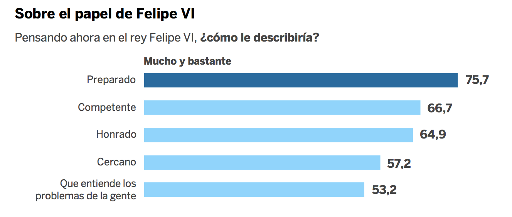
<p class="caption">(\#fig:felipe6)¿El País marcándose un Ryanair con Felipe VI? Gráfico publicado por El País  el 30/08/2020; referencia: https://elpais.com/espana/2020-08-29/los-espanoles-rechazan-la-marcha-de-juan-carlos-i-a-emiratos-arabes.html</p>
</div>


**(3)** ¿Confusión? Dado que, por así decirlo, se trataba de un estudio transversal de prevalencia, sin intentar estimar relaciones de causa-efecto, no tiene sentido preguntarse por la existencia de confundidores. Otra cosa sería si se hubiera pretendido estudiar qué características hacen que se opine mejor o peor sobre la familia real española. Entonces sí que podrían entrar en juego confundidores. Para no meternos en berenjenales, no vamos a describirlos.


\BeginKnitrBlock{rmdexercici}<div class="rmdexercici">En un famoso [estudio publicado en 1981](https://www.nejm.org/doi/full/10.1056/NEJM198103123041102) sobre la asociación entre consumo de café y cáncer de páncreas, se tomó un grupo formado por todos los pacientes diagnosticados de cáncer de páncreas entre 1974 y 1979 en once hospitales. Luego, para cada uno de estos casos, se pidió al médico que lo había diagnosticado que eligiera de entre sus pacientes hospitalizados más o menos al mismo tiempo uno o dos controles de características similares pero sin cáncer de páncreas. En total participaron  369 casos y 644 controles. A todos los participantes se les pidió información sobre su consumo de tabaco, alcohol, te y café. Por lo que refiere al café, se observó que los sujetos sin cáncer de páncreas de la muestra consumían menos café que los sujetos con cáncer, como podéis ver en la Figura \@ref(fig:macmahon).

¿Creéis que el consumo de café entre los controles es representativo de la población sin cáncer de páncreas? (Va, una pista: La mayoría de los casos de cáncer de páncreas son diagnosticados por digestólogos.) </div>\EndKnitrBlock{rmdexercici}


<div class="figure" style="text-align: center">
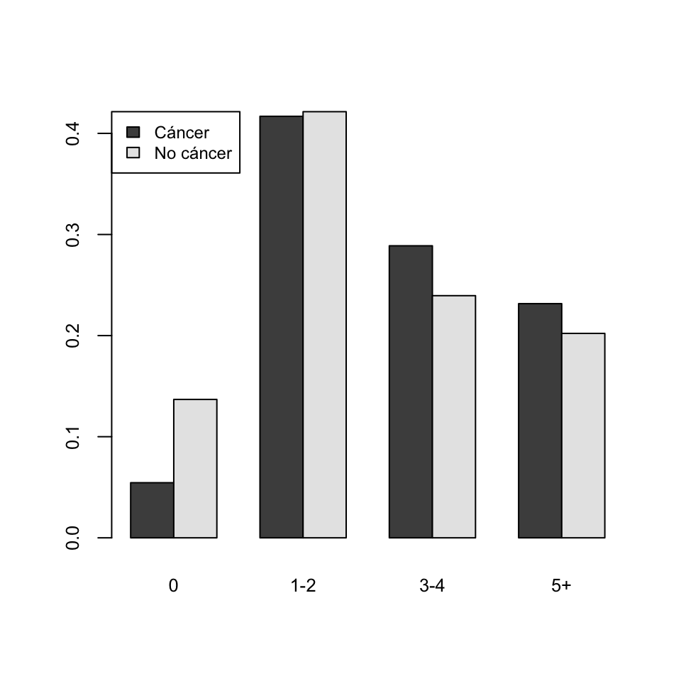
<p class="caption">(\#fig:macmahon)Proporciones de sujetos que tomaban diferentes números de tazas diarias de café en la muestra analizada por B. MacMahon *et al*, "Coffee and cancer of the pancreas".</p>
</div>

\BeginKnitrBlock{rmdexercici}<div class="rmdexercici">En un [estudio llevado a cabo en Sidney en su verano de 1989-90](https://ajph.aphapublications.org/doi/abs/10.2105/AJPH.83.12.1701) (*American Journal of Public Health* 83 (1993), pp. 1701-1706)  se quiso  determinar la asociación entre nadar en playas contaminadas y sufrir enfermedades infecciosas agudas. Para ello se visitaron durante varios días de verano doce playas de los alrededores de Sidney y se invitó a participar en el estudio a varios individuos en cada ocasión. Se excluyeron individuos que hubieran nadado o que hubieran sufrido alguna enfermedad infecciosa en algún momento durante los 7 días anteriores. A los que aceptaron participar en el estudio, se les llamó por teléfono al día siguiente para pedirles si habían nadado o no el día anterior y se les volvió a llamar al cabo de una semana para pedirles si habían sufrido alguna enfermedad infecciosa desde el día de playa. Si no contestaron a la primera llamada ya no se realizó la segunda llamada. En total se reclutaron 3989 sujetos, pero solo atendieron las dos llamadas 2968. Por otro lado, se midió el nivel de contaminación del agua de las playas los días que se reclutaron bañistas en el estudio. El resultado fue que la proporción de sujetos que sufrieron alguna enfermedad  infecciosa 
entre los que nadaron en aguas contaminadas fue un 33% mayor que entre los que nadaron en aguas no contaminadas, y  un 116% mayor que entre los que no nadaron.

*(a)* ¿De qué tipo de estudio creéis que se trata?  Justificad vuestra respuesta.

*(b)* ¿Qué sesgos se pudieron dar? ¿Cómo se podrían  evitar?
</div>\EndKnitrBlock{rmdexercici}


## Test 

**(1)** En una población se quiere determinar la prevalencia de pediculosis en niños menores de 12 años. Para ello se divide la población en barrios y en cada uno de ellos se toma una muestra aleatoria de tamaño previamente determinado. ¿De qué tipo de muestreo se trata?	

1. Muestreo aleatorio simple.
1. Muestreo aleatorio estratificado.
1. Muestreo aleatorio por conglomerados.
1. Muestreo sistemático.


**(2)** Disponemos de las listas de todos los pacientes tratados por hipertensión en todos los centros de salud de una ciudad. Cada lista está ordenada por fecha de nacimiento. Para tomar una muestra de hipertensos, escogemos dos centros de salud al azar, y de cada uno de ellos reclutamos cada décimo paciente en su lista de hipertensos. ¿Qué tipo de muestreo hemos usado?

1. Polietápico: por conglomerados tanto de los centros de salud como de los pacientes.
1. Sistemático.
1. Polietápico: por conglomerados de los centros de salud y sistemático de los pacientes.
1. Aleatorio simple.
1. Polietápico: estratificado de los centros de salud y sistemático de los pacientes.
1. Polietápico: estratificado de los centros de salud y aleatorio simple de los pacientes.

**(3)** Se ha sugerido que las mujeres que usan anticonceptivos orales acuden a revisiones ginecológicas más a menudo que las que no. Si en un estudio de cohorte retrospectivo se encontrara una asociación entre el uso de anticonceptivos orales y alguna enfermedad ginecológica, ¿a qué tipo de sesgo se podría deber?

1. Sesgo de falta de representatividad.
1. Sesgo de recuerdo.
1. Sesgo de procedimiento.
1. Sesgo de detección.
1. Sesgo de atención.
1. Ninguno de los anteriores.

**(4)** En un estudio de casos y controles para estudiar la asociación entre la radioterapia y el cáncer de tiroides, se estudiaron 50 casos ingresados por cáncer de tiroides y 100 controles ingresados durante el mismo período para el tratamiento de hernias. Se entrevistó a los casos, y de estas entrevistas y sus historiales médicos se obtuvo que 20 de ellos habían sido tratados con radioterapia previamente al desarrollo del cáncer de tiroides. Los controles no fueron entrevistados, pero una revisión de sus historiales médicos reveló que solo 2 de ellos habían estado expuestos a radioterapia en el pasado.

¿Qué tipo de sesgo es **menos** probable que esté presente en este estudio?

1. Sesgo de recuerdo.
1. Sesgo de falta de representatividad, debido a que los controles no son representativos de la población sin cáncer de tiroides
1. Sesgo de detección, debido al uso de diferentes métodos de determinación de la exposición en los casos y controles
1. Sesgo de procedimiento porque el grupo de cáncer de tiroides recibirá un seguimiento más exhaustivo por parte de los médicos que el grupo de herniados.
1. Algún confundidor no controlado que causara en los casos la enfermedad por la que recibieron radioterapia y posteriormente el cáncer de tiroides.


<!--chapter:end:03-Conceptos.Rmd-->

# (PART\*) Tema II: Probabilidades  {-}

# Probabilidades elementales: Las mates {#chap:probst}

La probabilidad de un suceso es, básicamente, un número entre 0 y 1 (o, si lo preferís, un porcentaje entre 0% y 100%) que mide la expectativa de que se dé este suceso. En este curso vamos a definir  la **probabilidad de un suceso** como la **proporción** (la **fracción**, el **porcentaje**) de sujetos de una población (o a veces de una muestra, dependerá del contexto) en los que se da el suceso. Esta proporción mide de manera intuitiva  la probabilidad de que si escogemos al azar un sujeto de la población, se dé en él el suceso (y de hecho coincide con esta probabilidad, para la definición formal de probabilidad que aquí no veremos).

\BeginKnitrBlock{example}<div class="example"><span class="example" id="exm:unnamed-chunk-71"><strong>(\#exm:unnamed-chunk-71) </strong></span>La probabilidad de que al lanzar una moneda al aire salga cara es la proporción de la población (virtual y prácticamente infinita) de lanzamientos de esta moneda en los que sale cara.

</div>\EndKnitrBlock{example}

En casos MUY sencillos, cuando **todos los resultados posibles tienen la misma probabilidad**, esta proporción coincide con la fracción de veces en que se da este suceso en el conjunto de resultados posibles y por lo tanto se puede calcular con la famosa **regla de Laplace**:
$$
\text{Probabilidad}=\frac{\text{Casos favorables}}{\text{Casos posibles}}
$$

Por ejemplo:

* La probabilidad de que salga cara al lanzar una moneda equilibrada al aire es 1/2 (casos favorables, 1; casos posibles, 2; los dos resultados tienen la misma probabilidad por definición de moneda equilibrada).

* Pero la probabilidad de que un hijo sea varón no es 1/2, aunque solo haya dos sexos anatómicos. Es la proporción de hijos varones en el total de todos los hijos, que se estima en alrededor del 51.22%.

* O más exageradamente, la probabilidad de que una mujer de entre 17 y 27 años sea miope no es 1/2, aunque solo haya dos resultados posibles: ser miope y no serlo. Esta probabilidad es la proporción de miopes en la población formada por todas las mujeres de esa franja de edad, que, en España en 2018, se estimaba en un 65.4% según un [informe de la Asociación Visión y Vida](http://visionyvida.org/informe-prevalencia-de-la-miopia-en-los-jovenes-en-espana-2018/).
 


\BeginKnitrBlock{rmdromans}<div class="rmdromans">Si lanzamos al aire dos veces seguidas una moneda equilibrada, ¿cuál es la probabilidad de que salga alguna cara?
  
Según el enciclopedista y matemático [J. d'Alembert](https://es.wikipedia.org/wiki/Jean_le_Rond_d%27Alembert) es 2/3. Su argumento era el siguiente. Si en el primer lanzamiento sale cara, ya tenemos una cara. Si sale cruz, volvemos a lanzar otra vez y miramos si sale cara o cruz. Por lo tanto, hay solo 3 resultados posibles: cara en el primer lanzamiento; cruz en el primer lanzamiento y cara en el segundo; cruz en ambos lanzamientos. De estos tres "casos posibles", solo en los 2 primeros sale alguna cara. Casos favorables partido por casos posibles: 2/3.

¿Es correcto este argumento?</div>\EndKnitrBlock{rmdromans}


La teoría matemática de las probabilidades es la que nos permite valorar lo exacta que es una estimación de un valor para una población a partir de una muestra. Por ejemplo, supongamos que elegimos al azar un grupo de 50 estudiantes de la UIB y observamos que 33 sufren de miopía. A partir de este dato, vamos a estimar que un 66% de los estudiantes de la UIB son miopes. ¿Hasta qué punto nos podemos fiar de esta estimación? La teoría de las probabilidades nos permitirá calcular la probabilidad de acertar con esta estimación más o menos un margen de error fijado.


## Álgebra de conjuntos

Vamos a repasar muy rápidamente las notaciones y las propiedades de las operaciones de conjuntos, para poder usar este lenguaje en lo que sigue. 

Sean $A$ y $B$ subconjuntos (en el contexto de la teoría de probabilidades, se los llama **sucesos**) de un conjunto $\Omega$ (nuestra **población** o, en el lenguaje de la teoría de probabilidades, el **espacio muestral**).

* $A\cup B$ es la **unión** de $A$ y $B$:  el conjunto formado por los elementos que pertenecen a $A$ o a $B$ (o a ambos).

     Corresponde a la **disjunción**  del lenguaje natural.
     
\BeginKnitrBlock{rmdimportant}<div class="rmdimportant">En este curso la disjunción "o" nunca va a ser exclusiva, salvo cuando digamos explícitamente que lo es.</div>\EndKnitrBlock{rmdimportant}
     
* $A \cap B$ es la **intersección**  de $A$ y $B$:  el conjunto formado por los elementos que pertenecen simultáneamente a $A$ y a $B$.

     Corresponde a la **conjunción**  del lenguaje natural.


* $A^c$ es el **complementario** de $A$:  el conjunto formado por los elementos de $\Omega$ que no pertenecen a $A$.

     Corresponde a la **negación**  del lenguaje natural.

* $A-B=A \cap B^c$ es  la  **diferencia** "$A$ menos $B$":  el conjunto formado por los elementos de $A$ que no pertenecen a $B$.

    Por lo tanto, $A^c=\Omega-A$.

* Diremos que $A$ y $B$ son **disjuntos**, o **incompatibles**, cuando $A\cap B=\emptyset$, donde $\emptyset$ es el **conjunto vacío**, el conjunto que no tiene elementos.

* Diremos que $A$ está **contenido**, o **incluido**, en $B$, y lo denotaremos por $A\subseteq B$, cuando todo elemento de $A$ pertenece a $B$. Para denotar que $A$ está **estrictamente contenido** en $B$ usaremos $A\subsetneq B$.

\BeginKnitrBlock{example}<div class="example"><span class="example" id="exm:unnamed-chunk-74"><strong>(\#exm:unnamed-chunk-74) </strong></span>Consideremos la población $\Omega$ formada por los estudiantes de una clase, y sean $A$ el subconjunto formado por la mujeres de esa clase y $B$ el subconjunto formado por los estudiantes de esa clase que llevan gafas.
</div>\EndKnitrBlock{example}

Entonces:


* $A\cup B$ es el conjunto de los estudiantes de la clase que son mujeres o llevan gafas.

* $A \cap B$ es  el conjunto de los estudiantes de la clase que son mujeres y llevan gafas, es decir, las mujeres de la clase que llevan gafas.

* $A^c$  es  el conjunto de los estudiantes de la clase que  no son mujeres, es decir los hombres  de la clase.

* $B^c$  es  el conjunto de los estudiantes de la clase que  no llevan gafas.

* $A-B$  es  el conjunto de las mujeres de la clase que no llevan gafas.

* $B-A$  es  el conjunto de los estudiantes de la clase que llevan gafas y no son mujeres, es decir, los hombres de la clase que  llevan gafas.

* $A$ y $B$ serán disjuntos (llevar gafas y ser mujer será incompatible en esta clase) si no hay ninguna mujer en la clase que lleve gafas.

* $A\subseteq B$ será verdad si todas las mujeres de la clase llevan gafas. 

* $B\subseteq A$ será  verdad si todos los estudiantes  de la clase que llevan gafas son mujeres. 

Las propiedades de estas operaciones son las siguientes, y se corresponden a las  propiedades de las conjunciones, disjunciones y negaciones en el lenguaje natural.

a. La unión y la intersección son **conmutativas**: $A\cup B=B\cup A$ y $A\cap B=B\cap A$.

b. La unión y la intersección son **asociativas**: $A\cup(B\cup C)=(A\cup B)\cup C$ y $A\cap(B\cap C)=(A\cap B) \cap C$.


<div class="figure" style="text-align: center">
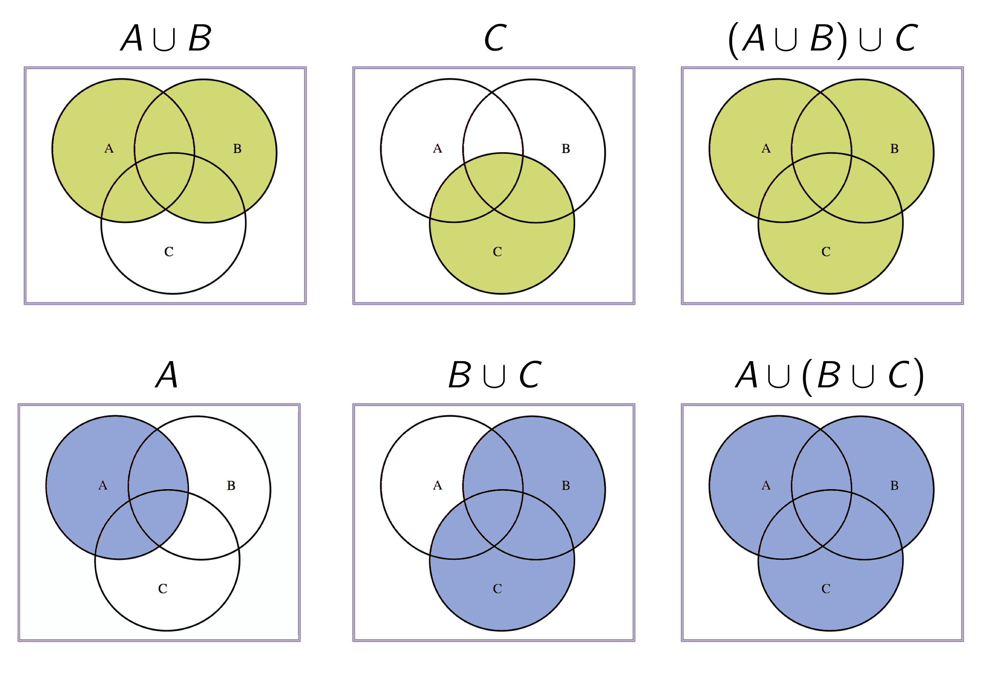
<p class="caption">(\#fig:unnamed-chunk-75)Propiedad asociativa de la unión.</p>
</div>


<div class="figure" style="text-align: center">
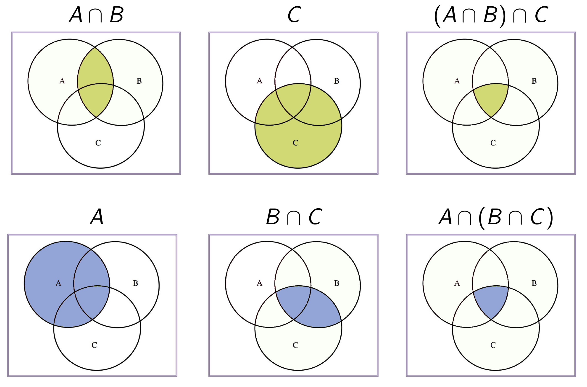
<p class="caption">(\#fig:unnamed-chunk-76)Propiedad asociativa de la intersección.</p>
</div>


c. La unión y la intersección son **distributivas**: $A\cap(B\cup C)=(A\cap B)\cup (A\cap C)$ y $A\cup(B\cap C)=(A\cup B)\cap (A\cup C)$.


<div class="figure" style="text-align: center">
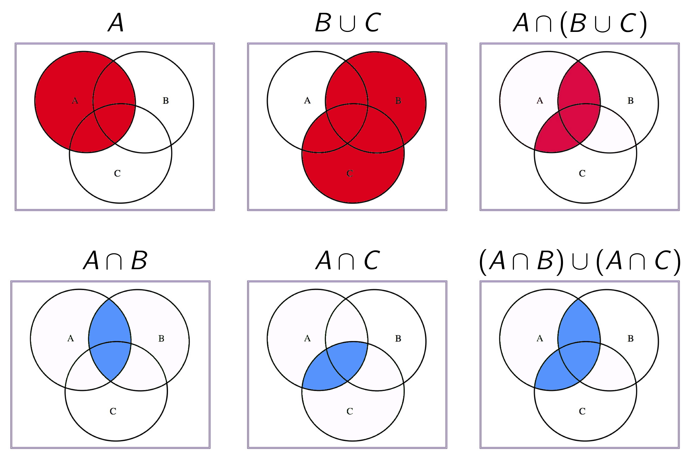
<p class="caption">(\#fig:unnamed-chunk-77)Propiedad distributiva de la unión respecto de la intersección.</p>
</div>

<div class="figure" style="text-align: center">
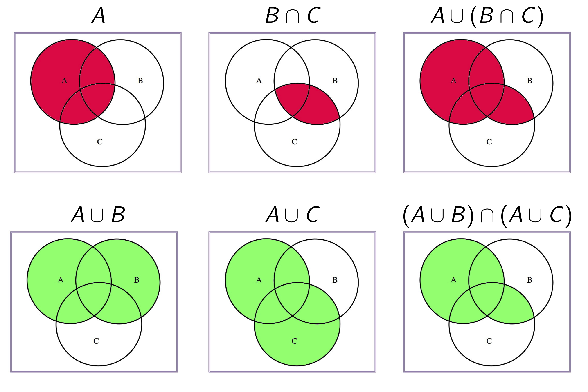
<p class="caption">(\#fig:unnamed-chunk-78)Propiedad distributiva de la intersección respecto de la unión.</p>
</div>

d. Propiedad del **doble complementario**: $(A^c)^c=A$. 

    Corresponde al hecho de que, en el lenguaje natural, "No es verdad que no lleve gafas" significa lo mismo que "Lleva gafas".

<div class="figure" style="text-align: center">

<p class="caption">(\#fig:unnamed-chunk-79)Propiedad del doble complementario.</p>
</div>

e. **Leyes de De Morgan**: $(A\cup B)^c=A^c \cap B^c$  y $(A\cap B)^c=A^c\cup B^c$. 

    La primera corresponde al hecho de que, en el lenguaje natural, lo contrario de "Ser mujer o llevar gafas" es "No ser mujer  **Y** no llevar gafas". La segunda corresponde al hecho de que, en el lenguaje natural, lo contrario de "Ser mujer y llevar gafas" es "No ser mujer  **O** no llevar gafas".

<div class="figure" style="text-align: center">
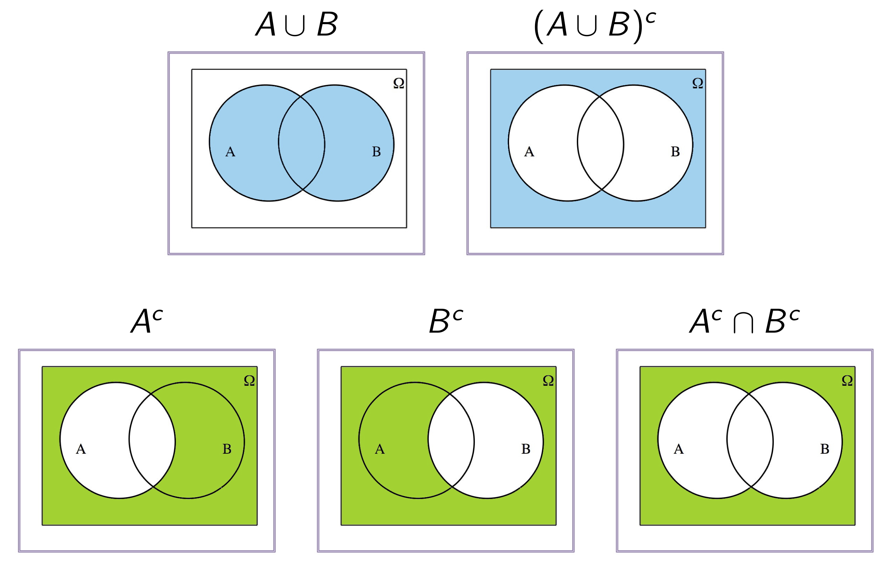
<p class="caption">(\#fig:unnamed-chunk-80)Primera ley de de Morgan.</p>
</div>

<div class="figure" style="text-align: center">
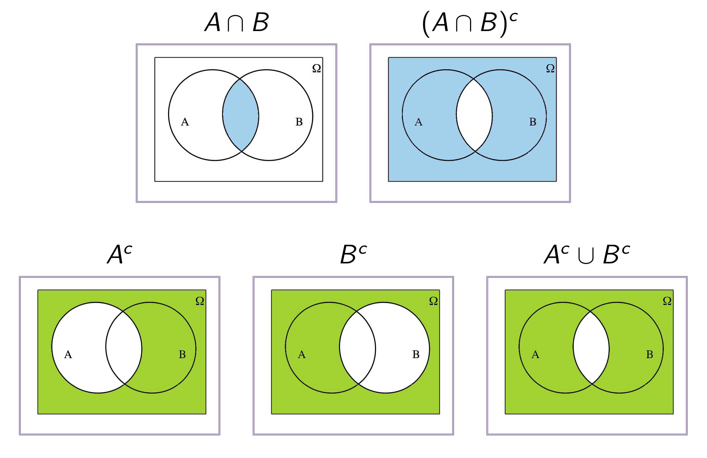
<p class="caption">(\#fig:unnamed-chunk-81)Segunda ley de de Morgan.</p>
</div>

El hecho de que la unión y la intersección sean asociativas y conmutativas nos permite escribir expresiones del estilo de
$$
A_1\cap A_2\cap \cdots \cap A_n,\qquad A_1\cup A_2\cup \cdots \cup A_n
$$
para indicar, respectivamente, la intersección o la unión de los sucesos $A_1,\ldots,A_n$ agrupándolos como queramos y en el orden que queramos.


## Algunas fórmulas básicas

Hemos definido la probabilidad $P(A)$ de un subconjunto (suceso) $A$ de una población (espacio muestral) $\Omega$ como la fracción de los sujetos de $\Omega$ que pertenecen a $A$.  A partir de esta definición se deducen, por puro conteo, las propiedades siguientes:

1. Para todo suceso $A$, $0\leqslant P(A)\leqslant 1$.

    Un subconjunto $A$ de $\Omega$ no puede representar ni una fracción negativa ni una fracción mayor que 1 de los sujetos de $\Omega$.

2. $P(\Omega)=1$ y $P(\emptyset)=0$ (recordad que $\emptyset$ es el conjunto vacío).

3. Si $A$ y $B$ son dos sucesos disjuntos, entonces $P(A\cup B)=P(A)+P(B)$.

   Si no hay ningún sujeto que pertenezca simultáneamente a $A$ y a $B$, entonces el número de sujetos que pertenecen a $A$ o a $B$ es la suma de los que pertenecen a $A$ y de los que pertenecen a $B$. Entonces, dividiendo por el número total de individuos de la población $\Omega$ (su **cardinal**), obtenemos que la fracción de los sujetos que pertenecen a $A$ o a $B$ es la suma de las fracciones de los que pertenecen a $A$ y de los que pertenecen a $B$.

4. Más en general, si $A_1,A_2,\ldots,A_n$ son sucesos disjuntos dos a dos, entonces
$$
P(A_1\cup A_2\cup \cdots \cup A_n)=P(A_1)+P(A_2)+\cdots +P(A_n).
$$

5. $P(A-B)=P(A)-P(A\cap B)$. 


    El número de sujetos que  pertenecen a $A$ pero no a $B$ se obtiene restando del total de sujetos de $A$ los que pertenecen simultáneamente a $A$ y a $B$. Dividiendo por el número total de individuos de la población, obtenemos la correspondiente igualdad de proporciones.

\BeginKnitrBlock{rmdcorbes}<div class="rmdcorbes">Formalmente, como $A-B$ y $A\cap B$ son disjuntos (ya que ningún elemento de $A-B$ pertenece a $B$ y todos los elementos de $A\cap B$ pertenecen a $B$), la propiedad (3) nos dice que 
$$
P((A-B)\cup (A\cap B))=P(A-B)+P(A\cap B).
$$
    Por otro lado, $(A-B)\cup (A\cap B)=A$ porque $A$ es la unión del conjunto de sus elementos que no pertenecen a $B$ y del conjunto de sus elementos que sí pertenecen a $B$ (Figura \@ref(fig:AmenysB)).</div>\EndKnitrBlock{rmdcorbes}

\BeginKnitrBlock{rmdcaution}<div class="rmdcaution">¡Ojo! En general, es falso que $P(A-B)=P(A)-P(B)$. Si en una población hay un 50% de mujeres y un 60% de miopes, y un 35% del total son mujeres miopes, las mujeres no miopes son un 15% del total de la población, no un -10%, ¿verdad? </div>\EndKnitrBlock{rmdcaution}


6. $P(A^c)=1-P(A)$.

    Es decir, la fracción de los sujetos que no pertenecen a $A$ es 1 menos la fracción de los que sí pertenecen a $A$.

7. Si $A\subseteq B$, entonces $P(A)\leqslant P(B)$. Si $A$ está contenido en $B$, la  fracción de los sujetos que  pertenecen a $A$ es más pequeña que la  de los que  pertenecen a $B$.


8. $P(A\cup B)=P(A)+P(B)-P(A \cap B)$.

    Si queréis contar cuántos sujetos hay en $A\cup B$, tenéis que añadir a los de $A$ los de $B-A$ (mirad la Figura \@ref(fig:AmenysB)). Dividiendo por el total de la población para pasar a proporciones, esto nos dice que
$$
P(A\cup B)=P(A)+P(B-A)=P(A)+P(B)-P(A \cap B)
$$
donde la segunda igualdad se debe a (5).
    
    Por ejemplo, si en una población hay un 50% de mujeres y un 60% de miopes, y un 35% del total son mujeres miopes, las personas que son mujeres o miopes (recordad, o ambas cosas)  forman un 75% de la población: al 50% de mujeres hay que sumarle el 25% de miopes que no son mujeres.

    
<div class="figure" style="text-align: center">
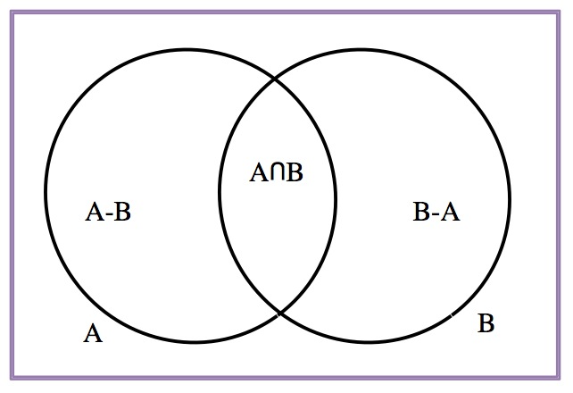
<p class="caption">(\#fig:AmenysB)Descomposición de la unión en tres conjuntos disjuntos.</p>
</div>
    
9. Otra manera de escribir la ecuación anterior es
$$
P(A\cap B)=P(A)+P(B)-P(A \cup B)
$$


\BeginKnitrBlock{rmdcaution}<div class="rmdcaution">En general, es falso que $P(A\cap B)=P(A)\cdot P(B)$. Por ejemplo, en la población con un 50% de mujeres, un 60% de miopes  y un 35% de mujeres miopes que hemos usado antes, 0.6·0.5 no es igual a 0.35.

Más adelante veremos cuándo esta igualdad es verdadera.</div>\EndKnitrBlock{rmdcaution}


\BeginKnitrBlock{example}<div class="example"><span class="example" id="exm:VIHherpes1"><strong>(\#exm:VIHherpes1) </strong></span>Supongamos que el 0.1% de todos los donantes de sangre da positivo en el test de VIH, y el 1% da positivo en el test de herpes simple (VHS). El 0.05% da positivo en ambos tests. 

¿Cuál es la probabilidad de que un donante escogido al azar dé positivo en al menos uno de los dos tests? ¿Y la de que un donante escogido al azar dé positivo en VHS pero no en VIH?
  
  </div>\EndKnitrBlock{example}

Vamos a poner nombres a los sucesos involucrados en estas preguntas:

* $A$: Dar positivo en VIH. Sabemos que $P(A)=0.001$.


* $B$: Dar positivo en VHS. Sabemos que $P(B)=0.01$.


* $A\cap B$: Dar positivo en los dos. Sabemos que $P(A\cap B)=0.0005$.


* $A\cup B$: Dar positivo en al menos uno de los dos. Es lo que queremos calcular en la primera pregunta.

    Por la propiedad (8):
$$
P(A \cup B) =P(A)+P(B)-P(A\cap B)=0.001+0.01-0.0005=0.0105
$$
    La probabilidad de que un donante escogido al azar dé positivo en al menos uno de los dos tests es del 1.05%.


* $B-A$: Dar positivo en VHS pero no en VIH. Es lo que queremos calcular en la segunda pregunta.

    Por la propiedad (5),
$$
P(B-A)=P(B)-P(A\cap B)=0.01-0.0005=0.0095
$$
    La probabilidad de que un donante escogido al azar dé positivo en VHS pero no en VIH es del 0.95%.
    
Otra manera de calcular estas probabilidades sin necesidad de recordar fórmulas sería:

* Tomar como referencia una población de un tamaño  concreto. 

* Calcular en esta población cuántos individuos pertenecen a $A\cap B$ (dan positivo en ambos tests), cuántos a $A-B$ (positivos en VIH pero no en VHS), cuántos a $B-A$ (positivos en VHS pero no en VIH) y cuántos a $A^c\cap B^c$ (negativo en ambos tests) y a partir de ahí calcular todo lo que queramos.

A este método se le suele llamar **método de frecuencias naturales** ("la cuenta de la vieja" no suena lo suficientemente científico), y así lo llamaremos nosotros. Pongámoslo en práctica en nuestro caso:

1. Vamos a tomar una población de referencia de 10,000 donantes 

    ¿Por qué este número? Veamos, fijaos en que la proporción de sujetos en $A\cap B$ es del 0.05%, es decir, 0.0005, y para facilitar los cálculos nos gustaría que todos los números que nos salieran fueran enteros, para no liarnos con decimales. Como 0.0005·10000=5, parece que 10,000 nos va a valer.

1. Los sujetos de $A$ son el 0.1% de la población: 10
1. Los sujetos de $B$ son el 1% de la población: 100
1. Los sujetos de $A\cap B$ son el 0.05% de la población: 5
1. Entonces, los sujetos de $A-B$ serán los de $A$ menos los de $A\cap B$: 5
1. Y los sujetos de $B-A$ serán los de $B$ menos los de $A\cap B$: 95
1. Por ahora ya tenemos: 5 sujetos positivos en VIH y en VHS; 5 positivos en VIH y negativos en VHS; y 95 positivos en VHS y negativos en VIH. En total, 105 sujetos. El resto serán negativos tanto en VIH como en VHS.
1. Por lo tanto, los sujetos de $A^c\cap B^c$ serán 10000-105=9895.

Obtenemos la tabla de frecuencias siguiente:
$$
\begin{array}{r|c|c|c}
& A\ (\text{VIH}+) & A^c \ (\text{VIH}-)  & \text{Total} \\ \hline
B\ (\text{VHS}+) &  5  &  95  &   100 \\ \hline
B^c\ (\text{VHS}-) &  5  &   9895  &   9900 \\ \hline 
\text{Total} & 10& 9990 & 10000  \\ 
\end{array}
$$

Y ahora, cambiando "probabilidad" por "proporción", ya podemos calcular lo que queramos.

* ¿Cuál es la proporción de sujetos que dan positivo en algún test?

    Hay 105 sujetos en la tabla que dan positivo en algún test: los 10 positivos en VIH y los 95 positivos en VHS y negativos en VIH. Por lo tanto,  su proporción es de 105/10000=0.0105.


* ¿Cuál es la proporción de sujetos que dan positivo en VHS pero no en VIH?

    Hay 95 sujetos en la tabla que dan positivo en VHS y negativo en VIH, por lo que su proporción es de 95/10000=0.0095.


\BeginKnitrBlock{rmdexercici}<div class="rmdexercici">Seguimos en la situación anterior: el 0.1% de todos los donantes de sangre da positivo en el test de VIH, el 1% da positivo en el test de herpes, y el 0.05% da positivo en los dos tests.

¿Cuál es la probabilidad de que un donante escogido al azar dé positivo en un solo test?</div>\EndKnitrBlock{rmdexercici}


\BeginKnitrBlock{rmdexercici}<div class="rmdexercici">Supongamos ahora que el 0.1% de todos los donantes de sangre da positivo en el test de VIH, el 1% da positivo en el test de herpes y el 1.07% da positivo en al menos uno de los dos tests. 

¿Cuál es la probabilidad de que un donante escogido al azar dé positivo en ambos tests? ¿Y la de que dé positivo en un solo test?</div>\EndKnitrBlock{rmdexercici}


\BeginKnitrBlock{rmdexercici}<div class="rmdexercici">Y supongamos ahora que el 0.1% de todos los donantes de sangre da positivo en el test de VIH, el 1% da positivo en el test de herpes y el 1.2% da positivo en al menos uno de los dos tests. 

¿Cuál es la probabilidad de que un donante escogido al azar dé positivo en ambos tests? ¿Y la de que dé positivo en un solo test?</div>\EndKnitrBlock{rmdexercici}


<div class="figure" style="text-align: center">

<p class="caption">(\#fig:unnamed-chunk-88)¡Cuidado con lo que respondéis!</p>
</div>


\BeginKnitrBlock{example}<div class="example"><span class="example" id="exm:repes"><strong>(\#exm:repes) </strong></span>En la Sección \@ref(sec:mas) hemos dado las probabilidades de que se escoja más de una vez algún individuo en algunas situaciones. Por ejemplo, si escogemos 100 individuos de las Baleares (suponiendo que su población es de 1,150,000 habitantes) al azar permitiendo repeticiones. ¿Cómo se calculan estas probabilidades?
  
  </div>\EndKnitrBlock{example}

Vamos a suponer que escogemos los individuos uno tras otro. El plan va a ser calcular primero la probabilidad $p$ de que todos los individuos de la muestra sean diferentes. Entonces, la probabilidad de que salga al menos uno repetido será $1-p$.

Como, en el muestreo aleatorio simple, todos los grupos de 100 baleares (con posibles repeticiones) tienen la misma probabilidad de ser elegidos, podemos usar la fórmula de Laplace "casos favorables partido por casos posibles" para calcular $p$. Solo hay que identificar cuántos casos favorables y cuántos casos posibles hay.

* *Casos favorables*. ¿De cuántas maneras podemos elegir 100 baleares, uno tras otro, de manera que todos sean diferentes? 

    * El primero puede ser cualquiera: hay 1,150,000 posibilidades.
    * Una vez hemos elegido el primero, como el segundo ha de ser diferente, puede ser cualquiera de los 1,149,999 restantes.
    * Una vez hemos elegido los dos primeros, como el tercero ha de ser diferente de ellos, lo podemos escoger de los 1,149,998 restantes.
    * En general, cuando hemos elegido *n* sujetos, el siguiente puede ser cualquiera de los 1,150,000-*n* restantes.
    * Y así, cuando hemos elegido los 99 primeros, para el último, el centésimo, tenemos 1,150,000-99=1,149,901 posibilidades.
    
Por lo tanto hay 
$$
1150000\times 1149999\times 1149998\times \cdots\times 1149901
$$
posibles elecciones de 100 baleares **diferentes**.


* *Casos posibles*. ¿De cuántas maneras podemos elegir 100 baleares, uno tras otro, sin ninguna restricción? 

    * El primero puede ser cualquiera: hay 1,150,000 posibilidades.
    * Una vez hemos elegido el primero, como el segundo puede ser cualquiera, de nuevo tenemos 1,150,000 posibilidades para él.
    * Una vez hemos elegido los dos primeros, como el tercero puede ser cualquiera, seguimos teniendo 1,150,000 posibilidades.
    * En general, cuando hemos elegido *n* sujetos, para el siguiente volvemos a tener 1,150,000 posibilidades.
    
Por lo tanto hay 
$$
\overbrace{1150000\times 1150000\times 1150000\times \cdots\times 1150000}^{100}=1150000^{100}
$$
posibles elecciones de 100 baleares sin ninguna restricción.

Por la fórmula de Laplace, la probabilidad $p$ de que al elegir al azar 100 baleares nos salgan todos diferentes es
$$
p=\frac{1150000\times 1149999\times\cdots\times 1149901}{1150000^{100}}
$$
y, finalmente, la probabilidad de que al elegir al azar 100 baleares nos salga alguno repetido es
$$
1-p=1-\frac{1150000\times 1149999\times\cdots\times 1149901}{1150000^{100}}
$$
Naturalmente, os va a costar calcular este número con una calculadora científica sencilla, pero para eso están los ordenadores. Da 0.0042952.

Comprobad que las otras probabilidades de repeticiones anunciadas en la lección anterior son correctas.


## Odds

En algunos contextos, las probabilidades se presentan en forma de **odds**  (la traducción más común en castellano es [**momios**](https://es.wikipedia.org/wiki/Apuesta_deportiva#Momios_o_Cuotas_Deportivas), pero se usan otras: posibilidades, oportunidades, ocasiones...). Las **odds** de un suceso $A$ son
$$
\text{Odds}(A)=\frac{P(A)}{P(A^c)}=\frac{P(A)}{1-P(A)}.
$$
Nos dicen cuántas veces es más probable $A$ que "no $A$".


<div class="figure" style="text-align: center">

<p class="caption">(\#fig:catmummies)Momios de gatitos en el British Museum (fotografía de M. Sánchez).</p>
</div>


Si $\text{Odds}(A)=q$, significa que **por cada vez que ocurre "no $A$", ocurre  $q$ veces $A$**. Por ejemplo, si las *odds* de suspender una asignatura son 2/3, significa que:

* Por cada estudiante que aprueba, hay 2/3 de estudiante que suspenden.
* Por cada 3 estudiantes que aprueban, hay 2 que suspenden.
* De cada 5 estudiantes, 3 aprueban y 2  suspenden.
* 2 de cada 5 estudiantes suspenden.
* La **probabilidad** de suspender es de un 40%.

\BeginKnitrBlock{rmdnote}<div class="rmdnote">A veces, que unas *odds* valgan $a/b$ se expresa diciendo que son $a\!:\!b$, y se lee "$a$ a $b$". Por ejemplo, las *odds* de suspender anteriores son 2:3, es decir, 2 a 3.</div>\EndKnitrBlock{rmdnote}

\BeginKnitrBlock{example}<div class="example"><span class="example" id="exm:unnamed-chunk-91"><strong>(\#exm:unnamed-chunk-91) </strong></span>Algunos ejemplos de *odds* a partir de probabilidades:

* Si $P(A)=0.2$, $\text{Odds}(A)=0.2/0.8=0.25$.
* Si $P(A)=0$, $\text{Odds}(A)=0$.
* Si $P(A)=0.5$, $\text{Odds}(A)=1$.
* Si $P(A)=1$, $\text{Odds}(A)=\infty$.
</div>\EndKnitrBlock{example}

Como son un cociente de dos probabilidades, las *odds* de un suceso son siempre mayores o iguales que 0  y pueden tomar cualquier valor entre 0 e $\infty$.


\BeginKnitrBlock{rmdexercici}<div class="rmdexercici">Si lanzamos un dado equilibrado de 10 caras numeradas del 0 al 9:

1. ¿Qué valen  las *odds* de sacar un 3? 

1. ¿Qué valen  las *odds* de sacar un múltiplo de 3?</div>\EndKnitrBlock{rmdexercici}

Si sabemos las *odds* de $A$, podemos calcular la probabilidad $P(A)$:
$$
\begin{array}{rl}
\text{Odds}(A)=\dfrac{P(A)}{1-P(A)}\!\!\!\! & \Longrightarrow \text{Odds}(A)-\text{Odds}(A)P(A)=P(A)\\ 
& \Longrightarrow P(A)=\dfrac{\text{Odds}(A)}{1+\text{Odds}(A)}
\end{array}
$$

Por lo tanto, dos sucesos tienen la misma probabilidad si, y solo si, tienen las mismas *odds*.


Observad que la función
$$
y=\frac{x}{1+x}
$$
es creciente en $x$:

<div class="figure" style="text-align: center">

<p class="caption">(\#fig:unnamed-chunk-93)Gráfica de la curva y=x/(1+x).</p>
</div>

Por lo tanto 
$$
\text{Odds}(A)>\text{Odds}(B)\Longleftrightarrow P(A)>P(B)
$$
Es decir, $A$ es más probable que $B$ si, y solo si, las *odds* de $A$ son mayores que las de $B$.

Como veremos en la Sección \@ref(sec:riesgosCyC), la manera correcta de presentar los resultados en los estudios de casos y controles es en forma de *odds ratios*. La  **odds ratio** (**razón de momios**, de oportunidades...) de dos sucesos $A$ y $B$ es el cociente de sus *odds*:
$$
\text{OR}(A,B)=\frac{\text{Odds}(A)}{\text{Odds}(B)}
$$
Es decir, $\text{OR}(A,B)$ nos dice cuántas veces son mayores (o menores) las *odds* de $A$ que las de $B$. Su valor es difícil de interpretar en términos de probabilidades excepto por lo que refiere a su relación con 1:

*  $\text{OR}(A,B)=1\Longleftrightarrow \text{Odds}(A)=\text{Odds}(B) \Longleftrightarrow P(A)=P(B)$

* $\text{OR}(A,B)>1\Longleftrightarrow \text{Odds}(A)>\text{Odds}(B) \Longleftrightarrow P(A)>P(B)$

* $\text{OR}(A,B)<1\Longleftrightarrow \text{Odds}(A)<\text{Odds}(B) \Longleftrightarrow P(A)<P(B)$


Pero, por ejemplo
$$
\text{OR}(A,B)=2 \Longleftrightarrow \text{Odds}(A)= 2\cdot \text{Odds}(B) \hspace{1.2ex}
\not\hspace{-1.2ex}\Longleftrightarrow P(A)=
2\cdot P(B)
$$

\BeginKnitrBlock{rmdcorbes}<div class="rmdcorbes">En general, si $\text{OR}(A,B)=q$, es decir,  $\text{Odds}(A)=q\cdot\text{Odds}(B)$, entonces
$$
\begin{array}{l}
P(A)=\dfrac{\text{Odds}(A)}{1+\text{Odds}(A)}=\dfrac{q\cdot\text{Odds}(B)}{1+q\cdot\text{Odds}(B)}\\
\qquad =\dfrac{q\cdot\frac{ P(B)}{1-P(B)}}{1+q\cdot\frac{P(B)}{1-P(B)}}=\dfrac{q\cdot  P(B)}{1-P(B)+q\cdot P(B)}\\
\qquad=\dfrac{q\cdot P(B)}{1+(q-1)P(B)}
\end{array}
$$
y por lo tanto la relación entre $P(A)$ y $P(B)$ es complicada.</div>\EndKnitrBlock{rmdcorbes}

\BeginKnitrBlock{example}<div class="example"><span class="example" id="exm:unnamed-chunk-95"><strong>(\#exm:unnamed-chunk-95) </strong></span>En un [estudio de casos y controles reciente](https://www.gastrojournal.org/article/S0016-5085(20)30490-X/fulltext) (Y. Nobel *et al*, *Gastroenterology* 159 (2020), pp. 373-375) se afirma que
</div>\EndKnitrBlock{example}

> "la presencia de síntomas gastrointestinales se asoció a un incremento del 70% en el riesgo de dar positivo [en el test de COVID-19]:  odds ratio, 1.7."


¿Qué significa esto? Que la *odds ratio* valga 1.7 significa que las *odds* de dar positivo en COVID-19 si se tienen síntomas gastrointestinales son 1.7 veces las de dar positivo si no se tienen síntomas gastrointestinales, es decir un 70% mayores. Pero fijaos que estamos hablando de las *odds*, no del **riesgo** entendido en sentido de **probabilidad**. No tiene por qué ser cierto que la probabilidad de dar positivo en COVID-19 si se tienen síntomas gastrointestinales  sea un 70% mayor que si no se tienen síntomas gastrointestinales.

En este estudio concreto, se obtuvo la tabla de frecuencias siguiente (SG abrevia "síntomas gastrointestinales")
$$
\begin{array}{r|c|c|c}
& \text{COVID-19 } + & \text{COVID-19 } - & \text{Total}\\ \hline
\text{SG Sí} & 97&	63 & 160\\\hline
\text{SG No}  & 181 &	175 & 356\\\hline
\text{Total} & 278 & 238 &  316
\end{array}
$$

Por lo tanto, la proporción de COVID-19 positivos entre los que tuvieron síntomas gastrointestinales fue 97/160=0.606 y   la proporción de COVID-19 positivos entre los que no tuvieron síntomas gastrointestinales fue 181/356=0.508. Como 0.606/0.508=0.19, la primera es un 19% mayor que la segunda, no un 70% mayor.

Veamos las *odds*. Las de ser COVID-19 positivo entre los que tuvieron síntomas gastrointestinales son
$$
\frac{97/160}{63/160}=1.54
$$
Las de ser COVID-19 positivo entre los que no tuvieron síntomas gastrointestinales son
$$
\frac{181/356}{175/356}=1.03
$$
La *odds ratio* es, entonces 1.54/1.03=1.495. 

\BeginKnitrBlock{rmdromans}<div class="rmdromans">¿Pero no habíamos dicho que la *odds ratio* les había salido 1.7? </div>\EndKnitrBlock{rmdromans}

Bueno, sí, hemos mentido. Lo que les da 1.7 es la "odds ratio ajustada", que no hemos definido y de la que con suerte hablaremos a final de curso.

\BeginKnitrBlock{rmdexercici}<div class="rmdexercici">1. ¿Qué valen las *odds* de sacar 3 caras en 3 lanzamientos de una moneda equilibrada?

1. Si un suceso pasa 2 veces de cada 10 veces que puede pasar, ¿qué valen sus *odds*?

1. Si las *odds* de $A$ son 1/2, ¿qué vale $P(A)$?

1.  Si $\text{OR}(A,B)=0.5$ y $P(A)=1/2$, ¿qué vale $P(B)$?

1. Sí $\text{OR}(A,B)=0.5$ y $P(A)=3/4$, ¿qué vale $P(B)$?</div>\EndKnitrBlock{rmdexercici}


## Probabilidad condicionada

Dados dos sucesos $A$ y $B$, con $P(A)>0$, la **probabilidad de $B$ condicionada a $A$**  es 
$$
P(B|A)=\frac{P(A\cap B)}{P(A)}
$$

Este valor  representa la fracción  de los sujetos de $A$ que pertenecen a  $B$; es decir,  es la probabilidad de que si ocurre $A$, entonces también ocurra $B$.

\BeginKnitrBlock{rmdnote}<div class="rmdnote">Supongamos que en una población $\Omega$ de $N$ individuos hay $M_A$ que pertenecen a $A$, y que entre estos hay $M_{\textit{AB}}$ que también pertenecen a $B$. Entonces, la fracción de sujetos de $A$ que pertenecen a $B$ es 
$$
\frac{M_{\textit{AB}}}{M_A}=\frac{M_{\textit{AB}}/N}{M_A/N}.
$$
En la fracción de la derecha, el numerador $M_{\textit{AB}}/N$ es la proporción de sujetos de $\Omega$ que pertenecen a $A\cap B$, es decir,  $P(A\cap B)$, y el denominador $M_A/N$  es la proporción de sujetos de $\Omega$ que pertenecen a $A$, es decir $P(A)$. </div>\EndKnitrBlock{rmdnote}


\BeginKnitrBlock{example}<div class="example"><span class="example" id="exm:mujergafas"><strong>(\#exm:mujergafas) </strong></span>Supongamos que en una clase de 20 hombres y 30 mujeres, 15 hombres y 18 mujeres llevan gafas. La tabla de frecuencias correspondiente es

</div>\EndKnitrBlock{example}


$$
\begin{array}{r|c|c|c}
& \text{Gafas} & \text{No gafas} & \text{Total}\\ \hline
\text{Mujeres} & 18 &12  & 30\\ \hline
\text{Hombres} & 15 & 5 & 20 \\ \hline
\text{Total} & 33 & 17 &  50 \\ 
\end{array}
$$

1. ¿Cuál es la probabilidad de que un estudiante sea mujer?

Como hay 30 mujeres de un total de 50 estudiantes, esta probabilidad es  30/50=0.6
    
2. ¿Cuál es la probabilidad de que un estudiante lleve gafas?

Como hay 33 estudiantes con gafas de un total de 50 estudiantes, esta probabilidad es  33/50=0.66


3. ¿Cuál es la probabilidad de que un estudiante sea mujer y lleve gafas? 

Como la probabilidad de ser mujer es 0.6 y la probabilidad de llevar gafas es 0.66, la probabilidad de ser mujer y llevar gafas es el producto: 0.6·0.66=0.396.
    
\BeginKnitrBlock{rmderror}<div class="rmderror">**¡No!** En general, la probabilidad de la intersección NO es el producto de las probabilidades.</div>\EndKnitrBlock{rmderror}

Volvamos a intentarlo. Como hay 18 mujeres que llevan gafas de un total de 50 estudiantes, esta probabilidad es  18/50=0.36


4. ¿Cuál es la probabilidad de  que una mujer lleve gafas?

Como hay 18 mujeres que llevan gafas de un total de 30 mujeres, esta probabilidad es  18/30=0.6. Fijaos que este valor es igual a
$$
P(\text{gafas}|\text{mujer})=\frac{P(\text{mujer y gafas})}{P(\text{mujer})}=\frac{18/50}{30/50}=\frac{18}{30}
$$

5. Escogemos un estudiante al azar. ¿Cuál es la probabilidad de que si es mujer, entonces lleve gafas?

Es la misma pregunta que la anterior, por lo que la respuesta es la misma: 18/30=0.6.


6. ¿Cuál es la probabilidad de que un estudiante que lleve gafas sea mujer?

Como hay 18 mujeres que llevan gafas de un total de 33 estudiantes que lleven gafas, esta probabilidad es  18/33=0.545. Fijaos, de nuevo, que este valor es igual a
$$
P(\text{mujer}|\text{gafas})=\frac{P(\text{mujer y gafas})}{P(\text{gafas})}=\frac{18/50}{33/50}=\frac{18}{33}
$$

7. Escogemos un estudiante al azar. ¿Cuál es la probabilidad de si lleva gafas, entonces sea mujer?

Es la misma pregunta que la anterior, por lo que la respuesta es la misma: 18/33.


\BeginKnitrBlock{rmdimportant}<div class="rmdimportant">No confundáis:

* $P(B)$: La probabilidad de que un individuo de la población global $\Omega$ pertenezca a $B$.

     Por ejemplo, si $B$ es "llevar gafas", $P(B)$ es la probabilidad de que una persona  lleve gafas. La población en la que calculamos probabilidades es la de todas las personas.

* $P(B|A)$: Probabilidad de que un individuo de $A$ pertenezca a $B$.

     Por ejemplo, si además $A$ es "ser mujer", $P(B|A)$ es la probabilidad de que una **mujer**  lleve gafas. La población en la que calculamos probabilidades es la de las **mujeres**.
     
* $P(A|B)$: Probabilidad de que un individuo de $B$ pertenezca a $A$.

     Por ejemplo, con las notaciones anteriores, $P(A|B)$ es la probabilidad de que una persona que lleva gafas sea mujer. La población en la que calculamos probabilidades es la de  **las personas que llevan gafas**.

* $P(B\cap A)$: Probabilidad de que un individuo de la población global pertenezca simultáneamente a $A$ y a $B$.
      
     Por ejemplo, con las notaciones anteriores, $P(A\cap B)$ es la probabilidad de que una persona   **sea mujer y lleve gafas**. La población en la que calculamos probabilidades vuelve a ser  la de todas las personas.</div>\EndKnitrBlock{rmdimportant}


\BeginKnitrBlock{rmdexercici}<div class="rmdexercici">En una universidad, los alumnos se distribuyen de la manera siguiente por tipos de estudios y sexos:
$$
\begin{array}{r|c|c|c|c|c}
\text{Estudio} & \text{Ciencias} & \text{Derecho} & \text{Educación} & \text{Otros} &  \text{Total}\\ \hline
\text{Hombres} & 1200 & 1300 &  300 & 2000 & 4800\\ \hline
\text{Mujeres} & 1400 & 600 & 1600 & 1600 & 5200\\ \hline
\text{Total} & 2600  &1900 & 1900 &  3600 & 10000\\  
\end{array}
$$

Si escojo un estudiante al azar, ¿cuál es la probabilidad de que:

a. Sea hombre o mujer?
a. Sea mujer?
a. Esté matriculado en Ciencias?
a. No esté matriculado en Ciencias?
a. Sea mujer o esté matriculado en Derecho?
a. Sea mujer y esté matriculada en Derecho?
a. Sea mujer pero no esté matriculada en Derecho?
a. Si está matriculado en Educación, sea mujer?
a. Si es mujer, esté matriculada en Educación?
a. Si es mujer, no esté matriculada en Educación?
a. Si no es mujer, esté matriculado en Educación?
</div>\EndKnitrBlock{rmdexercici}


La probabilidad condicionada a $A$, $P(-|A)$, es una probabilidad "de verdad", simplemente hemos cambiado la población de $\Omega$ a $A$. Es decir, en vez de trabajar con proporciones de la población total $\Omega$, trabajamos con proporciones de  la subpoblación definida por los sujetos de $A$. Por lo tanto, $P(-|A)$ satisface todas las propiedades de las probabilidades. Por ejemplo, se cumple que:

* $P(B^c|A)=1-P(B|A)$
* $P(C-B|A)=P(C|A)-P(B\cap C|A)$
* $P(B\cup C|A)=P(B|A)+P(C|A)-P(B\cap C|A)$

\BeginKnitrBlock{rmdcaution}<div class="rmdcaution">Pero si en $P(B|A)$ fijamos la $B$ y permitimos que $A$ varíe (es decir, si fijamos el suceso que nos interesa y variamos la población en la que calcularemos su probabilidad), ya no se cumplen las propiedades de las probabilidades. Por ejemplo, en general:

* $P(B|A^c)\neq 1-P(B|A)$
  
  No podéis esperar que la proporción de hombres que llevan gafas sea 1 menos la proporción de mujeres que llevan gafas, ¿verdad?
  
* $P(B|A_1\cup A_2)\neq P(B|A_1)+P(B|A_2)-P(B|A_1\cap A_2)$

**Ejercicio**: Comprobadlo en el Ejercicio anterior.</div>\EndKnitrBlock{rmdcaution}

\BeginKnitrBlock{example}<div class="example"><span class="example" id="exm:unnamed-chunk-103"><strong>(\#exm:unnamed-chunk-103) </strong></span>Supongamos que un 15% de los adultos son hipertensos, un 25% de los adultos creen que son hipertensos, y un 9% de los adultos son hipertensos y creen que lo son.

* Si un adulto cree que es hipertenso, ¿cuál es la probabilidad de que lo sea? 
* Si un adulto es hipertenso, ¿cuál es la probabilidad de que crea que lo es? 
* Si un adulto no cree que sea hipertenso, ¿cuál es la probabilidad de que sí lo sea?
  
  </div>\EndKnitrBlock{example}

Pongamos nombres a los sucesos involucrados en estas preguntas:

* $A$: Ser hipertenso; $P(A)=0.15$ 

* $B$: Creer ser hipertenso; $P(B)=0.25$

* $A\cap B$: Ser hipertenso y creerlo; $P(A \cap B)=0.09$

En la primera pregunta nos piden la probabilidad  de $A$ condicionada a $B$:
$$
P(A|B)=\frac{P(A\cap B)}{P(B)}=\dfrac{0.09}{0.25}=0.36
$$
Si un adulto cree ser hipertenso, su probabilidad de que lo sea es del 36%.


En la segunda pregunta nos piden la probabilidad  de $B$ condicionada a $A$:
$$
P(B|A) =\frac{P(A\cap B)}{P(A)}=\frac{0.09}{0.15}=0.6
$$
Si un adulto es hipertenso, su probabilidad de que crea que lo es es del 60%.

Y en la tercera pregunta nos piden la probabilidad de $A$ condicionada a $B^c$:
$$
P(A|B^c) =\frac{P(A\cap B^c)}{P(B^c)}=\frac{P(A)-P(A\cap B)}{1-P(B)}=\frac{0.06}{0.75}=0.08
$$
Si un adulto no cree ser hipertenso, su probabilidad de que sí serlo es del 8%.

\BeginKnitrBlock{rmdnote}<div class="rmdnote">Fijaos en que $P(A|B^c)\neq P(A|B)$, como anunciábamos que en general sucede.</div>\EndKnitrBlock{rmdnote}

\BeginKnitrBlock{rmdexercici}<div class="rmdexercici">Calculad las probabilidades anteriores mediante el método de las frecuencias naturales.</div>\EndKnitrBlock{rmdexercici}


\BeginKnitrBlock{example}<div class="example"><span class="example" id="exm:unnamed-chunk-106"><strong>(\#exm:unnamed-chunk-106) </strong></span>Un test para el VIH da positivo en un 99% de los casos en los que el virus está presente. En una población con el 0.5% de infectados por VIH:

* ¿Cuál es la probabilidad de que si hacemos el test a un infectado, dé positivo? 
  
* ¿Cuál es la probabilidad de que hagamos el test a un infectado y dé positivo?
  
  </div>\EndKnitrBlock{example}

La respuesta a la primera pregunta nos la dan en el enunciado: "el test da positivo en un 99% de los casos en los que el virus está presente", por lo que "la probabilidad de que si hacemos el test a un infectado, dé positivo" es 0.99.

Pero la segunda pregunta no  pide lo mismo que la primera, sino la probabilidad de que pasen dos cosas: que hagamos el test a un infectado **Y** que dé positivo. Es la probabilidad de una intersección.

Pongamos nombres:


* $A$: Estar infectado; $P(A)=0.005$

* $B$: Dar positivo. De este suceso, sabemos solo la probabilidad condicionada  $P(B|A)=0.99$


* $A\cap B$:  Estar infectado y dar positivo. Es el suceso del que nos piden la probabilidad. 
$$
P(A|B)=\frac{P(A \cap B)}{P(B)}\Longrightarrow  P(A \cap B)=P(A|B)\cdot P(B)=0.005\cdot 0.99=0.00495
$$

La probabilidad de que, al hacer el test a un individuo al azar, dé positivo y esté infectado es del 0.0495%.

\BeginKnitrBlock{example}<div class="example"><span class="example" id="exm:triola"><strong>(\#exm:triola) </strong></span>Un cardiólogo nos contó una vez que la mitad de los enfermos que acudían a su consulta por supuestos problemas de corazón tenían en realidad estrés, y dos tercios, depresión. Nosotros vamos a suponer ahora que sólo un 15% de estos enfermos no sufrían ninguna de estas dos condiciones. 

* ¿Cuál es la probabilidad de que un enfermo de estos sufra estrés si sufre depresión? 
* ¿Cuál es la probabilidad de que un enfermo de estos **no** sufra estrés si **no** sufre depresión?
</div>\EndKnitrBlock{example}

Esta vez vamos a usar primero el método de frecuencias naturales. Vamos a suponer que tenemos una población de referencia de 300 personas que acuden al cardiólogo.

* De ellas, 150 sufren estrés y las otras 150 no.
* Dos tercios, es decir, 200 sufren depresión y 100 no.
* Hay un 15% de la población, es decir, 45 sujetos que no sufren ninguna de las dos condiciones. Por lo tanto:
    * De los 150 que no sufren estrés, 45 tampoco sufren depresión y los otros 105 sí.
    * De los 100 que no sufren depresión, 45 tampoco sufren estrés y los otros 55 sí.
* Ya tenemos 45 pacientes sin estrés ni depresión,  105 con depresión pero sin estrés y 55 con estrés pero sin depresión, en total 205 pacientes. Los otros 95, del total de 300, tendrán ambas enfermedades.

Obtenemos la tabla de frecuencias siguiente:
$$
\begin{array}{r|c|c|c}
& \text{Depresión} & \text{No depresión} & \text{Total}\\ \hline
\text{Estrés} & 95 & 55 & 150 \\ \hline
\text{No estrés} & 105 & 45 & 150 \\ \hline
\text{Total} &  200 & 100 & 300\\ 
\end{array}
$$
Y ahora:

* Como hay 200 pacientes con depresión, de los cuales 95 tienen también  estrés, la proporción de pacientes con depresión que sufren estrés  es 95/200=0.475. Un 47.5% de los pacientes que tienen depresión, también tienen estrés.

* Como hay 100 pacientes sin depresión, de los cuales 45 no tienen estrés, la proporción de pacientes sin depresión que tampoco sufren estrés  es 45/100=0.45. Un 45% de los pacientes que no tienen depresión, tampoco tienen estrés

¿Cómo lo hubiéramos resuelto usando las propiedades de probabilidades? Pongamos nombres:


* $E$: Tener estrés; $P(E)=0.5$

* $D$: Tener depresión; $P(D)=2/3$

* $E^c \cap D^c$: No tener ni estrés ni depresión; $P(E^c\cap D^c)=0.15$

Con estas notaciones, en la primera pregunta nos piden
$$
P(E|D)=\dfrac{P(E\cap D)}{P(D)}
$$
Para calcularla, necesitamos saber $P(E\cap D)$. Para calcularla, usamos:
$$
P(E\cap D)=P(E)P(D)=0.5\cdot \frac{2}{3}=0.3333
$$
\BeginKnitrBlock{rmderror}<div class="rmderror">**¡Que no!** ¡Que la probabilidad de la intersección NO es en general igual al producto de las probabilidades!</div>\EndKnitrBlock{rmderror}

Habrá que currárselo algo más:

1. $P((E\cup D)^c)=P(E^c\cap D^c)=0.15$, por lo tanto $P(E\cup D)=1-P((E\cup D)^c)=0.85$

2. $P(E\cap D)=P(E)+P(D)-P(E\cup D)=0.5+2/3-0.85=0.31667$

Ahora sí, finalmente, $P(E|D)=P(E\cap D)/P(D)=0.31667/0.66667=0.475$

En la segunda pregunta nos piden
$$
P(E^c|D^c)=\dfrac{P(E^c\cap D^c)}{P(D^c)}
$$
y esta probabilidad la podemos calcular directamente, porque sabemos que $P(E^c\cap D^c)=0.15$ y $P(D^c)=1-P(D)=1-2/3=1/3$, por lo que $P(E^c|D^c)=P(E^c\cap D^c)/P(D^c)=0.15/(1/3)=0.45$.

\BeginKnitrBlock{rmdexercici}<div class="rmdexercici">En la situación del ejemplo anterior, ¿cuál es la probabilidad de que un enfermo de estos sufra depresión si sufre estrés? ¿Y cuál  la de que un enfermo de estos **no** sufra depresión si **no** sufre estrés?</div>\EndKnitrBlock{rmdexercici}


Las *odds* y las *odds ratios* también pueden ser **condicionadas**. 

* Las ***odds* de  $B$ entre los sujetos de  $A$** (o las *odds* de $B$ **condicionadas** a $A$) son 
$$
\text{Odds}(B|A)=\frac{P(B|A)}{P(B^c|A)}
$$
Mide cuántas veces es más (o menos) probable $B$ que "no $B$" entre los sujetos de $A$.


* La ***odds ratio* de $B$ relativa a $A$** es
$$
\text{OR}(B|A)=\frac{\text{Odds}(B|A)}{\text{Odds}(B|A^c)}
$$
Mide cuántas veces son mayores (o menores) las *odds* de $B$ entre los sujetos de $A$  que las *odds* de $B$ entre los sujetos de fuera de $A$. 

\BeginKnitrBlock{example}<div class="example"><span class="example" id="exm:unnamed-chunk-109"><strong>(\#exm:unnamed-chunk-109) </strong></span>Volvamos a la situación del Ejemplo \@ref(exm:triola). Si, entre los pacientes de nuestro amigo cardiólogo, llamamos $E$ al suceso "Tener estrés" y $D$ al suceso "Tener depresión", habíamos calculado que $P(E|D)=0.475$ y $P(E^c|D^c)=0.45$. Si habéis hecho el ejercicio que hemos propuesto tras el ejemplo habréis calculado  $P(D|E)=0.6334$ y $P(D^c|E^c)=0.3$.

Entonces:

</div>\EndKnitrBlock{example}

* Las *odds* de tener estrés entre los pacientes que tienen depresión son
$$
\text{Odds}(E|D)=\frac{P(E|D)}{P(E^c|D)}=\frac{0.475}{0.525}=0.905
$$

    Entre los pacientes con depresión, la probabilidad de tener estrés es 0.905 veces la de no tenerlo, es decir, un 9.5% menor.

\BeginKnitrBlock{rmdcaution}<div class="rmdcaution">Por favor, no digáis que "la probabilidad de tener estrés es 0.905 veces **mayor** que la de no tenerlo".</div>\EndKnitrBlock{rmdcaution}


* Las *odds* de tener estrés entre los pacientes que no tienen depresión son
$$
\text{Odds}(E|D^c)=\frac{P(E|D^c)}{P(E^c|D^c)}=\frac{0.55}{0.45}=1.22
$$

    Entre los pacientes sin depresión, la probabilidad de tener estrés es 1.22 veces la de no tenerlo, es decir, un 22% mayor.

* Las *odds* de tener depresión entre los pacientes que tienen estrés son
$$
\text{Odds}(D|E)=\frac{P(D|E)}{P(D^c|E)}=\frac{0.6334}{0.3666}=1.73
$$

    Entre los pacientes con estrés, la probabilidad de tener depresión es 1.73 veces la de no tenerla, es decir, un 73% mayor.

* Las *odds* de tener depresión entre los pacientes que no tienen estrés son
$$
\text{Odds}(D|E^c)=\frac{P(D|E^c)}{P(D^c|E^c)}=\frac{0.7}{0.3}=2.33
$$

    Entre los pacientes sin estrés, la probabilidad de tener depresión es 2.33 veces la de no tenerla, es decir, un 133% mayor.


* La *odds ratio* de tener estrés relativa a tener depresión es
$$
\text{OR}(E|D)=\frac{\text{Odds}(E|D)}{\text{Odds}(E|D^c)}=\frac{0.905}{1.222}=0.74
$$

   Las *odds* de tener estrés entre los que tienen depresión son 0.74 veces las de tener estrés entre los que no tienen depresión, es decir, un 26% menores.


* La *odds ratio* de tener depresión relativa a tener estrés es
$$
\text{OR}(D|E)=\frac{\text{Odds}(D|E)}{\text{Odds}(D|E^c)}=\frac{1.73}{2.33}=0.74
$$

   Las *odds* de tener depresión entre los que tienen estrés son 0.74 veces las de tener depresión entre los que no tienen estrés, es decir, de nuevo un 26% menores. 
   
\BeginKnitrBlock{rmdromans}<div class="rmdromans">La *odds ratio* de tener estrés relativa a tener depresión ha dado lo mismo que la *odds ratio* de tener depresión relativa a tener estrés. ¿Casualidad? No.</div>\EndKnitrBlock{rmdromans}

El teorema siguiente va a ser muy útil en los estudios de casos y controles.

\BeginKnitrBlock{theorem}<div class="theorem"><span class="theorem" id="thm:ORrelativa"><strong>(\#thm:ORrelativa) </strong></span>Dados dos sucesos $A$ y $B$, $\text{OR}(A|B)=\text{OR}(B|A)$.

</div>\EndKnitrBlock{theorem}


\BeginKnitrBlock{rmdcorbes}<div class="rmdcorbes">Se trata de ir operando astutamente:
$$
\begin{array}{l}
\text{OR}(B|A)\!\!\!\!\! &= \dfrac{\text{Odds}(B|A)}{\text{Odds}(B|A^c)}\\
& = \dfrac{P(B|A)/P(B^c|A)}{P(B|A^c)/P(B^c|A^c)}\\
&=\dfrac{P(B|A)\cdot P(B^c|A^c)}{P(B^c|A)\cdot P(B|A^c)}\\
& =\dfrac{P(B|A)\cdot P(B^c|A^c)\cdot P(A)\cdot P(A^c)}{P(B^c|A)\cdot P(B|A^c)\cdot P(A)\cdot P(A^c)}\\
& =\dfrac{P(B\cap A)\cdot P(B^c\cap A^c)}{P(B^c\cap A)\cdot P(B\cap A^c)}\\
& =\dfrac{P(A|B)\cdot P(A^c|B^c)\cdot P(B)\cdot P(B^c)}{P(A|B^c)\cdot P(A^c|B)\cdot P(B)\cdot P(B^c)}\\
& =\dfrac{P(A|B)\cdot P(A^c|B)}{P(A|B^c)\cdot P(A^c|B)}\\
&=\dfrac{P(A|B)/P(A^c|B)}{P(A|B^c)/P(A^c|B^c)}\\
& = \dfrac{\text{Odds}(A|B)}{\text{Odds}(A|B^c)}=\text{OR}(A|B)
\end{array}
$$</div>\EndKnitrBlock{rmdcorbes}

## Sucesos independientes

Dos sucesos $A$ y $B$ (ambos de probabilidad no 0) son  **independientes** cuando $P(B|A)=P(B)$. Es decir: 

* Cuando el pertenecer a $A$ no modifica la probabilidad de pertenecer a $B$.
* Cuando que ocurra $A$ no modifica  la probabilidad de que ocurra $B$.
* Cuando la proporción de sujetos de $B$ dentro de $A$ es la misma que dentro del total de la población.


En esta definición los papeles de $A$ y $B$ son intercambiables, como muestra el resultado siguiente que, además, da una caracterización alternativa muy importante.

\BeginKnitrBlock{proposition}<div class="proposition"><span class="proposition" id="prp:indep"><strong>(\#prp:indep) </strong></span>Dados dos sucesos $A,B$, ambos de probabilidad ni 0 ni 1, las cinco condiciones siguientes son equivalentes:
  
a. $P(A \cap B)=P(A)\cdot P(B)$
b. $P(B|A)=P(B)$
c. $P(A|B)=P(A)$
d. $P(B|A)=P(B|A^c)$
d. $P(A|B)=P(A|B^c)$</div>\EndKnitrBlock{proposition}

\BeginKnitrBlock{rmdcorbes}<div class="rmdcorbes">En efecto, fijaos en que, por la definición de probabilidad condicionada,
$$
\begin{array}{l}
\mathbf{P(B|A)=P(B)} \Longleftrightarrow \dfrac{P(A\cap B)}{P(A)}=P(B)\\ \qquad \Longleftrightarrow
\mathbf{P(A\cap B)=P(A)\cdot P(B)}
\\ \qquad \Longleftrightarrow \dfrac{P(A\cap B)}{P(B)}=P(A)\\ \qquad \Longleftrightarrow
\mathbf{P(A|B)=P(A)}
\end{array}
$$
Esto demuestra (a) $\Leftrightarrow$ (b) $\Leftrightarrow$ (c). 
Por otro lado
$$
\begin{array}{l}
\mathbf{P(B|A)=P(B|A^c)}\Longleftrightarrow \dfrac{P(A\cap B)}{P(A)}=\dfrac{P(A^c\cap B)}{P(A^c)}\\ \qquad \Longleftrightarrow
P(A\cap B)P(A^c)=P(A^c\cap B)P(A)=P(B-A)P(A)\\ \qquad \Longleftrightarrow
P(A\cap B)(1-P(A))=(P(B)-P(A\cap B))P(A)\\ \qquad \Longleftrightarrow
P(A\cap B)-P(A\cap B)P(A)=P(B)P(A)-P(A\cap B)P(A)\\ \qquad \Longleftrightarrow
\mathbf{P(A\cap B)=P(B)P(A)}
\end{array}
$$
lo que demuestra (a) $\Leftrightarrow$ (d). La  equivalencia (a) $\Leftrightarrow$ (e) se demuestra intercambiando los papeles de $A$ y $B$ en la equivalencia (a) $\Leftrightarrow$ (d).</div>\EndKnitrBlock{rmdcorbes}

Es decir,  las  afirmaciones siguientes son equivalentes entre si, y corresponden a lo que definimos como que $A$ y $B$ sean **independientes**:

* La proporción de sujetos de $B$ dentro de $A$ es la misma que dentro del total de la población.

* La proporción de sujetos de $B$ dentro de $A$ es la misma que dentro del complementario de $A$

* La proporción de sujetos de $A$ dentro de $B$ es la misma que dentro del total de la población.

* La proporción de sujetos de $A$ dentro de $B$ es la misma que dentro del complementario de $B$.

A partir del resultado anterior, se deduce fácilmente que las condiciones siguientes son equivalentes:

1. $A$ y $B$ son independientes.
2. $A^c$ y $B$ son independientes.
3. $A$ y $B^c$ son independientes.
4. $A^c$ y $B^c$ son independientes.

Es razonable. Decir que la probabilidad de que pase $A$ no depende del hecho de que pase $B$ ($A$ y $B$ independientes) o no, es lo mismo que decir que la probabilidad de que pase $A$ no depende de que no pase $B$ o sí pase  ($A$ y $B^c$ independientes). Y si la probabilidad de que pase $A$ no depende de  que pase $B$ o no, la probabilidad de que no pase $A$ tampoco depende de que pase $B$ o no.

\BeginKnitrBlock{rmdnote}<div class="rmdnote">Hemos dado la definición de independencia para sucesos de probabilidad no nula. Para cubrir todos los casos, un suceso de probabilidad 0 se considera siempre independiente de cualquier otro. Es razonable, porque si $P(A)=0$, entonces, como $A\cap B\subseteq A$, también $P(A\cap B)=0$ para cualquier suceso $B$, y se cumple entonces que $P(A\cap B)=P(A)P(B)$.</div>\EndKnitrBlock{rmdnote}

Más en general, dada una familia de sucesos $A_1,\ldots,A_n$, diremos que son **independientes** cuando, para todo subconjunto de índices $\{i_1,\ldots,i_k\}\subseteq \{1,2,\ldots,n\}$ se tiene que
$$
P(A_{i_1}\cap\cdots \cap A_{i_k})=P(A_{i_1})\cdots P(A_{i_k})
$$


\BeginKnitrBlock{rmdimportant}<div class="rmdimportant">La fórmula $P(A\cap B)=P(A)P(B)$ que tanto os gusta solo es válida cuando $A$ y $B$ son independientes. </div>\EndKnitrBlock{rmdimportant}


\BeginKnitrBlock{example}<div class="example"><span class="example" id="exm:unnamed-chunk-116"><strong>(\#exm:unnamed-chunk-116) </strong></span>En los EEUU, un 33% de la población es hipertensa. Supongamos que escogemos al azar un estadounidense y le hacemos lanzar una moneda equilibrada. ¿Cuál es la probabilidad de que sea hipertenso y saque cara?

</div>\EndKnitrBlock{example}

Consideremos los sucesos:

* $A$: Que el estadounidense sea hipertenso; $P(A)=0.33$

* $B$: Que saque cara; $P(B)=0.5$

La probabilidad que queremos calcular es $P(A\cap B)$: la probabilidad de que el sujeto sea hipertenso y saque cara. 

Naturalmente, ser hipertenso y sacar cara son sucesos independientes. La probabilidad de que salga cara no tiene nada que ver con la tensión arterial de quien la lanza. Por lo tanto
$$
P(A\cap B)=P(A)\cdot P(B)=0.33\cdot 0.5=0.165
$$
La probabilidad de que el estadounidense escogido  al azar  sea hipertenso y saque cara es del 16.5%.

\BeginKnitrBlock{example}<div class="example"><span class="example" id="exm:unnamed-chunk-117"><strong>(\#exm:unnamed-chunk-117) </strong></span>En los EEUU, el 36.5% de la población adulta es obesa, el 33% es hipertensa, y el 49.5% es obesa o hipertensa (datos del Centro de Control de Enfermedades, CDC, 2014).  ¿Son la obesidad y la hipertensión sucesos independientes?
  
  </div>\EndKnitrBlock{example}

Consideremos los sucesos:

* $A$: Que un estadounidense adulto sea  obeso; $P(A)=0.365$

* $B$: Que un estadounidense adulto sea hipertenso; $P(B)=0.33$

Queremos saber si $P(A\cap B)=P(A)P(B)$. Para ello tenemos que calcular $P(A\cap B)$ a partir de los datos que tenemos:
$$
P(A \cap B)  =P(A)+P(B)-P(A\cup B)=0.365+0.33-0.495=0.2
$$

Por otro lado, $P(A)\cdot P(B)= 0.365\cdot 0.33=0.12$
    
Por lo tanto, son sucesos dependientes. De hecho, $P(B|A)=0.2/0.365=0.55> 0.33=P(B)$: la probabilidad de ser hipertenso entre los obesos es mayor que en el global de  la población estadounidense.

\BeginKnitrBlock{example}<div class="example"><span class="example" id="exm:unnamed-chunk-118"><strong>(\#exm:unnamed-chunk-118) </strong></span>Un cierto test da positivo en un 10% de los individuos que no tienen una determinada enfermedad. Si a un individuo sano se le realizan dos tests independientes, ¿cuál es la probabilidad de que **ambos** den positivo? ¿Y la de que **alguno** dé positivo?
  
  </div>\EndKnitrBlock{example}

Consideremos los sucesos:

* $A_1$: El primer test da positivo sobre un individuo sano
* $A_2$: El segundo test da positivo sobre un individuo sano

Sabemos que $P(A_1)=P(A_2)=0.1$ y que, como las dos repeticiones del test son independientes, los sucesos $A_1$ y $A_2$ son independientes.

La probabilidad que los dos den positivo es
$$
P(A_1\cap A_2) =P(A_1)\cdot P(A_2)  =0.1\cdot 0.1=0.01
$$

La probabilidad que alguno dé positivo es
$$
\begin{array}{rl}
P(A_1\cup A_2)\!\!\!\! & =P(A_1)+P(A_2)-P(A_1\cap A_2)\\
& = 0.1+0.1-0.01=0.19
\end{array}
$$

\BeginKnitrBlock{rmdexercici}<div class="rmdexercici">Tenemos dos tests, A y B, para una determinada enfermedad. Sobre los individuos que tienen dicha enfermedad, el test A da positivo en un 95% de las ocasiones y el test B da positivo en un 90% de las ocasiones. 
Si a un individuo enfermo se le realizan los dos tests de manera  independiente, ¿cuál es la probabilidad de que alguno dé positivo?</div>\EndKnitrBlock{rmdexercici}


## Probabilidad total

Volvamos a un ejercicio de la Lección \@ref(chap:conceptos), aunque ligeramente modificado.

\BeginKnitrBlock{example}<div class="example"><span class="example" id="exm:TPT1"><strong>(\#exm:TPT1) </strong></span>Tenemos una población clasificada en dos subpoblaciones, A y B; por ejemplo, expuestos y no expuestos a un factor de riesgo. La subpoblación A representa un 20% de la población y la B el 80% restante. Un 50% de la subpoblación A y un 5% de la subpoblación B presentan una cierta característica X; por ejemplo, desarrollan una enfermedad.

¿Qué proporción de la población presenta dicha característica X?</div>\EndKnitrBlock{example}


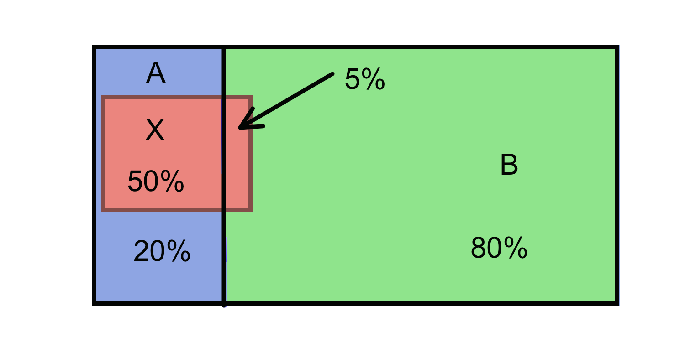

Esta pregunta la podemos resolver fácilmente mediante el método de  frecuencias naturales. Supongamos que nuestra población de referencia es de 1000 individuos. Entonces:

* 200 serán de la subpoblación A, de los cuales la mitad, 100 tendrán la característica X y los otros 100 no.

* 800 serán de la subpoblación B, de los cuales el 5%, 40 tendrán la característica X y los otros 760 no. 

Obtenemos la tabla de frecuencias siguiente:
$$
\begin{array}{r|c|c|c}
& A & B & \text{Total}\\\hline
X &100 & 40 &140\\ \hline
\text{No }X &100 & 760 &860\\\hline
\text{Total} &200 & 800 & 1000
\end{array}
$$
Entonces la fracción de los sujetos del total de la población con la característica X es 140/1000, un 14%.

¿Cómo podríamos usar las propiedades de las probabilidades para calcular este valor? Pues simplemente teniendo en cuenta que, como los sucesos $A$ y $B$, definidos por las correspondientes subpoblaciones, son disjuntos y recubren toda la población, tenemos que
$$
X=(X\cap A)\cup (X\cap B),\quad (X\cap A)\cap (X\cap B)=\emptyset
$$
y por lo tanto
$$
P(X)=P(X\cap A)+P(X\cap B)=P(X|A)P(A)+P(X|B)P(B).
$$

Como $P(A)=0.2$, $P(B)=0.8$, $P(X|A)=0.5$ y $P(X|B)=0.05$

$$
P(X)=0.5\cdot 0.2+0.05\cdot 0.8=0.14.
$$

El ejemplo anterior es una aplicación del **Teorema de la probabilidad total** siguiente:

\BeginKnitrBlock{theorem}<div class="theorem"><span class="theorem" id="thm:unnamed-chunk-121"><strong>(\#thm:unnamed-chunk-121) </strong></span>Si $A$ y $X$ son dos sucesos y $0<P(A)<1$,
$$
P(X)= P(X\cap A) +P(X\cap A^c)=P(A)\cdot P(X|A)+ P(A^c)\cdot P(X|A^c)
$$</div>\EndKnitrBlock{theorem}

Algunos de vosotros habréis usado en Bachillerato un diagrama de árbol como el siguiente para representar este teorema:


Luego se calcula la probabilidad de cada "hoja" del árbol como el producto de las probabilidades del camino que llega a ella desde $\Omega$ y se calcula como $P(X)$ la suma de las probabilidades de las hojas cuyo suceso contiene "$\cap X$".

En el ejemplo anterior, este diagrama es 

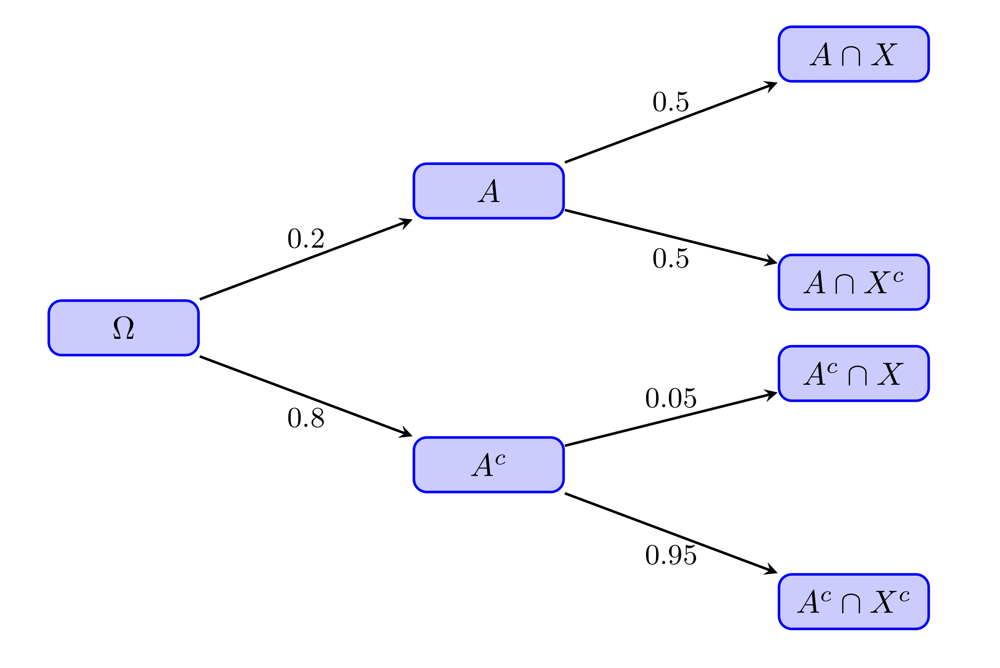

Más en general, llamaremos una **partición** (o **estratificación**, **clasificación**) de una población $\Omega$ a una familia (finita) de sucesos $A_1,\ldots,A_n$ tales que

1. Recubren todo $\Omega$: $\Omega=A_1\cup\cdots\cup A_n$.
2. Dos a dos son disjuntos: Para cada $i,j\in\{1,\ldots,n\}$, si $i\neq j$, se tiene que $A_i\cap A_j=\emptyset$.


<div class="figure" style="text-align: center">

<p class="caption">(\#fig:partición)Una partición.</p>
</div>


Por ejemplo, los sucesos $A$ y $B$ del Ejemplo \@ref(exm:TPT1) forman una partición de la población considerada.

\BeginKnitrBlock{theorem}<div class="theorem"><span class="theorem" id="thm:unnamed-chunk-122"><strong>(\#thm:unnamed-chunk-122) </strong></span>Sea $A_1$, ..., $A_n$  una partición de la población tal que $P(A_1)$, ..., $P(A_n)$ son todas diferentes de 0. Para todo suceso $X$,
$$
  \begin{array}{rl}
P(X)\!\!\!\! & = P(X\cap A_1) +\cdots+P(X\cap A_n)\\ & =P(A_1)\cdot P(X|A_1)+\cdots+ P(A_n)\cdot P(X|A_n)
\end{array}
$$</div>\EndKnitrBlock{theorem}

\BeginKnitrBlock{rmdnote}<div class="rmdnote">Si al ir a aplicar el teorema de la probabilidad total os encontráis con alguna probabilidad $P(A_i)=0$, tomad $P(A_i)P(X|A_i)=0$ en la suma de la derecha.</div>\EndKnitrBlock{rmdnote}


\BeginKnitrBlock{example}<div class="example"><span class="example" id="exm:VIH995prev"><strong>(\#exm:VIH995prev) </strong></span>Un test para el VIH da positivo un 99% de los casos en los que el virus está presente y en un 5% de los casos en los que el virus no está presente. En una población con el 0.5% de infectados por VIH, ¿cuál es la probabilidad de que un individuo escogido al azar dé positivo?
  
</div>\EndKnitrBlock{example}

En primer lugar vamos a usar el teorema de la probabilidad total para calcular esta probabilidad. Sean los sucesos:

* $A$: Que un individuo esté infectado de VIH; $P(A)=0.005$.


* $X$: Que un individuo dé positivo en el test. Sabemos que $P(X|A)=0.99$ y $P(X|A^c)= 0.05$.

Entonces
$$
\begin{array}{rl}
P(X) \!\!\!\!   &  =P(A)\cdot P(X|A)+P(A^c)\cdot P(X|A^c) \\
&=0.005\cdot 0.99+0.995\cdot 0.05=0.0547
\end{array}
$$

Usemos ahora la técnica de frecuencias naturales. Tomemos una población de referencia de 100,000 individuos. 

* Un 0.05% están infectados: 500 infectados y 99500 no infectados.

* En un 99% de los infectados el test da positivo, son 495. En los 5 restantes da negativo.

* En un 5% de los no infectados da positivo, son 4975. En los 94525 restantes da negativo.

La tabla de frecuencias resultante es

$$
\begin{array}{l|c|c|c}
& \text{Test }+ & \text{Test }- & \text{Total}\\
\hline
\text{VIH }+ & 495 & 5 & 500\\ \hline
\text{VIH }- & 4975& 94525 & 99500\\\hline
\text{Total} &5470 & 94530&  100000
\end{array}
$$

La proporción de personas en las que el test da positivo es 5470/100000=0.0547.


\BeginKnitrBlock{rmdexercici}<div class="rmdexercici">En el estudio de Rotterdam del Ejemplo \@ref(exm:EPCOCoh), un 21.7% de la cohorte inicial eran fumadores, un 43% habían sido fumadores  pero ya no lo eran, y un 35.3% nunca habían fumado. En el primer grupo, un 26% desarrolló EPOC durante el seguimiento; entre el segundo grupo,  un 13.6%, y en el tercero, un 6.4%. Vamos a llamar "fumador" a un sujeto de la cohorte que o fumaba al principio del estudio, o había fumado anteriormente pero lo había dejado. ¿Qué fracción de estos fumadores desarrolló EPOC?</div>\EndKnitrBlock{rmdexercici}


El teorema de la probabilidad total se usa de manera implícita en el cálculo de **tasas ajustadas**:

* Se divide una población en estratos  (sexo, grupos étnicos,  franjas de edad...).
* Se calcula la proporción de algo en cada estrato.
* Se deduce la proporción de ese algo en una población que tuviera una composición estándar de esos estratos.

Por ejemplo:

1. Se calcula la tasa de mortalidad de una enfermedad por franjas de edad en España.

1. Se toma como composición estándar en franjas de edad la media de la Unión Europea.

1. Se deduce la tasa de mortalidad de esa enfermedad en una población cuya composición en franjas de edad fuera la media europea y en la que la tasa de mortalidad en cada franja de edad fuera la española. 

Calculando estas tasas ajustadas para todos los países de la UE,  se pueden comparar sus tasas de mortalidad evitando el factor de confusión que podría representar la edad.

\BeginKnitrBlock{example}<div class="example"><span class="example" id="exm:unnamed-chunk-125"><strong>(\#exm:unnamed-chunk-125) </strong></span>Una cierta enfermedad tiene en China una tasa de mortalidad del 0.1% entre los menores de 15 años, del 0.3% entre las personas de 15 a 64  años  y de un 0.7% entre los mayores de 65 años. En la Unión Europea, un 15.5% de la población es menor de 15 años, un 65.4% tiene entre 15 y 64 años, y un 19.1% tiene 65 años o más.  En China, estas proporciones son del 17.6%, 	71.2% y	11.2%, respectivamente

¿Cuál es la tasa de mortalidad de esta enfermedad en China? ¿Cuál sería la tasa de mortalidad de esta enfermedad ajustada a la distribución de edades de la Unión Europea?


</div>\EndKnitrBlock{example}

Pongamos nombres a los sucesos de interés: 

* $M$: Morir de la enfermedad 

* $C_1$: Tener menos de 15 años en China; $P(C_1)=0.176$

* $C_2$: Tener entre 15 y 64 años en China; $P(C_2)=0.712$

* $C_3$: Tener 65 años o más en China; $P(C_3)=0.112$

* $E_1$: Tener menos de 15 años en Europa; $P(E_1)=0.115$

* $E_2$: Tener entre 15 y 64 años en Europa; $P(E_2)=0.654$

* $E_3$: Tener 65 años o más en Europa; $P(E_3)=0.191$

Tenemos que $P(M|C_1)=0.001$, $P(M|C_2)=0.003$ y $P(M|C_3)=0.007$.

Por el teorema de la probabilidad total, la tasa de mortalidad en China es
$$
\begin{array}{rl}
P(M)\!\!\!\! &=P(M|C_1)\cdot P(C_1)+P(M|C_2)\cdot P(C_2)+P(M|C_3)\cdot P(C_3)\\
& =0.001\cdot 0.176+0.003\cdot 0.712+0.007\cdot 0.112=0.0031
\end{array}
$$
O sea, del 0.31%.


La tasa de mortalidad de esta enfermedad ajustada a la distribución de edades de la Unión Europea, $\mathit{TA}$, sería la probabilidad de $M$ en una población en la que cada franja de edad tuviera probabilidad como en Europa, $P(E_i)$, y la tasa de mortalidad en cada franja de edad fuera como la de China, $P(M|C_i)$:


$$
\begin{array}{rl}
\mathit{TA}\!\!\!\!  & =P(M|C_1)\cdot P(E_1)+P(M|C_2)\cdot P(E_2)+P(M|C_3)\cdot P(E_3)\\
& =0.001\cdot 0.115+0.003\cdot 0.654+0.007\cdot 0.191=0.0034
\end{array}
$$
Es decir, esta tasa de mortalidad ajustada  es del 0.34%. Es un poco mayor que la "real" en China. Es razonable: vemos que la tasa de mortalidad crece con la edad, y China tiene una mayor proporción de niños y una menor proporción de ancianos que Europa.

\BeginKnitrBlock{rmdexercici}<div class="rmdexercici">Supongamos que en los Emiratos Árabes, donde hay 256 hombres por cada 100 mujeres (en serio, datos del [CIA Woldfact](https://www.cia.gov/library/publications/the-world-factbook/geos/print_ae.html)), un 1% de los hombres y un 2% de las mujeres sufren de una determinada enfermedad.

*(b)* ¿Cuál es la prevalencia de esta enfermedad en esta población?

*(c)* ¿Cuál es la prevalencia  de esta enfermedad ajustada a una población con un 50% de cada sexo?</div>\EndKnitrBlock{rmdexercici}


\BeginKnitrBlock{rmdcaution}<div class="rmdcaution">¿Os habéis fijado en que la CIA da la composición por sexos de la población mediante *odds* (hombres por mujer), no mediante proporciones (hombres por habitante)?</div>\EndKnitrBlock{rmdcaution}

## Fórmula de Bayes


A menudo conocemos las probabilidades condicionadas en una dirección pero las que nos interesa saber son precisamente las probabilidades condicionadas en la dirección opuesta. Por ejemplo:

* En un estudio de casos y controles hemos estimado las probabilidades de que individuos sanos y enfermos hayan estado expuestos al factor de riesgo, pero lo que queremos es estimar las probabilidades de que individuos expuestos y no expuestos enfermen.

* Podemos conocer las proporciones de individuos sanos y enfermos que dan positivo en un test diagnóstico, pero lo interesante es la probabilidad de estar enfermo si das positivo en el test (o de estar sano si das negativo).


\BeginKnitrBlock{example}<div class="example"><span class="example" id="exm:cancerpitpres"><strong>(\#exm:cancerpitpres) </strong></span>Una mujer de 45 años da positivo en una  mamografía anual de cribado. Si una mujer tiene cáncer de mama, la probabilidad de dar positivo en dicha prueba es del 99%, y si no lo tiene, esta probabilidad es aún del 9%. Os pide cuáles son sus probabilidades de tener cáncer de mama. ¿Qué contestaríais?
  
a. Casi seguro, lo siento mucho

a. Del orden de un 50%

a.  Del orden de un 10%

a.  Tranquila, del orden de un 1%

a.  Casi seguro de que no, del orden de un 0.1%

a. ¡Señora, yo estudié medicina, no matemáticas!

</div>\EndKnitrBlock{example}

Las preguntas de este tipo no pueden responderse sin alguna información extra. Por ejemplo, la probabilidad global de haber estado expuestos al riesgo o la prevalencia de la enfermedad en el ejemplo de los estudios de casos y controles, o la prevalencia de la enfermedad o la proporción global de positivos en el ejemplo del test diagnóstico. 

\BeginKnitrBlock{example}<div class="example"><span class="example" id="exm:cancerpitpres2"><strong>(\#exm:cancerpitpres2) </strong></span>Volved a la pregunta del Ejemplo \@ref(exm:cancerpitpres). ¿Y si os decimos que la prevalencia del cáncer de mama entre las mujeres españolas es de alrededor del 0.5%? (Según el informe ["Las cifras del cáncer en España 2020"](https://seom.org/seomcms/images/stories/recursos/Cifras_del_cancer_2020.pdf) de la Sociedad Española de Oncología Médica, la prevalencia del cáncer de mama en España en el período 2013-2018 fue de 130,000 casos de cáncer de mama entre los cerca de 24,000,000 de mujeres españolas.)

</div>\EndKnitrBlock{example}

Este tipo de cuestiones se resuelve fácilmente por el método de frecuencias naturales.

\BeginKnitrBlock{example}<div class="example"><span class="example" id="exm:cancerpitpres3"><strong>(\#exm:cancerpitpres3) </strong></span>Volvamos a la pregunta de los dos ejemplos anteriores, pero para no hacer *spoilers*, vamos a resolverla con otro números. Vamos a suponer que la probabilidad de dar positivo en la mamografía si se tiene cáncer es del 90%  y si no se tiene, del 10%, y que la prevalencia del cáncer de mama es del 1%.
</div>\EndKnitrBlock{example}

Tomamos una población de referencia de 100,000 mujeres y calculamos la tabla de frecuencias en esta población correspondiente a la situación planteada. 

* Un 1% de la población tiene cáncer de mama: 1,000 mujeres. Las 99,000 restantes, no.

* De las 1,000 mujeres con cáncer de mama, un 90% dan positivo en la mamografía: 900. Las 100 restantes, dan negativo

* De las 99,000 mujeres sin cáncer de mama, un 10% dan positivo en la mamografía: 9,900. Las  89,100 restantes dan negativo.

La tabla de frecuencias resultante (donde "Test" indica la mamografía) es

$$
\begin{array}{l|c|c|c}
& \text{Test }+ & \text{Test }- & \text{Total}\\
\hline
\text{Cáncer Sí} & 900 & 100 & 1000\\ \hline
\text{Cáncer No} & 9900& 89100 & 99000\\\hline
\text{Total} &10800 & 89200&  100000
\end{array}
$$

Entonces, la proporción de mujeres con cáncer de mama entre las que dan positivo en la mamografía es de 900/10800= 0.0833: un 8.33%.


La **fórmula de Bayes** siguiente permite resolver este tipo de problemas.

\BeginKnitrBlock{theorem}<div class="theorem"><span class="theorem" id="thm:unnamed-chunk-128"><strong>(\#thm:unnamed-chunk-128) </strong></span>Sean $A$ y $B$ dos sucesos. Si $P(A),P(B)>0$, entonces
$$
P(A|B) =\dfrac{P(A)\cdot P(B|A)}{P(A)\cdot P(B|A)+P(A^c)\cdot P(B|A^c)}
$$</div>\EndKnitrBlock{theorem}

Esta fórmula se obtiene de
$$
P(A|B) =\dfrac{P(A \cap B)}{P(B)}
$$
donde
$$
P(A \cap B)=P(A)\cdot P(B|A)
$$
y, por el teorema de la probabilidad total,
$$
P(B)=P(A)\cdot P(B|A)+P(A^c)\cdot P(B|A^c).
$$


\BeginKnitrBlock{rmdcaution}<div class="rmdcaution">Hasta donde sabemos, la fórmula de Bayes es la única fórmula "abstracta" que de vez en cuando aparece en alguna pregunta del MIR.</div>\EndKnitrBlock{rmdcaution}

\BeginKnitrBlock{example}<div class="example"><span class="example" id="exm:cancerpitpres4"><strong>(\#exm:cancerpitpres4) </strong></span>Con los números del Ejemplo \@ref(exm:cancerpitpres3), si llamamos $C$ al suceso "Tener cáncer de mama" y $M$ al suceso "Dar positivo en la mamografía", tenemos que $P(C)=0.01$, $P(M|C)=0.9$ y $P(M|C^c)=0.1$, y por lo tanto
$$
\begin{array}{rl}
P(C|M)\!\!\!\! & =\dfrac{P(C)\cdot P(M|C)}{P(C)\cdot P(M|C)+P(C^c)\cdot P(M|C^c)}\\
& =\dfrac{0.01\cdot 0.9}{0.01\cdot 0.9+0.99\cdot 0.1}=0.0833
\end{array}
$$</div>\EndKnitrBlock{example}

Más en general, si  $A_1,A_2,\ldots,A_n$ es una partición de $\Omega$ y $X$ un suceso y todos estos sucesos tienen probabilidad no nula, entonces
$$
P(A_i|X) =\dfrac{P(A_i)\cdot P(X|A_i)}{P(A_1)\cdot P(X|A_1)+\cdots+P(A_n)\cdot P(X|A_n)}
$$

\BeginKnitrBlock{example}<div class="example"><span class="example" id="exm:VIH995"><strong>(\#exm:VIH995) </strong></span>Volvemos a la situación del Ejemplo \@ref(exm:VIH995prev). Tenemos un test para el VIH que  da positivo en un 99% de las personas en las que el virus está presente y en un 5% de las personas en las que el virus no está presente. 

En una población con el 0.5% de infectados por VIH, ¿cuál es la probabilidad de que un individuo que haya dado positivo en el test esté infectado? ¿Y cuál es la probabilidad de que un individuo que haya dado **negativo** en el test **no** esté infectado?
  
  </div>\EndKnitrBlock{example}

Si llamamos $A$ al suceso "Estar infectado por VIH"  y $B$ al suceso "Dar positivo en el test", entonces:

* La probabilidad de que un individuo que dé positivo en el test esté infectado es 

$$
\begin{array}{rl}
P(A|B)\!\!\!\! & =\dfrac{P(B|A)\cdot P(A)}{P(B|A)\cdot P(A)+P(B|A^c)\cdot P(A^c)}\\
&=\dfrac{0.99\cdot 0.005}{0.005\cdot 0.99+0.995\cdot 0.05}=0.09
\end{array}
$$


* La probabilidad de que un individuo que dé negativo en el test no esté infectado es 

$$
\begin{array}{rl} 
P(A^c|B^c)\!\!\!\!& =\dfrac{P(B^c|A^c)\cdot P(A^c)}{P(B^c|A)\cdot P(A)+P(B^c|A^c)\cdot P(A^c)}\\
& =\dfrac{0.95\cdot 0.995}{0.01\cdot 0.005+0.95\cdot 0.995}=0.99995
\end{array}
$$


\BeginKnitrBlock{rmdexercici}<div class="rmdexercici">Un test de detección precoz de una enfermedad da positivo el 97.5% de las veces en que existe la enfermedad, y un 12% de las veces en que no existe la enfermedad. La probabilidad de que un individuo escogido al azar tenga esta enfermedad es de un 2%.

a. ¿Cuál es la probabilidad de que un individuo escogido al azar dé positivo en el test?
  
a. ¿Cuál es la probabilidad de que un individuo escogido al azar tenga la enfermedad y dé positivo en el test?
  
a. ¿Cuál es la probabilidad de que un individuo que dé positivo en el test, tenga esta enfermedad?
  
a. El dar positivo en el test y el tener la enfermedad, ¿son sucesos independientes?

</div>\EndKnitrBlock{rmdexercici}

Terminemos con un ejemplo donde no podemos aplicar la fórmula de Bayes.

\BeginKnitrBlock{example}<div class="example"><span class="example" id="exm:unnamed-chunk-131"><strong>(\#exm:unnamed-chunk-131) </strong></span>Un test diseñado para diagnosticar una determinada enfermedad da positivo el 94% de las veces en las que existe la enfermedad, y un 4% de las veces en las que no existe la enfermedad. A partir de un estudio masivo se estima que un 15% de la población da positivo en el test. ¿Cuál sería la prevalencia de la enfermedad? 
  
</div>\EndKnitrBlock{example}

Fijaos en que si llamamos $E$ al suceso "Tener la enfermedad" y $T$ al suceso "Dar positivo en el test", los datos que tenemos son $P(T)$, $P(T|E)$ y $P(T|E^c)$, y queremos saber $P(E)$.


Vamos a usar la técnica de frecuencias naturales. Tomamos una población de referencia de 100,000 individuos. De ellos, un 15%, 15,000, dan positivo en el test, y los 85,000 restantes, negativo.

Llamemos $x$ al número de enfermos, de manera que $100000-x$ es el número de sanos. Sabemos que un 94% de  los enfermos y un 4% de los sanos dan positivo. Por lo tanto, el número de positivos será igual al 94% de $x$ más el 4% de  $100000-x$:
$$
15000=0.94x+0.04(100000-x)=0.9x+4000\Longrightarrow x=\frac{11000}{0.9}=12222.22
$$
Por lo tanto, la prevalencia de la enfermedad es 12222.22/100000=0.1222: un 12.22%. 

\BeginKnitrBlock{rmdnote}<div class="rmdnote">En realidad, si llamamos $E$ al suceso "estar enfermo" y $+$ al suceso "dar positivo", lo que hemos hecho ha sido aplicar el Teorema de la Probabilidad Total con $P(E)$ como incógnita:
$$
  \begin{array}{rl}
0.15\!\!\!\!\! & =P(+)=P(+|E)P(E)+(P+|E^c)P(E^c)\\
& =0.94 P(E)+0.04(1-P(E))
\end{array}
$$
y despejamos $P(E)$.</div>\EndKnitrBlock{rmdnote}


## Test 

**(1)** Sean $A$ el suceso "Ser alérgico a los gatos" y $B$ el suceso "Ser asmático". La probabilidad de que un alérgico a los gatos sea asmático es del 63%. ¿Cuál de las expresiones matemáticas siguientes expresa esta afirmación?

1. $P(A|B)=0.63$
1. $P(B|A)=0.63$
1. $P(A\cap B)=0.63$
1. $P(A\cup B)=0.63$
1. Ninguna de las anteriores.

**(2)** Supongamos que la probabilidad de que un individuo de una comunidad tenga una determinada enfermedad es de 0.23. ¿Cuál o cuáles de las afirmaciones siguientes son verdaderas?

1. Cada vez que tomemos 100 individuos al azar de esta comunidad, exactamente 23 tendrán esta enfermedad.
1. Si  observamos muchos individuos de esta comunidad, esperamos encontrar un 2.3% de  individuos con esta enfermedad.
1. Si  observamos muchos individuos de esta comunidad, esperamos encontrar un 23% de  individuos con esta enfermedad.
1. Si tomamos una muestra suficientemente grande al azar de esta comunidad, encontraremos exactamente 23  individuos con esta enfermedad.


**(3)** Si un 40% de los pacientes que tienen alguna enfermedad sobreviven un año y, de los supervivientes, un 30% muere antes de cinco años, ¿cuál es la probabilidad de que un paciente sobreviva a dicha enfermedad más de cinco años?

1. 0.33 
1. 0.10 
1. 0.12 
1. 0.30 
1. 0.28 


**(4)** Si nos dicen que en una determinada población infantil, un 36% han tenido la varicela, un 80%, paperas, y un 70%, el sarampión, ¿cuál o cuáles de las afirmaciones siguientes sobre esta población seguro que son falsas?

1. Nos mienten, porque la suma de estos tres porcentajes es mayor que el 100%
1. Un 40% de esta población ha pasado las tres enfermedades
1. Un 15% de esta población han pasado la varicela y las paperas
1. Un 25% de esta población han pasado la varicela y las paperas
1. Un 50% de los que han pasado el sarampión, han tenido las paperas
1. Un 75% de los que han pasado el sarampión, han tenido las paperas
1. Ninguno de los que han tenido las paperas y el sarampión también ha pasado la varicela
1. Todos los que han tenido las paperas y el sarampión también ha pasado la varicela

**(6)** La *odds ratio* de tener asma relativa a tener gato  es 0.7. ¿Cuál o cuáles de las afirmaciones siguientes se deducen de este hecho?

1. La probabilidad de tener asma si se tiene un gato es 0.7 veces la de tener asma si no se tiene un gato.
1. La probabilidad de tener asma si se tiene un gato es menor que si no se tiene un gato.
1. La probabilidad de tener asma si se tiene un gato es mayor que si no se tiene un gato.
1. Las *odds* de tener asma si se tiene un gato son 7:10.
1. La *odds ratio* de tener gato  relativa a tener asma también es 0.7.
1. Ninguna de las afirmaciones anteriores se puede deducir de la *odds ratio* que hemos dado. 


<!--chapter:end:10-PropTeor.Rmd-->

#  Probabilidades elementales: Aplicaciones en medicina

En medicina, las probabilidades (recordad, las proporciones de sujetos de una población con una determinada característica) aparecen bajo diferentes términos. Por ejemplo:

* **Riesgo** de algo: La probabilidad de que pase ese algo (seguramente negativo, por la connotación de la palabra "riesgo").

* **Prevalencia** de algo: La probabilidad de que un individuo de una población tenga ese algo en un momento determinado.

* **Tasa** de algo: Sinónimo de la "proporción" o la "fracción" de ese algo en algún "total" (por ejemplo, en una población durante un período de tiempo). Así:

    * La **tasa de mortalidad** de una enfermedad es la proporción de individuos de una población que mueren a causa de esa enfermedad en un período determinado de tiempo, y por tanto la probabilidad de que un individuo de esa población muera por esa enfermedad en ese período.
    
    * La **tasa de letalidad** de una enfermedad es la proporción de enfermos (de esa enfermedad, se entiende) en una población que mueren a causa de esa enfermedad en un período determinado de tiempo, y por tanto la probabilidad de que un enfermo muera por esa enfermedad en ese período.
    
    * Al hablar de incidencia, a veces se usa el término **tasa de incidencia** de una enfermedad para indicar la proporción de casos nuevos de esa enfermedad en una población (sana) en un cierto periodo de tiempo, y por lo tanto es la probabilidad de que un individuo sano  coja esa enfermedad durante ese período.
    

\BeginKnitrBlock{example}<div class="example"><span class="example" id="exm:unnamed-chunk-133"><strong>(\#exm:unnamed-chunk-133) </strong></span>En el artículo ["Incidencia, prevalencia y mortalidad del cáncer renal en España: estimaciones y proyecciones para el período 1998-2022"](https://www.sciencedirect.com/science/article/pii/S0210480611003767) (*Actas Urológicas Españolas* 36 (2012), pp. 521-526) se puede leer:
</div>\EndKnitrBlock{example}


> En hombres se espera un aumento de la tasa de incidencia [del cáncer de riñón] de 11.92 casos por 100,000 habitantes/año a 15.7. La prevalencia aumentaría de 72.842  a 94.47 y la mortalidad de 5.77 a 7.29. 


En todos los casos se trata de estimaciones de  probabilidades. Se estima que:

* La probabilidad de que un hombre sano enfermara de cáncer de riñón en 1998 fue de 11.92/100000=0.0001192 y en 2022 será de 0.000157.

* La probabilidad de que un hombre tuviera cáncer de riñón en 1998 fue de  0.00072842  y  en 2022 será  de 0.0009447.

* La probabilidad de que un hombre muriera de cáncer de riñón en 1998 fue de  0.0000577  y  en 2022 será  de 0.0000729.
    
\BeginKnitrBlock{rmdexercici}<div class="rmdexercici">Leído en el [MallorcaDiario.com](https://www.mallorcadiario.com/mortalidad-coronavirus-baleares-tasa): "La tasa de mortalidad a causa del COVID-19 en Baleares fue del 1.06 por ciento frente al 2.17 por ciento a nivel nacional [...]. En el caso de personas mayores de 74, la tasa de mortalidad de Baleares (12.74 por ciento) está casi diez puntos porcentuales por debajo que la media nacional de personas de a misma edad, que llegó hasta el 22.34 por ciento."

¿De qué están hablando realmente, de la tasa de mortalidad de la COVID-19 o de su tasa de letalidad?</div>\EndKnitrBlock{rmdexercici}


## Pruebas diagnósticas


Una **prueba diagnóstica** es cualquier tecnología que pueda servir para detectar un signo que se relacione con la patología de interés. Por ejemplo, un test de embarazo, una determinación del nivel de un marcador tumoral, una prueba para detectar la presencia de un virus o una bacteria en el organismo, etc.

En la práctica, se suelen distinguir dos tipos de pruebas diagnósticas, de las que se esperan capacidades diagnósticas diferentes:

* **Test de cribado**: se realiza sobre individuos asintomáticos, con el objetivo principal de descartar que tengan la enfermedad.

* **Test diagnóstico**: se realiza en individuos que muestran síntomas o que han dado positivo en un test de cribado, con el objetivo principal de detectar la presencia de la enfermedad.

Por ejemplo, distinguiríamos entre las *mamografías de cribado*  que se realizan periódicamente a las mujeres a partir de una cierta edad, y las *mamografías diagnósticas* que se realizan a las mujeres a las que se ha detectado un bulto en un seno.  
 
Tanto en un caso como el otro, el objetivo de una prueba diagnóstica es diagnosticar una enfermedad. Por ahora vamos a considerar que nuestra prueba es **binaria**, en el sentido de que da solo dos resultados posibles: positivo o negativo, sin valores intermedios ni matices. Lo deseable sería entonces que:

* El resultado de la prueba sea positivo exactamente cuando el paciente tiene la enfermedad.

* El resultado de la prueba sea negativo exactamente cuando el paciente no tiene la enfermedad.

Por desgracia, casi nunca se tiene una prueba diagnóstica cien por cien segura en este sentido. Ni tan solo para detectar si un individuo está muerto o no, por lo que parece (cf. Fig. \@ref(fig:elcomercio)). Por lo tanto, habrá que evaluar y describir la probabilidad que tiene una prueba de acertar.


<div class="figure" style="text-align: center">

<p class="caption">(\#fig:elcomercio)Noticia aparecida en  El Comercio el 8/01/2018: https://www.elcomercio.es/asturias/preso-dado-muerto-20180108012648-ntvo.html.</p>
</div>

### Sensibilidad, especificidad, valores predictivos etc.


Vamos a poner algunos nombres a sucesos. En una prueba diagnóstica, tenemos dos tipos de sucesos:

* El **resultado de la prueba**: $+$, positivo, o $-$, negativo. Como suponemos que la prueba es binaria,  $-$ es el complementario de $+$.

* El  **estado del sujeto**:  $S$, sano, o  $E$, enfermo. $S$ es el complementario de $E$, no hay términos medios.

\BeginKnitrBlock{rmdnote}<div class="rmdnote">Es importante tener en cuenta que la clasificación de un sujeto en Enfermo o Sano usualmente se lleva a cabo mediante una prueba de referencia (*gold standard*), que no siempre existe y que cuando existe, puede dar (eso sí, muy raramente) diagnósticos erróneos. Nosotros vamos a suponer que siempre existe y siempre acierta, de manera que podemos comparar nuestra prueba diagnóstica con la "realidad" del paciente.</div>\EndKnitrBlock{rmdnote}


Entonces, podemos clasificar los sujetos de la población según estos dos pares de sucesos complementarios:

* **Verdaderos positivos**: Sujetos enfermos sobre los que la prueba da positivo.

* **Falsos positivos**: Sujetos sanos sobre los que la prueba da positivo.

* **Verdaderos negativos**: Sujetos sanos sobre los que la prueba da negativo.

* **Falsos negativos**: Sujetos enfermos sobre los que la prueba da negativo.

$$
\begin{array}{l}
\hphantom{TestTestTest}\textbf{Enfermedad} \\
\begin{array}{c|c|c}
\textbf{Test}  & E & S \\ \hline
+ & \text{Verdaderos} & \text{Falsos} \\[-0.5ex]  	
 & \text{positivos} & \text{positivos} \\ \hline
- & \text{Falsos} & \text{Verdaderos} \\[-0.5ex]   	
 & \text{negativos} & \text{negativos}
\end{array}
\end{array}
$$
Por ejemplo, el pobre preso dado por muerto sería un falso positivo en una prueba diagnóstica de muerte (positivo si estás muerto), o un falso negativo en una prueba diagnóstica de vida  (positivo si estás vivo).

Entonces, para una prueba diagnóstica:

* Su **sensibilidad** es la probabilidad de que dé positivo sobre un individuo enfermo. Es decir, $P(+|E)$.

* Su **tasa de falsos negativos** es la probabilidad de que dé negativo sobre un individuo enfermo. Es decir, $P(-|E)$.

* Su **especificidad** es la probabilidad de que dé negativo sobre un individuo sano. Es decir, $P(-|S)$.

* Su **tasa de falsos positivos** es la probabilidad de que dé positivo sobre un individuo sano. Es decir, $P(+|S)$.

Observad que, como $+$ y $-$ son sucesos complementarios,

*  La Tasa de falsos negativos es  1 menos la Sensibilidad: $P(-|E)=1-P(+|E)$.

*  La Tasa de falsos positivos es  1 menos la Especificidad: $P(+|S)=1-P(-|S)$.

\BeginKnitrBlock{rmdnote}<div class="rmdnote">Igual os es útil la regla mnemotécnica siguiente, para recordar qué es la sensibilidad y qué la especificidad:

* La Se**N**sibilidad es  1 menos la Tasa de falsos **N**egativos.

* La Es**P**ecificidad es  1 menos la Tasa de falsos **P**ositivos
</div>\EndKnitrBlock{rmdnote}


\BeginKnitrBlock{example}<div class="example"><span class="example" id="exm:unnamed-chunk-137"><strong>(\#exm:unnamed-chunk-137) </strong></span>Recordad el Ejemplo \@ref(exm:VIH995), en el que teníamos un test para el VIH que daba positivo en  un 99% de los infectados y en un 5% de las personas libres del virus.

* La **sensibilidad** de este test es la proporción de enfermos en los que da positivo: 99%.

* La **especificidad**  de este test es la proporción de sanos en los que da negativo: 95%.

* Y entonces, ¿qué es el 5%? Su **tasa de falsos positivos**: la proporción de sanos en los que da positivo.

</div>\EndKnitrBlock{example}
 

Algunas definiciones más. Para una prueba diagnóstica:

* Su **valor predictivo positivo** (**VPP**)  es la probabilidad de que, si da positivo, el individuo esté enfermo. Es decir, $P(E|+)$.

* Su **valor predictivo negativo** (**VPN**)  es la probabilidad de que, si da negativo, el individuo esté sano. Es decir, $P(S|-)$.

\BeginKnitrBlock{rmdexercici}<div class="rmdexercici">Un examen es una prueba diagnóstica, para determinar si un estudiante sabe ($E$) o no sabe ($S$) la materia. Si aprueba da positivo, si suspende negativo. Traducid al contexto de un examen todos los conceptos introducidos hasta ahora para pruebas diagnósticas.</div>\EndKnitrBlock{rmdexercici}


Normalmente conocemos estimaciones de la sensibilidad y la especificidad de una prueba, obtenidas tomando una muestra de sanos y una de enfermos y haciéndoles la prueba para ver cuántos dan positivo y cuántos negativo (**Ejercicio**: ¿De qué tipo de estudio se trata?). Entonces, como hemos visto en la sección sobre la fórmula de Bayes de la lección anterior, conociendo una estimación de la prevalencia $P(E)$ de la enfermedad, podemos estimar los valores predictivos a partir de la especificidad y sensibilidad. 

Por ejemplo, recordad el enunciado (ahora completo) del Ejemplo \@ref(exm:VIH995):

> Un test para el VIH da positivo en un 99% de las personas en las que el virus está presente y en un 5% de las personas en las que el virus no está presente. En una población con el 0.5% de infectados por VIH, ¿cuál es la probabilidad de que un individuo que haya dado positivo en el test esté infectado? ¿Y cuál es la probabilidad de que un individuo que haya dado negativo en el test no esté infectado?

Su traducción en la terminología introducida en esta sección es:

> Un test para el VIH tiene una sensibilidad del 99% y una tasa de falsos positivos del 5%. En una población con una prevalencia del VIH del 0.5%, ¿cuáles son los VPP y VPN del test?

Este tipo de cuestiones se pueden resolver usando el método de  frecuencias naturales o, si os gusta recordar fórmulas, directamente la fórmula de Bayes:
$$
\begin{array}{l}
\text{VPP} = P(E|+) =\dfrac{P(+|E)\cdot P(E)}{P(+|E)\cdot P(E)+P(+|S)\cdot P(S)}\\
\qquad =\dfrac{\text{sensibilidad}\cdot \text{prevalencia}}{\text{sensibilidad}\cdot \text{prevalencia}+(1-\text{especificidad})(1-\text{prevalencia})}\\[2ex]
\text{VPN} = P(S|-)=\dfrac{P(-|S)\cdot P(S)}{P(-|S)\cdot P(S)+P(-|E)\cdot P(E)}\\
\qquad =\dfrac{\text{especificidad}\cdot (1-\text{prevalencia})}{\text{especificidad}\cdot (1-\text{prevalencia})+(1-\text{sensibilidad})\cdot\text{prevalencia}}
\end{array}
$$

\BeginKnitrBlock{example}<div class="example"><span class="example" id="exm:antiendomisio"><strong>(\#exm:antiendomisio) </strong></span>En el artículo ["Sensibilidad y especificidad de los exámenes de anticuerpos antigliadina y antiendomisio"](http://www.scielo.edu.uy/scielo.php?pid=S1688-12492002000200003&script=sci_arttext&tlng=en) (W. Lozano *et al*, *Archivos de Pediatría del Uruguay* 73 (2002), pp. 69-73) se estimaron la sensibilidad y la especificidad de las dos técnicas analíticas mencionadas en su título en el diagnóstico de la enfermedad celíaca en niños.  Para ello se tomaron un grupo de 50 niños celíacos y un grupo de control de 145 niños no celíacos y se les aplicaron dichas pruebas diagnósticas. En el artículo se incluye la tabla que copiamos en la Figura \@ref(fig:espe2), donde los niños se clasificaron en celíacos y no celíacos mediante el diagnóstico de referencia, una biopsia de intestino delgado.

*(a)* Suponiendo que los resultados son representativos de la población infantil, ¿qué estimamos que valen la especificidad y la sensibilidad de cada una de las dos pruebas de anticuerpos estudiadas?
  
*(b)* ¿Se pueden estimar los VPP y VPN de estas dos pruebas usando solo los datos de esta tabla? 

*(c)* Se estima que en el Uruguay (el país donde se realizó este estudio), de media, 1 de cada 64 niños  es celíaco. ¿Qué estimamos que valen el VPP y el VPN de cada una de las dos pruebas de anticuerpos estudiadas para los niños uruguayos?

*(d)* Se estima que en España, de media,  1 de cada 71 niños es celíaco. ¿Qué estimamos que valen el VPP y VPN  de cada una de las dos pruebas de anticuerpos estudiadas para los niños españoles?

</div>\EndKnitrBlock{example}


<div class="figure" style="text-align: center">
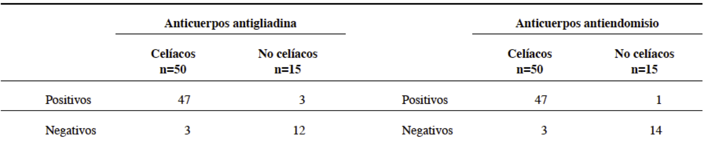
<p class="caption">(\#fig:espe2)Tabla 1 en el artículo "Sensibilidad y especificidad de los exámenes de anticuerpos antigliadina y antiendomisio".</p>
</div>


Vamos a responder las preguntas para la prueba de anticuerpos antiendomisio (AAE), os dejamos la otra como **ejercicio**.

Para la  prueba AAE, tenemos la tabla de frecuencias siguiente, que es básicamente la de la derecha de la figura anterior:
$$
\begin{array}{r|cc|c}
& \text{Celíacos}\ (E) & \text{No celíacos}\ (S) & \text{Total} \\ \hline
+ & 47 & 1 & 48  \\  
- & 3 & 14 & 17 \\ \hline
\text{Total} & 50  & 15 & 65  
\end{array}
$$

*(a)* Estimamos que:

* Su **sensibilidad** es $P(+|E)=47/50=0.94$

* Su **especificidad** es $P(-|S)= 14/15=0.9333$

Es decir, 

* El test AAE da positivo en un 94% de los niños celíacos.
* El test AAE  da negativo en un 93.33% de los niños no celíacos.

*(b)* No se pueden estimar los VPP y VPN de estas dos pruebas usando solo los datos de esta tabla. Los números de niños celíacos y no celíacos en esta muestra son artificiales, tomados *ad hoc* por conveniencia del estudio, y en principio no representan las proporciones de niños celíacos y no celíacos en ninguna población. Por lo tanto, las proporciones de enfermos entre los positivos y los negativos también son artificiales y no representativas de nada.

*(c)* En primer lugar vamos a calcular los valores predictivos usando la fórmula de Bayes. Como $P(+|E)=0.94$, $P(-|S)=14/15$ y en Uruguay $P(E)=1/64$, por lo que $P(S)=63/64$:

$$
\begin{array}{rl}
\text{VPP}\!\!\!\! & =P(E|+)=\dfrac{P(+|E)\cdot P(E)}{P(+|E)\cdot P(E)+P(+|S)\cdot P(S)}\\
&= \dfrac{0.94\cdot \frac{1}{64}}{0.94\cdot \frac{1}{64}+\frac{1}{15}\cdot \frac{63}{64}}=0.1829\\[1ex]
\text{VPN} \!\!\!\!& =P(S|-)=\dfrac{P(-|S)\cdot P(S)}{P(-|S)\cdot P(S)+P(-|E)\cdot P(E)}\\
&= \dfrac{\frac{14}{15}\cdot \frac{63}{64}}{\frac{14}{15}\cdot \frac{63}{64}+0.06\cdot \frac{1}{64}}=0.999
\end{array}
$$

Es decir, 

* Estimamos que un 18.29% de los niños uruguayos que dan positivo en el test AAE son celíacos.
* Estimamos que un 99.9% de los niños uruguayos que dan negativo en el test AAE no son celíacos.

Vamos a repetir el cálculo usando frecuencias naturales. Para que nos salgan números redondos, vamos a partir de una población de referencia de 640,000 niños uruguayos.

* Un 1/64 son celíacos, 10,000. Los 630,000 restantes no lo son.
* De los 10,000 celíacos, un 94% dan positivo. Por lo tanto, 9,400 dan positivo y 600 negativo.
* De los 630,000 no celíacos, 14 de cada 15 dan negativo Por lo tanto, 588,000 dan negativo y 42,000 positivo.

En resumen:
$$
\begin{array}{r|c|c|c}
& \text{Celíacos} & \text{No celíacos}  & \text{Total} \\ \hline
+ & 9400  &  42000 &  51400 \\ \hline
- & 600  & 588000 &  588600  \\ \hline
\text{Total} &  10000 & 630000 & 640000 
\end{array}
$$
Y por lo tanto, estimamos que:

* $\text{VPP}= 9400/51400=0.1829$

* $\text{VPN}= 588000/588600=0.999$


*(d)* ¿Y en España? Usando la fórmula de Bayes ahora con $P(E)=1/71$, obtenemos
$$
\begin{array}{rl}
\text{VPP}\!\!\!\! & =P(E|+)=\dfrac{P(+|E)\cdot P(E)}{P(+|E)\cdot P(E)+P(+|S)\cdot P(S)}\\
&= \dfrac{0.94\cdot \frac{1}{71}}{0.94\cdot \frac{1}{71}+\frac{1}{15}\cdot \frac{70}{71}}=0.1677\\[1ex]
\text{VPN} \!\!\!\!& =P(S|-)=\dfrac{P(-|S)\cdot P(S)}{P(-|S)\cdot P(S)+P(-|E)\cdot P(E)}\\
&= \dfrac{\frac{14}{15}\cdot \frac{70}{71}}{\frac{14}{15}\cdot \frac{70}{71}+0.06\cdot \frac{1}{71}}=0.9991
\end{array}
$$

* Estimamos que un 16.77% de los niños españoles que dan positivo en el test AAE son celíacos.
* Estimamos que un 99.91% de los niños españoles que dan negativo en el test AAE no son celíacos.


Con el método de  frecuencias naturales a partir de una población de referencia de 710,000 niños españoles, y razonando como antes, obtenemos: 

$$
\begin{array}{r|c|c|c}
& \text{Celíacos} & \text{No celíacos}  & \text{Total} \\ \hline
\text{Positivos} & 9400  &  46666.67 &  56066.67  \\ \hline
\text{Negativos} & 600  & 653333.33 &  653933.33  \\ \hline
\text{Total} &  10000 & 700000 & 710000
\end{array}
$$

Y por lo tanto, estimamos que:

* $\text{VPP}= 9400/56066.67=0.1677$

* $\text{VPN}= 653333.33/653933.33=0.9991$

En resumen:

* Sensibilidad $P(+|E)=0.94$, Especificidad $P(-|S)=14/15$

* Si la prevalencia es $P(E)=1/64$,
$$
VPP=P(E|+)=0.1829,\quad
VPN=P(S|-)=0.9990
$$

* Si la prevalencia es $P(E)=1/71$,
$$
VPP=P(E|+)=0.1677,\quad
VPN=P(S|-)=0.9991
$$

La prevalencia de la enfermedad celíaca es más pequeña en España que en Uruguay, y observaréis que, en España, el VPP de la prueba de anticuerpos antiendomisio es más pequeño y su VPN más grande que en Uruguay. No es casualidad:

\BeginKnitrBlock{rmdimportant}<div class="rmdimportant">A mayor prevalencia, el VPP es mayor y el VPN es menor.</div>\EndKnitrBlock{rmdimportant}

El motivo intuitivo es que si la prevalencia crece:

* Hay más enfermos, por lo que aumenta la probabilidad de encontrar enfermos y por lo tanto el VPP es mayor.
* Hay menos sanos, por lo que disminuye la probabilidad de encontrar sanos y por lo tanto  el VPN es menor.

\BeginKnitrBlock{rmdcorbes}<div class="rmdcorbes">El motivo matemático es el siguiente. Llamemos $x\in [0,1]$ a la prevalencia y fijemos los valores de $P(+|E)$, $P(+|S)$, $P(-|E)$ y $P(-|S)$. De esta manera, entendemos el VPP y el VPN como funciones solo en $x$:
$$
\begin{array}{l}        
\text{VPP}(x)  =\dfrac{P(+|E)\cdot x}{P(+|E)\cdot x+P(+|S)\cdot (1-x)}\\
\text{VPN}(x) =\dfrac{P(-|S)\cdot (1-x)}{P(-|S)\cdot (1-x)+P(-|E)\cdot x}
\end{array}
$$
Derivando, podréis comprobar que:
        
* La derivada de $\text{VPP}(x)$ sobre el intervalo [0,1]  es positiva, y por tanto  $\text{VPP}(x)$ es creciente en $x$.
        
* La derivada de $\text{VPN}(x)$ sobre el intervalo [0,1]  es negativa, y por tanto  $\text{VPP}(x)$ es decreciente en $x$.
</div>\EndKnitrBlock{rmdcorbes}

En cambio, la  prevalencia no influye para nada  en la sensibilidad y la especificidad de la prueba:

* La **sensibilidad** es el porcentaje de enfermos en los que la prueba da positivo, y esto es independiente de cuántos enfermos hay en la población.

* La **especificidad** es el porcentaje de sanos en los que  la prueba da negativo, y esto también es independiente de cuántos individuos sanos hay en la población.

\BeginKnitrBlock{rmdnote}<div class="rmdnote">La sensibilidad y la especificidad no dependen de la prevalencia, pero sí que pueden depender de otras características de una población.  Por ejemplo, en ["Findings From 752 081 Clinical Breast Examinations Reported to a National Screening Program From 1995 Through 1998"](https://academic.oup.com/jnci/article/92/12/971/2905789) (J. Bobo *et al*, *Journal of the National Cancer Institute* 92  (2000), pp. 971-976), se estimaron la especificidad y la sensibilidad del examen físico clínico del pecho como prueba diagnóstica del cáncer de mama en diversos grupos de mujeres. En la tabla siguiente recogemos algunos de los datos obtenidos en ese estudio:
        
</div>\EndKnitrBlock{rmdnote}

$$
\begin{array}{l|ccc}
\text{Grupo} & \text{Sensibilidad} & \text{Especificidad} & \text{VPP}  \\ \hline
<40\text{ años} & 0.885 & 0.860 & 0.014  \\
40-49\text{ años} & 0.714 & 0.916 & 0.036 \\
50-59\text{ años} & 0.513 & 0.951 & 0.061 \\
60-69\text{ años} & 0.572 & 0.960 & 0.074 \\
\geqslant 70\text{ años} & 0.380 & 0.968 & 0.070  \\  \hline
\text{Global} & 0.588 & 0.934 & 0.043  
\end{array}
$$
Las diferencias en la sensibilidad y especificidad entre las diferentes franjas de edad se deben a las diferentes características físicas de los senos a diferentes edades, que facilitan o dificultan la detección de los  tumores, no a la prevalencia del cáncer.


\BeginKnitrBlock{rmdexercici}<div class="rmdexercici">Una nueva prueba de diagnóstico rápido de una enfermedad rara, de una prevalencia estimada del 0.1%, ha mostrado tener una sensibilidad del 80% y una especificidad del 60%.

*(a)* ¿Cuál es la probabilidad de que un individuo enfermo dé positivo en la prueba?

*(b)* ¿Cuál es la probabilidad  de que si escogemos un individuo al azar, esté enfermo y al realizarle la prueba dé positivo?

*(c)* ¿Qué valen los valores predictivos de esta prueba? ¿Qué significan, en lenguaje llano, los valores obtenidos?

*(d)* Si la enfermedad no fuera tan rara, digamos que su prevalencia fuera del 10%, y sin realizar ningún cálculo extra, ¿qué les pasaría a los  valores predictivos de la prueba respecto de los calculados  en el apartado anterior (aumentarían, disminuirían, se mantendrían igual, no se puede saber)? Justificad brevemente vuestra respuesta.
</div>\EndKnitrBlock{rmdexercici}


Vamos a añadir algunos términos más sobre probabilidades relacionados con una prueba diagnóstica:

* Su **exactitud** (**global**) es la probabilidad de acertar el diagnóstico, es decir, la proporción de sujetos de la población total en los que el diagnóstico acierta: $P(E\cap +)+P(S\cap -)$.

    Fijaos en que esta exactitud es igual a $P(+|E)\cdot P(E)+P(-|S)\cdot P(S)$ y por lo tanto depende de la prevalencia de la enfermedad.  
    
\BeginKnitrBlock{rmdcaution}<div class="rmdcaution">La exactitud **no es** $P(+|E)+P(-|S)$ ni $P(E|+)+P(S|-)$. Estas sumas no son la proporción de nada.</div>\EndKnitrBlock{rmdcaution}

* Su **cociente de verosimilitud** (*likelihood ratio*, en inglés) **positivo**, $\text{LR}(+)$, es cuántas veces es más probable  un diagnóstico positivo sobre  un enfermo  que sobre un sano. Es decir
$$
\text{LR}(+)=\dfrac{P(+|E)}{P(+|S)}=\dfrac{\text{sensibilidad}}{1-\text{especificidad}}
$$
     Un valor de $\text{LR}(+)$ por encima de 10 se toma como indicador de buen potencial diagnóstico para detectar la enfermedad. Por el contrario, un valor de $\text{LR}(+)$ cercano a 1 indica una prueba inútil: si dar positivo sobre un enfermo tiene aproximadamente la misma probabilidad que sobre un sano, los sucesos $+$ y $E$ son aproximadamente independientes.
     
\BeginKnitrBlock{rmdcaution}<div class="rmdcaution">No confundáis el cociente de verosimilitud positivo $\text{LR}(+)$ con las *odds* de dar positivo entre los enfermos
$$
\text{Odd}(+|E)= \dfrac{P(+|E)}{P(-|E)}
$$

* $\text{LR}(+)$ nos dice cuántas veces es más probable obtener un positivo en un enfermo que en un sano.

* $\text{Odds}(+|E)$ nos dice cuántas veces es más probable obtener un positivo que un negativo en un enfermo.
</div>\EndKnitrBlock{rmdcaution}
     

* Su **cociente de verosimilitud negativo**, $\text{LR}(-)$, es cuántas veces es más probable  un diagnóstico negativo sobre un enfermo  que sobre un sano. Es decir
$$
\text{LR}(-)=\dfrac{P(-|E)}{P(-|S)}=\dfrac{1-\text{sensibilidad}}{\text{especificidad}}
$$
    Un valor de $\text{LR}(-)$ por debajo de 0.1 se toma como indicador de buen potencial diagnóstico para descartar la enfermedad, y un valor de $\text{LR}(-)$ cercano a 1 indica de nuevo una prueba inútil en este sentido.
    


\BeginKnitrBlock{example}<div class="example"><span class="example" id="exm:unnamed-chunk-145"><strong>(\#exm:unnamed-chunk-145) </strong></span>Volviendo al Ejemplo \@ref(exm:antiendomisio), habíamos obtenido que:
</div>\EndKnitrBlock{example}

* La **sensibilidad** del test AAE es $P(+|E)=47/50=0.94$. Por lo tanto, su **tasa de falsos negativos** es $P(-|E)=0.06$.

* La **especificidad** del test AAE es $P(-|S)= 14/15$. Por lo tanto, su **tasa de falsos positivos** es $P(+|S)=1/15$. 

* En Uruguay teníamos que $P(E)=1/64$, por lo que $P(S)=63/64$.

Entonces:

* Su **exactitud** en Uruguay es  
$$
\begin{array}{rl}
P(E\cap +)+P(S\cap -)\!\!\!\!\! & =P(+|E)\cdot P(E)+P(-|S)\cdot P(S)\\
& =0.94\cdot \dfrac{1}{64}+\dfrac{14}{15}\cdot \dfrac{63}{64}=0.9334.
\end{array}
$$
    La  prueba de anticuerpos antiendomisio acierta en un 93.34% de los niños uruguayos.

* Su **cociente de verosimilitud positivo** es
$$
\text{LR}(+)=\dfrac{P(+|E)}{P(+|S)}=\frac{0.94}{1/15}=14.1
$$
    y su **cociente de verosimilitud negativo** es
$$
\text{LR}(-)=\dfrac{P(-|E)}{P(-|S)}=\frac{0.06}{14/15}=0.064
$$
    Por lo tanto, la  prueba de anticuerpos antiendomisio es valiosa tanto para detectar como para descartar la enfermedad celíaca en niños. 


Los cocientes de verosimilitud se utilizan para transformar las *odds* de tener la enfermedad *a priori* (antes de realizar la prueba diagnóstica) en sus *odds* *a posteriori* (tras realizar la prueba diagnóstica). En concreto, sean:

* $\text{Odds}(E)$: las *odds* de un individuo de tener la enfermedad, antes de realizar la prueba diagnóstica.

* $\text{Odds}(E|+)$: las *odds* de un individuo de tener la enfermedad si en la prueba  da positivo.

* $\text{Odds}(E|-)$: las *odds* de un individuo de tener la enfermedad si en la prueba  da negativo.

Entonces
$$
\begin{array}{l}
\text{Odds}(E|+)=\text{LR}(+)\cdot \text{Odds}(E)\\
\text{Odds}(E|-)=\text{LR}(-)\cdot  \text{Odds}(E)
\end{array}
$$

\BeginKnitrBlock{rmdcorbes}<div class="rmdcorbes">En efecto
$$
\begin{array}{rl}
\text{Odds}(E|+)\!\!\!\!\! & =\dfrac{P(E|+)}{P(S|+)}=\dfrac{P(E|+)P(+)}{P(S|+)P(+)} =\dfrac{P(E\cap +)}{P(S\cap +)}\\
& =\dfrac{P(+|E)P(E)}{P(+|S)P(S)}=\text{LR}(+)\text{Odds}(E)
\end{array}
$$
Para $\text{Odds}(E|-)$ el cálculo es similar.</div>\EndKnitrBlock{rmdcorbes}


\BeginKnitrBlock{example}<div class="example"><span class="example" id="exm:unnamed-chunk-147"><strong>(\#exm:unnamed-chunk-147) </strong></span>Se sabe que una mujer con un hermano hemofílico tiene un 50% de probabilidades de ser portadora de una copia defectuosa del gen del factor VIII. Una prueba genética para detectar dicho gen defectuoso tiene una sensibilidad del 90% y una especificidad del 80%. Si una mujer con un hermano hemofílico se hace la prueba y da negativo, ¿cómo modifica este resultado sus *odds* de ser portadora?

</div>\EndKnitrBlock{example}

Llamemos $E$ al suceso "Ser portadora de una copia defectuosa del gen del factor VIII". Si la mujer *a priori* tiene un 50% de probabilidades de serlo, sus *odds* de serlo valen 1. Ahora sabemos que, para el test genético, $P(-|E)=0.1$ y $P(-|S)=0.8$, por lo que $\text{LR}(-)=P(-|E)/P(-|S)=\dfrac{1}{8}$.

Entonces, $\text{Odds}(E|-)=\text{Odds}(E)\cdot \text{LR}(-) =\dfrac{1}{8}$. Pasan de ser 1:1 a 1:8. Es decir, su "nueva probabilidad" de ser portadora es 1/9. 


\BeginKnitrBlock{rmdexercici}<div class="rmdexercici">G. Stine, en el libro "AIDS Update 1999" (Prentice Hall, 1999), explica que en 1987 se notificó a 22 donantes de sangre de Florida que habían dado positivo en un test ELISA+Western Blot de VIH, que tenía sensibilidad y  especificidad ambas del 99.99%. De ellos, 7 se suicidaron. 

La prevalencia de VIH en su sector de población (heterosexuales de bajo riesgo) se estimaba en 1 por cada 10000. ¿Cuál  era su probabilidad real de infección por VIH, sabiendo que habían dado positivo?</div>\EndKnitrBlock{rmdexercici}


\BeginKnitrBlock{rmdexercici}<div class="rmdexercici">Sospechamos que un paciente tiene tuberculosis, y decidimos hacerle  un test PCR. El test concreto que vamos a usar se analizó en el estudio ["Comparative Study of a Real-Time PCR Assay Targeting senX3-regX3 versus Other Molecular Strategies Commonly Used in the Diagnosis of Tuberculosis"](https://journals.plos.org/plosone/article?id=10.1371/journal.pone.0143025), donde en un grupo de 76 pacientes con tuberculosis confirmada y 69 sujetos de control hubo 58 verdaderos positivos y 9 falsos positivos. 

*(a)* Estimad la sensibilidad, especificidad y cocientes de verosimilitud de esta prueba, y a partir de estos últimos valorad su capacidad diagnóstica.

*(b)* Por la sintomatología que presenta y la prevalencia local de la tuberculosis, asignáis *a priori* a vuestro paciente una probabilidad del 40% de tener tuberculosis. Para esta probabilidad de tener la enfermedad, calculad el VPP y el VPN de esta prueba.

*(c)* ¿Cuáles eran las *odds* de tener tuberculosis que le asignabais a este enfermo antes de realizar la prueba? Si da positivo en el test PCR, ¿cuáles son las *odds* de tener tuberculosis que le asignáis tras la prueba?
</div>\EndKnitrBlock{rmdexercici}


\BeginKnitrBlock{rmdromans}<div class="rmdromans">¿Nueve palabras para describir aspectos de una prueba diagnóstica? Pues preparaos, que vienen curvas. Literalmente. Lo sentimos, una parte importante de esta asignatura es aprender el vocabulario que se usa al aplicar estadística en medicina. Ya lo dice el autor de Reglas Médicas, la medicina es un idioma. </div>\EndKnitrBlock{rmdromans}


<div class="figure" style="text-align: center">

<p class="caption">(\#fig:idioma)Los aspirantes a médicos no os podéis perder la magnífica *Reglas médicas* en [Twitter](https://twitter.com/ReglasM) o [Facebook](https://www.facebook.com/reglasmedicas).</p>
</div>


### Curvas ROC

En la  sección anterior hemos considerado solamente pruebas binarias, que dan positivo o negativo sin ninguna gradación intermedia. Pero muchas veces una prueba diagnóstica puede dar valores en un intervalo de números reales: por ejemplo, la concentración de algún metabolito o el nivel de algún  antígeno. En este caso, lo habitual es tomar un **valor de corte** y definir como **positivo** todo valor por encima de ese valor de corte (o por debajo, eso va a depender de la prueba concreta) y como **negativo** lo contrario. Por ejemplo, en el diagnóstico de la diabetes por medio del nivel de glucosa en sangre en ayunas, se toma como positivo un valor por encima de un cierto umbral. En cambio, en el diagnóstico de la anemia por medio del hematocrito, se toma como positivo un valor por debajo de un cierto umbral. 

De esta manera pasamos de una prueba diagnóstica que puede tomar todo un continuo de valores a una prueba binaria como las de la sección anterior, con su sensibilidad y su especificidad. Pero ¿cómo se ha llegado a definir el valor de corte que se usa para distinguir positivo de negativo? ¿Y cómo podemos aprovechar el hecho de que la prueba  pueda tomar muchos resultados?


Para simplificar el lenguaje y fijar ideas, vamos a suponer que los enfermos obtienen un valor anormalmente alto en la prueba diagnóstica, y que por lo tanto queremos definir como **positivo** cualquier valor por encima de un umbral. La prueba puede dar muchos valores, y para cada uno de ellos el test binario asociado tendrá una especificidad y una sensibilidad.

La eficacia diagnóstica global de esta prueba diagnóstica se representa gráficamente por medio de una **curva ROC** (de *Receiver Operating Characteristic*). Esta curva se obtiene de la manera siguiente:

* Tomamos varios valores de corte $v$.

* Para cada uno de ellos, consideramos el test binario que define. Hemos quedado en que, para fijar ideas, este test da positivo para los valores por encima de $v$ y negativo para los valores por debajo de $v$. Para cada uno de ellos,  sean:

    * $+_{v}$: el suceso "Dar positivo en este test" (dar en la prueba un valor $\geqslant v$).
    * $-_{v}$: el suceso "Dar negativo en este test" (dar en la prueba un valor $< v$).
    * Especificidad${}_{v} = P(-_{v}|S)$: la especificidad de este test, es decir, la probabilidad de que un individuo sano dé un valor $< v$.
    * Sensibilidad${}_{v} = P(+_{v}|E)$: la sensibilidad de este test, es decir, la probabilidad de que un individuo enfermo dé un valor $\geqslant  v$.

* Para cada test asociado a un valor de corte $v$, definimos el punto del plano real de abscisa su tasa de falsos positivos y ordenada su sensibilidad:
$$
\large(P(+_v|S),P(+_v|E)\large)=(1-\text{especificidad}_v,\text{sensibilidad}_v)
$$

* Dibujamos estos puntos y los unimos por una recta poligonal (que parecerá una curva si tomamos muchos valores de corte $v$).

El resultado es un gráfico como el siguiente:

<div class="figure" style="text-align: center">

<p class="caption">(\#fig:roc1)Una curva ROC.</p>
</div>

Fijaos en que, en la situación que estamos considerando en la que definimos positivo cuando el valor obtenido es **mayor** que un umbral, si $a<b$ entonces el test con umbral $b$ da menos positivos que el test con umbral $a$. En efecto, todos los que dan positivo con valor de corte $b$ también dan positivo con valor de corte $a$, pero un individuo puede dar un resultado entre $a$ e $b$, que será positivo con valor de corte $a$ y negativo con valor de corte $b$. En consecuencia, si $a<b$
$$
P(+_b|S)\leqslant P(+_a|S),\quad P(+_b|E)\leqslant P(+_a|E)
$$
Es decir, el punto de la curva ROC correspondiente al valor de corte  $b$, que es $\large(P(+_b|S),P(+_b|E)\large)$, estará a la izquierda y por debajo del punto correspondiente al valor de corte  $a$, $\large(P(+_a|S),P(+_a|E)\large)$. 

Esto implica que, en este caso la curva ROC es creciente. En efecto, si tenemos dos puntos, correspondientes a valores de corte $s$ y $t$ y $P(+_s|S)< P(+_t|S)$ (la abscisa del primero es más pequeña que la del segundo), entonces, por lo que acabamos de ver, $P(+_s|E)\leqslant P(+_t|E)$: la ordenada del primero es menor o igual que la del segundo.


Si hubiéramos definido positivo cuando el valor obtenido es **menor** que un umbral, entonces, cuando $a<b$, el test con umbral $b$ daría **más** positivos que el test con umbral $a$ y por lo tanto el punto $\large(P(+_b|S),P(+_b|E)\large)$ estaría a la derecha y por encima del punto $\large(P(+_a|S),P(+_a|E)\large)$. Por el mismo argumento que antes, en este caso también tenemos que la curva ROC es creciente.

Por lo tanto, **la curva ROC siempre es creciente**.


\BeginKnitrBlock{example}<div class="example"><span class="example" id="exm:unnamed-chunk-151"><strong>(\#exm:unnamed-chunk-151) </strong></span>Vamos a dibujar una curva ROC. El artículo ["Age-specific reference ranges for serum prostate-specific antigen in black men"](https://www.nejm.org/doi/full/10.1056/NEJM199608013350502) (T. Morgan *et al*, *New England Journal of Medicine* 335 (1996), pp. 304-310) contiene la tabla que hemos copiado en la Figura \@ref(fig:tablapsaglobal). Esta tabla da la especificidad y la sensibilidad del diagnóstico del cáncer de próstata por medio del [nivel de PSA](https://medlineplus.gov/spanish/pruebas-de-laboratorio/prueba-de-psa-antigeno-prostatico-especifico/) (abreviatura de *antígeno prostático específico*) en diferentes poblaciones de hombres estadounidenses, definidas por razas y franjas de edad. A los hombres con cáncer de próstata más pronto o más tarde se les dispara el nivel de PSA. Por lo tanto, dado un nivel de corte de PSA, se considera como "positivo" un nivel por encima de él. En particular, en cada fila de esta tabla, se define como "positivo" el tener un nivel de PSA mayor o igual que el valor de su primera columna.
</div>\EndKnitrBlock{example}


<div class="figure" style="text-align: center">

<p class="caption">(\#fig:tablapsaglobal)Tabla 2 en el artículo "Age-specific reference ranges for serum prostate-specific antigen in black men".</p>
</div>

La curva ROC se obtiene uniendo puntos de la forma (1-especificidad,sensibilidad). Vamos a calcular estos puntos para la subpoblación de hombres blancos entre 50 y 59 años, que es la que más nos preocupa. Vamos a añadir el nivel PSA 0: como todo el mundo va a dar positivo, tendrá sensibilidad 1 y especificidad 0.

$$
\begin{array}{c|ccc}
\text{PSA} & \text{Especificidad}& 1-\text{Especificidad}& \text{Sensibilidad}\\ \hline
0 & 0 & 1 & 1 \\
1 & 0.528 & 0.472 & 0.997 \\
2 &  0.834 & 0.166 &0.994\\
3 & 0.932 & 0.068 &0.978\\
4 & 0.974 & 0.026 &0.748\\
5 & 0.987 & 0.013 &0.466\\
6 & 0.991 & 0.009 &0.261\\
7 & 1.000 & 0.000 &0.118\\
8 & 1.000  &0.000 &0.093\\
9 & 1.000  &0.000 &0.078\\
10 & 1.000 & 0.000 &0.075\\
11 & 1.000 & 0.000 &0.053\\
12 & 1.000 & 0.000 & 0.043\\
13 & 1.000 & 0.000 &0.040\\
14 & 1.000  &0.000 & 0.031\\
15 & 1.000  &0.000 & 0.025\\
\end{array}
$$

La Figura \@ref(fig:ROCama1) muestra la curva ROC que corresponde a estos valores. En ella los puntos aparecen de izquierda a derecha en orden ascendente en la tabla, es decir en orden descendente del umbral de PSA. Para ayudar a comprender mejor el gráfico, al lado de cada punto hemos anotado el valor de PSA al que corresponde y hemos estirado verticalmente el gráfico para que se puedan leer los valores de corte altos en la esquina inferior izquierda de la curva.

<div class="figure" style="text-align: center">
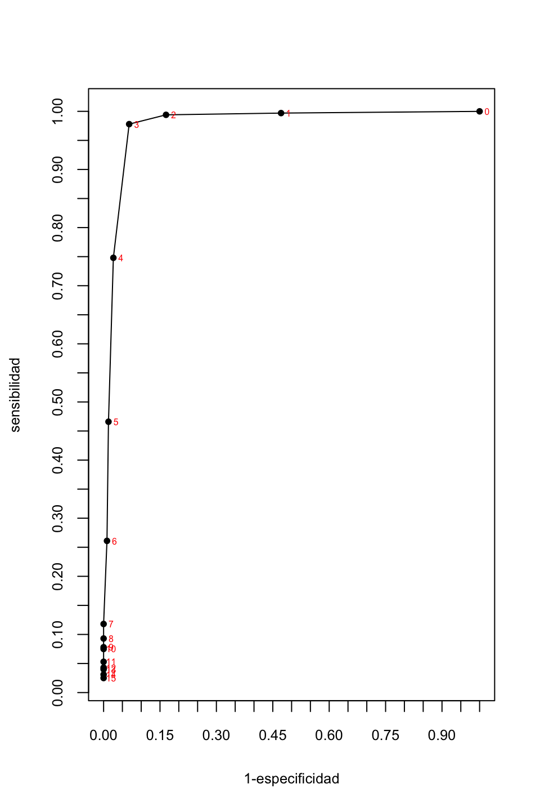
<p class="caption">(\#fig:ROCama1)Curva ROC de los niveles de PSA entre 1 y 15 como diagnóstico del cáncer de próstata en hombres blancos de 50 a 59 años.</p>
</div>


\BeginKnitrBlock{rmdimportant}<div class="rmdimportant">La curva ROC representa la sensibilidad de la prueba en función de su tasa de falsos positivos. Es decir, si asumimos  una cierta tasa de falsos positivos $x$, el punto de la curva ROC en la vertical de $x$ nos da la sensibilidad que obtendremos. La curva ROC no representa la sensibilidad en función del valor de corte.</div>\EndKnitrBlock{rmdimportant}


Una de las aplicaciones de la curva ROC es ayudar a decidir qué valor de corte tomar para definir el test diagnóstico binario que se va a usar en la práctica.  Una estrategia muy común es tomar el **valor de corte óptimo**: el valor $v_o$ en el que la suma
$$
P(+_{v_o}|E)+P(-_{v_o}|S)=\text{sensibilidad}_{v_o}+\text{especificidad}_{v_o}
$$
sea máxima (esta suma menos 1 tiene nombre: es el **índice de Youden** del test definido por el valor de corte $v_0$). Recordemos que, para cada punto de la curva ROC,

* Su distancia al eje vertical izquierdo $x=0$ es 1 menos la especificidad.

* Como su ordenada es la sensibilidad, su distancia a la recta horizontal $y=1$ es 1 menos la sensibilidad.

Por lo tanto, el punto que corresponda a la suma máxima de especificidad y sensibilidad  será el punto que dé la suma mínima de sus distancias a las rectas $x=0$ e $y=1$. Se trata del punto de la curva más cercano al rincón superior izquierdo $(0,1)$ del cuadrado unidad. Por ejemplo, para la curva ROC de la Figura \@ref(fig:roc1), es el indicado con una flecha en el gráfico siguiente:

<div class="figure" style="text-align: center">
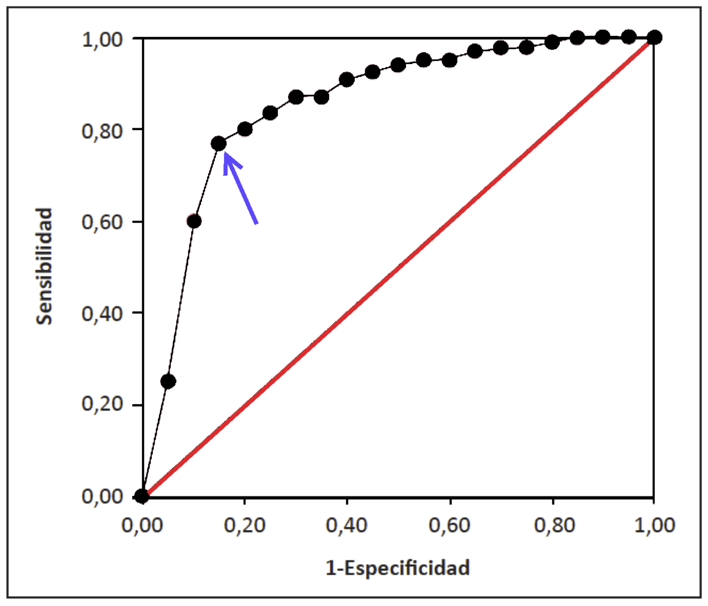
<p class="caption">(\#fig:roc2)Una curva ROC y su umbral óptimo.</p>
</div>

En el ejemplo del PSA para hombres blancos entre 50 y 59 años, tendríamos la tabla siguiente (la columna "Youden" es la suma de las dos anteriores menos 1):

$$
\begin{array}{c|ccc}
\text{PSA} & \text{Especificidad}& \text{Sensibilidad} & \text{Youden}\\ \hline
1 & 0.528& 0.997& 0.525 \\
2 &  0.834  &0.994& 0.828\\
\mathbf{3} & \mathbf{0.932}  &\mathbf{0.978}& \mathbf{0.910} \\
4 & 0.974  &0.748& 0.722\\
5 & 0.987  &0.466&0.453 \\
6 & 0.991  &0.261&0.252 \\
7 & 1.000  &0.118&0.118 \\
8 & 1.000 &0.093& 0.093\\
9 & 1.000  &0.078& 0.078\\
10 & 1.000  &0.075& 0.075\\
11 & 1.000  &0.053& 0.053\\
12 & 1.000  & 0.043& 0.043 \\
13 & 1.000  &0.040& 0.040\\
14 & 1.000  & 0.031& 0.031\\
15 & 1.000  & 0.025& 0.025
\end{array}
$$

El valor de corte óptimo sería entonces tomar un valor de PSA igual a 3.  También podéis observarlo en la Figura \@ref(fig:ROCama1): el punto correspondiente al PSA 3 es el más cercano a la esquina superior izquierda.


En  la práctica, se toma como nivel de PSA a partir del cual uno se ha de preocupar en esa franja de edad el 4. ¿Por qué? Es un compromiso: en las pruebas de cribado se prima la especificidad, ya que se trata de descartar sanos,  y la especificidad mejora del PSA 3 al PSA 4 manteniendo aún una sensibilidad aceptable del 75%, es decir, detectando un 75% de los enfermos. 

La curva ROC también se usa para evaluar la **capacidad discriminatoria global de la prueba**, es decir, su habilidad en general para distinguir sanos de enfermos para el conjunto de posibles umbrales. 

Para empezar, para que la prueba diagnóstica sirva para detectar enfermos, ha de dar positivo con más frecuencia en enfermos que en sanos, ¿cierto?
Por lo tanto, requerimos que, para cada umbral la sensibilidad sea mayor que la tasa de falsos positivos. Esto significa que la curva ROC ha de estar por encima de la diagonal principal $y=x$. Los puntos de esta diagonal corresponden a la situación $P(+|E)=P(+|S)$. Es decir, a que el test dé positivo con la misma frecuencia en sanos que en enfermos y por lo tanto a que "estar enfermo" y "dar positivo" sean sucesos independientes. En este caso el test no sirve para nada. En el contexto de las curvas ROC, a la diagonal principal del cuadrado unidad se la llama  la **línea de no discriminación** por este motivo.

\BeginKnitrBlock{example}<div class="example"><span class="example" id="exm:unnamed-chunk-153"><strong>(\#exm:unnamed-chunk-153) </strong></span>Imaginaos que queremos diagnosticar una enfermedad mediante el lanzamiento de dados. Lanzas 5 dados, anotas el resultado y si supera un cierto umbral, da positivo. El estar enfermo o sano no influye para nada en el resultado del lanzamiento, por lo que para todo umbral $x$ que consideremos, la probabilidad de superar ese umbral si se está sano y si se está enfermo es la misma: $P(+_x|E)=P(+_x|S)$. La curva ROC de esta prueba diagnóstica sería la diagonal principal del cuadrado unidad,   la línea de no discriminación.

</div>\EndKnitrBlock{example}


Como hemos comentado, un valor de la prueba es mejor cuanto más se acerca su punto de la curva ROC al extremo superior izquierdo del cuadrado unidad. Por lo tanto, cuanto más se se separe una curva ROC de la línea de no discriminación por encima de la misma y más se aproxime al ángulo que forman las rectas $x=0$ e $y=1$, mejor es la prueba globalmente. Por ejemplo, en la Figura \@ref(fig:roc3), la curva ROC con puntos rellenos corresponde a una prueba diagnóstica con mayor capacidad discriminatoria global que la de los puntos vacíos.


<div class="figure" style="text-align: center">
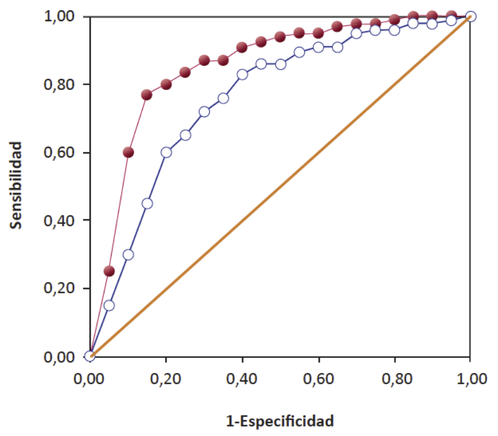
<p class="caption">(\#fig:roc3)Dos curvas ROC.</p>
</div>


La **capacidad discriminatoria global** de una prueba diagnóstica se mide con su **Área Bajo la Curva ROC** (abreviada **AUC**, de *area under the curve*,  en inglés). Este valor es, como su nombre indica, el área comprendida entre la curva ROC y el eje de abscisas $y=0$ entre $x=0$ y $x=1$. Representa el **valor promedio de la sensibilidad** para todos los valores de corte de la prueba 

\BeginKnitrBlock{rmdcorbes}<div class="rmdcorbes">Los que visteis integrales en Matemáticas II del Bachillerato tendríais que recordar que esta área se obtiene integrando entre 0 y 1 la función que define la curva, y que la integral dividida por la longitud de la base, que en este caso es 1, es el valor promedio de la función sobre el intervalo. Por lo tanto, para ser precisos, el AUC es el **valor promedio de la sensibilidad como función de la tasa de falsos positivos**, pero tampoco importa hilar tan fino.</div>\EndKnitrBlock{rmdcorbes}

Así:

* AUC=0.5 es la de la línea de no discriminación. Si una  curva ROC tiene AUC=0.5, consideramos que la prueba diagnóstica es inútil.

* AUC=1 solo es posible si la curva ROC es la recta $y=1$, es decir, si todos los valores de corte tienen sensibilidad 1, lo que solo puede pasar si la prueba siempre da positivo sobre un enfermo, independientemente del valor de corte. 

\BeginKnitrBlock{rmdromans}<div class="rmdromans">¿Cómo podría ser una prueba con esta curva ROC? Pues por ejemplo, imaginad que usamos la temperatura corporal para decidir si una persona está viva o muerta: para una temperatura de corte dada $t_0$, diremos que la persona está viva si su temperatura es superior a $t_0$ y muerta en caso contrario. Y como somos algo raros, vamos a considerar solo temperaturas entre  20 y 25 grados. Entonces, para cualquier valor de corte dentro de este rango, este test dará positivo sobre una persona viva (porque, por definición, se considera que si la temperatura corporal es inferior a los 27 grados, la persona está clínicamente muerta; por lo tanto, toda persona viva tiene una temperatura corporal superior a 27 grados).</div>\EndKnitrBlock{rmdromans}
  

\BeginKnitrBlock{example}<div class="example"><span class="example" id="exm:unnamed-chunk-156"><strong>(\#exm:unnamed-chunk-156) </strong></span>En el estudio ["Proteína C reactiva y lactato deshidrogenasa en el diagnóstico de la obstrucción intestinal en un servicio de urgencias"](http://scielo.isciii.es/pdf/asisna/v39n1/13_original_breve4.pdf)
(R. Rodríguez *et al*, *Anales del Sistema Sanitario de Navarra* 39 (2016), pp. 115-122) se compararon dos técnicas analíticas de diagnóstico de la obstrucción intestinal: los niveles de la proteína C reactiva (PCR) y del enzima lactato deshidrogenasa (LDH) en plasma.
</div>\EndKnitrBlock{example}

La Figura \@ref(fig:rocnavarra) muestra las curvas ROC de ambos tests, con sus valores de AUC y los valores de corte óptimos marcados. La AUC para la prueba de la PCR es 0.8 y la de la prueba del LDH es 0.86. Por lo tanto, la segunda prueba tiene globalmente una mayor capacidad discriminatoria que la primera. Además, tomando como positivo a partir de los valores de corte óptimos en cada test, el nivel de LDH tiene especificidad y sensibilidad mayores: su punto de su curva ROC está más arriba y más a la izquierda que el otro.


<div class="figure" style="text-align: center">

<p class="caption">(\#fig:rocnavarra)Curvas ROC en la Figura 1 del artículo "Proteína C reactiva y lactato deshidrogenasa en el diagnóstico de la obstrucción intestinal en un servicio de urgencias".</p>
</div>


\BeginKnitrBlock{rmdexercici}<div class="rmdexercici">Hablando de vocabulario, en el MIR 2017 pidieron lo siguiente. Un signo **patognomónico** supone:	

1. Una sensibilidad del 100%.
1. Un área bajo la curva (AUC) de 1.
1. Un valor predictivo positivo del 100%. 
1. Un elevado número de falsos positivos.

¡Lo que hay que saber para ser médico! (**Pista**: Viene de *pathos*, enfermedad, como en "patología", y *gnomonicos*, "que permite decidir, discerner").
</div>\EndKnitrBlock{rmdexercici}


## Riesgos {#sec:probaplic2}

Como ya hemos comentado, en estudios médicos las probabilidades también aparecen como "riesgos" de que pase algo. Recordemos que, si simplificamos mucho, podemos entender que en los estudios analíticos cruzamos información sobre dos sucesos que les pueden pasar a las personas:

* El **desenlace**, que para simplificar identificaremos con **enfermedad**: $E$ será el suceso "estar enfermo" y $S$ "estar sano", de manera que $S=E^c$.

* Su **exposición** a un factor de **R**iesgo: $R$ será el suceso "estar (o haber estado) expuesto al factor de riesgo" y $R^c$ su complementario.

Podemos clasificar los sujetos de la población según estos dos pares de sucesos complementarios: 

$$
\begin{array}{l}
\hphantom{ExposiciónExposiciónT}\textbf{Desenlace} \\
\begin{array}{c|c|c}
\textbf{Exposición}  & E & S \\ \hline
R & \text{Expuestos} & \text{Expuestos} \\[-0.5ex]  	
 & \text{enfermos} & \text{sanos} \\ \hline
R^c & \text{No expuestos} & \text{No expuestos} \\[-0.5ex]   	
 & \text{enfermos} & \text{sanos}
\end{array}
\end{array}
$$

\BeginKnitrBlock{rmdnote}<div class="rmdnote">Fijaos en que incluso las pruebas diagnósticas se podrían interpretar en términos de exposición y desenlace: el factor de riesgo sería estar enfermo, el desenlace dar positivo en el test. Pero el lenguaje sobre riesgos va a ser muy diferente del de las pruebas diagnósticas, y además es muy lioso que la enfermedad sea la exposición. Así que preferimos no mezclar y vamos a considerar las pruebas diagnósticas y los estudios de asociación entre una exposición y un desenlace como temas completamente diferentes.</div>\EndKnitrBlock{rmdnote}

Vamos a llamar:

*  **Tasa de riesgo de la enfermedad en expuestos** a la probabilidad de enfermar si se ha estado expuesto, es decir, a $P(E|R)$. 

*  **Tasa de riesgo  de la enfermedad en no expuestos** a la probabilidad de enfermar si **no** se ha estado expuesto, es decir, a $P(E|R^c)$.

Algunas consideraciones, que ya hemos hecho pero volvemos a repetir, sobre cuándo podemos estimar estas tasas de riesgo y cuándo no a partir de los datos de un estudio:

* En un estudio de **cohorte**, partimos de un grupo de expuestos al factor de riesgo y un grupo de no expuestos, y estudiamos la aparición posterior de la enfermedad en ambos grupos. En un estudio **intervencionista**, la situación es similar: sabemos quién está expuesto al factor de riesgo  y quién no, porque nosotros hemos decidido a quién exponemos y a quién no, y estudiamos la aparición posterior de la enfermedad.  
    
    Por lo tanto, en ambos tipos de estudios,  **tiene sentido usar las proporciones que observemos de expuestos y no expuestos que enferman para estimar las tasas de riesgo de la enfermedad en expuestos y no expuestos**, $P(E|R)$ y $P(E|R^c)$. 

* Pero en un estudio de **casos y controles**, partimos de un grupo de enfermos y un grupo de sanos, y estudiamos su exposición previa al factor de riesgo. Si tomamos un grupo de casos y un grupo de controles de tamaños fijados *a priori* y que no representen la composición en enfermos y sanos de la población, **NO tiene sentido usar las proporciones que observemos de expuestos y no expuestos que han enfermado para estimar las tasas de riesgo de la enfermedad en expuestos y no expuestos**, porque los números de enfermos y sanos serán "artificiales". En este tipo de estudios,  **solo tiene sentido estudiar las probabilidades de $R$ (y $R^c$) condicionadas a $E$ y $E^c$**, es decir, $P(R|E)$ y $P(R|E^c)$ y sus complementarios. 

    Si, en cambio, en un estudio de casos y controles **la muestra es transversal** y las proporciones de enfermos y sanos en la muestra son representativos de la población, entonces, **pero solo entonces**, sí que tendrá sentido usar las proporciones que observemos de expuestos y no expuestos que han enfermado  para estimar los valores de $P(E|R)$ y $P(E|R^c)$.

* En un estudio **transversal** la situación es la misma que en un estudio de cohorte, o en un estudio de casos y controles con una muestra transversal. Por lo tanto, **tiene sentido estimar las probabilidades $P(E|R)$ y $P(E|R^c)$**, aunque con una matiz que puede ser importante. Si medimos la exposición y la enfermedad simultáneamente,  las probabilidades $P(E|R)$ y $P(E|R^c)$ que estimemos serán "la probabilidad de que una persona que **ahora** esté expuesta (o no esté expuesta) al factor de riesgo, **ahora** esté enferma". Este no siempre es el significado que nos interesa.


### Riesgos relativos y absolutos {#sec:riesgosRR}

Vamos a suponer en esta sección que queremos estudiar la asociación entre la exposición a un factor de riesgo y la aparición de una enfermedad, y que con el estudio que hemos llevado a cabo tiene sentido estimar las tasas de riesgo de la enfermedad: la probabilidad $P(E|R)$ de que un expuesto enferme y la probabilidad $P(E|R^c)$ de que un no expuesto enferme. El objetivo del estudio es comparar estas dos probabilidades, para ver si el riesgo de enfermar entre los expuestos es significativamente mayor que entre los no expuestos.

¿Cómo se comparan dos números? Los podemos restar o los podemos dividir. Más  vocabulario:

* **Riesgo absoluto**, **RA**: Es la diferencia entre la tasa de riesgo de la enfermedad en expuestos y en no expuestos.  
$$
RA=P(E|R)-P(E|R^c).
$$
    Mide el incremento absoluto en la probabilidad de enfermar debido a la exposición.

*  **Riesgo relativo**, **RR**: Es el cociente entre la tasa de riesgo de la enfermedad en expuestos y en no expuestos. 
$$
RR=\dfrac{P(E|R)}{P(E|R^c)}.
$$
    Mide cuántas veces es más probable enfermar entre los expuestos que entre los no expuestos.

* **Número necesario para dañar**, **NND**: Es el número de personas que tendríamos que exponer al factor de riesgo para que, de media, una persona **adicional** enfermara. Aquí **adicional** significa que si no hubiera estado expuesta, no habría enfermado.

Veamos un ejemplo concreto de RA, RR y, sobre todo, NND, para entender mejor de qué se trata.

\BeginKnitrBlock{example}<div class="example"><span class="example" id="exm:IBScohorte2"><strong>(\#exm:IBScohorte2) </strong></span>Recordad el estudio de Rotterdam del Ejemplo \@ref(exm:EPCOCoh), en el que se observó que  desarrollaron EPOC un 17.8% de los que eran fumadores al inicio del estudio o lo habían sido pero lo habían dejado, frente al 6.4% de los que nunca habían fumado. Para simplificar, a los primeros los llamaremos **fumadores** y a los segundos **no fumadores**. Estos datos nos permiten estimar que si no se es fumador (es decir, si no se fuma ni nunca se ha fumado), se tiene una probabilidad del 6.4% de contraer EPOC, mientras que si se es fumador (ahora o en el pasado), esta probabilidad es del 17.8%. 
</div>\EndKnitrBlock{example}

En este caso, si $R$ es el suceso "ser fumador" y $E$ es el suceso "tener EPOC", entonces estimamos que
$$
P(E|R)=0.178,\quad P(E|R^c)=0.064
$$

Entonces:

* RA=0.178-0.064=0.114: el ser fumador aumenta la probabilidad de contraer EPOC en 0.114.

* RR=0.178/0.064=2.78: el ser fumador multiplica por 2.78 la probabilidad de contraer EPOC, es decir la incrementa un 178%.

* El NND en este contexto sería el número de no fumadores que tendrían que empezar a fumar para añadir 1 caso de EPOC al número esperado de casos.
¿Cómo podemos calcularlo? 

     Veamos, estimamos que, de media, de cada 1000 personas no fumadoras, 64 contraen EPOC, y de cada 1000 personas fumadoras, 178 contraen EPOC. Por lo tanto, si tomáramos 1000 personas no fumadoras y las hiciéramos fumar, el número esperado de casos de EPOC subiría de 64 a 178. Es decir, el número de casos **adicionales** de EPOC sería de 114. Fijaos en que estos casos de EPOC son los aportados por el fumar, ya que de las 178 personas fumadoras  que tendrían EPOC entre estas 1000, 64 habrían tenido EPOC aunque no fumaran.

    Tenemos por tanto que si 1000 no fumadores empiezan a fumar, esperamos 114 casos adicionales de EPOC. ¿Cuántos no fumadores tendrían que empezar a fumar para que esperáramos tener 1 caso adicional de EPOC? Haced la proporción. Si 1000  no fumadores que empiezan a fumar dan 114 casos adicionales de EPOC, el número NND de no fumadores que han de empezar a fumar para obtener 1 caso extra de EPOC es
$$
NND=\frac{1000}{114}=8.8
$$
De media, por cada 8.8 personas no fumadoras que empiezan a fumar, hay un caso extra de EPOC.


\BeginKnitrBlock{rmdcaution}<div class="rmdcaution">Recordad que cuando estimamos estos riesgos en un estudio observacional, solo se trata de asociaciones, de ninguna manera podemos inferir que la exposición **cause** tal o cual incremento en la probabilidad de enfermar. Aunque a veces lo digamos para simplificar el lenguaje. </div>\EndKnitrBlock{rmdcaution}


\BeginKnitrBlock{example}<div class="example"><span class="example" id="exm:sepsis1"><strong>(\#exm:sepsis1) </strong></span>En el estudio ["Exposición prolongada a antibióticos y riesgo de sepsis tardía (ST) en neonatos de 1000 a <1500 g: estudio de cohorte"](https://www.medigraphic.com/pdfs/gaceta/gm-2015/gm153d.pdf) (E. Briones *et al*, *Gaceta Médica de México* 151 (2015), pp. 306-12) se  tomó una cohorte de **expuestos** formada 49 recién nacidos de bajo peso y con infección perinatal que fueron tratados con antibióticos desde  su primer día y durante más de 5 días. Como cohorte **no expuesta** se tomó un grupo de 49 niños en la misma situación, pero con una duración del tratamiento de antibióticos de ≤ 5 días. Tanto unos como otros no tenían síntomas de sepsis al iniciar el tratamiento. Se les realizó un seguimiento para detectar la aparición de sepsis a partir del quinto día de vida (será lo que llamaremos sepsis tardía, ST, para abreviar).

</div>\EndKnitrBlock{example}

Nuestra población de interés son recién nacidos de bajo peso tratados con antibióticos. Denotemos por $R$ el suceso "estar expuesto", es decir, recibir el tratamiento de antibióticos durante 5 o más días, y por $E$ el suceso "enfermar", es decir, desarrollar ST. En este estudio se obtuvo la tabla de frecuencias siguiente:
$$
\begin{array}{c|cc|c}
 & E & E^c & \text{Total}\\ \hline
R & 32 & 17 & 49   \\ 
R^c & 4 & 45 & 49\\ \hline
\text{Total} & 36 & 62 & 98
\end{array}
$$
 
Vamos a estimar el RA, el RR y el NND de ST para la exposición a un tratamiento de más de 5  días de antibióticos.

En primer lugar, estimamos los riesgos:
$$
P(E|R)=\frac{32}{49}=0.653,\quad
P(E|R^c)=\frac{4}{49}=0.082
$$
Entonces:

* $RR= \dfrac{32/49}{4/49}=8$.
    
    Entre los neonatos de bajo peso, el tratamiento con antibióticos durante más de 5 días  **multiplica por 8** el riesgo de ST, es decir, lo aumenta en un 700%.

* $RA=\dfrac{32}{49}-\dfrac{4}{49}=\dfrac{28}{49}=0.571$.

    El tratamiento con antibióticos durante más de 5 días aumenta en un 57.1%  el riesgo de ST.
    
\BeginKnitrBlock{rmderror}<div class="rmderror">¿Cómo puede un riesgo ser,  al mismo tiempo, un 700% mayor y un 57.1% mayor que el otro?
  
Lo de que aumente un 57.1% es incorrecto. Si el RA es 0.571, el riesgo de ST entre los expuestos  **no es un 57.1% mayor que entre los no expuestos, sino 57.1 puntos porcentuales mayor**.</div>\EndKnitrBlock{rmderror}
    


\BeginKnitrBlock{rmdimportant}<div class="rmdimportant">¡Cuidado con cómo os expresáis! El riesgo de ST entre los no expuestos es del 8.2% y entre los expuestos es del 65.3%. Por lo tanto, el riesgo entre los expuestos es **57.1 puntos porcentuales mayor** que entre los no expuestos. No un 57.1% mayor.

Que fuera un 57.1% mayor significaría que
$$
P(E|R)=P(E|R^c)+0.571\cdot P(E|R^c)
$$
pero en nuestro caso lo que tenemos es
$$
P(E|R)=P(E|R^c)+0.571.
$$
No es lo mismo.</div>\EndKnitrBlock{rmdimportant}

* Falta el NND. De media, de cada 100 neonatos de bajo peso tratados con antibióticos ≤ 5 días, 8.2 sufren ST, y de cada 100 neonatos de bajo peso tratados con antibióticos > 5 días, 65.3 sufren ST. Por lo tanto, si tomamos 100 neonatos de bajo peso y en vez de tratarlos ≤ 5 días con antibiótico los tratamos > 5 días, el número esperado de casos de ST sube de 8.2 a 65.3. Es decir, si "exponemos" 100 niños, esperamos 57.1 casos de ST adicionales. 

    Por lo tanto, para esperar 1 caso de ST adicional hay que "exponer" 100/57.1=1.75 recién nacidos. Este es el NND requerido: el número de neonatos de bajo peso que tendríamos que pasar de tratar  5 días o menos con antibióticos a tratarlos más de 5 días para tener un caso de ST adicional, en el sentido de que no se daría si no se los cambiara de tratamiento.

\BeginKnitrBlock{rmdimportant}<div class="rmdimportant">Por si no habéis caído en la cuenta:

* En el ejemplo del estudio de Rotterdam, el NND ha sido 1000/114=1/0.114=1/RA
* En el ejemplo de la sepsis tardía, el NND ha sido 100/57.1=1/0.571=1/RA. 

¿Casualidad? No.
</div>\EndKnitrBlock{rmdimportant}

\BeginKnitrBlock{theorem}<div class="theorem"><span class="theorem" id="thm:unnamed-chunk-163"><strong>(\#thm:unnamed-chunk-163) </strong></span>$NND=1/RA$.

</div>\EndKnitrBlock{theorem}

\BeginKnitrBlock{rmdcorbes}<div class="rmdcorbes">La justificación de esta igualdad es simplemente repetir el argumento que hemos usado para calcular los NND, pero con valores genéricos para $P(E|R)$ y $P(E|R^c)$. Supongamos que $P(E|R)=x$ y $P(E|R^c)=y$, de manera que $RA=y-x$. Esto significa que:

* Por cada 100 sujetos no expuestos, de media $100x$ enferman.

* Por cada 100 sujetos expuestos, de media $100y$ enferman.

* Por cada 100 sujetos que pasemos de no expuestos a expuestos, de media $100(y-x)$  adicionales enfermarán.

* Por lo tanto, el número de sujetos que hemos de exponer de media al factor de riesgo para tener 1 enfermo adicional es 
$$
\frac{100}{100(y-x)}=\frac{1}{y-x}=\frac{1}{RA}.
$$
</div>\EndKnitrBlock{rmdcorbes}
  

Por lo tanto, la información que aportan el RA y el NND son la misma, solo que presentada de otra manera.

\BeginKnitrBlock{rmdromans}<div class="rmdromans">Como podéis ver en la Figura \@ref(fig:tabla2ST), los autores estimaron un RR de ST de 21.1. A nosotros nos ha salido un RR de 8. ¿Cómo les puede haber salido ese RR=21.1? Continuará.</div>\EndKnitrBlock{rmdromans}


<div class="figure" style="text-align: center">
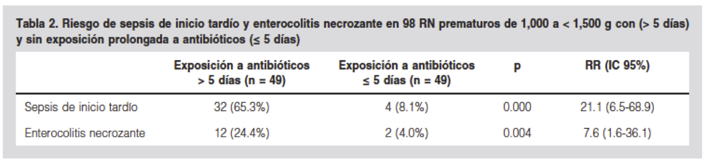
<p class="caption">(\#fig:tabla2ST)Tabla 2 en el artículo "Exposición prolongada a antibióticos y riesgo de sepsis tardía (ST) en neonatos de 1000 a <1500 g: estudio de cohorte".</p>
</div>


Muchas veces nos dan los valores del RA o el RR de una exposición, pero no nos dan la tasa de riesgo en los no expuestos. Entonces, solo sabemos cuánto aumenta el riesgo pero no sabemos de qué valor parte, y esto nos impide entender completamente la situación. 

\BeginKnitrBlock{rmdnote}<div class="rmdnote">Aunque, si os dan el RA **y** el RR, podéis obtener las tasas de riesgo resolviendo un sencillo sistema lineal de ecuaciones
$$
\left\{\begin{array}{l}
P(E|R)-P(E|R^c)=RA\\
P(E|R)=RR\cdot P(E|R^c)
\end{array}\right.
$$</div>\EndKnitrBlock{rmdnote}

\BeginKnitrBlock{example}<div class="example"><span class="example" id="exm:unnamed-chunk-167"><strong>(\#exm:unnamed-chunk-167) </strong></span>La página ["Terapia hormonal en la menopausia y el riesgo de padecer cáncer"](https://www.cancer.org/es/cancer/causas-del-cancer/tratamientos-medicos/terapia-de-restitucion-de-hormonas-en-la-menopausia-y-el-riesgo-de-cancer.html)  de la *American Cancer Society* recoge, entre muchos otros, los datos siguientes:
  
</div>\EndKnitrBlock{example}

* Las mujeres sometidas a terapia de reemplazo hormonal reducen su riesgo de cáncer colorectal a 10 años vista en un 50%. 

* Las mujeres sometidas a terapia de reemplazo hormonal aumentan su riesgo de cáncer de mama en los próximos 10 años en 0.8 puntos porcentuales (8 de cada 1000).

Parece que, en el cómputo global, la terapia de reemplazo hormonal previene los casos de cáncer, ¿verdad? Baja el riesgo de uno en un 50% y sube el riesgo de otro 0.8 puntos porcentuales. Pero no. 

Según los [*Cancer Stat Facts*](https://seer.cancer.gov/statfacts/) del Instituto Nacional del Cáncer (de los EEUU), la incidencia del cáncer colorectal en mujeres es de 4 por cada 10,000 anuales. Por lo tanto, de 4 casos por cada 1000 mujeres cada 10 años. La reducción en un 50% significa que baja a 2 por cada 1000. En resumen, por cada 1000 mujeres y 10 años,  la terapia de reemplazo hormonal reduce en 2 el número estimado de casos de cáncer colorectal y aumenta en 8 el número  estimado de casos de cáncer de mama. Por tanto,  por cada 1000 mujeres y 10 años, aumenta en 6 el número  esperado de casos de cáncer.

\BeginKnitrBlock{rmdexercici}<div class="rmdexercici">Los 50% y 0.8% que aparecen en el ejemplo anterior, ¿qué son: riesgos absolutos o riesgos relativos? ¿Cuántas mujeres hemos de empezar a tratar  con terapia de reemplazo hormonal para tener 1 caso adicional de cáncer en 10 años?</div>\EndKnitrBlock{rmdexercici}


Insistimos.

\BeginKnitrBlock{example}<div class="example"><span class="example" id="exm:unnamed-chunk-169"><strong>(\#exm:unnamed-chunk-169) </strong></span>Según la *National Cancer Institute's Breast Cancer tool* de 1998, 

* "Las mujeres que toman tamoxiflen tienen un 49% menos de diagnósticos de cáncer invasivo de mama"

*  "La tasa anual de cáncer uterino entre las mujeres que toman tamoxiflen es de 30 por cada 10,000, comparado con los 8 a 10 por cada 10,000 anuales en la población femenina general"
</div>\EndKnitrBlock{example}

Pero la incidencia anual del cáncer invasivo de mama era de 18 por cada 10,000 mujeres, por lo tanto

* El tamoxiflen reduce del 0.18% a 0.09% el  riesgo de cáncer invasivo de mama
* Y aumenta el riesgo  de cáncer uterino de 0.08% a 0.3%.
* Por lo tanto, en términos absolutos, aumenta del 0.26% al 0.39% el riesgo de alguno de los dos cánceres: en algo más de 1 por cada 1000 mujeres


Un último ejemplo.


\BeginKnitrBlock{example}<div class="example"><span class="example" id="exm:pindolatr"><strong>(\#exm:pindolatr) </strong></span>En octubre de 1995, se publicó en la prensa británica y en circulares a médicos que los anticonceptivos de 3^a^ generación multiplicaban por 2 el riesgo de trombosis venosa (TV). Esta afirmación se basaba en varios estudios publicados o anunciados ese año, como por ejemplo el del grupo *World Health Organization Collaborative Study of Cardiovascular Disease and Steroid Hormone Contraception*: ["Venous thromboembolic disease and combined oral contraceptives: results of international multicentre case-control study"](https://resourcelibrary.stfm.org/HigherLogic/System/DownloadDocumentFile.ashx?DocumentFileKey=01b7b448-119e-c8ac-d90a-800aaf096608&forceDialog=0) (*The Lancet* 346 (1996), pp. 1575-1582).

El resultado del "susto de la píldora del 95" fue una reducción en el consumo de la píldora anticonceptiva en el Reino Unido, como muestra la tabla de la Figura \@ref(fig:tableIV), y como consecuencia que en 1996 hubiera unos 13,600 abortos  más y unos 12,400 nacimientos más que en 1995.    Encontraréis más detalles de esta historia y su coste social y sanitario en ["Social consequences. The public health implications of the 1995 `pill scare'"](https://academic.oup.com/humupd/article/5/6/621/745751) (A. Furedi, *Human Reproduction Update*, 5 (1999), pp. 621-626).

</div>\EndKnitrBlock{example}


<div class="figure" style="text-align: center">
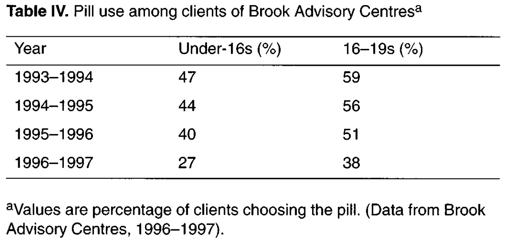
<p class="caption">(\#fig:tableIV)Tabla IV en el artículo "Social consequences. The public health implications of the 1995 pill scare".</p>
</div>

Vamos a analizar la afirmación de que "los anticonceptivos de 3^a^ generación multiplican por 2 el riesgo de TV" en términos de riesgos. Según [MedSafe](https://www.medsafe.govt.nz/consumers/leaflets/oralcontraceptives.asp), entre las mujeres de entre 15 y 44 años:

* Entre 5/100,000 y 10/100,000 mujeres anuales padecen una TV: tomaremos la media, 7.5/100,000.

* Tomar anticonceptivos de 2^a^ generación multiplica por 3.5 este riesgo (es decir, su RR es 3.5): 26.25/100,000 mujeres anuales 

* Tomar anticonceptivos de 3^a^ generación multiplica por 2 este último riesgo: 52.5/100,000 mujeres anuales 

Por tanto, si bien el RR de los anticonceptivos de 3^a^ generación respecto de los de 2^a^ generación es 2, en términos absolutos solo representa un aumento esperado de 26 casos de TV por cada 100,000 mujeres que pasen de anticonceptivos de 2^a^ a 3^a^ generación.

Pongamos estos números en perspectiva:

* El riesgo de TV durante o inmediatamente después del embarazo se estima en Europa de 71/100,000 (según el [*UpToDate* "Deep vein thrombosis in pregnancy: Epidemiology, pathogenesis, and diagnosis"](\url{http://www.uptodate.com/contents/deep-vein-thrombosis-in-pregnancy-epidemiology-pathogenesis-and-diagnosis)). Es decir, el riesgo de sufrir TV asociado a un embarazo es un 35% mayor que el de tenerla ese mismo año tomando los anticonceptivos de 3^a^ generación.   

* El riesgo de TV durante los 42 días posteriores a un aborto inducido es de 30/100,000 abortos. Si hacéis la proporción, veréis que  el riesgo de sufrir una TV una mujer que tome anticonceptivos de 3^a^ generación durante un periodo de 42 días es de 6/100,000.

Por lo tanto, el aumento de embarazos y abortos por miedo al riesgo de TV si se tomaba un anticonceptivo de 3^a^ generación de hecho aumentó  el riesgo de TV en la población femenina. 


### *Odds ratios*  {#sec:riesgosCyC}

En los estudios de cohorte, en los que tomamos un grupo de expuestos y uno de no expuestos y observamos en ellos la aparición de la enfermedad, siempre tiene sentido calcular los riesgos en el sentido que nos interesa:  $P(E|R)$ y $P(E|R^c)$. Pero en un estudio de casos y controles en los que se tomen  números prefijados de casos y controles, no tiene ningún sentido estimar los riesgos $P(E|R)$ y $P(E|R^c)$, y solo tiene sentido estimar las probabilidades $P(R|E)$ y $P(R|E^c)$, y sus complementarias $P(R^c|E)$ y $P(R^c|E^c)$. Si además tenemos una estimación de $P(E)$, podemos girar las probabilidades condicionadas usando la fórmula de Bayes y estimar $P(E|R)$ y $P(E|R^c)$. Pero, ¿y si no? ¿Qué podemos hacer entonces?


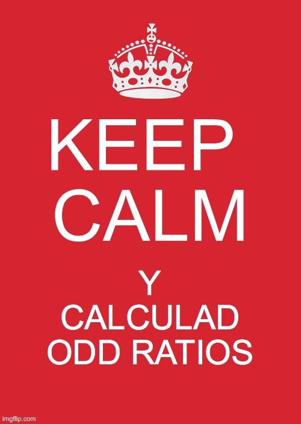


En este caso, se calcula **la *odds ratio* de la exposición respecto de la enfermedad**: el cociente de las *odds* de haber estado expuestos entre los enfermos y las *odds* de haber estado expuestos entre los sanos.
$$
OR(R|E)=\dfrac{P(R|E)/P(R^c|E)}{P(R|E^c)/P(R^c|E^c)}
$$
Este valor tiene sentido estimarlo con los datos obtenidos en un estudio de casos y controles, porque usa las probabilidades que se pueden estimar en estos estudios. ¿Pero qué conseguimos calculándolo?

En primer lugar, por el Teorema \@ref(thm:ORrelativa):

\BeginKnitrBlock{rmdimportant}<div class="rmdimportant">La *odds ratio* $OR(R|E)$ de la exposición respecto de la enfermedad coincide con la *odds ratio* de la enfermedad respecto de la exposición $OR(E|R)$: el cociente de las *odds* de enfermar entre los expuestos y las *odds* de enfermar entre los no expuestos.
$$
OR(E|R)=\frac{P(E|R)/P(E^c|R)}{P(E|R^c)/P(E^c|R^c)}
$$
</div>\EndKnitrBlock{rmdimportant}

Por lo tanto, la estimación de la *odds ratio* de la exposición respecto de la enfermedad también estima la *odds ratio* de la enfermedad respecto de la exposición. Así pues, en un estudio de casos y controles, calculando la $OR(R|E)$ **podemos estimar cuántas veces mayores son las *odds* de contraer la enfermedad si se está expuesto que si no se está expuesto**. 

\BeginKnitrBlock{rmdnote}<div class="rmdnote">Como $OR(E|R)=OR(R|E)$, a partir de ahora la denotaremos simplemente por $OR$.</div>\EndKnitrBlock{rmdnote}

A nosotros nos gustaría tener esta información en términos de riesgos relativos: cuántas veces mayor es la probabilidad de contraer la enfermedad si se está expuesto que si no se está expuesto. Bueno, la vida es dura, en un estudio de casos y controles este cociente no siempre se puede estimar, pero en cambio sí que siempre se puede estimar el "incremento de riesgo" en términos de "incremento de *odds*", mediante la *odds ratio*.

En segundo lugar:

\BeginKnitrBlock{rmdimportant}<div class="rmdimportant">Si la enfermedad es **rara** en el sentido de muy poco prevalente, es decir, si $P(E)$ es muy pequeña, entonces la OR es aproximadamente igual al RR.</div>\EndKnitrBlock{rmdimportant}

\BeginKnitrBlock{rmdcorbes}<div class="rmdcorbes">En efecto, si $P(E)$ es tan pequeña que $P(E\cap R)$ es mucho más pequeña que $P(E^c\cap R)$ y $P(E\cap R^c)$ es mucho más pequeña que $P(E^c\cap R^c)$, entonces
$$
\begin{array}{rl}
RR\!\!\!\! & =\dfrac{P(E|R)}{P(E|R^c)}
=\dfrac{P(E\cap R)/P(R)}{P(E\cap R^c)/P(R^c)}\\
& =\dfrac{{P(E\cap R)}/({P(E\cap R)+P(E^c\cap R)})}{{P(E\cap R^c)}/({P(E\cap R^c)+P(E^c\cap R^c)})}\\
& \approx \dfrac{{P(E\cap R)}/{P(E^c\cap R)}}{{P(E\cap R^c)}/{P(E^c\cap R^c)}}=\dfrac{P(E\cap R)P(E^c\cap R^c)}{P(E^c\cap R) P(E\cap R^c)}\\
& = \dfrac{P(E|R)P(R)P(E^c|R^c)P(R^c)}{P(E^c|R)P(R) P(E|R^c)P(R^c)}\\
& = \dfrac{P(E|R)P(E^c|R^c)}{P(E^c|R) P(E|R^c)}=OR
\end{array}
$$</div>\EndKnitrBlock{rmdcorbes}
  
En resumen, en un estudio de casos y controles en el que los números de casos y controles no son representativos de las proporciones de enfermos y sanos en la población:

* No podemos estimar $RR=P(E|R)/P(E|R^c)$

* Sí que podemos estimar $OR=\text{Odds}(R|E)/\text{Odds}(R|E^c)$

* Resulta que $OR$ es igual a la *odds ratio* $OR(E|R)$ de enfermar relativa a estar expuesto: el cociente entre las *odds* de enfermar entre los expuestos y las *odds* de enfermar entre los no expuestos. Algo es algo.

* Si $P(E)$ es muy pequeña, se tiene que $OR\approx RR$. 
  
En todo caso, recordad    que si la muestra de sujetos usados en un estudio de casos y controles es representativa de la población, por ejemplo porque hemos tomado una muestra transversal y considerado como casos los enfermos que hemos encontrado y como cohortes los sanos, entonces no hace falta que nos compliquemos tanto la vida.  Podemos estimar con nuestra muestra $P(E)$, $P(R|E)$ y $P(R|E^c)$ y usando la fórmula de Bayes podemos obtener $P(E|R)$ y $P(E|R^c)$ y con ellos los riesgos absoluto y  relativo. 

Dado que siempre es más sencillo entender un riesgo relativo que una *odds ratio*, **lo adecuado es calcular el RR siempre que se pueda, y solo calcular la OR cuando no haya más remedio.** Pero en los artículos científicos podéis encontrar de todo.

Antes de pasar a algunos ejemplos, veamos una fórmula sencilla para calcular la $OR$ dada una tabla de frecuencias.

\BeginKnitrBlock{rmdimportant}<div class="rmdimportant">Dada la tabla de frecuencias
$$
\begin{array}{c|cc}
        & E & E^c \\ \hline
R & a & b   \\ 
R^c & c & d\\ \hline
\text{Total} & a+c & b+d
 \end{array}
$$
se tiene que $OR=\dfrac{a\cdot d}{b\cdot c}$.
</div>\EndKnitrBlock{rmdimportant}
  
En efecto, 
$$
\begin{array}{l}
P(R|E)=\dfrac{a}{a+c},\ P(R|E^c)=\dfrac{b}{b+d}\\
P(R^c|E)=\dfrac{c}{a+c},\ P(R^c|E^c)=\dfrac{d}{b+d}
\end{array}
$$
y por lo tanto
$$
OR=\frac{\dfrac{a}{a+c}\Big/\dfrac{c}{a+c}}{\dfrac{b}{b+d}\Big/\dfrac{d}{b+d}}=\frac{a/c}{b/d}=\frac{a\cdot d}{b\cdot c}
$$

\BeginKnitrBlock{example}<div class="example"><span class="example" id="exm:unnamed-chunk-175"><strong>(\#exm:unnamed-chunk-175) </strong></span>En el estudio de casos y controles ["Factores de riesgo para bacteriemia por *Pseudomonas aeruginosa* resistente a carbapenémicos adquirida en un hospital colombiano"](https://www.redalyc.org/pdf/843/84346573010.pdf) (S. Valderrama *et al*,  *Biomédica* 36 (2016), pp. 69-77) se tomó como casos un grupo de pacientes con bacteriemia por *P. aeruginosa* resistente a carbapenémicos (un determinado tipo de antibióticos) y como controles un grupo de pacientes con bacteriemia por *P. aeruginosa* sensible a estos antibióticos. Se midieron varias características sobre ellos, como por ejemplo si se les había administrado previamente  meropenem (un carbapenémico) o nutrición parenteral.

</div>\EndKnitrBlock{example}

Los resultados sobre estos dos riesgos se recogen en la tabla siguiente:
$$ 
\begin{array}{r|cc}
&\text{Casos} &\text{Controles} \\[-0.5ex]
\textbf{Riesgo} & (n=42) & (n=126) \\ \hline
 \text{Nutrición parenteral} & 13\ (31\%) & 9\ (7.2\%) \\ \hline
 \text{Uso de meropenem} & 16\ (38.1\%) & 14\ (11.1\%)
 \end{array}
$$

El grupo de casos y controles se tomó con una composición específica, tres controles por caso, por lo que no podemos estimar riesgos de la enfermedad (resistencia de la  *P. aeruginosa*) en función de la exposición. No hay más remedio que calcular *odds ratios*. Para ello tenemos que extraer una tabla de frecuencias de expuestos y no expuestos entre sanos y controles. Lo haremos para la nutrición parenteral, dejamos como **ejercicio** calcularla para  haber tomado meropenem.


La tabla de frecuencias para la nutrición parenteral es
$$ 
\begin{array}{r|cc}
&E &E^c \\ \hline
R & 13  & 9  \\ 
R^c & 29 & 117\\ \hline
\text{Total} & 42 & 126
 \end{array}
$$
La *odds ratio* es
$$
OR=\frac{13\cdot 117}{29\cdot 9}=5.83
$$
Estimamos que las *odds* de tener una bacteriemia por *P. aeruginosa* resistente entre los pacientes con bacteriemia por *P. aeruginosa* a los que se ha administrado nutrición parenteral son 5.8 veces mayores que las de  los pacientes con bacteriemia por *P. aeruginosa* a los que no se ha administrado nutrición parenteral.


\BeginKnitrBlock{example}<div class="example"><span class="example" id="exm:sepsis3"><strong>(\#exm:sepsis3) </strong></span>Volvamos al estudio de cohorte sobre la aparición de sepsis tardía en neonatos asociada a tratamientos de más de 5 días con antibióticos del Ejemplo \@ref(exm:sepsis1). Os recordamos la tabla de frecuencias que se obtuvo:

</div>\EndKnitrBlock{example}

$$
\begin{array}{c|cc|c}
 & E & E^c & \text{Total}\\ \hline
R & 32 & 17 & 49   \\ 
R^c & 4 & 45 & 49\\ \hline
\text{Total} & 36 & 62 & 98
\end{array}
$$

Estimábamos el RR:
$$
RR=\frac{P(E|R)}{P(E|R^c)}=\frac{32/49}{4/49}=8
$$
y decíamos que en el artículo los autores estimaban que RR=21.1. ¿De dónde sale este valor? Es la *odds ratio* mal redondeada:
$$
OR= \dfrac{32\cdot 45}{17\cdot 4}=21.176
$$
 
Por lo tanto, estimamos que, entre los neonatos de bajo peso tratados con antibióticos, las *odds* de tener sepsis tardía entre los que han tomado antibióticos más de 5 días son 21.2 veces  las de los que han recibido antibióticos 5 días o menos 

De esta manera vemos que los autores del artículo han cometido varios errores que vosotros tenéis que evitar:

1. Los autores calculan la OR y dicen que se trata del RR
2. La sepsis tardía entre neonatos a los que se administran antibióticos no es rara, por lo que es incorrecto aproximar el RR por medio de la OR
3. Con los datos que tenían, podían estimar perfectamente el RR, si era lo que querían.


## Tratamientos

Los estudios de cohorte e intervencionistas sobre la efectividad de un tratamiento pueden analizarse como los de la sección anterior, solo que cambia ligeramente el lenguaje, por lo que hemos optado por tratarlos en una sección diferente. 

En el contexto de los estudios de tratamientos, tenemos dos sucesos básicos:

*  El **desenlace en el sujeto**. Denotaremos por $E$ el desenlace  negativo (no se cura, se muere, recae...)  y su complementario será $E^c$: se cura, no se muere, no recae... 

*  El **tratamiento** que recibe el sujeto (que corresponde a la exposición al factor de riesgo en la sección anterior). $T$ indicará que es tratado con el tratamiento objeto de estudio, y $T^c$ que pertenece al grupo de control: no se le da nada, recibe placebo o el tratamiento de referencia... 

Podemos  clasificar los sujetos de la población según estos dos pares de sucesos complementarios: 

$$
\begin{array}{l}
\hphantom{TratamientTratamientooo} \textbf{Desenlace}\\
\begin{array}{r|c|c}
\textbf{Tratamiento} & E & E^c \\ \hline
 & \text{Tratados} & \text{Tratados} \\[-1ex]  	
T & \text{con desenlace} & \text{con desenlace} \\[-1ex] 
 & \text{negativo} & \text{positivo} \\ 
 \hline
& \text{No tratados} & \text{No tratados} \\[-1ex]  	
T^c & \text{con desenlace} & \text{con desenlace} \\[-1ex]  
 & \text{negativo} & \text{positivo} 
\end{array}
\end{array}
$$

 
Tenemos entonces las mismas tasas de riesgo que la sección anterior:

*  **Tasa de riesgo de desenlace negativo en tratados**, $P(E|T)$: La probabilidad de desenlace negativo entre las personas tratadas.

*  **Tasa de riesgo de desenlace negativo en no tratados**, $P(E|T^c)$: La probabilidad de desenlace negativo entre las personas no tratadas. 

*  **Tasa de curación** (**o  de desenlace positivo**) **en tratados**, $P(E^c|T)$: La probabilidad de desenlace positivo entre las personas tratadas.

*  **Tasa de curación** (**o  de desenlace positivo**) **en no tratados**, $P(E^c|T^c)$: La probabilidad de desenlace positivo entre las personas no tratadas. 

Para compararlas, podemos dividirlas o restarlas. 

*  **Riesgo relativo**, **RR**:  El cociente entre las probabilidades de desenlace negativo entre los tratados y entre los no tratados 
$$
RR=\dfrac{P(E|T)}{P(E|T^c)}.
$$

*  **Reducción absoluta del riesgo**, **RAR**: La diferencia entre las probabilidades de desenlace positivo entre los tratados y entre los no tratados, que coincide con la diferencia entre las probabilidades de desenlace negativo entre los no tratados y entre los tratados:  
$$
\begin{array}{rl}
RAR\!\!\!\! & =P(E^c|T)-P(E^c|T^c)\\
& =(1-P(E|T))-(1-P(E|T^c))\\
& =P(E|T^c)-P(E|T)
\end{array}
$$
    Fijaos en el cambio de nombre respecto a la sección anterior: en el contexto de exposición y enfermedad, a esta resta la hemos llamado "riesgo absoluto", RA, y aquí "reducción absoluta del riesgo", RAR.

En el contexto de los tratamientos a veces se usa el cociente siguiente como alternativa al RR:

*  **Reducción relativa del riesgo**: La fracción de la probabilidad de desenlace negativo entre los no tratados que representa la reducción absoluta del riesgo 
$$
RRR=\dfrac{P(E|T^c)-P(E|T)}{P(E|T^c)}=1-RR.
$$

Además en el contexto de los tratamientos se usa, en vez del NND, el número siguiente:

* **Número necesario para tratar** (**NNT**): número de pacientes que deberían empezar a recibir el tratamiento $T$ (en lugar del control $T^c$) para que, de media, un paciente **adicional** recibiera el beneficio (pasara de $E$ a $E^c$).

Veamos un ejemplo concreto de NNT, para ayudar a entenderlo.

\BeginKnitrBlock{example}<div class="example"><span class="example" id="exm:unnamed-chunk-176"><strong>(\#exm:unnamed-chunk-176) </strong></span>Imaginad la situación en la que con el tratamiento se cura el 30% de los enfermos y sin el tratamiento solo se cura el 10%. Es decir, $P(E|T)=0.7$ y $P(E|T^c)=0.9$. ¿A cuántos pacientes tendríamos que empezar a tratar, de media, para que se curara 1 paciente adicional (que no se curaría sin el tratamiento)?
     
De media, por cada 100 pacientes, si los dejamos sin tratar se curan 10 y si los tratamos se curan 30. Por lo tanto, por cada 100 pacientes que pasamos de no tratados a tratados, se añaden de media 20 pacientes al conjunto de los curados. Es decir, cada 100 pacientes que tratamos significan,  de media, 20 curados adicionales (que se suman a los que se curarían sin necesidad de tratamiento). ¿Cuántos hemos de tratar para que tengamos 1 curado adicional?   Si 100 pacientes tratados dan 20 curados adicionales, el número NNT de pacientes tratados para obtener 1 curado extra es
$$
NNT=\frac{100}{20}=5
$$
  </div>\EndKnitrBlock{example}
  
El mismo argumento que para el NND y que el dado en el ejemplo anterior, prueba la siguiente igualdad:
\BeginKnitrBlock{theorem}<div class="theorem"><span class="theorem" id="thm:unnamed-chunk-177"><strong>(\#thm:unnamed-chunk-177) </strong></span>$NNT=1/RAR$.

</div>\EndKnitrBlock{theorem}
     

Por lo tanto, en el caso de tratamientos, el RAR y el NNT tienen la misma información.

De nuevo, hay que tener cuidado al interpretar los RR, RAR y  NNT, ya que solo dan valores "relativos" y por tanto sin saber el riesgo de desenlace negativo en los no tratados, no podemos saber realmente lo beneficioso que es el tratamiento. 


\BeginKnitrBlock{rmdexercici}<div class="rmdexercici">En el artículo ["Helsinki heart study: primary prevention trial with gemfibrozil in middle-aged men with dyslipidemia"](https://www.nejm.org/doi/full/10.1056/NEJM198711123172001)
(M. Frick *et al*, *The New England Journal of Medicine*  317 (1987), pp. 1237-1245) se describe un ensayo clínico en el que se tomó un grupo de pacientes de mediana edad con niveles altos de colesterol no HDL, se dividió al azar en dos grupos. Los de un grupo  tomaron gemfibrozil durante 5 años y los del otro grupo  tomaron placebo durante el mismo período de tiempo. Se les hizo un seguimiento para determinar si desarrollaban alguna enfermedad coronaria (EC) durante el período de 5 años. Se obtuvo la tabla de frecuencias siguiente
$$
\begin{array}{l}
\hphantom{ECGemfi} \textbf{Tratamiento}\\
\begin{array}{r|cc|c}
\textbf{EC?} & \text{Gemfibrozil} & \text{Placebo}& \text{Total} \\ \hline
\text{Sí} & 56 & 84 & 140\\
\text{No} & 1995 & 1946 & 3941 \\ \hline
\text{Total} & 2051 & 2030 & 4081
\end{array}
\end{array}
$$
Calculad los RR, RAR, RRR y NNT y explicad su significado.

</div>\EndKnitrBlock{rmdexercici}


**Spoiler**: Si llamamos $EC$ a desarrollar alguna enfermedad coronaria y $T$ a tomar gemfibrozil durante 5 años,

* $P(EC|T)=0.027$ y $P(EC|T^c)=0.041$
* RR=0.66. La administración de gemfibrozil reduce en un 34% el riesgo de enfermedad cardíaca.
* RAR=0.014. La administración de gemfibrozil reduce en 1.4 puntos porcentuales el riesgo de enfermedad cardíaca.
* RRR=0.34. La administración de gemfibrozil reduce en un 34% el riesgo  de enfermedad cardíaca.
* NNT=71. De media, por cada 71 pacientes que tratamos con gemfibrozil evitamos 1 enfermedad cardíaca.

\BeginKnitrBlock{example}<div class="example"><span class="example" id="exm:unnamed-chunk-179"><strong>(\#exm:unnamed-chunk-179) </strong></span>En el estudio ["Completeness of reporting trial results: effect on physicians' willingness to prescribe."](https://www.sciencedirect.com/science/article/pii/S0140673694924074)(M.  Bobbio *et al*,  *The Lancet* 343 (1994), pp. 1209-1211) se explicó a 148 médicos los resultados que se habían obtenido en unos ensayos clínicos similares (controlados con placebo) sobre 4 tratamientos  para que decidieran para cada uno de ellos si lo recetarían para reducir el colesterol. Se les dijo que:
</div>\EndKnitrBlock{example}

*  Con el tratamiento A se obtuvo una reducción relativa del 34% en el riesgo de enfermedades coronarias

*  Con el tratamiento B, la reducción absoluta del riesgo de enfermedades coronarias fue de 1.4 puntos porcentuales.

*  Con el tratamiento C, la tasa de pacientes sin enfermedades coronarias subió del 95.9% al 97.3%.

*  Con el tratamiento D, se necesita tratar de media 71 pacientes para evitar una enfermedad coronaria.

¿Habéis reconocido los datos? Los 4 describen los resultados del estudio cardíaco de Helsinki del ejercicio anterior, es decir, el mismo tratamiento: gemfibrozil. Pues bien:

* Un 77% de los médicos encuestados dijeron que recetarían el tratamiento A.

* Un 24% de los médicos encuestados dijeron que recetarían el tratamiento B.

* Un 37% de los médicos encuestados dijeron que recetarían el tratamiento C.

* Un 33% de los médicos encuestados dijeron que recetarían el tratamiento D.

* Ningún médico respondió lo mismo a los cuatro tratamientos.

Como podéis ver, la manera como se presentan los resultados de un estudio sobre un tratamiento influye en nuestra percepción de la bondad del tratamiento.

Este tipo de estudio se ha ido repitiendo a lo largo del tiempo, para ver si los nuevos facultativos entrenados en  medicina basada en la evidencia eran tan fáciles de engañar como los de 1994. Algo ha mejorado, pero no completamente. Por ejemplo, en ["Effects of presenting risk information in different formats to cardiologists. A Latin American survey"](http://www.archivoscardiologia.com/previos/(2015)%20ACM%20Vol%2085.%201%20ENERO-MARZO/ACMX_2015_85_1_003-008.pdf)
(R. Borracci *et al*, *Archivos de Cardiología de México* 85 (2015), pp. 3-8) se pasó un cuestionario que contenía resultados de ensayos clínicos expresados en términos de RR, RAR o NNT a 406 cardiólogos. Cuando la misma información se presentaba en términos de RR, los cardiólogos eran más fáciles de convencer de la bondad del tratamiento que si se presentaba como NNT o RAR. En cambio, no hubo diferencias significativas entre estos dos últimos (que, recordemos, son equivalentes). 


## Test


**(1)** Una prueba diagnóstica muy específica nos asegura:

1. Pocos errores en general.
1. Pocos falsos positivos.
1. Pocos falsos negativos.
1. Pocos diagnósticos positivos.
1. Pocos diagnósticos negativos.

**(2)** Estáis  comparando el diagnóstico clínico de úlcera gastroduodenal y su hallazgo en la autopsia en una serie de 10,000 pacientes. Al comenzar a analizar los datos se construye la siguiente tabla:
$$
\begin{array}{l}
\ \,  \textbf{Diagnóstico}\hphantom{clínico }\textbf{Autopsia}\\[-1ex]
\begin{array}{l|cc}
\textbf{clínico}\hphantom{clínico} & \text{Úlcera} & \text{No úlcera}\\ \hline
\text{Úlcera} & 130 & 20 \\  
\text{No úlcera} & 170 &  9680
\end{array}
\end{array}
$$

De las siguientes cifras, ¿cuál es la más cercana a la
sensibilidad estimada del diagnóstico clínico de la úlcera?:

1. 3%
1. 43%
1. 87%
1. 98%
1. 100%


**(3)** Estáis evaluando una prueba diagnóstica y
finalmente llegáis a la siguiente tabla:
$$
\begin{array}{l}
\hphantom{Diagnósticooi}\textbf{Enfermedad}\\
\begin{array}{l|cc}
\textbf{Prueba} & \quad\text{Sí}\quad & \quad\text{No}\quad\\ \hline
\text{Positiva} & 80 & 100 \\  
\text{Negativa} & 20 &  800 
\end{array}
\end{array}
$$

A partir de ella y redondeando porcentajes, señala
cuál de las siguientes afirmaciones es verdadera:

1. El VPP es del 56% y el VPN del 13%.
1. El VPP es del 44% y el VPN del 98%. 
1. El VPP es del 80% y el VPN del 89%.
1. El VPP es del 80% y el VPN del 11%. 
1. Ninguna de las anteriores.


**(4)** En el diagnóstico de cardiopatía isquémica, la
prueba de esfuerzo tiene mayor valor predictivo positivo
cuando (marca una sola respuesta correcta; **Pista**:  es una pregunta de esta asignatura):

1. La probabilidad previa de enfermedad coronaria es baja en el paciente estudiado.
1. La probabilidad previa de enfermedad coronaria es alta en el paciente estudiado. 
1. Existe lesión de un solo vaso coronario.
1. Se realiza con tratamiento con nitratos.
1. Se realiza con tratamiento con betabloqueantes.

**(5)** El resultado de un electrocardiograma de esfuerzo,
para la predicción de una enfermedad
coronaria, cambia si se varían los milímetros
de depresión del segmento ST que definen el
resultado anormal. Si se considera como resultado
anormal a partir de los 2 mm de depresión
del segmento ST en lugar de a partir de
0.5 mm (marca la respuesta correcta):

1. La sensibilidad aumenta. 
1. Es necesario representar los falsos negativos frente a los verdaderos negativos en una curva ROC.
1. La especificidad aumenta.  
1. Los falsos positivos aumentan.
1. Es necesario representar los falsos negativos
frente a los falsos positivos en una curva ROC.
 


**(6)** ¿Cuáles de la siguientes afirmaciones son VERDADERAS en relación
con la evaluación de pruebas diagnósticas?:

1. No es deseable usar una prueba poco específica en diagnósticos que originen un trauma emocional al sujeto de estudio. 
1. Una prueba muy sensible es sobre todo útil cuando su resultado es positivo.
1. Cuando una prueba presenta una sensibilidad muy alta un resultado positivo hace realmente posible el diagnóstico.
1. Una prueba muy específica es sobre todo útil cuando su resultado es positivo.   
1. La sensibilidad de una prueba aumenta en poblaciones donde la enfermedad es poco prevalente  
1. La sensibilidad de una prueba aumenta en poblaciones donde la enfermedad es muy prevalente  


**(7)** En un estudio sobre la efectividad de una vacuna contra la tosferina, se recolectaron los siguientes datos (tantos por ciento del total):
$$
\begin{array}{r|cc}
 & \text{Vacunado} & \text{No vacunado}\\ \hline
\text{Tosferina} & 1\% & 2\% \\  
\text{No tosferina} & 66\% &  31\%\\ 
\end{array}
$$

¿Cuál fue, aproximadamente, el riesgo relativo de contraer tosferina en un niño NO vacunado comparado con los niños vacunados?

1. 0.25 
1. 0.5 
1. 1.0 
1.  2.0 
1. 4.0 


**(8)** Hemos realizado usted un estudio en el que hemos seguido
a 4000 pacientes con artrosis durante
3 años. De ellos 3000 consumían de manera
habitual antiinflamatorios no esteroideos y
durante el seguimiento 600 presentaron problemas
gastrointestinales graves. De los 1000
que no consumían antiinflamatorios no esteroideos,
20 desarrollaron problemas gastrointestinales
graves. ¿Cuál de las
siguientes cifras corresponde a la odds ratio
del consumo de AINEs relativa al desarrollo de problemas
gastrointestinales graves?:

1. 12.25 
1. 10  
1.  0.1  
1.  8.5  
1.  0.12 

**(9)** ¿En qué circunstancias la odds ratio (OR) se aproxima al valor de
riesgo relativo (RR)? (marca todas las respuestas correctas):

1.  Cuando la exposición al factor de riesgo es poco frecuente.
1.  Cuando la exposición al factor de riesgo es muy frecuente.
1.  Cuando se trata de una enfermedad poco frecuente
1. Cuando se trata de una enfermedad crónica.
1.  Cuando el diseño del estudio es de cohorte.
1.  Cuando el diseño del estudio es de casos y controles.
1. Nunca.

**(10)** De 143 pacientes que murieron  por endocarditis bacteriana, un 2% tenían menos de 10 años de edad. Los autores del estudio concluyen que la endocarditis bacteriana es rara en la infancia. Esta conclusión es falsa o equivocada debido a (marca todas las respuestas correctas):

1. Falta de un grupo de control  
1.  Falta de seguimiento apropiado
1. Falta información sobre la composición por sexos de la muestra de pacientes
1.  Falta de denominadores   
1.  Han invertido la probabilidad condicional  
1.  En realidad, la conclusión es correcta


**(11)**  En un ensayo clínico aleatorizado, doble ciego
y controlado con placebo, se evaluó el efecto
sobre la mortalidad de un nuevo fármaco en
pacientes con hiperlipidemia y sin antecedente
de cardiopatía isquémica. Después de un seguimiento
medio de cinco años se encontró una
mortalidad del 10% en el grupo placebo y del
5% en el grupo de tratamiento. ¿Qué vale el
NNT, es decir, el número de pacientes
que tenemos que tratar con el nuevo fármaco
durante 5 años para evitar una muerte?

1. 5 
1. 20 
1.  0.5 
1.  50 
1.  1


<!--chapter:end:11-Diagnostics.Rmd-->

# (PART\*) Tema II: Estadística descriptiva  {-}


# Tipos de datos  {#chap:edintro}

En las lecciones que siguen  explicamos algunas técnicas básicas de estadística descriptiva. Estas técnicas consistirán en una serie de valores y gráficos que nos permitirán resumir y explorar un conjunto de datos, con el objetivo final de entenderlos lo mejor posible. 


Los datos de los que disponemos suelen ser multidimensionales, en el sentido de que observamos varias características (**variables**) de una serie de individuos.
Almacenamos estos datos en **tablas de datos** como la Tabla \@ref(tab:tabla1), donde cada columna corresponde a una variable y cada fila son los datos de un individuo concreto. Así, en esta tabla, cada fila representa un niño y cada columna recoge las características que hemos anotado de estos niños: su nombre, su altura (en cm), su número de hermanos, el color de sus cabellos, el número semanal de refrescos que suele tomar, y su grado de satisfacción con un juego para móvil (entre 0 y 5).  

<table class="table table-condensed" style="width: auto !important; margin-left: auto; margin-right: auto;">
<caption>(\#tab:tabla1)Una pequeña tabla de datos sobre niños</caption>
 <thead>
  <tr>
   <th style="text-align:left;">   </th>
   <th style="text-align:left;"> Nombre </th>
   <th style="text-align:right;"> Altura </th>
   <th style="text-align:right;"> Hermanos </th>
   <th style="text-align:left;"> Cabello </th>
   <th style="text-align:left;"> Refrescos semanales </th>
   <th style="text-align:right;"> Satisfacción App </th>
  </tr>
 </thead>
<tbody>
  <tr>
   <td style="text-align:left;"> 1 </td>
   <td style="text-align:left;"> Marta </td>
   <td style="text-align:right;"> 135 </td>
   <td style="text-align:right;"> 2 </td>
   <td style="text-align:left;"> rubio </td>
   <td style="text-align:left;"> 2-3 </td>
   <td style="text-align:right;"> 4 </td>
  </tr>
  <tr>
   <td style="text-align:left;"> 2 </td>
   <td style="text-align:left;"> Laura </td>
   <td style="text-align:right;"> 132 </td>
   <td style="text-align:right;"> 1 </td>
   <td style="text-align:left;"> negro </td>
   <td style="text-align:left;"> 2-3 </td>
   <td style="text-align:right;"> 4 </td>
  </tr>
  <tr>
   <td style="text-align:left;"> 3 </td>
   <td style="text-align:left;"> Xavier </td>
   <td style="text-align:right;"> 138 </td>
   <td style="text-align:right;"> 0 </td>
   <td style="text-align:left;"> negro </td>
   <td style="text-align:left;"> 0-1 </td>
   <td style="text-align:right;"> 3 </td>
  </tr>
  <tr>
   <td style="text-align:left;"> 4 </td>
   <td style="text-align:left;"> Joan </td>
   <td style="text-align:right;"> 141 </td>
   <td style="text-align:right;"> 3 </td>
   <td style="text-align:left;"> castaño </td>
   <td style="text-align:left;"> 4-5 </td>
   <td style="text-align:right;"> 2 </td>
  </tr>
  <tr>
   <td style="text-align:left;"> 5 </td>
   <td style="text-align:left;"> Maria </td>
   <td style="text-align:right;"> 134 </td>
   <td style="text-align:right;"> 2 </td>
   <td style="text-align:left;"> rojo </td>
   <td style="text-align:left;"> 0-1 </td>
   <td style="text-align:right;"> 3 </td>
  </tr>
  <tr>
   <td style="text-align:left;"> 6 </td>
   <td style="text-align:left;"> Maria </td>
   <td style="text-align:right;"> 136 </td>
   <td style="text-align:right;"> 1 </td>
   <td style="text-align:left;"> castaño </td>
   <td style="text-align:left;"> 6 o más </td>
   <td style="text-align:right;"> 5 </td>
  </tr>
</tbody>
</table>


\BeginKnitrBlock{rmdcaution}<div class="rmdcaution">En este curso vamos a "sobrecargar" el término **variable**, en el sentido de que tendrá dos significados diferentes que esperamos que podáis distinguir según el contexto:
  
* Por un lado, llamaremos **variable**  a una característica que puede tomar diferentes valores sobre diferentes individuos; cuando tenga este sentido, a veces le añadiremos el adjetivo **poblacional**. Por ejemplo, la altura de las personas (de todo el mundo, de un país, de una ciudad...) es una variable poblacional. 

* Por otro lado, también llamaremos una **variable** a un vector formado por los valores de una variable poblacional sobre los sujetos de una muestra. Por ejemplo, las alturas de los niños recogidas en la Tabla \@ref(tab:tabla1) forman una variable en este sentido.
</div>\EndKnitrBlock{rmdcaution}


Los tipos básicos de datos que consideramos en este curso son los siguientes:

* Datos **cualitativos**. Son los que expresan una cualidad del individuo, tales como el sexo anatómico (macho, hembra), el género de una persona (hombre, mujer, lesbiana, gay,  bisexual, transexual, intersexual, asexual,  [sestosexual](https://twitter.com/GEldeanita/status/1297826424309649408)...),  tipos de cáncer (de mama, de colon, de próstata...)... 
Si solo pueden tomar dos valores ("Sí" o "No",  "Macho" o  "Hembra"...) los llamamos **dicotómicos** y si pueden tomar más de dos valores, **politómicos** o **multicotómicos**, dependiendo de lo que queramos complicar el adjetivo. A los posibles valores que puede tomar un tipo de datos cualitativo se les suele llamar **niveles**.

    Los datos cualitativos pueden ser iguales o distintos, y no admiten ningún otro tipo de comparación.

* Datos **ordinales**. Son datos similares a los cualitativos, en el sentido de que expresan una cualidad del individuo, pero con la diferencia de que se pueden ordenar de manera natural. Por ejemplo, los niveles de gravedad de una enfermedad (sano, leve, grave, muy grave, ...) o las calificaciones en un examen (suspenso, aprobado,   notable, sobresaliente) son datos ordinales. En cambio, no se pueden ordenar de manera significativa los sexos o los tipos de cáncer de los individuos: por eso son datos cualitativos y no ordinales. También se suele llamar a los posibles valores que puede tomar un tipo de datos ordinal sus **niveles**.

* Datos **cuantitativos**. Son datos que se refieren a medidas que sean números genuinos, con los que tenga sentido operar, tales como edades, longitudes, pesos, tiempos, números de individuos, etc. Distinguimos dos tipos:

    * **Discretos**: Pueden tomar solo valores que avanzan a saltos y que podemos identificar con números naturales: número de hermanos, número de ingresos en un día en un hospital...

    * **Continuos**: Podrían tomar cualquier valor real dentro de un intervalo  si se pudieran medir con precisión infinita: altura, temperatura, tiempo...


\BeginKnitrBlock{example}<div class="example"><span class="example" id="exm:unnamed-chunk-181"><strong>(\#exm:unnamed-chunk-181) </strong></span>En la Tabla \@ref(tab:tabla1):
  
* La variable "Nombre" es cualitativa.
* La variable "Altura" es cuantitativa continua.
* La variable "Hermanos" es cuantitativa discreta.
* La variable "Cabello" es cualitativa.
* La variable "Refrescos semanales" es ordinal.
* La variable "Satisfacción App" también es ordinal.
</div>\EndKnitrBlock{example}


Dos puntos relevantes a tener en cuenta:

* **No todo número es un dato cuantitativo.** Solo los consideramos cuantitativos cuando son números genuinos, "de verdad". Por ejemplo, si pedimos a un paciente que califique su dolor con un número natural de 0 a 10, no es un dato cuantitativo, sino ordinal:

    * No es una medida precisa del dolor; no son números "de verdad", sino abreviaturas de "Nada", "Un poquito",..., "Matadme".

    * Tener dolor 6 no significa "tener el doble de dolor" que tener dolor 3 (si lo significara, ¿cuál sería el valor correspondiente "al doble de dolor" que 7?). En cambio, una persona con 6 hermanos sí que tiene el doble de hermanos que si tuviera 3.

    * No tiene sentido sumarlos u operarlos en general.  Por ejemplo, si yo tengo dolor de nivel 6 y tú tienes dolor de nivel 5, entre los dos no tenemos dolor de nivel 11. En cambio, si yo tengo 6 hermanos y tú 5, entre los dos sí que tenemos 11 hermanos.
    
    Este es justamente el caso de la variable "Satisfacción App" de la tabla anterior. Pese a que sus valores son números, el único contenido real que tienen es su orden: a la María que toma muchos refrescos le ha gustado la app bastante más que a la María que apenas toma refrescos.
    
    
  
* **La distinción discreto-continuo es puramente teórica**. En realidad, todo dato es discreto porque no podemos medir nada con precisión infinita, pero las herramientas matemáticas "continuas" (derivadas, integrales, etc.) son mucho más potentes que las discretas, por lo que siempre que tenga sentido, es conveniente considerar una variable como continua.

    Observad, por ejemplo, la diferencia entre la altura, pongamos que medida en cm y redondeada a unidades como en la tabla anterior, y el número de hermanos. Ambos se presentan como números naturales, pero los números de hermanos no admiten mayor precisión, mientras que las alturas las podríamos medir, con los aparatos adecuados, en mm, en µm, en nm.... Como además las herramientas para tratar datos continuos son mucho más potentes, vamos a considerar las alturas como datos continuos, mientras que los números de hermanos no hay más remedio que tratarlos como discretos.

    En concreto, **es conveniente considerar en la práctica como datos continuos aquellos que dan lugar números naturales muy grandes**, como por ejemplo los números de glóbulos rojos en un litro de sangre, de bases nucléicas en un genoma, o de personas de un país: la diferencia entre diez millones, diez millones uno, diez millones dos... puede considerarse como continua: de hecho, si tomamos el millón como unidad, la diferencia está en la séptima cifra decimal.


\BeginKnitrBlock{rmdnote}<div class="rmdnote">Hemos dicho que la variable "Cabello" es cualitativa. En principio, el color de los cabellos no tiene ningún orden "natural", sobre todo si incluimos los tintes. Pero si en un estudio definimos un orden claro para esta variable (por ejemplo, por la longitud de onda correspondiente) y este orden es relevante en nuestro estudio, habrá que considerarla una variable ordinal.</div>\EndKnitrBlock{rmdnote}

\BeginKnitrBlock{rmdnote}<div class="rmdnote">La variable  "Refrescos semanales" es de un tipo de datos ordinales muy concreto que a veces se califican de **cuantitativos agrupados**: sus niveles se obtienen agrupando en intervalos los posibles valores de una variable cuantitativa (en este caso, la variable que mide el número preciso de refrescos semanales). Volveremos sobre este tipo de datos en la Sección \@ref(sec:estagrup).</div>\EndKnitrBlock{rmdnote}

El análisis, tanto descriptivo como inferencial, de un conjunto de  datos es  diferente según su tipo. Así, para datos cualitativos sólo tiene interés estudiar y representar las frecuencias con que aparecen sus diferentes valores, mientras que el análisis de datos cuantitativos suele involucrar el cálculo de medidas estadísticas, como la media o la desviación típica, que expresen numéricamente sus propiedades. 

## Ejercicios

### Problemas {-}

**1.** ¿De qué tipo de datos son?:

* La presión arterial sistólica.

* El estatus marital.

* El nivel de gravedad de una enfermedad.

* El número de ingresos hospitalarios a través de urgencias a lo largo de un día.

* El nivel de incomodidad de los pacientes sometidos a un tratamiento (debido a sus efectos secundarios).

* El número de mujeres entre los alumnos de una clase.

* La proporción de mujeres entre los alumnos de una clase.

* El grupo sanguíneo (A, B, AB, 0).

* El número de pulsaciones por minuto.

* El ser alcohólico (sí o no).

* El nivel de alcoholismo (crónico, agudo, esporádico, neutro).

* La concentración de alcohol en sangre (en g/ml).

### Test {-}

**(1)** Se realiza un estudio sobre lesiones en extremidades en infantes. Una de las variables estudiadas es la extremidad lesionada. ¿De qué tipo de datos es esta variable?

1. Cualitativos dicotómicos.
1. Cualitativos politómicos. 
1. Ordinales.
1. Cuantitativos discretos.
1. Cuantitativos continuos.

**(2)** Los diferentes estadios de un cáncer se indican con un número del 0 al 4. Este valor, ¿de qué tipo de dato se trata?

1. Cualitativo dicotómico. 
1. Cualitativo politómico. 
1. Ordinal.
1. Cuantitativo discreto.
1. Cuantitativo continuo.


<!--chapter:end:20-EDIntro.Rmd-->

# Descripción de datos cualitativos {#chap:edcual}

Los **datos cualitativos** corresponden a observaciones sobre cualidades de un objeto o individuo, tales como su  especie o su sexo, que pueden ser iguales o diferentes y no admiten ningún otro tipo de comparación significativa: por ejemplo, datos para los que no tenga ningún sentido preguntarse si uno es más grande que otro, ni efectuar operaciones aritméticas con ellos, aunque estén representados por números. Llamaremos  **niveles** a los diferentes valores que puede tomar una variable cualitativa; por ejemplo, los dos niveles de una variable "Sexo"  serían "Macho" y "Hembra", o sinónimos.


## Frecuencias {#sec:frecs}

Lo único que podemos hacer con un conjunto de datos cualitativos es contar cuántas veces aparece cada nivel y presentar estas **frecuencias** en  una tabla o por medio de un gráfico. Distinguiremos entre:

* **Frecuencia absoluta** de un nivel: el número de veces que aparece en la muestra.

* **Frecuencia relativa** de un nivel: la fracción del total de la muestra que representa este nivel.

Además, llamaremos la **moda** al nivel (o a los niveles, en caso de empate) más frecuente. A veces usaremos adjetivos como **unimodal**, **bimodal**, **multimodal** etc. para referirnos, respectivamente, a una variable con una sola moda, con dos modas, con "varias" modas, etc. 


\BeginKnitrBlock{example}<div class="example"><span class="example" id="exm:sexoger1"><strong>(\#exm:sexoger1) </strong></span>Hemos recogido información sobre 20 residentes en geriátricos que en el período marzo-mayo de 2020 tuvieron COVID-19. Uno de los datos que hemos recogido sobre estas personas ha sido su sexo. El resultado ha sido una variable cualitativa, que llamaremos "Sexo", formada por las 20 observaciones siguientes:
  
</div>\EndKnitrBlock{example}
 
<p style="text-align:center">Mujer,  Mujer,  Hombre,  Mujer,  Mujer,  Mujer,  Mujer,  Mujer,  Hombre, Mujer
Hombre,  Hombre,  Mujer,  Mujer,  Hombre,  Mujer,  Mujer,  Mujer,  Mujer,  Hombre.</p>

 

Sus dos niveles son *Hombre* y *Mujer*. En esta variable hay 14 mujeres y 6 hombres. Por lo tanto, éstas son las frecuencias absolutas de estos niveles. Puesto que en total hay 20 individuos, sus frecuencias relativas son:

* *Hombre*: 6/20=0.3

* *Mujer*: 14/20=0.7

Resumimos estos valores en la **tabla de frecuencias** siguiente:

<table>
 <thead>
  <tr>
   <th style="text-align:left;">   </th>
   <th style="text-align:right;"> Frecuencia absoluta </th>
   <th style="text-align:right;"> Frecuencia relativa </th>
   <th style="text-align:left;"> Porcentaje </th>
  </tr>
 </thead>
<tbody>
  <tr>
   <td style="text-align:left;"> Hombre </td>
   <td style="text-align:right;"> 6 </td>
   <td style="text-align:right;"> 0.3 </td>
   <td style="text-align:left;"> 30% </td>
  </tr>
  <tr>
   <td style="text-align:left;"> Mujer </td>
   <td style="text-align:right;"> 14 </td>
   <td style="text-align:right;"> 0.7 </td>
   <td style="text-align:left;"> 70% </td>
  </tr>
  <tr>
   <td style="text-align:left;"> Total </td>
   <td style="text-align:right;"> 20 </td>
   <td style="text-align:right;"> 1.0 </td>
   <td style="text-align:left;"> 100% </td>
  </tr>
</tbody>
</table>


\BeginKnitrBlock{rmdnote}<div class="rmdnote">El término **moda** y los adjetivos **unimodal**, **bimodal**, etc. también se usan en variables poblacionales: dada una variable poblacional cualitativa, su **moda** es el nivel  más frecuente en el total de la población, cuando existe.

Pero en el caso poblacional, decimos que la variable es **unimodal** cuando hay un nivel que es *mucho más frecuente* que el resto, no basta con que haya uno más frecuente. De manera similar, **bimodal** no significa que la mayor frecuencia de un nivel en la población se dé en dos niveles que empaten exactamente, sino que hay dos niveles con frecuencias parecidas y mucho mayores que el resto. 

Por ejemplo, supongamos que tenemos una variable poblacional que puede tomar 4 valores excluyentes: A, B, C, D.

* Si en el total de la población los niveles A y B se dan, cada uno, en un 25.5% de los individuos, y los niveles C y D cada uno en un 24.5% de los individuos, no diremos que la variable sea bimodal.

* Si en el total de la población el nivel A se da en un 42% de los individuos, el nivel B en un 41% de los individuos, el nivel C en un 9% y el nivel D en un 8%, sí que diremos que es bimodal, aunque A sea más frecuente que el resto.

</div>\EndKnitrBlock{rmdnote}

## Gráficos

Podemos representar una tabla de frecuencias como la de la sección anterior mediante un **diagrama de barras**, en el que para  cada nivel dibujaremos una barra cuya altura represente su frecuencia (absoluta o relativa). Por ejemplo, el diagrama de barras de las frecuencias absolutas de la variable "Sexo" de la sección anterior es:

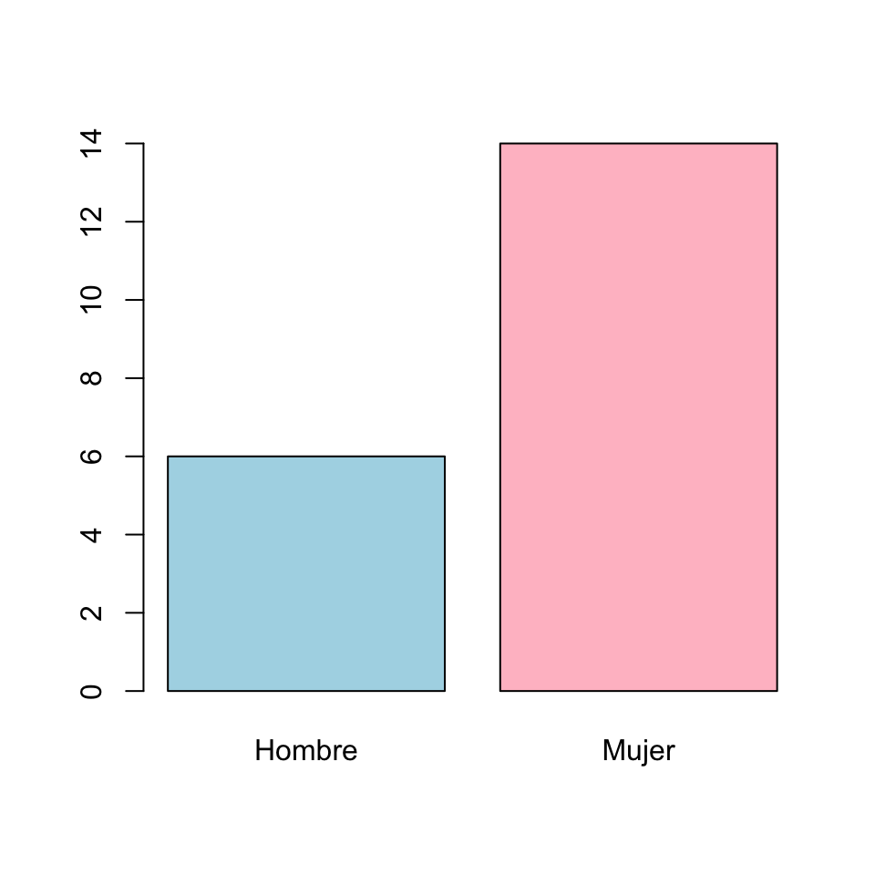

Su diagrama de barras de frecuencias relativas es:

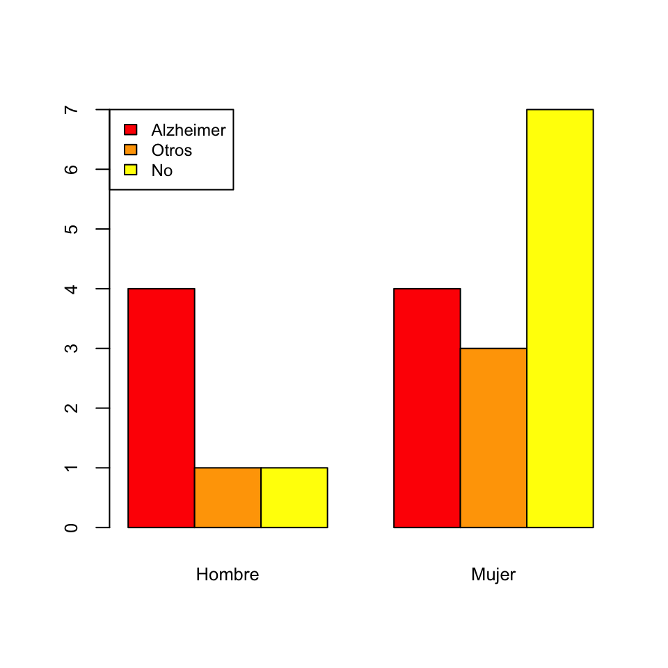

Observad que la única diferencia entre estos dos gráficos son las marcas del eje vertical que indican las alturas de las barras.

Un tipo muy popular de representación gráfica de variables cualitativas son los **diagramas circulares**, donde se representan los niveles de una variable cualitativa como porciones circulares de un círculo, de manera que el ángulo  de cada porción (o equivalentemente, su área) sea proporcional a la frecuencia  del nivel al que corresponde. Así, el diagrama circular de la variable dicotómica "Sexo" sería el siguiente:

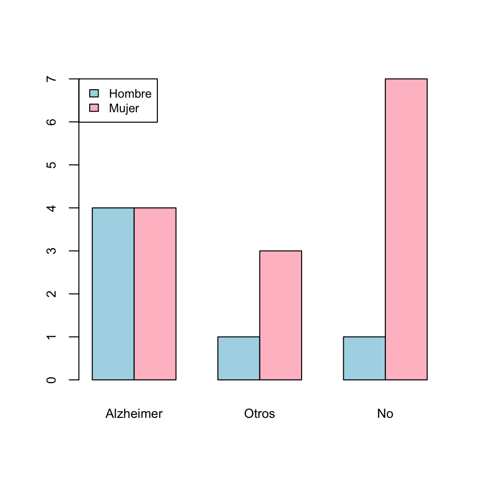


Pese a su popularidad, es poco recomendable usar diagramas circulares cuando se manejan más de dos niveles, porque a veces es difícil, a simple vista, comprender las relaciones entre las frecuencias que representan.  Para convencerse, basta comparar los diagramas de barras y los diagramas circulares de la figura siguiente,  importada de la [entrada sobre diagramas circulares de la *Wikipedia*](http://en.wikipedia.org/wiki/Pie_chart):


Algunos programas ofrecen la posibilidad de dibujar diagramas circulares tridimensionales como el siguiente:


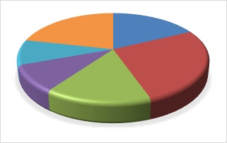

Estos diagramas quedan muy bonitos, pero son aún peores que los diagramas circulares planos, puesto que la perspectiva deforma las áreas. A simple vista, en el diagrama anterior, ¿qué frecuencia es mayor: la del nivel representado por el color azul oscuro, o la del correspondiente al verde claro?


\BeginKnitrBlock{rmdimportant}<div class="rmdimportant">Y por este motivo, por favor, **nunca** uséis diagramas circulares para más de dos niveles.</div>\EndKnitrBlock{rmdimportant}

Un gráfico ha de servir más que mil palabras, y tiene que explicar de un vistazo las características más relevantes de los datos que representa. Luego ya se pueden añadir detalles que complementen esta primera comprensión básica. En el caso de un diagrama de barras, su objetivo ha de ser mostrar la relación entre las magnitudes de las frecuencias que representa; si nos interesan sus valores concretos, es mejor dar la tabla. Por ejemplo, en los diagramas de barras de la variable "Sexo" dados más arriba se ve a simple vista que hay aproximadamente el doble de mujeres que de hombres. 

Por ese motivo es un pecado estadístico modificar un gráfico para que el primer vistazo sea engañoso. En un diagrama de barras, la adulteración más usual, y ante la que hay que estar atentos, es **truncarlo** de manera que el eje de coordenadas que indique las frecuencias no arranque en el 0. Mirad, por  ejemplo, el diagrama de barras siguiente:


Este diagrama sigue indicando que en la muestra hay un 30% de hombres y un 70% de mujeres, pero si le dais un vistazo superficial, sin mirar las marcas del eje vertical, parece que la proporción de mujeres es cinco veces la de los hombres y no un poco más del doble.

Es muy frecuente encontrar diagramas de barras (u otros tipos de gráficos) truncados en medios de comunicación. Por ejemplo mirad el gráfico siguiente, que representa las medias estatales de horas de trabajo de los empleados a tiempo completo en los países de la Unión Europea en 2013 según *Eurostat* y publicado por una empresa que fomenta la inversión en empresas alemanas (extraído en su momento del sitio web de  [German Trade & Invest](https://www.gtai.de/GTAI/Navigation/EN/invest,t=motivated-and-dependable-employees,did=214428.html); cada año lo ponen al día):


A simple vista, sin mirar los números, parece que en Alemania (barra amarilla) se trabaja de media bastantes más horas semanales que la media europea (barra gris oscura), justamente el mensaje que quiere hacernos llegar una organización cuyo objetivo es el fomento de la inversión en Alemania. Pero si luego miráis los números del eje horizontal, la diferencia es de 40.4 horas en Alemania contra 39.5 de media europea, menos de 1 hora sobre unas 40. El diagrama de barras sin truncar sería el siguiente:


Pero claro, este ya no incita tanto a la inversión en la trabajadora Alemania. 

\BeginKnitrBlock{rmdromans}<div class="rmdromans">No podemos dejar este asunto sin la siguiente obra maestra de los diagramas de barra truncados:</div>\EndKnitrBlock{rmdromans}


## Tablas de frecuencias multidimensionales

Cuando medimos más de una variable cualitativa sobre un mismo grupo de  individuos, representamos sus frecuencias absolutas o relativas mediante **tablas de contingencia** multidimensionales.

\BeginKnitrBlock{example}<div class="example"><span class="example" id="exm:sexoger2"><strong>(\#exm:sexoger2) </strong></span>Continuemos con nuestra muestra de 20 pacientes en residencias geriátricas.
Además de su sexo, hemos anotado otras dos características: una variable "Demencia senil" que recoge si en el momento del ingreso en la residencia habían sido diagnosticados con algún tipo de demencia senil, con niveles "No", "Alzheimer" y "Otros" (para indicar otros diagnósticos de demencia no-Alzheimer), y una variable "Cáncer de mama" que indica si en algún momento han sufrido o no cáncer de mama.
</div>\EndKnitrBlock{example}

La tabla de datos es la siguiente:
<table class="table table-condensed" style="width: auto !important; margin-left: auto; margin-right: auto;">
<caption>(\#tab:tablager2)Tabla de datos de pacientes de residencias geriátricas</caption>
 <thead>
  <tr>
   <th style="text-align:left;position: sticky; top:0; background-color: #FFFFFF;">   </th>
   <th style="text-align:left;position: sticky; top:0; background-color: #FFFFFF;"> Sexo </th>
   <th style="text-align:left;position: sticky; top:0; background-color: #FFFFFF;"> Demencia Senil </th>
   <th style="text-align:left;position: sticky; top:0; background-color: #FFFFFF;"> Cáncer de mama </th>
  </tr>
 </thead>
<tbody>
  <tr>
   <td style="text-align:left;"> 1 </td>
   <td style="text-align:left;"> Mujer </td>
   <td style="text-align:left;"> No </td>
   <td style="text-align:left;"> No </td>
  </tr>
  <tr>
   <td style="text-align:left;"> 2 </td>
   <td style="text-align:left;"> Mujer </td>
   <td style="text-align:left;"> Alzheimer </td>
   <td style="text-align:left;"> Sí </td>
  </tr>
  <tr>
   <td style="text-align:left;"> 3 </td>
   <td style="text-align:left;"> Hombre </td>
   <td style="text-align:left;"> Alzheimer </td>
   <td style="text-align:left;"> No </td>
  </tr>
  <tr>
   <td style="text-align:left;"> 4 </td>
   <td style="text-align:left;"> Mujer </td>
   <td style="text-align:left;"> Otros </td>
   <td style="text-align:left;"> No </td>
  </tr>
  <tr>
   <td style="text-align:left;"> 5 </td>
   <td style="text-align:left;"> Mujer </td>
   <td style="text-align:left;"> Alzheimer </td>
   <td style="text-align:left;"> No </td>
  </tr>
  <tr>
   <td style="text-align:left;"> 6 </td>
   <td style="text-align:left;"> Mujer </td>
   <td style="text-align:left;"> Otros </td>
   <td style="text-align:left;"> Sí </td>
  </tr>
  <tr>
   <td style="text-align:left;"> 7 </td>
   <td style="text-align:left;"> Mujer </td>
   <td style="text-align:left;"> No </td>
   <td style="text-align:left;"> No </td>
  </tr>
  <tr>
   <td style="text-align:left;"> 8 </td>
   <td style="text-align:left;"> Mujer </td>
   <td style="text-align:left;"> Alzheimer </td>
   <td style="text-align:left;"> No </td>
  </tr>
  <tr>
   <td style="text-align:left;"> 9 </td>
   <td style="text-align:left;"> Hombre </td>
   <td style="text-align:left;"> Otros </td>
   <td style="text-align:left;"> No </td>
  </tr>
  <tr>
   <td style="text-align:left;"> 10 </td>
   <td style="text-align:left;"> Mujer </td>
   <td style="text-align:left;"> Otros </td>
   <td style="text-align:left;"> Sí </td>
  </tr>
  <tr>
   <td style="text-align:left;"> 11 </td>
   <td style="text-align:left;"> Hombre </td>
   <td style="text-align:left;"> Alzheimer </td>
   <td style="text-align:left;"> No </td>
  </tr>
  <tr>
   <td style="text-align:left;"> 12 </td>
   <td style="text-align:left;"> Hombre </td>
   <td style="text-align:left;"> Alzheimer </td>
   <td style="text-align:left;"> No </td>
  </tr>
  <tr>
   <td style="text-align:left;"> 13 </td>
   <td style="text-align:left;"> Mujer </td>
   <td style="text-align:left;"> No </td>
   <td style="text-align:left;"> No </td>
  </tr>
  <tr>
   <td style="text-align:left;"> 14 </td>
   <td style="text-align:left;"> Mujer </td>
   <td style="text-align:left;"> No </td>
   <td style="text-align:left;"> No </td>
  </tr>
  <tr>
   <td style="text-align:left;"> 15 </td>
   <td style="text-align:left;"> Hombre </td>
   <td style="text-align:left;"> Alzheimer </td>
   <td style="text-align:left;"> No </td>
  </tr>
  <tr>
   <td style="text-align:left;"> 16 </td>
   <td style="text-align:left;"> Mujer </td>
   <td style="text-align:left;"> No </td>
   <td style="text-align:left;"> Sí </td>
  </tr>
  <tr>
   <td style="text-align:left;"> 17 </td>
   <td style="text-align:left;"> Mujer </td>
   <td style="text-align:left;"> No </td>
   <td style="text-align:left;"> No </td>
  </tr>
  <tr>
   <td style="text-align:left;"> 18 </td>
   <td style="text-align:left;"> Mujer </td>
   <td style="text-align:left;"> No </td>
   <td style="text-align:left;"> No </td>
  </tr>
  <tr>
   <td style="text-align:left;"> 19 </td>
   <td style="text-align:left;"> Mujer </td>
   <td style="text-align:left;"> Alzheimer </td>
   <td style="text-align:left;"> No </td>
  </tr>
  <tr>
   <td style="text-align:left;"> 20 </td>
   <td style="text-align:left;"> Hombre </td>
   <td style="text-align:left;"> No </td>
   <td style="text-align:left;"> No </td>
  </tr>
</tbody>
</table>

La tabla bidimensional de frecuencias absolutas de las variables "Sexo" y "Demencia senil", que nos da la frecuencia absoluta de cada combinación de sexo y tipo de demencia senil, es:

<table class="table table-striped" style="width: auto !important; margin-left: auto; margin-right: auto;">
 <thead>
  <tr>
   <th style="text-align:left;">   </th>
   <th style="text-align:right;"> Alzheimer </th>
   <th style="text-align:right;"> Otros </th>
   <th style="text-align:right;"> No </th>
  </tr>
 </thead>
<tbody>
  <tr>
   <td style="text-align:left;"> Hombre </td>
   <td style="text-align:right;"> 4 </td>
   <td style="text-align:right;"> 1 </td>
   <td style="text-align:right;"> 1 </td>
  </tr>
  <tr>
   <td style="text-align:left;"> Mujer </td>
   <td style="text-align:right;"> 4 </td>
   <td style="text-align:right;"> 3 </td>
   <td style="text-align:right;"> 7 </td>
  </tr>
</tbody>
</table>


y la tabla tridimensional de frecuencias absolutas de las tres variables, que nos da la frecuencia absoluta de cada combinación de sexo, tipo de demencia senil y si se ha sufrido o no cáncer de mama, es:


-------- ---------------- ---------------- ---- ----
                           Cáncer de mama   No   Sí 

  Sexo    Demencia Senil                            

 Hombre     Alzheimer                       4    0  

              Otros                         1    0  

                No                          1    0  

 Mujer      Alzheimer                       3    1  

              Otros                         1    2  

                No                          6    1  
-------- ---------------- ---------------- ---- ----


A menudo es conveniente añadir a una tabla de contingencia multidimensional, filas y columnas **marginales** (en los márgenes) con las frecuencias totales de cada nivel dentro de cada variable. De esta manera, también tenemos las tablas de frecuencias de cada una de las variables.  Por ejemplo, si añadimos la fila y la columna marginales a la tabla bidimensional anterior obtenemos:


---------------------------------------------
   &nbsp;     Alzheimer   Otros   No   Total 
------------ ----------- ------- ---- -------
 **Hombre**       4         1     1      6   

 **Mujer**        4         3     7     14   

 **Total**        8         4     8     20   
---------------------------------------------

Las tablas multidimensionales de frecuencias relativas son algo más complicadas porque dichas frecuencias relativas se pueden calcular en el total de la muestra (las llamamos frecuencias relativas **globales**) o dentro de los niveles de una de las variables (por filas o por columnas, en el caso bidimensional), en función de lo que nos interese medir. Por ejemplo:

* Si nos interesa la fracción de pacientes de cada combinación de sexo y tipo de demencia senil en el total de la muestra, usaremos la tabla de frecuencias relativas globales de las variables "Sexo" y "Demencia senil":
<table>
 <thead>
  <tr>
   <th style="text-align:left;">   </th>
   <th style="text-align:right;"> Alzheimer </th>
   <th style="text-align:right;"> Otros </th>
   <th style="text-align:right;"> No </th>
  </tr>
 </thead>
<tbody>
  <tr>
   <td style="text-align:left;"> Hombre </td>
   <td style="text-align:right;"> 0.2 </td>
   <td style="text-align:right;"> 0.05 </td>
   <td style="text-align:right;"> 0.05 </td>
  </tr>
  <tr>
   <td style="text-align:left;"> Mujer </td>
   <td style="text-align:right;"> 0.2 </td>
   <td style="text-align:right;"> 0.15 </td>
   <td style="text-align:right;"> 0.35 </td>
  </tr>
</tbody>
</table>

    Observad que la suma de todas las entradas de la tabla es 1, lo que indica que estas frecuencias indican proporciones del total de la muestra.

* Si nos interesa la fracción de pacientes con cada tipo de demencia senil dentro de cada sexo, usaremos la tabla de frecuencias relativas de la variable "Demencia senil"  dentro de la  variable "Sexo":
<table>
 <thead>
  <tr>
   <th style="text-align:left;">   </th>
   <th style="text-align:right;"> Alzheimer </th>
   <th style="text-align:right;"> Otros </th>
   <th style="text-align:right;"> No </th>
  </tr>
 </thead>
<tbody>
  <tr>
   <td style="text-align:left;"> Hombre </td>
   <td style="text-align:right;"> 0.6667 </td>
   <td style="text-align:right;"> 0.1667 </td>
   <td style="text-align:right;"> 0.1667 </td>
  </tr>
  <tr>
   <td style="text-align:left;"> Mujer </td>
   <td style="text-align:right;"> 0.2857 </td>
   <td style="text-align:right;"> 0.2143 </td>
   <td style="text-align:right;"> 0.5000 </td>
  </tr>
</tbody>
</table>

    En esta tabla, la suma de las entradas de cada fila es 1, lo que indica que las frecuencias son proporciones dentro de cada fila.

* Si nos interesa la fracción de pacientes de cada sexo dentro del grupo de pacientes con cada  tipo de demencia senil, usaremos la tabla de frecuencias relativas de la variable "Sexo"  dentro de la  variable "Demencia senil":
<table>
 <thead>
  <tr>
   <th style="text-align:left;">   </th>
   <th style="text-align:right;"> Alzheimer </th>
   <th style="text-align:right;"> Otros </th>
   <th style="text-align:right;"> No </th>
  </tr>
 </thead>
<tbody>
  <tr>
   <td style="text-align:left;"> Hombre </td>
   <td style="text-align:right;"> 0.5 </td>
   <td style="text-align:right;"> 0.25 </td>
   <td style="text-align:right;"> 0.125 </td>
  </tr>
  <tr>
   <td style="text-align:left;"> Mujer </td>
   <td style="text-align:right;"> 0.5 </td>
   <td style="text-align:right;"> 0.75 </td>
   <td style="text-align:right;"> 0.875 </td>
  </tr>
</tbody>
</table>

    En esta tabla, la suma de las entradas de cada columna es 1, lo que indica que las frecuencias son proporciones dentro de cada columna.


De esta manera, por ejemplo:

* La entrada superior izquierda de la primera tabla nos dice que los hombres con Alzheimer representan el 20% del total de la muestra.
* La entrada superior izquierda de la segunda tabla nos dice que los hombres con Alzheimer representan el 66.67% de los hombres de la muestra.
* La entrada superior izquierda de la tercera tabla nos dice que los hombres con Alzheimer representan el 50% de los enfermos de Alzheimer de la muestra.

En una tabla de contingencia de frecuencias relativas globales, tiene sentido añadir filas y columnas marginales, que nos darán las frecuencias relativas de los niveles de cada variable.


-----------------------------------------------
   &nbsp;     Alzheimer   Otros    No    Total 
------------ ----------- ------- ------ -------
 **Hombre**      0.2      0.05    0.05    0.3  

 **Mujer**       0.2      0.15    0.35    0.7  

 **Total**       0.4       0.2    0.4      1   
-----------------------------------------------

Pero en una tabla de contingencia de frecuencias relativas de una variable respecto de otra no tiene mucho interés. Por ejemplo, añadamos las marginales a la tabla de frecuencias relativas de la variable "Demencia senil"  dentro de la  variable "Sexo":


--------------------------------------------------
   &nbsp;     Alzheimer   Otros      No     Total 
------------ ----------- -------- -------- -------
 **Hombre**    0.6667     0.1667   0.1667     1   

 **Mujer**     0.2857     0.2143    0.5       1   

 **Total**     0.9524     0.381    0.6667     2   
--------------------------------------------------

Como hemos calculado las frecuencias relativas dentro de cada fila, la suma de las frecuencias relativas de cada fila ha de ser 1. Ahora fijaos en la fila de marginales. Nos dice por ejemplo que la suma de la proporción de hombres que tienen Alzheimer, 0.6667, y de la proporción de mujeres que tienen Alzheimer, 0.2857, es 0.9523. ¿Qué significado tiene este número? Ninguno, y en todo caso **de ninguna manera significa** que la proporción de individuos con Alzheimer en la muestra sea 0.9523, ya que esta proporción es del 40%.

\BeginKnitrBlock{rmdcaution}<div class="rmdcaution">Todo el mundo tiene claro (sí, ¿no?) que si un 50% de los hombres y un 50% de las mujeres de una población tienen una determinada característica, no es verdad que el 100% de la población tenga esta característica. Y sin embargo a veces se calculan marginales de tablas de frecuencias relativas con el piloto automático puesto colándose tonterías de este estilo. Por desgracia, esto es bastante frecuente en los medios de comunicación, como muestra el gazapo siguiente, donde el periodista encargado de los titulares entendió que un 1.2% de los estudiantes de grado y un 5.8% de los estudiantes de máster representan un 7% del total de estudiantes universitarios. </div>\EndKnitrBlock{rmdcaution}


\BeginKnitrBlock{rmdnote}<div class="rmdnote">A la hora de decidir qué variable asignamos a las filas y cuál a las columnas en una tabla de contingencia bidimensional, es conveniente recordar que, en los paises occidentales, solemos leer las tablas por filas y  de izquierda a derecha. Por ello, si tenemos interés en la distribución de los niveles de una variable dentro de los niveles de una segunda variable, puede facilitar la lectura de la tabla  que esta segunda variable defina las filas. </div>\EndKnitrBlock{rmdnote}


## Diagramas de barras bidimensionales

Una tabla de frecuencias bidimensional se suele representar mediante un diagrama de barras bidimensional, que puede ser: 

* **De barras apiladas**: Se escoge una variable (la llamaremos **principal**), se dibuja una barra para cada uno de sus niveles de altura la frecuencia total de dicho nivel, y cada una de estas barras se divide verticalmente en sectores que representan las frecuencias de los niveles de la otra variable dentro de ese nivel. 


* **De barras yuxtapuestas**. Se escoge una variable **principal** y para cada uno de sus niveles se dibuja un diagrama de barras de las frecuencias de los niveles de la otra variable.

Por ejemplo: 

* El diagrama de barras apiladas de frecuencias absolutas de las variables "Sexo" y "Demencia senil" de la Tabla \@ref(tab:tablager2), tomando la variable "Sexo" como principal:


* El diagrama de barras apiladas de frecuencias absolutas de las variables "Sexo" y "Demencia senil", tomando la variable "Demencia senil" como principal:

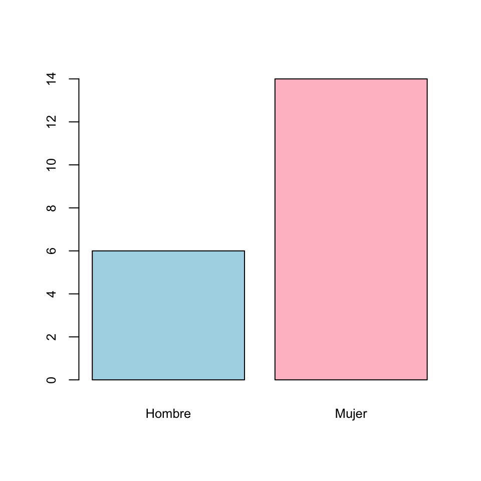

* El diagrama de barras yuxtapuestas de frecuencias absolutas de las variables "Sexo" y "Demencia senil", tomando la variable "Sexo" como principal:


* El diagrama de barras yuxtapuestas de frecuencias absolutas de las variables "Sexo" y "Demencia senil", tomando la variable "Demencia senil" como principal:

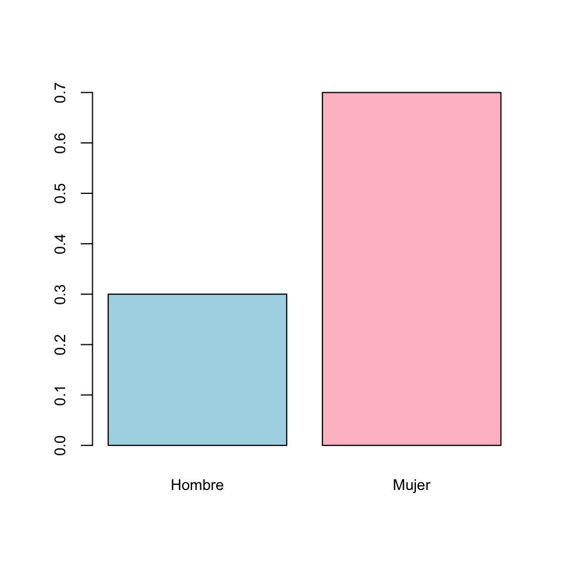


Los diagramas de barras tienen que mostrar la información de la manera más adecuada. Por ejemplo, si lo que nos interesa es la distribución de los tipos de demencia por sexo,  la variable principal ha de ser el "Sexo". Si nos interesan las frecuencias relativas globales, seguramente sea más conveniente dar un diagrama de barras tomando como niveles las combinaciones de niveles de ambas variables, como el siguiente diagrama de barras de frecuencias relativas globales de las variables "Sexo" y "Demencia senil":


El usar barras apiladas o yuxtapuestas en un diagrama de barras bidimensional ya va más a gusto de cada uno: en los diagramas de barras apiladas es más fácil comparar las frecuencias de los niveles de la variable principal, en los diagramas de barras yuxtapuestas es más fácil comparar la distribución de los niveles de la variable secundaria dentro de cada nivel de la variable principal. 


## Diagramas de mosaico


Una tabla tridimensional se suele representar mediante un **diagrama de mosaico**. Estos gráficos se obtienen sustituyendo cada entrada de la tabla de frecuencias por una región rectangular de área proporcional a su valor.  Por ejemplo, el diagrama de mosaico de la Tabla  \@ref(tab:tablager2) es el siguiente (donde los "Sí" y "No" de la fila superior corresponden a la variable "Cáncer de mama"):


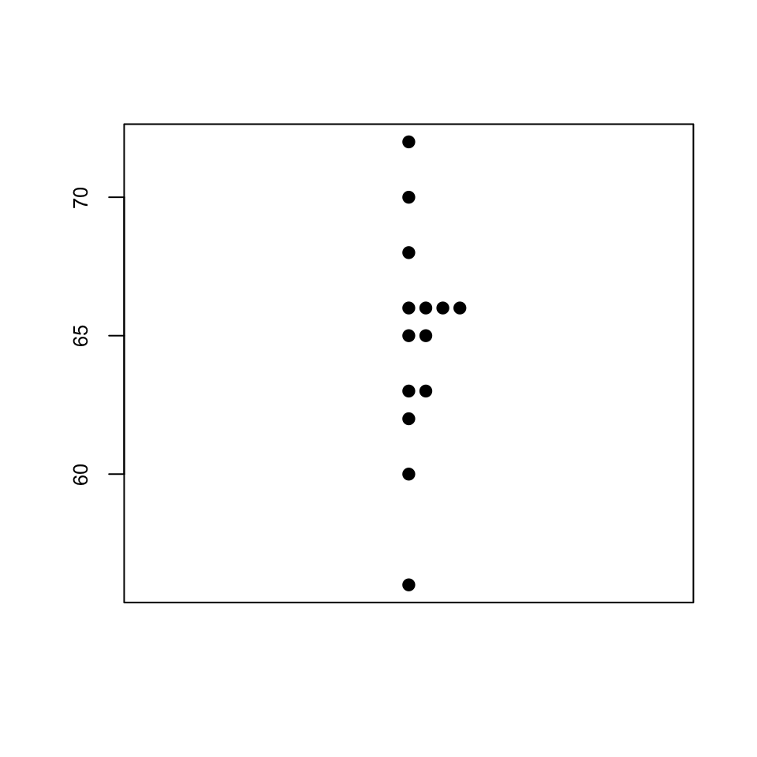


## Ejercicios

### Problemas {-}

**1.** En un estudio transversal en el que se analizó 75 hombres y  70 mujeres,  40 hombres y 20 mujeres presentaron una determinada enfermedad. 

a. Representad estos datos en un diagrama de barras bidimensional de frecuencias relativas que muestre las proporciones de enfermos y sanos en cada sexo.

b. ¿Qué vale la frecuencia relativa de los hombres entre los participantes que no presentaron la enfermedad? 


### Test {-}

**(1)** Para comparar el alcance del alcoholismo en Barcelona y en Palma, ¿qué es más adecuado usar?

1. Las frecuencias absolutas de alcohólicos en Palma y en Barcelona.
1. Las frecuencias relativas de alcohólicos en Palma y en Barcelona.
1. Las frecuencias relativas de palmesanos y de barceloneses entre los alcohólicos españoles.
1. Las frecuencias relativas de palmesanos alcohólicos y de barceloneses alcohólicos en el total de los españoles.

**(2)** ¿Qué representa el 0.36 de la tabla de contingencia siguiente?
$$
\begin{array}{lc}
&\hphantom{YY}\textbf{Propiedad X} \\
\begin{array}{l}
\textbf{Propiedad Y}
\end{array}
&\!\!\!\!\!
\begin{array}{r |c|c|}
 &\text{Sí} & \text{No}  \\ \hline
  \text{Sí} & 0.23 & 0.36\\
  \text{No} & 0.17 & 0.24\\ 
\end{array}
\end{array}
$$

1. La frecuencia relativa de individuos con la propiedad Y en el total de la muestra.
1. La frecuencia relativa de individuos con la propiedad Y entre los que no tienen la propiedad X.
1. La frecuencia relativa de individuos sin la propiedad X entre los que tienen la propiedad Y.
1. La frecuencia relativa de individuos con la propiedad Y y sin la propiedad X en el total de la muestra.
1. No podemos saberlo sin conocer la fila y la columna marginales.


<!--chapter:end:21-EDCual.Rmd-->

# Descripción de datos ordinales  {#chap:edord}

Los **datos ordinales** son parecidos a los cualitativos, en el sentido de que son cualidades de objetos o individuos. Su diferencia con los datos cualitativos está en que las características que expresan los datos ordinales tienen un orden natural que permite **acumular**  observaciones, es decir, contar cuántas hay por debajo de cada nivel. Un caso frecuente son las escalas tipo *Likert*, que se usan para expresar el nivel de acuerdo o desacuerdo con una afirmación mediante respuestas cerradas.

\BeginKnitrBlock{example}<div class="example"><span class="example" id="exm:likert"><strong>(\#exm:likert) </strong></span>En una encuesta sobre la actitud de personal sanitario frente al dolor (M. E. Zanolin *et al*, "A questionnaire to evaluate the knowledge and attitudes of health care providers on pain", *Journal of pain and symptom management* 33  (2007), pp. 727-736), se pidió el grado de conformidad con afirmaciones como:

* Como los narcóticos pueden causar depresión respiratoria, no se han de usar en pacientes pediátricos.

*  Es útil dar de entrada un placebo al paciente que se queja de dolor para saber si realmente siente dolor.

según la escala Likert siguiente:
</div>\EndKnitrBlock{example}

<table>
 <thead>
  <tr>
   <th style="text-align:right;"> Nivel </th>
   <th style="text-align:left;"> Significado </th>
  </tr>
 </thead>
<tbody>
  <tr>
   <td style="text-align:right;"> 1 </td>
   <td style="text-align:left;"> Muy en desacuerdo </td>
  </tr>
  <tr>
   <td style="text-align:right;"> 2 </td>
   <td style="text-align:left;"> En desacuerdo </td>
  </tr>
  <tr>
   <td style="text-align:right;"> 3 </td>
   <td style="text-align:left;"> Neutral </td>
  </tr>
  <tr>
   <td style="text-align:right;"> 4 </td>
   <td style="text-align:left;"> De acuerdo </td>
  </tr>
  <tr>
   <td style="text-align:right;"> 5 </td>
   <td style="text-align:left;"> Muy de acuerdo </td>
  </tr>
</tbody>
</table>

Las respuestas a este tipo de cuestionarios son números, pero no son datos cuantitativos, sino ordinales: meras abreviaturas de los diferentes grados de conformidad.


Para más información sobre escalas Likert, podéis consultar  [la correspondiente entrada de la Wikipedia](http://es.wikipedia.org/wiki/Escalas_Likert).

## Frecuencias y diagramas de barras

Cuando trabajamos con datos ordinales, el orden de los niveles de los datos permite calcular no sólo las frecuencias absolutas y relativas que veíamos en la lección anterior, y que para variables ordinales se definen del mismo modo, sino también frecuencias **acumuladas**. Es decir, no sólo podemos contar cuántas veces hemos observado un cierto nivel, sino también cuántas veces hemos observado un nivel menor o igual que él. Por lo tanto, su descripción estadística es la misma que para datos cualitativos, más:

* **Frecuencias absolutas acumuladas**: El número de veces  que aparece en la muestra un nivel menor o igual que el considerado.

* **Frecuencias relativas acumuladas**: La fracción del total de la muestra que representan los niveles menores o iguales que el considerado.

De nuevo, estas frecuencias acumuladas se pueden recoger en una **tabla** y representar en forma de **diagrama de barras** (con los niveles ordenados en orden creciente).


\BeginKnitrBlock{example}<div class="example"><span class="example" id="exm:ex1701bis"><strong>(\#exm:ex1701bis) </strong></span>Tenemos una muestra de 20 estudiantes de quienes sabemos la calificación que han sacado en un examen. Clasificamos estas calificaciones en Suspenso (*S*), Aprobado (*A*), Notable (*N*) y Sobresaliente (*E*) y consideramos su orden natural *S* < *A* < *N* < *E*. Las calificaciones que han obtenido son las siguientes:
  </div>\EndKnitrBlock{example}

<p style="text-align:center">*A*, *A*, *N*, *S*, *S*, *A*, *N*, *E*, *A*, *A*, *S*, *S*, *S*, *A*, *E*, *N*, *N*, *E*, *S*, *A*.</p> 
  
En esta lista hay 6 *S*, 7 *A*, 4 *N* y 3 *E*: éstas serían las frecuencias absolutas de las calificaciones en esta muestra de estudiantes. Por lo que se refiere a sus **frecuencias absolutas acumuladas**:

* Hay 6 estudiantes que han obtenido *S* o menos: la frecuencia absoluta de *S* es 6 y su frecuencia acumulada también es 6.
* Hay 13 estudiantes que han obtenido *A* o menos (6 *S* y 7 *A*): la frecuencia absoluta de *A* es 7 y su frecuencia acumulada es 13.
* Hay 17 estudiantes que han obtenido *N* o menos (6 *S*, 7 *A* y 4 *N*): la frecuencia absoluta de *N* es 4 y su frecuencia acumulada es 17.
* Hay 20 estudiantes que han obtenido *E* o menos (todos): la frecuencia absoluta de *E* es 3 y su frecuencia acumulada es 20.

La **frecuencia relativa acumulada**  de cada calificación es la fracción del total de estudiantes que representa su frecuencia absoluta acumulada. Por ejemplo, la frecuencia relativa acumulada de notables es la proporción de estudiantes que han sacado  un notable o menos, y, por lo tanto, es igual a la frecuencia absoluta acumulada de *N* dividida por el número total de estudiantes: 17/20=0.85.  También se puede obtener "acumulando" las frecuencias relativas de las calificaciones menores o iguales que *N*: como hay un 30% de *S* (6 de 20), un 35% de *A* (7 de 20) y un 20% de *N* (4 de 20), la frecuencia relativa acumulada de *N* es 0.3+0.35+0.2=0.85, es decir, un 85%.


Así pues, las frecuencias relativas acumuladas de las calificaciones en esta muestra son:

* Frecuencia relativa acumulada de *S*: 6/20=0.3.
* Frecuencia relativa acumulada de *A*: 13/20=0.65.
* Frecuencia relativa acumulada de *N*: 17/20=0.85.
* Frecuencia relativa acumulada de *E*:  20/20=1.

Resumimos estos valores en la tabla siguiente:

<table>
 <thead>
  <tr>
   <th style="text-align:left;">   </th>
   <th style="text-align:right;"> Frecuencia absoluta </th>
   <th style="text-align:right;"> Frecuencia relativa </th>
   <th style="text-align:left;"> Porcentaje </th>
   <th style="text-align:right;"> Frecuencia absoluta acumulada </th>
   <th style="text-align:right;"> Frecuencia relativa acumulada </th>
   <th style="text-align:left;"> Porcentaje acumulado </th>
  </tr>
 </thead>
<tbody>
  <tr>
   <td style="text-align:left;"> Suspenso </td>
   <td style="text-align:right;"> 6 </td>
   <td style="text-align:right;"> 0.30 </td>
   <td style="text-align:left;"> 30% </td>
   <td style="text-align:right;"> 6 </td>
   <td style="text-align:right;"> 0.30 </td>
   <td style="text-align:left;"> 30% </td>
  </tr>
  <tr>
   <td style="text-align:left;"> Aprobado </td>
   <td style="text-align:right;"> 7 </td>
   <td style="text-align:right;"> 0.35 </td>
   <td style="text-align:left;"> 35% </td>
   <td style="text-align:right;"> 13 </td>
   <td style="text-align:right;"> 0.65 </td>
   <td style="text-align:left;"> 65% </td>
  </tr>
  <tr>
   <td style="text-align:left;"> Notable </td>
   <td style="text-align:right;"> 4 </td>
   <td style="text-align:right;"> 0.20 </td>
   <td style="text-align:left;"> 20% </td>
   <td style="text-align:right;"> 17 </td>
   <td style="text-align:right;"> 0.85 </td>
   <td style="text-align:left;"> 85% </td>
  </tr>
  <tr>
   <td style="text-align:left;"> Sobresaliente </td>
   <td style="text-align:right;"> 3 </td>
   <td style="text-align:right;"> 0.15 </td>
   <td style="text-align:left;"> 15% </td>
   <td style="text-align:right;"> 20 </td>
   <td style="text-align:right;"> 1.00 </td>
   <td style="text-align:left;"> 100% </td>
  </tr>
</tbody>
</table>

\BeginKnitrBlock{example}<div class="example"><span class="example" id="exm:sexoger3"><strong>(\#exm:sexoger3) </strong></span>Todos los ancianos recogidos en la tabla de datos del Ejemplo \@ref(exm:sexoger2) fueron diagnosticados con COVID-19 entre marzo y mayo de 2020.  Vamos a ampliar dicha tabla de datos con información sobre la gravedad de su enfermedad, clasificada en cuatro niveles: Asintomática, Leve, Hospitalización (si requirió hospitalización pero no en UCI) y UCI.
</div>\EndKnitrBlock{example}

La tabla de datos ampliada es la siguiente:

<table class="table table-condensed" style="width: auto !important; margin-left: auto; margin-right: auto;">
<caption>(\#tab:tablager3)Tabla de datos de pacientes de residencias geriátricas</caption>
 <thead>
  <tr>
   <th style="text-align:left;position: sticky; top:0; background-color: #FFFFFF;">   </th>
   <th style="text-align:left;position: sticky; top:0; background-color: #FFFFFF;"> Sexo </th>
   <th style="text-align:left;position: sticky; top:0; background-color: #FFFFFF;"> Demencia Senil </th>
   <th style="text-align:left;position: sticky; top:0; background-color: #FFFFFF;"> Cáncer de mama </th>
   <th style="text-align:left;position: sticky; top:0; background-color: #FFFFFF;"> COVID-19 </th>
  </tr>
 </thead>
<tbody>
  <tr>
   <td style="text-align:left;"> 1 </td>
   <td style="text-align:left;"> Mujer </td>
   <td style="text-align:left;"> No </td>
   <td style="text-align:left;"> No </td>
   <td style="text-align:left;"> Leve </td>
  </tr>
  <tr>
   <td style="text-align:left;"> 2 </td>
   <td style="text-align:left;"> Mujer </td>
   <td style="text-align:left;"> Alzheimer </td>
   <td style="text-align:left;"> Sí </td>
   <td style="text-align:left;"> UCI </td>
  </tr>
  <tr>
   <td style="text-align:left;"> 3 </td>
   <td style="text-align:left;"> Hombre </td>
   <td style="text-align:left;"> Alzheimer </td>
   <td style="text-align:left;"> No </td>
   <td style="text-align:left;"> Leve </td>
  </tr>
  <tr>
   <td style="text-align:left;"> 4 </td>
   <td style="text-align:left;"> Mujer </td>
   <td style="text-align:left;"> Otros </td>
   <td style="text-align:left;"> No </td>
   <td style="text-align:left;"> Asintomática </td>
  </tr>
  <tr>
   <td style="text-align:left;"> 5 </td>
   <td style="text-align:left;"> Mujer </td>
   <td style="text-align:left;"> Alzheimer </td>
   <td style="text-align:left;"> No </td>
   <td style="text-align:left;"> Leve </td>
  </tr>
  <tr>
   <td style="text-align:left;"> 6 </td>
   <td style="text-align:left;"> Mujer </td>
   <td style="text-align:left;"> Otros </td>
   <td style="text-align:left;"> Sí </td>
   <td style="text-align:left;"> Hospitalización </td>
  </tr>
  <tr>
   <td style="text-align:left;"> 7 </td>
   <td style="text-align:left;"> Mujer </td>
   <td style="text-align:left;"> No </td>
   <td style="text-align:left;"> No </td>
   <td style="text-align:left;"> UCI </td>
  </tr>
  <tr>
   <td style="text-align:left;"> 8 </td>
   <td style="text-align:left;"> Mujer </td>
   <td style="text-align:left;"> Alzheimer </td>
   <td style="text-align:left;"> No </td>
   <td style="text-align:left;"> Leve </td>
  </tr>
  <tr>
   <td style="text-align:left;"> 9 </td>
   <td style="text-align:left;"> Hombre </td>
   <td style="text-align:left;"> Otros </td>
   <td style="text-align:left;"> No </td>
   <td style="text-align:left;"> Leve </td>
  </tr>
  <tr>
   <td style="text-align:left;"> 10 </td>
   <td style="text-align:left;"> Mujer </td>
   <td style="text-align:left;"> Otros </td>
   <td style="text-align:left;"> Sí </td>
   <td style="text-align:left;"> Leve </td>
  </tr>
  <tr>
   <td style="text-align:left;"> 11 </td>
   <td style="text-align:left;"> Hombre </td>
   <td style="text-align:left;"> Alzheimer </td>
   <td style="text-align:left;"> No </td>
   <td style="text-align:left;"> Leve </td>
  </tr>
  <tr>
   <td style="text-align:left;"> 12 </td>
   <td style="text-align:left;"> Hombre </td>
   <td style="text-align:left;"> Alzheimer </td>
   <td style="text-align:left;"> No </td>
   <td style="text-align:left;"> Hospitalización </td>
  </tr>
  <tr>
   <td style="text-align:left;"> 13 </td>
   <td style="text-align:left;"> Mujer </td>
   <td style="text-align:left;"> No </td>
   <td style="text-align:left;"> No </td>
   <td style="text-align:left;"> Leve </td>
  </tr>
  <tr>
   <td style="text-align:left;"> 14 </td>
   <td style="text-align:left;"> Mujer </td>
   <td style="text-align:left;"> No </td>
   <td style="text-align:left;"> No </td>
   <td style="text-align:left;"> Asintomática </td>
  </tr>
  <tr>
   <td style="text-align:left;"> 15 </td>
   <td style="text-align:left;"> Hombre </td>
   <td style="text-align:left;"> Alzheimer </td>
   <td style="text-align:left;"> No </td>
   <td style="text-align:left;"> Leve </td>
  </tr>
  <tr>
   <td style="text-align:left;"> 16 </td>
   <td style="text-align:left;"> Mujer </td>
   <td style="text-align:left;"> No </td>
   <td style="text-align:left;"> Sí </td>
   <td style="text-align:left;"> Asintomática </td>
  </tr>
  <tr>
   <td style="text-align:left;"> 17 </td>
   <td style="text-align:left;"> Mujer </td>
   <td style="text-align:left;"> No </td>
   <td style="text-align:left;"> No </td>
   <td style="text-align:left;"> Leve </td>
  </tr>
  <tr>
   <td style="text-align:left;"> 18 </td>
   <td style="text-align:left;"> Mujer </td>
   <td style="text-align:left;"> No </td>
   <td style="text-align:left;"> No </td>
   <td style="text-align:left;"> Hospitalización </td>
  </tr>
  <tr>
   <td style="text-align:left;"> 19 </td>
   <td style="text-align:left;"> Mujer </td>
   <td style="text-align:left;"> Alzheimer </td>
   <td style="text-align:left;"> No </td>
   <td style="text-align:left;"> Hospitalización </td>
  </tr>
  <tr>
   <td style="text-align:left;"> 20 </td>
   <td style="text-align:left;"> Hombre </td>
   <td style="text-align:left;"> No </td>
   <td style="text-align:left;"> No </td>
   <td style="text-align:left;"> Leve </td>
  </tr>
</tbody>
</table>


Entonces:

* La tabla de frecuencias absolutas de la variable *COVID-19* es:
<table class="table" style="width: auto !important; margin-left: auto; margin-right: auto;">
 <thead>
  <tr>
   <th style="text-align:left;"> COVID-19 </th>
   <th style="text-align:right;"> Frecs. </th>
  </tr>
 </thead>
<tbody>
  <tr>
   <td style="text-align:left;"> Asintomática </td>
   <td style="text-align:right;"> 3 </td>
  </tr>
  <tr>
   <td style="text-align:left;"> Leve </td>
   <td style="text-align:right;"> 11 </td>
  </tr>
  <tr>
   <td style="text-align:left;"> Hospitalización </td>
   <td style="text-align:right;"> 4 </td>
  </tr>
  <tr>
   <td style="text-align:left;"> UCI </td>
   <td style="text-align:right;"> 2 </td>
  </tr>
</tbody>
</table>

* Su tabla de frecuencias relativas:
<table class="table" style="width: auto !important; margin-left: auto; margin-right: auto;">
 <thead>
  <tr>
   <th style="text-align:left;"> COVID-19 </th>
   <th style="text-align:right;"> Frecs. </th>
  </tr>
 </thead>
<tbody>
  <tr>
   <td style="text-align:left;"> Asintomática </td>
   <td style="text-align:right;"> 0.15 </td>
  </tr>
  <tr>
   <td style="text-align:left;"> Leve </td>
   <td style="text-align:right;"> 0.55 </td>
  </tr>
  <tr>
   <td style="text-align:left;"> Hospitalización </td>
   <td style="text-align:right;"> 0.20 </td>
  </tr>
  <tr>
   <td style="text-align:left;"> UCI </td>
   <td style="text-align:right;"> 0.10 </td>
  </tr>
</tbody>
</table>

* Su tabla de frecuencias absolutas acumuladas:
<table class="table" style="width: auto !important; margin-left: auto; margin-right: auto;">
 <thead>
  <tr>
   <th style="text-align:left;"> COVID-19 </th>
   <th style="text-align:right;"> Frecs. Acum </th>
  </tr>
 </thead>
<tbody>
  <tr>
   <td style="text-align:left;"> Asintomática </td>
   <td style="text-align:right;"> 3 </td>
  </tr>
  <tr>
   <td style="text-align:left;"> Leve </td>
   <td style="text-align:right;"> 14 </td>
  </tr>
  <tr>
   <td style="text-align:left;"> Hospitalización </td>
   <td style="text-align:right;"> 18 </td>
  </tr>
  <tr>
   <td style="text-align:left;"> UCI </td>
   <td style="text-align:right;"> 20 </td>
  </tr>
</tbody>
</table>

* Su tabla de frecuencias relativas acumuladas:
<table class="table" style="width: auto !important; margin-left: auto; margin-right: auto;">
 <thead>
  <tr>
   <th style="text-align:left;"> COVID-19 </th>
   <th style="text-align:right;"> Frecs. Acum </th>
  </tr>
 </thead>
<tbody>
  <tr>
   <td style="text-align:left;"> Asintomática </td>
   <td style="text-align:right;"> 0.15 </td>
  </tr>
  <tr>
   <td style="text-align:left;"> Leve </td>
   <td style="text-align:right;"> 0.70 </td>
  </tr>
  <tr>
   <td style="text-align:left;"> Hospitalización </td>
   <td style="text-align:right;"> 0.90 </td>
  </tr>
  <tr>
   <td style="text-align:left;"> UCI </td>
   <td style="text-align:right;"> 1.00 </td>
  </tr>
</tbody>
</table>

* Un diagrama de barras de sus frecuencias absolutas acumuladas:

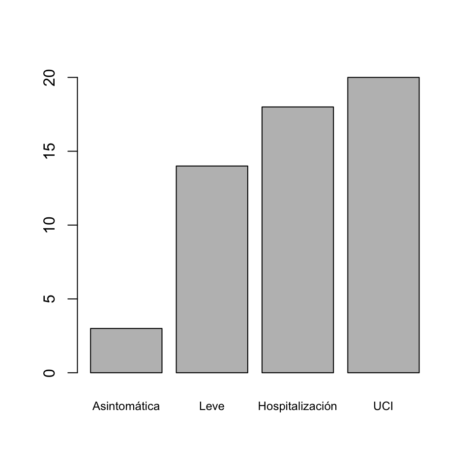

* Un diagrama de barras de sus frecuencias relativas acumuladas:

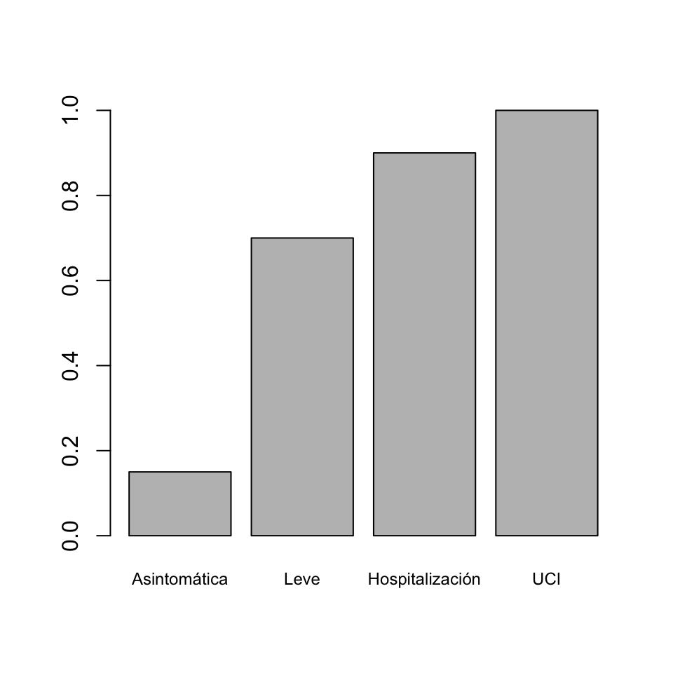

* Su tabla de frecuencias relativas acumuladas dentro de cada nivel de demencia senil:

<table>
 <thead>
  <tr>
   <th style="text-align:left;">   </th>
   <th style="text-align:right;"> Asintomática </th>
   <th style="text-align:right;"> Leve </th>
   <th style="text-align:right;"> Hospitalización </th>
   <th style="text-align:right;"> UCI </th>
  </tr>
 </thead>
<tbody>
  <tr>
   <td style="text-align:left;"> Alzheimer </td>
   <td style="text-align:right;"> 0.00 </td>
   <td style="text-align:right;"> 0.625 </td>
   <td style="text-align:right;"> 0.875 </td>
   <td style="text-align:right;"> 1 </td>
  </tr>
  <tr>
   <td style="text-align:left;"> Otros </td>
   <td style="text-align:right;"> 0.25 </td>
   <td style="text-align:right;"> 0.750 </td>
   <td style="text-align:right;"> 1.000 </td>
   <td style="text-align:right;"> 1 </td>
  </tr>
  <tr>
   <td style="text-align:left;"> No </td>
   <td style="text-align:right;"> 0.25 </td>
   <td style="text-align:right;"> 0.750 </td>
   <td style="text-align:right;"> 0.875 </td>
   <td style="text-align:right;"> 1 </td>
  </tr>
</tbody>
</table>

* El diagrama de barras yuxtapuestas de esta  última tabla:

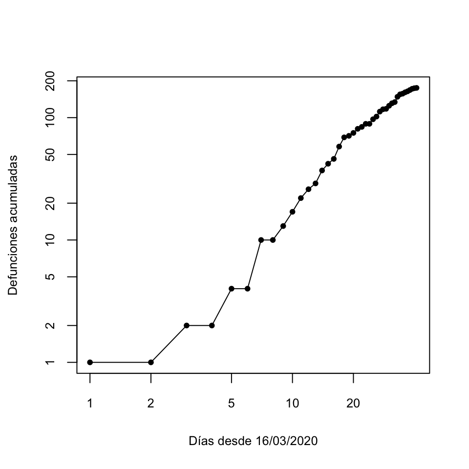


## Ejercicios

### Problemas {-}

**1.** Calculad la tabla bidimensional de frecuencias relativas acumuladas de los niveles de gravedad de la COVID-19 en cada sexo, y representad esta tabla por medio de un diagrama de barras yuxtapuestas adecuado.

**2.** En el estudio del Problema 1 de la Lección \@ref(chap:edcual), entre los 60 enfermos hubo 12  de 40 años o menos, 3  entre 41 y 50 años, 15  entre 51 y 60 años y 30 de más de 60 años, mientras que los que no presentaron la enfermedad fueron, en estas franjas de edad, 29, 21, 17 y 18, respectivamente. Dad:

a. Un diagrama de barras bidimensional que muestre las frecuencias relativas de las diferentes franjas de edad en enfermos y en sanos.

b. Un diagrama de barras bidimensional que muestre las frecuencias relativas acumuladas de las diferentes franjas de edad en enfermos y en sanos.


### Test {-}


**(1)** ¿Cuál es el valor con mayor frecuencia relativa acumulada en un conjunto de datos ordinales?

1. La moda del conjunto de datos.
1. El relativamente más frecuente.
1. El primer dato obtenido.  
1. El último dato obtenido.  
1. El mayor dato obtenido. 
1. Ninguna de las respuestas anteriores es correcta.

**(2)** A lo largo de un año se atendieron lesiones en la enfermería de un centro de secundaria con la siguiente distribución de gravedad: 26 muy leves, 28 leves, 15 moderadas, 8 graves y 3 muy graves. ¿Cuál es la frecuencia relativa acumulada del nivel de gravedad "Moderada"?

1. 0.1875
2. 0.8625 
3. 0.325
4. 0.2174
5. 0.69


<!--chapter:end:22-EDOrd.Rmd-->

# Descripción de datos cuantitativos 


Los **datos cuantitativos**  son los que expresan cantidades que se representan mediante números, tales como los resultados de contar objetos o individuos o de medir pesos, distancias, tiempos o concentraciones. 


## Frecuencias

Como los números reales están ordenados de manera natural, para estudiar una muestra de datos cuantitativos (una **variable cuantitativa**) podemos usar las frecuencias y las frecuencias acumuladas de sus diferentes valores,  como en las variables ordinales. Esto realmente solo es útil cuando en la muestra tenemos pocos valores diferentes. 

\BeginKnitrBlock{example}<div class="example"><span class="example" id="exm:sexoger4"><strong>(\#exm:sexoger4) </strong></span>Vamos a ampliar la tabla de datos del Ejemplo \@ref(exm:sexoger3) con los números de hijos vivos en el momento del ingreso de los pacientes en sus residencias. </div>\EndKnitrBlock{example}


<table>
<caption>(\#tab:tablager4)Tabla de datos de pacientes de residencias geriátricas</caption>
 <thead>
  <tr>
   <th style="text-align:left;">   </th>
   <th style="text-align:left;"> Sexo </th>
   <th style="text-align:left;"> Demencia Senil </th>
   <th style="text-align:left;"> Cáncer de mama </th>
   <th style="text-align:left;"> COVID-19 </th>
   <th style="text-align:right;"> Número de hijos </th>
  </tr>
 </thead>
<tbody>
  <tr>
   <td style="text-align:left;"> 1 </td>
   <td style="text-align:left;"> Mujer </td>
   <td style="text-align:left;"> No </td>
   <td style="text-align:left;"> No </td>
   <td style="text-align:left;"> Leve </td>
   <td style="text-align:right;"> 4 </td>
  </tr>
  <tr>
   <td style="text-align:left;"> 2 </td>
   <td style="text-align:left;"> Mujer </td>
   <td style="text-align:left;"> Alzheimer </td>
   <td style="text-align:left;"> Sí </td>
   <td style="text-align:left;"> Leve </td>
   <td style="text-align:right;"> 1 </td>
  </tr>
  <tr>
   <td style="text-align:left;"> 3 </td>
   <td style="text-align:left;"> Hombre </td>
   <td style="text-align:left;"> Alzheimer </td>
   <td style="text-align:left;"> No </td>
   <td style="text-align:left;"> UCI </td>
   <td style="text-align:right;"> 8 </td>
  </tr>
  <tr>
   <td style="text-align:left;"> 4 </td>
   <td style="text-align:left;"> Mujer </td>
   <td style="text-align:left;"> Otros </td>
   <td style="text-align:left;"> No </td>
   <td style="text-align:left;"> Asintomática </td>
   <td style="text-align:right;"> 0 </td>
  </tr>
  <tr>
   <td style="text-align:left;"> 5 </td>
   <td style="text-align:left;"> Mujer </td>
   <td style="text-align:left;"> Alzheimer </td>
   <td style="text-align:left;"> No </td>
   <td style="text-align:left;"> Leve </td>
   <td style="text-align:right;"> 3 </td>
  </tr>
  <tr>
   <td style="text-align:left;"> 6 </td>
   <td style="text-align:left;"> Mujer </td>
   <td style="text-align:left;"> Otros </td>
   <td style="text-align:left;"> Sí </td>
   <td style="text-align:left;"> Hospitalización </td>
   <td style="text-align:right;"> 4 </td>
  </tr>
  <tr>
   <td style="text-align:left;"> 7 </td>
   <td style="text-align:left;"> Mujer </td>
   <td style="text-align:left;"> No </td>
   <td style="text-align:left;"> No </td>
   <td style="text-align:left;"> UCI </td>
   <td style="text-align:right;"> 2 </td>
  </tr>
  <tr>
   <td style="text-align:left;"> 8 </td>
   <td style="text-align:left;"> Mujer </td>
   <td style="text-align:left;"> Alzheimer </td>
   <td style="text-align:left;"> No </td>
   <td style="text-align:left;"> Leve </td>
   <td style="text-align:right;"> 1 </td>
  </tr>
  <tr>
   <td style="text-align:left;"> 9 </td>
   <td style="text-align:left;"> Hombre </td>
   <td style="text-align:left;"> Otros </td>
   <td style="text-align:left;"> No </td>
   <td style="text-align:left;"> Leve </td>
   <td style="text-align:right;"> 1 </td>
  </tr>
  <tr>
   <td style="text-align:left;"> 10 </td>
   <td style="text-align:left;"> Mujer </td>
   <td style="text-align:left;"> Otros </td>
   <td style="text-align:left;"> Sí </td>
   <td style="text-align:left;"> Leve </td>
   <td style="text-align:right;"> 2 </td>
  </tr>
  <tr>
   <td style="text-align:left;"> 11 </td>
   <td style="text-align:left;"> Hombre </td>
   <td style="text-align:left;"> Alzheimer </td>
   <td style="text-align:left;"> No </td>
   <td style="text-align:left;"> Leve </td>
   <td style="text-align:right;"> 6 </td>
  </tr>
  <tr>
   <td style="text-align:left;"> 12 </td>
   <td style="text-align:left;"> Hombre </td>
   <td style="text-align:left;"> Alzheimer </td>
   <td style="text-align:left;"> No </td>
   <td style="text-align:left;"> Hospitalización </td>
   <td style="text-align:right;"> 0 </td>
  </tr>
  <tr>
   <td style="text-align:left;"> 13 </td>
   <td style="text-align:left;"> Mujer </td>
   <td style="text-align:left;"> No </td>
   <td style="text-align:left;"> No </td>
   <td style="text-align:left;"> Leve </td>
   <td style="text-align:right;"> 0 </td>
  </tr>
  <tr>
   <td style="text-align:left;"> 14 </td>
   <td style="text-align:left;"> Mujer </td>
   <td style="text-align:left;"> No </td>
   <td style="text-align:left;"> No </td>
   <td style="text-align:left;"> Asintomática </td>
   <td style="text-align:right;"> 1 </td>
  </tr>
  <tr>
   <td style="text-align:left;"> 15 </td>
   <td style="text-align:left;"> Hombre </td>
   <td style="text-align:left;"> Alzheimer </td>
   <td style="text-align:left;"> No </td>
   <td style="text-align:left;"> Leve </td>
   <td style="text-align:right;"> 4 </td>
  </tr>
  <tr>
   <td style="text-align:left;"> 16 </td>
   <td style="text-align:left;"> Mujer </td>
   <td style="text-align:left;"> No </td>
   <td style="text-align:left;"> Sí </td>
   <td style="text-align:left;"> Asintomática </td>
   <td style="text-align:right;"> 2 </td>
  </tr>
  <tr>
   <td style="text-align:left;"> 17 </td>
   <td style="text-align:left;"> Mujer </td>
   <td style="text-align:left;"> No </td>
   <td style="text-align:left;"> No </td>
   <td style="text-align:left;"> Leve </td>
   <td style="text-align:right;"> 0 </td>
  </tr>
  <tr>
   <td style="text-align:left;"> 18 </td>
   <td style="text-align:left;"> Mujer </td>
   <td style="text-align:left;"> No </td>
   <td style="text-align:left;"> No </td>
   <td style="text-align:left;"> Hospitalización </td>
   <td style="text-align:right;"> 3 </td>
  </tr>
  <tr>
   <td style="text-align:left;"> 19 </td>
   <td style="text-align:left;"> Mujer </td>
   <td style="text-align:left;"> Alzheimer </td>
   <td style="text-align:left;"> No </td>
   <td style="text-align:left;"> Hospitalización </td>
   <td style="text-align:right;"> 6 </td>
  </tr>
  <tr>
   <td style="text-align:left;"> 20 </td>
   <td style="text-align:left;"> Hombre </td>
   <td style="text-align:left;"> No </td>
   <td style="text-align:left;"> No </td>
   <td style="text-align:left;"> Leve </td>
   <td style="text-align:right;"> 3 </td>
  </tr>
</tbody>
</table>

La tabla siguiente agrupa las diferentes tablas de frecuencias (absolutas y relativas, acumuladas o no) de los números de hijos de estos residentes:

<table>
 <thead>
  <tr>
   <th style="text-align:right;"> Número de hijos </th>
   <th style="text-align:right;"> Frec. absoluta </th>
   <th style="text-align:right;"> Frec. relativa </th>
   <th style="text-align:right;"> Frec. abs. acumulada </th>
   <th style="text-align:right;"> Frec. rel. acumulada </th>
  </tr>
 </thead>
<tbody>
  <tr>
   <td style="text-align:right;"> 0 </td>
   <td style="text-align:right;"> 4 </td>
   <td style="text-align:right;"> 0.20 </td>
   <td style="text-align:right;"> 4 </td>
   <td style="text-align:right;"> 0.20 </td>
  </tr>
  <tr>
   <td style="text-align:right;"> 1 </td>
   <td style="text-align:right;"> 4 </td>
   <td style="text-align:right;"> 0.20 </td>
   <td style="text-align:right;"> 8 </td>
   <td style="text-align:right;"> 0.40 </td>
  </tr>
  <tr>
   <td style="text-align:right;"> 2 </td>
   <td style="text-align:right;"> 3 </td>
   <td style="text-align:right;"> 0.15 </td>
   <td style="text-align:right;"> 11 </td>
   <td style="text-align:right;"> 0.55 </td>
  </tr>
  <tr>
   <td style="text-align:right;"> 3 </td>
   <td style="text-align:right;"> 3 </td>
   <td style="text-align:right;"> 0.15 </td>
   <td style="text-align:right;"> 14 </td>
   <td style="text-align:right;"> 0.70 </td>
  </tr>
  <tr>
   <td style="text-align:right;"> 4 </td>
   <td style="text-align:right;"> 3 </td>
   <td style="text-align:right;"> 0.15 </td>
   <td style="text-align:right;"> 17 </td>
   <td style="text-align:right;"> 0.85 </td>
  </tr>
  <tr>
   <td style="text-align:right;"> 6 </td>
   <td style="text-align:right;"> 2 </td>
   <td style="text-align:right;"> 0.10 </td>
   <td style="text-align:right;"> 19 </td>
   <td style="text-align:right;"> 0.95 </td>
  </tr>
  <tr>
   <td style="text-align:right;"> 8 </td>
   <td style="text-align:right;"> 1 </td>
   <td style="text-align:right;"> 0.05 </td>
   <td style="text-align:right;"> 20 </td>
   <td style="text-align:right;"> 1.00 </td>
  </tr>
</tbody>
</table>

Y a modo de ejemplo, los diagramas de barras de frecuencias relativas y frecuencias relativas acumuladas de estos números de hijos son:


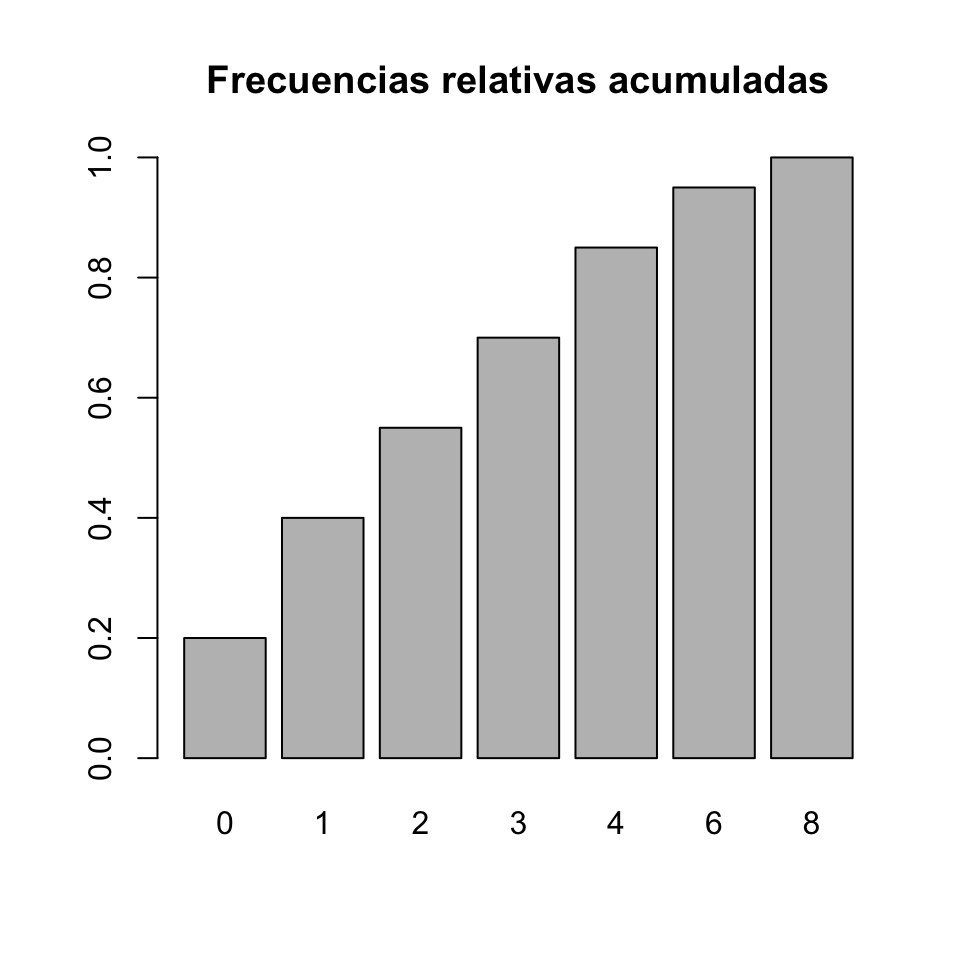

\BeginKnitrBlock{rmdnote}<div class="rmdnote">La única diferencia entre estas tablas y diagramas de barras y los de las lecciones anteriores es que, en el caso de datos cuantitativos, se omiten los niveles con frecuencia 0, excepto aquellos que puedan ser relevantes para la comprensión de la muestra. </div>\EndKnitrBlock{rmdnote}

## Medidas de tendencia central

Como los datos cuantitativos son números reales y tienen el significado de números reales, podemos operar con ellos. Esto nos aporta una multitud de **estadísticos**, expresiones matemáticas que, aplicadas a un vector de datos cuantitativos, producen un valor que expresa alguna característica del mismo.

Supongamos de ahora en adelante que tenemos una muestra formada por $n$ números, que denotaremos $x_1,\ldots,x_n$.

En primer lugar tenemos los **estadísticos de tendencia central**, que dan un valor representativo del conjunto de datos de la variable; los más importantes son:


* La **moda**, que es el valor, o los valores, de máxima frecuencia (absoluta o relativa, tanto da). Normalmente, solo se usa para variables discretas.

* La **media aritmética**: 
$$
 \overline{x}=\frac{x_1+\cdots+x_n}{n}
$$

* La **mediana** $Q_{0.5}$, que representa el valor central en la lista ordenada de observaciones y se define formalmente de la manera siguiente. Si denotamos por
$$
x_{(1)}\leqslant x_{(2)}\leqslant \cdots \leqslant x_{(n)}
$$
los datos de la variable cuantitativa ordenados de menor a mayor:

    * Si $n$ es par, su mediana es la media de los dos datos centrales:
$$
\frac{x_{(n/2)}+x_{(n/2+1)}}{2}.
$$
    *  Si $n$ es impar, su mediana es directamente el dato central: $x_{(n+1)/2}$.

En este curso, cuando hablemos de la *media*  de unos datos nos referiremos siempre a su media aritmética. Hay otros tipos de media, como por ejemplo la media geométrica o la armónica, que no estudiaremos.

\BeginKnitrBlock{example}<div class="example"><span class="example" id="exm:sexoger5"><strong>(\#exm:sexoger5) </strong></span>Tomemos la variable "Hijos" de la Tabla \@ref(tab:tablager4), formada por los números
</div>\EndKnitrBlock{example}

<p style="text-align:center">4, 1, 8, 0, 3, 4, 2, 1, 1, 2, 6, 0, 0, 1, 4, 2, 0, 3, 6, 3</p>

* En su tabla de frecuencias vemos que la *moda* son los valores 0 y 1, que empatan en la frecuencia máxima.

* Su *media* es
$$
\frac{4+1+8+0+3+\cdots+0+3+6+3}{20}=2.55
$$

* Para calcular su *mediana*, lo primero que hacemos es ordenar de menor a mayor las observaciones, y marcamos su posición dentro del conjunto ordenado:

<table class="table table-responsive" style="margin-left: auto; margin-right: auto;">
<tbody>
  <tr>
   <td style="text-align:left;"> Posición </td>
   <td style="text-align:right;"> 1 </td>
   <td style="text-align:right;"> 2 </td>
   <td style="text-align:right;"> 3 </td>
   <td style="text-align:right;"> 4 </td>
   <td style="text-align:right;"> 5 </td>
   <td style="text-align:right;"> 6 </td>
   <td style="text-align:right;"> 7 </td>
   <td style="text-align:right;"> 8 </td>
   <td style="text-align:right;"> 9 </td>
   <td style="text-align:right;"> 10 </td>
   <td style="text-align:right;"> 11 </td>
   <td style="text-align:right;"> 12 </td>
   <td style="text-align:right;"> 13 </td>
   <td style="text-align:right;"> 14 </td>
   <td style="text-align:right;"> 15 </td>
   <td style="text-align:right;"> 16 </td>
   <td style="text-align:right;"> 17 </td>
   <td style="text-align:right;"> 18 </td>
   <td style="text-align:right;"> 19 </td>
   <td style="text-align:right;"> 20 </td>
  </tr>
  <tr>
   <td style="text-align:left;"> Valor </td>
   <td style="text-align:right;"> 0 </td>
   <td style="text-align:right;"> 0 </td>
   <td style="text-align:right;"> 0 </td>
   <td style="text-align:right;"> 0 </td>
   <td style="text-align:right;"> 1 </td>
   <td style="text-align:right;"> 1 </td>
   <td style="text-align:right;"> 1 </td>
   <td style="text-align:right;"> 1 </td>
   <td style="text-align:right;"> 2 </td>
   <td style="text-align:right;"> 2 </td>
   <td style="text-align:right;"> 2 </td>
   <td style="text-align:right;"> 3 </td>
   <td style="text-align:right;"> 3 </td>
   <td style="text-align:right;"> 3 </td>
   <td style="text-align:right;"> 4 </td>
   <td style="text-align:right;"> 4 </td>
   <td style="text-align:right;"> 4 </td>
   <td style="text-align:right;"> 6 </td>
   <td style="text-align:right;"> 6 </td>
   <td style="text-align:right;"> 8 </td>
  </tr>
</tbody>
</table>

Como tenemos 20 datos, la mediana será la media aritmética de sus dos valores centrales, los de las posiciones 10 y 11: $Q_{0.5}=(2+2)/2=2$.

\BeginKnitrBlock{example}<div class="example"><span class="example" id="exm:sexoger6"><strong>(\#exm:sexoger6) </strong></span>¿Qué les pasa a estos estadísticos si eliminamos el paciente con 8 hijos de la muestra? Los datos son ahora
</div>\EndKnitrBlock{example}

<p style="text-align:center">4, 1, 0, 3, 4, 2, 1, 1, 2, 6, 0, 0, 1, 4, 2, 0, 3, 6, 3</p>

* La *moda* siguen siendo los valores 0 y 1, ya que no hemos modificado sus frecuencias y hemos eliminado observaciones

* Su *media* ahora es
$$
\frac{4+1+0+3+\cdots+0+3+6+3}{19}=2.263
$$

* Como ahora tenemos 19 observaciones, su mediana será la observación central, es decir, la décima tras ordenarlas de menor a mayor:

<table class="table table-responsive" style="margin-left: auto; margin-right: auto;">
<tbody>
  <tr>
   <td style="text-align:left;"> Posición </td>
   <td style="text-align:right;"> 1 </td>
   <td style="text-align:right;"> 2 </td>
   <td style="text-align:right;"> 3 </td>
   <td style="text-align:right;"> 4 </td>
   <td style="text-align:right;"> 5 </td>
   <td style="text-align:right;"> 6 </td>
   <td style="text-align:right;"> 7 </td>
   <td style="text-align:right;"> 8 </td>
   <td style="text-align:right;"> 9 </td>
   <td style="text-align:right;"> 10 </td>
   <td style="text-align:right;"> 11 </td>
   <td style="text-align:right;"> 12 </td>
   <td style="text-align:right;"> 13 </td>
   <td style="text-align:right;"> 14 </td>
   <td style="text-align:right;"> 15 </td>
   <td style="text-align:right;"> 16 </td>
   <td style="text-align:right;"> 17 </td>
   <td style="text-align:right;"> 18 </td>
   <td style="text-align:right;"> 19 </td>
  </tr>
  <tr>
   <td style="text-align:left;"> Valor </td>
   <td style="text-align:right;"> 0 </td>
   <td style="text-align:right;"> 0 </td>
   <td style="text-align:right;"> 0 </td>
   <td style="text-align:right;"> 0 </td>
   <td style="text-align:right;"> 1 </td>
   <td style="text-align:right;"> 1 </td>
   <td style="text-align:right;"> 1 </td>
   <td style="text-align:right;"> 1 </td>
   <td style="text-align:right;"> 2 </td>
   <td style="text-align:right;"> 2 </td>
   <td style="text-align:right;"> 2 </td>
   <td style="text-align:right;"> 3 </td>
   <td style="text-align:right;"> 3 </td>
   <td style="text-align:right;"> 3 </td>
   <td style="text-align:right;"> 4 </td>
   <td style="text-align:right;"> 4 </td>
   <td style="text-align:right;"> 4 </td>
   <td style="text-align:right;"> 6 </td>
   <td style="text-align:right;"> 6 </td>
  </tr>
</tbody>
</table>

Por lo tanto, $Q_{0.5}=2$.

\BeginKnitrBlock{example}<div class="example"><span class="example" id="exm:sexoger7"><strong>(\#exm:sexoger7) </strong></span>¿Y qué les pasaría a estos estadísticos si, en la muestra original, hubiéramos cometido un error y al último paciente le hubiéramos anotado 300 hijos en lugar de 3? Los datos así serían:
</div>\EndKnitrBlock{example}

<p style="text-align:center">4, 1, 8, 0, 3, 4, 2, 1, 1, 2, 6, 0, 0, 1, 4, 2, 0, 3, 6, 300</p>

* La *moda* no cambia

* La *media* ahora sería
$$
\frac{4+1+8+0+3+\cdots+0+3+6+300}{20}=17.4
$$

* Como volvemos a tener 20 números, la *mediana* sería otra vez la media de las observaciones décima y undécima  tras ordenarlas de menor a mayor:
<table class="table table-responsive" style="margin-left: auto; margin-right: auto;">
<tbody>
  <tr>
   <td style="text-align:left;"> Posición </td>
   <td style="text-align:right;"> 1 </td>
   <td style="text-align:right;"> 2 </td>
   <td style="text-align:right;"> 3 </td>
   <td style="text-align:right;"> 4 </td>
   <td style="text-align:right;"> 5 </td>
   <td style="text-align:right;"> 6 </td>
   <td style="text-align:right;"> 7 </td>
   <td style="text-align:right;"> 8 </td>
   <td style="text-align:right;"> 9 </td>
   <td style="text-align:right;"> 10 </td>
   <td style="text-align:right;"> 11 </td>
   <td style="text-align:right;"> 12 </td>
   <td style="text-align:right;"> 13 </td>
   <td style="text-align:right;"> 14 </td>
   <td style="text-align:right;"> 15 </td>
   <td style="text-align:right;"> 16 </td>
   <td style="text-align:right;"> 17 </td>
   <td style="text-align:right;"> 18 </td>
   <td style="text-align:right;"> 19 </td>
   <td style="text-align:right;"> 20 </td>
  </tr>
  <tr>
   <td style="text-align:left;"> Valor </td>
   <td style="text-align:right;"> 0 </td>
   <td style="text-align:right;"> 0 </td>
   <td style="text-align:right;"> 0 </td>
   <td style="text-align:right;"> 0 </td>
   <td style="text-align:right;"> 1 </td>
   <td style="text-align:right;"> 1 </td>
   <td style="text-align:right;"> 1 </td>
   <td style="text-align:right;"> 1 </td>
   <td style="text-align:right;"> 2 </td>
   <td style="text-align:right;"> 2 </td>
   <td style="text-align:right;"> 2 </td>
   <td style="text-align:right;"> 3 </td>
   <td style="text-align:right;"> 3 </td>
   <td style="text-align:right;"> 4 </td>
   <td style="text-align:right;"> 4 </td>
   <td style="text-align:right;"> 4 </td>
   <td style="text-align:right;"> 6 </td>
   <td style="text-align:right;"> 6 </td>
   <td style="text-align:right;"> 8 </td>
   <td style="text-align:right;"> 300 </td>
  </tr>
</tbody>
</table>
De nuevo, $Q_{0.5}=(2+2)/2=2$.


\BeginKnitrBlock{rmdimportant}<div class="rmdimportant">Es importante observar que, como ilustran los ejemplos y el chiste anteriores:

* La moda es el valor más repetido, pero puede ser poco representativa 

* La media es poco robusta, en el sentido de que los valores extremos pueden afectarla mucho

* La mediana es muy robusta, en el sentido de que los valores extremos la afectan poco
</div>\EndKnitrBlock{rmdimportant}


\BeginKnitrBlock{rmdexercici}<div class="rmdexercici">Revisad los cálculos de la moda, la media y la mediana efectuados por los agentes comerciales del chiste. Algo falla.</div>\EndKnitrBlock{rmdexercici}

Por este motivo, por ejemplo, a la hora de resumir los salarios españoles, se publican los tres valores:


<div class="figure" style="text-align: center">

<p class="caption">(\#fig:salaris)Gráfico publicado por el INE  (https://www.ine.es/prensa/eces_2018_a.pdf)</p>
</div>

Es interesante copiar un trozo de la nota de prensa de la que hemos extraído el gráfico de la Figura \@ref(fig:salaris), donde se comenta la relación entre la moda, la media y la mediana:

> "El salario bruto medio anual en España fue de 24.009,12 euros por trabajador en el año en el año 2018, un 1,5% mayor al año anterior. La diferencia entre este salario medio y el salario más frecuente o modal (de 18.468,93 euros) fue de más de 5.500 euros. Esto significa que había pocos trabajadores con salarios muy altos pero que influyeron notablemente en el salario medio.

> "Por otra parte, el salario mediano (que divide al número de trabajadores en dos partes iguales, los que tienen un salario superior y los que tienen un salario inferior) presentó un valor de 20.078,44 euros en 2018."

\BeginKnitrBlock{rmdromans}<div class="rmdromans">¿En serio que el salario más frecuente fue  18468.93 euros, y no de 18468.94? Bueno, en realidad este valor es una estimación y ciertamente se podrían haber ahorrado los céntimos... Ya volveremos más adelante sobre este punto.</div>\EndKnitrBlock{rmdromans}

## Medidas de posición

Las **medidas de posición** dividen la variable en unas determinadas proporciones; estos valores reciben el nombre de **cuantiles**. En este sentido, la mediana es también una medida de posición, puesto que divide la variable en dos mitades.


Dada una proporción $0<p<1$, el **cuantil de orden $p$** de una variable cuantitativa, que denotaremos por $Q_p$, es  el valor más pequeño tal que su frecuencia relativa acumulada es mayor o igual que $p$. En otras palabras, si tenemos un conjunto de números $x_1, \ldots, x_n$ y los ordenamos de menor a mayor,
$$
x_{(1)}\leqslant x_{(2)}\leqslant \cdots \leqslant x_{(n)},
$$
entonces $Q_p$ es el primer valor $x_{(i)}$ de esta lista ordenada que deja a su izquierda (incluyéndolo a él) como mínimo la fracción $p$ de los datos, es decir,  $p\cdot n$ datos.

\BeginKnitrBlock{rmdimportant}<div class="rmdimportant">La excepción a esta regla es el cuantil  $Q_{0.5}$, que es la mediana y se calcula como hemos explicado antes.</div>\EndKnitrBlock{rmdimportant}

\BeginKnitrBlock{example}<div class="example"><span class="example" id="exm:unnamed-chunk-233"><strong>(\#exm:unnamed-chunk-233) </strong></span>Volvamos a la variable "Hijos" de la Tabla \@ref(tab:tablager4). Sus 20 valores, ordenados de menor a mayor son:
  </div>\EndKnitrBlock{example}

<table>
<tbody>
  <tr>
   <td style="text-align:left;"> Posición </td>
   <td style="text-align:right;"> 1 </td>
   <td style="text-align:right;"> 2 </td>
   <td style="text-align:right;"> 3 </td>
   <td style="text-align:right;"> 4 </td>
   <td style="text-align:right;"> 5 </td>
   <td style="text-align:right;"> 6 </td>
   <td style="text-align:right;"> 7 </td>
   <td style="text-align:right;"> 8 </td>
   <td style="text-align:right;"> 9 </td>
   <td style="text-align:right;"> 10 </td>
   <td style="text-align:right;"> 11 </td>
   <td style="text-align:right;"> 12 </td>
   <td style="text-align:right;"> 13 </td>
   <td style="text-align:right;"> 14 </td>
   <td style="text-align:right;"> 15 </td>
   <td style="text-align:right;"> 16 </td>
   <td style="text-align:right;"> 17 </td>
   <td style="text-align:right;"> 18 </td>
   <td style="text-align:right;"> 19 </td>
   <td style="text-align:right;"> 20 </td>
  </tr>
  <tr>
   <td style="text-align:left;"> Valor </td>
   <td style="text-align:right;"> 0 </td>
   <td style="text-align:right;"> 0 </td>
   <td style="text-align:right;"> 0 </td>
   <td style="text-align:right;"> 0 </td>
   <td style="text-align:right;"> 1 </td>
   <td style="text-align:right;"> 1 </td>
   <td style="text-align:right;"> 1 </td>
   <td style="text-align:right;"> 1 </td>
   <td style="text-align:right;"> 2 </td>
   <td style="text-align:right;"> 2 </td>
   <td style="text-align:right;"> 2 </td>
   <td style="text-align:right;"> 3 </td>
   <td style="text-align:right;"> 3 </td>
   <td style="text-align:right;"> 3 </td>
   <td style="text-align:right;"> 4 </td>
   <td style="text-align:right;"> 4 </td>
   <td style="text-align:right;"> 4 </td>
   <td style="text-align:right;"> 6 </td>
   <td style="text-align:right;"> 6 </td>
   <td style="text-align:right;"> 8 </td>
  </tr>
</tbody>
</table>

Entonces:

* El cuantil de orden 0.2, $Q_{0.2}$, es el primer elemento en esta lista ordenada que es mayor o igual que, como mínimo, el 20% de los datos. Como el 20% de 20 es 4, $Q_{0.2}$ es el cuarto elemento de la lista ordenada: 0.

* El cuantil de orden 0.75, $Q_{0.75}$, es el primer elemento en esta lista ordenada que es  mayor o igual que, como mínimo, el 75% de los datos. Como el 75% de 20 es 15, $Q_{0.75}$ es el decimoquinto elemento de la lista ordenada: 4.

* El cuantil de orden 1/3, $Q_{1/3}$, es el primer elemento en esta lista ordenada que es  mayor o igual que, como mínimo, un tercio de los datos. Como un tercio de 20 es 6.66 y pico, $Q_{1/3}$ es el *séptimo* elemento de la lista ordenada: 1. Fijaos en que 6/20=0.3, y por lo tanto el sexto elemento de la lista deja a su izquierda solo el 30% de la muestra, no el 33.33...%. Necesitamos el séptimo elemento para llegar al tercio, aunque entonces nos pasemos. 

\BeginKnitrBlock{rmdcuidado}<div class="rmdcuidado">Los cuantiles se calculan a partir de los valores ordenados de la muestra, teniendo en cuenta los valores repetidos. Es decir, si se han observado un 1, un 2, un 3, un 4 y cinco 5, la mediana no es el valor central de 1, 2, 3, 4, 5, sino el de 1, 2, 3, 4, 5, 5, 5, 5, 5, que es 5.</div>\EndKnitrBlock{rmdcuidado}

\BeginKnitrBlock{rmdnote}<div class="rmdnote">En realidad, la definición que hemos dado  de cuantil es "orientativa": no hay una regla única para calcular cuantiles de una muestra (*salvo la mediana*), de manera que se han propuesto varios métodos que pueden dar  resultados diferentes; podéis consultar nueve de estos métodos en la  [entrada sobre cuantiles de la  Wikipedia en inglés](https://en.wikipedia.org/wiki/Quantile#Estimating_quantiles_from_a_sample). La razón de esta diversidad es que el objetivo final del cálculo de un cuantil puede no ser solo dar el primer valor cuya frecuencia relativa acumulada en el conjunto de datos sea mayor o igual que $p$, sino también estimar qué vale este valor para el total de la población.

¿Qué haremos nosotros?

* Si calculamos cuantiles a mano,  usaremos la definición que hemos dado
* Si los calculamos con algún paquete estadístico, usaremos su método por defecto (que seguramente no sea el que hemos explicado)
</div>\EndKnitrBlock{rmdnote}


Algunos cuantiles con nombre propio:

* La **mediana** es el cuantil $Q_{0.5}$.

* Los **cuartiles** son los cuantiles $Q_{0.25}$, $Q_{0.5}$ y $Q_{0.75}$, y reciben, respectivamente, los nombres de **primer cuartil**, **segundo cuartil** (o mediana) y **tercer cuartil**. $Q_{0.25}$ será, pues, el menor valor que es mayor o igual que  una cuarta parte de los datos, y $Q_{0.75}$, el menor valor que es mayor o igual que   tres cuartas partes de los datos.

* Los **deciles** son los cuantiles $Q_{p}$ con $p$ un múltiplo entero de 0.1: el **primer decil** es $Q_{0.1}$, el  **segundo decil** es $Q_{0.2}$, y así sucesivamente.

* Los **percentiles** son los cuantiles $Q_{p}$ con $p$ un múltiplo entero de 0.01: $Q_{0.01}$ es el  **primer percentil**, $Q_{0.02}$ es el  **segundo percentil**, etc.

Se llama **intervalo intercuartílico**, $\mathit{IQI}$, al intervalo cerrado $[Q_{0.25},Q_{0.75}]$. Fijaos que como un 75% de los datos de la muestra es menor o igual que $Q_{0.75}$ y, de estos, un 25%  es menor o igual que $Q_{0.25}$, dentro del $\mathit{IQI}$ caerán aproximadamente el 50% de los datos de la muestra: aproximadamente, porque puede haber repeticiones de los extremos y también por mor de los "menor o igual" en la descripción de  $Q_{0.75}$ y  $Q_{0.25}$.


\BeginKnitrBlock{example}<div class="example"><span class="example" id="exm:unnamed-chunk-237"><strong>(\#exm:unnamed-chunk-237) </strong></span>Seguimos con la variable "Hijos" de la Tabla \@ref(tab:tablager4). Su primer cuartil será su quinto dato tras ordenarlos de menor a mayor; como hay cuatro ceros y cuatro unos, será 1. Su tercer cuartil ya lo hemos calculado antes, es 4. Por lo tanto su intervalo intercuartílico es [1,4].  Este intervalo contiene 14 elementos de la muestra, bastante más de la mitad, porque la muestra contiene muchas repeticiones del 1 y el 4.</div>\EndKnitrBlock{example}


\BeginKnitrBlock{rmdexercici}<div class="rmdexercici">Aquí tenéis una muestra de 14 niveles de glucosa medidos en niños en ayunas:
  
<p style="text-align:center">56, 60, 62, 63, 63, 65, 65, 66, 66, 66, 66, 68, 70, 72</p>
  
Calculad su:

* Moda
* Media
* Mediana
* Primer y tercer cuartiles
* Porcentaje de elementos de la muestra que caen dentro del intervalo intercuartílico
  </div>\EndKnitrBlock{rmdexercici}

## Medidas de dispersión

Las **medidas de dispersión** evalúan lo desperdigados que están los datos. Las más importantes son (seguimos suponiendo que nuestra muestra está formada por los números $x_1,\ldots,x_n$):

* El  **recorrido**, o **rango** (del inglés *range*): la diferencia entre el máximo y el mínimo de las observaciones.

* El **recorrido**, o **rango**, **intercuartílico**: la diferencia $\mathit{IQR}=Q_{0.75}-Q_{0.25}$. Id con cuidado, porque también se llama a veces rango intercuartílico a lo que nosotros llamamos **intervalo intercuartílico**, $[Q_{0.25},Q_{0.75}]$.

* La **varianza**: la media aritmética de las diferencias al cuadrado entre los datos $x_i$ y su media $\overline{x}$:
$$
s_x^2=\frac{\sum_{i=1}^n (x_i-\overline{x})^2}{n}
$$

* La **desviación típica** (o **estándard**): la raíz cuadrada positiva de la varianza: $s_x=+\sqrt{s_x^2}$.

* La **varianza muestral**: se define como la varianza, pero usando $n-1$ en lugar de $n$ en el denominador:
$$
\tilde{s}_x^2 =\frac{\sum_{i=1}^n (x_i-\overline{x})^2}{n-1}
$$
 
 

* La  **desviación típica muestral**: la raíz cuadrada positiva  de la varianza muestral: $\tilde{s}_x=+\sqrt{\tilde{s}_x^2}$.

* El **coeficiente de variación**: la proporción de la media que representa la desviación típica (se usa solo para conjuntos de datos positivos): $CV_x=s_x/\overline{x}$

* La **desviación media respecto de la mediana**: la media aritmética de los valores absolutos de las diferencias entre los datos $x_i$ y su mediana $Q_{0.5}$:
$$
MDM(x)=\frac{\sum_{i=1}^n |x_i-Q_{0.5}|}{n}
$$


\BeginKnitrBlock{example}<div class="example"><span class="example" id="exm:unnamed-chunk-239"><strong>(\#exm:unnamed-chunk-239) </strong></span>Calculemos todos estos valores para nuestra variable "Hijos"
</div>\EndKnitrBlock{example}

<p style="text-align:center">4, 1, 8, 0, 3, 4, 2, 1, 1, 2, 6, 0, 0, 1, 4, 2, 0, 3, 6, 3</p>


* Su máximo es 8 y su mínimo 0, por lo tanto su **recorrido** es 8
* Ya hemos calculado en la sección anterior su intervalo intercuartílico, que es [1,4], por lo que su **rango intercuartílico** es 3.
* Como su media es 2.55, su **varianza** es
$$
s^2_x=\frac{(4-2.55)^2+(1-2.55)^2+(8-2.55)^2+\cdots+(3-2.55)^2}{20}=4.8475
$$
*  Su **desviación típica** es
$$
s_x=\sqrt{4.8475}=2.202
$$

* Su **varianza muestral** es
$$
\widetilde{s}^2_x=\frac{(4-2.65)^2+(1-2.65)^2+(8-2.65)^2+\cdots+(3-2.65)^2}{19}=5.1026
$$

*  Su **desviación típica muestral** es
$$
\widetilde{s}_x=\sqrt{5.1026}=2.259
$$

* Su **coeficiente de variación** es
$$
CV_x=\frac{2.202}{2.55}=0.8634
$$

* Como su mediana es 2, su **desviación media respecto de la mediana** es
$$
MDM_x=\frac{|4-2|+|1-2|+|8-2|+\cdots+|3-2|}{20}=1.75
$$

\BeginKnitrBlock{rmdnote}<div class="rmdnote">La diferencia entre la varianza  y la varianza muestral, aparte de la tilde $\widetilde{\ }$ en el símbolo de la muestral, es el denominador, que es $n$ para la primera y $n-1$ para la segunda. Por lo tanto, se puede pasar de una a otra simplemente cambiando el denominador:
$$
\widetilde{s}^2_x=\frac{n}{n-1}\cdot s^2_x.
$$
Y tomando raíces cuadradas:
$$
\widetilde{s}_x=\sqrt{\frac{n}{n-1}}\cdot s_x.
$$</div>\EndKnitrBlock{rmdnote}

\BeginKnitrBlock{rmdromans}<div class="rmdromans">¿Por qué introducimos la varianza y la varianza muestral? ¿No bastaría con una, si además se pasa de una a otra con una simple transformación lineal? ¿No es ya la vida lo suficientemente complicada como para añadir definiciones innecesarias?</div>\EndKnitrBlock{rmdromans}
  
El motivo de distinguir entre la varianza  y la varianza muestral es su  aplicación en la estimación de la varianza de la variable poblacional:
  
* Por un lado, es natural medir la variabilidad de un conjunto de datos cuantitativos mediante su varianza "a secas", definida como la media de las distancias (al cuadrado) de los datos a su valor promedio. 

    Por lo tanto, si nuestro objetivo final es puramente la descripción de nuestro conjunto de datos, usar la varianza verdadera es lo correcto.
    
* Pero, por otro lado, nuestro conjunto de datos será, normalmente,  una muestra de una población, y lo más seguro es que, en realidad, la varianza de nuestra muestra nos interese sobre todo como  estimación de la varianza  de toda la población, es decir, de la varianza de la *variable poblacional*.

    Pues bien, como veremos más adelante, resulta que la varianza verdadera de una muestra tiende a dar valores más pequeños que la varianza real de la población, mientras que  la varianza muestral  tiende a dar valores alrededor de la varianza real  de la población. Por lo tanto, si nuestro objetivo es estimar la varianza de la variable poblacional, lo correcto es  usar la varianza muestral.


* De todas formas, para muestras grandes, la diferencia no es importante: si $n$ es grande, dividir por $n$ o por $n-1$ no significa una gran diferencia, y  sobre todo si tenemos en cuenta que se trata de estimar la varianza de la población, no de calcularla exactamente.

\BeginKnitrBlock{rmdromans}<div class="rmdromans"> ¿Y por qué definimos la varianza y desviación típica, si ambas medidas dan una información equivalente, ya que la segunda es la raíz cuadrada de la primera? 
  
El motivo es que si los elementos de una variable cuantitativa tienen unidades (metros, años, individuos por metro cuadrado...),  sus varianzas ("a secas" y muestral) tienen estas unidades al cuadrado; por ejemplo, si los $x_i$ son años, los valores de  $s_x^2$ y $\tilde{s}_x^2$ representan años al cuadrado. En cambio, las desviaciones típicas tienen las mismas unidades que los datos, por lo que se pueden comparar con ellos, y de ahí su utilidad. 
</div>\EndKnitrBlock{rmdromans}

\BeginKnitrBlock{rmdnote}<div class="rmdnote">¿Y el coeficiente de variación? ¿Cuándo conviene usarlo?

Si queremos comparar la dispersión de dos variables con datos de la misma naturaleza, por ejemplo alturas, pero medidos en unidades diferentes, por ejemplo una en metros y la otra en centímetros, no es correcto usar medidas como la varianza o la desviación típica que dependan de las unidades. En este caso es más recomendable usar el coeficiente de variación $CV_x$. Mirad el ejemplo siguiente.
</div>\EndKnitrBlock{rmdnote}

\BeginKnitrBlock{example}<div class="example"><span class="example" id="exm:unnamed-chunk-244"><strong>(\#exm:unnamed-chunk-244) </strong></span>Considerad las alturas de los niños recogidos en la Tabla \@ref(tab:tabla1), que, medidas en cm, eran
</div>\EndKnitrBlock{example}

<p style="text-align:center">135, 132, 138, 141, 134, 136</p>

Su media es
$$
\overline{x}=\frac{135+ 132+138+141+134+136}{6}=136\ \text{cm}
$$
y  desviación típica es
$$
s_x=\sqrt{\frac{(135-136)^2+(132-136)^2+(138-136)^2+(141-136)^2+(134-136)^2}{6}}=2.887\ \text{cm}
$$

Si en cambio tuviéramos estas alturas medidas en metros, 

<p style="text-align:center">1.35, 1.32, 1.38, 1.41, 1.34, 1.36</p>

su media sería
$$
\overline{x}=\frac{1.35+ 1.32+1.38+1.41+1.34+1.36}{6}=1.36\ \text{m}
$$
y  desviación típica sería
$$
s_x=\sqrt{\frac{(1.35-1.36)^2+(1.32-1.36)^2+(1.38-1.36)^2+(1.41-1.36)^2+(1.34-1.36)^2}{6}}=0.02887\ \text{m}
$$

La desviación típica de las alturas en centímetros es 100 veces mayor que la de las alturas en metros, pero sería incorrecto decir que las primeras son más dispersas que las segundas, ya que en realidad se trata de los mismos datos. La diferencia se debe simplemente a las unidades en las que las hemos medido.

En cambio, en ambos casos el coeficiente de variación sería el mismo:
$$
\frac{2.887}{136}=\frac{0.02887\times 100}{1.36\times 100}=\frac{0.02887}{1.36}=0.0212
$$


La varianza tiene las propiedades matemáticas siguientes:

* $s_x^2\geqslant 0$, porque es una suma de cuadrados de números reales.

* Si $s_x^2=0$, todos los sumandos $(x_i-\overline{x})^2$ son 0 y, por lo tanto, todos los datos son iguales  a su media.  La implicación al revés también es cierta: si todos los datos son iguales, su media es igual a este mismo valor común, y por lo tanto todos los sumandos $(x_i-\overline{x})^2$ son 0. Así pues, **$s_x^2=0$ significa que todos los datos son iguales**.


* A partir de la fórmula dada para $s_x^2$ y operando astutamente se obtiene la fórmula siguiente, que os puede ser útil:
$$
s_x^2= \frac{\sum_{i=1}^n x_i^2}{n}-\overline{x}^2
$$
Es decir, *la varianza es la media de los cuadrados de los datos, menos el cuadrado de la media de los datos.* 


\BeginKnitrBlock{rmdcaution}<div class="rmdcaution">Hay que ir con cuidado con  la desviación típica y la desviación típica muestral. En los trabajos científicos es frecuente que se utilice una u otra sin especificar cuál es, y se la llame "desviación típica" (*standard deviation*) y se la denote por $s$ independientemente de cuál sea en realidad. Asimismo, la mayoría de paquetes estadísticos llevan funciones para calcular la varianza y la desviación típica (sin más aclaraciones) que, en realidad,  calculan  sus versiones muestrales. El motivo es que, como ya hemos comentado, suele interesar más su aspecto inferencial que el descriptivo.</div>\EndKnitrBlock{rmdcaution}

\BeginKnitrBlock{rmdexercici}<div class="rmdexercici">Seguimos con nuestra muestra de 14 niveles de glucosa medidos en niños en ayunas:
  
<p style="text-align:center">56, 60, 62, 63, 63, 65, 65, 66, 66, 66, 66, 68, 70, 72</p>
  
Calculad su:

* Recorrido
* IQR
* Varianza
* Desviación típica
* Varianza muestral
* Desviación típica muestral
* Coeficiente de variación

¿Qué varianza y desviación típica calcula vuestra calculadora?
</div>\EndKnitrBlock{rmdexercici}

## Diagramas de puntos  y de caja 

En un **diagrama de puntos** (*stripchart*) dibujamos todos los valores de una muestra en una columna. Si hay valores repetidos, los separamos horizontalmente, para poder ver su frecuencia. 

\BeginKnitrBlock{example}<div class="example"><span class="example" id="exm:glucosasch"><strong>(\#exm:glucosasch) </strong></span>Consideremos los 14 niveles de glucosa usados en ejercicios anteriores:
 </div>\EndKnitrBlock{example}
 
<p style="text-align:center">56, 60, 62, 63, 63, 65, 65, 66, 66, 66, 66, 68, 70, 72</p>

Su diagrama de puntos es 
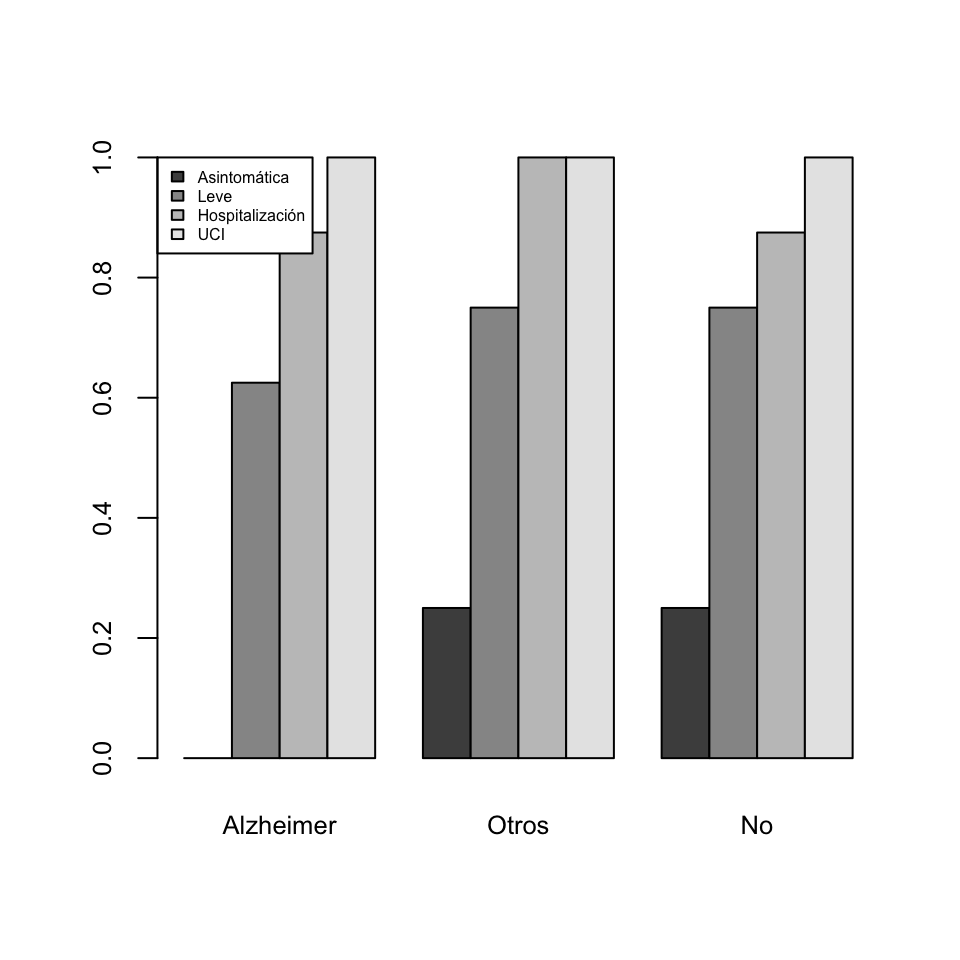

Los diagramas de puntos solo son útiles cuando tenemos pocos valores en la muestra, de manera que valga la pena verlos todos. Cuando la muestra es grande, pongamos de 20 o más números, se suelen reemplazar por  un  tipo de gráfico que resume algunos  estadísticos de la muestra llamado  un **diagrama de caja** (*boxplot*). La estructura básica de un diagrama de caja es la que muestra la Figura \@ref(fig:bosplotgen).


<div class="figure" style="text-align: center">
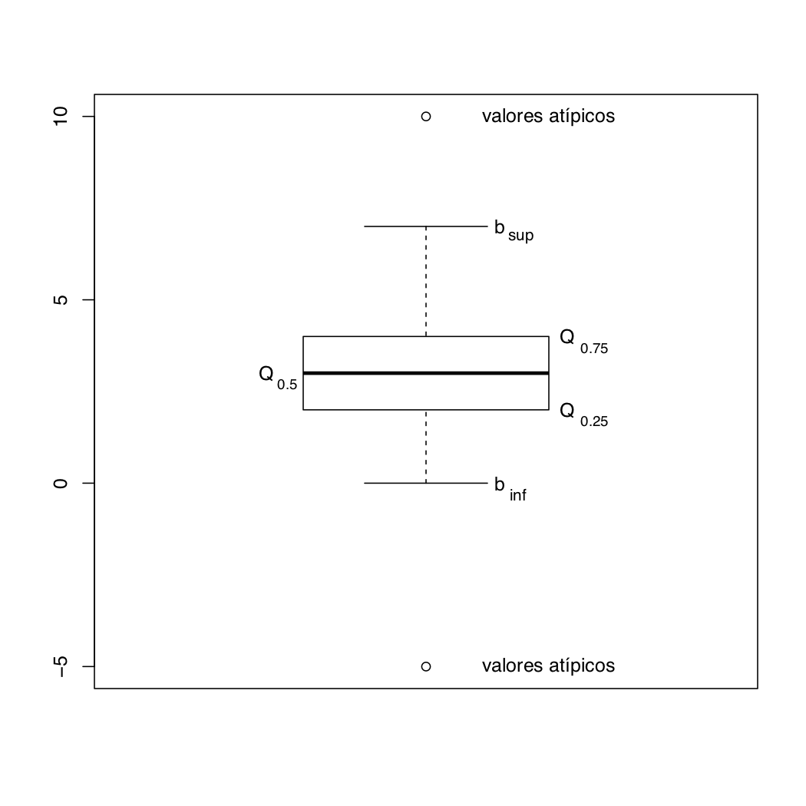
<p class="caption">(\#fig:bosplotgen)Un diagrama de caja genérico</p>
</div>

En este gráfico:

* La línea gruesa que divide la caja marca la mediana

* Los lados inferior y superior de la caja representan los cuartiles $Q_{0.25}$ y $Q_{0.75}$. Por lo tanto:

    * la altura de la caja es igual al rango intercuartílico $\mathit{IQR}$
    * la caja contiene alrededor del 50% de los valores de la muestra

* Los valores $b_{inf}, b_{sup}$ son los  **bigotes**  (*whiskers*) del gráfico y se calculan de la manera siguiente:

    * El bigote inferior $b_{inf}$ es el menor valor de la muestra que es mayor o igual que $Q_{0.25}- 1.5\cdot \mathit{IQR}$
    
    * El bigote superior $b_{sup}$ es el mayor valor de la muestra que es menor o igual que $Q_{0.75}+1.5\cdot\mathit{IQR}$
    
    Los bigotes marcan el intervalo donde "deberían caer" todos los valores de la muestra. 

* Si hay datos más allá de los bigotes, se llaman **valores atípicos** o **anómalos**, *outliers* en inglés, y se marcan como puntos aislados. 


\BeginKnitrBlock{example}<div class="example"><span class="example" id="exm:glucosabp"><strong>(\#exm:glucosabp) </strong></span>Vamos a dibujar el diagrama de caja de los 14 niveles de glucosa usados en ejercicios anteriores, y que damos ordenados de menor a mayor:
 
<p style="text-align:center">56, 60, 62, 63, 63, 65, 65, 66, 66, 66, 66, 68, 70, 72</p>
 </div>\EndKnitrBlock{example}

* Tenemos que $Q_{0.25}=63$, $Q_{0.5}=65.5$ y $Q_{0.75}=66$. Esto nos define la caja central.

* $b_{inf}$ será el primer valor de la muestra ordenada que es mayor o igual que $63- 1.5\cdot 3=58.5$. Es el 60.

* $b_{sup}$ será el último valor de la muestra ordenada que es menor o igual que $66+ 1.5\cdot 3=70.5$. Es el 70.

* Hay dos valores atípicos: el 56, que es menor que $b_{inf}$, y el  72, que es mayor que $b_{sup}$.

El resultado es el siguiente, en el que hemos superpuesto el diagrama de puntos para comprender mejor cómo hemos obtenido el diagrama:


\BeginKnitrBlock{rmdexercici}<div class="rmdexercici">Dibujad el diagrama de puntos de la variable "Hijos" y superponedle su diagrama de caja. El resultado debería ser:</div>\EndKnitrBlock{rmdexercici}

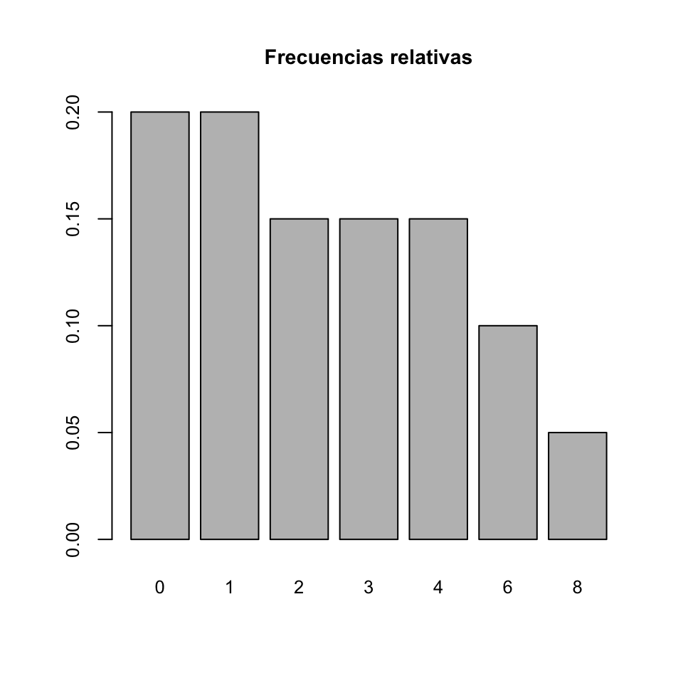


\BeginKnitrBlock{rmdcaution}<div class="rmdcaution">En los gráficos anteriores hemos superpuesto el diagrama de puntos al diagrama de caja para ayudar a comprender cómo se construye este último, pero en la vida real esto no se hace: se da un gráfico u otro, nunca los dos.</div>\EndKnitrBlock{rmdcaution}

## Histogramas

Un **histograma** es una representación gráfica de un conjunto de datos cuantitativos continuos, consistente en dividir el intervalo de valores entre el mínimo y el máximo en intervalos contiguos y disjuntos, llamado **clases**, y dibujar entonces una especie de diagrama de barras de estas clases con las particularidades siguientes:

* Las barras se dibujan sin espacios entre ellas (para representar la continuidad de los datos)

* Si se trata de un **histograma de frecuencias absolutas** (en el que las barras representan las frecuencias absolutas de las clases) y todas las clases tienen la misma amplitud, las alturas de las barras son las frecuencias de las clases

* En cualquier otro caso (es decir, si se trata de un **histograma de frecuencias relativas** o si es un histograma de frecuencias absolutas pero las clases tienen amplitudes diferentes), **las alturas de las barras han de ser tales que las áreas de las barras sean iguales a las frecuencias de las clases**

\BeginKnitrBlock{rmdromans}<div class="rmdromans">En realidad, en un histograma lo que representa la frecuencia de la clase es siempre el **área** de su barra. Pero si todas las clases tienen la misma amplitud, las áreas de las barras serán sus alturas por la amplitud común de las bases, y por lo tanto proporcionales a las alturas. En este caso, y **solo en este caso**, podemos interpretar que las alturas representan las frecuencias. Pero en la práctica, y por motivos que se entenderán al hablar de variables aleatorias en el próximo tema, esta representación de las frecuencias por medio de las alturas solo se lleva a cabo para frecuencias absolutas.</div>\EndKnitrBlock{rmdromans}

\BeginKnitrBlock{example}<div class="example"><span class="example" id="exm:unnamed-chunk-253"><strong>(\#exm:unnamed-chunk-253) </strong></span>Consideremos la siguiente muestra de 30 alturas de estudiantes:
  </div>\EndKnitrBlock{example}

<p style="text-align:center">1.71,1.62,1.72,1.76,1.78,1.73,1.67,1.64,1.63,1.68,1.68,1.70,1.67,  1.56,1.66,1.57,1.69,1.68,1.67,1.75,1.61,1.60,1.74,1.70,1.65,1.55,1.82,1.70,1.69,1.81</p>

El gráfico siguiente muestra el diagrama de barras de sus frecuencias absolutas, tomando como posibles niveles todas las alturas entre su mínimo y su máximo redondeadas a cm.  Todas la barras tienen alturas entre 0 y 3, y salvo una mayor presencia de los valores centrales (entre 1.67 y 1.70), no hay mucho más que salte a la vista en este gráfico.

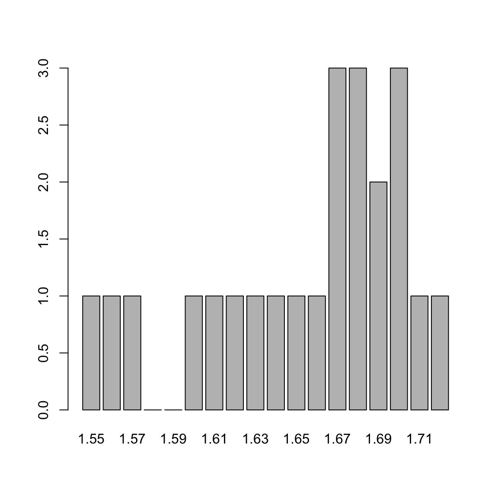

Ahora vamos a agrupar estas alturas en intervalos de 5cm. Como el valor mínimo de la muestra es 1.55 y el máximo es 1.82, vamos a tomar las clases 1.55-1.59, 1.60-1.64, 1.65-1.69,1.70-1.74,1.75-1.79, 1.80-1.84. Dibujando el diagrama de barras de las frecuencias absolutas de estas clases sin dejar espacios entre las barras, obtenemos el **histograma** siguiente:


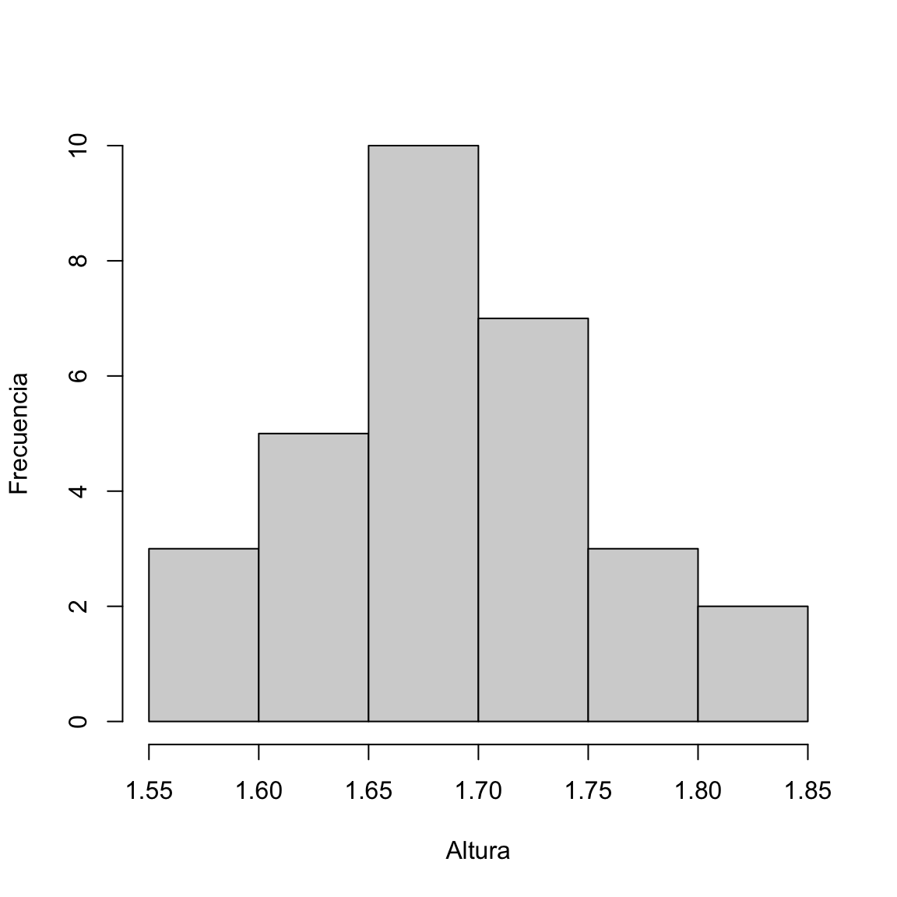


La distribución de estas alturas es mucho más fácil de entender mediante este gráfico que con el primero.

Hemos dicho que si las clases tienen la misma amplitud, las alturas de las barras han de ser las frecuencias de las clases. Pero si las clases tienen diferente amplitud, las alturas de las barras han de ser tales que **las áreas de las barras** sean iguales a las frecuencias de las clases. Veamos un ejemplo

\BeginKnitrBlock{example}<div class="example"><span class="example" id="exm:histnotas"><strong>(\#exm:histnotas) </strong></span>El gráfico siguiente es un histograma de un conjunto de 188 notas finales de una asignatura:
  </div>\EndKnitrBlock{example}


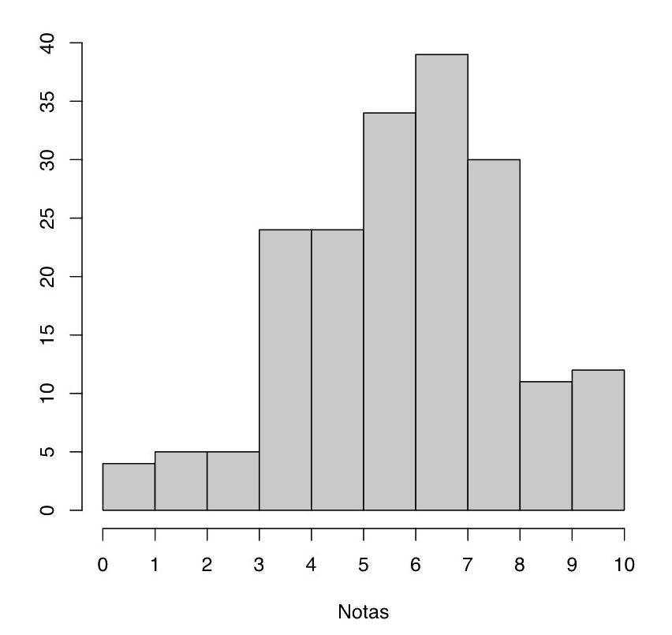

En este histograma, hemos tomado las clases [0,1), [1,2),...,[9,10]. Si en cambio hubiéramos tomado las clases [0,5) (suspenso), [5,7) (aprobado), [7,9) (notable) y [9,10] (sobresaliente), el histograma sería el siguiente: 

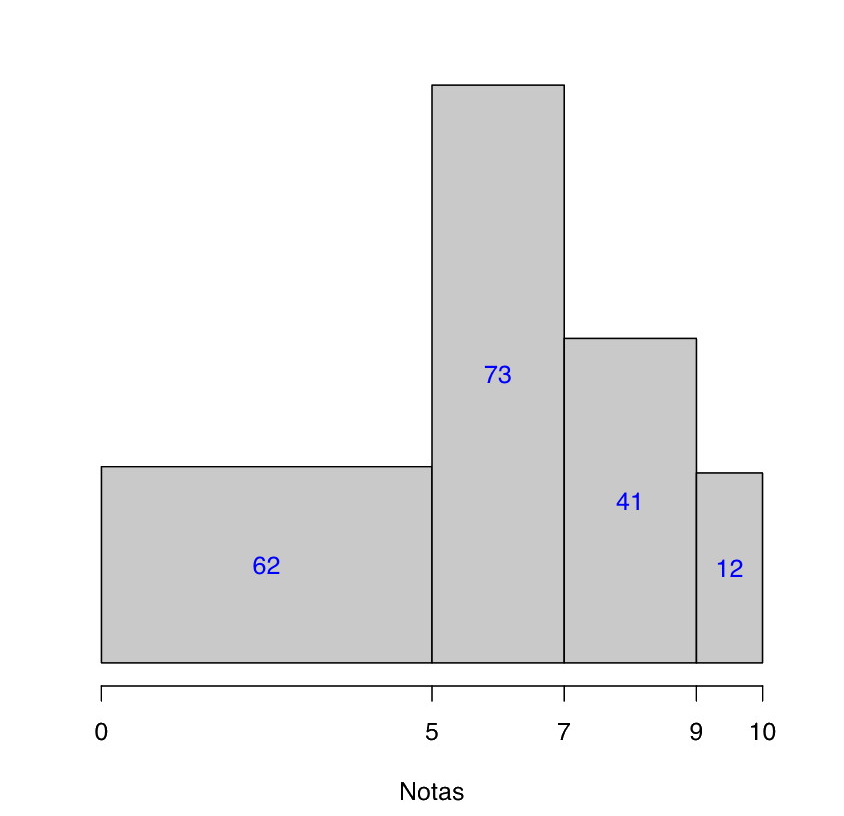

Aquí no tiene sentido marcar las frecuencias en el eje de ordenadas, porque, por ejemplo, la altura de la barra de notables es mayor que la de los suspensos, pero su frecuencia es menor. Por este motivo las hemos indicado dentro de las barras.

Suponemos que estaréis de acuerdo en que es más fácil entender la distribución de las notas con el primer histograma que con el segundo. Como el objetivo de un gráfico ha de ser ayudar a comprender un conjunto de datos, casi siempre es más conveniente usar clases de la misma amplitud a la hora de dibujar histogramas, y solo las usaremos de diferentes amplitudes cuando no haya más remedio.

Ahora bien, el número de clases ya depende de los intereses del investigador; números de clases diferentes muestran efectos diferentes. Una posible regla general para decidir el número de clases que normalmente da buenos resultados es tomar alrededor de $\sqrt{n}$ clases (donde $n$ indica el tamaño de la muestra) pero no menos de 5 clases ni más de 15.


\BeginKnitrBlock{example}<div class="example"><span class="example" id="exm:tensioagrup"><strong>(\#exm:tensioagrup) </strong></span>Tenemos una muestra de tensiones arteriales medias de 120 adultos.
</div>\EndKnitrBlock{example}

Si tomamos 5 clases, con las frecuencias
<table class="table" style="width: auto !important; margin-left: auto; margin-right: auto;">
 <thead>
  <tr>
   <th style="text-align:left;"> Clase </th>
   <th style="text-align:right;"> Frecuencia </th>
  </tr>
 </thead>
<tbody>
  <tr>
   <td style="text-align:left;"> [80,100) </td>
   <td style="text-align:right;"> 6 </td>
  </tr>
  <tr>
   <td style="text-align:left;"> [100,120) </td>
   <td style="text-align:right;"> 49 </td>
  </tr>
  <tr>
   <td style="text-align:left;"> [120,140) </td>
   <td style="text-align:right;"> 45 </td>
  </tr>
  <tr>
   <td style="text-align:left;"> [140,160) </td>
   <td style="text-align:right;"> 18 </td>
  </tr>
  <tr>
   <td style="text-align:left;"> [160,180) </td>
   <td style="text-align:right;"> 2 </td>
  </tr>
</tbody>
</table>
obtenemos el histograma

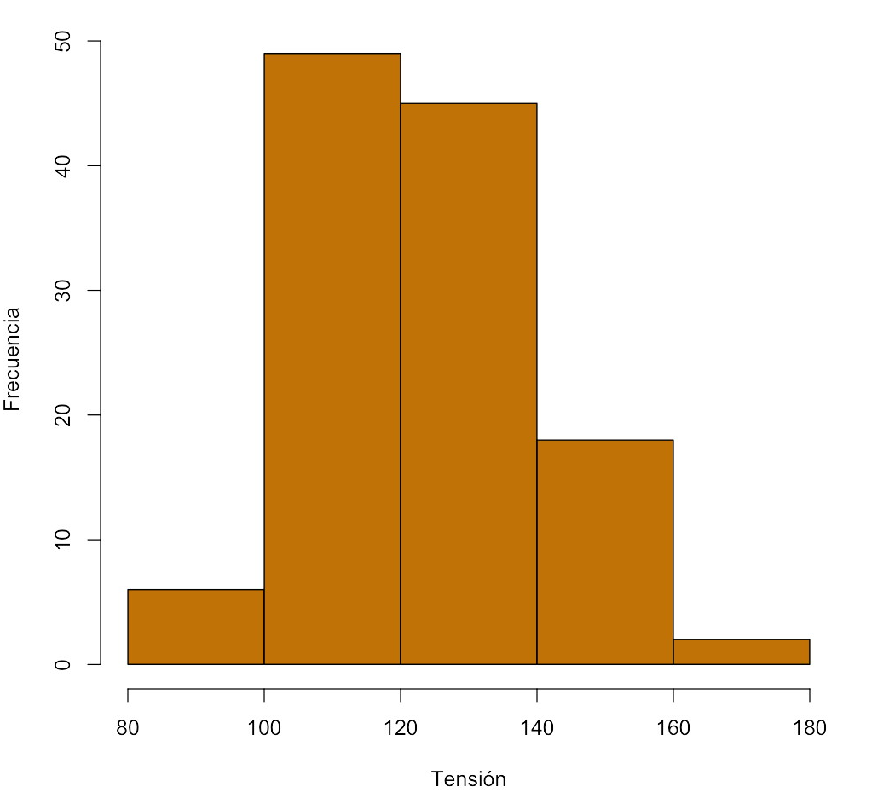

Si tomamos 9 clases, con las frecuencias
<table class="table" style="width: auto !important; margin-left: auto; margin-right: auto;">
 <thead>
  <tr>
   <th style="text-align:left;"> Clase </th>
   <th style="text-align:right;"> Frecuencia </th>
  </tr>
 </thead>
<tbody>
  <tr>
   <td style="text-align:left;"> [80,90) </td>
   <td style="text-align:right;"> 3 </td>
  </tr>
  <tr>
   <td style="text-align:left;"> [90,100) </td>
   <td style="text-align:right;"> 3 </td>
  </tr>
  <tr>
   <td style="text-align:left;"> [100,110) </td>
   <td style="text-align:right;"> 16 </td>
  </tr>
  <tr>
   <td style="text-align:left;"> [110,120) </td>
   <td style="text-align:right;"> 33 </td>
  </tr>
  <tr>
   <td style="text-align:left;"> [120,130) </td>
   <td style="text-align:right;"> 23 </td>
  </tr>
  <tr>
   <td style="text-align:left;"> [130,140) </td>
   <td style="text-align:right;"> 22 </td>
  </tr>
  <tr>
   <td style="text-align:left;"> [140,150) </td>
   <td style="text-align:right;"> 13 </td>
  </tr>
  <tr>
   <td style="text-align:left;"> [150,160) </td>
   <td style="text-align:right;"> 5 </td>
  </tr>
  <tr>
   <td style="text-align:left;"> [160,170) </td>
   <td style="text-align:right;"> 2 </td>
  </tr>
</tbody>
</table>
obtenemos el histograma

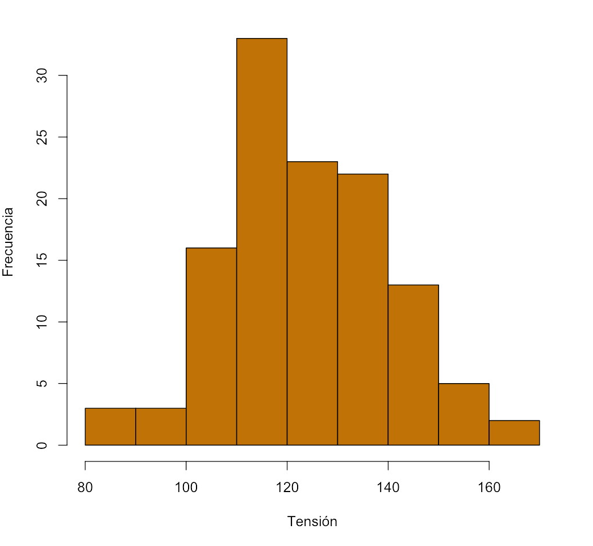

Y si tomamos 15 clases, con las frecuencias
<table class="table" style="width: auto !important; margin-left: auto; margin-right: auto;">
 <thead>
  <tr>
   <th style="text-align:left;"> Clase </th>
   <th style="text-align:right;"> Frecuencia </th>
  </tr>
 </thead>
<tbody>
  <tr>
   <td style="text-align:left;"> [80,85) </td>
   <td style="text-align:right;"> 1 </td>
  </tr>
  <tr>
   <td style="text-align:left;"> [85,90) </td>
   <td style="text-align:right;"> 2 </td>
  </tr>
  <tr>
   <td style="text-align:left;"> [90,95) </td>
   <td style="text-align:right;"> 1 </td>
  </tr>
  <tr>
   <td style="text-align:left;"> [95,100) </td>
   <td style="text-align:right;"> 2 </td>
  </tr>
  <tr>
   <td style="text-align:left;"> [100,105) </td>
   <td style="text-align:right;"> 6 </td>
  </tr>
  <tr>
   <td style="text-align:left;"> [105,110) </td>
   <td style="text-align:right;"> 10 </td>
  </tr>
  <tr>
   <td style="text-align:left;"> [110,115) </td>
   <td style="text-align:right;"> 13 </td>
  </tr>
  <tr>
   <td style="text-align:left;"> [115,120) </td>
   <td style="text-align:right;"> 20 </td>
  </tr>
  <tr>
   <td style="text-align:left;"> [120,125) </td>
   <td style="text-align:right;"> 9 </td>
  </tr>
  <tr>
   <td style="text-align:left;"> [125,130) </td>
   <td style="text-align:right;"> 14 </td>
  </tr>
  <tr>
   <td style="text-align:left;"> [130,135) </td>
   <td style="text-align:right;"> 13 </td>
  </tr>
  <tr>
   <td style="text-align:left;"> [135,140) </td>
   <td style="text-align:right;"> 9 </td>
  </tr>
  <tr>
   <td style="text-align:left;"> [140,145) </td>
   <td style="text-align:right;"> 9 </td>
  </tr>
  <tr>
   <td style="text-align:left;"> [145,150) </td>
   <td style="text-align:right;"> 4 </td>
  </tr>
  <tr>
   <td style="text-align:left;"> [150,155) </td>
   <td style="text-align:right;"> 3 </td>
  </tr>
  <tr>
   <td style="text-align:left;"> [155,160) </td>
   <td style="text-align:right;"> 2 </td>
  </tr>
  <tr>
   <td style="text-align:left;"> [160,165) </td>
   <td style="text-align:right;"> 2 </td>
  </tr>
</tbody>
</table>
obtenemos el histograma

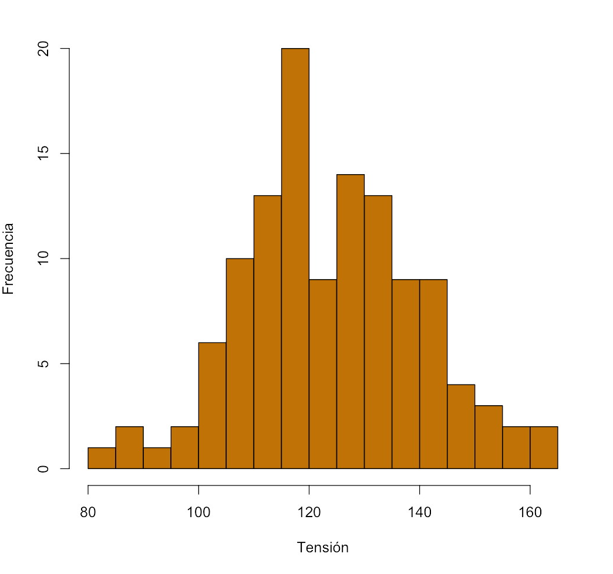

En este último histograma, con más resolución, podemos observar dos picos que en los otros no aparecen.  

Como hemos comentado, los histogramas también pueden ser de frecuencias relativas: en este caso, tanto si todas las clases tienen la misma amplitud como si no **las alturas de las cajas han de ser los valores tales que el área de la barra sea la frecuencia relativa de la clase**. A estas alturas se les llama las **densidades** de las clases. Es decir, la frecuencia relativa de cada clase es la amplitud de la clase por su densidad. De esta manera, la suma de las áreas de las barras será 1. Como también ya hemos comentado, veremos la justificación de esta convención en el próximo tema, sobre Variables Aleatorias.


Así, en el ejemplo anterior para 9 clases, las frecuencias relativas y las densidades serían
<table class="table" style="width: auto !important; margin-left: auto; margin-right: auto;">
 <thead>
  <tr>
   <th style="text-align:left;"> Clase </th>
   <th style="text-align:right;"> Frec. absoluta </th>
   <th style="text-align:right;"> Frec. relativa </th>
   <th style="text-align:right;"> Densidad </th>
  </tr>
 </thead>
<tbody>
  <tr>
   <td style="text-align:left;"> [80,90) </td>
   <td style="text-align:right;"> 3 </td>
   <td style="text-align:right;"> 0.025 </td>
   <td style="text-align:right;"> 0.0025 </td>
  </tr>
  <tr>
   <td style="text-align:left;"> [90,100) </td>
   <td style="text-align:right;"> 3 </td>
   <td style="text-align:right;"> 0.025 </td>
   <td style="text-align:right;"> 0.0025 </td>
  </tr>
  <tr>
   <td style="text-align:left;"> [100,110) </td>
   <td style="text-align:right;"> 16 </td>
   <td style="text-align:right;"> 0.133 </td>
   <td style="text-align:right;"> 0.0133 </td>
  </tr>
  <tr>
   <td style="text-align:left;"> [110,120) </td>
   <td style="text-align:right;"> 33 </td>
   <td style="text-align:right;"> 0.275 </td>
   <td style="text-align:right;"> 0.0275 </td>
  </tr>
  <tr>
   <td style="text-align:left;"> [120,130) </td>
   <td style="text-align:right;"> 23 </td>
   <td style="text-align:right;"> 0.192 </td>
   <td style="text-align:right;"> 0.0192 </td>
  </tr>
  <tr>
   <td style="text-align:left;"> [130,140) </td>
   <td style="text-align:right;"> 22 </td>
   <td style="text-align:right;"> 0.183 </td>
   <td style="text-align:right;"> 0.0183 </td>
  </tr>
  <tr>
   <td style="text-align:left;"> [140,150) </td>
   <td style="text-align:right;"> 13 </td>
   <td style="text-align:right;"> 0.108 </td>
   <td style="text-align:right;"> 0.0108 </td>
  </tr>
  <tr>
   <td style="text-align:left;"> [150,160) </td>
   <td style="text-align:right;"> 5 </td>
   <td style="text-align:right;"> 0.042 </td>
   <td style="text-align:right;"> 0.0042 </td>
  </tr>
  <tr>
   <td style="text-align:left;"> [160,170) </td>
   <td style="text-align:right;"> 2 </td>
   <td style="text-align:right;"> 0.017 </td>
   <td style="text-align:right;"> 0.0017 </td>
  </tr>
</tbody>
</table>
y el histograma de frecuencias relativas a que dan lugar es

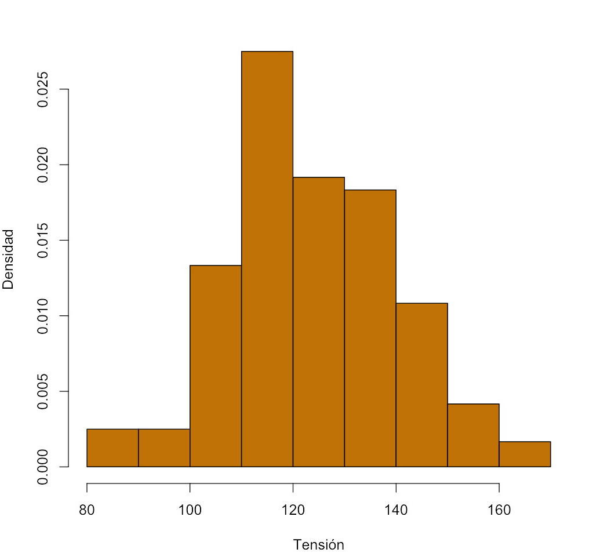


Recordad  que, en un histograma correcto, si las clases tienen amplitud diferente, las alturas de las barras han de ser las que den como áreas de las barras las frecuencias (absolutas o relativas) de las clases.

\BeginKnitrBlock{example}<div class="example"><span class="example" id="exm:unnamed-chunk-260"><strong>(\#exm:unnamed-chunk-260) </strong></span>El gráfico siguiente, extraído ["Iodine status of UK schoolgirls: a cross-sectional survey"](https://www.sciencedirect.com/science/article/abs/pii/S0140673611606934) (M. Vanderpump *et al*, *The Lancet* 377 (2011), pp. 2007–2012),  representa las proporciones de colegialas británicas en una muestra que tuvieron diferentes concentraciones de yodo en la orina. Es un diagrama de barras, no un histograma.
</div>\EndKnitrBlock{example}

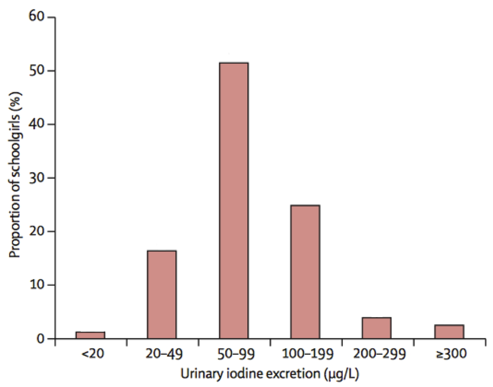

A primera vista, parecería que la distribución de estas concentraciones de yodo es bastante simétrica. Pero observad que las clases no tienen la misma amplitud. El histograma de frecuencias relativas correcto con estas clases es el siguiente, donde observamos lo que llamaremos una **cola a la derecha**:

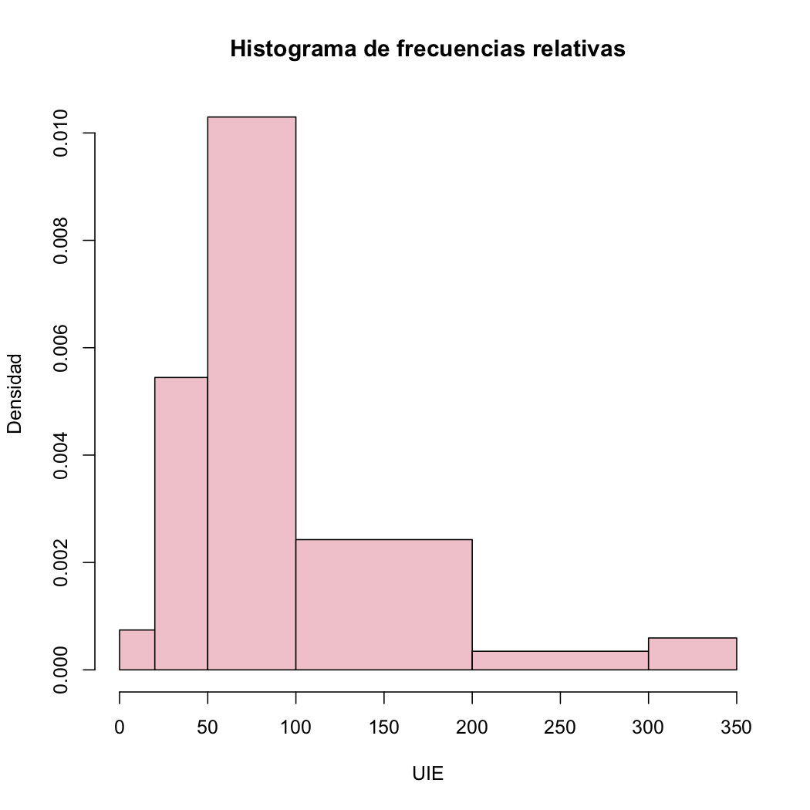

El histograma sería más fácil de interpretar si las clases tuvieran todas la misma amplitud:

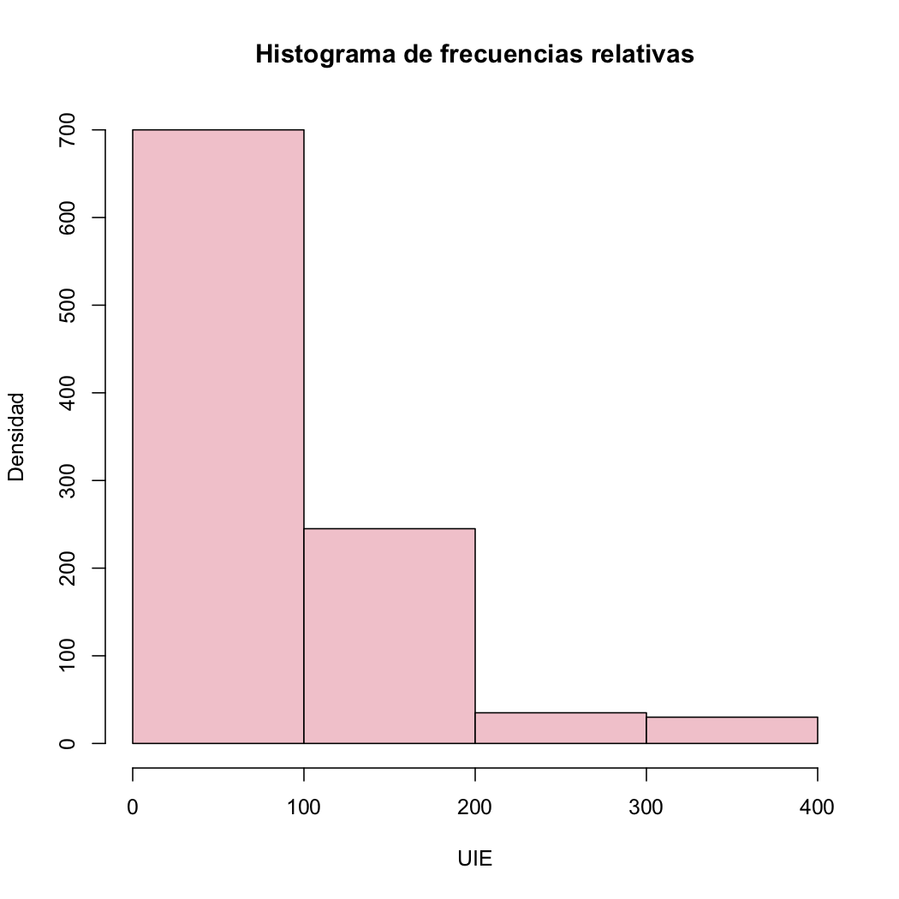

En este último histograma vemos claramente que el conjunto de datos no es de ninguna manera simétrico.

## Polígonos de frecuencias

A menudo se substituye un histograma con clases de la misma amplitud por un **polígono de frecuencias**, en el que

* Para cada clase, marcamos los puntos de abscisa el punto medio de la clase y ordenada la altura de su barra

* Unimos puntos consecutivos mediante segmentos

A modo de ejemplo, recordemos el histograma de un conjunto de notas del Ejemplo \@ref(exm:histnotas), agrupadas en 10 clases:

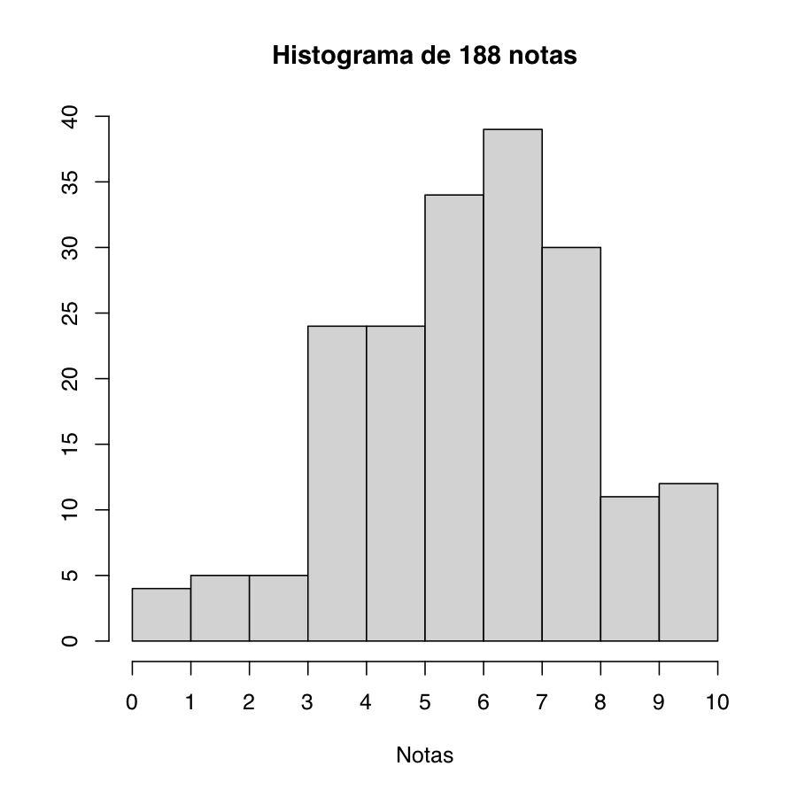

Su polígono de frecuencias es:
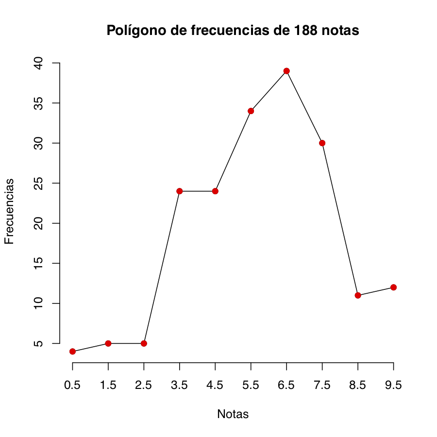

Los polígonos de frecuencias son útiles para representar simultáneamente varios histogramas:

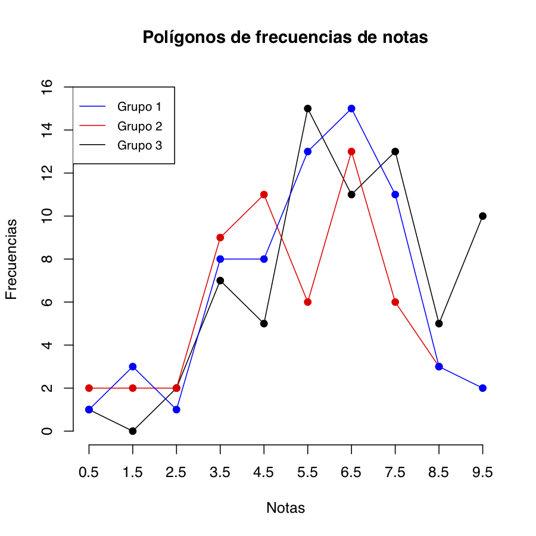

\BeginKnitrBlock{rmdexercici}<div class="rmdexercici">Aquí tenéis los tiempos (en horas) de los ganadores de la maratón de Nueva York (categorías masculina y femenina) de 1970 a 2015, ordenados de menor a mayor:
  
<p style="text-align:center">2.08, 2.12, 2.13, 2.13, 2.13, 2.13, 2.13, 2.13, 2.13, 2.13, 2.13, 2.13, 2.15, 2.15, 2.15, 2.15, 2.15, 2.15, 2.15, 2.15, 2.15, 2.15, 2.15, 2.17, 2.17, 2.17, 2.17, 2.17, 2.17, 2.18, 2.18, 2.18, 2.18, 2.18, 2.18, 2.18, 2.20, 2.20, 2.23, 2.32, 2.35, 2.37, 2.37, 2.38, 2.38, 2.38, 2.38, 2.40, 2.40, 2.40, 2.40, 2.42, 2.42, 2.42, 2.42, 2.42, 2.42, 2.42, 2.42, 2.42,  2.42, 2.43, 2.43, 2.45, 2.45, 2.45, 2.45, 2.45, 2.45, 2.47, 2.47, 2.47, 2.47, 2.47, 2.47, 2.47, 2.47, 2.48, 2.50, 2.50, 2.52, 2.53, 2.65, 2.72, 2.77, 2.92, 2.95, 3.12, 3.13</p>

Dibujad su histograma usando 6 clases de amplitud 0.2, empezando en 2 horas, y su diagrama de caja. ¿Qué observáis en cada uno de ellos que no podáis observar en el otro? ¿Cuál de los dos os parece más informativo?
  </div>\EndKnitrBlock{rmdexercici}


## Asimetría y  curtosis

Terminamos la descripción de variables cuantitativas con otros dos estadísticos que a veces se usan en la literatura médica, y por tanto conviene que conozcáis, pero que nosotros no usaremos, porque son inútiles: las propiedades que describen se ven mejor con un histograma, y no sirven para estimar la correspondiente propiedad de la variable poblacional. 

Dada una muestra de datos numéricos $x_1,\ldots,x_n$, de media $\overline{x}$ y desviación típica $s_x$:

* El **coeficiente de asimetría** (*skewness*) es 
$$
\gamma_1=\frac{1}{s_x^3}\cdot \frac{\sum_{i=1}^n (x_i-\overline{x})^3}{n}
$$

* El **coeficiente de curtosis**,  o **apuntamiento** es 
$$
\beta_2=\frac{1}{s_x^4}\cdot \frac{\sum_{i=1}^n (x_i-\overline{x})^4}{n}-3
$$

Empecemos con el coeficiente de asimetría. Como su nombre indica, cuantifica la **asimetría** de la variable. Para definir esta característica, lo más práctico es dibujar un histograma de la variable y considerar el eje de simetría pasando por la *media*. Llamaremos **colas** a los trozos del histograma a ambos lados de este eje de simetría. Entonces:

* La variable es **simétrica** si ambas colas son similares, como en los dos gráficos siguientes:
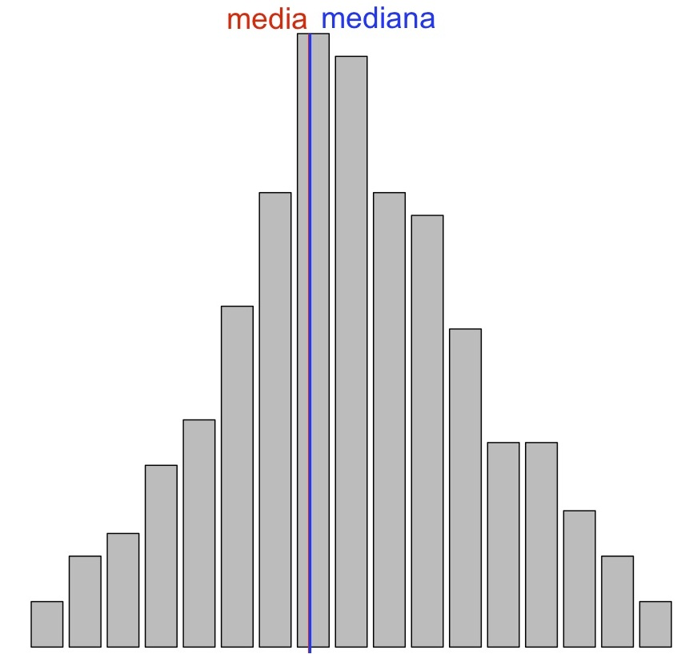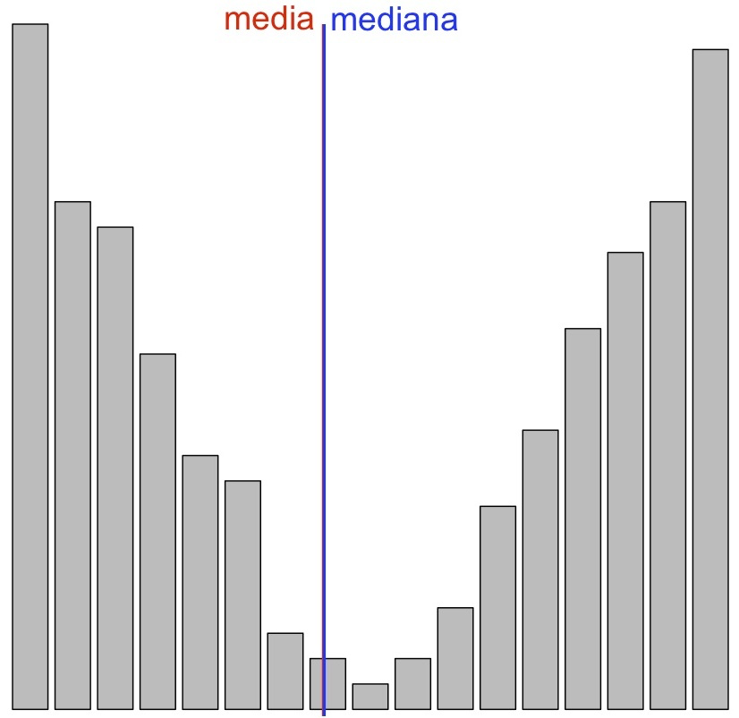

    Esta última diremos que **tiene forma de U**, por motivos obvios.

* La variable presenta una **asimetría negativa** o **a la izquierda** cuando la cola de la izquierda es más larga que la de la derecha, en el sentido de que hay más valores más alejados de la media por la izquierda que por la derecha.  En este caso se suele decir que la variable  **tiene una cola a la izquierda** (aunque con la definición que hemos dado la variable siempre tiene una cola a cada lado).


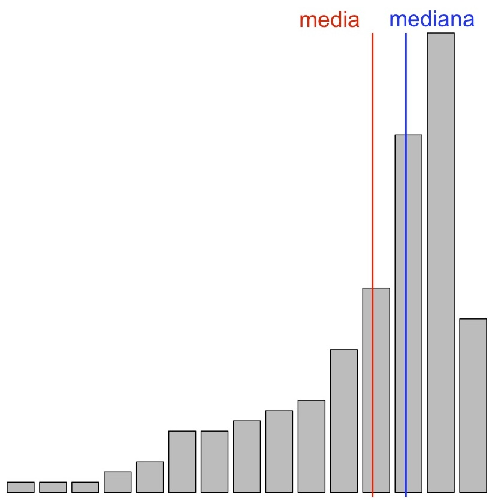

* La variable presenta una **asimetría positiva** o **a la derecha** cuando la cola de la derecha es más larga que la de la izquierda, en el sentido de que hay más valores más alejados de la media por la derecha que por la izquierda. En este caso también diremos que la variable **tiene una cola a la derecha**.


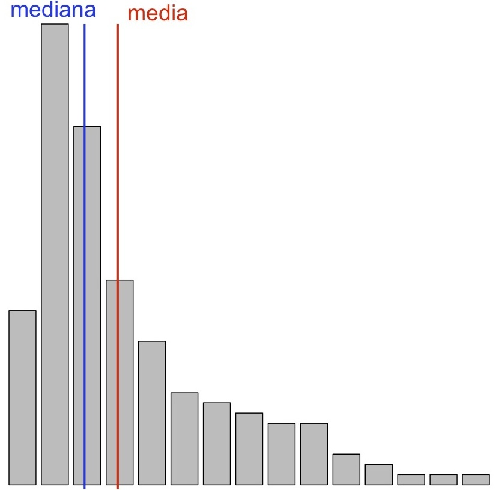

Habréis observado que en los histogramas anteriores hemos dibujado las líneas verticales sobre la media y la mediana.

* En una variable simétrica, la simetría hace que la media y la mediana sean aproximadamente iguales

* En una variable asimétrica a la izquierda, la existencia de valores relativamente muy pequeños en el extremo de la cola de la izquierda suele desplazar la media hacia la izquierda de la mediana, de manera que la media suele ser más pequeña que la mediana.

* Y al revés, en una variable asimétrica a la derecha, la existencia de valores relativamente muy grandes en el extremo de la cola de la derecha suele desplazar la media hacia la derecha de la mediana, de manera que la media suele ser más grande que la mediana.


\BeginKnitrBlock{rmdcaution}<div class="rmdcaution">En los puntos anteriores hemos descrito lo que "suele pasar" con la media y la mediana en variables asimétricas, pero no siempre pasa. Así, si la media de un vector de datos es bastante más grande que la mediana, suele ser señal de que la 
muestra es asimétrica a la derecha, pero solo lo "suele ser": con un poco de imaginación se puede construir un vector asimétrico a la izquierda con la media a la derecha de la mediana. Pensadlo un poco.</div>\EndKnitrBlock{rmdcaution}


Pues bien, el coeficiente de asimetría $\gamma_1$ indica el tipo de asimetría de la variable:

* Cuando $\gamma_1\approx 0$, la distribución de los datos es simétrica
* Cuando $\gamma_1< 0$, la variable es asimétrica negativa, con cola a la izquierda
* Cuando $\gamma_1> 0$, la variable es asimétrica positiva, con cola a la derecha

La mejor manera de decidir la asimetría de una variable es por medio de un histograma, aunque a menudo también se puede ver en un diagrama de caja, como muestran los gráficos siguientes:

* Un histograma y diagrama de caja de una variable simétrica:
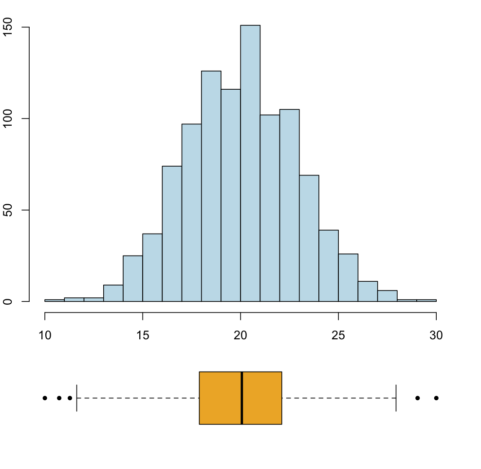

* Un histograma y diagrama de caja de una variable asimétrica a la izquierda:
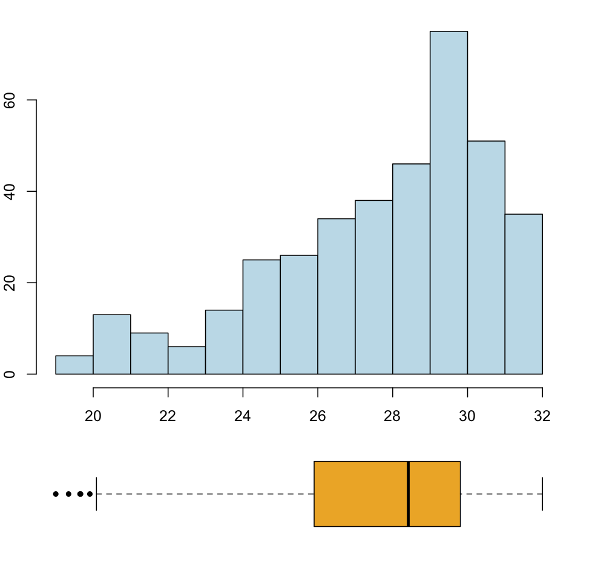

* Un histograma y diagrama de caja de una variable asimétrica a la derecha:
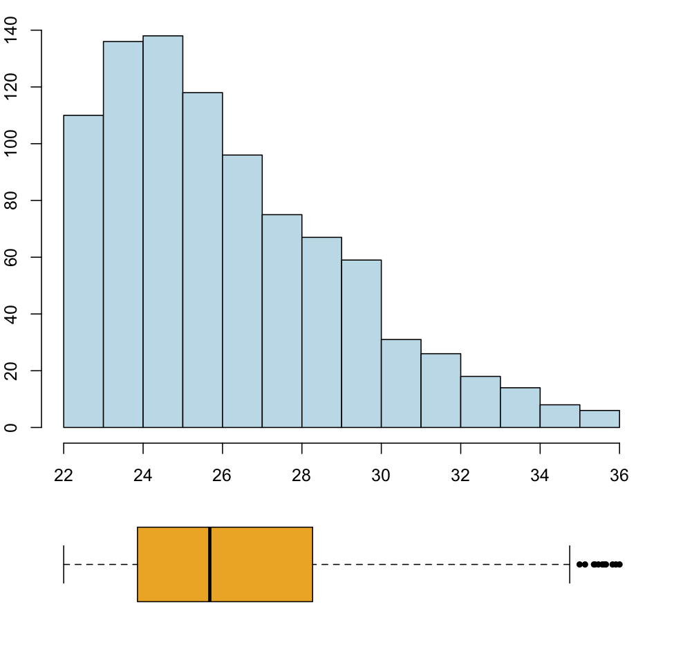

\BeginKnitrBlock{rmdimportant}<div class="rmdimportant">Usar la media y la desviación típica (o la varianza) para describir el "valor central" de una variable y cuantificar su dispersión, respectivamente, es lo adecuado solo cuando la variable es bastante simétrica: más aún, solo cuando es bastante simétrica y su histograma recuerda la forma de una campana de Gauss (Figura \@ref(fig:Gauss)); es decir, por ejemplo, no cuando tiene forma de U. Cuando el histograma es simétrico y con una forma parecida a 
una campana de Gauss, el intervalo $\overline{x}\pm s_x$ suele contener aproximadamente unos 2/3 de los datos de la muestra.

Pero para variables muy asimétricas o simétricas en forma de U es mejor usar la mediana y el intervalo intercuartílico. Recordad que este último contiene aproximadamente el 50% de la muestra.
</div>\EndKnitrBlock{rmdimportant}

<div class="figure" style="text-align: center">
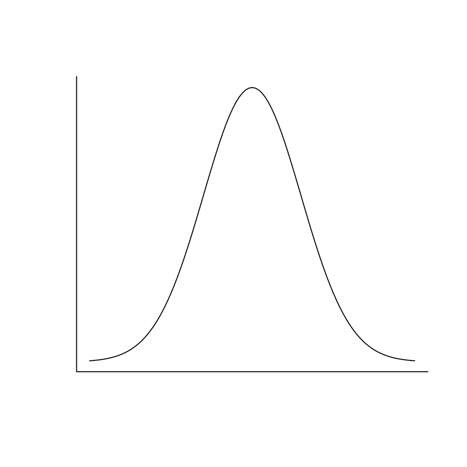
<p class="caption">(\#fig:Gauss)Una campana de Gauss</p>
</div>


\BeginKnitrBlock{example}<div class="example"><span class="example" id="exm:unnamed-chunk-266"><strong>(\#exm:unnamed-chunk-266) </strong></span>Considerad la variable (asimétrica a la derecha) que tiene el histograma siguiente:
  </div>\EndKnitrBlock{example}

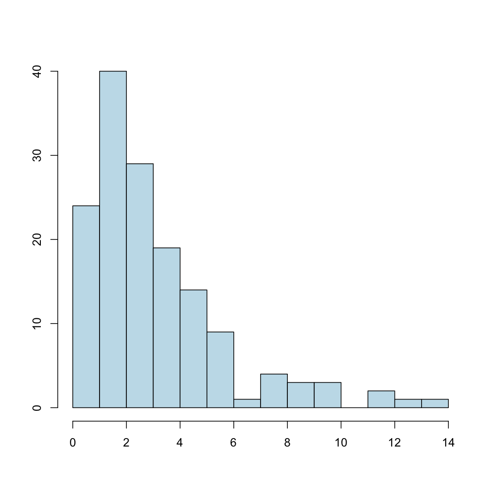

Resulta que su media es $\overline{x}=3.1$ y su desviación típica es $s_x=2.5$, y que el intervalo $[\overline{x}-s_x,\overline{x}+s_x]$ contiene un 84% de la muestra. Su mediana es $Q_{0.5}=2.3$, a la izquierda de la media, y su intervalo intercuartílico $IQI$ es [1.3,4.2]. Por cierto, su coeficiente de asimetría es $\gamma_1=1.7$, lo que es consistente con su cola a la derecha. 

Considerad ahora la variable simétrica siguiente:

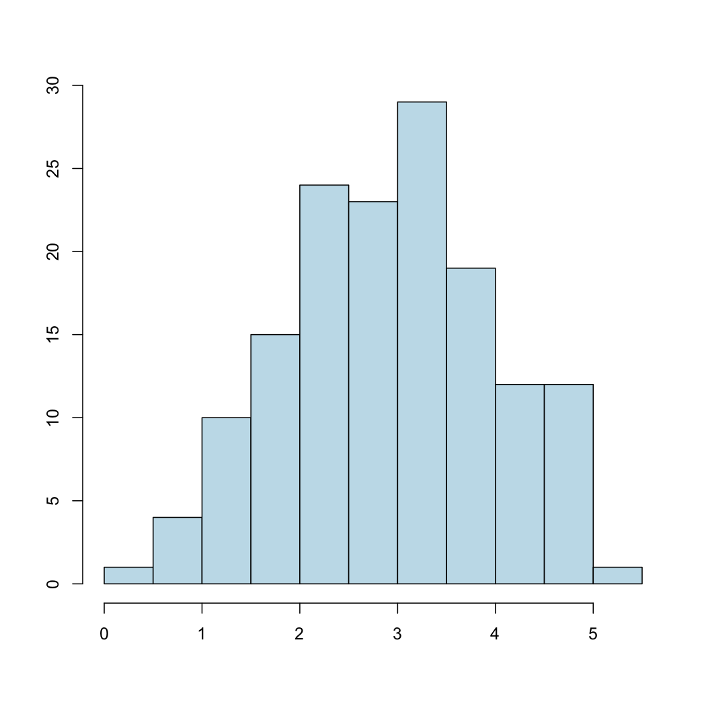

Resulta que su media es $\overline{x}=2.9$ y su desviación típica es $s_x=1.1$, y que el intervalo $[\overline{x}-s_x,\overline{x}+s_x]$ contiene un 64% de la muestra. Su mediana es $Q_{0.5}=3$, muy cercana a su media, y su $IQI$ es [2.2, 3.7]. Su coeficiente de asimetría es $\gamma_1=-0.03$, lo que es consistente con su simetría. 

Considerad finalmente la variable siguiente, que es simétrica pero en forma de U:

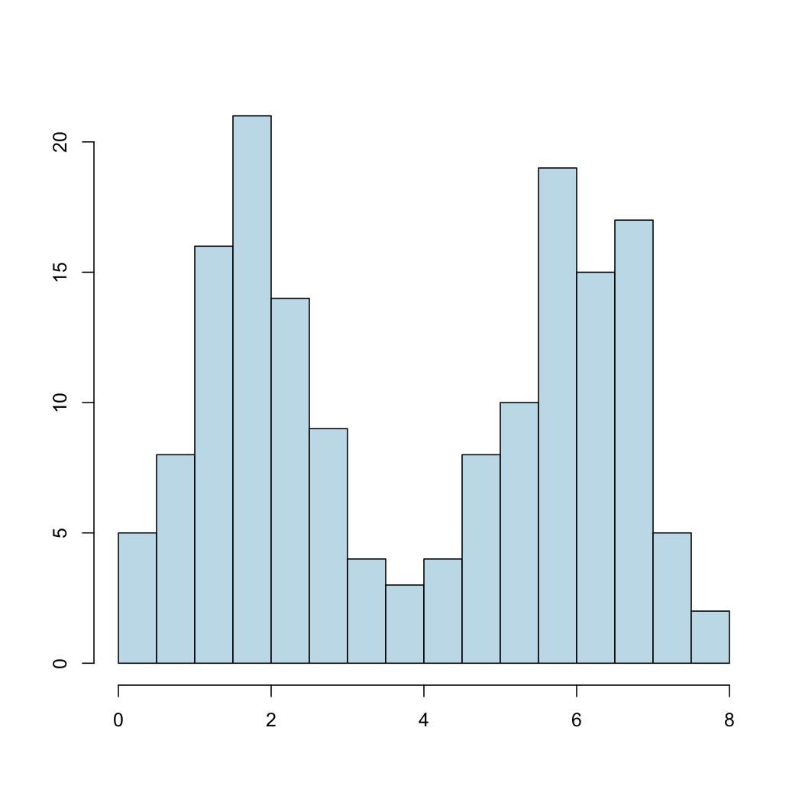

Resulta que su media es $\overline{x}=3.9$ y su desviación típica es $s_x=2.2$, pero el intervalo $[\overline{x}-s_x,\overline{x}+s_x]$ contiene solo el 52% de la muestra. Su mediana es también $Q_{0.5}=3.9$  y su $IQI$ es [1.8,5.9]. Su coeficiente de asimetría es $\gamma_1=0.0007$.


\BeginKnitrBlock{rmdnote}<div class="rmdnote">Los tres tipos de simetría/asimetría se generalizan de manera inmediata a variables poblacionales, a partir de alguna representación gráfica de su distribución.

Por ejemplo, si recordáis el gráfico de la distribución de los salarios anuales españoles (Figura \@ref(fig:salaris)), presenta una clara asimetría a la derecha que arrastra el salario medio a la derecha del mediano.</div>\EndKnitrBlock{rmdnote}


No nos hemos olvidado del **coeficiente de curtosis**, $\beta_2$. Este estadístico mide el grado de "apuntamiento" de la distribución de la variable.

* Cuando el histograma se parece al de una campana de Gauss (diremos que la variable es **mesocúrtica**), $\beta_2\approx 0$.


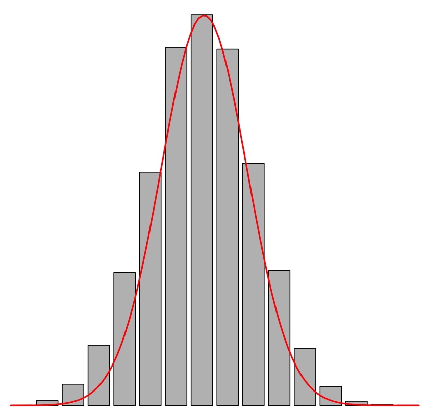

* Cuando el histograma es más puntiagudo que una campana de Gauss (diremos que la variable es **leptocúrtica**), $\beta_2> 0$.

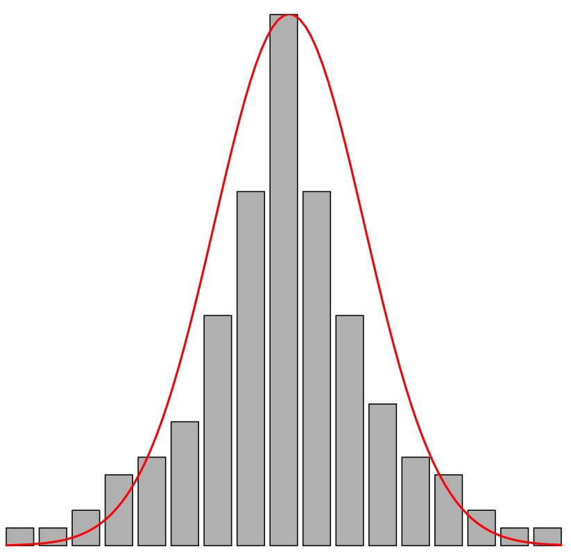

* Cuando el histograma es más achatado que una campana de Gauss (diremos que la variable es **platicúrtica**), $\beta_2< 0$.

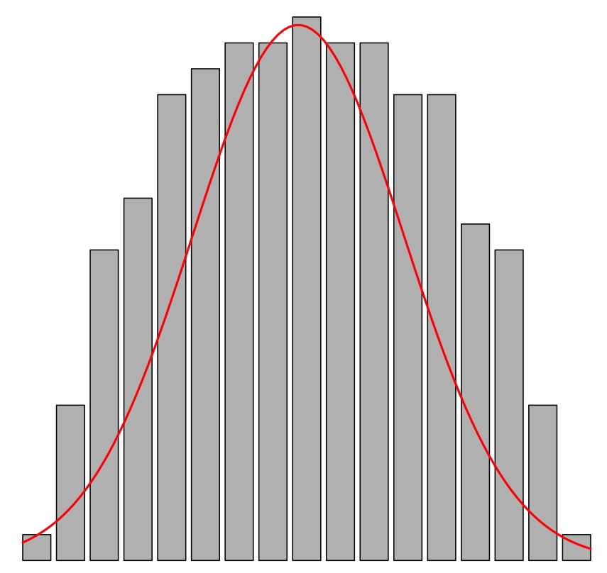

No vamos a insistir en este coeficiente ni en el apuntamiento de las variables.

## Estadísticos sobre datos agrupados {#sec:estagrup}

En nuestro lenguaje cotidiano, solemos **agrupar** datos cuantitativos sin que seamos conscientes de ello. Cuando decimos, por ejemplo, que la edad de alguien es de 18 años, no queremos decir que nació justo hoy hace 18 años, sino que ya ha cumplido los 18 años, pero aún no ha cumplido los 19; es decir, que agrupamos todas las edades que caen dentro del intervalo [18,19) en una misma clase, que llamamos "18 años". Del mismo modo, que alguien mida 1.72 no significa que esta sea su altura exacta, con la precisión del grueso de un cabello, sino que su altura pertenece a un intervalo de valores en torno a 1.72 metros que identificamos con "1.72". Bajo  la calificación de "aprobado" agrupamos todas las notas mayores o iguales que 5 y menores que 7. Y estamos seguros de que se os ocurren otros ejemplos. 

Muy a menudo, los datos cuantitativos se recogen directamente agrupados, como por ejemplo franjas salariales o el número de refrescos semanales en la tabla de datos \@ref(tab:tabla1). Aunque estas clases definan un conjunto de datos ordinales (les llamábamos **cuantitativos agrupados** en una Nota al final de la Lección \@ref(chap:edintro)) es muy probable que nos interese interpretarlas como eso: clases resultado de agrupar datos cuantitativos. Su representación gráfica adecuada es claramente un histograma, pero ¿cómo podemos calcular los estadísticos? Está claro que de manera exacta es imposible si no conocemos los datos **brutos**,  sin agrupar. Pero podemos intentar aproximarlos.

* Substituimos la moda por la **clase modal**: la clase de mayor frecuencia.
* Para calcular la media, la varianza, etc., para cada clase tomamos su punto medio, al que en este contexto llamaremos su **marca de clase**, y entenderemos que nuestra muestra está formada, para cada clase, por tantas copias de su marca como la frecuencia de la clase.

\BeginKnitrBlock{example}<div class="example"><span class="example" id="exm:tensioagrup2"><strong>(\#exm:tensioagrup2) </strong></span>Volvamos a la muestra de tensiones arteriales medias de 120 adultos del Ejemplo \@ref(exm:tensioagrup) y supongamos que nos han dado directamente los datos agrupados en 9 clases de amplitud 10:
</div>\EndKnitrBlock{example}

<table class="table" style="width: auto !important; margin-left: auto; margin-right: auto;">
 <thead>
  <tr>
   <th style="text-align:left;"> Clase </th>
   <th style="text-align:right;"> Frecuencia </th>
  </tr>
 </thead>
<tbody>
  <tr>
   <td style="text-align:left;"> [80,90) </td>
   <td style="text-align:right;"> 3 </td>
  </tr>
  <tr>
   <td style="text-align:left;"> [90,100) </td>
   <td style="text-align:right;"> 3 </td>
  </tr>
  <tr>
   <td style="text-align:left;"> [100,110) </td>
   <td style="text-align:right;"> 16 </td>
  </tr>
  <tr>
   <td style="text-align:left;"> [110,120) </td>
   <td style="text-align:right;"> 33 </td>
  </tr>
  <tr>
   <td style="text-align:left;"> [120,130) </td>
   <td style="text-align:right;"> 23 </td>
  </tr>
  <tr>
   <td style="text-align:left;"> [130,140) </td>
   <td style="text-align:right;"> 22 </td>
  </tr>
  <tr>
   <td style="text-align:left;"> [140,150) </td>
   <td style="text-align:right;"> 13 </td>
  </tr>
  <tr>
   <td style="text-align:left;"> [150,160) </td>
   <td style="text-align:right;"> 5 </td>
  </tr>
  <tr>
   <td style="text-align:left;"> [160,170) </td>
   <td style="text-align:right;"> 2 </td>
  </tr>
</tbody>
</table>

La clase modal es [110,120). Para aproximar la media y la varianza de la muestra original, tomaremos como marcas de clase los puntos medios de las clases, 85,95,...,165, y supondremos que la muestra está formada por 3 copias del valor 85, 3 copias del valor 95, 16 copias del valor 105, ..., 2 copias del valor 165. Entonces:

* Aproximamos la media de la muestra por
$$
\frac{3\times 85+3\times 95+16\times 105+\cdots+2\times 165}{120}=123.75
$$

* Aproximamos la varianza de la muestra por
$$
\frac{3\times (85-123.75)^2+3\times (95-123.75)^2+16\times (105-123.75)^2+\cdots+2\times (165-123.75)^2}{120}=267.6
$$

Por lo que refiere a la mediana y los otros cuantiles de una variable cuantitativa agrupada, se han propuesto varios métodos para intentar aproximarlos  a partir de las tablas de frecuencias de sus clases. Aquí explicaremos el más sencillo y lo ilustraremos con el ejemplo anterior. Por comodidad, vamos a añadir las frecuencias absolutas y relativas acumuladas de las clases a la tabla de frecuencias:

<table class="table" style="width: auto !important; margin-left: auto; margin-right: auto;">
 <thead>
  <tr>
   <th style="text-align:left;"> Clase </th>
   <th style="text-align:right;"> Frecuencia </th>
   <th style="text-align:right;"> Fre. acum. </th>
   <th style="text-align:right;"> Frec. rel. acum. </th>
  </tr>
 </thead>
<tbody>
  <tr>
   <td style="text-align:left;"> [80,90) </td>
   <td style="text-align:right;"> 3 </td>
   <td style="text-align:right;"> 3 </td>
   <td style="text-align:right;"> 0.0250 </td>
  </tr>
  <tr>
   <td style="text-align:left;"> [90,100) </td>
   <td style="text-align:right;"> 3 </td>
   <td style="text-align:right;"> 6 </td>
   <td style="text-align:right;"> 0.0500 </td>
  </tr>
  <tr>
   <td style="text-align:left;"> [100,110) </td>
   <td style="text-align:right;"> 16 </td>
   <td style="text-align:right;"> 22 </td>
   <td style="text-align:right;"> 0.1833 </td>
  </tr>
  <tr>
   <td style="text-align:left;"> [110,120) </td>
   <td style="text-align:right;"> 33 </td>
   <td style="text-align:right;"> 55 </td>
   <td style="text-align:right;"> 0.4583 </td>
  </tr>
  <tr>
   <td style="text-align:left;"> [120,130) </td>
   <td style="text-align:right;"> 23 </td>
   <td style="text-align:right;"> 78 </td>
   <td style="text-align:right;"> 0.6500 </td>
  </tr>
  <tr>
   <td style="text-align:left;"> [130,140) </td>
   <td style="text-align:right;"> 22 </td>
   <td style="text-align:right;"> 100 </td>
   <td style="text-align:right;"> 0.8333 </td>
  </tr>
  <tr>
   <td style="text-align:left;"> [140,150) </td>
   <td style="text-align:right;"> 13 </td>
   <td style="text-align:right;"> 113 </td>
   <td style="text-align:right;"> 0.9417 </td>
  </tr>
  <tr>
   <td style="text-align:left;"> [150,160) </td>
   <td style="text-align:right;"> 5 </td>
   <td style="text-align:right;"> 118 </td>
   <td style="text-align:right;"> 0.9833 </td>
  </tr>
  <tr>
   <td style="text-align:left;"> [160,170) </td>
   <td style="text-align:right;"> 2 </td>
   <td style="text-align:right;"> 120 </td>
   <td style="text-align:right;"> 1.0000 </td>
  </tr>
</tbody>
</table>


En primer lugar buscamos en qué clase cae la mediana, es decir, qué clase contiene el valor que separa las dos mitades de la muestra: la llamaremos el  **intervalo crítico para la mediana**. En nuestro ejemplo, será la primera clase cuya frecuencia relativa acumulada sea mayor o igual que 0.5. Se trata del intervalo [120,130).

Sean  $[L_c, L_{c+1})$ este intervalo crítico, $N_{c-1}$, la frecuencia absoluta acumulada del intervalo anterior al crítico (si el intervalo crítico es el primero, tomamos $N_{c-1}=0$), y $N_c$, la frecuencia absoluta acumulada del intervalo crítico. Entonces, lo que hacemos es unir con una recta los puntos $(L_c,N_{c-1})$ y $(L_{c+1},N_c)$ y aproximar  la mediana por medio de la abscisa $M$ del punto sobre esta recta cuya ordenada es $n/2$ (véase la Figura \@ref(fig:medianagrup)). La fórmula concreta  para $M$, por si no os acordáis de la ecuación de una recta por dos puntos, es
$$
M=L_{c}+\frac{L_{c+1}-L_{c}}{N_c-N_{c-1}}\cdot \Big(\frac{n}{2}- N_{c-1}\Big).
$$


<div class="figure" style="text-align: center">

<p class="caption">(\#fig:medianagrup)Aproximación lineal de la mediana a partir de las frecuencias de los datos agrupados.</p>
</div>

En nuestro ejemplo, $L_c=120$, $L_{c+1}=130$, $N_{c-1}=55$, $N_c=78$ y por lo tanto estimamos que
$$
M=120+\frac{130-120}{78-55}\cdot (60- 55)=122.17
$$

Un procedimiento similar se puede usar  para aproximar cualquier cuantil $Q_{p}$ de orden $p$: buscamos su intervalo crítico $[L_c,L_{c+1})$ y usamos la fórmula anterior cambiando $n/2$ por $p\cdot n$.

\BeginKnitrBlock{rmdexercici}<div class="rmdexercici">Considerad el agrupamiento  en 15 clases de la muestra de tensiones arteriales medias de 120 adultos del Ejemplo \@ref(exm:tensioagrup). A partir de este agrupamiento, estimad los valores de la media, la varianza y la mediana de la muestra, y comparadlos con los obtenidos a partir de 9 clases. ¿Cuáles creéis que estiman mejor los estadísticos de la muestra original?</div>\EndKnitrBlock{rmdexercici}


## Datos cuantitativos bivariantes

Si tenemos observaciones de dos variables cuantitativas medidas sobre una misma muestra de $n$ individuos, las recogemos en una **tabla de datos cuantitativos bivariante**
$$
\begin{array}{c|c|c}
\textbf{Individuo} &\textbf{Variable 1} &\textbf{Variable 2}\\ \hline
1 & x_{1} & y_{1} \cr
2 & x_{2} & y_{2} \cr
3 & x_{3} & y_{3} \cr
\vdots &\vdots & \vdots \cr 
n & x_{n} & y_{n} 
\end{array}
$$

Podemos representar esta tabla por medio de un **gráfico de dispersión** (*scatter plot*): el gráfico de los puntos $(x_k,y_k)$.

\BeginKnitrBlock{example}<div class="example"><span class="example" id="exm:tensionscatter"><strong>(\#exm:tensionscatter) </strong></span>Hemos medido la tensión arterial media (en mmHg) y el nivel de colesterol (en mg/dl) de 10 individuos y recogido estos valores en la tabla siguiente:
  </div>\EndKnitrBlock{example}

<table class="table" style="width: auto !important; margin-left: auto; margin-right: auto;">
 <thead>
  <tr>
   <th style="text-align:left;">   </th>
   <th style="text-align:right;"> Tensión </th>
   <th style="text-align:right;"> Colesterol </th>
  </tr>
 </thead>
<tbody>
  <tr>
   <td style="text-align:left;"> 1 </td>
   <td style="text-align:right;"> 105.7 </td>
   <td style="text-align:right;"> 169.3 </td>
  </tr>
  <tr>
   <td style="text-align:left;"> 2 </td>
   <td style="text-align:right;"> 117.4 </td>
   <td style="text-align:right;"> 191.7 </td>
  </tr>
  <tr>
   <td style="text-align:left;"> 3 </td>
   <td style="text-align:right;"> 131.9 </td>
   <td style="text-align:right;"> 202.6 </td>
  </tr>
  <tr>
   <td style="text-align:left;"> 4 </td>
   <td style="text-align:right;"> 117.8 </td>
   <td style="text-align:right;"> 218.2 </td>
  </tr>
  <tr>
   <td style="text-align:left;"> 5 </td>
   <td style="text-align:right;"> 133.0 </td>
   <td style="text-align:right;"> 223.2 </td>
  </tr>
  <tr>
   <td style="text-align:left;"> 6 </td>
   <td style="text-align:right;"> 107.9 </td>
   <td style="text-align:right;"> 180.0 </td>
  </tr>
  <tr>
   <td style="text-align:left;"> 7 </td>
   <td style="text-align:right;"> 118.6 </td>
   <td style="text-align:right;"> 230.4 </td>
  </tr>
  <tr>
   <td style="text-align:left;"> 8 </td>
   <td style="text-align:right;"> 123.4 </td>
   <td style="text-align:right;"> 211.8 </td>
  </tr>
  <tr>
   <td style="text-align:left;"> 9 </td>
   <td style="text-align:right;"> 124.1 </td>
   <td style="text-align:right;"> 202.3 </td>
  </tr>
  <tr>
   <td style="text-align:left;"> 10 </td>
   <td style="text-align:right;"> 113.4 </td>
   <td style="text-align:right;"> 185.3 </td>
  </tr>
</tbody>
</table>

Su diagrama de dispersión es
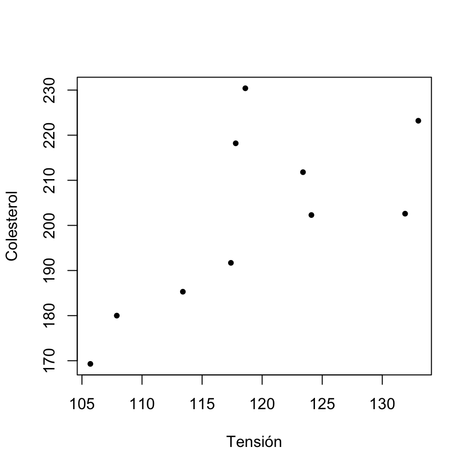


Una **serie temporal** es un caso particular de tabla de datos cuantitativos bivariante en la que la primera variable representa el paso del tiempo. En este caso, es conveniente unir con segmentos los puntos consecutivos en el tiempo para ayudar en la visualización de la evolución de los datos.

\BeginKnitrBlock{example}<div class="example"><span class="example" id="exm:unnamed-chunk-272"><strong>(\#exm:unnamed-chunk-272) </strong></span>Consideremos la siguiente tabla de los números diarios de defunciones por COVID-19 en la Baleares entre día 16 y día 31 de marzo de 2019:

   </div>\EndKnitrBlock{example}

<table class="table" style="width: auto !important; margin-left: auto; margin-right: auto;">
 <thead>
  <tr>
   <th style="text-align:right;"> Día </th>
   <th style="text-align:right;"> Defunciones </th>
  </tr>
 </thead>
<tbody>
  <tr>
   <td style="text-align:right;"> 16 </td>
   <td style="text-align:right;"> 0 </td>
  </tr>
  <tr>
   <td style="text-align:right;"> 17 </td>
   <td style="text-align:right;"> 0 </td>
  </tr>
  <tr>
   <td style="text-align:right;"> 18 </td>
   <td style="text-align:right;"> 1 </td>
  </tr>
  <tr>
   <td style="text-align:right;"> 19 </td>
   <td style="text-align:right;"> 0 </td>
  </tr>
  <tr>
   <td style="text-align:right;"> 20 </td>
   <td style="text-align:right;"> 2 </td>
  </tr>
  <tr>
   <td style="text-align:right;"> 21 </td>
   <td style="text-align:right;"> 0 </td>
  </tr>
  <tr>
   <td style="text-align:right;"> 22 </td>
   <td style="text-align:right;"> 6 </td>
  </tr>
  <tr>
   <td style="text-align:right;"> 23 </td>
   <td style="text-align:right;"> 0 </td>
  </tr>
  <tr>
   <td style="text-align:right;"> 24 </td>
   <td style="text-align:right;"> 3 </td>
  </tr>
  <tr>
   <td style="text-align:right;"> 25 </td>
   <td style="text-align:right;"> 4 </td>
  </tr>
  <tr>
   <td style="text-align:right;"> 26 </td>
   <td style="text-align:right;"> 5 </td>
  </tr>
  <tr>
   <td style="text-align:right;"> 27 </td>
   <td style="text-align:right;"> 4 </td>
  </tr>
  <tr>
   <td style="text-align:right;"> 28 </td>
   <td style="text-align:right;"> 3 </td>
  </tr>
  <tr>
   <td style="text-align:right;"> 29 </td>
   <td style="text-align:right;"> 8 </td>
  </tr>
  <tr>
   <td style="text-align:right;"> 30 </td>
   <td style="text-align:right;"> 5 </td>
  </tr>
  <tr>
   <td style="text-align:right;"> 31 </td>
   <td style="text-align:right;"> 4 </td>
  </tr>
</tbody>
</table>
  
Se trata de una serie temporal. Su gráfico de dispersión es

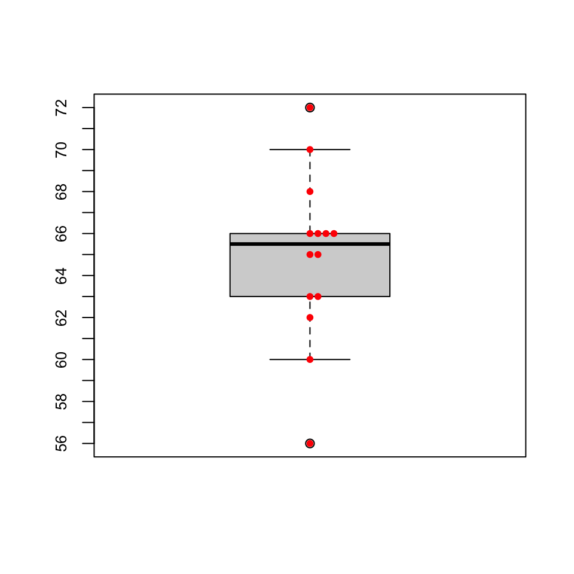

A menudo nos interesará describir por medio de un valor la **asociación**  (propensión a variar conjuntamente) de dos variables cuantitativas medidas sobre una misma muestra de individuos: por ejemplo, valorar la tendencia del nivel de colesterol a crecer con la tensión arterial media en la tabla del Ejemplo \@ref(exm:tensionscatter). 

Uno de los estadísticos  más usados con este fin es la **covarianza**. Su definición, para los vectores $x=(x_1,\ldots,x_n)$ e $y=(y_1,\ldots,y_n)$, de medias $\overline{x}$ y $\overline{y}$, respectivamente, es
$$
s_{x,y}=\frac{\sum_{i=1}^n (x_i-\overline{x})(y_i-\overline{y})}{n}
$$


\BeginKnitrBlock{rmdcaution}<div class="rmdcaution">También hay una versión **muestral**, dividiendo por $n-1$ en lugar de $n$, que es la que calculan la mayoría de los paquetes estadísticos. El motivo es el mismo que ya explicamos con ocasión de la varianza: la covarianza muestral estima mejor la covarianza de las variables poblacionales que la versión "a secas".</div>\EndKnitrBlock{rmdcaution}

\BeginKnitrBlock{rmdimportant}<div class="rmdimportant">Observad que la covarianza de un vector consigo mismo es su varianza: $s_{x,x}=s_x^2$.</div>\EndKnitrBlock{rmdimportant}

El signo de la covarianza mide el signo de la  asociación  entre los dos vectores:

* La covarianza es **positiva** cuando $x$ e $y$ satisfacen la condición siguiente: si una de las dos variables crece, la otra también tiende a crecer; es decir, si $x_i<x_j$, $y_j$ tiende a ser  mayor que $y_i$.

<div class="figure" style="text-align: center">
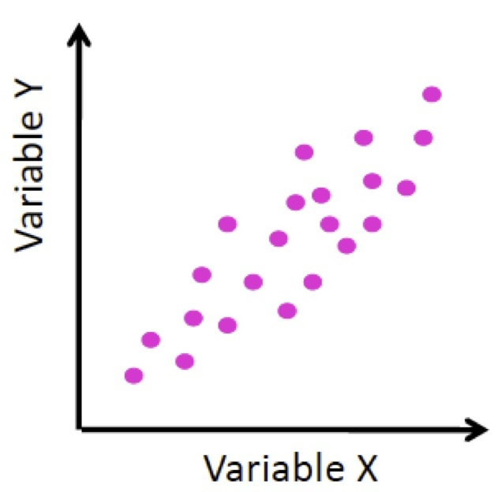
<p class="caption">(\#fig:unnamed-chunk-277)Covarianza positiva</p>
</div>

* La covarianza es **negativa** cuando $x$ e $y$ satisfacen la condición siguiente: si una de las dos variables crece, la otra  tiende a decrecer; es decir, si $x_i<x_j$, $y_j$ tiende a ser  menor que $y_i$.

<div class="figure" style="text-align: center">
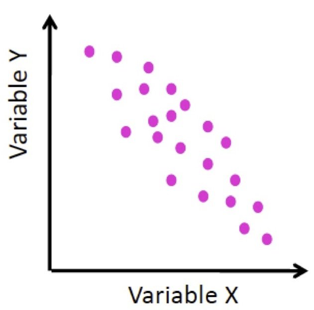
<p class="caption">(\#fig:unnamed-chunk-278)Covarianza negativa</p>
</div>

* Si la covarianza es muy cercana a 0, es porque no hay una tendencia clara al crecimiento o decrecimiento de $y_i$ en función del de  $x_i$.

<div class="figure" style="text-align: center">
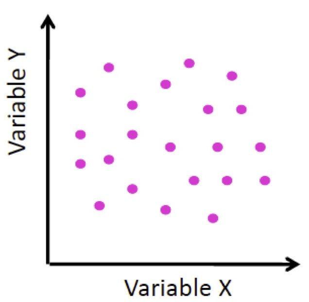
<p class="caption">(\#fig:unnamed-chunk-279)Covarianza 0</p>
</div>

\BeginKnitrBlock{rmdimportant}<div class="rmdimportant">En particular, si las variables $x$ e $y$ son **independientes**, en el sentido  de que el valor de $x$ no influye para nada en el valor de $y$, la covarianza de $x$ e $y$ es 0.</div>\EndKnitrBlock{rmdimportant}


\BeginKnitrBlock{example}<div class="example"><span class="example" id="exm:unnamed-chunk-281"><strong>(\#exm:unnamed-chunk-281) </strong></span>Volvamos a la tabla de tensiones arteriales medias y niveles de colesterol del Ejemplo \@ref(exm:tensionscatter). Las medias de las variables son

</div>\EndKnitrBlock{example}

$$
\begin{array}{l}
\overline{\text{Tensión}}=\dfrac{105.7+117.4+131.9+\cdots+113.4}{10}=119.32\\
\overline{\text{Colesterol}}=\dfrac{169.3+191.7+202.6+\cdots+185.3}{10}=201.48
\end{array}
$$
y su covarianza es
$$
s_{\text{Tensión},\text{Colesterol}}=\frac{(105.7-119.32)(169.3-201.48)+(117.4-119.32)(191.7-201.48)+\cdots+(113.4-119.32)(185.3-201.48)}{10}=110.9164
$$
Del hecho que esta covarianza sea positiva deducimos que, en esta muestra, la tensión media y el nivel de colesterol tienden a crecer juntos, como ya observamos en el diagrama de dispersión del Ejemplo \@ref(exm:tensionscatter).


Ahora bien, el valor de la covarianza es difícil de interpretar más allá de su signo. Por ejemplo, si la covarianza de las variables Tensión y Colesterol en otra muestra de individuos fuera mayor que la que hemos obtenido en la muestra anterior, eso no tendría por qué significar que la tendencia al crecimiento conjunto de estas dos variables en la nueva muestra fuera más acentuada que en la nuestra. Por ello, a menudo se usa una versión normalizada de la covarianza, la correlación de Pearson, cuyo valor tiene una interpretación sencilla.

La **correlación de Pearson** de dos vectores de datos $x$ e $y$ de la misma longitud se define como su covarianza dividida por el producto de sus desviaciones típicas:
$$
r_{x,y}=\frac{s_{x,y}}{s_xs_y}
$$

Como el signo de $r_{x,y}$ es el mismo que el de $s_{x,y}$, el signo de la 
correlación de Pearson tiene el mismo significado que el de la covarianza:

*  $r_{x,y}>0$ cuando $y$ tiende a crecer si $x$ crece y a decrecer si $x$ decrece
* $r_{x,y}<0$ cuando $y$ tiende a decrecer si $x$ crece y a crecer si $x$ decrece
* $r_{x,y}\approx 0$ cuando no hay ninguna tendencia  en este sentido; decimos entonces que $x$ e $y$ están *incorreladas*. 

Pero la correlación de Pearson lleva más información que la covarianza, porque 
**mide la relación lineal entre los dos vectores**, en el sentido de las propiedades siguientes:

* Se tiene que $-1\leqslant r_{x,y}\leqslant 1$.

* Cuanto más cerca está $r_{x,y}$ de -1 o 1, más se aproximan los puntos $(x_i,y_i)$ a estar sobre una recta, que será creciente si $r_{x,y}>0$ y decreciente si $r_{x,y}<0$.

* Y en concreto, 
    * Los puntos $(x_i,y_i)$ están sobre una recta creciente exactamente si, y solo si, $r_{x,y}=1$. 
    * Los puntos $(x_i,y_i)$ están sobre una recta decreciente si, y solo si,  $r_{x,y}=-1$.

\BeginKnitrBlock{example}<div class="example"><span class="example" id="exm:unnamed-chunk-282"><strong>(\#exm:unnamed-chunk-282) </strong></span>Seguimos con la tabla de tensiones arteriales medias y niveles de colesterol del Ejemplo \@ref(exm:tensionscatter). Ya hemos obtenido su covarianza, $s_{\text{Tensión},\text{Colesterol}}=110.9164$. Sus desviaciones típicas son
$$
\begin{array}{l}
s_{\text{Tensión}}=\sqrt{\dfrac{(105.7-119.32)^2+(117.4-119.32)^2+\cdots+(113.4-119.32)^2}{10}}=8.616\\
s_{\text{Colesterol}}=\sqrt{\dfrac{(169.3-201.48)^2+(191.7-201.48)^2+\cdots+(185.3-201.48)^2}{10}}=18.84
\end{array}
$$
por lo que su correlación de Pearson es
$$
r_{\text{Tensión},\text{Colesterol}}=\frac{110.9164}{8.616\cdot 18.84}=0.683
$$
Los pares de valores de tensión arterial media y el nivel de colesterol de los individuos de la muestra presentan una tendencia acusada a estar sobre una recta.
</div>\EndKnitrBlock{example}


Gráficamente podemos visualizar la tendencia de los puntos de una tabla bivariante a estar sobre una recta añadiendo a su gráfico de dispersión su **recta de regresión** (para ser precisos, **lineal por mínimos cuadrados**, pero por ahora omitiremos esta apostilla, hasta el tema de Regresión Lineal hacia el final de curso). Se trata de la recta que más se aproxima a los puntos $(x_i,y_i)$ en el sentido siguiente. 

Dada una recta $y=ax+b$, el **error** que se comete al estimar con esta recta el valor $y_i$ sobre el sujeto correspondiente al par $(x_i,y_i)$ es $y_i-(ax_i+b)$.
La **recta de regresión** es la que tiene coeficientes $a,b$ que hacen mínima la suma de los cuadrados de estos errores,
$$
\sum_{i=1}^n (y_i-(ax_i+b))^2
$$

Resulta que los coeficientes de esta recta de regresión son 
$$
a=\frac{s_{x,y}}{s_x^2},\quad b = \overline{y}-a\cdot \overline{x}.
$$

\BeginKnitrBlock{example}<div class="example"><span class="example" id="exm:unnamed-chunk-283"><strong>(\#exm:unnamed-chunk-283) </strong></span>Siguiendo con nuestro ejemplo de tensiones y niveles de colesterol, la recta de regresión del nivel de colesterol en función de la tensión media tiene pendiente
$$
  a=\frac{s_{\text{Tensión},\text{Colesterol}}}{s_{\text{Colesterol}}^2}=\frac{110.9164}{8.616^2}=1.494
$$
  y término independiente
$$
b=  \overline{\text{Colesterol}}-a\cdot \overline{\text{Tensión}}=201.48-1.494\times 119.32=23.216
$$

El gráfico de dispersión de los puntos junto a esta recta de regresión es el siguiente:
</div>\EndKnitrBlock{example}

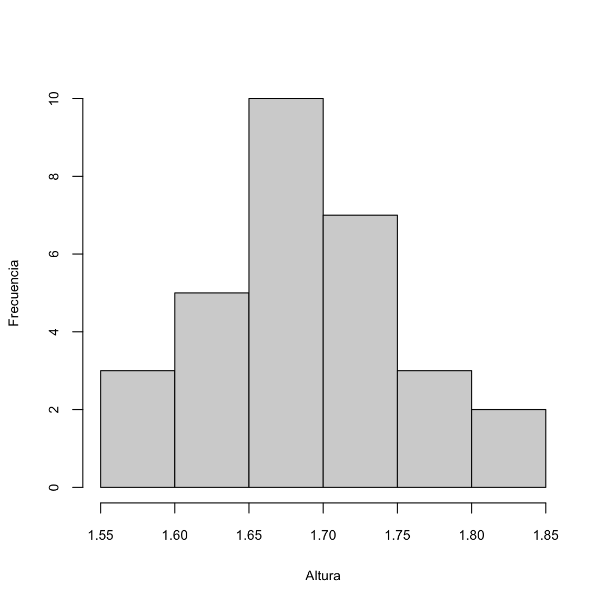

\BeginKnitrBlock{rmdimportant}<div class="rmdimportant">El valor de la correlación de Pearson no siempre es suficiente para valorar el ajuste de los puntos a una recta. Es siempre conveniente dibujar los puntos y la recta de regresión lineal y darles un vistazo.</div>\EndKnitrBlock{rmdimportant}


Por ejemplo, F. Anscombe produjo los cuatro conjuntos de puntos descritos en la Figura \@ref(fig:anscombe). Como podéis, ver, tienen ajustes muy diferentes a una recta, y en cambio resulta que tienen el mismo valor de $r$: 0.816. Para más detalles, consultad la [correspondiente entrada de la Wikipedia](https://es.wikipedia.org/wiki/Cuarteto_de_Anscombe)

<div class="figure" style="text-align: center">
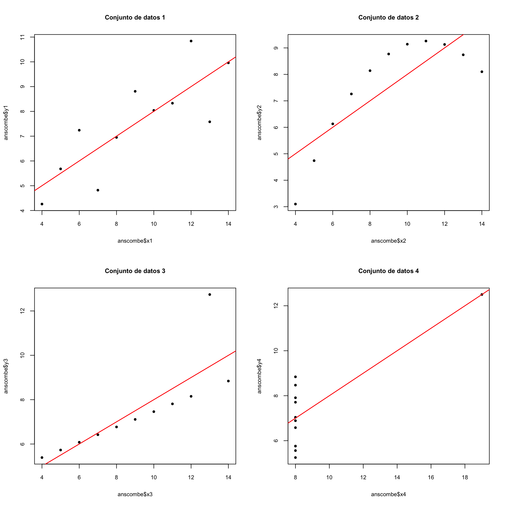
<p class="caption">(\#fig:anscombe)El cuarteto de Anscombe</p>
</div>


\BeginKnitrBlock{rmdnote}<div class="rmdnote">Ser incorrelados no es sinónimo de que no haya ninguna dependencia entre las dos variables. Por ejemplo, los conjuntos de puntos de la Figura \@ref(fig:datasaurus) tienen correlación casi 0 (en concreto 0.004), y es claro que en cada caso hay una fuerte dependencia entre los valores de $x$ y de $y$.</div>\EndKnitrBlock{rmdnote}


<div class="figure" style="text-align: center">
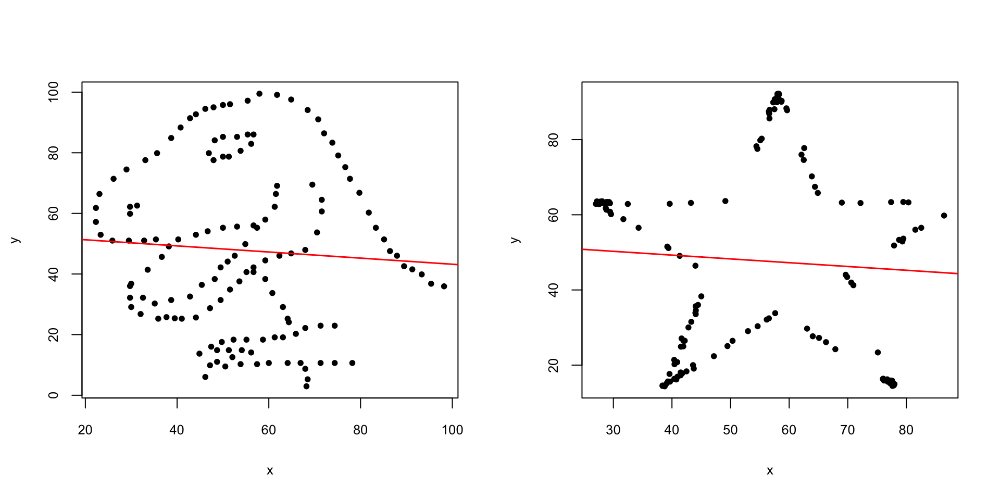
<p class="caption">(\#fig:datasaurus)Dos conjuntos de datos incorrelados</p>
</div>


Como hemos visto, la correlación de Pearson mide la dependencia lineal entre dos variables cuantitativas. Otras medidas de correlación miden otros tipos de dependencia. La alternativa más popular a la correlación de Pearson es la **correlación de Spearman**, $r_S$, que mide la concordancia en el orden de los individuos según sus valores en las dos variables medidas. Se calcula, *grosso modo*, de la manera siguiente:

* A cada individuo de la muestra le asignamos su posición (su **rango**) según el orden creciente de los valores $x_i$.

* A cada individuo de la muestra le asignamos su rango según el orden creciente de los valores $y_i$.

* Calculamos la correlación de Pearson de los vectores de rangos.


\BeginKnitrBlock{rmdimportant}<div class="rmdimportant">La correlación de Spearman también se puede usar para variables ordinales. **¡La de Pearson no!**</div>\EndKnitrBlock{rmdimportant}

\BeginKnitrBlock{example}<div class="example"><span class="example" id="exm:unnamed-chunk-288"><strong>(\#exm:unnamed-chunk-288) </strong></span>Volvemos a nuestro ejemplo de tensiones y niveles de colesterol. Ampliamos la tabla de datos con los rangos de los individuos recogidos en la misma para cada variable:
  </div>\EndKnitrBlock{example}
 
<table class="table" style="width: auto !important; margin-left: auto; margin-right: auto;">
 <thead>
  <tr>
   <th style="text-align:left;">   </th>
   <th style="text-align:right;"> Tensión </th>
   <th style="text-align:right;"> Rango </th>
   <th style="text-align:right;"> Colesterol </th>
   <th style="text-align:right;"> Rango </th>
  </tr>
 </thead>
<tbody>
  <tr>
   <td style="text-align:left;"> 1 </td>
   <td style="text-align:right;"> 105.7 </td>
   <td style="text-align:right;"> 1 </td>
   <td style="text-align:right;"> 169.3 </td>
   <td style="text-align:right;"> 1 </td>
  </tr>
  <tr>
   <td style="text-align:left;"> 2 </td>
   <td style="text-align:right;"> 117.4 </td>
   <td style="text-align:right;"> 4 </td>
   <td style="text-align:right;"> 191.7 </td>
   <td style="text-align:right;"> 4 </td>
  </tr>
  <tr>
   <td style="text-align:left;"> 3 </td>
   <td style="text-align:right;"> 131.9 </td>
   <td style="text-align:right;"> 9 </td>
   <td style="text-align:right;"> 202.6 </td>
   <td style="text-align:right;"> 6 </td>
  </tr>
  <tr>
   <td style="text-align:left;"> 4 </td>
   <td style="text-align:right;"> 117.8 </td>
   <td style="text-align:right;"> 5 </td>
   <td style="text-align:right;"> 218.2 </td>
   <td style="text-align:right;"> 8 </td>
  </tr>
  <tr>
   <td style="text-align:left;"> 5 </td>
   <td style="text-align:right;"> 133.0 </td>
   <td style="text-align:right;"> 10 </td>
   <td style="text-align:right;"> 223.2 </td>
   <td style="text-align:right;"> 9 </td>
  </tr>
  <tr>
   <td style="text-align:left;"> 6 </td>
   <td style="text-align:right;"> 107.9 </td>
   <td style="text-align:right;"> 2 </td>
   <td style="text-align:right;"> 180.0 </td>
   <td style="text-align:right;"> 2 </td>
  </tr>
  <tr>
   <td style="text-align:left;"> 7 </td>
   <td style="text-align:right;"> 118.6 </td>
   <td style="text-align:right;"> 6 </td>
   <td style="text-align:right;"> 230.4 </td>
   <td style="text-align:right;"> 10 </td>
  </tr>
  <tr>
   <td style="text-align:left;"> 8 </td>
   <td style="text-align:right;"> 123.4 </td>
   <td style="text-align:right;"> 7 </td>
   <td style="text-align:right;"> 211.8 </td>
   <td style="text-align:right;"> 7 </td>
  </tr>
  <tr>
   <td style="text-align:left;"> 9 </td>
   <td style="text-align:right;"> 124.1 </td>
   <td style="text-align:right;"> 8 </td>
   <td style="text-align:right;"> 202.3 </td>
   <td style="text-align:right;"> 5 </td>
  </tr>
  <tr>
   <td style="text-align:left;"> 10 </td>
   <td style="text-align:right;"> 113.4 </td>
   <td style="text-align:right;"> 3 </td>
   <td style="text-align:right;"> 185.3 </td>
   <td style="text-align:right;"> 3 </td>
  </tr>
</tbody>
</table>
 
La correlación de Spearman de las dos variables será la correlación de Pearson de sus vectores de rangos. Si la calculáis, da ${r_S}=0.73333$.

\BeginKnitrBlock{rmdnote}<div class="rmdnote">Una nota técnica, para los completistas. ¿Qué pasa, al calcular los rangos, si hay valores repetidos?  Pues que se les asigna el mismo rango calculado de la manera siguiente: 

1. En primer lugar, a cada individuo de la muestra le asignamos un "rango provisional": su posición según el orden creciente de los valores $x_i$ y, en caso de igualdad de estos valores,  según su orden de aparición en la tabla de datos.
1. Entonces, para cada valor del vector, se asigna como rango "definitivo" a todos los individuos cuyo valor $x$ es ese valor la media de sus posiciones.
</div>\EndKnitrBlock{rmdnote}

Veamos un ejemplo.

\BeginKnitrBlock{example}<div class="example"><span class="example" id="exm:unnamed-chunk-291"><strong>(\#exm:unnamed-chunk-291) </strong></span>Vamos a calcular los rangos de los individuos de la tabla de datos siguiente según su valor de la variable $x$. 
</div>\EndKnitrBlock{example}

<table class="table" style="width: auto !important; margin-left: auto; margin-right: auto;">
 <thead>
  <tr>
   <th style="text-align:right;"> Individuo </th>
   <th style="text-align:right;"> x </th>
  </tr>
 </thead>
<tbody>
  <tr>
   <td style="text-align:right;"> 1 </td>
   <td style="text-align:right;"> 1 </td>
  </tr>
  <tr>
   <td style="text-align:right;"> 2 </td>
   <td style="text-align:right;"> 2 </td>
  </tr>
  <tr>
   <td style="text-align:right;"> 3 </td>
   <td style="text-align:right;"> 1 </td>
  </tr>
  <tr>
   <td style="text-align:right;"> 4 </td>
   <td style="text-align:right;"> 1 </td>
  </tr>
  <tr>
   <td style="text-align:right;"> 5 </td>
   <td style="text-align:right;"> 2 </td>
  </tr>
  <tr>
   <td style="text-align:right;"> 6 </td>
   <td style="text-align:right;"> 4 </td>
  </tr>
  <tr>
   <td style="text-align:right;"> 7 </td>
   <td style="text-align:right;"> 4 </td>
  </tr>
  <tr>
   <td style="text-align:right;"> 8 </td>
   <td style="text-align:right;"> 3 </td>
  </tr>
</tbody>
</table>

Empezamos asignando rangos provisionales a los individuos, ordenándolos según su valor de $x$ y en caso de empate de arriba abajo:

<table class="table" style="width: auto !important; margin-left: auto; margin-right: auto;">
 <thead>
  <tr>
   <th style="text-align:right;"> Individuo </th>
   <th style="text-align:right;"> x </th>
   <th style="text-align:right;"> Posición </th>
  </tr>
 </thead>
<tbody>
  <tr>
   <td style="text-align:right;"> 1 </td>
   <td style="text-align:right;"> 1 </td>
   <td style="text-align:right;"> 1 </td>
  </tr>
  <tr>
   <td style="text-align:right;"> 2 </td>
   <td style="text-align:right;"> 2 </td>
   <td style="text-align:right;"> 4 </td>
  </tr>
  <tr>
   <td style="text-align:right;"> 3 </td>
   <td style="text-align:right;"> 1 </td>
   <td style="text-align:right;"> 2 </td>
  </tr>
  <tr>
   <td style="text-align:right;"> 4 </td>
   <td style="text-align:right;"> 1 </td>
   <td style="text-align:right;"> 3 </td>
  </tr>
  <tr>
   <td style="text-align:right;"> 5 </td>
   <td style="text-align:right;"> 2 </td>
   <td style="text-align:right;"> 5 </td>
  </tr>
  <tr>
   <td style="text-align:right;"> 6 </td>
   <td style="text-align:right;"> 4 </td>
   <td style="text-align:right;"> 7 </td>
  </tr>
  <tr>
   <td style="text-align:right;"> 7 </td>
   <td style="text-align:right;"> 4 </td>
   <td style="text-align:right;"> 8 </td>
  </tr>
  <tr>
   <td style="text-align:right;"> 8 </td>
   <td style="text-align:right;"> 3 </td>
   <td style="text-align:right;"> 6 </td>
  </tr>
</tbody>
</table>

Pasamos a asignar los rangos definitivos:

* A los tres individuos cuya $x$ es 1 les asignamos como rango (1+2+3)/3=2.
* A los dos individuos cuya $x$ es 2 les asignamos como rango (4+5)/2=4.5.
* Al único individuo cuya $x$ es 3 le asignamos como rango definitivo su rango provisional: 6.
* A los dos individuos cuya $x$ es 4 les asignamos como rango (7+8)/2=7.5.

<table class="table" style="width: auto !important; margin-left: auto; margin-right: auto;">
 <thead>
  <tr>
   <th style="text-align:right;"> Individuo </th>
   <th style="text-align:right;"> x </th>
   <th style="text-align:right;"> Posición </th>
   <th style="text-align:right;"> Rango </th>
  </tr>
 </thead>
<tbody>
  <tr>
   <td style="text-align:right;"> 1 </td>
   <td style="text-align:right;"> 1 </td>
   <td style="text-align:right;"> 1 </td>
   <td style="text-align:right;"> 2.0 </td>
  </tr>
  <tr>
   <td style="text-align:right;"> 2 </td>
   <td style="text-align:right;"> 2 </td>
   <td style="text-align:right;"> 4 </td>
   <td style="text-align:right;"> 4.5 </td>
  </tr>
  <tr>
   <td style="text-align:right;"> 3 </td>
   <td style="text-align:right;"> 1 </td>
   <td style="text-align:right;"> 2 </td>
   <td style="text-align:right;"> 2.0 </td>
  </tr>
  <tr>
   <td style="text-align:right;"> 4 </td>
   <td style="text-align:right;"> 1 </td>
   <td style="text-align:right;"> 3 </td>
   <td style="text-align:right;"> 2.0 </td>
  </tr>
  <tr>
   <td style="text-align:right;"> 5 </td>
   <td style="text-align:right;"> 2 </td>
   <td style="text-align:right;"> 5 </td>
   <td style="text-align:right;"> 4.5 </td>
  </tr>
  <tr>
   <td style="text-align:right;"> 6 </td>
   <td style="text-align:right;"> 4 </td>
   <td style="text-align:right;"> 7 </td>
   <td style="text-align:right;"> 7.5 </td>
  </tr>
  <tr>
   <td style="text-align:right;"> 7 </td>
   <td style="text-align:right;"> 4 </td>
   <td style="text-align:right;"> 8 </td>
   <td style="text-align:right;"> 7.5 </td>
  </tr>
  <tr>
   <td style="text-align:right;"> 8 </td>
   <td style="text-align:right;"> 3 </td>
   <td style="text-align:right;"> 6 </td>
   <td style="text-align:right;"> 6.0 </td>
  </tr>
</tbody>
</table>


## Gráficos en escala logarítmica 

Los ejes de todos los gráficos para variables cuantitativas producidos en las secciones anteriores estaban en **escala lineal**:  pares de marcas a misma distancia tienen diferencias iguales.

A veces es  conveniente dibujar un gráfico con un eje (o ambos) en **escala logarítmica**: donde pares de marcas a misma distancia tengan **cocientes** iguales (es decir, diferencias de sus logaritmos iguales, de ahí el nombre).

Por ejemplo, el gráfico siguiente representa la serie temporal de números acumulados de muertos por COVID-19 en las Balears entre el 16 de marzo y el 25 de abril de 2020. Podéis comprobar que ambos ejes están en escala lineal.

<div class="figure" style="text-align: center">

<p class="caption">(\#fig:unnamed-chunk-295)Gráfico en escala lineal</p>
</div>
  
Vamos ahora a dibujar este gráfico con el eje de las ordenadas en escala logarítmica (lo llamaremos un gráfico en *escala semilogarítmica*):

<div class="figure" style="text-align: center">
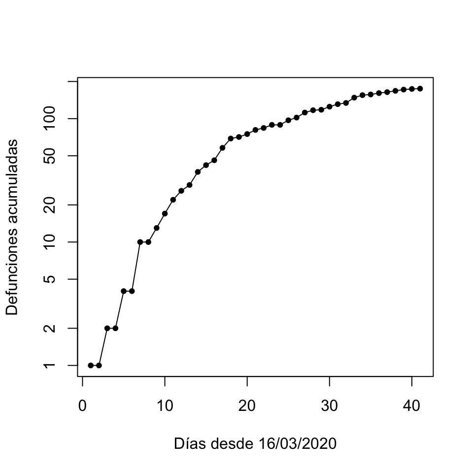
<p class="caption">(\#fig:unnamed-chunk-296)Gráfico en escala semilogarítmica</p>
</div>
  
Observad las marcas en el eje de las ordenadas: por ejemplo, la distancia entre 1 y 2 es la misma que entre 10 y 20, y la distancia entre 1 y 5 es la misma que entre 10 y 50.

Y ahora vamos a dibujarlo con ambos ejes en escala logarítmica (lo llamaremos un gráfico en *escala doble logarítmica*):


<div class="figure" style="text-align: center">
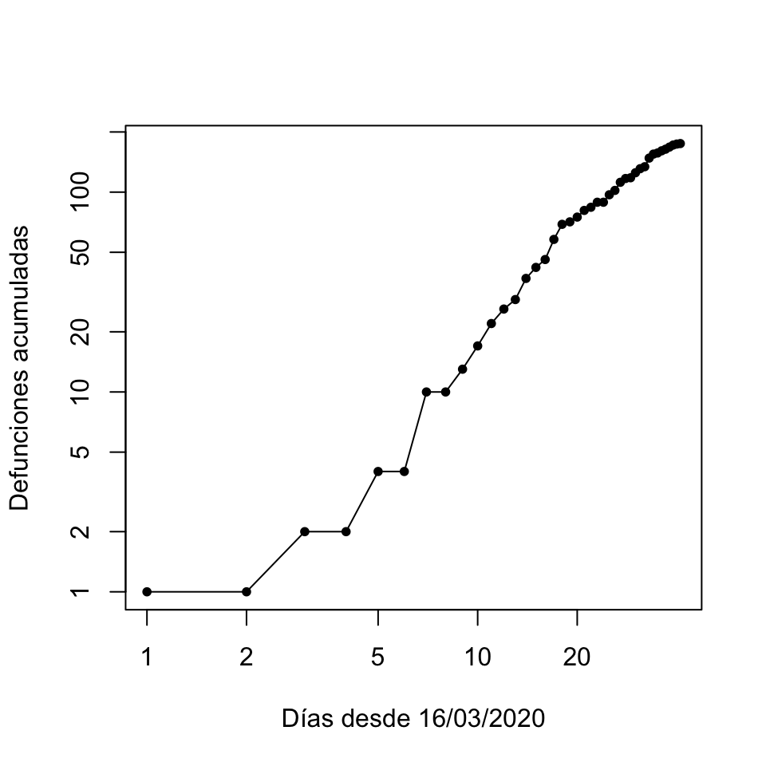
<p class="caption">(\#fig:unnamed-chunk-297)Gráfico en escala doble logarítmica</p>
</div>

Un buen motivo para dibujar un gráfico en escala semilogarítmica o doble logarítmica puede ser la necesidad de representar simultáneamente varias variables de rangos muy diferentes. Por ejemplo, considerad la figura siguiente:

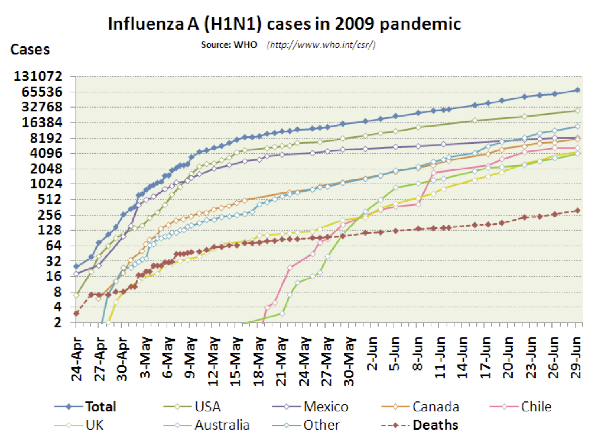
 
Dibujada en escala lineal, se perdería mucho detalle: la línea inferior casi se identificaría con el eje de abscisas, y las líneas centrales parecerían iguales.

Otro motivo puede ser simplemente el hacer aparecer detalles que nos ayuden a entender mejor los datos. Por ejemplo, los dos gráficos siguientes muestran la mortalidad anual específica por tuberculosis en Inglaterra y Gales entre 1871 y 1971, a la izquierda en escala lineal y a la derecha en escala semilogarítmica:

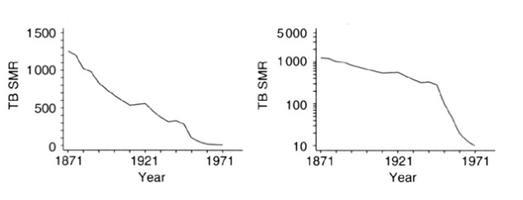

El gráfico semilogarítmico permite apreciar mejor el descenso en la mortalidad a partir de mediados de los años cuarenta, con la introducción de la penicilina.

 

## Ejercicios

### Problemas {-}

**1.** Considerad el diagrama siguiente, que muestra los perímetros braquiales derechos de 120 mujeres.

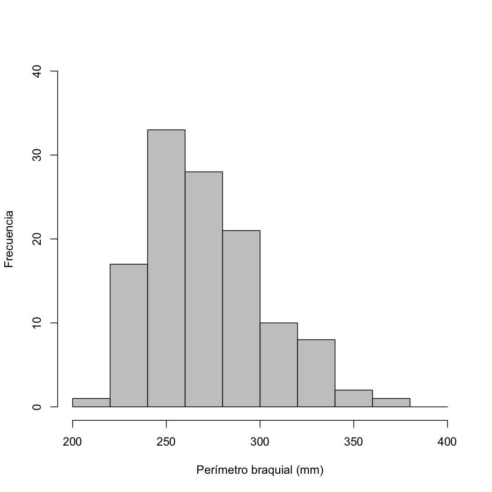

a. ¿Qué tipo de gráfico es?

b. ¿Qué tipo de datos es el perímetro braquial?

c. ¿Cuál es la clase modal?

d. ¿Cómo describirías la asimetría de la muestra?

e. ¿En qué clase cae la mediana de la muestra?

f. ¿Qué estimas que vale la mediana?

g. ¿En qué clase cae el primer cuartil de la muestra?

h. ¿Qué estimas que vale el primer cuartil?

i. ¿Qué estimas que vale la media?


### Test {-}


*(1)*  En una asignatura de la UIB  hay un 40% de matriculados de Palma, un 35% de matriculados del resto de Mallorca y un 25% de matriculados de fuera de Mallorca.  En la encuesta donde los estudiantes anotaron su procedencia, "Palma" estaba identificado con un 1, "el resto de Mallorca" con un 2 y "fuera de Mallorca" con un 3 ¿Cuáles de las afirmaciones siguientes son correctas? Marca todas las correctas. 


1. El origen medio de estos estudiantes es "Mallorca."
1. El origen medio de estos estudiantes es "el resto de Mallorca."
1. El origen medio de estos estudiantes es 1.85.
1. La mediana de los orígenes de estos estudiantes es "el resto de Mallorca."
1. El resto de afirmaciones son falsas.


*(2)* Un estudio describe los diagnósticos de ingresados en un servicio de urgencias durante una semana que requirieron hospitalización. Estos valores fueron:

1. 6 admisiones por apendicitis aguda 
1. 7 admisiones por colecistitis aguda (infección de la vesícula biliar)
1. 12 admisiones por enfermedad de úlcera péptica  (úlceras de estómago)
1. 4 admisiones por gastritis  (inflamación del revestimiento del estómago)

¿Cuál de los siguientes estadísticos es el más apropiado para resumir la tendencia central de estos diagnósticos?


1. La moda 
1. La media
1. La mediana
1. La varianza


*(3)* Si en un conjunto de datos cuantitativos la media aritmética es estrictamente menor que la mediana (marca todas las respuestas correctas):

1.  La muestra seguramente sea asimétrica con cola a la izquierda. 
1.  La muestra seguramente sea asimétrica con cola a la derecha.
1.  No tenemos ninguna indicación sobre el tipo de simetría o asimetría de la muestra
1.  Más del 50% de los valores son menores que la media.
1. Más del 50% de los valores son mayores que la media. 
1. Ninguna de las respuestas anteriores es correcta.


*(4)* Un profesor calculó algunas medidas de tendencia central de los resultados de un examen.  ¿Cuál de las afirmaciones siguientes no aporta ninguna información nueva sobre los resultados del examen?


1. Aproximadamente la mitad de los estudiantes tuvieron una nota por encima de la moda.
1. Aproximadamente la mitad de los estudiantes tuvieron una nota por encima de la mediana. 
1. Aproximadamente la mitad de los estudiantes tuvieron una nota por encima de la media.
1. Aproximadamente  la mitad de los estudiantes suspendieron el examen.
1. En realidad, todas las respuestas anteriores aportan información nueva sobre los resultados del examen.


*(5)* La desviación típica de un conjunto de datos, ¿puede ser <0?

1. Sí
1. No

*(6)* ¿Qué es el recorrido de un conjunto de datos?


1. La diferencia entre la mediana y la media.
1. El número de datos.
1. La diferencia entre el mayor dato y el menor 
1. La diferencia entre el último dato recogido y el primero.
1. La distancia entre el tercer cuartil  y el  primero.


*(7)* ¿Cuáles de los siguientes estadísticos cambian siempre que se cambia un solo valor en el conjunto de datos? Marca todas las respuestas correctas.


1. La moda
1. La mediana
1.  La media 
1.  La desviación típica
1.  El tercer cuartil
1.  Ninguno de ellos

*(8)* Con la definición que hemos dado de cuantil, ¿cuál es el tercer cuartil del siguiente conjunto de 20 números  (que podían tomar valores entre 1 y 40)? 

<p style="text-align:center">12, 15, 15, 16, 17, 18, 20, 22, 23, 23, 24, 24, 25, 25, 26, 28, 28, 28, 29, 32</p>


1. 22
1. 26 
1. 27
1. 28
1. 30
1. Ninguno de los anteriores

*(9)* Una correlación de Pearson $r=-0.4$ entre dos variables $X$ e $Y$ medidas sobre una misma muestra de individuos indica (marca una sola respuesta):

1. Un aumento de $X$ va acompañado de un aumento de $Y$, y la relación lineal es fuerte
1. Un aumento de $X$ va acompañado de un aumento de $Y$, y la relación lineal es moderada
1. Un aumento de $X$ va acompañado de una disminución de $Y$, y la relación lineal es fuerte
1. Un aumento de $X$ va acompañado de una disminución de $Y$, y la relación lineal es moderada
1.  Las variables $X$ e $Y$ son independientes sobre la muestra

*(10)* Un diagrama de dispersión de  dos variables $X$ e $Y$ medidas sobre una misma muestra de individuos sirve para mostrar (marca una sola respuesta):

1. La relación entre las varianzas de estos dos conjuntos de datos
1. La frecuencia con la que cada dato aparece en ambas variables
1. Las medias de los dos conjuntos de datos
1. Los valores de $Y$ en función de los valores de $X$ 
1. Las frecuencias relativas de los datos que caen dentro de las diferentes clases

*(11)* En los 10 nacimientos que tuvieron lugar en un hospital en un día determinado, se apuntó el peso del recién nacido ($X$) y la edad de la madre ($Y$). Curiosamente, todos los bebés pesaron lo mismo: 2.6 kg. ¿Cuál fue la correlación de Pearson $r$ entre los pesos y las edades?

1. 1
1. 0  
1. 2.6
1. 0.26
1. Imposible saberlo, sin conocer las edades de las madres

*(12)* ¿Qué valores puede tomar la correlación de Pearson de dos vectores?

1. Cualquier valor real
1. Cualquier valor real mayor o igual que 0
1. Cualquier valor real entre -1 i 1 
1. Cualquier valor real entre 0 i 1
1. Solamente los valores 0, -1 i 1
1. Ninguna de las respuestas anteriores es correcta.


<!--chapter:end:23-EDCuant.Rmd-->

#  Variables aleatorias discretas

## Generalidades sobre variables aleatorias

Una **variable aleatoria** sobre una población $\Omega$ es una aplicación
$$
X: \Omega\to  \mathbb{R}
$$
que asigna a cada sujeto de $\Omega$ un número real. La idea intuitiva tras esta definición es que una variable aleatoria **mide** una característica  de los sujetos de $\Omega$ que varía al azar de un sujeto a otro. Por ejemplo:

* Tomamos una persona de una población y  medimos su nivel de colesterol, o su altura, o su número de hijos... En este caso, $\Omega$ es la población bajo estudio, de la que tomamos la persona que medimos.

* Lanzamos una moneda equilibrada 3 veces y contamos las caras que obtenemos. En este caso, $\Omega$ es la población virtual de las secuencias de 3 lanzamientos de una moneda equilibrada.

\BeginKnitrBlock{rmdimportant}<div class="rmdimportant">Procurad adquirir la disciplina de describir siempre las variables aleatorias mediante una plantilla del estilo de "Tomamos ... y medimos ...", para que os quede claro cuál es la población y cuál la función. Además, añadid las unidades si es necesario. Por ejemplo:
  
* "Tomamos una persona de Mallorca y medimos su altura (en cm)".

Fijaos en que esta variable aleatoria no es la misma que

* "Tomamos una persona de Mallorca y medimos su altura (en m)"

porque, aunque mide lo mismo sobre los mismos sujetos, les asigna números diferentes. Y también es diferente de

* "Tomamos una persona de Suecia y medimos su altura (en cm)"

porque ha cambiado la población.

En cambio en

* "Lanzamos una moneda 3 veces al aire y contamos las caras"

no hay necesidad de especificar unidades, a no ser que vayáis a usar una unidad inesperada (yo qué sé, que contéis las caras en fracciones de docena).

</div>\EndKnitrBlock{rmdimportant}


Lo que más nos interesará de una variable aleatoria son las probabilidades de los sucesos que define. ¿Y qué tipo de sucesos son los que nos interesan cuando medimos características numéricas? Pues básicamente sucesos definidos mediante igualdades y desigualdades. Por ejemplo, si  $X$ es la variable aleatoria "Tomamos una persona y medimos su nivel de colesterol en plasma (en mg/dl)", nos pueden interesar sucesos del estilo de:

* El conjunto de las personas cuyo nivel de colesterol está entre 200 y 240. Lo denotaremos
$$
200\leq X\leq 240
$$

* El conjunto de las personas cuyo nivel de colesterol es menor o igual que 200:
$$
X\leq 200
$$

* El conjunto de las personas cuyo nivel de colesterol es mayor que 180:
$$
X>180
$$

* El conjunto de las personas cuyo nivel de colesterol es exactamente 180:
$$
X=180
$$

* Etc.

Normalmente, de estos sucesos lo que nos interesará será su probabilidad, y entonces usaremos notaciones del estilo de las siguientes:

* $P(200\leq X\leq 240)$. Esto denota la probabilidad de que una persona tenga el nivel de colesterol entre 200 y 240. Para abreviar, lo leeremos la "probabilidad de que $X$ esté entre 200 y 240". Y recordad que nuestras probabilidades son proporciones. Por lo tanto, esta probabilidad es la **proporción** de personas (de la población $\Omega$ donde hayamos definido la variable $X$) con nivel de colesterol entre 200 y 240.

* $P(X\leq 200)$: La probabilidad de que una persona tenga el nivel de colesterol menor o igual que 200 (o también la probabilidad de que $X$ sea menor o igual que 200), es decir, la proporción de personas con nivel de colesterol menor o igual que 200.

* Etc.

En este contexto, indicaremos normalmente la **unión** con una **o**  y la **intersección** con una **coma**. Por ejemplo, si $X$ es la variable aleatoria "Lanzamos una moneda 6 veces y contamos las caras":

* $P(X\leq 2\text{ o }X\geq 5)$: Probabilidad de sacar como máximo 2 caras o como mínimo 5.

* $P(2\leq X, X< 5)$: Probabilidad de sacar un número de caras que sea mayor o igual que 2 y menor que 5; es decir, $P(2\leq X< 5)$.

Dos variables aleatorias $X,Y$ son **independientes** cuando, para todos los pares de valores $a,b\in \mathbb{R}$, los sucesos
$$
X\leq a, Y\leq b
$$
son independientes, es decir,
$$
P(X\leq a, Y\leq b)=P(X\leq a)\cdot P(Y\leq b)
$$

Por ejemplo, si tomamos una persona y:

* $X$: le pedimos que lance una moneda 3 veces y contamos las caras

* $Y$: medimos su nivel de colesterol en plasma (en mg/dl)

(seguramente) $X$ e $Y$ son independientes.

Más en general, unas variables aleatorias $X_1,X_2,\ldots,X_n$ son **independientes** cuando, para todos $a_1,a_2,\ldots,a_n\in \mathbb{R}$, los sucesos
$$
X_1\leq a_1, X_2\leq a_2,\ldots, X_n\leq a_n
$$
son independientes.

Si $X_1,X_2,\ldots,X_n$ son variables aleatorias independientes,  se tiene que, para cualquier familia de intervalos $A_1,\ldots, A_n\subseteq \mathbb{R}$, los sucesos 
$$
X_1\in A_1, X_2\in A_2,\ldots, X_n\in A_n
$$ 
son también independientes, y por lo tanto en particular que
$$
P(X_1\in A_1,\ldots,X_n\in A_n)=P(X_1\in A_1)\cdots P(X_n\in A_n)
$$
-->

Vamos a distinguir dos tipos de variables aleatorias:

* **Discretas**: Sus posibles valores son datos cuantitativos discretos:

    * Número de caras en 3 lanzamientos de una moneda
    * Número de hijos
    * Número de casos nuevos de COVID-19 en un día en Mallorca

* **Continuas**: Sus posibles valores son datos cuantitativos continuos:

    * Peso 
    * Nivel de colesterol en sangre 
    * Diámetro de un tumor 

En lo que queda de esta lección trataremos las **variables aleatorias discretas**. Dejamos las continuas para la próxima lección.

## Densidad y distribución

Sea $X: \Omega\to \mathbb{R}$ una **variable aleatoria discreta**.

* Su **dominio** **$D_X$** es el conjunto de los valores que puede tomar: más concretamente, el conjunto de los $x\in \mathbb{R}$ tales que $P(X=x)>0$. 

* Su **función de densidad**  es la función $f_X:\mathbb{R}\to [0,1]$ definida por 
$$
f_X(x)=P(X=x)
$$
Es decir, la función que asigna a cada $x\in \mathbb{R}$ la probabilidad de que $X$ valga $x$ (la proporción de sujetos de la población en los que $X$ vale $x$).

* Su **función de distribución**  es la función  $F_X:\mathbb{R}\to  [0,1]$ definida por
$$
F_X(x)=P(X\leq x)
$$ 
Es decir, la función que asigna a cada $x\in \mathbb{R}$ la probabilidad de que el valor de $X$ sea $\leq x$ (la proporción de sujetos de la población en los que $X$ vale $\leq x$). También se le suele llamar **función de probabilidad acumulada** para poner énfasis en el hecho de que $F_X(x)$ mide la "frecuencia relativa acumulada" de $x$ en el total de la población.

\BeginKnitrBlock{example}<div class="example"><span class="example" id="exm:cares"><strong>(\#exm:cares) </strong></span>Sea $X$ la variable aleatoria "Lanzamos 3 veces una moneda equilibrada y contamos las caras". Entonces

</div>\EndKnitrBlock{example}

* Su **dominio** es el conjunto de sus posibles valores: $D_X=\{0,1,2,3\}$.

* Su **función de densidad** viene definida por $f_X(x)=P(X=x)$:

    * $f_X(0)=P(X=0)=1/8$ (la probabilidad de sacar 0 caras)
    * $f_X(1)=P(X=1)=3/8$ (la probabilidad de sacar 1 cara)
    * $f_X(2)=P(X=2)=3/8$ (la probabilidad de sacar 2 caras)
    * $f_X(3)=P(X=3)=1/8$ (la probabilidad de sacar 3 caras)
    * $f_X(x)=P(X=x)=0$ para cualquier otro valor de $x$ (la probabilidad de sacar $x$ caras si $x\notin\{0,1,2,3\}$ es 0)

    En resumen, la función de densidad de $X$ es
$$
f_X(x) =\left\{
\begin{array}{ll}
1/8 & \text{ si $x=0$}\\ 
3/8 & \text{ si $x=1$}\\ 
3/8 & \text{ si $x=2$}\\ 
1/8 & \text{ si $x=3$}\\
0 & \text{ si $x\neq 0,1,2,3$}
\end{array}\right.
$$

<div class="figure" style="text-align: center">
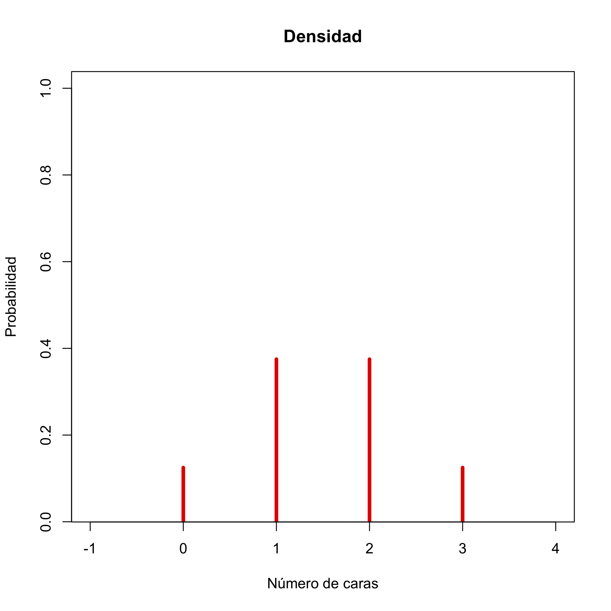
<p class="caption">(\#fig:densicares)Función de densidad de la variable aleatoria que cuenta el número de caras en 3 lanzamientos</p>
</div>

\BeginKnitrBlock{rmdnote}<div class="rmdnote">Si $X$ es una variable aleatoria discreta, $P(X\in A)=0$ para cualquier subconjunto $A$ disjunto de $D_X$, porque $X$ no puede tomar ningún valor de $A$. Por ejemplo, ¿cuál es la probabilidad de sacar entre 2.5 y 2.7 caras al lanzar 3 veces una moneda? 0 ¿Y la de sacar $\pi$ caras? 0 de nuevo.</div>\EndKnitrBlock{rmdnote}


* Veamos su **función de distribución** $F_X$. Recordad que $F_X(x)=P(X\leq x)$ y que nuestra variable solo puede tomar los valores 0, 1, 2 y 3.

    * Si $x<0$, $F_X(x)=P(X\leq x)=0$ porque $X$ no puede tomar ningún valor estrictamente negativo.

    * Si $0\leq x<1$, $F_X(x)=P(X\leq x)=P(X=0)=f_X(0)=1/8$, porque si $0\leq x<1$, el único valor $\leq x$ que puede tomar $X$ es el 0.

    * Si $1\leq x<2$, $F_X(x)=P(X\leq x)=P(X=0\text{ o }X=1)$ $=f_X(0)+f_X(1)=4/8=1/2$, porque si $1\leq x<2$, los únicos valores $\leq x$ que puede tomar $X$ son 0 y 1.

    * Si $2\leq x<3$, $F_X(x)=P(X\leq x)=P(X=0\text{ o }X=1\text{ o }X=2)$ $=f_X(0)+f_X(1)+f_X(2)=7/8$, porque si $2\leq x<3$, los únicos valores $\leq x$ que puede tomar $X$ son 0, 1 y 2.

    * Si $3\leq x$, $F_X(x)=P(X\leq x)=1$, porque si $3\leq x$, seguro que obtenemos un número de caras $\leq x$.

    Por lo tanto, la función $F_X$ es  la función
$$
F_X(x) =\left\{
\begin{array}{ll}
0 & \text{ si $x<0$}\\
1/8 & \text{ si $0\leq x< 1$}\\ 
4/8 & \text{ si $1\leq x< 2$}\\ 
7/8 & \text{ si $2\leq x< 3$}\\ 
1 & \text{ si $3\leq x$}
\end{array}\right.
$$
    Su gráfico es el siguiente:

<div class="figure" style="text-align: center">
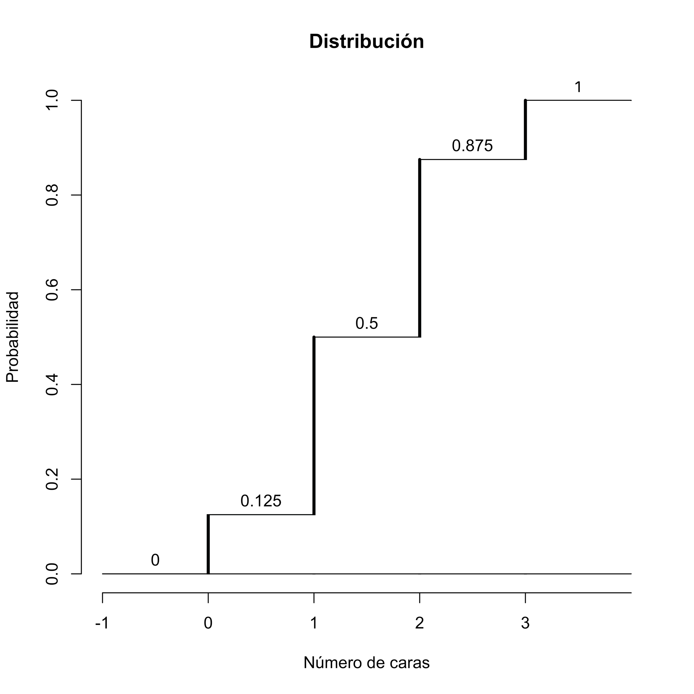
<p class="caption">(\#fig:districares)Función de distribución de la variable aleatoria que cuenta el número de caras en 3 lanzamientos</p>
</div>

Observad en este gráfico que esta función de distribución $F_X$ es creciente y escalonada. Esto es general. Si $X$ es una variable aleatoria discreta:

* $F_X$ es una función **escalonada**, con saltos en los valores de $D_X$, que son los únicos con probabilidad estrictamente mayor que 0 y por lo tanto los únicos que "suman" probabilidad. 

* $F_X$ es **creciente**, porque si $x\leq y$, todos los sujetos de $X\leq x$ también pertenecen a $X\leq y$, y por lo tanto
$$
  P(X\leq x)\leq P(X\leq y).
$$

* Si $x_0,y_0\in D_X$ y $x_0<y_0$, entonces $F_X(x_0)< F_X(y_0)$, porque
$$
\begin{array}{rl}
F_X(x_0)\!\!\!\!\! & =P(X\leq x_0)<P(X\leq x_0)+P(X=y_0)\\
& =P(X\leq x_0\text{ o }X=y_0)\leq P(X\leq y_0)=F_X(y_0)
\end{array}
$$

* Como los valores que toma $F_X$ son probabilidades, no pueden ser ni menores que 0 ni mayores que 1.


El conocimiento de $f_X$, más las reglas del cálculo de probabilidades, permite calcular la probabilidad de cualquier suceso relacionado con $X$:
$$
P(X\in A) =\sum_{x\in A} P(X=x) = \sum_{x\in A} f_X(x)
$$
En particular
$$
F_X(x_0)=P(X\leq x_0)=\sum_{x\leq x_0} f_X(x)
$$

La **moda** de una variable aleatoria discreta $X$ es el valor (o los valores) $x_0$ tal que $f_X(x_0)=P(X=x_0)$ es máximo. Se trata por lo tanto del "valor más frecuente de $X$" en la población. Por ejemplo, para nuestra variable aleatoria que cuenta el número de caras en 3 lanzamientos de una moneda equilibrada, la moda son los valores 1 y 2.

Hay un aspecto de las variables aleatorias discretas sobre el que queremos llamar la atención, sobre todo para compararlo luego con las variables continuas:
  
\BeginKnitrBlock{rmdcaution}<div class="rmdcaution">Los valores de $P(X\leq x)$ y $P(X<x)$ pueden ser diferentes.</div>\EndKnitrBlock{rmdcaution}

Por ejemplo, con la variable $X$ "Lanzamos una moneda equilibrada 3 veces y contamos las caras":

* La probabilidad de sacar 2 caras o menos  ya la hemos calculado, y es
$P(X\leq 2)=7/8$

* Pero la probabilidad de sacar **menos de 2 caras**,  $P(X<2)$, es la sacar  1 cara o menos, por lo tanto $P(X<2)=P(X\leq 1)=4/8$.


\BeginKnitrBlock{rmdexercici}<div class="rmdexercici">Considerad la variable aleatoria $X$ "Lanzamos una moneda equilibrada al aire tantas veces como sea necesario hasta que salga una cara por primera vez, y contamos cuántas veces la hemos tenido que lanzar".

1. ¿Cuál es su dominio?
2. ¿Cuál es su función de densidad?
3. ¿Cuál es su moda? ¿Qué significa?
3. ¿Cuál es su función de distribución?
</div>\EndKnitrBlock{rmdexercici}


## Esperanza

Cuando tomamos una muestra de una variable aleatoria $X$ definida sobre una población, podemos calcular la media y la desviación típica de sus valores para obtener una idea de cuál es su valor central y de la variabilidad de sus valores. También nos podemos preguntar por este tipo de información para el total de la población: ¿cuál es el "valor medio" de $X$ sobre toda la población? ¿$X$ toma valores muy variados, o más bien concentrados alrededor de este valor medio? Lo primero lo medimos con la **media**, o **esperanza**, de $X$, y lo segundo con su **desviación típica**. Empecemos con la primera.

La **media**, o **esperanza** (o **valor esperado**, **valor medio**,  **valor promedio**...), de una variable aleatoria discreta $X$ con densidad $f_X:D_X\to  [0,1]$ es
$$
E(X)=\sum_{x\in D_X} x\cdot f_X(x)
$$
A veces también la denotaremos por $\mu_X$.

La interpretación natural de $E(X)$ es que es **la media de los valores de la  variable $X$ en el total de la población $\Omega$**. En efecto, como $P(X=x)$ es la proporción de los sujetos de  $\Omega$ en los que $X$ vale $x$, entonces 
$$
E(X)=\sum_{x\in D_X} x\cdot P(X=x)
$$
es el promedio del valor de $X$ sobre todos los elementos de $\Omega$. Comparadlo con el ejemplo siguiente.


\BeginKnitrBlock{example}<div class="example"><span class="example" id="exm:notes1"><strong>(\#exm:notes1) </strong></span>Si, en una clase, un 10% de los estudiantes han sacado un 4 en un examen, un 20% un 6, un 50% un 8 y un 20% un 10, ¿cuál ha sido la nota media obtenida?

</div>\EndKnitrBlock{example}

Suponemos que calcularíais esta media como
$$
4\cdot 0.1+6\cdot 0.2+8\cdot 0.5+10\cdot 0.2=7.6
$$
Pues este valor es la **media** de la variable aleatoria "Tomo un estudiante de esta clase y miro qué nota ha sacado en este examen":
$$
\begin{array}{rl}
E(X)\!\!\!\!\! &=4\cdot P(X=4)+6\cdot P(X=6)+8\cdot P(X=8)+10\cdot P(X=10)\\
& = 4\cdot 0.1+6\cdot 0.2+8\cdot 0.5+10\cdot 0.2=7.6
\end{array}
$$


Aparte de su interpretación como "el promedio de $X$ en el total de la población", $E(X)$ es también el **valor esperado de $X$**, en el sentido siguiente:
  
> Suponed que tomamos una muestra aleatoria de $n$ sujetos de la población, medimos $X$ sobre ellos y calculamos la media aritmética de los $n$ valores obtenidos. Entonces, cuando el tamaño $n$ de la muestra tiende a $\infty$, esta media aritmética tiende a valer $E(X)$ "casi siempre", en el sentido de que la probabilidad de que su límite sea $E(X)$ es 1.


Es decir: si midiéramos $X$ sobre **muchos** sujetos elegidos al azar y calculáramos la media de los valores obtenidos, **casi seguro que obtendríamos un valor muy próximo** a $E(X)$.


\BeginKnitrBlock{example}<div class="example"><span class="example" id="exm:unnamed-chunk-304"><strong>(\#exm:unnamed-chunk-304) </strong></span>Seguimos con la variable aleatoria $X$ "Lanzamos una moneda equilibrada al aire 3 veces y contamos las caras". Su valor esperado es
$$
E(X)= 0\cdot \frac{1}{8}+1\cdot \frac{3}{8}+2\cdot \frac{3}{8}+3\cdot \frac{1}{8}=1.5
$$
</div>\EndKnitrBlock{example}

Esto nos dice que:

* La **media** de $X$ es 1.5: El valor medio de la variable $X$ sobre toda la población de secuencias de 3  lanzamientos de una moneda equilibrada es 1.5.

* La **esperanza** de $X$ es 1.5: Si repitiésemos muchas veces el experimento de lanzar la moneda 3 veces y contar las caras, la media de los resultados obtenidos daría, muy probablemente, un valor muy cercano a 1.5. Abreviamos esto diciendo que **si lanzamos la moneda 3 veces, de media esperamos sacar 1.5 caras**.

Más en general, si $g:\mathbb{R}\to  \mathbb{R}$ es una aplicación,
$$
E(g(X))=\sum_{x\in D_X} g(x)\cdot f_X(x)
$$
De nuevo, su interpretación natural es que es el promedio de $g(X)$ sobre la población en la que medimos $X$, y también es el valor "esperado" de $g(X)$ en el sentido anterior.


\BeginKnitrBlock{example}<div class="example"><span class="example" id="exm:unnamed-chunk-305"><strong>(\#exm:unnamed-chunk-305) </strong></span>Si lanzamos una moneda equilibrada al aire 3 veces, contamos las caras y elevamos este número de caras al cuadrado, ¿qué valor esperamos obtener, de media? Será la esperanza de $X^2$, siendo $X$ la variable aleatoria  "Lanzamos una moneda equilibrada al aire 3 veces y contamos las caras" (es decir, esta $X^2$ es la variable aleatoria  "Lanzamos una moneda equilibrada al aire 3 veces, contamos las caras y elevamos este número al cuadrado"):
  </div>\EndKnitrBlock{example}

$$
E(X^2)= 0\cdot \frac{1}{8}+1\cdot \frac{3}{8}+2^2\cdot \frac{3}{8}+3^2\cdot \frac{1}{8}=3
$$

\BeginKnitrBlock{rmdcaution}<div class="rmdcaution">Fijaos en que $E(X^2) \neq E(X)^2$. Por ejemplo, en los dos últimos ejemplos hemos visto que si $X$ es la variable aleatoria que cuenta el número de caras en 3 lanzamientos de una moneda equilibrada, $E(X^2)=3$ pero $E(X)^2=1.5^2=2.25$.

En general, dada una aplicación $g:\mathbb{R}\to  \mathbb{R}$, lo usual es que $E(g(X))\neq g(E(X))$.</div>\EndKnitrBlock{rmdcaution}

La esperanza de las variables aleatorias discretas tiene las propiedades siguientes, todas razonables si la interpretáis en términos del valor promedio de $X$ sobre la población:

* Sea $b$ una variable aleatoria constante, que sobre todos los individuos de la población toma el mismo valor $b\in \mathbb{R}$. Entonces $E(b)=b$.

    Si en una clase todo el mundo saca un 8 de un examen, la nota media es 8, ¿no?

* La esperanza es **lineal**: 

    * Si $a,b\in \mathbb{R}$, $E(aX+b)=aE(X)+b$
    
         Si en una clase la media de un examen ha sido un 6 y decidimos multiplicar por 1.2 todas las notas y sumarles 1 punto, la media de la nueva nota será 1.2·6+1=8.2, ¿no?
        
    * Si $Y$ es otra variable aleatoria, $E(X+Y)=E(X)+E(Y)$.
    
        Si en una clase la media de la parte de cuestiones de un examen ha sido un 3.5 (sobre 5) y la de la parte de ejercicios ha sido un 3 (sobre 5), la nota media del examen será un 3.5+3=6.5, ¿no?

* La esperanza es **monótona creciente**: Si $X\leq Y$ (en el sentido de que el valor de $X$ sobre un sujeto de la población $\Omega$ siempre es menor o igual que el valor de $Y$ sobre el mismo sujeto), entonces $E(X)\leq E(Y)$.

     Si todos sacáis mejor nota de Anatomía que de Bioestadística, la nota media de Anatomía será mayor que la de Bioestadística, ¿no?


## Varianza y desviación típica

La **varianza** de una variable aleatoria discreta $X$ es
$$
\sigma(X)^2 =E((X-\mu_X)^2) =\sum_{x\in D_X} (x-\mu_X)^2\cdot f_X(x)
$$
Es decir, es el valor medio del cuadrado de la diferencia entre $X$ y su media  $\mu_X$.  También la denotaremos $\sigma_X^2$.

Fijaos en que se trata de la traducción "poblacional" de la definición de varianza para una muestra, y por lo tanto sirve para medir lo mismo que aquella: la dispersión de los resultados de $X$ respecto de la media. Solo que ahora para toda la población. 

La identidad siguiente os puede ser útil para calcular varianzas "a mano".

\BeginKnitrBlock{theorem}<div class="theorem"><span class="theorem" id="thm:unnamed-chunk-307"><strong>(\#thm:unnamed-chunk-307) </strong></span>$\sigma(X)^2=E(X^2)-\mu_X^2$.</div>\EndKnitrBlock{theorem}

\BeginKnitrBlock{rmdcorbes}<div class="rmdcorbes">Operemos (y recordad que $E(X)=\mu_X$)
$$
\begin{array}{rl}
\sigma(X)^2\!\!\!\!\! & =E((X-\mu_X)^2)=E(X^2-2\mu_X\cdot X+\mu_X^2)\\
& = E(X^2)-2\mu_X\cdot E(X)+\mu_X^2\\
& \text{(por la linealidad de $E$)}\\
& = E(X^2)-2\mu_X^2+\mu_X^2=E(X^2)-\mu_X^2
\end{array}
$$</div>\EndKnitrBlock{rmdcorbes}


La **desviación típica** (o **desviación estándar**) de una variable aleatoria discreta $X$  es la raíz cuadrada positiva de su varianza:
$$
\sigma(X)=+\sqrt{\sigma(X)^2}
$$
También mide la dispersión de los valores de $X$ respecto de la media. La denotaremos a veces por $\sigma_X$.

\BeginKnitrBlock{rmdcaution}<div class="rmdcaution">En el contexto de las variables aleatorias, no hay "varianza" y "varianza muestral", solo "varianza". El mismo nombre os tendría que dar la pista de que la "varianza muestral" está definida solo para muestras.</div>\EndKnitrBlock{rmdcaution}

El motivo para introducir la varianza **y** la desviación típica para medir la dispersión de los valores de $X$ es la misma que en estadística descriptiva: la varianza es más fácil de manejar (no involucra raíces cuadradas) pero sus unidades son las de $X$ al cuadrado, mientras que las unidades de la desviación típica son las de $X$, y por lo tanto su valor es más fácil de interpretar.


\BeginKnitrBlock{example}<div class="example"><span class="example" id="exm:unnamed-chunk-310"><strong>(\#exm:unnamed-chunk-310) </strong></span>Seguimos con la variable aleatoria $X$ "Lanzamos una monea equilibrada 3 veces y contamos las caras". Su varianza es:
</div>\EndKnitrBlock{example}

$$
\begin{array}{rl}
\sigma(X)^2 \!\!\!\!\! & \displaystyle=(0-1.5)^2\cdot \frac{1}{8}+(1-1.5)^2\cdot \frac{3}{8}\\ &\displaystyle\qquad +(2-1.5)^2\cdot \frac{3}{8}+(3-1.5)^2\cdot \frac{1}{8}=0.75
\end{array}
$$
Si recordamos que $\mu_X=E(X)=1.5$ y $E(X^2)=3$, podemos ver que
$$
E(X^2)-\mu_X^2=3-1.5^2=0.75=\sigma(X)^2
$$
Su desviación típica es
$$
\sigma(X) =\sqrt{\sigma(X)^2}=\sqrt{0.75}= 0.866
$$

Veamos algunas propiedades de la varianza y la desviación típica:

* Si  $b$ es una variable aleatoria constante que sobre todos los individuos de la población toma el valor $b\in \mathbb{R}$, entonces $\sigma(b)^2=\sigma(b)=0$.

    Una variable aleatoria constante tiene cero dispersión, ¿no?

* $\sigma(aX+b)^2=a^2\cdot \sigma(X)^2$.

\BeginKnitrBlock{rmdcorbes}<div class="rmdcorbes">En efecto
$$
\begin{array}{l}
\sigma(aX+b)^2 =E((aX+b)^2)-E(aX+b)^2\\
\quad = E(a^2X^2+2abX+b^2)-(aE(X)+b)^2\\
\quad \text{(por la linealidad de $E$)}\\
\quad = a^2E(X^2)+2abE(X)+b^2-a^2E(X)^2-2abE(X)-b^2\\
\quad \text{(de nuevo, por la linealidad de $E$)}\\
\quad = a^2(E(X^2)-E(X)^2)=a^2\sigma(X)^2
\end{array}
$$</div>\EndKnitrBlock{rmdcorbes}


* $\sigma(aX+b)=|a|\cdot \sigma(X)$ (recordad que la desviación típica es positiva, y $+\sqrt{a^2}=|a|$).

* Si $X,Y$ son variables aleatorias **independientes**,
$$
\sigma(X+Y)^2=\sigma(X)^2+\sigma(Y)^2
$$
y por lo tanto
$$
\sigma(X+Y)=\sqrt{\sigma(X)^2+\sigma(Y)^2}
$$
     Si no son independientes, en general esta igualdad es falsa. Por poner un ejemplo extremo, 
$$
\sigma(X+X)^2=4\sigma(X)^2\neq \sigma(X)^2+\sigma(X)^2.
$$


## Cuantiles

Sea $p\in [0,1]$. El **cuantil de orden $p$** (o **$p$-cuantil**) de una variable aleatoria $X$ discreta es el valor $x_p\in D_X$ tal que $P(X\leq x_p)\geq p$ pero $P(X< x_p)<p$.


Por ejemplo, que el 0.25-cuantil de una variable aleatoria discreta $X$ sea, yo qué sé, 8, significa que al menos una cuarta parte de la población tiene un valor de $X$ menor o igual que 8, pero menos de un 25% de la población tiene un valor de $X$ estrictamente menor que 8.

\BeginKnitrBlock{rmdnote}<div class="rmdnote">Si existe algún $x_p\in D_X$ tal que $F_X(x_p)(=P(X\leq x_p))=p$, entonces el $p$-cuantil es ese $x_p$, porque, para todo otro $x\in D_x$:
  
* Si $x<x_p$, $P(X\leq x)<P(X\leq x_p)=F_X(x_p)=p$ y por lo tanto $x$ no puede ser el $p$-cuantil de $X$.
* Si $x>x_p$, $p=P(X\leq x_p)\leq P(X<x)$,  y por lo tanto $x$ tampoco puede ser el $p$-cuantil de $X$.
  </div>\EndKnitrBlock{rmdnote}


Como en estadística descriptiva, algunos cuantiles de variables aleatorias tienen nombres propios. Por ejemplo:

* La **mediana** de $X$ es su 0.5-cuantil

* El **primer** y el **tercer cuartiles** de $X$ son sus $0.25$-cuantil y  $0.75$-cuantil, respectivamente.

* Etc.

\BeginKnitrBlock{example}<div class="example"><span class="example" id="exm:unnamed-chunk-313"><strong>(\#exm:unnamed-chunk-313) </strong></span>Seguimos con la variable aleatoria $X$ "Lanzamos una monea equilibrada 3 veces y contamos las caras". Recordemos que su función de distribución es
</div>\EndKnitrBlock{example}


$$
F_X(x)=\left\{
\begin{array}{ll}
0 & \text{ si $x<0$}\\
0.125 & \text{ si $0\leq x<1$}\\
0.5 & \text{ si $1\leq x<2$}\\
0.875 & \text{ si $2\leq x<3$}\\
1 & \text{ si $3\leq x $}
\end{array}
\right.
$$


Entonces, por ejemplo:

* Su 0.125-cuantil es 0

* Su 0.25-cuantil es 1

* Su mediana es 1

* Su 0.75-cuantil es 2


\BeginKnitrBlock{rmdcaution}<div class="rmdcaution">Aunque usamos "media", "varianza", "cuantiles", etc. tanto para muestras como para variables aleatorias, no debéis confundirlas.

* Una **variable aleatoria** representa una característica númerica de los sujetos de una **población**:

    * "Tomamos un estudiante de medicina y medimos su altura en m."

    La *media* y la *varianza* de esta variable son las de **toda la población de estudiantes de medicina**. 

* Una **muestra** de una variable aleatoria son los valores de la misma sobre un **subconjunto** (relativamente pequeño) de la población.

    * Medimos las alturas (en m) de 50 estudiantes de medicina de este curso.

    La *media* y la *varianza* de esta muestra son solo las de esas 50 alturas.
</div>\EndKnitrBlock{rmdcaution}

Cuando queramos destacar que una media, una varianza etc. son las de una variable aleatoria sobre toda una población, los calificaremos de  **poblacionales**.


## Familias importantes de variables aleatorias discretas


En esta sección vamos a describir tres familias de variables aleatorias "distinguidas" que tenéis que conocer:

* Binomial
* Hipergeométrica
* Poisson

Cada una de estas familias tienen un tipo específico de función de densidad. 

De estas familias de variables tenéis que saber:

* Distinguirlas: saber cuando una variable aleatoria es de una familia de estas.
* Su densidad, su valor esperado y su varianza.
* Usar algún programa o alguna aplicación para calcular cosas con ellas cuando sea necesario.

### Variables aleatorias binomiales

Un **experimento de Bernoulli** es una acción con solo dos posibles resultados, que identificamos con "Éxito" ($E$) y "Fracaso" ($F$), y de la que, en principio, no podemos predecir su resultado debido a la influencia del azar. Por ejemplo, lanzar un dado cúbico y mirar si ha salido un 6 ($E$: sacar un 6; $F$: cualquier otro resultado). 

La **probabilidad de éxito** $p$ de un experimento de Bernoulli es la probabilidad de obtener $E$. Es decir, $P(E)=p$. Naturalmente, entonces, $P(F)=1-p$.


Por ejemplo:

* Lanzar una moneda equilibrada y mirar si da cara ($E$: dar cara; $p=1/2$).
* Realizar un test PCR de COVID-19 a una persona y mirar si da positivo ($E$: dar positivo; $p$: la proporción de personas de la población de la que hemos extraído nuestro sujeto que dan positivo en el test).

Una **variable aleatoria de Bernoulli de parámetro $p$** (abreviadamente, $Be(p)$) es una variable aleatoria $X$ consistente en efectuar un experimento de Bernoulli y dar 1 si se ha obtenido un éxito y 0 si se ha obtenido un fracaso.

Una **variable aleatoria binomial de parámetros $n$ y $p$** (abreviadamente, $B(n,p)$) es una variable aleatoria $X$ que cuenta el número de éxitos $E$ en una secuencia de $n$ repeticiones independientes  de un mismo experimento de Bernoulli de probabilidad de éxito $p$. **Independientes** significa que las $n$ variables aleatorias de Bernoulli, una para cada repetición del experimento de Bernoulli, son independientes; intuitivamente, que el resultado de cada repetición en la secuencia no depende de los resultados de las otras.

Llamaremos a $n$ el  **tamaño de las muestras** y a $p$ la **probabilidad** (**poblacional**) **de éxito**.  A veces también  diremos de una variable $X$ de tipo $B(n,p)$ que **tiene distribución binomial de parámetros $n$ y $p$**.

Por ejemplo:

* Una variable de Bernoulli $Be(p)$ es una variable binomial $B(1,p)$.

* Lanzar una moneda equilibrada 10 veces y contar las caras es una variable binomial $B(10,0.5)$

* Elegir 20 personas al azar, una tras otra, permitiendo repeticiones y de manera independiente las unas de las otras, realizar sobre ellas un test PCR y contar cuántos dan positivo, es una variable binomial $B(20,p)$ con $p$ la tasa de positividad del test.

El tipo más común de variables binomiales en medicina es este último:

\BeginKnitrBlock{rmdimportant}<div class="rmdimportant">Tenemos un subconjunto $A$ de una población $\Omega$ (por ejemplo, las personas que dan positivo en la PCR). Sea $p$ la proporción poblacional de personas que pertenecen a $A$, es decir $p=P(A)$. Tomamos **muestras aleatorias simples** de tamaño $n$ de la población y contamos cuántos sujetos de la muestra son de $A$. Esta variable aleatoria es **binomial** $B(n,p)$.</div>\EndKnitrBlock{rmdimportant}

Tenemos el resultado siguiente.


\BeginKnitrBlock{theorem}<div class="theorem"><span class="theorem" id="thm:unnamed-chunk-317"><strong>(\#thm:unnamed-chunk-317) </strong></span>Si $X$ es una variable $B(n,p)$:

* Su dominio es $D_X=\{0,1,\ldots,n\}$

* Su función de densidad es
$$
f_X(k)=\left\{\begin{array}{ll}
\displaystyle\binom{n}{k}p^k(1-p)^{n-k} & \text{ si $k\in D_X$}\\
0 & \text{ si $k\notin D_X$}
\end{array}\right.
$$

* Su valor esperado es $E(X)=np$
  
* Su varianza es $\sigma(X)^2=np(1-p)$
  </div>\EndKnitrBlock{theorem}

\BeginKnitrBlock{rmdimportant}<div class="rmdimportant">Recordad que:

* El **factorial** $m!$ de un número natural $m$ se define como $m!=m(m-1)\cdots 2\cdot 1$ si $m\geq 1$. Si $m=0$, se toma $0!=1$.

* El **número combinatorio** $\binom{n}{k}$ se define como
$$
\binom{n}{k}=\frac{\overbrace{n\cdot (n-1)\cdots (n-k+1)}^k}{k\cdot (k-1)\cdots 2\cdot 1}=\frac{n!}{k!(n-k)!}
$$
y nos da el número de subconjuntos de $k$ elementos de $\{1,\ldots,n\}$.</div>\EndKnitrBlock{rmdimportant}


\BeginKnitrBlock{rmdcorbes}<div class="rmdcorbes">Supongamos que efectuamos $n$ repeticiones consecutivas e independientes de un experimento de Bernoulli de probabilidad de éxito $p$ y contamos el número de éxitos $E$; llamaremos $X$ a la variable aleatoria resultante. Para seguir la demostración, si no os sentís muy cómodos con el razonamiento con $n$'s y $k$'s abstractos, vosotros id repitiéndolo tomando, por ejemplo, $n=4$.

Los posibles resultados son todas las palabras posibles de $n$ letras formadas por $E$'s y $F$'s. Como los experimentos sucesivos son independientes, la probabilidad de cada una de estas palabras es el producto de las probabilidades de sus resultados individuales. Por lo tanto, si una palabra concreta tiene $k$ letras $E$ y $n-k$ letras $F$ (se han obtenido $k$ éxitos y $n-k$ fracasos), su probabilidad es $p^k(1-p)^{n-k}$, independientemente del orden en el que hayamos obtenido los resultados.

Para calcular la probabilidad de obtener una secuencia con $k$ éxitos, sumaremos las probabilidades de obtener cada una de las secuencias de $n$ letras con $k$ $E$'s. Como todas tienen la misma probabilidad, el resultado será la probabilidad de una palabra con $k$ $E$'s y $n-k$ $F$'s multiplicada por el número total de palabras diferentes con $k$ $E$'s y $n-k$ $F$'s.

¿Cuántas palabras hay con $k$ $E$'s y $n-k$ $F$'s? Cada una queda caracterizada por las posiciones de las $k$ $E$'s, por lo tanto es el número de posibles elecciones de conjuntos de $k$ posiciones para las $E$'s. Este es el número de posibles subconjuntos de $k$ elementos (las posiciones donde habrá las $E$'s) de $\{1,\ldots,n\}$, que  es el número combinatorio $\binom{n}{k}$.
Por lo tanto ya tenemos
$$
P(X=k)=\binom{n}{k}p^k(1-p)^{n-k}.
$$

A partir de aquí, el cálculo del valor esperado y la varianza es sumar
$$
\begin{array}{l}
\displaystyle E(X)=\sum_{k=0}^n k\cdot \binom{n}{k}p^k(1-p)^{n-k}\\
\displaystyle \sigma(X)^2=\sum_{k=0}^n k^2\cdot \binom{n}{k}p^k(1-p)^{n-k}-\Big(\sum_{k=0}^n k\cdot \binom{n}{k}p^k(1-p)^{n-k})^2
\end{array}
$$
Os podéis fiar de nosotros, dan $np$ y $np(1-p)$, respectivamente.

Si lo pensáis, veréis que el valor de $E(X)$ es el "esperado". Veamos, si tomáis una muestra aleatoria de $n$ sujetos de una población en la que la proporción de sujetos $E$ es $p$, ¿cuántos sujetos $E$ "esperáis" obtener en vuestra muestra? Pues una proporción $p$ de la muestra, es decir $p\cdot n$, ¿no?
</div>\EndKnitrBlock{rmdcorbes}

El tipo de teorema anterior es el que hace que nos interese conocer algunas familias distinguidas frecuentes de variables aleatorias. Si, por ejemplo, reconocemos que una variable aleatoria es binomial y conocemos sus valores de $n$ y $p$ y  sabemos el teorema anterior, automáticamente sabemos su función de densidad, y con ella su función de distribución, su valor esperado, su varianza etc., sin necesidad de deducir   toda esta información cada vez que encontremos una variable de estas.

Conocer las propiedades de las variables aleatorias binomiales solo es útil si sabemos reconocer cuándo estamos ante una de ellas. Fijaos que en una variable aleatoria binomial:

* Contamos cuántas veces ocurre un suceso (el éxito $E$) en una secuencia de intentos.

* En cada intento, el suceso que nos interesa pasa o no pasa, sin términos medios.

* El número de intentos es fijo, $n$.

* Cada intento es independiente de los otros.

* En cada intento, la probabilidad de que pase el  suceso  que nos interesa es siempre la misma, $p$.

Por ejemplo: 

* Una mujer tiene 4 hijos. La probabilidad de que un hijo sea niña es fija, 0.51. El sexo de cada hijo es independiente de los otros. Contamos cuántas hijas tiene.

    Es una variable binomial $B(4,0.51)$.
    


* En una aula hay 5 chicos y 45 chicas. Escojo 10 estudiantes, uno tras otro y sin repetirlos, para hacerles una pregunta. Cada elección es independiente de las otras. Cuento cuántos chicos he interrogado. 

    **No es una variable binomial**: como no podemos repetir estudiantes, en cada ronda la probabilidad de escoger un chico depende del sexo de los estudiantes elegidos antes que él. Por lo tanto la $p$ no es la misma en cada elección.
    
    Por ejemplo, en la primera ronda la probabilidad de elegir un chico es 5/50=0.1. Ahora, si en la primera ronda sale elegido un chico, la probabilidad de que en la segunda ronda volvamos a elegir un chico se reduce a 4/49=0.0816, mientras que si la primera elección sale una chica, la probabilidad de chico en la segunda ronda sube a 5/49=0.102.

* En una aula hay 5 chicos y 45 chicas. Escojo 10 estudiantes, uno tras otro pero cada estudiante puede ser elegido más de una vez, para hacerles una pregunta. Cada elección es independiente de las otras. Cuento cuántos chicos he interrogado. 

    Ahora sí que es una variable binomial $B(10,0.9)$.

* En una aula hay 5 chicos y 45 chicas. Escojo estudiantes  uno tras otro y cada estudiante puede ser elegido más de una vez, para hacerles una pregunta. Cada elección es independiente de las otras. Cuento cuántos estudiantes he tenido que elegir para llegar a interrogar 5 chicos. 

    No es una variable binomial: no cuenta el número de éxitos en una secuencia de un número fijo de intentos, sino cuántos intentos necesito para llegar a un número fijo de éxitos.
    
* En una aula hay 5 chicos y 45 chicas. Lanzo una moneda equilibrada: si sale cara escojo 10 estudiantes y si sale cruz escojo 20, para hacerles una pregunta. Tanto en un caso como en el otro, los elijo uno tras otro, cada estudiante puede ser elegido más de una vez y cada elección es independiente de las otras. Cuento cuántos chicos he interrogado. 

    No es una variable binomial: el número de intentos no es fijo.

* La probabilidad de que un día de noviembre llueva es de un 32%. Escogemos una semana de noviembre y contamos cuántos días ha llovido. 

    No es de una variable binomial. Aunque *a priori* cada día tenga la misma probabilidad de lluvia, que llueva un día no es independiente de que llueva el anterior.

* En España hay 46,700,000 personas, de las cuales un 11.7% son diabéticos. Escogemos 100 españoles diferentes al azar (de manera independiente unos de otros) y contamos cuántos son diabéticos.

    No es binomial, pero **prácticamente** sí que lo es, porque las probabilidades apenas varían de una elección a la siguiente. En este caso haremos la trampa de considerarla binomial. 
    
\BeginKnitrBlock{rmdnote}<div class="rmdnote">Recordad que cuando discutíamos sobre muestras aleatorias, decíamos que si tomamos una muestra aleatoria sin reposición de una población muchísimo más grande que la muestra, a efectos prácticos podíamos considerarla simple, porque, total, si hubiéramos permitido repeticiones, casi seguro que no se habrían dado. Pues aquí igual. </div>\EndKnitrBlock{rmdnote}
    
Veamos algunos gráficos de la función densidad de variables aleatorias binomiales. Primero, para $n=10$ y diferentes valores de $p$.

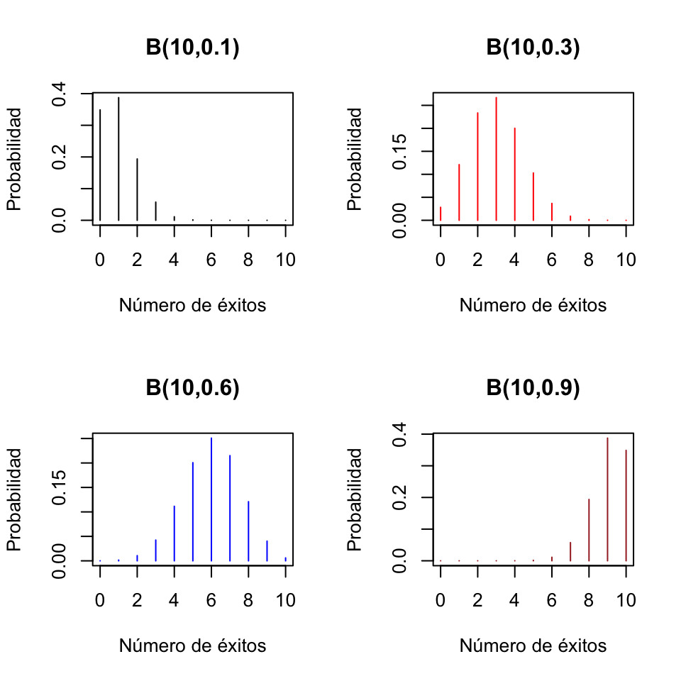

Ahora para $n=100$:

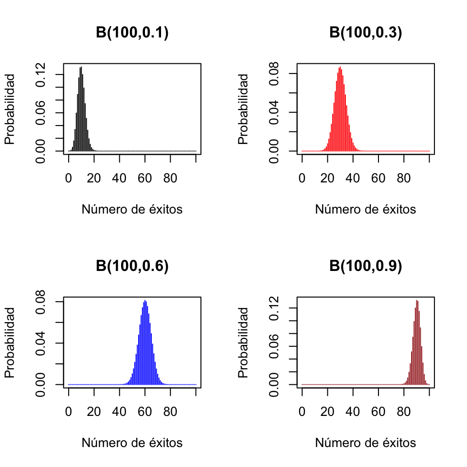

Podréis observar que si $p<0.5$, la distribución $B(n,p)$ tiene una cola a la derecha, y si $p>0.5$, la cola es a la izquierda. Es razonable. Por ejemplo, si $p<0.5$, el valor esperado será $pn<n/2$ y hay más valores posibles a la derecha de $pn$ que a su izquierda (porque una binomial $B(n,p)$ puede llegar a tomar el valor $n$, pero no puede tomar valores negativos).

Si $p=0.5$, es simétrica: como $E$ y $F$ tienen la misma probabilidad, 0.5, la probabilidad de sacar $k$ $E$'s es la misma que la de sacar $k$ $F$'s, es decir, la de sacar $n-k$ $E$'s.

\BeginKnitrBlock{rmdexercici}<div class="rmdexercici">Para agilizar los tests de COVID-19, se ha propuesto la estrategia siguiente (llamada **pooled sample testing** o simplemente **pooling**). Unimos grupos de 10 muestras en una sola muestra y la analizamos. Si da negativo, será señal de que todas la muestras originales eran negativas. Declaramos entonces negativos los 10 sujetos de las muestras originales. Si da positivo, será porque al menos una de las muestras originales era positiva. En este caso, analizamos las 10 muestras por separado.

Supongamos que el test tiene una especificidad y una sensibilidad del 100%. Observad entonces que si las 10 muestras estaban libres del virus, hacemos un solo test, mientras que si alguna muestra contenía virus, hacemos 11. Con el enfoque tradicional, un test por muestra, sin complicaciones, haríamos siempre 10 tests.

Sea $p$ la prevalencia de la COVID-19 en un momento y población dados. Dadas 10 muestras tomadas en ese momento en esa población, ¿cuál es el valor esperado de tests que tenemos que realizar? Para $p$ pequeña, del orden del 1% al 5%, ¿significaría el *pooling* un ahorro considerable de tests?</div>\EndKnitrBlock{rmdexercici}

##### ¿Cómo efectuar cálculos con una variable aleatoria de una familia dada? {-}

Una posibilidad es usar una aplicación de móvil o tablet. Nuestra favorita es *Probability distributions*, disponible tanto para Android como para iOS.


<div class="figure" style="text-align: center">

<p class="caption">(\#fig:unnamed-chunk-324)La app *Probability Distributions*.</p>
</div>

Otra posibilidad es usar R. R conoce todas la distribuciones de variables aleatorias  importantes; por ejemplo, para R la binomial es `binom`. Entonces

* Añadiendo al nombre de la distribución  el prefijo `d`, tenemos su **función de densidad**: de la binomial será `dbinom`. 

* Añadiendo al nombre de la distribución  el prefijo `p`, tenemos su **función de distribución**: de la binomial,  `pbinom`.

* Añadiendo al nombre de la distribución  el prefijo `q`, tenemos sus **cuantiles**: para la binomial, `qbinom`.

* Añadiendo al nombre de la distribución  el prefijo `r`, tenemos una función que produce **muestra aleatorias** de números con esa distribución de probabilidad: para la binomial, `rbinom`.

Estas funciones se aplican al argumento de la función y los parámetros de la variable aleatoria en su orden usual (todo entre paréntesis y separados por comas). Por ejemplo, para la binomial, se aplican a (argumento, $n$, $p$). Veamos algunos ejemplos.

* Si lanzamos 20 veces un dado equilibrado (de 6 caras), ¿cuál es la probabilidad de sacar exactamente 5 unos? Si llamamos $X$ a la variable aleatoria que cuenta el número de unos en secuencias de 20 lanzamientos de un dado equilibrado, se trata de una variable binomial $B(20,1/6)$. Nos piden $P(X=5)$, y esta probabilidad nos la da la función de densidad de $X$. Es $f_X(5)$:

```r
dbinom(5,20,1/6)
```

```
## [1] 0.1294103
```

\BeginKnitrBlock{rmdrecordau}<div class="rmdrecordau">Fijaos en el orden de los argumentos de la función entre los paréntesis. Para calcular $f_X(x)$, aplicamos `dbinom`  a $(x,n,p)$.</div>\EndKnitrBlock{rmdrecordau}


* Si lanzamos 20 veces un dado equilibrado, ¿cuál es la probabilidad de sacar como máximo 5 unos? Con las notaciones anteriores, nos piden $P(X\leq 5)$, y esta probabilidad nos la da la función de distribución de $X$. Es $F_X(5)$:

```r
pbinom(5,20,1/6)
```

```
## [1] 0.8981595
```

* Si lanzamos 20 veces un dado equilibrado, ¿cuál es la probabilidad de sacar menos de 5 unos? Con las notaciones anteriores, nos piden $P(X< 5)$, es decir, $P(X\leq 4)=F_X(4)$:

```r
pbinom(4,20,1/6)
```

```
## [1] 0.7687492
```


* Si lanzamos 20 veces un dado equilibrado, ¿cuál es la probabilidad de sacar 5 unos o más? Con las notaciones anteriores, nos piden $P(X\geq 5)$. Como lo contrario de sacar 5 unos o más es sacar 4 unos o menos, tenemos que $P(X\geq 5)=1-P(X\leq 4)=1-F_X(4)$:

```r
1-pbinom(4,20,1/6)
```

```
## [1] 0.2312508
```


* Si lanzamos 20 veces un dado equilibrado, ¿cuál es el menor número $N$ de unos para el que la probabilidad de sacar como máximo $N$ unos llega al 25%? Nos piden el menor valor $N$ tal que $P(X\leq N)\geq 0.25$, y esto por definición es el 0.25-cuantil de $X$:

```r
qbinom(0.25,20,1/6)
```

```
## [1] 2
```

Veamos que en efecto $N=2$ cumple lo pedido: la probabilidad de sacar como máximo 2 unos es 

```r
pbinom(2,20,1/6)
```

```
## [1] 0.3286591
```
y la probabilidad de sacar como máximo 1 uno es 

```r
pbinom(1,20,1/6)
```

```
## [1] 0.1304203
```
Vemos por tanto que con 1 uno no llegamos al 25% de probabilidad y con 2 sí.
    
* Queremos simular 50 rondas de lanzar 20 veces un dado equilibrado y contar los unos, es decir, queremos una muestra aleatoria de tamaño 50 de nuestra variable $X$:

```r
rbinom(50,20,1/6)
```

```
##  [1] 3 4 1 4 3 4 4 3 5 4 4 1 5 6 2 7 2 3 3 5 4 7 3 3 2 6 4 4 4 3 0 2 6 3 2 2 0 4
## [39] 3 2 5 1 3 3 5 3 2 3 7 3
```

Cada vez que repitamos esta instrucción seguramente obtendremos una muestra aleatoria nueva:

```r
rbinom(50,20,1/6)
```

```
##  [1] 3 3 8 1 3 3 4 2 6 3 4 3 1 4 3 1 1 2 3 1 6 4 7 3 3 2 2 2 2 6 1 2 2 5 4 3 4 4
## [39] 3 2 3 3 4 3 7 5 6 1 4 6
```

```r
rbinom(50,20,1/6)
```

```
##  [1] 3 1 3 3 3 1 4 1 4 3 5 1 2 3 5 2 2 5 4 3 3 4 4 3 3 4 3 4 2 3 2 3 3 0 5 2 5 3
## [39] 3 3 2 4 1 3 4 3 3 0 4 1
```

```r
rbinom(50,20,1/6)
```

```
##  [1] 2 6 2 4 2 6 3 4 4 1 3 1 2 2 6 3 2 1 5 3 9 5 2 3 0 5 1 5 2 5 4 5 5 4 3 7 4 3
## [39] 1 0 5 8 2 4 4 5 3 1 3 5
```


\BeginKnitrBlock{rmdnote}<div class="rmdnote">Por cierto, R también tiene una función para calcular la probabilidad de que se dé alguna repetición en una muestra  aleatorias simple de un tamaño dado.  En concreto:
  
* La instrucción `pbirthday(n,N)` nos da la probabilidad de que en una muestra aleatoria simple de tamaño n de una población de tamaño N haya algún elemento repetido.

* La instrucción `qbirthday(p,N)` nos da el tamaño mínimo de una muestra aleatoria simple de una población de tamaño N para que la probabilidad de que haya algún elemento repetido sea $\geq p$.

El nombre `birthday` hace referencia a la **paradoja del cumpleaños**: el típico problema de calcular la probabilidad de que dos estudiantes de una clase celebren el cumpleaños el mismo día y asombrarse de que en una clase de 50 estudiantes haya más de un 95% de probabilidades de que haya algún cumpleaños repetido. 

En efecto, podemos entender una clase de 50 estudiantes como una muestra aleatoria simple de 50 fechas de nacimiento, escogidas de un conjunto de 366 posibles fechas (los 366 días de un año bisiesto). La probabilidad de que al menos 2 estudiantes celebren el cumpleaños el mismo día es la probabilidad de que se dé al menos una repetición en esta muestra. R lo calcula con:</div>\EndKnitrBlock{rmdnote}


```r
pbirthday(50,366)
```

```
## [1] 0.9700731
```

\BeginKnitrBlock{rmdexercici}<div class="rmdexercici">¿Cuál es el número mínimo de estudiantes en la clase para que la probabilidad de que se repita una fecha de cumpleaños sea del 95% o más?</div>\EndKnitrBlock{rmdexercici}


### Variables aleatorias hipergeométricas

Recordad que el paradigma de variable aleatoria binomial es: tengo una población con una proporción $p$ de sujetos que satisfacen una condición $E$, tomo una muestra aleatoria simple de tamaño $n$ y cuento el número de sujetos $E$ en mi muestra. Si cambiamos "muestra aleatoria simple" por "muestra aleatoria sin reposición", la distribución de la variable aleatoria que obtenemos es otra: la **hipergeométrica**.

Una variable aleatoria es **hipergeométrica** (o **tiene distribución hipergeométrica**) **de parámetros $N$, $M$ y $n$** ($H(N,M,n)$, para abreviar) es cualquier variable aleatoria $X$ que podáis identificar con el proceso siguiente: Tenemos una población formada por $N$ sujetos que satisfacen una condición $E$ y $M$ sujetos que no la satisfacen (por lo tanto, en total, $N+M$ sujetos en la población), tomamos una muestra aleatoria **sin reposición** de tamaño $n$ y contamos el número de sujetos $E$ en esta muestra.

Llamaremos a $N$ el **número poblacional de éxitos**, a $M$ el **número poblacional de fracasos** y a $n$ el **tamaño de las muestras**. Fijaos entonces que $N+M$ es el  **tamaño total de la población** y que $N/(N+M)$  es la **probabilidad poblacional de éxito** (la fracción de sujetos que satisfacen $E$ en el total de la población). Con R, igual que la distribución binomial era `binom`, la distribución hipergeométrica es `hyper`. 


\BeginKnitrBlock{theorem}<div class="theorem"><span class="theorem" id="thm:unnamed-chunk-338"><strong>(\#thm:unnamed-chunk-338) </strong></span>Si $X$ es una variable $H(N,M,n)$:

* Su dominio es $D_X=\{0,1,\ldots,\text{min}(N,n)\}$

* Su función de densidad es
$$
f_X(k)=\left\{\begin{array}{ll}
\displaystyle\dfrac{\binom{N}{k}\cdot \binom{M}{n-k}}{\binom{N+M}{n}} & \text{ si $k\in D_X$}\\
0 & \text{ si $k\notin D_X$}
\end{array}\right.
$$

* Su valor esperado es $E(X)=\dfrac{nN}{N+M}$
  
* Su varianza es $\sigma(X)^2=\dfrac{nNM(N+M-n)}{(N+M)^2(N+M-1)}$
  </div>\EndKnitrBlock{theorem}

Fijaos que si llamamos $p$ a la probabilidad poblacional de éxito, $p=N/(N+M)$, entonces
$$
E(X)=np.
$$
Es la misma fórmula que para las variables binomiales $B(n,p)$ (y si lo pensáis un rato veréis que, de nuevo y por el mismo argumento, es lo razonable). Por otro lado, si llamamos $\mathbf{P}$ al tamaño de la población,  $\mathbf{P}=N+M$, entonces
$$
\sigma(X)^2=n\cdot\dfrac{N}{N+M}\cdot\dfrac{M}{N+M}\cdot\frac{N+M-n}{N+M-1}=np(1-p)\cdot\dfrac{\mathbf{P}-n}{\mathbf{P}-1}
$$
que es la varianza de una variable $B(n,p)$ multiplicada por un factor de corrección debido al hecho de que ahora tomamos muestras sin repetición y la varianza es más pequeña que si las tomamos con repetición. A este factor $(\mathbf{P}-n)/(\mathbf{P}-1)$ se le llama **factor de población finita**. 

Fijaos en que si $\mathbf{P}$ es muchísimo más grande que $n$, tendremos que  $\mathbf{P}-n\approx \mathbf{P}-1$ y por lo tanto $(\mathbf{P}-n)/(\mathbf{P}-1)\approx 1$ y la varianza de la hipergeométrica será aproximadamente la de la binomial. Esto es consistente con lo que ya hemos comentado: si la población es mucho más grande que la muestra, tomar las muestras con o sin reposición no afecta demasiado a las muestra obtenidas, por lo que la distribución de probabilidad ha de ser muy parecida.
Recordad los ejemplos siguientes:

* En España hay 46,700,000 personas, de las cuales un 11.7\% son diabéticos. Escogemos 100 españoles y contamos cuántos son diabéticos. 

    Esta variable es, en realidad, hipergeométrica con $N=0.117\cdot 46700000=5463900$, $M=46700000-N=41236100$ y $n=100$, pero en la práctica la consideramos binomial $B(100,0.117)$. El factor de población finita es
$$
\frac{46700000-100}{46700000-1}=0.9999979
$$
    En cambio:

* En una aula hay 5 chicos y 45 chicas. Escogemos 10 estudiantes, uno tras otro y sin repetirlos, para hacerles una pregunta. Cada elección es independiente de las otras. Contamos cuántos chicos hemos interrogado. 

    Esta variable es  hipergeométrica $H(5,45,10)$. El factor de población finita en esta caso no es aproximadamente 1: da
$$
\frac{50-10}{50-1}=0.8163
$$
    No es correcto aproximarla por una binomial $B(10,0.1)$. 
    
    
El gráfico siguiente compara la función de densidad de una variable $B(10,0.1)$ con las de variables hipergeométricas $H(5,45,10)$, $H(50,450,10)$ y $H(5000,45000,10)$ para que veáis cómo a medida que el tamaño de la población crece (manteniendo constante la proporción poblacional de éxitos), la distribución hipergeométrica se aproxima a la binomial.
     
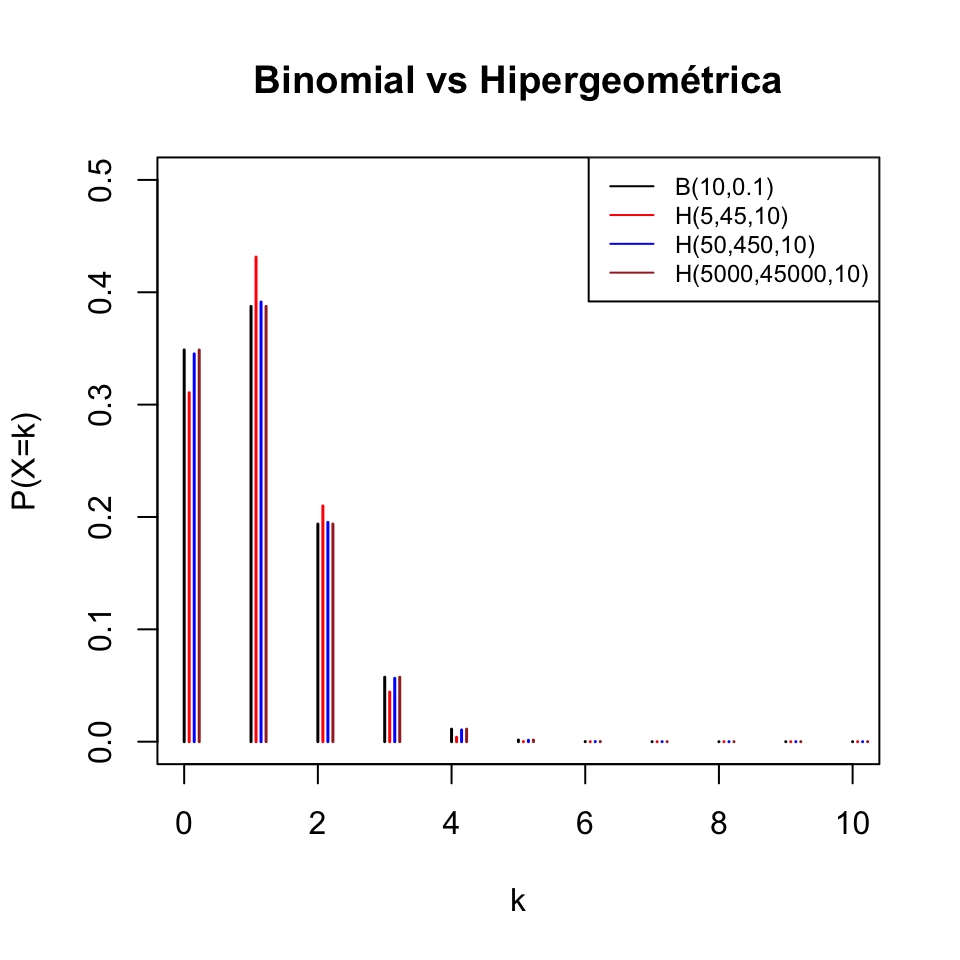


### Variable aleatorias de Poisson

Una variable aleatoria $X$ es **de Poisson** (o tiene **distribución de Poisson**) **con parámetro $\lambda>0$** ($Po(\lambda)$, para abreviar) cuando: 

* Su **dominio** es $D_X=\mathbb{N}$, el conjunto de todos los números naturales (es decir, puede tomar como valor cualquier número natural).

* Su **función de densidad** es
$$
f_X(k)=\left\{\begin{array}{ll}
e^{-\lambda}\cdot \dfrac{\lambda^k}{k!} &  \text{ si $k\in \mathbb{N}$}\\
0 & \text{ si $k\notin \mathbb{N}$}
\end{array}\right.
$$

Para R, la distribución de Poisson es `pois`.

\BeginKnitrBlock{theorem}<div class="theorem"><span class="theorem" id="thm:unnamed-chunk-340"><strong>(\#thm:unnamed-chunk-340) </strong></span>Si $X$ es una variable $Po(\lambda)$, entonces $E(X)= \sigma(X)^2= \lambda$.
  
</div>\EndKnitrBlock{theorem}

Es decir, el "parámetro" $\lambda$ de una variable de Poisson es su valor esperado, y coincide con su varianza.

Suponemos que os estáis preguntando: ¿para qué nos sirve definir una variable de Poisson mediante su densidad, si lo que nos interesa es poder clasificar una variable como de Poisson (o binomial, o hipergeométrica etc.) para así saber "gratis" su densidad? La respuesta es que la familia de Poisson incluye un tipo de variables aleatorias muy común en epidemiología.

Supongamos que tenemos un tipo de objetos que pueden darse  en una región continua de tiempo o espacio. Por ejemplo, defunciones de personas por una determinada enfermedad en el decurso del tiempo, casos de un tipo de cáncer  en diferentes zonas geográficas de un país, o números de bacterias en trozos de una superficie. Para simplificar el lenguaje, vamos a suponer que observamos apariciones de estos objetos en el tiempo.


Supongamos además que las apariciones de estos objetos satisfacen las propiedades siguientes:

* Las apariciones de los objetos son **aleatorias**: en cada instante, un objeto se da, o no, al azar, con una probabilidad fija y constante. 

* Las apariciones de los objetos son  **independientes**: que se dé un objeto en  un instante concreto, no depende para nada de que se haya dado o no un objeto en otro instante.

* Las apariciones de los objetos **no son simultáneas**: es prácticamente imposible que dos objetos de estos se den en el mismo instante exacto, medido con precisión infinita.

\BeginKnitrBlock{rmdimportant}<div class="rmdimportant">En esta situación, la variable $X_t$ que toma un intervalo de tiempo de duración $t$ y cuenta el número de objetos que se dan en él  es de Poisson: $Po(\lambda_t)$, con $\lambda_t$ el número esperado de objetos en este intervalo de tiempo (es decir, el número medio de objetos en intervalos de tiempo de este tamaño). </div>\EndKnitrBlock{rmdimportant}

Por ejemplo, cuando lo que cuentan ocurre al azar, son variables de Poisson:

* El número de enfermos admitidos en urgencias en un día (o en 12 horas, o en una semana...)

* El número de defunciones por una enfermedad concreta en un día (o en una semana, o en un año...)

* El número de bacterias en un cuadrado de 1 cm de lado (o de 1 m de lado...)

Fijaos en que este tipo de conocimiento nos sirve para dos cosas:

* Si sabemos que estas variables son de Poisson, conocemos su densidad y por lo tanto podemos calcular lo que queramos para ellas.

* Si los datos que observamos tocarían seguir una distribución de Poisson pero parece que no (por ejemplo, porque su varianza sea muy diferente de su media, tan diferente que sea difícil de creer que la media y la varianza poblacionales sean iguales), entonces es señal de que algo "raro" está pasando en realidad. 

\BeginKnitrBlock{example}<div class="example"><span class="example" id="exm:unnamed-chunk-342"><strong>(\#exm:unnamed-chunk-342) </strong></span>Observad la diferencia entre las dos variables siguientes:

* Número semanal de defunciones por un tipo de cáncer en un país. El momento exacto de las defunciones se produce al azar, podemos entender que no se dan dos defunciones exactamente en el mismo instante, con precisión infinita, y las defunciones se producen de manera independiente. Es de Poisson.

* Número semanal de defunciones en accidentes de tráfico en un país. De nuevo, el momento exacto de las defunciones se produce al azar y podemos entender que no se dan dos defunciones exactamente en el mismo instante, con precisión infinita. Pero las muertes en accidentes de tráfico no son independientes: en un mismo accidente mortal se pueden producir varias muertes casi simultáneas, las condiciones metereológicas o de alguna carretera pueden hacer que aumente durante un cierto período de tiempo la probabilidad de accidente mortal, etc. No es de Poisson.

</div>\EndKnitrBlock{example}

\BeginKnitrBlock{rmdnote}<div class="rmdnote">Como las apariciones de los objetos que cuenta una variable de Poisson son aleatorias e independientes, el número medio de objetos es lineal en el tamaño de la región. Es decir, por ejemplo, en un intervalo de dos días esperamos ver el doble de objetos que en un día. O por ejemplo, si se diagnostican de media 32,240 casos de cáncer de colon anuales en España (y siguen una ley de Poisson), esperamos que  de media se diagnostiquen 32240/52=620 casos  semanales.
</div>\EndKnitrBlock{rmdnote}


## Test

**(1)** Sea $X$ una variable aleatoria discreta de media $\mu$ y desviación típica $\sigma$. ¿Cuáles de las afirmaciones siguientes son siempre verdaderas?

1. $E(X+2)=\mu+2$. 
1. $\sigma(X+2)=\sigma+2$. 
1. $\sigma(-X)=-\sigma$. 
1. $\sigma(-X)=\sigma$. 
1. $\sigma(X/2)=\sigma/2$. 
1. Ninguna de las otras afirmaciones es verdadera.

**(2)** La función de distribución $F_X(x)$ de una variable aleatoria $X$ nos da: 


1. La probabilidad de obtener el valor $x$.
1. La probabilidad de obtener un valor entre $-x$ y $x$, ambos extremos incluidos.
1. La probabilidad de obtener un valor entre $0$ y $x$, ambos extremos incluidos.
1. La probabilidad de obtener un valor menor o igual que $x$. 
1. La probabilidad de obtener un valor estrictamente menor que $x$.

**(3)** La incidencia  anual de un cierto accidente laboral sigue una distribución de Poisson. A lo largo del tiempo se ha observado que el 55% de los años no se produce ningún accidente. ¿Qué valor estimas que tiene el parámetro $\lambda$ de dicha distribución de Poisson? 

1. 0.55
1. $e^{-0.55}$
1. $\ln(0.55)$
1. $-\ln(0.55)$ 
1. Un valor que no es ninguno de los propuestos en las otras respuestas.


**(4)** Un tratamiento T cura el 20% de los enfermos de una enfermedad X. Marca todas las afirmaciones verdaderas.

1. La distribución del número de individuos que se curan con el tratamiento T en una muestra aleatoria de 100 enfermos de X es aproximadamente simétrica. 
1. La distribución del número de individuos que se curan con el tratamiento T en una muestra aleatoria de 100 enfermos de X es más bien asimétrica a la izquierda. 
1. La distribución del número de individuos que se curan con el tratamiento T en una muestra aleatoria de 100 enfermos de X es más bien asimétrica a la derecha. 
1. La probabilidad de que T cure dos enfermos de X escogidos al azar es 0.4. 
1. En una muestra aleatoria de 50 enfermos de X, esperamos que T cure 10. 
1. Ninguna de las otras afirmaciones es verdadera.


**(5)**  ¿Cuáles de las variables siguientes tienen una distribución binomial?

1. El peso de una persona elegida al azar. 
1. Escogemos un número de lanzamientos al azar, lanzamos ese número de veces una moneda al aire, y contamos el número de caras. 
1. El número de glóbulos rojos en 1 mm^3^ de sangre. 
1. La proporción de hipertensos en una muestra aleatoria de 50 individuos. 
1. Escogemos 10 estudiantes diferentes en una clase de 20, y contamos cuántas mujeres han salido. 
1. Ninguna de ellas.


**(26**  ¿Cuáles de las variables siguientes tienen una distribución de Poisson?

1. El peso de una persona elegida al azar. 
1. El número de casos diarios de COVID-19 en Mallorca. 
1. El número de glóbulos rojos en 1 mm^3^ de sangre. 
1. La proporción de hipertensos en una muestra aleatoria de 50 individuos. 
1. Escogemos 10 estudiantes diferentes en una clase de 20, y contamos cuántas mujeres han salido. 


<!--chapter:end:31-VarAlGen.Rmd-->

# Variables aleatorias continuas 

Cuando una variable aleatoria puede tomar muchos valores, las probabilidades individuales pueden ser muy pequeñas ya que la probabilidad total, 1, se ha de repartir entre ellos. Comparad en el gráfico siguiente las probabilidades de los diferentes valores para una binomial $B(0.5,5)$, que solo puede tomar 6 valores (de 0 a 5), y una binomial $B(0.5,500)$, que puede tomar 501 valores (de 0 a 500). La probabilidad mínima en el primer caso es mayor que la probabilidad máxima en el segundo. 


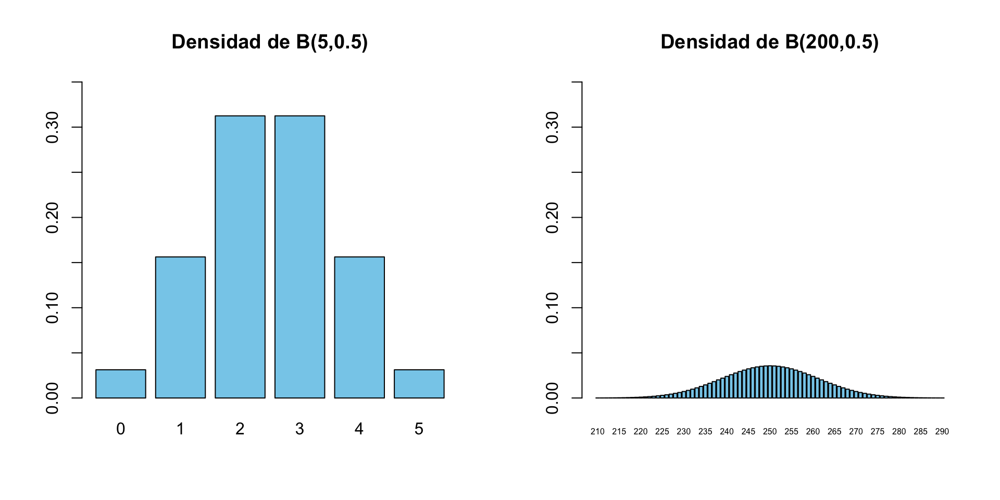
 
Como os podéis imaginar, las variables aleatorias continuas, que pueden tomar todo un continuo de valores reales (y por lo tanto infinitos), van a tener probabilidades individuales muy, muy pequeñas. 

Para simplificarnos la vida, en este curso nos vamos a restringir a variables aleatorias continuas $X: \Omega\to \mathbb{R}$ que satisfacen la siguiente propiedad extra: su **función de distribución**
$$
\begin{array}{rcl}
F_X: \mathbb{R} & \to & [0,1]\\
x &\mapsto &P(X\leq x)
\end{array}
$$ 
es continua. Todas las variables aleatorias continuas que os puedan interesar en algún momento van a cumplir esta propiedad, así que no perdemos nada imponiéndola. ¿Y qué ganamos?

Pues que, entonces, si $X$ es una variable aleatoria continua, la probabilidad de que tome cada valor concreto es 0:
$$
P(X=a)=0 \text{ para todo $a\in \mathbb{R}$}.
$$

\BeginKnitrBlock{rmdcorbes}<div class="rmdcorbes">Por si pasa por aquí alguien que necesite una demostración:
$$
\begin{array}{l}
\displaystyle P(X=a) = P(X\leq a)-P(X<a)=P(X\leq a)-P\Big(\bigcup_{n\geq 1} \Big(X\leq a-\frac{1}{n}\Big)\Big)\\
\displaystyle \qquad= P(X\leq a)-\lim_{n\geq 1}P\Big(X\leq a-\frac{1}{n}\Big)\\
\displaystyle \qquad= F_X(a)-\lim_{n\geq 1}F_X\Big(a-\frac{1}{n}\Big)=0
\end{array}
$$
porque $F_X$ es continua.</div>\EndKnitrBlock{rmdcorbes}

En particular, para una variable aleatoria continua: 

> **Probabilidad 0 no significa imposible.**

Cada valor de $X$ tiene probabilidad 0, pero cuando tomamos un sujeto, tendrá algún valor de $X$, ¿no?. Por lo tanto, su valor de $X$ es posible, aunque tenga probabilidad 0.

De $P(X=a)=0$ se deduce que la probabilidad de un suceso definido con una desigualdad es exactamente la misma que la del suceso correspondiente definido con una desigualdad estricta. En particular, contrariamente a lo que pasaba en las variables aleatorias discretas, para una variable aleatoria continua siempre tenemos que 
$$
P(X\leq a)=P(X<a)
$$
porque 
$$
P(X\leq a)=P(X<a)+P(X=a)=P(X<a)+0=P(X<a).
$$

Otros ejemplos:

* $P(X\geq a)=P(X> a)+P(X=a)=P(X> a)$
* $P(a\leq X\leq b)=P(a<X<b)+P(X=a)+P(X=b)$ $=P(a<X<b)$

Cuando una variable aleatoria discreta puede tomar pocos valores, la probabilidad de cada valor es relevante. Pero si la probabilidad de cada valor concreto es 0, deja de interesarnos la probabilidad de que tome un valor  concreto, y lo que más nos interesa pasa a ser la probabilidad de que caiga dentro de un intervalo. 

## Densidad y distribución

Sea $X$ una variable aleatoria continua. Como ya hemos dicho, su **función de distribución** $F_X$ se sigue definiendo como
$$
x\mapsto F_X(x)=P(X\leq x)
$$

Pero puesto que tenemos que $P(X=x)=0$, ahora no podemos definir la función de densidad de $X$ como $f_X(x)=P(X=x)$. ¿Qué podemos hacer?

Recordad que, en las variables aleatorias discretas
$$
F_X(a)=\sum_{x\leq a} f_X(x)
$$

En el contexto de matemáticas "continuas", la suma $\sum$ se traduce en la integral $\int$. Se define entonces la  **función de densidad** de una variable aleatoria continua $X$ como la función $f_X:\mathbb{R}\to \mathbb{R}$ tal que:

* $f_X(x)\geq 0$, para todo $x\in \mathbb{R}$

* $\displaystyle F_X(a)=\int_{-\infty}^a f_{X}(x)\, dx$ para todo $a\in \mathbb{R}$. 


Recordad (o aprended por primera vez) que la integral tiene una interpretación sencilla en términos de áreas. En concreto, dados $a\in \mathbb{R}$ y una función $f(x)$, la integral
$$
\int_{-\infty}^a f(x)\, dx
$$
es igual al área de la región a la izquierda de la recta vertical $x=a$ comprendida entre la curva $y=f(x)$ y el eje de abscisas $y=0$. Por lo tanto, la función de densidad $f_X$ de $X$ es la función positiva tal que para todo $a\in \mathbb{R}$, $F_X(a)$ es igual al **área bajo la curva** $y=f_X(x)$ (entre esta curva y el eje de abscisas) a la izquierda de $x=a$.  


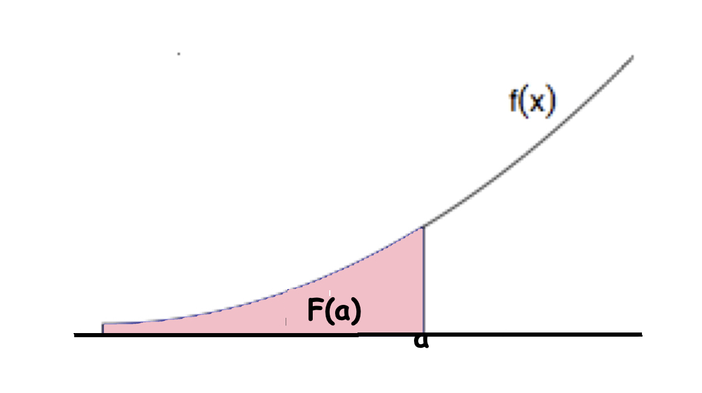


¿Cuál es la idea intuitiva que hay tras esta definición de densidad? Suponed que dibujamos  histogramas de frecuencias relativas de los valores de $X$ sobre toda la población. Recordad que, en un histograma de estos, la frecuencia relativa (la **probabilidad**) de cada clase es la amplitud de la clase por la altura de su barra, y que llamábamos a esta altura la **densidad** de la clase (y por lo tanto, algo tendrá que ver con la densidad de $X$, ¿no creéis?). 

Si dibujamos los histogramas de $X$ tomando clases cada vez más estrechas, sus polígonos de frecuencias tienden a dibujar una curva, que hemos coloreado en rojo en el último histograma:

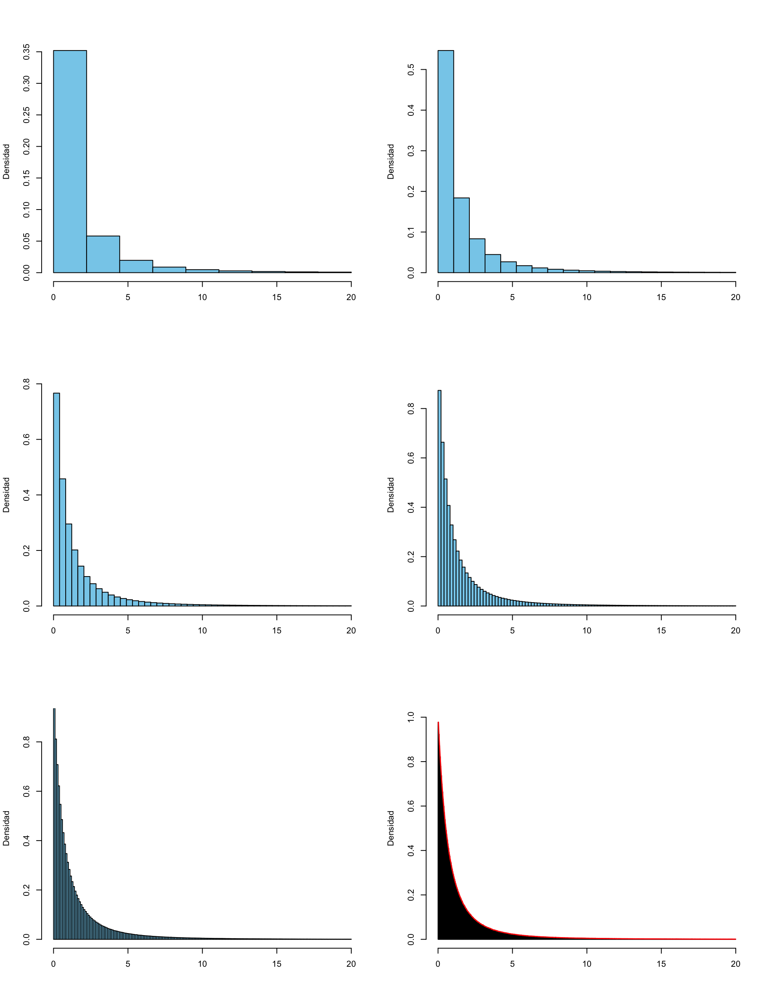

Cuando el ancho de las clases tiende a 0, obtenemos una curva que es el límite de estos polígonos de frecuencias:
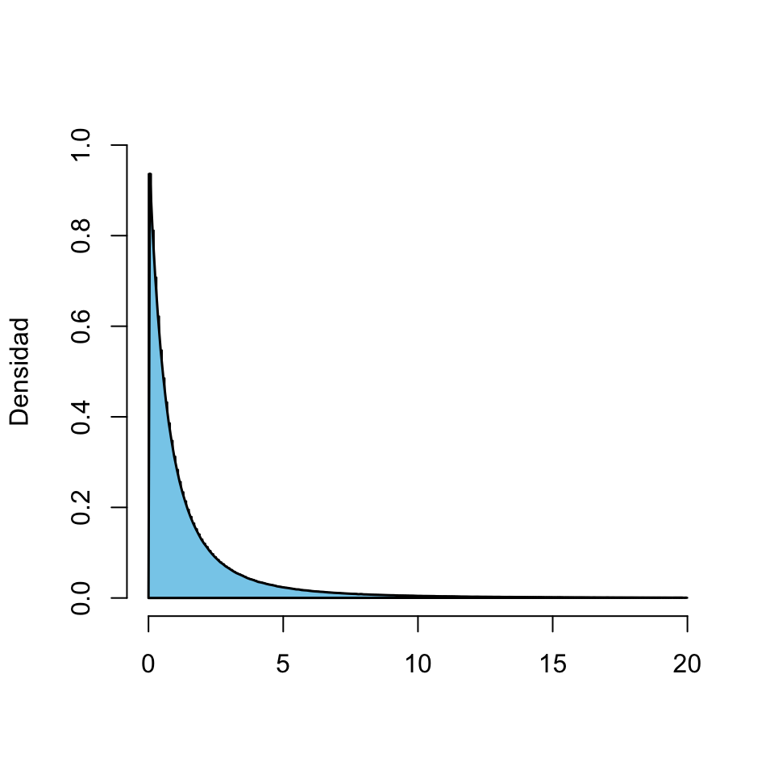

Esta curva es precisamente $y=f_X(x)$. Es decir, la **función de densidad** $f_X$ de una variable aleatoria continua $X$ es la función límite de los polígonos de frecuencias de histogramas de $X$ cuando la amplitud de las clases tiende  a 0.

Como $P(X\leq a)$ es el área  bajo la curva $y=f_X(x)$ a la izquierda de $x=a$,
$$
P(a\leq X\leq b)=P(X\leq b)-P(X<a)
$$
es el área  bajo la curva $y=f_X(x)$ a la izquierda de $x=b$ **menos** el área  bajo la curva $y=f_X(x)$ a la izquierda de $x=a$, es decir,  **$P(a\leq X\leq b)$ es igual al área  bajo la curva $y=f_X(x)$ entre $x=a$ y $x=b$.**


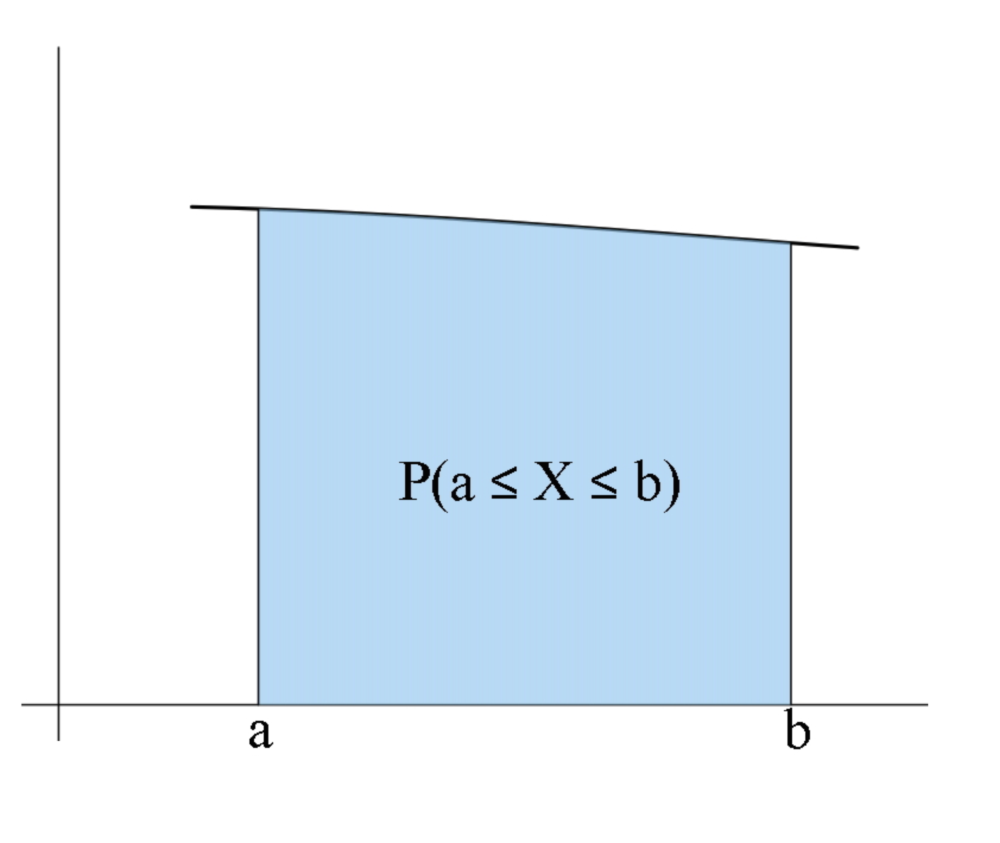

 

Como $P(X<\infty)=P(\Omega)=1$, **el área total bajo la curva $y=f_X(x)$ es 1.**

Sabemos que $P(X=a)=0$, pero si $\varepsilon>0$ es muy, muy pequeño,
el área bajo $y=f_X(x)$ entre $a-\varepsilon$ y $a+\varepsilon$ es aproximadamente  $2\varepsilon\cdot f_X(a)$. Es decir,
$$
P(a-\varepsilon\leq X\leq a+\varepsilon)\approx 2\varepsilon\cdot f_X(a).
$$


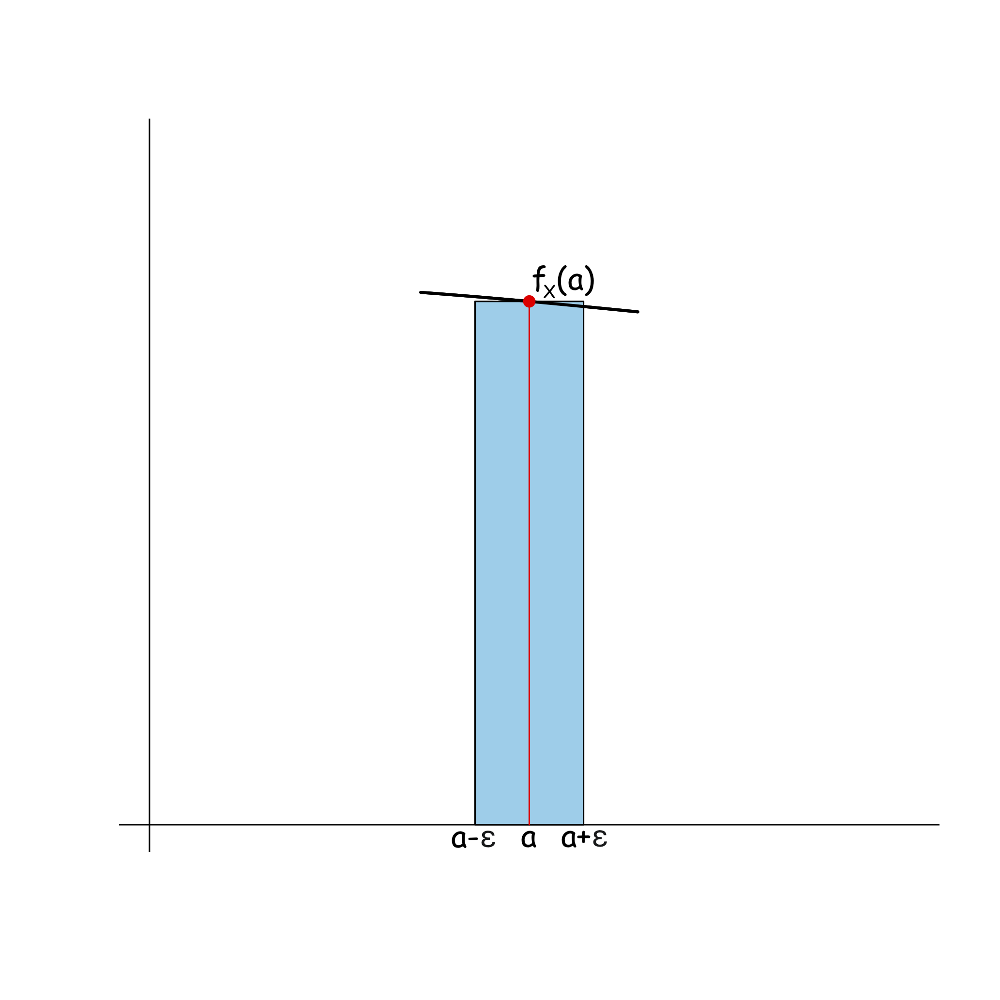

Por lo tanto $f_X(a)$ nos da una indicación de la probabilidad de que $X$ valga aproximadamente $a$ (pero **no es** $P(X=a)$, que vale 0). Es decir, por ejemplo, si $f_X(a)=0.1$ y $f_X(b)=0.5$, **la probabilidad de que $X$ tome un valor muy cercano a $a$ es 5 veces mayor que la probabilidad de que tome un valor muy cercano a $b$**. 

\BeginKnitrBlock{rmdrecordau}<div class="rmdrecordau">Pero $P(X=a)=P(X=b)=0$, así que, por favor, evitad decir que "la probabilidad de que $X$ valga $a$ es 5 veces **mayor** que la probabilidad de que valga $b$". Sí, ya sabemos que $5\cdot 0=0$, pero la frase es engañosa.</div>\EndKnitrBlock{rmdrecordau}

Unas  consideraciones finales:

* Lo hemos dicho en la definición, y lo hemos usado implícitamente en toda la sección,  pero lo volvemos a repetir: $f_X(x)\geq 0$ para todo $x\in \mathbb{R}$.

\BeginKnitrBlock{rmdnote}<div class="rmdnote">En realidad, que $f_X(x)$ sea $\geq 0$ para todo $x\in \mathbb{R}$ es consecuencia del hecho que $F_X$ sea positiva y creciente (las funciones de distribución son siempre crecientes, porque si $x<y$, $F_X(x)=P(X\leq x)\leq P(X\leq y)=F_X(y)$) y coincida con $\int_{-\infty}^x f_X(x)\,dx$.</div>\EndKnitrBlock{rmdnote}

* $f_X(x)$ no es una probabilidad, y por lo tanto puede ser mayor que 1. Por ejemplo, el gráfico siguiente muestra la densidad de una variable normal $N(0,0.01)$ (véase la Sección \@ref(sec:normal)), que llega  a valer casi 40.

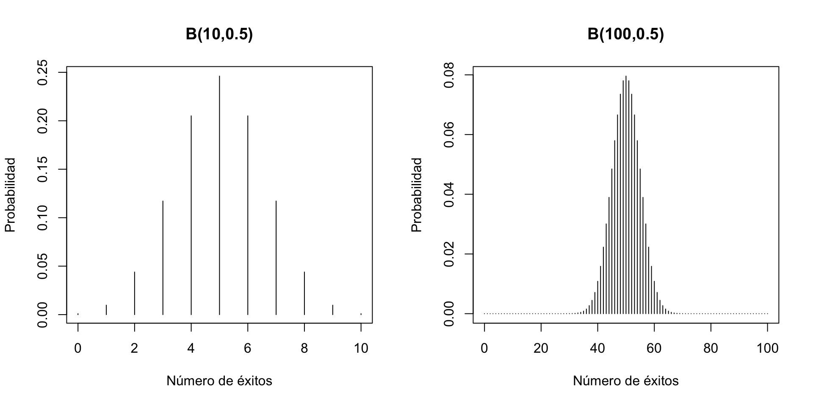

* La función de densidad $f_X$ no tiene por qué ser continua, aunque la función de distribución $F_X$ lo sea.


## Esperanza, varianza, cuantiles...

La esperanza y la varianza de una variable aleatoria continua $X$, con función de densidad $f_X$, se definen como en el caso discreto, substituyendo la suma $\sum_{x\in D_x}$ por una integral.


La **media**, o **esperanza** (**valor medio**, **valor esperado**...), de $X$ es 
$$
E(X)=\int_{-\infty}^{\infty}x \cdot f_{X}(x)\, dx
$$
Es decir, es el área comprendida entre el eje de abscisas y la curva $y=xf_X(x)$.
Como en el caso discreto, también la denotaremos a veces por $\mu_X$. 

Este valor tiene la misma interpretación que en el caso discreto: 

* Representa el valor medio de $X$ sobre el total de la población.

* Es (con probabilidad 1) el límite de la media aritmética de los valores de $X$ sobre muestras aleatorias simples de tamaño $n$, cuando $n\to \infty$.

Si $g:\mathbb{R}\to \mathbb{R}$ es una función continua,
la **esperanza** de $g(X)$ es
$$
E(g(X))=\int_{-\infty}^{+\infty} g(x) f_X(x)dx
$$

La **varianza** de $X$ es
$$
\sigma(X)^2=E((X-\mu_X)^2)
$$
y se puede demostrar que es igual a
$$
\sigma(X)^2=E(X^2)-\mu_X^2
$$
También se escribe $\sigma_X^2$.


La **desviación típica** de $X$ es 
$$
\sigma(X)=+\sqrt{\sigma(X)^2}
$$
y también se escribe $\sigma_X$.


Como en el caso discreto, la varianza y la desviación típica miden la variabilidad de los resultados de $X$ respecto de su valor medio.

Estos parámetros de $X$ tienen las **mismas propiedades** en el caso continuo que en el discreto. Las recordamos:

* Si $b$ es una variable aleatoria constante, $E(b)=b$ y $\sigma(b)^2=0$.


* $E(a X+b)=a E(X)+b$.


* $E(X+Y)=E(X)+E(Y)$.


* Si $X\leq Y$, entonces $E(X)\leq E(Y)$.


* Si $a,b\in \mathbb{R}$, $\sigma(aX+b)^2=a^2 \sigma(X)^2$ y  $\sigma(aX+b)=|a|\cdot \sigma(X)$.


* Si $X,Y$ son **independientes**, $\sigma(X+Y)^2=\sigma(X)^2+\sigma(Y)^2$. Si no, en principio no.


El **cuantil de orden $p$** (o **$p$-cuantil**) de una variable aleatoria continua $X$ es el valor $x_p\in \mathbb{R}$ más pequeño tal que 
$$
F_X(x_p)=P(X\leq x_p)=p
$$

\BeginKnitrBlock{rmdcorbes}<div class="rmdcorbes">Fijaos en que como $F_X(x)$ tiende a 0 (la probabilidad del conjunto vacío) cuando $x\to -\infty$ y tiende a 1 (la probabilidad de todo $\mathbb{R}$) cuando $x\to +\infty$ y  es continua, por el Teorema del Valor medio de las funciones continuas (que dice, básicamente, que las funciones continuas no dan saltos) toma todos los valores en (0,1) y por lo tanto dado cualquier $p\in (0,1)$ existe algún $x$ tal que $F_X(x)=p$.</div>\EndKnitrBlock{rmdcorbes}

La **mediana** de $X$ es su 0.5-cuantil,  el **primer** y **tercer cuartiles** son su 0.25-cuantil y su 0.75-cuantil, etc.


## Variables aleatorias normales {#sec:normal}


Una variable aleatoria continua $X$ es **normal** (o **tiene distribución normal**) de parámetros
$\mu$ y $\sigma$ (es $N(\mu,\sigma)$, para abreviar) cuando su función de densidad es
$$
f_{X}(x)=\frac{1}{\sqrt{2\pi}\sigma} e^{{-(x-\mu)^2}/{2\sigma^{2}}} \mbox{
para todo } x\in \mathbb{R}
$$

Naturalmente, no os tenéis que saber esta fórmula. 


Pero sí que tenéis que saber que:

* Una variable aleatoria normal $X$ es continua, y por lo tanto $P(X=x)=0$, $P(X\leq x)=P(X<x)$ etc.

* Si $X$ es normal, su función de distribución $F_X$ es **inyectiva y creciente**: si $x<y$, $F_X(x)<F_X(y)$.

Una variable aleatoria normal es **típica** (o **estándar**) cuando es $N(0,1)$. Usaremos normalmente $Z$ para denotar una variable normal estándar. 


La gráfica de la densidad de una variable aleatoria normal es la famosa **campana de Gauss**:

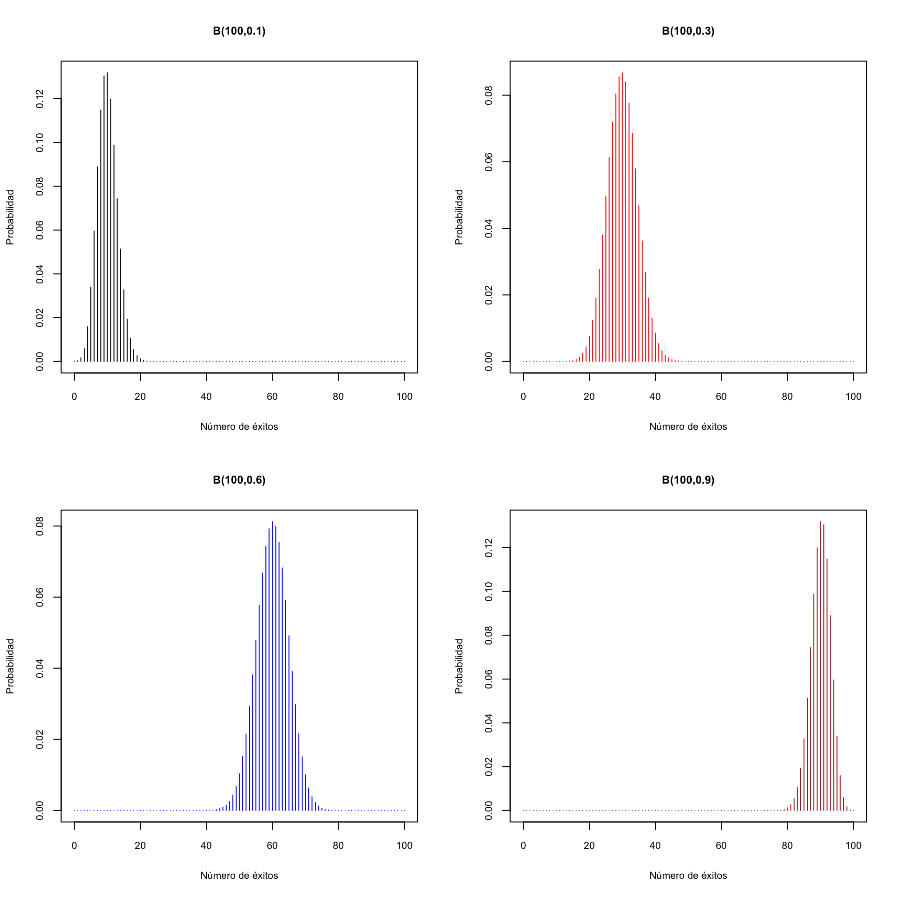


La distribución normal es una distribución teórica, no la encontraréis exacta en la vida real. Y pese a su nombre, no es más "normal" que otras distribuciones continuas.


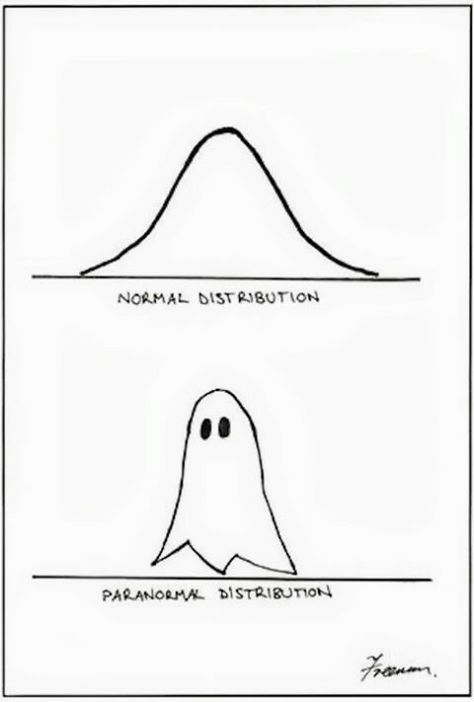

Pero es muy importante, debido a que muchas distribuciones de la vida real son aproximadamente normales porque:

> Toda variable aleatoria que consista en tomar $n$ medidas independientes de una o varias variables aleatorias y sumarlas, tiene distribución aproximadamente normal **cuando $n$ es muy grande**, aunque las variables aleatorias de partida no sean normales.


\BeginKnitrBlock{example}<div class="example"><span class="example" id="exm:unnamed-chunk-359"><strong>(\#exm:unnamed-chunk-359) </strong></span>Una variable binomial $B(n,p)$ se obtiene tomando $n$ medidas independientes de una variable Bernoulli $Be(p)$ y sumando los resultados. Por lo tanto, por la "regla" anterior, una  $B(n,p)$ tendría que ser aproximadamente normal si $n$ es grande. Pues sí, si $n$ es grande (pongamos mayor que 40, aunque si $p$ está muy cerca de 0 o 1 el tamaño de las muestras tiene que ser mayor), la distribución de una variable $X$ binomial $B(n,p)$ se acerca mucho a la de una normal $N(np,\sqrt{np(1-p)})$, donde, recordad que si $X$ es $B(n,p)$, entonces $\mu_X=np$ y $\sigma_X=\sqrt{np(1-p)}$. 

</div>\EndKnitrBlock{example}

Por ejemplo, el gráfico siguiente compara las funciones de distribución de una binomial $B(40,0.3)$ y una normal $N(40\cdot 0.3,\sqrt{40\cdot 0.3\cdot 0.7})$.


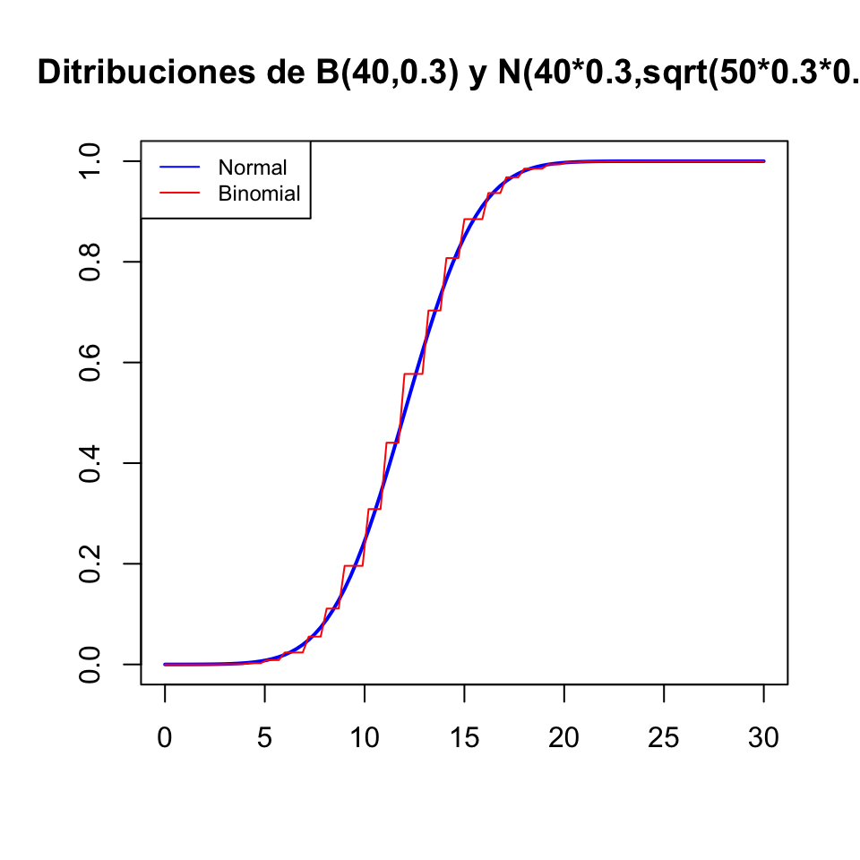

\BeginKnitrBlock{rmdrecordau}<div class="rmdrecordau">En los próximos temas utilizaremos a menudo que una variable $B(n,p)$ con $n$ es grande es aproximadamente $N(np,\sqrt{np(1-p)})$.</div>\EndKnitrBlock{rmdrecordau}


Para calcular probabilidades de una $N(\mu,\sigma)$,  hay que calcular las integrales a mano.


O podéis usar R o alguna aplicación para móvil o tablet. Para R, la normal es `norm`. Así, por ejemplo, si $X$ es $N(1,2)$

* $P(X\leq 1.5)$ es

```r
pnorm(1.5,1,2)
```

```
## [1] 0.5987063
```

* El 0.4-cuantil de $X$, es decir, el valor $q$ tal que $P(X\leq q)=0.4$ es

```r
qnorm(0.4,1,2)
```

```
## [1] 0.4933058
```

* $P(X=1.5)$ es 


```r
dnorm(1.5,1,2)
```

```
## [1] 0.1933341
```

\BeginKnitrBlock{rmderror}<div class="rmderror">¡No! Como $X$ es continua, $P(X=1.5)=0$. Lo que os da `dnorm(1.5,1,2)` es el valor de la función de densidad de $X$ en 1.5, que no creemos que os interese mucho.</div>\EndKnitrBlock{rmderror}

Si la normal es estándar, no hace falta entrar la $\mu=0$ y la $\sigma=1$. Así, si
$Z$ es $N(0,1)$

* $P(Z\leq 1.5)$ es

```r
pnorm(1.5)
```

```
## [1] 0.9331928
```

* Su 0.95-cuantil es

```r
qnorm(0.95)
```

```
## [1] 1.644854
```


\BeginKnitrBlock{example}<div class="example"><span class="example" id="exm:exhiperhipo"><strong>(\#exm:exhiperhipo) </strong></span>La presión sistólica, medida en mm Hg, se distribuye como una variable normal con valor medio y  desviación típica que dependen del sexo y la edad. Para la franja de edad 16-24 años, estos valores (se estima que) son:

* Para hombres, $\mu=124$ y $\sigma=13.7$
* Para mujeres, $\mu=117$ y $\sigma=13.7$

El modelo de hipertensión-hipotensión aceptado es el descrito en la Figura \@ref(fig:hiperhipo). Queremos calcular los límites de cada clase para cada sexo en este grupo de edad.
</div>\EndKnitrBlock{example}


<div class="figure" style="text-align: center">

<p class="caption">(\#fig:hiperhipo)Modelo de hipertensión-hipotensión.</p>
</div>

Veamos:

* El límite superior del grupo de hipotensión será el valor que deja a la izquierda un 5% de las tensiones: el 0.05-cuantil de la distribución.
* El límite superior del grupo de riesgo de hipotensión será el valor que deja a la izquierda un 10% de las tensiones: el 0.1-cuantil de la distribución.
* El límite inferior del grupo de riesgo de hipertensión será el valor que deja a la izquierda un 90% de las tensiones: el 0.9-cuantil de la distribución.
* El límite inferior del grupo de hipertensión será el valor que deja a la izquierda un 95% de las tensiones: el 0.95-cuantil de la distribución.

En los hombres, la tensión sistólica es una variable aleatoria $N(124,13.7)$. Podemos usar R o una aplicación para calcular estos cuantiles. Con R:

* El 0.05-cuantil es

```r
qnorm(0.05,124,13.7)
```

```
## [1] 101.4655
```

* El 0.1-cuantil es

```r
qnorm(0.1,124,13.7)
```

```
## [1] 106.4427
```

* El 0.9-cuantil es

```r
qnorm(0.9,124,13.7)
```

```
## [1] 141.5573
```

* El 0.95-cuantil es

```r
qnorm(0.95,124,13.7)
```

```
## [1] 146.5345
```

En resumen, para los hombres de 16 a 24 años:
$$
\begin{array}{|ll|}
\hline
\text{Grupo} & \text{Intervalo}\\ \hline
\text{Hipotenso} & <101.5\\
\text{Prehipotenso} & 101.5\text{ a }106.4\\
\text{Normotenso} & 106.4\text{ a }141.6\\
\text{Prehipertenso} & 141.6\text{ a }146.5\\
\text{Hipertenso} & > 146.5\\ \hline
\end{array}
$$


\BeginKnitrBlock{rmdexercici}<div class="rmdexercici">Calculad los límites para las mujeres.</div>\EndKnitrBlock{rmdexercici}


### Propiedades básicas

Para empezar:

\BeginKnitrBlock{rmdimportant}<div class="rmdimportant">Si $X$ es $N(\mu,\sigma)$, su valor esperado es $E(X)=\mu$ y su desviación típica es $\sigma_X=\sigma$.</div>\EndKnitrBlock{rmdimportant}

Por lo tanto, si $Z$ es una normal estándar, $E(Z)=0$ y $\sigma(Z)=1$.


Una de las propiedades clave de la distribución normal es su simetría:

\BeginKnitrBlock{rmdimportant}<div class="rmdimportant">Si $X$ es $N(\mu,\sigma)$, su densidad $f_X$ es simétrica respecto de $\mu$, es decir,
$$
f_{X}(\mu-x)=f_{X}(\mu+x),
$$
y tiene el máximo en $x=\mu$. Decimos entonces que $\mu$ es la **moda** de $X$.</div>\EndKnitrBlock{rmdimportant}

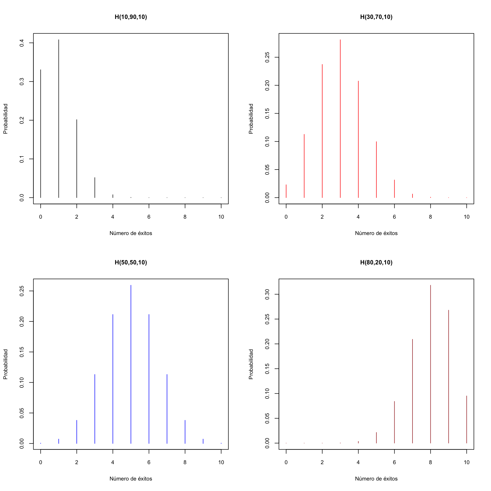

\BeginKnitrBlock{rmdnote}<div class="rmdnote">Recordad que no tiene sentido definir la moda de una variable continua $X$ como el valor $x_0$ tal que $P(X=x_0)$ sea máximo, porque $P(X=x)=0$ para todo $x\in \mathbb{R}$. Se define entonces la **moda** de una variable continua $X$ como el valor (o los valores) $x_0$ tal  que $f_X(x_0)$ es máximo. Como  $f_X(x_0)$ mide, como hemos visto, la probabilidad de que $X$ valga aproximadamente $x_0$, tenemos que la moda de $X$ es el valor cerca del cual es más probable que caiga el valor de $X$.</div>\EndKnitrBlock{rmdnote}

En particular, si $Z$ es $N(0,1)$, entonces $f_Z$ es simétrica alrededor de 0, es decir, $f_{Z}(-x)=f_{Z}(x)$, y la moda de $Z$ es $x=0$

Recordad que la función de distribución de una variable aleatoria continua $X$,
$$
F_X(x)=P(X\leq x)
$$ 
es el área comprendida entre la densidad $y=f_X(x)$ y el eje de abscisas a la izquierda de $x$.

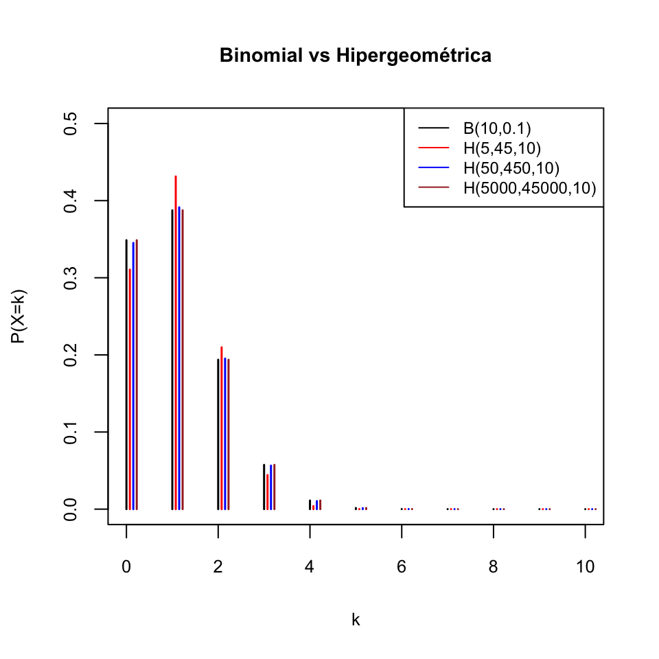

Entonces, la simetría de $f_X$ hace que, para todo $x\geq 0$, las áreas a la izquierda de $\mu-x$ y a la derecha de $\mu+x$ sean iguales.


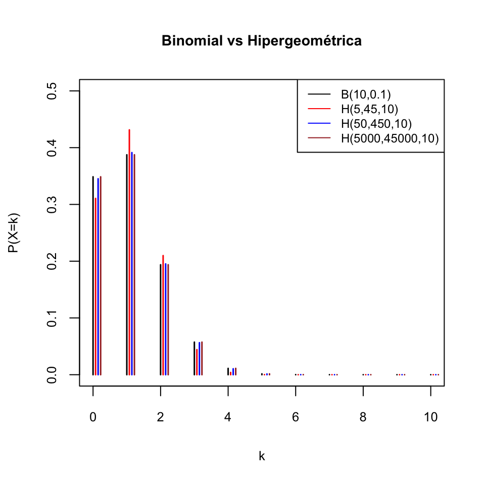

Es decir,
$$
P(X\leq \mu-x)=P(X\geq \mu+x)=1-P(X\leq \mu+x)
$$

En particular (tomando $x=0$)
$$
P(X\leq \mu)=1-P(X\leq \mu)\Rightarrow P(X\leq \mu)=0.5
$$
y por lo tanto, $\mu$ es también la **mediana** de $X$.

\BeginKnitrBlock{rmdimportant}<div class="rmdimportant">Si $X$ es $N(\mu,\sigma)$, $\mu$ es la media, la mediana y la moda de $X$.</div>\EndKnitrBlock{rmdimportant}

En el caso concreto de la normal estándar $Z$, para cualquier $z\geq 0$ se tiene que las áreas a la izquierda de $-z$ y a la derecha de $z$ son iguales
$$
P(Z\leq -z)=P(Z\geq z)=1-P(Z\leq z)
$$
 y la mediana de $Z$ es 0.


\BeginKnitrBlock{rmdnote}<div class="rmdnote">En el Ejemplo \@ref(exm:exhiperhipo) hemos trabajado más de lo necesario: por la simetría, el 0.95-cuantil ha de estar a la misma distancia de $\mu$ que el 0.05-cuantil, pero a la derecha. Es decir, como $\mu=124$ y el 0.05-cuantil había sido 101.4655, el 0.95-cuantil ha de ser el valor a la derecha de 124 y a la misma distancia de este que 101.4655:
$$
124+(124-101.4655)=126.5345
$$
Lo mismo pasa con el 0.9-cuantil y el 0.1-cuantil, comprobadlo.</div>\EndKnitrBlock{rmdnote}


Si $\mu$ crece, desplaza a la derecha el máximo de la densidad, y con él toda la curva.


Si $\sigma$ crece, la curva se aplana: al aumentar la desviación típica, los valores se alejan más del valor medio. 


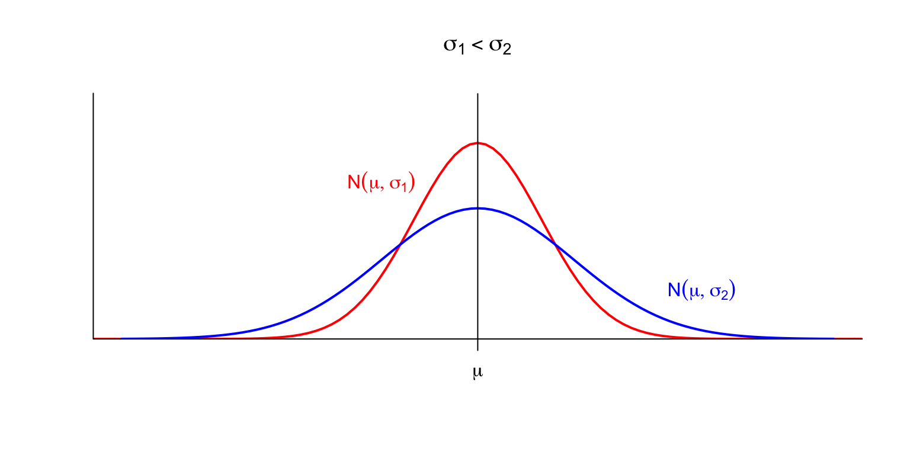

El gráfico siguiente muestra el efecto combinado:

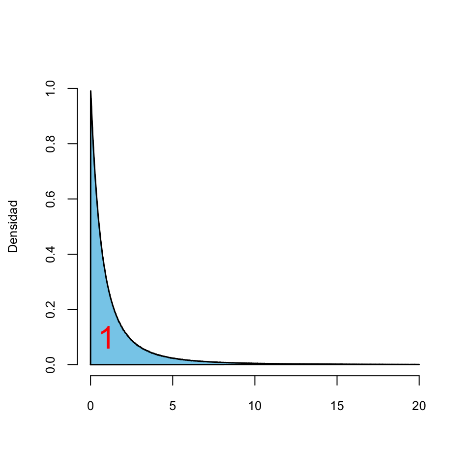

Denotaremos por $z_q$ el **$q$-cuantil** de una variable normal estándar $Z$. Es decir, $z_q$ es el valor tal que $P(Z\leq z_q)=q$. 

Aparte del hecho que $z_{0.5}=0$ (la mediana de $Z$ es 0), hay dos cuantiles más de la normal estándar $Z$ que tendríais que recordar:

* $z_{0.95}=1.64$; es decir, $P(Z\leq 1.64)=0.95$ y por lo tanto $P(Z\leq -1.64)=P(Z\geq 1.64)=0.05$ y
$$
P(-1.64\leq Z\leq 1.64)=0.9.
$$


* $z_{0.975}=1.96$; es decir, $P(Z\leq 1.96)=0.975$ y por lo tanto $P(Z\leq -1.96)=P(Z\geq 1.96)=0.025$ y
$$
P(-1.96\leq Z\leq 1.96)=0.95.
$$

\BeginKnitrBlock{rmdmercifulgod}<div class="rmdmercifulgod">Muy a menudo el valor 1.96 de $z_{0.975}$ se aproxima por 2. Tenéis permiso para hacerlo cuando no dispongáis de medios (R, aplis de móvil) para calcular cuantiles; por ejemplo, en un examen. Pero solo en este caso.</div>\EndKnitrBlock{rmdmercifulgod}


\BeginKnitrBlock{example}<div class="example"><span class="example" id="exm:unnamed-chunk-387"><strong>(\#exm:unnamed-chunk-387) </strong></span>Supongamos que la concentración de un cierto metabolito es una variable aleatoria de distribución normal, pero cuyos parámetros $\mu$ y $\sigma$ dependen de si la medimos en personas sanas o en personas con una cierta enfermedad. Sean:
  
</div>\EndKnitrBlock{example}
  
* $X_E$ la variable aleatoria "Mido la concentración de este metabolito en una persona enferma", y supongamos que es $N(\mu_E, \sigma_E)$.

* $X_S$ la variable aleatoria "Mido la concentración de este metabolito en una persona sana", y supongamos que es $N(\mu_S, \sigma_S)$.

* Supongamos, para fijar ideas, que $\mu_E>\mu_S$: la concentración media de este metabolito en los enfermos es más alta que en las personas sanas.


Podríamos usar como prueba diagnóstica de la enfermedad la concentración del metabolito. Para cada valor de referencia  $x_0$, nuestra prueba dará:

* **Positivo**, si la concentración es mayor o igual que $x_0$.

* **Negativo**, si la concentración es menor que $x_0$.

Entonces:

* La **sensibilidad** de esta prueba es
$$
P(+|E)  =P(X_E\geq x_0)=1-P(X_E< x_0)=1-F_{X_E}(x_0)
$$

* Su **especificidad**  es
$$
P(-|S)=P(X_S< x_0)=F_{X_S}(x_0)
$$

* Su **tasa de falsos positivos** es
$$
P(+|S)=P(X_S\geq  x_0)=1-F_{X_S}(x_0)
$$


Al variar $x_0$, tenemos valores diferentes de la sensibilidad y la tasa de falsos positivos. Entonces, podemos dibujar su curva ROC y escoger el umbral con algún criterio o valorar su capacidad diagnóstica global con su AUC.

Por ejemplo, imaginad que la densidad de $X_E$ es la línea discontinua del gráfico de la izquierda de la figura siguiente y la de $X_S$ la línea continua. Ambas son normales y $\mu_E>\mu_S$, porque el pico de la densidad de $X_E$ está a la derecha del de $X_S$.

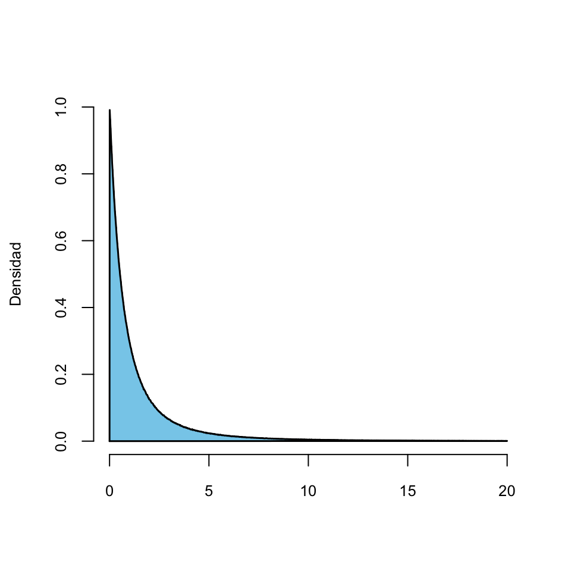

Si para cada $x$ dibujamos los puntos $(1-F_{X_S}(x),1-F_{X_E}(x))$, obtenemos la curva ROC de la derecha de dicha figura.


Una de las propiedades de la distribución normal que nos facilitan mucho la vida es que **toda combinación lineal de variables aleatorias normales independientes es normal**. En concreto, tenemos los resultados siguientes:

\BeginKnitrBlock{theorem}<div class="theorem"><span class="theorem" id="thm:comblinnormals"><strong>(\#thm:comblinnormals) </strong></span>Sea $X$ una variable $N(\mu,\sigma)$.

1. Para todos $a,b\in \mathbb{R}$, $aX+b$ es $N(a\mu+b,|a|\cdot\sigma)$.

2. En particular, la **tipificada** de $X$
$$
Z=\dfrac{X-\mu}{\sigma}
$$
es $N(0,1)$.</div>\EndKnitrBlock{theorem}

Más en general:

\BeginKnitrBlock{theorem}<div class="theorem"><span class="theorem" id="thm:comblinnormals2"><strong>(\#thm:comblinnormals2) </strong></span>Si $X_1,\ldots,X_n$ son variables aleatorias normales **independientes** y $a_1,\ldots,a_n,b\in \mathbb{R}$, entonces
$a_1X_1+\cdots +a_nX_n+b$ es $N(\mu,\sigma)$ con
$$
\mu=a_1\mu_1+\cdots +a_n\mu_n+b,\ 
\sigma=\sqrt{a_1^2\sigma^2_1+\cdots +a_n^2\sigma^2_n}
$$</div>\EndKnitrBlock{theorem}


\BeginKnitrBlock{rmdnote}<div class="rmdnote">Que toda combinación lineal de variables normales vuelva a ser del mismo tipo, es decir, normal, es una propiedad muy útil de las variables normales que pocas familias de distribuciones comparten. Por ejemplo, si $X$ es una variable binomial $B(n,p)$ con $p\neq 0$, la variable $2X$ no es binomial, porque solo toma valores pares, mientras que una variable binomial $B(m,q)$ ha de poder tomar todos los valores entre 0 y $m$.</div>\EndKnitrBlock{rmdnote}


Las probabilidades de la normal tipificada determinan las de la normal original, porque si  $X$ es $N(\mu,\sigma)$:
$$
\begin{array}{rl}
P(a\leq X\leq b)\!\!\!\!\! & \displaystyle  =P\Big( \frac{a-\mu}{\sigma}\leq \frac{X-\mu}{\sigma}\leq \frac{b-\mu}{\sigma}\Big)\\ & \displaystyle =P\Big(\frac{a-\mu}{\sigma}\leq Z\leq \frac{b-\mu}{\sigma}\Big)
\end{array}
$$
Esto sirve para deducir fórmulas, y vuestros padres lo usaban para calcular probabilidades (con tablas de probabilidades de la normal estándar); ahora es más cómodo usar una aplicación del móvil.


### Intervalos de referencia 


Un **intervalo de referencia** del $100q\%$ para una variable aleatoria $X$ es un intervalo $[a,b]$ tal que 
$$
P(a\leq X\leq b)=q.
$$
Es decir, un intervalo de referencia del $100q\%$ para $X$ es un intervalo que contiene los valores de $X$ del $100q\%$ de los sujetos de la población.

Por ejemplo, hemos visto en la sección anterior que [-1.64,1.64] y [-1.96,1.96] son intervalos de referencia del 90% y del 95%, respectivamente, para una variable normal estándar $Z$.

Los más comunes son los intervalos de referencia del 95% ($q=0.95$), que satisfacen que
$$
P(a\leq X\leq b)=0.95
$$
y son los, que por ejemplo, os dan como valores de referencia en las analíticas:

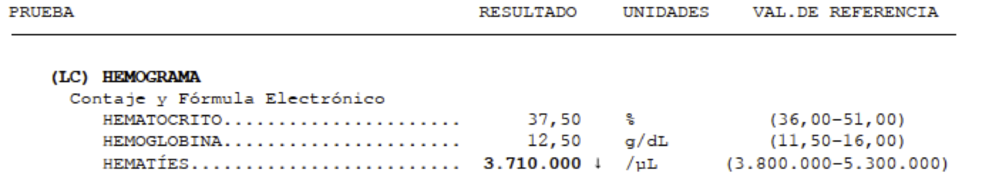

\BeginKnitrBlock{rmdnote}<div class="rmdnote">Cuando se habla de un **intervalo de referencia** sin dar la probabilidad, se sobreentiende siempre que es el intervalo de referencia del 95%.</div>\EndKnitrBlock{rmdnote}


Cuando $X$ es $N(\mu,\sigma)$, estos intervalos de referencia se toman siempre **centrados en la media** $\mu$, es decir, de la forma $[\mu-\text{algo},\mu+\text{algo}]$. Para calcularlos fácilmente, podemos usar el resultado siguiente:

\BeginKnitrBlock{theorem}<div class="theorem"><span class="theorem" id="thm:unnamed-chunk-392"><strong>(\#thm:unnamed-chunk-392) </strong></span>Si $X$ es $N(\mu,\sigma)$, un intervalo de referencia del $100q\%$ para $X$ es
$$
[\mu- z_{(1+q)/2}\cdot \sigma, \mu+ z_{(1+q)/2}\cdot \sigma]
$$
donde  $z_{(1+q)/2}$ denota el $(1+q)/2$-cuantil de la normal estándar $Z$. Normalmente  escribiremos este intervalo como
$$
\mu\pm z_{(1+q)/2}\cdot \sigma.
$$
</div>\EndKnitrBlock{theorem}


\BeginKnitrBlock{rmdcorbes}<div class="rmdcorbes">En efecto:
$$
\begin{array}{l}
P(\mu-x\leq X\leq \mu+x)=q\\
\qquad \Longleftrightarrow \displaystyle P\Big(\frac{\mu-x-\mu}{\sigma}\leq \frac{X-\mu}{\sigma}\leq \frac{\mu+x-\mu}{\sigma}\Big)=q\\
\qquad \Longleftrightarrow \displaystyle P(-x/{\sigma}\leq Z\leq {x}/{\sigma})=q\\
\qquad \Longleftrightarrow \displaystyle P(Z\leq {x}/{\sigma})-P(Z\leq -{x}/{\sigma})=q\\
\qquad \Longleftrightarrow \displaystyle P(Z\leq {x}/{\sigma})-(1-P(Z\leq {x}/{\sigma}))=q\\
\qquad \text{(por la simetría de $f_Z$ alrededor de 0)}\\
\qquad \Longleftrightarrow \displaystyle 2P(Z\leq {x}/{\sigma})=q+1\\
\qquad \Longleftrightarrow P(Z\leq {x}/{\sigma})=(1+q)/2\\
\qquad \Longleftrightarrow x/\sigma=
z_{(1+q)/2}\\
\qquad \Longleftrightarrow x=z_{(1+q)/2}\cdot \sigma
\end{array}
$$
</div>\EndKnitrBlock{rmdcorbes}


Si $q=0.95$, entonces $(1+q)/2=0.975$ y $z_{0.975}=1.96$. Por lo tanto, el intervalo de referencia del 95% para una variable $X$ normal $N(\mu,\sigma)$ es
$$
\mu\pm 1.96\sigma.
$$
Y como este 1.96  a menudo se aproxima por 2, el intervalo de referencia del 95% se simplifica a
$$
\mu\pm 2\sigma.
$$
Esto dice, básicamente, que

> si una población sigue una distribución normal $N(\mu,\sigma)$, un 95% de sus individuos tienen su valor de $X$ a distancia como máximo $2\sigma$ ("a dos sigmas") de $\mu$.


\BeginKnitrBlock{example}<div class="example"><span class="example" id="exm:unnamed-chunk-394"><strong>(\#exm:unnamed-chunk-394) </strong></span>Según la OMS, las alturas (en cm) de las mujeres europeas de 18 años siguen una ley $N(163.1,18.53)$. ¿Cuál es el intervalo de alturas centrado en la media que contiene a la mitad las europeas de 18 años?
    
</div>\EndKnitrBlock{example}
    
Fijaos en que, si llamamos $X$ a la variable aleatoria "Altura de una mujer europea de 18 años en cm", lo que queremos saber es el intervalo centrado en su media, 163.1, tal que la probabilidad de que la altura de una europea de 18 años escogida al azar pertenezca a este intervalo sea 0.5. Es decir, el intervalo de referencia del 50% para $X$.

Nos dicen que $X$ es $N(163.1,18.53)$. Si $q=0.5$, entonces $(1+q)/2=0.75$ y podemos calcular con R o una aplicación el 0.75-cuantil $z_{0.75}$ de una normal estándar. Da $z_{0.75}=0.6745$.


Por lo tanto, es el intervalo $163.1\pm 0.6745\cdot 18.53$, es decir, redondeando a mm, $[150.6, 175.6]$. Esto nos dice que la mitad de las mujeres europeas de 18 años miden entre  150.6 y 175.6.


El **z-score** (**z-valor**, **z-puntuación**, **z-puntaje**...) de un valor $x_0\in \mathbb{R}$ respecto de una distribución $N(\mu,\sigma)$ es
$$
\frac{x_0-\mu}{\sigma}
$$

Es decir, el z-score de $x_0$ es el resultado de "tipificar" $x_0$ en el sentido del Teorema \@ref(thm:comblinnormals).2.

Si la variable poblacional es normal, cuanto mayor es el valor absoluto del z-score de $x_0$, más "raro" es $x_0$; el signo nos dice si es más grande o más pequeño que el valor esperado $\mu$.

\BeginKnitrBlock{example}<div class="example"><span class="example" id="exm:unnamed-chunk-395"><strong>(\#exm:unnamed-chunk-395) </strong></span>Recordad que, según la OMS, las alturas de las mujeres europeas de 18 años siguen una ley $N(163.1,18.53)$. ¿Cuál sería el z-score de una jugadora de baloncesto de 18 años que midiera 191 cm?
</div>\EndKnitrBlock{example}

Sería
$$ 
\frac{191-163.1}{18.53}=1.5
$$

Esto se suele leer diciendo que la altura de esta jugadora está *1.5 sigmas por encima de la altura media*.


## Test

**(1)** Sea $X$ una variable aleatoria continua de función de densidad:
$$
f_X(x)=\left\{\begin{array}{ll}
0 & \mbox{si $x<0$}\\
\frac{2\sqrt{2}}{\sqrt{\pi}} e^{-2x^2} & \mbox{si $x\geq 0$}
\end{array}
\right.
$$
¿Es cierto que $P(X=1)=2\sqrt{2}e^{-2}/\sqrt{\pi}$?

1. Sí
2. No: en realidad $P(X=1)=\int_{-\infty}^1 \frac{2\sqrt{2}}{\sqrt{\pi}} e^{-2x^2}\,dx$ pero no sé calcular esta integral, o sí sé calcularla, pero me da pereza hacerlo.
3. Esto no es la función de densidad de una variable aleatoria continua, porque no es una función continua (en el 0 salta de 0 a $2\sqrt{2}/\sqrt{\pi}$)
4. Todas las otras respuestas son incorrectas 

**(2)** $X$ una variable aleatoria continua de media $\mu$. ¿Qué vale $P(X=\mu)$? 

1. 0.5
1. $\mu$
1. 0 
1. Depende de la variable aleatoria
1. Todas las otras respuestas son falsas 

**(3)** $X$ una variable aleatoria continua de moda $M$. ¿Qué vale $P(X=M)$? 

1. 1
1. 0.5
1. 0 
1. Depende de la variable aleatoria, pero es el valor máximo de $P(X=x)$
1. Depende de la variable aleatoria, pero es el valor máximo de la función de densidad de $X$.
1. Todas las otras respuestas son falsas 


**(4)** En una variable aleatoria discreta, su función de densidad  (marca una única respuesta):

1. Es tal que su integral desde $-\infty$ es la función de distribución.
1. Mide lo denso que es su dominio.
1. Aplicada a un par de números reales, nos da la probabilidad de obtener valores dentro del intervalo definido por dichos números.
1. Aplicada a un número real, nos da da la probabilidad de obtener dicho número. 
1. Aplicada a un número real, nos da la probabilidad de obtener un valor menor o igual que dicho número.

**(5)** Sea $Z$ una variable aleatoria normal estándar. Marca las afirmaciones verdaderas.

1. Es asimétrica a la izquierda. 
1. Su media es 1. 
1. Su desviación típica es 0. 
1. Su varianza es 1. 
1. Su mediana es 0. 


**(6)** Sea $X$ una variable aleatoria $N(\mu,\sigma)$ y $f_X$ su función de densidad. ¿Qué vale el área entre la curva $y=f_X(x)$ y el eje de abscisas?

1. 0 
1. $\mu$
1. $\sigma$
1. 1  
1. Todas las otras respuestas son falsas

**(7)** Sea $X$ una variable aleatoria $N(\mu,\sigma)$ y $f_X$ su función de densidad. ¿Cuál de las afirmaciones siguientes es correcta?

1. $\mu$ es la media de $X$, pero no su mediana 
1. $\mu$ es la media y la mediana de $X$, pero no su moda
1. $\mu$ es la media, la mediana y la moda de $X$, pero no es verdad que $P(X=\mu)>P(X=a)$ para todo $a\neq \mu$  
1. $\mu$ es la media, la mediana y la moda de $X$ y $P(X=\mu)>P(X=a)$ para todo $a\neq \mu$


**(8)** ¿Qué distribución es la más adecuada para modelar el número anual de fallecimientos entre enfermos de cáncer tratados con una determinada quimioterapia? Marca una única respuesta.

1. Normal
1. Binomial
1. Poisson 
1. Uniforme acotada (todos los números de fallecimientos entre 0 y el número $N$ de enfermos de cáncer tratados con esta quimioterapia tienen la misma probabilidad)


**(9)** El FME (Flujo Máximo de Expiración) de las chicas de 11 años sigue una distribución aproximadamente normal de  media 300 l/min y desviación típica 20 l/min. Marca las afirmaciones verdaderas:

1. Aproximadamente la mitad de las chicas de 11 años tienen un FME entre 280 l/min y 320 l/min. 
1. Alrededor del 95% de las chicas de 11 años tienen un FME entre 280 l/min y 320 l/min. 
1. Alrededor del 95% de las chicas de 11 años tienen un FME entre 260 l/min y 340 l/min. 
1. Alrededor del 5% de las chicas de 11 años tienen un FME inferior a 260 l/min. 
1. Ninguna chica de 11 años tiene FME superior a 360 l/min. 


**(10)** En una muestra aleatoria extraída de población sana se encuentra que una variable bioquímica tiene como media 90 y desviación típica 10. Si tomamos una muestra de individuos sanos ¿es razonable esperar que aproximadamente el 95% de ellos tengan un valor de esa variable comprendido entre 70 y 110? (marca todas las respuestas correctas):

1. Sí, siempre. 
1. No, nunca.
1. Si la variable tiene distribución normal, entonces sí.
1. Si la muestra es suficientemente grande, entonces sí.
1. Si la variable tiene distribución normal y la muestra es suficientemente grande, entonces sí. 


<!--chapter:end:32-VarAlCont.Rmd-->

# Distribuciones muestrales

## Estimadores

En un problema típico de **estadística inferencial**:

* Queremos conocer el valor de una característica en el total de una población, pero no podemos medir esta característica en **todos** los individuos de la población.

* Entonces, extraemos una muestra de la población, medimos la característica en los individuos de esta muestra, calculamos algo con los datos obtenidos e **inferimos** el valor de la característica en el global de la población.

Inmediatamente surgen varias preguntas, que responderemos entre esta lección y la próxima:

* ¿Cómo tiene que ser la muestra?
* ¿Qué tenemos que calcular?
* ¿Con qué precisión podemos inferir la característica de la población?

¿Qué tipo de muestra tenemos que tomar? Vamos a suponer de ahora en adelante que tomamos **muestras aleatorias simples**. Esto incluye las muestras aleatorias sin reposición si la población es mucho más grande que la muestra, ya que entonces no hay diferencia práctica entre permitir y prohibir las repeticiones. En algunos casos muy concretos permitiremos muestras aleatorias sin reposición en general.

\BeginKnitrBlock{rmdromans}<div class="rmdromans">Sí, ya sabemos que en la práctica casi nunca tomamos muestras aleatorias, sino oportunistas. En este caso, recordad lo que os explicábamos en la Sección \@ref(sec:oport). Lo que hay que hacer es describir en detalle las características de la muestra para justificar que, pese a no ser aleatoria, es razonablemente representativa de la población y podría pasar por  aleatoria.</div>\EndKnitrBlock{rmdromans}


¿Qué calculamos? Pues un **estimador**: alguna función adecuada aplicada a los valores de la muestra, y que dependerá de lo que queramos estimar.  Por ejemplo:

* Si queremos estimar la altura media de los estudiantes de la UIB, tomaremos una muestra aleatoria de estudiantes de la UIB, mediremos sus alturas y calcularemos su **media aritmética**.

* Si queremos estimar la proporción de estudiantes de la UIB que han pasado la COVID-19, tomaremos una muestra aleatoria de estudiantes de la UIB, les haremos un test de anticuerpos y calcularemos la **proporción muestral** de positivos en la muestra.

* Si queremos estimar el riesgo relativo para un estudiante de la UIB de suspender alguna asignatura si es fumador, tomaremos una muestra aleatoria de estudiantes de la UIB, anotaremos si fuman o no y si han suspendido alguna asignatura o no, y calcularemos el **cociente entre las proporciones muestrales** de suspensos entre los fumadores y los   no fumadores de la muestra.

\BeginKnitrBlock{rmdimportant}<div class="rmdimportant">**Un estimador es una variable aleatoria**, definida sobre la población formada por las muestras de la población de partida. Por lo tanto, tiene función de densidad, función de distribución (que genéricamente llamaremos **distribución muestral**, para indicar que mide la probabilidad de que le pase algo al valor del **estimador sobre una muestra**), esperanza, desviación típica, etc.</div>\EndKnitrBlock{rmdimportant}

## La media muestral

Cuando queremos estimar el valor medio de una variable sobre una población, tomamos una muestra de valores y calculamos su media aritmética, ¿verdad? Pues eso es la media muestral. 

Dada una variable aleatoria $X$, llamamos **media muestral de** (muestras de) **tamaño $n$** a la variable aleatoria $\overline{X}$ "Tomamos una *muestra aleatoria simple* de tamaño $n$ de $X$ y calculamos la media aritmética de sus valores".

\BeginKnitrBlock{rmdcaution}<div class="rmdcaution">Fijaos en que definimos la media muestral solo para muestras aleatorias simples. Naturalmente, tiene sentido definirla para muestras cualesquiera, pero entonces su distribución muestral dejaría de cumplir las propiedades que damos en esta sección. La misma advertencia vale a los estimadores que definimos en las próximas secciones.</div>\EndKnitrBlock{rmdcaution}

Veamos algunas propiedades de la distribución muestral de  $\overline{X}$:

\BeginKnitrBlock{theorem}<div class="theorem"><span class="theorem" id="thm:mitjmostgral"><strong>(\#thm:mitjmostgral) </strong></span>Sea $X$ una variable aleatoria cualquiera de media $\mu_X$ y desviación típica $\sigma_X$, y sea $\overline{X}$ la media muestral de tamaño $n$ de $X$. Entonces:

* $E(\overline{X})=\mu_X$

* $\sigma(\overline{X})=\dfrac{\sigma_X}{\sqrt{n}}$
</div>\EndKnitrBlock{theorem}


\BeginKnitrBlock{rmdcorbes}<div class="rmdcorbes">Formalmente, la media muestral de tamaño $n$ de una variable aleatoria $X$ se  define como la variable aleatoria 
$$
\overline{X}=\frac{X_1+\cdots+X_n}{n}
$$
donde  $X_1,\ldots,X_n$  son $n$ copias independientes de la variable $X$.

Entonces, por la linealidad de la esperanza 
$$
  E(\overline{X})=\frac{E(X_1)+\cdots+E(X_n)}{n}=\frac{n\cdot \mu_X}{n}=\mu_X
$$
porque, como $X_1,\ldots,X_n$ son copias de $X$,
$E(X_1)=\cdots=E(X_n)=\mu_X$.

Y por la linealidad de la varianza de la suma de variables **independientes**
$$
\sigma(\overline{X})^2=\frac{\sigma(X_1)^2+\cdots+\sigma(X_n)^2}{n^2}=\frac{n\cdot \sigma_X^2}{n^2}=\frac{\sigma_X^2}{n}
$$
porque, de nuevo, como $X_1,\ldots,X_n$ son copias de $X$,
$\sigma(X_1)^2=\cdots=\sigma(X_n)^2=\sigma_X^2$.
</div>\EndKnitrBlock{rmdcorbes}


Que $E(\overline{X})$ sea $\mu_X$ nos indica que $\overline{X}$ sirve para estimar $\mu_X$, porque **su valor esperado es $\mu_X$**:

> Si calculáramos muchas medias de muestras aleatorias de $X$, es muy probable que, de media, obtuviéramos un valor muy cercano a $\mu_X$.

Cuando el valor esperado de un estimador es precisamente el parámetro poblacional que se quiere estimar, se dice que el estimador es **insesgado**. Así, el primer punto del teorema anterior nos dice que la media muestral $\overline{X}$ es un estimador insesgado de la media poblacional $\mu_X$.

Que $\sigma(\overline{X})$ sea $\sigma_X/\sqrt{n}$ implica que la variabilidad de las medias muestrales crece con la variabilidad de $X$ y decrece si tomamos muestras de mayor tamaño. Esto último es razonable. Aunque la variabilidad de $X$ sea grande, si tomamos muestras grandes, es  probable que los valores extremos se compensen al calcular sus medias y éstas  tengan menos variabilidad que la variable $X$ original. 

A $\sigma_X/\sqrt{n}$ se le llama el **error típico de la media muestral** (para la variable aleatoria $X$ y muestras de tamaño $n$).


\BeginKnitrBlock{example}<div class="example"><span class="example" id="exm:simulacion1"><strong>(\#exm:simulacion1) </strong></span>Vamos a realizar un experimento. Vamos a tomar una población de 10^6^ sujetos y una variable aleatoria $X$ que sobre cada sujeto toma un valor real entre 0 y 1, todos estos valores con la misma probabilidad. Llamaremos `X` al vector con los 10^6^ valores de esta variable aleatoria, y dibujaremos un histograma de este vector de números para que veáis que los valores salen muy dispersos. Mostramos el código de R para que podáis repetir el experimento por vuestra cuenta; como es una simulación, cada vez que lo ejecutéis dará resultados diferentes, pero el mismo efecto global.
</div>\EndKnitrBlock{example}


```r
X=runif(10^6)
hist(X,freq=FALSE,main="Histograma de X",xlab="",ylab="Densidad",col="light blue")
```

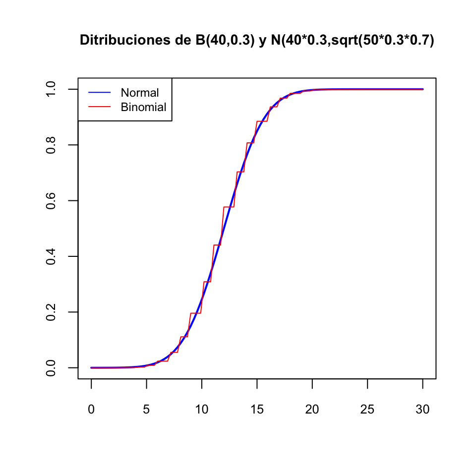

La desviación típica $\sigma_X$ de la variable $X$ sobre nuestra población es

```r
sd(X)*sqrt((10^6-1)/10^6)
```

```
## [1] 0.2884943
```

\BeginKnitrBlock{rmdnote}<div class="rmdnote">La función `sd` calcula la desviación típica muestral, con denominador $\sqrt{n-1}$. Para calcular la desviación típica de verdad, con denominador $\sqrt{n}$ hay que multiplicarla por $\sqrt{n-1}$ y dividirla por $\sqrt{n}$.</div>\EndKnitrBlock{rmdnote}

Ahora vamos a tomar 1000 medias muestrales de tamaño 100 de esta población, las organizaremos en un vector que llamaremos `Medias` y dibujaremos un histograma de este vector de medias.


```r
Medias=replicate(1000,mean(sample(X,100,replace=TRUE)))
hist(Medias, breaks=15,freq=FALSE,main="Histograma de las medias muestrales",xlab="",ylab="Densidad",col="light blue",xlim=c(0.4,0.6))
```

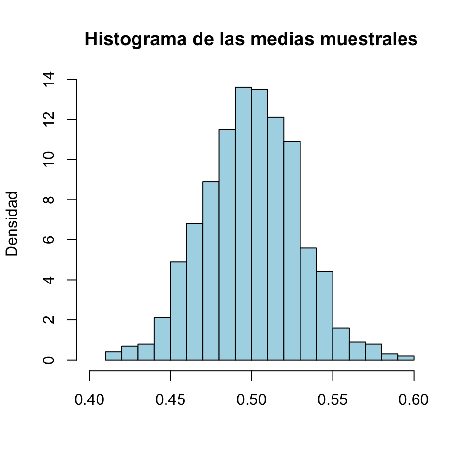

Podéis observar cómo los valores de estas medias se concentran alrededor de 0.5. Veamos su desviación típica:


```r
sd(Medias)*sqrt((1000-1)/1000)
```

```
## [1] 0.02921408
```

Fijaos cómo se acerca mucho al valor $\sigma_X/\sqrt{100}=0.0288494$ predicho por el teorema anterior. No coinciden exactamente, porque $\sigma_X/\sqrt{100}$ es el valor de la desviación típica **poblacional** de $\overline{X}$, es decir, para toda la "población" de medias muestrales de muestras aleatorias simples de tamaño 100 de nuestra población de partida, y nosotros hemos tomado una muestra de "solo" 1000 medias de estas.

La media muestral $\overline{X}$ de tamaño $n$ de una variable aleatoria $X$ se  interpreta formalmente como la variable aleatoria obtenida tomando $n$ copias independientes $X_1,\ldots,X_n$ de $X$ y calculando
$$
\overline{X}=\frac{X_1+\cdots+X_n}{n}.
$$

Por lo tanto, es una combinación lineal de $n$ copias independientes de $X$. 
Recordando que una combinación de variables aleatorias normales independientes es normal, tenemos el resultado siguiente:

\BeginKnitrBlock{theorem}<div class="theorem"><span class="theorem" id="thm:unnamed-chunk-406"><strong>(\#thm:unnamed-chunk-406) </strong></span>Si $X$ es $N(\mu_X,\sigma_X)$, entonces $\overline{X}$ es $N(\mu_X,\sigma_X/\sqrt{n})$,
y por lo tanto
$$
Z=\frac{\overline{X}-\mu_X}{\sigma_X/\sqrt{n}}
$$
es $N(0,1)$. 

  </div>\EndKnitrBlock{theorem}

Si $X$ no es normal, la tesis del teorema anterior sigue siendo cierta "aproximadamente" siempre y cuando $n$ sea grande. Este resultado, llamado el **Teorema Central del Límite** es, como su nombre indica, uno de los más importantes en estadística.

\BeginKnitrBlock{theorem}<div class="theorem"><span class="theorem" id="thm:unnamed-chunk-407"><strong>(\#thm:unnamed-chunk-407) </strong></span>Sea $X$ una variable aleatoria **cualquiera** de esperanza $\mu_X$ y desviación típica $\sigma_X$. Si $n$ es **suficientemente grande**,
$\overline{X}$ es **aproximadamente** $N(\mu_X, {\sigma_X}/{\sqrt{n}})$
y por lo tanto
$$
Z=\frac{\overline{X}-\mu_X}{{\sigma_X}/{\sqrt{n}}}
$$
es aproximadamente $N(0,1)$.  

  </div>\EndKnitrBlock{theorem}

Dos observaciones:

* ¿Cuándo una muestra es lo suficientemente grande como para poder invocar el Teorema Central del Límite? En realidad, depende de la $X$. Cuánto más se parezca $X$ a una variable normal, más pequeñas pueden ser la muestras. Por fijar un valor, aceptaremos que "suficientemente grande" es $n\geq 40$.

* ¿Qué quiere decir que una variable aleatoria sea "aproximadamente" normal? Pues que su función de distribución $F_X$ toma valores muy cercanos a la función de distribución de una normal. Recordad cómo una $B(n,p)$ con $n$ grande era "aproximadamente normal" en la lección anterior.

\BeginKnitrBlock{rmdnote}<div class="rmdnote">Si miráis el histograma de las 1000 medias muestrales del Ejemplo \@ref(exm:simulacion1), veréis que se parece al de una muestra de una variable normal. Es que $\overline{X}$ es aproximadamente normal, por el Teorema Central del Límite, aunque la variable $X$ sea muy diferente de una normal. Para verlo, en la figura que sigue superponemos al histograma de las medias la gráfica de la densidad de una variable normal de media y desviación típica las predichas por el Teorema Central del Límite.</div>\EndKnitrBlock{rmdnote}

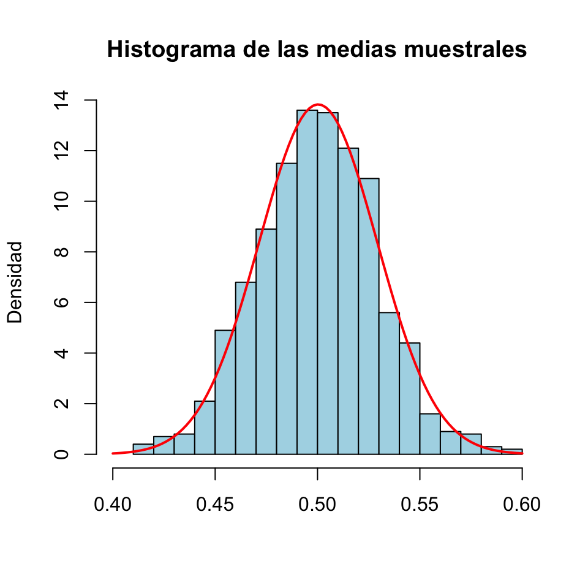


\BeginKnitrBlock{rmdrecordau}<div class="rmdrecordau">En resumen:

* Si $X$ es normal, $\overline{X}$ es $N(\mu_X,{\sigma_X}/{\sqrt{n}})$.

* Si $X$ no es normal pero $n$ es grande (pongamos $n\geq 40$, aunque puede ser menor si $X$ se parece a una normal y seguramente tendrá que ser mayor si $X$ es muy diferente de una normal),  $\overline{X}$ es *aproximadamente* $N(\mu_X,{\sigma_X}/{\sqrt{n}})$.
</div>\EndKnitrBlock{rmdrecordau}

\BeginKnitrBlock{rmdcaution}<div class="rmdcaution">Las afirmaciones del bloque anterior son verdaderas para medias muestrales de muestras aleatorias simples. Si la muestra que usemos no podemos suponer que sea aleatoria simple, ninguno de los dos resultados es válido. </div>\EndKnitrBlock{rmdcaution}

## La proporción muestral

Cuando queremos estimar la proporción de sujetos de una población que tienen una determinada característica, tomamos una muestra y calculamos la proporción de sujetos de la muestra con esta característica. Esta será la **proporción muestral** de sujetos  con esta característica en nuestra muestra.

Dada una variable aleatoria $X$  de Bernoulli $Be(p_X)$, la **proporción muestral de** (muestras de) **tamaño $n$**,  $\widehat{p}_X$, es la variable aleatoria consistente en tomar una muestra aleatoria de tamaño $n$ de $X$ y calcular la proporción de éxitos en la muestra: es decir, contar el número total de éxitos  y dividir el resultado por $n$.

Fijaos en que $\widehat{p}_X$ es un caso particular de media muestral $\overline{X}$: estamos calculando medias muestrales de muestras aleatorias simples de la variable de Bernoulli $X$. Por lo tanto, todo lo que hemos dicho  para medias muestrales vale también para proporciones muestrales:

\BeginKnitrBlock{theorem}<div class="theorem"><span class="theorem" id="thm:unnamed-chunk-412"><strong>(\#thm:unnamed-chunk-412) </strong></span>Si $X$ es una variable aleatoria de Bernoulli con probabilidad poblacional de éxito $p_X$ y  $\widehat{p}_X$ es la proporción muestral de tamaño $n$:
    
* $E(\widehat{p}_X)=p_X$

*  $\sigma({\widehat{p}_X})=\sqrt{\dfrac{p_X(1-p_X)}{n}}$

</div>\EndKnitrBlock{theorem}


$E(\widehat{p}_X)=p_X$ nos dice que $\widehat{p}_X$ es un estimador insesgado de $p_X$. Si calculáramos muchas proporciones muestrales de muestras aleatorias de $X$, es muy probable que, de media, obtuviéramos un valor muy cercano a  la proporción poblacional de éxitos $p_X$. 

$\sigma({\widehat{p}_X})=\sqrt{\dfrac{p_X(1-p_X)}{n}}$ nos dice que, fijada la variable $X$, si tomamos muestras de tamaño mayor, la variabilidad de los resultados de $\widehat{p}_X$ disminuye.
    
\BeginKnitrBlock{rmdimportant}<div class="rmdimportant">En el caso de la proporción muestral, a veces vamos a permitir tomar **muestras aleatorias sin reposición**. En este caso, seguimos teniendo que $E(\widehat{p}_X)=p_X$, pero ahora,
si $N$ es el tamaño de la población, 
$$
\sigma({\widehat{p}_X})=\sqrt{\frac{p_X(1-p_X)}{n}}\cdot
\sqrt{\frac{\vphantom{(p_X}N-n}{N-1}}.
$$
El factor
$$
\sqrt{\frac{N-n}{N-1}}
$$ 
que transforma $\sigma({\widehat{p}_X})$ para muestras aleatorias simples en la desviación típica de ${\widehat{p}_X}$ para muestras aleatorias sin reposición es el **factor de población finita**  que transformaba la desviación típica de una variable binomial (que cuenta éxitos en muestras aleatorias simples) en la desviación típica de una variable hipergeométrica  (que cuenta éxitos en muestras aleatorias sin reposición).</div>\EndKnitrBlock{rmdimportant}

\BeginKnitrBlock{rmdrecordau}<div class="rmdrecordau">Y recordad que si el tamaño de la población $N$ es muy grande comparado con $n$, podemos suponer que una muestra aleatoria sin reposición es simple.</div>\EndKnitrBlock{rmdrecordau}
    
 
 
Si tomamos muestras aleatorias simples de tamaño $n$ de una variable aleatoria Bernoulli $X$:

* $\sqrt{\dfrac{p_X(1-p_X)}{n}}$ es el **error típico** de la variable aleatoria $\widehat{p}_X$: su desviación típica.

* Para cada muestra, $\sqrt{\dfrac{\widehat{p}_X(1-\widehat{p}_X)}{n}}$ es el **error típico** de la muestra, que estima el error típico de $\widehat{p}_X$.


Y como la proporción muestral es un caso particular de media muestral, por el Teorema Central del Límite tenemos el resultado siguiente:

\BeginKnitrBlock{theorem}<div class="theorem"><span class="theorem" id="thm:unnamed-chunk-415"><strong>(\#thm:unnamed-chunk-415) </strong></span>Si $n$ es grande y las muestras aleatorias  son simples, 
$\widehat{p}_X$ es aproximadamente  $N\big (p_X,\sqrt{{p_X(1-p_X)}/{n}}\big)$
y por lo tanto
$$
\frac{\widehat{p}_X-p_X}{\sqrt{\frac{{p}_X(1-{p}_X)}{n}}}
$$
es aproximadamente $N(0,1)$.
</div>\EndKnitrBlock{theorem}

## La varianza muestral

Dada una variable aleatoria $X$, llamamos:

* **Varianza muestral de** (muestras de) **tamaño $n$**, $\widetilde{S}_{X}^2$, a la variable aleatoria consistente en tomar una muestra aleatoria simple de tamaño $n$ de $X$ y calcular la varianza muestral de sus valores.

* **Desviación típica muestral de** (muestras de) **tamaño $n$**, $\widetilde{S}_{X}$, a la variable aleatoria consistente en tomar una muestra aleatoria simple de tamaño $n$ de $X$ y calcular la desviación típica muestral de sus valores.


Formalmente, estas variables se definen tomando $n$ copias independientes $X_1,\ldots,X_n$ de $X$ y calculando
$$
\widetilde{S}_{X}^2=\frac{\sum_{i=1}^n (X_{i}-\overline{X})^2}{n-1},\quad 
\widetilde{S}_{X}=+\sqrt{\widetilde{S}_{X}^2}
$$

Tenemos los dos resultados siguientes. El primero nos dice que $\widetilde{S}_{X}^2$ es un estimador insesgado de la varianza poblacional $\sigma_{X}^2$.

\BeginKnitrBlock{theorem}<div class="theorem"><span class="theorem" id="thm:unnamed-chunk-416"><strong>(\#thm:unnamed-chunk-416) </strong></span>$E(\widetilde{S}_{X}^2)=\sigma_{X}^2$.

</div>\EndKnitrBlock{theorem}

Por lo tanto, **esperamos** que la varianza muestral de una muestra aleatoria simple de $X$ valga $\sigma_{X}^2$, en el sentido usual de que si tomamos muestras aleatorias simples de $X$ de tamaño $n$ grande y calculamos sus varianzas muestrales, muy probablemente obtengamos de media un valor muy cercano a $\sigma_{X}^2$.

\BeginKnitrBlock{rmdcaution}<div class="rmdcaution">Y por lo tanto **no esperamos** que la varianza "a secas" de una muestra aleatoria simple valga $\sigma_{X}^2$, porque la varianza muestral y la varianza "a secas" dan valores diferentes (tienen el mismo numerador y denominadores diferentes).</div>\EndKnitrBlock{rmdcaution}

El segundo resultado nos dice que si la variable $X$ es **normal**, un  múltiplo adecuado de $\widetilde{S}_{X}^2$ tiene  distribución muestral conocida, lo que nos permitirá calcular probabilidades de sucesos relativos a  $\widetilde{S}_{X}^2$.


\BeginKnitrBlock{theorem}<div class="theorem"><span class="theorem" id="thm:khi2"><strong>(\#thm:khi2) </strong></span>Si $X$ es $N(\mu_X,\sigma_X)$ y tomamos muestras de tamaño $n$, la variable aleatoria 
$$
\chi^2=  \dfrac{(n-1)\widetilde{S}_{X}^2}{\sigma_{X}^2}
$$ 
tiene una distribución conocida, llamada **ji cuadrado con $n-1$ grados de libertad**, $\chi_{n-1}^2$.

</div>\EndKnitrBlock{theorem}

\BeginKnitrBlock{rmdrecordau}<div class="rmdrecordau">La letra griega $\chi$  en castellano se lee **ji**; en catalán, **khi**;  en inglés, **chi**, pronunciado "xai".</div>\EndKnitrBlock{rmdrecordau}


La distribución $\chi_\nu^2$, donde $\nu$ es un parámetro llamado sus **grados de libertad**, es la distribución de probabilidad de la suma de los cuadrados de $\nu$ variables aleatorias normales estándar independientes. Para R es `chisq`. Os puede interesar recordar que una variable $\chi_\nu^2$ de tipo ji cuadrado con $\nu$ grados de libertad:

* Tiene valor esperado $E(\chi_\nu^2)=\nu$ y  varianza  $\sigma(\chi_\nu^2)^2=2 \nu$.

* Su función de distribución es estrictamente creciente.

* Tiene una distribución asimétrica a la derecha, como muestra el gráfico siguiente:

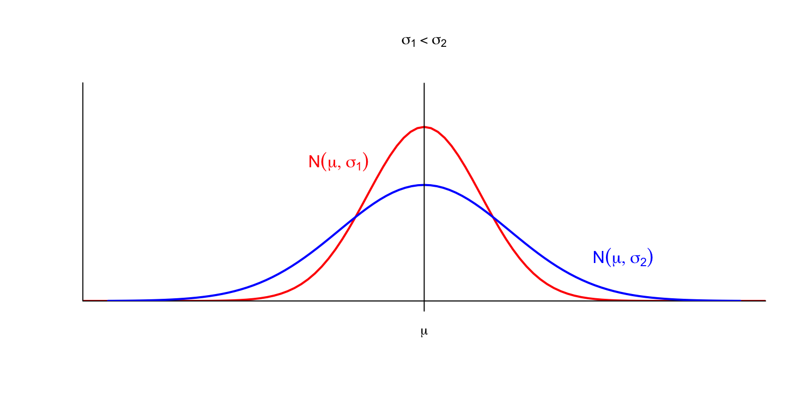

A medida que el número de grados de libertad $\nu$ crece, la asimetría tiende a desaparecer y, por el Teorema Central del Límite, si $\nu$ es lo bastante grande, la distribución $\chi_\nu^2$ se aproxima a la de una variable normal $N(\nu,\sqrt{2\nu})$.

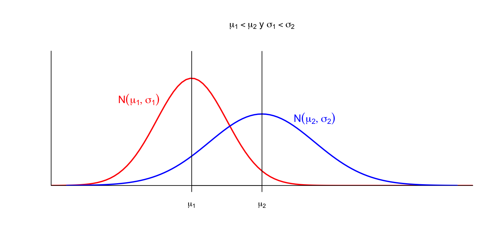

\BeginKnitrBlock{rmdcaution}<div class="rmdcaution">Tened cuidado:

* Si la variable poblacional $X$ no es normal, la conclusión del Teorema \@ref(thm:khi2) no es verdadera.

* Aunque $X$ sea normal, $E(\widetilde{S}_{X})\neq \sigma_{X}$. La desviación típica muestral es un estimador **sesgado** de $\sigma_{X}$ (pero tiene otras buenas propiedades que hacen que la usemos igualmente).

* Ya lo hemos comentado antes. Si $S^2_{X}$ es la varianza "a secas" (dividiendo por $n$ en vez de por $n-1$), $E(S^2_{X})\neq \sigma^2_{X}$. Esto lo podéis comprobar fácilmente, porque $S_X^2$ se obtiene a partir de $\widetilde{S}_{X}^2$ cambiando el denominador,
$$
  S_X^2=\frac{n-1}{n} \widetilde{S}_{X}^2
$$
y por lo tanto
$$
E(S_X^2)=\frac{n-1}{n}E(\widetilde{S}_{X}^2)=\frac{n-1}{n}\sigma^2_{X}
$$
</div>\EndKnitrBlock{rmdcaution}


## La distribución t de Student

Recordad que si la variable poblacional $X$ es $N(\mu_X,\sigma_X)$  y tomamos muestras aleatorias simples de tamaño $n$, entonces la variable
$$
\frac{\overline{X}-\mu_X}{\sigma_{X}/\sqrt{n}}
$$
es normal estándar. Desde el punto de vista teórico, para obtener fórmulas, esto será útil, pero normalmente no nos sirve para calcular la probabilidad de que a $\overline{X}$ le pase algo, porque casi nunca sabemos la desviación típica poblacional $\sigma_{X}$. ¿Qué pasa si la estimamos por medio de $\widetilde{S}_{X}$ con la misma muestra con la que calculamos $\overline{X}$? Pues que el resultado siguiente nos salva el día, porque la variable que resulta tiene distribución conocida.


\BeginKnitrBlock{theorem}<div class="theorem"><span class="theorem" id="thm:unnamed-chunk-423"><strong>(\#thm:unnamed-chunk-423) </strong></span>Sea $X$ una variable $N(\mu_X,\sigma_X)$. Si tomamos muestras aleatorias simples de tamaño $n$, la variable aleatoria
$$
T=\frac{\overline{X}-\mu_X}{\widetilde{S}_{X}/\sqrt{n}}
$$
tiene una distribución conocida, llamada **t de Student con $n-1$ grados de libertad**, $t_{n-1}$.
  </div>\EndKnitrBlock{theorem}

Al denominador $\widetilde{S}_{X}/\sqrt{n}$ de la $T$ del teorema anterior se le llama el **error típico** de la muestra, y estima el error típico $\sigma_X/\sqrt{n}$ de la media muestral $\overline{X}$.

\BeginKnitrBlock{rmdimportant}<div class="rmdimportant">Fijaos en que el teorema anterior es solo para variables poblacionales $X$ **normales**. Por el Teorema Central del Límite, si $n$ es grande, $T$ es aproximadanente $t_{n-1}$ aunque $X$ no sea normal.</div>\EndKnitrBlock{rmdimportant}

Para R, la distribución t de Student es `t`, a secas. Algunas propiedades que conviene que recordéis de las variables $T_\nu$ que tienen distribución $t$ de Student con $\nu$ grados de libertad, $t_\nu$:


* Su valor esperado es $E(T_\nu)=0$  y su varianza es $\sigma(T_\nu)=\dfrac{\nu}{\nu-2}$ (en realidad esto solo es verdad si $\nu\geq 3$, pero no hace falta recordarlo).

* Su función de distribución es estrictamente creciente.


* Su función de distribución es simétrica respecto de 0 (como la de una $N(0,1)$):
$$
P(T_\nu\leq -x)=P(T_\nu\geq x)=1-P(T_\nu\leq x)
$$

* Si $\nu$ es grande  (digamos, de nuevo, $\nu\geq 40$), $T_\nu$ es aproximadamente una $N(0,1)$ (pero con un poco más de varianza, porque $\nu/(\nu-2)>1$, y por lo tanto un poco más achatada). Esto es consecuencia del Teorema Central del Límite.

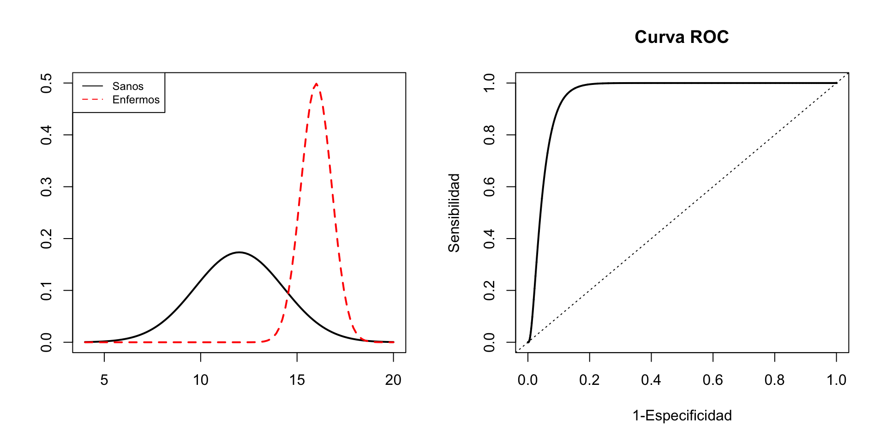

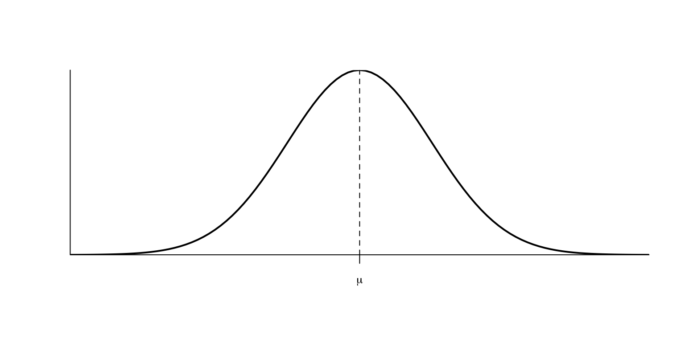

Denotaremos por $t_{\nu,q}$ el  $q$-cuantil de una  variable aleatoria  $T_{\nu}$ con distribución   $t_\nu$. Es decir, $t_{\nu,q}$ es el valor tal que
$$
P(T_{\nu}\leq t_{\nu,q})=q
$$
Entonces:

* Por la simetría de la distribución $t_\nu$,
$$
t_{\nu,q}=-t_{\nu,1-q}.
$$
    Exactamente lo mismo que pasaba con la normal estándar

* Si $\nu$ es grande, $T_\nu$ será aproximadamente una $N(0,1)$ y por lo tanto $t_{\nu,q}$ es aproximadamente igual a $z_q$.

\BeginKnitrBlock{rmdcaution}<div class="rmdcaution">No confundáis:

* **Desviación típica de una variable aleatoria**: El parámetro poblacional, normalmente desconocido. Es $\sigma_X$.

* **Desviación típica**  (muestral o no) **de una muestra**: El estadístico que calculamos sobre la muestra. Es $\widetilde{S}_X$ (la muestral) o ${S}_X$ (la "a secas").

* **Error típico de la media muestral**: La desviación típica de la variable media muestral. Es $\sigma_X/\sqrt{n}$, con $n$ el tamaño de las muestras.

* **Error típico de una muestra**: Estimación del error típico del estimador a partir de la muestra. Es $\widetilde{S}_X/\sqrt{n}$, con $n$ el tamaño de la muestra.

Fijaos en que el denominador $\sqrt{n}$ hace que, en general, los errores típicos sean mucho más pequeños que las desviaciones típicas. Id con cuidado, porque esto se usa a menudo en artículos para enmascarar los resultados. Si una muestra ha salido con una dispersión muy grande, se da su error típico en vez de su desviación típica y parece que ha salido más concentrada.

</div>\EndKnitrBlock{rmdcaution}


## Test

**(1)** Si el tamaño de una muestra aleatoria simple aumenta (marca todas las afirmaciones correctas):

1. La media muestral siempre disminuye. 
1. El error típico de la media muestral siempre disminuye.
1. El error típico de la muestra siempre disminuye.  
1. La varianza muestral siempre aumenta. 
1. El número de grados de libertad del estimador $\chi^2$ asociado a la varianza muestral siempre aumenta. 
1. Ninguna de las otras afirmaciones es correcta

 
**(2)** Si queremos disminuir a la mitad el error típico de la media muestral: 

1. Tenemos que aumentar en un 50% el tamaño de las muestras.
1. Tenemos que doblar el tamaño  de las muestras.
1. Tenemos que cuadruplicar el tamaño  de las muestras.  
1. Tenemos que dividir por 2 el tamaño  de las muestras.
1. Tenemos que dividir por 4 el tamaño  de las muestras.
1. Ninguna de las otras respuestas es correcta.


**(3)** La prevalencia de una afección en una población es del 10%. Si estimamos dicha prevalencia repetidamente mediante las proporciones muestrales de muestras aleatorias simples de tamaño 1000, estas estimaciones siguen una distribución que  (marca todas las afirmaciones correctas): 
 
1. Es una distribución muestral. 
1. Es aproximadamente normal.  
1. Es binomial. 
1. Tiene media 0.1.  
1. Tiene media 900. 
1. Ninguna de las otras afirmaciones es correcta

**(4)** Sobre una muestra de 100 mujeres  se obtuvo una concentración media de la hemoglobina de 10 con una desviación típica de 2. ¿Qué vale el error típico de la muestra (para la media muestral, se entiende)? 

1. 0.02
1. 0.04
1. 0.2 
1. 0.4
1. 1
1. Ninguno de los anteriores


**(5)** ¿Cuáles de las afirmaciones siguientes sobre la media muestral son verdaderas? Marca todas las respuestas correctas.

1. Si la distribución poblacional es normal, siempre coincide con la media de la distribución poblacional.
1. Si la distribución poblacional es normal, siempre coincide con la mediana de la distribución poblacional.
1. Siempre sirve para estimar la media poblacional, aunque la distribución poblacional no sea normal.  
1. Si la distribución poblacional es normal, sirve para estimar la mediana poblacional. 
1. Se calcula sumando todos los valores de la muestra y dividiendo por $n-1$, donde $n$ indica el tamaño de la muestra.
1. Ninguna de las otras respuestas es correcta.


**(6)** La concentración de un cierto metabolito en sangre tiene un valor medio $\mu$. Si tomamos muestras aleatorias simples de 20 individuos, calculamos su media muestral $\overline{X}$ y su desviación típica muestral $\widetilde{S}_X$ (marca la continuación más correcta):

1. El estadístico $\frac{\overline{X}-\mu}{\widetilde{S}_X/\sqrt{n}}$ tiene siempre  distribución normal.
1. El estadístico $\frac{\overline{X}-\mu}{\widetilde{S}_X/\sqrt{n}}$ tiene siempre  distribución t de Student.
1. El estadístico $\frac{\overline{X}-\mu}{\widetilde{S}_X/\sqrt{n}}$ tiene distribución normal si la concentración sigue una ley normal.
1. El estadístico $\frac{\overline{X}-\mu}{\widetilde{S}_X/\sqrt{n}}$ tiene distribución  t de Student si la concentración tiene distribución normal.  
1. El estadístico $\frac{\overline{X}-\mu}{\widetilde{S}_X/\sqrt{n}}$ no tiene nunca ni distribución normal ni distribución t de Student, porque las muestras no son lo suficientemente grandes.


**(7)** Tenemos una variable aleatoria $X$ normal de media $\mu$ y desviación típica $\sigma$. Tomamos muestras aleatorias simples de tamaño $n$, y denotamos por $\widetilde{S}_X$ su desviación típica muestral. ¿Cuáles de las afirmaciones siguientes son verdaderas? Marca todas las respuestas verdaderas:

1. $E(\widetilde{S}_X^2)=\sigma^2$. 
1. $E(\widetilde{S}_X)=\sigma$.
1. $\widetilde{S}_X^2$ sigue una distribución ji cuadrado con $n-1$ grados de libertad.
1. $(n-1)\widetilde{S}_X^2/\sigma^2$ sigue una distribución ji cuadrado con $n-1$ grados de libertad. 
1. $(n-1)\widetilde{S}_X/\sigma$ sigue una distribución ji cuadrado con $n-1$ grados de libertad. 
1. Todas las otras respuestas son falsas.


<!--chapter:end:33-Estim.Rmd-->

# Intervalos de confianza {#chap:IC}

Los estimadores de la lección anterior nos permiten estimar el valor de una característica de una población, pero no nos indican el error que cometemos con esta estimación. En la práctica, lo que se suele hacer es complementar la **estimación puntual** llevada a cabo aplicando un estimador a una muestra con un intervalo que indique la precisión de dicha estimación. Esta precisión va a depender:

* De la variabilidad del estimador: cuánta menos variabilidad tenga, más precisa será la estimación. Normalmente, la variabilidad del estimador crece con la desviación típica de la variable poblacional y decrece con el tamaño de las muestras.

* Del **nivel de confianza**, o de **seguridad**, deseado para la estimación: cómo de seguros queremos estar de que la estimación es correcta.


## Definiciones básicas

Un **intervalo de confianza del Q%** (para abreviar, un **IC-Q%**) de un parámetro poblacional es un intervalo obtenido aplicando a una muestra aleatoria simple de tamaño $n$ una fórmula que satisface la propiedad siguiente: 

> El intervalo obtenido contiene el valor del parámetro poblacional **el Q% de las veces** que aplicamos la fórmula a muestras aleatorias simples de tamaño $n$ tomadas al azar.


Tener una **confianza del Q%** significa pues que usamos una fórmula que **acierta el Q% de las veces que la aplicamos**. Pero asumimos que en un (100-Q)% de las veces da un intervalo que no contiene el valor del parámetro poblacional, **y no sabemos cuándo sí y cuándo no**. De manera que solo podemos tener una cierta confianza, fruto del optimismo, de que esta fórmula con nuestra muestra acierta.


\BeginKnitrBlock{example}<div class="example"><span class="example" id="exm:unnamed-chunk-429"><strong>(\#exm:unnamed-chunk-429) </strong></span>En un experimento  medimos el porcentaje de aumento de alcohol en sangre a 40 personas después de tomar 4 cañas de cerveza. En el Ejemplo \@ref(exm:alcohol1) calcularemos con los datos obtenidos en este experimento un IC-95% para el porcentaje de aumento medio de alcohol en sangre de una persona después de beber 4 cañas de cerveza. Obtendremos el intervalo [40.53, 41.87].

</div>\EndKnitrBlock{example}

Esto significará que **tenemos un 95% de seguridad** en que el aumento medio de alcohol en sangre de una persona después de beber 4 cañas de cerveza está entre el 40.53% y el 41.87%, porque este intervalo lo habremos calculado con una fórmula que el 95% de las veces que la aplicamos a muestras aleatorias de 40 personas da un intervalo que contiene la media poblacional que queremos estimar. Nosotros somos optimistas y "confiamos" estar dentro de este 95% de aciertos. 

A menudo esto lo escribiremos diciendo que:

> Hay un 95% de probabilidad de que el intervalo [40.53, 41.87] contenga el valor real del aumento medio de alcohol en sangre de una persona después de beber 4 cañas de cerveza.

Pero hay que entender lo que dice esta frase: 

* Por definición, un 95% de los intervalos de confianza del 95% para el aumento medio de alcohol etc. contienen el valor real de este aumento medio.

* [40.53, 41.87] es **un** intervalo de confianza del 95% para el aumento medio de alcohol etc., obtenido a partir de una muestra aleatoria.

* Entonces, [40.53, 41.87] tiene una probabilidad del 95% de contener el valor real del aumento medio de alcohol etc. en el mismo sentido que si un 95% de las personas tienen una determinada característica, y cojo una persona al azar, esta persona tiene un 95% de probabilidad de tener esa característica.

\BeginKnitrBlock{rmdcaution}<div class="rmdcaution">No confundáis: 

* **Intervalo de referencia del Q% para una variable aleatoria**: Intervalo que contiene **el valor de la variable aleatoria en un individuo** con probabilidad Q%. 

* **Intervalo de confianza del Q% para un parámetro**: Intervalo que contiene **el valor poblacional del parámetro de la variable aleatoria** "con probabilidad" Q%, en el sentido de que lo hemos calculado con una fórmula que da un intervalo que contiene el parámetro el Q% de las veces que la aplicamos a una muestra aleatoria.

* **Intervalo de referencia del Q% para un estimador**: Intervalo que contiene **el valor del estimador sobre una muestra aleatoria** con probabilidad Q%. 
</div>\EndKnitrBlock{rmdcaution}


Por ejemplo:

* Si decimos que un **intervalo de referencia del 95%** para la concentración de una proteína en suero en individuos sanos medida en g/dl es [11,16], esto  significa 

    * que un 95% de los individuos sanos tienen una concentración de esta proteína en suero entre 11 y 16 g/dl
    
    es decir, 
    
    * que si escogemos al azar un individuo sano, la probabilidad de que su concentración de esta proteína en suero esté entre 11 y 16 g/dl es del 95%.

* Si decimos que un **intervalo de confianza del 95%** para la concentración media de una proteína en suero en individuos sanos medida en g/dl es [11,16], esto significa 

    * que este intervalo tiene un 95% de probabilidad de contener la concentración media de esta proteína en suero en individuos sanos medida en g/dl, 
    
        en el sentido de que lo hemos obtenido aplicando a una muestra aleatoria de concentraciones de esta proteína en suero en individuos sanos  una fórmula que da un intervalo que contiene la media poblacional un 95% de las veces que la aplicamos a muestras aleatorias del mismo tamaño que la nuestra.
    

* Si decimos que el 95% de las muestras de 100 concentraciones de una determinada proteína en suero en individuos sanos tienen la media muestral entre 11 y 16 g/dl, esto es un **intervalo de referencia del 95% para la media muestral** de muestras de tamaño 100, no un intervalo de confianza para la concentración media poblacional ni un intervalo de referencia para el valor de la concentración en un individuo.


\BeginKnitrBlock{rmdcaution}<div class="rmdcaution">A menudo calcularéis un intervalo de confianza del Q% para un cierto parámetro $\theta$ de una población, os dará $[a,b]$, y con el poco rigor con el que a veces os expresáis, os será igual decir 

> "el valor real de $\theta$ tiene una probabilidad del Q% de pertenecer a $[a,b]$"

que

> "$[a,b]$ tiene una probabilidad del Q% de contener el valor real de $\theta$"

Pero estas dos frases no dicen exactamente lo mismo, y de hecho la primera es falsa y la segunda la interpretamos como verdadera. Fijaos en que, en la primera frase hablamos de la probabilidad de que a $\theta$ le pase algo, y en la segunda de que a $[a,b]$ le pase algo.

La primera frase dice que $\theta$ varía y un Q% de sus valores pertenece a $[a,b]$. Esto es falso. "El valor real de $\theta$" es un número que no varía.  Para nuestra población vale algo concreto, desconocido pero concreto, que pertenecerá o no al intervalo $[a,b]$.

La segunda frase en cambio se puede entender de la manera siguiente. El intervalo $[a,b]$ forma parte de toda la población de intervalos de confianza del Q% para $\theta$ calculados a partir de muestras aleatorias simples de nuestra población. Un Q% de estos intervalos contiene el valor real de $\theta$. Por lo tanto, podemos decir que nuestro intervalo $[a,b]$ tiene una probabilidad del Q% de contener el valor real de $\theta$. Esta interpretación es correcta.
</div>\EndKnitrBlock{rmdcaution}

\BeginKnitrBlock{rmdrecordau}<div class="rmdrecordau">Aunque lo mejor es no mezclar probabilidad con confianza, y decir simplemente que tenéis un 95% de confianza, o un 95% de seguridad, en que $[a,b]$ contiene el valor real de $\theta$. Así no os pilláis los dedos.</div>\EndKnitrBlock{rmdrecordau}

Que un IC-Q% para un parámetro $\theta$ sea $[a,b]$ sirve:

* Para estimar $\theta$ con este margen de confianza: Estamos bastante seguros de que el valor poblacional de $\theta$ está entre $a$ y $b$  (porque la fórmula usada acierta a menudo).

* Para descartar, con este margen de confianza,  que $\theta$ valga cualquier valor concreto fuera de $[a,b]$: Estamos bastante seguros de que el valor real de $\theta$ no está ni por debajo de $a$ ni por encima de $b$ y por tanto de que es diferente de cualquier valor menor que $a$ o mayor que $b$.

Por ejemplo: si un IC-95% para la prevalencia $p$ de una determinada enfermedad en una población  va de 0.025 a 0.047:

* Estamos muy ("un 95%") seguros de que $p\in [0.025,0.047]$ (porque la fórmula usada para calcular este intervalo acierta en un 95% de las veces).

* Estamos muy  ("un 95%") seguros de que $p\neq 0.05$ (porque 0.05 no pertenece al intervalo donde estamos muy seguros de que cae el valor real de $p$).

* Pero no estamos muy seguros de que $p=0.03$, por mucho que $0.03\in [0.025,0.047]$: estamos muy seguros de que $p$ está entre 0.025 y 0.047, pero no tenemos ninguna seguridad de que valga un valor concreto entre estos límites, solo de que está entre estos límites.


Hay dos tipos de métodos básicos de cálculo de intervalos de confianza a partir de una muestra aleatoria:


* **Paramétricos**: Usando alguna fórmula basada en la distribución muestral del estimador. Se basan en teoremas y solo tiene sentido usarlos si la variable aleatoria y la muestra aleatoria satisfacen (aproximadamente) las hipótesis de los teoremas.

* **No paramétricos**. Los otros. El más popular, y nuestro favorito, es el **bootstrap**:

    * De nuestra muestra, tomamos al azar muchas (miles de) muestras aleatorias simples (permitiendo repeticiones) del mismo tamaño que nuestra muestra.
    * Calculamos el estimador para cada una de estas muestras.
    * Usamos el vector de resultados para estimar un intervalo de confianza. Por ejemplo, tomamos como IC-95% el intervalo entre los cuantiles 0.025 y 0.975 de este vector.

    El **bootstrap** se puede usar siempre y funciona bien si la muestra es aleatoria, pero se basa en un proceso aleatorio y por lo tanto cada ejecución sobre una misma muestra puede dar un intervalo diferente.

\BeginKnitrBlock{rmdnote}<div class="rmdnote">El **bootstrap** es una herramienta muy poderosa para calcular intervalos de confianza y, en general, para estimar la distribución muestral de un estadístico. Tanto, que en la práctica ya empieza a sustituir los métodos paramétricos. Pero no hace milagros: si la muestra es pequeña o muy poco representativa de la población, un intervalo de confianza calculado con el bootstrap sirve de tan poco como uno calculado con un método paramétrico.</div>\EndKnitrBlock{rmdnote}


## Un ejemplo: IC-95% para la media de una variable aleatoria normal

Una de las fórmulas más conocidas para intervalos de confianza  es la siguiente:

\BeginKnitrBlock{rmdimportant}<div class="rmdimportant">Si $X$ es $N(\mu,\sigma)$ y tenemos una muestra aleatoria simple de tamaño $n$, media muestral $\overline{X}$ y varianza muestral $\widetilde{S}^2_X$, un IC-95% para $\mu$ es
$$
\Bigg[\overline{X}-t_{n-1,0.975}\cdot \frac{\widetilde{S}_X}{\sqrt{n}},\ \overline{X}+t_{n-1,0.975}\cdot\frac{\widetilde{S}_X}{\sqrt{n}}\Bigg]
$$
donde $t_{n-1,0.975}$ denota el 0.975-cuantil de la distribución t de Student $t_{n-1}$. Este intervalo lo escribiremos
$$
\overline{X}\pm t_{n-1,0.975}\cdot \frac{\widetilde{S}_X}{\sqrt{n}}
$$
para recalcar que estamos estimando $\mu$ por medio de $\overline{X}$ más menos un cierto error.</div>\EndKnitrBlock{rmdimportant}

\BeginKnitrBlock{rmdcaution}<div class="rmdcaution">A algunos de vosotros os habrán explicado en Bachillerato, o encontraréis en libros que consultéis, una fórmula para el IC-95% para $\mu$ similar a esta, pero cambiando la $\widetilde{S}_X$ por $\sigma$ y el $t_{n-1,0.975}$ por $z_{0.975}$, el 0.975-cuantil de la normal estándar. Esta otra fórmula solo se puede usar si se conoce la desviación típica poblacional $\sigma$, lo que, en la práctica, nunca pasará. Por lo tanto, por favor, olvidadla.</div>\EndKnitrBlock{rmdcaution}

Vamos a explicar de dónde sale esta fórmula, puesto que es un paradigma de cómo se obtienen la mayoría de las fórmulas paramétricas para intervalos de confianza. Quien se la quiera tomar como dogma de fe, que salte directamente al Ejemplo \@ref(exm:experimentot).

Supongamos pues que $X$ es $N(\mu,\sigma)$ y que tenemos una muestra aleatoria simple de tamaño $n$, media muestral $\overline{X}$ y varianza muestral $\widetilde{S}^2_X$. En esta situación, sabemos que 
$$
T=\frac{\overline{X}-\mu}{\widetilde{S}_{X}/\sqrt{n}}
$$
tiene distribución t de Student con $n-1$ grados de libertad, $t_{n-1}$.

Si podemos encontrar $A,B\in \mathbb{R}$ tales que
$$
P(A\leq T\leq B)=0.95,
$$
entonces:
$$
\begin{array}{rl}
0.95\!\!\!\! & =P\Bigg(A\leq   \dfrac{\overline{X}-\mu}{\widetilde{S}_{X}/\sqrt{n}}\leq  B\Bigg)\\[2ex]
& =P\Bigg(A\cdot \dfrac{\widetilde{S}_X}{\sqrt{n}}\leq  \overline{X}-\mu \leq  B\cdot \dfrac{\widetilde{S}_X}{\sqrt{n}}\Bigg)\\[2ex]
& =P\Bigg(-\overline{X}+A\cdot \dfrac{\widetilde{S}_X}{\sqrt{n}}\leq  -\mu \leq  -\overline{X}+B\cdot \dfrac{\widetilde{S}_X}{\sqrt{n}}\Bigg)\\[2ex]
& =P\Bigg(\overline{X}-B\cdot \dfrac{\widetilde{S}_X}{\sqrt{n}}\leq  \mu \leq  \overline{X}-A\cdot \dfrac{\widetilde{S}_X}{\sqrt{n}}\Bigg)
\end{array}
$$


Como $P(A\leq  T\leq  B)=0.95$ significa que para el 95% de las muestras aleatorias simples de tamaño $n$ el valor de $T$ está  entre $A$ y $B$, 
$$
P\Bigg(\overline{X}-B\cdot \frac{\widetilde{S}_X}{\sqrt{n}}\leq  \mu \leq  \overline{X}-A\cdot \frac{\widetilde{S}_X}{\sqrt{n}}\Bigg)=0.95
$$
significará que para el 95% de las muestras aleatorias simples de tamaño $n$ la $\mu$ cae dentro del intervalo
$$
\Bigg[\overline{X}-B\cdot \frac{\widetilde{S}_X}{\sqrt{n}},\ \overline{X}-A\cdot \frac{\widetilde{S}_X}{\sqrt{n}}\Bigg]
$$
Por lo tanto, ¡esto será un IC-95% para $\mu$!

Nos falta encontrar los $A,B$ tales que $P(A\leq T\leq B)=0.95$. Para encontrarlos, usaremos **cuantiles de la distribución de $T$**. Recordemos que, por definición de cuantil, 
$$
P(T\leq t_{n-1,0.975})=0.975
$$
y por la simetría de la $t$ de Student,
$$
P(T\leq  -t_{n-1,0.975})=P(T\geq t_{n-1,0.975})=0.025
$$
Por tanto:
$$
\begin{array}{l}
P(-t_{n-1,0.975}\leq  T\leq  t_{n-1,0.975})\\
\quad =P(T\leq  t_{n-1,0.975})-P(T\leq  -t_{n-1,0.975})\\
\quad =0.975-0.025=0.95
\end{array}
$$

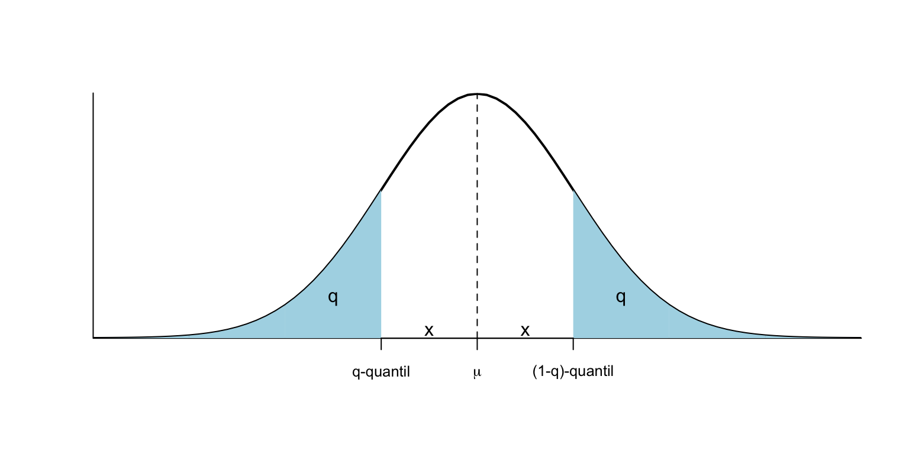


Así pues, podemos tomar
$$
A=-t_{n-1,0.975},\quad B=t_{n-1,0.975}
$$
y obtenemos el IC-95% para $\mu$ anunciado:
$$
\Bigg[\overline{X}-t_{n-1,0.975}\cdot \frac{\widetilde{S}_X}{\sqrt{n}},\ \overline{X}+t_{n-1,0.975}\cdot\frac{\widetilde{S}_X}{\sqrt{n}}\Bigg]
$$


\BeginKnitrBlock{example}<div class="example"><span class="example" id="exm:experimentot"><strong>(\#exm:experimentot) </strong></span>Hagamos un experimento para ver que, efectivamente, esta fórmula "acierta", en el sentido de que el intervalo que produce contiene la $\mu$, alrededor del 95% de las veces. En el bloque de código de R siguiente: 
  
</div>\EndKnitrBlock{example}
  
* Generamos al azar una `Población` de 10^7^ "individuos" que siguen una ley normal estándar y calculamos la media `mu` de esta población.

* Definimos una función `IC` que calcula el IC-95% para la media $\mu$ con la fórmula anterior. 

* Tomamos, al azar, 200 muestras aleatorias simples de tamaño 50 de nuestra población y les aplicamos esta función. Obtenemos una matriz `M` de 200 columnas formadas por los dos extremos de los intervalos (el inferior en la primera fila y el superior en la segunda fila).

* Dibujamos los intervalos de confianza en un gráfico, donde aparecerán en gris los que contienen el valor "poblacional" de `mu` y en rojo los que no lo contienen. La recta vertical marca el valor de `mu`.


```r
Población=rnorm(10^7)
mu=mean(Población)
mu
```

```
## [1] 0.0002423589
```


```r
IC=function(x){
  n=length(x)
  mean(x)+qt(0.975,n-1)*sd(x)/sqrt(n)*c(-1,1)}
M=replicate(200,IC(sample(Población,50,replace=TRUE)))
plot(1,type="n",xlim=c(-0.8,0.8),ylim=c(0,200),
  xlab="Valores",ylab="Repeticiones", main="200 IC-95%")
seg.int=function(i){color="grey";
  if((mu<M[1,i]) | (mu>M[2,i])){color="red"}
  segments(M[1,i],i,M[2,i],i,col=color,lwd=2)}
sapply(1:200,FUN=seg.int)
abline(v=mu,lwd=2)
```


Si contáis los intervalos rojos, veréis que hemos fallado 11 veces y por lo tanto hemos acertado 189 veces, es decir, en un 94.5% de los intervalos. Es aproximadamente lo que esperábamos. Si lo probáis en casa, ejecutando el código de R que hemos dado, obtendréis  otros resultados, a veces mejores, a veces peores. Es lo que tiene la aleatoriedad. (Si queréis obtener exactamente nuestro gráfico, justo antes de `Población=rnorm(10^7)` ejecutad `set.seed(1200)`.)

Queremos remarcar que, en nuestra simulación, de los 200 IC-95% que hemos calculado, 11 no han contenido el valor real de $\mu$. Un intervalo de confianza no siempre acierta.

\BeginKnitrBlock{rmdcaution}<div class="rmdcaution">De media, un IC-Q% **NO contiene el valor real del parámetro en un (100-Q)%** de las ocasiones.</div>\EndKnitrBlock{rmdcaution}

Por ejemplo, de media, un 5% de las veces que calculemos un IC-95%, el parámetro poblacional no pertenecerá al intervalo obtenido. 

Por lo tanto, si calculamos $n$ IC-95% sobre muestras aleatorias simples independientes, el número de veces que el intervalo resultante  no contendrá el parámetro poblacional seguirá una distribución binomial $B(n,0.05)$. El gráfico siguiente representa el valor de $P(X\geq 1)$ para una variable aleatoria $X$ de tipo $B(n,0.05)$, para $n=0,...,100$, y por lo tanto la probabilidad de que si calculamos $n$ IC-95% sobre muestras aleatorias simples independientes, al menos uno de ellos no contenga el parámetro poblacional deseado.


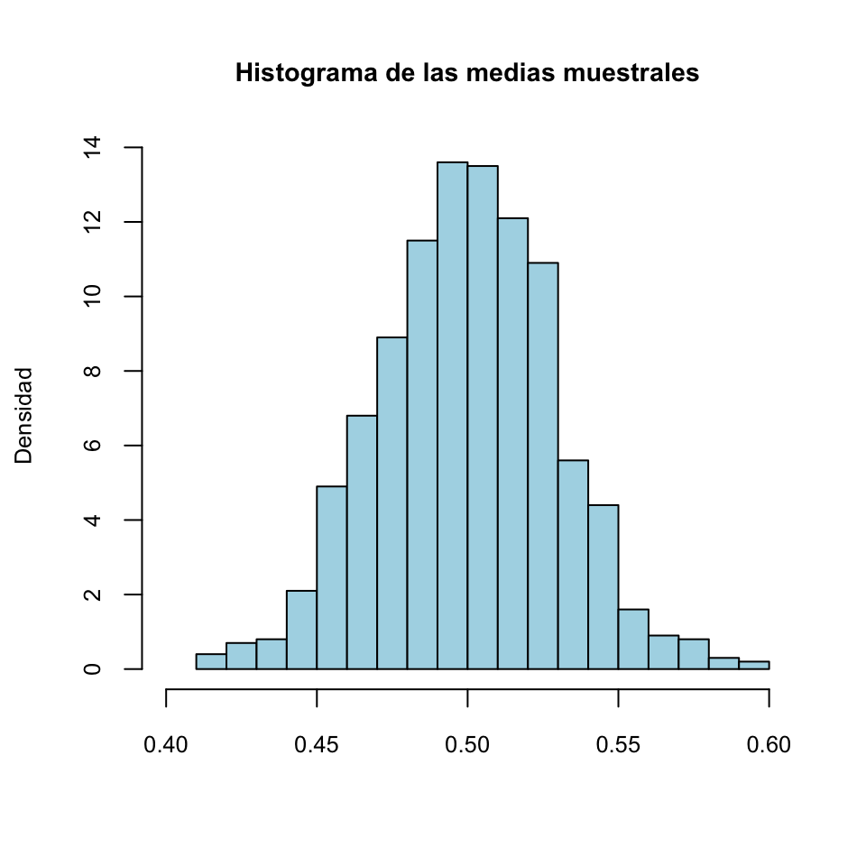

Esto es un problema grave en artículos científicos donde se calculen intervalos de confianza para muchos parámetros. De media, 1 de cada 20 IC-95% que se calculan es erróneo. Y no se puede hacer nada al respecto, forma parte de la definición.

\BeginKnitrBlock{example}<div class="example"><span class="example" id="exm:alcohol1"><strong>(\#exm:alcohol1) </strong></span>Volvamos al experimento en el que medimos el porcentaje de aumento de alcohol en sangre a 40 personas después de tomar 4 cañas de cerveza. La media y la desviación típica muestral de estos porcentajes de incremento fueron
$$
\overline{x}=41.2,\quad \widetilde{s}=2.1.
$$

</div>\EndKnitrBlock{example}
Para calcular un IC-95% para el porcentaje medio de aumento de alcohol en sangre después de tomar 4 cañas de cerveza, $\mu$ para abreviar, supondremos que la variable aleatoria de interés (de la que queremos estimar la media)  $X$, que es "Tomamos una persona y le medimos el porcentaje de aumento de alcohol en sangre después de tomar 4 cañas de cerveza",  es **normal** y que la muestra que hemos tomado de esta variable es **aleatoria simple**.


Entonces, como $t_{n-1,0.975}$=`qt(0.975,39)`=2.0227, un IC-95% para $\mu$ es
$$
41.2\pm 2.0227\cdot \frac{2.1}{\sqrt{40}}\Rightarrow 41.2\pm 0.67\Rightarrow [40.53, 41.87]
$$

Por lo tanto, estimamos con un 95% de confianza que el porcentaje medio de aumento de alcohol en sangre después de tomar 4 cañas de cerveza está entre el 40.5% y el 41.9%, o que es del 41.2% más menos 0.7 puntos porcentuales.

Para calcular el intervalo anterior hemos supuesto que la variable poblacional "Porcentaje de aumento de alcohol en sangre después de tomar 4 cañas de cerveza" sigue una distribución normal. ¿Y si no fuera normal? 

* En este caso, como el tamaño de la muestra $n=40$ es lo bastante grande como para poder invocar el Teorema Central del Límite,  el Teorema \@ref(thm:ICmu) de la próxima sección nos dice que el intervalo obtenido sigue siendo (aproximadamente) un intervalo de confianza del 95% para $\mu$.

* Si $n$ fuera pequeño y $X$ muy diferente de una normal, no se puede usar esta fórmula y habría que buscarse la vida (por ejemplo, usar el método bootstrap).

También hemos supuesto que era una muestra aleatoria simple. ¿Y si no lo es?

* Si es aleatoria, como la población sobre la que tenemos definida nuestra variable aleatoria, las personas que pueden tomar 4 cañas de cerveza, es muy grande, a efectos prácticos la podemos considerar simple.

* Pero seguro que no es aleatoria, sino oportunista. En este caso, no hemos sacado 40 personas por sorteo de la lista de toda la población mundial, ni siquiera de la de Mallorca, sino que hemos buscado voluntarios. Entonces, no podemos hacer nada para salvar la fórmula, y su validez depende de si la muestra de personas usada puede pasar por aleatoria o no. 


## Intervalo de confianza para la media basado en la t de Student

\BeginKnitrBlock{rmdcaution}<div class="rmdcaution">A partir de ahora, para evitar ambigüedades, en las fórmulas expresaremos el nivel de confianza de los intervalos en tanto por uno, no en tanto por ciento; es decir, como una proporción en vez de como un porcentaje. Por lo tanto, hablaremos de **intervalos de confianza de nivel de confianza $q$** (**IC-$q$**), con $q$ entre 0 y 1, en vez de intervalos de confianza del Q% con Q=100q. Con estas notaciones, por ejemplo, los intervalos de confianza del 95% serán intervalos de confianza de nivel de confianza 0.95.</div>\EndKnitrBlock{rmdcaution}

El mismo argumento de la sección anterior, cambiando 0.95 por $q$, da:

\BeginKnitrBlock{theorem}<div class="theorem"><span class="theorem" id="thm:unnamed-chunk-444"><strong>(\#thm:unnamed-chunk-444) </strong></span>Si $X$ es $N(\mu,\sigma)$ y tomamos una muestra aleatoria simple de tamaño $n$, un IC-$q$ para $\mu$ es
$$
\overline{X}\pm t_{n-1,(1+q)/2}\cdot \frac{\widetilde{S}_X}{\sqrt{n}}
$$
</div>\EndKnitrBlock{theorem}

La fórmula de la sección anterior es un caso particular de esta, porque en los IC-0.95, $q=0.95$ y por lo tanto $(1+q)/2=1.95/2=0.975$. 

Usando el Teorema Central del Límite y algunas aproximaciones, tenemos el siguiente resultado:

\BeginKnitrBlock{theorem}<div class="theorem"><span class="theorem" id="thm:ICmu"><strong>(\#thm:ICmu) </strong></span>Si $X$ es una variable aleatoria cualquiera de media poblacional $\mu$ y tomamos una muestra aleatoria simple de $X$ de tamaño $n$ grande (digamos, de 40 o más elementos), entonces, un IC-$q$ para $\mu$ es aproximadamente
$$
\overline{X}\pm t_{n-1,(1+q)/2}\cdot \frac{\widetilde{S}_X}{\sqrt{n}}
$$

</div>\EndKnitrBlock{theorem}

La aproximación del teorema anterior es mejor cuanto mayor sea $n$ o cuanto más próxima a una normal sea la variable poblacional $X$.

En resumen:

\BeginKnitrBlock{rmdimportant}<div class="rmdimportant">Podemos usar la fórmula para el IC-$q$ para la media poblacional basada en la t de Student
$$
\overline{X}\pm t_{n-1,(1+q)/2}\cdot \frac{\widetilde{S}_X}{\sqrt{n}}
$$
si la variable poblacional es normal o si la muestra aleatoria simple es grande.</div>\EndKnitrBlock{rmdimportant}

Observad que la estructura del IC-$q$ para $\mu$ dado por esta fórmula es

> estimador $\pm$ ($\frac{1+q}{2}$-cuantil de la distr. muestral)$\times$(error típico de la muestra)

Esta estructura es muy típica (pero no universal: no creáis que todos los intervalos de confianza paramétricos tienen esta forma) y cumple que:

* El intervalo de confianza está centrado en la estimación puntual.

* La "probabilidad de equivocarnos" se reparte por igual a los dos lados del intervalo: en una fracción $(1-q)/2$ de las veces que apliquemos la fórmula, el valor real del parámetro estará a la izquierda del extremo inferior y en otra fracción $(1-q)/2$ de estas ocasiones estará a la derecha del extremo superior.

\BeginKnitrBlock{rmdimportant}<div class="rmdimportant">Para una misma muestra y una misma fórmula (paramétrica) para calcular el intervalo de confianza, si el nivel de confianza crece, el intervalo se ensancha.</div>\EndKnitrBlock{rmdimportant}

Esto es general, **para todos los intervalos de confianza paramétricos**. La idea intuitiva es que, para estar más seguros de que un intervalo contiene un valor, el intervalo tiene que ser más ancho. En un intervalo de confianza con la estructura descrita hace un momento, el motivo matemático es que a mayor $q$, mayor $(1+q)/2$-cuantil de la distribución muestral.

Por ejemplo, en el Ejemplo \@ref(exm:alcohol1), teníamos $n=40$, $\overline{x}=41.2$ y $\widetilde{s}=2.1$:

* El IC-95% tiene $q=0.95$, por lo tanto $t_{n-1,(1+q)/2}=t_{39,0.975}=2.02$, y daba 
$$
41.2\pm 2.02\cdot \frac{2.1}{\sqrt{40}}\Rightarrow 41.2\pm 0.67
$$

* El IC-99% tiene $q=0.99$, por lo tanto $t_{n-1,(1+q)/2}=t_{39,0.995}=2.71$, y da
$$
41.2\pm 2.71\cdot \frac{2.1}{\sqrt{40}}\Rightarrow 41.2\pm 0.9
$$
más ancho

* Pero si cambiamos de muestra (o de fórmula, si hay más de una) para calcular el intervalo de confianza, puede pasar cualquier cosa.


## Intervalos de confianza para proporciones 

Supongamos que tenemos una variable Bernoulli $X$ con probabilidad poblacional de éxito $p_X$ desconocida. Queremos calcular un intervalo de confianza para $p_X$.  Para hacerlo, tomamos una muestra aleatoria simple de $X$ de tamaño $n$, con número de éxitos $S$ y por tanto proporción muestral de éxitos $\widehat{p}_{X}=S/n$.

Explicaremos tres métodos para calcular este intervalo de confianza: el método de Clopper-Pearson, el de Wilson y el de Laplace.


#### Método "exacto" de Clopper-Pearson {-}

Este método se basa en que el número de éxitos $S$ en muestras aleatorias simples de tamaño $n$ de $X$ tiene una distribución conocida: es binomial $B(n,p_X)$. Razonando de manera similar a cómo obteníamos el intervalo para $\mu$ basado en la t de Student se llega a una fórmula de un intervalo de confianza para $p_X$ que os vamos a ahorrar, ya que **nunca** se aplica "a mano".

Este método tiene la ventaja de que se puede usar siempre, independientemente del tamaño de la muestra, y es "exacto" porque se basa en la distribución exacta de $S$.  Pero tiene algunos inconvenientes:

* Como los números de éxitos en muestras de tamaño fijo avanzan a saltos (0, 1, 2, 3,...), suele dar intervalos de confianza más anchos de lo necesario.
* Los intervalos que produce no son de la forma "probabilidad muestral $\pm$ algo".
* Se necesita un ordenador para calcularlo, no basta una calculadora.

Con R, se calcula con la función `binom.exact` del paquete **epitools**. Su sintaxis es


```r
binom.exact(x,n,conf.level)
```

donde `x` y `n` representan, respectivamente, el número de éxitos y el tamaño de la muestra, y `conf.level` es $q$, el nivel de confianza en tanto por uno.  El valor por defecto de  `conf.level` es 0.95, por lo que no hace falta especificarlo si queréis calcular un IC-95%.

#### Método aproximado de Wilson {-}

Supongamos ahora que tomamos una muestra aleatoria simple de $X$ de tamaño $n$ grande, pongamos $n\geq 40$, y proporción muestral de éxitos $\widehat{p}_{X}$. En estas condiciones, por el Teorema Central del Límite, sabemos que la distribución de
$$
Z=\dfrac{\widehat{p}_{X}-p_X}
{\sqrt{\frac{p_X(1-p_X)}{n}}}
$$
es aproximadamente la de una $N(0,1)$. Por lo tanto
$$
P\Big(-z_{(1+q)/2}\leq \dfrac{\widehat{p}_{X}-p_X}
{\sqrt{\frac{p_X(1-p_X)}{n}}}\leq z_{(1+q)/2}\Big)\approx q
$$

Despejando $p_X$ como en el cálculo del IC-95% para la $\mu$ usando la t de Student, obtenemos el resultado siguiente (que no hay que saber, tranquilos):

\BeginKnitrBlock{theorem}<div class="theorem"><span class="theorem" id="thm:unnamed-chunk-448"><strong>(\#thm:unnamed-chunk-448) </strong></span>Si $n$ es grande, un IC-$q$ para $p_X$ es aproximadamente: 
$$
\frac{\widehat{p}_{X}+\frac{z_{(1+q)/{2}}^2}{2n}}{1+\frac{z_{(1+q)/{2}}^2}{n}}\pm \frac{z_{(1+q)/{2}}\sqrt{\frac{\widehat{p}_{X}(1-\widehat{p}_{X})}{n}+\frac{z_{(1+q)/{2}}^2}{4n^2}}}{1+\frac{z_{(1+q)/{2}}^2}{n}}
$$
  
</div>\EndKnitrBlock{theorem}

Podéis calcular este intervalo con la función `binom.wilson` del paquete **epitools**. Su sintaxis es


```r
binom.wilson(x,n,conf.level)
```

con los mismos parámetros que `binom.exact`.


Fijaos en que:

* Este método no se puede usar con muestras de cualquier tamaño, han de ser lo bastante  grandes como para poder invocar el Teorema Central del Límite.
* El centro del intervalo no es $\widehat{p}_X$.
* Se basa en la aproximación a la normal dada por el Teorema Central del Límite, y por lo tanto el intervalo resultante es un intervalo de confianza "aproximado", no exacto como el de Clopper-Pearson. Esto no es un gran problema, porque total, la muestra usada seguramente tampoco será aleatoria simple. 


#### Fórmula de Laplace {-}

Supongamos finalmente que tomamos una muestra aleatoria simple de $X$ de tamaño $n$ todavía más grande y que el valor de $\widehat{p}_{X}$ no es muy próximo ni a 0 ni a 1.  Para fijar unas condiciones que suelen ser suficientes, supongamos que:

* $n\geq 100$.
* Tanto el número de éxitos, $S$, como el número de fracasos, $n-S$, en la muestra son $\geq 10$.


En este caso, en la fórmula del intervalo de Wilson los términos $z_{(1+q)/{2}}^2/n$ son despreciablemente pequeños comparados con los otros. Si los igualamos a  0, obtenemos la fórmula siguiente:

\BeginKnitrBlock{theorem}<div class="theorem"><span class="theorem" id="thm:unnamed-chunk-450"><strong>(\#thm:unnamed-chunk-450) </strong></span>En las condiciones explicadas, un IC-$q$ para $p_X$ es aproximadamente
$$
\widehat{p}_{X}\pm z_{(q+1)/2}\sqrt{\frac{\widehat{p}_{X}
(1-\widehat{p}_{X})}{n}}
$$

</div>\EndKnitrBlock{theorem}

Esta fórmula es la más popular, y forma parte de la "cultura general" de un científico. De hecho, tiene más de 200 años y precede en más de 100 años a los otros dos métodos. Además, tiene la forma familiar "estimador $\pm$ cuantil$\times$error típico".

Podéis calcular este intervalo con la función `binom.approx` del paquete **epitools**. Su sintaxis es la misma que la de `binom.exact` y `binom.wilson`.


 
\BeginKnitrBlock{rmdmercifulgod}<div class="rmdmercifulgod">Os tenéis que saber la fórmula de Laplace, no hay que saber las fórmulas de los otros dos métodos. Pero sí cuándo se pueden usar y cuándo no.
</div>\EndKnitrBlock{rmdmercifulgod}


\BeginKnitrBlock{rmdromans}<div class="rmdromans">Cuando podemos calcular más de un intervalo de confianza para $p_X$, ¿cuál calculamos?


De entrada hay que advertir que si podemos calcular más de un intervalo, seguramente los que podamos calcular darán resultados muy parecidos. Además, recordad que las tres fórmulas solo nos dan "un nivel de confianza $q$" si se aplican a muestras aleatorias simples, y nuestras muestras casi siempre serán oportunistas, en cuyo caso, si nos ponemos tiquismiquis, no podemos aplicar ninguna.

Solo un consejo: Si podéis usar la fórmula de Laplace, usadla. Todo el mundo lo conoce, forma parte de la cultura general del científico, y da un intervalo centrado en la proporción muestral.</div>\EndKnitrBlock{rmdromans}


\BeginKnitrBlock{example}<div class="example"><span class="example" id="exm:unnamed-chunk-453"><strong>(\#exm:unnamed-chunk-453) </strong></span>En una muestra de 20 pacientes operados de cáncer de próstata con una nueva técnica, ninguno desarrolló complicaciones importantes en las 24 horas siguientes a la operación.
¿Cuál sería un IC-95% para la proporción de pacientes operados con esta  técnica nueva que desarrollan complicaciones importantes en las 24 horas siguientes a la operación?

</div>\EndKnitrBlock{example}

Para calcularlo solo podemos usar el método de Clopper-Pearson, y este es uno de los pocos casos en que este intervalo tiene una expresión analítica sencilla. Si en una muestra aleatoria simple de tamaño $n$ de una variable $Be(p_X)$ obtenemos 0 éxitos, el IC-$q$ de Clopper-Pearson para $p_X$ es 
$$
\Big[0,1-\Big(\frac{1-q}{2}\Big)^{1/n}\Big]
$$
que, si $q=0.95$, queda
$$
[0,1-0.025^{1/n}].
$$
En nuestro caso, $n=20$, da el intervalo [0,0.1684]. Por lo tanto, estimamos con un 95% de confianza que menos del 16.84% de los pacientes operados con esta  técnica nueva desarrollan complicaciones importantes en las 24 horas siguientes a la operación.

Con R, hubiéramos entrado

```r
library(epitools)
binom.exact(0,20)
```

```
##   x  n proportion lower     upper conf.level
## 1 0 20          0     0 0.1684335       0.95
```

El intervalo que se obtiene tiene como extremo inferior el valor `lower` y extremo superior el valor `upper`.


Cuando se tiene que calcular "a mano" un intervalo de confianza del 95% para una probabilidad $p_X$ a partir de una muestra aleatoria simple donde no ha habido ningún éxito, a menudo se usa la regla siguiente:

> **Regla del 3:** Cuando en una muestra aleatoria simple de tamaño $n$ de una variable aleatoria de Bernoulli de parámetro $p_X$ no encontramos ningún éxito, un IC-95% para $p_X$ va, aproximadamente, de 0 a $3/n$.

Con esta regla, en nuestro ejemplo con $n=20$ obtendríamos el intervalo [0,3/20]=[0,0.15], no muy lejos del [0,0.1684] que hemos obtenido. 

Para ver como la regla del 3 aproxima el intervalo de Clopper-Pearson, el gráfico siguiente muestra los valores $3/n$ y el extremo superior del IC-95% de Clopper-Pearson a partir de una muestra de tamaño $n$ con 0 éxitos:

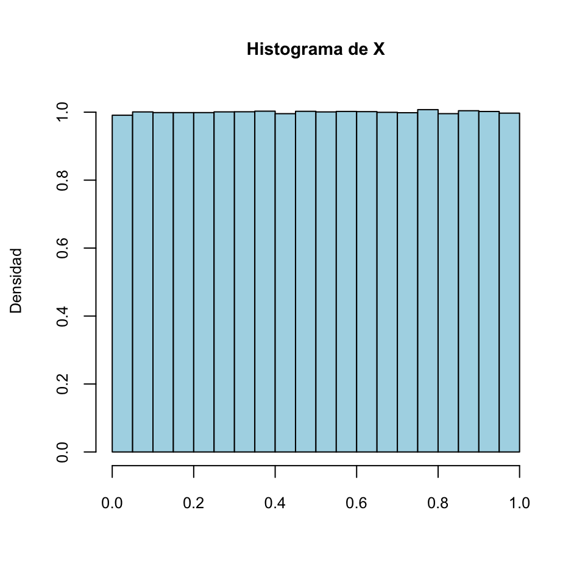

Si la muestra hubiera sido mayor, pongamos de 50 pacientes y de nuevo 0 complicaciones graves, podríamos usar el método de Wilson.  Calculémoslo con R:


```r
binom.wilson(0,50)
```

```
##   x  n proportion lower     upper conf.level
## 1 0 50          0     0 0.0713476       0.95
```

Da el intervalo  [0,0.0713]. El método de Clopper-Pearson da en este caso

```r
binom.exact(0,50)
```

```
##   x  n proportion lower      upper conf.level
## 1 0 50          0     0 0.07112174       0.95
```

y la regla del 3 da [0,0.06]. 

El gráfico siguiente muestra los valores $3/n$ y los extremos superiores de los IC-95% de Clopper-Pearson y de Wilson a partir de una muestra de tamaño $n$ ($n\geq 40$ para los intervalos de confianza de Wilson) con 0 éxitos:

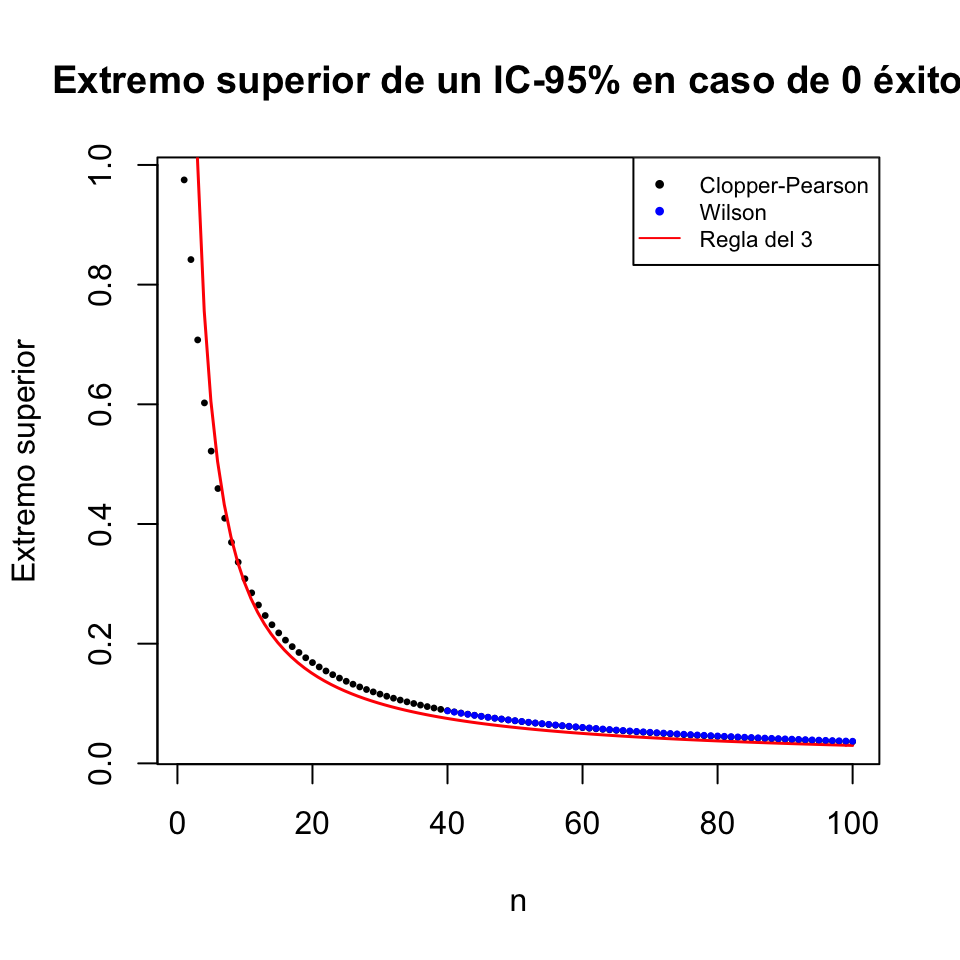

Los extremos superiores de los intervalos de Clopper-Pearson y Wilson se superponen en este último gráfico.

\BeginKnitrBlock{rmdcaution}<div class="rmdcaution">Aunque la muestra de pacientes hubiera sido enorme, yo qué sé, de 30000 pacientes, con 0 casos de complicaciones graves no se puede usar la fórmula de Laplace. De hecho, si la aplicáis con 0 éxitos obtenéis el interval [0,0]. Comprobadlo.</div>\EndKnitrBlock{rmdcaution}

\BeginKnitrBlock{example}<div class="example"><span class="example" id="exm:unnamed-chunk-460"><strong>(\#exm:unnamed-chunk-460) </strong></span>En un ensayo de un tratamiento de quimioterapia, en una muestra de 100 pacientes tratados, 25 desarrollaron cáncer testicular secundario. ¿Cuál es un IC-95% para la proporción de pacientes tratados con esta quimioterapia que desarrollan cáncer testicular.
</div>\EndKnitrBlock{example}

En este caso podemos usar los tres métodos.

* Clopper-Pearson, porque se puede usar siempre.
* Wilson, porque $n=100\geq 40$.
* Laplace, porque $n\geq 100$, $S=25\geq 10$ y $n-S=75\geq 10$.

Vamos a aplicar a mano la fórmula de Laplace, que es la única que es sensato calcular a mano (y es la que os recomendamos usar si podéis). Tenemos que $\widehat{p}_{X}=25/100=0.25$ y $z_{0.975}=1.96$. Da:
$$
0.25\pm 1.96\sqrt{\frac{0.25\cdot 0.75}{100}}=0.25\pm 0.085\Rightarrow [0.165, 0.335]
$$
Concluimos, con un nivel de confianza del 95%, que entre aproximadamente un 16.5% y un 33.5% de los pacientes tratados con esta quimioterapia desarrollan cáncer testicular. En este caso podríamos decir que estimamos, con un nivel de confianza del 95%, que el porcentaje de pacientes tratados con esta quimioterapia  que desarrollan cáncer testicular es del 25% más menos 8.5 puntos porcentuales.

Por si os interesan:

* El intervalo de Clopper-Pearson da 

```r
binom.exact(25,100)
```

```
##    x   n proportion     lower     upper conf.level
## 1 25 100       0.25 0.1687797 0.3465525       0.95
```

* El intervalo de Wilson da 

```r
binom.wilson(25,100)
```

```
##    x   n proportion     lower     upper conf.level
## 1 25 100       0.25 0.1754521 0.3430446       0.95
```

Ya que estamos, calculamos el intervalo de Laplace con R:

```r
binom.approx(25,100)
```

```
##    x   n proportion     lower     upper conf.level
## 1 25 100       0.25 0.1651311 0.3348689       0.95
```
Da lo mismo que a mano.


Como podéis ver, los tres dan muy parecidos, con diferencias en los extremos de un punto porcentual.

#### Cálculo del tamaño de la muestra para fijar el error {-}

Llamaremos **margen de error** (o **error**, **precisión**...) del intervalo de confianza de Laplace a la mitad de su amplitud, es decir, a lo que sumamos y restamos a la proporción muestral para obtenerlo:
$$
M= z_{(q+1)/2} \sqrt{\frac{\widehat{p}_{X} (1-\widehat{p}_{X})}{n}}
$$
Fijaos en que el intervalo de confianza de Laplace es $\widehat{p}_X\pm M$ y por lo tanto, si contiene el valor real de $p_X$, el error $|\widehat{p}_X-p_X|$ que cometemos cuando decimos que el valor de $p_X$ es $\widehat{p}_X$ es como máximo este $M$.


Una típica pregunta al diseñar un estudio es ¿de qué tamaño he de tomar la muestra para garantizar que el margen de error en la estimación sea como máximo un valor dado $M_{max}$?
En el caso del intervalo de Laplace para una proporción, podemos dar un tamaño $n$ que garantice un error máximo dado  $M_{max}$ valga lo que valga $\widehat{p}_{X}\in [0,1]$.


Fijaos en que la función $y=p(1-p)$, con $p\in [0,1]$, es una parábola cóncava con vértice en su punto $p=0.5$.

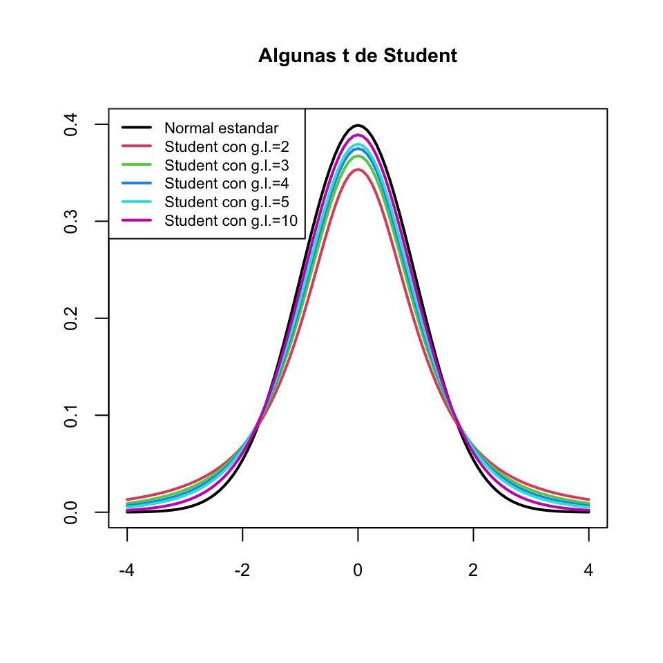

Por lo tanto, $y=p(1-p)$ toma su valor máximo en $p=0.5$. Así, pues
$$
\widehat{p}_{X} (1-\widehat{p}_{X})\leq 0.5(1-0.5)=0.5^2
$$
y por lo tanto
$$
\begin{array}{l}
\displaystyle M=z_{(q+1)/2} \sqrt{\frac{\widehat{p}_{X} (1-\widehat{p}_{X})}{n}}\\
\qquad\displaystyle 
\leq z_{(q+1)/2}\sqrt{\frac{0.5^2}{n}}=\frac{0.5z_{(q+1)/2}}{\sqrt{n}}=\frac{z_{(q+1)/2}}{2\sqrt{n}}
\end{array}
$$

Concluimos que si tomamos $n$ tal que
$$
\frac{z_{(q+1)/2}}{2\sqrt{n}}\leq M_{max}
$$
entonces seguro que $M\leq M_{max}$, valga lo que valga $\widehat{p}_{X}$.

Por consiguiente, lo que haremos será calcular la $n$ para obtener un margen de error como máximo $M_{max}$ en el **caso más desfavorable** (o **en el peor de los casos**): cuando el intervalo da lo más ancho posible, es decir, suponiendo que $\widehat{p}_{X}=0.5$:
$$
M_{max}\geq \frac{z_{(q+1)/2}}{2\sqrt{n}}
\Rightarrow
n\geq \left(\frac{z_{(q+1)/2}}{2\cdot M_{max}}
\right)^2
$$

En resumen:

\BeginKnitrBlock{theorem}<div class="theorem"><span class="theorem" id="thm:unnamed-chunk-465"><strong>(\#thm:unnamed-chunk-465) </strong></span>Si 
$$
n\geq \left(\frac{z_{(q+1)/2}}{2\cdot M_{max}}\right)^2,
$$
el margen de error del intervalo de Laplace calculado con una muestra de tamaño $n$  será como máximo $M_{max}$.

</div>\EndKnitrBlock{theorem}

\BeginKnitrBlock{example}<div class="example"><span class="example" id="exm:unnamed-chunk-466"><strong>(\#exm:unnamed-chunk-466) </strong></span>¿Cuál es el menor tamaño de una muestra que nos garantice un margen de error de como máximo 0.05 al estimar una proporción $p_X$ usando un intervalo de confianza de Laplace del 95%?
</div>\EndKnitrBlock{example}

Por el teorema anterior, para garantizar un margen de error de 0.05 al calcular un IC-95% para una proporción $p_X$ usando la fórmula de Laplace, tenemos que usar una muestra de tamaño $n$ tal que
$$
n\geq \Bigg(\frac{z_{(1+q)/2}}{2M_{max}}\Bigg)^2=\Bigg(\frac{1.96}{0.1}\Bigg)^2=384.16
$$

El menor tamaño  que satisface esta condición es $n=385$.

\BeginKnitrBlock{rmdcaution}<div class="rmdcaution">La respuesta correcta no es 384, por mucho que 384.16 se redondee a 384. Fijaos en que 384 no es más grande que 384.16.</div>\EndKnitrBlock{rmdcaution}

Observad tres cosas:

* El valor de $n$ solo depende del margen de error deseado  y del nivel de confianza, no de la naturaleza del estudio.

* Tal y como hemos encontrado la $n$, estamos seguros de que si tomamos una muestra como mínimo de este tamaño, el margen de error del intervalo de confianza de Laplace será como máximo $M_{max}$, sea cual sea la muestra. ¡Es de las pocas veces que podemos estar seguros de algo en estadística!

* El teorema anterior es para el intervalo de Laplace, pero la $n$ seguramente os saldrá muy grande y en este caso el intervalo de Laplace aproxima muy bien los otros dos intervalos si la proporción muestral luego no os sale muy extrema.

#### "Poblaciones finitas" {-}

En esta sección hasta ahora hemos usado muestras aleatorias simples. Ya sabemos que si tomamos muestras aleatorias sin reposición y la  población es mucho más grande que el tamaño $n$ de las muestras, las fórmulas que hemos dado siguen funcionando  (aproximadamente) bien. Pero, ¿qué pasa si tomamos una muestra aleatoria sin reposición y la población no es mucho más grande que la muestra? 

Por un lado, hay métodos tipo el de Clopper-Pearson que usan que el número de éxitos en muestras aleatorias sin reposición sigue una distribución hipergeométrica, pero son aun más complicados que el de Clopper-Pearson. Lo que se hace cuando se puede es usar la fórmula de Laplace teniendo en cuenta el **factor de población finita**:

* Si $X$ una variable aleatoria de Bernoulli $Be(p_X)$ definida sobre una población  de tamaño $N$ y tomamos una muestra aleatoria sin reposición de $X$, con $n\geq 100$ y números de éxitos y fracasos $\geq 10$, un intervalo de confianza de nivel de confianza $q$ para $p_X$ es, aproximadamente,
$$
\widehat{p}_{X}\pm z_{(q+1)/2}\sqrt{\frac{\widehat{p}_{X}
(1-\widehat{p}_{X})}{n}}\sqrt{\frac{\vphantom{(}N-n}{N-1}}
$$

* En las condiciones del punto anterior, para obtener un intervalo de confianza de nivel de confianza $q$ para $p_X$ con un margen de error $M_{max}$ en el caso más desfavorable ($\widehat{p}_X=0.5$) habrá que tomar una muestra de tamaño
$$
n\geq \frac{Nz_{(q+1)/2}^2}{4(N-1)M_{max}^2+z_{(q+1)/2}^2}
$$

\BeginKnitrBlock{example}<div class="example"><span class="example" id="exm:unnamed-chunk-468"><strong>(\#exm:unnamed-chunk-468) </strong></span>En una muestra aleatoria de 727 estudiantes diferentes de la UIB ($N=12000$), 557 afirmaron haber cometido plagio en algún trabajo durante sus estudios. ¿Cuál sería un intervalo de confianza del 95% para la proporción $p_X$ de estudiantes de la UIB que han cometido plagio en algún trabajo?

</div>\EndKnitrBlock{example}

Una muestra de 727 estudiantes diferentes es muy grande respecto del total de estudiantes de la UIB, por lo cual conviene usar la fórmula de Laplace con el factor de población finita:
$$
\widehat{p}_{X}\pm z_{(q+1)/2}\sqrt{\frac{\widehat{p}_{X}
(1-\widehat{p}_{X})}{n}}\sqrt{\frac{\vphantom{(}N-n}{N-1}}
$$
donde $\widehat{p}_{X}=557/727=0.766$, $z_{(q+1)/2}=1.96$, $n=727$ y $N=12000$: da
$$
0.766\pm 1.96\sqrt{\frac{0.766(1-0.766)}{727}}\sqrt{\frac{\vphantom{(}12000-727}{12000-1}}\Rightarrow [0.736, 0.796]
$$
Estimamos con un nivel de confianza del 95% que entre un 73.6% y un 79.6% de los estudiantes de la UIB han cometido plagio en algún trabajo.


<div class="figure" style="text-align: center">

<p class="caption">(\#fig:unnamed-chunk-469)https://diari.uib.cat/digitalAssets/125/125740_1_reportatge.pdf</p>
</div>


## Un intervalo de confianza para la diferencia de proporciones

Sean $X_1$ y $X_2$ dos variables Bernoulli de probabilidades poblacionales de éxito $p_1$ y $p_2$, respectivamente.  Supongamos que queremos calcular un IC-$q$ para la diferencia de estas probabilidades, $p_1-p_2$. Para ello, tomamos dos muestras **independientes**, una de cada variable:

* Una muestra aleatoria simple de tamaño $n_1$ de $X_1$, de proporción muestral $\widehat{p}_1$.
* Una muestra aleatoria simple de tamaño $n_2$ de $X_2$, de proporción muestral $\widehat{p}_2$.

Si las dos muestras son grandes, pongamos cada una de 50 o más sujetos, y las proporciones muestrales no son muy cercanas a 0 o a 1 (para fijar ideas, que en cada muestra haya como mínimo 5 éxitos y 5 fracasos), un IC-$q$ para la diferencia $p_1-p_2$ es, aproximadamente,
$$
\widehat{p}_1-\widehat{p}_2 \pm z_{(q+1)/2}\cdot
\sqrt{\frac{n_1 \widehat{p}_1 +n_2 \widehat{p}_2}{n_1
+n_2}\cdot \frac{n_1 (1-\widehat{p}_1) +n_2( 1-\widehat{p}_2)}{n_1
+n_2}\cdot \Big(\frac{1}{n_1}+\frac{1}{n_2}
\Big)}
$$
Notad que $n_1 \widehat{p}_1 +n_2 \widehat{p}_2$ es el número total de éxitos y $n_1 (1-\widehat{p}_1) +n_2( 1-\widehat{p}_2)$ el número total de fracasos en las dos muestras.

\BeginKnitrBlock{example}<div class="example"><span class="example" id="exm:unnamed-chunk-470"><strong>(\#exm:unnamed-chunk-470) </strong></span>En un [estudio francés](https://www.medrxiv.org/content/10.1101/2020.10.19.20214940v1) sobre la efectividad de la hidroxicloroquina en el tratamiento de la COVID-19 leve o moderada en personas de edad avanzada, participaron 247 pacientes de este grupo de riesgo. Se dividieron al azar en dos grupos de 124 y 123 sujetos. Los del primer grupo fueron tratados con hidroxicloroquina y los del segundo grupo, con un placebo. Se anotó en cada grupo cuántos fallecieron o necesitaron intubación en los 14 días siguientes al inicio del tratamiento (lo resumiremos en "desenlace negativo"). En el grupo tratado con hidroxicloroquina hubo 9 desenlaces negativos y en el grupo del placebo, 8.

</div>\EndKnitrBlock{example}

Llamemos $p_1$ a la probabilidad de que un paciente  de edad avanzada con COVID-19 leve o moderada tratado con placebo tenga un desenlace negativo, y $p_2$ a la correspondiente probabilidad para los tratados con  hidroxicloroquina. Queremos calcular un IC-95% para la RAR de desenlace negativo con  hidroxicloroquina comparado con placebo, es decir, para la diferencia $p_1-p_2$.

Las variables de interés son:

* $X_1$: Tomamos un paciente  de edad avanzada con COVID-19 leve o moderada, lo tratamos con placebo y miramos si tiene un desenlace negativo; es Bernoulli $Be(p_1)$.

* $X_2$: Tomamos un paciente  de edad avanzada con COVID-19 leve o moderada, lo tratamos con hidroxicloroquina y miramos si tiene un desenlace negativo; es Bernoulli $Be(p_2)$.

Hemos tomado una muestra de $X_1$ de tamaño $n_1=123$ y ha tenido 8 éxitos, de manera que su proporción muestral ha sido $\widehat{p}_1=8/123=0.06504$, y hemos tomado una muestra de $X_2$ de tamaño $n_2=124$ y ha tenido 9 éxitos, de manera que su proporción muestral ha sido $\widehat{p}_2=9/124=0.07258$. El número total de éxitos (es decir, de desenlaces negativos) ha sido $8+9=17$ y el de fracasos $247-17=230$. Las dos muestras son independientes, ya que hemos asignado al azar los sujetos a uno u otro grupo.

Suponiendo que las muestras puedan pasar por aleatorias, estamos en condiciones de aplicar la fórmula anterior. Obtenemos
$$
\begin{array}{l}
\displaystyle 0.06504-0.07258 \pm 1.96\cdot
\sqrt{\frac{17}{247}\cdot \frac{230}{247}\cdot \Big(\frac{1}{123}+\frac{1}{124}
\Big)}\\
\qquad\qquad =-0.00754\pm 0.06314\Rightarrow [-0.0707,  0.0556]
\end{array}
$$
Así pues, estimamos con un 95% de confianza que la RAR de desenlace negativo con  hidroxicloroquina entre estos pacientes está entre  -0.0707 y 0.0556. Es decir, estimamos con una confianza del 95% que el efecto de administrar hidroxicloroquina está entre el aumento en 7.1 puntos porcentuales del riesgo de desenlace negativo y su disminución en 5.6 puntos porcentuales. En particular, no podemos descartar ni que su uso empeore el pronóstico del paciente ni que lo mejore.


## Intervalos de confianza para diferencias de medias


Sean $X_1$ y $X_2$ dos variables de medias $\mu_1$ y $\mu_2$, respectivamente.
Supongamos que queremos calcular un IC-$q$ para la diferencia de medias $\mu_1-\mu_2$.
Para ello, tomamos:

* Una muestra aleatoria simple de tamaño $n_1$ de $X_1$, de media muestral $\overline{X}_1$.
* Una muestra aleatoria simple de tamaño $n_2$ de $X_2$, de media muestral $\overline{X}_2$. 

Si  $X_1$ y $X_2$ son aproximadamente normales o si las muestras usadas son grandes (de nuevo, digamos, **ambas** de tamaño como mínimo 40), entonces podemos usar un método paramétrico basado en una distribución t de Student, que da un intervalo centrado en la diferencia de medias muestrales, de la forma
$$
\overline{X}_1-\overline{X}_2\pm t_{\nu,(q+1)/2}\times\text{error típico}
$$

Pero el número de grados de libertad $\nu$ a usar en el cuantil y el error típico van a depender de dos factores.

Por un lado, de que las muestras sean **independientes** (hemos medido $X_1$ y $X_2$ sobre dos muestras obtenidas de manera independiente la una de la otra) o **emparejadas** (hemos medido $X_1$ y $X_2$ sobre los individuos de una misma muestra o hay un emparejamiento natural entre los sujetos de las dos muestras; en particular, si las muestras son emparejadas ha de pasar que $n_1=n_2$).

Y si las muestras son independientes, la fórmula a usar depende de si las varianzas de $X_1$ y $X_2$ son iguales o diferentes. (¿Y cómo podemos saber si son iguales o diferentes? No os perdáis las próximas lecciones.)

Os damos las fórmulas por si algún día tenéis que calcular uno a mano. No hace falta saberlas, solo recordar que la fórmula concreta a usar depende de estas condiciones. Supongamos, pues, que  $X_1$ y $X_2$ son aproximadamente normales o  que $n_1,n_2\geq 40$. Entonces:

* Si las muestras son emparejadas y $n_1=n_2=n$, un IC-$q$ para $\mu_1-\mu_2$ es
$$
\overline{X}_1-\overline{X}_2\pm t_{n-1,(q+1)/2}\cdot \frac{\widetilde{S}_D}{\sqrt{n}}
$$
donde $\widetilde{S}_D$ es la  desviación típica muestral de las diferencias $X_1-X_2$ sobre las parejas de la muestra.

\BeginKnitrBlock{rmdnote}<div class="rmdnote">Esta fórmula es simplemente la traducción de la fórmula basada en la t de Student del IC-$q$, aplicada a estimar la media $\mu_1-\mu_2$ de la variable $X_1-X_2$ a partir de una muestra de valores de esta diferencia.</div>\EndKnitrBlock{rmdnote}

* Si las muestras son independientes y $\sigma_{X_1}^2=\sigma_{X_2}^2$, un IC-$q$ para $\mu_1-\mu_2$ es
$$
\overline{X}_1-\overline{X}_2\pm t_{n_1+n_2-2,(q+1)/2} \sqrt{\Big(\frac{1}{n_1}+\frac{1}{n_2}\Big)\cdot 
\frac{(n_1-1)\widetilde{S}_1^2+(n_2-1)\widetilde{S}_2^2}
{n_1+n_2-2}}
$$
donde $\widetilde{S}_1^2$ y $\widetilde{S}_2^2$ son las varianzas muestrales de las muestras de $X_1$ y $X_2$, respectivamente.

* Si las muestras son independientes y $\sigma_{X_1}^2\neq \sigma_{X_2}^2$, un IC-$q$ para $\mu_1-\mu_2$ es
$$
\overline{X}_1-\overline{X}_2\pm t_{\nu,(q+1)/2}\cdot\sqrt{\frac{\widetilde{S}_1^2}{n_1}+\frac{\widetilde{S}_2^2}{n_2}}
$$
donde, de nuevo, $\widetilde{S}_1^2$ y $\widetilde{S}_2^2$ son las varianzas muestrales de las muestras de $X_1$ y $X_2$, respectivamente, y ahora el número de grados de libertad que tenemos que usar al calcular el cuantil es
$$
\nu=\frac{\displaystyle \left( \frac{\widetilde{S}_1^2}{n_1}+\frac{\widetilde{S}_2^2}{n_2}\right)^2}{\displaystyle \frac{1}{n_1-1}\left(\frac{\widetilde{S}_1^2}{n_1}\right)^2+\frac{1}{n_2-1}\left(\frac{\widetilde{S}_2^2}{n_2}\right)^2}
$$

\BeginKnitrBlock{example}<div class="example"><span class="example" id="exm:tempsIC"><strong>(\#exm:tempsIC) </strong></span>Queremos calcular un intervalo de confianza del 95% para la diferencia en la temperatura media de los hombres y las mujeres. Para ello, usamos unos datos recogidos por P.A. Mackowiak, S. S. Wasserman y M.M. Levine en un [estudio de 1992](https://jamanetwork.com/journals/jama/article-abstract/400116), en el que tomaron la temperatura a 114 hombres y 116 mujeres; las muestras de ambos sexos  fueron independientes una de la otra.

</div>\EndKnitrBlock{example}

Pongamos algunos nombres. Las variables aleatorias de interés son:

* $X_h$: "Tomamos un hombre y le tomamos la temperatura, en grados C", de media $\mu_h$ y desviación típica $\sigma_h$.
* $X_m$: "Tomamos una mujer y le tomamos la temperatura, en grados C",de media $\mu_m$ y desviación típica $\sigma_m$.

Vamos a calcular un IC-95% para $\mu_h-\mu_m$. Como ambas muestras son grandes, vamos a usar una fórmula basada en la t de Student. Hemos calculado los datos siguientes:

* Para la muestra de $X_h$, su tamaño es $n_h=114$, su media muestral es $\overline{X}_h=36.75$ y su varianza muestral es $\widetilde{S}_h^2=0.228$.
* Para la muestra de $X_m$, su tamaño es $n_m=116$, su media muestral es $\overline{X}_m=36.9$ y su varianza muestral es $\widetilde{S}_m^2=0.191$.

Para calcular el IC-95%, necesitamos saber si $\sigma_h^2=\sigma_m^2$ o $\sigma_h^2\neq \sigma_m^2$. Vamos a suponer que $\sigma_h^2=\sigma_m^2$, es decir, que las temperaturas de las mujeres son "igual de variadas" que las de los hombres, básicamente porque no vemos ningún motivo para que no sea así (bueno, y porque en una próxima lección veremos cómo decidir, con una cierta probabilidad de equivocarnos, si dos desviaciones típicas poblacionales son iguales o diferentes, y en concreto concluiremos que, en este caso, $\sigma_h^2=\sigma_m^2$).

Así que hemos de usar la fórmula para muestras independientes y varianzas iguales:
$$
\overline{X}_h-\overline{X}_m\pm t_{n_h+n_m-2,0.975} \sqrt{\Big(\frac{1}{n_h}+\frac{1}{n_m}\Big)\cdot 
\frac{(n_h-1)\widetilde{S}_h^2+(n_m-1)\widetilde{S}_m^2}
{n_h+n_m-2}}
$$

donde $t_{n_h+n_m-2,0.975}=t_{228,0.975}=1.97$. Da
$$
\begin{array}{l}
\displaystyle 36.75-36.9\pm 1.97 \sqrt{\Big(\frac{1}{114}+\frac{1}{116}\Big)\cdot 
\frac{113\cdot 0.228+115\cdot 0.191}
{228}}\\ 
\qquad \displaystyle = -0.15\pm 0.06\Longrightarrow [-0.21,-0.09]
\end{array}
$$
Estimamos con un 95% de confianza que la temperatura media de los hombres es entre una y dos décimas de grado C más baja que la de las mujeres.

## Test

**(1)** Un intervalo de confianza del 99% para la concentración de un determinado metabolito en  sangre es [10,12]. De acuerdo con esto, esperamos encontrar fuera de este intervalo:

1. Un 1% de las concentraciones medias de todas las muestras de cualquier tamaño
1. Un 1% de las concentraciones medias de las muestras grandes (con $n\geq 40$) 
1. Un 99% de las concentraciones medias  de todas las muestras de cualquier tamaño
1. Un 1% de todas las concentraciones en la población
1. Un 99% de todas las concentraciones en la población
1. Ninguna de las anteriores respuestas es correcta.


**(2)**  Para estimar una cierta media poblacional con un nivel de confianza 0.95, hemos usado una muestra de 100 individuos y un método paramétrico y hemos obtenido un IC-95% con un margen de error de 0.02. Si usamos una muestra de 200 individuos y la misma fórmula para calcular el IC, estamos seguros de que (marca todas las afirmaciones correctas):

1. El IC-95% obtenido tendrá un margen de error $<0.02$
1. El IC-95% obtenido tendrá un margen de error $>0.02$
1. Si calculamos un IC-99%, su margen de error será $>0.02$
1. Si calculamos un IC-90%, su margen de error será $>0.02$
1. Ninguna de las otras afirmaciones es correcta 


**(3)** Para calcular un IC de nivel de confianza $q$ para la media poblacional $\mu$ de un cierto parámetro con la fórmula basada en la t de Student, hemos tomado una muestra aleatoria simple  de 100 individuos con $\overline{x}=2$ y $\widetilde{s}_X^2=0.8$. Si ahora usamos otra muestra aleatoria simple  de 100 individuos y obtenemos $\overline{x}=3$ y $\widetilde{s}_X^2=0.6$, ¿cómo será el IC-$q$ que obtengamos? 


1. Igual de ancho que el anterior. 
1. Más estrecho que el anterior.
1. Más ancho que el anterior. 
1. No podemos saber si el nuevo IC será más ancho, más estrecho o igual de ancho que el anterior. 

**(4)** Un artículo de una revista científica informa de que el intervalo de confianza del 95% del nivel medio de colesterolemia en los adultos atendidos en un Centro de Salud es 192-208. Se aceptó que la variable tenía una distribución normal y el número de pacientes estudiados fue de 100. ¿Cuáles de las siguientes afirmaciones son verdaderas?

1. Es muy probable que el nivel medio poblacional esté comprendido entre 192 y 208. 
1. Si se repitiera el estudio muchas veces, en un 95% de ellas se obtendría una media muestral comprendida entre 192 y 208. 
1. El 95% de los adultos de la población tiene un nivel de colesterolemia comprendido entre 192 y 208. 
1. La media muestral encontrada en el estudio es de 200.
1. La desviación típica muestral encontrada en el estudio ha sido aproximadamente 40 o 41. 
1. Ninguna de las anteriores respuestas es correcta.

**(5)** Un intervalo de confianza del 95% para la media estimado a partir de una muestra (marca las afirmaciones correctas): 

1. Es un intervalo en el cual, a largo plazo, caen el 95% de las observaciones. 
1. Es una manera de expresar la precisión de la estimación de la media. 
1. Es un intervalo que se ha calculado con una fórmula para que incluya la media muestral en el 95% de las  ocasiones que la apliquemos a muestras. 
1. Es un intervalo que se ha calculado con una fórmula para que incluya la media de la población en el 95% de las 
ocasiones que la apliquemos a muestras.  
1. Es una manera de expresar la variabilidad de un conjunto de observaciones. 


**(6)** Para estimar una cierta proporción con un nivel de confianza 0.95, hemos usado una muestra de 100 individuos y uno de los métodos paramétricos explicados en el curso y hemos obtenido un IC-95% con un margen de error de 0.02.¿Cuáles de las afirmaciones siguientes son verdaderas?

1. Si calculamos un IC-99% con la misma muestra y el mismo método, su margen de error será $\geq$  0.02
1. Si calculamos un IC-99% con la misma muestra y el mismo método, su margen de error será $\leq$ 0.02
1. Si calculamos un IC-90% con la misma muestra y el mismo método, su margen de error será $\geq$ 0.02
1. Si calculamos un IC-90%  con la misma muestra y el mismo método, su margen de error será $\leq$ 0.02
1. Ninguna de las otras afirmaciones es seguro que sea verdadera 


<!--chapter:end:41-Intervals.Rmd-->

# Contrastes de hipótesis

En muchas situaciones, queremos tomar una **decisión** sobre si podemos aceptar o rechazar una **hipótesis** relativa al valor de un parámetro en una o varias poblaciones, y para tomar esta decisión, nos basamos en los datos de una muestra. Por ejemplo:

* Queremos saber si una moneda está trucada a favor de cara. 

    Para decidirlo, la lanzamos varias veces y contamos cuántas caras salen.

* Queremos decidir si un tratamiento nuevo A es más efectivo que el tratamiento anterior B en la curación de una enfermedad X. 

    Para decidirlo, llevamos a cabo un ensayo clínico, tratando con A un grupo de enfermos y con B otro grupo de enfermos, y comparamos la tasa de curación de los tratamientos sobre estos dos grupos.

El método estadístico que se usa para aceptar o rechazar una hipótesis a partir de los datos de una muestra recibe el nombre de **contraste de hipótesis**.


## Hipótesis nula y alternativa


En un contraste de hipótesis, se comparan siempre dos hipótesis alternativas: la **hipótesis nula** $H_{0}$ y la **hipótesis alternativa** $H_{1}$. Se suele plantear formalmente
$$
\left\{\begin{array}{ll}
H_{0}:\text{hipótesis nula}\\ 
H_{1}:\text{hipótesis alternativa}
\end{array}
\right.
$$

En los contrastes de hipótesis de este curso:

* La **hipótesis nula** $H_{0}$ es "no hay diferencia", "no pasa nada", "no hay nada extraño" o el equivalente en el contexto del contraste:

    * La moneda es equilibrada (50% de probabilidad de cara).

    * Los tratamientos A y B son igual de efectivos en la curación de la enfermedad X.

* La **hipótesis alternativa** $H_{1}$ plantea la diferencia de la que buscamos evidencia:

    * La moneda está trucada a favor de cara (más del 50% de probabilidad de cara).

    * A es más efectivo que B en la curación de la enfermedad X.

* Por defecto, estamos dispuestos a aceptar $H_0$: que no hay diferencia, que no pasa nada. 

    * Por defecto, estamos dispuestos a aceptar que la moneda es equilibrada (la mayoría lo son, ¿no?).

    * Por defecto, estamos dispuestos a aceptar que los dos tratamientos son igual de efectivos (en general, si tomáis dos tratamientos cualesquiera, al azar, y los aplicáis a enfermos de X, los dos van a ser igual de (in)efectivos).

* Si obtenemos evidencia suficiente de que $H_0$ es falsa, rechazaremos $H_0$ en favor de $H_1$ y concluiremos que $H_1$ es verdadera. 

     ¿Qué quiere decir "obtener evidencia suficiente de que $H_0$ es falsa"? Pues que las pruebas obtenidas hacen que $H_0$ sea **inverosímil** (difícil de creer) por comparación con $H_1$:

    * Tendremos evidencia de que la moneda está trucada a favor de cara si en nuestra serie de lanzamientos la proporción de caras es tan y tan grande que hace muy difícil creer que la moneda no esté trucada a favor de cara.

    * Tendremos evidencia de que A es más efectivo que B en la curación de X si en nuestro ensayo la tasa de curación de la enfermedad X con el tratamiento A es tan y tan superior a la de B que hace muy difícil creer que los dos tratamientos sean igual de efectivos.

* Si no obtenemos evidencia suficiente de que $H_0$ es falsa, es decir, si nuestros datos son razonablemente compatibles con $H_0$, no podremos rechazarla. Entonces, aceptaremos la hipótesis nula.

    * Aceptaremos que la moneda no está trucada a favor de cara si en nuestra serie de lanzamientos la proporción de caras no es lo bastante grande como para hacer muy difícil creer que sea equilibrada

    * Aceptaremos que A es igual de efectivo que B en la curación de  X si en nuestro ensayo la tasa de curación de la enfermedad X con el tratamiento A no es lo bastante superior a la de B como para hacer muy difícil creer que los dos tratamientos sean igual de efectivos.


\BeginKnitrBlock{rmdcaution}<div class="rmdcaution">Si rechazamos $H_0$ en favor de $H_1$ **no** será porque hayamos demostrado que $H_0$ sea imposible, ni siquiera que sea improbable: tan solo habremos observado que es difícil de creer que sea verdad a la vista de los resultados de nuestro experimento.</div>\EndKnitrBlock{rmdcaution}

Por ejemplo, si en una secuencia de 30 lanzamientos de una moneda obtenemos todas las veces cara, seguramente lo consideraremos evidencia de que la moneda está trucada, pero **no demuestra que la moneda esté trucada**. Sí, cuesta creer que no esté trucada, pero no es imposible: la moneda podría ser equilibrada y por puro azar nosotros haber tenido esta racha de caras. Y tampoco podemos decir que sea improbable que sea equilibrada, puesto que nosotros sabemos calcular
$$
P(\text{30 caras en 30 lanzamientos}\,|\,\text{La moneda es equilibrada})
$$
que vale $0.5^{30}=9.3\cdot 10^{-10}$ (y por lo tanto, de media, aproximadamente en una de cada mil millones de veces que se efectúan 30 lanzamientos seguidos de una moneda equilibrada, se obtienen 30 caras: no es imposible). Pero no sabemos calcular
$$
P(\text{La moneda es equilibrada}\,|\,\text{30 caras en 30 lanzamientos}).
$$

\BeginKnitrBlock{rmdcaution}<div class="rmdcaution">Si aceptamos la hipótesis nula es porque no encontramos motivos para dudar de ella, pero no habremos encontrado evidencia de que sea verdadera ni habremos demostrado que sea probable (y posible en principio lo es siempre).</div>\EndKnitrBlock{rmdcaution}

Por ejemplo, si en una secuencia de 4 lanzamientos de una moneda obtenemos 2 caras, tendremos que aceptar que la moneda es equilibrada. Pero podría ser que estuviera ligeramente sesgada hacia cara y no haberse notado en una secuencia tan corta de lanzamientos. Así que no hemos encontrado evidencia de que sea equilibrada, simplemente no lo podemos descartar (como tampoco podemos descartar que la probabilidad de cara sea, yo qué sé, 0.50001). 


\BeginKnitrBlock{example}<div class="example"><span class="example" id="exm:juicio"><strong>(\#exm:juicio) </strong></span>En un juicio (en el que el acusado es inocente si no se demuestra lo contrario, es decir, en el que estamos dispuestos a aceptar por defecto que es inocente), se busca evidencia de que el acusado es culpable. Por lo tanto, esta es la hipótesis alternativa. Así:
</div>\EndKnitrBlock{example}

* El contraste es
$$
\left\{\begin{array}{ll} 
H_{0}:\text{El acusado es inocente}\\ 
H_{1}:\text{El acusado es culpable}
\end{array}
\right.
$$


* Se aportan pruebas.

* Si el jurado encuentra  las pruebas lo bastante incriminatorias, "más allá de toda duda razonable", declara **culpable** el acusado (rechaza $H_0$ en favor de $H_1$).

* Si el jurado no las encuentra lo bastante incriminatorias, lo considera **no culpable** (no rechaza $H_{0}$).

Observad que considerar no culpable no es lo mismo que demostrar que es inocente: simplemente, se considera que el acusado no es culpable porque no se ha encontrado  evidencia suficiente de que sea culpable.


\BeginKnitrBlock{example}<div class="example"><span class="example" id="exm:examen"><strong>(\#exm:examen) </strong></span>Un examen es un contraste de hipótesis. En este caso, "no pasa nada" significa que el estudiante es como si no hubiera ido al curso, no ha aprendido nada, y por tanto esta es la hipótesis nula. Con el examen buscamos evidencia de que el estudiante ha aprendido la materia, por lo tanto esta será la hipótesis alternativa. Así:
</div>\EndKnitrBlock{example}

* Contraste:
$$
\left\{\begin{array}{ll} 
H_{0}:\text{El estudiante no sabe la materia}\\ 
H_{1}:\text{El estudiante sabe la materia}
\end{array}
\right.
$$

* Tomamos una muestra del conocimiento del estudiante (el estudiante hace el examen).

* Si hay suficiente evidencia en favor de $H_1$ (si el examen le sale lo bastante bien), rechazamos $H_0$: decidimos que el estudiante sabe la materia, aprueba la asignatura.

* Si no hay evidencia suficiente en favor de $H_1$ (si el examen no le sale lo bastante bien), nos quedamos con $H_0$: concluimos que el estudiante no ha aprendido la materia, suspende la asignatura.


\BeginKnitrBlock{example}<div class="example"><span class="example" id="exm:CHdiag"><strong>(\#exm:CHdiag) </strong></span>Una prueba diagnóstica de una enfermedad es un contraste de hipótesis. En este caso, "no pasa nada" significa que la persona está sana, y por tanto esta es la hipótesis nula. Con la prueba diagnóstica buscamos evidencia de que tiene la enfermedad, por lo tanto esta será la hipótesis alternativa. Es decir, el contraste es 
</div>\EndKnitrBlock{example}

$$
\left\{\begin{array}{ll} 
H_{0}:\text{La persona no tiene la enfermedad}\\ 
H_{1}:\text{La persona sí tiene la enfermedad}
\end{array}
\right.
$$


\BeginKnitrBlock{example}<div class="example"><span class="example" id="exm:esport1"><strong>(\#exm:esport1) </strong></span>Si leemos la noticia siguiente en el diario, puede que nos preguntemos si es verdad que las mujeres practican  menos deporte que los hombres.

</div>\EndKnitrBlock{example}


Esta pregunta la podemos plantear de muchas maneras:

* ¿Toda mujer hace cada día menos horas de deporte que cualquier hombre?

* Si tomo una mujer y un hombre al azar, ¿es más probable que ella practique menos deporte que él?

* ¿La mayoría de las mujeres hacen cada día menos horas de deporte que la mayoría de los hombres?

* ¿La proporción de practicantes de deporte entre las mujeres es menor que entre los hombres?

* ¿La media semanal de veces que las mujeres practican deporte es menor que la de los hombres?

* ¿La media semanal de horas que las mujeres practican deporte es menor que la de los hombres?

* ...

Cada una de estas preguntas se traduciría en un contraste de hipótesis diferente. Puesto que aquí estamos tratando contrastes sobre parámetros poblacionales (medias, proporciones, etc.), podríamos plantear alguno de los tres últimos contrastes. Vamos a centrarnos en la última cuestión, sobre medias semanales de horas de deporte. 

En este contraste, las variables poblacionales de interés son:

* $X_m$: "Tomo una mujer y calculo su número medio de horas semanales de deporte", con media $\mu_m$: la media semanal de horas de deporte de las mujeres (la media de las medias de horas semanales de deporte de todas las mujeres es la media de horas semanales de deporte de las mujeres).

* $X_h$: "Tomo un hombre y calculo su número medio de horas semanales de deporte", con media $\mu_h$: la media semanal de horas  de deporte de los hombres.


El contraste que queremos realizar es 

* **Hipótesis nula**: no hay diferencia entre las medias semanales de horas de deporte de hombres y mujeres. 

* **Hipótesis alternativa**: la media semanal de horas de deporte de las mujeres es más pequeña que la de los hombres.

Es decir
$$
\left\{\begin{array}{ll} 
H_{0}: \mu_m=\mu_h\\ 
H_{1}:\mu_m<\mu_h
\end{array}
\right.
$$

El procedimiento para llevar  a cabo este contraste sería:

* Tomaríamos muestras aleatorias de mujeres y de hombres y les preguntaríamos sus hábitos de práctica de deporte.

* Calcularíamos la media muestral $\overline{X}_m$ de horas semanales de deporte de las mujeres de la muestra.

* Calcularíamos la media muestral $\overline{X}_h$ de horas semanales de deporte de los hombres de la muestra.

* Si $\overline{X}_m$ fuera mucho menor que $\overline{X}_h$, lo tomaríamos como evidencia de que $\mu_m<\mu_h$.

* Si $\overline{X}_m$ no fuera mucho menor que $\overline{X}_h$, no podríamos rechazar que $\mu_m=\mu_h$.

¿Qué significa "$\overline{X}_m$ mucho menor que $\overline{X}_h$"? Una opción, que podríamos importar del tema anterior, seria calcular un intervalo de confianza del 95% para $\mu_m-\mu_h$ a partir de la muestra. Entonces:

* Si este intervalo de confianza estuviera totalmente a la izquierda del 0, con un 95% de confianza podríamos concluir que $\mu_m<\mu_h$ (porque tendríamos un 95% de seguridad de que el valor real de la diferencia $\mu_m-\mu_h$ pertenece a un intervalo de números estrictamente negativos).

* En caso contrario (si contuviera el 0 o si estuviera totalmente a la derecha del 0), con un 95% de confianza no podríamos concluir que $\mu_m<\mu_h$.

Aquí querremos afinar un poco más que lo del "nivel de confianza", por lo que el procedimiento será algo más complicado (básicamente, la idea es que vamos a usar diferentes fórmulas para calcular los intervalos de confianza según la forma de la hipótesis alternativa).

Antes de cerrar esta sección, queremos destacar algunas advertencias.

\BeginKnitrBlock{rmdcaution}<div class="rmdcaution">Las hipótesis de los contrastes son sobre parámetros de las poblaciones, NO sobre estadísticos de las muestras.</div>\EndKnitrBlock{rmdcaution}

En el ejemplo anterior, las hipótesis del contraste comparaban las **medias poblacionales** de horas semanales de deporte de las mujeres y los hombres, no las medias de horas semanales de deporte de las mujeres y los hombres de la muestra. 

Para comparar las medias muestrales no nos hace falta un contraste de hipótesis: las calculamos y punto. En cambio, como no podemos calcular las medias semanales de horas de deporte de todas las mujeres y de todos los hombres, nos vemos obligados a hacer un contraste de hipótesis.

\BeginKnitrBlock{rmdcaution}<div class="rmdcaution">La falta de evidencia en favor de $H_1$ no es evidencia en favor de $H_0$.</div>\EndKnitrBlock{rmdcaution}

Si no podemos asegurar que las mujeres practiquen menos deporte que los hombres (porque no hayamos encontrado evidencia a favor de esta hipótesis), esto no significará que hayamos encontrado evidencia de que los hombres y las mujeres practiquen la misma cantidad de deporte o de que las mujeres practiquen más deporte.

Lo que significará es que la evidencia en favor de $H_1$ **no ha sido lo bastante fuerte como para poder afirmar que es verdadera** y por tanto aceptamos que no hay diferencia en la media semanal de horas de deporte practicada por ambos sexos.

\BeginKnitrBlock{rmdcaution}<div class="rmdcaution">De hecho, nunca podremos encontrar evidencia de la hipótesis nula.</div>\EndKnitrBlock{rmdcaution}

Si por ejemplo en nuestro estudio hubiéramos encontrado que $\overline{X}_m=\overline{X}_h$, esto sería compatible con la hipótesis nula $\mu_m=\mu_h$, y por eso no la podríamos rechazar, pero no aportaría evidencia de que $\mu_m=\mu_h$, puesto que seguramente también sería compatible, por ejemplo, con $\mu_m=\mu_h+0.0007$ (las mujeres hacen, de media, un minuto más de deporte a la semana que los hombres).


\BeginKnitrBlock{rmdcaution}<div class="rmdcaution">La pregunta (el contraste) os lo tenéis que plantear *a priori* a partir de hipótesis o suposiciones previas, antes de llevar a cabo la recolección de datos. No vale cambiar de contraste a la vista de los datos obtenidos.</div>\EndKnitrBlock{rmdcaution}

La pregunta la tenemos que plantear antes de obtener la muestra. Si estamos interesados en el contraste
$$
\left\{\begin{array}{ll} 
H_{0}: \mu_m=\mu_h\\ 
H_{1}:\mu_m<\mu_h
\end{array}
\right.
$$
y obtenemos que $\overline{X}_m$ es mucho mayor que $\overline{X}_h$ en nuestra muestra, concluimos que no tenemos evidencia de que $\mu_m<\mu_h$ y punto. **Sería hacer trampas** decir: "No hemos encontrado evidencia de que las mujeres practiquen menos deporte que los hombres, pero si con estos mismos datos realizamos el contraste
$$
\left\{\begin{array}{ll} 
H_{0}: \mu_m=\mu_h\\ 
H_{1}:\mu_m>\mu_h
\end{array}
\right.
$$
sí que obtenemos evidencia de que ellas practican más deporte que ellos."

De esto se dice **ir a pescar evidencias** o también **torturar los datos**: obtener unos datos y buscar de qué dan evidencia. Es mala praxis científica. Cualquier conjunto de datos, si lo torturamos lo suficiente, acaba dando evidencia de algo.

\BeginKnitrBlock{rmdcaution}<div class="rmdcaution">Escoged la hipótesis alternativa en función de lo que buscáis evidencia.</div>\EndKnitrBlock{rmdcaution}

No confundáis
$$
\left\{\begin{array}{ll} 
H_{0}: \mu_m=\mu_h\\ 
H_{1}:\mu_m<\mu_h
\end{array}
\right.
$$
con
$$
\left\{\begin{array}{ll} 
H_{0}: \mu_m=\mu_h\\ 
H_{1}:\mu_m \neq \mu_h
\end{array}
\right.
$$
que traduce la pregunta "Los hombres y las mujeres, de media, ¿practican deporte de media un número diferente de horas semanales?"


\BeginKnitrBlock{rmdimportant}<div class="rmdimportant">**Reglas para elegir $H_0$ y $H_1$ en este curso**:

* $H_0$ siempre tiene que significar "no hay diferencia" y se tiene que definir formalmente mediante una igualdad.

* $H_1$ es la hipótesis de la que buscamos evidencia, y se tiene que definir formalmente mediante algo "estricto":

    * **Hipótesis unilateral** (*one-sided*; también **de una cola**, *one-tailed*): definida con **<** o con **>**.

    * **Hipótesis bilateral** (*two-sided*; también **de dos colas**, *two-tailed*): definida con $\mathbf{\neq}$.</div>\EndKnitrBlock{rmdimportant}

Los contrastes toman el nombre del tipo de hipótesis alternativa: **contraste unilateral**, **contraste de dos colas**, etc.


## Un ejemplo {#sec:moneda}

Tenemos una moneda, y creemos que está trucada en favor de cara. Queremos contrastarlo. 

Aquí la variable aleatoria $X$ que nos interesa es "lanzamos la moneda y miramos si sale cara", que es de Bernoulli con probabilidad de éxito (es decir, probabilidad de sacar cara con nuestra moneda) $p_{\mathit{Cara}}$.

La hipótesis nula será que la moneda no está trucada (no le pasa nada a nuestra moneda), y la alternativa (de la que busco evidencia), que la moneda está trucada en favor de cara. En términos de $p_{\mathit{Cara}}$, el contraste es
$$
\left\{\begin{array}{ll} 
H_{0}:p_{\mathit{Cara}}= 0.5\\ 
H_{1}:p_{\mathit{Cara}}> 0.5
\end{array}
\right.
$$

\BeginKnitrBlock{example}<div class="example"><span class="example" id="exm:unnamed-chunk-481"><strong>(\#exm:unnamed-chunk-481) </strong></span>Supongamos que lanzamos la moneda 3 veces y obtenemos 3 caras. ¿Es evidencia suficiente de que está trucada?

</div>\EndKnitrBlock{example}

Llamemos $S_3$ a la variable aleatoria "Número de caras en 3 lanzamientos de esta moneda." Si la moneda no está trucada, $S_3$ es binomial $B(3,0.5)$, y por lo tanto
$$
P(S_3=3)=0.5^{3}=0.125.
$$

El resultado obtenido no es muy improbable con una moneda equilibrada: pasa, de media, en 1 de cada 8 secuencias de 3 lanzamientos. Por lo tanto, no vamos a considerarlo evidencia suficiente de que la moneda esté trucada. Aceptamos que la moneda es equilibrada.

\BeginKnitrBlock{rmdrecordau}<div class="rmdrecordau">A este tipo de procedimiento, usar la distribución binomial del número de éxitos en una muestra aleatoria simple de una variable aleatoria de Bernoulli para contrastar un valor de su probabilidad poblacional de éxito, lo llamaremos un **test binomial**.</div>\EndKnitrBlock{rmdrecordau}


\BeginKnitrBlock{example}<div class="example"><span class="example" id="exm:unnamed-chunk-483"><strong>(\#exm:unnamed-chunk-483) </strong></span>Supongamos que ahora lanzamos la moneda 10 veces y obtenemos 10 caras. ¿Es evidencia suficiente de que está trucada?

</div>\EndKnitrBlock{example}

Llamemos $S_{10}$ a la variable aleatoria "Número de caras en 10 lanzamientos." Si la moneda no está trucada, $S_{10}$ es $B(10,0.5)$ y por lo tanto
$$
P(S_{10}=10)=0.5^{10}=0.001
$$

El resultado obtenido es bastante improbable si la moneda no está trucada: si la moneda fuera equilibrada, de media solo en 1 de cada 1000 secuencias de 10 lanzamientos obtendríamos 10 caras. Es decir:

> El resultado de nuestro experimento sería muy raro si la moneda fuera equilibrada, por lo tanto es **inverosímil** que sea equilibrada.

Lo consideramos evidencia de que está trucada.

\BeginKnitrBlock{rmdnote}<div class="rmdnote">Tenemos una hipótesis (la nula), realizamos un experimento para contrastarla y obtenemos un resultado que es muy improbable si la hipótesis de partida es verdadera. Una de dos:

* O la hipótesis de partida es falsa.
* O la hipótesis de partida es verdadera y ha pasado algo muy raro.

¿Qué es lo más sensato concluir? Teniendo en cuenta que las cosas muy raras no suelen pasar, lo más sensato es concluir que la hipótesis de partida es falsa.</div>\EndKnitrBlock{rmdnote}

Fijaos en el procedimiento:

1. Hemos planteado el contraste:
$$
\left\{\begin{array}{ll} 
H_{0}:p_{\mathit{Cara}}= 0.5\\ 
H_{1}:p_{\mathit{Cara}}> 0.5
\end{array}
\right.
$$

2. Hemos recogido una muestra aleatoria simple de valores: la secuencia de lanzamientos.

3. Hemos elegido un **estadístico de contraste** con distribución muestral conocida cuando $H_0$ es verdadera: en nuestro caso, el número de caras.

4. Hemos calculado el valor de este estadístico sobre nuestra muestra.

5. Hemos calculado la probabilidad de que el estadístico tome el valor observado si $H_0$ es verdadera.

6. Si esta probabilidad es muy pequeña, lo consideramos evidencia de que $H_1$ es verdadera

7. Si no es lo bastante pequeña, no tenemos evidencia de que $H_0$ sea falsa.

Bien, esto es lo que hemos hecho, pero no es del todo correcto. En los puntos (5) y (6) decimos que: "Calculamos la probabilidad de que el estadístico tome el valor observado si $H_0$ es verdadera y si es muy pequeña, lo consideramos evidencia de que $H_1$ es verdadera." ¿Seguro que queremos hacer esto?

* Supongamos que, en el contraste anterior, lanzamos la moneda 10 veces y obtenemos 10 **cruces**. ¿Es evidencia suficiente de que está trucada en favor de cara? Obviamente no lo puede ser, pero la probabilidad es la misma que antes:
$$
P(S_{10}=0)=0.5^{10}=0.001
$$


* En muchos casos, **la probabilidad de obtener exactamente lo que hemos obtenido puede ser muy pequeña, independientemente de lo que hayamos obtenido**. Por ejemplo, supongamos que lanzamos la moneda 10000 veces y obtenemos 5000 caras. Si la moneda es equilibrada, el número de caras seguirá una distribución binomial $B(10000,0.5)$ y la probabilidad de obtener 5000 caras será 
$$
\binom{10000}{5000}0.5^{10000}=0.008
$$
muy pequeña, pero claramente que la mitad de lanzamientos den cara no puede ser evidencia de que la moneda esté trucada. 

    O, más exagerado aún, si el estadístico de contraste es una variable continua, la probabilidad de que tome un valor concreto, el que sea, es 0. Más pequeño imposible, pero no siempre rechazaremos la hipótesis nula.

<div class="figure" style="text-align: center">

<p class="caption">(\#fig:unnamed-chunk-485)"Null hypothesis" (https://xkcd.com/892/ (CC-BI-NC 2.5))</p>
</div>


Así que:

\BeginKnitrBlock{rmdrecordau}<div class="rmdrecordau">En realidad, en (5) se calcula la probabilidad de que, si $H_0$ es verdadera, el estadístico tome un valor tan extremo o más, en el sentido de $H_1$, que el obtenido. A esta probabilidad la llamamos el **p-valor**. </div>\EndKnitrBlock{rmdrecordau}

En nuestro ejemplo de la moneda, como  la hipótesis nula es $p_{\mathit{Cara}}= 0.5$ y la hipótesis alternativa es $p_{\mathit{Cara}}> 0.5$, el p-valor es la probabilidad de que, si $p_{\mathit{Cara}}= 0.5$, el número de caras sea igual o mayor que el obtenido en nuestra muestra. 

En los dos ejemplos anteriores concretos, donde obteníamos 3 caras en 3 lanzamientos y 10 caras en 10 lanzamientos, era lo mismo pedir que el número de caras fuera igual al obtenido y pedir que el número de caras fuera  mayor o igual que el obtenido, porque en los dos experimentos hemos obtenido el número máximo posible de caras; por ejemplo, sacar 3 o más caras en 3 lanzamientos es exactamente lo mismo que sacar 3 caras en 3 lanzamientos. Pero en general esto no será así.


\BeginKnitrBlock{example}<div class="example"><span class="example" id="exm:unnamed-chunk-487"><strong>(\#exm:unnamed-chunk-487) </strong></span>Volvamos a nuestro contraste
$$
\left\{\begin{array}{ll} 
H_{0}:p_{\mathit{Cara}}= 0.5\\ 
H_{1}:p_{\mathit{Cara}}> 0.5
\end{array}
\right.
$$
Supongamos que lanzamos la moneda  10 veces y obtenemos 7 caras. ¿Es evidencia suficiente de que está trucada?

</div>\EndKnitrBlock{example}

Seguimos llamando $S_{10}$ a la variable aleatoria "Número de caras en 10 lanzamientos". Si la moneda no está trucada, $S_{10}$ es $B(10,0.5)$. Como  la hipótesis alternativa es $p_{\mathit{Cara}}> 0.5$, "obtener un número de caras tan extremo o más que el que hemos obtenido en el sentido de la hipótesis alternativa" es sacar **tantas caras como las que hemos obtenido o más**, es decir sacar 7 o más caras.  Por lo tanto
$$
\text{p-valor}=P(S_{10}\geq 7)=1-P(S_{10}\leq 6)=\texttt{1-pbinom(6,10,0.5)}=0.172
$$


Un número de caras igual o superior al obtenido no es muy improbable si la moneda no está trucada: pasaría en 1 de cada 6 secuencias de 10 lanzamientos. Por lo tanto, como es bastante compatible con el hecho que la moneda sea equilibrada, no lo podemos considerar evidencia de que esté trucada a favor de cara.

\BeginKnitrBlock{example}<div class="example"><span class="example" id="exm:unnamed-chunk-488"><strong>(\#exm:unnamed-chunk-488) </strong></span>Tenemos una moneda, y ahora creemos que está trucada a favor de cruz. Queremos contrastarlo. Planteado en términos de $p_{\mathit{Cara}}$, el contraste que queremos realizar es
$$
\left\{\begin{array}{ll} 
H_{0}:p_{\mathit{Cara}}= 0.5\\ 
H_{1}: p_{\mathit{Cara}}< 0.5
\end{array}
\right.
$$
Lanzamos la moneda  10 veces y obtenemos 1 cara. ¿Es suficiente evidencia  de que $p_{\mathit{Cara}}< 0.5$?

</div>\EndKnitrBlock{example}

Seguimos llamando $S_{10}$ a la variable aleatoria "Número de caras en 10 lanzamientos de esta moneda." Si la moneda no está trucada, $S_{10}$ es $B(10,0.5)$.

Ahora, como  $H_{1}$ es $p_{\mathit{Cara}}< 0.5$, "obtener un número de caras tan extremo o más que el que hemos obtenido, en el sentido de la hipótesis alternativa" es sacar tantas caras como las que hemos obtenido **o menos**, es decir sacar 1 cara o ninguna. Por lo tanto
$$
\text{p-valor}=P(S_{10}\leq 1)=\texttt{pbinom(1,10,0.5)}=0.01
$$
Un resultado tan o más extremo como el obtenido es muy improbable si $p_{\mathit{Cara}}= 0.5$: de media, solo ocurre en 1 de cada 100 secuencias de 10 lanzamientos. Lo podemos considerar evidencia de que la moneda sí que está trucada en favor de cruz.


## El p-valor {#sec:pval}

El **p-valor** de un contraste es la probabilidad de que, si la hipótesis nula es verdadera, el estadístico de contraste tome en una muestra aleatoria simple del mismo tamaño que la nuestra un valor tan o más extremo, en el sentido de la hipótesis alternativa, que el obtenido con la muestra usada para realizar el contraste. 

Lo repetimos, poniendo énfasis en los componentes fundamentales de la definición. El **p-valor** es:

* La probabilidad de que,
* si la hipótesis nula es verdadera, 
* el estadístico de contraste tome en una muestra aleatoria simple del mismo tamaño que la nuestra
* un valor tan o más extremo, en el sentido de la hipótesis alternativa, 
* que el obtenido con nuestra muestra.

\BeginKnitrBlock{example}<div class="example"><span class="example" id="exm:unnamed-chunk-489"><strong>(\#exm:unnamed-chunk-489) </strong></span>Supongamos que en el contraste de las medias semanales de horas de deporte de hombres y mujeres del Ejemplo \@ref(exm:esport1) usamos como estadístico de contraste la diferencia entre las medias muestrales $\overline{X}_m-\overline{X}_h$ (no será así: ¡solo es un ejemplo!), que hemos tomado muestras de 50 mujeres y de 50 hombres, y que la diferencia de medias muestrales ha sido -1.2. Entonces, el p-valor del contraste es

</div>\EndKnitrBlock{example}

* La probabilidad de que,

* si la hipótesis nula es verdadera, 

    si $\mu_m=\mu_h$, es decir, si los hombres y las mujeres practican de media el mismo número de horas de deporte a la semana,

* el estadístico de contraste tome en una muestra aleatoria simple del mismo tamaño que la nuestra

   el valor de $\overline{X}_m-\overline{X}_h$, es decir, de la diferencia entre las medias muestrales de horas semanales de deporte en las mujeres y en los hombres, en una muestra aleatoria formada por 50 mujeres y 50 hombres

* un valor tan o más extremo, en el sentido de la hipótesis alternativa, 

    sea **menor o igual** (porque la hipótesis alternativa es $\mu_m<\mu_h$, es decir $\mu_m-\mu_h<0$)

* que el obtenido con nuestra muestra.

    que el de nuestra muestra, -1.2.

En resumen, el p-valor seria en este caso

> La probabilidad, suponiendo que $\mu_m=\mu_h$, de que, si tomamos una muestra aleatoria de 50 mujeres y 50 hombres, el valor de $\overline{X}_m-\overline{X}_h$ que obtengamos sea menor o igual que -1.2.

Si esta probabilidad es muy pequeña, la muestra obtenida es poco consistente con la hipótesis nula y por tanto concluiremos que la hipótesis alternativa es verdadera. Si, en cambio, esta probabilidad no es muy pequeña, la muestra obtenida es consistente con la hipótesis nula y por tanto no podremos rechazar que $H_0$ sea verdadera.


\BeginKnitrBlock{rmdimportant}<div class="rmdimportant">El p-valor no es:

* Ni la probabilidad de que $H_0$ sea verdadera condicionada a nuestro resultado.

* Ni la probabilidad de que $H_1$ sea falsa condicionada a nuestro resultado.

</div>\EndKnitrBlock{rmdimportant}

Es al revés: El p-valor es la probabilidad de nuestro resultado (o uno más extremo) condicionada al hecho de que $H_0$ sea verdadera. Por lo tanto, el p-valor es una evidencia **indirecta inversa** de $H_1$: 

> Cuanto más pequeño sea el p-valor, más raro sería lo que hemos obtenido si $H_0$ fuera verdadera y $H_1$ falsa, y por tanto más evidencia tenemos de que $H_0$ no puede ser verdadera y que la verdadera es $H_1$.

Por ejemplo, si el p-valor de un contraste vale 0.03:

* **Significa** que, si $H_0$ es verdadera, la probabilidad de que el estadístico de contraste tome sobre una muestra un valor tan extremo o más, en el sentido de $H_1$, que el que hemos obtenido es 0.03.

    * **¿Lo encontráis pequeño?** Lo tomáis como evidencia de que $H_0$ es falsa y $H_1$ verdadera.

    * **¿No lo encontráis pequeño?** No tenéis evidencia para rechazar que $H_0$ es verdadera.

* **No significa** que:

     * La probabilidad de que $H_0$ sea verdadera es 0.03.

    * $H_0$ es verdadera un 3% de las veces.

\BeginKnitrBlock{rmdimportant}<div class="rmdimportant">En un contraste de hipótesis no obtenemos ninguna información directa sobre la probabilidad de $H_0$ o de $H_1$.</div>\EndKnitrBlock{rmdimportant}


\BeginKnitrBlock{example}<div class="example"><span class="example" id="exm:unnamed-chunk-492"><strong>(\#exm:unnamed-chunk-492) </strong></span>Tenemos una moneda y creemos que está trucada; a favor de cara o a favor de cruz, no lo sabemos, solo sospechamos que no es equilibrada. Queremos contrastarlo. 
</div>\EndKnitrBlock{example}

Planteado en términos de la probabilidad de sacar cara $p_{\mathit{Cara}}$, el contraste que queremos realizar ahora es
$$
\left\{\begin{array}{ll} 
H_{0}:p_{\mathit{Cara}}= 0.5\\ 
H_{1}:p_{\mathit{Cara}}\neq 0.5
\end{array}
\right.
$$
Supongamos que la lanzamos 10 veces y obtenemos 8 caras. ¿Es evidencia suficiente de que está trucada?


Como en la sección anterior, sea $S_{10}$ la variable "Número de caras en 10 lanzamientos". Si $p_{\mathit{Cara}}= 0.5$,  $S_{10}$ es $B(10,0.5)$.

Si la hipótesis nula fuera verdadera, esperaríamos sacar 5 caras y 5 cruces. Como la hipótesis alternativa es $H_{1}:p_{\mathit{Cara}}\neq 0.5$, ahora "obtener un resultado tan o más extremo, en el sentido de la hipótesis alternativa, que el obtenido" es **sacar un resultado tan diferente o más de 5 caras y 5 cruces que el obtenido**. Es decir, sacar al menos 8 caras o al menos 8 cruces, o lo que es el mismo, sacar o bien 8 o más caras, o bien 2 o menos caras. Por lo tanto, el p-valor es
$$
\begin{array}{l}
P(S_{10}\geq 8\text{ o }S_{10}\leq 2) =P(S_{10}\geq 8) + P(S_{10}\leq 2)\\
\qquad =1-P(S_{10}\leq 7) + P(S_{10}\leq 2)\\
\qquad =\texttt{1-pbinom(7,10,0.5)+pbinom(2,10,0.5)}\\
\qquad =0.11
\end{array}
$$


Por lo tanto, si la moneda no está trucada, un resultado como el obtenido o más lejano de "mitad caras, mitad cruces" es improbable, pero no mucho (1 de cada 9 veces pasaría). ¿Es evidencia suficiente de que esté trucada?


## Tipo de errores

En el último ejemplo nos ha surgido la cuestión de qué p-valor marca el umbral entre obtener evidencia o no. ¿Es 0.11 lo bastante pequeño? La respuesta es que depende de cuánto estemos dispuestos a equivocarnos.

La comparación entre la realidad y la conclusión de un contraste da lugar a cuatro situaciones posibles, resumidas en la tabla siguiente:


* Si $H_0$ es la hipótesis verdadera en la realidad y nosotros decidimos que $H_1$ es verdadera:

   * La conclusión del contraste es errónea. Lo llamaremos un **error de tipo I**, **error $\alpha$** o **falso positivo**. 

    * Denotaremos por $\alpha$ la probabilidad de cometer un error de tipo I, es decir, de rechazar $H_0$ si es verdadera, y la llamaremos el **nivel de significación**: 
$$
\alpha=P(\text{Rechazar } H_0\,|\, H_0\text{ verdadera}).
$$

* Si $H_1$ es la hipótesis verdadera en la realidad y nosotros aceptamos $H_0$:

    * La conclusión del contraste es errónea. Lo llamaremos **error de tipo II**, **error $\beta$** o  **falso negativo**. 

    * Denotaremos por $\beta$ la probabilidad de cometer un error de tipo II, es decir, de aceptar $H_0$ si $H_1$ es verdadera:
$$
\beta=P(\text{Aceptar } H_0\,|\, H_1\text{ verdadera}).
$$


* Si $H_1$ es la hipótesis verdadera en la realidad y nosotros decidimos rechazar $H_0$ en favor de $H_1$: 

    * La conclusión del contraste es correcta. Lo llamaremos un **verdadero positivo**. 

   * La probabilidad de acertar con un verdadero  positivo es $1-\beta$ y la llamaremos la **potencia**:

$$
1-\beta=P(\text{Rechazar } H_0\,|\, H_1\text{ verdadera}).
$$

* Si $H_0$ es la hipótesis verdadera en la realidad y nosotros la aceptamos:

   * La conclusión del contraste es correcta. Lo llamaremos un **verdadero negativo**. 

    * La probabilidad de acertar con un verdadero negativo es $1-\alpha$ y la llamaremos el **nivel de confianza**:
$$
1-\alpha=P(\text{Aceptar } H_0\,|\, H_0\text{ verdadera}).
$$


\BeginKnitrBlock{rmdrecordau}<div class="rmdrecordau">En el contexto de un contraste de hipótesis, 

* Un **resultado positivo** es rechazar la hipótesis nula y decidir que la alternativa es la verdadera (hemos encontrado algo).

* Un **resultado negativo** es aceptar la hipótesis nula (no hemos encontrado nada y nos conformamos con la hipótesis nula).
</div>\EndKnitrBlock{rmdrecordau}


Repetimos:

* El **nivel de significación** de un contraste es la probabilidad de que, **si la hipótesis nula es verdadera**, nosotros nos equivoquemos y la rechacemos en favor de la alternativa:
$$
\alpha=P(\text{Rechazar } H_0\,|\, H_0\text{ verdadera}).
$$

* La **potencia** de un contraste es la probabilidad de que, **si la hipótesis alternativa es verdadera**, nosotros lo detectemos y rechacemos la hipótesis nula en favor de la alternativa:
$$
1-\beta=P(\text{Rechazar } H_0\,|\, H_1\text{ verdadera}).
$$


\BeginKnitrBlock{example}<div class="example"><span class="example" id="exm:unnamed-chunk-495"><strong>(\#exm:unnamed-chunk-495) </strong></span>En un test de embarazo, el contraste que se realiza es:
$$
\left\{\begin{array}{ll} 
H_{0}:\text{No estás embarazada}\\ 
H_{1}:\text{Estás embarazada}
\end{array}
\right.
$$

</div>\EndKnitrBlock{example}


\BeginKnitrBlock{example}<div class="example"><span class="example" id="exm:unnamed-chunk-497"><strong>(\#exm:unnamed-chunk-497) </strong></span>En un juicio, donde se tiene que declarar un acusado inocente o culpable, el contraste era
$$
\left\{\begin{array}{ll} 
H_{0}:\text{El acusado es inocente}\\ 
H_{1}:\text{El acusado es culpable}
\end{array}
\right.
$$
</div>\EndKnitrBlock{example}

Se pueden cometer dos errores:

* **Error de tipo I**: Declarar culpable un inocente.

* **Error de tipo II**: Declarar no culpable un culpable.

Es peor el error de tipo I, conviene minimizar la probabilidad de cometerlo. Por eso solo se declara a alguien culpable cuando las pruebas lo "demuestran más allá de toda duda razonable".

\BeginKnitrBlock{example}<div class="example"><span class="example" id="exm:unnamed-chunk-498"><strong>(\#exm:unnamed-chunk-498) </strong></span>En un examen, el contraste era
$$
\left\{\begin{array}{ll} 
H_{0}:\text{El estudiante no sabe la materia}\\ 
H_{1}:\text{El estudiante sabe la materia}
\end{array}
\right.
$$
</div>\EndKnitrBlock{example}

Se pueden dar dos errores:

* Que el estudiante apruebe sin saber la materia.

* Que el estudiante suspenda sabiendo  la materia.

\BeginKnitrBlock{rmdexercici}<div class="rmdexercici">¿Cuál es el de tipo I y cuál el de tipo II? ¿Cuál creéis que es peor?</div>\EndKnitrBlock{rmdexercici}


\BeginKnitrBlock{rmdexercici}<div class="rmdexercici">Recordad la interpretación de una prueba diagnóstica como un contraste de hipótesis (Ejemplo \@ref(exm:CHdiag)). Interpretad su especificidad y sensibilidad en términos de $\alpha$ y $\beta$.</div>\EndKnitrBlock{rmdexercici}


Normalmente, se considera peor cometer un error de tipo I que cometer un error de tipo II. Por lo tanto, el objetivo primario en un contraste es encontrar una regla de rechazo de $H_{0}$ que tenga poca probabilidad $\alpha$ de error de tipo I. Pero también querríamos minimizar la probabilidad $\beta$ de error de tipo II.
El problema es que cuando hacemos que $\alpha$ disminuya, $\beta$ suele aumentar, porque al hacer más difícil rechazar la hipótesis nula, aumenta el riesgo de no rechazarla aunque sea falsa.


¿Qué se suele hacer? 

1. Se da una regla de decisión para el nivel de significación $\alpha$ deseado.

2. Después, se toma el tamaño $n$ adecuado de la muestra para reducir la $\beta$ al valor deseado.


\BeginKnitrBlock{rmdimportant}<div class="rmdimportant">Es costumbre tomar $\alpha=0.05$: algo menos que la probabilidad de sacar 4 caras seguidas con una moneda equilibrada.</div>\EndKnitrBlock{rmdimportant}


Antes de acabar con los errores, fijaos en que si efectuamos $M$ contrastes (independientes) usando una regla de decisión que garantice un nivel de significación $\alpha$ dado, y en todos estos contrastes la $H_0$ es verdadera, el número de contrastes donde nos equivocaremos y rechazaremos $H_0$ tiene distribución binomial $B(M,\alpha)$. En particular, esperamos equivocarnos en $\alpha M$ de estos $M$ contrastes en los que la hipótesis nula sea verdadera.  

En concreto, tomando $\alpha=0.05$, aceptamos una probabilidad de equivocarnos rechazando $H_0$ en favor de $H_1$ de 0.05. Es decir, asumimos que, de media, nos vamos a equivocar 1 de cada 20 veces que la hipótesis nula sea verdadera.


\BeginKnitrBlock{rmdcaution}<div class="rmdcaution">Si efectuamos muchos contrastes, aumenta la probabilidad de "encontrar algo" aunque no haya nada que encontrar, y acabar diciendo que las gominolas verdes curan el acné.</div>\EndKnitrBlock{rmdcaution}


<div class="figure" style="text-align: center">

<p class="caption">(\#fig:unnamed-chunk-504)"Significant" (https://xkcd.com/882/ (CC-BI-NC 2.5))</p>
</div>


## Ejemplo: El test t {#sec:exttest}

La concentración media de calcio en plasma en hombres sanos de 22 a 44 años es de 2.5 mmol/l. 
Supongamos que nos preguntamos si los hombres jóvenes con diabetes tienen una concentración de calcio en plasma superior a la de los hombres jóvenes sanos. Traducimos esta cuestión en un contraste de hipótesis sobre la concentración media de calcio en plasma en los hombres jóvenes con diabetes, a la que llamaremos $\mu$:

* La hipótesis nula será que no hay diferencia entre $\mu$ y la concentración media de calcio en plasma en los hombres jóvenes sanos, es decir, que $\mu=2.5$

* La hipótesis alternativa es de lo que buscamos evidencia: que $\mu>2.5$.

Por lo tanto, el contraste que queremos realizar es 
$$
\left\{\begin{array}{l}
H_{0}:\mu=2.5\\ 
H_{1}:\mu >2.5
\end{array}
\right.
$$

Llamemos $X$ a la variable aleatoria "Tomamos un hombre diabético de 22 a 44 años y le medimos la concentración de calcio en plasma en mmol/l". Vamos a suponer en esta sección que esta variable $X$ sigue una ley normal.

En una muestra de 40 diabéticos de esta franja de edad, se obtuvo una concentración media de calcio en plasma de $\overline{x}=3.2$ mmol/l con una desviación típica muestral $\widetilde{s}=1.5$. Vamos a suponer que podemos considerar esta muestra de diabéticos jóvenes como aleatoria. 

Nuestra situación, pues, es un caso particular del caso general siguiente. Tenemos una variable aleatoria poblacional $X$ que es $N(\mu,\sigma)$ y planteamos el contraste
$$
\left\{\begin{array}{l}
H_{0}:\mu=\mu_0\\ 
H_{1}:\mu >\mu_0
\end{array}
\right.
$$
para un valor concreto $\mu_0$. Queremos tomar una decisión a partir de una muestra aleatoria simple.

En esta situación, si $H_0$ es verdadera, es decir, si la media de $X$ es $\mu_0$, sabemos que
$$
T=\frac{\overline{X}-\mu_0}{{\widetilde{S}_X}/{\sqrt{n}}}
$$
tiene distribución $t_{n-1}$.

La idea que guiará el procedimiento para tomar una decisión en este contraste será:

> Rechazaremos $H_0$ en favor de $H_1$ si este **estadístico de contraste** $T$ toma un valor "muy grande" sobre la muestra, es decir, si $\overline{X}$ es "muchos errores típicos" mayor que $\mu_0$.

La definición precisa de "muy grande" dependerá del valor de $\alpha$ que queramos tomar, es decir, de la probabilidad de cometer un error de tipo I que estemos dispuestos a asumir: cuanto menor queramos que sea $\alpha$, mayor tendrá que ser la evidencia a favor de $\mu>\mu_0$, es decir, mayor tendrá que ser  $T$. Aquí vamos a tomar el valor usual $\alpha=0.05$.

Sea $T_0$ el valor que toma el estadístico de contraste $T$ en nuestra muestra. Rechazaremos $H_{0}$ si $T_0$ es mayor que un cierto umbral $L_0$, que determinamos a partir de $\alpha$:

$$
\begin{array}{l}
\alpha = P(\text{Rechazar } H_{0}\,|\, H_{0} \text{ cierta})=P(T> L_0)\\
\qquad\quad \Longrightarrow 1-\alpha= P(T\leq L_0)\Longrightarrow 
L_0= t_{n-1,1-\alpha}
\end{array}
$$

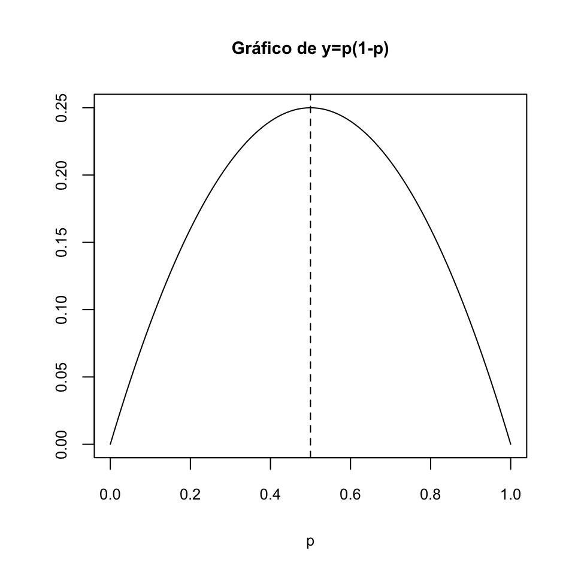


Por lo tanto, para que el nivel de significación del contraste sea $\alpha$, 

> Rechazaremos $H_0$ si $T_0>t_{n-1,1-\alpha}$

Llamaremos a esta regla una **regla de rechazo** para este tipo de contraste.

Volvamos a nuestro ejemplo de los jóvenes diabéticos 
$$
\left\{\begin{array}{l}
H_{0}:\mu=2.5\\ 
H_{1}:\mu > 2.5
\end{array}
\right.
$$
Si $\alpha=0.05$ y $n=40$, el umbral a partir del cual rechazamos $H_0$ es $t_{n-1,1-\alpha}=t_{39,0.95}=$`qt(0.95,39)`=1.685.

En nuestra muestra tenemos que $\overline{x}=3.2$, $\widetilde{s}=1.5$ y $n=40$, por lo tanto el estadístico de contraste vale
$$
T_0=\frac{3.2-2.5}{1.5/\sqrt{40}}=2.95
$$

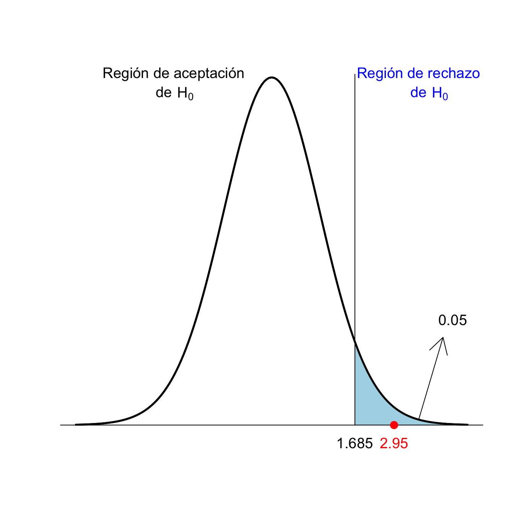


Como 2.95>1.685, concluimos con un nivel de significación del 5% que el nivel medio de calcio en sangre en los jóvenes diabéticos es mayor que en los jóvenes sanos.


Vamos a ver como entra en juego el p-valor. Recordemos que rechazamos $H_0$ cuando $T_0>t_{n-1,1-\alpha}$:
$$
\begin{array}{l}
\text{Rechazamos $H_0$} \Longleftrightarrow T_0> t_{n-1,1-\alpha}\\
\qquad \Longleftrightarrow P(T\geq T_0)< P(T\geq t_{n-1,1-\alpha})\\
\qquad \Longleftrightarrow P(T\geq T_0)< 1-P(T\leq t_{n-1,1-\alpha})=1-(1-\alpha)=\alpha\\
\qquad \Longleftrightarrow P(T\geq T_0)<\alpha
\end{array}
$$

I ahora notad que $P(T\geq T_0)$ es la probabilidad de que, si $H_0$ es verdadera, el estadístico de contraste $T$ tome un valor tan o más extremo, en el sentido de $H_1: \mu>2.5$, que el obtenido en nuestra muestra, $T_0$: ¡es el **p-valor** del contraste! Por lo tanto, tenemos otra regla de rechazo (equivalente a la anterior):

> Rechazaremos $H_0$ si el p-valor es menor que $\alpha$

En nuestro ejemplo, ya hemos calculado $T_0=2.95$. Entonces,
$$
\text{p-valor} =P(T\geq 2.95)=\texttt{1-pt(2.95,39)} =0.003
$$
Como el p-valor es menor que 0.05:

> Concluimos con un nivel de significación del 5% que el nivel medio de calcio en plasma en los jóvenes diabéticos es mayor que en los jóvenes sanos. 

Esto también se suele expresar diciendo que

> Hemos obtenido evidencia estadísticamente significativa de que el nivel medio de calcio en plasma en los jóvenes diabéticos es mayor que en los jóvenes sanos.  


\BeginKnitrBlock{rmdrecordau}<div class="rmdrecordau">A este tipo de procedimiento para comparar la $\mu$ de una variable con un valor dado $\mu_0$, usando que  
$$
T=\frac{\overline{X}-\mu_0}{{\widetilde{S}_X}/{\sqrt{n}}}
$$
sigue una distribución t de Student con $n-1$ grados de libertad, $t_{n-1}$,  se le llama un **test t**. En la próxima lección explicaremos cuándo se puede usar.</div>\EndKnitrBlock{rmdrecordau}


Fijaos en que nuestra conclusión ha sido que "concluimos con un **nivel de significación del 5%** que el nivel medio de calcio en sangre en los jóvenes diabéticos es mayor que en los jóvenes sanos." Por lo tanto, **reconocemos una probabilidad de equivocarnos del 5%**. Si en realidad el nivel medio de calcio en sangre en los jóvenes diabéticos es el mismo que en los sanos, la probabilidad que tenemos de equivocarnos y concluir que el nivel medio de calcio en sangre en los jóvenes diabéticos es mayor que en los sanos es del 5%.

\BeginKnitrBlock{rmdimportant}<div class="rmdimportant">Que tengamos un 5% de probabilidad de equivocarnos significa que, si la hipótesis nula es verdadera, un 5% de las muestras aleatorias de 40 diabéticos sanos dan un valor de $T$ que nos hace rechazar la hipótesis nula.</div>\EndKnitrBlock{rmdimportant}

\BeginKnitrBlock{example}<div class="example"><span class="example" id="exm:unnamed-chunk-510"><strong>(\#exm:unnamed-chunk-510) </strong></span>Vamos a estudiar esta tasa de aciertos por medio de una simulación.

</div>\EndKnitrBlock{example}


Primero supondremos que el nivel medio real es 2.5, y simularemos la probabilidad de error de tipo I. Como  estamos realizando el contraste con nivel de significación 0.05, esperamos alrededor de un 5% de errores de tipo I. Para fijar ideas, modelaremos la población de jóvenes diabéticos por medio de una variable aleatoria normal $N(2.5,0.5)$. La $\sigma=0.5$ nos la hemos inventado.  Damos el código R de la simulación, por si la queréis repetir en casa. Cada simulación dará resultados diferentes, pero en general serán muy parecidos a los nuestros.


```r
mu0=2.5
sigma0=0.5
```
El umbral $L_0$ para $n=40$ y $\alpha=0.05$ es $t_{39,0.975}$:


```r
L0=qt(0.95,39)
L0
```

```
## [1] 1.684875
```

La función `estadístico` siguiente toma una muestra aleatoria de tamaño $n$ de una variable $N(\mu, \sigma)$ y calcula el estadístico de contraste $T$:


```r
estadístico=function(n,mu,sigma){
muestra=rnorm(n,mu,sigma) 
(mean(muestra)-mu0)/(sd(muestra)/sqrt(n))
}
```

Ahora, repetimos 200 veces el proceso de tomar una muestra aleatoria de tamaño 40 de nuestra población y calcular la $T$ correspondiente. Llamamos `Tes` al vector de estos valores de $T$:


```r
Tes=replicate(200,estadístico(40,mu0,sigma0))
```

Finalmente, calculamos la proporción de veces que la $T$ ha dado un valor mayor que el umbral $L_0$, es decir, la proporción de veces que rechazamos la hipótesis nula $\mu=2.5$ y que por lo tanto cometemos un error de tipo I.


```r
p.error.Tipo.I=length(which((Tes>L0)==TRUE))/200
p.error.Tipo.I
```

```
## [1] 0.055
```

Hemos cometido un 5.5% de errores de tipo I, muy cercano al 5% "poblacional" (en el conjunto de todas las muestras aleatorias que pudiéramos tomar).

Ahora vamos a suponer que el nivel medio real es estrictamente mayor que 2.5, y vamos a simular los errores de tipo II, para ver con qué frecuencia los cometemos. Para empezar, generamos al azar un vector de 100 $\mu$'s entre 2.6 y 3, de manera que todos los valores tengan la misma probabilidad de salir.


```r
mus=runif(100,2.6,3)
```

Y ahora lo que haremos será lo siguiente. Para cada $\mu_i$ de este vector, tomaremos como "población de diabéticos" una variable $N(\mu_i,0.5)$. A continuación, para cada una de estas poblaciones, repetiremos 200 veces el proceso de tomar una muestra aleatoria simple de tamaño 40 de esta población y calcular la $T$ correspondiente. Después, para cada población, miraremos la proporción de veces que la $T$ ha dado menor o igual que el umbral $L_0$, es decir, la proporción de veces que  aceptaríamos la hipótesis nula $\mu=2.5$ y que por lo tanto cometeríamos un error de tipo II. Organizamos todas estas proporciones en un vector que llamamos **p.error.Tipo.II**.


```r
p.error.Tipo.II=rep(1,100)
for (j in 1:100){
  Tes=replicate(200,estadístico(40,mus[j],sigma0))    
  p.error.Tipo.II[j]=length(which((Tes<=L0)==TRUE))/200
}
p.error.Tipo.II
```

```
##   [1] 0.015 0.275 0.055 0.005 0.495 0.040 0.000 0.005 0.420 0.090 0.000 0.085
##  [13] 0.245 0.000 0.195 0.000 0.080 0.000 0.525 0.000 0.000 0.410 0.140 0.000
##  [25] 0.000 0.330 0.050 0.000 0.010 0.610 0.460 0.575 0.000 0.000 0.005 0.000
##  [37] 0.110 0.000 0.000 0.000 0.000 0.000 0.015 0.115 0.020 0.000 0.000 0.000
##  [49] 0.040 0.015 0.000 0.005 0.000 0.000 0.045 0.190 0.000 0.005 0.560 0.085
##  [61] 0.000 0.000 0.595 0.015 0.005 0.000 0.000 0.000 0.500 0.000 0.085 0.195
##  [73] 0.370 0.645 0.015 0.000 0.245 0.130 0.140 0.590 0.315 0.325 0.000 0.105
##  [85] 0.000 0.085 0.000 0.460 0.000 0.000 0.005 0.175 0.065 0.390 0.000 0.000
##  [97] 0.010 0.000 0.000 0.000
```

En algunos casos no hemos cometido ningún error de tipo II, y en otros, en más de la mitad de las veces. La proporción media de errores de tipo II ha sido:


```r
mean(p.error.Tipo.II)
```

```
## [1] 0.1179
```

Si tomamos muestras más grandes, la probabilidad de error de tipo II disminuye. Comprobémoslo repitiendo este segundo experimento con muestras de tamaño 400.


```r
p.error.Tipo.II.400=rep(1,100)
for (j in 1:100){
Tes=replicate(200,estadístico(400,mus[j],sigma0))    
  p.error.Tipo.II.400[j]=length(which((Tes<=L0)==TRUE))/200
}
mean(p.error.Tipo.II.400)
```

```
## [1] 2e-04
```

\BeginKnitrBlock{rmdcorbes}<div class="rmdcorbes">Por si no os habéis encontrado nunca con la notación que ha usado R para dar este resultado, es la llamada **notación científica** y se usa para expresar números muy grandes o muy pequeños. La `e` significa "multiplica el número que me precede por 10 elevado al número que me sigue". Así, `2e-04` significa $2\times 10^{-4}$.</div>\EndKnitrBlock{rmdcorbes}
  

Multiplicando por 10 el tamaño de las muestras, hemos bajado de una tasa de errores  de tipo II del 11.79% al 0.02%.

Recordad que la **potencia** de un contraste es la probabilidad de **no** cometer un error de tipo II. Hemos visto que tomando muestras más grandes, la proporción de errores de tipos II ha disminuido. Esto es general: 


\BeginKnitrBlock{rmdimportant}<div class="rmdimportant">Si fijamos el nivel de significación, cuanto mayores son las muestras, mayor es la potencia del contraste.</div>\EndKnitrBlock{rmdimportant}

Volvemos a la situación general en la que tenemos una variable aleatoria $X$ normal $N(\mu,\sigma)$ y queremos comparar $\mu$ con cierto valor $\mu_0$ y supongamos que ahora buscamos evidencia de que $\mu<\mu_0$, de manera que el contraste es
$$
\left\{\begin{array}{l}
H_{0}:\mu=\mu_0\\ 
H_{1}:\mu < \mu_0
\end{array}
\right.
$$
En este caso, el p-valor es $P(T\leq T_0)$ y, razonando exactamente igual que antes, obtenemos las dos reglas de rechazo equivalentes siguientes:

> Rechazaremos $H_0$ si $T_0< t_{n-1,\alpha}$ 

> Rechazaremos $H_0$ si el p-valor es menor que $\alpha$


¿Y qué pasa si ahora buscamos evidencia de que $\mu$ **es diferente** de $\mu_0$? Es decir, si nos planteamos el contraste
$$
\left\{\begin{array}{l}
H_{0}:\mu=\mu_0\\ 
H_{1}:\mu\ 
\neq \mu_0
\end{array}
\right.
$$

En este caso, rechazaremos $H_{0}$ cuando $\overline{X}$ es lo bastante diferente de $\mu_0$, por encima o por debajo de $\mu_0$, y esto lo traducimos en que rechazaremos $H_{0}$ cuando $|T_0|$ (el **valor absoluto** de $T_0$) sea mayor que cierto umbral $L_0$, que determinamos a partir de $\alpha$ como antes:

$$
\begin{array}{l}
\alpha = P(\text{Rechazar } H_{0}| H_{0} \text{ verdadera})=P(|T|> L_0)\\
\hphantom{\alpha} = P(T< -L_0\text{ o } T>L_0)= P(T< -L_0)+P(T>L_0)\\
\hphantom{\alpha} =2P(T>L_0) \text{ (por la simetría de $t_{n-1}$)}\\
\Longrightarrow \alpha/2=P(T>L_0)= 1-P(T\leq L_0) \\
\Longrightarrow P(T\leq L_0)=1-\alpha/2\Longrightarrow 
L_0= t_{n-1,1-\alpha/2}
\end{array}
$$

Por lo tanto, en un contraste bilateral con nivel de significación $\alpha$, tenemos la regla de rechazo siguiente:

> Rechazaremos $H_0$ si $|T_0|>t_{n-1,1-\alpha/2}$

En este caso, el p-valor será la probabilidad de que $T$ tome un valor tan o más extremo que $T_0$, en el sentido de la hipótesis alternativa, es decir, más lejos de 0 que $T_0$: mayor que $|T_0|$ o menor que $-|T_0|$:
$$
\text{p-valor} =P(T\leq -|T_0|)+P(T\geq |T_0|)=2 P(T\geq |T_0|).
$$
Fijaos en que usamos que, por la simetría de las variables t de Student, $P(T\leq -|T_0|)=P(T\geq |T_0|)$.

Por lo tanto,
$$
\begin{array}{l}
\text{Rechazamos $H_0$} \Longleftrightarrow |T_0|>t_{n-1,1-\alpha/2}\\
\qquad \Longleftrightarrow P(T\geq |T_0|)<{\alpha}/{2}\\
\qquad\Longleftrightarrow 2 P(T\geq |T_0|)<\alpha\\
\qquad \Longleftrightarrow \text{p-valor} < \alpha 
\end{array}
$$

Así pues, en un contraste bilateral con nivel de significación $\alpha$ también tenemos la regla de rechazo:

> Rechazaremos $H_0$ si el p-valor es menor que $\alpha$

\BeginKnitrBlock{rmdimportant}<div class="rmdimportant">En resumen, en un contraste de una media $\mu$ usando un test t sobre una muestra de tamaño $n$ y nivel de significación $\alpha$:

* Si $H_1:\mu> \mu_0$:
  
    * Rechazamos $H_0$ si $T_0>t_{n-1,1-\alpha}$
    * El p-valor es $P(T\geq T_0)$
    * Rechazamos $H_0$ si el p-valor es más pequeño que $\alpha$

* Si $H_1:\mu< \mu_0$:
  
    * Rechazamos $H_0$ si $T_0< t_{n-1,\alpha}$
    * El p-valor es $P(T\leq T_0)$
    * Rechazamos $H_0$ si el p-valor es más pequeño que $\alpha$

* Si $H_1:\mu\neq \mu_0$:
  
    * Rechazamos $H_0$ si $|T_0|>t_{n-1,1-\alpha/2}$
    * El p-valor es $2P(T\geq |T_0|)$
    * Rechazamos $H_0$ si el p-valor es más pequeño que $\alpha$
</div>\EndKnitrBlock{rmdimportant}

\BeginKnitrBlock{example}<div class="example"><span class="example" id="exm:ttestmu20"><strong>(\#exm:ttestmu20) </strong></span>Sea $X$ una población normal. Queremos realizar el contraste
$$
\left\{\begin{array}{l}
H_{0}:\mu=20\\ H_{1}:\mu>20
\end{array}
\right.
$$
con un nivel de significación de 0.05. Tomamos una muestra aleatoria simple de $n=25$ observaciones y obtenemos $\overline{x}=20.7$ y $\widetilde{s}=1.8$. ¿Qué decidimos?
</div>\EndKnitrBlock{example}


* Estadístico de contraste: 
$$
T=\dfrac{\overline{X}-\mu_0}{\widetilde{S}_X/\sqrt{n}}
$$
que si $\mu=\mu_0$, tiene distribución $t_{n-1}$.

* Toma el valor 
$$
T_0=\dfrac{20.7-20}{{1.8}/{\sqrt{25}}}=1.944
$$


* p-valor
$$
P(T\geq 1.944)=\texttt{1-pt(1.944,24)}=0.032
$$

* **Decisión**: Como el p-valor es más pequeño que 0.05, rechazamos $H_0$ y concluimos (con $\alpha=0.05$) que $\mu>20$. Es decir, hemos obtenido evidencia estadísticamente significativa de que $\mu>20$.

\BeginKnitrBlock{example}<div class="example"><span class="example" id="exm:unnamed-chunk-524"><strong>(\#exm:unnamed-chunk-524) </strong></span>Sea $X$ una población normal. Queremos realizar el contraste
$$
\left\{\begin{array}{l}
H_{0}:\mu=20\\ H_{1}:\mu>20
\end{array}
\right.
$$
con un nivel de significación de 0.01. Con la misma muestra aleatoria simple del ejemplo anterior, ¿qué decidimos?
</div>\EndKnitrBlock{example}

El p-valor es el mismo que antes, 0.032, porque el contraste y la muestra son los mismos. Como este p-valor ahora es mayor que 0.01, no podemos rechazar $H_0$ con $\alpha=0.01$ y tenemos que aceptar que $\mu=20$. 

\BeginKnitrBlock{rmdnote}<div class="rmdnote">Fijaos en que para reducir la probabilidad de equivocarnos rechazando $H_0$ si es verdadera, facilitamos aceptarla "por si acaso".
</div>\EndKnitrBlock{rmdnote}

\BeginKnitrBlock{example}<div class="example"><span class="example" id="exm:ttestmu20petit"><strong>(\#exm:ttestmu20petit) </strong></span>Sea $X$ una población normal. Queremos realizar el contraste
$$
\left\{\begin{array}{l}
H_{0}:\mu=20\\ H_{1}:\mu< 20
\end{array}
\right.
$$
con un nivel de significación de 0.05. Con la misma muestra aleatoria simple de los ejemplos anteriores ($n=25$, $\overline{x}=20.7$, $\widetilde{s}=1.8$), ¿qué decidimos?
</div>\EndKnitrBlock{example}


* El estadístico de contraste y su valor $T_0$ son el mismos que antes. 


* p-valor
$$
P(T\leq 1.944)=\texttt{pt(1.944,24)}=0.968
$$

* **Decisión**: Como  el p-valor es mayor que 0.05, no podemos rechazar $H_0$ y tenemos que aceptar que $\mu=20$. Es decir, no hemos obtenido evidencia estadísticamente significativa de que $\mu<20$.

\BeginKnitrBlock{rmderror}<div class="rmderror">Veamos, ¿cómo queríais que hubiéramos encontrado evidencia de que $\mu<20$ si nos ha salido una media muestral 20.7, mayor que 20? No hacía falta hacer ningún cálculo (y exponernos a equivocarnos), bastaba razonar un poco.</div>\EndKnitrBlock{rmderror}


\BeginKnitrBlock{example}<div class="example"><span class="example" id="exm:ttest1bis"><strong>(\#exm:ttest1bis) </strong></span>Sea $X$ una población normal. Queremos realizar el contraste
$$
\left\{\begin{array}{l}
H_{0}:\mu=20\\ H_{1}:\mu
\neq 20
\end{array}
\right.
$$
con un nivel de significación de 0.05. Con la misma muestra aleatoria simple de los ejemplos anteriores, ¿qué decidimos?
</div>\EndKnitrBlock{example}

Recordemos que $n=25$, $\overline{x}=20.7$ y $\widetilde{s}=1.8$. El estadístico de contraste tomaba el valor $T_0=1.944$.

Ahora el p-valor es
$$
2\cdot P(T\geq 1.944)=\texttt{2(1-pt(1.944,24))}=0.064
$$

Como  el p-valor es más grande que $\alpha$, no podemos rechazar $H_0$: no podemos afirmar con $\alpha=0.05$ que $\mu\neq 20$. Es decir, no hemos obtenido evidencia estadísticamente significativa de que $\mu\neq 20$.

\BeginKnitrBlock{rmdromans}<div class="rmdromans">¿Cómo puede ser que, con la misma muestra y mismo nivel de significación, podamos concluir que $\mu> 20$ pero no podamos concluir que $\mu \neq 20$? ¿Acaso $\mu> 20$ no implica que $\mu \neq 20$?</div>\EndKnitrBlock{rmdromans}

Veamos, si hubiéramos demostrado que seguro que $\mu> 20$, está claro que esto implicaría que $\mu
\neq 20$. Pero hemos llegado a la conclusión $\mu> 20$ asumiendo una cierta probabilidad de cometer un error de tipo I, y nos preguntamos si podemos decidir que $\mu \neq 20$ asumiendo el mismo riesgo de equivocarnos. En esta situación las reglas de la lógica aristotélica ya no funcionan.

Fijaos en que, en realidad, lo que pasa es que encontraríamos evidencia de que $\mu \neq 20$ si $T$ fuera muy grande o muy pequeño. Por lo tanto, en el contraste bilateral tenemos dos fuentes de error de tipo I: que por puro azar $T$ nos salga muy grande o que nos salga muy pequeño.  En cambio, solo encontraremos evidencia de que $\mu> 20$ si $T$ es muy grande, y por tanto en el contraste unilateral tenemos una sola fuente de error de tipo I. Entonces, para garantizar la misma probabilidad de error de tipo I, tenemos que ser mucho más exigentes en el contraste bilateral, donde nos podemos equivocar de dos maneras diferentes, que en el unilateral. Por eso es más fácil rechazar la hipótesis nula en un contraste unilateral que en uno bilateral.


\BeginKnitrBlock{example}<div class="example"><span class="example" id="exm:unnamed-chunk-528"><strong>(\#exm:unnamed-chunk-528) </strong></span>Sea $X$ una población normal. Queremos realizar el contraste
$$
\left\{\begin{array}{l}
H_{0}:\mu=20\\ H_{1}:\mu \neq 20
\end{array}
\right.
$$
con un nivel de significación de 0.05. Tomamos una muestra aleatoria simple de $n=25$ observaciones y obtenemos $\overline{x}=19$ y $\widetilde{s}=1.8$. ¿Qué decidimos?
</div>\EndKnitrBlock{example}


* Estadístico de contraste: 
$T=\dfrac{\overline{X}-\mu_0}{\widetilde{S}_X/\sqrt{n}}$


* Toma el valor 
$$
T_0=\dfrac{19-20}{{1.8}/{\sqrt{25}}}=-2.778
$$

* p-valor
$$
2P(T\geq -2.778)=\texttt{2(1-pt(-2.778,24))}=1.99
$$

* Decisión: como  el p-valor es mayor que $\alpha$, no podemos rechazar $H_0$.

\BeginKnitrBlock{rmderror}<div class="rmderror">El p-valor es una probabilidad. ¿Cómo queréis que dé 1.99?</div>\EndKnitrBlock{rmderror}

**NO!** El p-valor no es $2\cdot P(T\geq T_0)$, sino $2\cdot P(T\geq |T_0|)$. Por lo tanto, el p-valor es
$$
2\cdot P(T\geq 2.778)=\texttt{2(1-pt(2.778,24))}=0.01
$$
y como este p-valor es más pequeño que $\alpha$, podemos rechazar $H_0$ y concluir, con nivel de significación 0.05, que $\mu\neq 20$. Es decir,  hemos obtenido evidencia estadísticamente significativa de que $\mu\neq 20$.


## Recapitulación 

Repasemos los conceptos introducidos hasta ahora, y pongamos nombre a  otros:

* **Nivel de significación**, $\alpha$: probabilidad de rechazar $H_0$ si esta es verdadera (probabilidad de **error de tipo I**, de falso positivo).

* **Nivel de confianza**, $1-\alpha$: probabilidad de aceptar $H_0$ si esta es verdadera (probabilidad de  verdadero negativo).

* **Potencia**, $1-\beta$: probabilidad de rechazar $H_0$ si $H_1$ es verdadera (probabilidad de verdadero  positivo).


* **Estadístico de contraste**: lo que calculamos sobre una muestra aleatoria simple y nos permite definir una regla de rechazo de $H_{0}$.

* **Región crítica o de rechazo**: el rango de valores del estadístico de contraste para los que rechazamos $H_{0}$ con un nivel de significación $\alpha$ dado.

* **Región de aceptación**: el complementario de la región de rechazo, es decir, el rango de valores del estadístico de contraste para los que aceptamos $H_{0}$ con un nivel de significación $\alpha$ dado.

* **p-valor**: la probabilidad de que, si $H_0$ es verdadera, el estadístico de contraste tome sobre una muestra aleatoria simple del mismo tamaño que la nuestra un valor tan o más extremo (en el sentido de $H_1$) que el obtenido sobre nuestra muestra.


\BeginKnitrBlock{example}<div class="example"><span class="example" id="exm:unnamed-chunk-530"><strong>(\#exm:unnamed-chunk-530) </strong></span>Si realizamos un test t para efectuar un contraste
$$
\left\{\begin{array}{l}
H_{0}:\mu=\mu_0\\ 
H_{1}:\mu > \mu_0
\end{array}
\right.
$$
rechazamos $H_0$ con nivel de significación $\alpha$ (o con nivel de confianza $1-\alpha$) cuando
$$
T=\dfrac{\overline{X}-\mu_0}{{\widetilde{S}_X}/{\sqrt{n}}}>t_{n-1,1-\alpha}
$$
</div>\EndKnitrBlock{example}

Por lo tanto:

* **Estadístico de contraste**: este $T$

* **Región crítica** para el nivel de significación $\alpha$: el intervalo $(t_{n-1,1-\alpha},\infty)$

* **Región de aceptación** para el nivel de significación $\alpha$: el intervalo $(-\infty,t_{n-1,1-\alpha}]$

* **p-valor**: $P(T\geq T_0)$, donde $T_0$ denota el valor de $T$ en nuestra muestra

Si en cambio el contraste que queremos efectuar es
$$
\left\{\begin{array}{l}
H_{0}:\mu=\mu_0\\ 
H_{1}:\mu < \mu_0
\end{array}
\right.
$$
rechazamos $H_0$ con nivel de significación $\alpha$ (o con nivel de confianza $1-\alpha$) cuando
$$
T=\dfrac{\overline{X}-\mu_0}{{\widetilde{S}_X}/{\sqrt{n}}}<t_{n-1,\alpha}
$$

Por lo tanto:

* **Estadístico de contraste**: el mismo $T$ que antes

* **Región crítica** para el nivel de significación $\alpha$: el intervalo $(-\infty,t_{n-1,\alpha})$

* **Región de aceptación** para el nivel de significación $\alpha$: el intervalo $[t_{n-1,\alpha},\infty)$

* **p-valor**: $P(T\leq T_0)$

Finalmente, si el contraste que queremos realizar es
$$
\left\{\begin{array}{l}
H_{0}:\mu=\mu_0\\ 
H_{1}:\mu 
\neq \mu_0
\end{array}
\right.
$$
rechazamos $H_0$ con nivel de significación $\alpha$ (o con nivel de confianza $1-\alpha$) cuando
$$
|T|=\left|\dfrac{\overline{X}-\mu_0}{{\widetilde{S}_X}/{\sqrt{n}}}\right|>t_{n-1,1-\alpha/2}
$$
Por lo tanto:

* **Estadístico de contraste**: el mismo $T$ que antes

* **Región crítica** para el nivel de significación $\alpha$: la unión de intervalos $(-\infty,-t_{n-1,1-\alpha/2})\cup (t_{n-1,1-\alpha/2},\infty)$

* **Región de aceptación** para el nivel de significación $\alpha$: el intervalo $[-t_{n-1,1-\alpha/2},t_{n-1,1-\alpha/2}]$

* **p-valor**: $2P(T\geq |T_0|)$

### Intervalo de confianza de un contraste {-}

El **intervalo de confianza de nivel de confianza $1-\alpha$** de un contraste es un intervalo que tiene una  probabilidad $1-\alpha$ de contener el parámetro poblacional que contrastamos, en el sentido de los intervalos de confianza del tema anterior: se calcula con una fórmula que en un $(1-\alpha)\cdot 100%$ de las veces que la aplicamos a una muestra aleatoria simple, produce un intervalo que contiene el parámetro poblacional.


Este intervalo de confianza se obtiene imponiendo que el estadístico de contraste pertenezca a la región de aceptación para el nivel de significación $\alpha$ y despejando el parámetro poblacional.

* Cuando $H_1$ es bilateral, coincide con el intervalo de confianza dado en el tema anterior.

* Cuando $H_1$ es unilateral, da un intervalo infinito en el lado definido por la hipótesis alternativa.

Por ejemplo, consideremos el caso de un test t para efectuar un contraste
$$
\left\{\begin{array}{l}
H_{0}:\mu=\mu_0\\ 
H_{1}:\mu > \mu_0
\end{array}
\right.
$$
Aceptamos $H_0$ con nivel de significación $\alpha$ cuando
$$
\dfrac{\overline{X}-\mu_0}{{\widetilde{S}_X}/{\sqrt{n}}}\leq t_{n-1,1-\alpha}
$$
Despejando $\mu_0$, obtenemos
$$
\overline{X}- t_{n-1,1-\alpha}\cdot \dfrac{\widetilde{S}_X}{\sqrt{n}}\leq \mu_0
$$
Por lo tanto, el **intervalo de confianza de nivel de confianza $1-\alpha$ para este contraste** es
$$
\Bigg[\overline{X}- t_{n-1,1-\alpha}\cdot \dfrac{\widetilde{S}_X}{\sqrt{n}},\infty\Bigg)
$$
Si la $\mu_0$ que contrastamos pertenece a este intervalo, no podemos concluir que la $\mu$ poblacional sea más mayor que $\mu_0$, y por tanto no podemos rechazar que $\mu=\mu_0$. Los valores de $\mu_0$ en este intervalo son tan grandes, que con nuestra muestra no hemos obtenido evidencia de que la $\mu$ real sea mayor que ellos.

En el ejemplo de los diabéticos de la Sección \@ref(sec:exttest), da el intervalo
$$
\Bigg[3.2- 1.73\cdot \dfrac{1.5}{\sqrt{20}},\infty\Bigg)=[2.62,\infty)
$$

Obtenemos que, con un nivel de confianza del 95%, la concentración media de calcio en sangre en los jóvenes diabéticos es como mínimo 2.62, y que por lo tanto, con este nivel de confianza, no puede ser 2.5, aunque por poco.

Si efectuamos un contraste bilateral con un test t 
$$
\left\{\begin{array}{l}
H_{0}:\mu=\mu_0\\ 
H_{1}:\mu
\neq \mu_0
\end{array}
\right.
$$
aceptamos $H_0$ con nivel de significación $\alpha$ cuando
$$
-t_{n-1,1-\alpha/2}\leq \dfrac{\overline{X}-\mu_0}{{\widetilde{S}_X}/{\sqrt{n}}}\leq t_{n-1,1-\alpha/2}
$$
Despejando $\mu_0$, obtenemos:
$$
\overline{X}- t_{n-1,1-\alpha/2}\cdot \dfrac{\widetilde{S}_X}{\sqrt{n}}\leq \mu_0 \leq \overline{X}+ t_{n-1,1-\alpha/2}\cdot \dfrac{\widetilde{S}_X}{\sqrt{n}}
$$
Por lo tanto, el intervalo de confianza de nivel de confianza $1-\alpha$ para este contraste es
$$
\Bigg[\overline{X}- t_{n-1,1-\alpha/2}\cdot \dfrac{\widetilde{S}_X}{\sqrt{n}},\overline{X}+ t_{n-1,1-\alpha/2}\cdot \dfrac{\widetilde{S}_X}{\sqrt{n}}\Bigg]
$$
¿Os suena? Llamando $q$ a $1-\alpha$, de manera que
$$
1-\frac{\alpha}{2}=1-\frac{1-q}{2}=\frac{1+q}{2},
$$
es el del tema anterior.


\BeginKnitrBlock{rmdrecordau}<div class="rmdrecordau">En resument, dado un contraste de hipótesis, podemos decidir si rechazamos $H_0$ en favor de $H_1$ con nivel de significación $\alpha$ usando:

* **La región crítica**: Si el estadístico de contraste cae dentro de la región crítica para el nivel de significación $\alpha$, rechazamos $H_0$.

* **El p-valor**: Si el p-valor es menor que el nivel de significación $\alpha$, rechazamos $H_0$.

* **El intervalo de confianza**: Si el valor que contrastamos del parámetro poblacional no pertenece al intervalo de confianza de nivel de confianza $1-\alpha$, rechazamos $H_0$.

Los tres métodos son equivalentes. Lo más adecuado es dar el p-valor y el intervalo de confianza: el p-valor para que el lector lo pueda comparar con el nivel de significación que considere oportuno y el intervalo de confianza porque muestra el margen con el cual hemos aceptado o rechazado la hipótesis nula con nuestro nivel de significación.
</div>\EndKnitrBlock{rmdrecordau}

Si no establecemos un nivel de significación $\alpha$, lo habitual es:

* Aceptar $H_0$ si el p-valor es mayor que 0.1: se dice que el p-valor **no es estadísticamente significativo**

* Rechazar $H_0$ si el p-valor es menor que 0.05: se dice que el p-valor **es estadísticamente significativo**

* Si el p-valor está entre 0.05 y 0.1 y no se ha fijado nivel de significación, lo mejor que podéis hacer es no concluir nada y decir que es necesario repetir el estudio con una muestra mayor.

Cuando el p-valor es menor que 0.05, se suelen distinguir tres franjas:

* **Significativo** si está entre 0.01 y 0.05
* **Fuertemente significativo** si está entre 0.001 y 0.01
* **Muy significativo** si es menor que 0.001

Normalmente estas franjas se indican con un código de asteriscos: 

* Un asterisco, *, para los p-valores entre 0.01 y 0.05

* Dos asteriscos, **, para los p-valores entre 0.001 y 0.01

* Tres asteriscos, ***, para los p-valores por debajo de 0.001

Aunque hay otras propuestas:


Dado que rechazamos $H_0$ si, y solo si, el p-valor es menor que $\alpha$, el p-valor de un contraste es el nivel de significación más pequeño para el cual rechazaríamos la hipótesis nula. Es decir:

\BeginKnitrBlock{rmdimportant}<div class="rmdimportant">El p-valor obtenido en un contraste es la probabilidad mínima de equivocarnos que asumimos al rechazar la hipótesis nula si esta es verdadera.</div>\EndKnitrBlock{rmdimportant}

Por lo tanto, por favor, acostumbraos a dar el p-valor, y no la franja de significación donde cae.


### La potencia {-}

Recordad que la **potencia** $1-\beta$ es la probabilidad de rechazar $H_0$ cuando $H_1$ es verdadera.

Por ejemplo, en el ejemplo del calcio en diabéticos de la Sección \@ref(sec:exttest), la regla de rechazo era 
$$
T=\frac{\overline{X}-2.5}{\widetilde{S}_X/\sqrt{n}}>1.685,
$$
por lo tanto la potencia era
$$
1-\beta=P(\text{Rechazar } H_0\,|\, H_1\text{ verdadera})=P(T>1.685\,|\, \mu>2.5).
$$
Esta probabilidad es imposible de calcular, pero hay programas que la saben estimar. Vamos a explicar muy por encima cómo.

Para cada tipo de contraste se tiene una relación numérica entre:


* La **potencia** $1-\beta$

* El **tamaño** de la muestra $n$: la potencia crece con $n$

* El **nivel de significación** $\alpha$: la potencia decrece con $\alpha$

* El **tamaño del efecto**, un valor que cuantifica la diferencia entre el parámetro muestral y el valor contrastado. La potencia crece con el valor absoluto del tamaño del efecto (puesto que, cuanto mayor es la diferencia entre el parámetro muestral y el valor contrastado, más probable es que sea estadísticamente significativa y por tanto rechacemos la hipótesis nula).

Esta relación permite calcular cualquiera de los cuatro valores a partir de los otros tres. No entraremos en el detalle de cómo, pero al menos permitidnos mencionar que, con R, el paquete **pwr** proporciona las funciones que permiten hacerlo para los contrastes más usuales.

Entonces, al planear un experimento para realizar un contraste, lo que hay que hacer es:

* Fijar el nivel de significación deseado

* Fijar la potencia deseada

* Estimar el tamaño del efecto esperado (a partir de nuestra teoría, de nuestra experiencia, de los resultados de otros estudios...) o que queramos detectar (¿para rechazar la hipótesis nula nos bastará un tamaño del efecto pequeño o lo requeriremos grande?)

y usar un programa adecuado que calcule el tamaño de la muestra necesario para lograr la potencia deseada a partir de estos valores.

\BeginKnitrBlock{rmdcaution}<div class="rmdcaution">Desconfiad de los trabajos donde esto no se haga. Podría ser que la potencia fuera muy baja y hubiera un **sesgo de infrapotencia** (*underpower*): se necesitaba un efecto muy grande para poder rechazar la hipótesis nula y publicar el artículo.</div>\EndKnitrBlock{rmdcaution}


### El riesgo de falso positivo {-}

El paquete **statcheck** de R permite revisar de manera automática todos los cálculos de un artículo escrito en un formato concreto en psicología y comprobar los p-valores. [Los autores del paquete analizaron 30,000 artículos](https://link.springer.com/article/10.3758/s13428-015-0664-2) y concluyeron que: 

> "Hemos encontrado que la mitad de los artículos contienen al menos un p-valor erróneo. Y uno de cada ocho artículos contiene un p-valor erróneo que además afecta la conclusión estadística."

Por lo tanto,

* Cualquier artículo puede dar un p-valor pequeño que esté equivocado

No os fiéis de los resultados. Si las conclusiones os interesan, revisad los cálculos.

Además, tened presente que:

* Cualquier estudio mal diseñado o mal realizado puede dar un p-valor pequeño... que no signifique absolutamente nada.

     Si las conclusiones de un estudio os interesan, revisad si el experimento ha sido bien diseñado y ejecutado.
    

* Cualquier estudio perfectamente diseñado y realizado puede dar por puro azar un p-valor pequeño... que implique un positivo falso.

    Contra esto último no podemos hacer nada, salvo ser escépticos. 

Bueno. sí que podemos hacer algo. Calcular el  **riesgo de falso positivo**, **FPR**, del contraste, que es
$$
P(H_0\text{ verdadera}|H_0\text{ rechazada}).
$$
Por el teorema de Bayes (notad que interpretamos $H_1$ como lo contrario de $H_0$)
$$
\begin{array}{rl}
FPR&=\dfrac{P(H_0)\cdot P(H_0\text{ rech.}|H_0)}{P(H_0)\cdot P(H_0\text{ rech.}|H_0)+P(H_1)\cdot P(H_0\text{ rech.}|H_1)}\\
& =\dfrac{P(H_0)\cdot \alpha}{P(H_0)\cdot \alpha+(1-P(H_0))\cdot (1-\beta)}\\
& =\dfrac{(1-P(H_1))\cdot \alpha}{(1-P(H_1))\cdot \alpha+ P(H_1)\cdot (1-\beta)}
\end{array}
$$

Por lo tanto, para calcularlo, tenemos que saber el nivel de significación y la potencia y tenemos que decidir *a priori* qué probabilidad asignamos al hecho de que $H_1$ sea verdadera. 


\BeginKnitrBlock{example}<div class="example"><span class="example" id="exm:unnamed-chunk-535"><strong>(\#exm:unnamed-chunk-535) </strong></span>En [un estudio](https://journals.sagepub.com/doi/abs/10.1177/0956797611414726)  se repartieron 66 participantes en dos grupos de 33, a los que llamaremos grupo Bandera y grupo Control, y les mostraron las mismas 4 fotos de edificios. Dos de las fotografías del grupo Bandera  mostraban una bandera de los EE.UU. En las fotografías del grupo Control, estas banderas habían sido eliminadas digitalmente. Para enmascarar el estudio, se les pidió que adivinaran la hora del día en que fueron tomadas las fotos.
</div>\EndKnitrBlock{example}


Después de mirar las fotos, los participantes rellenaron un cuestionario sobre ideas políticas, a partir del cual se puede calcular un "índice de republicanismo" (en el sentido norteamericano del término) $M$ de quien lo ha contestado. Resulta que $M$ fue significativamente más alto en el grupo Bandera que en el grupo Control, y con un nivel de significación $\alpha=0.05$ los autores del estudio concluyeron que mirar fotos con banderas estatales  "derechiza" tus ideas políticas. Vamos a estimar el riesgo que este positivo sea falso.

Como *a priori* encontramos muy improbable que la conclusión sea cierta, le asignaremos una probabilidad de $P(H_1)=0.1$ y gracias. Usaremos su $\alpha=0.05$, y si se calcula la potencia del contraste publicado, da 0.5.

Entonces 
$$
FPR =\dfrac{0.9\cdot 0.05}{0.9\cdot 0.05+0.1\cdot 0.5}=0.47
$$
Por lo tanto, *a posteriori*, creemos que hay un 47% de probabilidades de que $H_1$ sea falsa y un 53% de probabilidades de que $H_1$ sea verdadera.


## Test


**(1)** ¿Qué significa que en un contraste de hipótesis tomemos un nivel de significación del 1%? Marca la respuesta correcta:


1. Que un 1% de las veces que la hipótesis nula sea falsa la rechazaremos en favor de la alternativa.
1. Que un 1% de las veces que la hipótesis nula sea falsa la aceptaremos.
1. Que un 1% de las veces que la hipótesis nula sea verdadera la rechazaremos en favor de la alternativa.
1. Que un 1% de las veces que la hipótesis nula sea verdadera la aceptaremos.
1. Que un 1% de las veces rechazaremos la hipótesis nula.
1. Que un 1% de las veces aceptaremos la hipótesis nula.
1. Todas las otras respuestas son incorrectas. 


 
**(2)**  Al analizar los resultados de un ensayo clínico, se concluye que la tasa de curación de los dos tratamientos estudiados son diferentes, con $p=0.034$. Esto significa (marca todas las respuestas correctas):

1.  Que  hay un 3.4% de probabilidad de que, si se repite el estudio, no se encuentren diferencias significativas.
1.  Que  hay un 3.4% de probabilidad de que la tasa de curación de los tratamientos estudiados sean iguales.
1.  Que hay un 3.4% de diferencia, o más, en las tasas de curación de los tratamientos estudiados.
1.  Que ha habido un 3.4% de diferencia, o más, en las tasas de curación de los tratamientos en nuestras muestras.
1.  Que hay un 3.4% de probabilidad de que la diferencia obtenida entre las tasas de curación, o una aún mayor, se deba al azar.
1. Todas las otras respuestas son incorrectas. 


**(3)** En un pequeño ensayo aleatorio simple ciego de un nuevo tratamiento en pacientes con infarto de miocardio agudo, la mortalidad en el grupo tratado fue la mitad que en el grupo control, pero
la diferencia no resultó estadísticamente significativa. Podemos concluir que (marca todas las respuestas correctas):

1.  Como la diferencia no es estadísticamente significativa, el tratamiento es inútil. 
1. Podría ser que  el contraste tuviera poca potencia, y por eso la diferencia detectada no ha sido estadísticamente significativa.
1. La reducción observada de la mortalidad es tan grande que deberíamos introducir el tratamiento inmediatamente, aunque dicha reducción no sea   estadísticamente significativa.
1. Esto se debe a que el ensayo fue simple ciego, y no doble ciego.
1. Es conveniente llevar a cabo un nuevo ensayo sobre una muestra de pacientes de mayor tamaño.
1. Todas las otras respuestas son incorrectas. 


**(4)** En un estudio donde se contrastó si los individuos con hipertensión arterial tienen un mayor riesgo de sufrir un infarto de miocardio que los individuos normotensos, se obtuvo un p-valor de 0.02. ¿Qué quiere decir esto?
 (Marca una sola respuesta.)


1. La probabilidad de que los hipertensos tengan más riesgo de sufrir un infarto de miocardio que los normotensos es 0.02
1. La probabilidad de que los hipertensos tengan más riesgo de sufrir un infarto de miocardio que los normotensos es 0.98
1. Un hipertenso tiene una probabilidad de sufrir un infarto de miocardio un 2% mayor que un normotenso.
1. En las muestras que hemos usado en el estudio, la proporción de hipertensos que han sufrido un infarto de miocardio es un 2% mayor que la de normotensos que han sufrido un infarto de miocardio 
1. Ninguna de las otras respuestas es correcta. 


**(5)** En un estudio sobre lactancia materna e inteligencia, a 300 niños
que fueron muy pequeños al nacer se les dio la leche materna de su madre o leche infantil, a elección de la madre. A la edad de 8 años, se midió el CI (cociente intelectual) de estos niños. El CI medio en el grupo de  leche infantil fue 92.8, en comparación con un CI medio de 103.0 en el grupo de leche materna. La diferencia fue significativa, $p <0.001$. Marca todas  las afirmaciones correctas:

1.  Hay evidencia estadísticamente significativa de que la alimentación mediante leche infantil de los bebés muy pequeños reduce su CI a los 8 años. 
1.  Hay evidencia estadísticamente significativa de que elegir alimentar un bebé muy pequeño con leche materna aumenta el CI del niño a los 8 años.
1. Hay evidencia estadísticamente significativa de que el tipo de leche no tiene ningún efecto en el CI subsecuente.
1. La probabilidad de que el tipo de leche no afecte al CI subsiguiente es inferior al 0.1%. 
1. Si la elección del tipo de leche estuviera relacionada con el CI posterior, la probabilidad de que la diferencia observada entre el CI medio en el grupo de leche materna menos  el del grupo de leche infantil y fuera la de este estudio, o menor, es menor que 0.001. 
1. Todas las otras respuestas son incorrectas.  

 
**(6)** En un contraste de hipótesis estadístico, si la hipótesis alternativa es verdadera pero se acepta la hipótesis nula (marca todas las conclusiones correctas, hay al menos una):


1. Se comete un error de tipo I.
1. Se comete  un error de tipo II. 
1. La potencia disminuye.
1. El p-valor es mayor que el nivel de significación. 
1. El p-valor es menor que el nivel de significación. 


**(7)** Siempre que en un contraste de hipótesis NO se rechaza la hipótesis nula, ¿cuáles de las siguientes afirmaciones son correctas?  (Marca todas las respuestas correctas.)


1. Se ha demostrado que la hipótesis nula es verdadera.
1. Se ha demostrado que la hipótesis alternativa es falsa.
1. Se ha encontrado evidencia de que la hipótesis nula es verdadera
1. Se ha encontrado evidencia de que la hipótesis alternativa es falsa
1. Ninguna de las otras afirmaciones es verdadera.


**(8)** Si en un contraste de hipótesis tomamos un nivel de significación del 10% y una potencia del 60% y obtenemos un p-valor $p=0.28$, ¿cuál de las afirmaciones siguientes es verdadera? 

1. Aceptamos la hipótesis nula porque $p>0.1$. 
1. Aceptamos la hipótesis nula porque $p<0.6$.
1. Rechazamos la hipótesis nula porque $p>0.1$.
1. Rechazamos la hipótesis nula porque $p<0.6$.
1. Con los datos dados, no tenemos criterio para aceptar o rechazar la hipótesis nula.


**(9)** En un estudio se trató con un suplemento dietético más dieta a 15 insuficientes renales y solamente con
dieta a 16, de manera que los pacientes conocían qué tratamiento recibieron. Se compararon 20 variables
entre ambos grupos y en una comparación se encontró una diferencia a favor del suplemento  estadísticamente significativa con un nivel de significación del 5% (p-valor $p=0.021$). ¿Cómo interpretas estos resultados? 


1.  El estudio no permite concluir nada, ya si realizamos 20 contrastes con un nivel de significación del 5%, esperamos que alguno dé un resultado estadísticamente significativo aunque no haya diferencia entre los tratamientos
1. El p-valor tan pequeño descarta la posibilidad de un falso positivo en el caso en que se ha encontrado una diferencia estadísticamente significativa
1. El hecho de haber encontrado   una diferencia estadísticamente significativa en una comparación puede deberse a un error de tipo II
1. Con unas muestras de pacientes tan pequeñas, la potencia de los contrastes es muy baja, lo que explica que hayamos obtenido algún resultado estadísticamente significativo
1. Como en un 5% (el nivel de significación) de los contrastes se obtuvo un resultado favorable a favor del suplemento dietético, concluimos que su introducción es eficaz

**(10)** En un contraste que hemos llevado a cabo con nivel de significación 0.05 hemos obtenido un p-valor de 1.8. ¿Cuál ha de ser nuestra decisión?

1. Aceptar la hipótesis nula, porque el p-valor es mayor que el nivel de significación.
1. Rechazar la hipótesis nula, porque el p-valor es tan raro que hace inverosímil que la hipótesis nula sea verdadera.
1. Revisar los cálculos, a ver dónde nos hemos equivocado.
1. Ninguna de las otras respuestas es correcta.

<!--chapter:end:51-Contrastos1.Rmd-->

# Contrastes de hipótesis uni- y biparamétricos

En esta lección simplemente vamos a comentar por encima los contrastes de hipótesis más importantes sobre:

* Una o dos medias

* Dos varianzas

* Una o dos proporciones

## Contrastes para medias

### Test t para una media

Sea $X$ una variable aleatoria de media $\mu$.  Queremos realizar un contraste
$$
\left\{\begin{array}{l}
H_{0}:\mu=\mu_0\\ 
H_{1}:\mu \neq\mu_0\text{ o }\mu >\mu_0\text{ o }\mu<\mu_0
\end{array}
\right.
$$
Para ello, medimos $X$ sobre una muestra aleatoria simple de tamaño $n$ de sujetos de la población.

Supongamos que estamos en una de las dos situaciones siguientes:

* $X$ es normal

* $X$ no es normal pero el tamaño $n$ de la muestra que tomamos es grande (digamos, para fijar ideas, que $n\geq 40$)

En cualquiera de estas dos situaciones, podemos usar el **test t** que hemos explicado en la lección anterior para realizar el contraste. Recordad que este test se basa en el estadístico de contraste
$$
T= \frac{\overline{X}-\mu_{0}}{{\widetilde{S}_X}/{\sqrt{n}}}
$$
que, bajo las condiciones supuestas, sigue (aproximadamente, si $X$ no es normal pero la muestra es grande) una distribución t de Student con $n-1$ grados de libertad. Como ya hemos hecho varios ejemplos de este tipo de test en la lección anterior, aquí no nos vamos a entretener más con él.


### Tests t para dos medias

Sean ahora $X_1$ y $X_2$ dos variables aleatorias de medias $\mu_1$ y $\mu_2$, respectivamente. Queremos realizar un contraste
$$
\left\{\begin{array}{l}
H_{0}:\mu_1=\mu_2\\ 
H_{1}:\mu_1 \neq\mu_2\text{ o }\mu_1 >\mu_2\text{ o }\mu_1<\mu_2
\end{array}
\right.
$$
Para ello, medimos $X_1$ sobre una muestra aleatoria simple de tamaño $n_1$, y $X_2$ sobre una muestra aleatoria simple de tamaño $n_2$.


Supongamos que estamos en una de las dos situaciones siguientes:

* $X_1,X_2$ son  ambas normales 

* $X_1,X_2$ no son ambas normales pero los tamaños $n_1,n_2$ de las muestras  son **ambos** grandes (digamos, para fijar ideas, que $n_1,n_2\geq 40$)

Si se cumple alguna de estas dos condiciones, podemos usar un **test t**, basado en un estadístico de contraste $T$ adecuado que sigue una ley t de Student (aproximadamente, si alguna variable poblacional no es normal pero las dos muestras son grandes). El estadístico de contraste concreto y los grados de libertad de su distribución t de Student dependen de las mismas condiciones que comentábamos al hablar de intervalos de confianza para la diferencia de dos medias:

* De si las dos muestras son:

    * **independientes**: hemos medido $X_1$ y $X_2$ sobre dos muestras aleatorias simples obtenidas de manera independiente la una de la otra; o 
    * **emparejadas**: hemos medido $X_1$ y $X_2$ sobre los individuos de una misma muestra aleatoria simple o hay un emparejamiento natural entre los sujetos de las dos muestras; en particular, en el caso emparejado ha de pasar que $n_1=n_2$.

* Cuando las muestras son independientes, también dependen de si $X_1$ y $X_2$ tienen la **misma varianza** o no, que se ha de decidir con otro contraste.

A continuación os damos las fórmulas, por si tenéis que realizar algún contraste de dos medias "a mano".

Cuando las muestras son **emparejadas**, podemos entender que tenemos una sola muestra (formada por las parejas de sujetos) y consideramos los pares de valores $(X_1,X_2)$ sobre dichas parejas. Entonces, podemos medir para cada pareja la diferencia $D=X_1-X_2$, que tendrá media poblacional $\mu_D=\mu_1-\mu_2$, y traducir el contraste
$$
\left\{\begin{array}{l}
H_{0}:\mu_1=\mu_2\\ 
H_{1}:\mu_1 \neq\mu_2\text{ o }\mu_1 >\mu_2\text{ o }\mu_1<\mu_2
\end{array}
\right.
$$
en el contraste de una sola media
$$
\left\{\begin{array}{l}
H_{0}:\mu_1-\mu_2=0\\ 
H_{1}:\mu_D \neq 0\text{ o }\mu_D >0\text{ o }\mu_D<0
\end{array}
\right.
$$
Es decir, cuando las muestras son emparejadas, consideramos nuestro contraste de dos medias como un contraste de una sola media, usando como muestra las diferencias $X_1-X_2$ sobre nuestras parejas de sujetos. Por lo tanto, si llamamos $\overline{D}$ a la media muestral de $D$ y $\widetilde{S}_D$ a la desviación típica muestral de $D$ sobre nuestra muestra de parejas, y $n$ es el tamaño de la muestra de parejas, el estadístico de contraste es
$$
T=\frac{\overline{D}}{\widetilde{S}_D/\sqrt{n}}
$$
que, cuando $\mu_D=0$, tiene (aproximadamente, si $X_1,X_2$ no son normales pero la $n$ es grande) distribución $t_{n-1}$.


Supongamos ahora que las dos muestras son **independientes**. Sean $\overline{X}_1$ y $\widetilde{S}^2_1$ la media muestral y la varianza muestral de la muestra de $X_1$ y $\overline{X}_2$ y $\widetilde{S}^2_2$ la media muestral y la varianza muestral de la muestra de $X_2$. Sean, además, $\sigma_1^2$ y $\sigma_2^2$ las varianzas (poblacionales) de $X_1$ y $X_2$. Entonces:


* Si $\sigma_1^2=\sigma_2^2$, el estadístico de contraste es
$$
T=\frac{\overline{X}_1-\overline{X}_2}{\sqrt{(\frac{1}{n_1}+\frac{1}{n_2})\cdot \frac{(n_1-1)\widetilde{S}_1^2+(n_2-1)\widetilde{S}_2^2}{n_1+n_2-2}}}
$$
que, cuando $\mu_1=\mu_2$, tiene distribución (aproximadamente, si $X_1,X_2$ no son normales pero $n_1$ y $n_2$ son ambas grandes) $t_{n_1+n_2-2}$.


* Si $\sigma_1^2\neq \sigma_2^2$, el estadístico de contraste es
$$
T=\frac{\overline{X}_1-\overline{X}_2}{\sqrt{\frac{\widetilde{S}_1^2}{n_1}+\frac{\widetilde{S}_2^2}{n_2}}}
$$
que, cuando $\mu_1=\mu_2$, tiene distribución (aproximadamente, si $X_1,X_2$ no son normales pero $n_1$ y $n_2$ son ambas grandes) $t_{\nu}$ con
$$
\nu=\frac{\displaystyle \left( \frac{\widetilde{S}_1^2}{n_1}+\frac{\widetilde{S}_2^2}{n_2}
\right)^2}{\displaystyle \frac{1}{n_1-1}\left(\frac{\widetilde{S}_1^2}{n_1}\right)^2+\frac{1}{n_2-1}\left(\frac{\widetilde{S}_2^2}{n_2}\right)^2}
$$

\BeginKnitrBlock{rmdmercifulgod}<div class="rmdmercifulgod">No hace falta que sepáis estas fórmulas para muestras independientes, pero sí que tenéis que recordar que el estadístico de contraste y su distribución dependen de si las varianzas poblacionales son iguales o diferentes.</div>\EndKnitrBlock{rmdmercifulgod}


Los  grados de libertad de la distribución t de Student usada en un contraste sobre dos muestras de tamaño $n$:

* Si las muestras son independientes, es aproximadamente $2(n-1)$

* Si las muestras están emparejadas, es $n-1$


Esto hace que la probabilidad de error de tipo I de un contraste con muestras emparejadas de tamaño $n$ suela ser más pequeña que la de un contraste con dos muestras independientes de tamaño $n$.  Por ejemplo, supongamos que queremos realizar el contraste 
$$
\left\{
\begin{array}{l}
H_0: \mu_1=\mu_2\\
H_1: \mu_1>\mu_2
\end{array}\right.
$$
y que el estadístico del contraste $T$ sobre dos muestras de tamaños $n_1=n_2=20$ da 1.7. 

* Si las muestras son independientes,
$$
\text{p-valor}=P(T>1.7)\approx `1-pt(1.7,38)}=0.0487
$$

* Si las muestras son emparejadas,
$$
\text{p-valor}=P(T>1.7)=`1-pt(1.7,19)}=0.0527
$$

Por lo tanto, con nivel de significación $\alpha=0.05$, rechazaríamos la hipótesis nula con las muestras independientes y la aceptaríamos con las muestras emparejadas.

A consecuencia de la diferencia en los números de grados de libertad de la distribución del estadístico de contraste, en general **los contrastes con muestras emparejadas permiten usar menos sujetos**.


Todos estos tests t están implementados en la función `t.test` de R. Su argumento es:

* Una muestra de $X$ y el valor con el que queremos contrastar $\mu$, **o**  
una muestra de $X_1$ y una muestra de $X_2$.

* El tipo de contraste, que se especifica igualando el parámetro `alternative` a `"two.sided"` (para contrastes bilaterales, es decir, con $\neq$), `"less"` ($<$) o `"greater"` ($>$); no os olvidéis de las comillas en los valores de este parámetro.

* El tipo de muestras, que se especifica igualando el parámetro `paired` a `FALSE` si son independientes o a `TRUE` si son emparejadas.

* En caso de muestras independientes, si las varianzas son iguales o diferentes, que se especifica igualando el parámetro `var.equal` a `TRUE`  o a `FALSE`.

* El nivel de confianza $1-\alpha$, que se especifica con el parámetro `conf.level`; si el nivel de significación es $\alpha=0.05$, es decir, el nivel de confianza 0.95, no hace falta especificarlo (es su valor por defecto).


### Tests no paramétricos

Si las variables aleatorias  de interés no son (aproximadamente) normales y alguna muestra es pequeña, no podemos usar un test t. Entonces, hay que usar algún **test no paramétrico** que no presuponga nada sobre las distribuciones de las variables aleatorias.

Para contrastes de medias, los recomendados son:

* **Test de Wilcoxon** para una media o para dos medias usando muestras emparejadas (que, recordad, se traduce en un contraste sobre la media de las diferencias).

* **Test de Mann-Whitney(-Wilcoxon)** para dos medias usando muestras independientes.

Ambos se calculan con R con la función `wilcox.test`, con una sintaxis idéntica a la de `t.test` (excepto que no dispone del parámetro `var.equal` ya que ahora no nos interesa lo más mínimo saber si las variables tienen varianzas iguales o diferentes en el caso de contrastes de dos medias con muestras independientes).

\BeginKnitrBlock{rmdimportant}<div class="rmdimportant">Usad tests paramétricos siempre que podáis, pero solo cuando podáis:

* Los mejores tests no paramétricos suelen tener potencia inferior a los mejores tests paramétricos.

* Los tests no paramétricos no suelen producir intervalos de confianza, solo p-valores.

* Pero usar, por ejemplo, un test t cuando no toca, porque alguna variable no sea normal y alguna muestra sea pequeña, puede llevar a conclusiones equivocadas.
</div>\EndKnitrBlock{rmdimportant}


\BeginKnitrBlock{rmdexercici}<div class="rmdexercici">Típca pregunta de MIR (esta, de 2017):

El grosor del pliegue subcutáneo de grasa a nivel del tríceps se utiliza a veces para evaluar la cantidad de grasa corporal. Esta variable no se distribuye normalmente en las poblaciones. Queremos comparar el valor medio de esta variable en dos poblaciones que suponemos presentan distinta condición nutricional. La prueba estadística más adecuada para contrastar la hipótesis es: 

* La prueba de Mann-Whitney.  
* La prueba t de Student.  
* El cálculo del coeficiente de correlación de Pearson. 
* La prueba F de Snedecor.
</div>\EndKnitrBlock{rmdexercici}

### Ejemplos

\BeginKnitrBlock{example}<div class="example"><span class="example" id="exm:temp"><strong>(\#exm:temp) </strong></span>La temperatura media del cuerpo humano, ¿es el valor comúnmente aceptado de 37^o^ C?</div>\EndKnitrBlock{example}

Primero de todo, traducimos esta pregunta en un contraste de hipótesis:

* **Variable aleatoria poblacional**: $X$: temperatura del cuerpo humano en ^o^C, de media $\mu$

* **Contraste**:
$$
\left\{\begin{array}{l}
H_{0}:\mu=37\\
H_{1}:\mu\neq 37
\end{array}\right.
$$

Necesitamos una muestra de temperaturas. Vamos a usar las recogidas por P.A. Mackowiak, S. S. Wasserman y M.M. Levine que ya usamos en el Ejemplo \@ref(exm:tempsIC), y que tenemos guardadas (en grados C) en la variable **Temperatura** de la tabla de datos **Temperaturas.txt**.

El código siguiente define un vector llamado `Temps` con estas temperaturas y calcula su tamaño (la función `str(Temperaturas)` nos muestra la estructura de la tabla de datos `Temperaturas` que hemos definido al importar el fichero **Temperaturas.txt**):


```r
Temperaturas=read.table("Temperaturas.txt",header=TRUE)
str(Temperaturas)
```

```
## 'data.frame':	230 obs. of  3 variables:
##  $ Sexo       : chr  "M" "M" "M" "F" ...
##  $ Pulsaciones: int  69 72 68 75 68 79 71 73 77 81 ...
##  $ Temperatura: num  36.1 37.1 35.7 36.6 37.1 38.5 36.6 36.3 37.3 37.3 ...
```

```r
Temps=Temperaturas$Temperatura
length(Temps)
```

```
## [1] 230
```

Como la muestra es muy grande, podemos usar un test t:


```r
t.test(Temps, mu=37, alternative="two.sided")
```

```
## 
## 	One Sample t-test
## 
## data:  Temps
## t = -5.7104, df = 229, p-value = 3.479e-08
## alternative hypothesis: true mean is not equal to 37
## 95 percent confidence interval:
##  36.76549 36.88581
## sample estimates:
## mean of x 
##  36.82565
```

El resultado contiene:

* El p-valor (`p-value`) del contraste: 3.5·10^-8^, muy pequeño
* El intervalo de confianza del 95% (`95 percent confidence interval`): va de 36.76549^o^ C a 36.88581^o^ C
* La media muestral (`mean of x`): 36.82565

Por tanto, hemos encontrado evidencia estadísticamente significativa de que la temperatura media del cuerpo humano no es de 37^o^ C, y estimamos con un 95% de confianza que esta temperatura media está entre 36.8^o^ C a 36.9^o^ C, entre una y dos décimas por debajo del valor usual de 37^o^ C. Si esto es clínicamente importante o no para definir "fiebre" ya no es un problema de estadística.


\BeginKnitrBlock{example}<div class="example"><span class="example" id="exm:tempHD"><strong>(\#exm:tempHD) </strong></span>La temperatura media de las hombres, ¿es menor que la de las mujeres?</div>\EndKnitrBlock{example}

Traducimos esta pregunta en un contraste de hipótesis:


* **Variables aleatorias poblacionales**:
 
    * $X_h$: temperatura de un hombre en ^o^C, de media $\mu_h$
    * $X_m$: temperatura de una mujer en ^o^C, de media $\mu_m$


* **Contraste**:
$$
\left\{\begin{array}{l}
H_{0}:\mu_h=\mu_m\\
H_{1}:\mu_h< \mu_m
\end{array}\right.
$$

Necesitamos una muestra de temperaturas de hombres y de mujeres. La  tabla de datos **Temperaturas.txt** que hemos usado en el ejemplo anterior contiene una variable **Sexo** con el sexo de los sujetos: **M** para hombres y **F** para mujeres. La muestra fue trasnversal, así que las muestras de hombres y mujeres son independientes (las que salieron en la muestra global).

El código siguiente define vectores `TempsH` y `TempsM` con las temperaturas de los hombres y las mujeres de esta tabla, y calcula sus tamaños:


```r
TempsH=Temperaturas[Temperaturas$Sexo=="M","Temperatura"] #Temperaturas de hombres
length(TempsH)
```

```
## [1] 114
```

```r
TempsM=Temperaturas[Temperaturas$Sexo=="F","Temperatura"] #Temperaturas de mujeres
length(TempsM)
```

```
## [1] 116
```

Las muestras de hombres y  mujeres son grandes (116 y 114 sujetos, respectivamente), podemos usar un test t. Como estamos usando dos muestras independientes, necesitamos saber si $X_h$ y $X_m$ tienen la misma varianza. Lo que vamos a hacer es realizar el test bajo ambs supuestos y cruzar los dedos para que salga lo mismo.

* Suponiendo que las varianzas son iguales:


```r
t.test(TempsH, TempsM, alternative="less", paired=FALSE, var.equal=TRUE)
```

```
## 
## 	Two Sample t-test
## 
## data:  TempsH and TempsM
## t = -2.5728, df = 228, p-value = 0.005361
## alternative hypothesis: true difference in means is less than 0
## 95 percent confidence interval:
##         -Inf -0.05557844
## sample estimates:
## mean of x mean of y 
##  36.74737  36.90259
```

* Suponiendo que las varianzas son diferentes:


```r
t.test(TempsH, TempsM, alternative="less", paired=FALSE, var.equal=FALSE)
```

```
## 
## 	Welch Two Sample t-test
## 
## data:  TempsH and TempsM
## t = -2.5708, df = 225.42, p-value = 0.005395
## alternative hypothesis: true difference in means is less than 0
## 95 percent confidence interval:
##         -Inf -0.05549587
## sample estimates:
## mean of x mean of y 
##  36.74737  36.90259
```

En ambos casos el p-valor (`p-value`) es del orden de 0.005, muy pequeño. Así, pues, hemos obtenido evidencia estadísticamente significativa que los hombres tienen una temperatura corporal media inferior a la de las mujeres. Además, ambos intervalos de  confianza del 95% (`95 percent confidence interval`) van de $-\infty$ (`-Inf`) a alrededor de -0.055, por lo que tenemos un 95% de confianza de que la temperatura corporal media de los hombres es 0.06^o^ C (6 centésimas de grado) menor que la de las mujeres. Las medias muestrales $\overline{X}_h$ y $\overline{X}_h$ (`mean of x` y `mean of y`; fijaos que hemos entrado en primer lugar las temperaturas de los hombres, por lo que `x` representa `TempsH` y `y` representa `TempsM`) han sido 36.75^o^ C y  36.9^o^ C, respectivamente, por lo que la media  muestral de temperaturas de mujeres ha sido 0.15^o^ C mayor que la de temperaturas de hombres. 

\BeginKnitrBlock{example}<div class="example"><span class="example" id="exm:oatbran"><strong>(\#exm:oatbran) </strong></span>Desayunar salvado de avena en lugar de copos de maíz, ¿ayuda a reducir el nivel de colesterol?
  
  </div>\EndKnitrBlock{example}

Planteémoslo como un contraste de hipótesis.

* **Variables aleatorias poblacionales**:

    * $X_{ob}$: nivel de colesterol al consumir salvado de avena (*oat bran*), de media $\mu_{ob}$
    * $X_{cf}$: nivel de colesterol al consumir copos de maíz (*corn flakes*), de media $\mu_{cf}$

* **Contraste**:
$$
\left\{\begin{array}{l}
H_{0}:\mu_{ob}=\mu_{cf}\\
H_{1}:\mu_{ob}< \mu_{cf}
\end{array}\right.
$$


Vamos a usar los datos obtenidos por J. Anderson *et al* en su estudio ["Oat-bran cereal lowers serum total and LDL cholesterol in hypercholesterolemic men](https://academic.oup.com/ajcn/article-abstract/52/3/495/4650821) (*The American journal of clinical nutrition* 52 (1990), pp. 495-499). Se trata de un ensayo clínico cruzado sobre 14 individuos. A cada uno de ellos se le asignó uno de los dosdesayunos de manera aleatoria y lo tomaron durante 15 días. Al final de este periodo, se les midió el nivel de colesterol en sangre. Pasado un mes de descanso, cada participante desayunó durante 15 días el otro producto, y al final se los volvió a medir el nivel de colesterol en sangre. Tenemos los niveles de colesterol que obtuvieron en la tabla de datos **oatbran.txt**, donde están medidos en milimoles por litro (mmol/l), así que esta será la unidad que tomamos en las variables poblacionales. 

Cargamos la tabla de datos, consultamos su contenido y extraemos los vectores correspondientes a los niveles de colesterol para cada tipo de desayuno: `OAT` para *oatbran* y `CFL` para *cornflakes*.


```r
OBR=read.table("oatbran.txt",header=TRUE)
str(OBR)
```

```
## 'data.frame':	14 obs. of  2 variables:
##  $ CORNFLK: num  4.61 6.42 5.4 4.54 3.98 3.82 5.01 4.34 3.8 4.56 ...
##  $ OATBRAN: num  3.94 5.57 5.85 4.8 3.68 2.96 4.41 3.72 3.49 3.94 ...
```

```r
Oatbran=OBR$OATBRAN
Cornflake=OBR$CORNFLK
```

Como unas muestras de tamaño 14 son pequeñas, si queremos aplicar un test t necesitamos que provengan de variables normales. Para decidir si esto es verdad o no, se puede usar un **contraste de bondad de ajuste**, con hipótesis nula "Esta muestra proviene de una variable aleatoria con tal distribución" e hipótesis alternativa "No es verdad que esta muestra provenga de una variable aleatoria con tal distribución". Pero aun no los hemos explicado, así que por ahora nos conformaremos con decidirlo a partir de un gráfico.

Una posibilidad es dibujar un histograma de la muestra y añadir la densidad de una distribución normal con media y desviación típica las de la muestra, y mirar si parece que los datos siguen esta distribución normal. Pero con pocos datos esto es difícil de ver:

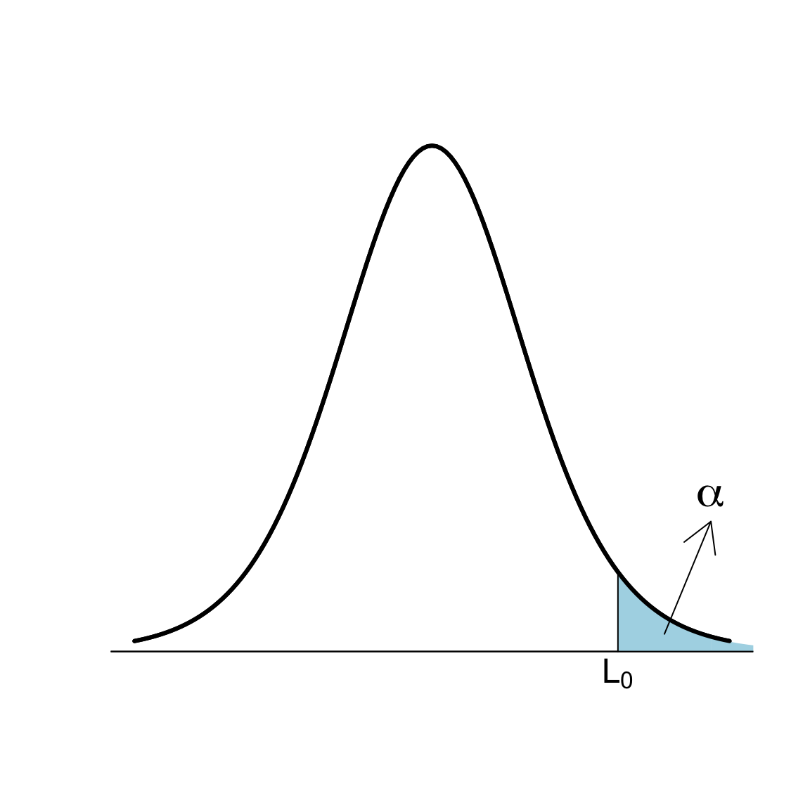


En este caso, una opción mejor es dibujar un **q-q-plot**. Un **q-q-plot** de una muestra y una distribución teórica es el gráfico de los llamados **q-q-puntos**: los puntos de la forma *($q$-cuantil de la distribución, $q$-cuantil de la muestra)*, para varios valores de $q$.

Si la muestra proviene de la distribución usada para dibujar el q-q-plot, es de esperar que el q-cuantil de la muestra sea muy parecido al q-cuantil de la distribución y por lo tanto que estos q-q-puntos estén cerca de la diagonal principal $y=x$.

La función `qqPlot` del paquete **car** produce unos q-q-plots adecuados que además muestran una "región de confianza del 95%", con el significado usual de nivel de confianza (para el 95% de las muestras de la distribución, los q-q-plot caen dentro de esta región; por lo tanto, si nuestro q-q-plot está completamente dentro de esta región, aceptamos con este nivel de confianza que proviene de la distribución usada). 


```r
require(car)
qqPlot(Oatbran, distribution="norm", mean=mean(Oatbran), sd=sd(Oatbran),
        ylab="Cuantiles de OATBRAN", xlab="Cuantiles de normal", pch=20, id=FALSE)
qqPlot(Cornflake, distribution="norm", mean=mean(Cornflake),sd=sd(Cornflake),
       ylab="Cuantiles de CORNFLK", xlab="Cuantiles de normal", pch=20, id=FALSE)
```

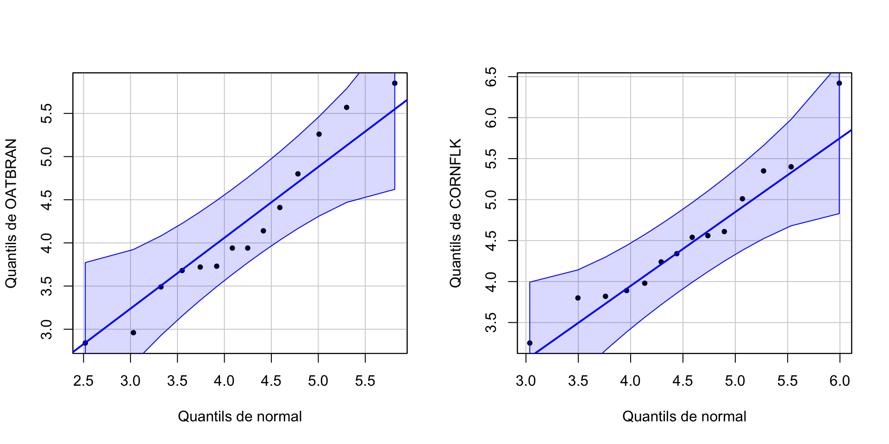

Aceptamos por lo tanto que nuestros datos provienen de dos distribuciones normales: podemos usar un test t de dos medias.

En este caso, el test t es de muestras emparejadas (hemos medido las dos variable aleatorias sobre los mismos individuos), por lo que tenemos que especificar `paired=TRUE` y no tenemos que especificar el parámetro `var.equal`. Usaremos el parámetro `alternative="less"` para indicar que el test es unilateral: la hipótesis alternativa es que la media de la primera variable es más pequeña que la de la segunda.


```r
t.test(Oatbran, Cornflake, alternative="less", paired=TRUE)
```

```
## 
## 	Paired t-test
## 
## data:  Oatbran and Cornflake
## t = -3.3195, df = 13, p-value = 0.002768
## alternative hypothesis: true difference in means is less than 0
## 95 percent confidence interval:
##        -Inf -0.1626132
## sample estimates:
## mean of the differences 
##              -0.3485714
```

Obtenemos un p-valor de 0.003. Por lo tanto, hemos encontrado evidencia estadísticamente significativa de que desayunar salvado reduce el nivel medio de colesterol respecto de desayunar  copos de maíz. El intervalo de confianza del 95% para $\mu_{ob}-\mu_{cf}$ va de $-\infty$ a -0.163. Por lo tanto, tenemos un 95% de confianza en que desayunar salvado reduce en al menos 0.163 mmol/l el nivel medio de colesterol respecto de desayunar  copos de maíz.

¿Y si no quisiéramos, o no pudiéramos, suponer que las muestras provienen de distribuciones normales? Entonces usaríams un test de Wilcoxon:


```r
wilcox.test(Oatbran, Cornflake, alternative="less", paired=TRUE)
```

```
## 
## 	Wilcoxon signed rank test with continuity correction
## 
## data:  Oatbran and Cornflake
## V = 12, p-value = 0.006008
## alternative hypothesis: true location shift is less than 0
```

El p-valor da 0.006, por lo que la conclusión es la misma, pero no nos da intervalo de confianza.

<!--
\BeginKnitrBlock{example}<div class="example"><span class="example" id="exm:fototerapia"><strong>(\#exm:fototerapia) </strong></span>La fototerapia, ¿es más eficaz  como tratamiento del eccema atípico que un placebo?
  
</div>\EndKnitrBlock{example}

Para comprobar la eficacia de la fototerapia como tratamiento del eccema atípico, se tomaron 10 pacientes con un eccema de más de 9 meses y se los trató durante dos periodos de 3 semanas (ordenados aleatoriamente y separados por un periodo de recuperación) con un placebo y con fototerapia.

Después de cada periodo de tratamiento, se evaluó en cada paciente  la importancia del eccema en una escala de 0 (no eccema) a 10 (máximo eccema). Resultados:
\begin{center}
\begin{tabular}{l|cccccccccc}
Placebo&6&8&3&8&5&6&5&6&4&5\\\hline
Fototerapia&5&6&4&5&3&5&6&2&2&6
\end{tabular}
\end{center}


\frametitle{Ejemplo 4}

**Variables aleatorias de interés}:
\begin{itemize}
* $X_1$: Importancia del eccema tras la fototerapia, de media $\mu_1$
* $X_2$: Importancia del eccema tras el placebo, de media $\mu_2$
\end{itemize}

**Contraste}:
$$
\left\{\begin{array}{l}
H_{0}:\mu_1=\mu_2\\
H_{1}:\mu_1< \mu_2
\end{array}\right.
$$

**Datos}: La tabla anterior. Observad que es un contraste con muestras emparejadas.

Como la muestra es pequeña y no sabemos si $X_1$ y $X_2$ son normales (en realidad, son ordinales), usaremos el test de Wilcoxon


[fragile]
\frametitle{Ejemplo 4}

\begin{lstlisting}
> X.fot=c(5,6,4,5,3,5,6,2,2,6)
> X.pl=c(6,8,3,8,5,6,5,6,4,5)
> wilcox.test(X.fot, X.pl, 
   alternative="less",paired=TRUE)
	Wilcoxon signed rank test with continuity correction

data:  X.fot and X.pl
V = 9, p-value = 0.03116
alternative hypothesis: true location shift is less than 0
\end{lstlisting}


**Conclusión}: Como el \blue{p-valor $=0.03<0.005$}, concluimos a este nivel de significación que la fototerapia es, de media, más efectiva que el placebo
-->


## Contrastes de varianzas


\frametitle{F-test para varianzas}

Sean $X_1,X_2$ dos variables aleatorias  normales de desviaciones típicas $\sigma_1$, $\sigma_2$


Nos interesa el contraste
$$
\left\{\begin{array}{l}
H_{0}:\sigma_1=\sigma_2\\
H_{1}:\sigma_1\neq \sigma_2
\end{array}
\right.
\mbox{ o, equivalentemente, }
\left\{\begin{array}{l}
H_{0}:\sigma_1^2=\sigma_2^2\\
H_{1}:\sigma_1^2\neq \sigma_2^2
\end{array}
\right.$$
En este caso se usa el **F-test}, basado en el estadístico $\widetilde{S}^2_{X_1}/\widetilde{S}^2_{X_2}$ que (si $H_0$ es cierta) tiene una distribución conocida (la **F de Fisher-Snedecor}, `f} con R)

Implementado en la función **`var.test}} de R: se aplica a las dos muestras, con sintaxis similar a `t.test}


\frametitle{Tests no paramétricos}

El test F-test no sirve a poco que las variables difieran de normales

En este caso, es necesario usar un test no paramétrico

Os recomendamos usar el **test de Fligner-Killeen}, implementado en R en la función **`fligner.test}},  que en la práctica ha mostrado  ser más exacto (mayor suma de especificidad y sensibilidad) para variables aleatorias  muy diferentes de normales


[fragile]
\frametitle{Ejemplo 4}\vspace*{-1ex}

\blue{Las variables $X_h$ y $X_m$ del Ejemplo 2, ¿tienen la misma varianza?}
Vamos a suponer que ambas son normales (los temperaturas lo suelen ser)

\begin{lstlisting}
> var.test(X_h, X_m)

	F test to compare two variances

data:  X_h and X_m
F = 1.2016, num df = 113, denom df = 115, p-value = 0.3278
alternative hypothesis: true ratio of variances is not equal to 1
95 percent confidence interval:
 0.8311002 1.7384230
sample estimates:
ratio of variances 
          1.201637 
\end{lstlisting}


 
\frametitle{Ejemplo 4} 

**Conclusión}: 
\begin{itemize}
* Como \blue{p-valor $=0.33>0.1$}, no podemos rechazar que $X_h$ y $X_m$ tengan la misma varianza: aceptaremos que tienen igual varianza

* El \blue{IC 95\%} **para el cociente de las varianzas} \blue{va de 0.83 a 1.74}: como contiene el 1, concluimos de nuevo, con este nivel de confianza, que no podemos rechazar que $X_h$ y $X_m$ tengan la misma varianza (aunque también podría ser que $\sigma^2_{X_h}$ fuera un 70\% mayor que $\sigma^2_{X_m}$)
\end{itemize}

Por lo tanto, si los tests t con `var.equal=TRUE} y  `var.equal=FALSE} hubieran dado conclusiones diferentes, tomaríamos la correspondiente a varianzas iguales


 
\frametitle{Ejemplo 4}\vspace*{-1ex}

\blue{Las variables $X_m$ y $X_f$ del Ejemplo 2, ¿tienen la misma varianza?}

¿Era adecuado suponer que provienen de distribuciones normales?\vspace*{-2ex}

\begin{center}
\hspace*{-0.5cm}
\includegraphics[width=0.5\linewidth]{histTM}\
\includegraphics[width=0.5\linewidth]{histTF}
\end{center} 


 
\frametitle{Ejemplo 4}\vspace*{-1ex}

\blue{Las variables $X_m$ y $X_f$ del Ejemplo 2, ¿tienen la misma varianza?}

¿Era adecuado suponer que provienen de distribuciones normales?\vspace*{-2ex}

\begin{center}
\hspace*{-0.5cm}
\includegraphics[width=0.5\linewidth]{qqplotTM}\
\includegraphics[width=0.5\linewidth]{qqplotTF}
\end{center}\vspace*{-3ex}

Mejor usar un test no paramétrico, para mayor seguridad


[fragile]
\frametitle{Ejemplo 4}\vspace*{-1ex}

\begin{lstlisting}
> fligner.test(list(X_h,X_m))

	Fligner-Killeen test of homogeneity of variances

data:  list(X_h, X_m)
Fligner-Killeen:med chi-squared = 1.7736, 
    df = 1, p-value = 0.1829
\end{lstlisting}
Aceptamos que $X_h$ y $X_m$ tienen la misma varianza


\subsection{Tests para proporciones}


\frametitle{Test exacto para una proporción}

Sea $X$ una variable aleatoria Bernoulli de parámetro $p$

Queremos realizar un contraste
$$
\left\{\begin{array}{l}
H_{0}:p=p_0\\ 
H_{1}:p\neq p_0\text{ o }p> p_0\text{ o }p< p_0
\end{array}
\right.
$$

Podemos usar el **test binomial exacto}, que contrasta si el número de éxitos en una muestra de tamaño $n$ tiene distribución $B(n,p_0)$

Está implementado en la función **`binom.test}} de R: se aplica al número de éxitos, el tamaño de la muestra, el valor a contrastar $p_0$ y el nivel de confianza (por defecto, 0.95)


\frametitle{Test aproximado para una proporción}

En la situación anterior, si el tamaño $n$ de la muestra es grande  ($\geq 30$ o mejor **$\geq 40$}), podemos usar el **test aproximado}, que usa que, si $H_0$ es verdadera y $n$ grande,
$$
\frac{\widehat{p}_X-p_0}{\sqrt{\frac{\widehat{p}_X(1-\widehat{p}_X)}{n}}}\approx N(0,1)
$$

Está implementado en la función **`prop.test}} de R con la misma sintaxis que  `binom.test}


Es más popular 


\frametitle{Ejemplo 5}

\blue{La proporción de estudiantes zurdos en la UIB, ¿es diferente de la del estado español?}

El porcentaje estimado de zurdos en España es del 10\%. 

De 30 estudiantes de la UIB encuestados al azar, 1 ha sido zurdo.

Sea $p$ la proporción de estudiantes zurdos en la UIB.

**Contraste:}
$$
\left\{
\begin{array}{l}
H_0:p=0.1\\
H_1:p\neq 0.1
\end{array}
\right.
$$

**Datos}: Nuestra muestra


[fragile]
\frametitle{Ejemplo 5}\vspace*{-1ex}

Como  la muestra es relativamente grande ($n=30$) vamos a usar de entrada `prop.test}.
\begin{lstlisting}
> prop.test(1,30,p=0.1,alternative="two.sided")

	1-sample proportions test with continuity correction

data:  1 out of 30, null probability 0.1
X-squared = 0.83333, df = 1, p-value = 0.3613
alternative hypothesis: true p is not equal to 0.1
95 percent confidence interval:
 0.001742467 0.190530216
sample estimates:
         p 
0.03333333 
\end{lstlisting}


\frametitle{Ejemplo 5}

**Conclusión}: 
\begin{itemize}
* Como \blue{p-valor $=0.36$}, no podemos rechazar que la proporción de zurdos en la UIB sea del 10\%


* Hemos obtenido un \blue{IC 95\%} para la proporción de zurdos en la UIB \blue{de 0.002 a 0.19}, que contiene el 0.1 


* La proporción estimada de zurdos en la UIB es del 3\%. Aunque no sea significativamente diferente del 10\% desde un punto de vista estadístico, la diferencia parece importante. Posiblemente el test tenga poca potencia (**\sl underpowered}).
\end{itemize}


[fragile]
\frametitle{Ejemplo 5}

Potencia?

\begin{lstlisting}
> library(pwr)
> ES.h(0.1,0.03)  #El tamaño del efecto observado
[1] 0.2953351
> cohen.ES(test="p",size="small") #Para determinarlo a priori

...
    effect.size = 0.2

> pwr.p.test(h=0.3, n=30, sig.level=0.05, 
   alternative="two.sided")

...
          power = 0.3758563
\end{lstlisting}


[fragile]
\frametitle{Ejemplo 5}\vspace*{-1ex}

¿Qué hubiera pasado con una muestra de 150 estudiantes, 5 de ellos zurdos?
\begin{lstlisting}
> prop.test(5,150,p=0.1,alternative="two.sided")

	1-sample proportions test with continuity correction

data:  5 out of 150, null probability 0.1
X-squared = 6.6852, df = 1, p-value = 0.009722
alternative hypothesis: true p is not equal to 0.1
95 percent confidence interval:
 0.01233588 0.08010876
sample estimates:
         p 
0.03333333 
\end{lstlisting}


[fragile]
\frametitle{Ejemplo 5}\vspace*{-1ex}

¿Qué hubiera pasado con una muestra de 150 estudiantes, 5 de ellos zurdos?
\begin{lstlisting}
> pwr.p.test(h=0.3,n=150,sig.level=0.05,alternative="two.sided")

     proportion power calculation for binomial distribution (arcsine transformation) 

              h = 0.3
              n = 150
      sig.level = 0.05
          power = 0.9567605
    alternative = two.sided
\end{lstlisting}


[fragile]
\frametitle{Ejemplo 5}\vspace*{-1ex}

¿Cuál hubiera sido la conclusión usando el test binomial?
\begin{lstlisting}
> binom.test(1, 30,p=0.1,alternative="two.sided")
	
       Exact binomial test

data:  1 and 30
number of successes = 1, number of trials = 30, p-value = 0.3592
alternative hypothesis: true probability of success is not equal to 0.1
95 percent confidence interval:
 0.0008435709 0.1721694556
sample estimates:
probability of success 
            0.03333333 
\end{lstlisting}

p-valor $=0.36$, IC 95\% de 0.0008 a 0.17; misma conclusión


\frametitle{Tests per a 2 proporcions independents}

Siguin $X_1$ i $X_2$ dues variables aleatorias Bernoulli de paràmetres $p_1$ i $p_2$


Les mesurem sobre dues mostres independents

Volem realitzar un contrast
$$
\left\{\begin{array}{l}
H_{0}:p_1=p_2\\ 
H_{1}:p_1
eq p_2\text{ o }p_1> p_2\text{ o }p_1< p_2
\end{array}

ight.
$$


\frametitle{Tests para dos proporciones independientes}

Sean $X_1$ y $X_2$ dos variables aleatorias Bernoulli de parámetros $p_1$ y $p_2$


Las medimos sobre dos muestras independientes

Queremos realizar un contraste
$$
\left\{\begin{array}{l}
H_{0}:p_1=p_2\\ 
H_{1}:p_1\neq p_2\text{ o }p_1> p_2\text{ o }p_1< p_2
\end{array}
\right.
$$


\frametitle{Tests para dos proporciones independientes}

Cuando las muestras son grandes, podemos usar el **test $\chi^2$}, implementado también en la función **`prop.test}} de R (ya hablaremos de este test más adelante): se aplica a la tabla de frecuencias absolutas de las muestras
\begin{center}
\begin{tabular}{l|c|c|}
&  $X_1$  & $X_2$ \\ \hline
Éxitos  & $a$ &     $b$ \\\hline
Fracasos & $c$ &  $d$\\  \hline
\end{tabular}
\end{center}
en forma de matriz o de tabla de contingencia


\frametitle{Tests para dos proporciones independientes}

Por otro lado, \blue{\bf siempre} podemos usar el **test exacto de Fisher}, implementado en la función **`fisher.test}}: de nuevo, se aplica a la tabla de frecuencias absolutas de las muestras


**\bf Pero cuidado}: El test de Fisher en realidad no compara las proporciones $p_1$ y $p_2$, sino sus \blue{odds}
$$
\frac{p_1}{1-p_1}\mbox{ y }\frac{p_2}{1-p_2}
$$
y el intervalo de confianza que da es para el cociente de estas odds: para su  \blue{odds ratio}


\frametitle{Ejemplo 6}

\blue{¿Hay asociación positiva entre bronquitis en la infancia y tos en la adolescencia?}

En un estudio transversal, se tomaron 1319 niños de 14 años, se miró si en ese momento tenían tos crónica y si a los 5 años habían tenido bronquitis. El resultado fue la tabla siguiente:
\begin{center}
\begin{tabular}{l|l|c|c|}
\multicolumn{2}{c}{\ } &  \multicolumn{2}{c}{Bronquitis a los 5 años}\\ \cline{3-4}
\multicolumn{2}{c|}{\ }  & \hspace*{0.75cm}Sí\hspace*{0.75cm} & \hspace*{0.75cm}No\hspace*{0.75cm} \\ \cline{2-4}
Tos a los   & Sí  & 26 &     44 \\\cline{2-4}
14 años & No & 247 &            1002\\ \cline{2-4}
\end{tabular}
\end{center}


\frametitle{Ejemplo 6}

**Variables aleatorias de interés}:
\begin{itemize}
* $X_1$: Que un niño que tuvo bronquitis a los 5 años, tenga tos a los 14, de proporción poblacional $p_1$
* $X_2$:  Que un niño que no tuvo bronquitis a los 5 años, tenga tos a los 14, de proporción poblacional $p_2$
\end{itemize}

**Contraste}:
$$
\left\{\begin{array}{l}
H_{0}:p_1=p_2\\
H_{1}:p_1>p_2
\end{array}\right.
$$

**Datos}: La tabla anterior


[fragile]
\frametitle{Ejemplo 6}\vspace*{-1ex}

Las muestras son grandes, usaremos `prop.test}

\begin{lstlisting}
> Datos=matrix(c(26,44,247,1002),nrow=2,byrow=TRUE)
> Datos
     [,1] [,2]
[1,]   26   44
[2,]  247 1002
> prop.test(Datos,alternative="greater")
 ...
 X-squared = 11.145, df = 1, p-value = 0.0004212
alternative hypothesis: greater
95 percent confidence interval:
 0.06934186 1.00000000
sample estimates:
   prop 1    prop 2 
0.3714286 0.1977582 
\end{lstlisting}


\frametitle{Ejemplo 6}

**Conclusión}: 
\begin{itemize}
* El \blue{p-valor $0.0004$} permite concluir que hay evidencia significativa de que  la tos a los 14 años es más prevalente entre los niños que tuvieron bronquitis a los 5 años que entre los que no

* El \blue{IC 95\%} para la diferencia de proporciones \blue{va de 0.07 a 1}, de lo que podemos concluir, a este nivel de confianza, que  $p_1-p_2>0.07$, es decir, que el riesgo de tos a los 14 años atribuible a tener bronquitis a los 5 es de como mínimo 7 puntos porcentuales 

* El riesgo estimado de tos a los 14 años atribuible a tener bronquitis a los 5 ha sido 
$0.37-0.20=0.17$: 17 puntos porcentuales
\end{itemize}


[fragile]
\frametitle{Ejemplo 6}\vspace*{-1ex}

Veamos con el test de Fisher

\begin{lstlisting}
> fisher.test(Datos, alternative="greater")

        Fisher's Exact Test for Count Data

data:  Datos
p-value = 0.0008325
alternative hypothesis: true odds ratio is greater than 1
95 percent confidence interval:
 1.509463      Inf
sample estimates:
odds ratio 
   2.39519 
\end{lstlisting}


\frametitle{Ejemplo 6}

**Conclusión}: 
\begin{itemize}
* El \blue{p-valor $0.0008$} permite concluir que hay evidencia significativa de que las odds (y por tanto, la probabilidad) de  tos a los 14 años son mayores entre los niños que tuvieron bronquitis a los 5 años que entre los que no

* El \blue{IC 95\%} **para la odds ratio} \blue{va de 1.5 a $\infty$}, de lo que  podemos concluir, a este nivel de confianza, que las odds de tos a los 14 años entre los niños que tuvieron bronquitis a los 5 años son como mínimo un 50\% mayores que entre los que no 

* La odds ratio estimada de tos a los 14 años para los niños que tuvieron bronquitis a los 5 ha sido de 2.4
\end{itemize}


\frametitle{Tests para dos proporciones emparejadas}

Sean $X_1$ y $X_2$ dos variables aleatorias Bernoulli de parámetros $p_1$ y $p_2$


Las medimos sobre los sujetos de una misma muestra de tamaño $n$, o sobre los sujetos de dos muestras del mismo tamaño $n$ con un emparejamiento definido entre los mismos (e.g., gemelos)

Queremos realizar un contraste
$$
\left\{\begin{array}{l}
H_{0}:p_1=p_2\\ 
H_{1}:p_1\neq p_2
\end{array}
\right.
$$


\frametitle{Tests para dos proporciones emparejadas}

Cuando $n$ es grande ($\geq 100$) y el número de \emph{casos discordantes} ($b+c$ en la tabla inferior) es razonablemente grande ($\geq 20$), podemos usar el  \emph{test de McNemar}, que usa el estadístico
$$
Z^2=\frac{(b-c)^2}{b+c}\approx \chi^2_1
$$
Está implementado en la función **`mcnemar.test}}: se aplica a la tabla de frecuencias absolutas siguiente:
\begin{center}
\begin{tabular}{l|l|c|c|}
\multicolumn{2}{c}{\ } &  \multicolumn{2}{c}{Variable $X_1$}\\ \cline{3-4}
\multicolumn{2}{c|}{\ }  & \hspace*{0.25cm}Sí\hspace*{0.25cm} & \hspace*{0.25cm}No\hspace*{0.25cm} \\ \cline{2-4}
Variable & Sí  & $a$ &     $b$ \\\cline{2-4}
$X_2$ & No & $c$ &     $d$\\ \cline{2-4}
\end{tabular}
\end{center}


\frametitle{Ejemplo 7}\vspace*{-2ex}


\blue{Si en el tratamiento del cáncer de mama, a la quimioterapia perioperatoria y la  mastectomía le añadimos quimioterapia postoperatoria durante 6 meses, ¿hay diferencia en la tasa de supervivencia 5 años?}

**Variables aleatorias de interés}:
\begin{itemize}
* $X_1$: Que una paciente tratada con mastectomía y quimioterapia perioperatoria sobreviva 5 años, de proporción poblacional $p_1$
* $X_2$:   Que una paciente tratada con mastectomía, quimioterapia perioperatoria y postoperatoria sobreviva 5 años, de proporción poblacional $p_2$
\end{itemize}

**Contraste}:
$$
\left\{\begin{array}{l}
H_{0}:p_1=p_2\\
H_{1}:p_1\neq p_2
\end{array}\right.
$$


\frametitle{Ejemplo 7}\vspace*{-1ex}

**Datos}: En un ensayo clínico, se trató un grupo de 1244 pacientes, emparejadas según diferentes características.  En cada pareja se repartieron los dos tratamientos al azar:  quimioterapia perioperatoria y mastectomía o quimioterapia perioperatoria y mastectomía y quimioterapia postoperatoria durante 6 meses. 

Supervivencia a los 5 años de las parejas de pacientes:\vspace*{-1ex}

\begin{center}
\begin{tabular}{l|l|c|c|}
\multicolumn{2}{c}{\ } &  \multicolumn{2}{c}{No quimio postperatoria}\\ \cline{3-4}
\multicolumn{2}{c|}{\ }  & \hspace*{0.75cm}Sí\hspace*{0.75cm} & \hspace*{0.75cm}No\hspace*{0.75cm} \\ \cline{2-4}
Quimio & Sí  & 510 &     17 \\\cline{2-4}
postoperatoria & No & 5 &       90\\ \cline{2-4}
\end{tabular}
\end{center}
$$
\widehat{p}_1=\frac{515}{622}=0.828\quad
\widehat{p}_2=\frac{527}{622}=0.847
$$


[fragile]
\frametitle{Ejemplo 7}\vspace*{-1ex}

La muestra es grande, y el número de casos discordantes supera (por poco) los 20, usaremos `macnemar.test}

\begin{lstlisting}
> Datos.C=matrix(c(510,17,5,90),nrow=2,byrow=TRUE)
> mcnemar.test(Datos.C)

        McNemar's Chi-squared test with 
        continuity correction

data:  Datos.C
McNemar's chi-squared = 5.5, df = 1, p-value = 0.01902
\end{lstlisting}

El \blue{p-valor $0.02$} permite concluir que hay evidencia significativa de que hay diferencia en las tasas de supervivencia a los 5 años.


\frametitle{Abrir en caso de desesperación}

Si no podéis usar el test de McNemar, siempre podéis usar el \emph{test binomial exacto}, que simplemente contrasta si las probabilidades poblacionales de los pares (Sí,No) y (No,Sí) son la misma, 0.5.

Convenientemente implementado en la función  **`mcnemar.exact}} del paquete `exact2x2}

**\bf Cuidado}: El intervalo de confianza que calcula esta función es para una estimación de la  \blue{odds ratio} que además no es la que hemos explicado en clase. **Mirad solo el p-valor}.


[fragile]
\frametitle{Ejemplo 7}\vspace*{-1ex}

\begin{lstlisting}
> #Instalamos y cargamos el paquete exact2x2
...
> mcnemar.exact(Datos.C)

         Exact McNemar test (with central 
         confidence intervals)

data:  Datos.C
b = 17, c = 5, p-value = 0.0169
alternative hypothesis: true odds ratio is not equal to 1
95 percent confidence interval:
  1.204082 11.786700
sample estimates:
odds ratio 
       3.4 
\end{lstlisting}

El \blue{p-valor} es  $0.017$


<!--chapter:end:52-Contrastos2.Rmd-->

